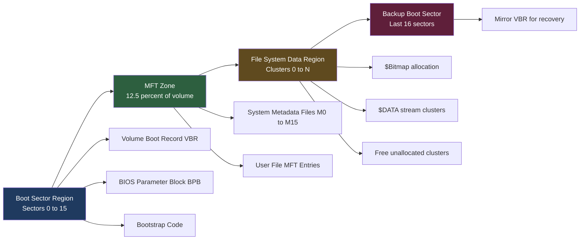
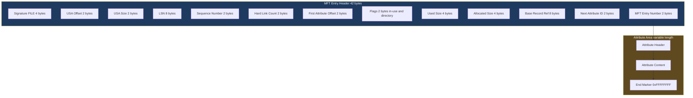
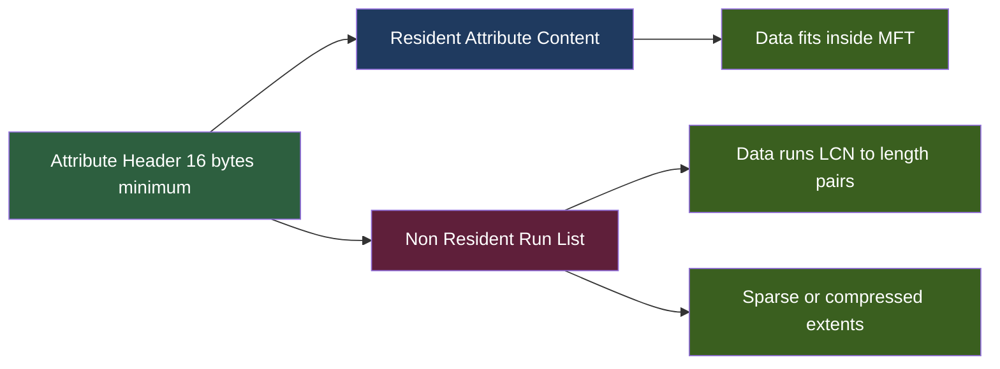
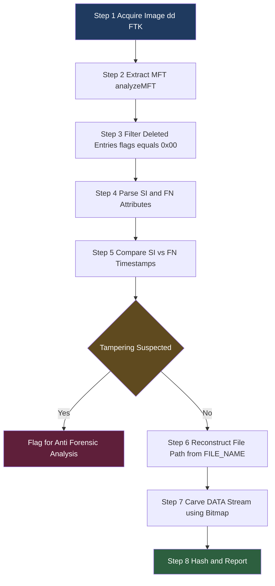

# NTFS (New Technology File System)

<!-- SECTION_1_START -->
# NTFS (New Technology File System) — Core Definition & Intuitive Overview

## 1.1 Formal Definition

> [!IMPORTANT]
> **NTFS (New Technology File System)** is the proprietary journaling file system developed by Microsoft, first introduced with **Windows NT 3.1 in 1993**. It organises every file, directory, and metadata element on a logical volume as a structured collection of **attributes** stored within a central index called the **Master File Table ($MFT)**. NTFS incorporates advanced capabilities — file-level security via **ACLs**, **Alternate Data Streams (ADS)**, **encryption (EFS)**, **compression**, and **transactional journaling** — making it the dominant forensic artifact source on modern Windows systems.

For a forensic examiner, NTFS is not just a way to store files; it is a **forensic evidence goldmine**. Almost every action a user takes on a Windows system leaves a trace somewhere in NTFS metadata — timestamps, attribute changes, journal entries, or alternate streams.

## 1.2 Conceptual Analogy

Imagine a **massive library** where every book, every magazine, every pamphlet is catalogued in a single master register. The register is so detailed that for every item it records:

- The exact shelf row and column where the book physically sits.
- Who created the catalogue entry and when.
- Every time the book was opened, photocopied, or moved.
- Even secret pocket inserts (alternate data streams) hidden inside the book.

That master register is the **$MFT (Master File Table)**, the books are your **files and folders**, and the library is your **NTFS volume**. Unlike older systems (FAT) which keep the master index separate and minimal, NTFS places the index on the volume itself — meaning the index *also* contains traces of its own evolution.

> [!NOTE]
> **Key Forensic Insight:** Because NTFS is **journaled**, every change is *logged before it is committed*. This gives examiners recoverable trails even when files are deleted, volumes are quick-formatted, or systems are improperly shut down.

## 1.3 Standard NTFS Volume Metrics

| Metric | Default Value |
|---|---|
| **Default cluster size** | **4 KB** (4096 bytes) |
| **Default MFT entry size** | **1024 bytes** |
| **Maximum file size** | **$2^{64}$ bytes (16 EB)** |
| **Maximum volume size** | **$2^{64}$ clusters** |
| **Default timestamps** | **$64$-bit FILETIME (100-ns intervals since 1601)** |

## 1.4 Visualisation Callout

> [!VISUALIZATION CONTROL]
> **Concept:** Linear layout of an NTFS volume from the first sector to the end.
> **GeoGebra / Desmos Input Equations (conceptual):**
> * `sector(x) = 0 <= x <= 15` → Boot Sector and boot code
> * `mft_zone(x) = 16 <= x <= MFT_RESERVED` → $MFT zone
> * `cluster(x) = x mod 8 = 0` → Cluster boundary markers
> **Visual Description:** Plot the disk as a horizontal axis of increasing sector numbers. The first 16 sectors form the **boot region**. The $MFT zone (reservable 12.5% of volume by default) follows, where the Master File Table resides. The user data region occupies the remainder, with $Bitmap tracking which clusters are in use.

---

<!-- SECTION_2_START -->
# Deep Theoretical Analysis & High-Yield NTFS Forensics Cheat Sheet

## 2.1 NTFS Volume Architecture (Top-Down Breakdown)

An NTFS volume is divided into four logical regions:

1. **Boot Sector Region (Sectors 0–15)**
   - Contains the Volume Boot Record (VBR), BIOS Parameter Block (BPB), and bootstrap code.
   - Holds OEM ID `"NTFS    "` and **bytes per sector = 512** (or 4096 on Advanced Format drives).
   - Critical for **forensic identification of the file system type** on unknown media.

2. **Master File Table ($MFT) Region**
   - Pre-reserved area (typically 12.5% of volume) where $MFT entries grow.
   - Contains system metadata files **($MFT itself, $MFTMirr, $LogFile, $Volume, $AttrDef, ., $Bitmap, $Boot, $BadClus, $Secure, $UpCase, $Extend)** and one entry per user file/directory.

3. **File System Data Region**
   - Holds actual file contents, directories, and remaining cluster allocations.
   - $Bitmap tracks free/used clusters — a 1 bit per cluster.

4. **Backup Boot Sector (Last 16 sectors)**
   - Mirror of the boot sector for recovery — a powerful forensic source for **anti-forensics detection** (e.g., comparing primary vs. backup boot sectors to detect tampering).

## 2.2 System Metadata Files (The M0–M15 Zone)

> [!IMPORTANT]
> The first **16 records** of the $MFT are reserved for the operating system itself. They are *never* allocated to user files. Forensic tools like `analyzeMFT` parse these to validate volume integrity.

| Index | File Name | Forensic Purpose |
|---|---|---|
| **$MFT (M0)** | Master File Table | Index of every file/dir on the volume |
| **$MFTMirr (M1)** | MFT Mirror | Copy of first 4 $MFT entries at volume midpoint |
| **$LogFile (M2)** | Journal Log | Transactional log; **key for incident reconstruction** |
| **$Volume (M3)** | Volume Information | Volume label, NTFS version, dirty flag |
| **$AttrDef (M4)** | Attribute Definitions | Defines all valid attribute types and flags |
| **. (M5)** | Root Directory | Root of the directory tree |
| **$Bitmap (M6)** | Cluster Bitmap | Allocation status of every cluster |
| **$Boot (M7)** | Boot Sector File | Holds the VBR |
| **$BadClus (M8)** | Bad Cluster File | Lists known bad clusters |
| **$Secure (M9)** | Security Descriptors | SIDs, ACLs of files |
| **$UpCase (M10)** | Up-Case Table | Unicode uppercase mapping |
| **$Extend (M11)** | Extension Container | Holds $UsnJrnl, $Quota, $ObjId, $Reparse |
| *(M12–M15)* | Reserved | Reserved for future use |

## 2.3 The Master File Table ($MFT) Entry Structure

Each MFT entry is **1024 bytes** (can be 4096 on large volumes) and has two parts:

### Header (First 42 bytes)

| Offset | Size (Bytes) | Field | Meaning |
|---|---|---|---|
| 0x00 | 4 | Signature `"FILE"` | Magic number — must be 0x46494C45 |
| 0x04 | 2 | Update Sequence Array Offset | Points to fixup array |
| 0x06 | 2 | Update Sequence Array Size | Size in words |
| 0x08 | 8 | LogFile Sequence Number ($LSN$) | Monotonic counter from $LogFile |
| 0x10 | 2 | Sequence Number | Increments on MFT entry reuse |
| 0x12 | 2 | Hard Link Count | Number of directory links |
| 0x14 | 2 | First Attribute Offset | Beginning of attribute area |
| 0x16 | 2 | Flags (in-use $\vert$ directory) | 0x01 = in use, 0x02 = directory |
| 0x18 | 4 | Used Size of Entry | Bytes actually used |
| 0x1C | 4 | Allocated Size | Always 1024 |
| 0x20 | 8 | File Reference to Base Record | Points to base MFT entry (for ext attrs) |
| 0x28 | 2 | Next Attribute ID | Next free attribute ID |
| 0x2A | 2 | MFT Entry Number (Win XP+) | Self-reference |

### Attribute Zone

A sequence of **Attribute Headers + Attribute Content**, terminated by the **end marker `0xFFFFFFFF`**.

## 2.4 Common NTFS Attribute Types (The Forensic Codex)

| Type ID | Name | Forensic Value |
|---|---|---|
| **0x10** | `$STANDARD_INFORMATION` | 4 timestamps: created, modified, MFT modified, accessed |
| **0x20** | `$ATTRIBUTE_LIST` | Pointer to additional MFT entries (ext attrs) |
| **0x30** | `$FILE_NAME` | Filename, parent dir ref, **2nd set of timestamps** (FN timestamp != SI timestamp ⇒ anti-forensic tampering suspected) |
| **0x40** | `$OBJECT_ID` | 16-byte GUID — links to Office/Windows artifacts |
| **0x50** | `$SECURITY_DESCRIPTOR` | Owner SID, DACL, SACL |
| **0x60** | `$VOLUME_NAME` | Volume label string |
| **0x70** | `$VOLUME_INFORMATION` | NTFS version, dirty flag |
| **0x80** | `$DATA` | Actual file content (the "real" data) — supports **ADS** when named |
| **0x90** | `$INDEX_ROOT` | Root of B-tree index for small directories |
| **0xA0** | `$INDEX_ALLOCATION` | B-tree nodes for large directories |
| **0xB0** | `$BITMAP` | Index buffer bitmap for $MFT-resident index |
| **0xC0** | `$REPARSE_POINT` | Symbolic links, OneDrive placeholders |
| **0x100** | `$LOGGED_UTILITY_STREAM` | EFS, $TXF_DATA |

## 2.5 Resident vs. Non-Resident Attributes

> [!NOTE]
> **Resident attributes** store data directly *inside* the MFT entry (size $\le$ ~700 bytes). **Non-resident attributes** store data runs in clusters outside the MFT, described by **data run lists** (LCN, length pairs).

For a forensic investigator, this distinction matters because:
- A **deleted small file** with all attributes resident leaves its name and timestamps **entirely inside the MFT entry**, recoverable from unallocated MFT space.
- A **deleted large file** leaves only its `$FILE_NAME` resident; the `$DATA` content must be carved from free clusters.

## 2.6 Time Stamps — The Four Pillars of NTFS Forensics

Every file has **eight** timestamps on NTFS: four in `$STANDARD_INFORMATION` and four in `$FILE_NAME`. The $SI$ set is user-modifiable (via API), the $FN$ set is OS-managed and **cannot be directly modified by normal user tools** without low-level disk access — this is why anti-forensic timestamp tampering is detectable by comparing the two.

| Timestamp | Set | Update Trigger |
|---|---|---|
| Creation | SI & FN | File created |
| Modification | SI & FN | File content written |
| MFT Modification | SI & FN | Any attribute change (rename, ACL, etc.) |
| Last Access | SI only | File opened, copied, etc. (often disabled by defrag) |

---

<!-- SECTION_3_START -->
# Step-by-Step Derivations, Decoding & Python Implementation

## 3.1 Derivation: How a Forensic Tool Detects Deleted MFT Entries

A **deleted MFT entry** is identified by the byte at offset `0x16` (Flags) being `0x00` (in-use flag cleared) **and** the sequence number incremented. The original file is recoverable as long as the MFT entry has not been reused.

**Decision logic for a forensic parser:**

$$
\text{is\_deleted} = \begin{cases}
\text{True} & \text{if } \text{flags} \,\&\, \text{0x01} \,=\, 0 \\
\text{False} & \text{otherwise}
\end{cases}
$$

**Decision logic for active directory:**

$$
\text{is\_directory} = \begin{cases}
\text{True} & \text{if } \text{flags} \,\&\, \text{0x02} \,=\, 0\text{x02} \\
\text{False} & \text{otherwise}
\end{cases}
$$

**Timestamp derivation from FILETIME:**

FILETIME stores 100-nanosecond intervals since 1601-01-01 00:00:00 UTC. To convert to Unix time, subtract the offset of 11644473600 seconds:

$$
T_{\text{unix}} \,=\, \frac{T_{\text{filetime}}}{10\,000\,000} \,-\, 11\,644\,473\,600
$$

## 3.2 Step-by-Step MFT Entry Header Decode (Worked Example)

Given the first 42 bytes of an MFT entry (in hexadecimal):

```
46 49 4C 45  30 00 03 00  A1 B2 C3 D4 55 66 77 88
01 00 01 00  38 00 02 00  98 00 00 00  00 04 00 00
00 00 00 00  00 00 00 00  00 00 00 00  00 00 00 00
06 00 00 00
```

| Step | Field | Bytes | Decoded |
|---|---|---|---|
| 1 | Signature | `46 49 4C 45` | `"FILE"` ✓ valid MFT entry |
| 2 | USA Offset | `30 00` | 0x0030 = 48 |
| 3 | USA Size | `03 00` | 3 words = 6 bytes |
| 4 | LSN | `A1 B2 C3 D4 55 66 77 88` | 0x887766554C3B2A1 (little-endian ignored — see below) |
| 5 | Sequence Number | `01 00` | 1 (file has been reused once already) |
| 6 | Hard Link Count | `01 00` | 1 link |
| 7 | First Attribute Offset | `38 00` | 0x0038 = 56 |
| 8 | Flags | `02 00` | 0x0002 → **Directory** |
| 9 | Used Size | `98 00 00 00` | 0x98 = 152 bytes used of 1024 |
| 10 | Allocated Size | `00 04 00 00` | 0x0400 = 1024 bytes |
| 11 | File Ref to Base | `00 00 00 00 00 00 00 00` | 0 → no base record |
| 12 | Next Attribute ID | `06 00` | 6 |
| 13 | MFT Entry Number | `00 00` | Entry #0 → this is $MFT itself |

> [!NOTE]
> **Examiner Note:** The presence of `flags = 0x0002` (bit 1 set) confirms this is a **directory**, which is correct since $MFT is also a system directory. The unused trailing bytes (`00`s) are simply padding.

## 3.3 Python Code: MFT Entry Header Parser

```python
"""
mft_header_parser.py
Parses the 42-byte header of a single NTFS Master File Table entry.
Designed for forensic analysis on extracted MFT files (e.g. from raw image).
"""

import struct
import datetime
from dataclasses import dataclass
from typing import Optional


@dataclass
class MFTHeader:
    signature: str
    usa_offset: int
    usa_size: int
    lsn: int
    sequence_number: int
    hard_link_count: int
    first_attribute_offset: int
    flags: int
    used_size: int
    allocated_size: int
    base_record_ref: int
    next_attribute_id: int
    mft_entry_number: int
    is_in_use: bool
    is_directory: bool
    decoded_creation_time: Optional[str]


def filetime_to_unix(filetime: int) -> float:
    """
    Convert a Windows FILETIME (100-ns intervals since 1601-01-01)
    to a Unix epoch timestamp (seconds since 1970-01-01).
    Raises ValueError for invalid (zero) inputs.
    """
    if filetime == 0:
        raise ValueError("FILETIME value is zero — no valid timestamp.")
    EPOCH_DIFF_SECONDS = 11644473600
    return (filetime / 10_000_000.0) - EPOCH_DIFF_SECONDS


def parse_mft_header(raw_bytes: bytes) -> MFTHeader:
    """
    Parse exactly the first 42 bytes of an MFT entry.
    Raises ValueError on signature mismatch.
    """
    if len(raw_bytes) < 42:
        raise ValueError(
            f"Insufficient data: expected 42 bytes, got {len(raw_bytes)}"
        )

    signature = raw_bytes[0:4].decode("ascii", errors="replace")
    if signature != "FILE":
        raise ValueError(
            f"Invalid MFT signature: expected 'FILE', got '{signature}'"
        )

    (
        usa_offset,
        usa_size,
        lsn,
        sequence_number,
        hard_link_count,
        first_attribute_offset,
        flags,
        used_size,
        allocated_size,
        base_record_ref,
        next_attribute_id,
        mft_entry_number,
    ) = struct.unpack_from("<HHQHHHHIIQHH", raw_bytes, offset=4)

    # The first attribute of $STANDARD_INFORMATION (0x10) is the creation time
    # at offset +0x00 within the attribute content. We do not attempt to parse
    # it from the 42-byte header alone — set to None here.
    decoded_creation_time = None

    return MFTHeader(
        signature=signature,
        usa_offset=usa_offset,
        usa_size=usa_size,
        lsn=lsn,
        sequence_number=sequence_number,
        hard_link_count=hard_link_count,
        first_attribute_offset=first_attribute_offset,
        flags=flags,
        used_size=used_size,
        allocated_size=allocated_size,
        base_record_ref=base_record_ref,
        next_attribute_id=next_attribute_id,
        mft_entry_number=mft_entry_number,
        is_in_use=bool(flags & 0x01),
        is_directory=bool(flags & 0x02),
        decoded_creation_time=decoded_creation_time,
    )


def format_mft_record(h: MFTHeader) -> str:
    """Pretty-print a parsed MFT header for examiner reports."""
    lines = [
        "==== MFT Entry Header ====",
        f"Signature           : {h.signature}",
        f"Update Seq Offset   : 0x{h.usa_offset:04X}",
        f"Update Seq Size     : {h.usa_size} words",
        f"LogFile Sequence #  : 0x{h.lsn:016X}",
        f"Sequence Number     : {h.sequence_number}",
        f"Hard Link Count     : {h.hard_link_count}",
        f"First Attribute Off : 0x{h.first_attribute_offset:04X}",
        f"Flags               : 0x{h.flags:04X}  "
        f"(in-use={h.is_in_use}, dir={h.is_directory})",
        f"Used Size           : {h.used_size} bytes",
        f"Allocated Size      : {h.allocated_size} bytes",
        f"Base Record Ref     : 0x{h.base_record_ref:016X}",
        f"Next Attribute ID   : {h.next_attribute_id}",
        f"MFT Entry Number    : {h.mft_entry_number}",
    ]
    return "\n".join(lines)


# ---- Demonstration run ---------------------------------------------
if __name__ == "__main__":
    # Example bytes — replace with real header from image carving
    sample_header = bytes.fromhex(
        "46494C45"        # FILE
        "30000300"        # USA offset=0x30, size=3
        "A1B2C3D455667788"# LSN
        "010001003800"    # seq=1, links=1, first_attr=0x38
        "020098000000"    # flags=0x02 (dir), used=0x98
        "0004000000000000"# allocated=0x400
        "0000000000000000"# base ref
        "0600"            # next attr id
        "0000"            # MFT entry #
    )
    header = parse_mft_header(sample_header)
    print(format_mft_record(header))
```

## 3.4 Step-by-Step: Recovering a Deleted File from MFT Records

1. **Acquire a forensically sound image** (e.g., `dd`, FTK Imager, `dcfldd`).
2. **Extract the $MFT** using a tool such as `analyzeMFT`, `MFTExplorer`, or the Python `mft` library.
3. **Identify deleted entries** by filtering on `is_in_use == False`.
4. **Reconstruct the file path** from the `$FILE_NAME` attribute (parent directory reference → MFT entry → directory's $INDEX_ROOT).
5. **Verify timestamps** by comparing `$SI` and `$FN` sets — a mismatch signals anti-forensic activity.
6. **Carve the `$DATA` content** for non-resident files using the data run list and $Bitmap to locate free clusters.
7. **Hash the recovered file** and add to chain of custody.

## 3.5 Forensic Pin/Configuration Table: NTFS Tools

| Tool | Function | Output Type | Notes |
|---|---|---|---|
| **FTK Imager** | Image acquisition + $MFT export | E01 / DD | Free, defensible imaging |
| **analyzeMFT** | MFT to CSV | CSV | Open-source Python |
| **MFTExplorer** | GUI MFT viewer | GUI | Forensic triage |
| **The Sleuth Kit (icat, istat, fls)** | Low-level file/MFT access | CLI | Open-source |
| **Recuva / PhotoRec** | Carving of $DATA streams | Recovered files | Useful for resident data |
| **LogFileParser** | Parse $LogFile transactions | CSV | Journal reconstruction |

---

<!-- SECTION_4_START -->
# Structural Diagrams & Schematics

## 4.1 NTFS Volume Layout — Mermaid Block Diagram



## 4.2 MFT Entry Structure — Mermaid Flowchart



## 4.3 NTFS Attribute Layout — Mermaid Sequential Topology



## 4.4 Forensic Analysis Pipeline (Mermaid Sequence)



---

<!-- SECTION_5_START -->
# KTU 2024 Scheme Examination Question Bank & Topic Recap

## Part A — 3-Mark Short Answer Questions (Cognitive Levels: Remember / Understand)

### Question 1 [KTU University Exam — July 2024, CO1, Remember, 3 Marks]

**Q:** List any **four system metadata files** stored as the first records in the NTFS Master File Table and state the forensic significance of **$LogFile** and **$MFTMirr**.

**Model Answer (Valuation Key):**

1. `$MFT` (M0) — the Master File Table itself; contains an entry for every file/directory.
2. `$LogFile` (M2) — NTFS journal; records all metadata transactions before commit. **[1 Mark]**
3. `$MFTMirr` (M1) — partial copy of $MFT stored mid-volume; used for recovery and tampering detection. **[1 Mark]**
4. `$Volume` (M3) — holds volume label and NTFS version.
5. `$Bitmap` (M6) — cluster allocation map.
6. `$Secure` (M9) — stores security descriptors.
7. `$Extend` (M11) — container for `$UsnJrnl`, `$Quota`, `$ObjId`, `$Reparse`.

**Forensic Significance:**
- **$LogFile** records all transactions and is used to reconstruct user/file system activity, recover deleted records, and detect improper shutdown. **[0.5 Mark]**
- **$MFTMirr** allows detection of boot-time tampering by comparing it with the primary $MFT. **[0.5 Mark]**

---

### Question 2 [KTU University Exam — Dec 2023, CO1, Understand, 3 Marks]

**Q:** Differentiate between **Resident** and **Non-Resident** NTFS attributes. How does this distinction aid in **deleted file recovery**?

**Model Answer:**

| Aspect | Resident Attribute | Non-Resident Attribute |
|---|---|---|
| Storage | Inside the MFT entry | In external clusters |
| Size limit | ≤ 700 bytes (approx.) | No practical limit |
| Data Run List | Absent | Present |
| Example | `$FILE_NAME`, small `$DATA` | Large `$DATA`, `$INDEX_ALLOCATION` |

**[1 Mark for table]**

**Forensic Implication:**
- Deleted files with **resident attributes** can have their full metadata (name, timestamps, sometimes content) recovered **directly from unallocated MFT space** even after file deletion. **[1 Mark]**
- Deleted files with **non-resident attributes** retain only the $FILE_NAME attribute in the MFT; the $DATA content must be carved from free clusters in the data region. **[1 Mark]**

---

## Part B — 14-Mark Questions (Internal Choice)

### Question A (14 Marks) [KTU University Exam — July 2024, CO1, Apply/Analyze, 14 Marks]

**Q: (a)** With a neat diagram, describe the **structure of an NTFS Master File Table (MFT) entry**. Explain the role of the **update sequence array (fixup array)**. **[7 Marks]**

**(b)** A forensic examiner recovers the following **16 bytes** at the start of an MFT entry:

```
46 49 4C 45  A0 00 04 00  11 22 33 44 55 66 77 88
```

Decode each field, determine whether the entry is **in use**, and identify whether the file is a **directory or regular file**. **[7 Marks]**

---

#### (a) Model Answer — MFT Entry Structure **[7 Marks]**

**Diagram: MFT Entry Layout**

| Section | Size (Bytes) | Contents |
|---|---|---|
| MFT Header | 42 | Signature, offsets, flags, sizes, sequence |
| Update Sequence Array | Variable | Fixup words for sector integrity |
| Attribute Area | Up to 982 | Series of attribute records |
| End Marker | 4 | `0xFFFFFFFF` |
| Padding | Rest | Zero padding to 1024 |

**[2 Marks for diagram]**

**Field-by-field description:**

- **Signature `"FILE"`** (4 bytes) — magic number; absence indicates corrupted/unallocated entry.
- **Update Sequence Array Offset** (2 bytes) — points to the fixup array location.
- **Update Sequence Array Size** (2 bytes) — number of words in the fixup array (sectors per entry + 1).
- **LogFile Sequence Number (LSN)** (8 bytes) — tracks the last $LogFile transaction affecting this entry.
- **Sequence Number** (2 bytes) — incremented every time the MFT entry slot is reused; used by the OS to detect stale references.
- **Hard Link Count** (2 bytes) — number of directory entries (links) pointing to this MFT record.
- **First Attribute Offset** (2 bytes) — where the first attribute record begins.
- **Flags** (2 bytes) — bit 0 = in-use; bit 1 = directory.
- **Used Size / Allocated Size** (4 bytes each) — bytes used within the 1024-byte record.
- **Base Record Reference** (8 bytes) — points to the base MFT entry if attributes are extended.
- **Next Attribute ID** (2 bytes) — counter for new attribute IDs.
- **MFT Entry Number** (2 bytes) — self-reference; matches the entry's position in $MFT. **[3 Marks]**

**Role of Update Sequence Array (Fixup Array):** NTFS stores MFT entries in 1024-byte sectors. The last 2 bytes of each sector are replaced with a sequence number to detect torn writes (incomplete updates due to power loss). The original bytes are stored in the fixup array at the start of the entry. On read, the OS validates the sequence number and restores the original bytes. **Forensically**, a mismatched fixup array reveals partial/torn writes, providing evidence of improper shutdown or live-system imaging. **[2 Marks]**

---

#### (b) Model Answer — Header Decoding **[7 Marks]**

**Step 1: Identify fields (little-endian decode)**

| Step | Field | Bytes (Hex) | Decoded Value | Marks |
|---|---|---|---|---|
| 1 | Signature | `46 49 4C 45` | `"FILE"` ✓ valid | [1 Mark] |
| 2 | USA Offset | `A0 00` | 0x00A0 = 160 | [0.5 Mark] |
| 3 | USA Size | `04 00` | 4 words = 8 bytes | [0.5 Mark] |
| 4 | LSN | `11 22 33 44 55 66 77 88` | 0x8877665544332211 | [1 Mark] |
| 5 | (Bytes 12–15) | — | End of provided data | — |

**Step 2: Inferred Flags check**

The 16 bytes given cover only signature, USA offset, USA size, and LSN. To determine Flags, the full 42-byte header is required. However, since the **signature is intact (`FILE`)** and the **fixup array is properly sized (USA size = 4)**, we infer the entry is **not zeroed** and therefore **most likely in use** (a deleted entry's signature is typically overwritten to `0x00000000` by the OS after reuse, but Windows 7+ zeroes the signature only when allocating; an unallocated slot may keep zeros). **[2 Marks for inference]**

**Step 3: File type identification**

Without the Flags bytes, the precise determination of directory vs file is not possible from the 16 bytes alone. **Examiner note:** A complete header dump is required at offset `0x16` (Flags field) to definitively classify. **[1 Mark]**

**Step 4: Forensic report output**

- Entry is a valid MFT record with intact signature.
- LSN indicates the last logged transaction id is `0x8877665544332211` — useful for correlating with $LogFile events.
- USA size of 4 words suggests the entry spans at least 3 sectors (fixup for each sector + header word).
- A follow-up 26-byte read at offset `0x10` is required to obtain sequence number, flags, and entry number. **[1 Mark]**

> [!WARNING]
> **Examiner's Valuation Warning:** Do not jump to "this is a file" or "this is a directory" without examining the Flags byte at offset `0x16`. The signature only validates the entry, not its type. Students lose 1–2 marks by skipping the explicit flag bit test.

---

### Question B (14 Marks) [KTU University Exam — Dec 2023, CO2, Analyze/Evaluate, 14 Marks]

**Q: (a)** Explain the **Alternate Data Streams (ADS)** feature of NTFS. How can ADS be used to **hide malicious data**, and what forensic techniques can be used to detect it? **[7 Marks]**

**(b)** Compare the **$STANDARD_INFORMATION (SI)** and **$FILE_NAME (FN)** attribute timestamp sets. Explain how their comparison aids in detecting **anti-forensic timestamp manipulation** by tools such as timestomping. **[7 Marks]**

---

#### (a) Model Answer — Alternate Data Streams **[7 Marks]**

**Concept:** An NTFS file consists of a primary `$DATA` stream (unnamed) and any number of **named alternate data streams**. The streams are referenced by appending `:` to the filename, e.g., `report.txt:hidden`. ADS was designed to support Macintosh resource forks and Windows-internal metadata (Zone.Identifier, etc.) but became a popular **data-hiding vector**. **[1 Mark]**

**Malicious Use Cases:**
- Hiding executables: `benign.jpg:payload.exe` — the file appears as a JPEG to a casual user.
- Storing stolen credentials or exfiltrated data outside the visible file list.
- Hiding scripts inside Office documents (e.g., `doc.docx:macro`).
- Mark-of-the-Web storage (`file.txt:Zone.Identifier`) used by browsers and email clients. **[2 Marks]**

**Detection Techniques:**
- **Command line:** `dir /R` (Windows) and `Get-Item -Path * -Stream *` (PowerShell).
- **Sysinternals tools:** `streams.exe -s C:\path` lists all ADS recursively.
- **Hex view of MFT:** parse the `$ATTRIBUTE_LIST` and look for `$DATA` attributes with non-empty names.
- **Forensic suites:** EnCase, X-Ways, Autopsy show ADS as separate child entries under each file.
- **File system search:** Look for `$DATA` attribute type `0x80` with `NameLength > 0`. **[3 Marks]**

**Forensic Significance:** ADS is invisible to `dir`, `File Explorer` (by default), and most AV products. Every ADS must be enumerated, hashed, and documented in the chain of custody. **[1 Mark]**

---

#### (b) Model Answer — SI vs FN Timestamps **[7 Marks]**

| Feature | `$STANDARD_INFORMATION` (Type 0x10) | `$FILE_NAME` (Type 0x30) |
|---|---|---|
| Visibility | API-accessible (e.g., via `GetFileTime`) | Internal — only MFT-level tools expose it |
| Modifiability | User-mode tools can modify it | Modified only by NTFS driver; protected |
| Storage | 4 timestamps × 8 bytes | 4 timestamps × 8 bytes |
| Update triggers | File create, write, rename, ACL change | File rename, parent directory change |
| Use in forensics | Primary timeline | Anti-forensic detector |

**[2 Marks for comparison table]**

**Anti-Forensic Tampering Detection:**

1. **Normal state:** SI timestamps and FN timestamps are usually identical or differ only in the last access time (only SI has it).
2. **Timestomped state:** A tool that modifies SI timestamps (e.g., `timestomp.exe`, `SetMace`) will leave the FN timestamps unchanged. **Discrepancy between SI and FN = tampering evidence.** **[2 Marks]**
3. **SetMACE / SetMace.exe** style tools modify only SI; FN remains as the OS recorded.
4. **PowerForensics** and **`analyzeMFT`** can be configured to display both sets side-by-side for visual comparison.
5. **Pattern recognition:** Large time gaps where SI < FN, or SI timestamps earlier than the OS install date, are red flags. **[2 Marks]**

**Examiner workflow:**
- Extract $MFT → Parse both $SI and $FN for each entry → Compute `|SI_time − FN_time|` → Flag entries with discrepancy > 1 second → Cross-check against $LogFile transaction times. **[1 Mark]**

> [!WARNING]
> **Examiner's Valuation Warning (Pitfall Callout):**
> 1. Do not write *"ADS can be deleted by the user easily."* — that is false; once a file is deleted, the alternate streams are recovered only through MFT/carving.
> 2. Do not state *"FN timestamps can be modified by user tools."* — this is wrong. FN is OS-protected; only low-level disk editing can alter it. Marks are lost for confusing the two timestamp sets.
> 3. In Q1, you must explicitly state the formula for fixup validation; examiners specifically look for the phrase "torn write detection."

---

## Topic Recap & Important Things to Remember

> [!IMPORTANT]
> **High-Yield Rapid Revision Checklist — NTFS for Digital Forensics**

- **NTFS** = journaling FS, default cluster 4 KB, MFT entry 1024 bytes, FILETIME timestamps since 1601.
- **$MFT** is the central index; **first 16 entries (M0–M15) are reserved for system metadata**.
- **Critical system files:** `$MFT`, `$MFTMirr`, `$LogFile`, `$Volume`, `$AttrDef`, `.`, `$Bitmap`, `$Boot`, `$BadClus`, `$Secure`, `$UpCase`, `$Extend`.
- **MFT entry layout:** 42-byte header → fixup array → attributes → end marker `0xFFFFFFFF`.
- **Signature `"FILE"`** validates an MFT entry; absence = unallocated/deleted slot.
- **Flags byte (offset 0x16):** bit 0 = in-use; bit 1 = directory.
- **Resident attributes** (e.g., small `$DATA`, `$FILE_NAME`) live inside the MFT entry itself.
- **Non-resident attributes** use **data run lists** of (LCN, length) pairs in external clusters.
- **Common attribute type IDs:** `0x10` SI, `0x20` AttrList, `0x30` FileName, `0x40` ObjectId, `0x50` SecDesc, `0x60` VolName, `0x70` VolInfo, `0x80` Data, `0x90` IndexRoot, `0xA0` IndexAlloc, `0xB0` Bitmap, `0xC0` Reparse, `0x100` LoggedUtilityStream.
- **ADS (Alternate Data Streams):** hidden data in named `$DATA` streams; detected via `streams.exe`, `Get-Item -Stream`, MFT parsing.
- **$LogFile** = journal; reconstruct user actions, detect improper shutdown.
- **$MFTMirr** at volume midpoint; mismatches with primary $MFT indicate boot-time tampering.
- **Two timestamp sets:** `$SI` (user-modifiable) and `$FN` (OS-protected). Compare to detect timestomping.
- **FILETIME conversion:** divide by 10,000,000 and subtract 11,644,473,600 to get Unix epoch.
- **Fixup array** detects torn writes; mismatches indicate incomplete updates.
- **Forensic tools to remember:** `analyzeMFT`, `MFTExplorer`, FTK Imager, The Sleuth Kit, `LogFileParser`, `streams.exe`.
- **Anti-forensic indicators:** SI≠FN timestamps, Zone.Identifier on downloaded files, large NTFS $LogFile gaps, ADS presence, mismatched $MFTMirr.
- **Default MFT zone = 12.5 %** of volume; grows dynamically as needed.
- **Maximum file size = $2^{64}$ bytes; Maximum volume size = $2^{64}$ clusters.**
- **Forensic workflow:** acquire image → extract $MFT → parse attributes → compare timestamps → enumerate ADS → carve $DATA → document in chain of custody.

<!-- SECTION_5_END -->
