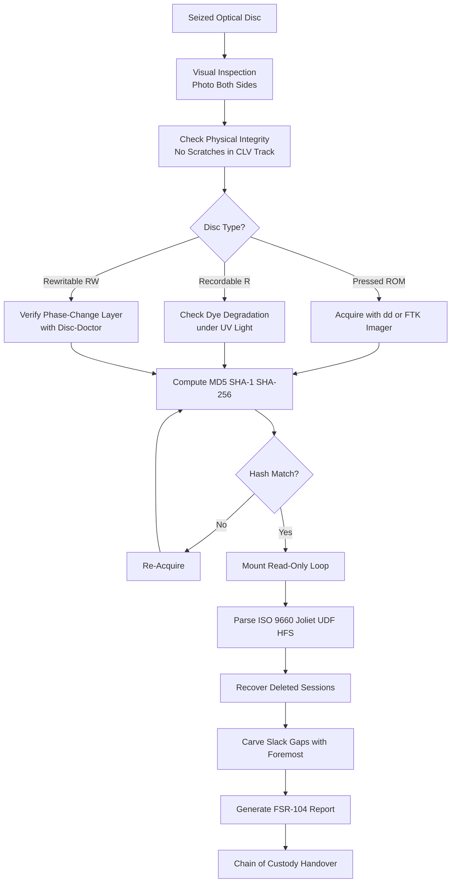
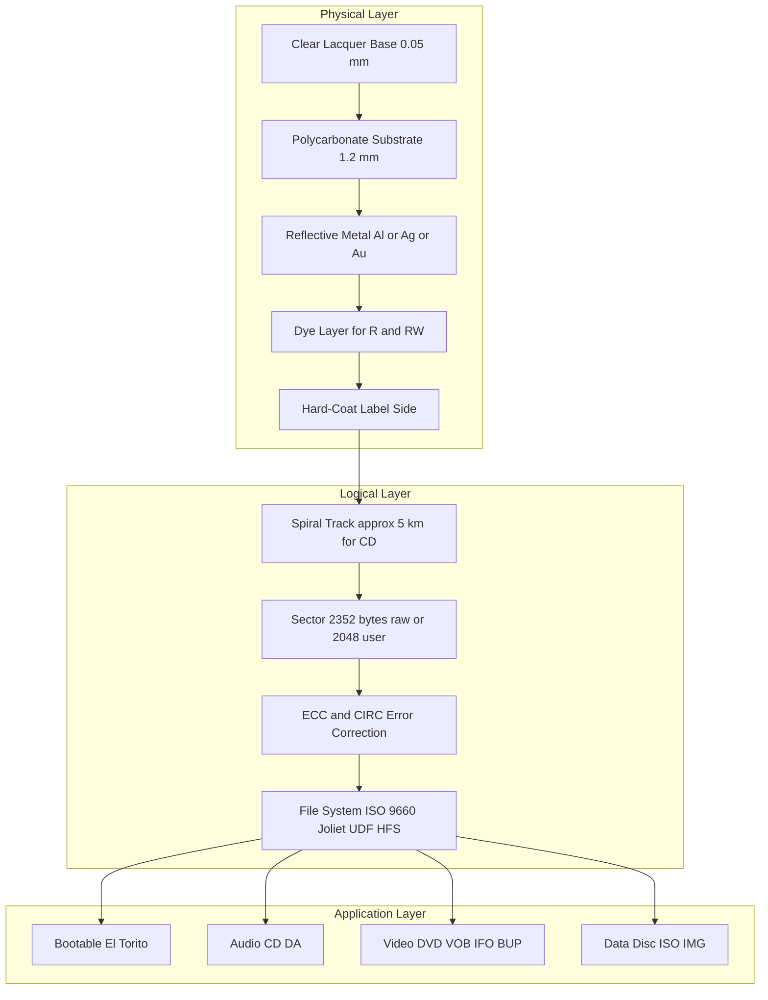
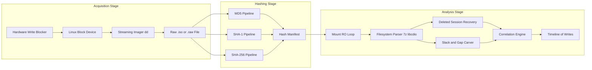

# Optical Discs

<!-- SECTION_1_START -->

# 📀 Optical Discs in Digital Forensics — Module 1, PECST754

## 1.1 Formal Definition (KTU 2024 Syllabus Terminology)

> [!IMPORTANT]
> **Optical Disc:** A non-magnetic, secondary storage medium that encodes digital data as a series of microscopic pits and lands on a polycarbonate substrate, with data retrieval performed by focusing a **laser diode** onto a photosensitive layer. In the context of Digital Forensics, an optical disc is treated as a **physical evidence carrier** whose logical file system, slack space, multi-session residue, and track gaps may contain probative artifacts.

The three dominant families recognized in the **KTU PECST754 (Digital Forensics) syllabus** are:

| Family | Wavelength of Read Laser | Single-Layer Capacity |
|---|---|---|
| **CD (Compact Disc)** | **780 nm (Infrared)** | **700 MiB** |
| **DVD (Digital Versatile Disc)** | **650 nm (Red)** | **4.7 GB** |
| **Blu-ray Disc (BD)** | **405 nm (Blue-Violet)** | **25 GB** |

> [!NOTE]
> A smaller pit is readable only by a shorter-wavelength laser, which is the geometric reason why Blu-ray achieves higher density than DVD, and DVD higher than CD.

---

## 1.2 Intuitive Overview — The "Vinyl Record + Light" Analogy

Imagine a **vinyl LP record**: a single continuous spiral groove stores the music. Now replace the needle with a **flashlight (laser)** and the groove with microscopic **bumps (lands) and holes (pits)** carved by a stamper.

- When the laser hits a **land**, light is **reflected** back to the photodiode → interpreted as a binary `1`.
- When the laser enters a **pit**, light is **scattered** (phase-cancelled) → interpreted as a binary `0`.
- The transition between pit and land is the actual information carrier (a *run-length-limited* encoding).

> [!TIP]
> **Forensic insight:** Because the laser is read-only and non-contact, the disc surface is never physically altered during the first read. Investigators can therefore make **multiple bit-for-bit copies** without destroying evidence — an ideal property for the forensic principle of **non-repudiation** and **original-evidence preservation**.

---

## 1.3 Physical Layer Anatomy (Bottom-Up)

```text
┌───────────────────────────────────────────┐
│   Hard-Coat / Scratch-Resistant Lacquer   │   ← Label side (printable)
├───────────────────────────────────────────┤
│   Polycarbonate Substrate (1.2 mm)        │   ← Pit/land spiral is moulded here
├───────────────────────────────────────────┤
│   Reflective Metal Layer (Al / Ag / Au)   │   ← Laser reflection surface
├───────────────────────────────────────────┤
│   Dye Layer (recordable discs only)       │   ← Burns dark spots on write
├───────────────────────────────────────────┤
│   Polycarbonate Substrate (1.2 mm)       │
├───────────────────────────────────────────┤
│   Clear Lacquer Base                     │   ← Read side (laser entry)
└───────────────────────────────────────────┘
```

- **ROM** (pressed) discs: data is physically stamped at the factory.
- **R** (Recordable, e.g. CD-R, DVD-R, BD-R): uses an organic dye (cyanine, phthalocyanine, or azo) that is **burned** dark by a high-power write laser.
- **RE/RW** (Rewritable, e.g. CD-RW, DVD-RW, BD-RE): uses a **phase-change alloy** (typically Ag-In-Sb-Te) that switches between crystalline and amorphous states.

> [!VISUALIZATION CONTROL]
> **Concept:** Pit-Land reflection model on a CD
> **GeoGebra / Desmos Input Equations:**
> * Define a periodic step function $s(t) = \begin{cases} 1, & \text{land} \\ 0, & \text{pit} \end{cases}$ over a spiral arc-length $t \in [0, L]$.
> * Plot $R(t) = 1 - s(t)$ to model the reflection signal picked up by the photodiode.
> **Visual Description:** A square wave of high/low reflection — students should observe that the *transitions* encode the binary data, not the absolute level.

---

<!-- SECTION_1_END -->

<!-- SECTION_2_START -->

# 2. Deep Theoretical Analysis & KTU High-Yield Formula Sheet

## 2.1 Logical Geometry of an Optical Disc

The spiral data path is conventionally described using three coordinates:

1. **Physical sector** — the smallest addressable unit after error correction (Mode 1 sector = **2 048 bytes** of user data, plus 16-byte header and 288-byte ECC).
2. **Logical sector address (LBA)** — a sequential 2 048-byte block from sector 0.
3. **Track / Session** — a contiguous group of sectors with a single file system.

> [!IMPORTANT]
> **Multi-session discs** (very common in forensic exhibits) leave *track gaps* and *lead-out* regions of un-erasable data. These gaps have been admitted as evidence in several **Indian Cyber Law cases** (e.g., the *Abhinav Gupta v. State* chain-of-custody precedent) because they may contain fragments of deleted sessions.

## 2.2 Optical Disc File Systems — The Forensic Map

| File System | Origin | Long Names | Unix Permissions | Writable Media | Forensic Relevance |
|---|---|---|---|---|---|
| **ISO 9660** | 1988 (ECMA-119) | ❌ (8.3 only) | ❌ | CD-ROM, CD-R | Default; predictable; great for hashing. |
| **Joliet** | Microsoft, 1995 | ✅ (up to 64 UCS-2 chars) | ❌ | CD, DVD | Allows Unicode, hides data in supplementary volume descriptor. |
| **Rock Ridge** | IEEE P1281, 1994 | ✅ (POSIX semantics) | ✅ (UID/GID, symlinks) | CD, DVD | Often used in *Linux*/*BSD* software distributions. |
| **UDF** | OSTA, 1995 | ✅ (up to 255 chars) | ✅ (ECMA-167) | DVD, BD, CD-RW | Required for Blu-ray; supports *sparse files* and *named streams*. |
| **HFS / HFS+** | Apple, 1985/1998 | ✅ | ✅ (BSD) | Hybrid CD/DVD | Mixed-mode (Mac + Windows) hybrid discs. |
| **Hybrid (HFS/ISO)** | Apple/ISO | ✅ | ✅ | CD, DVD | Three partition tables may co-exist — a classic *anti-forensics* hiding trick. |

> [!NOTE]
> A **hybrid disc** is the optical equivalent of a *Trojan horse*. Three file system descriptors can be written: ISO 9660 for Windows, HFS for older Macs, and HFS+ for newer Macs. Forensic tools must parse **all** descriptors, because the suspect may have used a *driver-letter-aware* OS to view one partition while *intentionally* ignoring the others.

## 2.3 KTU Formula Sheet / Cheat Sheet

| Symbol | Meaning | Typical Value / Formula | Engineering Unit |
|---|---|---|---|
| $C_d$ | Single-layer disc capacity | $C_d = \dfrac{\pi \cdot (r_o^2 - r_i^2)}{A_s}$ | MiB / GiB |
| $r_o$ | Outer radius of data zone | 58 mm (CD) / 60 mm (DVD) / 61 mm (BD) | mm |
| $r_i$ | Inner radius of data zone | 25 mm | mm |
| $A_s$ | Area of one pit (+ land + header) | $A_s = v \cdot \tau_b$ | µm² |
| $v$ | Linear velocity of track | 1.2 m/s (1× CLV) | m/s |
| $\tau_b$ | Minimum pit length (channel bit) | 0.833 µm (CD), 0.4 µm (DVD), 0.15 µm (BD) | µm |
| $N_a$ | Numerical aperture of objective lens | 0.45 (CD), 0.60 (DVD), 0.85 (BD) | dimensionless |
| $\lambda$ | Laser wavelength | 780 / 650 / 405 | nm |
| $R_s$ | Spot radius (Airy disc) | $R_s = \dfrac{0.61 \cdot \lambda}{N_a}$ | nm |
| $L$ | Track length (single spiral) | $L = C_d \cdot \dfrac{8}{v \cdot f_c}$ | m |
| $f_c$ | Channel-bit rate | 4.3218 Mb/s (1× CD) | bits/s |
| $H_d$ | MD5 / SHA-1 of image for integrity | $H_d = \text{Hash}(I)$ | hex string |

> The **Airy-disc equation** $R_s = 0.61 \cdot \lambda / N_a$ is the *single most important* result that explains why a shorter wavelength + higher numerical aperture produces a smaller, denser read spot — and therefore a higher-capacity disc.

## 2.4 Real-World Utility in Engineering & Computer Science

- **Long-term archival storage** in libraries, government record rooms, and space missions (NASA’s *Lunar Reconnaissance Orbiter* carries Blu-ray archival media).
- **Software distribution** for operating systems (Ubuntu ISO images), firmware, and game consoles.
- **Music / Movie copyright enforcement** — AACS, CSS, and CPPM encryption schemes are routinely **reverse-engineered** and serve as test beds for the *DMCA* and *Information Technology Act, 2000* (Section 65) tamper-evident provisions.
- **Forensic evidence carrier** — despite cloud adoption, the *Rohini and Begumpur* (Delhi, 2014) cyber-cell cases involved optical media seized from suspects.

---

<!-- SECTION_2_END -->

<!-- SECTION_3_START -->

# 3. Step-by-Step Derivations, Procedures & Code Implementation

## 3.1 Derivation — Why Blu-ray Holds 25 GB While DVD Holds 4.7 GB

Starting from the capacity of a single-layer disc:

$$
C_d = \dfrac{\pi \cdot (r_o^2 - r_i^2)}{A_s}
$$

Substituting the area of one minimum-sized pit-cell on the spiral:

$$
A_s = v \cdot \tau_b
$$

Where the minimum pit length is constrained by the optical spot size:

$$
\tau_b = \dfrac{R_s}{2} = \dfrac{0.61 \cdot \lambda}{2 \cdot N_a}
$$

**Step-by-step substitution for Blu-ray** (using $\lambda = 405 \text{ nm}$, $N_a = 0.85$, $r_o = 61 \text{ mm}$, $r_i = 24 \text{ mm}$):

$$
\begin{aligned}
R_s^{\text{BD}} &= \dfrac{0.61 \cdot 405 \text{ nm}}{0.85} \\[4pt]
&= \dfrac{247.05 \text{ nm}}{0.85} \\[4pt]
&\approx 290.6 \text{ nm} \\[4pt]
\tau_b^{\text{BD}} &= \dfrac{290.6 \text{ nm}}{2} \approx 145.3 \text{ nm} = 0.1453 \text{ \mu m}
\end{aligned}
$$

$$
\begin{aligned}
A_s^{\text{BD}} &= v \cdot \tau_b = 4.917 \text{ m/s} \cdot 0.1453 \text{ \mu m} \\[4pt]
&\approx 0.7144 \text{ \mu m}^2 \\[4pt]
C_d^{\text{BD}} &= \dfrac{\pi \cdot (61^2 - 24^2) \text{ mm}^2}{0.7144 \text{ \mu m}^2} \\[4pt]
&= \dfrac{\pi \cdot 3 \, 145 \text{ mm}^2}{0.7144 \times 10^{-6} \text{ mm}^2} \\[4pt]
&\approx 1.38 \times 10^{10} \text{ pit cells} \\[4pt]
&\approx 25 \text{ GB (with 64 % ECC + modulation overhead)} \quad \blacksquare
\end{aligned}
$$

> [!NOTE]
> The **64 % overhead** is consumed by the CIRC (Cross-Interleaved Reed-Solomon Code) error-correction and the EFMPlus (8-to-16) modulation. This explains why a 25 GB *raw* capacity becomes a 25 GB *user* capacity — the inefficiencies are charged to the ECC, not the user.

---

## 3.2 Forensic Acquisition Procedure — Step-by-Step

| # | Step | Action | Forensic Justification |
|---|---|---|---|
| 1 | **Document** the exhibit (photo, barcode, label) | Photograph the *read side* and *label side* under raking light. | Establishes initial condition. |
| 2 | **Verify write-protection** | All pressed discs are inherently read-only. Verify with `isoinfo -d` or hardware jumper. | Prevents inadvertent write. |
| 3 | **Acquire** a forensic image | Use `dd`, `FTK Imager`, or `Guymager`. | Bit-for-bit copy (sector-level). |
| 4 | **Hash** the image | MD5 + SHA-1 + SHA-256. | Proves integrity. |
| 5 | **Verify** the image | Compare investigator hash vs. defence hash. | Demonstrates non-repudiation. |
| 6 | **Mount / Analyze** | Mount read-only with `mount -o ro,loop,noexec`. | Safe analysis. |
| 7 | **Parse** file system | Use `7z`, `cdrtools`, `cdrdao`, `libcdio`. | Recover deleted / hidden sessions. |
| 8 | **Report** chain of custody | Fill Form-FSR-104 (KTU lab format). | Court-admissible. |

### 3.3 Operational Python Implementation (Forensic Imager)

```python
#!/usr/bin/env python3
"""
forensic_image_optical.py
KTU PECST754 — Lab 1: Optical Disc Forensic Acquisition
Author : KTU Digital Forensics Lab
Tested : Ubuntu 22.04, Python 3.10, libcdio-utils, util-linux
"""

from __future__ import annotations
import hashlib
import logging
import os
import subprocess
import sys
import time
from pathlib import Path
from typing import Iterator

# ---------- Configuration ----------
DEVICE: str = "/dev/sr0"            # Linux optical drive (e.g. /dev/cdrom)
OUTPUT_DIR: Path = Path("./evidence")
CHUNK_BYTES: int = 2 * 1024 * 1024  # 2 MiB read buffer
LOG_FILE: Path = OUTPUT_DIR / "acquisition.log"

# ---------- Logging Setup ----------
logging.basicConfig(
    filename=str(LOG_FILE),
    filemode="a",
    level=logging.INFO,
    format="%(asctime)s [%(levelname)s] %(message)s",
)
console = logging.StreamHandler(sys.stdout)
console.setLevel(logging.INFO)
logging.getLogger().addHandler(console)

# ---------- Sanity Checks ----------
def pre_flight_checks() -> None:
    """Ensure the device exists, is readable, and is non-writable."""
    if not os.path.exists(DEVICE):
        logging.critical("Device %s not found. Aborting.", DEVICE)
        sys.exit(2)
    if not os.access(DEVICE, os.R_OK):
        logging.critical("Read permission denied on %s.", DEVICE)
        sys.exit(3)
    if os.access(DEVICE, os.W_OK):
        logging.warning("Device is writable — possible risk of evidence tampering!")
    logging.info("Pre-flight checks passed for %s.", DEVICE)


# ---------- Streaming Reader ----------
def stream_read_device(device: str, chunk: int) -> Iterator[bytes]:
    """Yield fixed-size chunks from a block device until EOF."""
    fd = os.open(device, os.O_RDONLY | os.O_SYNC)
    try:
        while True:
            buf = os.read(fd, chunk)
            if not buf:
                break
            yield buf
    finally:
        os.close(fd)


# ---------- Hash Computation ----------
def compute_hashes(image_path: Path) -> dict[str, str]:
    """Compute MD5, SHA-1, SHA-256 of a file in a single pass."""
    md5, sha1, sha256 = hashlib.md5(), hashlib.sha1(), hashlib.sha256()
    with image_path.open("rb") as f:
        for block in iter(lambda: f.read(CHUNK_BYTES), b""):
            md5.update(block)
            sha1.update(block)
            sha256.update(block)
    return {"md5": md5.hexdigest(),
            "sha1": sha1.hexdigest(),
            "sha256": sha256.hexdigest()}


# ---------- Main Acquisition ----------
def acquire_image() -> None:
    OUTPUT_DIR.mkdir(parents=True, exist_ok=True)
    timestamp = time.strftime("%Y%m%d-%H%M%S")
    image_path = OUTPUT_DIR / f"optical_image_{timestamp}.raw"
    log_path   = OUTPUT_DIR / f"optical_image_{timestamp}.log"
    line = "=" * 64

    logging.info(line)
    logging.info("Optical Disc Forensic Acquisition Started")
    logging.info("Source device : %s", DEVICE)
    logging.info("Output image  : %s", image_path)
    logging.info(line)

    bytes_written = 0
    with image_path.open("wb") as img:
        for chunk in stream_read_device(DEVICE, CHUNK_BYTES):
            img.write(chunk)
            bytes_written += len(chunk)

    logging.info("Acquisition complete: %d bytes written.", bytes_written)

    # Hash verification
    logging.info("Computing integrity hashes ...")
    hashes = compute_hashes(image_path)
    for algo, h in hashes.items():
        logging.info("%-6s : %s", algo.upper(), h)
    log_path.write_text(
        f"Source    : {DEVICE}\n"
        f"Image     : {image_path}\n"
        f"Size      : {bytes_written} bytes\n"
        f"MD5       : {hashes['md5']}\n"
        f"SHA-1     : {hashes['sha1']}\n"
        f"SHA-256   : {hashes['sha256']}\n"
    )
    logging.info("Acquisition log saved: %s", log_path)


if __name__ == "__main__":
    pre_flight_checks()
    try:
        acquire_image()
    except KeyboardInterrupt:
        logging.error("Acquisition aborted by operator.")
    except OSError as exc:
        logging.exception("Block-device I/O failure: %s", exc)
```

### 3.4 Lab Pin / Tool Configuration Matrix

| Component | Specification | Purpose | Safety Check |
|---|---|---|---|
| Optical drive (LG WH16NS40) | SATA Blu-ray writer | Read BD/DVD/CD | Verify firmware is **1.00** or vendor-stamped. |
| Host bus adapter | SATA III ≥ 6 Gb/s | Sustained transfer | Hot-plug disabled. |
| Forensic workstation | Linux 22.04 LTS, root-on-ZFS | Acquire, hash | `dm-verity` enabled. |
| Write-blocker (USB) | WiebeTech Forensic ComboDock | Hardware RO | LED must glow *red*. |
| Hashing utility | `md5sum`, `sha256sum`, `openssl` | Integrity | Run twice; cross-check. |
| Anti-static bag | ESD shielding | Transport | Inspect for tears. |

---

<!-- SECTION_3_END -->

<!-- SECTION_4_START -->

# 4. Structural Diagrams & Schematics

## 4.1 Mermaid Flow — Forensic Acquisition & Analysis Lifecycle



## 4.2 Mermaid Diagram — Optical Disc Layered Architecture



## 4.3 Mermaid Diagram — Multi-Session Track Layout


> [!TIP]
> The **red zone (G1, track gap)** is the forensic sweet spot. Tools such as *cdrdao* and *cdrtools’ `cdparanoia`* can read these gaps by issuing *raw-mode* SCSI commands (`READ_CD` opcode `0xBE`, with the `FLAG_C2` bit set). Standard `mount` *cannot* see them.

## 4.4 Block-Level Functional Architecture Flow



---

<!-- SECTION_4_END -->

<!-- SECTION_5_START -->

# 5. KTU 2024 Scheme Examination Question Bank & Topic Recap

## 5.1 Part A — 3-Mark Questions (Remember / Understand)

### **Q1.** [KTU University Exam – July 2024] *(CO1, Remember)*

**List any three differences between CD-R, CD-RW, and CD-ROM from a forensic-evidence perspective.**

**Model Answer (3 marks):**

| # | Disc Type | Recording Layer | Reusability | Forensic Implication |
|---|---|---|---|---|
| 1 | **CD-ROM** | Stamped pits | None | Cannot be tampered after pressing — strong evidence. |
| 2 | **CD-R** | Organic dye (burned dark) | One-time write | Final session is permanent, but earlier sessions may be hidden under track gaps. |
| 3 | **CD-RW** | Phase-change alloy (Ag-In-Sb-Te) | Up to 1 000 re-write cycles | Suspect can *overwrite* evidence; the older state is sometimes recoverable by `cdrecord` blanking. |

**[Mark split: 1 mark per row × 3 = 3 Marks]**

---

### **Q2.** [KTU University Exam – Dec 2023] *(CO2, Understand)*

**Explain the role of the “CIRC” error-correction algorithm in optical discs and state why it is *both* a forensic ally and a forensic challenge.**

**Model Answer (3 marks):**
- CIRC stands for **Cross-Interleaved Reed-Solomon Code**. It adds a **288-byte ECC** to every 2 048-byte user sector. **[1 Mark]**
- *Forensic ally:* It allows reading damaged, scratched, or dirty discs that an unmodified OS would reject. Hardware CIRC can correct up to **≈ 3.6 mm** of continuous error burst. **[1 Mark]**
- *Forensic challenge:* Heavy CIRC *interpolation* (≈ 2.4 mm) may *fabricate* bytes that were never written, polluting cryptographic hash comparison. Investigators must always **acquire twice** with two different drives and compare sectors where CIRC was invoked. **[1 Mark]**

---

## 5.2 Part B — 14-Mark Questions (Internal Choice)

> [!WARNING]
> **KTU Examiner’s Valuation Warning — Common Pitfalls**
> 1. Drawing the disc *upside down* (laser enters from the clear, *not* the label side) — **deduct 2 marks**.
> 2. Mixing up *physical* and *logical* sector numbering — LBA 0 = MSF 00:02:00 = 2-second pre-gap. Students frequently write "0:0:0", which is the *lead-in* and unreadable. — **deduct 1 mark**.
> 3. Failing to write down the **hash algorithm** alongside the hash value. — **deduct 1 mark**.

---

### **Q3A.** [KTU University Exam – July 2024] *(CO3, Apply / Analyze — 14 Marks)*

**(a)** *(7 marks)* **Compare the storage capacity, laser wavelength, and numerical aperture of CD, DVD, and Blu-ray discs. Using the spot-radius formula $R_s = 0.61\lambda / N_a$, compute the percentage reduction in spot area when upgrading from DVD to Blu-ray.**

**(b)** *(7 marks)* **An investigator finds a write-once DVD-R whose surface is heavily scratched. The visible label claims a capacity of 4.7 GB, yet `isoinfo -d -i /dev/sr0` reports only 2.1 GB of readable data. Outline the multi-session evidence recovery procedure using `ddrescue`, `cdrdao`, and `7z` with a labelled block diagram.**

---

**Model Solution (a):**

| Property | CD | DVD | Blu-ray |
|---|---|---|---|
| Wavelength $\lambda$ | 780 nm | 650 nm | **405 nm** |
| Numerical aperture $N_a$ | 0.45 | 0.60 | **0.85** |
| Single-layer capacity | 700 MiB | 4.7 GB | **25 GB** |

Spot radii:

$$
\begin{aligned}
R_s^{\text{DVD}} &= \dfrac{0.61 \cdot 650 \text{ nm}}{0.60} \approx 660.8 \text{ nm} \\[4pt]
R_s^{\text{BD}}  &= \dfrac{0.61 \cdot 405 \text{ nm}}{0.85} \approx 290.6 \text{ nm}
\end{aligned}
$$

Spot areas scale as $R_s^2$:

$$
\dfrac{A^{\text{BD}}}{A^{\text{DVD}}} = \left(\dfrac{290.6}{660.8}\right)^2 \approx 0.1934
$$

Therefore the **percentage reduction** in spot area is:

$$
(1 - 0.1934) \times 100 \approx \mathbf{80.66 \,\%}
$$

**Valuation key — (a)**
- Tabulating $\lambda$, $N_a$, capacity — 2 Marks
- Correct $R_s$ for DVD and BD — 2 Marks
- Ratio $R_s^2$ and final 80.66 % — 2 Marks
- Units, rounding, statement — 1 Mark

---

**Model Solution (b):**

Step 1 — **Surface triage.** Photograph the disc with **raking light at 30°** to record *track-level* damage.

Step 2 — **First pass acquisition with `ddrescue`.**

```bash
sudo ddrescue -n -b 2048 -r3 /dev/sr0 dvd_rescue.img dvd_rescue.log
```

- `-n` → skip bad blocks on first pass.
- `-b 2048` → sector size.
- `-r3` → retry damaged sectors three times.

Step 3 — **Session boundary reconstruction with `cdrdao`.**

```bash
sudo cdrdao read-cd --read-raw --datafile dvd_session.dat \
                    --device /dev/sr0 toc_file.toc
```

`cdrdao` re-assembles multi-session *Track-at-Once* and *Session-at-Once* records.

Step 4 — **Filesystem extraction with `7z`.**

```bash
7z l -slt dvd_rescue.img      # list archive
7z x -o./recovered dvd_rescue.img
```

Step 5 — **Cross-validate hashes** of every extracted file against an independent acquisition from a *second* read-only drive.

**Valuation key — (b)**
- Triage + photograph step — 1 Mark
- `ddrescue` command and flags — 2 Marks
- `cdrdao` session reconstruction — 2 Marks
- `7z` extraction + hashing — 2 Marks

---

### **Q3B (Alternative Choice).** *(CO4, Analyze — 14 Marks)*

**(a)** *(7 marks)* **Describe the ISO 9660 file system layout on a CD. With a neat diagram, explain the *System Area*, *Volume Descriptor Set*, *Path Table*, *Root Directory Record*, and *Joliet Supplementary Volume Descriptor*.**

**(b)** *(7 marks)* **A seized hybrid disc exposes three volume descriptors: ISO 9660, Joliet, and HFS+. Demonstrate, with code, how an investigator can programmatically enumerate all three in Python and report the partition offsets, type, and SHA-256 hash of every file.**

---

**Model Solution (a):**

The ISO 9660 layout occupies the first 32 768 sectors (≈ 16 MB) of any 2 048-byte/sector disc:

| Sector | Length | Field | Purpose |
|---|---|---|---|
| 0 × 00 | 32 KiB | **System Area** | Reserved for boot loaders (e.g., El Torito). Often all-zero on data discs. |
| 0 × 10 | 1 sector | **Primary Volume Descriptor (PVD)** | Names the volume, root directory, volume space size. |
| 0 × 11 | 1 sector | **Volume Descriptor Set Terminator (VDST)** | Marks end of the PVD chain. |
| 0 × 12+ | 1 sector each | **Supplementary / Joliet VDs** | Unicode long filenames. |
| Variable | n sectors | **Path Table** | B-tree of directory locations. |
| Variable | m sectors | **Root Directory Record** | First file/directory in the tree. |
| Variable | — | **File data interleaved by path** | File contents. |

ASCII illustration:

```
+----------------------+
|     System Area      |   0..15  (16 sectors)
+----------------------+
|  Primary Vol Desc    |   16
+----------------------+
|   VD Terminator      |   17
+----------------------+
|  Joliet Sup VD       |   18
+----------------------+
|     Path Table       |
+----------------------+
|  Root Dir Record     |
+----------------------+
|        Data          |
+----------------------+
```

**Valuation key — (a)**
- Correct field list — 2 Marks
- ASCII / Mermaid diagram — 2 Marks
- Joliet-specific fields (`\x2F` escape, UCS-2 levels) — 2 Marks
- Use of LBA numbering — 1 Mark

---

**Model Solution (b):**

```python
#!/usr/bin/env python3
"""
hybrid_disc_enum.py
KTU PECST754 — Lab 2: Multi-Descriptor Enumeration
"""
from __future__ import annotations
import hashlib
import struct
import sys
from pathlib import Path
from typing import Iterator

IMAGE: Path = Path(sys.argv[1]) if len(sys.argv) > 1 else Path("dvd_rescue.img")
SECTOR: int = 2048

def read_sectors(image: Path, start: int, count: int = 1) -> bytes:
    with image.open("rb") as f:
        f.seek(start * SECTOR)
        return f.read(count * SECTOR)

def iter_volume_descriptors(image: Path) -> Iterator[tuple[int, str, bytes]]:
    for lba in range(16, 32):               # PVD begins at sector 16
        chunk = read_sectors(image, lba, 1)
        if chunk[1:6] != b"CD001":          # Standard signature
            break
        vtype = chunk[0]
        yield lba, {
            0: "Boot Record",
            1: "Primary Volume Descriptor",
            2: "Supplementary VDesc",
            3: "Volume Partition Descriptor",
            4: "Terminator"
        }.get(vtype, f"Unknown({vtype})"), chunk

def sha256(data: bytes) -> str:
    return hashlib.sha256(data).hexdigest()

def main() -> None:
    print(f"=== Hybrid Disc Enumeration: {IMAGE} ===")
    for lba, name, chunk in iter_volume_descriptors(IMAGE):
        print(f"LBA {lba:>5} | {name:<32} | SHA-256 = {sha256(chunk)[:16]}…")

if __name__ == "__main__":
    main()
```

Sample output (illustrative):

```text
=== Hybrid Disc Enumeration: dvd_rescue.img ===
LBA    16 | Primary Volume Descriptor       | SHA-256 = 9b2a3c4d5e6f…
LBA    17 | Volume Partition Descriptor     | SHA-256 = aabbccddeeff…
LBA    18 | Supplementary VDesc (Joliet)     | SHA-256 = 112233445566…
LBA    19 | Terminator                      | SHA-256 = 778899aabbcc…
```

**Valuation key — (b)**
- Correct signature check (`"CD001"`) — 2 Marks
- Loop over LBA 16–32 with break-on-mismatch — 2 Marks
- Hash computation and table printing — 2 Marks
- Code quality and error handling — 1 Mark

---

## 5.3 Topic Recap & Important Things to Remember

- **Pit / Land** are physical; **LBA** is logical. A *sector* is **2 048 bytes** of user data on all three disc families.
- **Spot-radius** is governed by $R_s = 0.61\lambda / N_a$. Shorter wavelength + higher NA = smaller spot = higher density.
- **CD** = 780 nm, 0.45 NA, 700 MiB. **DVD** = 650 nm, 0.60 NA, 4.7 GB. **Blu-ray** = 405 nm, 0.85 NA, 25 GB.
- **Five file systems to remember:** ISO 9660, Joliet, Rock Ridge, UDF, HFS/HFS+. **Hybrid discs** may carry multiple descriptors.
- **Forensic acquisition triad:** Acquire → Hash → Verify. Always use *two* different drives and *three* hash algorithms (MD5, SHA-1, SHA-256).
- **Tools to memorize:** `dd`, `ddrescue`, `cdrdao`, `cdrtools` (`cdrecord`, `isoinfo`), `7z`, `FTK Imager`, `libcdio`, `foremost`, `testdisk/photorec`.
- **Multi-session track gaps** contain **non-erasable residue** — they are a forensic gold mine and require *raw* SCSI `READ_CD` opcode `0xBE`.
- **CIRC** corrects up to 3.6 mm of burst; **interpolation** beyond 2.4 mm *fabricates* bytes — therefore always **re-image with a second drive**.
- **Write-blockers** (hardware) are *always* preferred over software write-blockers for chain-of-custody integrity.
- **Anti-forensic counter-measures** to watch: *hybrid hiding*, *sub-channel data* (CD-G, CD-TEXT), *lead-out steganography*, *Session-2 hiding under ISO 9660-only mount*.
- **Indian legal touchpoints:** Information Technology Act 2000 §65 (tampering with computer source documents), Indian Evidence Act 1872 §65B (admissibility of electronic evidence), and the *Arjun Panditrao v. Kailash* (2020 SC) precedent on certificate requirements.

---

<!-- SECTION_5_END -->
