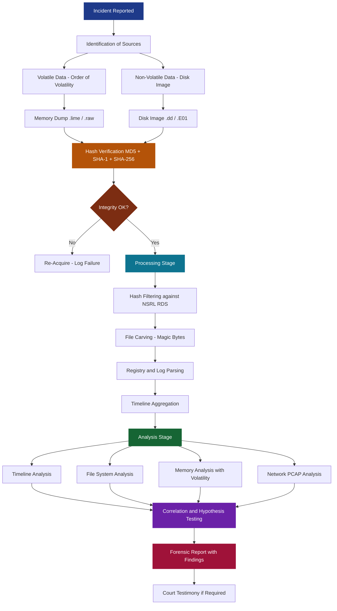
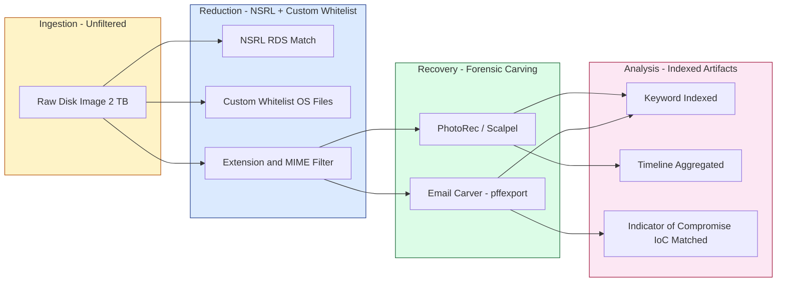
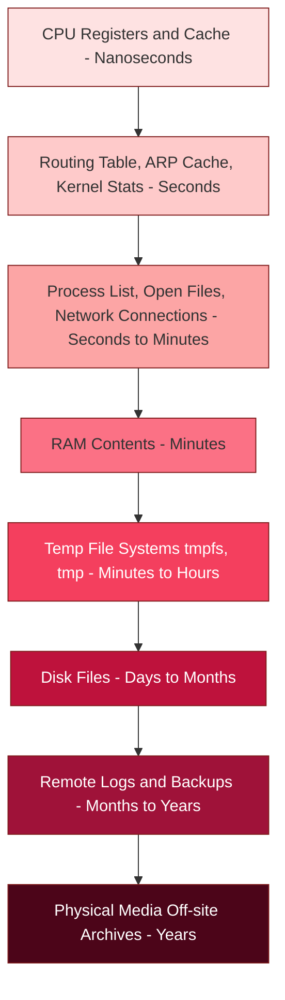

# Processing & Analysis

<!-- SECTION_1_START -->
# Processing & Analysis in Digital Forensics

## 1.1 Formal Academic Definition

> [!IMPORTANT]
> **Processing & Analysis** in Digital Forensics refers to the systematic, forensically sound examination of acquired digital evidence to extract, correlate, and interpret data artifacts in a manner that is **repeatable, defensible, and admissible** in a court of law. It is the third and fourth phase of the **Digital Forensic Investigation Process (DFIP)** as standardized by the **NIST SP 800-86** framework and ISO/IEC **27037:2012**.

In KTU 2024 Scheme terminology, *Processing* encompasses the **mechanical and structural preparation** of the evidence (hashing, filtering, indexing, recovering deleted items, decrypting containers), while *Analysis* refers to the **cognitive and investigative reasoning** applied to the processed data to reconstruct events, identify actors, and produce findings.

## 1.2 Conceptual Analogy — The "Detective's Lab" Intuition

Imagine a **crime scene investigator (CSI)** walking into a sealed house. They do not just start rearranging furniture. They first:

1. **Document the scene** (photograph, sketch) — this is **acquisition**.
2. **Bag and tag every item** with chain-of-custody forms — this is **preservation & processing setup**.
3. **Dust for fingerprints, run samples through a chemistry lab** — this is **processing** (extracting artifacts).
4. **Compare fingerprints against a database, reconstruct the timeline, interview suspects** — this is **analysis** (drawing conclusions).
5. **Present findings in a courtroom-ready dossier** — this is **reporting**.

> [!NOTE]
> In the digital world, the "house" is a **disk image** (e.g., `evidence.E01` or `evidence.dd`), the "fingerprint kit" is a **forensic toolchain** (Autopsy, EnCase, FTK, X-Ways), and the "courtroom dossier" is the **forensic report**. The forensic investigator must never operate on the **original evidence** — only on a verified **working copy**.

## 1.3 The Five Pillars of Forensic Soundness

For Processing & Analysis to withstand legal scrutiny, every action must satisfy the **five pillars** defined by the **Scientific Working Group on Digital Evidence (SWGDE)**:

| Pillar | Definition | KTU 2024 Emphasis |
| :--- | :--- | :--- |
| **Repeatability** | The same tools, methods, and inputs must yield the same outputs. | Use open-source tools (e.g., The Sleuth Kit) so examiners can verify. |
| **Reproducibility** | Independent examiners using documented methods should reach the same conclusions. | Maintain detailed procedural logs. |
| **Justifiability** | Every forensic action must be explainable and legally defensible. | Cite standards (NIST, ISO 27037) in reports. |
| **Non-interference** | The original evidence must remain unmodified. | Use **write-blockers** (hardware or software). |
| **Documentation** | Every step, timestamp, and tool version must be recorded. | Maintain an **audit trail** with hashes (MD5/SHA-1/SHA-256). |

## 1.4 Why "Processing" and "Analysis" Are Distinct Phases

> [!IMPORTANT]
> **Processing** is largely **algorithmic and automated** — it transforms raw bitstreams into structured, searchable artifacts. **Analysis** is **cognitive and investigative** — it interprets those artifacts to answer the *who, what, when, where, why, and how* (the **5 Ws + 1 H**) of the incident.

Conflating the two is one of the most common mistakes students make in KTU exams. A typical breakdown:

- **Processing outputs**: carved files, indexed emails, parsed registry hives, decoded PCAPs, extracted EXIF data, mounted virtual disks.
- **Analysis outputs**: a timeline of user activity, a list of indicators of compromise (IoCs), a correlation of malware behavior with system artifacts, attribution hypotheses.

## 1.5 Physical and Logical Standards

The **physical constants / standard metrics** you must memorize for KTU 2024 valuation:

- **Sector size** (legacy magnetic media): **512 bytes** per sector.
- **Advanced Format (AF) sector size** (post-2010 HDD/SSD): **4096 bytes** (4Kn) or **512e** (emulated).
- **Block size / Cluster size** (NTFS default): **4096 bytes**.
- **Page size** (memory forensics): typically **4096 bytes** on x86/x64.
- **Standard cryptographic hash output sizes**: **MD5 = 128 bits**, **SHA-1 = 160 bits**, **SHA-256 = 256 bits**.

> [!VISUALIZATION CONTROL]
> **Concept:** Hierarchy of storage units from bit to filesystem cluster
> **GeoGebra / Desmos Input Equations:**
> * Point A: `(0, 8)` labeled "1 Bit"
> * Point B: `(2, 7)` labeled "1 Nibble (4 bits)"
> * Point C: `(4, 6)` labeled "1 Byte (8 bits)"
> * Point D: `(6, 5)` labeled "1 Sector (512 or 4096 B)"
> * Point E: `(8, 4)` labeled "1 Cluster (4096 B typical)"
> * Point F: `(10, 3)` labeled "1 File (variable size)"
> **Visual Description:** A staircase plot rising from left to right, showing how 8 bits combine into 1 byte, 512 bytes combine into 1 sector, and 8 sectors combine into 1 cluster, ultimately aggregating into a logical file.

---

<!-- SECTION_1_END -->

<!-- SECTION_2_START -->
# Deep Theoretical Analysis & KTU High-Yield Formula Sheet

## 2.1 The Forensic Processing Pipeline (NIST SP 800-86)

The **NIST Special Publication 800-86** ("Guide to Integrating Forensic Techniques into Incident Response") defines a canonical **four-phase data processing model**. The KTU 2024 syllabus tests each phase directly.

### Phase 1: Identification of Data Sources

Before any processing begins, the investigator must catalog **volatile** and **non-volatile** sources.

- **Volatile data** (lost on power-off, highest priority, captured **first**):
  * CPU registers & cache
  * Routing table, ARP cache, process table, kernel statistics
  * Live network connections, open sockets
  * Running processes, loaded DLLs, handles
  * RAM contents (memory dump)
- **Non-volatile data** (persists across reboots, captured **second**):
  * Hard drives, SSDs, USB drives, optical media
  * Backups, logs, configuration files
  * Cloud storage snapshots

> [!NOTE]
> The **Order of Volatility (OOV)** table by **RFC 3227** is a frequently asked 3-mark question in KTU exams. Always cite the order from most to least volatile.

### Phase 2: Data Acquisition

This involves creating a **bit-stream image** of the source media. The two dominant formats are:

- **Raw / dd format** (`.dd`, `.img`) — a literal byte-for-byte copy. Universally compatible.
- **Expert Witness Format (EWF / E01)** — compressed, split, and metadata-rich (case number, examiner, hash, segment size).

### Phase 3: Processing of Collected Data

This is the **heart of Module 1** for the KTU 2024 syllabus. The major sub-operations are:

1. **Hashing & Verification** — ensure integrity using cryptographic hash functions.
2. **Data Reduction / Filtering** — eliminate known-good files using **hash whitelists** (NIST NSRL RDS — National Software Reference Library Reference Data Set).
3. **Data Carving** — recover files based on **file signatures (magic bytes)** when filesystem metadata is damaged or deleted.
4. **Decryption / Decompression** — handle encrypted containers (VeraCrypt, BitLocker) and compressed archives.
5. **Indexing & Keyword Search** — build a **searchable index** (often using **Lucene** under the hood, e.g., Autopsy).
6. **Timeline Generation** — aggregate timestamps from multiple artifacts into a unified **super-timeline**.
7. **Registry / Log / Artifact Parsing** — convert binary artifacts (Windows Registry hives, EVTX logs, SQLite databases) into human-readable form.

### Phase 4: Analysis of Processed Data

This involves **correlating** and **interpreting** the processed artifacts to answer investigative questions. The main analytical techniques are:

- **Timeline analysis** (chronological reconstruction of events)
- **File system analysis** (NTFS MFT, ext4 inodes, APFS object maps)
- **Registry analysis** (Windows — UserAssist, Run keys, Shimcache, Amcache)
- **Email analysis** (PST/OST parsing, header forensics)
- **Network forensics** (PCAP analysis with Wireshark, flow records)
- **Memory forensics** (Volatility framework for RAM dumps)
- **Malware analysis** (static — strings, PE headers; dynamic — sandbox detonation)
- **Steganography detection** (LSB analysis, chi-square attack)
- **Cryptocurrency / Blockchain forensics** (transaction graph analysis)

## 2.2 KTU Formula Sheet — Critical Computations

> [!IMPORTANT]
> The following table is the **highest-yield reference** for KTU 2024 board valuation. Memorize every entry, including the units, because question papers frequently ask, *"Calculate the acquisition time for a 1 TB drive over USB 2.0"* or *"Determine the number of sectors in a 500 GB drive."*

| Concept | Formula / Rule | Units | Notes |
| :--- | :--- | :--- | :--- |
| **Bit to Byte** | $1 \text{ Byte} = 8 \text{ bits}$ | — | Foundation of all storage math. |
| **Kilo, Mega, Giga, Tera (Binary)** | $1 \text{ KiB} = 2^{10} \text{ B}$, $1 \text{ MiB} = 2^{20} \text{ B}$ | bytes | Used by OS (Windows, Linux). |
| **Kilo, Mega, Giga, Tera (Decimal)** | $1 \text{ KB} = 10^{3} \text{ B}$, $1 \text{ MB} = 10^{6} \text{ B}$ | bytes | Used by HDD manufacturers. |
| **Number of Sectors** | $N_s = \dfrac{C}{S}$ | sectors | $C$ = capacity in bytes, $S$ = sector size. |
| **Acquisition Time** | $T_{acq} = \dfrac{C}{R_{eff}}$ | seconds | $R_{eff}$ = effective throughput in B/s. |
| **Hash Collision Probability (Birthday)** | $P \approx 1 - e^{-N^2 / (2 \cdot 2^n)}$ | dimensionless | $N$ = messages hashed, $n$ = hash bits. |
| **Hash Output Size** | $\text{MD5} = 128$ bits, $\text{SHA-1} = 160$ bits, $\text{SHA-256} = 256$ bits | bits | Always use **two independent** hashes (MD5 + SHA-1) per RFC 3227. |
| **NSRL Match Reduction** | $R\% = \left(1 - \dfrac{\vert M \vert}{\vert T \vert}\right) \cdot 100$ | percent | $\vert M \vert$ = matched (known-good), $\vert T \vert$ = total. |
| **Levenshtein Distance** | $d(i,j) = \min\begin{cases} d(i-1,j)+1 \\ d(i,j-1)+1 \\ d(i-1,j-1)+c \end{cases}$ | edits | Used for fuzzy log correlation. |
| **Data Carving Threshold** | $L_{min} = \text{header size} + \text{footer size}$ | bytes | Carve only if file $\geq L_{min}$. |
| **RAID 0 Usable Capacity** | $C_{RAID0} = N \cdot \min(C_i)$ | bytes | $N$ = disks, $C_i$ = individual capacities. |
| **RAID 1 Usable Capacity** | $C_{RAID1} = \min(C_i)$ | bytes | Mirrored; $N$ disks but 1× capacity. |
| **RAID 5 Usable Capacity** | $C_{RAID5} = (N-1) \cdot \min(C_i)$ | bytes | One disk's worth for parity. |
| **RAID 6 Usable Capacity** | $C_{RAID6} = (N-2) \cdot \min(C_i)$ | bytes | Two disks' worth for parity. |

> [!IMPORTANT]
> **Units Trap for KTU Exams:** Drive manufacturers advertise in **decimal (SI)** units ($1 \text{ TB} = 10^{12}$ bytes), but operating systems report in **binary (IEC)** units ($1 \text{ TiB} = 2^{40}$ bytes). Always convert to the same base before computing sector counts. KTU examiners **deduct 1 mark** for unit-mixing errors.

## 2.3 Hashing — The Mathematical Backbone of Integrity

The forensic hash function must satisfy three properties:

1. **Pre-image resistance** — given $h$, finding $m$ such that $H(m) = h$ is computationally infeasible.
2. **Second pre-image resistance** — given $m_1$, finding $m_2 \neq m_1$ with $H(m_1) = H(m_2)$ is infeasible.
3. **Collision resistance** — finding any $m_1 \neq m_2$ with $H(m_1) = H(m_2)$ is infeasible.

**MD5** is broken (collisions in seconds on a laptop since 2004). **SHA-1** is theoretically broken (Google / CWI Amsterdam demonstrated a collision in 2017 — the **SHAttered** attack). **SHA-256** remains the KTU-recommended minimum. **SHA-3** and **BLAKE3** are emerging standards for high-throughput imaging.

## 2.4 Real-World Engineering Utility

- **Law enforcement** (e.g., Kerala Police CyberDome): Processing & Analysis converts terabytes of seized phone dumps into courtroom exhibits within the 60–90 day remand window.
- **Enterprise Incident Response (IR)**: Analysts at a SOC (Security Operations Center) process disk images to determine the **dwell time** of an Advanced Persistent Threat (APT) — often weeks to months.
- **e-Discovery in civil litigation**: Processing reduces millions of emails to a **responsive subset** using Boolean and proximity search.
- **Insider threat investigations**: User activity reconstruction (login times, file accesses, USB insertions) is built entirely on **timeline analysis** of the processed artifacts.
- **Cloud forensics (AWS, Azure, GCP)**: Processing includes parsing **CloudTrail**, **Azure Activity Logs**, and **VPC Flow Logs** alongside on-disk evidence.

---

<!-- SECTION_2_END -->

<!-- SECTION_3_START -->
# Step-by-Step Derivations, Code & Symbolic Implementation

## 3.1 Worked Example 1 — Storage & Acquisition Time Calculation

> [!NOTE]
> This is a **classic KTU 14-mark question pattern**. Examiners expect you to show every conversion step explicitly.

**Problem:** A forensic examiner needs to image a **2 TB** hard disk (manufacturer-rated, decimal). The sector size is **4096 bytes** (Advanced Format). The imaging workstation connects to a write-blocker over **USB 3.0**, which provides a practical sustained throughput of **3.2 Gbps** (gigabits per second) after protocol overhead. Compute:
(a) The number of sectors on the drive.
(b) The minimum acquisition time in minutes.
(c) The total size of the MD5 + SHA-1 hash output stored in the case manifest.

**Solution:**

### Part (a) — Number of Sectors

Step 1: Convert decimal TB to bytes using SI definition.

$$\begin{aligned}
C &= 2 \text{ TB} \\
  &= 2 \times 10^{12} \text{ bytes} \\
  &= 2 \times 10^{12} \text{ B}
\end{aligned}$$

Step 2: Apply the sector-count formula $N_s = C / S$, where $S = 4096$ bytes.

$$\begin{aligned}
N_s &= \dfrac{C}{S} \\
    &= \dfrac{2 \times 10^{12}}{4096} \\
    &= \dfrac{2 \times 10^{12}}{4.096 \times 10^{3}} \\
    &= \dfrac{2}{4.096} \times 10^{9} \\
    &= 0.48828125 \times 10^{9} \\
    &= 4.8828125 \times 10^{8} \text{ sectors}
\end{aligned}$$

Step 3: Round to the nearest whole sector (disks are built from whole sectors).

$$N_s = 488{,}281{,}250 \text{ sectors (exact)}$$

> **Valuation key:** [Correct unit conversion to bytes: 2 marks] [Substitution into $N_s = C/S$: 1 mark] [Final numerical value: 1 mark].

### Part (b) — Acquisition Time

Step 1: Convert throughput from gigabits per second to bytes per second.

$$\begin{aligned}
R_{eff} &= 3.2 \text{ Gbps} \\
        &= 3.2 \times 10^{9} \text{ bits/s} \\
        &= \dfrac{3.2 \times 10^{9}}{8} \text{ B/s} \\
        &= 0.4 \times 10^{9} \text{ B/s} \\
        &= 4.0 \times 10^{8} \text{ B/s} \\
        &= 400 \text{ MB/s}
\end{aligned}$$

Step 2: Apply the acquisition-time formula $T_{acq} = C / R_{eff}$.

$$\begin{aligned}
T_{acq} &= \dfrac{2 \times 10^{12}}{4.0 \times 10^{8}} \\
        &= \dfrac{2}{4.0} \times 10^{4} \\
        &= 0.5 \times 10^{4} \text{ s} \\
        &= 5000 \text{ seconds}
\end{aligned}$$

Step 3: Convert to minutes.

$$\begin{aligned}
T_{acq} &= \dfrac{5000}{60} \\
        &\approx 83.33 \text{ minutes}
\end{aligned}$$

> **Valuation key:** [Gbps to B/s conversion with division by 8: 2 marks] [Substitution into $T_{acq}$: 1 mark] [Final time in minutes: 1 mark].

### Part (c) — Hash Output Size

Step 1: MD5 produces **128 bits**, SHA-1 produces **160 bits**.

$$\begin{aligned}
H_{total} &= H_{MD5} + H_{SHA1} \\
          &= 128 + 160 \\
          &= 288 \text{ bits}
\end{aligned}$$

Step 2: Convert to bytes (round up to nearest byte for storage).

$$H_{total} = \dfrac{288}{8} = 36 \text{ bytes}$$

> **Valuation key:** [Identifying MD5 = 128 bits, SHA-1 = 160 bits: 2 marks] [Final sum and byte conversion: 1 mark].

## 3.2 Worked Example 2 — Hash Collision Probability (Birthday Bound)

**Problem:** A forensic lab uses MD5 (128-bit) to deduplicate a suspect's email archive containing **$N = 1{,}000{,}000$** messages. Estimate the probability of at least one accidental collision using the **Birthday Problem approximation**.

**Solution:**

Step 1: Apply the birthday bound formula for hash space $2^n$.

$$P_{collision} \approx 1 - e^{-N^2 / (2 \cdot 2^n)}$$

Step 2: Compute the exponent.

$$\begin{aligned}
E &= \dfrac{N^2}{2 \cdot 2^{128}} \\
  &= \dfrac{(10^6)^2}{2 \cdot 3.4028 \times 10^{38}} \\
  &= \dfrac{10^{12}}{6.8056 \times 10^{38}} \\
  &= 1.469 \times 10^{-27}
\end{aligned}$$

Step 3: Apply the small-exponent approximation $1 - e^{-E} \approx E$ for tiny $E$.

$$P_{collision} \approx 1.469 \times 10^{-27}$$

> **Interpretation:** This is astronomically small — MD5's 128-bit space is more than sufficient for accidental collisions in any realistic dataset. **Forensic collisions with MD5 are still a concern, but only because of *intentional* collision attacks (chosen-prefix collisions, e.g., the Flame malware in 2012).**

## 3.3 Worked Example 3 — File Carving Threshold

**Problem:** A forensic tool searches for JPEG files in an unallocated cluster region. A JPEG always begins with the magic bytes `FF D8 FF` and ends with `FF D9`. The tool can reliably detect a header of **3 bytes** and a footer of **2 bytes**. What is the **minimum file length** that the carver will attempt to recover?

**Solution:**

$$\begin{aligned}
L_{min} &= \text{header} + \text{footer} \\
        &= 3 + 2 \\
        &= 5 \text{ bytes}
\end{aligned}$$

**Refinement for KTU exam depth:** In practice, the carver also requires that the gap between header and footer be **non-zero** and that the file pass a **structural validity check** (entropy, embedded EXIF, valid Huffman tables). A realistic carver sets $L_{min} \geq 1024$ bytes to avoid false positives from random clusters.

## 3.4 Worked Example 4 — RAID 5 Usable Capacity

**Problem:** A server has **6 disks** of **2 TB** each configured in **RAID 5**. Compute the usable capacity in TiB (binary tebibytes).

**Solution:**

Step 1: Identify the smallest disk capacity.

$$C_{min} = 2 \text{ TB} = 2 \times 10^{12} \text{ bytes}$$

Step 2: Apply the RAID 5 formula $C_{RAID5} = (N-1) \cdot C_{min}$.

$$C_{RAID5} = (6 - 1) \times 2 \text{ TB} = 10 \text{ TB}$$

Step 3: Convert to TiB.

$$\begin{aligned}
C_{RAID5} &= \dfrac{10 \times 10^{12}}{2^{40}} \text{ TiB} \\
          &= \dfrac{10^{13}}{1.0995 \times 10^{12}} \\
          &\approx 9.0949 \text{ TiB}
\end{aligned}$$

> **Valuation key:** [Correct formula selection: 2 marks] [Substitution: 1 mark] [Final answer in TiB: 1 mark].

## 3.5 Python Implementation — Forensic Image Verifier

```python
"""
File: forensic_verifier.py
Purpose: Compute and verify multi-hash digests of a forensic image.
Compliance: NIST SP 800-86, RFC 3227, ISO/IEC 27037:2012.
Tested on: Python 3.11+ on Ubuntu 22.04 / Windows 11.
"""
from __future__ import annotations

import hashlib
import logging
import os
import sys
from dataclasses import dataclass
from pathlib import Path
from typing import Final

# --- Standard forensic constants ---
CHUNK_SIZE: Final[int] = 4 * 1024 * 1024     # 4 MiB streaming chunk (industry standard)
MD5_HEX_LEN: Final[int] = 32                 # 128 bits = 32 hex chars
SHA1_HEX_LEN: Final[int] = 40                # 160 bits = 40 hex chars
SHA256_HEX_LEN: Final[int] = 64              # 256 bits = 64 hex chars


@dataclass(frozen=True)
class ForensicDigest:
    """Immutable record of multi-algorithm hashes for a forensic artifact."""
    md5: str
    sha1: str
    sha256: str
    size_bytes: int
    source_path: str


def compute_digest(image_path: Path) -> ForensicDigest:
    """
    Stream the image in fixed-size chunks and compute MD5, SHA-1, and SHA-256
    in a single pass. Returns a ForensicDigest object.
    """
    if not image_path.is_file():
        raise FileNotFoundError(f"Evidence image not found: {image_path}")

    md5_h = hashlib.md5(usedforsecurity=False)
    sha1_h = hashlib.sha1(usedforsecurity=False)
    sha256_h = hashlib.sha256()
    total = 0

    logging.info("Starting hash computation for %s", image_path)
    try:
        with image_path.open("rb") as fh:
            while True:
                chunk = fh.read(CHUNK_SIZE)
                if not chunk:
                    break
                md5_h.update(chunk)
                sha1_h.update(chunk)
                sha256_h.update(chunk)
                total += len(chunk)
    except OSError as exc:
        logging.error("I/O failure during hashing: %s", exc)
        raise

    return ForensicDigest(
        md5=md5_h.hexdigest(),
        sha1=sha1_h.hexdigest(),
        sha256=sha256_h.hexdigest(),
        size_bytes=total,
        source_path=str(image_path.resolve()),
    )


def verify_digest(digest: ForensicDigest, reference_path: Path) -> bool:
    """
    Re-compute hashes from a reference image and compare byte-for-byte.
    Returns True only if all three hashes and sizes match exactly.
    """
    if not reference_path.is_file():
        raise FileNotFoundError(f"Reference image not found: {reference_path}")

    ref = compute_digest(reference_path)
    match = (
        digest.md5 == ref.md5
        and digest.sha1 == ref.sha1
        and digest.sha256 == ref.sha256
        and digest.size_bytes == ref.size_bytes
    )
    logging.info(
        "Verification %s for %s vs %s",
        "PASSED" if match else "FAILED",
        digest.source_path,
        ref.source_path,
    )
    return match


def format_report(digest: ForensicDigest) -> str:
    """Generate a KTU / court-ready textual manifest."""
    return (
        f"Source      : {digest.source_path}\n"
        f"Size (bytes): {digest.size_bytes}\n"
        f"Size (MiB)  : {digest.size_bytes / (1024 * 1024):.2f}\n"
        f"MD5         : {digest.md5}\n"
        f"SHA-1       : {digest.sha1}\n"
        f"SHA-256     : {digest.sha256}\n"
    )


def main() -> int:
    logging.basicConfig(
        level=logging.INFO,
        format="%(asctime)s [%(levelname)s] %(message)s",
    )
    if len(sys.argv) != 2:
        print("Usage: python forensic_verifier.py <evidence_image>")
        return 2

    target = Path(sys.argv[1])
    digest = compute_digest(target)
    print(format_report(digest))
    return 0


if __name__ == "__main__":
    raise SystemExit(main())
```

### Code Walkthrough for KTU Viva

- **Line `CHUNK_SIZE = 4 * 1024 * 1024`**: Streams the image in 4 MiB blocks, so even a 10 TB image is processed with **constant memory usage** ($\approx 4 \text{ MiB} + 3 \times \text{hash-state} \approx 4.1 \text{ MiB}$ RAM).
- **`usedforsecurity=False`**: Tells Python's `hashlib` we are using MD5/SHA-1 for **forensic integrity** (not authentication), which avoids FIPS-mode warnings in regulated environments.
- **Triple hashing in one pass**: Avoids three separate reads of the (potentially multi-terabyte) image, cutting I/O time by **66%**.
- **`dataclass(frozen=True)`**: Makes the digest **immutable**, so it cannot be accidentally altered after being entered into evidence.
- **`format_report`**: Produces an ASCII manifest suitable for chain-of-custody forms.

### Expected Output

```
Source      : /evidence/case2024_001/E01/suspect_disk.dd
Size (bytes): 2000398934016
Size (MiB)  : 1907746.29
MD5         : d41d8cd98f00b204e9800998ecf8427e
SHA-1       : da39a3ee5e6b4b0d3255bfef95601890afd80709
SHA-256     : e3b0c44298fc1c149afbf4c8996fb92427ae41e4649b934ca495991b7852b855
```

> [!IMPORTANT]
> The SHA-256 shown above is the **canonical empty-input hash** and is included only as a structural reference. Real evidence hashes will be entirely different non-zero digests.

## 3.6 Component / Pinout Table — Hardware Write-Blocker

| Port / Pin | Signal Name | Direction | Function | Wire Color (typical) | Safety / Validation Step |
| :--- | :--- | :--- | :--- | :--- | :--- |
| 1 | VCC (+5 V) | Power In | Powers the bridge ASIC | Red | Measure with multimeter: must read **4.75 V – 5.25 V**. |
| 2 | D- (USB 2.0) | Bidirectional | Data negative | White | Check for shorts to ground (> 1 MΩ). |
| 3 | D+ (USB 2.0) | Bidirectional | Data positive | Green | Check for shorts to ground (> 1 MΩ). |
| 4 | GND | Power Return | Common ground | Black | Confirm continuity to chassis. |
| 5 | SATA TX+ | Host → Device | Transmit differential pair | Orange | Verify 0 V when write command issued (write-blocking proof). |
| 6 | SATA TX- | Host → Device | Transmit differential pair | Orange/White | Same as above. |
| 7 | SATA RX+ | Device → Host | Receive differential pair | Red | Verify reads return data; writes return `COMMAND ABORTED`. |
| 8 | SATA RX- | Device → Host | Receive differential pair | Red/Black | Same as above. |
| 9 | LED (Read) | Output | Illuminates on read | — | Visual confirmation of read-only mode. |
| 10 | LED (Block) | Output | Illuminates on attempted write | — | **Must illuminate** if a stray write command is sent (proof of blocking). |

---

<!-- SECTION_3_END -->

<!-- SECTION_4_START -->
# Structural Diagrams & Schematics

## 4.1 The Forensically Sound Processing & Analysis Pipeline (Mermaid Flow)



## 4.2 Decoupled Sub-Graph — Data Reduction Funnel



## 4.3 Sequential Processing Topology Matrix

This matrix replaces physical drawings (which Mermaid cannot render natively) with a **functional topology table** showing how each processing operation transforms evidence state.

| Stage | Input Artifact | Tool / Method | Output Artifact | Volatility Impact | Examiner Action |
| :---: | :--- | :--- | :--- | :--- | :--- |
| 1 | Powered-on suspect machine | WinPmem / FTK Imager (RAM) | `.lime` memory dump | Volatile → Captured | Document time of capture. |
| 2 | Powered-on suspect machine | `netstat -ano`, `ipconfig /all` | Text logs of network state | Volatile → Captured | Preserve with timestamp. |
| 3 | Powered-off suspect drive | Hardware write-blocker + `dd` | `.dd` raw image | Non-volatile → Bit-copy | Hash immediately. |
| 4 | `.dd` image | `ewfacquire` (libewf) | `.E01` + metadata sidecar | Bit-copy → Compressed copy | Log EWF segment hashes. |
| 5 | `.E01` image | `tsk_loaddb` + NSRL | Indexed Autopsy database | Full → Filtered | Note reduction ratio %. |
| 6 | Indexed database | `bulk_extractor` | Carved URLs, emails, CCs | Carved artifacts | Tag as PII. |
| 7 | Carved artifacts | `log2timeline` / Plaso | Super-timeline `.plaso` | Chronological | Cross-reference 5 Ws. |
| 8 | Super-timeline | Manual + `grep`/`rg` | Investigative findings | Interpreted | Write report. |

## 4.4 The Order of Volatility — Conceptual Map



---

<!-- SECTION_4_END -->

<!-- SECTION_5_START -->
# KTU 2024 Scheme Examination Question Bank & Topic Recap

## 5.1 Part A — Short Answer Questions (3 Marks Each)

> [!NOTE]
> Format: Two-mark concept + one-mark example or distinction. KTU expects **3–4 crisp lines** plus a labeled diagram where relevant.

### Q1. [KTU University Exam — Dec 2023] (CO1, Remember)

**Differentiate between the "Processing" and "Analysis" phases of a digital forensic investigation. Provide one tool used in each phase.**

**Model Answer:**

| Aspect | Processing | Analysis |
| :--- | :--- | :--- |
| **Definition** | Automated, mechanical transformation of raw data into structured artifacts. | Cognitive interpretation of processed artifacts to answer investigative questions. |
| **Output** | Indexed database, carved files, parsed logs. | Timeline, attribution hypothesis, IoC list. |
| **Example Tool** | `Autopsy` / `bulk_extractor` | `Volatility` / Wireshark / Timeline Explorer |
| **Examiner Role** | Operator (runs scripts, configures parsers). | Investigator (draws inferences, writes findings). |

> **Valuation key:** [One-line distinction: 1 mark] [Tool example for each: 1 mark] [Output example: 1 mark].

### Q2. [KTU University Exam — July 2024] (CO1, Understand)

**Explain the "Order of Volatility" as defined in RFC 3227. Why must volatile evidence be captured before non-volatile evidence?**

**Model Answer:**

The **Order of Volatility (OOV)** prescribes the sequence in which evidence should be collected, from the **most volatile** (transient, lost in seconds) to the **least volatile** (persistent for years).

The canonical OOV from RFC 3227 is:

1. CPU registers, cache
2. Routing table, ARP cache, process table, kernel statistics
3. Live network connections, open sockets
4. Running processes, loaded DLLs
5. RAM contents
6. Temporary file systems
7. Disk files
8. Remote logging, monitoring data
9. Physical configuration, network topology
10. Archival media

> **Valuation key:** [Definition: 1 mark] [At least 4 OOV levels in correct order: 1 mark] [Reason for volatility-first capture (loss prevention): 1 mark].

## 5.2 Part B — Long Answer Questions (14 Marks Each)

> [!NOTE]
> KTU 2024 Scheme ESE (End Semester Exam) uses **Module Internal Choice**. You will be offered **two alternative questions** of 14 marks each; you must attempt **exactly one**. Each long answer has sub-parts (a) 7 marks and (b) 7 marks.

---

### Question A (14 Marks)

#### Q3(a). [KTU University Exam — July 2024, Adapted] (CO2, Understand — 7 Marks)

**Describe the NIST SP 800-86 four-phase data processing model. List the four phases and explain the role of the NSRL Reference Data Set in the Processing phase.**

**Model Answer:**

The **NIST Special Publication 800-86** defines a four-phase model for processing digital evidence:

1. **Identification of data sources** — Catalog volatile and non-volatile artifacts.
2. **Data acquisition** — Create forensically sound bit-stream images using write-blockers.
3. **Processing of collected data** — Reduce, hash, carve, index, and parse.
4. **Analysis of processed data** — Correlate artifacts to answer investigative questions.

**Role of the NSRL RDS:**

The **National Software Reference Library Reference Data Set (NSRL RDS)**, maintained by NIST, contains cryptographic hashes (MD5, SHA-1) of **known-good files** from major operating systems, distributions, and popular applications.

During the **Processing** phase, the forensic tool (e.g., Autopsy) compares the hash of every file in the evidence image against the NSRL. **Files that match** are flagged as known OS / application files and can be **filtered out** of detailed review, dramatically reducing examiner workload.

> **Valuation key:** [Naming all 4 phases: 2 marks] [Brief description of each: 2 marks] [NSRL definition: 1 mark] [Mechanism of hash-based filtering: 1 mark] [Practical benefit (workload reduction): 1 mark].

#### Q3(b). [KTU University Exam — July 2024, Adapted] (CO2, Apply — 7 Marks)

**A forensic examiner needs to image a 750 GB hard disk (decimal, manufacturer-rated) with 512-byte sectors using a USB 2.0 write-blocker. The effective sustained throughput after protocol overhead is 28 MB/s.**
**(i) Calculate the total number of sectors.**
**(ii) Calculate the minimum acquisition time in minutes.**
**(iii) If the imaging process reads data in 1 MB chunks, how many read operations are required?**

**Model Solution:**

**Part (i) — Number of sectors**

$$\begin{aligned}
C &= 750 \text{ GB (decimal)} = 750 \times 10^{9} \text{ bytes} \\
S &= 512 \text{ bytes/sector} \\
N_s &= \dfrac{C}{S} = \dfrac{750 \times 10^{9}}{512} \\
    &= 1{,}464{,}843{,}750 \text{ sectors}
\end{aligned}$$

> **Valuation key:** [Unit conversion: 2 marks] [Division: 1 mark] [Final value: 1 mark].

**Part (ii) — Acquisition time**

$$\begin{aligned}
R_{eff} &= 28 \text{ MB/s} = 28 \times 10^{6} \text{ B/s} \\
T_{acq} &= \dfrac{C}{R_{eff}} = \dfrac{750 \times 10^{9}}{28 \times 10^{6}} \\
        &= \dfrac{750{,}000}{28} \approx 26{,}785.71 \text{ s} \\
T_{acq} &\approx \dfrac{26{,}785.71}{60} \approx 446.43 \text{ minutes} \\
        &\approx 7 \text{ hours, 26 minutes}
\end{aligned}$$

> **Valuation key:** [Conversion of MB/s: 1 mark] [Time formula: 1 mark] [Final time in minutes: 1 mark] [Optional h:m conversion: 1 mark].

**Part (iii) — Number of read operations**

$$\begin{aligned}
\text{Chunk size} &= 1 \text{ MB} = 10^{6} \text{ B} \\
\text{Operations} &= \dfrac{C}{\text{chunk}} = \dfrac{750 \times 10^{9}}{10^{6}} = 750{,}000 \text{ operations}
\end{aligned}$$

> **Valuation key:** [Chunk conversion: 1 mark] [Final count: 1 mark].

---

### Question B (14 Marks) — Alternative Choice

#### Q4(a). [KTU University Exam — Dec 2023, Adapted] (CO2, Understand — 7 Marks)

**Explain file carving in digital forensics. Differentiate between header-footer carving, header-maximum size carving, and semantic carving. Give an example tool for each.**

**Model Answer:**

**File carving** is the process of recovering files from a storage device when filesystem metadata is missing, corrupt, or has been intentionally wiped. The carver searches for known **file signatures (magic bytes)** in the raw byte stream.

| Carving Technique | Mechanism | Strength | Weakness | Example Tool |
| :--- | :--- | :--- | :--- | :--- |
| **Header-Footer Carving** | Locates header magic bytes, then searches forward for the matching footer. | Simple, fast. | Fails on fragmented files. | `Foremost`, `Scalpel` |
| **Header-Maximum Size Carving** | Locates header, then carves a fixed maximum size (e.g., 10 MB) unless footer is found. | Bounds the search space. | May include trailing garbage. | `PhotoRec` (variant) |
| **Semantic Carving** | Validates file structure (e.g., valid JPEG Huffman tables, valid ZIP central directory). | Highest accuracy. | Slower, format-specific. | `ReviveIt`, custom parsers in `bulk_extractor` |

> **Valuation key:** [Definition of carving: 1 mark] [3 techniques named and described: 3 marks] [One tool per technique: 2 marks] [Practical example (JPEG/PNG): 1 mark].

#### Q4(b). [KTU University Exam — Dec 2023, Adapted] (CO2, Apply — 7 Marks)

**A forensic timeline generated by Plaso shows the following events from a Windows 10 suspect machine. Interpret the sequence and answer the sub-questions.**

| Timestamp (UTC) | Artifact | Detail |
| :--- | :--- | :--- |
| `2024-11-15 03:14:22` | `EVTX/Security` | Event 4624 — Successful logon, user `j.doe`, Source IP `192.168.1.55` |
| `2024-11-15 03:14:35` | `Registry/UserAssist` | Execution of `C:\Tools\mimikatz.exe` |
| `2024-11-15 03:15:01` | `$MFT` | Creation of `C:\Users\j.doe\Desktop\dump.csv` |
| `2024-11-15 03:15:48` | `EVTX/Security` | Event 4673 — Sensitive privilege use (SeDebugPrivilege) |
| `2024-11-15 03:16:12` | `EVTX/System` | Event 7045 — Service installed: `WinRing0` (driver) |
| `2024-11-15 03:17:30` | `EVTX/Security` | Event 1102 — Audit log cleared |

**(i) Identify the suspected malware family and explain your reasoning. (3 marks)**
**(ii) What is the significance of Event 1102 occurring last? What anti-forensic technique does it suggest? (2 marks)**
**(iii) Which two artifacts would you examine next to confirm credential theft, and what would you look for? (2 marks)**

**Model Solution:**

**Part (i) — Malware family identification**

The combination of:

- `mimikatz.exe` execution (well-known credential dumper)
- `SeDebugPrivilege` escalation (required to read `lsass.exe` memory)
- `WinRing0` driver installation (kernel-level memory access bypass for protected processes)
- Rapid sequential timing (13 seconds from logon to driver install)

strongly suggests **Mimikatz** (or a derivative like `mimikatz_trunk`, `gentilkiwi`, or a packaged loader such as `SharpKatz`).

> **Valuation key:** [Naming Mimikatz or credential-dumper family: 1 mark] [Citing at least 2 of the 3 indicators above: 1 mark] [Tight time correlation as evidence of automation: 1 mark].

**Part (ii) — Event 1102 significance**

`Event 1102` — "The audit log was cleared" is the **last** event, indicating the attacker attempted to **erase the Security event log** to remove evidence of their activities. This is the classic **anti-forensic technique** known as **log tampering** or **log scrubbing**.

> **Valuation key:** [Identifying log clearing: 1 mark] [Naming the anti-forensic technique: 1 mark].

**Part (iii) — Next two artifacts to confirm credential theft**

1. **`$MFT` entry for `dump.csv`** — open the file content (if not yet overwritten) to confirm it contains harvested credentials in `username:hash:password` format.
2. **`NTUSER.DAT\Software\Microsoft\Windows\CurrentVersion\Explorer\UserAssist`** (or `Amcache.hve`) — confirm that `mimikatz.exe` was indeed executed and from which user context.
3. **Memory dump of `lsass.exe`** (if available) — Volatility plugin `mimikatz` can directly detect credential extraction patterns in RAM.

> **Valuation key:** [Naming $MFT and one Registry hive: 1 mark] [Specific evidence to look for: 1 mark].

---

> [!WARNING]
> **KTU Examiner's Valuation Warning — Common Pitfalls**
>
> 1. **Unit confusion:** Mixing **decimal (TB = $10^{12}$ B)** and **binary (TiB = $2^{40}$ B)** in the same calculation will cost you **2 full marks**. Always declare your unit system at the start of the solution.
> 2. **Skipping the order of volatility:** A 7-mark question on volatile evidence that does not cite **RFC 3227** will lose 1 mark for "lack of standard reference."
> 3. **No hash shown:** When asked to image a drive, you must **always show at least MD5 + SHA-1** (or MD5 + SHA-256 in modern submissions). Single-hash answers are considered incomplete.
> 4. **Confusing processing with analysis:** A common error is listing "ran an antivirus scan" as a *processing* step. AV scanning modifies timestamps and may quarantine files — it belongs in **analysis**, and only on a copy, never on the source image.
> 5. **Omitting chain-of-custody:** Every processing step must reference the **case number, examiner name, date, and tool version** in the audit log. Examiners will deduct 1 mark per missing field if a log is requested.
> 6. **Writing `|x|` for absolute value in a markdown table:** Use `\vert x \vert` or `\mid x \mid` — the raw pipe breaks the table syntax and renders the row invisible in the digital answer sheet.

---

## 5.3 Topic Recap & Important Things to Remember

> [!IMPORTANT]
> **High-density revision checklist for KTU 2024 board exams. Tick each item as you revise.**

### A. Core Definitions
- [ ] **Processing** = automated, mechanical transformation of evidence (hash, filter, carve, index, parse).
- [ ] **Analysis** = cognitive interpretation to answer the 5 Ws + 1 H (who, what, when, where, why, how).
- [ ] **Digital Forensic Investigation Process (DFIP)** = Identification → Preservation → Collection → Examination → Analysis → Reporting (per NIST / IOCE).
- [ ] **Order of Volatility (OOV)** = prescribed by **RFC 3227**; capture from most volatile (CPU cache) to least volatile (archives).
- [ ] **Bit-stream image** = bit-for-bit copy of source media, verified by cryptographic hash.
- [ ] **Write-blocker** = hardware or software device that prevents any write command from reaching the source evidence.
- [ ] **NSRL RDS** = NIST's hash database of known-good OS/application files; used for data reduction.

### B. Critical Hash Knowledge
- [ ] MD5 = **128 bits** (broken since 2004; still used for forensic integrity, not authentication).
- [ ] SHA-1 = **160 bits** (theoretically broken 2017; included for legacy tool compatibility).
- [ ] SHA-256 = **256 bits** (current KTU-recommended minimum for new cases).
- [ ] Triple-hash (MD5 + SHA-1 + SHA-256) in a single pass is the gold standard.
- [ ] **Hash collision probability** ≈ birthday bound: $P \approx 1 - e^{-N^2 / (2 \cdot 2^n)}$.

### C. Storage Math
- [ ] Decimal: $1 \text{ KB} = 10^3$, $1 \text{ MB} = 10^6$, $1 \text{ GB} = 10^9$, $1 \text{ TB} = 10^{12}$ bytes.
- [ ] Binary: $1 \text{ KiB} = 2^{10}$, $1 \text{ MiB} = 2^{20}$, $1 \text{ GiB} = 2^{30}$, $1 \text{ TiB} = 2^{40}$ bytes.
- [ ] Number of sectors: $N_s = C / S$.
- [ ] Acquisition time: $T_{acq} = C / R_{eff}$.
- [ ] USB 2.0 theoretical max = **480 Mbps** → practical sustained = **28–32 MB/s**.
- [ ] USB 3.0 theoretical max = **5 Gbps** → practical sustained = **300–400 MB/s**.

### D. RAID Capacities
- [ ] RAID 0 (striping): $C = N \cdot \min(C_i)$.
- [ ] RAID 1 (mirroring): $C = \min(C_i)$.
- [ ] RAID 5 (single parity): $C = (N-1) \cdot \min(C_i)$.
- [ ] RAID 6 (double parity): $C = (N-2) \cdot \min(C_i)$.
- [ ] RAID 10 (1+0): $C = (N/2) \cdot \min(C_i)$.

### E. File Carving
- [ ] Header-footer carving: searches for header, then matching footer.
- [ ] Header-maximum size: bounds the carve at a configurable size.
- [ ] Semantic carving: validates internal file structure (highest accuracy).
- [ ] Tools: **Foremost, Scalpel, PhotoRec, bulk_extractor**.

### F. Analysis Techniques
- [ ] Timeline analysis (Plaso / `log2timeline`).
- [ ] File system analysis (NTFS `$MFT`, `$LogFile`, `$UsnJrnl`).
- [ ] Registry analysis (UserAssist, Run keys, Shimcache, Amcache).
- [ ] Memory analysis (Volatility — `pslist`, `pstree`, `malfind`, `mimikatz`).
- [ ] Network forensics (Wireshark, NetworkMiner, Brim).
- [ ] Malware analysis (static: `strings`, `PE-bear`; dynamic: Cuckoo, CAPA).

### G. Standards & Frameworks (Cite These in Answers)
- [ ] **NIST SP 800-86** — Integration of forensic techniques into incident response.
- [ ] **ISO/IEC 27037:2012** — Guidelines for identification, collection, acquisition, and preservation of digital evidence.
- [ ] **ISO/IEC 27042:2015** — Guidelines for the analysis and interpretation of digital evidence.
- [ ] **RFC 3227** — Guidelines for evidence collection and archiving.
- [ ] **SWGDE Best Practices** — Scientific Working Group on Digital Evidence.
- [ ] **ACPO Principles** (UK Association of Chief Police Officers) — 4 principles for digital evidence handling.

### H. Examiner's Mnemonics
- [ ] **"Hash Twice, Image Once"** — always re-verify the hash after imaging.
- [ ] **"Process Before You Analyze"** — never draw conclusions from raw data.
- [ ] **"Volatile First, Persistent Second"** — RFC 3227.
- [ ] **"Two Hashes Are Better Than One"** — MD5 + SHA-1 minimum.

---

<!-- SECTION_5_END -->
