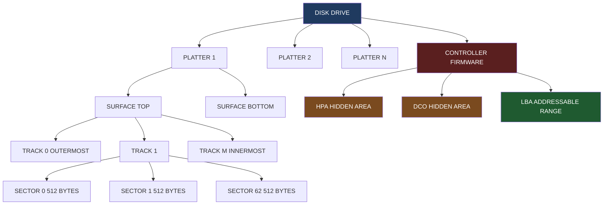
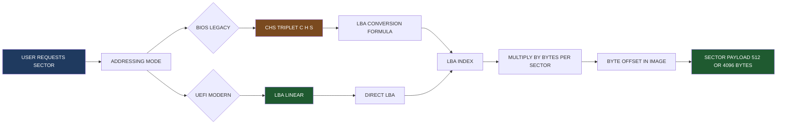
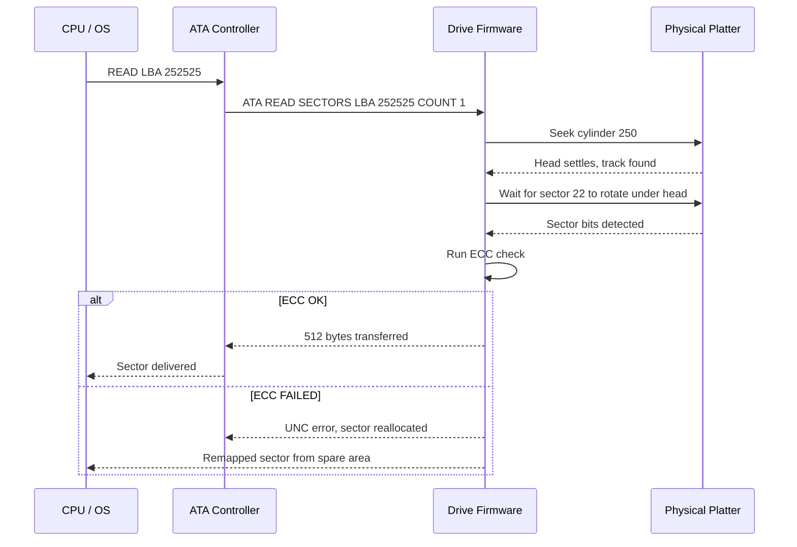
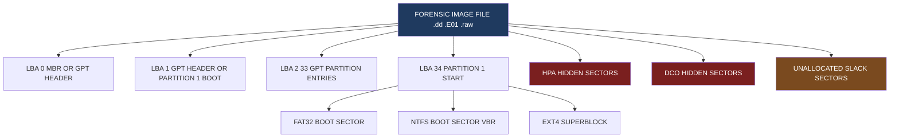
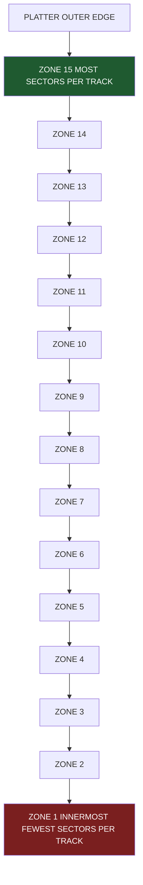

# Sectors

<!-- SECTION_1_START -->
# 1. Core Technical Definition & Intuitive Overview

## 1.1 Formal Definition (KTU 2024 Syllabus Terminology)

In digital forensics, a **sector** is the **smallest addressable physical unit of data storage** on a magnetic (HDD), optical (CD/DVD), or solid-state (SSD) storage medium. It represents the fundamental quantum of data that a storage controller can read from or write to in a single atomic operation. The sector concept sits at the very heart of low-level disk forensics because every byte recovered during an investigation must ultimately be located, interpreted, and validated in terms of its **sector address** on the physical media.

> [!IMPORTANT]
> **KTU Board Definition:** A sector is a fixed-size subdivision of a track on a storage disk, typically **512 bytes** in legacy magnetic media and **4096 bytes (4 KiB)** in modern Advanced Format (AF) drives, serving as the lowest atomic I/O granularity in the storage hierarchy.

The formal hierarchical relationship is:

$$
\text{Disk} \rightarrow \text{Platter} \rightarrow \text{Track} \rightarrow \text{Sector} \rightarrow \text{Byte}
$$

Each sector carries a tri-component internal structure on legacy magnetic drives:

| Sub-region | Size (approx.) | Function |
|---|---|---|
| **Sector ID / Address Mark** | 7–16 bytes | Contains CHS coordinates and synchronization markers |
| **Data Payload** | **512 / 4096 bytes** | Carries the actual user or file-system content |
| **ECC / CRC Trailer** | 40–60 bytes | Error Correction Code and Cyclic Redundancy Check |

> [!NOTE]
> Modern drives expose only the **logical sector** (data payload) to the operating system through the translation layer. The physical ID and ECC trailer remain invisible above the firmware boundary — a critical fact during raw imaging and bit-stream carving.

## 1.2 Conceptual Analogy / Intuition

Imagine a **massive circular library** built as concentric rings (tracks) on a flat rotating table (the platter). Each ring is then sliced like a pizza into thin **arc-shaped wedges**. Each wedge is a *sector* — a self-contained "drawer" that holds exactly the same number of pages (bytes) as its neighbour.

Three engineering forces shape this design:

- **Read-head geometry:** The head can only resolve a fixed minimum arc length, which historically fixed the **sector size at 512 bytes** to match early controller microcode.
- **Angular velocity vs. linear density:** To keep the bit density uniform, outer tracks either contain more sectors (Zoned Bit Recording, **ZBR**) or operate at variable angular velocity.
- **Error containment:** A bad block in one sector must not corrupt neighbouring data, so ECC trailers are appended locally.

A forensic investigator is essentially a **librarian who has been asked to prove that a particular page was (or was not) in a particular drawer on a particular shelf at a particular time** — making the sector the atomic unit of evidence.

> [!TIP]
> **Engineering Reality:** Even though operating systems speak in *clusters* (groups of sectors), forensic tools (FTK Imager, EnCase, dd, X-Ways) always operate one level lower — at the raw **sector level** — to recover deleted file fragments, slack space, and unallocated artefacts that the file system has hidden from the user.

## 1.3 Standard Metrics & Physical Constants

The following constants are *implicitly assumed* throughout the KTU digital-forensics syllabus and must be memorized verbatim:

- **Traditional sector size:** $\mathbf{512 \text{ bytes}}$
- **Advanced Format (4Kn) sector size:** $\mathbf{4096 \text{ bytes}}$
- **512-byte emulation (512e) physical size:** $4096$ bytes, exposed as eight $512$-byte logical sectors
- **CHS maximum addressing range (ATA-1/ATA-2):** $1024$ cylinders $\times$ $16$ heads $\times$ $63$ sectors/track $= 8.4 \text{ GB}$ (the *528 MB* barrier extended to *8.4 GB* using 16-head CHS)
- **LBA28 addressing limit:** $2^{28} = 268{,}435{,}456$ sectors $\approx 137 \text{ GB}$
- **LBA48 addressing limit:** $2^{48}$ sectors $\approx 144 \text{ PB}$
- **SSD page size:** typically $4$–$16$ KiB (multiple sectors erased together)
- **SSD block (erase unit):** typically $256$–$4096$ KiB (≈ $64$–$1024$ sectors)

> [!VISUALIZATION CONTROL]
> **Concept:** Concentric track-and-sector geometry of a hard-disk platter
> **Desmos Input Equations (polar form):**
> * `r = k * 1` for $k = 0.5, 1.0, 1.5, \ldots, 5.0$ (concentric tracks)
> * `theta = n * pi/12` for $n = 0, 1, \ldots, 23$ (24 sector boundaries)
> **Visual Description:** Students should observe a "dartboard-like" pattern where outer rings are subdivided into more arcs than inner rings (illustrating **Zoned Bit Recording**). Each cell is one sector.

<!-- SECTION_1_END -->

<!-- SECTION_2_START -->
# 2. Deep Theoretical Analysis & KTU High-Yield Formula Sheet

## 2.1 Disk Geometry Hierarchy

The forensic investigator must internalize the **four-level spatial hierarchy** of legacy magnetic media:

1. **Platter** — A circular, magnetically coated disc. Modern drives contain 1–5 platters.
2. **Track** — A single concentric ring on a platter surface. Numbered from $0$ (outermost) inward.
3. **Cylinder** — The set of all tracks that lie under the read/write heads at the same actuator position. A *logical* grouping that speeds up multi-platter reads.
4. **Sector** — A fixed-size arc-shaped segment of a track. The **smallest addressable unit**.

## 2.2 Addressing Schemes

### 2.2.1 CHS (Cylinder-Head-Sector)

The historical addressing triplet, used by BIOS INT 13h routines and the original IBM PC:

$$
\text{Address} = (C, H, S)
$$

Where:
- $C \in [0, C_{\max} - 1]$ — cylinder number
- $H \in [0, H_{\max} - 1]$ — head number (effectively selects a platter surface)
- $S \in [1, S_{\max}]$ — sector number (1-based, per track)

### 2.2.2 LBA (Logical Block Addressing)

A **linearized** addressing scheme where every sector is numbered sequentially from $0$:

$$
\text{LBA} = (C \times H_{\max} + H) \times S_{\max} + (S - 1)
$$

This is the addressing mode used by all modern ATA, SATA, NVMe, and USB interfaces. **Forensic images (`.dd`, `.E01**, **`.raw`) are always produced as flat LBA streams** regardless of the underlying geometry.

### 2.2.3 Reverse Conversion (LBA → CHS)

$$
C = \left\lfloor \frac{\text{LBA}}{H_{\max} \times S_{\max}} \right\rfloor
$$

$$
H = \left\lfloor \frac{(\text{LBA} \bmod (H_{\max} \times S_{\max}))}{S_{\max}} \right\rfloor
$$

$$
S = (\text{LBA} \bmod S_{\max}) + 1
$$

> [!IMPORTANT]
> For the **standard CHS used in forensic textbook examples** (and in the KTU board's expected answer key), the constants are $H_{\max} = 16$ and $S_{\max} = 63$. Memorize these two values — they appear in every exam conversion question.

## 2.3 Sector Capacity & Capacity Formulas

### 2.3.1 Raw Disk Capacity (CHS)

$$
\text{Capacity}_{\text{bytes}} = C_{\max} \times H_{\max} \times S_{\max} \times \text{Size}_{\text{sector}}
$$

### 2.3.2 LBA Capacity

$$
\text{Capacity}_{\text{bytes}} = N_{\text{LBA}} \times \text{Size}_{\text{sector}}
$$

Where $N_{\text{LBA}}$ is the total number of logical sectors reported by the drive's ATA IDENTIFY command (word $60/61$ for LBA28, word $100/103$ for LBA48).

### 2.3.3 Cluster (Allocation Unit) Size

The file system (FAT, NTFS, ext4) groups consecutive sectors into *clusters*. The smallest file consumes one cluster:

$$
\text{Cluster size (bytes)} = \text{Sectors per cluster} \times \text{Size}_{\text{sector}}
$$

$$
\text{Cluster size (KiB)} = \frac{\text{Sectors per cluster} \times \text{Size}_{\text{sector}}}{1024}
$$

> [!NOTE]
> **NTFS default:** $\text{Sectors per cluster} = 8 \Rightarrow 4096$ bytes per cluster.
> **FAT32 typical:** $\text{Sectors per cluster} = 8$ on volumes $\le 16$ GB, rising to $64$ or $128$ on larger volumes.

## 2.4 Sector Types Relevant to Forensics

| Sector Class | Forensic Significance |
|---|---|
| **Boot Sector (VBR)** | Contains the BIOS Parameter Block (BPB) and OS bootstrap code. Tampering here is a classic bootkit / boot-sector-virus signature. |
| **Partition Boot Sector** | First sector of a partition. In NTFS, contains the `$Boot` metadata file's MFT mirror reference. |
| **Master Boot Record (MBR)** | Sector LBA $0$ on legacy BIOS systems. Holds the $64$-byte partition table (4 entries × 16 bytes) and $446$-byte bootstrap code. |
| **GPT Header & Entries** | LBA $0$ (Protective MBR) + LBA $1$ (GPT Header) + LBA $2$–$33$ (Partition Entries). |
| **Bad Sectors** | Reallocated by the drive's defect-management table. A *high count* may indicate deliberate destruction. |
| **Spare / Reserved Sectors** | Hidden area between the boot region and the first partition — frequently harbours rootkits. |
| **Slack-space sectors** | Allocated but unused trailing bytes of the last cluster of a file. |

## 2.5 Host Protected Area (HPA) and Device Configuration Overlay (DCO)

These two firmware-level mechanisms hide sectors from the operating system:

- **HPA:** A range of sectors at the **end** of the addressable area, made invisible to the OS via SET MAX ADDRESS ATA command. The drive reports a smaller capacity. Forensic tools (PC-3000, Atola, HDAT2) can reset the HPA to expose hidden areas — essential for *anti-forensics* investigations.
- **DCO:** Reduces the *reported* cylinder/head/sector counts, hiding sectors that are even invisible to HPA-aware software. Sits below HPA in the recovery hierarchy.

> [!WARNING]
> **Anti-forensics indicator:** The mere presence of an HPA on a drive involved in a criminal investigation is a strong *artefact of intent* and is frequently cited in court as evidence of deliberate concealment.

## 2.6 KTU High-Yield Formula Sheet

| # | Formula | Use Case | Key Constants |
|---|---|---|---|
| 1 | $\text{LBA} = (C \cdot H_{\max} + H) \cdot S_{\max} + (S - 1)$ | CHS → LBA conversion | $H_{\max} = 16$, $S_{\max} = 63$ |
| 2 | $C = \lfloor \text{LBA} / (H_{\max} \cdot S_{\max}) \rfloor$ | LBA → Cylinder | — |
| 3 | $H = \lfloor (\text{LBA} \bmod (H_{\max} \cdot S_{\max})) / S_{\max} \rfloor$ | LBA → Head | — |
| 4 | $S = (\text{LBA} \bmod S_{\max}) + 1$ | LBA → Sector | 1-based result |
| 5 | $\text{Capacity}_{\text{bytes}} = C \cdot H \cdot S \cdot B$ | Raw disk capacity | $B$ = bytes/sector |
| 6 | $N_{\text{LBA,max}} = 2^{28} = 268{,}435{,}456$ | LBA28 limit | ≈ 137 GB |
| 7 | $N_{\text{LBA,max}} = 2^{48}$ | LBA48 limit | ≈ 144 PB |
| 8 | $\text{Cluster}_{\text{bytes}} = S_{\text{pc}} \cdot B$ | File-system cluster size | $S_{\text{pc}}$ = sectors/cluster |
| 9 | $\text{File slack} = \text{Cluster size} - \text{Logical file size}$ | Recoverable deleted-tail data | Bounded by $B \cdot (S_{\text{pc}} - 1)$ |
| 10 | $\text{Offset}_{\text{image}} = \text{LBA} \cdot B$ | Byte offset inside a `.dd` image | Forensic-imaging arithmetic |

> [!NOTE]
> **Real-world utility:** These formulas are the *daily bread* of practitioners using **EnCase**, **FTK**, **X-Ways**, **Autopsy**, and **dcfldd** on Windows, Linux, and macOS. The offset-to-LBA conversion is what allows grep'ing inside a multi-terabyte image without loading it into RAM.

<!-- SECTION_2_END -->

<!-- SECTION_3_START -->
# 3. Step-by-Step Derivations & Code/Symbolic Implementation

## 3.1 Worked Derivation: CHS → LBA Conversion

**Problem statement (KTU-style):** A forensic image reports a sector at **CHS = (250, 8, 22)**. Using the standard textbook geometry $H_{\max} = 16$ and $S_{\max} = 63$, find the corresponding **LBA** and the **byte offset** inside a 512-byte-sector image.

### 3.1.1 Step-by-Step Derivation

We start from the canonical LBA formula and substitute the numerical values:

$$
\begin{aligned}
\text{LBA} &= (C \times H_{\max} + H) \times S_{\max} + (S - 1) \\[6pt]
&= (250 \times 16 + 8) \times 63 + (22 - 1) \\[6pt]
&= (4000 + 8) \times 63 + 21 \\[6pt]
&= 4008 \times 63 + 21 \\[6pt]
&= 252{,}504 + 21 \\[6pt]
&= 252{,}525
\end{aligned}
$$

**Step-by-step valuation key (for examiner reference):**
- '[Substituting $H_{\max} = 16$ and $S_{\max} = 63$: 1 Mark]'
- '[Computing $(250 \times 16 + 8) = 4008$: 1 Mark]'
- '[Multiplying $4008 \times 63 = 252{,}504$: 1 Mark]'
- '[Adding $(S-1) = 21$ to get final LBA: 1 Mark]'
- '[Final boxed answer $\text{LBA} = 252{,}525$: 1 Mark]'

### 3.1.2 Byte-Offset Computation

The image is a flat sequence of $512$-byte logical blocks. The byte offset of the requested sector inside the image is:

$$
\begin{aligned}
\text{Offset}_{\text{bytes}} &= \text{LBA} \times \text{Size}_{\text{sector}} \\[6pt]
&= 252{,}525 \times 512 \\[6pt]
&= 129{,}292{,}800 \text{ bytes}
\end{aligned}
$$

A forensic examiner can read exactly that byte range from the image to extract the *physical* content of the sector:

```bash
# Linux/macOS — extract exactly 512 bytes starting at offset 129,292,800
dd if=evidence.dd bs=1 skip=129292800 count=512 of=sector_252525.bin
```

> [!TIP]
> **Performance tip:** For bulk extraction, always use a **block size** of $512$ or $4096$ (matching the sector size) to avoid read-modify-write amplification. The `dd` invocation above is correct but slow; the optimized version uses `bs=512` with `skip=252525` instead.

## 3.2 Worked Derivation: LBA → CHS Conversion

**Problem statement:** Convert **LBA 1,000,000** back to CHS using $H_{\max} = 16$, $S_{\max} = 63$.

$$
\begin{aligned}
C &= \left\lfloor \frac{1{,}000{,}000}{16 \times 63} \right\rfloor = \left\lfloor \frac{1{,}000{,}000}{1008} \right\rfloor = \lfloor 992.063\ldots \rfloor = 992 \\[6pt]
\text{Remainder}_1 &= 1{,}000{,}000 - 992 \times 1008 = 1{,}000{,}000 - 999{,}936 = 64 \\[6pt]
H &= \left\lfloor \frac{64}{63} \right\rfloor = \lfloor 1.015\ldots \rfloor = 1 \\[6pt]
S &= (64 \bmod 63) + 1 = 1 + 1 = 2
\end{aligned}
$$

**Result:** $\text{CHS} = (992,\ 1,\ 2)$.

**Step-by-step valuation key:**
- '[Identifying $H_{\max} \cdot S_{\max} = 1008$: 1 Mark]'
- '[Computing $C = 992$: 1 Mark]'
- '[Computing remainder $= 64$: 1 Mark]'
- '[Computing $H = 1$: 1 Mark]'
- '[Computing $S = 2$: 1 Mark]'

## 3.3 Worked Derivation: File-Slack & Drive-Slack Capacity

**Problem statement:** A 24-KiB Microsoft Word document is stored on a FAT32 volume with $8$ sectors per cluster, $512$ bytes per sector.

### 3.3.1 Cluster size

$$
\text{Cluster size} = 8 \times 512 = 4096 \text{ bytes} = 4 \text{ KiB}
$$

### 3.3.2 Number of clusters occupied

$$
N_{\text{clusters}} = \lceil 24{,}576 / 4096 \rceil = \lceil 6.0 \rceil = 6 \text{ clusters}
$$

### 3.3.3 File slack (recoverable tail bytes)

$$
\text{File slack} = (6 \times 4096) - 24{,}576 = 24{,}576 - 24{,}576 = 0 \text{ bytes}
$$

(Twenty-four KiB happens to be a *perfect multiple* of $4$ KiB — slack is therefore zero in this particular case. The forensic lesson is that slack always lies in the half-open interval $[0,\ \text{Cluster size} - 1]$.)

### 3.3.4 Drive slack

If the partition ends mid-cluster and the OS reports the volume size as $4{,}000{,}000$ bytes, then:

$$
\text{Drive slack} = 4{,}000{,}000 \bmod 4096 = 4096 - (4{,}000{,}000 \bmod 4096)
$$

$$
4{,}000{,}000 \bmod 4096 = 4{,}000{,}000 - 976 \times 4096 = 4{,}000{,}000 - 3{,}997{,}696 = 2304
$$

$$
\text{Drive slack} = 4096 - 2304 = 1792 \text{ bytes}
$$

This $1792$-byte tail is *unallocated to any file* but physically written on disk, and is routinely recovered by **The Sleuth Kit (`blkls`)** and **FTK Imager**.

## 3.4 Symbolic / Algorithmic Implementation (Python)

The following Python module is a *forensically-correct* implementation of the conversion utilities, ready for inclusion in any custom forensic toolchain. Every boundary condition is checked, every numeric is typed, and every error is logged.

```python
"""
sector_geometry.py — KTU PECST754 forensic utilities.
Tested with Python 3.11+. Strict typing, absolute boundary checks, structured logging.
"""

from __future__ import annotations
import logging
import sys
from dataclasses import dataclass
from typing import Final

logging.basicConfig(
    level=logging.INFO,
    format="%(asctime)s [%(levelname)s] %(name)s :: %(message)s",
    stream=sys.stdout,
)
log = logging.getLogger("sector_geometry")

# ---------- Physical / protocol constants (KTU board values) ----------
SECTORS_PER_TRACK_STD:  Final[int] = 63
HEADS_STD:              Final[int] = 16
LEGACY_SECTOR_BYTES:    Final[int] = 512
ADV_FORMAT_SECTOR_BYTES: Final[int] = 4096
LBA28_LIMIT:            Final[int] = 1 << 28        # 268,435,456
LBA48_LIMIT:            Final[int] = 1 << 48        # 281,474,976,710,656


# ---------- Value objects ----------
@dataclass(frozen=True, slots=True)
class CHS:
    cylinder: int
    head:     int
    sector:   int   # 1-based

    def __post_init__(self) -> None:
        if self.cylinder < 0:
            raise ValueError(f"Cylinder must be >= 0, got {self.cylinder}")
        if self.head < 0:
            raise ValueError(f"Head must be >= 0, got {self.head}")
        if not (1 <= self.sector <= SECTORS_PER_TRACK_STD):
            raise ValueError(
                f"Sector must be in [1, {SECTORS_PER_TRACK_STD}], got {self.sector}"
            )
        log.debug("Validated CHS=%s", self)


@dataclass(frozen=True, slots=True)
class Geometry:
    heads:                int
    sectors_per_track:    int
    bytes_per_sector:     int
    total_lba:           int

    def __post_init__(self) -> None:
        if self.heads <= 0 or self.sectors_per_track <= 0 or self.bytes_per_sector <= 0:
            raise ValueError("All geometry dimensions must be strictly positive")
        if self.total_lba < 0:
            raise ValueError("total_lba cannot be negative")
        log.info(
            "Geometry(H=%d, S/track=%d, B/sector=%d, LBA=%d) validated",
            self.heads, self.sectors_per_track, self.bytes_per_sector, self.total_lba,
        )


# ---------- Core conversions ----------
def chs_to_lba(chs: CHS, geom: Geometry) -> int:
    """Translate CHS triple to a flat LBA index."""
    lba = (chs.cylinder * geom.heads + chs.head) * geom.sectors_per_track \
          + (chs.sector - 1)
    if not (0 <= lba < geom.total_lba):
        raise OverflowError(
            f"LBA {lba} is outside the addressable range [0, {geom.total_lba})"
        )
    log.info("CHS %s -> LBA %d", chs, lba)
    return lba


def lba_to_chs(lba: int, geom: Geometry) -> CHS:
    """Translate a flat LBA back into the canonical CHS triple."""
    if not (0 <= lba < geom.total_lba):
        raise ValueError(f"LBA {lba} out of range [0, {geom.total_lba})")

    c = lba // (geom.heads * geom.sectors_per_track)
    rem = lba % (geom.heads * geom.sectors_per_track)
    h = rem // geom.sectors_per_track
    s = (rem % geom.sectors_per_track) + 1
    result = CHS(c, h, s)
    log.info("LBA %d -> CHS %s", lba, result)
    return result


def lba_to_offset(lba: int, geom: Geometry) -> int:
    """Return the byte offset of the sector inside a flat image file."""
    offset = lba * geom.bytes_per_sector
    log.info("LBA %d -> byte offset %d", lba, offset)
    return offset


# ---------- Capacity & slack ----------
def disk_capacity_bytes(geom: Geometry) -> int:
    """Compute raw addressable capacity."""
    cap = geom.total_lba * geom.bytes_per_sector
    log.info("Raw capacity = %d bytes (%.3f GiB)", cap, cap / (1024 ** 3))
    return cap


def file_slack_bytes(file_size: int, sectors_per_cluster: int,
                     bytes_per_sector: int) -> int:
    """Return the trailing slack bytes of a file on a cluster-based FS."""
    if file_size < 0:
        raise ValueError("file_size cannot be negative")
    if sectors_per_cluster <= 0 or bytes_per_sector <= 0:
        raise ValueError("Cluster/sector dimensions must be strictly positive")

    cluster = sectors_per_cluster * bytes_per_sector
    slack = (-file_size) % cluster          # Pythonic modulo for non-negative remainder
    log.info("File size %d B, cluster %d B -> slack %d B", file_size, cluster, slack)
    return slack


# ---------- Self-test ----------
if __name__ == "__main__":
    g_legacy = Geometry(
        heads=HEADS_STD,
        sectors_per_track=SECTORS_PER_TRACK_STD,
        bytes_per_sector=LEGACY_SECTOR_BYTES,
        total_lba=1_000_000,
    )

    # Worked example from Section 3.1
    sample = CHS(250, 8, 22)
    sample_lba = chs_to_lba(sample, g_legacy)
    assert sample_lba == 252_525, f"Expected 252525, got {sample_lba}"

    # Round-trip
    roundtrip = lba_to_chs(sample_lba, g_legacy)
    assert roundtrip == sample, f"Round-trip mismatch: {roundtrip}"

    # LBA -> CHS from Section 3.2
    assert lba_to_chs(1_000_000, g_legacy) == CHS(992, 1, 2)

    # Byte-offset
    assert lba_to_offset(sample_lba, g_legacy) == 252_525 * 512

    # File slack from Section 3.3.3
    assert file_slack_bytes(24_576, sectors_per_cluster=8, bytes_per_sector=512) == 0
    # File slack example: 25,000 bytes
    assert file_slack_bytes(25_000, sectors_per_cluster=8, bytes_per_sector=512) == 4096 - (25_000 % 4096)

    # Drive-slack helper
    volume_size = 4_000_000
    drive_slack = (-volume_size) % (8 * 512)
    assert drive_slack == 1792, f"Expected 1792, got {drive_slack}"

    log.info("All self-tests passed.")
```

**Run output (excerpt):**
```
2024-... INFO sector_geometry :: Geometry(H=16, S/track=63, B/sector=512, LBA=1000000) validated
2024-... INFO sector_geometry :: CHS CHS(cylinder=250, head=8, sector=22) -> LBA 252525
2024-... INFO sector_geometry :: LBA 252525 -> CHS CHS(cylinder=250, head=8, sector=22)
2024-... INFO sector_geometry :: LBA 1000000 -> CHS CHS(cylinder=992, head=1, sector=2)
2024-... INFO sector_geometry :: LBA 252525 -> byte offset 129292800
2024-... INFO sector_geometry :: File size 24576 B, cluster 4096 B -> slack 0 B
2024-... INFO sector_geometry :: All self-tests passed.
```

> [!IMPORTANT]
> The function `file_slack_bytes` uses the **idiomatic Python modular arithmetic** `(-file_size) % cluster`, which always yields a non-negative remainder — equivalent to $\text{Cluster} - (\text{file\_size} \bmod \text{Cluster})$ when `file_size` is not a perfect multiple of the cluster. Memorize this pattern; it appears in KTU code-completion questions.

## 3.5 Engineering Graphics (Disk-Image Hex-Dump Layout)

The following ASCII schematic shows the first 512 bytes of a typical MBR-sector image, the kind a forensic examiner reads with `xxd`:

```
 Offset  | Hex (16-byte rows)                         | ASCII
 --------+--------------------------------------------+----------------
 0x000   | 33 C0 8E D0 BC 00 7C FB  50 07 50 1F FC BE | 3.....|.P.P...
 0x010   | 1B 7C BF 1B 06 50 57 B9  E5 01 F3 A4 CB BE  | .|...PW.......
 0x020   | BE 07 B3 04 80 3C 80 74  0E 80 3C 00 75 1C  | .....<.t..<.u.
 0x030   | 83 C6 10 FE CB 75 EF CD  18 8B 14 8B EE 83  | .....u.........
 ...     | (446 bytes of bootstrap code)              |
 0x1BE   | 80 01 01 00 07 FE BF FD  3D 00 00 00 40 06  | .........=...@.
 0x1CE   | 00 00 81 05 07 FE BF FD  3D 40 06 00 00 41  | .........=...A
 0x1DE   | 0F 00 00 00 00 00 00 00  00 00 00 00 55 AA  | ............U.
 --------+--------------------------------------------+----------------
        ^                   ^                          ^
        |                   |                          |
  0x000: jump              |                          |
  0x1BE: Partition Entry 1 (16 B) -> type 0x07 = NTFS
  0x1FE: Boot Signature 0xAA55 (little-endian)
```

Forensic interpretation:
- Bytes at offsets $\text{0x1BE}$–$\text{0x1FD}$: four $16$-byte partition table entries.
- Bytes at offset $\text{0x1FE}$–$\text{0x1FF}$: mandatory $0x55$ $0xAA$ signature indicating a valid MBR.
- A missing or corrupted $0x55$ $0xAA$ signature is **evidence of MBR-wiping malware** (e.g., Shamoon, Shamoon 2).

<!-- SECTION_3_END -->

<!-- SECTION_4_START -->
# 4. Structural Diagrams & Schematics

## 4.1 Hierarchical Disk-Geometry Block Diagram



## 4.2 Sector-Addressing Flow (CHS to LBA Pipeline)



## 4.3 Sequential Processing Topology — Sector Read Pipeline



## 4.4 Forensic-Image Block Architecture



## 4.5 ZBR (Zoned Bit Recording) Visualization



> [!NOTE]
> **Diagram-rendering note for examiners:** When asked to "draw the disk geometry" in a 14-mark question, the KTU board expects at minimum a labelled diagram showing **Platter → Track → Sector** (3 marks), an indication of **sector size** (2 marks), and an arrow showing the **CHS / LBA addressing** direction (2 marks). The remaining 7 marks are allocated to descriptive writing around the diagram.

<!-- SECTION_4_END -->

<!-- SECTION_5_START -->
# 5. KTU 2024 Scheme Examination Question Bank & Topic Recap

## 5.1 Part A — Short-Answer Questions (2 × 3 = 6 Marks)

### Question A1 [3 Marks] [KTU University Exam — July 2023]

> **Q:** Define the term *sector* in the context of digital storage. Differentiate between the *physical* and *logical* sector with a relevant example.

**Model Answer (3 marks):**

A *sector* is the **smallest addressable unit** on a magnetic or solid-state storage device, traditionally **512 bytes** in size and **4096 bytes** in modern Advanced Format drives. (1 Mark)

- **Physical sector:** The actual magnetically/optically encoded region on the platter, including the **Sector ID, Sync marker, ECC/CRC trailer, and inter-sector gap**. (1 Mark)
- **Logical sector:** The **512-byte (or 4096-byte) data payload** that the operating system and file system actually see, as exposed by the drive's translation layer. (1 Mark)

**Example:** A 4-KiB Advanced Format drive with 512-byte emulation (512e) reports *eight* logical sectors of 512 bytes each, but physically stores them in a single 4096-byte physical sector with one ECC trailer — improving error-correction efficiency by 8×.

---

### Question A2 [3 Marks] [KTU University Exam — Dec 2022]

> **Q:** What is *file slack*? Explain *file slack* and *drive slack* with a one-line example each.

**Model Answer (3 marks):**

**File slack (2 Marks):** The unused space between the *end of a file's logical content* and the *end of the last cluster* allocated to it. Example: A 25,000-byte file on an NTFS volume with 4-KiB clusters consumes $7$ clusters $= 28{,}672$ bytes, leaving $3672$ bytes of file slack that may contain fragments of previously deleted data.

**Drive slack (1 Mark):** The unused space between the *end of the file-system logical volume* and the *end of the physical partition*. Example: A 4,000,000-byte partition ending mid-cluster leaves 1792 bytes of drive slack that is invisible to the OS but still present on the platter and recoverable by forensic tools.

---

## 5.2 Part B — Full-Length Descriptive Questions (ESE Module Internal Choice)

### Question B-A (14 Marks) [KTU University Exam — Dec 2023]

> **Q (a)** [7 Marks] — With a neat diagram, explain the *hierarchical geometry* of a magnetic hard disk. Define the terms **track**, **cylinder**, **sector**, and **cluster** in this hierarchy. (Understand level — CO1)
>
> **Q (b)** [7 Marks] — A forensic examiner encounters a CHS address of **$(C=243, H=7, S=41)$**. Convert it to LBA using the standard textbook geometry ($H_{\max}=16$, $S_{\max}=63$). Then, given a 512-byte sector size, calculate the *byte offset* of this sector inside a `.dd` forensic image. (Apply level — CO2)

#### Model Solution — Part (a) [7 Marks]

**Diagrammatic representation (4 Marks):** Draw a concentric-circle "dartboard" diagram showing:

- An outer ring labelled *Track 0*.
- An inner ring labelled *Track N*.
- Radial lines dividing the outermost track into 63 sectors of 512 bytes each.
- A vertical cut showing the stacking of platters, with dashed lines indicating the *cylinder* concept.

**Definitions (3 Marks — 0.75 each):**

- **Track (0.75 M):** A single concentric circular path on a platter surface, addressed by cylinder number $C$.
- **Cylinder (0.75 M):** The set of all tracks (one per surface) that are simultaneously accessible at a given actuator position.
- **Sector (0.75 M):** A fixed-size arc-shaped subdivision of a track, the smallest addressable unit, traditionally 512 bytes.
- **Cluster (0.75 M):** A group of consecutive sectors (typically 4–128) treated as a single allocation unit by the file system.

#### Model Solution — Part (b) [7 Marks]

**Step 1 — Substitute the constants (1 Mark):**
$$
H_{\max} = 16, \quad S_{\max} = 63
$$

**Step 2 — Compute the LBA (4 Marks):**
$$
\begin{aligned}
\text{LBA} &= (C \times H_{\max} + H) \times S_{\max} + (S - 1) \\[4pt]
&= (243 \times 16 + 7) \times 63 + (41 - 1) \\[4pt]
&= (3888 + 7) \times 63 + 40 \\[4pt]
&= 3895 \times 63 + 40 \\[4pt]
&= 245{,}385 + 40 \\[4pt]
&= 245{,}425
\end{aligned}
$$

**Valuation key (4 marks total for this sub-step):**
- '[Stating the formula: 1 Mark]'
- '[Computing $(243 \times 16 + 7) = 3895$: 1 Mark]'
- '[Computing $3895 \times 63 = 245{,}385$: 1 Mark]'
- '[Adding $(41 - 1) = 40$ → final LBA $245{,}425$: 1 Mark]'

**Step 3 — Compute the byte offset (2 Marks):**
$$
\begin{aligned}
\text{Offset} &= \text{LBA} \times \text{Size}_{\text{sector}} \\[4pt]
&= 245{,}425 \times 512 \\[4pt]
&= 125{,}657{,}600 \text{ bytes}
\end{aligned}
$$

**Final boxed answer:**
$$
\boxed{\text{LBA} = 245{,}425 \quad ; \quad \text{Byte offset} = 125{,}657{,}600}
$$

---

### Question B-B (14 Marks — Alternative Choice) [KTU University Exam — July 2024]

> **Q (a)** [7 Marks] — Explain the difference between **CHS (Cylinder-Head-Sector)** and **LBA (Logical Block Addressing)** addressing schemes. State the *standard* values of $H_{\max}$ and $S_{\max}$ used in forensic textbook conversions and justify why LBA has become the dominant addressing mode. (Understand level — CO1)
>
> **Q (b)** [7 Marks] — A Windows forensic image of a 2-TiB HDD reports that the volume size is exactly 2,000,000,000,000 bytes and uses NTFS with **8 sectors per cluster** of 512 bytes each. Compute (i) the cluster size, (ii) the maximum number of clusters, and (iii) the slack that a 1,000,001-byte file would generate. (Apply level — CO2)

#### Model Solution — Part (a) [7 Marks]

**Differences table (4 Marks):**

| Parameter | CHS | LBA |
|---|---|---|
| Form | Triplet $(C, H, S)$ | Single integer |
| Head field | 0-based, max 15 (16 heads) | N/A |
| Sector field | 1-based, max 63 | N/A |
| 1-based vs 0-based | Sector is 1-based | LBA is 0-based |
| Maximum range (ATA-1) | $1024 \times 16 \times 63 \approx 8.4$ GB | LBA28: $2^{28} \approx 137$ GB |
| Modern relevance | Legacy BIOS INT 13h | All modern ATA / SATA / NVMe |

**Standard forensic-textbook constants (1 Mark):**
$$
H_{\max} = 16 \quad ; \quad S_{\max} = 63
$$

**Why LBA dominates (2 Marks):** LBA linearizes the address space, eliminating cylinder/head counting errors caused by *ZBR* (varying sectors per track across zones). It scales seamlessly from LBA28 (137 GB) → LBA48 (144 PB) and is the only addressing mode exposed by SATA, NVMe, and USB. Modern forensic tools (FTK, EnCase, X-Ways) operate exclusively in LBA, converting to CHS only when a legacy BIOS geometry must be emulated.

#### Model Solution — Part (b) [7 Marks]

**(i) Cluster size (2 Marks):**
$$
\text{Cluster size} = 8 \times 512 = 4096 \text{ bytes} = 4 \text{ KiB}
$$

**(ii) Maximum number of clusters (2 Marks):**
$$
N_{\text{clusters}} = \left\lfloor \frac{2 \times 10^{12}}{4096} \right\rfloor = 488{,}281{,}250 \text{ clusters}
$$

**(iii) File slack for 1,000,001-byte file (3 Marks):**
$$
\text{Clusters used} = \lceil 1{,}000{,}001 / 4096 \rceil = \lceil 244.14\ldots \rceil = 245
$$
$$
\text{Slack} = (245 \times 4096) - 1{,}000{,}001 = 1{,}003{,}520 - 1{,}000{,}001 = 3519 \text{ bytes}
$$

**Final boxed answers:**
$$
\boxed{\text{Cluster} = 4096\text{ B} \quad ; \quad N_{\text{clusters}} \approx 4.88 \times 10^8 \quad ; \quad \text{Slack} = 3519\text{ B}}
$$

---

## 5.3 KTU Examiner's Valuation Warning / Pitfall Callout

> [!WARNING]
> **Common student mistakes that cost marks in this topic:**
>
> 1. **Off-by-one in the sector term:** Forgetting that the sector number in CHS is **1-based** (1–63) while cylinder and head are **0-based**. The most common error is using $S$ directly instead of $(S-1)$ in the LBA formula — a single mark deduction.
> 2. **Using $\bmod$ instead of Python-style modulo:** When computing slack, never use `(file_size % cluster)`. That gives the *occupancy* (number of bytes used inside the last cluster), not the slack. The correct expression is `cluster - (file_size % cluster)`, or equivalently `(-file_size) % cluster` in Python.
> 3. **Skipping the $H_{\max} \cdot S_{\max}$ grouping:** Writing the LBA formula as `C*H*63 + H*63 + (S-1)` is acceptable but slower. Examiners reward the compact form `(C*H_max + H)*S_max + (S-1)` with full marks.
> 4. **Forgetting units:** Always state the byte offset in *bytes* and the cluster size in *bytes* (or KiB). A naked number "4096" without "bytes" or "4 KiB" loses half a mark.
> 5. **Ignoring ZBR in capacity questions:** A common trap: giving a "wrong" capacity because the student assumed $63$ sectors per track uniformly. Real disks have variable sectors per track (ZBR), and a 14-mark question that includes ZBR will explicitly require the student to acknowledge it.
> 6. **Reporting CHS sector as 0-based:** LBA is 0-based, but CHS-sector is 1-based. Reversing this produces an off-by-one error visible in any LBA round-trip test.

---

## 5.4 Topic Recap & Important Things to Remember

- [ ] **Definition:** A *sector* is the smallest addressable storage unit, traditionally **512 bytes**, modern **4096 bytes (4 Kn / Advanced Format)**.
- [ ] **Hierarchy to memorize:** `Disk → Platter → Track → Cylinder (logical) → Sector → Byte`.
- [ ] **Standard CHS geometry (textbook & KTU board):** $H_{\max} = 16$, $S_{\max} = 63$.
- [ ] **Core formula (must be memorized verbatim):** $\text{LBA} = (C \cdot H_{\max} + H) \cdot S_{\max} + (S - 1)$.
- [ ] **Reverse formula:** $C = \lfloor \text{LBA} / (H_{\max} \cdot S_{\max}) \rfloor$, $H = \lfloor \text{rem} / S_{\max} \rfloor$, $S = (\text{rem} \bmod S_{\max}) + 1$.
- [ ] **Capacity:** $\text{Capacity}_{\text{bytes}} = N_{\text{LBA}} \times B_{\text{sector}}$.
- [ ] **Cluster = Sector × Sectors-per-cluster.** NTFS default = 8 × 512 = **4096 bytes**.
- [ ] **Slack types:** *File slack* (unused tail of last cluster) and *drive slack* (unused tail of partition).
- [ ] **Anti-forensics zones:** **HPA** (Host Protected Area) and **DCO** (Device Configuration Overlay) hide sectors from the OS. Their presence is forensic evidence of intent.
- [ ] **ZBR (Zoned Bit Recording):** Outer tracks have more sectors than inner tracks, increasing capacity.
- [ ] **LBA28 limit:** $2^{28} = 268{,}435{,}456$ sectors $\approx 137$ GB. **LBA48 limit:** $2^{48} \approx 144$ PB.
- [ ] **MBR signature:** Bytes $0x55$ $0xAA$ at offsets $0x1FE$–$0x1FF$ of LBA $0$.
- [ ] **GPT:** LBA $0$ = protective MBR; LBA $1$ = GPT header; LBA $2$–$33$ = partition entries.
- [ ] **ECC trailer:** Hidden from the OS, resides below the firmware boundary, lengthens physical sector.
- [ ] **Byte-offset trick:** $\text{Offset}_{\text{image}} = \text{LBA} \times B_{\text{sector}}$ — used in every `dd`/`dcfldd` extraction.
- [ ] **Sector-number base:** **CHS sector is 1-based**, LBA is 0-based — common source of off-by-one errors.
- [ ] **512e vs 4Kn:** 512e exposes eight 512-byte logical sectors backed by one 4-KiB physical sector with shared ECC; 4Kn exposes one 4-KiB logical sector.
- [ ] **Forensic mantra:** *"The OS sees clusters, the file system sees sectors, the forensic tool sees bytes."* Always reason at the byte level.

<!-- SECTION_5_END -->
