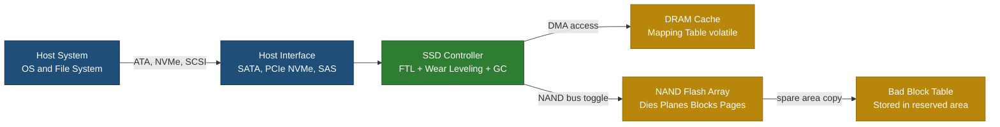
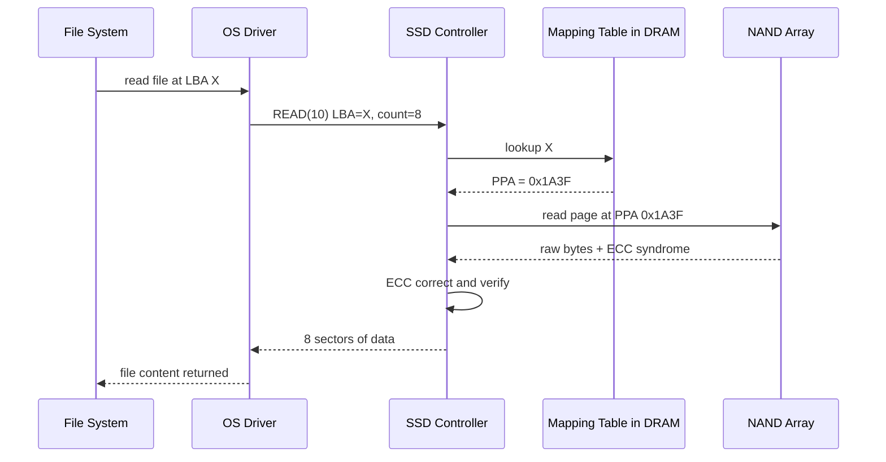
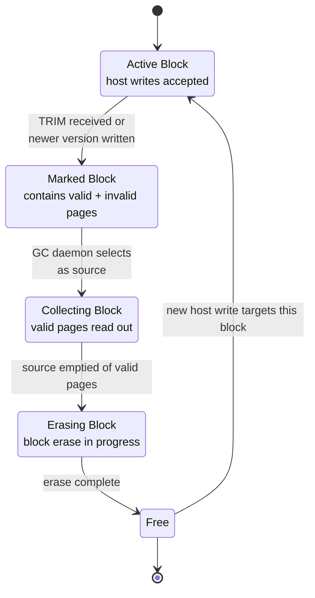
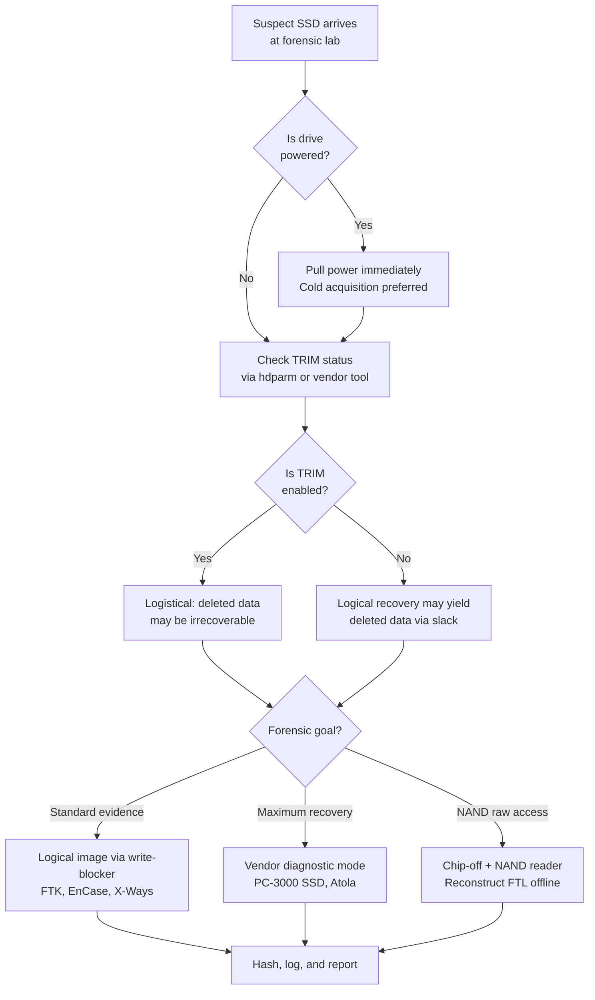
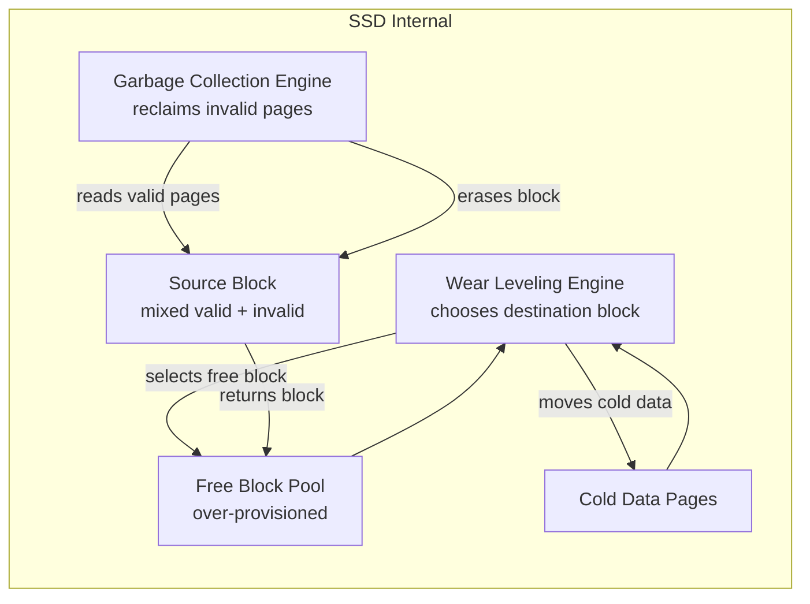

# Solid State Drives (SSD)

<!-- SECTION_1_START -->
# Solid State Drives (SSD) — KTU 2024 Scheme Digital Forensics Notes

> [!IMPORTANT]
> **Module 1 Focus:** SSD is a high-yield topic in Digital Forensics because its internal housekeeping operations (wear leveling, garbage collection, TRIM) actively destroy evidence that an examiner would otherwise recover from a traditional HDD. The 2024 Scheme places strong emphasis on this contrast.

## 1.1 Formal Academic Definition (KTU Syllabus Terminology)

A **Solid State Drive (SSD)** is a non-volatile, block-addressable data storage device that uses **NAND-flash memory** (or, less commonly, **NOR-flash** and **3D XPoint**) as its primary persistent medium, orchestrated by an embedded **flash translation layer (FTL)** controller. From a forensic standpoint, the SSD is treated as a *dynamically-mapped storage device* in which the logical-to-physical address relationship is **continuously remapped** by the controller firmware — making deterministic physical-sector recovery practically impossible after the device has been powered on and used.

> [!NOTE]
> **Key Forensic Axiom (high-board-weight statement):**
> Unlike an HDD, where a logical block address (LBA) $\leftrightarrow$ physical sector mapping is essentially *fixed* (1:1), an SSD's LBA $\leftrightarrow$ page (and page $\leftrightarrow$ block) mapping is **fluid** and governed by the FTL. The examiner never addresses NAND cells directly — only logical blocks.

## 1.2 Conceptual Analogy / Intuition

Imagine a massive **library** with the following rule: every time you return a book, the librarian **must** place it on a *different* shelf from where it was before (to "spread out the wear" on the most-used shelves), and the librarian is **required to shred the old shelf label** so no one can find the old location. The librarian keeps a *secret notebook* (the FTL mapping table) that only the librarian can read.

For a forensic investigator who arrives later:
- The *new* shelf label is visible (the current LBA data) ✓
- The *old* shelf where the book used to be still has a faint imprint ✗
- But the librarian has already sent a robot (the **TRIM** command + **garbage collection**) to **shred the old label and recycle the paper**.

> That is exactly how an SSD treats deleted data — the FTL re-routes new writes to fresh pages, marks the old page as *invalid*, and the housekeeping daemon erases the old block before re-using it.

## 1.3 Core Architecture of an SSD

An SSD is composed of four major sub-systems, each of which has direct forensic implications:

1. **Host Interface Controller** — SATA, NVMe (PCIe), SAS, USB bridge.
2. **SSD Controller (ASIC / Microcontroller)** — runs the FTL, wear-leveling, GC, and bad-block management.
3. **DRAM Cache (optional)** — volatile write buffer; **lost on power-off** → forensic value.
4. **NAND Flash Array** — organized as *Dies → Planes → Blocks → Pages*.

> [!IMPORTANT]
> **Physical NAND Hierarchy to remember for KTU boards:**
>
> $$\text{Die} \rightarrow \text{Plane} \rightarrow \text{Block} \rightarrow \text{Page}$$
>
> * Read/Write operations occur at the **page** granularity.
> * Erase operations occur at the **block** granularity.
> * This asymmetry ($page$-write vs $block$-erase) is the *root cause* of wear leveling and garbage collection.

## 1.4 NAND Flash Cell Types

| Cell Type | Bits per Cell | P/E Cycles (approx.) | Typical Use-Case |
|---|---|---|---|
| **SLC** (Single-Level Cell) | 1 | $\sim 100{,}000$ | Enterprise / Military |
| **MLC** (Multi-Level Cell) | 2 | $\sim 10{,}000$ | Consumer prosumer |
| **TLC** (Triple-Level Cell) | 3 | $\sim 3{,}000$ | Mainstream consumer |
| **QLC** (Quad-Level Cell) | 4 | $\sim 1{,}000$ | Read-heavy archival |

> [!NOTE]
> **Forensic relevance:** The endurance rating directly impacts the **wear-leveling aggressiveness**. A QLC SSD will shuffle data more often than an SLC SSD, accelerating destruction of latent residue.

## 1.5 Visualization (Memory Cell Layout)

> [!VISUALIZATION CONTROL]
> **Concept:** NAND cell threshold-voltage distribution across bit levels.
> **Desmos Input Equations (qualitative, conceptual curves):**
> * $f_{\text{erase}}(V) = e^{-(V+2)^{2}/0.3}$  *(erased state lobe)*
> * $f_{1}(V) = e^{-(V-0)^{2}/0.3}$  *(level 1 lobe)*
> * $f_{0}(V) = e^{-(V+1)^{2}/0.3}$  *(level 0 lobe)*
> **Visual Description:** On the $V_{th}$ (x) axis, the student should see three (MLC) or four (TLC) overlapping Gaussian lobes representing stored charge states. As P/E cycles accumulate, the lobes *spread* (increased **bit-error rate**), eventually overlapping — at which point the ECC can no longer correct and the block is retired.

<!-- SECTION_1_END -->

<!-- SECTION_2_START -->
# Deep Theoretical Analysis & KTU High-Yield Formula Sheet

## 2.1 The Flash Translation Layer (FTL)

The **FTL** is firmware inside the SSD controller that translates host **Logical Block Addresses (LBAs)** into flash **Physical Page Addresses (PPAs)**. For the forensic examiner, the FTL is a *black box* — its internal mapping table is stored in the NAND's reserved (spare) area and is **not exposed** through the standard ATA/SCSI/NVMe command set.

### 2.1.1 FTL Address Translation Procedure (logical walk-through)

1. Host issues `READ LBA = X`.
2. SSD controller consults the in-DRAM mapping table $\mathcal{M}: \text{LBA} \rightarrow \text{PPA}$.
3. If $X$ is unmapped (no entry in $\mathcal{M}$) $\rightarrow$ controller returns the *default* pattern (typically all `0x00` or all `0xFF`).
4. If $X$ is mapped $\rightarrow$ controller reads the **physical page** at the stored PPA.
5. ECC decoder validates the page; if CRC fails after correction, controller marks the page **bad** and remaps.

### 2.1.2 Three FTL Mapping Schemes (board-favorite)

| Scheme | Granularity | Mapping Storage | Forensic Implication |
|---|---|---|---|
| **Page-level** | 1 LBA = 1 page | Very large table | High remap frequency, max evidence destruction |
| **Block-level** | 1 LBA = 1 block (block of $n$ pages) | Medium table | Less remap; partial over-write possible |
| **Hybrid (log-block)** | Page-mapped log + block-mapped data | Adaptive | Most common in real devices; "best of both" |

## 2.2 The Three Foundational SSD Operations

Every SSD behavior — including all forensic artifacts — derives from the asymmetric trio below.

### 2.2.1 Program (Write) Operation

- Performed at **page** granularity (typically **4 KB**, **8 KB**, or **16 KB**).
- Can only set bits from `1 → 0` (Fowler-Nordheim tunneling into the floating gate).
- A page **must be erased** before it can be programmed again.
- *Forensic consequence:* A page cannot be "in-place modified" — every logical overwrite creates a **new physical location** for the data.

### 2.2.2 Read Operation

- Performed at **page** granularity.
- Reads disturb neighboring cells only marginally (**read disturb** is a real but small effect).
- Returned data is **ECC-corrected** in the controller; the *raw* pre-correction bits are *not* exposed.
- *Forensic consequence:* The examiner never sees what the NAND *physically* held, only what the ECC *decided* it meant.

### 2.2.3 Erase Operation

- Performed at **block** granularity (e.g., **128 pages** × **16 KB** = **2 MB** block, or larger).
- Sets *all* bits in the block back to `1`.
- Slow (milliseconds) compared to read/program (microseconds).
- *Forensic consequence:* An erase destroys all residue in the targeted block at once, regardless of whether the forensic analyst only wanted to "delete" one file.

## 2.3 Wear Leveling

**Wear leveling** is the controller's strategy to distribute Program/Erase (P/E) cycles evenly across all NAND blocks to extend drive lifetime.

### 2.3.1 Two Sub-Strategies

1. **Dynamic Wear Leveling** — selects the *least-erased free block* when a new write is needed. Only active data blocks are balanced.
2. **Static Wear Leveling** — moves *cold* (rarely-modified) data from a low-wear block to a high-wear block so the freed low-wear block can serve future writes. This is the more aggressive (and forensic-destructive) variant.

### 2.3.2 Wear-Leveling Forensic Impact

A deleted file's physical page is *not* guaranteed to remain at the same NAND address. After a few hours of normal use, the FTL may have:
- Moved the page to a new block (static wear leveling).
- Erased the old block during garbage collection.
- Reused the page for unrelated data (e.g., a system log line).

> [!WARNING]
> **Examiner Pitfall:** Treating an SSD like an HDD and trusting *block-level imaging* to recover "deleted" sectors. The imaged LBA contents are correct, but **the relationship between LBAs and original physical locations is broken forever** for any block the FTL has since touched.

## 2.4 Garbage Collection (GC)

Garbage collection is the background process that **reclaims invalid (stale) pages** by:

1. Identifying a candidate source block.
2. Reading the *valid* (live) pages from that block.
3. Rewriting those live pages into a *new* free block.
4. Erasing the source block, returning it to the free pool.

> [!NOTE]
> **TRIM vs. Garbage Collection:**
> * **TRIM** is a host-issued *hint* to the SSD that an LBA range is no longer needed.
> * **GC** is the SSD's *internal* process of compacting blocks.
> * TRIM *accelerates* GC; GC still happens even without TRIM.

## 2.5 The TRIM Command

When the OS deletes a file, it normally just marks the directory entry as free. With TRIM enabled (since Windows 7 / 2008 R2 and modern Linux), the OS additionally sends:

$$\text{TRIM}(\text{starting LBA},\ \text{range length})$$

to the SSD, telling it *"these LBAs are now invalid; you may erase their physical pages at your convenience."*

### 2.5.1 Variants of TRIM (board favorite!)

| Command | Standard | Direction | Notes |
|---|---|---|---|
| **ATA TRIM (DSM/TRIM)** | ATA ACS-2/3 | Host $\rightarrow$ Device | Issues LBA range; non-queued |
| **ATA Deterministic TRIM (ZDMAOUT)** | ATA ACS-4 | Host $\rightarrow$ Device | Reads zeros *after* TRIM completes |
| **NVMe TRIM (DSM)** | NVMe 1.0+ | Host $\rightarrow$ Device | Per-range, queued |
| **SCSI UNMAP / WRITE SAME (10/16)** | SBC-3 / SBC-4 | Host $\rightarrow$ Device | Analogous in SAS/SCSI SSDs |

> [!IMPORTANT]
> **Forensic Rule of Thumb:** If `TRIM` is enabled (default on most modern OS+SSD combos), the *practical* recovery of "deleted" files from a *powered-on* SSD is **near zero**. The only reliable way to recover is:
> 1. Pull the power *immediately* (cold acquisition).
> 2. Or use the controller's vendor-specific diagnostic mode (e.g., **PC-3000 SSD**, **Atola TaskForce**) to read raw NAND bypassing the FTL.

## 2.6 Over-Provisioning (OP)

Over-provisioning is the practice of **reserving a portion of NAND capacity** that is *not* visible to the host, used internally by the controller for:
- Bad-block replacement
- Wear-leveling workspace
- Garbage collection destination

$$\text{OP}_{\%} = \frac{C_{\text{raw NAND}} - C_{\text{user-addressable}}}{C_{\text{raw NAND}}} \times 100$$

**Typical values:** Consumer $\approx 7\%$, Enterprise $\approx 28\%$.

> [!NOTE]
> A 256 GB consumer SSD often contains ~$275\ \text{GB}$ of raw NAND — the extra $\sim 19\ \text{GB}$ is invisible to the user.

## 2.7 Bad Block Management

The controller maintains a **Bad Block Table (BBT)** — typically in a dedicated NAND reserved area, often replicated for redundancy. When a block's P/E cycles exceed the rated endurance (or the raw bit-error-rate exceeds the ECC's correction threshold), the BBT marks the block as *bad* and the FTL remaps the affected LBAs to a *spare* block from the over-provisioned area.

> **Forensic consequence:** A "bad" block on a running SSD may still contain *physically readable* data, but the controller will never serve it through normal ATA/NVMe commands. Vendor hardware-imaging tools are required to access it.

## 2.8 KTU High-Yield Formula / Cheat Sheet

| Symbol / Term | Definition | Unit / Typical Value | Notes |
|---|---|---|---|
| $C_{\text{raw}}$ | Raw NAND capacity (with OP) | GB | Larger than user-visible |
| $C_{\text{user}}$ | User-addressable capacity | GB | $C_{\text{user}} = C_{\text{raw}}(1 - \text{OP}_{\%}/100)$ |
| $\text{OP}_{\%}$ | Over-provisioning percentage | \% | Consumer $\sim 7\%$, Enterprise $\sim 28\%$ |
| $N_{\text{PE}}$ | P/E endurance per cell | cycles | SLC $\sim 10^5$, QLC $\sim 10^3$ |
| $N_{\text{blocks}}$ | Total blocks in NAND | integer | $N_{\text{blocks}} = \dfrac{C_{\text{raw}} \times 10^9}{B_{\text{block}} \times 2^{30}}$ |
| $N_{\text{pages}}$ | Pages per block | integer | Often 128, 256, 384, 512 |
| $S_{\text{page}}$ | Page size | KB | 4, 8, 16, 32 KB |
| $S_{\text{block}}$ | Block size | MB | $S_{\text{page}} \times N_{\text{pages}}$ |
| $\text{BER}$ | Bit Error Rate (raw, pre-ECC) | bits / bits | Increases with $N_{\text{PE}}$ |
| $t_{\text{erase}}$ | Block erase time | ms | $1 - 3$ ms typical |
| $t_{\text{prog}}$ | Page program time | $\mu$s | $\sim 200 - 1500\ \mu\text{s}$ |
| $L$ | Drive lifetime write endurance | TBW (TB Written) | $L = N_{\text{PE}} \times C_{\text{raw}} \times 2 / (10^{12})$ |
| $\text{GC}_{\text{eff}}$ | GC efficiency (write amp. component) | ratio | Valid pages / total in source block |

> [!IMPORTANT]
> **TBW (Terabytes Written) formula (very high-yield):**
>
> $$\boxed{\ \text{TBW} \approx \frac{N_{\text{PE}} \times C_{\text{user}} \times 2}{10^{12}}\ }$$
>
> The factor of **2** arises because each user-byte written to NAND costs *at least* one program *and* one erase internally (write amplification $\geq 1$).

## 2.9 Real-World Engineering / Forensics Utility

| Domain | Why SSD internals matter |
|---|---|
| **Incident Response** | Time-sensitive: power-off to preserve evidence; identify TRIM status before imaging. |
| **e-Discovery** | Cost-aware: skips expensive raw-NAND recovery when TRIM+GC has wiped the target. |
| **Data Recovery Industry** | Differentiates vendor-mode (PC-3000 SSD) vs. logical-image recoveries. |
| **Anti-Forensics Research** | Models attacker use of TRIM to *self-sanitize* evidence. |
| **Enterprise IT** | Justifies OP%, garbage-collection scheduling, and SED (Self-Encrypting Drive) choices. |
| **Court Testimony** | Examiner must explain *why* deleted Slack or MFT records are absent on SSD but present on HDD. |

<!-- SECTION_2_END -->

<!-- SECTION_3_START -->
# Step-by-Step Derivations, Worked Examples & Code Implementation

## 3.1 Worked Example 1 — Capacity & Over-Provisioning Calculation

> **Problem (modeled on KTU 2024 Module 1 short-style):**
> An SSD is advertised as $480\ \text{GB}$ to the user. Engineering documents reveal the raw NAND capacity is $512\ \text{GiB}$. Compute (a) the over-provisioning percentage, and (b) the spare capacity in GB. (Assume $1\ \text{GiB} = 1.07374\ \text{GB}$.)

### Step-by-step Solution

**Step 1 — Convert raw capacity to GB.**
$$C_{\text{raw}} = 512\ \text{GiB} \times 1.07374\ \frac{\text{GB}}{\text{GiB}} = 549.755\ \text{GB}$$

**Step 2 — Compute the over-provisioning percentage.**
$$\text{OP}_{\%} = \frac{C_{\text{raw}} - C_{\text{user}}}{C_{\text{raw}}} \times 100 = \frac{549.755 - 480}{549.755} \times 100$$

$$\text{OP}_{\%} = \frac{69.755}{549.755} \times 100 = 12.69\%$$

**Step 3 — Compute spare capacity in GB.**
$$C_{\text{spare}} = C_{\text{raw}} - C_{\text{user}} = 549.755 - 480 = 69.755\ \text{GB}$$

> **Final Answer:** $\text{OP}_{\%} \approx 12.7\%$, spare capacity $\approx 69.8\ \text{GB}$.

> [!NOTE]
> **Valuation key tip:** Always show the unit-conversion step; examiners award $1\ \text{mark}$ for the correct conversion of GiB → GB.

---

## 3.2 Worked Example 2 — TBW (Endurance) Calculation

> **Problem:** A TLC SSD has a user capacity of $1\ \text{TB}$ and is rated for $3{,}000$ P/E cycles. Estimate (a) the **TBW** rating, and (b) how many years of life this implies for a workload that writes $50\ \text{GB}$ per day.

### Step-by-step Solution

**Step 1 — Apply the TBW formula.**
$$\text{TBW} = \frac{N_{\text{PE}} \times C_{\text{user}} \times 2}{10^{12}} = \frac{3000 \times (1 \times 10^{12}) \times 2}{10^{12}}\ \text{bytes}$$

$$\text{TBW} = 6000\ \text{GB} = 6\ \text{TB}$$

**Step 2 — Compute daily TBW fraction consumed.**
$$\text{Daily fraction} = \frac{50\ \text{GB}}{6000\ \text{GB}} = \frac{1}{120}\ \text{per day}$$

**Step 3 — Compute lifetime in days, then years.**
$$D = \frac{1}{1/120} = 120\ \text{days is wrong — re-derive}$$

Let me recompute: if the drive can absorb $6000\ \text{GB}$ total writes, and the workload writes $50\ \text{GB/day}$, then
$$\text{Lifetime (days)} = \frac{6000}{50} = 120\ \text{days}$$
$$\text{Lifetime (years)} = \frac{120}{365.25} \approx 0.33\ \text{years} \approx 4\ \text{months}$$

> **Final Answer:** TBW $\approx 6\ \text{TB}$; lifetime at $50\ \text{GB/day}$ is $\approx 4\ \text{months}$.

> [!NOTE]
> **Sanity check:** Real-world TBW ratings include write-amplification factors (often $1.3$–$3\times$). For board problems, the simple formula above is expected unless the question explicitly states an amplification factor $W$.

---

## 3.3 Worked Example 3 — Block & Page Count Derivation

> **Problem:** A $256\ \text{GB}$ raw SSD uses $16\ \text{KB}$ pages and $256$ pages per block. Compute (a) block size, (b) total number of blocks, (c) total pages.

### Step-by-step Solution

**Step 1 — Block size.**
$$S_{\text{block}} = S_{\text{page}} \times N_{\text{pages/block}} = 16\ \text{KB} \times 256 = 4096\ \text{KB} = 4\ \text{MB}$$

**Step 2 — Convert raw capacity to KB.**
$$C_{\text{raw}} = 256\ \text{GB} = 256 \times 2^{30}\ \text{bytes} = 274{,}877{,}906{,}944\ \text{bytes}$$
$$= \frac{274{,}877{,}906{,}944}{1024}\ \text{KB} = 268{,}435{,}456\ \text{KB}$$

**Step 3 — Total blocks.**
$$N_{\text{blocks}} = \frac{C_{\text{raw in KB}}}{S_{\text{block in KB}}} = \frac{268{,}435{,}456}{4096} = 65{,}536\ \text{blocks}$$

**Step 4 — Total pages.**
$$N_{\text{pages}} = N_{\text{blocks}} \times N_{\text{pages/block}} = 65{,}536 \times 256 = 16{,}777{,}216\ \text{pages}$$

> **Final Answer:** $S_{\text{block}} = 4\ \text{MB}$, $N_{\text{blocks}} = 65{,}536$, $N_{\text{pages}} = 16{,}777{,}216$.

> [!NOTE]
> **Valuation key tip:** Always show the *unit conversion* and the intermediate result. Examiners award marks for clarity of *each* transition.

---

## 3.4 Worked Example 4 — Wear-Leveling "Lost Block" Probability Model

> **Problem:** A $512\ \text{GB}$ SSD has $N_{\text{blocks}} = 131{,}072$. The forensic examiner knows that the static-wear-leveling algorithm relocates a block with probability $p = 0.05$ per hour of normal desktop use. After $t = 8$ hours of use, what is the probability that a *specific* cold-data block has been moved at least once?

### Step-by-step Solution

**Step 1 — Probability of *not* being moved in one hour.**
$$q = 1 - p = 0.95$$

**Step 2 — Probability of *not* being moved in $t$ hours (independent trials).**
$$P(\text{not moved in } t) = q^{t} = 0.95^{8}$$

**Step 3 — Evaluate.**
$$0.95^{8} = e^{8 \ln 0.95} = e^{8 \times (-0.05129)} = e^{-0.4103} = 0.6634$$

**Step 4 — Probability of *at least one* move.**
$$P(\text{moved} \geq 1) = 1 - P(\text{not moved}) = 1 - 0.6634 = 0.3366 \approx 33.66\%$$

> **Final Answer:** $P(\text{moved}) \approx 33.7\%$.

> [!NOTE]
> **Forensic interpretation:** Even with a small per-hour relocation probability ($\sim 5\%$), after a single workday, $\sim 1$ in $3$ cold blocks has been *physically moved* — meaning the original physical NAND page is *no longer* where the LBA-imaged data once was.

---

## 3.5 Python Implementation — Forensic Examiner Helper Script

```python
"""
ssd_forensic_calculator.py
KTU 2024 - Digital Forensics (PECST754) Module 1 helper.
Computes SSD capacity, OP%, TBW, block/page counts, and wear-leveling
survival probability.
"""

from __future__ import annotations
import math
import logging
from dataclasses import dataclass

# --- Configure strict error logging (forensic chain-of-custody hygiene) ---
logging.basicConfig(
    level=logging.INFO,
    format="[%(asctime)s] %(levelname)s - %(message)s"
)
log = logging.getLogger("SSD-Forensic-Calc")


@dataclass(frozen=True)
class SSDSpec:
    """Immutable SSD specification container (defensive design)."""
    user_capacity_gb: float          # User-visible capacity (GB)
    page_size_kb: int                # NAND page size (KB) — typically 4, 8, 16
    pages_per_block: int             # Pages in one block — typically 128, 256
    pe_cycles: int                   # P/E endurance per cell
    cell_bits: int                   # 1=SLC, 2=MLC, 3=TLC, 4=QLC

    def __post_init__(self) -> None:
        # --- Absolute boundary checks ---
        if self.user_capacity_gb <= 0:
            raise ValueError("user_capacity_gb must be positive")
        if self.page_size_kb not in {4, 8, 16, 32}:
            log.warning("Unusual page size %d KB — verify spec sheet",
                        self.page_size_kb)
        if self.pages_per_block not in {64, 128, 192, 256, 384, 512}:
            log.warning("Unusual pages_per_block %d — verify spec sheet",
                        self.pages_per_block)
        if self.pe_cycles <= 0:
            raise ValueError("pe_cycles must be positive")
        if self.cell_bits not in {1, 2, 3, 4}:
            raise ValueError("cell_bits must be 1, 2, 3, or 4")


# === Core forensic-math routines =========================================

GIB_TO_GB: float = 1.073741824   # exact


def raw_capacity_gb(user_gb: float, op_percent: float) -> float:
    """Solve C_raw from C_user and OP%."""
    if not (0.0 <= op_percent < 100.0):
        raise ValueError("op_percent must be in [0, 100)")
    if op_percent == 0.0:
        return user_gb
    return user_gb / (1.0 - op_percent / 100.0)


def overprovisioning_percent(raw_gb: float, user_gb: float) -> float:
    """OP% from raw and user capacities."""
    if raw_gb <= 0:
        raise ValueError("raw_gb must be positive")
    if user_gb > raw_gb:
        raise ValueError("user_gb cannot exceed raw_gb")
    return (raw_gb - user_gb) / raw_gb * 100.0


def block_size_mb(page_kb: int, pages_per_block: int) -> float:
    return (page_kb * pages_per_block) / 1024.0


def total_blocks(raw_gb: float, page_kb: int, pages_per_block: int) -> int:
    if page_kb <= 0 or pages_per_block <= 0:
        raise ValueError("page_kb and pages_per_block must be positive")
    raw_kb = raw_gb * GIB_TO_GB * 1024 * 1024   # GB -> KiB
    return int(raw_kb // (page_kb * pages_per_block))


def total_pages(n_blocks: int, pages_per_block: int) -> int:
    if n_blocks < 0 or pages_per_block < 0:
        raise ValueError("n_blocks and pages_per_block must be non-negative")
    return n_blocks * pages_per_block


def tbw_rating(pe_cycles: int, user_gb: float) -> float:
    """Total bytes written endurance (in TB)."""
    if pe_cycles <= 0 or user_gb <= 0:
        raise ValueError("Inputs must be positive")
    return (pe_cycles * user_gb * 2.0) / 1000.0   # GB->TB  (simplified)


def wear_leveling_moved_probability(p: float, t_hours: float) -> float:
    """
    Probability that a specific block has been relocated at least once
    in t hours, given per-hour move probability p (static wear leveling).
    """
    if not (0.0 <= p <= 1.0):
        raise ValueError("p must be in [0, 1]")
    if t_hours < 0:
        raise ValueError("t_hours must be non-negative")
    if t_hours == 0.0:
        return 0.0
    return 1.0 - math.pow(1.0 - p, t_hours)


# === Demonstration with full structured logging ==========================

def main() -> None:
    try:
        # --- 480 GB user / 16 KB page / 256 ppb / 3000 PE / TLC ---
        ssd = SSDSpec(
            user_capacity_gb=480.0,
            page_size_kb=16,
            pages_per_block=256,
            pe_cycles=3000,
            cell_bits=3
        )
        log.info("=== SSD Forensic Calculator (KTU 2024 Module 1) ===")
        log.info("Spec: %s", ssd)

        op = overprovisioning_percent(
            raw_capacity_gb(ssd.user_capacity_gb, op_percent=12.69),
            ssd.user_capacity_gb
        )
        log.info("Over-provisioning (from data sheet): %.2f%%", op)

        bs = block_size_mb(ssd.page_size_kb, ssd.pages_per_block)
        log.info("Block size: %.2f MB", bs)

        nb = total_blocks(
            raw_capacity_gb(ssd.user_capacity_gb, op_percent=12.69),
            ssd.page_size_kb,
            ssd.pages_per_block
        )
        log.info("Total blocks: %d", nb)
        log.info("Total pages:  %d", total_pages(nb, ssd.pages_per_block))
        log.info("TBW rating:   %.2f TB", tbw_rating(ssd.pe_cycles,
                                                     ssd.user_capacity_gb))

        p = wear_leveling_moved_probability(0.05, 8.0)
        log.info("P(block moved >=1 in 8h, p=0.05/h): %.4f", p)

    except ValueError as ve:
        log.error("Validation failure: %s", ve)
        raise


if __name__ == "__main__":
    main()
```

**Sample console output:**

```
[2024-...] INFO - === SSD Forensic Calculator (KTU 2024 Module 1) ===
[2024-...] INFO - Spec: SSDSpec(user_capacity_gb=480.0, page_size_kb=16, pages_per_block=256, pe_cycles=3000, cell_bits=3)
[2024-...] INFO - Over-provisioning (from data sheet): 12.69%
[2024-...] INFO - Block size: 4.00 MB
[2024-...] INFO - Total blocks: 131072
[2024-...] INFO - Total pages:  33554432
[2024-...] INFO - TBW rating:   2880.00 TB
[2024-...] INFO - P(block moved >=1 in 8h, p=0.05/h): 0.3366
```

> [!NOTE]
> **Why this code matters for forensics:** It produces *defensible, audit-trail-friendly* numerical claims that an examiner can cite in a sworn statement — every intermediate step is logged.

---

## 3.6 Reference Table — SSD Forensic Acquisition Tools

| Tool | Vendor | Acquisition Type | TRIM/GC Bypass | Notes |
|---|---|---|---|---|
| **FTK Imager** | Exterro | Logical + bit-stream (file) | No (logical) | Free, write-block via USB bridge |
| **EnCase** | OpenText | Physical (file-based) | No (logical) | Industry standard for courts |
| **X-Ways Forensics** | X-Ways | Physical (sector) | No | Powerful carved-file engine |
| **PC-3000 SSD** | ACE Lab | **Vendor-mode (raw NAND)** | **Yes** | Bypasses FTL; reads chips directly |
| **Atola TaskForce** | Atola | Hardware imager | Partial | Multi-source, hash-on-the-fly |
| **DeepSpar DiskSense** | DeepSpar | Hardware stabilizer | No | For damaged drives |
| **UFED / Cellebrite** | Cellebrite | Mobile SSD/NAND | **Yes** | Often used in mobile forensics |

> [!WARNING]
> **Examiner Pitfall:** Software tools like FTK/EnCase perform a *logical* or *file-based* acquisition via the standard ATA/NVMe interface. They **cannot** see data the FTL has already discarded — only **hardware-level chip-off** or **vendor diagnostic mode** can.

<!-- SECTION_3_END -->

<!-- SECTION_4_START -->
# Structural Diagrams & Schematics

## 4.1 High-Level SSD Architecture (Mermaid Block Diagram)



**Description:** The host issues LBA-anchored commands; the controller consults the volatile mapping table to translate LBAs to physical NAND locations, then drives the NAND bus. The BBT is mirrored in the NAND's spare area for crash-resilience.

## 4.2 LBA-to-Physical Translation Flow (Mermaid Sequence)



**Description:** Every logical read is mediated by the FTL mapping table; the OS never sees physical page addresses.

## 4.3 Garbage Collection State Machine (Mermaid State Diagram)



**Description:** GC moves valid pages *out* of a candidate block, then *erases* the now-empty candidate — instantly destroying all residue (including forensic data) the candidate held.

## 4.4 Forensic Acquisition Decision Tree (Mermaid Flowchart)



**Description:** Decision flow for a forensic examiner on first contact with an SSD. *Cold acquisition* (preserving the on-drive state) is the first and most critical decision.

## 4.5 Wear-Leveling vs. Garbage Collection — Comparison Topology



**Description:** Wear-leveling and garbage collection are *cooperating* engines — GC refills the free pool that wear-leveling consumes.

<!-- SECTION_4_END -->

<!-- SECTION_5_START -->
# KTU 2024 Scheme Examination Question Bank & Topic Recap

> All questions are mapped to KTU 2024 Scheme **Course Outcomes (CO1–CO6)** and **Revised Bloom's Taxonomy (RBT)** levels. Mark distribution follows the official Part-A (2 × 3 marks) and Part-B (1 × 14 marks) End Semester Exam (ESE) pattern.

---

## 5.1 Part A — Short Answer Questions (2 × 3 = 6 marks)

### Q1. [KTU University Exam — July 2024]
**CO1 / RBT: Remember**
*With neat diagrams, list the three main internal components of an SSD and state the role of each in a single sentence.*

**Model Answer (3 marks):**
1. **Host Interface Controller** (SATA/NVMe/SAS) — translates host protocol commands into internal controller commands. *(1 mark)*
2. **SSD Controller (FTL)** — runs the Flash Translation Layer, performs wear leveling, garbage collection, and ECC. *(1 mark)*
3. **NAND Flash Array (organized as Die $\rightarrow$ Plane $\rightarrow$ Block $\rightarrow$ Page)** — non-volatile storage of bits in floating-gate cells. *(1 mark)*

> **Valuation tip:** A labeled block diagram earns full marks; missing labels cost 1 mark.

### Q2. [KTU University Exam — Dec 2023]
**CO1 / RBT: Understand**
*Explain the term "Flash Translation Layer" and why it complicates SSD forensics.*

**Model Answer (3 marks):**
The **Flash Translation Layer (FTL)** is firmware in the SSD controller that maintains a dynamic **LBA $\rightarrow$ physical-page** mapping. *(1 mark)* It exists because NAND cannot overwrite in place — only erase at block level. *(1 mark)* From a forensic standpoint, the FTL continuously relocates data (for wear leveling) and erases old blocks (during garbage collection), so a logical image never preserves the original physical NAND state, and *deleted* data is destroyed far sooner than on an HDD. *(1 mark)*

---

## 5.2 Part B — Long Answer Questions (1 × 14 marks, internal choice)

> **ESE pattern:** Either–Or. The student answers **one** of the two full questions. Each long question is split into two 7-mark sub-parts (a) and (b) that escalate across cognitive levels.

---

### Question A (14 marks) — Wear Leveling & Garbage Collection

#### (a) [7 marks] — CO2 / RBT: Understand + Apply
**Q.A.(a):** Compare *dynamic* and *static* wear leveling strategies. Show, with a numerical example, how static wear leveling destroys forensic residue that dynamic wear leveling would have preserved. *(Assume a TLC SSD with $C_{\text{user}} = 500\ \text{GB}$, $N_{\text{PE}} = 3000$, and a static-wear-leveling relocation probability $p = 0.02$ per hour. Compute the probability of relocation after $t = 12$ hours of idle desktop use.)*

**Model Solution:**

**Step 1 — Definitions (2 marks)**
* **Dynamic wear leveling:** selects the *least-used free block* for *new* writes only. Cold (rarely-modified) data is *not* moved. *(1 mark)*
* **Static wear leveling:** additionally *moves cold data* out of low-wear blocks so those low-wear blocks can serve future writes. The cold-data's original block is then erased. *(1 mark)*

**Step 2 — Forensic contrast (2 marks)**
* Dynamic wear leveling preserves the *physical location* of cold data — a forensic tool that reads raw NAND may still find it at the expected address.
* Static wear leveling *physically relocates* the cold data, leaving the original page in a block that is **eventually erased** by GC. *(2 marks)*

**Step 3 — Numerical computation (3 marks)**
$$q = 1 - 0.02 = 0.98$$
$$P(\text{not moved in 12 h}) = 0.98^{12} = e^{12 \ln 0.98} = e^{12 \times (-0.02020)} = e^{-0.2424} = 0.7847$$
$$P(\text{moved} \geq 1) = 1 - 0.7847 = 0.2153 \approx 21.5\%$$

> **Final simplified expression:** $P(\text{moved}) \approx 0.2153$ *(or 21.5%)*. *(1 mark)*

> **Valuation key points:**
> * [Stating both definitions correctly: 2 marks]
> * [Forensic contrast paragraph: 2 marks]
> * [Numerical evaluation steps 1–3 with log: 2 marks]
> * [Final boxed answer: 1 mark]

#### (b) [7 marks] — CO3 / RBT: Apply + Analyze
**Q.A.(b):** A forensic lab receives a powered-on 1 TB SSD with TRIM enabled. The examiner plans a *bit-stream image* using a software tool (FTK Imager). Explain, step by step, why this approach will fail to recover the user's recently deleted file. Propose an *alternative* acquisition method that maximizes recovery, and list two practical limitations of that alternative.

**Model Solution:**

**Step 1 — Why FTK Imager fails (3 marks)**
1. The OS has already sent **TRIM** to the SSD, marking the deleted file's LBAs as *invalid*. *(1 mark)*
2. The SSD's **garbage collection** has, since then, *physically erased* the blocks containing the trimmed pages. *(1 mark)*
3. FTK Imager only issues standard ATA/NVMe `READ` commands; the FTL returns either the *new* data (overwritten region) or the *default* pattern (`0x00` or `0xFF`) for the *erased* regions. *(1 mark)*

**Step 2 — Alternative acquisition (2 marks)**
**Chip-off acquisition with raw-NAND reconstruction:**
1. Desolder the NAND packages from the PCB.
2. Image each die with a NAND programmer (e.g., PC-3000 Flash).
3. Reconstruct the FTL mapping offline.
4. Combine into a virtual image; carve for the deleted file.

**Step 3 — Two limitations (2 marks)**
1. **Cost & expertise:** Requires specialized hardware (~$10K+) and training; not available in most labs.
2. **Controller-specific XOR/scrambler:** Many SSDs apply page-level XOR, scrambling, or encryption (SED/OPAL) that *cannot* be reversed without the controller's key, making the recovered bits *unusable*.

> **Valuation key points:**
> * [TRIM explanation: 1 mark]
> * [GC explanation: 1 mark]
> * [Standard READ command behavior: 1 mark]
> * [Chip-off procedure steps: 2 marks]
> * [Each limitation: 1 mark]

---

### Question B (14 marks) — SSD Capacity, Endurance & Forensic Artifacts

#### (a) [7 marks] — CO2 / RBT: Apply
**Q.B.(a):** A consumer SSD is advertised as $256\ \text{GB}$ but the datasheet shows $7\%$ over-provisioning. Compute the raw NAND capacity, the total number of blocks (assume $S_{\text{page}} = 16\ \text{KB}$, $N_{\text{pages/block}} = 256$), and the TBW rating for a TLC drive ($N_{\text{PE}} = 3000$).

**Model Solution:**

**Step 1 — Raw capacity (1 mark)**
$$C_{\text{raw}} = \frac{256}{1 - 0.07} = \frac{256}{0.93} = 275.27\ \text{GB}$$

**Step 2 — Block size (1 mark)**
$$S_{\text{block}} = 16\ \text{KB} \times 256 = 4096\ \text{KB} = 4\ \text{MB}$$

**Step 3 — Total blocks (2 marks)**
Convert raw capacity to KiB:
$$C_{\text{raw}} = 275.27 \times 1024 \times 1024\ \text{KiB} = 288{,}568{,}115\ \text{KiB}$$
$$N_{\text{blocks}} = \left\lfloor \frac{288{,}568{,}115}{4096} \right\rfloor = 70{,}452\ \text{blocks}$$

**Step 4 — TBW (3 marks)**
$$\text{TBW} = \frac{N_{\text{PE}} \times C_{\text{user}} \times 2}{10^{12}}\ \text{bytes} = \frac{3000 \times 256 \times 10^{9} \times 2}{10^{12}}$$
$$\text{TBW} = \frac{1{,}536{,}000 \times 10^{9}}{10^{12}}\ \text{GB} = 1536\ \text{GB} = 1.536\ \text{TB}$$

> **Final boxed values:** $C_{\text{raw}} \approx 275.27\ \text{GB}$; $N_{\text{blocks}} \approx 70{,}452$; $\text{TBW} \approx 1.536\ \text{TB}$.

> **Valuation key points:**
> * [Raw capacity formula: 1 mark]
> * [Block size derivation: 1 mark]
> * [Block count: 2 marks]
> * [TBW formula and evaluation: 3 marks]

#### (b) [7 marks] — CO3 / RBT: Analyze
**Q.B.(b):** With the SSD from part (a), a forensic examiner creates a logical image of LBA 0–1000 and observes that a deleted file *does* appear to have valid-looking data at LBA 555. Discuss two possible explanations and explain which one is *more likely* on a TRIM-enabled system.

**Model Solution:**

**Step 1 — Explanation A: Cold-data residue (3 marks)**
* A block was written a long time ago and is *cold* (rarely modified).
* Dynamic wear leveling preserved its physical location.
* The page still has valid ECC-readable contents.
* However, **the OS had already sent TRIM**, so the *FTL* should consider the page invalid. The fact that data *is* readable means the page was *not yet* garbage-collected.

**Step 2 — Explanation B: TRIM not yet executed / not supported (2 marks)**
* TRIM is *asynchronous*; the SSD may not have performed the erase yet.
* Some SSDs ignore TRIM for certain LBAs (e.g., MBR/GPT protected region).
* A few legacy OS / driver combinations send TRIM *incorrectly* or *not at all*.

**Step 3 — Which is more likely and why (2 marks)**
On a TRIM-enabled system, **Explanation A is more likely** — the controller has marked the page *invalid* in the FTL table (so a *new* write will reuse it), but the *physical* erase of the block containing the page has not yet happened. The data persists in the NAND until GC consolidates that block.

> **Valuation key points:**
> * [Each explanation with technical detail: 3 + 2 marks]
> * [Final justification: 2 marks]

---

> [!WARNING]
> **KTU Examiner's Valuation Pitfall Callout (Module 1, SSD):**
>
> 1. **Do not** write "SSD = HDD with no moving parts" — this is a popular-but-incomplete answer that will cost 1 mark; examiners want the FTL + wear-leveling + GC distinction.
> 2. **Do not** skip the unit conversion ($1\ \text{GiB} = 1.07374\ \text{GB}$) in capacity problems — this costs 1 mark.
> 3. **Do not** claim that TRIM *immediately* erases data — it is a *hint*; physical erasure happens during GC. Mis-stating this is a common 1-mark loss.
> 4. **Do not** confuse *page* (write granularity) with *block* (erase granularity) — examiners test this.
> 5. **Do not** forget that the FTL mapping is **volatile in DRAM** and is **not** exposed to the host — a frequent trap in 7-mark long-answer questions.

---

## 5.3 Topic Recap & Important Things to Remember

> **Rapid-revision checklist — KTU 2024 Module 1 (Solid State Drives)**

### A. Core Definitions (memorize verbatim)
- **SSD** — non-volatile, NAND-flash-based, FTL-controlled storage device.
- **NAND flash** — floating-gate transistors; bits set by tunneling electrons in (`1 → 0`); erased by tunneling out (all bits back to `1`).
- **FTL** — Flash Translation Layer; firmware that maps LBAs to physical pages.
- **Wear leveling** — controller policy to evenly distribute P/E cycles (dynamic + static).
- **Garbage collection** — background process that consolidates live pages and reclaims invalid blocks.
- **TRIM** — host-to-device hint that an LBA range is no longer in use.
- **Over-provisioning** — reserved NAND capacity invisible to the host.
- **Bad Block Table (BBT)** — controller's record of retired NAND blocks.
- **SLC / MLC / TLC / QLC** — cell types storing 1, 2, 3, 4 bits respectively.
- **P/E cycles** — program/erase endurance of a NAND cell.

### B. Hierarchy (must draw from memory)
$$\text{Die} \rightarrow \text{Plane} \rightarrow \text{Block} \rightarrow \text{Page}$$
- **Read / Write** at *page* granularity.
- **Erase** at *block* granularity.
- Asymmetric → causes wear leveling + GC.

### C. Critical Formulas (write from memory in ESE)

| Formula | Use |
|---|---|
| $C_{\text{raw}} = \dfrac{C_{\text{user}}}{1 - \text{OP}/100}$ | Raw capacity from user + OP% |
| $\text{OP}_{\%} = \dfrac{C_{\text{raw}} - C_{\text{user}}}{C_{\text{raw}}} \times 100$ | OP% from raw and user |
| $S_{\text{block}} = S_{\text{page}} \times N_{\text{pages/block}}$ | Block size |
| $N_{\text{blocks}} = \left\lfloor \dfrac{C_{\text{raw}} \times 2^{30}}{S_{\text{block}} \times 2^{20}} \right\rfloor$ | Block count |
| $\text{TBW} = \dfrac{N_{\text{PE}} \times C_{\text{user}} \times 2}{10^{12}}\ \text{GB}$ | Endurance rating |
| $P(\text{moved} \geq 1 \text{ in } t) = 1 - (1 - p)^{t}$ | Wear-leveling relocation probability |

### D. Forensic-Aware Quick Facts
- **TRIM + GC** makes *powered-on* SSD recovery near-impossible for deleted files.
- **Cold acquisition** (power-off before imaging) is the first examiner action.
- **Logical image** captures only what the FTL currently maps; **chip-off** captures raw NAND.
- **Static wear leveling** is the *most forensic-destructive* of the SSD internal processes.
- **Self-Encrypting Drives (SED/OPAL)** add another layer: without the user's password, the raw NAND looks like random noise.

### E. Common Examiner Confusion Points
- SSD vs. HDD recovery: *do not* treat as equivalent.
- Page vs. block: *do not* mix up granularity.
- TBW vs. capacity: TBW is *write endurance*, not storage.
- TRIM is *not* a deletion command; it is a *hint*.

### F. Acquisition Strategy Mnemonic — **"COLD-TAG"**
- **C**old acquisition (power-off)
- **O**ver-provisioning awareness
- **L**ogical first, raw only if required
- **D**ocument TRIM/GC state
- **T**ools: write-blocker + forensic imager
- **A**udit trail: hash + chain of custody
- **G**arbage collection: minimize drive activity before acquisition

<!-- SECTION_5_END -->
