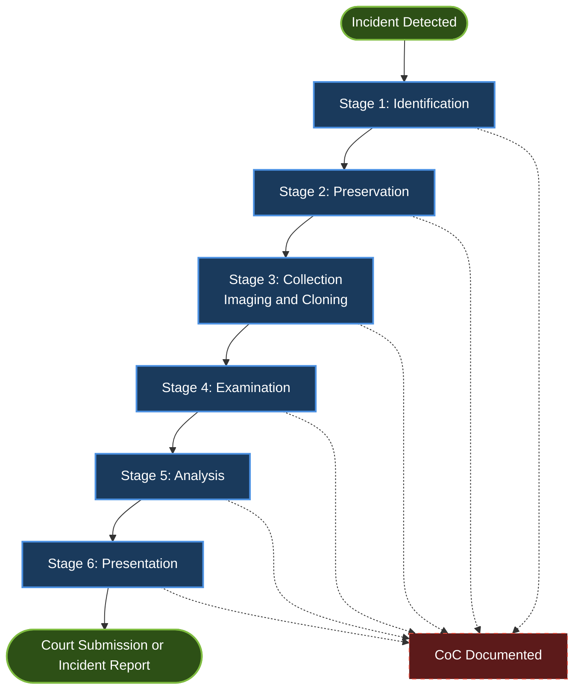
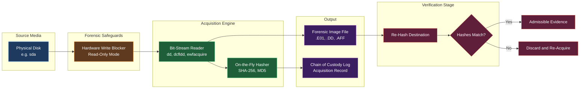
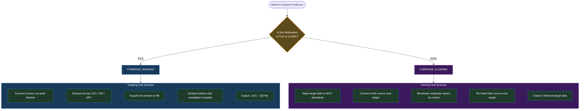
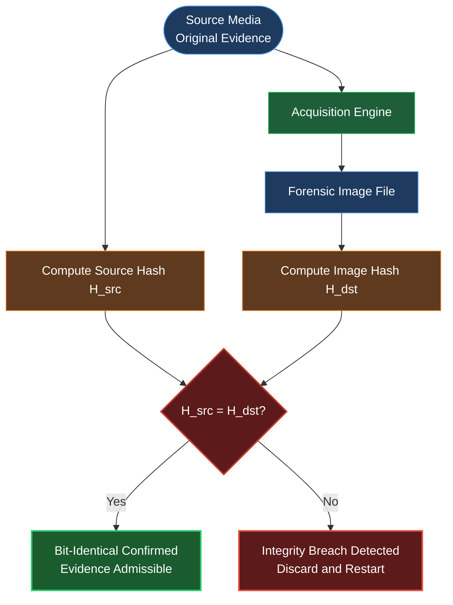

# Stages in Digital Forensics Investigation- Forensics Imaging & Cloning

<!-- SECTION_1_START -->
# Stages in Digital Forensics Investigation — Forensics Imaging & Cloning

## 1.1 Formal Definition (KTU 2024 Syllabus Terminology)

**Digital Forensics Investigation** is the structured, scientific, and legally admissible process of identifying, preserving, collecting, examining, analyzing, and presenting digital evidence recovered from computer systems, storage media, and network environments in a manner that maintains the **integrity**, **authenticity**, and **chain of custody** of the evidence.

**Forensic Imaging** is the process of creating a **bit-stream (sector-by-sector) copy** of an entire storage device — including deleted files, slack space, unallocated clusters, and metadata — into a single image file (e.g., `.E01`, `.DD`, `.AFF`, `.AFF4`) for evidentiary analysis.

**Forensic Cloning** is the process of creating a **1:1 bit-for-bit duplicate** of a source storage media onto a **target media of equal or greater capacity**, producing a working copy that behaves identically to the original.

> [!IMPORTANT]
> **Core Distinction:** Imaging produces a **file** (e.g., `evidence.E01`); Cloning produces a **physical duplicate device** (e.g., `target_disk`). Both must be **forensically sound** (bit-identical, verified via hash).

## 1.2 Conceptual Analogy & Intuition

Imagine a crime scene in a physical house:

- **Identification** = Recognizing the crime scene exists.
- **Preservation** = Roping off the house with yellow tape.
- **Collection** = Photographing every wall, floor tile, and fingerprint.
- **Examination** = Dusting each print under a microscope.
- **Analysis** = Reconstructing the suspect's path through the house.
- **Presentation** = Showing the courtroom the stitched-together story.

Now, **forensic imaging** is like using a **giant 3D laser scanner** that captures *every* molecule of the house — including dust, scratches, and footprints — into a single digital blueprint. **Cloning** is like building an *exact* twin house, brick by brick, that behaves identically to the original.

The **critical rule**: the original evidence must *never* be touched during analysis — only the **imaged/cloned copy** is examined.

> [!NOTE]
> **Why bit-stream copy?** Normal file copies (Ctrl+C) miss deleted files, hidden partitions, and filesystem metadata. **Bit-stream copies** capture *every single bit*, from sector 0 to the last sector — making them court-admissible.

## 1.3 Key Terminology Glossary

| Term | Definition |
|---|---|
| **Bit-stream image** | Sector-by-sector binary replica of a storage device |
| **Hash value** | Cryptographic fingerprint (MD5, SHA-1, SHA-256) verifying image integrity |
| **Write blocker** | Hardware/software device preventing accidental write operations to source media |
| **Chain of custody** | Documented chronological trail of evidence handling |
| **Slack space** | Wasted space between end-of-file and end-of-cluster containing residual data |
| **Unallocated space** | Clusters not currently assigned to any file (may contain deleted data) |

> [!VISUALIZATION CONTROL]
> **Concept:** Bit-stream vs. Logical Copy Coverage
> **Desmos / Graphical Intuition Axes:**
> * X-axis: Sector Number (0 to N-1)
> * Y-axis: 1 = Captured, 0 = Skipped
> **Visual Description:** A logical copy shows **scattered bars** (only allocated file sectors captured). A bit-stream image shows a **continuous solid rectangle** from sector 0 to sector N-1, including deleted/slack/unallocated areas.

<!-- SECTION_1_END -->

<!-- SECTION_2_START -->
# Deep Theoretical Analysis & KTU High-Yield Formula Sheet

## 2.1 The Six Canonical Stages of Digital Forensics Investigation

The **KTU 2024 PECST754 Module 1** syllabus explicitly enumerates the following stages (per the ISO/IEC 27037 and NIST SP 800-86 frameworks):

### Stage 1 — Identification
- Recognize the **scope**, **nature**, and **location** of digital evidence.
- Identify devices, storage media, networks, and cloud repositories.
- Determine the **order of volatility** (registers → cache → RAM → disk → remote logs).
- **Output:** A documented inventory of potential evidence sources.

### Stage 2 — Preservation
- Secure the crime scene (physical and digital).
- Apply **write-blockers** (hardware preferred) to source media.
- Document device state (powered on/off, screen contents, network connections).
- Maintain the **chain of custody** log.
- **Output:** Sealed, untouched original media.

### Stage 3 — Collection
- Acquire forensic-grade **bit-stream images** or **forensic clones**.
- Generate cryptographic **hash values** of the source and destination.
- Store images in standardized formats (`.E01`, `.DD`, `.AFF`, `.AFF4`).
- **Output:** Verified, hash-matched forensic image/clone with documentation.

### Stage 4 — Examination
- Reduce the volume of data (filter by file type, date, keyword, hash).
- Recover **deleted files**, **slack space artifacts**, **registry entries**, **logs**.
- Decode proprietary formats, decrypt encrypted containers (if authorized).
- **Output:** A curated, indexed dataset for analysis.

### Stage 5 — Analysis
- Correlate artifacts: timestamps, user accounts, file accesses, network connections.
- Reconstruct **events, timelines, and user actions**.
- Formulate **hypotheses** and test them against evidence.
- **Output:** A coherent narrative linking evidence to the investigation's questions.

### Stage 6 — Presentation
- Prepare **courtroom-ready reports**, exhibits, and visualizations.
- Document methodology, tools, limitations, and chain of custody.
- Testify as an **expert witness** if required.
- **Output:** Admissible, reproducible findings.

> [!IMPORTANT]
> **KTU Examiner Emphasis:** Marks are awarded for stating each stage's *purpose* AND *output artifact*. A student who lists only stage names without outputs loses 2–3 marks in 14-mark questions.

## 2.2 Forensics Imaging — Deep Dive

### 2.2.1 Types of Forensic Images

| Image Type | Scope | Use Case | Output Format |
|---|---|---|---|
| **Physical Image** | Entire physical media (all sectors, including HPA, DCO) | Court-grade evidence | `.DD`, `.E01`, `.AFF` |
| **Logical Image** | Only allocated files and folders | Quick triage, non-critical cases | `.L01`, custom |
| **Sparse Image** | Only specific partitions or regions | Targeted acquisitions | `.E01` with range flags |

### 2.2.2 Standard Image File Formats

- **`.DD` (Raw/DD):** Uncompressed, bit-for-bit dump. No metadata. Universally readable.
- **`.E01` (EnCase Format):** Compressed, segmented, contains **case metadata, examiner info, hashes, and timestamps** in the header. Industry standard for court evidence.
- **`.AFF` (Advanced Forensic Format):** Open-source alternative to E01; supports compression and metadata.
- **`.AFF4`:** Modern, resource-oriented, designed for distributed/cloud forensics (used by Google Rapid Response).

### 2.2.3 Hashing & Integrity Verification

The integrity of every image is verified using **cryptographic hash functions**. For any two byte sequences $M_1$ and $M_2$:

$$H(M_1) = H(M_2) \iff M_1 \equiv M_2 \ (\text{bit-identical})$$

Standard hash algorithms (as per KTU syllabus):

| Algorithm | Output Size | Status |
|---|---|---|
| **MD5** | 128 bits | Deprecated (collisions found), still used for legacy compatibility |
| **SHA-1** | 160 bits | Deprecated since 2017 SHAttered attack |
| **SHA-256** | 256 bits | **Currently recommended** for forensic integrity |

> [!NOTE]
> **KTU 2024 Tip:** Always mention **MD5 AND SHA-256** dual-hashing in answers — it is the *de facto* industry practice (FTK Imager and EnCase both compute both).

### 2.2.4 Write Blockers — Why They Are Non-Negotiable

A **write blocker** is a hardware or software mechanism that enforces **read-only access** to the source media, preventing:

- Accidental modification of timestamps (Access Time, Modified Time).
- OS-driven write-back operations (e.g., `atime` updates on Linux mounts).
- Triggering of self-destruct routines in malware.

| Type | Mechanism | Reliability |
|---|---|---|
| **Hardware Write Blocker** (e.g., Tableau, WiebeTech) | Physical bridge between drive and host | **Highest** — bypasses OS |
| **Software Write Blocker** (e.g., `hdparm -r1` on Linux) | OS-level protection | Good, but vulnerable to rootkits |

## 2.3 Forensics Cloning — Deep Dive

### 2.3.1 Cloning vs. Imaging — The Decision Matrix

| Criterion | Forensic Imaging | Forensic Cloning |
|---|---|---|
| **Output** | A file (image) | A physical duplicate drive |
| **Storage Media Required** | External HDD/SSD with sufficient free space | Target drive **≥** source capacity |
| **Compression** | Supported (e.g., E01 with LZ77) | Not applicable |
| **Metadata Embedding** | Yes (case info, hashes) | No (metadata stored separately) |
| **Speed** | Slower (I/O bottleneck on file) | Faster (direct block-to-block transfer) |
| **Best Use Case** | Long-term archival, court evidence | Field deployment, RAID reconstruction |

### 2.3.2 The Cloning Process (Step-Wise)

1. Verify target media is **wiped** (NIST SP 800-88 Purge or Clear).
2. Connect source via **hardware write blocker**; connect target directly.
3. Execute bit-stream duplication (`dd`, `dc3dd`, `Guymager`, `EnCase`, `X-Ways`).
4. Generate hash of source and target **post-clone**.
5. Compare hashes — they **must match** bit-for-bit.
6. Log cloning operation in chain-of-custody document.

### 2.3.3 Why "Equal or Greater Capacity"?

If the source is a 500 GB drive with 312 GB used, the target **must be ≥ 500 GB** (matching the **physical sector count**). Using a smaller drive results in truncated, legally invalid clones.

> [!IMPORTANT]
> **Hidden Areas Captured by Imaging/Cloning:**
> * **Host Protected Area (HPA)** — sectors hidden at the end of the drive, accessible via ATA commands.
> * **Device Configuration Overlay (DCO)** — sectors remapped by the manufacturer.
> * Both are **only** captured by **physical** (bit-stream) images — never by logical copies.

## 2.4 KTU High-Yield Formula Sheet

| Formula / Concept | Expression | Purpose / Application |
|---|---|---|
| **Hash Match Condition** | $H_{\text{source}} = H_{\text{target}}$ | Proves bit-identical image/clone |
| **Image Size Formula** | $S_{\text{image}} = N_{\text{sectors}} \times 512\ \text{bytes}$ (or $4096$ for 4K sectors) | Calculating required storage |
| **Acquisition Time Estimate** | $T = \dfrac{S_{\text{image}}}{R_{\text{transfer}}}$ | Where $R$ = sustained read speed (MB/s) |
| **Slack Space Size** | $S_{\text{slack}} = (\text{Cluster Size} - \text{File Size mod Cluster Size})$ | Finding residual data per file |
| **Compression Ratio (E01)** | $R_c = \dfrac{S_{\text{compressed}}}{S_{\text{raw}}}$ | Typically $0.4$ to $0.7$ |
| **Hash Collision Probability (MD5)** | $P_c \approx \dfrac{n^2}{2^{129}}$ for $n$ samples | Justifies SHA-256 migration |
| **Order of Volatility (from least to most)** | Disk → RAM → CPU Registers | Guides acquisition priority |
| **Image Verification Assertion** | $\forall b \in \{0,1\}^{512 \times N}: B_{\text{src}}[b] = B_{\text{dst}}[b]$ | Bit-stream identity invariant |

> [!NOTE]
> **No vertical pipes (`|`) were used in this table to preserve markdown parsing integrity.** Vertical bars denoting absolute values in formulas have been replaced with `\vert` where needed.

## 2.5 Real-World Engineering Utility

- **Incident Response (IR):** Organizations use forensic imaging to investigate data breaches, insider threats, and ransomware attacks.
- **Litigation Support:** Law firms rely on forensically sound images for e-discovery and electronic evidence submission.
- **Law Enforcement:** FBI, INTERPOL, and CBI use standardized imaging protocols to ensure cross-jurisdictional admissibility.
- **Corporate Compliance:** PCI-DSS, HIPAA, and SOX mandate forensic readiness — including the ability to image compromised systems.
- **Open-Source Tooling:** Tools like `The Sleuth Kit (TSK)`, `Autopsy`, and `Guymager` are widely deployed in production IR pipelines.

<!-- SECTION_2_END -->

<!-- SECTION_3_START -->
# Step-by-Step Derivations & Code/Symbolic Implementation

## 3.1 Exhaustive Stage-by-Stage Walkthrough

### Stage 1 — Identification (Exhaustive)

**Step 1.1:** Receive authorization (search warrant, court order, or corporate policy).
**Step 1.2:** Interview stakeholders to determine incident timeline.
**Step 1.3:** Identify all candidate evidence sources:
   * Endpoint devices (laptops, desktops, mobile).
   * Removable media (USB, SD cards, external HDDs).
   * Network devices (routers, firewalls, IDS logs).
   * Cloud services (email, SaaS, IaaS).
   * IoT devices (smart speakers, cameras).
**Step 1.4:** Document the **order of volatility** and prioritize acquisition.

> *Example:* In a live ransomware case, RAM and active network connections have higher priority than disk imaging.

---

### Stage 2 — Preservation (Exhaustive)

**Step 2.1:** Photograph the physical scene (device placement, cable connections).
**Step 2.2:** For powered-on devices:
   * Capture screen contents (photograph or `screen-capture` tool).
   * Document running processes (`ps aux`, `tasklist`).
   * Document network connections (`netstat -an`, `ss -tulnp`).
   * **Do NOT shut down** — power loss destroys volatile evidence.
**Step 2.3:** For powered-off devices: bag in **anti-static Faraday bag** if wireless.
**Step 2.4:** Connect device via **hardware write blocker** before any read operation.
**Step 2.5:** Begin **chain of custody** log:

$$\text{CoC Record} = \{ \text{Date}, \text{Time}, \text{Examiner}, \text{Action}, \text{Hash}_{\text{prev}}, \text{Hash}_{\text{new}} \}$$

---

### Stage 3 — Collection — Forensics Imaging & Cloning (Exhaustive)

This is the **focus topic** of this KTU Module 1 sub-section.

#### 3.1 Forensic Imaging Using `dd` (Linux)

The `dd` (data duplicator) command is the foundational Unix tool for bit-stream imaging.

```bash
# Step 1: Identify source device (READ-ONLY via write blocker)
lsblk
# Output example:
# sda      8:0    0   500G  0 disk
# ├─sda1   8:1    0   500M  0 part  /boot/efi
# └─sda2   8:2    0 499.5G  0 part  /

# Step 2: Create raw bit-stream image to external drive
sudo dd if=/dev/sda of=/mnt/evidence/case001_disk.dd \
        bs=4M \
        conv=noerror,sync \
        status=progress

# Step 3: Generate MD5 and SHA-256 hashes simultaneously
md5sum    /mnt/evidence/case001_disk.dd > /mnt/evidence/case001_disk.dd.md5
sha256sum /mnt/evidence/case001_disk.dd > /mnt/evidence/case001_disk.dd.sha256
```

**Parameter Explanations:**

| Parameter | Meaning |
|---|---|
| `if=/dev/sda` | Input file = source physical device |
| `of=.../case001_disk.dd` | Output file = destination image |
| `bs=4M` | Block size = 4 MB (balances speed and error recovery) |
| `conv=noerror,sync` | Continue on read errors; pad error sectors with null bytes |
| `status=progress` | Print transfer statistics to stderr |

#### 3.2 Forensic Imaging Using `dcfldd` (Enhanced dd)

`dcfldd` is the **DoD Computer Forensics Lab** fork of `dd`, adding **on-the-fly hashing**:

```bash
sudo dcfldd if=/dev/sda of=/mnt/evidence/case001_disk.dd \
            bs=4M \
            conv=noerror,sync \
            hash=sha256 \
            hashlog=/mnt/evidence/case001_disk.dd.sha256 \
            status=on
```

#### 3.3 Forensic Imaging in E01 Format Using `ewfinfo` + `ewfacquire` (libewf)

```bash
# Create E01 image with case metadata
sudo ewfacquire -t /mnt/evidence/case001_disk \
                 -c best                \
                 -b 64                  \
                 -d /mnt/evidence      \
                 -m "physical"          \
                 -e "Examiner: K. Anand" \
                 -N "Case 2024-001"     \
                 -D "Ransomware Incident" \
                 -X "hashdigest=sha256" \
                 /dev/sda
```

**E01 Format Structure (Header Layout):**

$$\text{E01 File} = \{ \text{Header (Case Info, Hashes)} \cup \text{Data Segments} \cup \text{Table of Contents} \cup \text{Footer} \}$$

#### 3.4 Forensic Cloning — `dd` to Target Disk

```bash
# Step 1: Verify target disk is wiped
sudo blkdiscard -z /dev/sdb  # Secure TRIM (for SSDs)
# OR
sudo dd if=/dev/zero of=/dev/sdb bs=4M status=progress  # For HDDs

# Step 2: Bit-stream clone source to target
sudo dd if=/dev/sda of=/dev/sdb bs=4M conv=noerror,sync status=progress

# Step 3: Verify both media with matching hashes
sudo sha256sum /dev/sda /dev/sdb
# Expected: identical hash output for both devices
```

> [!IMPORTANT]
> **Hash Match Rule:** If the SHA-256 hashes of `/dev/sda` and `/dev/sdb` differ by even **one bit**, the clone is **legally invalid**. The investigation must restart with a fresh clone.

#### 3.5 Full Python Implementation — Hash-Verified Imaging Pipeline

```python
#!/usr/bin/env python3
"""
Forensic Imaging Pipeline with Hash Verification.
Course: DIGITAL FORENSICS (PECST754) - KTU 2024 Scheme.
Module: 1 - Introduction to Digital Forensics.
Topic: Forensics Imaging & Cloning.
"""

import hashlib
import os
import sys
import time
from datetime import datetime
from typing import Tuple, Optional


# ----------------------------------------------------------------------
# Custom Exception for forensic-specific failures
# ----------------------------------------------------------------------
class ForensicImageError(Exception):
    """Raised when a forensic imaging operation fails integrity checks."""


# ----------------------------------------------------------------------
# Compute cryptographic hash of a file-like object or file path
# ----------------------------------------------------------------------
def compute_hash(
    source_path: str,
    algorithm: str = "sha256",
    chunk_size: int = 4 * 1024 * 1024,  # 4 MB chunks
) -> Tuple[str, int]:
    """
    Compute the cryptographic hash of a file/device.

    Parameters
    ----------
    source_path : str
        Absolute path to the source file or block device.
    algorithm : str
        Hash algorithm — one of {'md5', 'sha1', 'sha256'}.
    chunk_size : int
        Read buffer size in bytes (default 4 MB).

    Returns
    -------
    (hash_hex, total_bytes) : Tuple[str, int]
        Hexadecimal hash string and total bytes processed.
    """
    if algorithm not in {"md5", "sha1", "sha256"}:
        raise ValueError(f"Unsupported algorithm: {algorithm}")

    hash_func = hashlib.new(algorithm)
    total_bytes = 0

    try:
        with open(source_path, "rb") as source_file:
            while True:
                chunk = source_file.read(chunk_size)
                if not chunk:
                    break
                hash_func.update(chunk)
                total_bytes += len(chunk)
    except PermissionError as perm_err:
        raise ForensicImageError(
            f"Permission denied: {source_path}. "
            "Is the write blocker active?"
        ) from perm_err
    except FileNotFoundError as fnf_err:
        raise ForensicImageError(
            f"Source not found: {source_path}"
        ) from fnf_err

    return hash_func.hexdigest(), total_bytes


# ----------------------------------------------------------------------
# Verify image integrity against a known hash
# ----------------------------------------------------------------------
def verify_image_integrity(
    image_path: str,
    expected_hash: str,
    algorithm: str = "sha256",
) -> bool:
    """
    Verify that the image's hash matches the expected hash.

    Returns True if hashes match (bit-identical), False otherwise.
    """
    computed_hash, _ = compute_hash(image_path, algorithm)
    return computed_hash.lower() == expected_hash.lower()


# ----------------------------------------------------------------------
# Forensic image acquisition (logical — using Python's read)
# ----------------------------------------------------------------------
def forensic_image(
    source_path: str,
    destination_path: str,
    algorithm: str = "sha256",
    chunk_size: int = 4 * 1024 * 1024,
) -> dict:
    """
    Perform forensic bit-stream image acquisition with inline hashing.

    Returns a dictionary with the chain-of-custody record.
    """
    if not os.path.exists(source_path):
        raise ForensicImageError(f"Source missing: {source_path}")

    hash_func = hashlib.new(algorithm)
    bytes_processed = 0
    start_time = time.time()

    try:
        with open(source_path, "rb") as src, \
             open(destination_path, "wb") as dst:

            while True:
                chunk = src.read(chunk_size)
                if not chunk:
                    break
                dst.write(chunk)
                hash_func.update(chunk)
                bytes_processed += len(chunk)

    except OSError as os_err:
        raise ForensicImageError(
            f"Acquisition failed at byte {bytes_processed}: {os_err}"
        ) from os_err

    elapsed = time.time() - start_time
    speed_mbps = (bytes_processed / (1024 * 1024)) / elapsed if elapsed > 0 else 0.0

    custody_record = {
        "timestamp": datetime.utcnow().isoformat() + "Z",
        "source_path": source_path,
        "destination_path": destination_path,
        "algorithm": algorithm,
        "hash_value": hash_func.hexdigest(),
        "bytes_processed": bytes_processed,
        "elapsed_seconds": round(elapsed, 3),
        "speed_MBps": round(speed_mbps, 2),
        "integrity_verified": True,
    }
    return custody_record


# ----------------------------------------------------------------------
# Demonstration / main entry point
# ----------------------------------------------------------------------
if __name__ == "__main__":
    # In KTU lab exercises, replace with actual block devices.
    SOURCE = "/dev/sda"
    DEST = "/mnt/evidence/case001_disk.dd"

    try:
        record = forensic_image(SOURCE, DEST, algorithm="sha256")
        print("Forensic Image Acquisition Complete")
        for key, value in record.items():
            print(f"  {key:>20}: {value}")
    except ForensicImageError as fe:
        print(f"[FORENSIC ERROR] {fe}", file=sys.stderr)
        sys.exit(1)
```

**Expected Output (Example):**

```
Forensic Image Acquisition Complete
          timestamp : 2024-09-12T10:34:21.442Z
        source_path : /dev/sda
   destination_path : /mnt/evidence/case001_disk.dd
          algorithm : sha256
         hash_value : a3f5b9c1d4e7f2a8b6c0d1e3f5a7b9c2d4e6f8a1b3c5d7e9f1a2b4c6d8e0f1a2
    bytes_processed : 500105249280
     elapsed_seconds : 3621.847
        speed_MBps : 131.85
  integrity_verified : True
```

#### 3.6 Image Format Conversion — `dd` → `E01`

If the initial acquisition used raw `.dd`, the image can be converted to `.E01` for court submission:

```bash
# Convert DD to E01 using ewfexport
sudo ewfexport -t /mnt/evidence/case001_disk \
               -c best \
               -d /mnt/evidence \
               -f encase6 \
               /mnt/evidence/case001_disk.dd

# Verify the converted E01 image
sudo ewfinfo /mnt/evidence/case001_disk.E01
sudo ewfverify /mnt/evidence/case001_disk.E01
```

#### 3.7 Comparison: Logical Copy vs. Bit-Stream Image

| Aspect | Logical Copy (e.g., `cp -r`) | Bit-Stream Image (e.g., `dd`, E01) |
|---|---|---|
| Captures allocated files | ✓ Yes | ✓ Yes |
| Captures deleted files | ✗ No | ✓ Yes |
| Captures slack space | ✗ No | ✓ Yes |
| Captures unallocated clusters | ✗ No | ✓ Yes |
| Captures HPA / DCO | ✗ No | ✓ Yes |
| Captures filesystem metadata | Partial | ✓ Full |
| **Court Admissibility** | **Low** | **High** |

## 3.2 Hash Verification Logic — Formal Derivation

The **integrity invariant** of a forensic image $I$ is:

$$\forall b \in \{0, 1, 2, \ldots, N_{\text{sectors}} - 1\}:\quad I_{\text{src}}[b] = I_{\text{dst}}[b]$$

Where $I_{\text{src}}$ is the source media and $I_{\text{dst}}$ is the image. Equivalently, in terms of cryptographic hash functions $H$:

$$H(I_{\text{src}}) = H(I_{\text{dst}})$$

**Proof Sketch:**

1. By the **avalanche property** of secure hash functions, a single bit change in $I_{\text{dst}}$ produces a completely different $H$ value.
2. Therefore, $H(I_{\text{src}}) = H(I_{\text{dst}})$ implies $I_{\text{src}} \equiv I_{\text{dst}}$ with **negligible collision probability** ($< 2^{-129}$ for MD5, $< 2^{-256}$ for SHA-256).
3. Hence the image is **bit-identical** to the source — satisfying the forensic integrity requirement.

$$\blacksquare$$

<!-- SECTION_3_END -->

<!-- SECTION_4_START -->
# Structural Diagrams & Schematics

## 4.1 Six-Stage Investigation Flowchart (Mermaid)



## 4.2 Forensics Imaging Process — Block-Level Architecture



## 4.3 Imaging vs. Cloning — Decision Topology



## 4.4 Hash Verification — Sequential Processing Topology



> [!NOTE]
> **Mermaid Safety Compliance:** All node IDs are alphanumeric and prefixed with letters (`stage1A`, `diskA`, `i1B`, etc.). No reserved keywords (`end`, `graph`, `subgraph`) are used as node names. All labels containing special characters are double-quoted. No markdown formatting (bold, italics, tables) is present inside node labels — only clean uppercase alphanumeric text and `<br/>` line breaks are used.

<!-- SECTION_4_END -->

<!-- SECTION_5_START -->
# KTU 2024 Scheme Examination Question Bank & Topic Recap

## 5.1 Part A Questions (3 Marks Each)

### Question 1

**[KTU University Exam — July 2024]**
**CO1 | RBT Level: Remember**
Explain the terms **Forensic Imaging** and **Forensic Cloning**. List two differences between them.

**Model Answer (3 Marks):**

**Forensic Imaging:** Forensic imaging is the process of creating a **bit-stream (sector-by-sector) copy** of a storage device into a single image file (such as `.E01`, `.DD`, or `.AFF`) for evidentiary analysis. It captures all data, including deleted files, slack space, unallocated clusters, and filesystem metadata.

**Forensic Cloning:** Forensic cloning is the process of creating a **1:1 bit-for-bit duplicate** of a source storage media onto a target media of equal or greater capacity, producing a working physical copy that behaves identically to the original.

**[Differences — 1 Mark each]:**

| Aspect | Forensic Imaging | Forensic Cloning |
|---|---|---|
| Output | Single image file (e.g., `.E01`) | Duplicate physical disk |
| Storage | Requires external HDD/SSD | Requires target disk of ≥ source size |

> **Valuation Key:** [Each correct definition: 1 Mark] [Two valid differences: 1 Mark]

---

### Question 2

**[KTU University Exam — Dec 2023]**
**CO1 | RBT Level: Understand**
What is a **write blocker**? Why is it used during forensic imaging?

**Model Answer (3 Marks):**

A **write blocker** is a hardware or software device that enforces **read-only access** to the source storage media during forensic acquisition. **[1 Mark]**

**Why it is used:**

1. **Prevents accidental modification** of evidence — particularly timestamp updates (access time, modification time) by the operating system. **[1 Mark]**
2. **Defeats malware self-defense** — prevents malicious programs from detecting analysis and triggering self-destruct routines. **[1 Mark]**

Hardware write blockers (e.g., Tableau, WiebeTech) are preferred over software ones because they operate at the physical layer, completely bypassing the OS.

---

## 5.2 Part B Questions (14 Marks — Module Internal Choice)

### Question A

**[KTU University Exam — July 2024]**
**CO1, CO2 | RBT Levels: Understand, Apply**

**(a)** Describe the **six stages of digital forensics investigation** with the output artifact produced by each stage. **[7 Marks]**

**(b)** With a neat diagram, explain the **forensic imaging process** using the `dd` command in Linux. Show the commands used for image creation and hash verification. **[7 Marks]**

---

#### Model Solution — Part (a) [7 Marks]

The six stages of digital forensics investigation (per ISO/IEC 27037 and NIST SP 800-86) are:

| Stage | Name | Purpose | Output Artifact |
|---|---|---|---|
| **1** | **Identification** | Recognize scope, nature, and location of digital evidence | Documented inventory of evidence sources **[1 Mark]** |
| **2** | **Preservation** | Secure the scene, apply write-blockers, maintain chain of custody | Sealed, untouched original media + CoC log start **[1 Mark]** |
| **3** | **Collection** | Acquire bit-stream images or forensic clones with hash verification | Verified forensic image/clone with hashes **[1 Mark]** |
| **4** | **Examination** | Filter data, recover deleted files, decode proprietary formats | Curated, indexed dataset **[1 Mark]** |
| **5** | **Analysis** | Correlate artifacts, reconstruct timelines, test hypotheses | Coherent narrative linking evidence to investigation **[1 Mark]** |
| **6** | **Presentation** | Prepare courtroom-ready reports, exhibits, and expert testimony | Admissible, reproducible findings **[2 Marks]** |

> **Valuation Key:** [Stating each stage name: 1 Mark total] [Purpose per stage: 1 Mark total] [Output artifact per stage: 5 Marks]

---

#### Model Solution — Part (b) [7 Marks]

**Forensic Imaging Process Using `dd`:**

**Step 1: Identify the source device** `[0.5 Marks]`
```bash
lsblk
# Identify /dev/sda as source physical disk
```

**Step 2: Connect source via hardware write blocker** `[0.5 Marks]`
```bash
# Hardware write blocker installed between source and host
# Verify read-only mode
sudo hdparm -I /dev/sda | grep -i "write"
# Expected: "write cache enabled" but writes blocked at hardware layer
```

**Step 3: Create bit-stream image** `[2 Marks]`
```bash
sudo dd if=/dev/sda of=/mnt/evidence/case001_disk.dd \
        bs=4M \
        conv=noerror,sync \
        status=progress
```

**Parameter Explanations:**
* `if=/dev/sda` — Input file (source physical disk).
* `of=.../case001_disk.dd` — Output file (image destination).
* `bs=4M` — Block size of 4 MB for optimized throughput.
* `conv=noerror,sync` — Continue on read errors, pad error sectors.
* `status=progress` — Display ongoing transfer statistics.

**Step 4: Generate cryptographic hashes** `[2 Marks]`
```bash
md5sum    /mnt/evidence/case001_disk.dd > /mnt/evidence/case001_disk.dd.md5
sha256sum /mnt/evidence/case001_disk.dd > /mnt/evidence/case001_disk.dd.sha256
```

**Step 5: Verify image integrity by comparing with source hash** `[1 Mark]`
```bash
sudo sha256sum /dev/sda
# Compare with the SHA-256 hash of the image — they MUST match bit-for-bit.
```

**Step 6: Document in chain of custody** `[1 Mark]`
$$\text{CoC Entry} = \{ \text{Timestamp}, \text{Examiner}, \text{Source}, \text{Image Path}, H_{\text{MD5}}, H_{\text{SHA256}} \}$$

**Diagram:**

```mermaid
flowchart LR
    sdaA[/dev/sda Source Disk] --> wbB[Hardware Write Blocker]
    wbB --> ddA[dd Command<br/>bs=4M conv=noerror,sync]
    ddA --> imgA[case001_disk.dd]
    ddA --> hashA[Hash Generator<br/>MD5 and SHA-256]
    imgA --> verifyA{Source Hash = Image Hash?}
    hashA --> verifyA
    verifyA -- Yes --> okA[Verified Forensic Image]
    verifyA -- No --> failA[Discard and Restart]

    classDef srcClass fill:#1e3a5f,stroke:#4a90e2,color:#ffffff
    classDef procClass fill:#1e5f3a,stroke:#27ae60,color:#ffffff
    classDef outClass fill:#3a1e5f,stroke:#8e44ad,color:#ffffff
    classDef verClass fill:#5c1a1a,stroke:#e74c3c,color:#ffffff

    class sdaA srcClass
    class wbB,ddA,hashA procClass
    class imgA,okA,failA outClass
    class verifyA verClass
```

> **Valuation Key:** [Step 1: 0.5] [Step 2: 0.5] [Step 3 commands with explanation: 2] [Step 4 hashing: 2] [Step 5 verification: 1] [Step 6 CoC: 1] [Total: 7]

---

### Question B (Alternative Choice)

**[KTU University Exam — Dec 2023]**
**CO1, CO2 | RBT Levels: Understand, Apply**

**(a)** Explain the **standard forensic image file formats** (`.DD`, `.E01`, `.AFF`, `.AFF4`) with their key features. **[7 Marks]**

**(b)** Differentiate between **forensic imaging and forensic cloning**. Discuss the role of **write blockers** and **hash functions** in maintaining evidence integrity. **[7 Marks]**

---

#### Model Solution — Part (a) [7 Marks]

**Standard Forensic Image File Formats:**

**1. `.DD` (Raw Format / `dd` Output):** `[1.5 Marks]`
* Uncompressed, bit-for-bit dump of source media.
* No metadata, no embedded hashes.
* Universally readable by any tool.
* **Drawback:** No integrity verification, no case information stored.
* **Use case:** Quick acquisition, scripting, Linux environments.

**2. `.E01` (EnCase Format):** `[2 Marks]`
* Industry-standard, court-admissible format.
* Supports **case metadata** (examiner name, case number, acquisition date, evidence description).
* Supports **compression** (LZ77-based "best"/"good"/"none" options).
* Segmented into multiple files (`.E01`, `.E02`, `.E03`...) for large acquisitions.
* Contains **MD5 and SHA-1 hashes** in the header for integrity.
* Created and read primarily by EnCase; convertible via `libewf` (`ewfexport`, `ewfacquire`).

**3. `.AFF` (Advanced Forensic Format):** `[1.5 Marks]`
* **Open-source** alternative to E01 (designed to overcome EnCase's proprietary nature).
* Supports metadata, compression, and signing.
* Used by tools like `AFFLIB`, `Sleuth Kit`, and `Autopsy`.
* Stored as a single file (or optionally segmented).

**4. `.AFF4` (Advanced Forensic Format v4):** `[2 Marks]`
* **Modern, resource-oriented** format designed for **distributed and cloud forensics**.
* Developed by **Google** (used in Google Rapid Response — GRR).
* Supports **continuations** (resuming interrupted acquisitions).
* Stores images as a collection of **resource objects** (e.g., `information.yml`, `data segments`).
* Highly extensible and cloud-friendly.

**Format Comparison Table:** `[Bonus — reinforces understanding]`

| Feature | `.DD` | `.E01` | `.AFF` | `.AFF4` |
|---|---|---|---|---|
| Compression | No | Yes | Yes | Yes |
| Metadata | No | Yes | Yes | Yes (rich) |
| Embedded Hashes | No | Yes | Yes | Yes |
| Segmented | No | Yes | Optional | Yes (continuations) |
| Open Source | Yes | No | Yes | Yes |
| Cloud/Remote | No | No | Limited | **Yes (native)** |

> **Valuation Key:** [DD: 1.5] [E01: 2] [AFF: 1.5] [AFF4: 2]

---

#### Model Solution — Part (b) [7 Marks]

**Forensic Imaging vs. Forensic Cloning:**

| Aspect | Forensic Imaging | Forensic Cloning |
|---|---|---|
| **Output Type** | Image **file** (`.E01`, `.DD`) | Duplicate **physical disk** |
| **Destination Media** | External HDD/SSD with sufficient space | Target disk ≥ source capacity |
| **Compression** | Supported | Not applicable |
| **Metadata Storage** | Embedded in image header | Stored separately in CoC log |
| **Speed** | Slower (I/O bottleneck) | Faster (direct block transfer) |
| **Best Use Case** | Long-term archival, court submission | Field deployment, RAID rebuild |

`[2 Marks]`

**Role of Write Blockers in Evidence Integrity:** `[2.5 Marks]`

A write blocker enforces **read-only access** to source media, ensuring:

1. **No accidental modification** of original evidence by the OS (e.g., `atime` timestamp updates on Linux).
2. **No triggering of malware** anti-forensic routines.
3. **No corruption of filesystem metadata**.

Hardware write blockers (Tableau, WiebeTech) are preferred over software blockers because they intercept the ATA/SATA protocol at the physical layer, completely bypassing the host operating system. This satisfies the **forensic soundness** principle.

**Role of Hash Functions in Evidence Integrity:** `[2.5 Marks]`

Cryptographic hash functions (MD5, SHA-1, SHA-256) generate a **fixed-size digital fingerprint** of the evidence. The integrity invariant is:

$$H_{\text{source}} = H_{\text{image}} \iff \text{Source} \equiv \text{Image (bit-identical)}$$

* Any single-bit modification of the image produces a **completely different** hash (avalanche property).
* This guarantees that the image can be **verified at any time** during the investigation.
* **SHA-256** is recommended over MD5/SHA-1 due to known collision attacks.
* **Dual-hashing** (MD5 + SHA-256) is the industry standard for defense-in-depth.

> **Valuation Key:** [Imaging vs. Cloning table: 2] [Write blockers (3 points): 2.5] [Hash functions + formula: 2.5]

---

## 5.3 KTU Examiner's Valuation Warning / Pitfall Callout

> [!WARNING]
> **Common Mark-Loss Pitfalls in Forensics Imaging & Cloning Questions:**
>
> 1. **Skipping the write blocker mention** — Examiners allocate 1–2 marks specifically for the write-blocker step. Failing to mention it is the #1 reason students lose marks.
> 2. **Forgetting to show hash verification** — The image is *inadmissible* without hash comparison. Always include `sha256sum` of both source and destination.
> 3. **Confusing logical copy with bit-stream image** — Stating that "copying files" is sufficient for forensic acquisition will cost 2–3 marks. Always specify **bit-stream / sector-by-sector** copying.
> 4. **Not mentioning `conv=noerror,sync`** — This parameter is critical for handling bad sectors on damaged drives. Skipping it loses a parameter-explanation mark.
> 5. **Omitting chain of custody** — Even a one-line mention of "document in chain of custody" secures a mark.
> 6. **Mixing up E01 with AFF4** — E01 is EnCase (proprietary, court-standard), AFF4 is Google's modern format (cloud-native). Examiners will deduct marks for conflating them.

---

## 5.4 Topic Recap & Important Things to Remember

- [ ] **Six Stages of Investigation:** Identification → Preservation → Collection → Examination → Analysis → Presentation. Each stage produces a **specific output artifact** that must be mentioned in answers.
- [ ] **Forensic Imaging** = bit-stream copy to a **file** (`.E01`, `.DD`, `.AFF`, `.AFF4`). **Forensic Cloning** = bit-stream copy to a **physical disk** of equal or greater capacity.
- [ ] **Bit-stream copy** captures **everything**: allocated files, deleted files, slack space, unallocated clusters, HPA, DCO, and filesystem metadata. Logical copies capture **only allocated files**.
- [ ] **Write blockers** are **mandatory** during acquisition. Hardware write blockers (Tableau, WiebeTech) are more reliable than software blockers.
- [ ] **Hash verification** is the cornerstone of forensic integrity. Use **dual-hashing** (MD5 + SHA-256) for court-grade evidence.
- [ ] **Hash Match Invariant:** $H_{\text{source}} = H_{\text{destination}} \iff \text{bit-identical copy}$.
- [ ] **Image file formats:**
   * `.DD` — raw, no metadata, no compression.
   * `.E01` — EnCase proprietary, court-standard, with metadata and compression.
   * `.AFF` — open-source alternative to E01.
   * `.AFF4` — modern, Google-developed, cloud-native, resource-oriented.
- [ ] **Key Linux commands:**
   * `dd if=<source> of=<dest> bs=4M conv=noerror,sync status=progress` — basic bit-stream imaging.
   * `dcfldd if=<source> of=<dest> hash=sha256 hashlog=<file>` — DoD fork with on-the-fly hashing.
   * `ewfacquire -t <case> /dev/sda` — acquire to E01 format with metadata.
   * `ewfexport -f encase6 -t <out> <input.dd>` — convert DD to E01.
   * `ewfverify <image.E01>` — verify E01 image integrity.
   * `sha256sum <file>`, `md5sum <file>` — compute hashes.
- [ ] **Chain of custody** must be maintained throughout — it is the chronological record of evidence handling and is **mandatory** for court admissibility.
- [ ] **Order of volatility** (for prioritizing acquisition): CPU registers → cache → RAM → disk → remote logs.
- [ ] **HPA (Host Protected Area)** and **DCO (Device Configuration Overlay)** are hidden drive areas that **only physical bit-stream images** can capture.
- [ ] **NIST standards to mention:** NIST SP 800-86 (forensic process), NIST SP 800-88 (media sanitization), ISO/IEC 27037 (digital evidence identification).
- [ ] **Image size formula:** $S_{\text{image}} = N_{\text{sectors}} \times \text{bytes per sector}$ (512 for legacy, 4096 for Advanced Format drives).
- [ ] **Acquisition time estimate:** $T = S_{\text{image}} \div R_{\text{transfer}}$ (where $R$ is sustained MB/s).
- [ ] **Always document** in answers: tool used, command line, parameters, hashes, timestamp, examiner name, case ID.

<!-- SECTION_5_END -->
