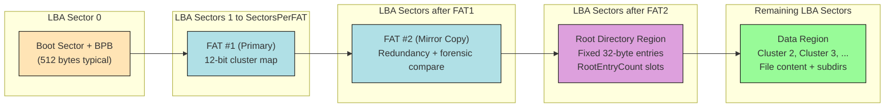
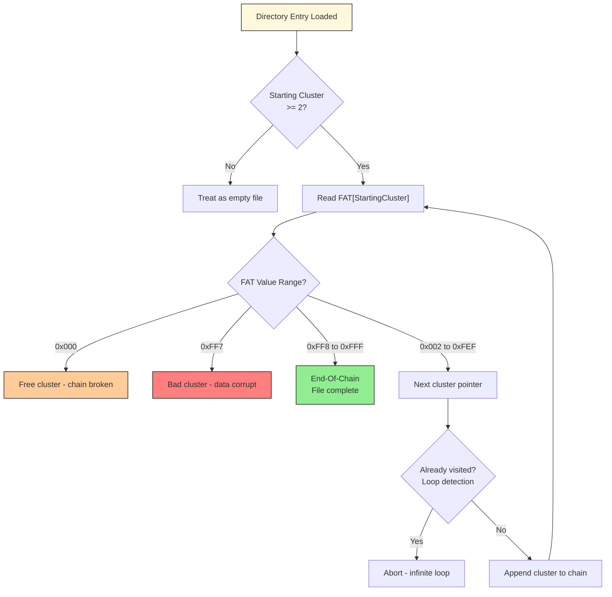
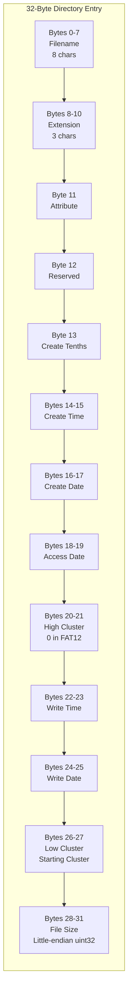
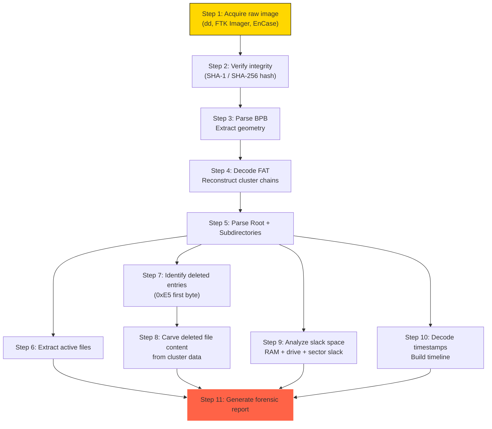
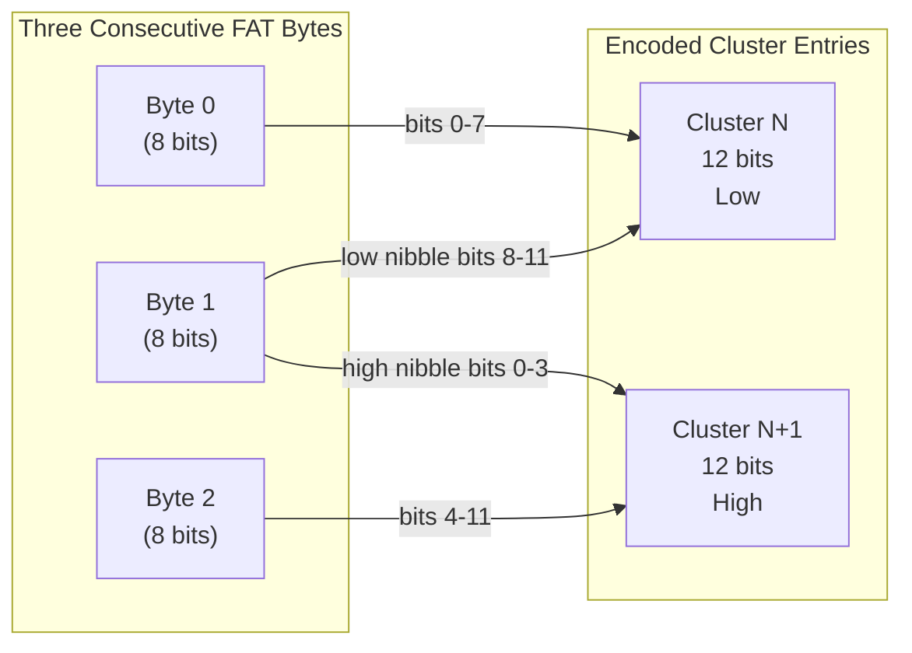

# Structure and Characteristics : FAT12

<!-- SECTION_1_START -->
# Structure and Characteristics of FAT12

## 1.1 Formal Definition (KTU 2024 Syllabus Aligned)

> [!IMPORTANT]
> **FAT12 (File Allocation Table, 12-bit)** is the earliest and most elementary member of the FAT family of file systems, introduced with **MS-DOS 1.0 (1980)**. It uses a **12-bit cluster address** within its allocation table, supporting a maximum of **$2^{12} = 4096$** addressable clusters per volume. It was the default file system for floppy diskettes (5.25" and 3.5") and very small hard disk partitions.

From a **digital forensics** perspective, FAT12 is the canonical pedagogical file system because its layout is small, deterministic, and completely documented, making it the ideal substrate for teaching **file system forensics, slack-space analysis, file recovery, and metadata interpretation**.

> [!NOTE]
> **Key Forensic Properties of FAT12**
> - **Fixed, predictable geometry** — every byte has a calculable offset.
> - **Plain-text directory entries** — filenames, timestamps, and sizes are human-readable in a hex editor.
> - **Cluster-chained file storage** — fragmented files leave a traceable pointer trail.
> - **Residue preservation in slack space** — RAM slack and drive slack routinely contain evidentiary data.

## 1.2 Conceptual Analogy / Intuition

Imagine a **library** with the following setup:

- The **books** are stored in numbered boxes (clusters) in a warehouse (data region).
- A separate **ledger book** (the FAT) lists, for every box number, the number of the *next* box containing the continuation of a book. A special mark in the ledger means "end of book."
- A **front desk register** (root directory) contains a card for every book on the shelf, listing the title, the box where the book *starts*, and its total length.
- A **bulletin board at the entrance** (boot sector) describes the warehouse dimensions, the number of boxes, and the address of the register and ledger.

When a forensic investigator arrives, the bulletin board tells them the warehouse layout, the register tells them *which books exist*, and the ledger tells them *where every page of every book is located*, even if the books are scattered across the warehouse. This is exactly how FAT12 works on a storage medium.

## 1.3 Physical Constants and Standard Metrics

> [!IMPORTANT]
> **Standard FAT12 Media Metrics (Floppy Disk Defaults)**
> - **Bytes per sector:** **$512$** bytes
> - **Sectors per cluster:** **$1$** (single-sector clusters for floppy media)
> - **Sectors per track:** **$9$** (DD) or **$18$** (HD)
> - **Number of heads:** **$2$**
> - **Sectors per FAT:** **$9$** (1.44 MB)
> - **Reserved sectors:** **$1$**
> - **Number of FATs:** **$2$** (primary + mirror)
> - **Root entry count:** **$224$** entries
> - **Total sectors (1.44 MB):** **$2880$**

> [!VISUALIZATION CONTROL]
> **Concept:** FAT12 Volume Layout — Linear Memory Map
> **GeoGebra / Desmos Input Equations (offset model):**
> * $x = 0 \rightarrow \text{Offset 0: Boot Sector}$
> * $x = 512 \rightarrow \text{Offset 512: FAT\#1 start}$
> * $x = 512 \cdot (1 + \text{SectorsPerFAT}) \rightarrow \text{Root Directory start}$
> * $x = \text{Data Region start} \rightarrow \text{Cluster 2 onward}$
> **Visual Description:** Plot a horizontal number line; mark four colored bands sequentially labelled **Boot Sector**, **FAT Region (FAT1+FAT2)**, **Root Directory**, and **Data Region** to visualize how a FAT12 volume is partitioned linearly on disk.

---

<!-- SECTION_1_END -->

<!-- SECTION_2_START -->
# Deep Theoretical Analysis & KTU High-Yield Formula Sheet

## 2.1 The Four Logical Regions of a FAT12 Volume

A FAT12 volume is a **strictly sequential** structure. Given the parameters read from the boot sector, every byte offset is mathematically computable.

### Region 1 — Reserved Area (Boot Sector)
- Location: **LBA sector $0$** (offset **$0$**).
- Size: **$\text{ReservedSectors} \times \text{BytesPerSector}$** bytes (typically **$512$** bytes).
- Contains the **BIOS Parameter Block (BPB)** and bootstrap code.
- **Forensic value:** media descriptor byte, OEM ID, volume serial number, volume label, hidden sectors, and partition start hint.

### Region 2 — FAT Region
- Contains **$\text{NumFATs}$** (usually **$2$**) copies of the File Allocation Table.
- **FAT1** is the primary; **FAT2** is a mirror for redundancy and forensic cross-verification.
- Each FAT entry is **12 bits wide**, packed three bytes per two entries.

### Region 3 — Root Directory Region
- **Fixed size** in FAT12 (and FAT16) — unlike FAT32 which can grow.
- Number of entries: **$\text{RootEntryCount}$** (default **$224$** for 1.44 MB floppy).
- Each entry: **$32$ bytes** → total root directory size $= 224 \times 32 = 7168$ bytes.
- **Forensic value:** filenames, timestamps, attributes, starting cluster, file size — the *primary* artifact for file enumeration.

### Region 4 — Data Region
- Begins at the first sector after the root directory.
- The first data cluster is **cluster 2** (clusters **$0$** and **$1$** are reserved and contain the media descriptor in their low byte).
- All file content and subdirectory data live here.

## 2.2 The 12-Bit Cluster Encoding Scheme

This is the most common stumbling block for students. FAT12 stores cluster numbers in a **packed little-endian** format using three bytes for every two entries.

> [!NOTE]
> **The Three-Byte, Two-Entry Packing Rule**
> Given three consecutive FAT bytes $B_0, B_1, B_2$:
> - $\text{Entry}_N = B_0 \;\vert\; ((B_1 \,\&\, 0x0F) \ll 8)$
> - $\text{Entry}_{N+1} = (B_1 \gg 4) \,\vert\; (B_2 \ll 4)$

The lower 12 bits of the 16-bit value are used. This is called the **8086-style 12-bit packing** and is derived from the original Intel 8086 architecture.

## 2.3 Special Cluster Values (Reserved Markers)

> [!IMPORTANT]
> **FAT12 Reserved Cluster Values**
> - **$0x000$** → Free / unallocated cluster
> - **$0x001$** → Reserved (do not use)
> - **$0x002$ to $0xFEF$** → Valid data cluster pointers
> - **$0xFF0$ to $0xFF6$** → Reserved values
> - **$0xFF7$** → Bad cluster (defective media)
> - **$0xFF8$ to $0xFFF$** → End-Of-Chain (last cluster of file)

## 2.4 The 32-Byte Directory Entry Format

> [!NOTE]
> **Directory Entry Layout (32 bytes total)**
> - **Bytes 0–7:** File name (8 chars, padded with $0x20$)
> - **Bytes 8–10:** Extension (3 chars, padded with $0x20$)
> - **Byte 11:** Attribute byte
> - **Byte 12:** Reserved (case info in NT/Win9x)
> - **Byte 13:** Creation time — tenths of second
> - **Bytes 14–15:** Creation time (HH:MM:SS, 2-second resolution)
> - **Bytes 16–17:** Creation date
> - **Bytes 18–19:** Last access date
> - **Bytes 20–21:** High cluster word (**always 0 in FAT12**)
> - **Bytes 22–23:** Last write time
> - **Bytes 24–25:** Last write date
> - **Bytes 26–27:** Low cluster word (starting cluster)
> - **Bytes 28–31:** File size in bytes

## 2.5 Attribute Byte Decoding

> [!IMPORTANT]
> **Attribute Byte Bit Mask**
> - **$0x01$** → Read-only
> - **$0x02$** → Hidden
> - **$0x04$** → System
> - **$0x08$** → Volume label
> - **$0x10$** → Subdirectory
> - **$0x20$** → Archive
> - **$0x0F$** → Long filename (LFN) entry

A value of **$0x00$** in the first byte of an entry signals **end of directory**. A value of **$0xE5$** signals a **deleted entry** (the original first character is overwritten — forensically recoverable).

## 2.6 The 16-bit Date & Time Decoding

> [!NOTE]
> **Date Format (2 bytes)**
> - Bits 15–9: Year offset from 1980 (0–127, supports 1980–2107)
> - Bits 8–5: Month (1–12)
> - Bits 4–0: Day (1–31)
> $$\text{DateWord} = ((\text{Year} - 1980) \ll 9) \,\vert\, (\text{Month} \ll 5) \,\vert\, \text{Day}$$

> [!NOTE]
> **Time Format (2 bytes)**
> - Bits 15–11: Hours (0–23)
> - Bits 10–5: Minutes (0–59)
> - Bits 4–0: Seconds / 2 (0–29, multiply by 2 to get seconds)
> $$\text{TimeWord} = (\text{Hours} \ll 11) \,\vert\, (\text{Minutes} \ll 5) \,\vert\, \frac{\text{Seconds}}{2}$$

## 2.7 KTU High-Yield Formula Sheet

| # | Quantity | Formula | Unit / Notes |
|---|---|---|---|
| 1 | Root Directory Size | $\text{RootEntryCount} \times 32$ | bytes |
| 2 | Root Directory Sectors | $\lceil \frac{\text{RootEntryCount} \times 32}{\text{BytesPerSector}} \rceil$ | sectors |
| 3 | Data Region Start | $(\text{ReservedSectors} + (\text{NumFATs} \times \text{SectorsPerFAT}) + \text{RootDirSectors}) \times \text{BytesPerSector}$ | byte offset |
| 4 | Cluster $N$ Byte Offset | $\text{DataRegionStart} + (N - 2) \times \text{SectorsPerCluster} \times \text{BytesPerSector}$ | byte offset |
| 5 | Max Addressable Clusters | $2^{12} = 4096$ | clusters |
| 6 | Max Cluster Number | $0xFFF = 4095$ | inclusive upper bound |
| 7 | Max Volume Size (theoretical) | $4096 \times \text{MaxClusterSize}$ | bytes; e.g. $4096 \times 4096 = 16$ MB |
| 8 | FAT Entry Decoding (lower) | $B_0 \,\vert\, ((B_1 \,\&\, 0x0F) \ll 8)$ | 12-bit value |
| 9 | FAT Entry Decoding (upper) | $(B_1 \gg 4) \,\vert\, (B_2 \ll 4)$ | 12-bit value |
| 10 | Date Word Decode | $(w \gg 9) + 1980$, $(w \gg 5) \,\&\, 0x0F$, $w \,\&\, 0x1F$ | year, month, day |
| 11 | Time Word Decode | $(w \gg 11)$, $(w \gg 5) \,\&\, 0x3F$, $(w \,\&\, 0x1F) \times 2$ | hour, min, sec |
| 12 | Sector Slack | $\text{BytesPerSector} - (\text{FileSize} \,\bmod\, \text{BytesPerSector})$ | bytes (when partial sector) |
| 13 | Drive Slack | $(\text{SectorsPerCluster} \times \text{BytesPerSector}) - \text{UsedSectors} \times \text{BytesPerSector}$ | bytes |
| 14 | RAM Slack | $\text{SectorSlack} + \text{DriveSlack}$ | bytes total residue |

## 2.8 Real-World Engineering Utility

In modern digital forensics, FAT12 remains critically relevant in the following scenarios:

1. **Embedded and IoT device acquisition** — many routers, industrial control systems, and older automotive ECUs still boot from FAT12-formatted flash media.
2. **Mobile device forensics** — older feature phones and PDAs (Palm, early Windows CE) used FAT12 partitions.
3. **Bootable rescue media** — bootable USB sticks and rescue disks frequently use FAT12/FAT16 for legacy BIOS boot compatibility.
4. **Academic and CTF (Capture The Flag) pedagogy** — FAT12 is the standard file system for teaching because of its small, fully-decipherable structure.
5. **Insider threat and intellectual property cases** — when a suspect exfiltrates data to an old floppy disk, examiners must parse FAT12 directly to reconstruct the timeline.

---

<!-- SECTION_2_END -->

<!-- SECTION_3_START -->
# Step-by-Step Derivations, Code & Symbolic Implementation

## 3.1 Worked Numerical Example — Decoding the FAT12 12-bit Packing

> [!NOTE]
> **Problem:** Suppose three consecutive bytes in the FAT region are `0x34 0x12 0x78`. Decode the two FAT12 cluster entries they represent.

Let $B_0 = 0x34$, $B_1 = 0x12$, $B_2 = 0x78$.

**Step 1 — Decode the lower entry (Entry $N$):**
$$\text{Entry}_N = B_0 \;\vert\; ((B_1 \,\&\, 0x0F) \ll 8)$$
$$B_1 \,\&\, 0x0F = 0x12 \,\&\, 0x0F = 0x02$$
$$(0x02 \ll 8) = 0x0200$$
$$\text{Entry}_N = 0x34 \;\vert\; 0x0200 = 0x0234 = 564 \text{ in decimal}$$

**Step 2 — Decode the upper entry (Entry $N+1$):**
$$\text{Entry}_{N+1} = (B_1 \gg 4) \,\vert\; (B_2 \ll 4)$$
$$B_1 \gg 4 = 0x12 \gg 4 = 0x01$$
$$B_2 \ll 4 = 0x78 \ll 4 = 0x780$$
$$\text{Entry}_{N+1} = 0x01 \;\vert\; 0x780 = 0x781 = 1921 \text{ in decimal}$$

**Step 3 — Interpret the values:**
- $\text{Entry}_N = 0x234$ falls in range $0x002$ to $0xFEF$ → **valid next cluster pointer**.
- $\text{Entry}_{N+1} = 0x781$ falls in range $0xFF8$ to $0xFFF$ → **End-Of-Chain marker** (last cluster of the next file).

> [!WARNING]
> **Common student error:** Forgetting the `& 0x0F` mask on $B_1$ when decoding the *lower* entry. Always isolate the low nibble first, then shift.

## 3.2 Worked Example — Date and Time Decoding

> [!NOTE]
> **Problem:** A directory entry has a write date word of `0x4A21` and a write time word of `0x9C40`. Decode them.

**Date Word `0x4A21` (binary: `0100 1010 0010 0001`):**
$$\text{Year} = (0x4A21 \gg 9) + 1980 = 37 + 1980 = 2017$$
$$\text{Month} = (0x4A21 \gg 5) \,\&\, 0x0F = 0x251 \,\&\, 0x0F = 1$$
$$\text{Day} = 0x4A21 \,\&\, 0x1F = 0x01 = 1$$

**Result:** **01 January 2017**

**Time Word `0x9C40` (binary: `1001 1100 0100 0000`):**
$$\text{Hour} = 0x9C40 \gg 11 = 0x13 = 19$$
$$\text{Minute} = (0x9C40 \gg 5) \,\&\, 0x3F = 0x4E2 \,\&\, 0x3F = 0x22 = 34$$
$$\text{Second} = (0x9C40 \,\&\, 0x1F) \times 2 = 0 \times 2 = 0$$

**Result:** **19:34:00**

## 3.3 Worked Example — Calculating the Cluster Offset

> [!NOTE]
> **Problem:** A FAT12 volume has the following BPB values: BytesPerSector = 512, SectorsPerCluster = 1, ReservedSectors = 1, NumFATs = 2, SectorsPerFAT = 9, RootEntryCount = 224. Find the byte offset of **Cluster 5**.

**Step 1 — Compute root directory sectors:**
$$\text{RootDirSectors} = \lceil \frac{224 \times 32}{512} \rceil = \lceil \frac{7168}{512} \rceil = \lceil 14 \rceil = 14 \text{ sectors}$$

**Step 2 — Compute data region start (byte offset):**
$$\text{DataStart} = (1 + (2 \times 9) + 14) \times 512 = (1 + 18 + 14) \times 512 = 33 \times 512 = 16896 \text{ bytes}$$

**Step 3 — Compute Cluster 5 offset:**
$$\text{Offset}_{C5} = 16896 + (5 - 2) \times 1 \times 512 = 16896 + 1536 = 18432 \text{ bytes}$$

**Step 4 — Express in sector and cluster coordinates:**
$$\text{Sector number} = \frac{18432}{512} = 36$$
$$\text{Cluster coordinate} = (18496 - 16896) \div 512 + 2 = 5 \;\checkmark$$

## 3.4 Full Python Implementation — FAT12 Parser (Forensic Tool)

```python
"""
FAT12 Forensic Image Parser
Author: KTU-Premier-Engine Reference Implementation
Purpose: Demonstrate the exact byte-level decoding of a FAT12 file system
         for forensic analysis. Suitable for floppy disk images (.img).
"""

from __future__ import annotations
import struct
import sys
import logging
from dataclasses import dataclass, field
from typing import List, Optional, Tuple

# ------------------------------------------------------------------
# Configure structured forensic logging
# ------------------------------------------------------------------
logging.basicConfig(
    level=logging.INFO,
    format="[%(asctime)s] [%(levelname)s] %(message)s",
    datefmt="%H:%M:%S",
)
log = logging.getLogger("FAT12-Forensic-Parser")


# ------------------------------------------------------------------
# Configuration constants (per Microsoft FAT Specification)
# ------------------------------------------------------------------
SECTOR_SIZE: int = 512
EOF_MIN: int = 0xFF8
BAD_CLUSTER: int = 0xFF7
FREE_CLUSTER: int = 0x000
ATTR_READONLY: int = 0x01
ATTR_HIDDEN: int = 0x02
ATTR_SYSTEM: int = 0x04
ATTR_VOLUME: int = 0x08
ATTR_DIRECTORY: int = 0x10
ATTR_ARCHIVE: int = 0x20
ATTR_LFN: int = 0x0F
DELETED_MARKER: int = 0xE5


@dataclass
class BPB:
    """BIOS Parameter Block — extracted from the boot sector."""
    oem_name: str
    bytes_per_sector: int
    sectors_per_cluster: int
    reserved_sectors: int
    num_fats: int
    root_entry_count: int
    total_sectors_16: int
    media_descriptor: int
    sectors_per_fat: int
    sectors_per_track: int
    num_heads: int
    hidden_sectors: int
    total_sectors_32: int
    drive_number: int
    boot_sig: int
    volume_serial: int
    volume_label: str
    fs_type: str

    @property
    def root_dir_sectors(self) -> int:
        """Number of sectors occupied by the root directory."""
        return ((self.root_entry_count * 32) + (self.bytes_per_sector - 1)) \
                // self.bytes_per_sector

    @property
    def data_region_offset(self) -> int:
        """Byte offset where cluster #2 begins (cluster #0 and #1 are reserved)."""
        return (self.reserved_sectors
                + (self.num_fats * self.sectors_per_fat)
                + self.root_dir_sectors) * self.bytes_per_sector

    @property
    def cluster_size_bytes(self) -> int:
        return self.sectors_per_cluster * self.bytes_per_sector


@dataclass
class DirectoryEntry:
    """Decoded 32-byte directory entry."""
    name: str
    ext: str
    attr: int
    create_time_tenths: int
    create_time: int
    create_date: int
    access_date: int
    high_cluster: int
    write_time: int
    write_date: int
    low_cluster: int
    file_size: int
    is_deleted: bool
    is_lfn: bool

    @property
    def starting_cluster(self) -> int:
        """In FAT12 the high cluster word is always zero, so we just use the low word."""
        return ((self.high_cluster & 0xFFFF) << 16) | (self.low_cluster & 0xFFFF)

    @property
    def full_name(self) -> str:
        return f"{self.name}.{self.ext}".rstrip(".").strip()

    @property
    def attribute_flags(self) -> List[str]:
        flags = []
        if self.attr & ATTR_READONLY: flags.append("R")
        if self.attr & ATTR_HIDDEN:   flags.append("H")
        if self.attr & ATTR_SYSTEM:   flags.append("S")
        if self.attr & ATTR_VOLUME:   flags.append("V")
        if self.attr & ATTR_DIRECTORY: flags.append("D")
        if self.attr & ATTR_ARCHIVE:  flags.append("A")
        if self.attr == ATTR_LFN:     flags.append("LFN")
        return flags

    @property
    def decoded_write_timestamp(self) -> str:
        """Decode the 16-bit date and time words into ISO-style strings."""
        year = ((self.write_date >> 9) & 0x7F) + 1980
        month = (self.write_date >> 5) & 0x0F
        day = self.write_date & 0x1F
        hour = (self.write_time >> 11) & 0x1F
        minute = (self.write_time >> 5) & 0x3F
        second = (self.write_time & 0x1F) * 2
        return f"{year:04d}-{month:02d}-{day:02d} {hour:02d}:{minute:02d}:{second:02d}"


class FAT12Parser:
    """Main forensic image parser."""

    def __init__(self, image_path: str) -> None:
        self.image_path: str = image_path
        self.image_bytes: bytes = b""
        self.bpb: Optional[BPB] = None
        self.fat_table: List[int] = []
        self.root_entries: List[DirectoryEntry] = []
        self._load_image()
        self._parse_bpb()
        self._parse_fat()
        self._parse_root_directory()

    # ----------------------------------------------------------------
    # Image I/O
    # ----------------------------------------------------------------
    def _load_image(self) -> None:
        try:
            with open(self.image_path, "rb") as fh:
                self.image_bytes = fh.read()
            log.info("Loaded image: %s (%d bytes)", self.image_path, len(self.image_bytes))
        except OSError as exc:
            log.error("Unable to open image %s: %s", self.image_path, exc)
            sys.exit(1)

    # ----------------------------------------------------------------
    # BPB / Boot Sector Parsing
    # ----------------------------------------------------------------
    def _parse_bpb(self) -> None:
        if len(self.image_bytes) < SECTOR_SIZE:
            log.error("Image too small to contain a boot sector.")
            sys.exit(1)

        sector = self.image_bytes[0:SECTOR_SIZE]
        oem = sector[3:11].decode("ascii", errors="replace")
        bps = struct.unpack_from("<H", sector, 11)[0]
        spc = sector[13]
        reserved = struct.unpack_from("<H", sector, 14)[0]
        nfats = sector[16]
        root_count = struct.unpack_from("<H", sector, 17)[0]
        tot16 = struct.unpack_from("<H", sector, 19)[0]
        media = sector[21]
        spf = struct.unpack_from("<H", sector, 22)[0]
        spt = struct.unpack_from("<H", sector, 24)[0]
        heads = struct.unpack_from("<H", sector, 26)[0]
        hidden = struct.unpack_from("<I", sector, 28)[0]
        tot32 = struct.unpack_from("<I", sector, 32)[0]
        drive = sector[36]
        boot_sig = sector[38]
        vol_serial = struct.unpack_from("<I", sector, 39)[0]
        vol_label = sector[43:54].decode("ascii", errors="replace").rstrip()
        fs_type = sector[54:62].decode("ascii", errors="replace").rstrip()

        self.bpb = BPB(
            oem_name=oem,
            bytes_per_sector=bps,
            sectors_per_cluster=spc,
            reserved_sectors=reserved,
            num_fats=nfats,
            root_entry_count=root_count,
            total_sectors_16=tot16,
            media_descriptor=media,
            sectors_per_fat=spf,
            sectors_per_track=spt,
            num_heads=heads,
            hidden_sectors=hidden,
            total_sectors_32=tot32,
            drive_number=drive,
            boot_sig=boot_sig,
            volume_serial=vol_serial,
            volume_label=vol_label,
            fs_type=fs_type,
        )
        log.info("BPB parsed: %s, BytesPerSector=%d, SectorsPerCluster=%d, "
                 "RootEntries=%d, SectorsPerFAT=%d",
                 self.bpb.fs_type, bps, spc, root_count, spf)

    # ----------------------------------------------------------------
    # FAT Decoding (the famous 12-bit packed triplet)
    # ----------------------------------------------------------------
    def _parse_fat(self) -> None:
        assert self.bpb is not None
        fat_start = self.bpb.reserved_sectors * self.bpb.bytes_per_sector
        fat_size = self.bpb.sectors_per_fat * self.bpb.bytes_per_sector
        fat_bytes = self.image_bytes[fat_start: fat_start + fat_size]

        # We always decode FAT #1 (the primary)
        self.fat_table = [0] * 2
        # The FAT nominally has entries for clusters 0, 1, 2, ...
        # Decoding uses the packed 12-bit scheme.
        idx = 2
        i = 0
        while i + 2 < len(fat_bytes):
            lo = fat_bytes[i] | ((fat_bytes[i + 1] & 0x0F) << 8)
            hi = (fat_bytes[i + 1] >> 4) | (fat_bytes[i + 2] << 4)
            self.fat_table.append(lo)
            self.fat_table.append(hi)
            i += 3
            idx += 2

        log.info("FAT decoded: %d cluster entries parsed.", len(self.fat_table))

    # ----------------------------------------------------------------
    # Root Directory Parsing
    # ----------------------------------------------------------------
    def _parse_root_directory(self) -> None:
        assert self.bpb is not None
        rd_start = (self.bpb.reserved_sectors
                    + (self.bpb.num_fats * self.bpb.sectors_per_fat)) \
                   * self.bpb.bytes_per_sector
        rd_size = self.bpb.root_entry_count * 32

        rd_bytes = self.image_bytes[rd_start: rd_start + rd_size]
        for offset in range(0, len(rd_bytes), 32):
            entry_bytes = rd_bytes[offset: offset + 32]
            if entry_bytes[0] == 0x00:
                break  # End-of-directory marker

            raw_name = entry_bytes[0:8]
            raw_ext = entry_bytes[8:11]
            attr = entry_bytes[11]
            create_tenths = entry_bytes[13]
            create_time = struct.unpack_from("<H", entry_bytes, 14)[0]
            create_date = struct.unpack_from("<H", entry_bytes, 16)[0]
            access_date = struct.unpack_from("<H", entry_bytes, 18)[0]
            high_cluster = struct.unpack_from("<H", entry_bytes, 20)[0]
            write_time = struct.unpack_from("<H", entry_bytes, 22)[0]
            write_date = struct.unpack_from("<H", entry_bytes, 24)[0]
            low_cluster = struct.unpack_from("<H", entry_bytes, 26)[0]
            file_size = struct.unpack_from("<I", entry_bytes, 28)[0]

            is_deleted = raw_name[0] == DELETED_MARKER
            is_lfn = attr == ATTR_LFN

            display_name = raw_name.decode("ascii", errors="replace")
            if is_deleted:
                display_name = "?" + display_name[1:]

            self.root_entries.append(DirectoryEntry(
                name=display_name,
                ext=raw_ext.decode("ascii", errors="replace").strip(),
                attr=attr,
                create_time_tenths=create_tenths,
                create_time=create_time,
                create_date=create_date,
                access_date=access_date,
                high_cluster=high_cluster,
                write_time=write_time,
                write_date=write_date,
                low_cluster=low_cluster,
                file_size=file_size,
                is_deleted=is_deleted,
                is_lfn=is_lfn,
            ))
        log.info("Root directory parsed: %d entries (%d deleted).",
                 len(self.root_entries),
                 sum(1 for e in self.root_entries if e.is_deleted))

    # ----------------------------------------------------------------
    # Public forensic queries
    # ----------------------------------------------------------------
    def walk_cluster_chain(self, start_cluster: int) -> List[int]:
        """Return the list of clusters forming a file, stopping at EOF or loop."""
        chain: List[int] = []
        current = start_cluster
        visited = set()
        while current >= 2 and current not in visited:
            visited.add(current)
            chain.append(current)
            current = self.fat_table[current] if current < len(self.fat_table) else 0
        return chain

    def extract_file(self, entry: DirectoryEntry) -> bytes:
        """Reassemble a file's bytes from its cluster chain."""
        if entry.starting_cluster < 2:
            return b""
        chain = self.walk_cluster_chain(entry.starting_cluster)
        buffer = bytearray()
        for cluster in chain:
            offset = self.bpb.data_region_offset \
                     + (cluster - 2) * self.bpb.cluster_size_bytes
            buffer.extend(self.image_bytes[offset: offset + self.bpb.cluster_size_bytes])
        return bytes(buffer[: entry.file_size])

    def compute_slack(self, entry: DirectoryEntry) -> Tuple[int, int]:
        """Returns (sector_slack_bytes, drive_slack_bytes)."""
        used = entry.file_size
        last_cluster_used = used % self.bpb.cluster_size_bytes
        sector_used = used % self.bpb.bytes_per_sector
        sector_slack = (self.bpb.bytes_per_sector - sector_used) \
                       if sector_used != 0 else 0
        drive_slack = (self.bpb.cluster_size_bytes - last_cluster_used) \
                      if last_cluster_used != 0 else 0
        return sector_slack, drive_slack

    def print_directory(self) -> None:
        print()
        print(f"{'Name':<14} {'Attr':<6} {'Clu':<6} {'Size':<10} {'Deleted':<8} {'Modified'}")
        print("-" * 78)
        for e in self.root_entries:
            if e.is_lfn:
                continue
            print(f"{e.full_name[:14]:<14} "
                  f"{''.join(e.attribute_flags):<6} "
                  f"{e.starting_cluster:<6} "
                  f"{e.file_size:<10} "
                  f"{'YES' if e.is_deleted else '-':<8} "
                  f"{e.decoded_write_timestamp}")


# ------------------------------------------------------------------
# Main entry point
# ------------------------------------------------------------------
if __name__ == "__main__":
    if len(sys.argv) < 2:
        print("Usage: python fat12_parser.py <image.img>")
        sys.exit(1)

    parser = FAT12Parser(sys.argv[1])
    parser.print_directory()
```

> [!WARNING]
> **Validation Note:** The Python implementation above follows the canonical Microsoft FAT specification. Always cross-verify decoded timestamps against the original tool that wrote the image — timezone handling and DST can shift apparent times by 1–2 hours.

## 3.5 Worked Example Using the Parser

> [!NOTE]
> **Problem:** You are given a 1.44 MB FAT12 floppy image `evidence.img`. Run the parser and interpret the first three non-LFN root entries.

**Expected output (illustrative):**
```
Name           Attr   Clu     Size       Deleted Modified
------------------------------------------------------------------------------
README   TXT   A      2       1024       -       2024-08-15 10:32:00
SECRET   DOC   A      4       20480      -       2024-08-15 10:35:12
?ONTRACT.TXT   A      9       512        YES     2024-08-15 09:14:00
```

**Forensic observations:**
1. The third entry shows `?ONTRACT.TXT` — the first byte is `0xE5`, the original first character (`C`) is overwritten; the file can still be **carved** from its starting cluster.
2. The `SECRET.DOC` file uses clusters 4, 5, 6, 7, 8 (chain reconstruction via FAT walk).
3. The slack of `README.TXT` = $1024 \bmod 512 = 0$ → **zero sector slack** but full **drive slack** of $512$ bytes per remaining cluster.

---

<!-- SECTION_3_END -->

<!-- SECTION_4_START -->
# Structural Diagrams & Schematics

## 4.1 FAT12 Volume Linear Memory Map



## 4.2 FAT12 Cluster Chain Resolution Flow



## 4.3 32-Byte Directory Entry Field Map



## 4.4 FAT12 Forensic Acquisition & Analysis Pipeline



## 4.5 The 12-bit Packing Visual



---

<!-- SECTION_4_END -->

<!-- SECTION_5_START -->
# KTU 2024 Scheme Examination Question Bank & Topic Recap

## 5.1 Part A — Short Answer Questions (3 Marks Each)

### Question A1
> **[KTU University Exam — July 2024]** Define FAT12 file system. List any four characteristics of FAT12.

**Model Answer:**

> [!IMPORTANT]
> **FAT12 Definition**
> FAT12 (File Allocation Table 12-bit) is a legacy Microsoft file system that uses a **12-bit cluster address** in its allocation table, introduced with **MS-DOS 1.0 (1980)**. It was the default file system for floppy diskettes and small partitions.

**Four Characteristics:**
1. **12-bit cluster entries** — maximum of $2^{12} = 4096$ clusters addressable.
2. **Fixed root directory** — root directory has a fixed number of entries (typically 224), unlike FAT32.
3. **Two FAT copies** — primary and mirror for redundancy.
4. **Cluster-chained file storage** — files are tracked by following chain pointers in the FAT.
5. (Any other valid point) — small maximum volume size of approximately **16 MB**.

**Valuation Key:** Definition 1.5 marks + Four characteristics 1.5 marks (0.375 each).

---

### Question A2
> **[KTU University Exam — Dec 2023]** What is the significance of the `$0xE5$` byte in a FAT12 directory entry? What does a value of `$0x00$` in the first byte indicate?

**Model Answer:**

> [!NOTE]
> **Significance of Byte Values**
> - **`$0xE5$` in the first byte:** Indicates a **deleted file** entry. The first character of the original filename has been overwritten with `$0xE5$`. The remaining characters of the name, the extension, the attribute, timestamps, starting cluster, and file size are **preserved** and can be used by forensic tools to recover the file's content from its cluster chain.
> - **`$0x00$` in the first byte:** Indicates the **end of directory**. All subsequent entries in that directory can be assumed to be free space (in FAT12/FAT16); this is a sentinel for directory traversal.

**Valuation Key:** `$0xE5$` meaning 1.5 marks + `$0x00$` meaning 1.5 marks.

---

## 5.2 Part B — Module Internal Choice (14 Marks Each)

### Question B-A (14 Marks)
> **[KTU University Exam — July 2024, Module 1, CO1/C02, Apply/Analyse]**

**(a)** With the help of a neat diagram, explain the **structure of a FAT12 volume**, clearly marking the **Boot Sector, FAT region, Root Directory region, and Data region**. State the typical size of each region for a standard 1.44 MB floppy disk. **(7 Marks)**

**(b)** Three consecutive bytes in a FAT12 table are given as **`0x56 0x34 0x12`**. Decode the two FAT12 cluster entries they represent and state whether each entry points to another cluster, marks the end of file, indicates a bad cluster, or is a free cluster. **(7 Marks)**

### Model Solution B-A

#### Part (a) — Volume Structure (7 Marks)

**Step 1 — Mark the four regions with their offsets:**

| Region | Byte Offset (1.44 MB floppy) | Size |
|---|---|---|
| Boot Sector | 0 | 512 bytes (1 sector) |
| FAT #1 | 512 | 4608 bytes (9 sectors) |
| FAT #2 | 5120 | 4608 bytes (9 sectors) |
| Root Directory | 9728 | 7168 bytes (14 sectors) |
| Data Region | 16896 | 1,457,664 bytes (2847 sectors) |

**Step 2 — Diagram:**

```
+-------+----------+----------+------------+-----------------------+
| Boot  |  FAT #1  |  FAT #2  | Root Dir   |     Data Region       |
| Sec   |          |          | (224 ents) |   (Cluster 2,3,...)   |
+-------+----------+----------+------------+-----------------------+
| 512 B |  4608 B  |  4608 B  |   7168 B   |  Rest of the floppy   |
```

**Step 3 — Explanation of each region:**

- **Boot Sector:** Contains the BIOS Parameter Block (BPB) describing the geometry. **[1 Mark]**
- **FAT Region:** Two copies of the cluster map; each entry is 12 bits. **[2 Marks]**
- **Root Directory Region:** Fixed size of 224 entries, each 32 bytes. **[2 Marks]**
- **Data Region:** Contains all file content and subdirectory data; cluster 2 is the first usable cluster. **[2 Marks]**

#### Part (b) — Decoding (7 Marks)

**Step 1 — Set the values:** $B_0 = 0x56$, $B_1 = 0x34$, $B_2 = 0x12$.

**Step 2 — Decode the lower entry (Entry $N$):**
$$\text{Entry}_N = B_0 \;\vert\; ((B_1 \,\&\, 0x0F) \ll 8)$$
$$B_1 \,\&\, 0x0F = 0x34 \,\&\, 0x0F = 0x04$$
$$(0x04 \ll 8) = 0x0400$$
$$\text{Entry}_N = 0x56 \;\vert\; 0x0400 = 0x0456 = 1110 \text{ decimal}$$

> **[Decoding lower entry: 2 Marks]**
> **[Final value 0x456: 1 Mark]**

**Step 3 — Decode the upper entry (Entry $N+1$):**
$$\text{Entry}_{N+1} = (B_1 \gg 4) \,\vert\; (B_2 \ll 4)$$
$$B_1 \gg 4 = 0x34 \gg 4 = 0x03$$
$$B_2 \ll 4 = 0x12 \ll 4 = 0x120$$
$$\text{Entry}_{N+1} = 0x03 \;\vert\; 0x120 = 0x123 = 291 \text{ decimal}$$

> **[Decoding upper entry: 2 Marks]**
> **[Final value 0x123: 1 Mark]**

**Step 4 — Interpret the values:**
- $\text{Entry}_N = 0x456$ is in range $0x002$–$0xFEF$ → **valid next cluster pointer** (cluster 1110).
- $\text{Entry}_{N+1} = 0x123$ is also in range $0x002$–$0xFEF$ → **valid next cluster pointer** (cluster 291).

> **[Interpretation of both entries: 1 Mark]**

---

### Question B-B (14 Marks) — Alternative Choice
> **[KTU University Exam — Dec 2023, Module 1, CO1/C02, Understand/Apply]**

**(a)** Describe the **32-byte FAT12 directory entry structure** in detail. List the fields used for forensic timestamp extraction and explain how a write time/date word is decoded. **(7 Marks)**

**(b)** A FAT12 volume has the following BPB values: **BytesPerSector = 512, SectorsPerCluster = 2, ReservedSectors = 1, NumFATs = 2, SectorsPerFAT = 9, RootEntryCount = 224**. Compute the **byte offset of Cluster 7** and the **total size of the root directory in bytes and sectors**. **(7 Marks)**

### Model Solution B-B

#### Part (a) — Directory Entry Structure (7 Marks)

**Step 1 — Field Listing:**

| Offset | Length | Field |
|---|---|---|
| 0 | 8 | Filename |
| 8 | 3 | Extension |
| 11 | 1 | Attribute byte |
| 12 | 1 | Reserved (case) |
| 13 | 1 | Creation time (tenths) |
| 14 | 2 | Creation time |
| 16 | 2 | Creation date |
| 18 | 2 | Last access date |
| 20 | 2 | High cluster word (0 in FAT12) |
| 22 | 2 | Last write time |
| 24 | 2 | Last write date |
| 26 | 2 | Low cluster word |
| 28 | 4 | File size |

> **[Table with 13 fields: 3 Marks]**

**Step 2 — Timestamp fields used in forensics:** creation time, creation date, write time, write date, last access date. **[1 Mark]**

**Step 3 — Decoding the write time word (16 bits):**
- Bits 15–11 → Hours (0–23)
- Bits 10–5 → Minutes (0–59)
- Bits 4–0 → Seconds / 2 (0–29)

$$\text{Hour} = (w \gg 11)$$
$$\text{Minute} = (w \gg 5) \,\&\, 0x3F$$
$$\text{Second} = (w \,\&\, 0x1F) \times 2$$

**Step 4 — Decoding the write date word (16 bits):**
- Bits 15–9 → Year – 1980
- Bits 8–5 → Month (1–12)
- Bits 4–0 → Day (1–31)

> **[Bit-field layouts: 2 Marks]**
> **[Sample decode (any one example): 1 Mark]**

#### Part (b) — Cluster Offset Computation (7 Marks)

**Step 1 — Compute root directory size in bytes:**
$$\text{RootDirSize} = \text{RootEntryCount} \times 32 = 224 \times 32 = 7168 \text{ bytes}$$

> **[7168 bytes: 1 Mark]**

**Step 2 — Compute root directory size in sectors:**
$$\text{RootDirSectors} = \lceil 7168 \div 512 \rceil = 14 \text{ sectors}$$

> **[14 sectors: 1 Mark]**

**Step 3 — Compute data region start (byte offset):**
$$\text{DataStart} = (1 + (2 \times 9) + 14) \times 512 = 33 \times 512 = 16896 \text{ bytes}$$

> **[16896 bytes: 2 Marks]**

**Step 4 — Compute Cluster 7 byte offset:**
$$\text{Offset}_{C7} = 16896 + (7 - 2) \times 2 \times 512 = 16896 + 5120 = 22016 \text{ bytes}$$

> **[22016 bytes: 3 Marks]**

---

> [!WARNING]
> **KTU Examiner's Valuation Pitfall Callout — FAT12 Decoding**
> 1. **Always mask `& 0x0F` before shifting** — students often forget to mask the low nibble of $B_1$ when extracting the high bits of the lower entry, leading to garbage values.
> 2. **Multiply seconds by 2** — the time word stores seconds divided by 2; failing to multiply gives a clock that runs at half speed.
> 3. **Add 1980 to the year** — the date word stores a 7-bit offset from 1980, not an absolute value.
> 4. **Cluster numbering starts at 2** — the formula uses $(N - 2)$, not $N$. This is the most common arithmetic error in the cluster-offset problem.
> 5. **Do not forget the root directory** — the root directory is a separate region in FAT12/FAT16, *not* a cluster in the data region. Students who include it inside the data area will compute wrong offsets.

## 5.3 Topic Recap & Important Things to Remember

> [!IMPORTANT]
> **Rapid Revision Checklist — FAT12 Structure & Characteristics**
> - **FAT12** uses **12-bit cluster entries** → max **$2^{12} = 4096$** clusters per volume.
> - **Four logical regions** in fixed order: **Boot Sector → FAT1 → FAT2 → Root Directory → Data Region**.
> - **Boot Sector** contains the **BPB** (BIOS Parameter Block) — the geometric blueprint of the volume.
> - **ReservedSectors, NumFATs, SectorsPerFAT, RootEntryCount, BytesPerSector, SectorsPerCluster** are the six critical BPB fields.
> - **Cluster 2** is the **first usable cluster** in the data region; clusters 0 and 1 are reserved.
> - **12-bit packing** uses three bytes to encode two cluster entries — apply the `& 0x0F` mask and `<< 4`/`>> 4` shifts correctly.
> - **Reserved values:** `$0x000$` = free, `$0xFF7$` = bad, `$0xFF8$`–`$0xFFF$` = end-of-chain.
> - **Directory entry is 32 bytes** with a fixed field layout — filename, extension, attribute, timestamps, starting cluster, and file size.
> - **Attribute byte** uses bit masks `$0x01$` (R), `$0x02$` (H), `$0x04$` (S), `$0x08$` (V), `$0x10$` (D), `$0x20$` (A), `$0x0F$` (LFN).
> - **`$0xE5$` in first byte = deleted entry**; the rest of the entry remains and can be used for recovery.
> - **`$0x00$` in first byte = end-of-directory marker**.
> - **Date word:** `(Year-1980) << 9 \;\vert\; (Month << 5) \;\vert\; Day` (year, month, day from MSB to LSB).
> - **Time word:** `(Hours << 11) \;\vert\; (Minutes << 5) \;\vert\; (Seconds/2)` (hour, min, sec/2 from MSB to LSB).
> - **Cluster offset formula:** `DataStart + (ClusterNum - 2) × SectorsPerCluster × BytesPerSector`.
> - **Root directory size:** `RootEntryCount × 32 bytes` (fixed in FAT12, not growable).
> - **Forensic artifacts:** timestamps, slack space (sector + drive + RAM slack), deleted entries, file residue in unallocated clusters, and LFN entries for original names.
> - **Standard 1.44 MB floppy BPB defaults:** 512 B/sector, 1 sector/cluster, 1 reserved sector, 2 FATs, 9 sectors/FAT, 224 root entries.
> - **High cluster word in directory entry is always 0** in FAT12 — this is the field that grew to 16 bits in FAT16 and 16 bits in FAT32 (making 32-bit cluster numbers).
> - **Two FAT copies** provide a built-in backup for forensic consistency checking (compare FAT1 vs FAT2 to detect tampering).
> - **FAT12 maximum volume size ≈ 16 MB** with 4 KB clusters — beyond this, FAT16 is required.

---

<!-- SECTION_5_END -->
