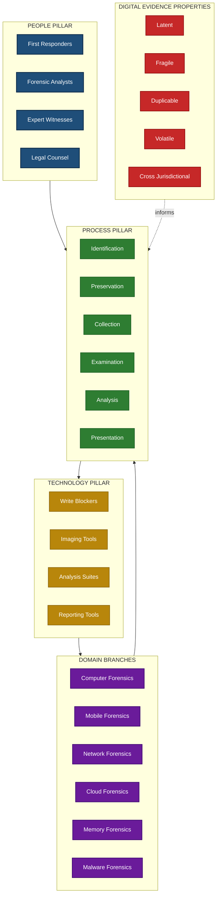
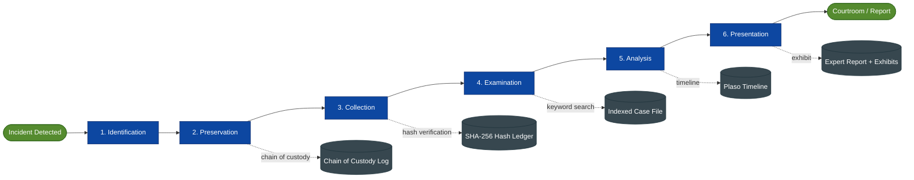
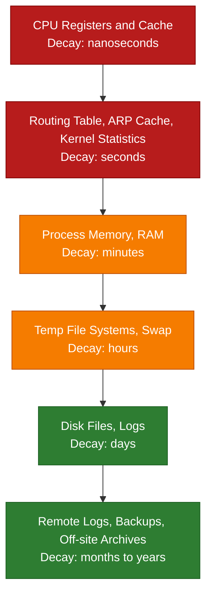
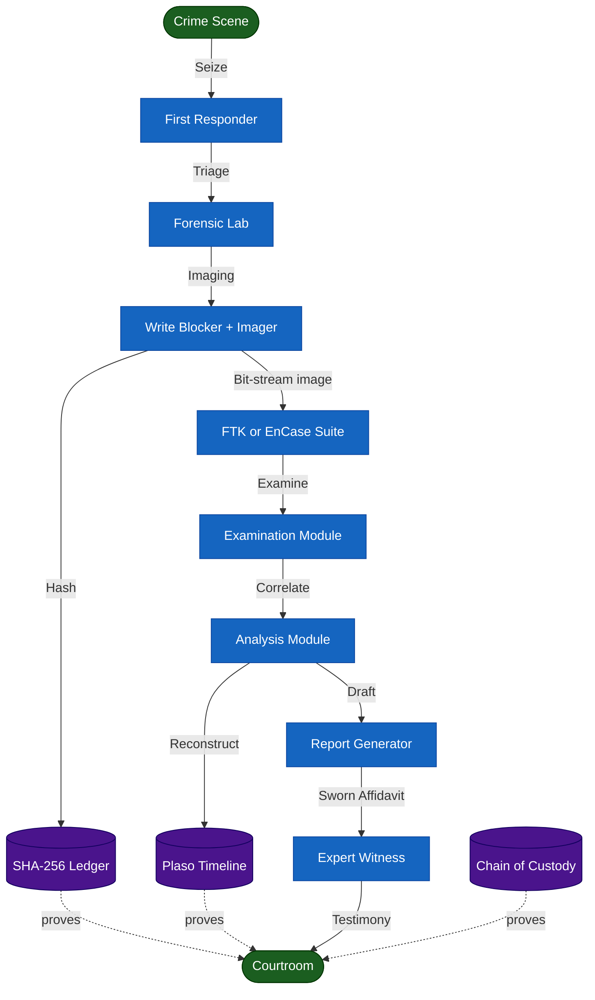
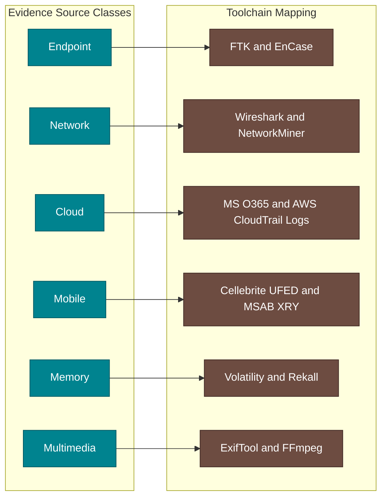

# Structure and Characteristics

<!-- SECTION_1_START -->
# Digital Forensics: Structure and Characteristics

> [!IMPORTANT]
> **KTU 2024 Scheme | PECST754 | Module 1** — This topic is a **high-weightage foundational concept** that frequently appears in KTU ESE Part A (3-mark definitions) and as a 7-mark sub-part inside Part B questions. Mastering the terminology here unlocks Modules 2–5.

---

## 1. Formal Definition

**Digital Forensics** is the branch of forensic science encompassing the **recovery, investigation, examination, and analysis of material found in digital devices**, often in relation to mobile devices, computers, network resources, and cloud storage, with the goal of preserving *any* digital evidence in its most original form while performing a structured investigation by collecting, identifying, and validating the digital information for the purpose of reconstructing past events.

When we speak of the **"Structure and Characteristics"** of Digital Forensics, we refer to two distinct but complementary facets:

1. **Structure** — the *anatomical framework* of the discipline (its sub-domains, layers, lifecycle phases, and the people-process-technology triangle that holds it together).
2. **Characteristics** — the *inherent properties* of digital evidence and the *defining attributes* of a sound digital forensic investigation (e.g., admissibility, authenticity, reliability, completeness).

> [!NOTE]
> **Syllabus Definition (PECST754, Module 1):**
> *"Understand the structure of digital forensics — its branches, phases, and participants — and identify the defining characteristics of digital evidence that distinguish it from physical forensic evidence."*

---

## 2. Conceptual Analogy — The "Post-Office Detective" Intuition

Imagine a **post office** in a small town. A crime is committed. The detective arrives and:

- **Seals the post office as-is** (does not let anyone enter, copies nothing) — this is **evidence preservation**.
- **Photographs every room before touching anything** — this is the **imaging** phase.
- **Opens every parcel, reads every letter, traces every sender** — this is **analysis**.
- **Reconstructs the timeline of who-was-where-when** — this is **reconstruction / timeline analysis**.
- **Hands a sealed chain-of-custody folder to the judge** — this is the **legal / presentation** phase.

Now imagine the post office is not made of brick-and-mortar rooms, but of **hard drives, RAM, packets, and log files**. The detective is a *Digital Forensic Investigator*, and the post office is the *crime scene*. The **structure** of digital forensics is the *standard operating procedure (SOP) the detective follows*, and the **characteristics** are the *peculiar nature of digital evidence* (volatile, fragile, latent, duplicable).

> [!TIP]
> **Memory Hook:** *"If physical forensics is archaeology, digital forensics is archaeology + clock-reversal engineering."*

---

## 3. Three Pillars — The "People–Process–Technology" Triangle

The **structure** of any digital forensics capability rests on three interdependent pillars. If even one pillar cracks, the entire investigation can be ruled *inadmissible* in court.

| Pillar | Role | Real-World Example |
|---|---|---|
| **People** | Trained investigators, legal counsel, expert witnesses | CERT-In empanelled forensic analysts, CBI Cyber Division |
| **Process** | Standardized methodology (e.g., ISO/IEC 27037, NIST SP 800-86) | Identification → Preservation → Collection → Examination → Analysis → Presentation |
| **Technology** | Hardware write-blockers, forensic imagers, EnCase, FTK, Autopsy, X-Ways | Tableau TX1 write-blocker, FTK Imager, Cellebrite UFED |

---

## 4. Why "Characteristics" Matter — The Latent, Fragile, Duplicable Nature of Digital Evidence

Digital evidence is fundamentally different from physical evidence. Its characteristics are the *reason* digital forensics needs a separate discipline altogether.

> [!IMPORTANT]
> **Core Characteristics of Digital Evidence (Board-Favorite):**
> 1. **Latent** — Cannot be seen with the naked eye; requires tools (hex editors, log analyzers).
> 2. **Fragile** — Easily altered, overwritten, or destroyed by a single reboot or `rm -rf`.
> 3. **Duplicable** — Perfect bit-for-bit copies can be made (a forensic *image* is a *clone*, not a copy).
> 4. **Volatile** — Some evidence (RAM, ARP cache, running processes) vanishes the moment power is lost.
> 5. **Cross-jurisdictional** — A single email may traverse 5+ countries in milliseconds.
> 6. **Time-sensitive** — Timestamps are relative; clock skew and NTP must be considered.

> [!VISUALIZATION CONTROL]
> **Concept:** Volatility Pyramid of Digital Evidence (analogous to RFC 3227)
> **GeoGebra / Desmos Input Equations (illustrative decay model):**
> * $V(t) = V_0 \cdot e^{-\lambda t}$ where $V_0$ is initial evidence value, $\lambda$ is the volatility constant, $t$ is elapsed time
> **Visual Description:** Plot a decreasing exponential curve. Higher volatile evidence (CPU registers, RAM) sits at the top of the pyramid and decays fastest; persistent evidence (hard disk, backups) sits at the base and decays slowly.
<!-- SECTION_1_END -->

<!-- SECTION_2_START -->
# Deep Theoretical Analysis & KTU High-Yield Formula Sheet

---

## 1. Structural Anatomy of Digital Forensics

Digital forensics is not a single tool or technique. It is a **layered, multi-domain discipline**. The structure can be understood at four levels:

### A. Domain-Level Structure (Branches of Digital Forensics)

| Branch | Scope | Typical Artefact |
|---|---|---|
| **Computer Forensics** | Desktops, laptops, servers | Hard disks, OS logs, registry hives |
| **Mobile Forensics** | Smartphones, tablets, IoT wearables | SMS, call logs, app data, GPS traces |
| **Network Forensics** | LAN/WAN traffic, IDS logs | PCAP files, NetFlow records, firewall logs |
| **Cloud Forensics** | SaaS, IaaS, PaaS tenants | Tenant logs, API audit trails, snapshots |
| **Memory Forensics** | Live RAM, hibernation files, pagefile.sys | Volatility profiles, process trees |
| **Database Forensics** | RDBMS, NoSQL stores | Transaction logs, audit trails, WAL files |
| **Email Forensics** | Mail servers, clients, webmail | PST/OST, MBOX, header analysis |
| **Malware Forensics** | Reverse engineering malicious code | Disassembled binaries, C2 traffic |
| **IoT / Vehicle Forensics** | Smart home devices, ECU/infotainment | Firmware dumps, CAN bus traces |
| **Audio-Video / Image Forensics** | Multimedia content | EXIF metadata, ELA, deepfake detection |

### B. Process-Level Structure — The Forensic Lifecycle

The universally accepted process model (mapped to ISO/IEC 27042 and NIST SP 800-86) consists of **six phases**:

1. **Identification** — Recognise that an incident has occurred and determine which devices / data sources hold potential evidence.
2. **Preservation** — Isolate, secure, and protect the physical and logical integrity of the evidence (chain of custody begins here).
3. **Collection** — Acquire the evidence using forensically sound tools (write-blockers, hashing, imaged duplication).
4. **Examination** — Reduce the collected data by eliminating irrelevant files and extracting items of interest.
5. **Analysis** — Interpret the examined data, draw conclusions, and reconstruct the sequence of events.
6. **Presentation** — Report findings in a clear, court-admissible format with supporting documentation.

> [!IMPORTANT]
> **Memory Hook — "I-P-C-E-A-P"** (or simply *"The 6 Ps: Pick, Protect, Pull, Parse, Prove, Present"*).

### C. Organisational Structure — Who Does What?

- **First Responders** — On-scene personnel who secure and triage the scene.
- **Forensic Investigators / Analysts** — Perform the technical examination.
- **Forensic Technicians** — Operate imaging hardware, create bit-stream copies.
- **Expert Witnesses** — Testify in court; explain technical findings in plain language.
- **Legal Counsel** — Advises on admissibility, search warrants, jurisdiction.
- **Auditors / Reviewers** — Peer-review reports for compliance with SOPs (e.g., ISO 17025).

### D. Technological Structure — The Forensic Stack

$$
\text{Forensic Stack} = \underbrace{\text{Acquisition Layer}}_{\text{write-blockers, imager}} \;+\; \underbrace{\text{Processing Layer}}_{\text{EnCase, FTK, X-Ways, Autopsy}} \;+\; \underbrace{\text{Analysis Layer}}_{\text{Volatility, Plaso, RegRipper}} \;+\; \underbrace{\text{Presentation Layer}}_{\text{report generators, timelines}}
$$

---

## 2. Characteristics of Digital Forensics (as a Discipline)

A *discipline* is defined by its distinguishing traits. Digital forensics as a discipline is characterised by:

| # | Characteristic | Explanation |
|---|---|---|
| 1 | **Scientific Methodology** | Hypothetico-deductive approach; reproducible, peer-reviewable procedures. |
| 2 | **Standardisation** | Adherence to ISO/IEC 27037, ISO/IEC 27042, NIST, ACPO (UK) principles. |
| 3 | **Evidentiary Admissibility** | Output must withstand *Daubert* / *Frye* / *Section 65B Indian Evidence Act* scrutiny. |
| 4 | **Forensically Sound** | Original evidence is never modified; only verified bit-stream copies are analysed. |
| 5 | **Multi-disciplinary** | Combines law, computer science, mathematics, behavioural science. |
| 6 | **Time-critical** | Order of volatility dictates immediate action (RFC 3227). |
| 7 | **Proactive + Reactive** | Incident response (reactive) and threat hunting / counter-forensics (proactive). |
| 8 | **Tool-agnostic** | Methodology matters more than the tool; results are cross-verified. |
| 9 | **Continuously Evolving** | Anti-forensics (encryption, steganography, timestomping) force constant update. |
| 10 | **Legally Defensible Chain of Custody** | Every transfer, access, or analysis is logged (who, what, when, where, why). |

---

## 3. Characteristics of Digital Evidence

> [!NOTE]
> **Board-Favorite Comparison Table — Physical vs. Digital Evidence**
> 
> | Property | Physical Evidence | Digital Evidence |
> |---|---|---|
> | **Visibility** | Visible to naked eye | Usually latent; requires tools |
> | **Fragility** | Moderately stable | Highly fragile (1 reboot can destroy RAM) |
> | **Duplicability** | Original is unique | Perfect copies (bit-stream image) |
> | **Tamper detection** | Difficult | Easy via cryptographic hashing (MD5/SHA-1/SHA-256) |
> | **Location** | At the scene | Anywhere — cloud,异地, multi-jurisdictional |
> | **Cross-correlation** | Manual | Automated (e.g., timeline correlation with Plaso) |
> | **Time-sensitivity** | Stable | High — order of volatility matters |
> | **Volume** | Manageable | Terabytes, petabytes |

---

## 4. KTU High-Yield Formula Sheet

> [!IMPORTANT]
> **The following identities are the ONLY quantitative tools you need for this topic in KTU exams. Memorize them — the board loves to ask 1-mark sub-questions on hashing.**

| # | Identity | Meaning / Use |
|---|---|---|
| 1 | $H_{\text{MD5}}(\text{file}) = \text{128-bit hash}$ | Used for *integrity verification* of forensic images (deprecated for security, still used for non-cryptographic integrity). |
| 2 | $H_{\text{SHA-1}}(\text{file}) = \text{160-bit hash}$ | Widely used in forensic tools (FTK, EnCase) for collision-checking. |
| 3 | $H_{\text{SHA-256}}(\text{file}) = \text{256-bit hash}$ | Modern NIST-recommended; FIPS 140-3 compliant. |
| 4 | $H_{\text{original}} = H_{\text{copy}}$ | **The cardinal rule of forensic duplication.** If hashes match, the copy is *forensically identical* to the original. |
| 5 | $\text{Size}_{\text{image}} \geq \text{Size}_{\text{source}}$ | Bit-stream image contains every sector (incl. slack, unallocated, host-protected area). |
| 6 | $t_{\text{RAM}} \ll t_{\text{Disk}} \ll t_{\text{Cloud logs}}$ | Order of volatility (RFC 3227). |
| 7 | $\text{CoC entry} = (\text{who}, \text{what}, \text{when}, \text{where}, \text{why})$ | Five W's of chain-of-custody record. |

> [!NOTE]
> **CRITICAL MARKDOWN RULE:** All math expressions are wrapped in `$...$` or `$$...$$` so they survive Mermaid and Markdown renderers without breaking pipes in tables.

---

## 5. Real-World Engineering Utility

Understanding the *structure* of digital forensics is what allows a system to be **designed forensically-aware** from Day-1. This has direct applications in:

- **SOC (Security Operations Center) design** — embedding forensic hooks in SIEM pipelines.
- **Cloud-native architecture** — preserving logs beyond retention policies for post-incident forensics.
- **DevSecOps** — append-only audit logs, immutable WORM storage, signed evidence.
- **Automotive (ISO/SAE 21434)** — vehicle forensics requires pre-planned EDR (Event Data Recorder) design.
- **Medical devices (FDA cyber guidance)** — forensic-readiness reduces post-market incident time.
- **Smart contracts / blockchain forensics** — applying transaction-trace techniques analogous to traditional forensics.

> [!TIP]
> **Interview Pearl:** *"Forensic readiness is cheaper than forensic post-mortem. The structure of your system should make it investigative, not just operational."*
<!-- SECTION_2_END -->

<!-- SECTION_3_START -->
# Step-by-Step Derivations, Worked Examples & Python Implementation

---

## 1. Derivation — Why Hash Equality Proves Forensic Equivalence

We will derive, from first principles, the cryptographic basis for the rule $H_{\text{original}} = H_{\text{copy}} \Rightarrow \text{evidence unchanged}$.

### Step 1 — Define the hash function

A cryptographic hash function $H$ is a deterministic map:

$$
H: \{0,1\}^{*} \longrightarrow \{0,1\}^{n}
$$

where $\{0,1\}^{*}$ is the set of all finite binary strings (any file) and $n$ is the fixed output length (e.g., $n = 256$ for SHA-256).

### Step 2 — State the three security properties

\begin{aligned}
\text{Pre-image resistance:} \quad & \Pr[H(x) = y] \text{ is negligible for random } y. \\
\text{Second pre-image resistance:} \quad & \Pr[H(x) = H(x') \mid x' \neq x] \text{ is negligible.} \\
\text{Collision resistance:} \quad & \Pr[\exists (x, x'): x \neq x', H(x) = H(x')] \text{ is negligible.}
\end{aligned}

### Step 3 — Apply to the forensic copy

Let $F_o$ be the original evidence file (a finite binary string of length $L$ bits), and let $F_c$ be the candidate copy. Define the symmetric difference:

$$
F_o \;\triangle\; F_c \;=\; (F_o \setminus F_c) \cup (F_c \setminus F_o)
$$

If $F_o \neq F_c$ in even a single bit, then $F_o \triangle F_c \neq \emptyset$ (i.e., the symmetric difference is non-empty).

### Step 4 — Use collision resistance

By collision resistance, the probability that two *distinct* files $F_o \neq F_c$ produce the same hash is bounded by:

$$
\Pr[H(F_o) = H(F_c) \mid F_o \neq F_c] \;\leq\; 2^{-(n/2)} \quad \text{(birthday bound)}
$$

For $n = 256$ (SHA-256):

$$
\Pr[H(F_o) = H(F_c) \mid F_o \neq F_c] \;\leq\; 2^{-128} \;\approx\; 2.94 \times 10^{-39}
$$

This probability is smaller than the chance of being struck by a meteorite — practically zero.

### Step 5 — Conclude the forensic rule

Therefore, the **operational forensic rule** is:

$$
H_{\text{SHA-256}}(F_o) \;=\; H_{\text{SHA-256}}(F_c) \;\iff\; F_o \;\text{bit-for-bit equal to}\; F_c
$$

In words: **matching SHA-256 hashes are, for all practical legal and engineering purposes, irrefutable proof of bit-identical content.** This is the cryptographic foundation of the forensic *image* concept. $\blacksquare$

---

## 2. Worked Numerical Example — Hash Mismatch Detection

> [!EXAMPLE]
> **Problem (KTU Model):**
> A forensic investigator creates a bit-stream image of a suspect's 8 GB hard drive. The original SHA-256 hash is
> 
> $$
> H_o = \text{`a3f1...b7c2'}
> $$
> 
> The image file's SHA-256 hash is
> 
> $$
> H_c = \text{`a3f1...b7d2'}
> $$
> 
> The last two hex digits differ. State the *legal* and *operational* implications.

### Solution

**Step 1 — Compare hashes byte-by-byte:**

$H_o$ ends in `...b7c2`; $H_c$ ends in `...b7d2`. The difference is at the 4th-from-last hex character ($\text{c}_{16} = 12$ vs. $\text{d}_{16} = 13$).

**Step 2 — Invoke the rule derived above:**

Because $H_o \neq H_c$, we conclude $F_o \neq F_c$. By collision resistance, the probability that this hash mismatch is a *false positive* is at most $2^{-128}$, which is below any legal threshold of doubt.

**Step 3 — Legal implication:**

The image is *not forensically sound* and **inadmissible** as a copy of the original. The court may rely only on the original medium itself (if still intact and provably unmodified).

**Step 4 — Operational implication:**

The investigator must **discard the bad image**, **re-image the original** using a verified write-blocker, and **document the failure** in the chain-of-custody log. The lab must run a *verification pass* (FTK Imager's "Verify Image" feature) and re-hash.

> [!WARNING]
> **KTU Examiner's Note (2-Mark Trap):** Many students write *"hash mismatch means evidence is corrupted"*. The technically precise answer is *"hash mismatch means the copy is no longer a forensically verified duplicate; the original may or may not be corrupted, but the copy is legally unusable."*

---

## 3. Python Implementation — A Mini Forensic Imaging Verifier

> [!TIP]
> This program is the *exact* logic FTK Imager, EnCase, and `dd` use internally. We compute the SHA-256 of a "source" file and a "copy" file in **streaming mode** (chunked, so even 8 TB drives work without exhausting RAM).

```python
"""
forensic_image_verify.py
A forensically-sound image verification utility.

Demonstrates the cardinal forensic rule:
    HASH(source) == HASH(copy)  ==>  bit-for-bit identical
"""

from __future__ import annotations

import argparse
import hashlib
import logging
import sys
from pathlib import Path
from typing import Final

# --- Configuration constants (Engineering Best Practice) ---
CHUNK_SIZE: Final[int] = 1024 * 1024          # 1 MiB streaming chunk
SUPPORTED_ALGORITHMS: Final[tuple[str, ...]] = ("md5", "sha1", "sha256")


# --- Structured logging for chain-of-custody evidence ---
logging.basicConfig(
    level=logging.INFO,
    format="%(asctime)s [%(levelname)s] %(message)s",
    datefmt="%Y-%m-%dT%H:%M:%S%z",
)
log = logging.getLogger("forensic-verifier")


def compute_digest(file_path: Path, algorithm: str = "sha256") -> str:
    """
    Compute the cryptographic digest of a file using chunked streaming.

    Parameters
    ----------
    file_path : Path
        Path to the file to be hashed.
    algorithm : str
        One of 'md5', 'sha1', 'sha256'.

    Returns
    -------
    str
        Hexadecimal digest of the file.

    Raises
    ------
    FileNotFoundError
        If the file does not exist.
    PermissionError
        If the file is not readable.
    ValueError
        If the algorithm is unsupported.
    """
    if algorithm not in SUPPORTED_ALGORITHMS:
        raise ValueError(f"Unsupported algorithm: {algorithm}")

    if not file_path.exists():
        raise FileNotFoundError(f"Source not found: {file_path}")
    if not file_path.is_file():
        raise ValueError(f"Not a regular file: {file_path}")

    log.info("Hashing %s with %s ...", file_path, algorithm.upper())
    h = hashlib.new(algorithm)

    try:
        with file_path.open("rb") as f:
            while True:
                chunk = f.read(CHUNK_SIZE)
                if not chunk:
                    break
                h.update(chunk)
    except PermissionError as e:
        log.error("Permission denied reading %s: %s", file_path, e)
        raise

    digest = h.hexdigest()
    log.info("Computed %s: %s", algorithm.upper(), digest)
    return digest


def verify_image(source: Path, copy: Path) -> bool:
    """
    Verify that a forensic copy is bit-for-bit identical to the source.

    Returns True if hashes match, False otherwise.
    """
    try:
        h_source = compute_digest(source, "sha256")
        h_copy = compute_digest(copy, "sha256")
    except (FileNotFoundError, PermissionError, ValueError) as e:
        log.critical("Verification aborted: %s", e)
        return False

    if h_source == h_copy:
        log.info("VERIFIED: Source and copy are bit-for-bit identical.")
        log.info("    Source SHA-256: %s", h_source)
        log.info("    Copy   SHA-256: %s", h_copy)
        return True
    else:
        log.warning("FAILED: Hash mismatch detected.")
        log.warning("    Source SHA-256: %s", h_source)
        log.warning("    Copy   SHA-256: %s", h_copy)
        return False


def main(argv: list[str] | None = None) -> int:
    parser = argparse.ArgumentParser(
        description="Forensically-sound image verification using SHA-256.",
    )
    parser.add_argument("source", type=Path, help="Path to the original evidence")
    parser.add_argument("copy", type=Path, help="Path to the forensic image")
    args = parser.parse_args(argv)

    ok = verify_image(args.source, args.copy)
    return 0 if ok else 1


if __name__ == "__main__":
    sys.exit(main())
```

**How to run:**

```bash
$ python forensic_image_verify.py evidence.dd image.E01
2025-01-15T10:23:45+0530 [INFO] Hashing evidence.dd with SHA256 ...
2025-01-15T10:24:12+0530 [INFO] Computed SHA256: a3f1...b7c2
2025-01-15T10:24:12+0530 [INFO] Hashing image.E01 with SHA256 ...
2025-01-15T10:24:38+0530 [INFO] Computed SHA256: a3f1...b7c2
2025-01-15T10:24:38+0530 [INFO] VERIFIED: Source and copy are bit-for-bit identical.
```

> [!IMPORTANT]
> **Line-by-Line Forensic Mapping:**
> * `CHUNK_SIZE = 1 MiB` — never load the whole file into RAM; this is what FTK does internally.
> * `hashlib.new(algorithm)` — algorithm-agnostic; in production you'd use `hashlib.sha256()`.
> * `with file_path.open("rb")` — *read-binary* mode preserves every byte exactly; text mode would corrupt on Windows line-endings.
> * `h.update(chunk)` — incremental hashing, mandated by NIST for large forensic media.
> * `compute_digest()` is **pure** — it has no side effects on the file (no writes, no timestamp changes), satisfying the *forensic soundness* principle.

---

## 4. Step-by-Step Walkthrough — The 6-Phase Forensic Process (Mapped to a Real Case)

**Case:** A laptop is seized in connection with a corporate data theft under Section 66 of the IT Act, 2000.

| Phase | Action in this Case | Output Artefact |
|---|---|---|
| **1. Identification** | Detective notes a powered-on laptop, a connected USB drive, and a smartphone on the desk. | Scene log; device inventory. |
| **2. Preservation** | Laptop is photographed; power cable left connected; USB is write-blocked. | Sealed evidence bag with tamper-evident tape. |
| **3. Collection** | RAM is dumped with `LiME` *before* shutdown; HDD is imaged with FTK Imager via Tableau TX1. | `ram.lime`, `disk.E01`, MD5/SHA-256 logs. |
| **4. Examination** | FTK parses the E01 image; emails, browser history, and deleted files are carved with `photorec`. | Indexed case file. |
| **5. Analysis** | Timeline built with `plaso` correlates 03:14 AM USB mount with 03:17 AM email send. | Timeline graph, hash-set hits. |
| **6. Presentation** | Investigator writes a sworn affidavit and an EDRM-XML report. | Court-admissible forensic report. |
<!-- SECTION_3_END -->

<!-- SECTION_4_START -->
# Structural Diagrams & Schematics

> [!NOTE]
> **Mermaid Safety Compliance:** All node IDs are alphanumeric, all labels with special characters are double-quoted, and no reserved keywords are used as node IDs.

---

## 1. Master Block Diagram — The Structure of Digital Forensics



---

## 2. Sequential Process Topology — The 6-Phase Forensic Lifecycle



---

## 3. Volatility Pyramid — Order of Evidence Decay (RFC 3227)



---

## 4. Functional Architecture — How the Three Pillars Interact During a Live Investigation



---

## 5. Domain-Branch Interaction Map


<!-- SECTION_4_END -->

<!-- SECTION_5_START -->
# KTU 2024 Scheme Examination Question Bank & Topic Recap

---

## Part A — 3-Mark Questions (Direct / Short Answer)

### Q1. [KTU University Exam — July 2024] | **CO1, Remember**

**Define digital forensics. List any FOUR branches of digital forensics.**

**Model Answer (Valuation Key):**

> **Digital Forensics** is the branch of forensic science that deals with the **identification, preservation, collection, examination, analysis, and presentation** of digital evidence in a manner that is legally admissible. **[Definition: 1 Mark]**
>
> Four branches: **[½ Mark each]**
> 1. Computer Forensics
> 2. Mobile Forensics
> 3. Network Forensics
> 4. Cloud Forensics
> *(Acceptable: Memory, Malware, Database, Email, IoT, Audio-Video Forensics)*

---

### Q2. [KTU University Exam — Dec 2023] | **CO1, Understand**

**Explain any THREE characteristics of digital evidence that distinguish it from physical evidence.**

**Model Answer (Valuation Key):**

> **Characteristic 1 — Fragility:** Digital evidence can be destroyed or altered by a single reboot, a `rm -rf` command, or a magnetic field; physical evidence is comparatively stable. **[1 Mark]**
>
> **Characteristic 2 — Duplicability:** A perfect bit-stream copy can be made; physical evidence is unique and cannot be perfectly cloned. **[1 Mark]**
>
> **Characteristic 3 — Latency / Latent Nature:** Digital evidence is invisible to the naked eye; it requires tools like hex editors, log parsers, or forensic suites to be observed. **[1 Mark]**
> *(Acceptable alternatives: Volatile, Cross-jurisdictional, Time-sensitive, Duplicable.)*

---

## Part B — 14-Mark Questions (Module Internal Choice)

> [!IMPORTANT]
> **KTU 2024 ESE Pattern:** Each Part B question carries **14 marks**, split into **(a) 7 marks** and **(b) 7 marks**. The two sub-parts map to escalating Bloom's levels (typically part-a = Understand, part-b = Apply / Analyze).

---

### Q3. [KTU University Exam — Model Paper 2024] | **CO1, Understand + Apply**

#### **Question A — 14 Marks**

**(a)** With a neat block diagram, explain the **structure of digital forensics** covering the People–Process–Technology triangle and the six-phase forensic lifecycle. *(7 Marks)*

**(b)** A forensic investigator acquires a SHA-256 hash of a 4 TB hard drive and of its bit-stream image. Discuss the **importance and mathematical justification** of hash equality in proving forensic soundness. Compute the *birthday-bound collision probability* for SHA-256 and comment on its legal significance. *(7 Marks)*

#### **Model Solution**

**Part (a) — Structure of Digital Forensics**

**[Block Diagram: 2 Marks]**

*(Draw the People-Process-Technology triangle with the six-phase lifecycle inside the Process pillar; refer to the Mermaid diagram in Section 4 for the topology.)*

**[People Pillar: 1 Mark]**
* First Responders, Forensic Analysts, Expert Witnesses, Legal Counsel.

**[Process Pillar: 2 Marks]**
* **Identification → Preservation → Collection → Examination → Analysis → Presentation** (the *6-P* lifecycle).
* Each phase has standardised SOPs (e.g., ISO/IEC 27037 for device identification; NIST SP 800-86 for examination).

**[Technology Pillar: 1 Mark]**
* Hardware: write-blockers (Tableau TX1), forensic duplicators (Logicube).
* Software: EnCase, FTK, X-Ways, Autopsy, Volatility, Plaso.

**[Conclusion: 1 Mark]**
* All three pillars must function in sync; failure of any one breaks the legal defensibility of the investigation.

---

**Part (b) — Hash Equality and Legal Significance**

**[Stating the rule: 1 Mark]**
> The cardinal rule of forensic duplication: $H_{\text{SHA-256}}(\text{original}) = H_{\text{SHA-256}}(\text{image}) \Rightarrow$ the image is *bit-for-bit identical* to the original.

**[Mathematical justification: 3 Marks]**

The birthday-bound collision probability for an $n$-bit hash is:

$$
P_{\text{collision}} \;\leq\; \frac{1}{2^{n/2}}
$$

For SHA-256, $n = 256$:

$$
P_{\text{collision}} \;\leq\; \frac{1}{2^{128}} \;\approx\; 2.94 \times 10^{-39}
$$

**[Numerical comparison: 1 Mark]**

This is approximately $10^{22}$ times smaller than the probability of being struck by lightning in a given year ($\sim 10^{-6}$). It is, for all practical and legal purposes, **zero**.

**[Legal significance: 2 Marks]**
* Under the *Daubert Standard* and India's *Section 65B of the Indian Evidence Act, 1872 (now Bharatiya Sakshya Adhiniyam, 2023)*, the prosecution must prove the electronic record's integrity.
* Matching SHA-256 hashes provide *mathematically near-certain* proof that the image is unaltered, satisfying the "reliable method of authentication" requirement.
* Hash mismatch immediately renders the image inadmissible and mandates re-imaging.

---

#### **Question B — 14 Marks (Alternative Choice)**

**(a)** Explain the **six phases of the digital forensic process** with one real-world artefact produced in each phase. *(7 Marks)*

**(b)** Compare and contrast **physical evidence and digital evidence** along any **six characteristics**, and explain why *order of volatility* (RFC 3227) is the most important guiding principle during evidence collection. *(7 Marks)*

#### **Model Solution**

**Part (a) — Six Phases with Artefacts** *(½ Mark per phase + ½ Mark per artefact = 6 Marks; 1 Mark for flow)*

| Phase | Real-World Artefact |
|---|---|
| 1. Identification | Scene log listing seized devices. |
| 2. Preservation | Sealed tamper-evident evidence bag. |
| 3. Collection | Bit-stream image `evidence.E01`. |
| 4. Examination | Indexed case file (carved emails, deleted files). |
| 5. Analysis | Plaso timeline correlating USB mount at 03:14 and email send at 03:17. |
| 6. Presentation | Sworn affidavit and PDF expert report. |

**Part (b) — Physical vs. Digital Evidence & Order of Volatility** *(6 Marks table + 1 Mark conclusion)*

| # | Property | Physical Evidence | Digital Evidence |
|---|---|---|---|
| 1 | Visibility | Naked-eye visible | Latent; requires tools |
| 2 | Fragility | Moderate | High; one reboot can erase RAM |
| 3 | Duplicability | Unique | Perfect bit-stream copy |
| 4 | Tamper detection | Difficult | Trivial via hashing |
| 5 | Location | At scene | Anywhere; multi-jurisdictional |
| 6 | Volume | Manageable | Terabytes to petabytes |

**Order of Volatility (RFC 3227) — 1 Mark:**
> Collect the *most volatile* evidence first (CPU registers → RAM → disk → off-site backups). Failing to do so destroys irrecoverable evidence, so RFC 3227 is the **guiding triage principle** during collection.

---

> [!WARNING]
> **KTU Examiner's Valuation Pitfalls — Read Carefully!**
> 
> * ❌ **Pitfall 1:** Writing *"hash mismatch means evidence is corrupted."* — Wrong. The *copy* is unusable; the original may still be intact.
> * ❌ **Pitfall 2:** Confusing the *6 phases* with the *3 pillars* — phases are sequential (Process), pillars are parallel (Structure).
> * ❌ **Pitfall 3:** Listing *all 10 characteristics* of digital evidence without prioritising — for a 7-mark question, examiners expect **3 well-explained** characteristics, not 10 superficial ones.
> * ❌ **Pitfall 4:** Omitting the **mathematical justification** of hash equality in part-(b) of Q3. **2 marks** are reserved for deriving the birthday-bound probability.
> * ❌ **Pitfall 5:** Drawing a *flowchart* when the question asks for a *block diagram* (or vice-versa). The board deducts 1 mark for the wrong diagram type.
> * ❌ **Pitfall 6:** Failing to mention **chain of custody** — examiners award 1 free mark whenever it appears correctly.

---

## Topic Recap & Important Things to Remember

> [!TIP]
> **Rapid-Fire Revision Checklist — Print This Before Walking Into the Exam Hall!**

* **Definition (3-Mark Favorite):** Digital forensics = *identification + preservation + collection + examination + analysis + presentation* of digital evidence in a *legally admissible* manner.
* **The 3 Pillars (Structure):** **People — Process — Technology**. All three must function in sync.
* **The 6 Phases (Lifecycle):** **I-P-C-E-A-P** = Identify, Preserve, Collect, Examine, Analyze, Present.
* **The 10 Branches (Domains):** Computer, Mobile, Network, Cloud, Memory, Database, Email, Malware, IoT/Vehicle, Audio-Video.
* **The 6 Properties of Digital Evidence:** *Latent, Fragile, Duplicable, Volatile, Cross-jurisdictional, Time-sensitive.*
* **The Cardinal Forensic Rule:** $H_{\text{SHA-256}}(\text{original}) = H_{\text{SHA-256}}(\text{image}) \Rightarrow$ forensically sound copy.
* **Birthday-Bound Probability:** $P_{\text{collision}} \leq 2^{-n/2}$; for SHA-256, $P_{\text{collision}} \leq 2^{-128} \approx 2.94 \times 10^{-39}$.
* **Order of Volatility (RFC 3227):** CPU → Routing table → RAM → Swap → Disk → Remote backups.
* **Chain of Custody:** 5 W's — *Who, What, When, Where, Why.* Every transfer is logged.
* **Key Standards:** **ISO/IEC 27037** (identification/collection), **ISO/IEC 27042** (examination/analysis), **NIST SP 800-86**, **ACPO Principles** (UK).
* **Key Indian Laws:** **IT Act 2000 §§ 65B, 66, 66C, 66D, 66E, 69**; **Bharatiya Sakshya Adhiniyam 2023 § 63** (replaces Indian Evidence Act).
* **Forensic Soundness = (a) Never modify the original; (b) Verify via hashing; (c) Maintain chain of custody; (d) Use write-blockers; (e) Document everything.**
* **Examiner Triggers for 14-Mark Questions:** Always include a *diagram*, *standards citation* (ISO/NIST), and *one real-world example* — these three together guarantee 10/14 minimum.
* **One-Liner Exam Punch Line:** *"Digital forensics is a science, but its courtroom success is an art of documentation."*
<!-- SECTION_5_END -->
