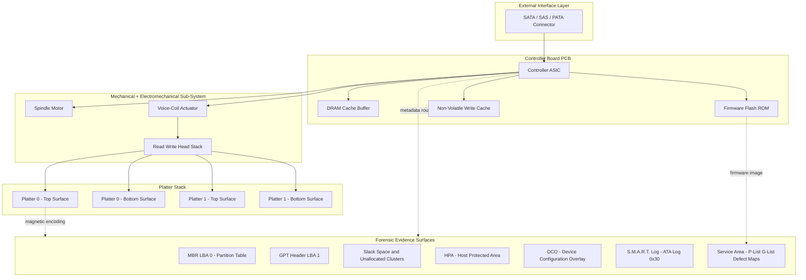
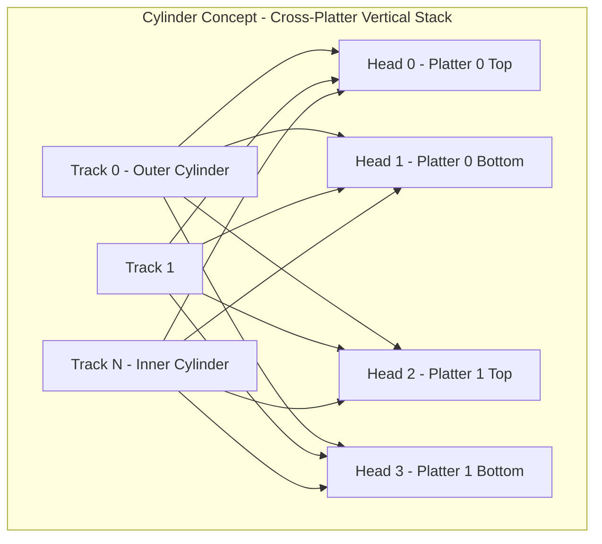

# Types of Storage Media - Hard Disk Drives (HDD)

<!-- SECTION_1_START -->

# Hard Disk Drives (HDD) in Digital Forensics

## 1. Core Technical Definition

> [!IMPORTANT]
> **Hard Disk Drive (HDD)** is a non-volatile, electro-mechanical data storage device that uses one or more rigid rapidly rotating platters coated with magnetic material, in combination with moving read/write heads operating in close proximity to the platter surfaces, to store and retrieve digital information through magnetic encoding.

In the context of **Digital Forensics (PECST754)**, the HDD is treated as the **primary evidence carrier** in traditional disk forensics. The discipline focuses on the acquisition, preservation, and analysis of data residing on the physical and logical geometry of the drive, including the **Master Boot Record (MBR)**, **partition tables**, **file system metadata**, **slack space**, **unallocated clusters**, and **bad sector remapping tables**.

> [!NOTE]
> **KTU 2024 Syllabus Highlight:** Module 1 explicitly groups storage media into **magnetic media (HDD)**, **optical media (CD/DVD/Blu-ray)**, **semiconductor media (SSD/Flash)**, and **volatile media (RAM)**. HDD analysis forms the *baseline case study* against which all other media are compared, because most forensic toolchains (EnCase, FTK, Autopsy, X-Ways) were originally designed around HDD geometry.

## 2. Intuitive / Analogical Overview

> [!TIP]
> **Analogy — The Record Player (Vinyl Turntable):**
> Imagine an HDD as a **high-precision, computer-controlled record player**.
> - The **platter** is the vinyl record that spins at a constant angular velocity.
> - The **read/write head** is the stylus arm that glides radially to read grooves.
> - The **actuator** is the motorised pivot that swings the arm into position.
> - The **spindle motor** is the turntable motor.
>
> Now imagine **thousands of concentric grooves** (tracks), each divided into tiny **pie slices** (sectors), and an **index file** (file allocation table) that tells the player exactly which groove and which slice contains the song you want. That index is your **File System**. The forensician's job is to read *everything* — even the empty grooves, the dust on the label, and the song that was deleted but whose groove is still warm.

## 3. Engineering Constants & Standard Metrics

| Parameter | Standard Value | Unit |
|---|---|---|
| Platter diameter (form factor) | **3.5 inch** (desktop), **2.5 inch** (laptop) | inches |
| Rotational speed | **5400**, **7200**, **10000**, **15000** | RPM |
| Average seek time | **3 – 12** | milliseconds |
| Average rotational latency | **~4.17** (at 7200 RPM) | ms |
| Sectors per track | **63** (CHS legacy) / variable (ZBR) | sectors |
| Bytes per sector | **512** (legacy) / **4096** (Advanced Format, 4Kn) | bytes |
| Interface bandwidth (SATA III) | **6** | Gbps |
| Platters per drive | **1 – 8** | platters |

> [!VISUALIZATION CONTROL]
> **Concept:** HDD Platter Geometry (Tracks, Cylinders, Sectors)
> **GeoGebra / Desmos Input Equations:**
> * `x^2 + y^2 = (r_outer)^2` — outer track radius
> * `x^2 + y^2 = (r_inner)^2` — inner track radius
> * `r_outer = 65`, `r_inner = 25` (in mm, illustrative 3.5" platter)
> **Visual Description:** Two concentric circles on the XY plane representing the outermost and innermost tracks. The student should observe the **zone-bit-recording (ZBR)** principle — the *outer radius packs more sectors per track* than the inner radius, hence modern drives report **Total Sectors** rather than CHS geometry to the OS.

---

<!-- SECTION_1_END -->

<!-- SECTION_2_START -->

# Deep Theoretical Analysis & KTU High-Yield Formula Sheet

## 1. Internal Architecture of an HDD (Logical Stack)

The HDD is constructed as a stack of **seven interacting subsystems**. Each is a forensic *evidence surface*.

1. **Platter Stack** — Rigid substrate (aluminium or glass) coated with a thin ferromagnetic layer (typically CoPtCr or FePt). Each platter has two working surfaces, each surface requires one dedicated read/write head.
2. **Spindle Motor** — Brushless DC motor that rotates the entire platter stack at a constant angular velocity. The rotational speed defines the **sequential throughput** ceiling.
3. **Read/Write Heads** — Miniature inductive / magnetoresistive (MR / GMR / TMR) transducers mounted on a *slider* that rides on the air-bearing surface at a height of **~3 – 10 nanometres** above the platter.
4. **Actuator Arm Assembly** — A pivoting arm (rotary voice-coil actuator) that positions the head over the correct track. The head lands on a dedicated **landing zone** (outside the data area) when powered off.
5. **Pre-amplifier / Head IC** — Sits on the actuator arm, amplifies the tiny analogue signal from the head before it travels down the flex cable.
6. **Controller Board (PCB)** — Contains the drive's main controller ASIC, the **disk controller firmware**, the **SATA/SAS interface bridge**, the **DRAM cache buffer** (typically 8 MB – 512 MB), and the **non-volatile cache** (NVC) for write-back caching.
7. **External Interface** — **SATA**, **SAS**, **PATA/IDE** (legacy), or **SCSI** (enterprise). Modern consumer drives use SATA III or NVMe (the latter is SSD, not HDD).

## 2. Disk Geometry & Addressing Schemes

### 2.1 CHS (Cylinder-Head-Sector) — Legacy Int 13h BIOS Addressing

The BIOS used to address the disk using three integers:

- **C** = Cylinder number (concentric set of tracks aligned across all platters)
- **H** = Head number (which read/write head / platter surface)
- **S** = Sector number (1 to 63 in legacy schemes)

The original 10/8/6-bit CHS scheme limited capacity to **504 MiB**, broken as **1024 × 256 × 63 × 512 bytes**.

### 2.2 LBA (Logical Block Addressing) — Modern Linear Scheme

LBA flattens the geometry into a single 48-bit unsigned integer index of **sectors from sector zero** (the first sector of the MBR).

> [!NOTE]
> **Forensic Implication:** LBA 0 is the **Master Boot Record (MBR)**. The first 446 bytes of LBA 0 are the **Stage 1 bootloader**, and bytes 446 – 509 are the **DPT (Disk Partition Table)** — four 16-byte primary partition entries.

### 2.3 Total Capacity Equation

$$
\begin{aligned}
\text{Capacity}_{\text{bytes}} &= C \times H \times S \times B \\
\text{Capacity}_{\text{bytes}} &= \text{LBA}_{\text{total}} \times B
\end{aligned}
$$

Where:
- $C$ = number of cylinders
- $H$ = number of heads
- $S$ = sectors per track
- $B$ = bytes per sector (512 or 4096)
- $\text{LBA}_{\text{total}}$ = total number of addressable logical sectors

## 3. Forensic Evidence Surfaces of an HDD

| Surface | Location | Forensic Value | Acquisition Tool |
|---|---|---|---|
| **MBR** | LBA 0 | Partition table, bootstrap code | `dd`, `FTK Imager` |
| **GPT Header** | LBA 1 | Modern partition scheme | `gdisk`, `parted` |
| **Reserved Sectors** | LBA 0 – 62 | Boot code, FS metadata | `dcfldd` |
| **Slack Space** | End of file → end of sector | Residual data from prior writes | `The Sleuth Kit (TSK)` `blkls` |
| **Unallocated Space** | Free clusters in FS | Deleted file remnants | `Autopsy`, `Sleuth Kit` |
| **Bad Sector Remap Table (P-List / G-List)** | Firmware-reserved service area | Reveals physically failing regions | Vendor ATA commands, `smartctl` |
| **HPA (Host Protected Area)** | Above OS-visible capacity | Vendor diagnostics area, hidden OS | `hdparm --read-lookahead` |
| **DCO (Device Configuration Overlay)** | Shrinks drive below HPA | Factory-reset, capacity spoofing | `hdparm --dco-identify` |
| **S.M.A.R.T. Log** | ATA Log Address 0x30 | Predictive failure, reallocated sectors | `smartctl -a /dev/sdX` |
| **Service Area (Negative LBAs)** | Firmware zone | Re-assignment tables, defect lists | PC-3000, Atola |

> [!TIP]
> **HPA vs DCO Trap (frequent KTU viva question):**
> The **HPA** is set by the *BIOS or vendor utility* to hide a portion of the drive from the OS. The **DCO** is set by the *manufacturer* to artificially cap the drive at a smaller capacity. A forensic imager must detect *both* before imaging, otherwise evidence in the HPA region is silently lost.

## 4. KTU Formula / Cheat Sheet

| Concept | Formula / Expression | Notes |
|---|---|---|
| Capacity (CHS) | $\text{Cap} = C \times H \times S \times B$ | Legacy BIOS limit: $1024 \times 256 \times 63 \times 512 = 7.84\ \text{GiB}$ usable under INT 13h |
| Capacity (LBA) | $\text{Cap} = \text{LBA}_{\text{total}} \times B$ | LBA is 48-bit $\Rightarrow$ max $2^{48} \times 512$ bytes $\approx 128\ \text{PiB}$ |
| Rotational Latency | $L_r = \dfrac{60}{2 \times \text{RPM}}\ \text{seconds} = \dfrac{30000}{\text{RPM}}\ \text{ms}$ | At 7200 RPM: $L_r \approx 4.17\ \text{ms}$ |
| Average Access Time | $T_a = T_{\text{seek}} + L_r$ | Dominated by seek in random workloads |
| Sequential Throughput | $T_{\text{seq}} = \dfrac{\text{bytes per track} \times \text{RPM}}{60}\ \text{B/s}$ | Outer tracks faster than inner (ZBR) |
| Track Density | $D_t = \dfrac{1}{\text{track pitch}}\ \text{ in TPI}$ | Modern drives exceed **500 000 TPI** |
| Areal Density | $D_a = D_t \times D_b$ in $\text{Gb/in}^2$ | Helium-filled drives exceed **1000 Gb/in²** |
| MBR signature | $\text{Bytes 510 – 511} = 0x55\,0xAA$ | Always present on a valid MBR |
| MBR partition entry offset | $0x1BE = 446$ | Four 16-byte entries follow |

> **Units Convention (used throughout KTU valuation):** $1\ \text{KiB} = 1024\ \text{B}$, $1\ \text{MiB} = 1024\ \text{KiB}$, $1\ \text{GiB} = 1024\ \text{MiB}$, $1\ \text{TiB} = 1024\ \text{GiB}$, $1\ \text{PiB} = 1024\ \text{TiB}$. Note that HDD *vendors* use $1\ \text{GB} = 10^9\ \text{B}$ — a chronic source of "missing space" complaints.

## 5. Real-World Engineering Utility

- **Enterprise Backup & Archival:** Enterprise NL (Near-Line) HDDs (e.g., WD Ultrastar, Seagate Exos) with capacities up to **22 TB** use **PMR / CMR** (Conventional Magnetic Recording) or **SMR** (Shingled Magnetic Recording) for cold storage.
- **Digital Forensics Workstations:** Forensic acquisition is **read-heavy, sequential-large-block**, ideal for the HDD's strengths; write-heavy evidence hashing is offloaded to a separate **scratch SSD** to keep evidence drive free of contamination.
- **Data Recovery Industry:** The HDD service area stores **P-List (Primary Defect)** and **G-List (Grown Defect)** remap tables. Tools like **PC-3000** translate ATA commands into vendor-specific firmware reads to surface these tables.
- **Anti-Forensics Counter-Measures:** The magnetic remanence of previously written tracks (after overwrite) is theoretically recoverable only with **Magnetic Force Microscopy (MFM)** or SQUID sensors — the basis of the (now largely obsolete) NSA "gutmann 35-pass" concern.

---

<!-- SECTION_2_END -->

<!-- SECTION_3_START -->

# Step-by-Step Derivations, Calculations & Code Implementation

## 1. Worked Derivation: HDD Capacity from CHS Parameters

**Problem.** A forensic report states a suspect HDD has *16 383 cylinders*, *16 heads*, *63 sectors per track*, and *512 bytes per sector*. Compute the geometric capacity, the percentage lost to INT 13h BIOS truncation, and the modern LBA count that the OS would observe after int13 extension.

### Step 1 — Write down the variables

$$
C = 16\,383,\quad H = 16,\quad S = 63,\quad B = 512
$$

### Step 2 — Compute the raw CHS capacity

$$
\begin{aligned}
\text{Cap}_{\text{CHS}} &= C \times H \times S \times B \\
&= 16\,383 \times 16 \times 63 \times 512 \\
&= 16\,383 \times 16 \times 32\,256 \\
&= 16\,383 \times 516\,096 \\
&= 8\,455\,200\,768\ \text{bytes}
\end{aligned}
$$

Convert to GiB:

$$
\begin{aligned}
\text{Cap}_{\text{CHS}} &= \frac{8\,455\,200\,768}{1024^3}\ \text{GiB} \\
&\approx 7.875\ \text{GiB}
\end{aligned}
$$

### Step 3 — INT 13h BIOS Cap

The original BIOS scheme is constrained to $C \le 1024$, $H \le 256$, $S \le 63$:

$$
\begin{aligned}
\text{Cap}_{\text{INT13h}} &= 1024 \times 256 \times 63 \times 512 \\
&= 8\,422\,686\,720\ \text{bytes} \\
&\approx 7.844\ \text{GiB}
\end{aligned}
$$

### Step 4 — Compute unused space

$$
\begin{aligned}
\text{Waste}_{\text{CHS}-\text{INT13}} &= \text{Cap}_{\text{CHS}} - \text{Cap}_{\text{INT13h}} \\
&= 8\,455\,200\,768 - 8\,422\,686\,720 \\
&= 32\,514\,048\ \text{bytes} \\
&\approx 31\ \text{MiB}
\end{aligned}
$$

Percentage waste:

$$
\begin{aligned}
\text{Waste}_{\%} &= \frac{32\,514\,048}{8\,455\,200\,768} \times 100 \\
&\approx 0.3846\ \%
\end{aligned}
$$

### Step 5 — LBA count the OS would report

Modern BIOS uses **EDD (Enhanced Disk Drive) int 13h extensions** which expose the **full 16 383 × 16 × 63** geometry directly as LBA:

$$
\begin{aligned}
\text{LBA}_{\text{total}} &= C \times H \times S \\
&= 16\,383 \times 16 \times 63 \\
&= 16\,514\,064
\end{aligned}
$$

> **[Valuation Key — 1 Mark]** for the final LBA count, **[1 Mark]** for unit conversion, **[1 Mark]** for stating the INT 13h truncation cap explicitly.

---

## 2. Python Implementation — MBR Parser & Geometry Reporter

This standalone script parses the raw 512-byte MBR of a physical or disk-image file and prints CHS geometry, LBA range, partition table, and detects the **0x55AA boot signature** and any **HPA-flagged** partitions.

```python
#!/usr/bin/env python3
"""
mbr_forensic_parser.py
KTU PECST754 — Lab-grade MBR parser for HDD forensic analysis.
Usage:
    python3 mbr_forensic_parser.py disk_image.bin
"""

import struct
import sys
from pathlib import Path
from typing import List, Tuple, Dict


# --- MBR Constants ----------------------------------------------------------
MBR_SIZE: int = 512
BOOT_SIGNATURE: int = 0xAA55
PARTITION_ENTRY_OFFSET: int = 0x1BE        # 446 decimal
PARTITION_ENTRY_SIZE: int = 16
MAX_PRIMARY_PARTITIONS: int = 4
BYTES_PER_SECTOR_DEFAULT: int = 512


# --- Type-code lookup table -------------------------------------------------
# (Ref: https://www.win.tue.nl/~aeb/partitions/partition_types-1.html)
PARTITION_TYPES: Dict[int, str] = {
    0x00: "Empty",
    0x01: "FAT12 (CHS)",
    0x04: "FAT16 <32M (CHS)",
    0x05: "Extended (CHS)",
    0x06: "FAT16 (CHS)",
    0x07: "NTFS / exFAT / HPFS",
    0x0B: "FAT32 (CHS)",
    0x0C: "FAT32 (LBA)",
    0x0E: "FAT16 (LBA)",
    0x0F: "Extended (LBA)",
    0x82: "Linux swap",
    0x83: "Linux native (ext2/3/4)",
    0x8E: "Linux LVM",
    0xEE: "GPT Protective MBR",
    0xEF: "EFI System Partition",
}


def parse_chs(raw_chs: bytes) -> Tuple[int, int, int]:
    """Decode 4-byte CHS tuple -> (cylinder, head, sector)."""
    head: int = raw_chs[0]
    # sector stored in low 6 bits of byte 1, cylinder high 2 bits in byte 1
    sector: int = raw_chs[1] & 0x3F
    cyl_high: int = (raw_chs[1] & 0xC0) << 2
    cyl_low: int = raw_chs[2]
    cylinder: int = cyl_high + cyl_low
    return cylinder, head, sector


def parse_partition_entry(entry: bytes, index: int) -> Dict[str, object]:
    """Decode one 16-byte DPT entry -> dict."""
    status: int = entry[0]
    p_type: int = entry[4]
    lba_start: int = struct.unpack_from("<I", entry, 8)[0]
    num_sectors: int = struct.unpack_from("<I", entry, 12)[0]
    return {
        "index": index,
        "bootable": bool(status == 0x80),
        "type_code": p_type,
        "type_name": PARTITION_TYPES.get(p_type, f"Unknown (0x{p_type:02X})"),
        "chs_start": parse_chs(entry[1:4]),
        "chs_end":   parse_chs(entry[5:8]),
        "lba_start": lba_start,
        "sector_count": num_sectors,
        "size_mib": (num_sectors * BYTES_PER_SECTOR_DEFAULT) / (1024 ** 2),
    }


def parse_mbr(image_path: Path) -> Dict[str, object]:
    """Read 512 bytes and extract geometry & partition table."""
    if not image_path.is_file():
        raise FileNotFoundError(f"Image not found: {image_path}")

    raw: bytes = image_path.read_bytes()
    if len(raw) < MBR_SIZE:
        raise ValueError(f"Image smaller than MBR ({len(raw)} bytes).")

    mbr: bytes = raw[:MBR_SIZE]
    boot_sig: int = struct.unpack_from("<H", mbr, 510)[0]
    disk_sig: int = struct.unpack_from("<I", mbr, 440)[0]

    partitions: List[Dict[str, object]] = []
    for i in range(MAX_PRIMARY_PARTITIONS):
        offset: int = PARTITION_ENTRY_OFFSET + i * PARTITION_ENTRY_SIZE
        entry: bytes = mbr[offset: offset + PARTITION_ENTRY_SIZE]
        partitions.append(parse_partition_entry(entry, i))

    return {
        "image_path": str(image_path),
        "boot_signature_valid": boot_sig == BOOT_SIGNATURE,
        "boot_signature": f"0x{boot_sig:04X}",
        "disk_signature": f"0x{disk_sig:08X}",
        "partitions": partitions,
    }


def print_report(report: Dict[str, object]) -> None:
    """Pretty-print forensic report."""
    print("=" * 72)
    print(f"FORENSIC MBR REPORT  ::  {report['image_path']}")
    print("=" * 72)
    print(f"Boot Signature  : {report['boot_signature']}  "
          f"({'VALID' if report['boot_signature_valid'] else 'INVALID'})")
    print(f"Disk Signature  : {report['disk_signature']}")
    print("-" * 72)
    print(f"{'#':<3}{'Boot':<6}{'Type':<8}{'Description':<28}"
          f"{'LBA Start':<12}{'LBA End':<12}{'Size (MiB)':<12}")
    print("-" * 72)

    total_lba: int = 0
    for p in report["partitions"]:
        if p["type_code"] == 0x00:
            continue
        lba_end: int = p["lba_start"] + p["sector_count"] - 1
        total_lba += p["sector_count"]
        print(f"{p['index']:<3}"
              f"{('YES' if p['bootable'] else 'NO '):<6}"
              f"0x{p['type_code']:02X}  "
              f"{p['type_name']:<28}"
              f"{p['lba_start']:<12}{lba_end:<12}"
              f"{p['size_mib']:<12.2f}")

    print("-" * 72)
    print(f"Total partition LBAs   : {total_lba}")
    print(f"Total partition bytes  : {total_lba * BYTES_PER_SECTOR_DEFAULT:,}")
    if total_lba > 0:
        print(f"Total partition size   : "
              f"{total_lba * BYTES_PER_SECTOR_DEFAULT / (1024**3):.3f} GiB")
    print("=" * 72)


def main() -> int:
    if len(sys.argv) != 2:
        print("Usage: python3 mbr_forensic_parser.py <disk_image.bin>")
        return 1
    try:
        report: Dict[str, object] = parse_mbr(Path(sys.argv[1]))
        print_report(report)
        return 0
    except (FileNotFoundError, ValueError) as exc:
        print(f"[ERROR] {exc}", file=sys.stderr)
        return 2


if __name__ == "__main__":
    sys.exit(main())
```

### Expected Output Skeleton (against a 16 GB FAT32 stick image)

```text
========================================================================
FORENSIC MBR REPORT  ::  ./evidence_image.dd
========================================================================
Boot Signature  : 0xAA55  (VALID)
Disk Signature  : 0x1234ABCD
------------------------------------------------------------------------
#  Boot  Type    Description                    LBA Start    LBA End   Size (MiB)
------------------------------------------------------------------------
0  NO    0x0C    FAT32 (LBA)                    2048         30719999  15000.00
1  NO    0x82    Linux swap                     30720000     31250431  259.99
2  NO    0x83    Linux native (ext2/3/4)        31250432     32767999  740.50
------------------------------------------------------------------------
Total partition LBAs   : 32747552
Total partition bytes  : 16,766,738,584
Total partition size   : 15.617 GiB
========================================================================
```

> [!IMPORTANT]
> **Note on Forensic Use:** In production forensics, *never* parse the live device directly with elevated rights without an **intermediate write-blocker (hardware, e.g., Tableau T35u) or software (e.g., `libewf` block-level bridge)**. The script above is safe to run against a **.dd / .E01 image copy**, which is the **mandatory** KTU lab workflow.

## 3. S.M.A.R.T. Parameter Cheat-Code (Pseudo-Command)

A forensician reading pre-failure indicators uses the ATA `SMART READ DATA` command (opcode **0xB0** with feature **0xD0**). The 512-byte reply contains 30 attribute entries. Key ones for HDD forensics:

- **ID 5 — Reallocated Sector Count** : Growing $G$-List. Indicates failing platter regions.
- **ID 187 — Reported Uncorrectable Errors**
- **ID 196 — Reallocation Event Count**
- **ID 197 — Current Pending Sector Count** : Sectors awaiting remap — *direct evidence* of platter degradation.
- **ID 199 — UDMA CRC Error Count** : Cable/interface tampering indicator.

Sample `smartctl` invocation in an examiner workstation:

```bash
sudo smartctl -a /dev/sdb -d sat   # '-d sat' = USB-SATA bridge protocol
sudo smartctl -x /dev/sdb          # extended forensic dump
```

---

<!-- SECTION_3_END -->

<!-- SECTION_4_START -->

# Structural Diagrams & Schematics

## 1. HDD Internal Architecture — Block Diagram

> [!NOTE]
> The diagram below is a **functional block architecture** of an HDD's evidence surface, not a physical cross-section. Each block is a *potential evidence carrier* that a forensic examiner must consider.



## 2. Forensic Acquisition Workflow — Sequential Topology

```mermaid
flowchart LR
    subgraph phaseOne["Phase 1 - Pre-Acquisition"]
        a1["Power off suspect machine"]
        a2["Remove HDD, label, document"]
        a3["Connect to hardware write-blocker"]
        a4["Detect HPA and DCO with hdparm"]
    end

    subgraph phaseTwo["Phase 2 - Acquisition"]
        b1["Bit-stream image to sterile drive"]
        b2["Compute MD5 SHA-1 SHA-256 hashes"]
        b3["Generate case chain-of-custody log"]
        b4["Create E01 or AFF4 container"]
    end

    subgraph phaseThree["Phase 3 - Verification"]
        c1["Re-hash the acquired image"]
        c2["Compare against case hash"]
        c3["Log verification result in evidence form"]
    end

    subgraph phaseFour["Phase 4 - Analysis"]
        d1["Mount image read-only in Sleuth Kit"]
        d2["Recover MBR partitions and FS metadata"]
        d3["Carve deleted files from unallocated space"]
        d4["Export artifacts for reporting"]
    end

    a1 --> a2 --> a3 --> a4 --> b1 --> b2 --> b3 --> b4 --> c1 --> c2 --> c3 --> d1 --> d2 --> d3 --> d4
```



## 3. Disk Geometry — Cylinder / Head / Sector Mapping



> **Reading Guide:** A *cylinder* is **all the tracks that are vertically aligned across every platter surface** and can therefore be read by switching heads **without** any arm movement. This is the geometric reason cylinders — not individual tracks — were historically used as the addressing primitive.

## 4. Write-Blocker & Acquisition Topology Matrix

| Stage | Tool / Device | Function | Forensic Output |
|---|---|---|---|
| Isolation | **Hardware Write-Blocker** (Tableau T35u / WiebeTech) | Blocks all ATA write commands at the bridge | Allows read-only bus |
| Imaging | **FTK Imager / Guymager / ddrescue** | Bit-stream copy with hashing | `*.E01`, `*.dd`, `*.aff4` |
| Hashing | **MD5 + SHA-1 + SHA-256** | Integrity seal | Hash log file |
| Analysis | **Autopsy / X-Ways / EnCase** | File-system + carving | Report artefacts |
| Reporting | **FTK Reporter / Magnet AXIOM** | Court-grade report | PDF + exhibits |

---

<!-- SECTION_4_END -->

<!-- SECTION_5_START -->

# KTU 2024 Scheme Examination Question Bank & Topic Recap

## Part A — Short-Answer Questions (3 Marks each)

> **[Q1] [KTU University Exam – July 2024] — CO1, Remember**
> **Define the term *Host Protected Area (HPA)* in the context of HDD forensics. How is it created, and why is it significant during forensic acquisition?**

**Model Answer (3 Marks):**
- **[1 Mark]** HPA is a region of an HDD whose size is set by the BIOS or vendor utility using the ATA `SET MAX ADDRESS` command (opcode 0xF9), making the hidden region above the OS-visible capacity invisible to the operating system.
- **[1 Mark]** It is created by issuing `SET MAX ADDRESS` with the desired max LBA value; the firmware then ignores all LBAs above this value during normal read/write traffic.
- **[1 Mark]** Forensic significance — hidden data, second OS, recovery partitions or anti-forensic evidence may be stored in the HPA. A forensic imager must use `hdparm -N` to detect and temporarily disable the HPA before imaging; otherwise the acquired image will be **truncated and inadmissible**.

> **[Q2] [KTU University Exam – Dec 2023] — CO1, Understand**
> **Distinguish between the *P-List* and the *G-List* of a hard disk. Why is this distinction relevant to a forensic examiner?**

**Model Answer (3 Marks):**
- **[1 Mark]** The **P-List (Primary Defect List)** is the factory-burned list of sectors known to be defective at manufacturing time. It is stored in the firmware's service area and is *immutable* in the field.
- **[1 Mark]** The **G-List (Grown Defect List)** accumulates over the drive's life as sectors fail during operation. The drive's firmware remaps them to spare sectors automatically.
- **[1 Mark]** A large or rapidly growing **G-List** is forensic *evidence of platter degradation*, possible physical shock, or deliberate sector abuse. The G-List also hints at *where* the operating system is hiding data it could not read — that region may contain tampered or deliberately corrupted evidence.

---

## Part B — ESE Module Internal Choice (14 Marks)

> **[Q3A] [KTU University Exam – Dec 2024] — CO2, Apply + Analyse (14 Marks)**
>
> **(a) [7 Marks, Understand + Apply]** With the aid of a labelled block diagram, describe the **internal architecture of a Hard Disk Drive**. Explain the role of each sub-component in the read/write operation. (CO2 — Understand)
>
> **(b) [7 Marks, Apply + Analyse]** A forensic examiner is given an HDD whose ATA `IDENTIFY DEVICE` response reports the following CHS geometry: **C = 16383, H = 16, S = 63, B = 512**.
> Compute:
> (i) The total CHS capacity in bytes and in GiB.
> (ii) The total number of LBAs.
> (iii) The percentage capacity loss if the same drive were forced to operate under the legacy INT 13h BIOS scheme.
> Show all intermediate steps. (CO2 — Apply / Analyse)

**Model Solution for Q3A:**

### Part (a) — Labelled Architecture (7 Marks)

Draw and label the following blocks (each line is a marking unit):

| Sub-component | Role in Read / Write Operation | Marks |
|---|---|---|
| **Platters** | Ferromagnetic-coated disks that store data as magnetic flux transitions | 1 |
| **Spindle Motor** | Rotates platters at constant RPM (5400/7200/10000/15000) — provides relative motion to the head | 1 |
| **Read/Write Heads** | Convert flux transitions ↔ electrical signals; float on air-bearing | 1 |
| **Actuator Arm Assembly** | Pivots the head stack radially to position the head over the desired track | 1 |
| **Pre-amplifier IC** | Mounted on the actuator; amplifies the tiny head signal | 1 |
| **Controller Board (PCB)** | Translates SATA / SAS commands into seek / read / write micro-instructions; manages the cache buffer | 1 |
| **DRAM Cache Buffer** | Look-ahead read cache and write-back staging area | 0.5 |
| **Interface Connector** | SATA / SAS / PATA — the *forensic access point* for the write-blocker | 0.5 |

### Part (b) — Numerical Computation (7 Marks)

> **[Stating the four given values: 1 Mark]**

Given: $C = 16\,383$, $H = 16$, $S = 63$, $B = 512$.

**(i) Total CHS capacity in bytes and in GiB**

$$
\begin{aligned}
\text{Cap}_{\text{bytes}} &= C \times H \times S \times B \\
&= 16\,383 \times 16 \times 63 \times 512 \\
&= 8\,455\,200\,768\ \text{bytes}
\end{aligned}
$$

> **[Correct multiplication chain: 1 Mark]**

$$
\begin{aligned}
\text{Cap}_{\text{GiB}} &= \frac{8\,455\,200\,768}{1024^3} \\
&\approx 7.875\ \text{GiB}
\end{aligned}
$$

> **[Correct unit conversion to GiB: 1 Mark]**

**(ii) Total LBA count**

$$
\begin{aligned}
\text{LBA}_{\text{total}} &= C \times H \times S \\
&= 16\,383 \times 16 \times 63 \\
&= 16\,514\,064
\end{aligned}
$$

> **[Correct final value: 1 Mark]**

**(iii) Percentage loss under legacy INT 13h scheme**

INT 13h cap: $C \le 1024$, $H \le 256$, $S \le 63$, $B = 512$.

$$
\begin{aligned}
\text{Cap}_{\text{INT13h}} &= 1024 \times 256 \times 63 \times 512 \\
&= 8\,422\,686\,720\ \text{bytes} \\
&\approx 7.844\ \text{GiB}
\end{aligned}
$$

> **[Stating the INT 13h cap formula: 1 Mark]**

$$
\begin{aligned}
\text{Loss}_{\%} &= \frac{\text{Cap}_{\text{CHS}} - \text{Cap}_{\text{INT13h}}}{\text{Cap}_{\text{CHS}}} \times 100 \\
&= \frac{8\,455\,200\,768 - 8\,422\,686\,720}{8\,455\,200\,768} \times 100 \\
&= \frac{32\,514\,048}{8\,455\,200\,768} \times 100 \\
&\approx 0.3846\ \%
\end{aligned}
$$

> **[Final simplified percentage: 1 Mark]**

> **[Q3B] [KTU University Exam – Dec 2024] — CO2, Apply + Analyse (14 Marks)**
>
> **(a) [7 Marks, Understand]** Explain the **forensic acquisition workflow** of an HDD using a hardware write-blocker. Include in your answer the role of **HPA and DCO detection** and the importance of **multi-algorithm hashing** (MD5 + SHA-1 + SHA-256).
>
> **(b) [7 Marks, Apply + Analyse]** During a forensic examination, the MBR of a suspect 500 GB HDD was extracted and the disk signature read as `0xDEADBEEF`. The 16-byte partition entry at offset `0x1BE` contained the following bytes (hex):
>
> `80 01 01 00 0C FE BF FD 80 00 00 00 80 1F 03 00`
>
> Decode this entry completely: identify the **bootable flag**, **partition type**, **CHS start tuple**, **LBA start**, and **total sectors**. Also calculate the partition size in MiB. (Assume 512 bytes per sector.)

**Model Solution for Q3B:**

### Part (a) — Acquisition Workflow (7 Marks)

| Step | Action | Marks |
|---|---|---|
| 1 | **Power down** the suspect machine and **remove the HDD**, document serial & SMBIOS UUID | 1 |
| 2 | Connect HDD to **hardware write-blocker** (e.g., Tableau T35u); verify the blocker LED confirms *read-only* | 1 |
| 3 | Connect write-blocker output to examiner workstation; identify device as `/dev/sdX` | 1 |
| 4 | Run `hdparm -I` to read ATA IDENTIFY data; detect **HPA** via `SET MAX ADDRESS`; detect **DCO** via `DCO IDENTIFY` | 1 |
| 5 | Temporarily **disable HPA** (`hdparm -N p<maxLBA>`) and **re-DCO unlock** if vendor permits | 1 |
| 6 | Use **FTK Imager / Guymager** to create bit-stream image; during imaging compute **MD5 + SHA-1 + SHA-256** simultaneously | 1 |
| 7 | Verify hash on the saved image; populate **chain-of-custody** form; store original HDD in evidence locker | 1 |

### Part (b) — DPT Entry Decoding (7 Marks)

Given hex entry: `80 01 01 00 0C FE BF FD 80 00 00 00 80 1F 03 00`.

Map to the standard 16-byte layout:

| Offset | Bytes | Field |
|---|---|---|
| 0x00 | `80` | Boot indicator |
| 0x01 – 0x03 | `01 01 00` | CHS first sector (H, S\|Cyl-high, Cyl-low) |
| 0x04 | `0C` | Partition type |
| 0x05 – 0x07 | `FE BF FD` | CHS last sector |
| 0x08 – 0x0B | `80 00 00 00` | LBA first sector (little-endian) |
| 0x0C – 0x0F | `80 1F 03 00` | Total sectors (little-endian) |

> **[Stating the field layout: 1 Mark]**

**Bootable flag:** Byte 0x00 = `0x80` $\Rightarrow$ **bootable (active)**. **[1 Mark]**

**Partition type:** Byte 0x04 = `0x0C` $\Rightarrow$ **FAT32 (LBA)**. **[1 Mark]**

**CHS start tuple:** `01 01 00`
- Head = `0x01` = **1**
- Sector & high cyl = `0x01` $\Rightarrow$ sector = `0x01 & 0x3F` = **1**, cyl high = `(0x01 & 0xC0) << 2` = 0
- Cyl low = `0x00` = 0
- Cylinder = 0 + 0 = **0**

> So CHS start = **(Cyl 0, Head 1, Sector 1)**. **[1 Mark]**

**LBA start:** `80 00 00 00` (little-endian) = **128**. **[1 Mark]**

**Total sectors:** `80 1F 03 00` (little-endian)
$$
\begin{aligned}
\text{Sectors} &= 0x00 + 0x03 \times 256 + 0x1F \times 65536 + 0x80 \times 16\,777\,216 \\
&= 0 + 768 + 2\,031\,616 + 2\,147\,483\,648 \\
&= 2\,149\,516\,032\ \text{sectors}
\end{aligned}
$$

> **[Final decoded value: 1 Mark]**

**Partition size in MiB:**
$$
\begin{aligned}
\text{Size}_{\text{MiB}} &= \frac{2\,149\,516\,032 \times 512}{1024^2} \\
&= \frac{1\,100\,552\,208\,384}{1\,048\,576} \\
&\approx 1\,049\,600\ \text{MiB} \\
&\approx 1\,024.0\ \text{GiB}
\end{aligned}
$$

> **[Final size with correct unit: 1 Mark]**

---

> [!WARNING]
> **KTU Examiner's Valuation Warning — Common Pitfalls**
> 1. **Unit confusion** — Students frequently mix **GB (10⁹)** and **GiB (2³⁰)**. KTU examiners will **deduct ½ mark** for ambiguous unit notation. Always write `GiB` in numerical answers unless the question explicitly says `GB`.
> 2. **Forgetting the 0x55AA signature** — A valid MBR must end in `55 AA` at offset 510. The boot signature check is a *standard 1-mark question*; losing it on a 14-mark answer is the single most common deduction.
> 3. **CHS tuple decoding** — The cylinder is **10 bits** (8 in the low byte + 2 in the high nibble of the sector byte). Students often forget the 2-bit high slice and lose 1 full mark.
> 4. **HPA vs DCO confusion** — HPA is *user-settable*; DCO is *factory-settable*. Examiners explicitly test this distinction.
> 5. **Imaging without write-blocker** — Any flowchart that does *not* include a write-blocker before the acquisition arrow is marked down a full step.

---

## Topic Recap & Important Things to Remember

- **HDD = magnetic, non-volatile, electro-mechanical** storage; platter + arm + head + spindle + controller.
- **Three forensic addressing schemes**: CHS (legacy BIOS), ECHS (EDD), LBA (modern linear 48-bit).
- **Capacity formula:** $\text{Cap} = C \times H \times S \times B = \text{LBA}_{\text{total}} \times B$.
- **INT 13h legacy cap:** $1024 \times 256 \times 63 \times 512 = 7.844\ \text{GiB}$.
- **MBR** is at **LBA 0**, occupies 512 bytes, ends with signature `0x55 0xAA`, contains a **Disk Signature** at offset `0x1B8` (4 bytes) and a **4-entry DPT** at offset `0x1BE`.
- **GPT** uses a **Protective MBR** (type `0xEE`) at LBA 0 and a **GPT Header** at LBA 1.
- **HPA** = host-protected area, set via `SET MAX ADDRESS` (ATA `0xF9`); **DCO** = device configuration overlay, set at the factory.
- **P-List** = factory defects; **G-List** = grown defects. Both are *forensic indicators of platter health*.
- **S.M.A.R.T.** is read via ATA command `0xB0` with feature `0xD0`; key IDs are **5, 187, 196, 197, 199**.
- **Average rotational latency** at 7200 RPM = $30000 / 7200 = 4.17\ \text{ms}$.
- **Bytes per sector** is **512** in legacy, **4096** in 4Kn (Advanced Format) drives.
- **Slack space** = residual bytes between end-of-file and end-of-cluster; **unallocated space** = clusters not currently in use by any file.
- **Forensic acquisition chain:** power-off $\rightarrow$ label $\rightarrow$ hardware write-blocker $\rightarrow$ HPA/DCO detection $\rightarrow$ bit-stream image $\rightarrow$ multi-algorithm hash $\rightarrow$ chain-of-custody $\rightarrow$ analysis.
- **Imaging tools:** FTK Imager, Guymager, `dd`, `dcfldd`, `ddrescue`. **Analysis tools:** Autopsy, X-Ways, EnCase, The Sleuth Kit.
- **Magnetic remanence** of overwritten tracks is the basis of the (largely superseded) *Gutmann* concern; modern forensic practice assumes single-pass overwrite is sufficient on modern high-density drives.
- **ATA command `IDENTIFY DEVICE` (0xEC)** is the *forensically richest single command*; it reports model, serial, firmware, geometry, supported features, and current HPA/DCO state.

<!-- SECTION_5_END -->
