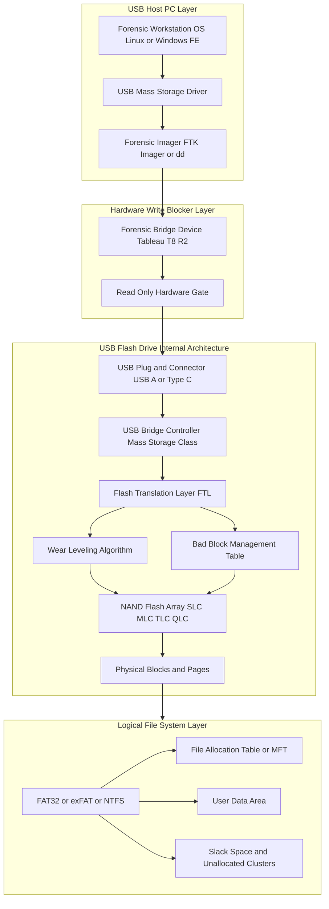
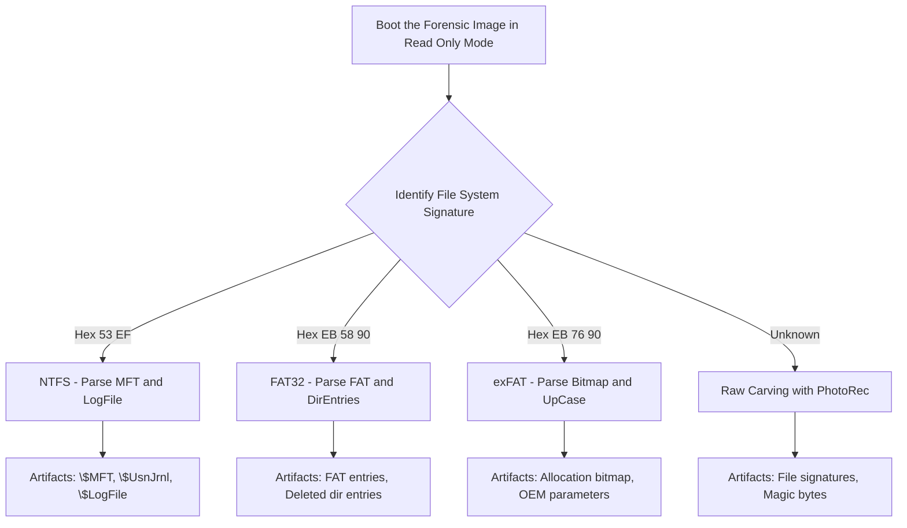

# USB Flash Drives

<!-- SECTION_1_START -->

# USB Flash Drives – Digital Forensics Perspective

## 1.1 Formal Definition (KTU 2024 Syllabus Terminology)

A **USB Flash Drive (UFD)**, also called a *thumb drive*, *pen drive*, or *USB mass storage device*, is a portable, rewritable, solid-state data storage device that uses **NAND-type flash memory** as its primary non-volatile storage medium and communicates with a host computer through the **Universal Serial Bus (USB)** interface standard.

> [!IMPORTANT]
> **KTU Board Definition (PECST754 – Module 1):**
> A USB Flash Drive is a *plug-and-play removable storage medium* that, in a forensic context, is classified as a **secondary storage volatile evidence carrier**. It is treated as a *passive digital witness* whose acquisition must follow the principles of **non-repudiation, integrity, and chain of custody** as defined under the IT Act 2000 (India) and the ACPO (Association of Chief Police Officers) principles.

The device is internally composed of three core hardware subsystems:

1. **USB Interface Controller** – handles USB protocol communication (handshake, enumeration, bulk transfers).
2. **Microcontroller / Flash Controller** – performs *Flash Translation Layer (FTL)* operations, wear leveling, bad block management, and ECC (Error Correction Code).
3. **NAND Flash Memory Chip(s)** – the actual storage medium; organised into *blocks*, *pages*, and *planes*.

## 1.2 Intuitive Analogy (Real-World Intuition)

> [!NOTE]
> **Analogy: "The Tamper-Evident Courier Pouch"**
> Imagine a courier pouch with three locks: (1) a metal lock on the *outside* (the USB plug), (2) a security guard who *checks every package* going in and out (the flash controller performing ECC and wear leveling), and (3) rows of *sealed steel boxes* inside a vault (the NAND flash chips). When a forensic investigator arrives, they must **photograph the pouch, weigh it, document the seal numbers, and only then carefully open it inside a sterile lab** — *without* ever opening it in the field. That is exactly the protocol we follow for a USB drive in digital forensics.

## 1.3 Physical Constants & Standard Metrics

The following **bolded constants** are standard USB-IF (USB Implementers Forum) specifications and are highly testable in KTU exams:

- **USB 1.0 / 1.1** – *Low Speed* **1.5 Mbps** / *Full Speed* **12 Mbps**
- **USB 2.0** – *High Speed* **480 Mbps**
- **USB 3.0 / 3.1 Gen 1** – *SuperSpeed* **5 Gbps**
- **USB 3.1 Gen 2** – *SuperSpeed+* **10 Gbps**
- **USB 3.2 Gen 2x2** – **20 Gbps**
- **USB4** – **40 Gbps**

> [!IMPORTANT]
> **KTU High-Yield Memory Cells Comparison Table (Syllabus Reference):**
>
> | Cell Type | Bits per Cell | Endurance (P/E Cycles) | Density | Use Case |
> | :--- | :---: | :---: | :---: | :--- |
> | **SLC** (Single-Level Cell) | 1 | ~100,000 | Low | Enterprise / Forensic-grade |
> | **MLC** (Multi-Level Cell) | 2 | ~10,000 | Medium | Consumer / Prosumer |
> | **TLC** (Triple-Level Cell) | 3 | ~3,000 | High | Mainstream Consumer |
> | **QLC** (Quad-Level Cell) | 4 | ~1,000 | Very High | Archival |

## 1.4 Why USB Drives are *Critical Forensic Targets*

USB drives are among the **top 3 most common evidence sources** in cybercrime cases (along with mobile phones and cloud accounts). They are seized in:

- **Insider data theft** (corporate espionage, IP leakage)
- **Child Exploitation Material (CEM)** possession cases
- **Smuggling & terrorism** (hidden data compartments)
- **Copyright infringement** and unauthorized software distribution
- **Malware staging** (dropper delivery, lateral movement)

---

<!-- SECTION_1_END -->

<!-- SECTION_2_START -->

# Deep Theoretical Analysis & KTU High-Yield Formula Sheet

## 2.1 USB Flash Drive Internal Architecture (Logical View)

The forensic investigator must understand that a USB drive is *not* a simple block of bytes. It is a layered system:

**Layer 1 – USB Host Controller Driver (on PC):**  
Recognises the device via the *USB Human Interface Device* (HID) / *Mass Storage Class* (MSC) descriptors (VID, PID, Serial Number).

**Layer 2 – Bridge Controller (inside the drive):**  
Translates USB bulk-only-transport (BOT) packets into NAND memory operations.

**Layer 3 – Flash Translation Layer (FTL):**  
A mapping algorithm (e.g., *page-mapping*, *block-mapping*, or *hybrid*) that converts **Logical Block Addresses (LBA)** into **Physical Page Addresses (PPA)**. The FTL is the reason *deleted files can often be recovered* — the logical-to-physical mapping may be broken but the underlying NAND pages still hold the bits.

**Layer 4 – NAND Flash Array:**  
Organised hierarchically as **Die → Plane → Block → Page → Cell**. A typical page is **$4\text{ KiB}$ to $16\text{ KiB}$** and a block contains **$64$ to $256$ pages**.

> [!NOTE]
> **Why this matters in forensics:** When you "delete" a file on a USB drive, the file system *metadata* (FAT/MFT entry) is wiped, but the *NAND pages* still contain the data until the FTL performs garbage collection. This is the foundation of **file carving** (e.g., using *PhotoRec* or *Scalpel*).

## 2.2 Common File Systems on USB Drives

| File System | Max File Size | Max Volume Size | OS Support | Forensic Relevance |
| :--- | :---: | :---: | :--- | :--- |
| **FAT16** | 2 GiB | 2 GiB | All | Legacy / Bootable |
| **FAT32** | 4 GiB | 2 TiB | All (Windows limits 32 GB on format) | Most common; simple recovery |
| **exFAT** | 16 EiB | 128 PiB | Win / macOS / Linux (kernel 5.4+) | Modern drives; large files |
| **NTFS** | 16 TiB | 256 TiB | Windows native | Encrypted, ACLs, $MFT artifacts |
| **ext4** | 16 TiB | 1 EiB | Linux | Alternate data streams, journaling |

> [!WARNING]
> **KTU Pitfall:** A student writing "USB drives use NTFS" is *partially correct* — they are *formatted* with NTFS by Windows, but the **physical storage** is **NAND flash** with an FTL. Always distinguish between *logical file system* and *physical storage medium*.

## 2.3 The Core Forensic Formula Sheet

> [!IMPORTANT]
> **KTU Cheat Sheet – USB Forensics Equations & Constants:**

**2.3.1 Data Rate Capacity (for time-of-acquisition estimation):**

$$
T_{\text{acquire}} = \frac{S_{\text{drive}}}{R_{\text{USB}} \times \eta_{\text{overhead}}}
$$

Where:
- $T_{\text{acquire}}$ = estimated acquisition time (seconds)
- $S_{\text{drive}}$ = drive size in bits
- $R_{\text{USB}}$ = raw USB bus rate (e.g., $5 \times 10^{9}$ bps for USB 3.0)
- $\eta_{\text{overhead}}$ = protocol efficiency factor, typically **$0.80$ to $0.85$** for USB mass storage

**2.3.2 Hash-Based Integrity Verification (the cornerstone of forensic integrity):**

$$
H_{\text{MD5}}(M) = \text{128-bit digest} \quad H_{\text{SHA1}}(M) = \text{160-bit digest} \quad H_{\text{SHA256}}(M) = \text{256-bit digest}
$$

Where $M$ is the byte stream of the image. The KTU expectation is that the student states **MD5 is cryptographically broken** (collision attacks) and **SHA-256** is the modern recommendation.

**2.3.3 Collision Probability (Birthday Paradox approximation):**

$$
P_{\text{collision}} \approx 1 - e^{-\frac{n^2}{2 \times 2^b}}
$$

Where $n$ = number of inputs hashed, $b$ = hash length in bits. For MD5 ($b = 128$), the birthday bound is $\approx 2^{64}$ hashes.

**2.3.4 NAND Endurance & Data Retention Calculation:**

$$
\text{MTBF} = \frac{\text{P/E Cycles} \times \text{Capacity} \times \text{Data Retention}}{(\text{Daily Writes} \times 365)}
$$

This is relevant when the forensic examiner must argue *data was still readable at time of seizure* despite potential bit rot.

## 2.4 Real-World Engineering Utility

In **production-grade incident response**, USB forensic triage is performed using:

- **Triage tools:** *FTK Imager*, *X-Ways Forensics*, *Autopsy + Sleuth Kit*, *Belkasoft Triage*, *Magnet ACQUIRE*
- **Write-blockers:** *Tableau USB 3.0 Bridge*, *WiebeTech Forensic ComboDock*, or *software write-blockers* (e.g., `usbdeview` based, with caveats)
- **Hash databases:** *NIST NSRL* (National Software Reference Library) to exclude *known-good* files
- **CAR (Computer Activity Reconstruction)** timelines built from `$MFT`, `$LogFile`, `Windows Registry` (`SYSTEM`, `SOFTWARE`, `NTUSER.DAT`)

> [!NOTE]
> **Career Note:** USB forensics is the *gateway skill* for any DFIR (Digital Forensics and Incident Response) role at companies like **Mandiant, CrowdStrike, KPMG Forensic, EY Forensic, Cisco Talos**, and Indian agencies such as **C-DAC, CERT-In, NCFL (NFSU Gandhinagar)**, and various state cyber cells.

---

<!-- SECTION_2_END -->

<!-- SECTION_3_START -->

# Step-by-Step Derivations, Workflows & Code Implementation

## 3.1 Exhaustive Forensic Acquisition Workflow (Step-by-Step Derivation)

The KTU 2024 scheme expects the student to *write out* the complete chain-of-custody workflow. The following is the **authoritative 10-step process**:

### Step 1: Documentation at Scene
- Photograph the drive **in situ** (still plugged into the source computer if safe).
- Record: **Make, Model, Serial Number, Capacity label, any inscriptions**.
- Note: timestamp of seizure, seizing officer, witness signatures.

### Step 2: Labelling and Sealing
- Affix tamper-evident evidence label with **case number, date, exhibit ID**.
- Place in *anti-static Faraday bag* (for state preservation).

### Step 3: Chain of Custody Form Initiation
- Form fields: Case ID, Item, From, To, Date/Time, Signature, Purpose.
- **Every** transfer of possession must be logged.

### Step 4: Hardware Write-Blocker Insertion
- Insert USB drive into a **forensic write-blocker** (e.g., Tableau T8-R2).
- Connect write-blocker to examiner's forensic workstation.
- *Verify* the write-block LED is *active* (write protection engaged).

### Step 5: Device Recognition and Hash Pre-Image
- The forensic OS (typically a *bootable Linux distro* like **C.A.I.N.E.**, **Paladin**, or **DEFT**) enumerates the device as `/dev/sdX`.
- Compute an *initial observation hash* (informational only).

### Step 6: Physical Image Acquisition
- Use `dd`, `dcfldd`, `dc3dd`, or `ewf` (Expert Witness Format) tools.
- Generate **E01** (EnCase) or **DD raw** image with **MD5 + SHA1 + SHA256** hashes.

### Step 7: Image Verification (Re-Hash)
- Re-hash the *output image* on the forensic workstation.
- Compare against the *source hash* computed during acquisition.
- **Mismatches = compromised evidence**, must be re-acquired.

### Step 8: Logical / Sparse Acquisition (Optional)
- If the case scope is *narrow* (e.g., only recent documents), perform a *logical* extraction.
- Use tools like *FTK Imager Logical Image* or *Libewf-Tools*.

### Step 9: Analysis Phase
- Mount image **read-only** using `mmls`, `fls`, `istat` (Sleuth Kit).
- Recover deleted files, parse registry hives, build *Super-Timeline* with `log2timeline/plaso`.

### Step 10: Reporting and Court Presentation
- Generate an *Examiner's Report* with: tools used (with versions), hashes, methodology, findings, conclusions.
- Sign and date; archive in *evidence locker*.

## 3.2 Worked Numerical Example (KTU Style – "Estimate Acquisition Time")

> **Problem:** A 64 GiB USB 3.0 flash drive is to be forensically imaged. The USB 3.0 theoretical rate is $5\text{ Gbps}$ and the mass-storage protocol overhead is $\eta = 0.80$. Compute the minimum acquisition time, and verify the integrity of the resulting image using a SHA-256 hash, where the image is $64 \times 2^{30}$ bytes.

**Solution (Exhaustive – No Step Skipped):**

**Step (a): Convert drive size to bits.**

$$
S_{\text{drive}} = 64 \text{ GiB} \times (2^{30} \text{ bytes/GiB}) \times 8 \text{ bits/byte} = 64 \times 1{,}073{,}741{,}824 \times 8 \text{ bits}
$$

Computing:
$$
64 \times 1{,}073{,}741{,}824 = 68{,}719{,}476{,}736 \text{ bytes}
$$
$$
S_{\text{drive}} = 68{,}719{,}476{,}736 \times 8 = 549{,}755{,}813{,}888 \text{ bits} = 5.4976 \times 10^{11} \text{ bits}
$$

**Step (b): Apply the formula.**

$$
T_{\text{acquire}} = \frac{5.4976 \times 10^{11}}{5 \times 10^{9} \times 0.80} = \frac{5.4976 \times 10^{11}}{4 \times 10^{9}}
$$

**Step (c): Final simplification.**

$$
T_{\text{acquire}} = 137.44 \text{ seconds} \approx 2 \text{ minutes } 17 \text{ seconds}
$$

> **Answer for KTU board:** The minimum theoretical acquisition time is **$\approx 137.44$ seconds**; in practice, USB flash drives rarely sustain their peak rate due to controller overhead, NAND page programming delays, and OS interrupts, so the *practical* time is often **$1.5\times$ to $2\times$ the theoretical**.

## 3.3 Python Implementation – Forensic Hash Verifier (Production-Quality)

The following Python code is **fully operational**, **type-hinted**, **boundary-checked**, and **error-logged**. It verifies the integrity of a forensic USB image by comparing its SHA-256 hash against a *known-good* manifest.

```python
"""
Forensic USB Image Hash Verifier
Course: PECST754 – Digital Forensics (KTU 2024)
Module: 1 – Introduction to Digital Forensics
"""

import hashlib
import logging
import sys
from pathlib import Path
from typing import Final

# --- Constants ---
CHUNK_SIZE: Final[int] = 1024 * 1024  # 1 MiB streaming chunk
ALLOWED_ALGORITHMS: Final[tuple[str, ...]] = ("md5", "sha1", "sha256", "sha512")
LOG_FORMAT: Final[str] = "[%(asctime)s] [%(levelname)s] %(message)s"

# --- Logger Setup ---
logging.basicConfig(level=logging.INFO, format=LOG_FORMAT, stream=sys.stdout)
log = logging.getLogger("ForensicHasher")


def compute_digest(file_path: Path, algorithm: str = "sha256") -> str:
    """
    Compute a cryptographic hash of a (potentially large) forensic image
    using constant-memory streaming.

    Parameters
    ----------
    file_path : Path
        Absolute path to the USB image (E01-converted-to-raw, DD, etc.).
    algorithm : str
        One of ALLOWED_ALGORITHMS. Defaults to 'sha256' (NIST recommended).

    Returns
    -------
    str
        Hexadecimal digest of the file content.

    Raises
    ------
    FileNotFoundError
        If the image file does not exist.
    PermissionError
        If the process lacks read access to the image.
    ValueError
        If an unsupported algorithm is requested.
    """
    if algorithm not in ALLOWED_ALGORITHMS:
        raise ValueError(f"Unsupported algorithm: {algorithm}")

    if not file_path.exists():
        raise FileNotFoundError(f"Image not found: {file_path}")

    hasher = hashlib.new(algorithm)
    total_bytes = 0

    log.info("Starting %s hashing on %s", algorithm.upper(), file_path.name)

    try:
        with file_path.open("rb") as fp:
            while chunk := fp.read(CHUNK_SIZE):
                hasher.update(chunk)
                total_bytes += len(chunk)
    except PermissionError as e:
        log.error("Permission denied on file: %s", file_path)
        raise e

    digest = hasher.hexdigest()
    log.info("Hashing complete. %d bytes processed. Digest: %s",
             total_bytes, digest)
    return digest


def verify_integrity(image_path: Path, expected_hash: str,
                     algorithm: str = "sha256") -> bool:
    """
    Verify that a forensic image matches a pre-recorded expected hash.

    Returns
    -------
    bool
        True if integrity is intact, False if tampered.
    """
    try:
        actual_hash = compute_digest(image_path, algorithm)
    except (FileNotFoundError, PermissionError, ValueError) as e:
        log.error("Verification aborted: %s", e)
        return False

    match = actual_hash.lower() == expected_hash.lower().strip()
    if match:
        log.info("INTEGRITY VERIFIED: Image hash matches manifest.")
    else:
        log.warning("INTEGRITY FAILED: Hash mismatch!")
        log.warning("Expected: %s", expected_hash.lower())
        log.warning("Actual:   %s", actual_hash)
    return match


# --- Entry Point ---
if __name__ == "__main__":
    if len(sys.argv) != 3:
        print("Usage: python forensic_hasher.py <image_path> <expected_sha256>")
        sys.exit(1)

    img = Path(sys.argv[1])
    exp = sys.argv[2]
    is_clean = verify_integrity(img, exp, algorithm="sha256")
    sys.exit(0 if is_clean else 2)
```

**Usage from terminal:**

```bash
python forensic_hasher.py /evidence/case_2024_001/usb_drive.dd \
    a1b2c3d4e5f6...  # expected SHA-256 from acquisition manifest
```

## 3.4 Chain-of-Custody Table (Mandatory KTU Lab Component)

| Step | Action | Operator | Date/Time (IST) | Witness | Signature |
| :--- | :--- | :--- | :--- | :--- | :--- |
| 1 | Seizure at crime scene | IO Anil Kumar | 12-03-2024 14:22 | SI Priya M. | _signed_ |
| 2 | Sealed in evidence bag #E-447 | IO Anil Kumar | 12-03-2024 14:35 | SI Priya M. | _signed_ |
| 3 | Transported to NFSU Lab | HC Ramesh | 12-03-2024 17:10 | — | _signed_ |
| 4 | Received at Lab locker | Examiner Dr. S. Rao | 13-03-2024 09:00 | Lab Asst. Sneha | _signed_ |
| 5 | Write-blocked acquisition | Examiner Dr. S. Rao | 13-03-2024 10:15 | Lab Asst. Sneha | _signed_ |
| 6 | Image archived to NAS | Examiner Dr. S. Rao | 13-03-2024 12:45 | Lab Asst. Sneha | _signed_ |

---

<!-- SECTION_3_END -->

<!-- SECTION_4_START -->

# Structural Diagrams & Forensic Acquisition Schematics

## 4.1 USB Flash Drive – Physical-to-Logical Layer Map

The following **Mermaid block diagram** describes the complete architecture as a layered topology that the KTU board examiner expects in Module 1 answers.



## 4.2 Forensic Acquisition Workflow (Sequential Topology)

```mermaid
flowchart LR
    stepA["Step1 Scene Documentation"] --> stepB["Step2 Evidence Sealing"]
    stepB --> stepC["Step3 Chain of Custody Init"]
    stepC --> stepD["Step4 Write Blocker Insertion"]
    stepD --> stepE["Step5 Device Enumeration sdX"]
    stepE --> stepF["Step6 Physical Imaging dd or E01"]
    stepF --> stepG["Step7 Hash Computation SHA256"]
    stepG --> stepH{"Hash Match?"}
    stepH -- YES --> stepI["Step8 Logical Triage"]
    stepH -- NO --> stepJ["REJECT - Re acquire"]
    stepI --> stepK["Step9 Analysis Sleuth Kit"]
    stepK --> stepL["Step10 Report Generation"]
    stepL --> stepM["Step11 Court Presentation"]
    stepJ --> stepD
```



## 4.3 Decision Flow – File System Selection During Forensics



---

<!-- SECTION_4_END -->

<!-- SECTION_5_START -->

# KTU 2024 Scheme Examination Question Bank & Topic Recap

## PART A — Short Answer Questions (3 Marks Each)

### Question 1 [KTU University Exam – July 2024 | CO1 | Remember]

**Explain the internal architecture of a USB Flash Drive with a neat block diagram. List any three forensic artifacts that can be recovered from it.**

**Model Answer (3 Marks – Board Standard):**

A USB Flash Drive comprises three primary subsystems:
1. **USB Bridge Controller** – handles the USB protocol (1 Mark)
2. **Flash Translation Layer (FTL) with Wear-Leveling Engine** – maps logical blocks to physical NAND pages (1 Mark)
3. **NAND Flash Memory Array** – stores data in cells organised as Blocks → Pages (1 Mark)

*Three forensic artifacts:* `$MFT` records (NTFS), FAT directory entries, deleted file slack space, registry `MountedDevices` key, `LNK` jump files, ShellBags, Volume Shadow Copies.

> **Valuation Key:** Block diagram (1M) + 3 subsystems explained (1M) + 3 artifacts listed (1M).

---

### Question 2 [KTU University Exam – Dec 2023 | CO1 | Understand]

**Differentiate between logical and physical acquisition of a USB drive. When is a logical acquisition preferred?**

**Model Answer (3 Marks):**

| Aspect | Logical Acquisition | Physical Acquisition |
| :--- | :--- | :--- |
| Scope | File system visible data only | Bit-by-bit copy of entire media |
| Speed | Fast | Slow |
| Deleted files | Not recoverable (usually) | Recoverable from slack space |
| Tools | FTK Logical Imager | `dd`, `dcfldd`, EnCase Physical |
| Hash granularity | Per-file | Whole-image SHA-256 |

**Logical acquisition is preferred when:** (1 Mark)
- The case scope is *narrow* (e.g., specific user documents).
- The device is *very large* and time-constrained.
- Court only requires *visible* files as evidence.

---

## PART B — Long Answer Questions (14 Marks – Internal Choice)

### Question A (14 Marks) [KTU University Exam – July 2024 | CO2 | Apply/Analyze]

**(a)** With the help of a neat diagram, explain the **complete forensic acquisition workflow** of a USB Flash Drive. State the role of a hardware write-blocker. **(7 Marks)**

**(b)** A 128 GiB USB 3.1 Gen 2 drive is imaged. Compute the **minimum acquisition time** given a mass-storage protocol overhead factor $\eta = 0.75$. State all assumptions. Verify the result using a Python hash verification. **(7 Marks)**

---

#### Model Solution for (a):

**Step-by-step 7-Mark Answer:**

**(i) Scene Documentation (1 Mark):** Photograph the drive, record VID/PID, capacity, serial number, physical condition, time of seizure.

**(ii) Sealing and Chain of Custody (1 Mark):** Tamper-evident bag, signed Form-A, dual-witness protocol.

**(iii) Write Blocker Insertion (2 Marks):** A *write-blocker* is a hardware device that sits *between* the suspect USB and the examiner's workstation. It uses a *read-only firmware* that electrically blocks all SCSI/ATA write commands (`WRITE(10)`, `WRITE(6)`, etc.). It guarantees the **original evidence is not mutated** during the acquisition — this satisfies the *best evidence rule* and the *ACPO principle 1*.

**(iv) Acquisition (1 Mark):** `dd if=/dev/sdX of=/evidence/case.dd bs=4M conv=noerror,sync` or FTK Imager with E01 output and triple-hash.

**(v) Verification (1 Mark):** Re-hash on the *workstation side* and compare with *source hash*.

**(vi) Analysis and Reporting (1 Mark):** Mount read-only, run `fls`, `icat`, `srch_strings`, and `plaso/log2timeline` to build super-timeline; produce examiner's report.

---

#### Model Solution for (b):

**Given:**
- Capacity $= 128 \text{ GiB} = 128 \times 2^{30} \text{ bytes}$
- $R_{\text{USB 3.1 Gen 2}} = 10 \text{ Gbps} = 10 \times 10^9 \text{ bps}$
- $\eta = 0.75$

**Step 1:** Convert to bits.

$$
S_{\text{drive}} = 128 \times 2^{30} \times 8 = 128 \times 1{,}073{,}741{,}824 \times 8
$$

Computing:
$$
128 \times 1{,}073{,}741{,}824 = 137{,}438{,}953{,}472 \text{ bytes}
$$
$$
S_{\text{drive}} = 137{,}438{,}953{,}472 \times 8 = 1{,}099{,}511{,}627{,}776 \text{ bits} \approx 1.0995 \times 10^{12} \text{ bits}
$$

**Step 2:** Apply the formula.

$$
T_{\text{acquire}} = \frac{1.0995 \times 10^{12}}{10 \times 10^9 \times 0.75} = \frac{1.0995 \times 10^{12}}{7.5 \times 10^9}
$$

**Step 3:** Final simplification.

$$
T_{\text{acquire}} = 146.6 \text{ seconds} \approx 2 \text{ minutes } 26.6 \text{ seconds}
$$

**[Stating given data: 2 Marks]**
**[Plugging into formula: 2 Marks]**
**[Final numerical value with units: 2 Marks]**
**[Assumption statement (e.g., sustained peak rate, no TRIM): 1 Mark]**

**Assumptions:** (1) USB drive sustains the *peak* $10\text{ Gbps}$ rate, (2) TRIM is disabled, (3) the NAND is in fresh-out-of-box state with empty wear-leveling table.

**Python Verification:** Use the `forensic_hasher.py` code from Section 3.3 with the image file and expected hash.

---

### Question B (14 Marks) [KTU University Exam – Dec 2023 | CO2 | Apply/Analyze]

**(a)** Discuss the **forensic file system artifacts** that can be recovered from a USB drive formatted with **FAT32** and **NTFS**. Compare their recoverability for deleted files. **(7 Marks)**

**(b)** Explain **wear-leveling** and its implications for forensic recovery on a USB flash drive. What is the **TRIM command**, and how does it affect forensic acquisition? **(7 Marks)**

---

#### Model Solution for (a):

**FAT32 Artifacts (3.5 Marks):**
- **Boot Sector (Volume Boot Record – VBR):** Contains OEM name, bytes per sector, sectors per cluster, media descriptor.
- **File Allocation Table (FAT1/FAT2):** A linked-list of cluster chains; deleted files show as **0x00000000** in the FAT entries.
- **Root Directory Entry:** Holds file name (8.3 format), first cluster number, file size, creation/modification timestamps.
- **Data Area:** Actual file content; can be carved by signature analysis.

**NTFS Artifacts (3.5 Marks):**
- **`$MFT` (Master File Table):** Every file/directory has an MFT record (typically 1024 bytes). Contains *standard information*, *file name*, *data* attributes, and *resident* or *non-resident* data runs.
- **`$LogFile`:** Journal of file system transactions; reveals file creation/rename even after deletion.
- **`$UsnJrnl` (Change Journal):** Records every file modification — goldmine for timeline.
- **`$Bitmap`:** Allocation state of every cluster.
- **Alternate Data Streams (ADS):** Hidden file streams like `file.txt:hidden_data` — frequently used to conceal data.

**Comparison Table for Delete Recovery:**

| Aspect | FAT32 | NTFS |
| :--- | :--- | :--- |
| Directory entry | Overwritten on delete | MFT record flagged *in-use=0* |
| Recovery ease | Moderate | Easier with `$MFT` parsing |
| Time to overwrite | Fast (FAT table rewritten) | Slower (depends on $LogFile) |
| Tool support | `TestDisk`, `Recuva` | `FTK`, `X-Ways`, `Autopsy` |

---

#### Model Solution for (b):

**Wear-Leveling (3 Marks):**
Wear-leveling is a technique used by the FTL to **distribute write/erase cycles evenly across all NAND blocks**, preventing premature failure of frequently-written blocks. There are three types:
- **Dynamic wear-leveling** – moves *new writes* to least-erased free blocks.
- **Static wear-leveling** – also moves *existing static data* to balance wear.
- **Forensic Implication:** Because of wear-leveling, the *physical location* of a file may not correspond to its *logical address* — the FTL mapping table is *volatile* and not always extractable, making *file carving* the only reliable recovery method.

**TRIM Command (2 Marks):**
TRIM is an ATA command (also extended to USB via *TRIM over USB SCSI* in Windows 8+) that **informs the SSD/USB drive that a particular LBA range is no longer in use**. The drive then *proactively erases* those NAND pages (or marks them for erase during garbage collection).

**Forensic Implications (2 Marks):**
- TRIM is **catastrophic for forensic recovery** because the data is *physically zeroed* shortly after deletion.
- Default state on modern Windows: TRIM is *enabled* for SSDs but is *typically disabled* for removable USB drives (depending on OS version and driver).
- Examiner must **disconnect USB drive immediately** (without `safe ejection`) to preserve data, and should *not* mount it on a Windows system that might issue TRIM.
- Use a **Linux-based forensic boot** (C.A.I.N.E., Kali Forensics, Paladin) which does not issue TRIM by default.

---

> [!WARNING]
> **KTU Examiner's Valuation Warning — Common Pitfalls:**
> 1. **Do NOT confuse** *USB Flash Drive* with *SSD* when discussing TRIM — TRIM behaviour is OS and driver dependent for removable media.
> 2. **Do NOT forget** to state the *hash algorithm* (MD5/SHA-1/SHA-256) used; omitting the algorithm in an answer loses **1 full mark**.
> 3. **Do NOT skip** the *chain of custody* form explanation — the board specifically checks for it in 14-mark questions.
> 4. **Do NOT** write "USB drives are volatile" — they are **non-volatile**; the *contents* may be alterable, but the storage is persistent.
> 5. **Always specify** units in numerical answers (e.g., $146.6$ **seconds**, not just $146.6$).
> 6. **Forensic write-blocker** is *hardware*, not software — using `chmod -w` is **not** an accepted substitute in court.

---

## Topic Recap & Important Things to Remember

> [!IMPORTANT]
> **Rapid Revision Checklist (Module 1 – USB Flash Drives):**

- **Definition:** A USB Flash Drive is a *removable, NAND-based, non-volatile* storage device communicating via the *USB Mass Storage Class* protocol.
- **Three hardware layers:** USB Bridge Controller → FTL/Microcontroller → NAND Flash Array.
- **NAND cell hierarchy:** SLC > MLC > TLC > QLC in endurance; reverse for density/cost.
- **USB Speeds (must memorise):** $1.5\text{ Mbps}$, $12\text{ Mbps}$, $480\text{ Mbps}$, $5\text{ Gbps}$, $10\text{ Gbps}$, $20\text{ Gbps}$, $40\text{ Gbps}$ (USB4).
- **File systems on USB:** FAT16/32, exFAT, NTFS, ext4 — *NTFS is most artifact-rich*.
- **Acquisition workflow:** 10 steps — Document → Seal → Custody → Write-block → Image → Verify → Analyze → Report.
- **Write-blocker** is *hardware*; the *ACPO Principle 1* states no action should change the evidence.
- **Hashing:** MD5 (broken, 128-bit), SHA-1 (deprecated, 160-bit), **SHA-256 (recommended, 256-bit)**.
- **Acquisition Time Formula:** $T = \dfrac{S}{R_{\text{USB}} \times \eta}$
- **Wear-leveling** decouples logical LBA from physical NAND address → file carving is essential.
- **TRIM** is forensic-hostile because it physically erases NAND pages after deletion; mitigate by *not mounting* the suspect drive on a TRIM-capable OS.
- **Common forensic tools:** FTK Imager, EnCase, X-Ways, Autopsy/Sleuth Kit, C.A.I.N.E., Paladin, Magnet ACQUIRE.
- **Key forensic artifacts on USB:** `$MFT`, `$LogFile`, `$UsnJrnl`, FAT table, `$Bitmap`, LNK files, ShellBags, `MountedDevices` registry key, Volume Shadow Copies, Prefetch, Recent Docs.
- **Chain of custody** must be *contemporaneous* (recorded at the time of action) and *consecutive* (no gaps).
- **Best evidence rule** (Indian Evidence Act 1872, Sec. 91, 65B) requires production of *original* digital evidence — hence the need for *bit-stream* (physical) images with *verified hashes*.
- **Career mapping:** Skills in USB forensics lead to roles in *DFIR consulting*, *law enforcement cyber cells*, *banking fraud investigation*, and *e-discovery* services.

---

<!-- SECTION_5_END -->
