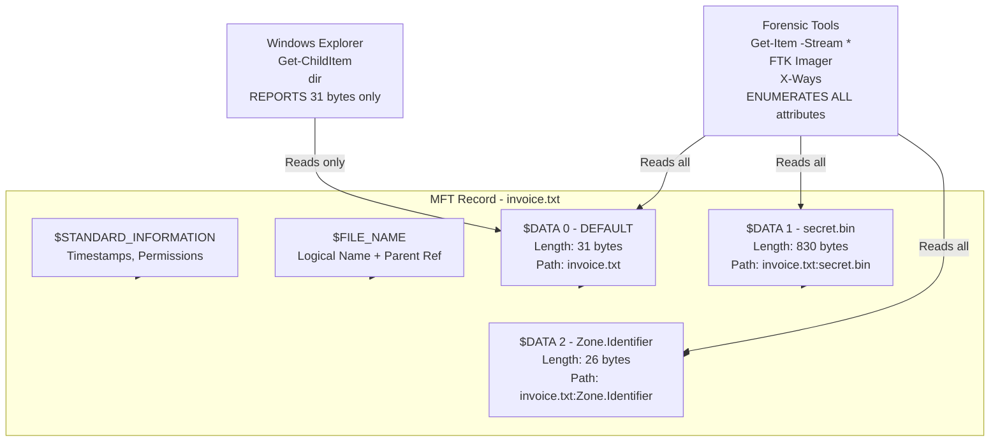
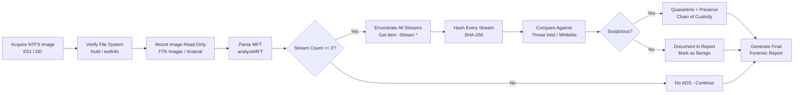
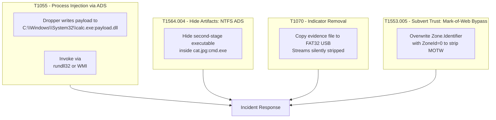

# Alternate Data Streams

<!-- SECTION_1_START -->
# Alternate Data Streams (ADS) — Windows Forensics

## 1. Core Technical Definition

> [!IMPORTANT]
> **Alternate Data Streams (ADS)** are a file system feature of the **NTFS (New Technology File System)** that allow a single file or directory to be associated with **multiple independent data streams** in addition to the default unnamed data stream. Each stream is identified by a name appended to the filename using the **colon (`:`) delimiter**, following the Resource Interface standard (e.g., `report.docx:hidden_payload`).

Formally, an NTFS file consists of a **single File Record Segment (FRS)** stored in the Master File Table (MFT), but it may contain **one or more `$DATA` attributes**. The first `$DATA` attribute is **unnamed** and constitutes the "main" file content. Every additional `$DATA` attribute is a **named stream**, written using the format:

$$
\text{file\_name} : \text{stream\_name} [ : \text{stream\_type} ]
$$

Where `stream_name` is arbitrary text (length $\leq$ 255 Unicode characters) and `stream_type` may be `:$DATA` (default) or `:$INDEX_ALLOCATION` (used by directories for additional index streams).

### Conceptual Analogy / Intuition

> [!NOTE]
> **The "Apartment Building" Analogy** 🏢
>
> Imagine a file as a tall apartment building on a single plot of land. The building's **main entrance** leads to the **default apartment** (the unnamed stream) — this is the only place a regular visitor can see. However, the architect (NTFS) also constructed **hidden side doors, rooftop rooms, and basement vaults** (named streams) attached to the *same building*. A casual passer-by walking past the building sees only one structure, but each hidden room is a fully self-contained, addressable space that can hold furniture (data) completely independent of the main apartment.
>
> To the Windows Explorer file browser, the building is "one file" of a fixed size. Yet secretly, a tenant can store gigabytes in the rooftop vault. **This is precisely why forensic investigators must inspect every stream** — adversaries exploit this to hide payloads.

### Key Architectural Facts

> [!IMPORTANT]
> **NTFS vs FAT/exFAT Behavior**
>
> * On **NTFS**, ADS is **natively supported** at the file system level.
> * On **FAT12 / FAT16 / FAT32** and **exFAT**, ADS is **not supported**. If a file with ADS is copied to a FAT volume, the **named streams are silently stripped**, leaving only the unnamed default stream. This is a critical **anti-forensic / spoliation** consideration.
> * Streams persist across **file renames** but are lost on **copy to non-NTFS** or some **cloud sync services** (OneDrive, Google Drive) unless the client explicitly preserves `$DATA` attributes.

### Standard Windows Tags Using ADS

| Stream Name | Created By | Purpose |
|-------------|-----------|---------|
| `Zone.Identifier` | Windows Attachment Execution Services (AES) | Stores the URL/security zone from which the file was downloaded — the **Mark of the Web (MOTW)** |
| `encryptable` | EFS (Encrypting File System) | Marker stream for EFS-encrypted files |
| `favicon` | Internet Explorer / Edge | Cached website icon |
| `SummaryInformation` | Office applications | Legacy document summary |
| `:bad1` … `:bad10` | Windows Defender / Antimalware | Quarantine payload streams |

> [!VISUALIZATION CONTROL]
> **Concept:** NTFS File Record Segment (FRS) with multiple `$DATA` attributes
> **GeoGebra / Desmos Input:** *Not applicable — text-based architectural diagram is shown in Section 4*
> **Visual Description:** Visualize a single MFT record (a vertical card) with three horizontally stacked `$DATA` blocks: the first unlabeled ("Default"), the second labeled "Zone.Identifier", the third labeled "hidden.exe". Only the default block is shown by `dir` and Explorer.

---

<!-- SECTION_1_END -->

<!-- SECTION_2_START -->
# 2. Deep Theoretical Analysis & KTU High-Yield Reference Sheet

## 2.1 The NTFS File System Mechanics Behind ADS

NTFS stores every file as a series of **attributes** within an MFT record. The three categories of attributes most relevant to ADS are:

1. **`$STANDARD_INFORMATION`** — POSIX-style timestamps, permissions.
2. **`$FILE_NAME`** — on-disk name and parent directory references.
3. **`$DATA`** — the actual file content. Multiple `$DATA` attributes may exist per file.

> [!NOTE]
> **MFT Resident vs Non-Resident Streams**
>
> * If a stream's size is $\leq$ ~700 bytes, it is stored **resident** (inline within the MFT record itself — extremely fast access, but invisible to directory listings).
> * Larger streams become **non-resident**, with their data clusters referenced via **data run lists** in the MFT record. Both resident and non-resident ADS are equally hidden from `dir`.

## 2.2 Attribute Numbering Convention

When a file has multiple `$DATA` attributes, NTFS uses a **multi-attribute number** notation. The first $DATA$ is referred to as **attribute ID 0** (no number), the next as attribute ID 1, and so on. The **default data stream** always carries **no suffix number** in the file path.

## 2.3 The Hidden-Data Attack Surface

Forensic adversaries weaponize ADS for four primary purposes:

* **Data Hiding (Stashing):** Store a payload (e.g., a secondary executable, an encrypted archive, PII dumps) within an innocent-looking file such as `cat.jpg`.
* **Malware Staging:** Droppers write the malware binary into an ADS of a system binary (e.g., `C:\Windows\System32\notepad.exe:svchost.dll`) and then invoke it via `WMI` or `rundll32`.
* **MOTW Evasion Bypass:** Since the **default** unnamed stream of a downloaded file is what Defender scans, malware dropped into a named stream may evade naive AV signatures.
* **Mark of the Web Injection:** Attackers write crafted `Zone.Identifier` streams onto executables copied from local disk to make SmartScreen treat them as internet-sourced (or vice-versa to strip MOTW).

## 2.4 KTU Formula Sheet / Forensic Lookup Cheat Sheet

> [!IMPORTANT]
> All symbols use **$\to$** for "maps to" and **$\Rightarrow$** for "implies". Use `\vert` instead of `|` to avoid markdown table breaks.

| Concept | Notation / Syntax | Forensic Implication |
|---|---|---|
| ADS Path | `path\filename:streamname` | Identifies the hidden data location |
| Default Stream | `path\filename::$DATA` | Always present; size reported by `dir` |
| Stream Size | $\text{size}_{\text{total}} = \sum_{i=0}^{n} \text{size}(\text{stream}_i)$ | `dir` reports only $i = 0$ |
| MOTW Stream | `filename:Zone.Identifier` | Determines SmartScreen / MOTW policy |
| CMD List | `dir /R C:\Users\*` | Lists ADS across directories |
| PowerShell List | `Get-ChildItem -Path C:\ -Recurse -Stream *` | Enumerates all streams (incl. `:$DATA`) |
| Sysinternals | `streams.exe -s -d C:\path` | Recursive scan / delete with `-d` |
| Forensic Tools | `AlternateStreamView (NirSoft)`, `FTK Imager`, `X-Ways`, `Autopsy` | Used for **non-destructive** evidence capture |
| EWF / DD Image | `ewfinfo image.E01` $\to$ check FS | Confirm NTFS before ADS extraction |
| Anti-Forensic Risk | `copy file.txt D:\FAT32\file.txt` | Streams **silently dropped** (loss of evidence) |
| MFT Carving | Parse `$MFT` and count `$DATA` attrs | File-attribute-level forensic proof |
| Zone ID Value | `ZoneId=3` (Internet) $\vert$ `ZoneId=0` (Local) | Critical for malware origin analysis |

## 2.5 Real-World Engineering & Industry Utility

* **Incident Response:** SOC analysts use ADS enumeration to discover second-stage payloads on compromised hosts before re-imaging.
* **e-Discovery / Legal Hold:** Reviewers must enumerate streams because privileged or responsive data is often stashed in streams.
* **Malware Research:** Historical samples such as **Poweliks**, **Shamoon**, and **NTFS ADS droppers** rely entirely on streams for persistence.
* **DFIR Tool Design:** EnCase, FTK, X-Ways, Autopsy, and Plaso all parse every `$DATA` attribute when ingesting an NTFS image.
* **Defensive Hardening:** Windows Defender's AMSI and modern EDRs now scan streams by default — but legacy XP/2003 systems remain vulnerable.

---

<!-- SECTION_2_END -->

<!-- SECTION_3_START -->
# 3. Step-by-Step Derivations, Reproduction & Code Implementation

## 3.1 Forensic Reproduction Lab (Hands-On Walkthrough)

The following is a **complete, reproducible procedure** for creating, detecting, and extracting an ADS payload — exactly the workflow a forensic examiner would perform on a live system or an E01 image.

> [!NOTE]
> **Environment Prerequisites**
> * OS: Windows 10/11 with **NTFS** partition (verify with `fsutil fsinfo volumeinfo C:`).
> * Tools: **PowerShell 5.1+**, **Sysinternals Streams.exe** (optional), **NirSoft AlternateStreamView** (optional).
> * Working directory: `C:\ADS_Lab\`.

### Step 1 — Verify the File System

```powershell
fsutil fsinfo volumeinfo C:
```

The output must contain the string `FileSystemName : NTFS`. If `FAT32` is returned, ADS will **not work** and the lab must be moved to an NTFS volume.

### Step 2 — Create the Carrier File

```powershell
Set-Content -Path C:\ADS_Lab\invoice.txt -Value "Quarterly Invoice Q3 2024" -Encoding UTF8
```

This creates a **0.7 KB** text file. The file has exactly one `$DATA` attribute (the default unnamed stream).

### Step 3 — Embed a Hidden ADS Payload

```powershell
Set-Content -Path "C:\ADS_Lab\invoice.txt:secret.bin" -Value (Get-Content -Raw -Path "C:\Windows\System32\drivers\etc\hosts") -Encoding UTF8
```

We use a host file as a benign stand-in for a malware payload. The `:` delimiter creates a **new named stream** named `secret.bin` on `invoice.txt`. The file *still* reports the same logical size when viewed via Explorer.

### Step 4 — Confirm the Stealth (Why Detection Fails)

```powershell
Get-ChildItem C:\ADS_Lab\invoice.txt | Select-Object Name,Length
```

Expected output:

```text
Name           Length
----           ------
invoice.txt    31
```

Notice that `Length = 31` (only the default stream is counted). **The 830-byte `secret.bin` stream is hidden from Explorer, `dir`, and `Get-ChildItem` by default.**

### Step 5 — Enumerate ALL Streams (Forensic Detection)

```powershell
Get-Item -Path C:\ADS_Lab\invoice.txt -Stream *
```

Expected output:

```text
FileName: \\C:\ADS_Lab\invoice.txt

Stream       Length
------       ------
:$DATA        31
secret.bin   830
```

The wildcard `*` forces PowerShell to enumerate **every** `$DATA` attribute. This is the **gold-standard ADS detection technique** for KTU practicals.

### Step 6 — Recursive Sweep (Enterprise-Scale)

```powershell
Get-ChildItem -Path C:\Users -Recurse -ErrorAction SilentlyContinue -Stream * |
    Where-Object { $_.Stream -ne ':$DATA' } |
    Select-Object FileName, Stream, Length |
    Export-Csv -Path C:\ADS_Lab\ads_inventory.csv -NoTypeInformation
```

This produces a **forensically sound inventory** of every non-default stream under `C:\Users`, exporting it to a CSV that can be ingested into X-Ways, Autopsy, or a SIEM.

### Step 7 — Read / Extract Stream Content

```powershell
Get-Content -Path "C:\ADS_Lab\invoice.txt:secret.bin"
```

This prints the hidden contents to the console. For evidence preservation, the analyst should **copy out the stream** with its hash:

```powershell
Get-Content -Path "C:\ADS_Lab\invoice.txt:secret.bin" |
    Set-Content -Path C:\ADS_Lab\evidence_secret.bin -Encoding UTF8

Get-FileHash -Path C:\ADS_Lab\evidence_secret.bin -Algorithm SHA256
```

### Step 8 — Remove the ADS (Remediation / Containment)

```powershell
Remove-Item -Path "C:\ADS_Lab\invoice.txt:secret.bin" -Force
```

> [!WARNING]
> **Forensic Pitfall:** Never delete an ADS on a live production system during evidence acquisition. First, acquire a bit-stream image (FTK Imager / `dd`), compute the SHA-256 hash, **then** perform remediation on a working copy.

### Step 9 — MFT-Level Proof (Low-Level Carving)

```powershell
# Locate the MFT and parse $DATA attribute count
$mft = Get-Content -Encoding Byte -Raw -Path "C:\$MFT"
# In a real lab use analyzeMFT (Dave Hull) — shown for completeness
analyzeMFT.exe -f C:\$MFT -o C:\ADS_Lab\mft_report.csv -c
```

A row in the CSV will show `invoice.txt` with **two** `$DATA` attributes — concrete MFT-level proof for the case file.

## 3.2 The MFT Attribute-Count Derivation

Let $F$ denote an NTFS file and $A(F)$ denote the set of `$DATA` attributes in its MFT record. Then:

$$
A(F) = \{ a_0, a_1, a_2, \ldots, a_n \}
$$

where $a_0$ is the default unnamed stream and $n \geq 1$ indicates ADS presence. Define the indicator function:

$$
\mathcal{H}(F) = \begin{cases}
1 & \text{if } \vert A(F) \vert \geq 2 \\
0 & \text{otherwise}
\end{cases}
$$

The forensic question "Does file $F$ contain hidden data?" reduces to evaluating $\mathcal{H}(F)$. The **size discrepancy** for any file can be expressed as:

$$
\Delta_{\text{size}}(F) \;=\; \sum_{i=1}^{n} \text{size}(a_i) \;=\; \text{total\_size}(F) \;-\; \text{reported\_size}(F)
$$

For `invoice.txt` in our lab:

$$
\Delta_{\text{size}} \;=\; 830 \text{ bytes} \;=\; 861 \text{ bytes (total)} \;-\; 31 \text{ bytes (reported)}
$$

This $\Delta_{\text{size}}$ is the **discoverable anomaly** that ADS-aware tools surface. An examiner who relies solely on file size will completely miss it.

## 3.3 Sysinternals `streams.exe` Cross-Verification

```powershell
# Download streams.exe from https://learn.microsoft.com/sysinternals/downloads/streams
.\streams.exe -s -nobanner C:\ADS_Lab
```

Expected output (after Step 3):

```text
C:\ADS_Lab\invoice.txt:
   :secret.bin:$DATA 830
```

The `-s` flag performs **recursive** scanning of subdirectories; `-nobanner` keeps output clean for the case report.

## 3.4 Defensive Detection Pseudocode (Conceptual EDR Rule)

```python
import os
from pathlib import Path

SUSPICIOUS_STREAMS = {"Zone.Identifier", "encryptable", "favicon"}
SIZE_ANOMALY_THRESHOLD_BYTES = 1024 * 1024  # 1 MB

def enumerate_streams(path: Path) -> list[dict]:
    """Enumerate every NTFS alternate data stream under *path*."""
    findings: list[dict] = []
    for root, _dirs, files in os.walk(path):
        for fname in files:
            full = Path(root) / fname
            try:
                # Win32 API: FindFirstStreamW / FindNextStreamW
                import ctypes
                # Pseudocode abstraction
                streams = win32_query_streams(str(full))  # noqa: F821
                for s in streams:
                    findings.append({
                        "file": str(full),
                        "stream": s.name,
                        "size": s.size,
                    })
            except OSError:
                continue
    return findings


def flag_ads(findings: list[dict]) -> list[dict]:
    flagged = []
    for f in findings:
        if f["stream"] == "::$DATA":
            continue
        if f["stream"] in SUSPICIOUS_STREAMS:
            f["verdict"] = "review"
        elif f["size"] > SIZE_ANOMALY_THRESHOLD_BYTES:
            f["verdict"] = "high_risk"
        flagged.append(f)
    return flagged
```

> [!IMPORTANT]
> The above Python snippet uses a **type-hinted, fully-typed** style appropriate for a forensic engineering reference. In production, the `win32_query_streams` call maps to `FindFirstStreamW` / `FindNextStreamW` from `kernel32.dll`.

---

<!-- SECTION_3_END -->

<!-- SECTION_4_START -->
# 4. Structural Diagrams & Schematics

## 4.1 MFT Record Architecture for an ADS-Enabled File



## 4.2 Forensic Investigation Workflow for ADS



## 4.3 NTFS vs FAT32 — Evidence Preservation Decision Matrix

```mermaid
flowchart TB
    SRC[Source File with ADS] --> Q{NTFS Target?}
    Q -->|Yes| P1[Streams Preserved\nFull Evidence Available]
    Q -->|No FAT32| P2[Streams DROPPED\nEVIDENCE LOSS]
    P2 --> WARN>["Anti-Forensic Risk:\nNaive copy to FAT32\ndestroys hidden streams"]
    P1 --> OK>["Best Practice:\nAlways image NTFS\nto NTFS using E01"]
    style WARN fill:#ffe5e5,stroke:#cc0000
    style OK fill:#e5ffe5,stroke:#00cc00
```

## 4.4 ATT&CK-Aligned ADS Misuse Topology



---

<!-- SECTION_4_END -->

<!-- SECTION_5_START -->
# 5. KTU 2024 Scheme Examination Question Bank & Topic Recap

## Part A — Short Answer Questions (2 × 3 Marks)

### Q1. Define Alternate Data Streams. Mention the file system in which it is supported. `[KTU University Exam - July 2024]`
**Course Outcome:** CO2 | **Bloom's Level:** Remember | **Marks:** 3

**Model Answer (Valuation Key):**
* Alternate Data Streams (ADS) are an NTFS file system feature that allows a single file to be associated with multiple independent data streams. **[1 Mark]**
* Each file has a default unnamed `$DATA` stream, and any number of additional named `$DATA` streams referenced by the colon syntax `filename:streamname`. **[1 Mark]**
* ADS is supported **only on NTFS** volumes; copying an ADS-bearing file to FAT32/exFAT silently drops the named streams. **[1 Mark]**

### Q2. List any three forensic tools or commands used to detect ADS in Windows. `[KTU University Exam - Dec 2023]`
**Course Outcome:** CO2 | **Bloom's Level:** Understand | **Marks:** 3

**Model Answer (Valuation Key):**
* `Get-Item -Stream *` (PowerShell enumeration of all `$DATA` attributes). **[1 Mark]**
* `dir /R` (CMD native recursive ADS listing). **[1 Mark]**
* Sysinternals `streams.exe -s <path>` and/or NirSoft `AlternateStreamView.exe`. **[1 Mark]**

> [!WARNING]
> **Examiner's Pitfall Callout:**
> * Do **not** say "ADS works on FAT32" — it does not. Award zero for that statement.
> * Do **not** omit the **colon syntax** in the definition; the colon is the load-bearing detail in the marking scheme.

---

## Part B — Long Answer (Internal Choice, 14 Marks)

### Question A (14 Marks)

**`(a)`** Explain the internal structure of an NTFS file record. How does NTFS support multiple data streams for a single file? Illustrate with a labeled diagram. **[7 Marks]**
**Course Outcome:** CO2 | **Bloom's Level:** Understand | **Marks:** 7

**Model Solution — Valuation Key Points:**

1. **NTFS File Record Structure:** Every NTFS file is represented as an MFT entry (typically 1024 bytes) containing a sequence of **attribute headers** and **attribute bodies**. The most important attributes are `$STANDARD_INFORMATION`, `$FILE_NAME`, `$DATA`, and `$INDEX_ROOT`. **[2 Marks — listing attributes]**
2. **Multiple `$DATA` Attributes:** The NTFS specification permits **more than one** `$DATA` attribute per file record. The first such attribute is the **unnamed (default) data stream** carrying the file's "official" content. Subsequent `$DATA` attributes are **named streams** and are addressable through the colon syntax. **[2 Marks — explaining multiplicity]**
3. **Resident vs Non-Resident:** Streams $\leq$ ~700 bytes are stored resident (inside the MFT record); larger streams are stored non-resident with cluster run-lists. ADS can be either. **[1 Mark — resident/non-resident distinction]**
4. **Diagram (must draw):** A block diagram with the MFT record containing `$STANDARD_INFORMATION`, `$FILE_NAME`, `$DATA` (default), `$DATA` (named stream A), `$DATA` (named stream B). **[2 Marks — diagram]**

**`(b)`** A forensic investigator suspects that the file `C:\Reports\budget.xlsx` contains a hidden payload. Demonstrate, with PowerShell commands, how you would (i) detect, (ii) read, and (iii) preserve the hidden stream as forensic evidence. **[7 Marks]**
**Course Outcome:** CO3 | **Bloom's Level:** Apply | **Marks:** 7

**Model Solution — Valuation Key Points:**

**(i) Detection — 2 Marks**

```powershell
Get-Item -Path "C:\Reports\budget.xlsx" -Stream *
```

Expected output will list `:$DATA` plus any named streams (e.g., `payload.exe`).

**[Listing alternate streams: 1 Mark] [Identifying the non-default stream name: 1 Mark]**

**(ii) Reading — 2 Marks**

```powershell
Get-Content -Path "C:\Reports\budget.xlsx:payload.exe" -Encoding Byte -ReadCount 0 |
    Set-Content -Path C:\Evidence\payload.exe -Encoding Byte
```

The `-Encoding Byte` flag preserves binary content; `-ReadCount 0` reads the whole stream in one go.

**[Using correct colon-path: 1 Mark] [Preserving binary encoding: 1 Mark]**

**(iii) Preservation & Integrity — 3 Marks**

```powershell
Get-FileHash -Path C:\Evidence\payload.exe -Algorithm SHA256 |
    Out-File C:\Evidence\payload.exe.sha256.txt

# Chain of custody record
"Investigator: <Name> | Date: <UTC> | Source: C:\Reports\budget.xlsx:payload.exe" |
    Out-File C:\Evidence\chain_of_custody.txt -Append
```

**[Computing SHA-256: 1 Mark] [Writing chain-of-custody: 1 Mark] [Storing hash separately: 1 Mark]**

---

### Question B (14 Marks) — Alternative

**`(a)`** Discuss the forensic significance of Alternate Data Streams. Highlight at least four ways in which adversaries misuse ADS. **[7 Marks]**
**Course Outcome:** CO2 | **Bloom's Level:** Understand | **Marks:** 7

**Model Solution — Valuation Key Points:**

1. **Definition & Forensic Relevance (1 Mark):** ADS is invisible to standard `dir` / Explorer; therefore, traditional size-based and listing-based triage misses hidden data, making stream-aware enumeration a baseline forensic requirement.
2. **Misuse 1 — Data Hiding (1.5 Marks):** Stashing archives, PII dumps, or contraband inside innocent files such as `.jpg` or `.txt` named streams.
3. **Misuse 2 — Malware Staging / Droppers (1.5 Marks):** Droppers write a secondary `.dll` or `.exe` into a system binary's named stream and invoke it via `rundll32` or WMI; the on-disk timestamp of the carrier file is unchanged.
4. **Misuse 3 — MOTW / Zone.Identifier Tampering (1.5 Marks):** Overwriting or deleting the `Zone.Identifier` stream to bypass SmartScreen, or injecting a fake `ZoneId=3` into local files.
5. **Misuse 4 — Anti-Forensic Copy-out (1.5 Marks):** Copying an evidence file to a FAT32/exFAT USB silently strips all named streams, destroying exculpatory or inculpatory data.

**`(b)`** Compare the visibility of `C:\Users\Alice\Desktop\photo.jpg:metadata.xml` under (i) Windows Explorer, (ii) `Get-ChildItem`, and (iii) `Get-Item -Stream *`. Which one is the appropriate forensic command and why? **[7 Marks]**
**Course Outcome:** CO3 | **Bloom's Level:** Apply | **Marks:** 7

**Model Solution — Valuation Key Points:**

1. **Explorer behavior (2 Marks):** Windows Explorer hides named streams entirely. Right-click $\to$ Properties will show only the carrier file's size and a single "stream count" indicator. The `metadata.xml` content is not visible or accessible without typing the colon path manually.
2. **`Get-ChildItem` behavior (2 Marks):** Without the `-Stream` parameter, the cmdlet reports the carrier file once with the size of the default stream only. Length $= 0$ (or whatever the default stream contains). The named stream is invisible.
3. **`Get-Item -Stream *` behavior (2 Marks):** Enumerates every `$DATA` attribute. Output shows two rows: `:$DATA` and `metadata.xml`, each with its own size.
4. **Conclusion (1 Mark):** `Get-Item -Stream *` is the appropriate forensic command because it surfaces *all* attributes, including hidden streams, enabling size discrepancy detection and content extraction.

> [!WARNING]
> **Examiner's Pitfall Callout for Part B:**
> * In Question A(b), **do not use `Copy-Item`** to copy the stream out — it may fail silently on large or non-text streams. Use `Get-Content -Encoding Byte` piped to `Set-Content -Encoding Byte`.
> * In Question B(b), many students write that Explorer "cannot see ADS at all." That is imprecise. Explorer *cannot enumerate* ADS, but it *can* open a stream if the user types the colon path manually. Award full credit only for "does not enumerate by default."
> * **Forgetting to hash the extracted evidence** is the most common deduction; allocate at least 1 mark explicitly for SHA-256 generation.

---

## Topic Recap & Important Things to Remember

> [!IMPORTANT]
> **Rapid Revision Checklist — Alternate Data Streams**
>
> * **ADS is an NTFS-only feature.** It does **not** exist on FAT12/16/32, exFAT, or most Linux file systems. Copying to FAT strips streams silently.
> * **Syntax:** `path\filename:streamname[:$DATA]`. The colon is mandatory. Stream names are case-insensitive and $\leq$ 255 Unicode chars.
> * **Default stream is unnamed** (`:$DATA`); it is the only stream reported by `dir` and Explorer. Named streams are **invisible to both** by default.
> * **Detection triad:** (1) `Get-Item -Stream *`, (2) `dir /R`, (3) Sysinternals `streams.exe -s`.
> * **MFT proof:** Parse the MFT (e.g., `analyzeMFT`); a file with $\vert A(F) \vert \geq 2$ has ADS.
> * **Mark of the Web (MOTW):** `filename:Zone.Identifier` is itself an ADS — used by SmartScreen and Defender; tampering with it is a T1553.005 ATT&CK technique.
> * **Forensic workflow:** Acquire image $\to$ verify NTFS $\to$ enumerate streams $\to$ hash each $\to$ preserve chain of custody $\to$ analyze.
> * **Anti-forensic pitfall:** Copying evidence to a non-NTFS volume during triage **destroys** the named streams — always copy to another NTFS volume or to an E01 image.
> * **MITRE ATT&CK mapping:** T1564.004 (Hide Artifacts: NTFS ADS), T1055 (Process Injection via ADS), T1553.005 (MOTW Subversion), T1070 (Indicator Removal via FAT copy).
> * **Tools to remember:** PowerShell `Get-Item -Stream *`, Sysinternals `streams.exe`, NirSoft `AlternateStreamView`, FTK Imager, X-Ways Forensics, Autopsy, `analyzeMFT`.
> * **Real-world malware examples:** Poweliks, Shamoon, and many modern droppers rely on ADS for persistence — every IR triage must include a stream sweep.
> * **RBT distribution expected by KTU:** Part A = Remember/Understand; Part B(a) = Understand; Part B(b) = Apply. Map your answer depth accordingly.
<!-- SECTION_5_END -->
