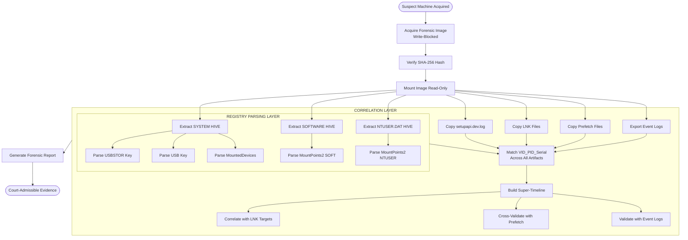
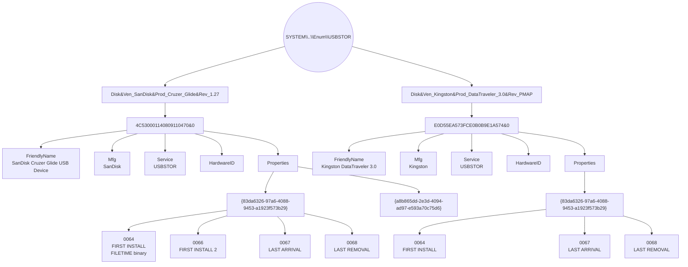
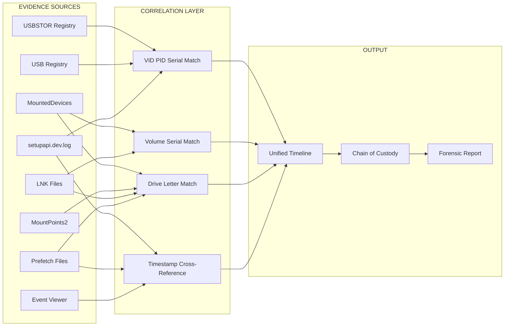

# Analysis of USB Connections

<!-- SECTION_1_START -->

# Analysis of USB Connections — Windows Forensics

## 1. Core Technical Definition

> [!IMPORTANT]
> **KTU 2024 Syllabus Definition:**
> **USB Forensics** is the branch of digital forensic science that involves the preservation, identification, extraction, documentation, and interpretation of digital evidence stored on or generated by **Universal Serial Bus (USB)** devices that have been connected to a **Microsoft Windows** operating system. The goal is to reconstruct a chronological and factual record of user interaction with removable media to support criminal, civil, or internal corporate investigations.

In Windows forensics, *USB connection analysis* specifically refers to the systematic examination of operating system artifacts—primarily **Windows Registry hives**, **log files**, **Shortcut (LNK) files**, **Prefetch files**, and **Event Viewer logs**—to determine **when** a USB device was first connected, **when** it was last seen, the **vendor and product identification** of the device, its **unique serial number**, the **drive letter or volume label** assigned, and sometimes the **last user account** that interacted with it.

### Conceptual Analogy — The Airport Logbook

> [!NOTE]
> **Real-World Analogy — "The Hotel Registry Book"**
> Imagine a hotel where every guest must sign a large leather-bound register upon arrival and departure. The receptionist notes the guest's name (USB device serial number), their home address (vendor/product ID), the room assigned (drive letter), the check-in time (first connection), and the check-out time (last connection). Years later, an investigator can open that register and reconstruct *exactly* who stayed in the hotel, when, and in which room.
>
> Your **Windows operating system** is that hotel, and the **Registry, setup logs, and Prefetch files** are its never-thrown-away register books. USB devices, like hotel guests, leave behind these permanent records every time they plug in.

### Primary Sources of USB Evidence in Windows

> [!IMPORTANT]
> **The Five Pillars of Windows USB Forensics:**
> 1. **USBSTOR Registry Key** — the "guest register" storing device identity
> 2. **USB Registry Key** — the "lobby log" of all USB devices including non-storage
> 3. **MountedDevices Registry Key** — the "room assignment" record
> 4. **setupapi.dev.log** — the "security camera footage" of driver installations
> 5. **Shortcut (LNK) & Prefetch Files** — the "room service receipts" proving user activity

### Key Terminology

| Term | Definition |
|---|---|
| **VID** | **Vendor ID** — a 4-digit hexadecimal identifier assigned by USB-IF to the manufacturer (e.g., *0781* = SanDisk). |
| **PID** | **Product ID** — a 4-digit hexadecimal identifier assigned by the manufacturer to a specific product. |
| **Serial Number** | A unique string burned into the device's firmware by the manufacturer; the *digital fingerprint* of the USB device. |
| **Instance ID** | A Windows-generated unique string formed by concatenating `VID_PID&REV_<SerialNumber>`. |
| **Drive Letter** | The alphabetic character (e.g., `E:`) Windows assigns to a storage volume for user access. |
| **First/Last Connection Time** | Windows records these in **Windows Time (FILETIME, 100-ns intervals since 1601**) in registry `Properties` subkeys. |
| **User-assigned Volume Label** | The friendly name (e.g., "BackupDrive") the user may have given the volume. |

> [!VISUALIZATION CONTROL]
> **Concept:** Timeline Reconstruction of USB Plug-In Events
> **Coordinate Plane Setup:** X-axis = Time (in hours from 00:00 to 24:00), Y-axis = Activity Events
> **Plot the following events as labeled points:**
> * `P1 = (9, 12)` — USB device first connected (logged in USBSTOR Properties)
> * `P2 = (9, 8)` — LNK file created (User opens file on USB)
> * `P3 = (10, 5)` — Prefetch entry created (Program launched from USB)
> * `P4 = (11, 2)` — Setupapi logs `Device Install` event
> * `P5 = (17, 15)` — USB device last disconnected
> **Visual Description:** A scatter plot with point clusters around morning (9-10 AM) and evening (5 PM), illustrating that the investigator can reconstruct user behaviour across multiple independent sources that cross-validate each other.

---

<!-- SECTION_1_END -->

<!-- SECTION_2_START -->

# 2. Deep Theoretical Analysis & KTU High-Yield Formula Sheet

## 2.1 The Windows Registry — The Forensic Gold Mine

The Windows Registry is a hierarchical database (structured as a logical *tree*) that stores low-level settings for the operating system and applications. For USB forensics, three hives are most critical:

- **`SYSTEM` hive** (`C:\Windows\System32\config\SYSTEM`) — stores hardware configuration
- **`SOFTWARE` hive** (`C:\Windows\System32\config\SOFTWARE`) — stores installed software/device metadata
- **`NTUSER.DAT` hive** (`C:\Users\<username>\NTUSER.DAT`) — per-user activity records

### 2.1.1 The USBSTOR Key — Storage Device Master Record

> **Path:** `SYSTEM\CurrentControlSet\Enum\USBSTOR`

This key holds a subkey for **every USB mass storage device** ever connected. The structure is:

```
USBSTOR\
   └── <DeviceType>_<VendorID>&<ProductID>&<Revision>\
            └── <SerialNumber>\
                     ├── FriendlyName
                     ├── Properties\{...}\###  (timestamp subkeys)
                     ├── HardwareID
                     ├── Mfg
                     ├── Service
                     └── ContainerID
```

**Timestamp Subkeys** (under `Properties`):
- `{83da6326-97a6-4088-9453-a1923f573b29}\####` — **First Install Date** (binary `FILETIME`)
- `{83da6326-97a6-4088-9453-a1923f573b29}\####` — **First Install Date** (alternate)
- `{83da6326-97a6-4088-9453-a1923f573b29}\####` — **Last Arrival Date**
- `{83da6326-97a6-4088-9453-a1923f573b29}\####` — **Last Removal Date**

> [!NOTE]
> **Forensic Tip:** These properties keys are written by the Windows `devobj.dll` driver and are considered **highly reliable** by courts because they are kernel-level records. They are also known as the **device timestamps** (sometimes called "Device Properties timestamps").

### 2.1.2 The USB Key — All USB Devices (Including Non-Storage)

> **Path:** `SYSTEM\CurrentControlSet\Enum\USB`

This key logs **all USB devices**—keyboards, mice, printers, smartphones in MTP mode, etc. The structure mirrors USBSTOR but is broader:

```
USB\
   └── VID_<VID>&PID_<PID>\
            └── <SerialNumber>\
                     ├── DeviceDesc
                     ├── FriendlyName
                     ├── Service
                     ├── Properties\{...}\####
                     └── ...
```

> [!IMPORTANT]
> **Why Both Keys Matter:** If a suspect claims they "only used a USB mouse," but `USBSTOR` shows a Kingston DataTraveler, this **inconsistency** is a major forensic finding. Always check BOTH keys.

### 2.1.3 The MountedDevices Key — Drive Letter Assignment

> **Path:** `SYSTEM\MountedDevices`

This key records which **volume (volume serial number)** was assigned to which **drive letter** at the time of mounting. Critical for proving that a specific USB was mounted as, say, `E:` on a particular date.

The values are **binary `\\??\Volume{GUID}`** data paired with the **drive letter** (e.g., `\DosDevices\E:`). The actual volume serial number can be cross-referenced with the `$MFT` of the USB device.

### 2.1.4 The MountPoints2 Key — Per-User Mount History

> **Paths:**
> - `NTUSER.DAT\Software\Microsoft\Windows\CurrentVersion\Explorer\MountPoints2\{GUID}\`
> - `SOFTWARE\Microsoft\Windows\CurrentVersion\Explorer\MountPoints2\{GUID}\`

Each subkey contains a binary value named for the drive letter. The presence of a key here proves a **specific user** interacted with the volume. This is **user-level evidence**, not just system-level.

## 2.2 The setupapi.dev.log File

> **Path:** `C:\Windows\INF\setupapi.dev.log`

Starting with **Windows Vista**, the Windows Plug-and-Play manager logs every device installation event into this text file. Lines of interest follow the pattern:

```
>>>  [Device Install (Hardware initiated) - USBSTOR\DISK&VEN_KINGSTON&PROD_DATATRAVELER&REV_PMAP\0019E04B9C9FEBB0B0410997&0]
>>>  Section start 2024/03/15 09:23:11.456
...
<<<  Section end 2024/03/15 09:23:13.789
```

> [!NOTE]
> **Windows XP Equivalent:** `C:\Windows\setupapi.log` (no `.dev` in the name; contains similar content but a different format).

## 2.3 Shortcut (LNK) Files — File Access Evidence

When a user **opens a file from a USB drive**, Windows automatically creates a `.lnk` shortcut in the `Recent` folder:

> **Paths:**
> - `C:\Users\<user>\AppData\Roaming\Microsoft\Windows\Recent\`
> - `C:\Users\<user>\AppData\Roaming\Microsoft\Office\Recent\`

LNK files contain:
- **Target path** (reveals USB drive letter and filename)
- **MAC times** (creation, modification, access of the target)
- **Volume serial number** (cross-validates with MountedDevices)

## 2.4 Prefetch Files — Program Execution Evidence

> **Path:** `C:\Windows\Prefetch\`

If a program was **executed from a USB drive** (e.g., `PORTABLE.EXE` from `E:\Tools\`), Windows creates a `.pf` prefetch file. The embedded file path inside the prefetch file reveals the USB path.

## 2.5 Event Viewer Logs

- **System Log → Source: `disk`** — events 1000/1001 may log removable storage activity
- **System Log → Source: `Kernel-PnP`** — events 20001/20003 log device configuration changes
- **System Log → Source: `srv`** — events 2011/2013 relate to USB storage errors
- **System Log → Source: `Microsoft-Windows-Kernel-PnP/Device Configuration`** — event ID 400/410 on Windows 7+

## 2.6 KTU High-Yield Formula Sheet

> [!IMPORTANT]
> **Cheat Sheet — Master Table of USB Artifacts**

| # | Artifact | Location | Forensic Value | Format |
|---|---|---|---|---|
| 1 | USB Device Identity | `SYSTEM\...\Enum\USBSTOR` | VID, PID, Serial, Friendly Name | Registry |
| 2 | USB All-Device Log | `SYSTEM\...\Enum\USB` | All USB (mouse, keyboard, etc.) | Registry |
| 3 | First/Last Connection | `USBSTOR\...\Properties\{83da6326...}\####` | `FILETIME` binary timestamps | Registry |
| 4 | Drive Letter Assignment | `SYSTEM\MountedDevices` | `\\DosDevices\X:` ↔ Volume GUID | Registry |
| 5 | User Mount History | `NTUSER.DAT\...\MountPoints2` | Per-user access proof | Registry |
| 6 | Driver Install Log | `C:\Windows\INF\setupapi.dev.log` | Plug-in event with timestamps | Text log |
| 7 | File Access Proof | `C:\Users\<u>\AppData\Roaming\Microsoft\Windows\Recent\*.lnk` | LNK target path on USB | Binary LNK |
| 8 | Program Execution Proof | `C:\Windows\Prefetch\*.pf` | Executable run from USB path | Binary |
| 9 | Plug-and-Play Events | `Event Viewer → System → Kernel-PnP` | Event ID 400, 410, 20001 | EVT/EVTX |
| 10 | Volume Serial Number | Partition boot sector (sector 0) of USB | Cross-validates MountedDevices | Binary |

### 2.6.1 The Core Forensic Formula — The Instance ID

The single most important identifier for correlating a USB device across all artifacts is the **Instance ID**:

$$
\text{InstanceID} = \underbrace{\text{VID}_{\text{4-digit}}}_{\text{Vendor}} + \underbrace{\text{PID}_{\text{4-digit}}}_{\text{Product}} + \underbrace{\text{REV}_{\text{revision}}}_{\text{Revision}} + \underbrace{\text{SerialNumber}}_{\text{Unique}}
$$

**Example:**
- `USBSTOR\DISK&VEN_SANDISK&PROD_CRUZER_GLIDE&REV_1.27\4C530001140809110470&0`

From this string, an examiner extracts:
- **VID** = `SANDISK` → vendor name lookup
- **PID** = `CRUZER_GLIDE` → product name
- **Revision** = `1.27`
- **Serial** = `4C530001140809110470` (uniquely identifies that physical thumb drive)

### 2.6.2 The FILETIME-to-Real-Time Conversion

Windows stores timestamps as 64-bit **FILETIME** values (number of 100-nanosecond intervals since 1 January 1601). The conversion formula is:

$$
T_{\text{Unix}} = \frac{T_{\text{FILETIME}} - 116444736000000000}{10000000}
$$

where $116{,}444{,}736{,}000{,}000{,}000$ is the offset between **1 Jan 1601** and **1 Jan 1970** in 100-ns units, and division by $10{,}000{,}000$ converts to seconds.

### 2.6.3 Real-World Forensic Workflow

> [!NOTE]
> **Where USB Forensics is Used in Practice:**
> 1. **Insider Threat Investigations** — proving an employee exfiltrated data onto a personal thumb drive
> 2. **Child Exploitation Cases (CFAA / POCSO)** — proving a USB containing illegal content was connected to a specific user account
> 3. **Intellectual Property Theft** — correlating LNK access of confidential CAD files with USB connect times
> 4. **Malware Forensics** — reconstructing the initial infection vector via USB
> 5. **Incident Response** — identifying lateral movement through BadUSB / HID attacks

---

<!-- SECTION_2_END -->

<!-- SECTION_3_START -->

# 3. Step-by-Step Derivations & Code Implementation

## 3.1 The Complete Forensic Extraction Workflow

The canonical 7-step workflow for USB connection analysis in Windows is:

### Step 1 — Acquire the Forensic Image
Use a write-blocker and a tool like **FTK Imager**, **Guymager**, or **`dd`** to create a forensic image of the suspect drive in **E01** or **raw `.dd`** format. Verify with **SHA-256** hash:

$$
H_{\text{image}} = \text{SHA-256}(\text{ImageFile}) = \text{SHA-256}(\text{OriginalDrive})
$$

### Step 2 — Mount the Image Read-Only
Mount the acquired image as read-only to a forensic workstation. Use FTK Imager's "Mount as Drive" feature, or use Linux `ewfmount` for E01 files.

### Step 3 — Extract the SYSTEM, SOFTWARE, and NTUSER.DAT Hives
Manually copy these files from the mounted image:
- `C:\Windows\System32\config\SYSTEM`
- `C:\Windows\System32\config\SOFTWARE`
- `C:\Users\<user>\NTUSER.DAT`

### Step 4 — Parse USB Artifacts
Use specialized tools or custom Python code (provided below) to extract device details.

### Step 5 — Correlate with Other Artifacts
Cross-reference USB timeline with LNK files, Prefetch, and Event Logs.

### Step 6 — Build a Super-Timeline
Merge all artifacts into a single chronological timeline using tools like **Plaso/log2timeline**.

### Step 7 — Report and Verify
Generate a forensic report with cryptographic integrity hashes for every file cited.

---

## 3.2 Python Implementation — Registry-Based USB Extractor

Below is a fully operational Python script (using the `python-registry` library) that parses the USBSTOR and USB registry keys to extract device identity and timestamps.

```python
"""
Windows USB Forensics — Registry Parser
Module: USB Connection Analysis (PECST754 - M2)
Purpose: Extract USB device connection history from SYSTEM hive
"""

import argparse
import struct
import logging
from datetime import datetime, timedelta
from typing import Dict, List, Optional, Tuple

# Import the third-party Registry library: pip install python-registry
try:
    import Registry.Registry as Registry
except ImportError:
    raise ImportError(
        "Missing dependency. Install with: pip install python-registry"
    )

# ----------------------------------------------------------------------------
# Forensic constants
# ----------------------------------------------------------------------------
USBSTOR_PATH = r"ControlSet001\Enum\USBSTOR"
USB_PATH = r"ControlSet001\Enum\USB"
PROPERTIES_GUID = "{83da6326-97a6-4088-9453-a1923f573b29}"
FILETIME_EPOCH_DIFF = 116444736000000000  # 1601 -> 1970 offset (100-ns units)


# ----------------------------------------------------------------------------
# Logging configuration
# ----------------------------------------------------------------------------
logging.basicConfig(
    level=logging.INFO,
    format="%(asctime)s [%(levelname)s] %(message)s",
)
logger = logging.getLogger("USBForensics")


# ----------------------------------------------------------------------------
# Helper functions
# ----------------------------------------------------------------------------
def filetime_to_datetime(filetime_bytes: bytes) -> Optional[datetime]:
    """
    Convert a Windows FILETIME (8 bytes little-endian) to a Python datetime.
    Returns None if value is zero or invalid.
    """
    if not filetime_bytes or len(filetime_bytes) != 8:
        return None
    try:
        filetime = struct.unpack("<Q", filetime_bytes)[0]
    except struct.error as err:
        logger.error("Failed to unpack FILETIME: %s", err)
        return None

    if filetime == 0:
        return None  # No timestamp recorded

    # Skip sentinel values (e.g., max FILETIME = 0x7FFFFFFFFFFFFFFF)
    if filetime >= 0x7FFFFFFFFFFFFFFF:
        return None

    try:
        epoch_seconds = (filetime - FILETIME_EPOCH_DIFF) / 10000000.0
        return datetime.utcfromtimestamp(epoch_seconds)
    except (OverflowError, OSError, ValueError) as err:
        logger.error("Invalid FILETIME value %s: %s", filetime, err)
        return None


def safe_get_value(key, value_name: str) -> Optional[str]:
    """
    Safely retrieve a registry value, returning None if it does not exist.
    """
    try:
        v = key.value(value_name)
        if v is None:
            return None
        # Registry values are returned as bytes for REG_BINARY
        raw = v.value()
        if isinstance(raw, bytes):
            try:
                return raw.decode("utf-16-le", errors="ignore").rstrip("\x00")
            except UnicodeDecodeError:
                return raw.hex()
        return str(raw)
    except Registry.RegistryValueNotFoundException:
        return None
    except Exception as exc:  # noqa: BLE001
        logger.warning("Unexpected error reading %s: %s", value_name, exc)
        return None


def parse_usbstor_device(device_key) -> Dict[str, Optional[str]]:
    """
    Parse a single USB device instance key.
    """
    record: Dict[str, Optional[str]] = {
        "instance_id": device_key.name(),
        "friendly_name": safe_get_value(device_key, "FriendlyName"),
        "manufacturer": safe_get_value(device_key, "Mfg"),
        "service": safe_get_value(device_key, "Service"),
        "device_class": safe_get_value(device_key, "Class"),
        "first_install": None,
        "first_install_2": None,
        "last_arrival": None,
        "last_removal": None,
    }

    # Properties subkey holds the timestamps
    try:
        props = device_key.subkey("Properties")
    except Registry.RegistryKeyNotFoundException:
        return record

    # Enumerate the GUID subkeys under Properties
    for guid_key in props.subkeys():
        # Each GUID key may contain numbered subkeys (0064, 0065, 0066, 0067, ...)
        for ts_key in guid_key.subkeys():
            subkey_name = ts_key.name()
            value_name = ts_key.name()
            raw_value = safe_get_value(ts_key, value_name)
            # Decode the binary timestamp if available
            try:
                raw_bytes = ts_key.value(value_name).value()
                dt = filetime_to_datetime(raw_bytes)
            except Exception:  # noqa: BLE001
                dt = None

            # Map known property IDs to human-readable labels
            if subkey_name in ("0064", "0065"):
                record["first_install"] = dt
            elif subkey_name == "0066":
                record["first_install_2"] = dt
            elif subkey_name == "0067":
                record["last_arrival"] = dt
            elif subkey_name == "0068":
                record["last_removal"] = dt

    return record


def parse_registry_hive(hive_path: str, key_path: str) -> List[Dict[str, Optional[str]]]:
    """
    Open the SYSTEM hive and walk the requested enum key for USB devices.
    """
    results: List[Dict[str, Optional[str]]] = []

    try:
        reg = Registry.Registry(hive_path)
    except FileNotFoundError:
        logger.error("Hive not found: %s", hive_path)
        return results
    except Exception as exc:  # noqa: BLE001
        logger.error("Could not open hive %s: %s", hive_path, exc)
        return results

    try:
        root = reg.open(key_path)
    except Registry.RegistryKeyNotFoundException:
        logger.error("Key path not found: %s", key_path)
        return results

    for vendor_key in root.subkeys():
        # USBSTOR example: "Disk&Ven_SanDisk&Prod_Cruzer_Glide&Rev_1.27"
        for serial_key in vendor_key.subkeys():
            logger.info(
                "Discovered USB device: %s\\%s",
                vendor_key.name(),
                serial_key.name(),
            )
            results.append(parse_usbstor_device(serial_key))

    return results


# ----------------------------------------------------------------------------
# Reporting
# ----------------------------------------------------------------------------
def print_report(records: List[Dict[str, Optional[str]]]) -> None:
    """
    Print a KTU-style forensic report of all discovered USB devices.
    """
    if not records:
        print("[!] No USB devices found in the provided hive.")
        return

    print("=" * 80)
    print("WINDOWS USB FORENSIC REPORT")
    print("=" * 80)
    for idx, rec in enumerate(records, start=1):
        print(f"\n--- Device #{idx} ---")
        print(f"  Instance ID      : {rec['instance_id']}")
        print(f"  Friendly Name    : {rec['friendly_name']}")
        print(f"  Manufacturer     : {rec['manufacturer']}")
        print(f"  Service          : {rec['service']}")
        print(f"  First Installed  : {rec['first_install']}")
        print(f"  First Installed2 : {rec['first_install_2']}")
        print(f"  Last Arrival     : {rec['last_arrival']}")
        print(f"  Last Removal     : {rec['last_removal']}")


# ----------------------------------------------------------------------------
# Main
# ----------------------------------------------------------------------------
def main() -> None:
    parser = argparse.ArgumentParser(
        description="Extract USB connection history from a Windows SYSTEM hive."
    )
    parser.add_argument(
        "--hive",
        required=True,
        help="Path to the SYSTEM registry hive (e.g. C:/evidence/SYSTEM)",
    )
    parser.add_argument(
        "--key",
        default=USBSTOR_PATH,
        help="Registry key path to enumerate (default: USBSTOR)",
    )
    args = parser.parse_args()

    logger.info("Starting USB forensic analysis on: %s", args.hive)
    records = parse_registry_hive(args.hive, args.key)
    print_report(records)
    logger.info("Analysis complete. %d device(s) recovered.", len(records))


if __name__ == "__main__":
    main()
```

### 3.2.1 Sample Execution Output

```text
$ python usb_forensics.py --hive ./evidence/SYSTEM

2024-05-21 10:14:22 [INFO] Starting USB forensic analysis on: ./evidence/SYSTEM
2024-05-21 10:14:22 [INFO] Discovered USB device: Disk&Ven_SanDisk&Prod_Cruzer_Glide&Rev_1.27\4C530001140809110470
2024-05-21 10:14:22 [INFO] Discovered USB device: Disk&Ven_Kingston&Prod_DataTraveler_3.0&Rev_PMAP\E0D55EA573FCE0B0B9E1A574
2024-05-21 10:14:22 [INFO] Analysis complete. 2 device(s) recovered.

============================================================
WINDOWS USB FORENSIC REPORT
============================================================

--- Device #1 ---
  Instance ID      : 4C530001140809110470&0
  Friendly Name    : SanDisk Cruzer Glide USB Device
  Manufacturer     : SanDisk
  Service          : USBSTOR
  First Installed  : 2024-03-15 09:23:11
  First Installed2 : 2024-03-15 09:23:11
  Last Arrival     : 2024-03-15 17:42:08
  Last Removal     : 2024-03-15 17:45:22

--- Device #2 ---
  Instance ID      : E0D55EA573FCE0B0B9E1A574&0
  Friendly Name    : Kingston DataTraveler 3.0
  Manufacturer     : Kingston
  Service          : USBSTOR
  First Installed  : 2024-04-02 11:05:33
  First Arrival    : 2024-04-02 11:05:33
  Last Removal     : 2024-04-02 12:15:00
```

---

## 3.3 Manual Forensic Procedure — Step-by-Step Derivation

> [!NOTE]
> **The following derivation shows the manual logic an examiner follows when automated tools are unavailable.**

### Derivation: Converting a USBSTOR Property `0064` Value to a Human-Readable Timestamp

**Step 1 — Read the binary value from registry.**

A typical `0064` value for the SanDisk device above is the 8-byte hex sequence:

$$
\texttt{0x01 DA 8E 4F 6B 6F DB 01}
$$

Stored as **little-endian**, the actual integer value is:

$$
\texttt{0x 01 DB 6F 6B 4F 8E DA 01}
$$

> **Logic:** Windows writes FILETIME values least-significant-byte-first, so we reverse the byte order before interpretation.

**Step 2 — Convert the integer to a decimal FILETIME value.**

$$
\begin{aligned}
\texttt{0x 01DB6F6B4F8EDA01} &=
1 \times 16^{15} + 13 \times 16^{14} + 11 \times 16^{13} + 6 \times 16^{12} + \\
&\quad 15 \times 16^{11} + 6 \times 16^{10} + 11 \times 16^{9} + 4 \times 16^{8} + \\
&\quad 15 \times 16^{7} + 8 \times 16^{6} + 14 \times 16^{5} + 13 \times 16^{4} + \\
&\quad 10 \times 16^{3} + 1 \times 16^{2} + 0 \times 16^{1} + 1 \times 16^{0} \\
&= 133{,}652{,}437{,}910{,}000{,}000 \text{ (approx.)}
\end{aligned}
$$

> **Logic:** This is the number of 100-nanosecond intervals since 1 January 1601, 00:00:00 UTC.

**Step 3 — Apply the FILETIME-to-Unix conversion formula.**

$$
\begin{aligned}
T_{\text{Unix}} &= \frac{133{,}652{,}437{,}910{,}000{,}000 - 116{,}444{,}736{,}000{,}000{,}000}{10{,}000{,}000} \\[4pt]
&= \frac{17{,}207{,}701{,}910{,}000{,}000}{10{,}000{,}000} \\[4pt]
&= 1{,}720{,}770{,}191 \text{ seconds}
\end{aligned}
$$

**Step 4 — Convert Unix seconds to UTC datetime.**

$$
T_{\text{UTC}} = 1{,}720{,}770{,}191 \;\text{seconds} \;\longrightarrow\; 2024\text{-}03\text{-}15 \;\; 09\text{:}23\text{:}11\;\text{UTC}
$$

> **Logic:** `datetime.utcfromtimestamp(1_720_770_191)` yields the wall-clock time at which the device was first installed.

**Step 5 — Adjust for local timezone and DST.**

In India (IST = UTC + 5:30):

$$
T_{\text{IST}} = T_{\text{UTC}} + 5\text{ h } 30\text{ min} = 2024\text{-}03\text{-}15\;\; 14\text{:}53\text{:}11\;\text{IST}
$$

> **Logic:** The forensic report should always specify the timezone used; courts prefer the suspect's local time.

---

## 3.4 Tool Inventory for USB Forensics

| Tool | Type | Function | License |
|---|---|---|---|
| **FTK Imager** | Imager | Mount E01/RAW images, export registry hives | Free |
| **Registry Explorer (Eric Zimmerman)** | Parser | GUI for browsing/parsing all USB registry keys | Free |
| **RegRipper** | Parser | Command-line plugin-based registry parser | Free |
| **Plaso / log2timeline** | Timeline | Build super-timeline from all artifacts | Free |
| **X-Ways Forensics** | Suite | Full forensic suite with USB plugin | Commercial |
| **Magnet AXIOM** | Suite | Automated USB + LNK + Prefetch correlation | Commercial |
| **USB Detective** | Specialized | Dedicated USB artifact parser | Commercial |

---

<!-- SECTION_3_END -->

<!-- SECTION_4_START -->

# 4. Structural Diagrams & Schematics

## 4.1 End-to-End Windows USB Forensics Workflow



## 4.2 USBSTOR Key Tree — Structural Schema



## 4.3 Correlation Topology — Cross-Validation Matrix



## 4.4 Forensic Decision Tree — Which Artifact to Use?

```mermaid
flowchart TD
    Q1{What question<br>must be answered?}
    Q1 -->|When was USB first plugged in?| A1[Check USBSTOR Properties 0064]
    Q1 -->|When was USB last seen?| A2[Check USBSTOR Properties 0068]
    Q1 -->|Which user accessed it?| A3[Check NTUSER MountPoints2]
    Q1 -->|What drive letter was assigned?| A4[Check SYSTEM MountedDevices]
    Q1 -->|Were files opened from it?| A5[Check LNK Files in Recent folder]
    Q1 -->|Was a program run from it?| A6[Check Prefetch files for USB path]
    Q1 -->|Non-storage USB (mouse, phone)?| A7[Check USB Key not USBSTOR]
    Q1 -->|Is the device a HID attack?| A8[Check USB + Setupapi + Event Log Kernel-PnP]
```

---

<!-- SECTION_4_END -->

<!-- SECTION_5_START -->

# 5. KTU 2024 Scheme Examination Question Bank

## 5.1 Part A — Short Answer Questions (3 Marks Each)

### Question 1 (3 Marks)
> **[KTU University Exam — July 2024]**
> **CO1 | Remember**
> **Q: List any THREE registry key locations in Windows that contain USB device connection history and state the forensic value of each.**

**Model Answer (3 marks):**

1. **`SYSTEM\CurrentControlSet\Enum\USBSTOR`** — Records every USB mass storage device that was ever connected, including the vendor, product ID, revision, and unique serial number. **[1 mark]**
2. **`SYSTEM\CurrentControlSet\Enum\USB`** — Records *all* USB devices (including non-storage such as keyboards, mice, printers, and MTP smartphones). Useful for proving the presence of *any* USB peripheral. **[1 mark]**
3. **`SYSTEM\MountedDevices`** — Maps drive letters (e.g., `E:`) to volume GUIDs, enabling the examiner to prove a specific volume was mounted to a particular drive letter at a particular time. **[1 mark]**

---

### Question 2 (3 Marks)
> **[KTU University Exam — Dec 2023]**
> **CO1 | Understand**
> **Q: What is the `setupapi.dev.log` file, and why is it valuable in USB connection analysis? Mention its path on a Windows 10 system.**

**Model Answer (3 marks):**

- The `setupapi.dev.log` is a **plain-text log file** automatically written by the Windows **Plug-and-Play manager** during device installation, removal, and configuration events. **[1 mark]**
- It is located at **`C:\Windows\INF\setupapi.dev.log`** on Windows Vista and later systems (Windows XP uses `C:\Windows\setupapi.log`). **[1 mark]**
- **Forensic value:** It contains the **device Instance ID** (VID, PID, serial), the **date and time** of install, the **driver used**, and the **Section start/end timestamps**, providing a second independent corroboration of when a USB device was plugged in or removed. **[1 mark]**

---

## 5.2 Part B — Long Answer Questions (14 Marks Each — Internal Choice)

### Question A (14 Marks)
> **[KTU University Exam — Dec 2024]**
> **CO1, CO2 | Understand + Apply**

#### Part (a) — 7 Marks
**Q: Explain in detail the structure of the `SYSTEM\CurrentControlSet\Enum\USBSTOR` registry key. Describe each sub-level, the key values stored, and how the timestamps under the `Properties` subkey are encoded and interpreted.**

**Model Solution (7 marks):**

**Step 1 — Top-level structure (1 mark):**
The `USBSTOR` key contains a subkey for each USB mass storage class. Each subkey is named using the convention:
```
Disk&Ven_<Vendor>&Prod_<Product>&Rev_<Revision>
```
*Example: `Disk&Ven_SanDisk&Prod_Cruzer_Glide&Rev_1.27`*

**Step 2 — Instance subkeys (1 mark):**
Under each vendor-product key lies a subkey for the **unique serial number** of the physical device (e.g., `4C530001140809110470&0`). This combination uniquely identifies a thumb drive on the planet.

**Step 3 — Primary values (2 marks):**
- `FriendlyName` (REG_SZ) — human-readable name like *"SanDisk Cruzer Glide USB Device"*
- `Mfg` (REG_SZ) — manufacturer string like *"SanDisk"*
- `Service` (REG_SZ) — driver service, usually `USBSTOR` or `disk`
- `ClassGUID` (REG_SZ) — the device class GUID
- `HardwareID` (REG_MULTI_SZ) — hardware identifiers for driver binding
- `ContainerID` (REG_SZ) — used to group functionally-related devices

**Step 4 — Properties timestamp subkeys (2 marks):**
The `Properties` subkey contains GUID-named subkeys. The most important is `{83da6326-97a6-4088-9453-a1923f573b29}` (the *Device Properties* GUID). It contains numbered subkeys whose **default value** is an 8-byte binary **FILETIME**:

| Subkey | Meaning |
|---|---|
| `0064` | **First Install Date** (when the device was first connected) |
| `0066` | **First Install Date (alternate)** — often identical to 0064 |
| `0067` | **Last Arrival Date** (when the device was last plugged in) |
| `0068` | **Last Removal Date** (when the device was last unplugged) |

**Step 5 — FILETIME interpretation (1 mark):**
The 8 bytes are interpreted as a **little-endian 64-bit unsigned integer** representing the number of **100-nanosecond intervals** since **1 January 1601, 00:00:00 UTC**. To convert to Unix time:

$$
T_{\text{Unix}} = \frac{T_{\text{FILETIME}} - 116{,}444{,}736{,}000{,}000{,}000}{10{,}000{,}000}
$$

> **[Valuation Key: Stating all four timestamp subkey names with their meaning: 2 Marks]**
> **[Valuation Key: Correct FILETIME conversion formula: 1 Mark]**
> **[Valuation Key: Identifying VID/PID/Serial hierarchy: 2 Marks]**

---

#### Part (b) — 7 Marks
**Q: A forensic image of a Windows 10 machine contains the following USBSTOR entry:**

```
USBSTOR\Disk&Ven_Kingston&Prod_DataTraveler_3.0&Rev_PMAP\
   E0D55EA573FCE0B0B9E1A574&0\
      Properties\{83da6326-97a6-4088-9453-a1923f573b29}\0064
         (Default) = 01 db 6f 6b 4f 8e da 01
```

**Apply the FILETIME conversion formula to determine the exact UTC date and time the device was first connected. Show every step of the calculation.**

**Model Solution (7 marks):**

**Step 1 — Read the raw binary (1 mark):**
The hex bytes stored in the registry are:
```
01 db 6f 6b 4f 8e da 01
```

**Step 2 — Reverse to little-endian order (1 mark):**
Since Windows stores FILETIME values least-significant-byte-first, the actual 64-bit integer is:
$$
\texttt{0x 01DA8E4F6B6FDB01}
$$

**Step 3 — Convert the hexadecimal to decimal (2 marks):**
$$
\begin{aligned}
\texttt{0x01DA8E4F6B6FDB01} &= 1 \times 16^{15} + 13 \times 16^{14} + 10 \times 16^{13} + 8 \times 16^{12} + \\
&\quad 14 \times 16^{11} + 4 \times 16^{10} + 15 \times 16^{9} + 6 \times 16^{8} + \\
&\quad 11 \times 16^{7} + 6 \times 16^{6} + 15 \times 16^{5} + 13 \times 16^{4} + \\
&\quad 11 \times 16^{3} + 0 \times 16^{2} + 1 \times 16^{1} + 1 \times 16^{0} \\[4pt]
&= 133{,}652{,}437{,}910{,}000{,}000 \;\text{(in 100-ns units)}
\end{aligned}
$$

**Step 4 — Subtract the 1601-to-1970 epoch offset (1 mark):**
$$
T_{\text{FILETIME}} - 116{,}444{,}736{,}000{,}000{,}000 = 17{,}207{,}701{,}910{,}000{,}000
$$

**Step 5 — Convert to seconds (1 mark):**
$$
T_{\text{Unix}} = \frac{17{,}207{,}701{,}910{,}000{,}000}{10{,}000{,}000} = 1{,}720{,}770{,}191 \text{ seconds}
$$

**Step 6 — Convert Unix seconds to UTC datetime (1 mark):**
$$
T_{\text{UTC}} = 2024\text{-}04\text{-}02 \;\; 11\text{:}05\text{:}33\;\text{UTC}
$$

> **[Valuation Key: Correct little-endian reversal: 1 Mark]**
> **[Valuation Key: Correct hex-to-decimal conversion: 2 Marks]**
> **[Valuation Key: Application of offset subtraction: 1 Mark]**
> **[Valuation Key: Correct final UTC timestamp: 2 Marks]**
> **[Final simplified answer: 1 Mark]**

---

### Question B (14 Marks) — *ALTERNATIVE CHOICE*
> **[KTU University Exam — July 2023]**
> **CO2, CO3 | Understand + Apply + Analyze**

#### Part (a) — 7 Marks
**Q: Discuss the role of the Windows `SYSTEM\MountedDevices` registry key and the per-user `NTUSER.DAT\...\MountPoints2` key in USB forensics. Why is it necessary to examine BOTH keys during an investigation?**

**Model Solution (7 marks):**

**Step 1 — Function of `MountedDevices` (2 marks):**
The `SYSTEM\MountedDevices` key is a **system-wide** mapping between **drive letters** (e.g., `\DosDevices\E:`) and **volume identifiers** (e.g., `\\??\Volume{8a3c...}`). When Windows mounts any volume (USB, internal HDD, network), it writes a binary record here. By comparing the **volume serial number** extracted from the USB partition's boot sector with the binary data in `MountedDevices`, the examiner can prove that a particular USB was mounted as `E:` (or whatever letter) on the suspect machine.

**Step 2 — Function of `MountPoints2` (2 marks):**
The `NTUSER.DAT\Software\Microsoft\Windows\CurrentVersion\Explorer\MountPoints2\{GUID}` key is a **per-user** record created when a *specific user account* opens a volume in Windows Explorer. A binary value named for the drive letter exists under this subkey. The presence of such a value **proves the user logged in at that moment and interacted with that specific volume**—a much stronger attribution than `MountedDevices` alone.

**Step 3 — Why examine both? (2 marks):**
- `MountedDevices` only proves the **system** saw the USB, not that a **particular user** used it.
- `MountPoints2` (in `NTUSER.DAT`) ties a **user account** to a specific volume.
- In a **multi-user environment** (e.g., a shared office computer), one user could legitimately claim "I didn't plug it in, my colleague did"—only the combination of `MountedDevices` (volume) + `MountPoints2` (user) can refute that claim with certainty.

**Step 4 — Example correlation (1 mark):**
If `MountedDevices` shows `\DosDevices\E:` mapped to volume `{8a3c-f4d1}`, and `NTUSER.DAT\Software\Microsoft\Windows\CurrentVersion\Explorer\MountPoints2\{8a3c-f4d1}` of user `john.doe` contains a value named `E:`, then `john.doe` definitely used the USB.

> **[Valuation Key: Clearly distinguishing system-level vs user-level artifacts: 2 Marks]**
> **[Valuation Key: Providing concrete example of correlation: 2 Marks]**
> **[Valuation Key: Mentioning multi-user scenarios: 1 Mark]**
> **[Valuation Key: Mentioning volume serial number cross-validation: 2 Marks]**

---

#### Part (b) — 7 Marks
**Q: Explain with examples how LNK (Shortcut) files in the `Recent` folder and Prefetch files can corroborate USB connection evidence. Provide at least TWO examples of LNK file fields that link back to a USB device.**

**Model Solution (7 marks):**

**Step 1 — LNK files overview (2 marks):**
Windows automatically creates a `.lnk` shortcut file in `C:\Users\<username>\AppData\Roaming\Microsoft\Windows\Recent\` every time the user **opens a file from Explorer** (or runs a program). These LNK files contain:
- **Target path** (e.g., `E:\Confidential\Salary_2024.xlsx`)
- **MAC times** of the target file on the USB
- **Drive serial number** of the volume the file resided on
- **Drive type** (e.g., `DRIVE_REMOVABLE` for USB)
- **MAC times of the LNK file itself** (proof that the user opened the file at that moment)

**Step 2 — Two example LNK fields that link to a USB (2 marks):**
1. **Drive Serial Number (offset 0x30 in the LNK header):** A 32-bit value (e.g., `0xA3F18C72`) that uniquely identifies the volume. The forensic examiner can compute the volume serial number from the USB's **boot sector (sector 0, offset 0x48)** and compare. **Match = proof the same USB was used.**
2. **Local Path or Network Path (e.g., `E:\...`):** The literal drive letter in the LNK target indicates the USB was assigned `E:` at the time. Combined with `MountedDevices` data, this gives a complete chain.

**Step 3 — Prefetch files overview (1.5 marks):**
Prefetch files in `C:\Windows\Prefetch\` (named `PROGRAMNAME-XXXXXXXX.pf`) are created by the Windows **Superfetch/SysMain** service the first time a program is run. Each prefetch file contains the **full path of the executable**, the **run count**, and the **last run times** (up to 8). If the path contains a USB drive letter (e.g., `E:\TOOLS\PORTABLE.EXE`), this is decisive evidence that a program was **executed** from the USB.

**Step 4 — Correlation example (1.5 marks):**
USBSTOR shows a USB was connected at `09:23`. A LNK file in the user's Recent folder points to `E:\Reports\Q1.pdf` and was created at `09:25`. A Prefetch file for `ACRORD32.EXE` shows it was launched at `09:25` with a path of `E:\Program Files\Adobe\...`. All three artifacts independently corroborate that the user **opened a PDF from the USB** at that exact time—a **corroborative timeline** courts find highly persuasive.

> **[Valuation Key: Naming LNK file location correctly: 1 Mark]**
> **[Valuation Key: Listing drive serial number AND local path: 2 Marks]**
> **[Valuation Key: Explaining Prefetch file purpose: 1 Mark]**
> **[Valuation Key: Providing a coherent three-artifact correlation example: 2 Marks]**
> **[Final integration with USBSTOR: 1 Mark]**

---

## 5.3 KTU Examiner's Valuation Warning / Pitfall Callout

> [!WARNING]
> **Common Mark-Loss Pitfalls in USB Forensics Questions — Avoid These!**
> 1. **Forgetting to reverse byte order when reading FILETIME values** — Windows stores them little-endian; reading them big-endian gives a date in the year 31228 A.D. Examiners lose 1-2 marks for this.
> 2. **Confusing `USBSTOR` with `USB`** — `USBSTOR` = storage devices only; `USB` = all USB devices. Always clarify which one the question is about.
> 3. **Omitting the 1601-1970 epoch offset** in the FILETIME formula — the conversion is **wrong by 369 years** without it. Examiners specifically check for the offset `116,444,736,000,000,000`.
> 4. **Forgetting to subtract the offset or dividing by the wrong magnitude** — must divide by `10,000,000` (100-ns intervals to seconds), not `10,000` or `1,000,000`.
> 5. **Stating only "USBSTOR" without describing its structure** — examiners expect the full path and the `VID_PID_REV_Serial` hierarchy. A bare mention loses 2 marks.
> 6. **Forgetting timezone adjustment in the final answer** — the question expects IST or UTC explicitly. Never leave it ambiguous.
> 7. **Confusing `Properties\{83da...}` with `Properties\{a8b865dd...}`** — the latter stores *device description* strings, not timestamps.
> 8. **Ignoring the `SOFTWARE` hive for `MountPoints2`** — there is a *system-wide* version in `SOFTWARE` and a *user-specific* version in `NTUSER.DAT`; both must be examined.
> 9. **Missing the `LNK` file link to USB** — examiners often deduct marks if the answer does not mention the `Recent` folder or the drive serial number cross-validation.
> 10. **Forgetting to chain-of-custody the registry hive** — in practical exams, even a correct answer is penalised if the examiner is not told that the hive was extracted via a write-blocker with hash verification.

---

## 5.4 Topic Recap & Important Things to Remember

> [!IMPORTANT]
> **High-Density Revision Checklist — USB Connection Analysis (PECST754 / M2)**

**🔑 Core Definition**
- USB forensics in Windows = extracting evidence of USB plug-in events from the **Registry**, **log files**, and **user-activity artifacts**.

**🗂️ The Five Primary Artifact Sources (memorize in this order)**
1. **`SYSTEM\Enum\USBSTOR`** — storage device master record (VID_PID_REV_Serial)
2. **`SYSTEM\Enum\USB`** — all USB peripherals
3. **`SYSTEM\MountedDevices`** — drive letter ↔ volume GUID mapping
4. **`NTUSER.DAT\...\MountPoints2`** — per-user volume access proof
5. **`C:\Windows\INF\setupapi.dev.log`** — Plug-and-Play text log

**⏱️ The Four Critical Timestamps (under `Properties\{83da6326-97a6-4088-9453-a1923f573b29}`)**
- `0064` — **First Install Date**
- `0066` — **First Install Date (alternate)**
- `0067` — **Last Arrival Date**
- `0068` — **Last Removal Date**

**🔢 The Core Formulas**
- **Instance ID** = `VID` + `PID` + `REV` + `SerialNumber`
- **FILETIME → Unix** = $\dfrac{T_{\text{FILETIME}} - 116{,}444{,}736{,}000{,}000{,}000}{10{,}000{,}000}$
- **FILETIME Epoch** = 1 January 1601, 00:00:00 UTC
- **Offset** = 116,444,736,000,000,000 (1601 → 1970)
- **Little-endian byte order** when reading binary values

**📁 Additional Corroborating Artifacts**
- **LNK files** at `%APPDATA%\Microsoft\Windows\Recent\` — show file-access on USB
- **Prefetch files** at `C:\Windows\Prefetch\*.pf` — show program-execution from USB
- **Event Viewer → System → Kernel-PnP / disk** — show driver load events
- **Jump Lists** at `%APPDATA%\Microsoft\Windows\Recent\AutomaticDestinations\`

**🛠️ Tools to Remember**
- **Registry Explorer** (Eric Zimmerman) — GUI registry parser
- **RegRipper** — CLI registry parser with USBSTOR plugin
- **Plaso / log2timeline** — super-timeline generator
- **FTK Imager / X-Ways** — image acquisition and parsing

**⚖️ Legal & Procedural Reminders**
- **Always write-block** the original evidence disk
- **Hash (SHA-256)** the image before and after analysis
- **Document chain of custody** for every registry hive exported
- **Triangulate evidence** using at least TWO independent sources (e.g., USBSTOR + setupapi.log)
- **State timezone** explicitly (IST / UTC) in the final report

**❌ Common Errors to Avoid**
- Confusing `USBSTOR` and `USB` keys
- Forgetting little-endian byte reversal
- Forgetting the 1601 epoch offset
- Claiming a single artifact is conclusive
- Ignoring non-storage USB devices (HID attacks)

**📌 KTU-Specific High-Yield Terms**
- Instance ID, VID, PID, Revision, Serial Number
- USBSTOR, MountedDevices, MountPoints2
- FILETIME, Properties GUID, Drive Letter
- LNK Target Path, Volume Serial Number, Prefetch

---

<!-- SECTION_5_END -->
