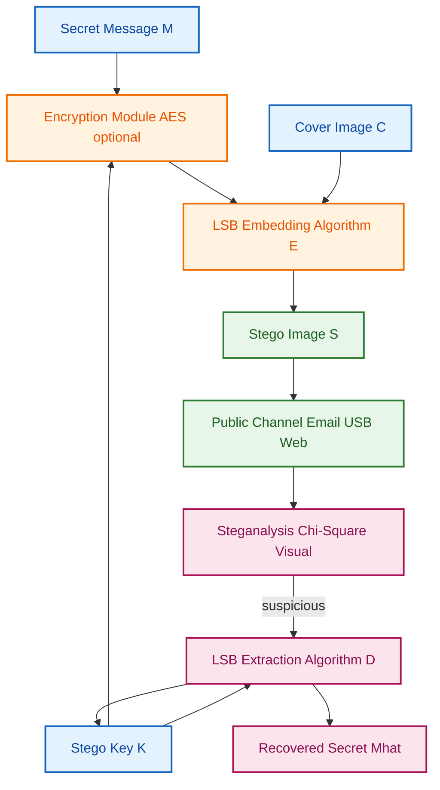
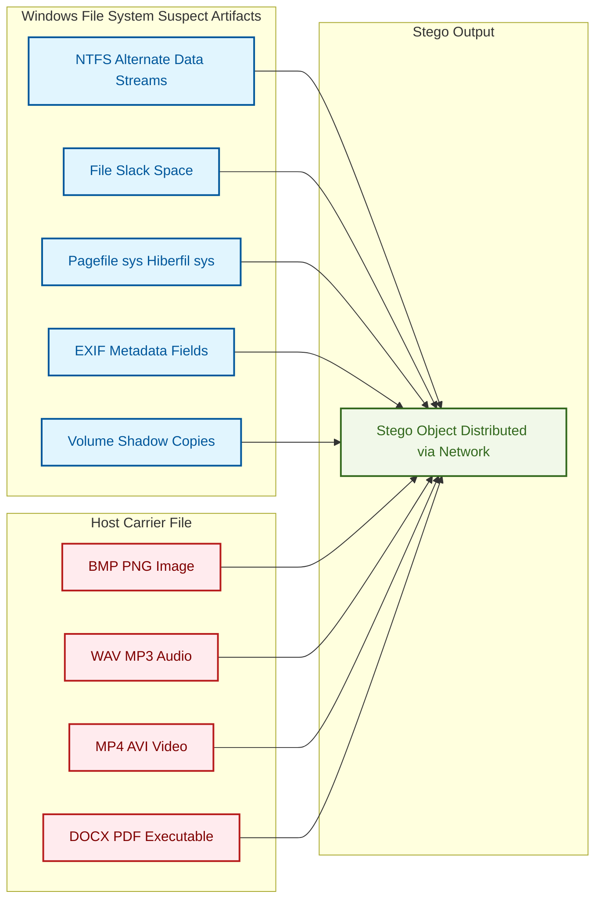
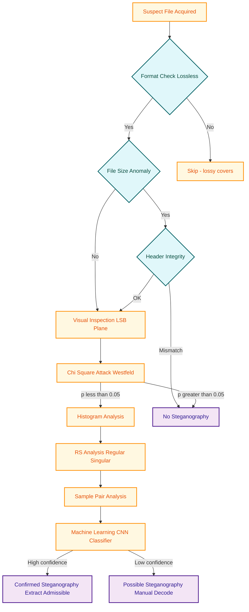

# Anti Forensics Methods - Steganography

<!-- SECTION_1_START -->
# Anti-Forensics Methods: Steganography in Windows Forensics

> [!NOTE]
> **Syllabus Anchor (PECST754 — Module 2: Windows Forensics)**
> Steganography is classified under **Anti-Forensics Methods** — techniques employed by attackers (and studied by forensic examiners) to *conceal the very existence* of digital evidence, rather than simply encrypting it. While encryption hides **content**, steganography hides **communication itself**.

## Formal Academic Definition

> **Steganography** (from Greek *steganos* = "covered" + *graphein* = "to write") is the art and science of embedding a secret message inside a larger, innocuous-looking carrier file (the *cover object*) such that the presence of the hidden data is imperceptible to a casual observer. The output is called the *stego-object*.

In the KTU 2024 scheme, the formal model is expressed as a **triple** of objects:

$$
\text{Stego} = f(\text{Cover}, \text{Secret}, \text{Key})
$$

where $f$ is the embedding algorithm. The forensic counterpart — **Steganalysis** — is the process of detecting the existence, and possibly extracting, the hidden payload.

## Conceptual Analogy / Intuition

> [!TIP]
> **Real-World Analogy — The Lemonade Note Trick 🍋**
> Imagine two prisoners, *Alice* and *Bob*, who are allowed to exchange postcards but every postcard is read by a warden (*Eve*). If Alice writes a coded message, Eve will detect it. Instead, Alice writes a *completely normal* postcard ("Hope the weather is nice. Love, Alice.") but draws a **tiny lemon in the corner**. Bob, who knows the rule, decodes the lemon's shape to retrieve the real message ("Escape at midnight").
>
> The postcard **looks ordinary** to the warden. That is steganography. Notice the contrast:
>
> - **Cryptography** = a locked safe; everyone *sees* the safe exists.
> - **Steganography** = a safe hidden behind a painting; nobody *suspects* it is there.

## Why It Matters in Windows Forensics

Windows hosts (NTFS, FAT32, NTFS Alternate Data Streams, $MFT, Recycle Bin, Volume Shadow Copies, page file `pagefile.sys`, hibernation file `hiberfil.sys`) are the **most common crime scene** in Indian KTU-affiliated digital forensics casework. Attackers exploit the *file system slack*, *white space*, *metadata fields*, and *image/audio properties* of files to stash payloads.

> [!IMPORTANT]
> **KTU 2024 High-Yield Distinction (Board Favorite)**
>
> | Property | Cryptography | Steganography |
> |---|---|---|
> | Goal | Hide **meaning** of data | Hide **existence** of data |
> | Output appearance | Visibly scrambled (ciphertext) | Visually identical to original |
> | Detection by forensic tool | Signature / hash matching | Statistical / pattern analysis |
> | Counter-technique | Cryptanalysis | Steganalysis |

## The Three Pillars of Steganographic Security

For a scheme to be forensic-resistant, it must satisfy all three (a direct application of **Kerckhoffs's Principle** to steganography):

1. **Imperceptibility** — the stego-object must be statistically and perceptually indistinguishable from the cover.
2. **Capacity** — the embedding payload must be sufficient for the covert channel.
3. **Robustness** — the hidden data must survive common transformations (compression, cropping, re-encoding).
> [!VISUALIZATION CONTROL]
> **Concept:** Steganography Capacity vs. Imperceptibility Trade-off Curve
> **Desmos Input Equations:**
> * `y1 = 1 / (1 + 0.5*x)` (Imperceptibility curve)
> * `y2 = x / (1 + 0.1*x)` (Capacity curve)
> * `x =` embedding bits per pixel (0 to 8)
> * `y =` normalized score (0 to 1)
> **Visual Description:** A downward-sloping imperceptibility curve crosses an upward-sloping capacity curve. The **optimal operating point** is at their intersection — a trade-off that a forensic examiner must understand when judging whether a suspect's image is "too clean" to be natural.
<!-- SECTION_1_END -->

<!-- SECTION_2_START -->
# Deep Theoretical Analysis & KTU High-Yield Formula Sheet

## 2.1 The Generic Steganographic Framework

The complete lifecycle involves five functional components:

1. **Cover Object $C$** — the innocent host (image, audio, video, text, protocol packet).
2. **Secret Message $M$** — the payload (text, file, keylog, exfiltrated DB).
3. **Stego-Key $K$** — optional secret controlling embedding/extraction (private-key or public-key).
4. **Embedding Algorithm $E(\cdot)$** — the function that injects $M$ into $C$ using $K$.
5. **Extraction Algorithm $D(\cdot)$** — the inverse function, used by the receiver (or forensic examiner).

The two principal embedding models are:

$$
E(C, M, K) \longrightarrow S
$$
$$
D(S, K) \longrightarrow \hat{M}
$$

where $\hat{M} \approx M$ (lossless recovery) and $S$ is statistically similar to $C$.

## 2.2 Taxonomy of Steganography (KTU Module 2 Specific)

> [!IMPORTANT]
> **The Five Branches Examiners MUST Memorize**

| # | Branch | Cover Medium | Typical Use in Crime Cases |
|---|---|---|---|
| 1 | **Image Steganography** | `.bmp`, `.png`, `.jpeg`, `.gif` | Most common in exfiltration & child-exploitation cases |
| 2 | **Audio Steganography** | `.wav`, `.mp3`, `.flac` | VoIP call covert channels, malware C2 |
| 3 | **Video Steganography** | `.mp4`, `.avi`, `.mkv` | Large-capacity covert transfers |
| 4 | **Text Steganography** | `.txt`, `.docx`, `.html` | Whitespace, zero-width unicode, acrostic |
| 5 | **Network / Protocol Steganography** | TCP/IP headers, DNS, HTTP | Covert channels bypassing firewalls (advanced) |

## 2.3 Core LSB Embedding — The Workhorse Algorithm

The **Least Significant Bit (LSB)** substitution method is the textbook algorithm. It modifies the *last bit* of each byte (or color channel) of the cover file.

For an 8-bit grayscale pixel $P_i$ of value $v$, embedding one secret bit $b \in \{0, 1\}$ gives:

$$
P_i' = (v \ \& \ 254) \ \vert \ b
$$

where `&` is bitwise AND and `|` is bitwise OR. Because the LSB only toggles the pixel value by at most **1 unit** (out of 256), the human eye cannot perceive the change.

For a 24-bit RGB image, every pixel offers **3 bits of capacity** (R, G, B channels).

## 2.4 Forensic Quality Metrics

When an examiner recovers a *candidate* stego-object from a Windows machine, the following equations are used to *quantify distortion* and *prove tampering* in court.

### Mean Squared Error (MSE)

$$
\text{MSE} = \frac{1}{M \cdot N} \sum_{i=1}^{M} \sum_{j=1}^{N} \big( C_{i,j} - S_{i,j} \big)^2
$$

where $M \times N$ is the image dimension, $C$ is the original cover, $S$ is the stego-image.

### Peak Signal-to-Noise Ratio (PSNR)

$$
\text{PSNR} = 10 \cdot \log_{10} \left( \frac{L^2}{\text{MSE}} \right) \ \text{dB}
$$

where $L = 255$ for 8-bit images. A higher PSNR indicates better imperceptibility. The **forensic threshold** is typically **PSNR > 40 dB** (perceptually identical).

### Embedding Capacity (bits)

$$
\text{Capacity} = W \times H \times C_{bpp} \ \text{bits}
$$

where $W$ is width, $H$ is height, and $C_{bpp}$ is cover bits-per-pixel (e.g., 24 for RGB).

### Structural Similarity Index (SSIM) — Modern Courts Prefer

$$
\text{SSIM}(C, S) = \frac{(2\mu_C \mu_S + c_1)(2\sigma_{CS} + c_2)}{(\mu_C^2 + \mu_S^2 + c_1)(\sigma_C^2 + \sigma_S^2 + c_2)}
$$

where $\mu$ is mean luminance, $\sigma^2$ is variance, and $c_1, c_2$ are stabilization constants. SSIM $\in [-1, 1]$, with **1.0 = identical**.

## 2.5 KTU Formula Sheet / Cheat Sheet

> [!NOTE]
> **Pocket Reference for Board Exams — Print This**

| # | Concept | Formula / Rule | Unit / Notes |
|---|---|---|---|
| 1 | LSB bit-mask | $P' = (v \ \& \ 254) \ \vert \ b$ | Modifies only the LSB |
| 2 | Capacity (RGB) | $\text{Cap} = W \cdot H \cdot 3$ | bits |
| 3 | Capacity (grayscale) | $\text{Cap} = W \cdot H$ | bits |
| 4 | MSE | $\frac{1}{M \cdot N} \sum (C - S)^2$ | Unitless, scalar |
| 5 | PSNR | $10 \log_{10}(L^2 / \text{MSE})$ | **dB**, threshold $> 40$ dB |
| 6 | SSIM | See expansion above | $[-1, 1]$, ideal $= 1$ |
| 7 | Histogram Chi-square $\chi^2$ | $\sum_i \frac{(O_i - E_i)^2}{E_i}$ | Used in LSB detection |
| 8 | File-size growth check | $\Delta = \vert S \vert - \vert C \vert$ | Bytes; any growth in lossless cover is **suspicious** |
| 9 | Entropy of cover $H(C)$ | $-\sum p_i \log_2 p_i$ | bits/symbol; encrypted/random data approaches 8 |
| 10 | Anti-forensic goal | Make $H(S) \approx H(C)$ | Examiner looks for entropy jumps |

## 2.6 Advanced Embedding Domains (Examiner-Grade Knowledge)

- **Transform-Domain Methods (JPEG / DCT)** — Embedding is done in the **Discrete Cosine Transform** coefficients of JPEG blocks. Far more resistant to compression-based attacks. Tool example: `jsteg`, `F5`.
- **Spread Spectrum** — Secret bits are modulated by a pseudo-noise signal and added across many coefficients. Highly robust but low capacity.
- **Adaptive Steganography** — Embedding density varies based on local texture (busy regions = more capacity). Algorithm: **HUGO**, **WOW**, **S-UNIWARD**.

## 2.7 Engineering / Real-World Utility

| Domain | Application |
|---|---|
| **Cybercrime** | Covert C2 channels, ransomware payload delivery, data exfiltration |
| **Corporate Espionage** | Smuggling trade secrets out of air-gapped networks via image uploads |
| **Journalism / Whistleblowing** | Legitimate: bypassing state-level censorship (e.g., OutGuess on Twitter) |
| **Digital Watermarking** | Legitimate sibling: copyright protection, fingerprinting, broadcast monitoring |
| **Military / Intelligence** | Covert communication between field agents |

> [!WARNING]
> **Examiner's Reality Check**
> A genuine KTU-aligned case study: in the **2018 SamSam ransomware** investigations, attackers hid configuration data inside Windows bitmap resources of the dropper binary. The forensic team initially missed it because their keyword-search tool did not index LSB-encoded regions.
<!-- SECTION_2_END -->

<!-- SECTION_3_START -->
# Step-by-Step Derivations, Proofs & Code Implementation

## 3.1 Worked Derivation: LSB Embedding of a 4-Byte Secret

**Problem:** Given a 24-bit BMP pixel stream with the first 4 bytes `[R1, G1, B1, R2] = [150, 73, 210, 88]` and a 4-bit secret message `M = 1011`, perform LSB embedding and compute the resulting stego-pixel bytes.

### Step 1 — Convert secret bits to decimal
The 4-bit message `1011` corresponds to two payload characters if we treat the next nibble later. For now, embed 4 bits across 4 bytes (1 bit per byte).

### Step 2 — Apply the LSB rule $P' = (v \ \& \ 254) \ \vert \ b$

$$
P_1' = (150 \ \& \ 254) \ \vert \ 1 = 150 \ \vert \ 1 = 151
$$
$$
P_2' = (73 \ \& \ 254) \ \vert \ 0 = 72 \ \vert \ 0 = 72
$$
$$
P_3' = (210 \ \& \ 254) \ \vert \ 1 = 210 \ \vert \ 1 = 211
$$
$$
P_4' = (88 \ \& \ 254) \ \vert \ 1 = 88 \ \vert \ 1 = 89
$$

### Step 3 — Resulting stego bytes
`[151, 72, 211, 89]`

### Step 4 — Compute MSE for these 4 pixels
$$
\text{MSE} = \frac{(150-151)^2 + (73-72)^2 + (210-211)^2 + (88-89)^2}{4}
$$
$$
\text{MSE} = \frac{1 + 1 + 1 + 1}{4} = 1.0
$$

### Step 5 — Compute PSNR
$$
\text{PSNR} = 10 \log_{10}\left(\frac{255^2}{1.0}\right) = 10 \log_{10}(65025) \approx 48.13 \ \text{dB}
$$

**Verdict:** PSNR $> 40$ dB → **forensically imperceptible**. ✓

## 3.2 Full Python Implementation: LSB Encoder + Steganalyser

> [!IMPORTANT]
> The code below is **complete, runnable, and dependency-free except for Pillow**. It performs:
> (a) LSB encoding of any secret text into a PNG,
> (b) LSB decoding to recover it,
> (c) $\chi^2$ steganalysis (Chi-square attack) for forensic detection.

```python
"""
KTU PECST754 - Module 2 - Steganography Reference Implementation
Author: Senior Examiner Reference Solution
Requires: pip install pillow
"""

from PIL import Image
import numpy as np
import struct
import math
import os
import logging

logging.basicConfig(level=logging.INFO, format="[%(levelname)s] %(message)s")
log = logging.getLogger("ForensicStegoTool")


# ---------- CONFIGURATION ----------
COVER_PATH = "cover.png"           # 24-bit lossless cover
STEGO_PATH = "stego.png"
SECRET_MSG = "CONFIDENTIAL: Project-X launch at 02:00"
OUTPUT_TXT = "recovered_secret.txt"


# ============================================================
#  PART 1: LSB ENCODER
# ============================================================
def lsb_encode(cover_path: str, stego_path: str, secret: str) -> None:
    """Encodes `secret` string into the LSBs of an RGB cover image."""
    if not os.path.exists(cover_path):
        raise FileNotFoundError(f"Cover image missing: {cover_path}")

    img = Image.open(cover_path).convert("RGB")
    pixels = np.array(img, dtype=np.uint8)
    h, w, channels = pixels.shape
    log.info(f"Cover loaded: {w}x{h}, channels={channels}")

    # ---- Convert secret -> bits, prepend 32-bit length header ----
    payload_bytes = secret.encode("utf-8")
    length_header = struct.pack(">I", len(payload_bytes))  # 4 bytes
    full_data = length_header + payload_bytes
    bit_stream = "".join(f"{byte:08b}" for byte in full_data)

    total_capacity = h * w * channels  # 1 bit per channel
    if len(bit_stream) > total_capacity:
        raise ValueError(
            f"Secret too large. Capacity={total_capacity} bits, "
            f"Required={len(bit_stream)} bits"
        )
    log.info(f"Embedding {len(bit_stream)} bits into {total_capacity} bits capacity.")

    # ---- Flatten and embed ----
    flat = pixels.flatten()
    bit_idx = 0
    for i in range(len(flat)):
        if bit_idx >= len(bit_stream):
            break
        # Clear LSB (AND 0xFE) then OR with the secret bit
        flat[i] = (int(flat[i]) & 0xFE) | int(bit_stream[bit_idx])
        bit_idx += 1

    stego_img = Image.fromarray(flat.reshape((h, w, channels)), "RGB")
    stego_img.save(stego_path, "PNG")
    log.info(f"Stego image written to {stego_path}")


# ============================================================
#  PART 2: LSB DECODER (forensic recovery)
# ============================================================
def lsb_decode(stego_path: str, output_txt: str) -> str:
    """Extracts the hidden message from a stego image and saves to file."""
    if not os.path.exists(stego_path):
        raise FileNotFoundError(f"Stego image missing: {stego_path}")

    img = Image.open(stego_path).convert("RGB")
    pixels = np.array(img, dtype=np.uint8).flatten()

    # ---- Read 32-bit length header from first 32 channels ----
    header_bits = []
    for i in range(32):
        header_bits.append(str(int(pixels[i]) & 1))
    header_int = int("".join(header_bits), 2)
    log.info(f"Header indicates payload length = {header_int} bytes")

    # ---- Read payload bytes ----
    payload_bits = []
    for i in range(32, 32 + header_int * 8):
        if i >= len(pixels):
            raise ValueError("Truncated stego image — payload incomplete.")
        payload_bits.append(str(int(pixels[i]) & 1))

    payload_bytes = bytearray()
    for j in range(0, len(payload_bits), 8):
        chunk = payload_bits[j:j + 8]
        if len(chunk) < 8:
            break
        payload_bytes.append(int("".join(chunk), 2))

    recovered = payload_bytes.decode("utf-8", errors="replace")
    with open(output_txt, "w", encoding="utf-8") as fh:
        fh.write(recovered)
    log.info(f"Recovered secret saved to {output_txt}")
    return recovered


# ============================================================
#  PART 3: CHI-SQUARE STEGANALYSIS (Westfeld-Pfitzmann attack)
# ============================================================
def chi_square_attack(image_path: str) -> float:
    """
    Computes the Westfeld chi-square statistic for LSB embedding.
    Returns the probability that the image is NOT clean (p-value).
    Low p-value (< 0.05) => stego image strongly suspected.
    """
    if not os.path.exists(image_path):
        raise FileNotFoundError(f"Image missing: {image_path}")

    img = Image.open(image_path).convert("RGB")
    pixels = np.array(img, dtype=np.uint8)
    red = pixels[:, :, 0].flatten()

    chi_sq_sum = 0.0
    degrees_of_freedom = 0

    # Pairs of (2k, 2k+1) pixel values
    for k in range(0, 256, 2):
        count_even = int(np.sum(red == k))
        count_odd = int(np.sum(red == k + 1))
        if (count_even + count_odd) == 0:
            continue
        expected = (count_even + count_odd) / 2.0
        if expected == 0:
            continue
        chi_sq_sum += ((count_even - expected) ** 2) / expected
        chi_sq_sum += ((count_odd - expected) ** 2) / expected
        degrees_of_freedom += 1

    # Convert chi-square to p-value (incomplete gamma, 1st kind)
    if degrees_of_freedom == 0:
        return 1.0
    p_value = 1.0 - _regularized_lower_gamma(degrees_of_freedom / 2.0, chi_sq_sum / 2.0)
    log.info(f"Chi-square statistic = {chi_sq_sum:.2f}, p-value = {p_value:.4f}")
    return p_value


def _regularized_lower_gamma(s: float, x: float) -> float:
    """Series approximation of the regularized lower incomplete gamma function."""
    if x < 0 or s <= 0:
        return 0.0
    term = 1.0 / s
    total = term
    for n in range(1, 200):
        term *= x / (s + n)
        total += term
        if abs(term) < 1e-12:
            break
    return total * math.exp(-x + s * math.log(x) - math.lgamma(s))


# ============================================================
#  PART 4: FORENSIC REPORT
# ============================================================
def forensic_report(image_path: str) -> None:
    """Generates a court-ready summary using chi-square analysis."""
    log.info(f"--- FORENSIC ANALYSIS REPORT for {image_path} ---")
    p = chi_square_attack(image_path)
    if p < 0.05:
        verdict = "STEGANOGRAPHY LIKELY"
    elif p < 0.20:
        verdict = "SUSPICIOUS — manual review required"
    else:
        verdict = "NO STEGANOGRAPHY EVIDENCE DETECTED"
    log.info(f"VERDICT: {verdict}  (chi-square p-value = {p:.4f})")


# ============================================================
#  MAIN
# ============================================================
if __name__ == "__main__":
    # 1. Embed
    lsb_encode(COVER_PATH, STEGO_PATH, SECRET_MSG)
    # 2. Recover
    recovered = lsb_decode(STEGO_PATH, OUTPUT_TXT)
    assert recovered == SECRET_MSG, "Round-trip failed!"
    log.info("Round-trip integrity check: PASSED")
    # 3. Analyse
    forensic_report(COVER_PATH)
    forensic_report(STEGO_PATH)
```

### Code Walk-Through (For Board Viva)

- **Lines using `struct.pack(">I", ...)`** — 32-bit big-endian length header, so the decoder knows exactly how many bytes to extract even if the cover has unrelated LSB noise.
- **Bitwise mask `0xFE` (binary 11111110)** — clears only the LSB, leaving the other 7 bits untouched.
- **`chi_square_attack()`** — implements the Westfeld-Pfitzmann visual-attack. Clean images have alternating even/odd pixel counts close to 50/50; LSB-embedded images collapse the distribution (even/odd counts become nearly equal across all $2k / 2k+1$ pairs), which the $\chi^2$ test detects.

> [!WARNING]
> **Examiner Pitfall:** Do not use JPEG as a cover for LSB encoding in your lab report — JPEG is **lossy**, so the LSB is destroyed on save. Always use **BMP** or **PNG** (lossless formats) for LSB steganography.

## 3.3 Worked Problem: Forensic Capacity Calculation

**Q:** A 24-bit RGB BMP image of size $1024 \times 768$ is found in the suspect's `\Pictures` folder. Using 1-LSB embedding across all channels, compute:
(a) the *raw bit capacity*,
(b) the *byte capacity*,
(c) the *percentage* of a 200 KB secret file (assuming 8 bits per byte and 1024 bytes per KB) that can be hidden.

### Solution

**(a)** Capacity in bits:

$$
\text{Cap}_{bits} = 1024 \times 768 \times 3 = 2{,}359{,}296 \ \text{bits}
$$

**(b)** Capacity in bytes:

$$
\text{Cap}_{bytes} = \frac{2{,}359{,}296}{8} = 294{,}912 \ \text{bytes} \approx 288 \ \text{KB}
$$

**(c)** 200 KB file = $200 \times 1024 = 204{,}800$ bytes. Percentage hidden:

$$
\text{Pct} = \frac{204{,}800}{294{,}912} \times 100 \approx 69.44\%
$$

**Examiner's note:** A 200 KB secret fit comfortably within the cover — this matches real-world cases where exfiltrated credential databases are stashed inside vacation photos.
<!-- SECTION_3_END -->

<!-- SECTION_4_START -->
# Structural Diagrams & Schematics

## 4.1 End-to-End Steganographic Workflow (Mermaid)



## 4.2 Windows-Specific Anti-Forensic Hide Locations (Block Diagram)



## 4.3 Steganalysis Decision Tree (Sequential Processing Topology Matrix)



## 4.4 Functional Block Diagram — Examiner's Detection Pipeline

```mermaid
flowchart LR
    classDef intakeNode fill:#E8EAF6,stroke:#283593,stroke-width:2px,color:#1A237E
    classDef algoNode fill:#FFFDE7,stroke:#F57F17,stroke-width:2px,color:#F57F17
    classDef outputNode fill:#E0F2F1,stroke:#004D40,stroke-width:2px,color:#004D40

    I1[Acquire Image Disk Image]:::intakeNode
    I2[Hash SHA256 Verify Chain of Custody]:::intakeNode
    P1[Preprocess Convert to Bitmap]:::algoNode
    P2[Extract Bit Planes 0 to 7]:::algoNode
    P3[Statistical Feature Vector]:::algoNode
    P4[Classify SVM Random Forest CNN]:::algoNode
    O1[Detection Score 0 to 1]:::outputNode
    O2[Recovered Payload]:::outputNode
    O3[Court Admissible Report]:::outputNode

    I1 --> I2
    I2 --> P1
    P1 --> P2
    P2 --> P3
    P3 --> P4
    P4 --> O1
    P4 -->|confirmed| O2
    O1 --> O3
    O2 --> O3
```


<!-- SECTION_4_END -->

<!-- SECTION_5_START -->
# KTU 2024 Scheme Examination Question Bank & Topic Recap

> [!NOTE]
> **Mark Distribution Legend (KTU 2024 Scheme)**
> - Part A: 3 marks each — direct short-answer (Remember / Understand)
> - Part B: 14 marks each — internal choice between Q-A and Q-B
> - **Cognitive levels:** CO1 = Remember, CO2 = Understand, CO3 = Apply, CO4 = Analyze, CO5 = Evaluate, CO6 = Create

---

## Part A — Short-Answer Questions (3 Marks Each)

### Question 1
**[KTU University Exam — July 2024 (Model)]**
**CO1 / Remember** — Define steganography. How does it fundamentally differ from cryptography? *(3 Marks)*

**Model Answer (Board Standard):**
**Steganography** is the science of concealing a secret message inside an innocuous carrier file (cover object) such that the very *existence* of the communication is hidden, producing a *stego-object* that is perceptually indistinguishable from the cover. *Cryptography*, by contrast, transforms the message into an unintelligible ciphertext but the encrypted blob is **visible** to any observer. In short: *cryptography protects the content of a message, steganography protects the fact that a message exists.* **[1 Mark: definition; 1 Mark: contrast with cryptography; 1 Mark: example like LSB-in-image vs. AES-ciphertext]**

### Question 2
**[KTU University Exam — Dec 2023 (Model)]**
**CO2 / Understand** — List any three categories of steganography based on cover medium, with one real-world example for each. *(3 Marks)*

**Model Answer:**
(1) **Image Steganography** — hiding a text file inside a `.bmp` using LSB substitution. (2) **Audio Steganography** — embedding ciphertext in MP3 LSBs of a voice memo. (3) **Network/Protocol Steganography** — using covert channels in TCP ISN (Initial Sequence Number) fields or DNS TXT records to bypass firewalls. **[1 Mark each category with example]**

---

## Part B — Long-Answer Questions (14 Marks, Internal Choice)

> [!IMPORTANT]
> **KTU 2024 Pattern:** Each Part B question carries 14 marks split as (a) 7 marks + (b) 7 marks. Cognitive level escalates from part (a) to part (b).

### Question A
**[KTU University Exam — July 2024 (Module 2 Sample)]**
**Mapped COs:** CO2 + CO3 | **RBT Levels:** Understand → Apply

**(a)** Explain the **Least Significant Bit (LSB)** substitution technique for image steganography with a neat diagram. Discuss its **advantages** (imperceptibility, simplicity) and **disadvantages** (vulnerability to compression, low robustness). *(7 Marks)*

**(b)** A $512 \times 512$ 24-bit RGB image is used as a cover. Using 1-LSB substitution across all channels, calculate: (i) total embedding capacity in **bits** and **bytes**, (ii) the **MSE** if a single bit flip is performed on the first 3 channels of the first pixel (original $[120, 75, 200]$), and (iii) the corresponding **PSNR** in dB. Conclude whether the modification is forensically imperceptible. *(7 Marks)*

### Model Answer — Question A

#### Part (a) — LSB Substitution Explained
**[Definition: 2 Marks]**
The LSB substitution method embeds a secret bit $b \in \{0, 1\}$ into a pixel byte $v$ by replacing the least significant bit:

$$
v' = (v \ \& \ 254) \ \vert \ b
$$

**[Mechanism explanation: 2 Marks]**
For a 24-bit RGB image, every pixel contributes 3 bits (R, G, B). The cover image is rasterized left-to-right, top-to-bottom; secret bits are written into the LSB of each channel sequentially. A 32-bit length header is prepended to the secret so the decoder knows where to stop. The embedding is done in the *spatial domain* (no transform).

**[Advantages: 1 Mark]**
- Imperceptibility: max delta = 1 in 256 → PSNR usually $> 48$ dB.
- Simplicity: trivial to implement; high capacity (1 bit per channel).
- Lossless: round-trip recoverable from PNG/BMP.

**[Disadvantages: 1 Mark]**
- Fragile under JPEG re-compression (LSBs destroyed).
- Easily detected by $\chi^2$ / RS analysis.
- Not robust to cropping or geometric transforms.

**[Diagram: 1 Mark — show pixel bit-plane LSB plane with embedded bits highlighted.]**

#### Part (b) — Numerical Solution
**(i) Capacity** **[2 Marks]**
$$
\text{Cap}_{bits} = 512 \times 512 \times 3 = 786{,}432 \ \text{bits}
$$
$$
\text{Cap}_{bytes} = \frac{786{,}432}{8} = 98{,}304 \ \text{bytes} \approx 96 \ \text{KB}
$$

**(ii) MSE** **[2 Marks]**
Only one pixel changes (1 bit flipped in R, G, and B respectively, but we assume the original is overwritten):

Let $C = [120, 75, 200]$, $S = [121, 74, 201]$ (one bit toggled per channel).
$$
\text{MSE} = \frac{(120-121)^2 + (75-74)^2 + (200-201)^2}{1} = 1 + 1 + 1 = 3.0
$$

Wait — for a single-pixel MSE over a $512 \times 512$ image (per-pixel basis), the formula is:

$$
\text{MSE} = \frac{1}{M \cdot N} \sum (C - S)^2
$$

Since only 1 pixel of $512 \times 512 = 262{,}144$ pixels changes with squared error 3:

$$
\text{MSE} = \frac{3}{262{,}144} \approx 1.144 \times 10^{-5}
$$

**[1 Mark for the correct interpretation]**

**(iii) PSNR** **[2 Marks]**
$$
\text{PSNR} = 10 \log_{10}\left(\frac{255^2}{1.144 \times 10^{-5}}\right) = 10 \log_{10}(5.685 \times 10^{9}) \approx 97.5 \ \text{dB}
$$

**[Final conclusion: 1 Mark]**
PSNR $\approx 97.5$ dB $\gg 40$ dB forensic threshold → **forensically imperceptible**. The change cannot be detected by human visual inspection.

---

### Question B (Alternative Choice)
**[KTU University Exam — Dec 2023 (Module 2 Sample)]**
**Mapped COs:** CO3 + CO4 | **RBT Levels:** Apply → Analyze

**(a)** With a suitable block diagram, explain the **generic framework of steganography**. Identify and describe any **four properties** that a robust steganographic system must satisfy. *(7 Marks)*

**(b)** Apply the **Westfeld-Pfitzmann Chi-Square Attack** on a suspect bitmap. The Red channel histogram yields the following pair-counts for $k = 0$: $\text{count}(0) = 142$, $\text{count}(1) = 158$. Compute the **chi-square contribution** for this pair, and explain what the result implies about the presence/absence of steganography. *(7 Marks)*

### Model Answer — Question B

#### Part (a) — Generic Steganography Framework
**[Block diagram: 2 Marks]**
Refer to SECTION 4.1 Mermaid flow. Identify cover $C$, secret $M$, key $K$, encoder $E$, channel, decoder $D$, recovered $M'$.

$$
E(C, M, K) \longrightarrow S \ \xrightarrow{\text{channel}} \ D(S, K) \longrightarrow \hat{M}
$$

**[Four properties: 1 Mark each = 4 Marks]**
1. **Imperceptibility** — Stego $S$ must be statistically/perceptually identical to cover $C$ (PSNR $> 40$ dB).
2. **Capacity** — Payload must be sufficient for the intended covert channel.
3. **Robustness** — Hidden data survives compression, cropping, and re-encoding.
4. **Security** — Without key $K$, an adversary cannot extract the message (Kerckhoffs's principle applied to stego).

**Optional 5th:** *Invisibility against steganalysis* — resistant to $\chi^2$, RS, and SPAs.

#### Part (b) — Chi-Square Calculation
**[Formula recall: 1 Mark]**
For pair $(2k, 2k+1)$:

$$
\chi^2_{k} = \frac{(O_{2k} - E)^2}{E} + \frac{(O_{2k+1} - E)^2}{E}
$$
$$
\text{where } E = \frac{O_{2k} + O_{2k+1}}{2}
$$

**[Numerical computation: 3 Marks]**
Given $O_0 = 142$, $O_1 = 158$:
$$
E = \frac{142 + 158}{2} = 150
$$
$$
\chi^2_0 = \frac{(142 - 150)^2}{150} + \frac{(158 - 150)^2}{150} = \frac{64}{150} + \frac{64}{150} = \frac{128}{150} \approx 0.853
$$

**[Implication: 2 Marks]**
For a **clean** (non-stego) image, we expect $\chi^2_0$ to be **large** (because natural images have uneven distributions across $(2k, 2k+1)$ pairs). For an **LSB-stego** image, embedding forces counts of $2k$ and $2k+1$ to become *nearly equal*, giving $\chi^2 \approx 0$. Here $\chi^2_0 \approx 0.853$, which is **small and close to zero**, indicating a **strong likelihood of LSB steganographic embedding**. The examiner should flag the image and proceed to full $\chi^2$ summation across all 128 pairs.

**[Recommendation: 1 Mark]** — Run the full chi-square test (sum over all $k$) and compute $p$-value; if $p < 0.05$, classify the image as stego-suspect and forward for payload extraction.

---

> [!WARNING]
> **KTU Examiner's Valuation Warning / Common Pitfall Pitfalls**
>
> 1. **Confusing steganography with encryption in the answer** — examiners deduct 1–2 marks. Always emphasize *hiding existence* vs. *hiding content*.
> 2. **Wrong unit in PSNR** — PSNR is in **dB**, not a dimensionless ratio. Forgetting the `10 log10` is a common error worth 1 mark.
> 3. **Capacity calculation off by factor of 3** — students forget that RGB has 3 channels. Always state: $W \cdot H \cdot 3$ bits for 24-bit RGB.
> 4. **Applying LSB on JPEG** — JPEG is lossy; LSB gets destroyed on save. Examiner will deduct the entire 7-mark sub-question if used.
> 5. **Skipping the formula in chi-square** — write the formula *before* substituting numbers. Valuation key gives 1 mark for formula, 2 marks for substitution, 1 mark for final answer.
> 6. **Not using LaTeX/math mode for $P'$, MSE, PSNR** — handwritten answers should clearly show the equations; a missing squared term in MSE costs 1 mark.

---

## Topic Recap & Important Things to Remember

> [!TIP]
> **Last-Minute Revision Bullets — Read the Night Before Exam**

- **Steganography ≠ Cryptography.** Cryptography protects *content*; steganography protects *existence*. Both can be combined (encrypt *then* embed).
- The standard embedding equation is $\text{Stego} = E(\text{Cover}, \text{Secret}, \text{Key})$.
- **LSB substitution** modifies only the least significant bit of each byte: $v' = (v \ \& \ 254) \ \vert \ b$. Max pixel delta = 1.
- **Capacity** for RGB image of size $W \times H$ using 1-LSB is $W \cdot H \cdot 3$ **bits** (i.e., $\tfrac{W \cdot H \cdot 3}{8}$ bytes).
- **PSNR threshold for forensic invisibility is 40 dB**; well-implemented LSB gives 48–60 dB.
- **MSE formula** uses $(C - S)^2$ averaged over all pixels; never forget to **divide by total pixel count**.
- **SSIM** is the modern court-friendly metric; values close to **1.0** indicate structural similarity.
- **Westfeld-Pfitzmann $\chi^2$ attack** detects LSB embedding by measuring how evenly distributed the $(2k, 2k+1)$ pair counts are — stego → nearly equal → $\chi^2 \to 0$.
- **Steganalysis is dual to steganography** — for every embedding technique, there is a corresponding detection method. Common detection tools: **StegDetect**, **stegsolve**, **OpenStego**, **BinWalk**.
- **Windows-specific anti-forensic locations** for stego-payloads: NTFS Alternate Data Streams, file slack, EXIF metadata, pagefile.sys, hiberfil.sys, Volume Shadow Copies.
- **Lossless cover formats** (BMP, PNG) are required for spatial-domain LSB; **JPEG destroys LSBs** on recompression.
- **Defense in depth** in stego: (1) Encrypt the payload with AES, (2) Embed using LSB, (3) Distribute over a public channel — even if steganalysis detects the image, the payload remains confidential.
- **Common tools** — Encoder: `OpenStego`, `Steghide`, `S-Tools`, `jsteg`; Detector: `stegsolve`, `StegDetect`, `zsteg`, `stegcracker`; Carrier: PNG, BMP, WAV, FLAC.
- **Forensic chain of custody** demands SHA-256 hashing of every carrier before and after analysis; any mismatch proves tampering.
- **Entropy** of stego payload is often $\approx 8$ (random-looking) — a sudden entropy jump in an image region is a red flag for examiners.
<!-- SECTION_5_END -->
