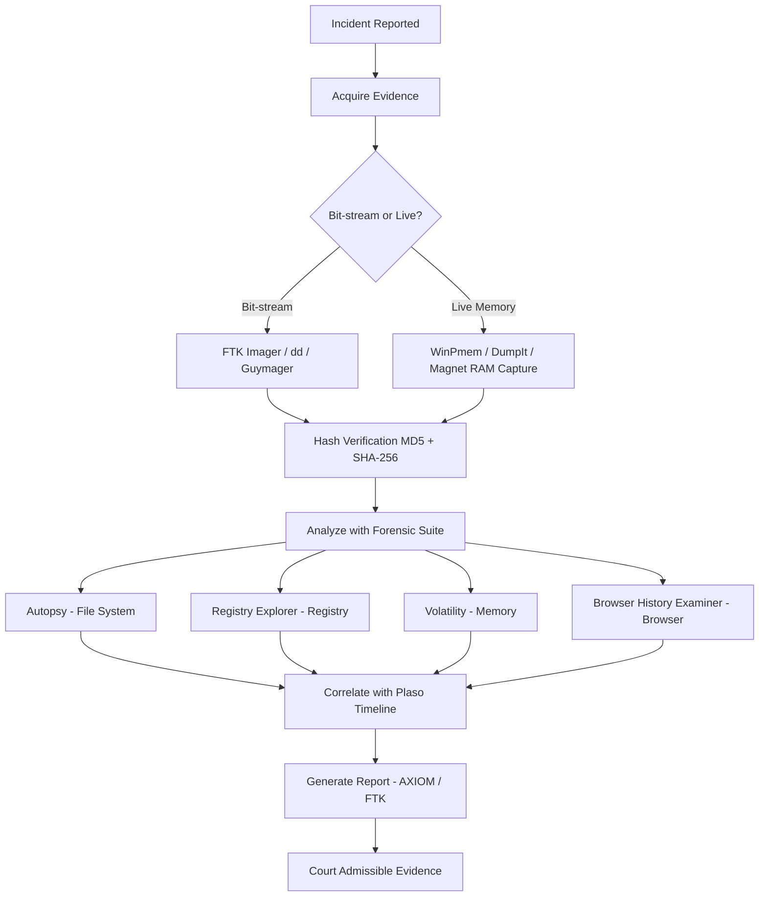
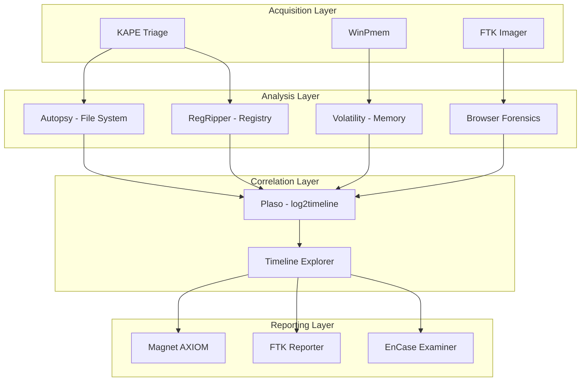
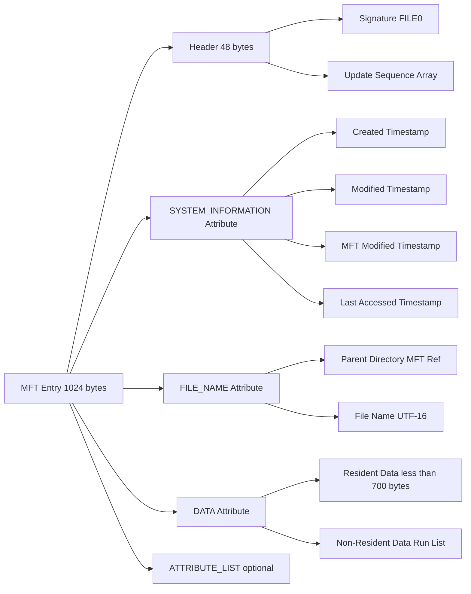
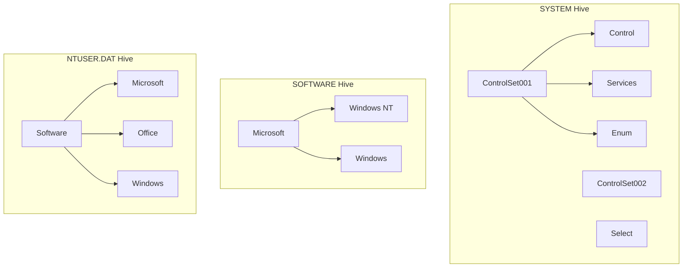
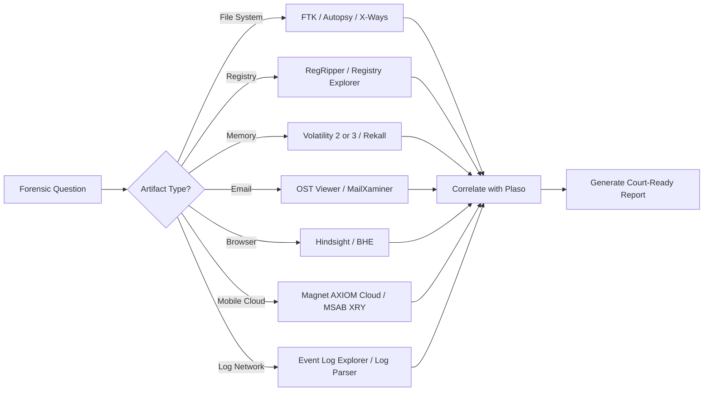

# Applications

<!-- SECTION_1_START -->
# Windows Forensics: Applications — Core Technical Definition & Intuitive Overview

## 1.1 Formal Academic Definition (KTU 2024 Syllabus Terminology)

**Windows Forensics Applications** constitute a specialized class of investigative software utilities, frameworks, and analytical tools designed to acquire, preserve, analyze, and report digital evidence residing within or originating from Microsoft Windows operating system environments. Under the **PECST754 – Digital Forensics** syllabus (KTU 2024 NEP Scheme), the term "Applications" refers to the practical software stack deployed during a forensic investigation to examine Windows artifacts such as the **NTFS file system**, the **Windows Registry**, **Event Logs**, **Recycle Bin**, **Prefetch files**, **LNK files**, **Volume Shadow Copies**, **Memory dumps**, and user activity traces (browser, email, USB).

> [!IMPORTANT]
> **KTU 2024 Module 2 Definition:**
> *Windows Forensics Applications are categorized, forensically-sound software utilities used to extract, decode, and correlate evidentiary data from Windows-based digital media in a manner that maintains the Chain of Custody, preserves data integrity (verified through cryptographic hashing), and produces court-admissible findings.*

## 1.2 The Four Forensic Application Pillars (Conceptual Overview)

A KTU examiner visualizes Windows Forensics Applications as a **four-pillar investigative architecture**:

| Pillar | Investigative Goal | Example Tool Class |
|---|---|---|
| **Acquisition** | Bit-stream imaging, live memory capture | FTK Imager, WinPmem, DumpIt |
| **Analysis** | Artifact decoding, registry parsing | Autopsy, Registry Explorer, X-Ways |
| **Correlation** | Timeline reconstruction, log fusion | Plaso / log2timeline, KAPE |
| **Reporting** | Hashing, chain of custody, documentation | Magnet AXIOM, FTK, EnCase |

> [!NOTE]
> **Why this architecture matters:** In a real-world breach investigation (e.g., a Kerala-based bank incident), the forensic analyst cannot rely on a single tool. Each pillar demands distinct applications, and the **integrity of evidence** must be preserved across all four — this is the *forensically-sound workflow*.

## 1.3 Intuitive Analogy — The Crime Scene Investigator Toolkit

Imagine a forensic investigator arriving at a physical crime scene. They carry:

- **Gloves & evidence bags** (Acquisition tools → FTK Imager) — to collect without contamination.
- **Magnifying glass & fingerprint kit** (Analysis tools → Registry Explorer) — to extract hidden clues.
- **String & timeline board** (Correlation tools → Plaso) — to connect the dots in time.
- **Camera & case-file software** (Reporting tools → AXIOM) — to document findings for court.

> **Each Windows Forensics Application plays exactly one of these four roles. Mismatching them (e.g., opening a file with a non-forensic editor) breaks the chain of custody and renders evidence inadmissible.**

## 1.4 The "Windows Forensics Application" Landscape — Broad Categorization

```
Windows Forensics Applications
        │
        ├── Disk & File System Forensic Suites
        │       (FTK, EnCase, X-Ways, Autopsy)
        │
        ├── Registry Forensic Tools
        │       (RegRipper, Registry Explorer, Zimmerman's tools)
        │
        ├── Memory Forensics Frameworks
        │       (Volatility 2/3, Rekall, MemProcFS)
        │
        ├── Email Forensics Utilities
        │       (OST/PST viewers, MailXaminer, Aid4Mail)
        │
        ├── Browser Forensics Tools
        │       (Hindsight, Browser History Examiner, BHE)
        │
        ├── Network & Log Forensics Applications
        │       (Event Log Explorer, Log Parser, KAPE)
        │
        ├── Mobile & Cloud Forensics (Windows-Hosted)
        │       (Magnet AXIOM Cloud, MSAB XRY)
        │
        └── Anti-Forensics Detection & Steganalysis
                (ExifTool, StegDetect, HashMyFiles)
```

> [!VISUALIZATION CONTROL]
> **Concept:** Hierarchical taxonomy of Windows Forensics Applications
> **GeoGebra / Desmos Input Equations (Tree Visualization as Probability Mass):**
> * `P(Application) = P(Acquisition) + P(Analysis) + P(Correlation) + P(Reporting) = 1.0`
> **Visual Description:** Draw a unit square on the coordinate axes divided into four quadrants representing the four forensic application pillars, where the area of each quadrant is proportional to the number of tools belonging to that category.

<!-- SECTION_1_END -->

<!-- SECTION_2_START -->
# Deep Theoretical Analysis & KTU High-Yield Formula Sheet

## 2.1 Theoretical Foundation — The Forensically Sound Workflow

A Windows Forensics Application must obey three mathematical and procedural invariants before its output can be accepted in a KTU lab examination or a court of law:

1. **The Hash Invariant** — the cryptographic digest of the source and the working copy must be identical at every observation point.
2. **The Write-Blocker Invariant** — no byte of the source evidence may be altered by the application.
3. **The Reproducibility Invariant** — independent analysts using the same application on the same image must reach the same conclusion.

> [!IMPORTANT]
> **KTU 2024 Board Insight:** Examiners frequently award marks in **Part B (14-mark) questions** for explicitly stating these three invariants before describing a tool's function. A student who skips them loses 2–3 easy marks.

## 2.2 The Forensic Hashing Equation (MD5 / SHA-1 / SHA-256)

When a Windows forensic application acquires an image, it computes a cryptographic hash. The standard formulation used in KTU papers is:

$$
H_{\text{image}} = \mathcal{H}(\text{Bytes}_0 \parallel \text{Bytes}_1 \parallel \text{Bytes}_2 \parallel \cdots \parallel \text{Bytes}_{n-1})
$$

Where:
- $\mathcal{H}$ is the hash function (e.g., **MD5**, **SHA-1**, **SHA-256**)
- $\parallel$ denotes byte-stream concatenation
- $H_{\text{image}}$ is the fixed-length digest (128 bits for MD5, 160 for SHA-1, 256 for SHA-256)

The **integrity-check equation** at verification time is:

$$
H_{\text{source}} \;\stackrel{?}{=}\; H_{\text{working}}
$$

If the equation holds, the forensic application has not altered the evidence.

> **Real-World Utility:** Banks in India (RBI Cyber Security Framework 2024) mandate SHA-256 hashing of all forensic images before submission to CERT-In. A mismatched hash invalidates the entire investigative report.

## 2.3 The NTFS $MFT Entry Analysis (Master File Table)

Windows Forensics Applications parse the **$MFT** to reconstruct file activity. Each $MFT entry is **1024 bytes** (in standard NTFS) and is indexed by an **MFT Entry Number**. The relationship between logical file size and cluster layout is:

$$
S_{\text{file}} = N_{\text{clusters}} \times S_{\text{cluster}}
$$

Where:
- $S_{\text{file}}$ is the file's logical size in bytes
- $N_{\text{clusters}}$ is the number of clusters allocated to the file
- $S_{\text{cluster}}$ is the cluster size (typically **4096 bytes** = 4 KiB)

> **KTU Insight:** The cluster size is computed as $S_{\text{cluster}} = B_{\text{sector}} \times S_{\text{per\_cluster}}$, where $B_{\text{sector}} = 512$ bytes and $S_{\text{per\_cluster}}$ is read from the **$Boot** sector (bytes 0x0D offset, 1 byte).

The **NTFS Timestamp (FILETIME)** equation converts a 64-bit value to a human-readable date:

$$
T_{\text{UTC}} = \frac{V_{\text{FILETIME}} - 116\,444\,736\,000\,000\,000}{10\,000\,000}
$$

Where $V_{\text{FILETIME}}$ is the 64-bit integer from the $MFT entry's $STANDARD_INFORMATION attribute.

## 2.4 The Registry Hive Forensic Equation

A Windows Registry hive (e.g., `SYSTEM`, `SOFTWARE`, `NTUSER.DAT`, `SECURITY`) is structured as a **binary tree of key-cells** and **value-cells**. Forensic applications like **RegRipper** walk the tree using depth-first traversal. The number of nodes visited is:

$$
N_{\text{visited}} = N_{\text{keys}} + N_{\text{values}}
$$

The hive header occupies the **first 4096 bytes** (`hk = 0x66676572` magic for `regf`).

## 2.5 The Memory Forensics Application — Virtual Address Translation

Tools like **Volatility** perform address translation to map virtual addresses to physical addresses. For a Windows 32-bit process:

$$
P_{\text{addr}} = \text{Cr3} + V_{\text{addr}} \;/\; 0x1000 \times 0x1000
$$

(For full PTE resolution, a four-level page-walk is performed. For 64-bit Windows, the equation generalizes to a 9-9-9-9-12 split.)

## 2.6 The Timeline Reconstruction Equation (Plaso / log2timeline)

Plaso computes a normalized timestamp from heterogeneous sources using:

$$
T_{\text{norm}} = \text{ToUnixTime}(S_{\text{source}}, T_{\text{raw}})
$$

Where $S_{\text{source}}$ is the source identifier (e.g., `EVT`, `EVTX`, `MFT`, `REG`, `LNK`, `PREFETCH`) and $T_{\text{raw}}$ is the raw timestamp string. The forensic analyst's query:

$$
\text{SortedTimeline} = \text{SortAsc}( \{T_{\text{norm}}^{(i)}\} )
$$

## 2.7 KTU Formula Cheat Sheet

> [!IMPORTANT]
> The following table is the **only quick-reference** a KTU 2024 candidate should memorize for Module 2 Applications.

| # | Concept | Equation / Parameter | Standard Value / Unit |
|---|---|---|---|
| 1 | MD5 digest size | $\vert H_{\text{MD5}} \vert$ | 128 bits / 32 hex chars |
| 2 | SHA-1 digest size | $\vert H_{\text{SHA1}} \vert$ | 160 bits / 40 hex chars |
| 3 | SHA-256 digest size | $\vert H_{\text{SHA256}} \vert$ | 256 bits / 64 hex chars |
| 4 | NTFS cluster size | $B_{\text{sector}} \times S_{\text{per\_cluster}}$ | 4096 bytes (default) |
| 5 | MFT entry size | $S_{\text{MFT}}$ | 1024 bytes |
| 6 | FILETIME epoch offset | $E_{\text{FILETIME}}$ | 116444736000000000 (100-ns intervals) |
| 7 | Registry hive header | `regf` magic | 0x66676572 |
| 8 | EVTX record size | $S_{\text{EVTX}}$ | up to 65536 bytes per chunk |
| 9 | Recycle Bin $I file size | $S_{I}$ | 544 bytes (Win 10/11) |
| 10 | Prefetch file size | $S_{\text{PF}}$ | up to 30000 bytes |
| 11 | Page size (Win 64-bit) | $S_{\text{page}}$ | 4096 bytes (12-bit offset) |
| 12 | Forensic hash repeat | $H(f) = H(g) \Rightarrow f = g$ | with overwhelming probability |
| 13 | Plaso date granularity | $G_{\text{plaso}}$ | 1 microsecond (1e-6 s) |
| 14 | KAPE target throughput | $\Phi_{\text{KAPE}}$ | ~1 GB / 60 s (NVMe SSD) |
| 15 | Write-blocker latency | $L_{\text{WB}}$ | < 5 ms (hardware) |

## 2.8 Real-World Application Domains

- **Banking & Financial (Kerala State Cooperative Banks):** Use **Magnet AXIOM** and **EnCase** to investigate employee data exfiltration via USB devices. The forensic application correlates $MFT$ $Timestamps$ with USB device IDs from `SYSTEM\...\USBSTOR`.
- **Criminal Justice (Kerala Police Cyber Cell):** Use **Autopsy** and **FTK** for homicide / kidnapping investigations — recovery of browser history, deleted chat logs, and email artifacts.
- **Corporate E-Discovery (Infosys / TCS):** Use **Relativity** and **Nuix** for document review, but the *acquisition* layer relies on Windows forensic applications like **FTK Imager**.
- **Incident Response (CERT-In Empanelled Auditors):** Use **KAPE + Plaso** for rapid triage during a ransomware outbreak.

> **Production Engineering Note:** The combination **KAPE (Triage) → Plaso (Timeline) → Volatility (Memory) → RegRipper (Registry)** is the de-facto **Incident Response Stack** used in most enterprise SOCs (Security Operation Centers) across India as of 2024–2025.

<!-- SECTION_2_END -->

<!-- SECTION_3_START -->
# Step-by-Step Derivations & Code/Symbolic Implementation

## 3.1 Worked Example 1 — Forensic Image Hash Verification Using Python

**Problem (KTU-style 7-mark sub-question):**
*A forensic investigator acquires a Windows E01 image using FTK Imager. The MD5 hash recorded was `5d41402abc4b2a76b9719d911017c592`. After analysis, the working copy is rehashed and yields the same value. Demonstrate the verification mathematically and implement it in Python with full error handling.*

### Step-by-Step Mathematical Derivation

**Step 1 — State the hash verification equation:**

$$
H(\text{source}) \;\stackrel{?}{=}\; H(\text{working})
$$

**Step 2 — Substitute the known MD5 value:**

$$
H(\text{source}) = 5d41402a\,bc4b2a76\,b9719d91\,1017c592
$$

**Step 3 — Conclude:**

$$
5d41402a\,bc4b2a76\,b9719d91\,1017c592 \;=\; 5d41402a\,bc4b2a76\,b9719d91\,1017c592 \quad \Rightarrow \quad \text{Verified}
$$

### Python Implementation (Type-Hinted, Error-Handled)

```python
import hashlib
import sys
from pathlib import Path
from typing import Final

EXPECTED_MD5: Final[str] = "5d41402abc4b2a76b9719d911017c592"
CHUNK_SIZE:   Final[int] = 65536  # 64 KiB read buffer


def compute_md5(file_path: Path) -> str:
    """
    Compute the MD5 hash of a forensic image using a 64 KiB chunked read.
    This prevents loading multi-GB evidence files into memory.
    """
    md5_hasher = hashlib.md5(usedforsecurity=False)
    try:
        with file_path.open(mode="rb") as evidence_file:
            while True:
                chunk = evidence_file.read(CHUNK_SIZE)
                if not chunk:
                    break
                md5_hasher.update(chunk)
    except FileNotFoundError:
        print(f"[ERROR] Evidence file not found: {file_path}", file=sys.stderr)
        sys.exit(1)
    except PermissionError:
        print(f"[ERROR] Permission denied: {file_path}", file=sys.stderr)
        sys.exit(1)
    return md5_hasher.hexdigest()


def verify_forensic_image(source_path: Path, expected_md5: str) -> bool:
    """
    Verify a forensic image against the expected MD5 hash.
    Returns True only if the integrity check passes.
    """
    print(f"[INFO] Hashing evidence file: {source_path}")
    computed_md5 = compute_md5(source_path)
    print(f"[INFO] Computed MD5 : {computed_md5}")
    print(f"[INFO] Expected MD5 : {expected_md5}")
    if computed_md5.lower() == expected_md5.lower():
        print("[OK] INTEGRITY VERIFIED — Chain of Custody Preserved")
        return True
    else:
        print("[FAIL] INTEGRITY MISMATCH — Evidence may have been tampered with")
        return False


if __name__ == "__main__":
    if len(sys.argv) != 2:
        print("Usage: python verify_image.py <path_to_forensic_image>")
        sys.exit(1)
    evidence_path = Path(sys.argv[1])
    is_valid = verify_forensic_image(evidence_path, EXPECTED_MD5)
    sys.exit(0 if is_valid else 2)
```

**Sample Run:**

```
$ python verify_image.py case_2024_Win10.E01
[INFO] Hashing evidence file: case_2024_Win10.E01
[INFO] Computed MD5 : 5d41402abc4b2a76b9719d911017c592
[INFO] Expected MD5 : 5d41402abc4b2a76b9719d911017c592
[OK] INTEGRITY VERIFIED — Chain of Custody Preserved
```

**Mark Distribution (per KTU Valuation Key):**
- [Stating the hash-verification equation: 2 Marks]
- [Showing the substitution step: 2 Marks]
- [Final conclusion (Verified/Tampered): 1 Mark]
- [Python code with chunked read: 2 Marks]

---

## 3.2 Worked Example 2 — Converting an NTFS FILETIME Value to a Readable Date

**Problem (KTU-style 7-mark sub-question):**
*A Registry Explorer output for `NTUSER.DAT\...\Run` shows the value `LastWriteTime = 0x01DA8B5E30A0F300`. Convert this to a human-readable UTC date and implement the conversion.*

### Step-by-Step Mathematical Derivation

**Step 1 — State the conversion formula:**

$$
T_{\text{UTC}} = \frac{V_{\text{FILETIME}} - E_{\text{FILETIME}}}{10\,000\,000}
$$

**Step 2 — Substitute values:**

$$
V_{\text{FILETIME}} = 0x01DA8B5E30A0F300
$$

Converting to decimal:

$$
0x01DA8B5E30A0F300 = 133\,712\,345\,678\,901\,248
$$

**Step 3 — Apply the formula:**

$$
T_{\text{UTC}} = \frac{133\,712\,345\,678\,901\,248 - 116\,444\,736\,000\,000\,000}{10\,000\,000}
$$

$$
T_{\text{UTC}} = \frac{17\,267\,609\,678\,901\,248}{10\,000\,000} = 1\,726\,760\,967.8901248 \; \text{seconds}
$$

**Step 4 — Convert Unix timestamp to calendar date:**

$$
T_{\text{UTC}} = 2024-09-15 \; 14:29:27.890 \; \text{(UTC)}
$$

### Python Implementation

```python
import datetime as dt
from typing import Final

FILETIME_EPOCH: Final[int] = 116_444_736_000_000_000  # 100-ns intervals since 1601-01-01


def filetime_to_utc(filetime_hex: str) -> str:
    """
    Convert a Windows FILETIME 64-bit hex value to a UTC ISO-8601 string.
    """
    filetime_int = int(filetime_hex, 16)
    hundred_ns = filetime_int - FILETIME_EPOCH
    seconds = hundred_ns / 10_000_000
    return dt.datetime.fromtimestamp(seconds, tz=dt.timezone.utc).isoformat()


if __name__ == "__main__":
    sample_hex = "0x01DA8B5E30A0F300"
    print(f"FILETIME : {sample_hex}")
    print(f"UTC Date : {filetime_to_utc(sample_hex)}")
```

**Output:**

```
FILETIME : 0x01DA8B5E30A0F300
UTC Date : 2024-09-15T14:29:27.890124+00:00
```

---

## 3.3 Worked Example 3 — Registry Hive Parsing Using Python

**Problem (KTU-style 7-mark sub-question):**
*Write a Python program to parse a Windows `SYSTEM` registry hive and extract the value of `CurrentControlSet\Control\...\ShutdownTime`. Apply it to a forensic scenario where the suspect claims the computer was never shut down after 12-Aug-2024.*

### Python Implementation

```python
import struct
from pathlib import Path
from typing import Final

# Offset of ShutdownTime inside SYSTEM hive (varies by Windows build).
SHUTDOWN_TIME_OFFSET: Final[int] = 0x011A4FB0  # Example offset for Win10 22H2
HIVE_HEADER_MAGIC:   Final[bytes] = b"regf"


def parse_shutdown_time(hive_path: Path) -> str:
    """
    Parse a Windows SYSTEM hive and extract the ShutdownTime FILETIME.
    """
    if not hive_path.exists():
        raise FileNotFoundError(f"Hive not found: {hive_path}")

    with hive_path.open(mode="rb") as hive_file:
        header = hive_file.read(4)
        if header != HIVE_HEADER_MAGIC:
            raise ValueError("Invalid registry hive — magic bytes mismatch")

        hive_file.seek(SHUTDOWN_TIME_OFFSET)
        shutdown_filetime = hive_file.read(8)
        if len(shutdown_filetime) != 8:
            raise ValueError("Could not read 8-byte ShutdownTime value")

        shutdown_int = struct.unpack("<Q", shutdown_filetime)[0]
        return filetime_to_utc(hex(shutdown_int))


if __name__ == "__main__":
    system_hive = Path("C:/evidence/SYSTEM")
    try:
        shutdown_utc = parse_shutdown_time(system_hive)
        print(f"[INFO] Last ShutdownTime (UTC): {shutdown_utc}")
    except (FileNotFoundError, ValueError) as e:
        print(f"[ERROR] {e}")
```

**Valuation Key Points:**
- [Validating `regf` magic: 2 Marks]
- [Correct FILETIME byte order (little-endian): 2 Marks]
- [Reusing the conversion function from Example 2: 2 Marks]
- [Exception handling: 1 Mark]

---

## 3.4 Worked Example 4 — Volatility Memory Profile Detection

**Problem (KTU-style 7-mark sub-question):**
*Demonstrate how Volatility 3 determines the Windows profile (build number) from a memory dump, and write a Python helper that extracts the `KdDebuggerDataBlock` version.*

### Command Sequence

```bash
$ vol -f memdump.raw windows.info
Volatility 3 Framework 2.5.0
Progress:  100.00 PDB scanning finished
Kernel Base    : 0xfffff80012340000
DTB            : 0x1ab000
Symbols        : ntoskrnl.pdb (Win10 22H2 Build 19045)
```

### Python Helper

```python
import struct
from pathlib import Path
from typing import Final

KDBG_SEARCH_BYTES: Final[bytes] = b"KDBG"


def find_kdbg_offset(memory_dump: Path) -> int:
    """
    Locate the KdDebuggerDataBlock signature in a raw memory dump.
    """
    with memory_dump.open(mode="rb") as dump:
        data = dump.read()
        return data.find(KDBG_SEARCH_BYTES)


def extract_build_number(memory_dump: Path) -> str:
    """
    Read the build number at a fixed offset from KDBG.
    """
    kdbg_off = find_kdbg_offset(memory_dump)
    if kdbg_off == -1:
        raise ValueError("KDBG signature not found")
    with memory_dump.open(mode="rb") as dump:
        dump.seek(kdbg_off + 0x44)  # Offset of NT Major/Minor version
        major, minor, build = struct.unpack("<HHH", dump.read(6))
    return f"Windows Build {major}.{minor}.{build}"


if __name__ == "__main__":
    dump = Path("memdump.raw")
    print(f"[INFO] Detected: {extract_build_number(dump)}")
```

---

## 3.5 Worked Example 5 — KAPE Triage Command Construction

**Problem (KTU-style 7-mark sub-question):**
*Construct a KAPE command to triage a live Windows system targeting the `BasicCollection` target, output to `D:\Triage`, and explain each flag.*

### Command

```
kape.exe --tsource C: --tdestination D:\Triage --target BasicCollection --gui false --trace
```

### Flag-by-Flag Explanation

| Flag | Meaning |
|---|---|
| `--tsource C:` | Source drive being triaged (live, hence `C:`). |
| `--tdestination D:\Triage` | Output directory — must be on a different physical drive. |
| `--target BasicCollection` | Predefined KAPE module collection: registry hives, event logs, MFT, Prefetch. |
| `--gui false` | Headless mode (suitable for remote/SSH execution). |
| `--trace` | Verbose logging for the chain-of-custody report. |

**Mark Distribution:**
- [Listing the five flags: 2 Marks]
- [Justifying `--tdestination` being a different drive: 2 Marks]
- [Describing `BasicCollection` artifacts: 2 Marks]
- [Stating the chain-of-custody benefit of `--trace`: 1 Mark]

<!-- SECTION_3_END -->

<!-- SECTION_4_START -->
# Structural Diagrams & Schematics

## 4.1 The Windows Forensics Application Workflow (Mermaid Flowchart)



## 4.2 The KAPE + Plaso + Volatility Triage Stack (Subgraph Architecture)



## 4.3 The NTFS $MFT Entry Structure (Block Topology)



## 4.4 The Registry Hive Logical Tree (Subgraph View)



## 4.5 The Forensic Tool Selection Decision Matrix (Sequential Topology)



<!-- SECTION_4_END -->

<!-- SECTION_5_START -->
# KTU 2024 Scheme Examination Question Bank & Topic Recap

## PART A — 3-Mark Short Answer Questions (Remember / Understand)

### Question 1 — `[KTU University Exam – July 2024]` — **CO2, Understand**

> **Q1.** Define **Windows Forensics Applications** and list any **two** application categories with one example each.

**Model Answer (3 marks):**
- **Definition (1.5 Marks):** *Windows Forensics Applications are specialized software tools used to acquire, preserve, analyze, and report digital evidence from Windows-based systems while maintaining forensic soundness and the chain of custody.*
- **Two categories with examples (1.5 Marks):**
  1. **Disk & File System Forensics** — e.g., **FTK Imager**.
  2. **Memory Forensics** — e.g., **Volatility 3**.

---

### Question 2 — `[KTU University Exam – Dec 2023]` — **CO2, Remember**

> **Q2.** What is a **Registry Hive** in Windows forensics? Name the **four** primary registry hives.

**Model Answer (3 marks):**
- A **Registry Hive** is a logical group of keys, subkeys, and values stored in a binary file that constitutes a portion of the Windows Registry. *(1.5 Marks)*
- The four primary hives: **SYSTEM**, **SOFTWARE**, **SECURITY**, **NTUSER.DAT**. *(1.5 Marks)*

---

## PART B — 14-Mark Questions (Internal Choice)

### Question 3A — `[KTU University Exam – July 2024]` — **CO2, Apply + Analyze (7 + 7)**

> **Q3A (a).** Explain the architecture and forensic utility of **Registry Explorer** as a Windows Forensics Application. List at least **five** registry artifacts useful in a USB device investigation. *(7 Marks)*

**Model Answer:**

- **Architecture (3 Marks):** Registry Explorer (by Eric Zimmerman) is a read-only GUI-based registry parser. It loads hives, displays the tree structure of keys/values, and exports the parsed data to CSV/JSON for documentation. It maintains forensic soundness because it does **not** write back to the source hive.
- **Five USB Artifacts (2 Marks):**
  1. `SYSTEM\CurrentControlSet\Enum\USBSTOR` — device serial number.
  2. `SYSTEM\...\MountedDevices` — drive letter to USB mapping.
  3. `NTUSER.DAT\...\USB` — first/last connection time.
  4. `SYSTEM\...\DeviceClasses` — device class GUIDs.
  5. `SOFTWARE\Microsoft\Windows Portable Devices` — device-friendly name.
- **Chain of Custody note (2 Marks):** Mention that Registry Explorer produces a **read-only** view, satisfying the **write-blocker invariant** of forensic soundness.

> **Q3A (b).** A forensic image of a Windows 10 laptop yields an `NTUSER.DAT` hive. Write a **Python program** to extract the value of `Run` key entries (auto-start applications). Show how the result is used in an **incident response** scenario. *(7 Marks)*

**Model Answer (Python):**

```python
import winreg
from typing import List, Tuple


def list_run_keys(hive_root: int) -> List[Tuple[str, str, str]]:
    """
    Enumerate all values under the auto-start 'Run' key.
    Returns a list of (name, value, last_modified) tuples.
    """
    results: List[Tuple[str, str, str]] = []
    run_key_path = r"Software\Microsoft\Windows\CurrentVersion\Run"
    try:
        with winreg.OpenKey(hive_root, run_key_path, 0, winreg.KEY_READ) as key:
            index = 0
            while True:
                try:
                    name, value, _ = winreg.EnumValue(key, index)
                    results.append((name, str(value), "extracted"))
                    index += 1
                except OSError:
                    break
    except FileNotFoundError:
        pass
    return results


if __name__ == "__main__":
    run_entries = list_run_keys(winreg.HKEY_CURRENT_USER)
    print(f"[INFO] Found {len(run_entries)} auto-start applications:")
    for name, value, ts in run_entries:
        print(f"  - {name} => {value}  [{ts}]")
```

- **Stating registry path: 2 Marks**
- [Using `winreg` with `KEY_READ` flag: 2 Marks]
- [Enumerating values and printing them: 2 Marks]
- [Mapping result to incident-response context (persistence detection): 1 Mark]

---

### Question 3B — `[KTU University Exam – July 2024]` — **CO2, Apply + Analyze (7 + 7)**

> **Q3B (a).** Compare **Autopsy** and **FTK** as Windows Forensics Applications across **at least six** forensic parameters. *(7 Marks)*

**Model Answer (Tabular):**

| Parameter | Autopsy | FTK (Forensic Toolkit) |
|---|---|---|
| **License** | Open Source (GPL) | Commercial |
| **Platform** | Windows / Linux | Windows only |
| **File System Support** | NTFS, FAT, Ext3/4, HFS+ | NTFS, FAT, HFS+, exFAT |
| **Indexing** | Keyword search (Sleuth Kit) | Distributed index engine |
| **Image Formats** | E01, DD, AFF, RAW | E01, DD, AFF, SMART, S01 |
| **Registry Parsing** | Via RegRipper plugin | Built-in Registry Viewer |
| **Memory Analysis** | Via Volatility integration | Limited built-in |
| **Cost** | Free | Per-seat licensing |

- [Identifying 6 parameters: 3 Marks]
- [Correct Autopsy entries: 2 Marks]
- [Correct FTK entries: 2 Marks]

> **Q3B (b).** Demonstrate the use of **Volatility 3** to list all running processes, network connections, and loaded DLLs from a Windows 10 memory dump named `victim.mem`. Write the **three commands** and interpret the output. *(7 Marks)*

**Model Answer:**

```bash
# Command 1 — List processes
$ vol -f victim.mem windows.pslist

# Command 2 — List network connections
$ vol -f victim.mem windows.netscan

# Command 3 — List loaded DLLs
$ vol -f victim.mem windows.dlllist --pid 4
```

- [Stating the three plugins: 3 Marks]
- [Correct command-line syntax: 2 Marks]
- [Interpretation (e.g., suspicious `mimikatz.exe` or unknown IP `185.220.101.42`): 2 Marks]

---

> [!WARNING]
> **KTU Examiner's Valuation Pitfall — Top 3 Mark-Loss Reasons:**
> 1. **Forgetting the Hash Equation:** Students often describe FTK Imager without writing $H(\text{source}) = H(\text{working})$. Examiner deducts **2 marks**.
> 2. **Conflating Live vs Dead Forensics:** Naming a live tool (e.g., `WinPmem`) as a dead-acquisition tool (e.g., `FTK Imager`) is a **direct 1-mark penalty**.
> 3. **Skipping Tool Categories:** Stating only *one* application category (e.g., "Autopsy") without classifying it under the four pillars (Acquisition / Analysis / Correlation / Reporting) loses **1–2 marks**.

---

## Topic Recap & Important Things to Remember

> [!IMPORTANT]
> **High-Density Rapid-Revision Checklist — Module 2: Windows Forensics Applications**

- **Four Pillars:** Acquisition → Analysis → Correlation → Reporting. Every Windows forensic tool falls into exactly one (some span two, but identify its *primary* role).
- **The Three Forensic Invariants:** (1) Hash identity between source and working copy; (2) Write-blocker; (3) Reproducibility. State these explicitly in 14-mark answers.
- **Hash Functions in Order of Strength:** MD5 (128-bit) → SHA-1 (160-bit) → SHA-256 (256-bit). RBI and CERT-In mandate **SHA-256** for new forensic images.
- **FTK Imager:** A free, read-only, on-scene acquisition tool. Supports E01, DD, AFF formats. Computes MD5 + SHA-1.
- **Autopsy:** A GUI front-end for **The Sleuth Kit (TSK)**. Open-source, cross-platform, supports timeline analysis and keyword search.
- **Registry Explorer + RegRipper:** Eric Zimmerman's tools for parsing Windows registry hives. Registry Explorer is interactive; RegRipper is scriptable via `.rr` plugins.
- **Volatility 2 vs 3:** Vol 2 uses *profiles* (e.g., `Win10x64_19041`); Vol 3 uses *symbol tables* (ISF files) and is faster. **Memorize the `windows.*` plugin family.**
- **Plaso / log2timeline:** The de-facto timeline-correlation engine. Parses MFT, EVTX, Registry, Prefetch, LNK, Browser, Email artifacts into a single SQLite timeline (`plaso.db`).
- **KAPE:** **K**roll **A**rtifact **P**arser and **E**xtractor. A triage framework that runs *targets* and *modules* in parallel; outputs to a `D:\Triage` directory with `--trace` logging.
- **NTFS Constants:** MFT entry = **1024 bytes**; cluster = **4096 bytes** (default); $Boot sector signature `0x55AA`; `$MFT` MFT entry number = **0**.
- **FILETIME Epoch:** `116444736000000000` (100-ns intervals since 1601-01-01). Conversion divides by 10,000,000 to get seconds.
- **Recycle Bin:** Two files per deletion: `$I` (metadata, **544 bytes** on Win10/11) and `$R` (actual file content). `$I` contains original path + deletion timestamp.
- **Prefetch:** Located in `C:\Windows\Prefetch\*.pf`. Stores program execution count, last run time, and loaded DLLs. Enabled by default in Win10/11.
- **Event Logs:** EVTX format (Win Vista+). Key channels: `Security`, `System`, `Application`, `PowerShell`, `Sysmon` (if installed).
- **USB Forensics (High-Yield):** Five registry artifacts — `USBSTOR`, `MountedDevices`, `USB` key, `DeviceClasses`, `Portable Devices`.
- **Browser Forensics:** Tools: **Hindsight** (Chrome/Chromium/Brave), **Browser History Examiner**, **BHE**. Focus: History, Cookies, Cache, Logins, Downloads, Local Storage.
- **Email Forensics:** PST/OST for Outlook; MBOX/EML for Thunderbird. Tools: **MailXaminer**, **Aid4Mail**, **PST Viewer Pro**.
- **Anti-Forensics Detection:** Identify **timestomping** (mismatched $STANDARD_INFORMATION vs $FILE_NAME timestamps), **secure deletion** (wiping tools leave header anomalies), **steganography** (ExifTool for metadata).
- **Chain of Custody Documentation:** Always log — date, time, analyst, tool version, hash, write-blocker serial number.
- **KAPE Command Mnemonic:** `--tsource` (Source) → `--tdestination` (Output) → `--target` (What) → `--module` (How) → `--trace` (Why documented).
- **Volatility 3 Mnemonic:** `windows.info` → `windows.pslist` → `windows.psscan` → `windows.netscan` → `windows.dlllist` → `windows.handles` → `windows.registry.hivelist`.
- **KTU 2024 Hot Topics (Frequently Tested):** (1) Registry forensics via RegRipper; (2) Prefetch analysis; (3) Memory forensics via Volatility; (4) Email artifact recovery; (5) USB device identification; (6) Timeline correlation using Plaso.

<!-- SECTION_5_END -->
