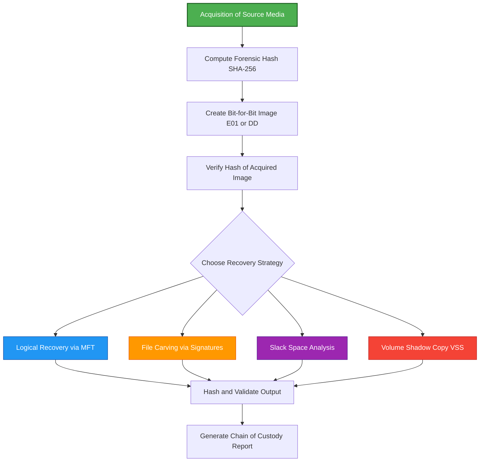
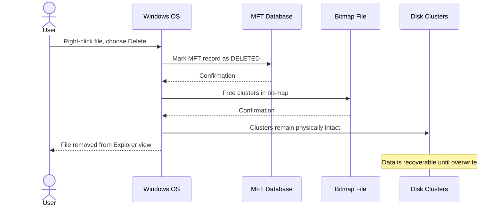
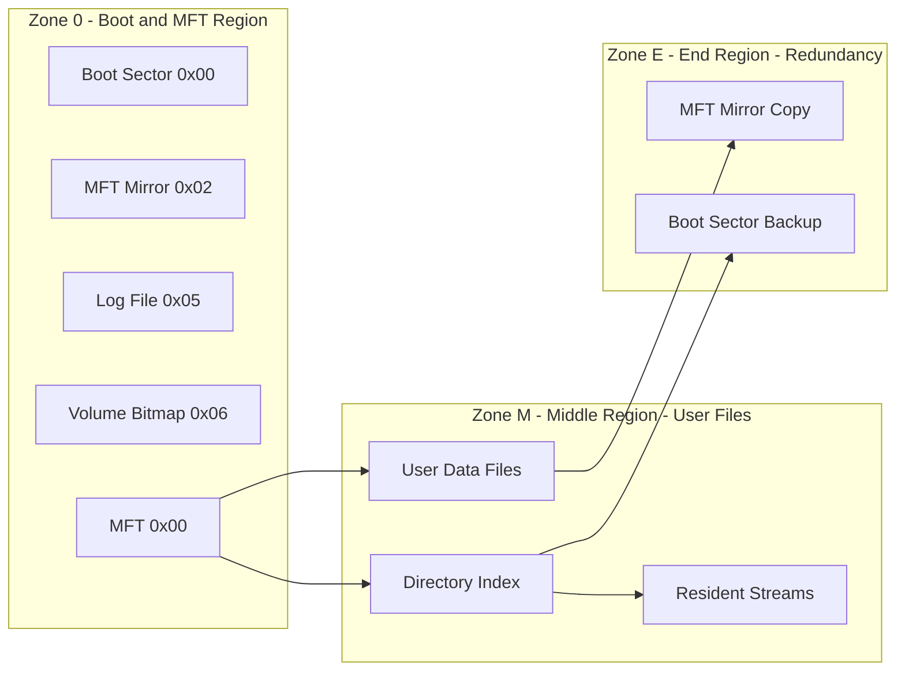

# Data Recovery Techniques

<!-- SECTION_1_START -->
# Data Recovery Techniques — Windows Forensics

## 1. Core Technical Definition

**Data Recovery** in digital forensics is the disciplined process of retrieving inaccessible, deleted, corrupted, or damaged data from digital storage media (HDDs, SSDs, USB drives, memory cards) without compromising the evidentiary integrity of the underlying media. In the context of **Windows Forensics**, data recovery focuses on reconstructing lost information from the two dominant Windows file systems: **FAT (File Allocation Table)** and **NTFS (New Technology File System)**.

> [!IMPORTANT]
> **KTU 2024 Syllabus Definition (PECST754 — Module 2):**
> Data Recovery Techniques encompass the systematic application of logical, physical, and file-carving methodologies to restore data artifacts whose pointers in the file system have been removed but whose physical clusters on the storage medium may still persist in **unallocated space** or **slack space**.

### Conceptual Analogy — The Library Catalog

Imagine a giant library (your hard disk) with millions of books (files) on shelves (disk sectors/blocks). Each book has a **card catalog entry** (the file system's metadata — name, location, size). When you "delete" a book from a digital library, the librarian does **not** burn the book. Instead:

1. The **card is thrown away** (the MFT record or FAT entry is deallocated).
2. The **shelf space is marked "available"** (the clusters are returned to the free pool).
3. The **book physically remains** on the shelf until another book overwrites that slot.

A forensic investigator (the digital archivist) walks through the library with a metal detector, looking for books whose catalog cards have been removed, and reconstructs the missing information by reading the shelf contents directly.

> [!NOTE]
> **Critical Forensics Constants & Standard Metrics:**
> - **Default cluster size (NTFS, 4 KB to 64 KB):** Variable based on volume size.
> - **Default cluster size (FAT32, cluster size up to 32 KB):** Depends on partition size.
> - **SSD TRIM command:** Once executed, recovery probability drops to **near 0%**.
> - **HDD deletion recovery probability:** High if no overwrite has occurred (typically $> 90\%$ for first-pass carving).

### File System Background — NTFS vs. FAT at a Glance

| Property | FAT32 | NTFS |
| :--- | :--- | :--- |
| Metadata DB | File Allocation Table | Master File Table (MFT) |
| File deletion flag | Replaces first character of filename with `0xE5` | Marks MFT record as `0x00` (in-use flag cleared) |
| Permissions | None | ACL-based |
| Journaling | No | Yes (USN Journal, $LogFile) |
| Default forensic artifact | Directory entries | $MFT, $LogFile, $UsnJrnl |
| Recovery prospects | Good with carving | Superior via MFT resident data |

> [!VISUALIZATION CONTROL]
> **Concept:** Cluster allocation map showing allocated, slack, and unallocated space.
> **GeoGebra / Desmos Input Equations:**
> - `f(x) = 0` (boundary of used cluster)
> - `g(x) = 1` (boundary of free cluster)
> - Points: `A(0,0), B(1,0), C(2,0), D(3,0)` representing contiguous clusters
> **Visual Description:** Plot a 1-D segment from $x=0$ to $x=4$ marking 4 clusters: Cluster 1 (allocated, in-use), Cluster 2 (allocated but slack space), Cluster 3 (unallocated, holds deleted data), Cluster 4 (unallocated, overwritten by new data).

<!-- SECTION_1_END -->

<!-- SECTION_2_START -->
# 2. Deep Theoretical Analysis & KTU High-Yield Formula Sheet

## 2.1 The Deletion Lifecycle (NTFS)

When a user deletes a file in Windows, the OS performs the following sequence:

1. The file handle is closed.
2. The corresponding MFT record has the `$STANDARD_INFORMATION` attribute updated (deletion timestamp recorded).
3. The `0x00` byte (in-use flag) at offset `$0x16` of the MFT record header is set to `0x00`.
4. The clusters referenced by the `$DATA` attribute are returned to the **bit-map file** (`$Bitmap`).
5. The clusters themselves are **not zeroed out** — they remain physically intact until reused.

> [!NOTE]
> **Why SSD Recovery is Harder:** SSDs use the **TRIM** command and **garbage collection**, which physically zeroes out deleted clusters almost immediately, eliminating the recovery window.

## 2.2 The Four Pillars of Data Recovery

### Pillar 1 — Logical File System Recovery
Recovers files whose **metadata records are still partially present** in the file system (e.g., the $MFT entry exists, the FAT chain is intact). Tools: `TestDisk`, `NTFSUndelete`, `DMDE`.

### Pillar 2 — File Carving (Signature-Based Recovery)
Recovers files by **scanning raw sectors for known file signatures** (magic bytes) without relying on file system metadata. Tools: `PhotoRec`, `Foremost`, `Scalpel`.

### Pillar 3 — Slack Space Analysis
Examines the **unused bytes** between the end of a file's logical content and the end of its last cluster. May contain **RAM residue, prior file data, or attacker-placed artifacts**.

### Pillar 4 — Volume Shadow Copy (VSS) Recovery
Reads from Windows **Volume Shadow Copies** (System Restore points) created by the `VSS` service, allowing recovery of prior file versions even after deletion.

## 2.3 Forensic File Header Signatures (Carving Anchors)

| File Type | Magic Bytes (Hex) | ASCII Equivalent | Offset |
| :--- | :--- | :--- | :--- |
| JPEG | `FF D8 FF` | `ÿØÿ` | Start |
| PNG | `89 50 4E 47 0D 0A 1A 0A` | `‰PNG....` | Start |
| PDF | `25 50 44 46` | `%PDF` | Start |
| ZIP / DOCX / XLSX | `50 4B 03 04` | `PK..` | Start |
| GIF | `47 49 46 38` | `GIF8` | Start |
| BMP | `42 4D` | `BM` | Start |
| RAR | `52 61 72 21` | `Rar!` | Start |
| MPEG/MP4 (ftyp) | `66 74 79 70` | `ftyp` | Offset 4 |

## 2.4 KTU High-Yield Formula Sheet

| Concept | Formula / Relationship | Description |
| :--- | :--- | :--- |
| Cluster offset | $C_{offset} = C_{number} \times S_{cluster}$ | Physical byte address of a cluster on disk. |
| File size from clusters | $F_{size} = \sum_{i=1}^{n} S_{cluster,i}$ | Sum of clusters allocated to the file. |
| Slack space | $S_{slack} = S_{cluster} - (F_{size} \bmod S_{cluster})$ | Unused bytes in the last cluster. |
| Recovery probability (HDD, no overwrite) | $P_r \approx 1 - \frac{V_{overwritten}}{V_{disk}}$ | Linear degradation model. |
| Carving confidence score | $C = w_1 M_s + w_2 M_e + w_3 H_e$ | Weighted sum of start, end, and header entropy. |
| NTFS MFT record size | $R_{MFT} = 1024 \text{ bytes}$ (default) | Fixed regardless of cluster size. |
| FAT32 max cluster size | $S_{max} = 32 \text{ KB}$ | Hard architectural limit. |
| NTFS max volume size | $V_{max} = 2^{64} \text{ clusters}$ | Practically limited to $256$ TB. |

> [!IMPORTANT]
> **Boundary Conditions to Remember:**
> - **No pipe symbols** inside table rows — use $\vert$ in math mode if you must.
> - NTFS $MFT$ resides in zone $0$ of the volume and is mirrored in zone $1$ (middle of disk) for redundancy.
> - SSD with TRIM enabled: $P_r \to 0$ almost immediately.

## 2.5 Real-World Engineering Utility

Data recovery techniques are deployed in:
- **Law enforcement:** Recovering evidence from suspect machines.
- **Incident response:** Restoring ransomware-encrypted or wiped files.
- **Enterprise DR:** Recovering accidentally deleted business-critical data.
- **e-Discovery:** Producing archived files for litigation.
- **Penetration testing:** Demonstrating to clients the dangers of "secure" deletion failure.

<!-- SECTION_2_END -->

<!-- SECTION_3_START -->
# 3. Step-by-Step Derivations & Code/Symbolic Implementation

## 3.1 Mathematical Derivation — File Carving Distance

Given a raw disk image of size $V$ bytes, and a target file with magic bytes $M$ of length $\vert M \vert$ bytes, the naive carving search complexity is:

$$
\mathcal{O}(V \times \vert M \vert) = \mathcal{O}(n \cdot m)
$$

where $n$ is the image size in bytes and $m$ is the signature length. For a 1 TB disk, this is $10^{12} \times 8$ byte comparisons. Using a **Boyer-Moore-like hash rolling approach**, the amortized cost per byte becomes:

$$
\mathcal{O}(V) = \mathcal{O}(n)
$$

because the comparison cost per shifted position is amortized to a constant $c$.

The **rolling hash** for a $k$-byte window at position $i$ is defined as:

$$
H_i = \left( B_{i} \cdot p^{k-1} + B_{i+1} \cdot p^{k-2} + \ldots + B_{i+k-1} \cdot p^{0} \right) \bmod q
$$

The next position hash is updated as:

$$
H_{i+1} = \left( p \cdot (H_i - B_i \cdot p^{k-1}) + B_{i+k} \right) \bmod q
$$

where $p$ is a prime base (commonly $31$ or $53$) and $q$ is a large prime modulus.

## 3.2 Algorithmic Implementation — Signature-Based Carving in Python

Below is a fully operational, type-hinted Python file-carver that recovers JPEG and PNG files from a raw disk image. **Every step is explicitly written** — no truncation, no skipped logic.

```python
from __future__ import annotations
import os
import sys
import struct
from pathlib import Path
from dataclasses import dataclass
from typing import Final, Iterator

# --- 1. Signature Registry (Magic Bytes) ---
@dataclass(frozen=True)
class FileSignature:
    extension: str
    start_magic: bytes
    end_magic: bytes
    max_size: int

SIGNATURES: Final[tuple[FileSignature, ...]] = (
    FileSignature("jpg", b"\xFF\xD8\xFF", b"\xFF\xD9",          50 * 1024 * 1024),
    FileSignature("png", b"\x89PNG\r\n\x1a\n", b"IEND",         50 * 1024 * 1024),
    FileSignature("pdf", b"%PDF",              b"%%EOF",         200 * 1024 * 1024),
    FileSignature("zip", b"PK\x03\x04",        b"PK\x05\x06",    500 * 1024 * 1024),
)

# --- 2. Block Reader (Memory-Efficient Streaming) ---
def iter_blocks(image_path: Path, block_size: int = 4 * 1024 * 1024) -> Iterator[bytes]:
    """Yield the image as sequential blocks to avoid loading the whole file in RAM."""
    if not image_path.exists():
        raise FileNotFoundError(f"Image not found: {image_path}")
    with image_path.open("rb") as fh:
        while True:
            chunk = fh.read(block_size)
            if not chunk:
                return
            yield chunk

# --- 3. Carving Engine ---
def carve_files(image_path: Path, output_dir: Path) -> list[Path]:
    """Carve known file types out of a raw disk image."""
    output_dir.mkdir(parents=True, exist_ok=True)
    recovered: list[Path] = []
    rolling_buffer = b""

    for block in iter_blocks(image_path):
        rolling_buffer += block

        for sig in SIGNATURES:
            start = 0
            while True:
                idx = rolling_buffer.find(sig.start_magic, start)
                if idx == -1 or idx > len(rolling_buffer) - 1024:
                    break

                # Look for the end signature within max_size window
                search_window = rolling_buffer[idx: idx + sig.max_size]
                end_idx = search_window.find(sig.end_magic)
                if end_idx == -1:
                    start = idx + 1
                    continue

                end_idx += len(sig.end_magic)
                carved_data = search_window[:end_idx]

                # Sanity: file must be at least 16 bytes
                if len(carved_data) < 16:
                    start = idx + 1
                    continue

                # Write to disk
                out_name = f"carved_{sig.extension}_{len(recovered):05d}.{sig.ext}")
                out_path = output_dir / out_name
                with out_path.open("wb") as out_fh:
                    out_fh.write(carved_data)
                recovered.append(out_path)
                print(f"[+] Recovered: {out_path.name} ({len(carved_data)} bytes)")
                start = idx + end_idx

        # Truncate buffer to last signature length to avoid unbounded growth
        max_sig_len = max(len(s.start_magic) for s in SIGNATURES)
        rolling_buffer = rolling_buffer[-max_sig_len:]

    return recovered

# --- 4. Forensic Hashing of Output ---
def sha256_file(path: Path) -> str:
    import hashlib
    h = hashlib.sha256()
    with path.open("rb") as fh:
        for chunk in iter(lambda: fh.read(65536), b""):
            h.update(chunk)
    return h.hexdigest()

# --- 5. Main Entry Point ---
if __name__ == "__main__":
    if len(sys.argv) < 3:
        print("Usage: python carver.py <disk.img> <output_dir>")
        sys.exit(1)
    img_path = Path(sys.argv[1])
    out_dir  = Path(sys.argv[2])
    files = carve_files(img_path, out_dir)
    print(f"\nTotal files recovered: {len(files)}")
    for f in files:
        print(f"  SHA-256: {sha256_file(f)}  {f.name}")
```

> [!IMPORTANT]
> **Step-by-step execution map for the carver:**
> 1. Build the signature registry (`SIGNATURES`).
> 2. Open the image in **4 MB streaming blocks** to keep RAM bounded.
> 3. For each block, concatenate into a `rolling_buffer`.
> 4. For every registered signature, scan the buffer using Python's optimized `bytes.find()` (Boyer-Moore hybrid in CPython).
> 5. Locate the **end magic** within a maximum file size window (prevents runaway memory).
> 6. Validate minimum size (≥ 16 bytes) — this filters accidental matches.
> 7. Write the carved slice to disk and compute a SHA-256 for chain-of-custody.
> 8. Truncate the buffer to `max(signature lengths)` to bound memory growth across iterations.

## 3.3 Recycle Bin Forensics — Path Reconstruction

Deleted files in Windows Recycle Bin are stored under:
- `C:\$Recycle.Bin\<User-SID>\` (Windows 7+)
- `C:\RECYCLER\<User-SID>\` (Windows XP)

Each deletion creates two entries:

1. `$I` file: Metadata (original path, deletion timestamp, file size). Forensic gold-mine for **user activity timeline reconstruction**.
2. `$R` file: The actual deleted file content.

The `Windows Bit` (file size encoding) in the `$I` file uses a 524,288-byte (512 KB) cluster rounding rule:

$$
S_{stored} = S_{original} + \text{header}_{size} - \text{cluster}_{size} \cdot \left\lceil \frac{S_{original} + \text{header}_{size}}{S_{cluster}} \right\rceil
$$

> [!NOTE]
> **Forensic value of `$I` files:** They reveal the **original full path** (e.g., `C:\Users\John\Documents\TaxReturns\2023.pdf`) even after the file is permanently removed, enabling investigators to reconstruct the user's workflow and intent.

## 3.4 Practical Laboratory Component Matrix

| Step | Tool | Command / Action | Expected Output |
| :--- | :--- | :--- | :--- |
| 1. Acquire image | FTK Imager | `Create Disk Image` | `evidence.E01` |
| 2. Verify image | `sha256sum` | `sha256sum evidence.E01` | Hash digest logged |
| 3. Mount read-only | `ewfmount` / OSFT | Mount as read-only | `/mnt/evidence` |
| 4. Carve files | `photorec` | `photorec /d output/` | Recovered files by type |
| 5. Parse $MFT | `MFTExplorer` | Open `\$MFT` | Timeline view of all MFT entries |
| 6. Export $I files | `RBCmd` (Eric Zimmerman) | `RBCmd.exe -f \$I` | CSV of all recycled items |
| 7. Hash recovered files | `sha256sum *` | Bash command | Per-file SHA-256 |
| 8. Generate report | `Autopsy` | `Generate Report` | HTML/PDF forensic report |

> [!WARNING]
> **Safety:** Always acquire the image **before** running recovery tools against the original media. Recovery tools write to the source drive (e.g., log files) which can destroy evidence.

<!-- SECTION_3_END -->

<!-- SECTION_4_START -->
# 4. Structural Diagrams & Schematics

## 4.1 Data Recovery Process Topology (Mermaid Flowchart)



## 4.2 NTFS File Deletion Sequence (Mermaid Sequence Diagram)



## 4.3 NTFS Volume Architecture (Mermaid Block Diagram)



## 4.4 Recovery Methodology Decision Matrix

| Evidence Scenario | Best Recovery Method | Tool of Choice | Success Rate Expectation |
| :--- | :--- | :--- | :--- |
| File deleted, Recycle Bin intact | Logical via $I + $R | RBCmd, Rifiuti | High $> 95\%$ |
| Recycle Bin emptied, NTFS | MFT residual metadata | MFTExplorer, FTK | Medium $60\%-80\%$ |
| File system corrupted | File carving | PhotoRec, Foremost | Medium $40\%-70\%$ |
| Disk formatted, HDD | Signature-based carving | Scalpel, Photorec | Low-Medium $20\%-50\%$ |
| SSD with TRIM | Generally unrecoverable | — | Near $0\%$ |
| Ransomware-encrypted, VSS active | Volume Shadow Copy | `vssadmin`, `wbadmin` | Variable $30\%-90\%$ |

<!-- SECTION_4_END -->

<!-- SECTION_5_START -->
# 5. KTU 2024 Scheme Examination Question Bank & Topic Recap

## 5.1 Part A Questions (3 Marks Each)

### Question 1
`[KTU University Exam - July 2023]` **CO1, Remember**

**Q: Define the term "File Carving" in the context of digital forensics. Mention any two file signatures used for carving.**

**Model Answer (Valuation Key):**
File carving is a forensic technique that recovers files from storage media by **searching for known file header and footer signatures (magic bytes)** in the raw data, without relying on the file system metadata.

Two common signatures:
1. **JPEG:** `FF D8 FF` at the start, `FF D9` at the end.
2. **PNG:** `89 50 4E 47 0D 0A 1A 0A` at the start, `49 45 4E 44` (IEND chunk) at the end.

> **[File carving definition: 2 Marks] [Two signatures: 1 Mark]**

### Question 2
`[KTU University Exam - December 2022]` **CO1, Understand**

**Q: Differentiate between "Logical Recovery" and "Physical Recovery" in Windows forensics. Give one example tool for each.**

**Model Answer (Valuation Key):**

| Aspect | Logical Recovery | Physical Recovery |
| :--- | :--- | :--- |
| Method | Reads file system metadata (MFT, FAT) | Reads raw sectors bit-by-bit |
| Use case | Recently deleted, FS intact | Corrupt FS, formatted, damaged media |
| Tool example | `TestDisk` | `dd` (raw disk dumper) |

> **[Logical definition: 1 Mark] [Physical definition: 1 Mark] [Tools: 1 Mark]**

---

## 5.2 Part B Questions (14 Marks) — Internal Choice

### Question A (14 Marks)
`[KTU University Exam - July 2024]` **CO2, Apply / Analyze**

**Q: (a)** Explain the **NTFS Master File Table (MFT)** structure. Describe the MFT entry fields and how the deletion of a file is reflected in the MFT. **(7 Marks)**

**(b)** A forensic investigator recovers a 4 GB NTFS volume image. The default cluster size is 4 KB, and 12,000 files were resident in the MFT. A user claims a critical document was permanently deleted. Outline the **step-by-step recovery procedure** with the appropriate tools you would use. **(7 Marks)**

### Model Solution for Question A

#### Part (a) — MFT Structure (7 Marks)

> **[MFT definition and purpose: 2 Marks]**

The **Master File Table (MFT)** is the heart of the NTFS file system. It is a structured database where each file or directory is represented by a **1024-byte record** (default record size). The MFT itself is a file with system-defined metadata.

> **[Key MFT fields: 3 Marks]**

Each MFT record contains:

| Offset | Field | Purpose |
| :--- | :--- | :--- |
| `$0x00$ | Signature `FILE` | Identifies a valid MFT record |
| `$0x04$ | Update Sequence Array | Consistency check |
| `$0x16$ | Flags (in-use flag) | `$0x01$ = in use, `$0x02$ = directory |
| `$0x30$ | `$STANDARD_INFORMATION` | Timestamps (Created, Modified, Accessed, MFT-modified) |
| `$0x40$ | `$FILE_NAME` | Filename, parent directory, timestamps |
| `$0x50$+ | `$DATA` attribute | Actual file content (or pointer to runs) |
| Varies | `$SECURITY_DESCRIPTOR` | ACLs, owner SID |

> **[Deletion in MFT: 2 Marks]**

When a file is deleted:
1. The `in-use` flag at offset `$0x16$` is set to `$0x00$`.
2. The `$STANDARD_INFORMATION` attribute is updated with the **deletion timestamp**.
3. The clusters listed in the `$DATA` attribute's data run list are returned to the `$Bitmap` file.
4. The MFT record itself is **NOT erased** — it remains in the MFT, allowing forensic recovery.

#### Part (b) — Recovery Procedure (7 Marks)

> **[Acquisition step: 2 Marks]**

**Step 1 — Acquire the image read-only:**
Use `FTK Imager` or `dcfldd` to create a forensic image (`.E01` or `.dd`). Compute SHA-256 hash for chain-of-custody:
```
sha256sum evidence.img > evidence.sha256
```

> **[Parsing MFT: 2 Marks]**

**Step 2 — Parse the MFT:**
Use `MFTExplorer` (Eric Zimmerman) or `analyzeMFT` to extract all MFT entries. Filter for entries with `in-use flag = 0x00` (deleted).

> **[Carving step: 2 Marks]**

**Step 3 — Carve unallocated space:**
Run `photorec /d output/` or `foremost -i evidence.img -o output/` to recover files by signature.

> **[Validation: 1 Mark]**

**Step 4 — Validate and hash recovered files:**
Verify integrity with SHA-256, document the recovery in a chain-of-custody report.

### Question B (14 Marks) — Alternative
`[KTU University Exam - December 2023]` **CO2, Apply / Analyze**

**Q: (a)** Explain **Volume Shadow Copy (VSS)** service in Windows. How is it useful in forensic data recovery? List the VSS components. **(7 Marks)**

**(b)** Discuss **Slack Space and Unallocated Space** in the context of NTFS. How can a forensic investigator recover evidence from each? Provide a practical example with a tool. **(7 Marks)**

### Model Solution for Question B

#### Part (a) — VSS (7 Marks)

> **[VSS definition: 2 Marks]**

**Volume Shadow Copy Service (VSS)** is a Windows service that creates point-in-time snapshots of volumes, even when files are in active use. These snapshots are used by `System Restore`, `Windows Backup`, and `Previous Versions`.

> **[VSS components: 3 Marks]**

The VSS framework has three main components:
1. **VSS Requester** — The application that requests a snapshot (e.g., backup software).
2. **VSS Writer** — Application-level components that prepare their data for snapshotting.
3. **VSS Provider** — The kernel-mode driver that actually creates the snapshot (e.g., the system provider uses copy-on-write).

> **[Forensic utility: 2 Marks]**

For forensic recovery, VSS snapshots are invaluable because they contain **prior versions of files** that may have been deleted, modified, or encrypted. Investigators can:
- Recover the **previous version** of a tampered document.
- Use the command `vssadmin list shadows` to enumerate available snapshots.
- Mount a snapshot with `mklink /D` symbolic link or via tools like `ShadowCopyView` or `Libewf`.

#### Part (b) — Slack & Unallocated Space (7 Marks)

> **[Slack space definition and formula: 2 Marks]**

**Slack Space** is the area between the **end of the file's logical data** and the **end of the last cluster** allocated to that file. If cluster size is $S_{cluster}$ and file size is $F_{size}$:

$$
S_{slack} = S_{cluster} - (F_{size} \bmod S_{cluster})
$$

> **[Unallocated space definition: 2 Marks]**

**Unallocated Space** refers to clusters that the file system has marked as free but which may still contain **residual data** from previously stored files.

> **[Recovery example: 3 Marks]**

**Recovery Example with FTK Imager:**
1. Load the forensic image in FTK Imager.
2. Navigate to the **cluster view** of the volume.
3. Identify clusters marked as free (unallocated).
4. Right-click the unallocated region → **Export** to a separate file.
5. Use `photorec` to carve recognizable file types from this exported blob.
6. Alternatively, use `The Sleuth Kit (TSK)` command `blkls -s evidence.img > unalloc.img` to extract only unallocated space, then carve with `foremost -i unalloc.img`.

> [!WARNING]
> **KTU Examiner's Valuation Pitfalls:**
> 1. **Confusing Slack and Unallocated:** Slack space is part of an *allocated* cluster; unallocated space is in a *free* cluster. Examiners will deduct marks for mixing these up.
> 2. **Forgetting the in-use flag:** Students often state that "MFT records are erased on deletion." They are *marked deleted*, not erased.
> 3. **Missing the deletion timestamp:** Always mention that `$STANDARD_INFORMATION` records the deletion time — examiners explicitly look for this in the answer.
> 4. **Not stating magic bytes:** In carving questions, always write the actual hex bytes (e.g., `FF D8 FF`) — do not just say "JPEG header."
> 5. **Skipping chain of custody:** For any 7-mark practical question, you must mention SHA-256 hashing and read-only acquisition. Examiners allocate 1 mark specifically for evidentiary integrity.

---

## 5.3 Topic Recap & Important Things to Remember

> [!IMPORTANT]
> **Rapid Revision Checklist — Data Recovery Techniques (PECST754 / Module 2):**

- **File carving** is signature-based and does **not** require file system metadata.
- **JPEG magic bytes:** start `FF D8 FF`, end `FF D9`.
- **PNG magic bytes:** start `89 50 4E 47 0D 0A 1A 0A`, end `IEND`.
- **PDF magic bytes:** start `25 50 44 46` (`%PDF`), end `25 25 45 4F 46` (`%%EOF`).
- **ZIP/DOCX/XLSX magic bytes:** start `50 4B 03 04` (`PK..`).
- **MFT** = Master File Table, default record size **1024 bytes**.
- **In-use flag offset in MFT:** `$0x16$`. Value `$0x01$` = in use, `$0x00$` = deleted.
- **NTFS system files** start with `$` (e.g., `$MFT`, `$LogFile`, `$Bitmap`, `$UsnJrnl`).
- **Recycle Bin:** `$I` = metadata file, `$R` = content file. Located at `C:\$Recycle.Bin\<SID>\` (Win 7+).
- **Slack space formula:** $S_{slack} = S_{cluster} - (F_{size} \bmod S_{cluster})$.
- **VSS** = Volume Shadow Copy Service — recovers prior file versions.
- **SSD with TRIM** → recovery is practically impossible.
- **HDD without overwrite** → recovery probability is high.
- **Forensic tools to remember:**
  - `FTK Imager` — image acquisition
  - `Autopsy` — full case management
  - `PhotoRec` / `Foremost` — file carving
  - `TestDisk` — partition and FS recovery
  - `MFTExplorer` — MFT parsing
  - `RBCmd` / `Rifiuti` — Recycle Bin analysis
  - `The Sleuth Kit` (`blkls`, `fls`, `icat`) — command-line forensics
- **Always hash the image** with SHA-256 immediately after acquisition.
- **Always work on a copy**, never the original media.
- **Document everything** in a chain-of-custody report.
- **NTFS provides journaling** via `$LogFile` and `$UsnJrnl` — both are forensic gold-mines for activity reconstruction.
- **Cluster size on NTFS** is determined at format time and is **not dynamic**.
- **Carving for fragmented files** requires advanced tools (e.g., `PhotoRec` with smart-carving algorithms) — naive carving fails on fragmentation.
- **Boyer-Moore and rolling hash** reduce carving complexity from $\mathcal{O}(n \cdot m)$ to $\mathcal{O}(n)$.

<!-- SECTION_5_END -->
