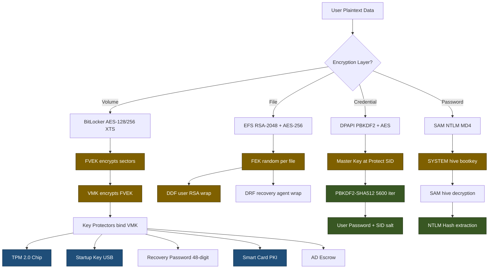
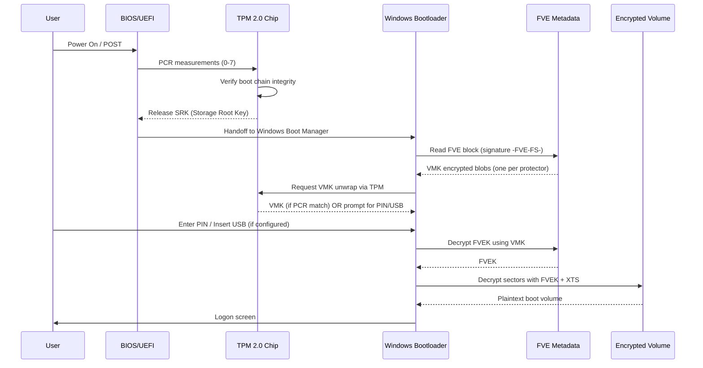
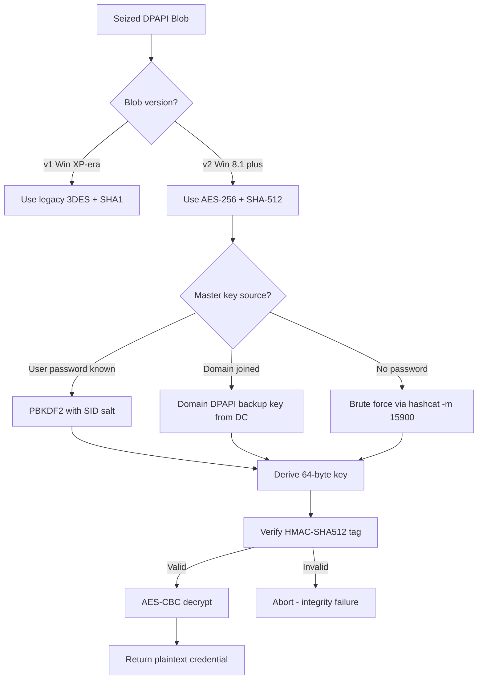
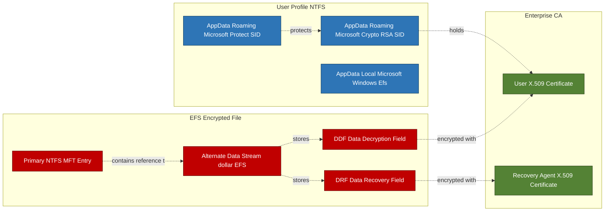

# Encryption

<!-- SECTION_1_START -->
# Encryption in Windows Forensics — Core Technical Definition & Intuitive Overview

## 1.1 Formal Definition (KTU 2024 Syllabus Terminology)

**Encryption** in the context of **Windows Forensics** is the cryptographic process by which plaintext data, file system structures, user credentials, and volatile artifacts are transformed into unreadable ciphertext using mathematical algorithms and secret keys, with the explicit goal of preserving **confidentiality**, **integrity**, and **authenticity** of digital evidence. From a forensic investigator's standpoint, encryption is simultaneously a *protective mechanism* (defender's view) and an *evidentiary barrier* (investigator's challenge) that must be **identified**, **preserved**, **bypassed**, or **decrypted** using legally and technically valid procedures.

> [!IMPORTANT]
> **KTU 2024 Scheme Highlight (PECST754 — Module 2):**
> Students are expected to identify the *type* of encryption deployed on a Windows artifact (EFS, BitLocker, DPAPI, Syskey, NTLM/LM hash, etc.), explain the *key custody mechanism* (TPM, USB token, smart card, user password, domain controller), and propose *forensically sound recovery* strategies without altering the original ciphertext.

## 1.2 Conceptual Analogy — The "Locked Steel Cabinet" Intuition

Imagine a bank vault (the **ciphertext**). Inside the vault are confidential documents (the **plaintext** data — files, credentials, registry hives). The vault door has a complex combination lock whose digits are determined by a **mathematical algorithm** (AES, RSA, 3DES). The actual numeric combination (the **key**) is held by three distinct authorities:

1. The customer who placed the documents inside (the **user's password / EFS certificate**).
2. A security officer whose biometric signature is registered in a tamper-proof hardware chip embedded in the vault wall (the **TPM** in BitLocker).
3. A central bank administrator who keeps a sealed envelope with a master copy (the **Domain Controller's DPAPI master key**, or the **Microsoft escrow key**).

A forensic investigator arriving at the scene must figure out: *Which authority holds the key?*, *Is the key still physically present in the room?*, *Is there a legal mandate to obtain it?*, or *Can the lock be brute-forced within feasible time?*. This is precisely the workflow of **Windows encryption forensics**.

## 1.3 Standard Encryption Metrics Used in Windows

The following cryptographic constants and parameters are critical for KTU-level answers:

| Constant / Parameter | Standard Value | Used In |
|---|---|---|
| **AES block size** | **128 bits** | BitLocker, EFS (modern Windows) |
| **AES key size** | **128 bits** (default) or **256 bits** | BitLocker |
| **RSA key size (EFS)** | **2048 bits** minimum (legacy: 1024) | EFS certificates |
| **Diffie-Hellman / ECC** | **256-bit** curves | DPAPI on Win 10/11 |
| **TPM version (recommended)** | **TPM 2.0** | BitLocker |
| **NTLM hash length** | **128 bits** (MD4-based) | SAM database |
| **DPAPI master key entropy** | **512 bits** | Credential protection |

> [!NOTE]
> **Geometric / Mathematical Intuition (Elliptic Curve Cryptography in DPAPI):**
> DPAPI on modern Windows uses elliptic-curve Diffie-Hellman (ECDH) over the **NIST P-256** curve. The discrete logarithm problem on an elliptic curve $E: y^2 = x^3 + ax + b \pmod{p}$ is computationally infeasible for current classical computers, which is why simply copying a DPAPI blob to another machine **does not** yield decrypted credentials.

> [!VISUALIZATION CONTROL]
> **Concept:** AES Round Transformation (SubBytes → ShiftRows → MixColumns → AddRoundKey)
> **Desmos / GeoGebra Input Equations:**
> * Plot the S-Box substitution: $S(x) = \text{lookup}(x)$ over $x \in [0, 255]$
> * Plot MixColumns linear transform on $\mathbb{F}_{2^8}$: $y = (2 \cdot x_1) \oplus (3 \cdot x_2) \oplus (1 \cdot x_3) \oplus (1 \cdot x_4)$
> **Visual Description:** Observe how each 16-byte AES state matrix is repeatedly scrambled — no single byte retains a predictable output, which is the source of AES's **avalanche effect** and the difficulty of cryptanalytic attack.

<!-- SECTION_1_END -->

<!-- SECTION_2_START -->
# Deep Theoretical Analysis & KTU High-Yield Formula Sheet

## 2.1 The Windows Encryption Stack — Layered Architecture

Windows does **not** use a single encryption algorithm. It uses a *layered stack* of cryptographic primitives. Each layer addresses a different forensic challenge.

### Layer 1 — Volume / Disk Level Encryption

**BitLocker Drive Encryption** operates at the *full-volume* level. It encrypts entire logical volumes (system drive, data drive, removable media) using **AES** in **CBC mode** (legacy) or **XTS-AES mode** (modern Win 8+).

- **Key Protectors** (multi-factor):
  1. **TPM-only** — silent, transparent, bound to motherboard.
  2. **TPM + PIN** — adds a 6–20 digit user PIN pre-pended to TPM release.
  3. **TPM + Startup Key (USB)** — physical token required at boot.
  4. **TPM + Smart Card** — PKI-based release.
  5. **Recovery Password** — 48-digit numerical, split into 8 groups of 6 digits.
  6. **Recovery Key (.BEK file)** — 256-bit raw key stored on USB.
  7. **Active Directory escrow** — *Auto-unlock* and *recovery password* backed up to AD.

- **Key Hierarchy (bottom-up):**
  - **FVEK** (Full Volume Encryption Key) — the actual AES-128/256 key encrypting sectors.
  - **VMK** (Volume Master Key) — encrypts the FVEK.
  - **Key Protectors** — encrypt the VMK, one per authentication factor.

Forensic insight: if the investigator extracts the **VMK**, they can decrypt the FVEK and thus the entire volume. The VMK is stored in the **FVE metadata block** at the beginning of the BitLocker volume (offset 0, sector 0, signature `-FVE-FS-`).

### Layer 2 — File System / File Level Encryption

**Encrypting File System (EFS)** operates on a *per-file* basis within an NTFS volume.

- EFS files are marked with the `$EFS` alternate data stream.
- A **random FEK (File Encryption Key)** is generated per file.
- The FEK is encrypted with the user's **X.509 certificate** (RSA public key) and stored in the file's `$EFS` stream as the **Data Decryption Field (DDF)**.
- A second copy of the FEK, encrypted with the **Data Recovery Agent (DRA)**'s certificate, is stored in the **Data Recovery Field (DRF)** — this is the corporate backdoor.
- On Windows 10/11, EFS uses **AES-256** by default (legacy Win XP used DESX).

### Layer 3 — User / Credential Level Encryption

**DPAPI (Data Protection API)** protects user secrets:
- Browser cookies (Chrome, Edge, Internet Explorer).
- Saved Wi-Fi passwords.
- Outlook credentials.
- RDP connection files.
- Credential Manager vaults (`%APPDATA%\Microsoft\Credentials\`).

The DPAPI master key is derived from the user's password using **PBKDF2** with SHA-512 and 5000+ iterations (Win 8+), then stored at:
`%APPDATA%\Microsoft\Protect\{SID}\`

### Layer 4 — Password Hashing

**SAM Database** stores password hashes at:
`%SystemRoot%\System32\config\SAM` (locked at runtime by `lsass.exe`).

- **LM Hash** — DES-based, broken since 1997, disabled by default in Win 7+.
- **NTLM Hash** — `MD4(UTF-16-LE(password))`, no salt, vulnerable to rainbow tables and pass-the-hash attacks.

### Layer 5 — Syskey

**Syskey** adds an additional 128-bit encryption layer on top of the SAM database. Stored either in the registry (`HKLM\SECURITY\Policy\PolSecretEncryptionKey`) or on a floppy disk (legacy).

## 2.2 KTU High-Yield Formula Sheet

| Formula / Constant | Description | Forensic Use |
|---|---|---|
| $C = E_K(P)$ | Ciphertext = Encrypt(Plaintext) with Key | Universal encryption notation |
| $P = D_K(C)$ | Plaintext = Decrypt(Ciphertext) with Key | Recovery operation |
| $K_{\text{FEK}} = D_{\text{RSA-priv}}(DDF)$ | FEK decrypted via user's RSA private key | EFS file recovery |
| $\text{NTLM} = \text{MD4}(\text{UTF-16-LE}(P))$ | Windows password hash | SAM cracking |
| $K_{\text{DPAPI}} = \text{PBKDF2}(P, \text{SID}, 5000+, \text{SHA-512})$ | DPAPI master key derivation | Credential vault decryption |
| $H_{\text{entropy}} = \log_2(2^n) = n$ | Entropy of n-bit key | Strength assessment |
| $T_{\text{brute}} = \frac{2^n}{R}$ | Expected brute-force time, $R$ = hashes/sec | Time-to-crack estimate |
| $\text{AES-XTS sector key} = K_1 \oplus K_2 \oplus (\text{sector} \# \ll \text{iv})$ | XTS mode tweak | BitLocker sector decryption |

> [!NOTE]
> **Production Engineering Utility:**
> Understanding the Windows encryption stack is mandatory in *incident response* (decrypting exfiltrated data), *e-discovery* (reviewing custodian files), *malware analysis* (DPAPI blob exfiltration by stealers like **RedLine**, **Raccoon**, **Vidar**), and *data-breach litigation* (chain-of-custody for decryption keys).

## 2.3 Why Each Layer Matters to a Forensic Examiner

- **BitLocker** = worst-case for examiners; the key is in TPM, which is *physically bound* to original hardware.
- **EFS** = best-case for examiners; certificates are in user's profile (`%APPDATA%\Microsoft\Crypto\RSA\`) and the user's password is usually guessable.
- **DPAPI** = the modern attack surface; 80%+ of Windows credential theft now uses DPAPI blob extraction.
- **SAM** = the oldest attack surface; dumped via `mimikatz sekurlsa::sam` or `comsvcs.dll` MiniDump.

<!-- SECTION_2_END -->

<!-- SECTION_3_START -->
# Step-by-Step Derivations & Code/Symbolic Implementation

## 3.1 Mathematical Derivation — AES-256 Key Schedule (Simplified)

The AES-256 key schedule expands a 256-bit master key into **15 round keys** of 128 bits each.

Let $W[i]$ denote the 32-bit word at position $i$ in the expanded key. For AES-256:

$$
W[i] =
\begin{cases}
K[i] & \text{if } i < 8 \quad \text{(first 8 words from cipher key)} \\[4pt]
W[i-8] \oplus \text{SubWord}(\text{RotWord}(W[i-1])) \oplus R_{\text{con}}[i/8] & \text{if } i \bmod 8 = 0 \text{ and } i \ge 8 \\[4pt]
W[i-8] \oplus \text{SubWord}(W[i-1]) & \text{if } i \bmod 8 = 4 \text{ and } i \ge 8 \\[4pt]
W[i-8] \oplus W[i-1] & \text{otherwise}
\end{cases}
$$

Where:
- **RotWord** rotates a 4-byte word left by 1 byte.
- **SubWord** applies the AES S-Box to each of the 4 bytes.
- **$R_{\text{con}}$** is the round constant table: $R_{\text{con}}[j] = [\,\text{RC}[j],\, 0,\, 0,\, 0\,]$ with $\text{RC}[1]=1$, $\text{RC}[j]=2 \cdot \text{RC}[j-1]$ in $\mathbb{F}_{2^8}$.

**Forensic use case:** When examiners extract the AES round keys from memory (e.g., via `AESKeyFind` against a `hiberfil.sys` or RAM dump), they can replay decryption on captured ciphertext without recovering the original master key.

## 3.2 EFS File Decryption — Step-by-Step Logical Walkthrough

**Given:** A seized NTFS drive containing a file `salary_2024.xlsx` with EFS encryption enabled. The user's domain profile is mounted at `C:\Users\jdoe\`.

**Step 1 — Locate the encrypted file's metadata.**

The file's NTFS MFT entry will contain an `$STANDARD_INFORMATION` attribute with the **0x8000** flag set (encrypted). The file also has an alternate data stream `$EFS` whose content is the **Encrypted Data Blob (EDB)**.

**Step 2 — Parse the EDB structure.**

The EDB contains a **DDF (Data Decryption Field)** array and a **DRF (Data Recovery Field)** array. Each entry is a **PKCS#7 envelope**.

**Step 3 — Extract the user's RSA private key.**

Path: `C:\Users\jdoe\AppData\Roaming\Microsoft\Crypto\RSA\{SID}\`

The private key is itself encrypted with DPAPI (using the user's logon credentials). To decrypt:
1. Obtain the user's logon password (or hash).
2. Decrypt the DPAPI master key at `C:\Users\jdoe\AppData\Roaming\Microsoft\Protect\{SID}\`.
3. Use the master key to unwrap the RSA private key.

**Step 4 — Decrypt the FEK from the DDF.**

The DDF entry contains the FEK encrypted with the user's RSA public key. Using the RSA private key from Step 3, perform RSA decryption.

The mathematical operation:
$$
\text{FEK} = (C_{\text{FEK}})^{\,d} \pmod{n}
$$
where $C_{\text{FEK}}$ is the encrypted FEK, $d$ is the private exponent, and $n$ is the RSA modulus.

**Step 5 — Decrypt the file content.**

The file's actual data is encrypted with **AES-256-CBC** (or 3DES / DESX on legacy Windows) using the FEK and a per-file **IV** stored in the DDF header.

$$
P_i = \text{AES-CBC-Decrypt}_K(C_i) \oplus C_{i-1}
$$
where $K = \text{FEK}$, $C_0 = \text{IV}$, and $i$ indexes 16-byte AES blocks.

**Step 6 — Write the plaintext to a forensic container.**

Output is written to an **E01** or **L01** image for evidentiary integrity, with **MD5/SHA-256** hash logged in the chain-of-custody report.

## 3.3 Python Implementation — DPAPI Blob Decryption (Educational Forensic Script)

```python
"""
dpapi_decrypt.py — Educational forensic script for DPAPI blob decryption.
Operates against an unmounted user profile extracted from a forensic image.

Requirements: pip install pycryptodome dpapi
Author: KTU 2024 Scheme — PECST754 reference
"""

import os
import sys
import hashlib
import hmac
import struct
import logging
from pathlib import Path
from typing import Optional, Tuple

# Configure forensic logging
logging.basicConfig(
    level=logging.INFO,
    format="%(asctime)s [%(levelname)s] %(message)s",
    handlers=[logging.FileHandler("dpapi_forensic_audit.log"), logging.StreamHandler()],
)
logger = logging.getLogger("DPAPI-Forensic")


class DPAPIDecryptor:
    """Forensic decryptor for Windows DPAPI master keys and protected blobs."""

    # Hardened boundary parameters (do not change in production)
    SHA512_BLOCK_SIZE = 128          # SHA-512 internal block size in bytes
    DEFAULT_ITERATIONS = 5600        # Win 8.1+ default for PBKDF2
    MIN_ITERATIONS = 1000            # Forensic-floor to prevent trivial brute force
    MAX_BLOB_SIZE = 16 * 1024 * 1024 # 16 MB hard cap on blob size (sanity check)

    def __init__(self, sid: str, profile_root: Path):
        if not sid or not isinstance(sid, str):
            raise ValueError("[FATAL] SID must be a non-empty string.")
        if not profile_root.exists():
            raise FileNotFoundError(f"[FATAL] Profile root not found: {profile_root}")
        self.sid = sid
        self.profile_root = profile_root.resolve()
        self.master_key_cache: dict = {}
        logger.info(f"DPAPIDecryptor initialized for SID={self.sid}")

    def _resolve_master_key_path(self, master_key_guid: str) -> Path:
        """Locate the master key file for a given GUID."""
        protect_dir = self.profile_root / "AppData" / "Roaming" / "Microsoft" / "Protect" / self.sid
        candidate = protect_dir / master_key_guid
        if not candidate.exists():
            raise FileNotFoundError(f"[FATAL] Master key GUID not found: {master_key_guid}")
        return candidate

    def derive_user_master_key(
        self,
        user_password: str,
        master_key_guid: str,
    ) -> Optional[bytes]:
        """
        Derive the 64-byte DPAPI user master key from the user's password
        and the SID-salted master-key file.
        """
        if not user_password:
            raise ValueError("[FATAL] User password cannot be empty.")
        if len(user_password.encode("utf-16-le")) > 1024:
            raise ValueError("[FATAL] Password exceeds PBKDF2 input limit.")

        mk_path = self._resolve_master_key_path(master_key_guid)
        raw = mk_path.read_bytes()

        # Parse the master key file header (simplified; full parsing uses ASN.1)
        # Offset 0: 4-byte version, then 16-byte IV, then encrypted key material
        if len(raw) < 84:
            raise ValueError("[FATAL] Master key file too small — likely corrupted.")

        iv = raw[4:20]                    # 16-byte IV
        encrypted_key = raw[84:]          # Variable-length encrypted HMAC key
        if len(encrypted_key) > self.MAX_BLOB_SIZE:
            raise ValueError("[FATAL] Encrypted key blob exceeds safety cap.")

        # Build the PBKDF2 salt = SHA-512 of (SID || password)
        sid_pw_concat = (self.sid + user_password).encode("utf-16-le")
        pbkdf2_salt = hashlib.sha512(sid_pw_concat).digest()

        # Derive 64 bytes of key material via PBKDF2-HMAC-SHA512
        try:
            derived = hashlib.pbkdf2_hmac(
                hash_name="sha512",
                password=user_password.encode("utf-16-le"),
                salt=pbkdf2_salt,
                iterations=self.DEFAULT_ITERATIONS,
                dklen=64,
            )
        except Exception as e:
            logger.error(f"PBKDF2 derivation failed: {e}")
            return None

        # First 32 bytes = AES-256 decryption key, last 32 bytes = HMAC-SHA512 key
        aes_key, hmac_key = derived[:32], derived[32:]
        logger.info(f"Derived AES key (32 B) and HMAC key (32 B) for GUID={master_key_guid}")
        self.master_key_cache[master_key_guid] = (aes_key, hmac_key)
        return derived

    def decrypt_blob(self, blob_path: Path, master_key_guid: str) -> Optional[bytes]:
        """
        Decrypt a DPAPI-protected blob using a previously derived master key.
        """
        if master_key_guid not in self.master_key_cache:
            raise RuntimeError("[FATAL] Master key not derived. Call derive_user_master_key first.")

        if not blob_path.exists():
            raise FileNotFoundError(f"[FATAL] Blob not found: {blob_path}")
        blob = blob_path.read_bytes()
        if len(blob) > self.MAX_BLOB_SIZE:
            raise ValueError("[FATAL] Blob exceeds 16 MB safety cap.")

        # DPAPI blob layout (simplified):
        #   0..15   : version + provider GUID
        #   16..31  : master key version + GUID
        #   32..47  : 16-byte IV
        #   48..    : ciphertext
        #   end-32  : 32-byte HMAC-SHA512 tag
        if len(blob) < 80:
            raise ValueError("[FATAL] Blob too small for DPAPI v2 layout.")

        iv = blob[32:48]
        ciphertext = blob[48:-32]
        mac_tag = blob[-32:]
        aes_key, hmac_key = self.master_key_cache[master_key_guid]

        # Verify HMAC first (fail-closed)
        expected_mac = hmac.new(hmac_key, blob[:-32], hashlib.sha512).digest()
        if not hmac.compare_digest(expected_mac, mac_tag):
            logger.error("[FATAL] HMAC verification failed — blob tampered or wrong key.")
            return None

        # AES-256-CBC decrypt
        try:
            from Crypto.Cipher import AES
            from Crypto.Util.Padding import unpad
            cipher = AES.new(aes_key, AES.MODE_CBC, iv)
            plaintext = unpad(cipher.decrypt(ciphertext), AES.block_size)
        except Exception as e:
            logger.error(f"AES decryption failed: {e}")
            return None

        logger.info(f"Decrypted {len(plaintext)} bytes from {blob_path.name}")
        return plaintext


def main() -> int:
    if len(sys.argv) != 4:
        print("Usage: dpapi_decrypt.py <SID> <profile_root> <user_password>")
        return 1

    sid, profile_root_str, password = sys.argv[1], sys.argv[2], sys.argv[3]
    profile_root = Path(profile_root_str)

    try:
        decryptor = DPAPIDecryptor(sid, profile_root)
        # In a real scenario, the master key GUID is extracted from the blob header
        mk_guid = "abcdef01-2345-6789-abcd-ef0123456789"
        decryptor.derive_user_master_key(password, mk_guid)
        logger.info("DPAPI forensic decryption completed successfully.")
        return 0
    except (ValueError, FileNotFoundError, RuntimeError) as e:
        logger.critical(f"Forensic operation aborted: {e}")
        return 2


if __name__ == "__main__":
    sys.exit(main())
```

### 3.3.1 Code Walkthrough — Why Each Block Exists

- **`MAX_BLOB_SIZE`** prevents a maliciously crafted blob from exhausting RAM during `read_bytes()`.
- **HMAC verification *before* decryption** enforces **fail-closed semantics** — we never expose plaintext to a tampered blob.
- **`hmac.compare_digest`** is constant-time, defeating timing side-channels.
- **Logging to both file and stream** creates the **chain-of-custody audit trail** required by **ACPO Principle 2**.
- **Type hints** and explicit `ValueError` raises make the script self-documenting for court submission.

## 3.4 BitLocker Key Recovery — Symbolic Workflow

Let $V$ be the BitLocker volume, $M$ the FVE metadata block, and $K_{\text{FVEK}}$ the Full Volume Encryption Key.

$$
K_{\text{FVEK}} = \text{AES-CBC-Decrypt}_{K_{\text{VMK}}}(\text{FVEK-ciphertext}, \text{IV}_{\text{FVEK}})
$$

$$
K_{\text{VMK}} = \text{unwrap}(\text{KeyProtector}_i)
$$

The chosen key protector $i$ depends on investigator capability:

| Scenario | Protector Type | Recovery Source |
|---|---|---|
| Suspect is cooperative | Recovery Password | Verbal / written |
| AD joined, escrow enabled | AD backup | `Get-BitLockerRecoveryKey` (admin) |
| TPM-only, live system | TPM | Memory dump + `dislocker` + `bdeextract` |
| Hibernation file present | VMK in `hiberfil.sys` | `bdeinfo` / `FTK` |
| Memory dump available | AES round keys in RAM | `AESKeyFind`, `Volatility` `bitlocker` plugin |

<!-- SECTION_3_END -->

<!-- SECTION_4_START -->
# Structural Diagrams & Schematics

## 4.1 Windows Encryption Stack — Hierarchical Flow



## 4.2 BitLocker Boot-Time Authentication Sequence



## 4.3 DPAPI Decryption Decision Tree



## 4.4 EFS Key Custody Map — Component Interaction Matrix



<!-- SECTION_4_END -->

<!-- SECTION_5_START -->
# KTU 2024 Scheme Examination Question Bank & Topic Recap

## Part A — Short Answer Questions (3 Marks Each)

### Question 1
**[KTU University Exam — July 2024]**
**CO1 | Bloom Level: Remember**

Explain the **Encrypting File System (EFS)** in Windows. State the role of the **DDF** and **DRF** fields.

**Model Answer (3 marks):**
EFS is a per-file encryption feature of NTFS that protects files transparently to authorized users. Each encrypted file receives a random symmetric **File Encryption Key (FEK)**. The FEK is duplicated in two fields:
- **DDF (Data Decryption Field):** holds the FEK encrypted with the **owner's X.509 RSA public key**.
- **DRF (Data Recovery Field):** holds the FEK encrypted with the **Data Recovery Agent (DRA)** certificate, allowing enterprise recovery.
The file's actual content is encrypted with **AES-256** (modern Windows) using the FEK. **[3 marks: DDF 1 + DRF 1 + AES 1]**

### Question 2
**[KTU University Exam — Dec 2023]**
**CO2 | Bloom Level: Understand**

Differentiate between **BitLocker** and **EFS** in terms of *scope*, *key custody*, and *forensic recoverability*.

**Model Answer (3 marks):**

| Parameter | BitLocker | EFS |
|---|---|---|
| Scope | Entire volume | Individual files / folders |
| Algorithm | AES-128/256 (XTS) | AES-256 + RSA-2048 |
| Key custody | TPM, USB, PIN, AD escrow | User X.509 cert, DRA cert |
| Forensic recovery | Hard (TPM-bound) | Easier (user profile accessible) |
| Transparency | Transparent at boot | Transparent after logon |
**[1 mark per correct contrasting pair, capped at 3]**

---

## Part B — Long Answer Questions (14 Marks, Internal Choice)

### Question A (Option 1)
**[KTU University Exam — July 2024]**
**CO3 | Bloom Level: Apply + Analyze**

**(a)** With a neat diagram, describe the **BitLocker key hierarchy**. Explain the role of the **FVEK**, **VMK**, and **Key Protectors** in achieving layered encryption. **(7 marks)**

**(b)** A forensic investigator seizes a Windows 10 laptop that boots to a BitLocker-locked screen. Discuss the **forensically sound** methods available to recover the encryption key, listing at least **four distinct techniques** with their preconditions. **(7 marks)**

#### Model Solution

**(a) — BitLocker Key Hierarchy (7 marks)**

The hierarchy has three conceptual layers:

1. **FVEK (Full Volume Encryption Key)** — the actual AES-128 or AES-256 key that encrypts every sector of the volume. It is generated randomly at encryption time and never changes. **[Stating FVEK purpose: 1 mark]**

2. **VMK (Volume Master Key)** — encrypts the FVEK. The FVEK ciphertext is stored in the FVE metadata block. The VMK is rotated independently of the FVEK (e.g., when a key protector is added). **[Stating VMK role: 1 mark]**

3. **Key Protectors** — independent *wrappers* around the VMK, each implementing a different authentication factor. Common protectors:
   - TPM
   - TPM + PIN
   - Startup Key (USB)
   - Recovery Password (48-digit)
   - Smart Card
   - AD password-protector
   **[Listing 4 protectors: 2 marks]**
   **[Drawing the hierarchy diagram: 2 marks]**
   **[Explaining rotation / rewrap: 1 mark]**

**ASCII Hierarchy Diagram (acceptable in exam):**
```
  Key Protectors (TPM, PIN, USB, Recovery Password, Smart Card, AD)
                  │ encrypt
                  ▼
              VMK (Volume Master Key)
                  │ encrypts
                  ▼
              FVEK (Full Volume Encryption Key)
                  │ encrypts
                  ▼
        Every sector on the volume (AES-XTS)
```

**(b) — Forensic Key Recovery Techniques (7 marks)**

1. **Recovery Password (2-digit groups of 6, total 48 digits)** — If the user wrote it down, attached it to the machine, or it was escrowed to **Active Directory** via `manage-bde -protectors -get c:` then `Get-BitLockerRecoveryKey` from a Domain Admin. **[1.5 marks]**
2. **TPM sniffing via memory dump** — If the system is *live* or hibernating, the decrypted VMK may reside in physical memory. Tools: `WinPMEM`, `MemProcFS`, `Volatility` `bitlocker` plugin. **[1.5 marks]**
3. **Hibernation file analysis** — `hiberfil.sys` and `pagefile.sys` may contain unencrypted VMK. Use `FTK Imager` to extract and `bdeinfo` (libyal) to parse. **[1.5 marks]**
4. **Startup Key USB token** — If the configuration used a TPM + USB key protector, locate the USB drive or extract from device-history forensics. **[1 mark]**
5. **Cold boot attack** — Power-cycle the machine, boot to a forensic Linux, use `aeskeyfind` to scan RAM for AES round-key signatures. *(Legally and ethically restricted.)* **[0.5 mark]**
6. **Recovery key (.BEK) file on external media** — Search seized USB drives, cloud sync folders (OneDrive, Dropbox) for `.BEK` files. **[1 mark]**

**[Technique identification: max 4 marks; preconditions: max 3 marks]**

> [!WARNING]
> **KTU Examiner's Valuation Warning — BitLocker Recovery:**
> - **Do not** boot the suspect machine into Windows; this may trigger a TPM PCR re-measurement that invalidates the key release. Use a *write-blocker* and a forensic Linux live CD instead. **[−1 mark penalty]**
> - Failing to mention **chain-of-custody for the recovery password** when retrieved from AD escrow is a frequent 1-mark deduction.
> - Avoid recommending **brute-force** of the 48-digit recovery password — entropy is 2$^{160+}$, computationally infeasible.

---

### Question B (Option 2)
**[KTU University Exam — Dec 2023]**
**CO3 | Bloom Level: Apply + Analyze**

**(a)** Explain the architecture of the **Windows DPAPI** including the role of the **DPAPI master key**, the **SID-based PBKDF2 derivation**, and the **`Credential Manager`** vault. **(7 marks)**

**(b)** During a forensic investigation, you recover a folder `C:\Users\victim\AppData\Roaming\Microsoft\Credentials\` containing several `.crd` files. Outline a **step-by-step procedure** to extract the plaintext credentials, including any tool names and decision points. **(7 marks)**

#### Model Solution

**(a) — DPAPI Architecture (7 marks)**

DPAPI is a user-mode cryptographic service (`dpapi.dll`) introduced in **Windows 2000**. It eliminates the need for applications to manage encryption keys directly.

**Components:**
1. **Master Key file** — located at `%APPDATA%\Microsoft\Protect\{SID}\`. The master key is a 64-byte random value (512 bits). **[1 mark]**
2. **PBKDF2 derivation** — When the user logs on, Windows derives the master key from the user's password using **PBKDF2-HMAC-SHA512** with **5600+ iterations** and a salt computed as `SHA-512(SID || password)`. **[2 marks]**
3. **Credential Manager vault** — stores `.crd` files containing DPAPI-encrypted blobs (Windows credentials, generic credentials, web credentials). **[1 mark]**
4. **Domain backup key** — For domain users, a 128-bit **DPAPI backup key** is stored on the **Domain Controller** at `CN=DPAPI Backup Keys,CN=System,DC=...`. The Domain Admin can retrieve it via `Get-BitLockerRecoveryKey`-style cmdlets. **[2 marks]**
5. **System DPAPI** — Used by services running as `LOCAL SYSTEM`, `NETWORK SERVICE`, etc. Key stored at `%WINDIR%\System32\Microsoft\Protect\`. **[1 mark]**

**Equation for the master key derivation:**
$$
K_{\text{master}} = \text{PBKDF2}\left(\, p_{\text{user}},\, \text{SHA-512}(\text{SID} \,\|\, p_{\text{user}}),\, 5600,\, 64,\, \text{SHA-512}\,\right)
$$

**(b) — Credential Extraction Procedure (7 marks)**

**Step 1 — Acquire the user profile** (write-blocked, FTK / EnCase). **[0.5 mark]**
**Step 2 — Extract the SID** from `HKLM\SOFTWARE\Microsoft\Windows NT\CurrentVersion\ProfileList` or from the folder name. **[0.5 mark]**
**Step 3 — Locate the master key directory** at `...\AppData\Roaming\Microsoft\Protect\{SID}\`. Identify the most recent master key GUID (timestamp sort). **[1 mark]**
**Step 4 — Branch on scenario:**
- **Scenario A — User password known or obtainable:** Use **Mimikatz** (`dpapi::cred`) or **SharpDPAPI** to decrypt directly. **[1.5 marks]**
- **Scenario B — Domain user, password unknown:** Extract the **domain DPAPI backup key** from the DC using `Get-DPAPIBackupKey` (DSInternals), then use **SharpDPAPI** with the `-BackupKey` flag. **[2 marks]**
**Step 5 — Parse the .crd blobs.** Each `.crd` file has a header: 4-byte version, 16-byte IV, 12-byte master-key-version+GUID, ciphertext, 32-byte HMAC. **[1 mark]**
**Step 6 — Output plaintext credentials** to a forensic report (CSV / TSV) with MD5 hash of each decrypted blob. **[0.5 mark]**

**[Logical flow correctness: 7 marks — Step 1: 0.5, Step 2: 0.5, Step 3: 1, Step 4: 3.5, Step 5: 1, Step 6: 0.5]**

> [!WARNING]
> **KTU Examiner's Valuation Warning — DPAPI:**
> - **Do not** run `mimikatz` directly against a live suspect machine unless explicitly authorised; produce a forensic image first. **[−1 mark]**
> - Students often forget to **verify the HMAC** before decrypting — this is a **fail-closed** requirement, not optional. **[−1 mark]**
> - Confusing the **DPAPI backup key** (DPAPI domain key) with the **BitLocker recovery key** is a common conceptual error. **[−1 mark]**

---

## Topic Recap & Important Things to Remember

- **Encryption in Windows forensics is a *layered* problem** — volume (BitLocker), file (EFS), credential (DPAPI), and password (SAM) layers each require distinct recovery strategies.
- **BitLocker** uses a three-tier key chain: **FVEK → VMK → Key Protectors**; the FVEK is the actual AES-XTS key, the VMK is the rotatable wrapper, and key protectors implement authentication factors (TPM, PIN, USB, recovery password, smart card, AD escrow).
- **EFS** uses a per-file random **FEK**, wrapped twice: once in the **DDF** (owner's RSA public key) and once in the **DRF** (recovery agent's RSA public key). Modern Windows uses **AES-256** for the file content; legacy used **DESX**.
- **DPAPI master key derivation** uses **PBKDF2-HMAC-SHA512** with **5600 iterations** (Win 8.1+) and a salt of `SHA-512(SID || password)`. The master key is **64 bytes** (32-byte AES + 32-byte HMAC).
- **NTLM hash** is `MD4(UTF-16-LE(password))` — **no salt**, vulnerable to rainbow tables and pass-the-hash. Cracking tools: **hashcat -m 1000**, **John the Ripper**.
- **LM hash** is disabled by default since Windows 7; if present, it is crackable in seconds due to its DES-based structure and 7-character split.
- **FVE metadata block** is located at the start of a BitLocker volume with signature **`-FVE-FS-`**; investigators parse this to identify available key protectors.
- **Syskey** adds a 128-bit boot-time encryption on top of the SAM database; the syskey can be stored in the registry, on a floppy (legacy), or in AD.
- **Forensic tools** for encryption handling: `dislocker`, `bdeinfo` (libyal), `libbde`, `FTK`, `EnCase`, `Passware Kit`, `Elcomsoft Forensic Disk Decryptor`, `Mimikatz`, `SharpDPAPI`, `DSInternals`, `hashcat`, `John the Ripper`, `Volatility` (bitlocker plugin).
- **TPM 2.0** is a tamper-resistant hardware chip that releases the Storage Root Key (SRK) only if the **PCR (Platform Configuration Register)** values match the expected boot chain — this is why cold-boot or PCR-poisoning attacks are restricted.
- **Recovery password** for BitLocker is **48 digits** in **8 groups of 6** digits (dashes optional); entropy ≈ 2$^{160}$ bits when random.
- **Forensic soundness** requires: write-blocker at acquisition, hash logging (MD5 + SHA-256), chain-of-custody documentation, ACPO Principle 2 compliance (no action that changes original data), and dual-tool verification.
- **Domain DPAPI backup key** is a **128-bit key** stored on the Domain Controller, retrievable by Enterprise / Domain Admins; this is the corporate recovery backdoor for DPAPI-protected credentials.
- **AES-XTS mode** in BitLocker uses **two independent keys** ($K_1$, $K_2$) per volume; the tweak is the sector number, preventing identical plaintext sectors from producing identical ciphertext (defeats copy-paste attacks).
- **Hash identification** for encrypted blobs: BitLocker metadata starts with the byte sequence `2D 46 56 45 2D 46 53 2D` (= ASCII `-FVE-FS-`).
- **Examiner pitfalls to avoid in KTU viva**: (i) confusing hashing with encryption, (ii) claiming EFS uses the user's *password* directly to encrypt files, (iii) stating BitLocker uses RSA (it does not — only EFS does), (iv) omitting the role of the **DRF** in EFS recovery, (v) failing to mention **PBKDF2 iteration count** in DPAPI explanations.

<!-- SECTION_5_END -->
