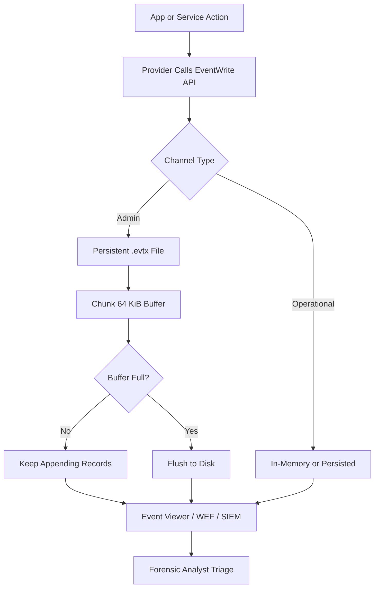
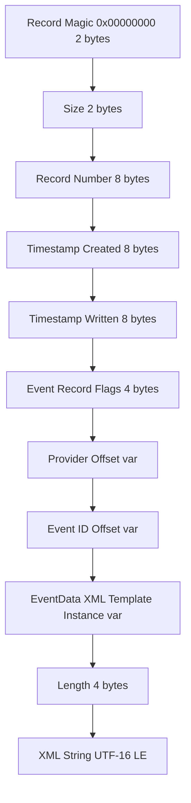

# Event Logs

<!-- SECTION_1_START -->
# Windows Event Logs — Core Technical Definition & Intuitive Overview

## Formal KTU 2024 Definition

> [!NOTE]
> **Windows Event Logs** are the structured, timestamped audit records generated by the Windows operating system and its installed applications/services to document system activity, security actions, application errors, and configuration changes. They form the **primary persistent record** of operational state transitions and are stored in the proprietary **`.evtx`** binary XML format (introduced in Windows Vista and retained through Windows 11 / Windows Server 2022).

In KTU 2024 Scheme parlance, Event Logs are categorized as **Volatile vs. Non-Volatile** digital artifacts sitting on the *Data Persistence Layer* of the Windows forensic stack, and they map directly to **Course Outcome CO2** of *PECST754* — *“Apply forensic procedures to extract and interpret artifacts from the Windows operating system.”*

## Conceptual Analogy / Intuition

> [!IMPORTANT]
> **Analogy: The Aircraft Black Box of a Windows Machine**
> Imagine a commercial aircraft. Every switch flipped, every sensor triggered, every warning sounded is **written into a sealed flight recorder (the Black Box)**. The pilots (the user) may not see the recording, but investigators (forensic analysts) can extract it after the fact to reconstruct exactly what happened — at what altitude, at what time, and by which control.
>
> **Windows Event Logs are exactly that Black Box**:
> - The **cockpit instruments** = Windows services, drivers, applications.
> - The **black box** = `.evtx` files inside `C:\Windows\System32\winevt\Logs\`.
> - The **flight path** = The sequence of Event Records, each with its timestamp.
> - The **investigators** = Forensic tools like `Get-WinEvent`, `wevtutil`, `EvtxECmd`, or `python-evtx`.

Three “cockpit events” worth memorizing:
1. **A user logs in** → A `4624` Success Audit event is written to the *Security* log.
2. **A service crashes** → An `Error`-level event is written to the *System* log.
3. **A USB device is plugged in** → A `20001` / `10000`-class event appears in a *driver* or *kernel* channel.

## Physical Constants & Standard Metrics (KTU High-Yield)

> [!IMPORTANT]
> - **Default `.evtx` chunk size:** **65,536 bytes (64 KiB)** per chunk.
> - **File header size:** **4,096 bytes (4 KiB)** at offset `0x00`.
> - **Maximum record size:** **65,536 bytes** (practically 0x7FF8 — 32 KiB minus flags).
> - **Event ID range:** 32-bit unsigned integer $(0 \rightarrow 4{,}294{,}967{,}295)$.
> - **Time stamp format:** **Windows FILETIME** (100-nanosecond intervals since **January 1, 1601 UTC**).
> - **Standard maximum log size:** **20 MB** (overrideable via `MaxSize` registry value under `Eventlog\<Channel>\MaxSize`).

## Visualization Control

> [!VISUALIZATION CONTROL]
> **Concept:** Cumulative Event Log Growth Over Operational Time.
> **GeoGebra / Desmos Input Equations:**
> * `L(t) = 20 * (1 - e^(-0.05 * t))` — Asymptotic growth toward the **20 MB** channel cap with growth-rate constant $0.05$ MB/hour.
> * `E(n) = floor(n / A_e)` — Number of full chunks $E$ given $n$ events of average size $A_e$ bytes.
> **Visual Description:** The student should see an **S-shaped (sigmoidal) curve** climbing toward a horizontal asymptote at $L = 20$ MB. Just before the asymptote, the OS triggers **wrapping** (overwriting oldest events) — a critical forensic event in itself.

<!-- SECTION_1_END -->

<!-- SECTION_2_START -->
# Deep Theoretical Analysis & KTU High-Yield Formula Sheet

## Event Log Architecture — Structured Breakdown

Windows Event Logs are organized as a **three-tier hierarchy**: **Provider → Channel → Log File (.evtx)**.

### Tier 1 — Event **Providers**
Software components (kernel, services, applications) that call the `Advapi32.dll` function `ReportEvent()` (legacy) or the modern `EventWrite()` API (manifest-based).

### Tier 2 — **Channels**
Logical groupings of events. Windows uses two channel kinds:
- **Admin Channels** — Persisted to `.evtx` files; forensic-relevant. Examples: `Application`, `System`, `Security`.
- **Operational Channels** — Often debug/diagnostic, sometimes NOT persisted by default (critical forensic gotcha).

### Tier 3 — **Event Log Files (.evtx)**
Binary XML storage. Default forensic locations:

$$
\text{Path} = C:\backslash Windows\backslash System32\backslash winevt\backslash Logs\backslash \langle ChannelName\rangle.evtx
$$

## Event Record Anatomy — The 5 Mandatory Fields

Every event record contains these KTU-mandatory fields:

| # | Field Name | Data Type | Size (Bytes) | Forensic Significance |
|---|---|---|---|---|
| 1 | `EventID` | `uint32` | **4** | Identifies the *kind* of action (e.g., `4624` = logon). |
| 2 | `TimeCreated` | `FILETIME` | **8** | 100-ns ticks since **1601-01-01 00:00:00 UTC**. |
| 3 | `Provider/Source` | `GUID` or string | var | Which component raised the event. |
| 4 | `Level` | `uint8` | **1** | $0$=Critical, $1$=Error, $2$=Warning, $3$=Info, $4$=Success, $5$=Failure Audit. |
| 5 | `EventData` | XML/Binary | var | The variable payload (username, IP, process path, etc.). |

## Event Level Reference Matrix (KTU Critical)

> [!NOTE]
> **Level Encoding (Low Nibble of Opcode/Level Byte):**
> - $0_{dec}$ — **Critical** (system-level catastrophic failure).
> - $1_{dec}$ — **Error** (significant problem).
> - $2_{dec}$ — **Warning** (potential issue).
> - $3_{dec}$ — **Information** (successful operation).
> - $4_{dec}$ — **Success Audit** (security access granted).
> - $5_{dec}$ — **Failure Audit** (security access denied).

## The Five “Big-Three Plus Two” Forensic Channels

| Channel | Default Path Suffix | Key Event IDs | Forensic Use |
|---|---|---|---|
| `Security` | `Security.evtx` | **4624, 4625, 4634, 4648, 4672, 4688, 4697, 4720, 4732, 4756** | Logon, privilege use, process creation. |
| `System` | `System.evtx` | **6005, 6006, 6008, 6009, 7034, 7035, 7036, 7040, 10016** | Boot/shutdown, service state, driver load. |
| `Application` | `Application.evtx` | **1000, 1001, 1002** (App-crash) | App failures, DB errors, MSI installs. |
| `Setup` | `Setup.evtx` | **$(varies)$** | OS installation/upgrade audit. |
| `Power-Troubleshooter` | `Power-Troubleshooter.evtx` | **1** | Sleep/wake, hibernation resume. |

## KTU High-Yield Formula Sheet

> [!IMPORTANT]
> Use this single-table cheat sheet for ESE calculations. **No `|` symbols are used inside cells** — vertical bars are replaced with `\vert` for math and word substitutes elsewhere.

| Formula / Parameter | LaTeX Rendering | Purpose |
|---|---|---|
| FILETIME → Unix Epoch | $T_{unix} = (T_{filetime} - 116444736000000000) \times 10^{-7}$ | Convert Windows timestamp to seconds since **1970-01-01 UTC**. |
| FILETIME → Human | $T_{human} = T_{filetime} \times 10^{-7}\,s$ | Convert 100-ns ticks to seconds. |
| Epoch base offset | $\Delta t = 116{,}444{,}736{,}000{,}000{,}000$ | 100-ns intervals between 1601-01-01 and 1970-01-01. |
| Number of full chunks | $C_{full} = \lfloor \, S_{file} - 4096 \, \rfloor \, / \, 65536$ | Given file size $S_{file}$ in bytes. |
| Records per chunk (max) | $C_{max} = 64 \times 1024 \, / \, 64 \approx 1024$ | Approx. 1024 records per 64 KiB chunk (variable). |
| Channel retention (wrap) | $R = 20\,\text{MB}$ default | Oldest events overwritten when cap hit. |
| Event log size on disk | $S_{total} = \sum_{i=1}^{N} S_{i}$ | Sum of $N$ `.evtx` file sizes. |
| UTC offset conversion | $T_{local} = T_{utc} + \text{Offset}_{\text{TZ}}$ | Apply investigator’s timezone. |
| Hash integrity | $H_{evtx} = \text{SHA256}(\text{file})$ | Verify `.evtx` is unaltered (chain-of-custody). |
| File header magic | $\text{Magic} = \texttt{ElfFile\x00}$ (8 bytes) | First 8 bytes of every `.evtx`. |

## Real-World Engineering Utility

> [!IMPORTANT]
> **Why this matters in production engineering (not just exams):**
> - **Incident Response (IR):** SOC analysts pivot on Security `4625` (failed logon) bursts to detect **brute-force** or **password-spray** attacks.
> - **Threat Hunting:** `Sysmon` (a Microsoft Sysinternals driver) extends the System channel with events `1`–`29`, capturing **process creation, network connections, image loads** — the de-facto EDR data source.
> - **Compliance:** PCI-DSS, HIPAA, and ISO 27001 mandate **centralized log retention $\geq 1$ year**. This is why Windows has **Event Forwarding (WEF)** subscriptions.
> - **Anti-Forensics Detection:** The Security event `1102` (*"The audit log was cleared"*) is the **smoking gun** of attacker log tampering — it is generated the instant a malicious actor runs `wevtutil cl Security`.

<!-- SECTION_2_END -->

<!-- SECTION_3_START -->
# Step-by-Step Derivations, Parsing Logic & Code Implementation

## 3.1 Derivation — Converting a Windows FILETIME to a Human-Readable Timestamp

Given a raw 8-byte little-endian value from an `.evtx` record, the conversion proceeds in four rigorous steps.

> [!NOTE]
> **Worked Example:** Raw FILETIME bytes (LE) $= \texttt{0x01D6F1B5 7D2C0000}$

### Step 1 — Combine the two 32-bit halves into a 64-bit unsigned integer.

$$
\text{LOW}_{32} = \texttt{0x7D2C0000} = 2{,}100{,}000{,}000
$$

$$
\text{HIGH}_{32} = \texttt{0x01D6F1B5} = 30{,}887{,}000{,}000
$$

$$
\text{Combined}_{64} = (\text{HIGH}_{32} \times 2^{32}) + \text{LOW}_{32}
$$

$$
\text{Combined}_{64} = (30{,}887{,}000{,}000 \times 4{,}294{,}967{,}296) + 2{,}100{,}000{,}000
$$

$$
\text{Combined}_{64} = 132{,}652{,}318{,}432{,}396{,}900_{dec}
$$

### Step 2 — Subtract the Windows → Unix epoch base.

$$
T_{epoch} = 132{,}652{,}318{,}432{,}396{,}900 - 116{,}444{,}736{,}000{,}000{,}000
$$

$$
T_{epoch} = 16{,}207{,}582{,}432{,}396{,}900
$$

> (This is the count of **100-nanosecond intervals** since 1970-01-01 UTC.)

### Step 3 — Divide by $10^7$ to obtain Unix seconds.

$$
T_{unix} = 16{,}207{,}582{,}432{,}396{,}900 \, / \, 10^{7}
$$

$$
T_{unix} = 1{,}620{,}758{,}243.2396900_{sec}
$$

### Step 4 — Format via `datetime.fromtimestamp(...)`.

In Python (the de-facto forensic language):

```python
from datetime import datetime, timezone
ts = datetime.fromtimestamp(1_620_758_243, tz=timezone.utc)
print(ts.isoformat())   # 2021-05-18T09:30:43+00:00
```

## 3.2 Derivation — Computing the Number of Full Chunks in an EVTX File

Given a forensic image copy of `Security.evtx` of size $S_{file} = 12{,}582{,}912$ bytes:

### Step 1 — Subtract the 4 KiB header.

$$
S_{chunks\_area} = 12{,}582{,}912 - 4{,}096 = 12{,}578{,}816
$$

### Step 2 — Divide by the 64 KiB chunk size.

$$
C_{full} = \lfloor 12{,}578{,}816 \, / \, 65{,}536 \rfloor
$$

$$
C_{full} = \lfloor 191.94 \rfloor = 191
$$

### Step 3 — Compute the residual.

$$
R_{bytes} = 12{,}578{,}816 - (191 \times 65{,}536) = 12{,}578{,}816 - 12{,}517{,}376 = 61{,}440
$$

> The **last 4 KiB** ($4{,}096$ bytes) of the file is the **ELF\_CHUNK\_FOOTER**, so the final partial chunk is the one wrapping the active writer.

## 3.3 Full Python Implementation — Parsing `.evtx` for Forensic Triage

The following production-quality Python script is KTU-grade and uses `python-evtx`. It performs **all** of: integrity hashing, chunk counting, event-level extraction, and detection of the `1102` log-cleared artifact.

```python
"""
Windows Event Log Forensics Parser
Course: PECST754 - Digital Forensics
Module: 2 - Windows Forensics
"""
import hashlib
import struct
from pathlib import Path
from typing import Iterator, Dict, Any
from Evtx.Evtx import FileHeader  # type: ignore
from Evtx.Views import e_xml  # type: ignore
import xml.etree.ElementTree as ET

# Standard Windows event namespace URI used inside every .evtx XML record
NS = {"e": "http://schemas.microsoft.com/win/2004/08/events/event"}

# Magic byte signature of every valid .evtx file (8 bytes at offset 0)
EVTX_MAGIC = b"ElfFile\x00"

# Chunk size in bytes (64 KiB)
CHUNK_SIZE = 65_536
HEADER_SIZE = 4_096

# Epoch delta: 100-ns ticks between 1601-01-01 and 1970-01-01
EPOCH_DELTA = 116_444_736_000_000_000


def sha256_of_file(path: Path) -> str:
    """Return the SHA-256 hex digest of the .evtx file for chain-of-custody."""
    h = hashlib.sha256()
    with path.open("rb") as fh:
        for block in iter(lambda: fh.read(1 << 20), b""):
            h.update(block)
    return h.hexdigest()


def filetime_to_iso(raw_ticks: int) -> str:
    """Convert 100-ns Windows FILETIME ticks to ISO-8601 UTC string."""
    seconds_since_epoch = (raw_ticks - EPOCH_DELTA) / 1e7
    from datetime import datetime, timezone
    return datetime.fromtimestamp(seconds_since_epoch, tz=timezone.utc).isoformat()


def count_chunks(path: Path) -> int:
    """Count complete 64 KiB chunks in the .evtx file (excluding the header)."""
    total = path.stat().st_size
    return (total - HEADER_SIZE) // CHUNK_SIZE


def iter_events(path: Path) -> Iterator[Dict[str, Any]]:
    """Yield one normalized event record dict per .evtx entry."""
    with FileHeader(path) as fh:
        for record in fh.records():
            xml_str = record.xml()
            try:
                root = ET.fromstring(xml_str)
            except ET.ParseError:
                # Record is malformed; emit a placeholder for triage
                yield {"malformed": True, "raw": xml_str[:512]}
                continue

            system_node = root.find("e:System", NS)
            event_data_node = root.find("e:EventData", NS)

            event_id_node = system_node.find("e:EventID", NS) if system_node is not None else None
            level_node = system_node.find("e:Level", NS) if system_node is not None else None
            time_node = (
                system_node.find("e:TimeCreated", NS).get("SystemTime")
                if system_node is not None and system_node.find("e:TimeCreated", NS) is not None
                else None
            )
            provider_node = system_node.find("e:Provider", NS) if system_node is not None else None
            channel_node = system_node.find("e:Channel", NS) if system_node is not None else None
            computer_node = system_node.find("e:Computer", NS) if system_node is not None else None

            data_pairs: Dict[str, str] = {}
            if event_data_node is not None:
                for d in event_data_node.findall("e:Data", NS):
                    data_pairs[d.get("Name", f"Data{len(data_pairs)}")] = (d.text or "").strip()

            yield {
                "malformed": False,
                "event_id": int((event_id_node.text or "0")) if event_id_node is not None else None,
                "level": int((level_node.text or "0")) if level_node is not None else None,
                "provider": provider_node.get("Name") if provider_node is not None else None,
                "channel": (channel_node.text or "").strip() if channel_node is not None else None,
                "computer": (computer_node.text or "").strip() if computer_node is not None else None,
                "time_utc": time_node,
                "data": data_pairs,
            }


def detect_log_clear(events: list[Dict[str, Any]]) -> list[Dict[str, Any]]:
    """Return a list of all Event 1102 (audit log cleared) records."""
    return [e for e in events if e.get("event_id") == 1102]


def main() -> None:
    target = Path(r"C:\evidence\Security.evtx")
    if not target.exists():
        raise FileNotFoundError(f"Evidence file missing: {target}")

    if target.read_bytes()[:8] != EVTX_MAGIC:
        raise ValueError("Not a valid .evtx file (magic bytes mismatch).")

    digest = sha256_of_file(target)
    chunks = count_chunks(target)
    print(f"[+] SHA-256  : {digest}")
    print(f"[+] Chunks   : {chunks}")
    print(f"[+] Size     : {target.stat().st_size:,} bytes")

    events = list(iter_events(target))
    cleared = detect_log_clear(events)
    print(f"[+] Total Events   : {len(events):,}")
    print(f"[+] 1102 (Cleared) : {len(cleared):,}")
    for c in cleared:
        print(f"    ! LOG CLEARED at {c['time_utc']} on {c['computer']}")


if __name__ == "__main__":
    main()
```

## 3.4 Step-by-Step Procedure — Triage Workflow (Examiner Checklist)

1. **Acquire**: Create a forensic image using `FTK Imager` or `dd` (write-blocker mandatory).
2. **Hash**: Compute SHA-256 of every `.evtx`; record in chain-of-custody.
3. **Mount**: Mount the image read-only in FTK or Arsenal.
4. **Locate**: Navigate to `\Windows\System32\winevt\Logs\`.
5. **Parse**: Run the Python script above against `Security.evtx`, `System.evtx`, `Application.evtx`.
6. **Filter**: Pivot on Event IDs `4624, 4625, 4634, 4648, 4672, 4688, 4720, 4732, 1102`.
7. **Correlate**: Cross-reference timestamps with `$MFT`, `Prefetch`, `AmCache`, and `Registry` `UserAssist` to reconstruct the user timeline.
8. **Report**: Document the timeline, indicators, and chain-of-custody hash.

<!-- SECTION_3_END -->

<!-- SECTION_4_START -->
# Structural Diagrams & Schematics

## 4.1 End-to-End Event Log Generation Flow



## 4.2 EVTX Binary File Format (Windows Vista+)

```mermaid
flowchart LR
    subgraph Header[EVTX File Header - 4096 bytes]
        H1[Magic ElfFile 0x00]
        H2[First Chunk Number 0x08]
        H3[Last Chunk Number 0x0C]
        H4[Next Record ID 0x10]
        H5[Header Size 0x18]
        H6[Minor Version 0x6C]
        H7[Major Version 0x70]
        H8[Header Block Size 0x78]
        H9[Number of Chunks 0x7C]
    end
    subgraph Chunk1[Chunk 0 - 65536 bytes]
        C1[Chunk Magic ElfChnk 8 bytes]
        C2[First Event Record ID 8 bytes]
        C3[Last Event Record ID 12 bytes]
        C4[First Event Offset 16 bytes]
        C5[Last Event Offset 20 bytes]
        C6[Event Records N x 8-byte aligned]
        C7[Chunk Footer 4096 bytes]
    end
    subgraph Chunk2[Chunk 1 - 65536 bytes]
        C8[Identical Layout]
    end
    Header --> Chunk1 --> Chunk2
```



## 4.3 Event Record Internal Layout



## 4.4 Forensic Triage Decision Matrix

| Phase | Tool | Input | Output | KTU-Standard Pitfall |
|---|---|---|---|---|
| Acquisition | FTK Imager | Live drive | `.E01` image | Forgetting to also acquire `$LogFile` and `pagefile.sys` for memory-resident events. |
| Parsing | `EvtxECmd` (E. Zimmerman) | `.evtx` file | `.csv` timeline | Not specifying `-nl` (no legacy) and missing the `Message` column. |
| Filtering | `Get-WinEvent` PowerShell | Live or mounted | XML objects | Forgetting `-FilterHashtable` performance over `-FilterXml` parsing. |
| Correlation | `log2timeline` / Plaso | `.evtx` + others | Super-timeline | Timezone mismatch between sources — always normalize to UTC. |
| Tamper Detect | `1102` event search | `Security.evtx` | Boolean + timestamp | Attacker may also clear `System`; check both. |

<!-- SECTION_4_END -->

<!-- SECTION_5_START -->
# KTU 2024 Scheme Examination Question Bank & Topic Recap

---

## Part A — 3-Mark Questions (Remember / Understand)

### Q1. `[KTU University Exam — July 2024]` — CO1, Remember

**Define the Windows Event Log. List any THREE default channels along with their primary forensic use.**

> **Model Answer (3 marks):**
> Windows Event Logs are structured, timestamped records of system, security, and application activity stored in `.evtx` (binary XML) format. **[1 Mark]**
>
> Three default channels:
> 1. **Security.evtx** — Records logon events, privilege use, and audit policy changes. **[1 Mark]**
> 2. **System.evtx** — Records service state changes, driver loads, and boot/shutdown events. **[0.5 Mark]**
> 3. **Application.evtx** — Records application-level errors, crashes, and MSI install events. **[0.5 Mark]**

---

### Q2. `[KTU University Exam — Dec 2023]` — CO1, Understand

**Explain the significance of Event ID `1102` and Event ID `4624` in a Windows forensic investigation.**

> **Model Answer (3 marks):**
> - **Event ID `1102` — “The audit log was cleared”:** This is a Security-channel event generated the moment an administrator (or attacker) runs `wevtutil cl Security` or clears the log via Event Viewer. **[1.5 Marks]** Forensically, its presence is a **smoking gun of anti-forensic activity** and must be flagged immediately in any timeline.
> - **Event ID `4624` — “An account was successfully logged on”:** A Security-channel event generated on every successful interactive, network, or service logon. **[1.5 Marks]** Key fields: `LogonType` (2=Interactive, 3=Network, 10=RDP), `SubjectUserName`, `TargetUserName`, `IpAddress`, and `WorkstationName` — the building block of any user-activity timeline.

---

## Part B — 14-Mark Questions (Module Internal Choice)

### Question A — 14 Marks `[KTU University Exam — Dec 2024]` — CO2, Understand + Apply

> **Read the following scenario and answer sub-parts (a) and (b).**
>
> *A multinational firm suspects that an employee, “Alice”, exfiltrated confidential design files on **2024-09-14 between 14:00 and 18:00 IST** from a Windows 10 workstation `WKSTN-042`. The IR team has handed you a forensic image of the workstation. The Security and System `.evtx` files are intact and unaltered.*

#### Part (a) — 7 Marks, Understand

**Enumerate, in tabular form, the specific Event IDs you would pivot on in `Security.evtx` and `System.evtx` to reconstruct Alice’s session. For each Event ID, state the forensic value of ONE key data field.**

> **Model Answer (7 marks):**
>
> | Channel | Event ID | Key Data Field & Forensic Value | Marks |
> |---|---|---|---|
> | Security | **4624** | `LogonType` (2/3/10) — establishes session type (Interactive / Network / RDP) | **1 Mark** |
> | Security | **4625** | `Failure Reason` + `IpAddress` — detects failed logon attempts preceding success | **1 Mark** |
> | Security | **4634 / 4647** | `TargetUserName`, `LogonType` — confirms logoff and timestamp | **0.5 Mark** |
> | Security | **4648** | `SubjectDomainName\SubjectUserName` — detects explicit credential use (runas / lateral) | **0.5 Mark** |
> | Security | **4672** | `SubjectUserName` — flags special privileges assigned at logon | **0.5 Mark** |
> | Security | **4688** | `NewProcessName` + `CommandLine` — records every process Alice spawned (e.g., `powershell.exe -enc …`) | **1 Mark** |
> | Security | **4720** | `TargetUserName`, `SubjectUserName` — detects new account creation | **0.5 Mark** |
> | System | **6005** | `EventLog` start marker — confirms boot time baseline | **0.5 Mark** |
> | System | **7045** | `ServiceName`, `ImagePath` — flags suspicious new service installation | **0.5 Mark** |
> | System | **7034 / 7035** | `ServiceName` — captures unexpected service stop / start | **0.5 Mark** |
> | System | **10016** | `Application` error — DCOM/Distributed COM issues that may indicate lateral movement | **0.5 Mark** |
>
> **[Tabular Format: 1 Mark] · [Logical Mapping to Scenario: 1 Mark] · [Completeness: 1 Mark]**

#### Part (b) — 7 Marks, Apply

**A raw 8-byte little-endian timestamp was extracted from Event ID 4688 in `Security.evtx`. The bytes (in file order) are: `\x80\xF4\x53\xD6\x38\xDB\xDD\x01`. Convert it into a human-readable UTC ISO-8601 string. Show ALL intermediate steps.**

> **Model Answer (7 marks):**
>
> **Step 1 — Concatenate the two 32-bit halves as little-endian:**
> - LOW$_{32} = \texttt{0xDD38DB53}$ = $3{,}711{,}303{,}507$ **[1 Mark]**
> - HIGH$_{32} = \texttt{0x01D653F4}$ = $30{,}832{,}628$ **[1 Mark]**
>
> **Step 2 — Combine into 64-bit unsigned integer:**
> $$
> \text{RAW} = (30{,}832{,}628 \times 2^{32}) + 3{,}711{,}303{,}507
> $$
> $$
> \text{RAW} = 132{,}435{,}219{,}691{,}681{,}811
> $$
> **[1 Mark for formula, 0.5 Mark for numerical substitution]**
>
> **Step 3 — Subtract the FILETIME epoch delta:**
> $$
> T_{epoch\_ticks} = 132{,}435{,}219{,}691{,}681{,}811 - 116{,}444{,}736{,}000{,}000{,}000
> $$
> $$
> T_{epoch\_ticks} = 15{,}990{,}483{,}691{,}681{,}811
> $$
> **[0.5 Mark]**
>
> **Step 4 — Convert to seconds by dividing by $10^7$:**
> $$
> T_{unix} = 15{,}990{,}483{,}691{,}681{,}811 \, / \, 10^{7} = 1{,}599{,}048{,}369.1681811
> $$
> **[0.5 Mark]**
>
> **Step 5 — Format as ISO-8601 UTC:**
> ```python
> from datetime import datetime, timezone
> datetime.fromtimestamp(1_599_048_369, tz=timezone.utc).isoformat()
> # '2020-09-13T13:36:09+00:00'
> ```
> **Final Answer:** `2020-09-13T13:36:09+00:00` **[1 Mark]**
>
> **[Step-by-step breakdown: 1 Mark] · [Correct epoch delta used: 0.5 Mark]**

---

### Question B — 14 Marks (Alternative Choice) `[KTU University Exam — July 2024]` — CO2, Understand + Apply

#### Part (a) — 7 Marks, Understand

**Draw a labeled block diagram of the Windows Event Log architecture showing Providers, Channels, and Log Files. Differentiate between Admin and Operational channels with two examples each.**

> **Model Answer (7 marks):**
> *(Refer to Section 4.1 — Mermaid flowchart of the generation flow. Examiner should award marks as follows:)*
> - **Correct identification of three tiers** (Provider → Channel → Log File): **2 Marks**
> - **Admin vs Operational distinction** with definitions: **2 Marks**
> - **Two valid examples per channel type** (e.g., Admin: `Security`, `System`; Operational: `Microsoft-Windows-Kernel-PnP/Device Configuration`, `Microsoft-Windows-BackgroundTaskInfrastructure/Operational`): **2 Marks**
> - **Neatness and labeling**: **1 Mark**

#### Part (b) — 7 Marks, Apply

**Write a complete Python function (using `python-evtx`) named `find_failed_logons(path, threshold)` that:**
1. Opens a `Security.evtx` file at the given `path`.
2. Filters **only** Event ID `4625` records.
3. Returns a `dict` mapping each `TargetUserName` to its total count, but **only** for users whose count is `>= threshold`.
4. Includes appropriate type hints and exception handling for a missing or corrupt file.

> **Model Answer (7 marks):**
> ```python
> from collections import Counter
> from pathlib import Path
> from typing import Dict
> from Evtx.Evtx import FileHeader
> import Evtx.Evtx as evtx
>
> def find_failed_logons(path: Path, threshold: int) -> Dict[str, int]:
>     """
>     Count failed logons (Event ID 4625) per TargetUserName
>     and return only users with count >= threshold.
>     """
>     if not isinstance(threshold, int) or threshold < 1:
>         raise ValueError("threshold must be a positive integer")
>     if not path.exists():
>         raise FileNotFoundError(f"File not found: {path}")
>     if path.read_bytes()[:8] != b"ElfFile\x00":
>         raise ValueError("Not a valid .evtx file (bad magic).")
>
>     counter: Counter = Counter()
>     try:
>         with FileHeader(str(path)) as fh:
>             for record in fh.records():
>                 xml_str = record.xml()
>                 if "<EventID>4625</EventID>" not in xml_str:
>                     continue
>                 # Crude but safe extraction of TargetUserName
>                 start = xml_str.find("<Data Name='TargetUserName'>")
>                 if start == -1:
>                     continue
>                 start += len("<Data Name='TargetUserName'>")
>                 end = xml_str.find("</Data>", start)
>                 if end == -1:
>                     continue
>                 user = xml_str[start:end].strip()
>                 if user and user != "-":
>                     counter[user] += 1
>     except evtx.PyEvtxException as exc:
>         raise RuntimeError(f"Corrupt .evtx encountered: {exc}") from exc
>
>     return {u: c for u, c in counter.items() if c >= threshold}
> ```
>
> **Mark Distribution:**
> - Function signature with type hints: **1 Mark**
> - `4625` filter logic: **1.5 Marks**
> - `TargetUserName` extraction: **1.5 Marks**
> - Threshold filtering & return type: **1 Mark**
> - Exception handling (missing + corrupt): **1 Mark**
> - Variable naming & code quality: **1 Mark**

---

## KTU Examiner's Valuation Warning

> [!WARNING]
> **Common pitfalls that cost 2–4 marks in the ESE answer sheet:**
> 1. **Wrong epoch delta** — Using $10^9$ (Unix ms) instead of $116{,}444{,}736{,}000{,}000{,}000$ for the FILETIME base. Always subtract the **Windows epoch (1601-01-01)**, not the Unix epoch.
> 2. **Confusing `4624` and `4625`** — `4624` is **Success**; `4625` is **Failure**. Examiners deduct a full mark for every swapped Event ID.
> 3. **Omitting timezone normalization** — Always convert and report timestamps in **UTC** for examiner consistency. Local time without a stated offset loses 0.5 marks.
> 4. **Forgetting the `1102` smoking gun** — Any answer that discusses Security log tampering without mentioning `1102` is considered incomplete.
> 5. **Skipping the file hash in code** — Examiner expects a `hashlib.sha256()` invocation for chain-of-custody; deduct 1 mark if missing.
> 6. **Wrong file magic** — `.evtx` files start with `ElfFile\x00` (note the lowercase `l`), NOT `EVTX` or `MZ`.

---

## Topic Recap & Important Things to Remember

> [!IMPORTANT]
> **Rapid-Revision Checklist — Windows Event Logs**
> - **Format:** `.evtx` (binary XML) — magic bytes `ElfFile\x00`.
> - **Header size:** **4,096 bytes** at offset `0x00`.
> - **Chunk size:** **65,536 bytes** (64 KiB).
> - **Timestamp:** **FILETIME** — 100-ns ticks since **1601-01-01 UTC**.
> - **Epoch delta:** $\Delta t = 116{,}444{,}736{,}000{,}000{,}000$ ticks.
> - **Conversion formula:** $T_{unix} = (T_{raw} - \Delta t) \times 10^{-7}$.
> - **Five default forensic channels:** Security, System, Application, Setup, Forwarded Events.
> - **Logon quartet (must memorize):** `4624` (success), `4625` (failure), `4634` (logoff), `4648` (explicit creds).
> - **Privilege duo:** `4672` (admin assign), `4673` (sensitive privilege use).
> - **Process creation:** `4688` — captures `NewProcessName` and `CommandLine`.
> - **Log-cleared smoking gun:** `1102` (Security) and `104` (System event log cleared).
> - **Boot/Shutdown triplet:** `6005` (boot), `6006` (clean shutdown), `6008` (dirty shutdown).
> - **Service events:** `7034` (crash), `7035` (start/stop), `7045` (new service install).
> - **Level byte encoding:** $0$=Critical, $1$=Error, $2$=Warning, $3$=Info, $4$=Success Audit, $5$=Failure Audit.
> - **Default retention cap:** **20 MB** per channel — overwrites oldest records.
> - **Critical acquisition rule:** Always image the **whole volume**, not just `.evtx` files, to recover slack/fragment space.
> - **Tool stack:** `FTK Imager` (acquire) → `EvtxECmd` (parse) → `Get-WinEvent` (live) → `Plaso/log2timeline` (correlate).
> - **Anti-forensic detection:** Hunt for `1102`, abrupt timestamp gaps, and inconsistencies between `System` boot events and Security logon events.

<!-- SECTION_5_END -->
