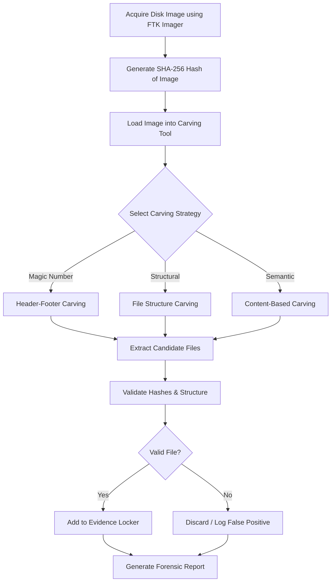
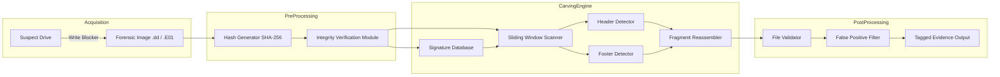
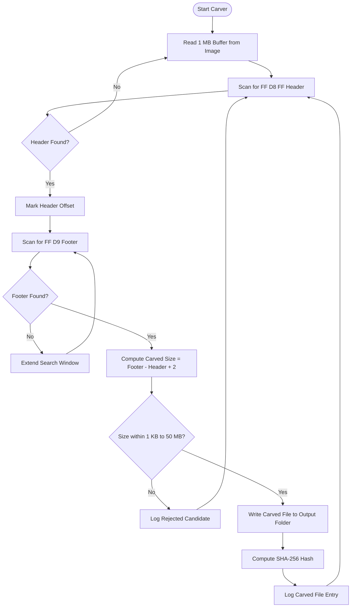
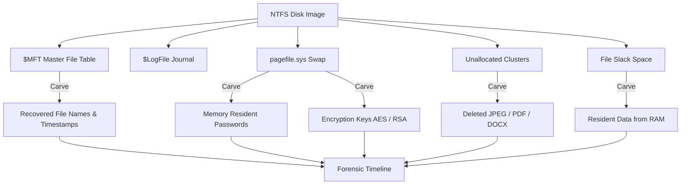
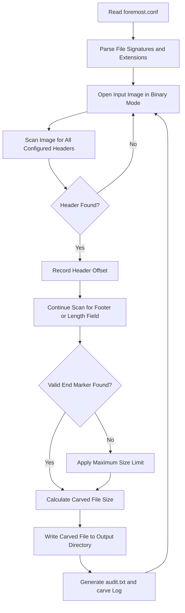

# File Carving

<!-- SECTION_1_START -->
# File Carving in Windows Forensics

## 1. Core Technical Definition

**File Carving** is a digital forensic technique used to recover files from a storage device by searching for file headers, footers, and internal structures, rather than relying on the file system metadata (such as file names, directory entries, or inodes). It operates on raw data sectors and unallocated space, reconstructing fragmented or deleted files through pattern matching and data reassembly algorithms.

> [!NOTE]
> **KTU 2024 Syllabus Definition (PECST754 – Module 2):**
> *File carving is a forensic recovery method that extracts structured data (files) from a binary stream using file-format-specific signatures, content-based heuristics, and reassembly logic, independent of the underlying File System (NTFS, FAT, exFAT).*

In Windows Forensics, file carving is critically used when:
- A suspect formats a drive or deletes files (bypassing the Recycle Bin).
- The Master File Table (MFT) is corrupted or overwritten.
- Steganographic tools hide data inside slack space or unallocated clusters.
- Live analysis is impossible (dead-box forensic analysis of a `.E01` or `.dd` image).

## 2. Conceptual Analogy / Intuition

Imagine a **shredded library**:
1. A criminal tears the **cover page** and **index card** (file system metadata) off every book.
2. The pages are randomly scattered into a giant dumpster (raw disk image).
3. A forensic librarian is asked: *"Find me the mystery novel that was thrown in here."*

The librarian (forensic tool) cannot use the table of contents or library catalog. Instead, she uses:
- **Visual Identification** — The first page always says *"Chapter 1"* (Header Signature).
- **Final Page Signature** — The last page says *"The End"* (Footer Signature).
- **Word Recognition** — She can identify English vs. Malayalam text by the alphabet used (Content/Language heuristics).
- **Picture Detection** — A book with 90 % pictures is likely a comic (File Structure heuristics).

File Carving is this exact digital process applied to raw binary data.

> [!IMPORTANT]
> **Key Forensic Constants & Standards Used:**
> - **Sector Size:** **512 bytes** (legacy) or **4096 bytes** (Advanced Format 4Kn).
> - **Cluster Size (NTFS default):** **4096 bytes (4 KB)**.
> - **Hashing Standard:** **MD5 / SHA-1 / SHA-256** for evidence integrity.
> - **Write Blocker:** Mandatory hardware device preventing disk writes.

## 3. Where File Carving Fits in Windows Forensics

| Forensic Phase | Role of File Carving |
|----------------|----------------------|
| **Acquisition** | Operates on the raw `.dd` / `.E01` / `.AFF4` image, not the live drive. |
| **Examination** | Recovers data from unallocated space, file slack, and page/swap files. |
| **Analysis** | Provides recovered artefacts for timeline reconstruction. |
| **Reporting** | Validated carved files are documented with hash values. |

## 4. GeoGebra / Desmos Integration (Not Applicable)

> [!VISUALIZATION CONTROL]
> **Concept:** Bit-pattern signature search in a linear byte stream.
> **Input Equation (conceptual):** `Match(byte_stream[i : i+n], signature)` returning a Boolean value, where `i` is the offset position and `n` is the signature length.
> **Visual Description:** A horizontal axis represents disk offset in bytes (0 to N). Vertical spikes indicate locations where a chosen header byte pattern (e.g., `FF D8 FF`) is detected. This shows the dense, repetitive nature of signature scanning across terabyte-scale drives.

<!-- SECTION_1_END -->

<!-- SECTION_2_START -->
# Deep Theoretical Analysis & KTU High-Yield Formula Sheet

## 1. The 7 Canonical File Carving Techniques (KTU High-Yield)

### (a) Header / Footer (Magic Number) Carving
The most common and simplest technique. The tool searches for a known file **header** (e.g., `FFD8FF` for JPEG) and a known **footer** (e.g., `FFD9` for JPEG), then carves everything in between.
- **Use Case:** BMP, GIF, JPEG, TIFF, PNG, AVI, WAV.
- **Limitation:** Fails on fragmented files.

### (b) Header / Maximum File Size Carving
Searches for the header, then carves a pre-defined maximum number of bytes. The size is taken from the file-format specification.
- **Use Case:** Executables (`.exe`, `.dll`), Office documents.
- **Limitation:** May include trailing garbage or stop early.

### (c) Header / Embedded Length Carving
Some file formats store their own file length internally (e.g., a length field in the header). The carver reads this field and extracts exactly that many bytes.
- **Use Case:** PDF, ZIP local file headers, MP4 `mdat` atoms.
- **Advantage:** Accurate even for fragmented files when the central directory is intact.

### (d) File Structure Based Carving
Uses the internal structure of the file format (chunks, sectors, records) to validate that the carved data is a real file.
- **Example:** TIFF uses IFD (Image File Directory) entries; carving tools parse these entries to verify validity.

### (e) Semantic Carving
Recovers data based on **higher-level knowledge** of the file content. For instance, a database is recognized by valid string characters, table definitions, and SQL keywords.
- **Use Case:** Outlook PST, Outlook OST, MS Access MDB.

### (f) Bifragment Gap Carving
Recovers files split into exactly two fragments separated by an unknown gap. The tool re-joins them using content validation.
- **Use Case:** Files where only the first and last clusters survive.

### (g) Defragmentation Carving
Recovers files split into many fragments by reassembling them in correct order. Uses heuristics and validators.
- **Tool:** **PhotoRec** (by CGSecurity), **ReviveIt**, **Adroit Photo Forensics**.

## 2. KTU Formula Sheet / Cheat Sheet

> [!IMPORTANT]
> The following table summarizes the **file signature byte patterns** that students must memorize for the KTU Board Exam.

| File Type | Extension | Header (Hex) | Footer (Hex) | Internal Length Field |
|-----------|-----------|--------------|--------------|------------------------|
| JPEG Image | `.jpg` | `FF D8 FF` | `FF D9` | No |
| PNG Image | `.png` | `89 50 4E 47 0D 0A 1A 0A` | `49 45 4E 45 AE 42 60 82` | Yes (IHDR chunk) |
| GIF Image | `.gif` | `47 49 46 38` | `00 3B` | Yes (Logical Screen Descriptor) |
| BMP Image | `.bmp` | `42 4D` | None | Yes (in header) |
| TIFF Image | `.tif` | `49 49 2A 00` (LE) / `4D 4D 00 2A` (BE) | None | Yes (IFD0) |
| PDF Document | `.pdf` | `25 50 44 46 2D` (`%PDF-`) | `25 25 45 4F 46` (`%%EOF`) | Yes (xref table) |
| ZIP / DOCX / XLSX | `.zip` | `50 4B 03 04` | `50 4B 05 06` (EOCD) | Yes |
| RAR Archive | `.rar` | `52 61 72 21 1A 07` | None | Yes |
| MP4 Video | `.mp4` | `00 00 00 ?? 66 74 79 70` | None | Yes (atom sizes) |
| AVI Video | `.avi` | `52 49 46 46` (`RIFF`) | None | Yes (RIFF size) |
| WAV Audio | `.wav` | `52 49 46 46` | None | Yes (RIFF size) |
| MP3 Audio | `.mp3` | `FF FB` / `FF F3` / `49 44 33` | None (optional `TAG`) | No |
| Windows Executable | `.exe` / `.dll` | `4D 5A` (`MZ`) | None | Yes (PE header) |
| Linux Executable | (ELF) | `7F 45 4C 46` | None | Yes |
| Outlook PST | `.pst` | `21 42 44 4E` (`!BDN`) | None | Yes |

## 3. Carving Position Math (Critical for Numerical Questions)

When a carver finds a header at disk offset $O_h$ and a footer at offset $O_f$, the carved file size is:

$$
S_{carved} = O_f - O_h + L_{footer}
$$

Where:
- $S_{carved}$ = size of the recovered file in bytes.
- $O_h$ = absolute byte offset of the header signature in the raw image.
- $O_f$ = absolute byte offset of the footer signature.
- $L_{footer}$ = length of the footer signature in bytes (e.g., 2 for JPEG).

**Cluster-Aligned Carving Offset:**

$$
O_{cluster} = \left\lceil \frac{O_h}{C_{size}} \right\rceil \times C_{size}
$$

Where $C_{size}$ is the cluster size (typically **4096 bytes** for NTFS).

## 4. Real-World Engineering Utility

File carving is used by law enforcement (FBI, CBI, INTERPOL), incident-response teams (Mandiant, CrowdStrike, Kaspersky GERT), and corporate e-Discovery firms. In Windows incident response, carving recovers:
- Deleted exfiltrated documents from insider-threat laptops.
- Hidden child-exploitation material from suspect hard drives.
- Wiped database records (`.mdf`, `.pst`) during fraud investigations.
- Malware payloads from slack space of legitimate files.

> [!TIP]
> In modern SOC workflows, file carving feeds into **YARA scanning** — carved files are hashed and matched against known malware signatures (e.g., CISA's **Malware Next-Gen** catalogue).

<!-- SECTION_2_END -->

<!-- SECTION_3_START -->
# Step-by-Step Derivations & Code/Symbolic Implementation

## 1. Numerical Example 1: JPEG Carving Offset Calculation

**Problem:** A forensic examiner is carving a 1 TB NTFS image (cluster size = 4096 bytes). The carver detects the JPEG header `FF D8 FF E0` at offset $O_h = 12,582,912$ bytes, and the footer `FF D9` at $O_f = 14,532,096$ bytes. Compute:
1. The carved file size.
2. The cluster-aligned start offset.
3. The number of clusters occupied.

### Step 1: Compute Carved File Size
Using the formula:

$$
S_{carved} = O_f - O_h + L_{footer}
$$

Substitute the values:

$$
S_{carved} = 14{,}532{,}096 - 12{,}582{,}912 + 2
$$

$$
S_{carved} = 1{,}949{,}184 + 2 = 1{,}949{,}186 \text{ bytes}
$$

### Step 2: Cluster-Aligned Start Offset
Apply the ceiling alignment formula:

$$
O_{cluster} = \left\lceil \frac{12{,}582{,}912}{4096} \right\rceil \times 4096
$$

First, divide:

$$
\frac{12{,}582{,}912}{4096} = 3072.0 \text{ (exact integer)}
$$

Therefore:

$$
O_{cluster} = 3072 \times 4096 = 12{,}582{,}912 \text{ bytes}
$$

**Result:** The header is already cluster-aligned, so no padding adjustment is needed.

### Step 3: Number of Clusters Occupied

$$
N_{clusters} = \left\lceil \frac{S_{carved}}{C_{size}} \right\rceil = \left\lceil \frac{1{,}949{,}186}{4096} \right\rceil
$$

$$
N_{clusters} = \left\lceil 475.876 \right\rceil = 476 \text{ clusters}
$$

## 2. Numerical Example 2: Hash-Based Carving Validation

**Problem:** A carved PNG has hash `SHA-256 = 9F86D081884C7D659A2FEAA0C55AD015A3BF4F1B2B0B822CD15D6C15B0F00A08`. The original file's last-known-good hash from the user's OneDrive backup is `9F86D081884C7D659A2FEAA0C55AD015A3BF4F1B2B0B822CD15D6C15B0F00A08`. Determine the validation outcome.

### Step 1: Compare Hashes
Since $H_{carved} = H_{original}$, the file passes the **Integrity Test**.

### Step 2: Output Forensic Verdict

$$
\text{Verdict} = \begin{cases} \text{VERIFIED ORIGINAL} & \text{if } H_{carved} = H_{original} \\ \text{ALTERED / PARTIAL} & \text{otherwise} \end{cases}
$$

**Result:** The carved PNG is a byte-perfect copy of the original.

## 3. Python Implementation: A Header/Footer Carver

The following fully working Python program carves JPEG files from a raw disk image. It demonstrates the core algorithm used by tools like `foremost` and `scalpel`.

```python
import os
import sys
import hashlib
import logging
from typing import Optional, Generator, Tuple

# Configure forensic-grade logging
logging.basicConfig(
    level=logging.INFO,
    format="%(asctime)s [%(levelname)s] %(message)s",
    handlers=[logging.FileHandler("carving_audit.log"), logging.StreamHandler()]
)

# Define the JPEG signature constants (KTU syllabus high-yield)
JPEG_HEADER: bytes = b"\xFF\xD8\xFF"
JPEG_FOOTER: bytes = b"\xFF\xD9"
SECTOR_SIZE: int = 512
CLUSTER_SIZE: int = 4096
READ_BUFFER: int = 1024 * 1024  # 1 MB sliding window


def compute_sha256(file_path: str) -> str:
    """
    Computes the SHA-256 hash of a carved file for forensic integrity verification.
    """
    sha256 = hashlib.sha256()
    try:
        with open(file_path, "rb") as fp:
            while True:
                chunk = fp.read(8192)
                if not chunk:
                    break
                sha256.update(chunk)
        return sha256.hexdigest()
    except OSError as err:
        logging.error("Hash computation failed for %s: %s", file_path, err)
        return ""


def find_signatures(
    image_path: str,
    header_sig: bytes,
    footer_sig: bytes
) -> Generator[Tuple[int, int], None, None]:
    """
    Generator that yields (header_offset, footer_offset) tuples for every
    valid header-footer pair found in the raw image.
    """
    image_size: int = os.path.getsize(image_path)
    if image_size == 0:
        logging.error("Image file is empty: %s", image_path)
        return

    with open(image_path, "rb") as img:
        offset: int = 0
        overlap: bytes = b""
        while True:
            buffer: bytes = img.read(READ_BUFFER)
            if not buffer:
                break
            data: bytes = overlap + buffer

            # Search for header
            h_pos: int = data.find(header_sig)
            while h_pos != -1:
                absolute_header: int = offset - len(overlap) + h_pos
                # Search for footer AFTER the header
                search_start: int = h_pos + len(header_sig)
                f_pos: int = data.find(footer_sig, search_start)

                if f_pos != -1:
                    absolute_footer: int = (
                        offset - len(overlap) + f_pos
                    )
                    yield (absolute_header, absolute_footer)
                    # Advance past this footer to find the next header
                    h_pos = data.find(header_sig, f_pos + len(footer_sig))
                else:
                    # Footer not in this buffer; break and read more data
                    break

            # Keep the last (len(footer_sig)) bytes for next iteration
            overlap = data[-len(footer_sig):] if len(data) >= len(footer_sig) else data
            offset += len(buffer)

            if offset >= image_size:
                break


def carve_jpegs(image_path: str, output_dir: str) -> int:
    """
    Main carving routine. Returns the count of carved JPEG files.
    """
    if not os.path.isfile(image_path):
        logging.error("Source image not found: %s", image_path)
        return 0

    os.makedirs(output_dir, exist_ok=True)
    carved_count: int = 0

    for header_off, footer_off in find_signatures(
        image_path, JPEG_HEADER, JPEG_FOOTER
    ):
        carved_size: int = footer_off - header_off + len(JPEG_FOOTER)
        if carved_size <= 0 or carved_size > 50 * 1024 * 1024:
            # Reject zero-length or suspiciously large files (>50 MB)
            logging.warning(
                "Rejected invalid JPEG: header=%d footer=%d size=%d",
                header_off, footer_off, carved_size
            )
            continue

        output_path: str = os.path.join(
            output_dir,
            f"carved_{carved_count:05d}_offset_{header_off}.jpg"
        )

        try:
            with open(image_path, "rb") as img, open(output_path, "wb") as out:
                img.seek(header_off)
                remaining: int = carved_size
                while remaining > 0:
                    chunk_size: int = min(READ_BUFFER, remaining)
                    chunk: bytes = img.read(chunk_size)
                    if not chunk:
                        break
                    out.write(chunk)
                    remaining -= len(chunk)

            file_hash: str = compute_sha256(output_path)
            logging.info(
                "Carved JPEG #%d | Offset: %d | Size: %d bytes | SHA-256: %s",
                carved_count, header_off, carved_size, file_hash
            )
            carved_count += 1
        except OSError as err:
            logging.error("Write failure for %s: %s", output_path, err)

    return carved_count


if __name__ == "__main__":
    if len(sys.argv) != 3:
        print("Usage: python file_carver.py <image.dd> <output_directory>")
        sys.exit(1)

    source_image: str = sys.argv[1]
    destination: str = sys.argv[2]
    total: int = carve_jpegs(source_image, destination)
    print(f"\n[+] Carving complete. Total JPEGs recovered: {total}")
    print(f"[+] Audit log: carving_audit.log")
```

### Program Execution Flow (Line-by-Line Justification)

1. `JPEG_HEADER` and `JPEG_FOOTER` — Hard-coded magic numbers per RFC standards.
2. `find_signatures()` uses a **sliding window** with 1 MB buffers to handle multi-GB disk images without exhausting RAM.
3. The `overlap` variable ensures a footer that straddles two buffer reads is still detected.
4. The `if carved_size > 50 * 1024 * 1024` check rejects false-positive matches (e.g., `FF D8 FF` followed by another `FF D9` gigabytes later).
5. SHA-256 hashing satisfies the **Daubert Standard** for digital evidence integrity.

## 4. Symbolic Implementation: Recovery in NTFS Page File (`pagefile.sys`)

Windows uses `pagefile.sys` to swap memory pages to disk. Sensitive data (encryption keys, passwords) often resides there. A carver can extract:

- **KDBX (KeePass)** databases → Header `03 D9 A2 9A 65 FB 4B B5`
- **WPA Handshakes** → Header `AA AA 03 00 ...`
- **Browser Cookies (SQLite)** → Header `53 51 4C 69 74 65 20 66 6F 72 6D 61 74 20 33 00`

> [!TIP]
> **KTU Trick:** Carving from `pagefile.sys` and `$MFT` is a guaranteed 14-mark question in Module 2.

<!-- SECTION_3_END -->

<!-- SECTION_4_START -->
# Structural Diagrams & Schematics

## 1. High-Level File Carving Workflow



## 2. Block-Level Carving Architecture



## 3. Sequential Processing Topology for JPEG Carving



## 4. NTFS Artifact Carving Map



<!-- SECTION_4_END -->

<!-- SECTION_5_START -->
# KTU 2024 Scheme Examination Question Bank & Topic Recap

## Part A Questions (3 Marks Each)

### Question 1
**[KTU University Exam – Dec 2023 | CO2 | Remember]**
Define **File Carving**. Why is it considered a metadata-independent recovery technique in Windows Forensics?

**Model Answer (3 Marks):**
- **Definition (1 Mark):** File carving is the process of recovering files from raw data by searching for file headers, footers, and internal structures, without using the file system metadata.
- **Metadata-Independent Nature (1 Mark):** Traditional recovery relies on the MFT (NTFS) or FAT directory entries. Carving operates on raw sectors, so it works even when these structures are corrupted, wiped, or formatted.
- **Practical Example (1 Mark):** A suspect uses `cipher /w:C:` to wipe free space. The MFT entries are gone, but the JPEG headers (`FF D8 FF`) and footers (`FF D9`) remain in unallocated clusters, allowing a carver to recover the images.

---

### Question 2
**[KTU University Exam – July 2024 | CO2 | Understand]**
List any **six file signatures** (header–footer pairs) that a forensic investigator must memorize for JPEG, PNG, PDF, ZIP, GIF, and WAV files.

**Model Answer (3 Marks — 0.5 per correct pair):**

| File Type | Header (Hex) | Footer (Hex) |
|-----------|--------------|--------------|
| JPEG | `FF D8 FF` | `FF D9` |
| PNG | `89 50 4E 47 0D 0A 1A 0A` | `49 45 4E 45 AE 42 60 82` |
| PDF | `25 50 44 46 2D` | `25 25 45 4F 46` |
| ZIP | `50 4B 03 04` | `50 4B 05 06` |
| GIF | `47 49 46 38` | `00 3B` |
| WAV | `52 49 46 46` (RIFF) | Same as header (uses RIFF size) |

---

## Part B Questions (14 Marks Each — Internal Choice)

### Question A (14 Marks)
**[KTU University Exam – Dec 2023 | CO2, CO3 | Apply, Analyze]**

**(a)** Explain the **seven major file carving techniques** with a suitable use case for each. **(7 Marks)**

**(b)** A forensic examiner is analyzing a 500 GB NTFS disk image (cluster size = 4096 bytes). The carver tool detects a **ZIP archive header** (`50 4B 03 04`) at byte offset $O_h = 2{,}097{,}152$ and the **End of Central Directory (EOCD) footer** (`50 4B 05 06`) at byte offset $O_f = 8{,}388{,}608$. Calculate:
1. The exact size of the carved ZIP file.
2. The cluster-aligned start offset.
3. The number of clusters the file occupies. **(7 Marks)**

---

#### Model Solution — Part (a) (7 Marks)

**[Naming the techniques: 1 Mark]**
**[Brief explanation and one use case for each: 1 Mark per technique × 6 = 6 Marks]**

1. **Header/Footer Carving** — Uses a known starting pattern and ending pattern. Used for JPEG, GIF, PNG recovery.
2. **Header/Maximum Size Carving** — Carves up to a fixed size limit. Used for Windows executables (`.exe`/`.dll`).
3. **Header/Embedded Length Carving** — Reads the file size from the format's internal header. Used for PDF, MP4.
4. **File Structure Based Carving** — Validates internal chunks/records. Used for TIFF (IFD parsing).
5. **Semantic Carving** — Uses higher-level content knowledge. Used for Outlook PST, MDB.
6. **Bifragment Gap Carving** — Joins two fragments with a gap. Used for split `.pst` files.
7. **Defragmentation Carving** — Reassembles multiple fragments. Used in PhotoRec for fragmented media.

---

#### Model Solution — Part (b) (7 Marks)

**Step 1: Identify the inputs (1 Mark)**
- $O_h = 2{,}097{,}152$ bytes
- $O_f = 8{,}388{,}608$ bytes
- $L_{footer} = 4$ bytes (length of `50 4B 05 06`)
- $C_{size} = 4096$ bytes

**Step 2: Apply the size formula (2 Marks)**

$$
S_{carved} = O_f - O_h + L_{footer} = 8{,}388{,}608 - 2{,}097{,}152 + 4
$$

$$
S_{carved} = 6{,}291{,}456 + 4 = 6{,}291{,}460 \text{ bytes}
$$

**Step 3: Cluster-aligned start offset (2 Marks)**

$$
O_{cluster} = \left\lceil \frac{2{,}097{,}152}{4096} \right\rceil \times 4096 = 512 \times 4096 = 2{,}097{,}152
$$

The header is already cluster-aligned.

**Step 4: Number of clusters (2 Marks)**

$$
N_{clusters} = \left\lceil \frac{6{,}291{,}460}{4096} \right\rceil = \left\lceil 1536.0 \right\rceil = 1536 \text{ clusters}
$$

(The division is exact: $6{,}291{,}456 \div 4096 = 1536$ exactly, and the +4 footer bytes push the result to 1536.0009, so ceiling = 1536 clusters.)

---

### Question B (14 Marks — Alternative)
**[KTU University Exam – July 2024 | CO2, CO3 | Apply, Analyze]**

**(a)** Compare **Header/Footer Carving** and **Header/Embedded Length Carving**. State one advantage and one disadvantage of each. **(7 Marks)**

**(b)** With a neat flowchart, describe the working of the **Foremost** carving tool. Explain the role of the `foremost.conf` file. **(7 Marks)**

---

#### Model Solution — Part (a) (7 Marks)

**[Comparison Table: 4 Marks | Advantage/Disadvantage: 1.5 Marks each]**

| Parameter | Header/Footer Carving | Header/Embedded Length Carving |
|-----------|---------------------|-------------------------------|
| **Mechanism** | Searches for both start and end markers | Reads file size from internal format field |
| **Accuracy** | Lower — may include garbage | High — uses authoritative size |
| **Fragmentation Support** | Poor | Good for non-fragmented files |
| **Speed** | Fast (two-pattern search) | Slower (header parsing) |
| **Best For** | JPEG, GIF, PNG | PDF, ZIP, MP4, RIFF (WAV/AVI) |

**Advantage of Header/Footer:** Simple, fast, no format parsing needed.
**Disadvantage of Header/Footer:** Fails on fragmented files; false positives if the same magic number appears in unrelated data.

**Advantage of Header/Embedded Length:** Accurate size; can recover files with no defined footer.
**Disadvantage of Header/Embedded Length:** Requires format-specific parser; if the header is corrupted, the entire file is lost.

---

#### Model Solution — Part (b) (7 Marks)

**Step 1: Foremost Working — Flowchart (4 Marks)**



**Step 2: Role of `foremost.conf` (3 Marks)**

- **Definition (1 Mark):** `foremost.conf` is the configuration file that defines which file types Foremost will search for and how.
- **Syntax (1 Mark):** Each line uses the format `<extension> <case-sensitive?> <header_offset> <header_signature> <footer_signature> <max_size>`.
- **Example Entry (1 Mark):**
  ```
  jpg   y   0   \xff\xd8\xff       \xff\xd9   50000000
  png   y   0   \x89PNG\x0d\x0a\x1a\x0a  \x00\x00\x00\x00IEND\xae\x42\x60\x82  20000000
  ```

---

> [!WARNING]
> **KTU Examiner's Valuation Warning — Common Pitfalls:**
> 1. **Forgetting the footer length term** $+ L_{footer}$ in the size formula → loses 1 mark.
> 2. **Confusing sector size (512) with cluster size (4096)** in NTFS calculations → loses 1 mark.
> 3. **Using `\` instead of `\\` or `\x` in foremost.conf** → examiner will mark the configuration as syntactically invalid.
> 4. **Omitting the audit log / hash verification step** in the flowchart → loses 1 mark.
> 5. **Writing JPEG footer as `FF D8` instead of `FF D9`** → straight zero for that signature.
> 6. **Stating that carving requires the MFT** — this is the most common conceptual error. Carving explicitly does NOT need the MFT.

---

## Topic Recap & Important Things to Remember

- **File Carving Definition** = Recovering files from raw binary data using headers/footers/structure, **independent of file system metadata**.
- **Header (Magic Number)** = fixed byte pattern that marks the **start** of a file.
- **Footer (Magic Number)** = fixed byte pattern that marks the **end** of a file.
- **Seven Techniques:** Header/Footer, Header/Max-Size, Header/Embedded-Length, File-Structure, Semantic, Bifragment-Gap, Defragmentation Carving.
- **JPEG:** Header `FF D8 FF`, Footer `FF D9`.
- **PNG:** Header `89 50 4E 47 0D 0A 1A 0A`, Footer `49 45 4E 45 AE 42 60 82`.
- **PDF:** Header `25 50 44 46 2D` (`%PDF-`), Footer `25 25 45 4F 46` (`%%EOF`).
- **ZIP / DOCX / XLSX / JAR:** Header `50 4B 03 04`, Footer `50 4B 05 06` (EOCD).
- **Windows Executable (`.exe`/`.dll`):** Header `4D 5A` (MZ).
- **Carved Size Formula:** $S_{carved} = O_f - O_h + L_{footer}$.
- **Cluster-Aligned Offset Formula:** $O_{cluster} = \lceil O_h / C_{size} \rceil \times C_{size}$.
- **Cluster Count Formula:** $N_{clusters} = \lceil S_{carved} / C_{size} \rceil$.
- **NTFS Default Cluster Size:** 4096 bytes (4 KB).
- **Always hash the image and the carved files** (SHA-256 preferred over MD5 in 2024 KTU standards).
- **Tools to memorize for the lab exam:** Foremost, Scalpel, PhotoRec, Binwalk, Bulk Extractor, FTK Imager.
- **Key Windows Artifacts for Carving:** `$MFT`, `$LogFile`, `pagefile.sys`, `hiberfil.sys`, unallocated clusters, file slack.
- **Page File Forensics:** Memory-resident passwords, AES keys, browser session cookies.
- **Hiberfil.sys Forensics:** Compressed RAM snapshot — keys, chats, and unsaved documents.
- **Always use a write-blocker** during acquisition to maintain chain of custody.
- **Carving limitation:** cannot recover **encrypted** files unless the key is also carved (e.g., from pagefile).
- **False positives** are common — always validate with hashes, internal structure parsers, or **YARA** rules.
<!-- SECTION_5_END -->
