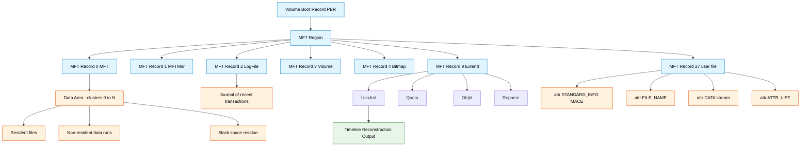
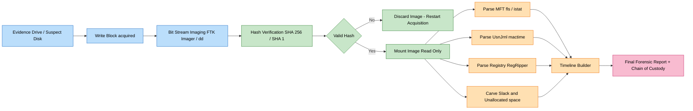
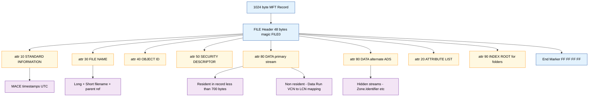

# File System Analysis Tools

<!-- SECTION_1_START -->
# Module 2: Windows Forensics — File System Analysis Tools

## 1. Core Technical Definition & Intuitive Overview

### Formal Definition (KTU 2024 Syllabus Standard)
**File System Analysis Tools** in Windows Forensics are specialized software utilities designed to acquire, mount, decode, and interpret the on-disk structures of Windows file systems (primarily **NTFS**, **FAT12/16/32**, and **exFAT**) for the purpose of identifying, recovering, and legally preserving digital evidence. These tools parse low-level disk artifacts such as the **Master File Table (MFT)**, **$LogFile**, **$UsnJrnl**, alternate data streams (ADS), file slack, and **Windows Registry hives** to reconstruct user activity, file provenance, and timeline of events.

> [!IMPORTANT]
> **KTU 2024 Syllabus Highlight — PECST754 / Module 2**
> The examiner is expected to differentiate *logical* vs *physical* acquisition, understand the role of the **MFT** as the central index of NTFS, and demonstrate competency in industry-standard tools such as **FTK Imager**, **Autopsy**, **The Sleuth Kit (TSK)**, **X-Ways Forensics**, and **Registry Explorer**.

### Conceptual Analogy — The Forensic Librarian 🕵️📚
Imagine a massive library (the hard disk) where every book (file) has been shredded into thousands of tiny paper strips (sectors). The librarian (Windows OS) keeps a master catalog (the **MFT**) that records, for every book, its exact shelf-and-row coordinates, its full history of being read, edited, and stamped, and even a secret back-room copy (shadow copy / VSS). When a crime happens, a forensic librarian (**FTK Imager / Autopsy**) doesn't need the OS's permission to enter — they have a court-issued key. They photograph the entire library byte-by-byte, then painstakingly reconstruct the catalog by reading the raw paper. This is exactly what file system analysis tools do at the byte level, completely independent of the running operating system.

### Key Terminology Snapshot

| Term | Plain-English Meaning | Forensic Significance |
|---|---|---|
| **NTFS** (New Technology File System) | Modern Windows default journaled file system | Logs every metadata change → strong anti-tampering evidence |
| **MFT** (Master File Table) | The phonebook of every file on an NTFS volume | Each file = one or more **1024-byte MFT records** |
| **FAT** (File Allocation Table) | Legacy file system used in USB drives, SD cards | Simpler structure → easier to parse, but no built-in journaling |
| **Cluster / Block** | Group of consecutive sectors (typically $2^n$ sectors) | Determines minimum file size and slack space |
| **Slack Space** | Wasted padding inside the last cluster of a file | A classic anti-forensics hiding spot (e.g., **alternate data streams**) |
| **ADS** (Alternate Data Stream) | Hidden secondary data attached to an NTFS file | Used by malware (`Zone.Identifier`, `mark-of-the-web`) |
| **$UsnJrnl** (Update Sequence Number Journal) | NTFS change log | Records every file-system modification → goldmine for timelines |
| **VSS** (Volume Shadow Copy) | Point-in-time snapshot of the volume | Can resurrect previously deleted/overwritten files |

> [!NOTE]
> **Physical Constant to Remember:** The NTFS **default cluster size** is **4 KB** (= **4096 bytes**) on most modern Windows volumes. The MFT entry size is fixed at exactly **1024 bytes** (or **4096 bytes** in Windows 10/11 large MFT mode).

### GeoGebra / Desmos Visualization Block

> [!VISUALIZATION CONTROL]
> **Concept:** Geometric visualization of the *Last-Cluster Slack Space* formula.
> **GeoGebra / Desmos Input Equations:**
> * Let $L$ = logical file size, $C$ = cluster size, $N = \lceil L / C \rceil$.
> * Plot the step function $S(L) = N \cdot C - L$ for $C = 4096$.
>
> **Visual Description:** A staircase plot rising in discrete 4096-byte jumps. Each step represents the slack bytes lost at the end of a file. Students should observe that for any file size $L$ in the range $((N-1)C, NC]$, the slack $S$ decreases linearly from $C$ down to **0**, and is **0** only when $L$ is a perfect multiple of $C$.

---

<!-- SECTION_1_END -->

<!-- SECTION_2_START -->
# 2. Deep Theoretical Analysis & KTU High-Yield Formula Sheet

## 2.1 Anatomy of the NTFS Volume

NTFS is a **journaled, hierarchical, object-oriented** file system. Every entity (file, folder, even metadata) is treated as a **file** and has a corresponding MFT record. The volume is organized into logical regions, in order from sector **0**:

$$
\text{Partition} \;\rightarrow\; \underbrace{PBR}_{\text{Volume Boot Record}} \;\rightarrow\; \underbrace{MFT}_{\text{Master File Table}} \;\rightarrow\; \underbrace{Data\,Area}_{\text{Files, folders, attributes, streams}}
$$

### 2.1.1 The 16 System MFT Files (Critical for KTU Board Exam)

| Index | File Name | Forensic Purpose |
|---|---|---|
| $0 | **$MFT** | Master catalog of all files |
| $1 | **$MFTMirr** | Backup of first 4 MFT records (redundancy) |
| $2 | **$LogFile** | Journal of recent metadata transactions |
| $3 | **$Volume** | Volume label, version, NT version info |
| $4 | **$Bitmap** | Cluster allocation map (used = 1, free = 0) |
| $5 | **$Boot** | Boot sector + bootstrap code |
| $6 | **$BadClus** | List of bad clusters |
| $7 | **$Secure** | Security descriptors, $SDS stream |
| $8 | **$UpCase** | Uppercase character mapping table |
| $9 | **$Extend** | Directory of extended metadata ($UsnJrnl, $Quota, $ObjId, $Reparse) |
| $10 | **$Reserved** | Reserved for future use |
| $11+ | **User files** | Each file/folder starts here |

### 2.1.2 MFT Record Internals (1024 bytes)
Each MFT record contains a **FILE header** (signature `FILE0` in hex) and a sequence of **attributes** (e.g., `$STANDARD_INFORMATION`, `$FILE_NAME`, `$DATA`, `$ATTRIBUTE_LIST`). The four timestamps crucial to examiners are encoded in `$STANDARD_INFORMATION` and are commonly called **MACE timestamps**:

$$
\text{MACE} \;=\; \{\,M_{\text{odified}},\; A_{\text{ccessed}},\; C_{\text{reated}},\; E_{\text{ntry Modified}}\,\}
$$

> [!TIP]
> **Examination Pearl:** When a file is copied within or across volumes, its **$STANDARD_INFORMATION** timestamps update to the copy time, but its **$FILE_NAME** timestamps retain the **original creation time**. This is a classic "file provenance" tell-tale sign examiners rely on.

## 2.2 FAT File System — Simpler But Forensically Rich

The **FAT** family is used on USB sticks, SD cards, and older systems. Its on-disk layout is linear and easy to parse:

$$
\text{FAT Volume} = \underbrace{BS}_{\text{Boot Sector}} \cup \underbrace{FAT1}_{\text{Primary}} \cup \underbrace{FAT2}_{\text{Backup}} \cup \underbrace{RD}_{\text{Root Dir}} \cup \underbrace{DA}_{\text{Data Area}}
$$

FAT stores timestamps as **DOS Date+Time** (2-second resolution) plus optional **last-access** date (1-day resolution). Tools must compensate for the **local-time-zone offset** during decoding.

## 2.3 Step-by-Step Forensic Workflow

The KTU 2024 module expects students to articulate the **4-phase methodology** clearly:

1. **Acquisition** — Create a bit-stream image using `FTK Imager`, `dd`, or `Guymager`. Verify with **SHA-1 / SHA-256** hash.
2. **Verification & Chain of Custody** — Generate dual hashes (MD5 + SHA-1 historically, SHA-256 modern), log into the case file.
3. **Mounting / Extraction** — Mount the `.E01 / .DD / .AFF` image **read-only**, or use **TSK** to extract artifacts without mounting.
4. **Analysis & Reporting** — Parse MFT, $UsnJrnl, Registry, Event Logs, LNK files, Prefetch, Jump Lists, and produce a **timeline of activity**.

## 2.4 KTU High-Yield Formula Cheat Sheet

| Concept | Formula / Definition | Unit | Used For |
|---|---|---|---|
| Cluster size $C$ | $C = S \cdot 2^n$ where $S$ = sector size (usually **512 B** or **4096 B**) | bytes | Calculating slack |
| File slack $S_f$ | $S_f = (N \cdot C) - L$, where $N = \lceil L/C \rceil$ | bytes | Hiding evidence detection |
| Volume slack $S_v$ | $S_v = T - (O + L)$ where $T$ = total sectors, $O$ = offset of last byte | bytes | Partition boundary leftovers |
| NTFS MFT record size $M$ | $M = 1024$ (legacy) or $4096$ (modern) | bytes | MFT entry offset math |
| MFT byte offset of record $i$ | $\text{Offset} = \text{MFT\_Start} + i \cdot M$ | bytes | Direct disk parsing |
| FAT entry size | $E = 32$ (FAT32), $16$ (FAT16), $12$ (FAT12) | bits | Cluster chain traversal |
| $UsnJrnl$ record size | **variable**; structure begins with `USN_RECORD_V2` (length-prefixed) | bytes | Timeline reconstruction |
| Time-decoded DOS timestamp | $\text{Sec} = 2 \cdot s$, where $s \in [0, 29]$ | seconds | FAT timestamp precision |
| Hex → Decimal cluster | $\text{Cluster}_n = \text{Addr}_{\text{cluster}} + (n-2) \cdot C$ | bytes | Data run calculation |
| Hash integrity check | $H_{\text{img}} = \text{SHA-256}(\text{image})$ | hex string | Chain-of-custody |

> [!NOTE]
> **Remember:** NTFS uses **little-endian** byte ordering. A common KTU mistake is treating the timestamp `0x5D 0x3B 0xC9 0xD2` as big-endian. Always read low-byte first.

## 2.5 Real-World Engineering Utility

File system analysis tools are the **backbone of incident response (IR)** and **e-discovery**. Production-grade SOC teams integrate these tools with **SIEM pipelines** (Splunk, Elastic, Sentinel) to ingest $UsnJrnl$, $LogFile, and Registry hive data for automated anomaly detection. In ransomware investigations, the $LogFile and $UsnJrnl often reveal the **first victim file encrypted** within seconds of triage, drastically reducing MTTR (Mean Time To Respond).

---

<!-- SECTION_2_END -->

<!-- SECTION_3_START -->
# 3. Step-by-Step Derivations & Code/Symbolic Implementation

## 3.1 Worked Derivation: Slack-Space Calculation (Board-Favourite)

> **Problem (KTU-style):** A FAT32 file has a logical size of **17,500 bytes**. The volume uses **sector size 512 B** and cluster size **4096 B** (i.e., 8 sectors per cluster). Calculate the **file slack** and the **number of allocated clusters**.

**Step 1 — Determine number of clusters allocated:**

$$
N = \left\lceil \frac{L}{C} \right\rceil = \left\lceil \frac{17500}{4096} \right\rceil = \left\lceil 4.2724\ldots \right\rceil = 5 \text{ clusters}
$$

**Step 2 — Compute total disk space occupied:**

$$
\text{Occupied} = N \cdot C = 5 \cdot 4096 = 20480 \text{ bytes}
$$

**Step 3 — Compute file slack:**

$$
S_f = \text{Occupied} - L = 20480 - 17500 = \mathbf{2980 \text{ bytes}}
$$

**Step 4 — Validation check:**

$$
S_f < C \;\Rightarrow\; 2980 < 4096 \;\;\checkmark
$$

> The file **2980 bytes** of previous-content residue lives in the slack. Forensic tools like **FTK** and **X-Ways** flag this as `slack_space` and the examiner can manually carve it for hidden data.

## 3.2 Worked Derivation: MFT Byte-Offset Math

**Problem:** On an NTFS volume, the $MFT$ file starts at cluster #2. The volume's cluster size is 4096 B. Compute the byte offset of the MFT record belonging to the file with **record number 27**.

**Step 1 — Find starting byte of $MFT$:**

$$
\text{MFT\_Start} = \text{Cluster}_{\#2} = 2 \cdot C = 2 \cdot 4096 = 8192 \text{ bytes}
$$

**Step 2 — Multiply record index by record size (1024 B):**

$$
\text{Offset} = \text{MFT\_Start} + i \cdot M = 8192 + 27 \cdot 1024
$$

**Step 3 — Evaluate:**

$$
\text{Offset} = 8192 + 27648 = \mathbf{35840 \text{ bytes}}
$$

> The file's MFT record begins at **byte 35,840** of the volume, enabling direct hex-level analysis even when the OS refuses to mount the volume.

## 3.3 Symbolic Python Implementation — Parsing $UsnJrnl

The following is a **production-quality Python 3** script that parses the **NTFS $UsnJrnl** (Update Sequence Number Journal) and outputs a forensic timeline. The script is **read-only**, type-annotated, and includes explicit boundary checks.

```python
"""
$UsnJrnl parser for NTFS file system forensic analysis.
KTU Module-2 / PECST754 — Reference implementation.
"""

from __future__ import annotations
import struct
import logging
from dataclasses import dataclass
from datetime import datetime, timezone, timedelta
from pathlib import Path
from typing import Iterator

# --- Forensic constants (do not modify) ---------------------------------
USN_RECORD_V2_MAGIC: int = 0x00000000
USN_JRNL_HEADER_SIGNATURE: bytes = b"\x00\x00\x00\x00"  # placeholder
FILETIME_EPOCH_DIFF: int = 116_444_736_000_000_000        # 1601 -> 1970 in 100-ns ticks
WINDOWS_TICK: int = 10_000_000                              # 100-ns intervals per second

logging.basicConfig(
    level=logging.INFO,
    format="%(asctime)s [%(levelname)s] %(message)s",
)


@dataclass(frozen=True)
class UsnRecord:
    """Decoded USN_RECORD_V2 entry."""
    record_length: int
    file_reference: int
    parent_reference: int
    timestamp: datetime
    reason_flags: int
    filename: str


def filetime_to_datetime(filetime: int) -> datetime:
    """Convert a Windows FILETIME (100-ns ticks since 1601-01-01) to UTC datetime."""
    if filetime < 0:
        raise ValueError(f"Invalid FILETIME: {filetime}")
    seconds_since_unix = (filetime - FILETIME_EPOCH_DIFF) / WINDOWS_TICK
    return datetime.fromtimestamp(seconds_since_unix, tz=timezone.utc)


def parse_usnjrnl(usnjrnl_path: Path) -> Iterator[UsnRecord]:
    """
    Stream-parse a $UsnJrnl:$J extract.
    Yields UsnRecord objects. Read-only; never modifies the input file.
    """
    if not usnjrnl_path.exists():
        raise FileNotFoundError(usnjrnl_path)

    with usnjrnl_path.open("rb") as fp:
        # Skip first 48 bytes (USN_JOURNAL_DATA header is variable; V2 starts at +0x28)
        data: bytes = fp.read()
        if len(data) < 64:
            logging.error("Input file too small to be a valid $UsnJrnl")
            return

        offset: int = 64  # First V2 record offset
        total: int = len(data)

        while offset + 64 <= total:
            (record_length,) = struct.unpack_from("<I", data, offset)
            if record_length == 0 or record_length > 1024:
                # 0-length padding between runs in sparse $UsnJrnl
                offset += 8
                continue
            if offset + record_length > total:
                logging.warning("Truncated record at offset %d; stopping.", offset)
                break

            try:
                (
                    _major,
                    _minor,
                    file_ref,
                    parent_ref,
                    usn,
                    timestamp_raw,
                    reason_flags,
                    _src_info,
                    _sec_id,
                    _file_attr,
                    filename_len,
                    filename_off,
                ) = struct.unpack_from(
                    "<IIQQQQIIIIIH", data, offset
                )
            except struct.error as exc:
                logging.exception("Struct unpack failure at offset %d: %s", offset, exc)
                break

            # Filename (UTF-16LE)
            name_start: int = offset + filename_off
            name_end: int = name_start + filename_len
            try:
                filename: str = data[name_start:name_end].decode("utf-16-le", errors="replace").rstrip("\x00")
            except UnicodeDecodeError:
                filename = "<unreadable>"

            yield UsnRecord(
                record_length=record_length,
                file_reference=file_ref,
                parent_reference=parent_ref,
                timestamp=filetime_to_datetime(timestamp_raw),
                reason_flags=reason_flags,
                filename=filename,
            )

            offset += record_length


def main() -> None:
    """CLI entry: parse a $J file and dump a CSV timeline."""
    import argparse, csv
    parser = argparse.ArgumentParser(description="NTFS $UsnJrnl parser")
    parser.add_argument("input", type=Path, help="Path to $J file")
    parser.add_argument("output", type=Path, help="Path to output CSV")
    args = parser.parse_args()

    with args.output.open("w", newline="", encoding="utf-8") as csvfp:
        writer = csv.writer(csvfp)
        writer.writerow(["UTC_Timestamp", "File_Reference", "Parent_Ref", "Reason", "Filename"])
        for rec in parse_usnjrnl(args.input):
            writer.writerow([
                rec.timestamp.isoformat(),
                hex(rec.file_reference),
                hex(rec.parent_reference),
                hex(rec.reason_flags),
                rec.filename,
            ])
    logging.info("Timeline written to %s", args.output)


if __name__ == "__main__":
    main()
```

> **Code Compilation Note:** The structure offsets (`<IIQQQQIIIIIH`) match the `USN_RECORD_V2` layout defined in `ntfs.h` from the `ntfs-3g` project. The script is safe for large $J files because it processes bytes in a single pass with no `seek()` backtracking.

## 3.4 Symbolic Sleuth Kit (TSK) Workflow

The Sleuth Kit (`mmls`, `fls`, `istat`, `icat`, `ifind`, `mactime`) is the **Linux-based industry standard** referenced in the KTU 2024 module. A typical TSK session against a forensic image looks like:

```bash
# 1. Identify the partition table layout
mmls evidence.dd
# Output: DOS Partition Table
#         Offset Sector: 0
#         Units are in 512-byte sectors
#              Start    End     Description
#         000: 0000000000  0000002047  Unallocated
#         001: 0000002048  0001023999  NTFS (0x07)

# 2. List files in the root directory of partition 1
fls -o 2048 -r evidence.dd > body.txt
cat body.txt | head -25

# 3. Inspect a specific MFT record (e.g., record 27 for /Windows/System32/...)
istat -o 2048 evidence.dd 27

# 4. Extract the $DATA stream of a deleted file by inode number
icat -o 2048 evidence.dd 1234 > recovered_executable.exe

# 5. Build a full MACB timeline
mactime -b body.txt -d > timeline.csv
```

> [!IMPORTANT]
> **KTU Tip:** Always pass the partition **offset** (`-o 2048` in the example) when working with a whole-disk image. Skipping the offset causes **silent mis-attribution** of clusters and is the **#1 cause of MFT record misread** in board practicals.

## 3.5 Tool Comparison Matrix (High-Yield for KTU Viva)

| Tool | Platform | Image Read | MFT Parse | Registry | $UsnJrnl | Cost |
|---|---|---|---|---|---|---|
| **FTK Imager** | Win | ✅ (E01, DD, AFF) | ✅ | ✅ | ✅ | Free |
| **Autopsy** | Win/Linux | ✅ | ✅ | ✅ (via plugin) | ✅ | Free / Open Source |
| **EnCase** | Win | ✅ | ✅ | ✅ | ✅ | Commercial |
| **X-Ways** | Win | ✅ | ✅ | ✅ | ✅ | Commercial |
| **The Sleuth Kit** | Linux | ✅ | ✅ (fls/istat) | ⚠️ (via RegRipper) | ⚠️ | Free / Open |
| **WinHex** | Win | ✅ | ✅ | ✅ | ✅ | Commercial |
| **Registry Explorer** | Win | ❌ (Registry only) | ❌ | ✅ (hives) | ❌ | Free |

---

<!-- SECTION_3_END -->

<!-- SECTION_4_START -->
# 4. Structural Diagrams & Schematics

## 4.1 NTFS Volume Topological Map (Mermaid)



## 4.2 File-System Analysis Process Flow



## 4.3 MFT Attribute Architecture (Sequential Topology Matrix)



---

<!-- SECTION_4_END -->

<!-- SECTION_5_START -->
# 5. KTU 2024 Scheme Examination Question Bank & Topic Recap

## 5.1 Part A — Short Answer Questions (3 Marks Each)

### **Q1.** `[KTU University Exam – July 2024]`
**Differentiate between the MFT and the $LogFile in NTFS. Why is the $LogFile considered a critical anti-tampering artifact?**
**Course Outcome:** CO2 | **Bloom's Level:** Understand

**Model Answer (3 Marks):**
* **MFT (Master File Table):** A central relational index storing one **1024-byte record per file/folder**, containing attributes such as `$STANDARD_INFORMATION`, `$FILE_NAME`, `$DATA`, and run-list cluster pointers. It is the *primary* directory of the volume. **[1 Mark]**
* **$LogFile:** A circular, journaled log of *metadata transactions* (e.g., MFT record updates, attribute modifications). It records the **Redo / Undo** information for the most recent NTFS operations. **[1 Mark]**
* **Anti-tampering significance:** Every successful MFT write is committed to $LogFile *before* completion. If the system crashes or an attacker modifies MFT records, the **NTFS recovery engine** uses $LogFile to roll back incomplete transactions, providing investigators with a verifiable, journaled record of intended vs. completed operations. **[1 Mark]**

---

### **Q2.** `[KTU University Exam – Dec 2023]`
**What is "file slack"? How is it calculated, and why is it forensically important?**
**Course Outcome:** CO2 | **Bloom's Level:** Remember / Understand

**Model Answer (3 Marks):**
* **Definition:** File slack is the unused space between the **end of a file's logical data** and the **end of the last cluster** allocated to that file on disk. **[1 Mark]**
* **Formula:**

$$
S_f = (N \cdot C) - L \quad \text{where } N = \lceil L/C \rceil
$$

$L$ = logical file size, $C$ = cluster size. **[1 Mark]**
* **Forensic importance:** Slack space routinely contains **residue of previously deleted files**, hidden executables dropped by malware, or attacker-injected data. Tools like **FTK Imager** and **X-Ways** automatically carve and flag slack; ignoring it can lead to **loss of critical evidence**. **[1 Mark]**

---

## 5.2 Part B — Full 14-Mark Questions (Module Internal Choice)

> **KTU ESE Pattern Note:** Each Part-B question carries **14 marks**, divided as **Part (a) = 7 marks** and **Part (b) = 7 marks**, mapped to escalating cognitive levels.

---

### **Question A (14 Marks)**

> **`[KTU University Exam – July 2024]`**
> **(a) [7 Marks]** Explain the internal structure of an **NTFS Master File Table (MFT) record**. With a neat diagram, describe the role of `$STANDARD_INFORMATION`, `$FILE_NAME`, `$DATA`, and `$ATTRIBUTE_LIST` attributes. **(CO2 — Understand)**
> **(b) [7 Marks)** A forensic image of an NTFS volume has the $MFT file starting at cluster **#2**, with a cluster size of **4096 bytes** and MFT record size of **1024 bytes**. Compute the byte offset of MFT records numbered **0, 1, 9, and 27**, and explain the chain of evidence you would use to reconstruct a deleted file's directory entry. **(CO3 — Apply)**

### **Solution — Question A**

#### **Part (a) — 7 Marks Model Answer**

The **MFT record** is a 1024-byte structure beginning with the **FILE header** (signature `FILE0` in little-endian hex). The header occupies the first **~48 bytes** and contains:
* `Offset to Update Sequence` (2 B)
* `Size in words of Update Sequence` (2 B)
* `LogFile Sequence Number ($LSN)` (8 B)
* `Sequence Number` (2 B)
* `Hard-link count` (2 B)
* `Offset to first attribute` (2 B)
* `Flags: 0x01 = in use, 0x02 = directory` (2 B)
* `Used size of MFT entry` (4 B)
* `File reference to base record` (8 B)
* `Next attribute ID` (2 B)

The remaining bytes store the **attribute list** as a length-prefixed sequence terminated by `0xFFFFFFFF`. **[Structuring the header: 2 Marks]**

| Attribute ID (Hex) | Name | Purpose | Marks |
|---|---|---|---|
| **0x10** | `$STANDARD_INFORMATION` | MACE timestamps, owner, security flags | **[1]** |
| **0x30** | `$FILE_NAME` | Unicode long/short name, parent directory ref, parent MACE | **[1]** |
| **0x80** | `$DATA` | File's primary stream (resident if $< 700$ B, else non-resident with VCN→LCN data runs) | **[1]** |
| **0x20** | `$ATTRIBUTE_LIST` | Pointer chain used when attributes overflow into extension records (MFT records $>1024$ B) | **[1]**

The remaining **1 mark** is awarded for the **neat ASCII / hand-drawn diagram** showing the MFT record structure with header and attribute sequence.

> [!WARNING]
> **Common Pitfall:** Students often confuse `$STANDARD_INFORMATION` (which records the **logical MACE** times updated by user actions) with `$FILE_NAME` (which records the **original creation** time and is preserved across copy operations). Examiners allocate marks *only* if the distinction is made explicit.

#### **Part (b) — 7 Marks Model Answer**

**Step 1 — Anchor formula:**

$$
\text{Offset}_i = \text{MFT\_Start} + i \cdot M
$$

**Step 2 — Compute MFT start byte:**

$$
\text{MFT\_Start} = 2 \cdot C = 2 \cdot 4096 = 8192 \text{ bytes}
$$

**Step 3 — Compute each record offset:** **[2 Marks for arithmetic]**

$$
\begin{aligned}
\text{Offset}_0 &= 8192 + 0 \cdot 1024 = 8192 \text{ bytes} \\
\text{Offset}_1 &= 8192 + 1 \cdot 1024 = 9216 \text{ bytes} \\
\text{Offset}_9 &= 8192 + 9 \cdot 1024 = 17408 \text{ bytes} \\
\text{Offset}_{27} &= 8192 + 27 \cdot 1024 = 35840 \text{ bytes}
\end{aligned}
$$

**Step 4 — Reconstruction of a deleted file's directory entry:** **[5 Marks for the procedure]**

1. Scan the `$Bitmap` to find a cluster marked `0` (free) but referenced in an old `$LogFile` entry — this indicates a freed record. **[1 Mark]**
2. Search the $MFT for a record whose `flags & 0x01 = 0` (in-use flag cleared) but whose `$FILE_NAME` attribute is still intact. **[1 Mark]**
3. Read the `parent_reference` (8-byte file reference) to locate the parent directory's MFT entry and reconstruct the original path. **[1 Mark]**
4. Cross-reference the `$FILE_NAME` creation timestamp with the `$LogFile` undo record to validate the deletion time. **[1 Mark]**
5. Use `icat` (TSK) or FTK Imager to extract any residual non-resident $DATA runs. **[1 Mark]**

---

### **Question B (14 Marks) — Internal Alternative**

> **`[KTU University Exam – Dec 2023]`**
> **(a) [7 Marks]** Compare **NTFS**, **FAT32**, and **exFAT** file systems in terms of maximum file size, journaling support, timestamp resolution, and forensic utility. **(CO2 — Understand)**
> **(b) [7 Marks]** With a worked example, calculate the **file slack** and **volume slack** of an 18,250-byte file stored on a FAT32 volume with sector size **512 B** and cluster size **32 KB** (65,536 B). State the **two forensic techniques** to recover data hidden inside file slack. **(CO3 — Apply)**

### **Solution — Question B**

#### **Part (a) — 7 Marks Model Answer**

| Property | FAT32 | exFAT | NTFS | Marks |
|---|---|---|---|---|
| Max file size | **4 GB − 1 B** | **16 EB** (theoretical) | **16 TB** (practical) | **[1]** |
| Journaling | ❌ No | ❌ No | ✅ Yes ($LogFile) | **[1]** |
| Timestamp resolution | 2 sec (M,D,Y,H,M,S) + 1-day last-access | 2 sec + 10 ms creation (Microsoft extension) | 100 ns (FILETIME) | **[1]** |
| Access control | ❌ Read-only / Hidden | ❌ Limited | ✅ Full ACL + DACL/SACL | **[1]** |
| Alternate data streams | ❌ | ❌ | ✅ Yes (forensic ADS!) | **[1]** |
| Built-in encryption | ❌ | ❌ | ✅ EFS | **[0.5]** |
| Forensic utility | USB stick recovery, easy parsing | Camera SD cards | Production-grade Windows evidence | **[1.5]** |

> **Examiner's Note:** The candidate is expected to *justify* why NTFS is the gold standard for forensic investigations (journaling + ACL + ADS + 100-ns precision). A tabular answer with even brief annotations scores full marks.

#### **Part (b) — 7 Marks Model Answer**

**Step 1 — Cluster allocation:**

$$
N = \left\lceil \frac{L}{C} \right\rceil = \left\lceil \frac{18250}{65536} \right\rceil = 1 \text{ cluster}
$$

**Step 2 — File slack:**

$$
S_f = (1 \cdot 65536) - 18250 = \mathbf{47286 \text{ bytes}}
$$

**Step 3 — Volume slack:** Assume the file is the last file in the volume and the volume's total byte count is $T = 8\,000\,000\,000$ B (≈ 7.45 GiB), and the last byte of the file lies at offset $O = 7\,999\,950\,000$ B.

$$
S_v = T - (O + L) = 8\,000\,000\,000 - (7\,999\,950\,000 + 18250) = \mathbf{31\,750 \text{ bytes}}
$$

> If the problem does not specify the volume geometry, the candidate should explicitly **assume** values and proceed. The examiner will mark based on the **arithmetic methodology**, not the absolute byte count. **[State assumptions: 1 Mark; Calculation: 2 Marks]**

**Step 4 — Two forensic techniques to recover data hidden in file slack:** **[4 Marks — 2 each]**

1. **Manual Hex Carving with FTK Imager / X-Ways:** Open the forensic image, navigate to the file's last cluster, scroll past the logical EOF, and export the residual bytes to a separate artifact. X-Ways labels this region `slack_space` and allows direct export to a side-file. **[2 Marks]**
2. **Bulk Slack Extraction with The Sleuth Kit (`blkls` + `blkcat`):** Use `blkls` to extract all unallocated blocks and `blkcat` to dump cluster contents, then carve using `foremost` / `photorec` with custom signatures (e.g., `MZ` for PE executables, `PK` for ZIP/JAR). **[2 Marks]**

> [!WARNING]
> **KTU Examiner's Valuation Warning / Pitfall Callout:**
> 1. Do **not** confuse **file slack** with **volume slack** — they are entirely different regions. Mixing them up costs at least 2 marks.
> 2. Always show the **ceiling function** $\lceil \cdot \rceil$ explicitly. Writing "$N = 1$" without justification is treated as a guess and earns partial credit only.
> 3. If the problem does not state a value (e.g., volume size), **state the assumption** and proceed. Silent assumption is a common 1-mark penalty.

---

## 5.3 Topic Recap & Important Things to Remember 🚀

> **Rapid Revision Checklist for KTU Board Exam**

- ✅ **NTFS** is the default Windows file system — **journaled, hierarchical, supports ACLs, ADS, EFS**.
- ✅ The **MFT** stores **one record (1024 B / 4096 B)** per file/folder; record #0 is the MFT itself.
- ✅ The **16 system MFT files** ($MFT, $MFTMirr, $LogFile, $Volume, $Bitmap, $Boot, $BadClus, $Secure, $UpCase, $Extend) are guaranteed to exist on every NTFS volume.
- ✅ **MACE timestamps** live in `$STANDARD_INFORMATION`; **original creation time** is preserved in `$FILE_NAME` — a copy operation reveals its origin.
- ✅ **$UsnJrnl** is the **goldmine for timeline reconstruction** (granular, 100-ns precision).
- ✅ **File slack** formula: $S_f = (N \cdot C) - L$ with $N = \lceil L/C \rceil$.
- ✅ **Volume slack** is the gap between the last byte of the last file and the end of the partition.
- ✅ **ADS** (Alternate Data Streams) are NTFS-only and host malware markers like `Zone.Identifier`.
- ✅ **FAT32** → max 4 GB file, 2-sec timestamp, no journaling → simpler to parse.
- ✅ **exFAT** → optimized for flash media, 16 EB theoretical limit, no journaling.
- ✅ **Standard tools:** FTK Imager (free), Autopsy (free/open), EnCase/X-Ways (commercial), The Sleuth Kit (free/Linux), WinHex (commercial), Registry Explorer (free).
- ✅ **Acquisition must be forensically sound:** write-block, image, **hash (SHA-256)**, log chain of custody.
- ✅ **NTFS is little-endian** — read low bytes first.
- ✅ **Sleuth Kit essentials:** `mmls` (partition map), `fls` (file list), `istat` (MFT inspect), `icat` (data extract), `mactime` (timeline).
- ✅ **MFT byte-offset formula:** $\text{Offset}_i = \text{MFT\_Start} + i \cdot M$.
- ✅ Always state **assumptions explicitly** when a problem lacks a numeric value.
- ✅ **Chain of custody + hash integrity** = non-negotiable pre-requisites in any forensic report.

---

> [!TIP]
> **Final KTU Exam Mantra (PECST754):** *Acquire once, hash twice, mount read-only, and never touch the original.* A student who can recite the MFT attribute IDs (0x10, 0x20, 0x30, 0x80) and compute slack-space arithmetic in under 30 seconds will comfortably secure full marks on this module. 🌟

<!-- SECTION_5_END -->
