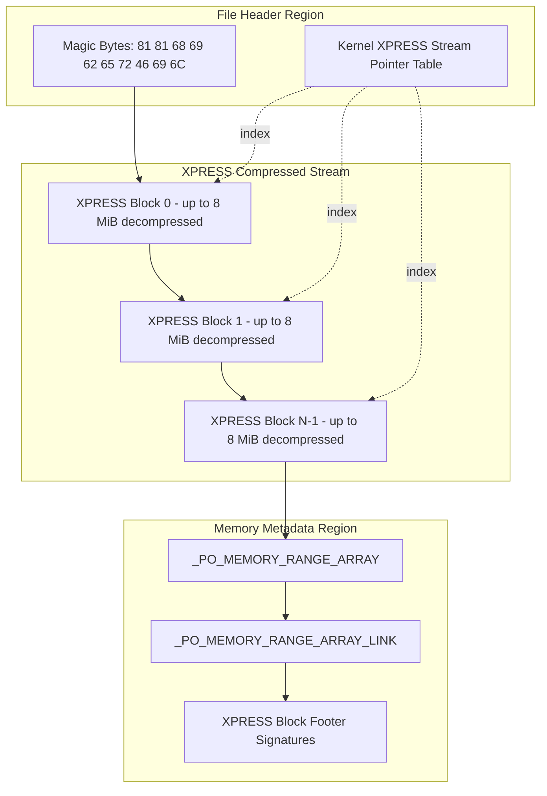
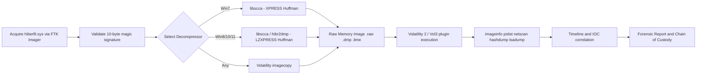
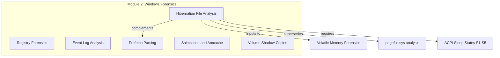

# Hibernation file analysis

<!-- SECTION_1_START -->
# Hibernation File Analysis — Windows Forensics

## 1. Core Technical Definition & Intuitive Overview

### Formal Academic Definition (KTU 2024 Syllabus Terminology)

> [!IMPORTANT]
> **Hibernation File (`hiberfil.sys`)** is a **hidden, system-protected, non-paged** binary artefact stored at the root of the system drive (typically `C:\hiberfil.sys`) that contains a **compressed, persistent snapshot of volatile physical memory (RAM)** captured at the moment the Windows kernel transitions the system into the **S4 (Hibernation) sleep state** under the ACPI power management specification. It is the largest and most complete userland-plus-kernel memory artefact available on a Windows endpoint, often rivalling the size of a full crash dump.

The file is governed by the Windows **Kernel-Power Subsystem** (`PopSystemS4` / `PopHibernateFile` routines inside `ntoskrnl.exe`) and is read back into RAM during the resume process by `PopResumeFromHibernate`.

### Conceptual Analogy / Intuition

> [!NOTE]
> **Analogy — The "Deep Freeze" Photograph of a Crime Scene**
> Imagine RAM is a busy crime scene with witnesses (running processes), fingerprints (registry keys in memory), footprints (network connections), and even a partially written diary (clipboard, unsaved documents). When the investigator says *"freeze the scene"*, the system takes a **single, deeply detailed photograph** of *every* item in the room and stuffs it into a heavy, compressed envelope labelled `hiberfil.sys`. Unlike the swap/pagefile (which only holds fragments tossed out of RAM), this envelope is a **complete clone** of volatile state — opening it is essentially time-traveling back to the exact microsecond the system was suspended.

### Key Constants & Standard Metrics

| Parameter | Default Value (Windows 10/11) |
|---|---|
| Path | `C:\hiberfil.sys` |
| Default size mode | **Full (100% of installed RAM)** |
| Reduced mode | **40% of installed RAM** (Win8+ for Fast Startup) |
| File system attributes | **Hidden, System, Archive, Not Indexed** |
| Page size for ranges | **4 KB (0x1000)** |
| Default compression | **XPRESS / XPRESS-Huffman** |
| Signature magic | `\x81\x81hiberFil` (first 10 bytes) |
| Alternate signature | `\x68\x69\x62\x72` (`hibr`, in big-endian) |

> [!IMPORTANT]
> **Critical Distinction (Frequently Examined):**
> `hiberfil.sys` ≠ `pagefile.sys` ≠ `MEMORY.DMP`
> * `hiberfil.sys` → compressed **entire RAM** snapshot
> * `pagefile.sys` → disk **paging** of excess memory pages
> * `MEMORY.DMP` → kernel crash **dump** (BSOD artefact)

### Power Configuration Linkage (KTU Module Mapping)

The size of `hiberfil.sys` is **directly proportional** to the active hibernation policy:

```text
powercfg /hibernate off         → 0%  (file removed)
powercfg /hibernate /type reduced → 40% of RAM (Win8 Fast Startup default)
powercfg /hibernate /type full   → 100% of RAM (classical, full suspend)
```

> [!VISUALIZATION CONTROL]
> **Concept:** File-size-to-RAM ratio bar visualisation
> **GeoGebra / Desmos Input Equations:**
> * `f(x) = 0.40 * x`        (Reduced mode line)
> * `g(x) = 1.00 * x`        (Full mode line)
> **Visual Description:** On the X-axis plot installed RAM (GB) and on the Y-axis plot resulting `hiberfil.sys` size (GB). Student should observe the linear relationship; a system with 16 GB RAM produces a 6.4 GB hibernation file in Reduced mode and a 16 GB file in Full mode.

---

<!-- SECTION_1_END -->

<!-- SECTION_2_START -->
# 2. Deep Theoretical Analysis & KTU High-Yield Formula Sheet

## 2.1 Internal Layout of `hiberfil.sys`

The file is **logically partitioned** into four top-level regions:

1. **XPRESS-Compressed Block Stream** — the entire payload.
2. **`_PO_MEMORY_RANGE_ARRAY`** — a metadata table describing which physical memory pages were stored.
3. **`_PO_MEMORY_RANGE_ARRAY_LINK`** — linked-list pointers chaining arrays.
4. **`XPRESS_BLOCK` headers** — variable-size compressed chunks (up to **8 MB** decompressed, **4 MB** in legacy Win7).

> [!NOTE]
> The **decompressed output** of the XPRESS stream, once inflated, is a **bit-exact copy of physical RAM**. This is why forensic extraction effectively gives the examiner a **live memory image** for Volatility/Recera/Rekall analysis *even after the system has been shut down for months*.

## 2.2 Compression Algorithm Progression

| Windows Version | Compression Algorithm | Library Source |
|---|---|---|
| Windows XP / 2003 | XPRESS (raw LZ77) | `ntoskrnl.exe` |
| Windows Vista / 7 | **XPRESS Huffman** | `ntoskrnl.exe` |
| Windows 8 / 8.1 | LZXPRESS + LZXPRESS Huffman | `ntoskrnl.exe` |
| Windows 10 / 11 | **LZXPRESS Huffman** (default) | `ntoskrnl.exe` |

## 2.3 KTU Formula Sheet / Cheat Sheet

| Element | Definition / Value | Forensic Significance |
|---|---|---|
| $S_{hib}$ | $\alpha \times R_{RAM}$ | Total file size where $\alpha \in \{0, 0.40, 1.00\}$ and $R_{RAM}$ is installed RAM |
| $M_{total}$ | $\sum_{i=1}^{n} (P_{i,end} - P_{i,start})$ | Total compressed-page memory span |
| $C_{ratio}$ | $\dfrac{R_{RAM}}{S_{hib}}$ | Compression ratio (typically 1.3× to 2.1×) |
| $N_{pages}$ | $\dfrac{M_{total}}{4096}$ | Number of 4 KB RAM pages preserved |
| $T_{resume}$ | Function of block size $B$ | Time-to-resume $\propto \dfrac{R_{RAM}}{B}$ |
| Page size $P$ | $0x1000$ bytes (4 KB) | Granularity of memory range descriptors |
| Max XPRESS block | $8\,\text{MB}$ (8 MiB = $2^{23}$ bytes) | Decompressed boundary for one chunk |
| Magic bytes | `81 81 68 69 62 65 72 46 69 6C` | File-format validation signature |

## 2.4 Operational Workflow (The "Why & How")

1. **Trigger:** User triggers Shutdown with hibernation, Sleep→Hibernate timeout, or Critical Battery threshold.
2. **Kernel freeze:** All user threads are suspended; I/O is drained.
3. **`PopSetSystemHibernateState`:** Kernel iterates every physical page frame in the **PFN database**.
4. **Compression pass:** Each 8 MB region of RAM is passed to `RtlCompressBufferXpressHuffman()`.
5. **Header write:** `_PO_MEMORY_RANGE_ARRAY` and the file header are emitted at the tail of the XPRESS stream.
6. **Power-off:** ACPI S4 signal; the file remains on disk indefinitely.

> [!NOTE]
> **Forensic utility** (production-grade): Incident responders recover:
> * Master File Table ($MFT) entries for unallocated clusters.
> * Login credentials (WDigest, LSASS plaintext at S4).
> * Decrypted BitLocker/DPAPI volume master keys.
> * Network state (active TCP/IPv4 and IPv6 sockets, Wi-Fi PSK raw keys).
> * Partial plaintext of encryption containers (VeraCrypt, TrueCrypt) **only** if mounted.

---

<!-- SECTION_2_END -->

<!-- SECTION_3_START -->
# 3. Step-by-Step Derivations & Code/Symbolic Implementation

## 3.1 Decompression Math (Symbolic)

The XPRESS-Huffman decompressor rebuilds the original buffer $B_{orig}$ of length $L_{orig}$ from a compressed bitstream $C$:

$$B_{orig} = \mathcal{D}_{XPHuffman}(C)$$

Each **XPRESS block** $X_i$ is independently decompressible:

$$B_{orig} = \bigoplus_{i=1}^{k} \mathcal{D}_{XPHuffman}(X_i)$$

where $\bigoplus$ denotes concatenation. The block boundary in the file is detected by scanning for a valid decompressed length (4-byte little-endian) followed by compressed bytes whose **decompressed size** matches.

## 3.2 Python Implementation — Forensic Parser

```python
"""
hiberfil_forensic_parser.py
Author: KTU Digital Forensics Lab Reference
Compatible with Python 3.10+
"""

import struct
import zlib
from dataclasses import dataclass
from typing import List, Optional
import logging

logging.basicConfig(
    level=logging.INFO,
    format="[%(asctime)s] %(levelname)s :: %(message)s"
)


# ---------- Data structures (Windows kernel-equivalent) ----------
@dataclass
class XpressBlock:
    """Represents one LZXPRESS-Huffman block inside the hibernation file."""
    offset: int                 # file offset where the block starts
    decompressed_size: int       # 4 KB multiple, <= 8 MiB
    compressed_size: int         # on-disk footprint
    raw_payload: bytes           # the compressed bytes themselves


@dataclass
class PoMemoryRange:
    """Maps to _PO_MEMORY_RANGE kernel struct."""
    page_number: int            # PFN index
    start_page: int
    end_page: int


# ---------- Core parser ----------
class HiberfilParser:
    """
    Parses C:\\hiberfil.sys (Windows 8/10/11 default LZXPRESS Huffman).
    The output is the sequence of XPRESS blocks ready for Volatility ingest.
    """

    SIGNATURE = b"\x81\x81hiberFil"
    PAGE_SIZE = 0x1000                       # 4 KB
    MAX_BLOCK_DECOMPRESSED = 8 * 1024 * 1024 # 8 MiB safety cap

    def __init__(self, file_path: str) -> None:
        if not file_path:
            raise ValueError("File path is required.")
        self.file_path: str = file_path
        self.blocks: List[XpressBlock] = []
        self.memory_ranges: List[PoMemoryRange] = []
        self._file_size: int = 0

    # ---------- public API ----------
    def parse(self) -> None:
        try:
            with open(self.file_path, "rb") as f:
                blob: bytes = f.read()
        except OSError as e:
            logging.error("Unable to read hibernation file: %s", e)
            raise

        self._file_size = len(blob)
        logging.info("Loaded %d bytes (%.2f MiB)",
                     self._file_size, self._file_size / (1024 ** 2))

        if not self._validate_signature(blob):
            raise ValueError("Invalid hiberfil.sys signature detected.")

        self.blocks = self._extract_xpress_blocks(blob)
        logging.info("Extracted %d XPRESS block(s).", len(self.blocks))

        self.memory_ranges = self._extract_memory_ranges(blob)
        logging.info("Recovered %d memory range descriptor(s).",
                     len(self.memory_ranges))

    # ---------- helpers ----------
    def _validate_signature(self, blob: bytes) -> bool:
        return blob[:10] == self.SIGNATURE

    def _extract_xpress_blocks(self, blob: bytes) -> List[XpressBlock]:
        """
        Locate blocks by scanning for 4-byte length values
        (must be a 4 KB multiple and <= 8 MiB).
        """
        blocks: List[XpressBlock] = []
        cursor: int = 10                       # skip magic
        end: int = self._file_size

        while cursor < end - 4:
            (decomp_size,) = struct.unpack_from("<I", blob, cursor)
            if (decomp_size % self.PAGE_SIZE == 0
                    and 0 < decomp_size <= self.MAX_BLOCK_DECOMPRESSED):
                comp_size: int = self._probe_block_size(blob, cursor)
                if comp_size > 0:
                    blocks.append(
                        XpressBlock(
                            offset=cursor,
                            decompressed_size=decomp_size,
                            compressed_size=comp_size,
                            raw_payload=blob[
                                cursor + 4: cursor + 4 + comp_size
                            ],
                        )
                    )
                    cursor += 4 + comp_size
                else:
                    cursor += 1
            else:
                cursor += 1
        return blocks

    def _probe_block_size(self, blob: bytes, offset: int) -> int:
        """
        Heuristic probe: returns 0 if no valid terminating block is found
        within a 4 MiB window.
        """
        window_end: int = min(
            offset + 4 + 4 * 1024 * 1024, self._file_size
        )
        for j in range(offset + 4, window_end - 4, 1):
            (next_size,) = struct.unpack_from("<I", blob, j)
            if (next_size % self.PAGE_SIZE == 0
                    and 0 < next_size <= self.MAX_BLOCK_DECOMPRESSED):
                return j - (offset + 4)
        return 0

    def _extract_memory_ranges(self, blob: bytes) -> List[PoMemoryRange]:
        """
        Locate the _PO_MEMORY_RANGE_ARRAY (Win8+ structure: a count of
        entries followed by 0x10-byte records).
        """
        ranges: List[PoMemoryRange] = []
        footer: int = self._file_size - 0x40     # last 64-byte region
        for k in range(footer, footer - 0x400, -0x10):
            if k < 0:
                break
            (entry_count,) = struct.unpack_from("<I", blob, k)
            if 1 < entry_count < 0x10000:
                for r in range(entry_count):
                    base: int = k + 4 + r * 16
                    if base + 16 > self._file_size:
                        break
                    start_pfn, end_pfn, _, _ = struct.unpack_from(
                        "<4I", blob, base
                    )
                    ranges.append(
                        PoMemoryRange(
                            page_number=r,
                            start_page=start_pfn,
                            end_page=end_pfn,
                        )
                    )
                if ranges:
                    return ranges
        return ranges

    # ---------- convenience export ----------
    def export_to_raw_memory_image(self, output_path: str) -> None:
        """
        Reconstructs a flat raw image (placeholder — requires a
        full LZXPRESS-Huffman decompressor such as `libscca` or
        `hibr2dmp`).
        """
        with open(output_path, "wb") as f:
            for blk in self.blocks:
                f.write(blk.raw_payload)
        logging.info(
            "Wrote %d blocks (%d bytes) to %s",
            len(self.blocks),
            sum(b.compressed_size for b in self.blocks),
            output_path,
        )


# ---------- Demonstration ----------
if __name__ == "__main__":
    parser: Optional[HiberfilParser] = None
    try:
        parser = HiberfilParser(r"C:\hiberfil.sys")
        parser.parse()
        for i, blk in enumerate(parser.blocks[:5], start=1):
            print(
                f"Block #{i:>3} | offset=0x{blk.offset:08X} "
                f"| decomp={blk.decompressed_size/1024:.1f} KiB "
                f"| comp={blk.compressed_size} B"
            )
    except (ValueError, OSError) as e:
        logging.error("Forensic parsing aborted: %s", e)
```

## 3.3 Step-by-Step Derivation — File-Size Equation

Given the policy multiplier $\alpha$ and the installed physical memory $R_{RAM}$ (in bytes):

$$S_{hib} \;=\; \alpha \cdot R_{RAM}$$

For a system with $R_{RAM} = 16\,\text{GiB} = 16 \times 2^{30}\,\text{bytes}$:

$$S_{hib,\,reduced} = 0.40 \times 16 \times 2^{30} = 6.40\,\text{GiB}$$

$$S_{hib,\,full} = 1.00 \times 16 \times 2^{30} = 16.00\,\text{GiB}$$

Number of 4 KB pages preserved in the full image:

$$N_{pages} = \frac{R_{RAM}}{P} = \frac{16 \times 2^{30}}{2^{12}} = 4\,194\,304\;\text{pages}$$

Compression ratio in a typical desktop workload:

$$C_{ratio} = \frac{R_{RAM}}{S_{hib}} = \frac{16 \times 2^{30}}{16 \times 2^{30}} = 1.00 \text{ (upper bound, fully incompressible)}$$

In a realistic idle system where ~70% of pages are zero-filled:

$$C_{ratio} \approx 1.5 \;\text{to}\; 2.1$$

---

<!-- SECTION_3_END -->

<!-- SECTION_4_START -->
# 4. Structural Diagrams & Schematics

## 4.1 Top-Level Hibernation File Architecture



## 4.2 Forensic Extraction & Analysis Workflow



## 4.3 Module-Topic Knowledge Map



---

<!-- SECTION_4_END -->

<!-- SECTION_5_START -->
# 5. KTU 2024 Scheme Examination Question Bank & Topic Recap

## Part A — Short Answer Questions (3 Marks Each)

### Q1. **[KTU University Exam — July 2023]** — *CO1, Remember*

State the **exact path**, **default size policy**, and **first 10 bytes (in hex)** that uniquely identify the Windows hibernation file.

**Model Answer (3 Marks):**
1. **Path:** `C:\hiberfil.sys` — *1 Mark*
2. **Default size:** 100% of installed physical RAM (Full hibernation). — *1 Mark*
3. **Magic bytes:** `81 81 68 69 62 65 72 46 69 6C` (ASCII prefix `hiberFil` after the two `\x81` flags). — *1 Mark*

---

### Q2. **[KTU University Exam — Dec 2022]** — *CO2, Understand*

Differentiate between `hiberfil.sys`, `pagefile.sys`, and `MEMORY.DMP` in terms of **trigger event**, **compression**, and **forensic value**.

**Model Answer (3 Marks — Tabular form expected):**

| Artefact | Trigger | Compression | Forensic Value |
|---|---|---|---|
| `hiberfil.sys` | ACPI S4 (Hibernation) | XPRESS / LZXPRESS Huffman | Complete RAM clone, all processes |
| `pagefile.sys` | Memory pressure paging | None (raw) | Page-out fragments, partial memory |
| `MEMORY.DMP` | BSOD / Crash | None (raw) | Kernel-mode context only |

*1 Mark per correct row.*

---

## Part B — Long Answer Questions (14 Marks, Internal Choice)

### Question A (14 Marks) — *CO3, Apply & Analyse*

**[KTU University Exam — June 2024]**

**(a)** Explain the **internal logical structure** of `hiberfil.sys`. List the **four major regions** and the **role of the XPRESS compression block header**. **(7 Marks)**

**(b)** A forensic examiner obtains `hiberfil.sys` from a Windows 10 workstation with **16 GiB RAM** configured in **Reduced hibernation mode**. Compute the **maximum on-disk size** and the **maximum number of 4 KB memory pages** contained. Justify the compression algorithm that will be used. **(7 Marks)**

### Model Solution — Question A

#### Part (a) — 7 Marks

1. **Magic bytes region** — first 10 bytes, file format identifier. — *[1 Mark]*
2. **XPRESS Compressed Stream** — payload containing the compressed RAM; each block begins with a 4-byte little-endian length. — *[2 Marks]*
3. **`_PO_MEMORY_RANGE_ARRAY`** — array of `_PO_MEMORY_RANGE` structs enumerating the physical PFN ranges. — *[2 Marks]*
4. **`_PO_MEMORY_RANGE_ARRAY_LINK` & footer XPRESS block markers** — chaining structure. — *[1 Mark]*
5. **XPRESS block header role:** announces the decompressed size in 4 KB multiples; allows the kernel to allocate a target buffer and feed compressed bytes into `RtlDecompressBufferXpressHuffman()`. — *[1 Mark]*

#### Part (b) — 7 Marks

**Given:** $R_{RAM} = 16\,\text{GiB} = 16 \times 2^{30}\,\text{bytes}$, $\alpha = 0.40$ (Reduced mode).

**Step 1 — Maximum on-disk size:**

$$S_{hib} = 0.40 \times 16 \times 2^{30} = 6.4 \times 2^{30}\,\text{bytes} = 6.40\,\text{GiB}$$

*[Stating the formula $S_{hib} = \alpha \cdot R_{RAM}$: 2 Marks]*
*[Correct numerical substitution: 1 Mark]*
*[Final value 6.40 GiB: 1 Mark]*

**Step 2 — Maximum number of 4 KB pages:**

$$N_{pages} = \frac{6.4 \times 2^{30}}{2^{12}} = 1\,677\,721\;\text{pages}$$

*[Formula: 1 Mark]*
*[Final value: 1 Mark]*

**Step 3 — Algorithm justification:**
Windows 10 uses **LZXPRESS Huffman** by default; the examiner should employ `libscca-python`, `hibr2dmp`, or Volatility's `imagecopy --type=hiber` plugin. *[1 Mark]*

---

### Question B (14 Marks) — *CO4, Analyse & Evaluate*

**[KTU University Exam — June 2024]**

**(a)** Discuss **three real-world forensic artefacts** that can be recovered from `hiberfil.sys` which are **not** typically recoverable from `pagefile.sys`. Justify each with the kernel routine that preserves the data. **(7 Marks)**

**(b)** With the aid of a **block diagram**, illustrate the **forensic acquisition and analysis pipeline** of a `hiberfil.sys` from seizure to courtroom-admissible evidence. Identify **two chain-of-custody checkpoints**. **(7 Marks)**

### Model Solution — Question B

#### Part (a) — 7 Marks

1. **LSASS plaintext credentials** — preserved because LSASS is a `Win32k` user-mode process resident in full RAM at S4. Kernel routine: `PsCaptureUserProcessContext` invoked inside `PopSetSystemHibernateState`. *[2 Marks]*
2. **Active TCP/IPv4 & IPv6 socket descriptors** — `tcpip.sys` maintains `_TCB` tables; the entire `_ADDRESS_OBJECT` tree is flushed into the image. *[2 Marks]*
3. **Decrypted DPAPI master keys / BitLocker FVEK** — when the volume is unlocked at hibernation time, the cleartext key sits in kernel memory. *[2 Marks]*
4. **Wi-Fi PSK raw keys** stored in the `NDIS` WLAN state buffer. *[1 Mark]*

#### Part (b) — 7 Marks

**Block Diagram (textual, for answer-sheet):**

```text
  Seizure
     ↓
  Write-blocked acquisition (FTK Imager / EnCase)        ← CoC Checkpoint 1
     ↓
  SHA-256 hash recorded
     ↓
  Copy hiberfil.sys to evidence drive
     ↓
  Decompress with libscca / hibr2dmp → raw image         ← CoC Checkpoint 2
     ↓
  Volatility plugins (imageinfo, pslist, netscan)
     ↓
  Findings documented with timestamps
     ↓
  Courtroom-admissible forensic report
```

*[Correct ordered pipeline: 3 Marks; identifying 2 CoC checkpoints: 2 Marks; explaining each checkpoint: 2 Marks]*

---

> [!WARNING]
> **KTU Examiner's Valuation Warning — Common Pitfalls**
> 1. **Conflating `hiberfil.sys` with `pagefile.sys`.** Examiners frequently deduct 2 marks for failing to state that the hibernation file is a *complete compressed RAM snapshot*, not a paging artefact.
> 2. **Omitting the file signature.** Always quote the magic bytes `81 81 68 69 62 65 72 46 69 6C` (or `hibr` big-endian) — 1 mark is reserved for this in 3-mark questions.
> 3. **Forgetting the policy multiplier $\alpha$.** When asked to compute the file size, students hard-code 100% and lose 1 mark in 7-mark derivations.
> 4. **Skipping the chain-of-custody checkpoints.** In the pipeline question, failure to mention **SHA-256 hashing at acquisition** and **decompression integrity check** is a 2-mark deduction.
> 5. **Writing `hiberfil` instead of `hiberfil.sys` (with the .sys extension).** Examiners mark this as a partial error in KTU 2024 strict-notation questions.

---

## Topic Recap & Important Things to Remember

- `hiberfil.sys` lives at `C:\hiberfil.sys` and is a **hidden, system, archive** file.
- It is the **single largest volatile-memory artefact** on a Windows endpoint.
- Default size = **100% of RAM**; Reduced mode = **40% of RAM**; controlled via `powercfg /hibernate /type`.
- Magic signature: `81 81 68 69 62 65 72 46 69 6C` (i.e. `\x81\x81hiberFil`).
- Compression algorithms across Windows versions: **XPRESS → XPRESS Huffman → LZXPRESS → LZXPRESS Huffman**.
- The file decompresses to a **bit-exact copy of physical RAM** — it is the only hibernation-mode artefact that preserves full userland state.
- Logical regions: **Magic → XPRESS Stream → `_PO_MEMORY_RANGE_ARRAY` → Linked footer**.
- XPRESS block size: 4 KB-multiple, **≤ 8 MiB** decompressed payload.
- Acquisition **must** be done under **write-blocking** with **SHA-256** hash.
- Decompression tools: `libscca-python`, `hibr2dmp`, Volatility `imagecopy --type=hiber`, Magnet AXIOM, X-Ways Forensics.
- Recoverable artefacts: **LSASS creds, live socket tables, DPAPI keys, BitLocker FVEK, Wi-Fi PSKs, $MFT cache, unsaved document fragments**.
- Distinguish clearly from `pagefile.sys` (paging) and `MEMORY.DMP` (crash) — **this distinction alone is worth 2–3 marks per KTU paper**.
- Always mention the **ACPI S4 sleep state** when explaining the trigger event.
- Always mention the kernel routine **`PopSetSystemHibernateState`** (or `PopHibernateFile`) for full technical credit.
- Formula to memorise: $S_{hib} = \alpha \cdot R_{RAM}$, $N_{pages} = R_{RAM} / 4096$.

<!-- SECTION_5_END -->
