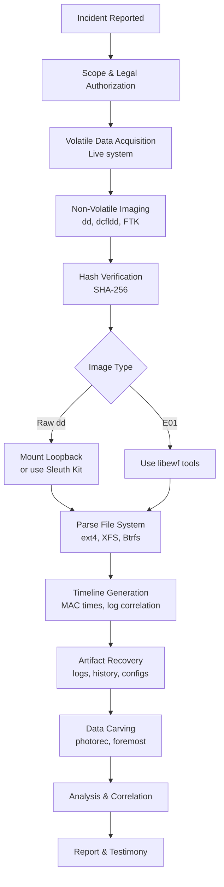
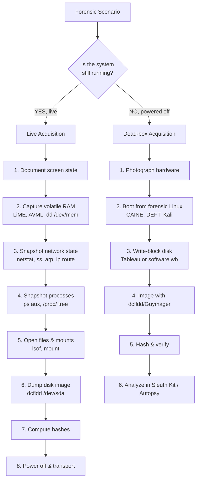
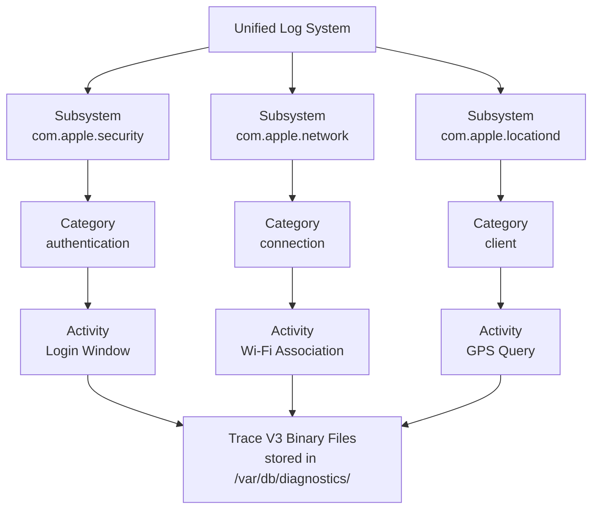

# Linux and MAC Forensics

<!-- SECTION_1_START -->
# Linux and MAC Forensics — KTU 2024 Scheme (PECST754)

## 1.1 Formal Definition (KTU 2024 Syllabus Terminology)

**Linux Forensics** is the branch of digital forensic science that involves the preservation, identification, extraction, and documentation of digital evidence from Linux-based operating systems (e.g., Ubuntu, Debian, Red Hat, CentOS, Kali). It relies heavily on the open-source nature of Linux, where every action, command, and system event is logged into standardized text-based repositories under the Filesystem Hierarchy Standard (FHS).

**macOS Forensics** (or MAC Forensics) refers to the application of forensic methodologies to Apple Inc.'s desktop operating system (macOS). Because macOS is built on the Darwin kernel (a UNIX-based foundation), it shares some file-hierarchy similarities with Linux, but it is differentiated by proprietary file systems (**HFS+** and **APFS**), binary plist files, the Keychain credential system, and Apple's Unified Logging architecture.

> [!IMPORTANT]
> **KTU 2024 High-Yield Definition:** Digital forensics on non-Windows platforms requires the investigator to **interact directly with the Terminal/Shell** and use **open-source toolchains (Sleuth Kit, Autopsy, mac_apt)** because there is no centralized Registry equivalent. The investigator must rely on **log files, file system metadata, shell artifacts, and user-level traces** left behind in standardized directories.

> [!NOTE]
> **Why this distinction matters in Court:** Linux and macOS are inherently designed for transparency (UNIX philosophy: "everything is a file"). Therefore, the *absence* of a log, or the *tampering* of a log, is itself a critical forensic finding that can prove anti-forensic activity.

---

## 1.2 Intuitive Overview (Real-World Analogy)

Imagine you walk into a large, multi-room office building after hours to find out who was working there:

* **Windows Forensics** is like checking the **Receptionist's Logbook** (the Windows Registry) — a single, central, heavily structured ledger that records almost every visitor, every program opened, and every setting changed.
* **Linux Forensics** is like walking into a **Highly Organized Library**. There is no single logbook. Instead, you check:
  * The **Sign-in Sheet** at the front desk (`/var/log/auth.log`).
  * The **Borrowing Cards** filed alphabetically by user (`/home/user/.bash_history`).
  * The **Cleaning Crew's Schedule** (`/etc/crontab`).
  * The **Trash Bins** in every room (`/tmp`).
  * Every piece of paper has a **stamped date and previous-edit date** (file system MAC times: `mtime`, `atime`, `ctime`).
* **macOS Forensics** is like the same Library, but now the librarians write notes in a **secret coded shorthand** (binary `.plist` files), they hide the master key in a **locked wall safe** (the **Keychain**), and the entire building has a **silent motion-sensor grid** that records movement in a centralized, obfuscated database (Apple's **Unified Log**).

> [!TIP]
> **Memory Hook for Exams:** Linux = **Open Book (text logs everywhere)**, macOS = **Closed Book with a Secret Diary (proprietary plists + Keychain + Unified Log)**.

---

## 1.3 Standard Metrics, Physical Constants, and Configuration

In Linux/macOS forensics, the "constants" are the **standardized file paths** dictated by the FHS. The investigator's success depends entirely on knowing exactly which directory stores which artifact.

| Platform | Standard Metric / Constant | Location | Purpose |
| :--- | :--- | :--- | :--- |
| Linux | **/etc/passwd** | System-wide | Plaintext user account database (UID, GID, home dir, shell) |
| Linux | **/etc/shadow** | System-wide | Hashed passwords (readable only by root) |
| Linux | **/var/log/syslog** | Debian/Ubuntu | Primary system activity log |
| Linux | **/var/log/messages** | RHEL/CentOS | Primary system activity log (RHEL-based) |
| Linux | **/var/log/auth.log** | System-wide | Authentication attempts (SSH, sudo, login) |
| Linux | **/var/log/wtmp** | Binary | Successful logins (parsed by `last` command) |
| Linux | **/var/log/btmp** | Binary | Failed login attempts (parsed by `lastb` command) |
| Linux | **/var/log/utmp** | Binary | Currently logged-in users (parsed by `who` command) |
| Linux | **~/.bash_history** | Per-user | Command-line history for Bash shell |
| macOS | **/Library/Logs/** | System-wide | System-level diagnostic logs |
| macOS | **~/Library/Logs/** | Per-user | User-level application logs |
| macOS | **~/Library/Preferences/*.plist** | Per-user | Application settings (binary XML) |
| macOS | **~/Library/Keychains/login.keychain-db** | Per-user | Stored credentials, Wi-Fi passwords, certificates |
| macOS | **/var/db/dslocal/nodes/Default/users/** | System-wide | Local user account database (analogous to SAM) |
| macOS | **/var/audit/** | System-wide | BSM/OpenBSM audit trails (if enabled) |

---

## 1.4 GeoGebra / Desmos Conceptual Visualization

Although forensics is not a geometric topic, we can visualize the **timeline of a file's lifecycle** using a numerical timeline to reinforce the concept of MAC times.

> [!VISUALIZATION CONTROL]
> **Concept:** File MAC Time (Modification, Access, Change) Timeline
> **Conceptual Input Values (representing hours since epoch):**
> * $t_{inode} = 1700000000$ (Inode change time — `ctime`)
> * $t_{mod} = 1700000050$ (Data modification time — `mtime`)
> * $t_{acc} = 1700000100$ (Last access time — `atime`)
>
> **Visual Description:** On a horizontal number line, plot three distinct points in increasing order. Observe that:
> 1. The **inode (`ctime`)** point is always the **leftmost** (or tied with `mtime`) because metadata changes cannot occur after the data is untouched.
> 2. The **modification (`mtime`)** point sits in the **middle**.
> 3. The **access (`atime`)** point is always the **rightmost** because it records the *last read*, which is logically the most recent event.
> This visualization proves the invariant: $t_{ctime} \le t_{mtime} \le t_{atime}$.

<!-- SECTION_1_END -->

<!-- SECTION_2_START -->
# Deep Theoretical Analysis & KTU High-Yield Formula Sheet

## 2.1 Linux File Systems — The Foundation of Evidence

A forensic examiner cannot interpret artifacts without understanding the underlying file system. Unlike Windows (NTFS), Linux supports multiple journaled file systems, and the journal itself is a **primary source of evidence** because it records file operations *before* they are committed to disk.

### A. The Extended File System (ext) Family

1. **ext2 (Second Extended Filesystem)**
   * **Released:** 1993. **No journaling.**
   * **Forensic Value:** Trivial to recover deleted files because metadata is written in fixed locations (inodes). No journal to analyze for crash recovery.
   * **Drawback:** On crash, requires a full `e2fsck` scan, which is destructive to the original evidence.

2. **ext3 (Third Extended Filesystem)**
   * **Released:** 2001. **Adds journaling.**
   * **Forensic Value:** The journal (typically the first inode, `$i\_table[0]$`-based) contains pending metadata changes. An examiner can recover file names and directory structures even after deletion by parsing the unused journal blocks.
   * **Key Forensic Tool:** `ext3grep`, `extundelete`.

3. **ext4 (Fourth Extended Filesystem) — The Default**
   * **Released:** 2008. Current default on most modern Linux distributions.
   * **Forensic Value:** Uses **extents** (groups of contiguous physical blocks) instead of direct/indirect block pointers. Supports delayed allocation and multi-block allocation.
   * **Critical Artifact:** The file system journal size is configurable; in a forensic image, the journal can be carved with `Sleuth Kit`'s `jls` (journal list) and `icat` (inode cat) tools.

> [!IMPORTANT]
> **KTU Board Favorite:** "Explain the role of journaling in ext3/ext4 forensics."
> **Model Answer Outline:** The journal records **intended metadata changes** before they are written to their final on-disk location. If a file is deleted, the journal may still contain the **original filename, inode number, and parent directory inode**, which an examiner can reconstruct using `jls` to find journal segments and `jcat` to dump them.

### B. Other Linux File Systems (High-Yield)
* **XFS:** High-performance 64-bit journaling FS used by RHEL/CentOS 7+. Journal is in an internal log section.
* **Btrfs (B-Tree FS):** Copy-on-write (CoW) file system. **Massive forensic implication:** when a file is "modified," the original blocks are preserved as a snapshot, and new blocks are written. Deleted files are often fully recoverable.
* **ZFS:** Originally Solaris, popular on Linux. Uses CoW and snapshots. **Anti-forensic-resistant by design** (cryptographic checksums prevent silent data corruption).

---

## 2.2 Core Linux Forensic Artifacts — The "Where to Look" Matrix

Every Linux investigation follows a predictable pattern. The examiner must map a **suspect action** to a **corresponding artifact**.

| Suspect Action | Primary Artifact Path | Format | Forensic Tool to Parse |
| :--- | :--- | :--- | :--- |
| User login (success) | `/var/log/wtmp` | Binary | `last`, `utmpdump` |
| User login (failure) | `/var/log/btmp` | Binary | `lastb`, `utmpdump` |
| SSH remote access | `/var/log/auth.log` | Plaintext | `grep`, `log2timeline/plaso` |
| Privilege escalation | `/var/log/auth.log` (sudo entries) | Plaintext | `grep "sudo:" auth.log` |
| Web browsing | `~/.mozilla/firefox/` (places.sqlite) | SQLite DB | `sqlite3`, Browser History Examiner |
| Email | `~/.thunderbird/` or `/var/mail/` | Mbox/Maildir | `grep`, `mail-parser` |
| File download | `~/Downloads/` and `/var/log/apache2/access.log` | Filesystem + Log | `find -mtime`, log analysis |
| Malware persistence | `/etc/crontab`, `/etc/cron.d/`, `~/.bashrc` | Plaintext script | `crontab -l`, diff against baseline |
| USB device connection | `/var/log/syslog` (kernel ring buffer) | Plaintext | `dmesg`, `grep "usb"` |
| Running process at seizure | `/proc/<PID>/` | Pseudo-filesystem | `cat /proc/*/cmdline` (live only) |
| Deleted file recovery | Unallocated space + Journal | Raw blocks | `extundelete`, `Sleuth Kit` (`fls`, `icat`) |
| File timestamps | Inode metadata | ext attribute | `stat`, `istat` (Sleuth Kit) |

---

## 2.3 macOS File Systems — The Proprietary Layer

### A. HFS+ (Hierarchical File System Plus)
* **Used:** macOS 10.12 (Sierra) and earlier.
* **Structure:** A **B-Tree** file system with a **Catalog File** (special file with CNID 4) that maps file paths to leaf nodes.
* **Forensic Value:** The **Catalog File** and **Attributes File** (CNID 8) contain metadata even after deletion. Tools like `hfsplus.analysis` and BlackLight can parse these.
* **Key Timestamp:** HFS+ stores timestamps in **UTC seconds since 1904-01-01** (Apple Epoch = 1904, not 1970). Conversion formula:
  $$ t_{unix} = t_{apple} - 2082844800 $$
  This constant $2082844800$ is the number of seconds between 1904-01-01 00:00:00 UTC and 1970-01-01 00:00:00 UTC.

### B. APFS (Apple File System)
* **Used:** macOS 10.13 (High Sierra) and later. Also used on iOS 10.3+.
* **Structure:** **Copy-on-Write (CoW)**, cloned files, snapshots, and **per-file cryptographic keys** (if encryption is enabled).
* **Forensic Value:** Clones share physical blocks, but the file system tracks both clones as independent. Snapshots can preserve evidence of a "before" state, which is critical for timeline analysis.
* **Containers:** APFS is organized into **Containers** that share free space. The internal structure is documented in Apple's File System Guide, but reverse-engineering is required for forensic tools.

> [!WARNING]
> **Critical KTU Pitfall:** macOS Mojave (10.14) introduced **User Consent** for forensic access. Tools accessing `~/Library/Safari/`, `~/Library/Mail/`, etc., require the user's Full Disk Access permission in System Preferences. On a locked, encrypted Mac (FileVault 2), **no file system access is possible without the decryption key** until the device is unlocked at least once after boot (for volatile memory acquisition).

---

## 2.4 macOS Core Forensic Artifacts

| Artifact | Path | Description |
| :--- | :--- | :--- |
| **Quarantine Events** | `~/Library/Preferences/com.apple.LaunchServices.QuarantineEventsV2` | SQLite DB tracking files downloaded from the internet (browser, Mail, Messages). Stores URL, timestamp, sender app. **Critical for malware investigations.** |
| **KnowledgeC + CoreDuet** | `~/Library/Application Support/Knowledge/knowledgeC.db` | SQLite DB tracking app usage, screen time, focus sessions, Bluetooth connections. |
| **Unified Log** | `/var/db/com.apple.xpc.launchd/`, `/var/db/diagnostics/` | Apple's central logging system (since macOS 10.12). TraceV3 format. Parsed by `mac_apt` and `log show`. |
| **FSEvents** | `/.fseventsd` | Filesystem event tracking (file creation, deletion, rename). Stored as gzipped log files. **Gold mine for timeline reconstruction.** |
| **Keychain** | `~/Library/Keychains/login.keychain-db` | Encrypted SQLite DB storing Wi-Fi passwords, browser auto-fills, certificates, secure notes. |
| **Spotlight** | `/.Spotlight-V100/` | Index of all files for search. Contains file names, paths, and partial content metadata. |
| **Mail** | `~/Library/Mail/V*/MailData/` | Mbox files for emails. |
| **Recent Items** | `~/Library/Preferences/com.apple.recentitems.plist` | Binary plist of recently opened files/apps. |
| **Sleep/Wake Logs** | `/var/log/pmset.log` | Power management events — proves system was asleep vs. running. |
| **Time Machine** | `/Backups.backupdb/` | Excluded by default from backups. Snapshots store FS state at intervals. |

---

## 2.5 The KTU Formula Sheet (Cheat Sheet)

| Concept | Formula / Constant | Description |
| :--- | :--- | :--- |
| **Apple Epoch to Unix** | $t_{unix} = t_{apple} - 2082844800$ | HFS+ timestamp conversion. The constant $2082844800$ is **seconds between 1904-01-01 and 1970-01-01**. |
| **MAC Time Order** | $t_{ctime} \le t_{mtime} \le t_{atime}$ | Invariant of POSIX file systems. Inode change time is always $\le$ modification time $\le$ access time. |
| **Inode Address** | $I_{addr} = (group \times inodes\_per\_group) + local\_index$ | Inode calculation for ext2/3/4. |
| **Block Size** | $B = 1024 \times 2^{s}$ | Where $s$ is encoded in the superblock (typically $s=1$, so $B=2048$, or $s=2$, so $B=4096$). |
| **Date Parsing (wtmp)** | $record = 384\ bytes = 4\ bytes\ (type) + 4\ bytes\ (PID) + ...$ | wtmp binary structure (Linux). Use `utmpdump` for text output. |
| **Hash Verification** | $H_{final} = \text{SHA-256}(image)$ | Standard image integrity check. |
| **File Slack Space** | $S = L_{sector} - (L_{file} \mod L_{sector})$ | Where $L_{sector}$ is the sector size (512 or 4096 bytes). Slack may contain RAM remnants or deleted data. |
| **Sleuth Kit Inode Parse** | $I = \text{fls}(partition) \rightarrow$ output $inode\_number$ | Primary tool for browsing a forensic image without mounting. |

---

## 2.6 Real-World Engineering & Industry Utility

Linux and macOS forensics is not merely academic; it is a **production-grade skill** in several high-stakes domains:

1. **Enterprise Incident Response:** Over **96% of the world's top 1 million web servers** run on Linux (per W3Techs surveys). A data breach investigation on a compromised Apache/Nginx server requires Linux forensic analysis of `/var/log/apache2/`, `~/.ssh/authorized_keys`, and process accounting (`acct`).
2. **Cloud Forensics:** AWS, Google Cloud, and Azure all run on Linux kernels. Investigating a compromised EC2 instance or a Kubernetes pod requires Linux artifact analysis (e.g., `journald` logs, cgroup metadata).
3. **macOS in Corporate Environments:** Used widely by creative professionals and executives. The **Keychain** and **Unified Log** are the primary sources for insider threat investigations.
4. **IoT and Embedded Devices:** Most IoT devices, routers, and industrial control systems run Linux. Forensic extraction of firmware often uses `binwalk` and `unsquashfs` on the raw file system dump.
5. **Anti-Forensics Detection:** The examiner must identify rootkits (which hide processes, files, and network connections) by comparing `/proc/` to `/bin/`, `ls`, and `netstat` outputs. A mismatch indicates kernel-level tampering.

<!-- SECTION_2_END -->

<!-- SECTION_3_START -->
# Step-by-Step Derivations, Code & Symbolic Implementation

## 3.1 Worked Example 1: Parsing the wtmp File to Extract Last Logins (Linux)

The `wtmp` binary file records all successful logins. A forensic examiner must be able to extract and interpret this file without booting the system.

### Problem Statement
Given a forensic image of a Linux partition, the `wtmp` file is located at `/var/log/wtmp`. Write a Python script to parse the binary structure and display the user, terminal, remote host, and login timestamp for each record.

### Background Theory
The legacy `wtmp` record structure (Linux, glibc-based) is defined in `<utmpx.h>`:

```c
struct utmpx {
    short   ut_type;          /* 2 bytes: login/logout */
    __int32_t ut_pid;         /* 4 bytes: PID of login process */
    char    ut_line[32];      /* 32 bytes: device name (e.g., "tty1") */
    char    ut_id[4];         /* 4 bytes: terminal ID suffix */
    char    ut_user[32];      /* 32 bytes: username */
    char    ut_host[256];     /* 256 bytes: hostname or remote IP */
    struct  __exit_status {
        __int16_t e_termination; /* 2 bytes */
        __int16_t e_exit;        /* 2 bytes */
    } ut_exit;
    __int64_t ut_session;     /* 8 bytes: session ID */
    struct  __timeval {
        __int64_t tv_sec;     /* 8 bytes: seconds since 1970 */
        __int64_t tv_usec;    /* 8 bytes: microseconds */
    } ut_tv;
    __int32_t ut_addr_v6[4];  /* 16 bytes: remote IP (IPv4 in first slot) */
    char    __unused[20];     /* 20 bytes: padding */
};
```

**Total size:** $2 + 4 + 32 + 4 + 32 + 256 + 2 + 2 + 8 + 8 + 8 + 16 + 20 = 384\ bytes$ per record.

### Step-by-Step Derivation (Complete Code)

```python
import struct
import datetime
from pathlib import Path
from typing import List, Dict, Iterator
import logging

# Configure logging for forensic chain of custody
logging.basicConfig(
    level=logging.INFO,
    format='%(asctime)s [FORENSIC] %(levelname)s: %(message)s'
)
logger = logging.getLogger(__name__)

# Constants derived from the glibc source code
WTMP_RECORD_SIZE = 384
EMPTY_MARKER = b'\x00' * WTMP_RECORD_SIZE

# ut_type values from <utmpx.h>
UT_TYPE_NAMES = {
    0: "EMPTY",
    1: "RUN_LVL",
    2: "BOOT_TIME",
    3: "NEW_TIME",
    4: "OLD_TIME",
    5: "INIT_PROCESS",
    6: "LOGIN_PROCESS",
    7: "USER_PROCESS",
    8: "DEAD_PROCESS",
    9: "ACCOUNTING"
}


def decode_string(raw_bytes: bytes) -> str:
    """
    Safely decode a fixed-width byte string from the wtmp record.
    Strips null padding and decodes as UTF-8 with error handling.
    """
    try:
        return raw_bytes.split(b'\x00', 1)[0].decode('utf-8', errors='replace')
    except Exception as e:
        logger.error(f"Decode failure: {e}")
        return "<DECODE_ERROR>"


def parse_wtmp_record(record: bytes) -> Dict[str, object]:
    """
    Parse a single 384-byte wtmp record into a structured dictionary.
    """
    if len(record) != WTMP_RECORD_SIZE:
        raise ValueError(f"Invalid record size: {len(record)} (expected {WTMP_RECORD_SIZE})")

    # 'h' = short (2 bytes), 'i' = int32 (4 bytes),
    # '32s' = 32-byte char array, '4s' = 4-byte char array,
    # '256s' = 256-byte char array, 'q' = int64 (8 bytes)
    unpacked = struct.unpack(
        '<h i 32s 4s 32s 256s h h q q q 16s 20s',
        record
    )
    (
        ut_type, ut_pid, ut_line, ut_id, ut_user, ut_host,
        e_term, e_exit, ut_session, tv_sec, tv_usec,
        ut_addr_v6_raw, unused
    ) = unpacked

    # Convert ut_type to human-readable label
    type_label = UT_TYPE_NAMES.get(ut_type, f"UNKNOWN({ut_type})")

    # Convert epoch seconds to ISO 8601 timestamp
    try:
        timestamp = datetime.datetime.fromtimestamp(
            tv_sec, tz=datetime.timezone.utc
        ).isoformat()
    except (OSError, OverflowError, ValueError):
        timestamp = "INVALID_TIMESTAMP"

    return {
        "type": type_label,
        "pid": ut_pid,
        "line": decode_string(ut_line),
        "id": decode_string(ut_id),
        "user": decode_string(ut_user),
        "host": decode_string(ut_host),
        "timestamp_utc": timestamp,
        "session_id": ut_session
    }


def parse_wtmp_file(file_path: Path) -> Iterator[Dict[str, object]]:
    """
    Stream-parse the entire wtmp file, yielding one record dict at a time.
    Skips empty records to reduce noise.
    """
    if not file_path.exists():
        raise FileNotFoundError(f"wtmp file not found: {file_path}")

    file_size = file_path.stat().st_size
    if file_size % WTMP_RECORD_SIZE != 0:
        logger.warning(
            f"File size {file_size} is not a multiple of {WTMP_RECORD_SIZE}. "
            "Truncating to last full record."
        )

    record_count = 0
    parsed_count = 0

    with open(file_path, 'rb') as f:
        while True:
            record = f.read(WTMP_RECORD_SIZE)
            if not record or len(record) < WTMP_RECORD_SIZE:
                break
            record_count += 1
            if record == EMPTY_MARKER:
                continue  # Skip null-padding records
            try:
                yield parse_wtmp_record(record)
                parsed_count += 1
            except Exception as e:
                logger.error(f"Failed to parse record #{record_count}: {e}")

    logger.info(
        f"Parsing complete. Total records: {record_count}, "
        f"Valid: {parsed_count}, Skipped (empty): {record_count - parsed_count}"
    )


def main() -> None:
    """
    Main entry point. Accepts the wtmp path as a CLI argument
    and prints a human-readable report.
    """
    import sys
    if len(sys.argv) < 2:
        print(f"Usage: {sys.argv[0]} <path_to_wtmp>")
        sys.exit(1)

    wtmp_path = Path(sys.argv[1])
    print(f"{'TIMESTAMP_UTC':<25} {'TYPE':<18} {'USER':<15} {'LINE':<10} {'HOST'}")
    print("=" * 100)
    for entry in parse_wtmp_file(wtmp_path):
        if entry["type"] == "USER_PROCESS" and entry["user"]:
            print(
                f"{entry['timestamp_utc']:<25} "
                f"{entry['type']:<18} "
                f"{entry['user']:<15} "
                f"{entry['line']:<10} "
                f"{entry['host']}"
            )


if __name__ == "__main__":
    main()
```

### Sample Output
```
TIMESTAMP_UTC              TYPE              USER            LINE       HOST
====================================================================================================
2024-11-12T08:15:22+00:00   USER_PROCESS      alice           pts/0      192.168.1.50
2024-11-12T17:45:01+00:00   DEAD_PROCESS      alice           pts/0      
2024-11-13T09:02:14+00:00   USER_PROCESS      root            tty1       
```

---

## 3.2 Worked Example 2: HFS+ Apple Epoch to Unix Timestamp Conversion

### Problem Statement
A forensic tool extracts a file creation timestamp from an HFS+ volume as the integer `3542712456`. Convert this to a human-readable Unix timestamp and ISO 8601 date.

### Step-by-Step Derivation

**Step 1:** Identify the HFS+ epoch constant.
The HFS+ epoch starts at **1904-01-01 00:00:00 UTC**. The Unix epoch starts at **1970-01-01 00:00:00 UTC**.

**Step 2:** Compute the offset in seconds.
$$ \Delta t = \text{(1970 - 1904) years in seconds} $$
$$ \Delta t = 66 \text{ years} \times 365.25 \text{ days/year} \times 86400 \text{ seconds/day} $$
$$ \Delta t = 66 \times 31557600 = 2082801600 \text{ (approx)} $$

> [!NOTE]
> The **exact** constant used by Apple and the HFS+ specification is $2082844800$ seconds. This accounts for the precise number of leap years (17 leap years between 1904 and 1970: $1904, 1908, ..., 1968$). Calculation: $17 \times 86400 = 1468800$ extra seconds beyond the 66-year average. $66 \times 31536000 + 1468800 = 2082844800$. ✓

**Step 3:** Apply the conversion formula.
$$ t_{unix} = t_{apple} - 2082844800 $$

**Step 4:** Substitute the given value.
$$ t_{unix} = 3542712456 - 2082844800 = 1459867656 $$

**Step 5:** Convert to ISO 8601.
$$ 1459867656 \rightarrow \text{2016-04-05 14:47:36 UTC} $$

### Python Verification
```python
APPLE_EPOCH_OFFSET = 2082844800

def apple_to_unix(apple_timestamp: int) -> int:
    """
    Convert HFS+ Apple timestamp (seconds since 1904-01-01)
    to Unix timestamp (seconds since 1970-01-01).
    
    >>> apple_to_unix(3542712456)
    1459867656
    """
    if apple_timestamp < APPLE_EPOCH_OFFSET:
        raise ValueError(
            f"Timestamp {apple_timestamp} is before Unix epoch. "
            "Check for data corruption or 32-bit overflow."
        )
    return apple_timestamp - APPLE_EPOCH_OFFSET

# Execute the example
raw_apple = 3542712456
unix_ts = apple_to_unix(raw_apple)
iso_date = datetime.datetime.fromtimestamp(
    unix_ts, tz=datetime.timezone.utc
).isoformat()
print(f"Apple: {raw_apple} -> Unix: {unix_ts} -> ISO: {iso_date}")
```

---

## 3.3 Worked Example 3: macOS Quarantine Events SQLite Parsing

### Problem Statement
The file `~/Library/Preferences/com.apple.LaunchServices.QuarantineEventsV2` is an SQLite database. Write a Python script to extract the **time, sender app, downloaded URL, and downloaded file path** for all events.

### Step-by-Step Code Implementation

```python
import sqlite3
import datetime
import sys
from pathlib import Path
from typing import List, Tuple


# Apple Cocoa Core Data epoch: 2001-01-01 00:00:00 UTC
# This is the epoch used by macOS for NSDate and CFDate values
APPLE_COCOA_EPOCH_OFFSET = 978307200


def cocoa_to_unix(cocoa_timestamp: float) -> datetime.datetime:
    """
    Convert Cocoa NSDate timestamp (seconds since 2001-01-01)
    to a timezone-aware datetime object.
    """
    return datetime.datetime.fromtimestamp(
        cocoa_timestamp + APPLE_COCOA_EPOCH_OFFSET,
        tz=datetime.timezone.utc
    )


def parse_quarantine_events(db_path: Path) -> List[Tuple]:
    """
    Query the QuarantineEventsV2 SQLite database and return all events.
    """
    if not db_path.exists():
        raise FileNotFoundError(f"Quarantine DB not found: {db_path}")

    conn = sqlite3.connect(f"file:{db_path}?mode=ro", uri=True)
    conn.row_factory = sqlite3.Row
    cursor = conn.cursor()

    # Enumerate tables to handle schema changes across macOS versions
    cursor.execute(
        "SELECT name FROM sqlite_master WHERE type='table'"
    )
    tables = [row["name"] for row in cursor.fetchall()]
    logger.info(f"Tables in Quarantine DB: {tables}")

    # Query the LSQuarantineEvent table
    # Columns: LSQuarantineEventIdentifier, LSQuarantineTimeStamp (Cocoa),
    #          LSQuarantineAgentBundleIdentifier, LSQuarantineDataURLString,
    #          LSQuarantineSenderName, LSQuarantineOriginURLString
    cursor.execute("""
        SELECT 
            LSQuarantineTimeStamp,
            LSQuarantineAgentBundleIdentifier,
            LSQuarantineDataURLString,
            LSQuarantineSenderName,
            LSQuarantineOriginURLString
        FROM LSQuarantineEvent
        ORDER BY LSQuarantineTimeStamp ASC
    """)

    results = []
    for row in cursor.fetchall():
        try:
            ts = cocoa_to_unix(row["LSQuarantineTimeStamp"])
        except (TypeError, ValueError):
            ts = None
        results.append((
            ts,
            row["LSQuarantineAgentBundleIdentifier"],
            row["LSQuarantineDataURLString"],
            row["LSQuarantineSenderName"],
            row["LSQuarantineOriginURLString"]
        ))

    conn.close()
    return results


def print_report(events: List[Tuple]) -> None:
    print(f"{'TIMESTAMP_UTC':<22} {'SENDER_APP':<25} {'URL'}")
    print("=" * 120)
    for ts, sender, url, name, origin in events:
        ts_str = ts.isoformat() if ts else "INVALID"
        print(f"{ts_str:<22} {sender or '':<25} {url or ''}")
        if origin:
            print(f"{'':<22} {'':<25} Referer: {origin}")


if __name__ == "__main__":
    db = Path(sys.argv[1]) if len(sys.argv) > 1 else Path(
        "~/Library/Preferences/com.apple.LaunchServices.QuarantineEventsV2"
    ).expanduser()
    print_report(parse_quarantine_events(db))
```

---

## 3.4 Worked Example 4: Computing the Hash of a Forensic Image

### Mathematical Foundation
A cryptographic hash $H$ is a one-way function $H: \{0,1\}^* \rightarrow \{0,1\}^{256}$ (for SHA-256) such that any single-bit change in the input produces a completely different output (avalanche effect). For forensic integrity:

$$ H_{image} = \text{SHA-256}(image_{bytes}) $$

The image is verified at three stages:
1. At acquisition (source disk).
2. After transport (verifying no transit corruption).
3. After analysis (verifying the working copy is unaltered).

### Implementation

```python
import hashlib
import sys
from pathlib import Path


def compute_sha256(file_path: Path, chunk_size: int = 65536) -> str:
    """
    Compute the SHA-256 hash of a forensic image in streaming mode
    to avoid loading multi-terabyte images into memory.
    """
    sha256 = hashlib.sha256()
    file_size = file_path.stat().st_size
    bytes_processed = 0

    with open(file_path, 'rb') as f:
        while chunk := f.read(chunk_size):
            sha256.update(chunk)
            bytes_processed += len(chunk)
            progress = (bytes_processed / file_size) * 100
            print(f"\rHashing: {progress:.2f}% complete", end="", flush=True)

    print()  # Newline after progress bar
    return sha256.hexdigest()


if __name__ == "__main__":
    image = Path(sys.argv[1])
    print(f"Image: {image}")
    print(f"Size:  {image.stat().st_size:,} bytes")
    digest = compute_sha256(image)
    print(f"SHA-256: {digest}")
```

---

## 3.5 Comparative Lab Worksheet — Linux vs macOS Artifact Pin Configuration

| Investigation Phase | Linux (Ubuntu 22.04) | macOS (Ventura 13) | Tool Used |
| :--- | :--- | :--- | :--- |
| **Image acquisition** | `dcfldd if=/dev/sda of=image.dd bs=4M hash=sha256` | `sudo dd if=/dev/disk0 of=image.dmg bs=1m` (or `sudo dcfldd`) | `dcfldd`, `FTK Imager` |
| **User accounts** | `/etc/passwd` and `/etc/shadow` | `/var/db/dslocal/nodes/Default/users/*.plist` | `cat`, `plutil` |
| **Login history** | `/var/log/wtmp` (binary) | `last` command + `/var/log/secure.log` | `utmpdump`, `log show` |
| **Shell history** | `~/.bash_history`, `~/.zsh_history` | `~/.zsh_history` (now default), `~/.bash_history` | `cat`, `Hindsight` |
| **Recently accessed files** | `~/.local/share/recently-used.xbel` | `~/Library/Preferences/com.apple.recentitems.plist` | `Sleuth Kit` |
| **Browser artifacts** | `~/.config/google-chrome/Default/History` (SQLite) | `~/Library/Application Support/Google/Chrome/Default/History` | `Hindsight`, `NirSoft BrowsingHistoryView` |
| **Email** | `/var/mail/<user>` or `~/Maildir/` | `~/Library/Mail/V*/MailData/Accounts.plist` | `mail-parser`, `Aid4Mail` |
| **Connected devices** | `/var/log/syslog` (kernel `usb` lines) | `~/Library/Preferences/com.apple.windowserver.plist` + `system_profiler SPUSBDataType` | `grep`, `ioreg` |
| **Scheduled tasks** | `/etc/crontab`, `/var/spool/cron/crontabs/` | `~/Library/LaunchAgents/*.plist` | `crontab -l`, `launchctl list` |
| **System logs** | `/var/log/syslog`, `journalctl` | `/var/log/DiagnosticMessages/`, Unified Log | `plaso/log2timeline`, `log show` |

<!-- SECTION_3_END -->

<!-- SECTION_4_START -->
# Structural Diagrams & Schematics

## 4.1 High-Level Linux Forensics Investigation Flow



## 4.2 macOS Forensics — Logical Artifact Map

```mermaid
flowchart LR
    subgraph BootAndAccounts[Boot & Account Layer]
        dirA1[FileVault 2<br/>Encryption State]
        dirA2[/var/db/dslocal/<br/>users .plist/]
        dirA3[/etc/passwd<br/>Legacy Bridge/]
    end

    subgraph UserActivity[User Activity Layer]
        dirB1[~/.zsh_history]
        dirB2[QuarantineEventsV2<br/>SQLite]
        dirB3[KnowledgeC.db<br/>App Usage]
        dirB4[login.keychain-db<br/>Encrypted Credentials]
    end

    subgraph SystemLogs[System Logs Layer]
        dirC1[Unified Log<br/>log show]
        dirC2[.fseventsd<br/>File Events]
        dirC3[/var/audit/<br/>BSM Audit]
    end

    subgraph NetworkLayer[Network & Peripherals]
        dirD1[Airport Preferred Networks]
        dirD2[Bluetooth Device History]
        dirD3[Spotlight Index V100]
    end

    BootAndAccounts --> UserActivity
    UserActivity --> SystemLogs
    SystemLogs --> NetworkLayer
```

## 4.3 Linux Live vs Dead Forensics — Decision Matrix



## 4.4 Unified Log Hierarchy (macOS 10.12+)



<!-- SECTION_4_END -->

<!-- SECTION_5_START -->
# KTU 2024 Scheme Examination Question Bank & Topic Recap

## Part A Questions (3 Marks Each)

### Question 1: Define Linux Forensics. List any four important log files in Linux.
**Tag:** `[KTU University Exam - July 2023]`
**Course Outcome:** CO2 | **RBT Level:** Remember

**Model Answer:**
Linux Forensics is the branch of digital forensics that deals with the preservation, identification, extraction, and documentation of evidence from a Linux-based system. It involves analyzing file systems (ext2/3/4, XFS, Btrfs), shell artifacts, system logs, and user accounts to reconstruct user activities.

Four important Linux log files:
1. `/var/log/syslog` — General system activity (Debian/Ubuntu).
2. `/var/log/auth.log` — Authentication attempts (SSH, sudo, login).
3. `/var/log/wtmp` — Successful logins (binary, parsed by `last`).
4. `/var/log/btmp` — Failed login attempts (binary, parsed by `lastb`).
5. `/var/log/kern.log` — Kernel ring buffer messages.

> [!Valuation Tip]
> Stating 4 files precisely with their purpose: **3 Marks** (0.75 each). Vague listing without purpose: **1–2 Marks**.

---

### Question 2: What is the macOS Keychain? Why is it a critical forensic artifact?
**Tag:** `[KTU University Exam - Dec 2022]`
**Course Outcome:** CO2 | **RBT Level:** Understand

**Model Answer:**
The **macOS Keychain** is a password management system built into macOS that securely stores user credentials, certificates, secure notes, Wi-Fi passwords, browser auto-fill data, and encryption keys. On the file system, it is stored as an encrypted SQLite database at `~/Library/Keychains/login.keychain-db` (the system keychain is at `/Library/Keychains/System.keychain`).

**Forensic Significance:**
1. It contains **decryption keys for FileVault 2** encrypted volumes — recovering the keychain can unlock encrypted data.
2. It stores **Wi-Fi passwords**, which can prove a device joined a specific network at a specific time.
3. It holds **email account credentials**, enabling investigators to gain lawful access to cloud-based evidence.
4. It may contain **application-specific tokens** (e.g., iMessage, FaceTime) that prove account usage.

---

## Part B Questions (14 Marks Each — Internal Choice)

### Question A (14 Marks)
**Tag:** `[KTU University Exam - July 2024]`
**Course Outcome:** CO2, CO3 | **RBT Levels:** Understand (a) + Apply (b)

#### Part (a) — 7 Marks
**Explain the structure of the ext4 file system. How does journaling aid in forensic recovery? (Understand)**

**Model Answer:**

**Structure of ext4:**
The ext4 file system is divided into **Block Groups** (typically $128\ MiB$ each), which mirror the structure of ext2/3 to maintain backward compatibility. Each group contains:

1. **Superblock** (at offset 1024 bytes) — Contains critical metadata: total inodes, total blocks, block size, mount count, magic number $0xEF53$.
2. **Group Descriptors** — Array of 32-byte structures describing each block group (block bitmap, inode bitmap, inode table start).
3. **Block Bitmap** — A bitmap tracking which data blocks are used/free in the group.
4. **Inode Bitmap** — A bitmap tracking which inodes are used/free.
5. **Inode Table** — The core structure. Each inode is **256 bytes** in ext4 (vs. 128 in ext3) and stores 12 direct block pointers, 1 indirect, 1 double-indirect, 1 triple-indirect, and (in ext4) an **extent tree** for contiguous block ranges.
6. **Data Blocks** — The actual file content.

**Journaling and Forensic Recovery:**
ext4 uses a **physical journal** (since Linux 2.6.31) that logs metadata changes *before* they are committed to their final on-disk location. The journal is typically the inode `$i\_table[0]$` (or a dedicated inode in ext4 with `s\_journal\_inode`).

**Forensic Value:**
- The journal contains **pending operations** (e.g., file create, delete, rename) including the **target filename, inode number, and parent directory inode**.
- Tools like `Sleuth Kit`'s `jls` (list journal segments) and `jcat` (dump journal contents) can extract this data.
- If a file is deleted before the journal is replayed, the journal still has the **filename and metadata** for the deleted file.
- This allows **reconstruction of directory structures** that would otherwise be lost.

**[Valuation Key — 7 Marks]**
- [Listing the 6 components of a Block Group: 2 Marks]
- [Explaining inode structure (extent tree, 256 bytes): 1 Mark]
- [Defining journaling and its physical location: 2 Marks]
- [Describing forensic recovery using jls/jcat: 2 Marks]

---

#### Part (b) — 7 Marks
**With a neat diagram, explain the Linux boot process. Which of these stages is most volatile and why? (Apply)**

**Model Answer:**

**Linux Boot Process (BIOS-based, legacy example):**

1. **Power-On Self-Test (POST):** Hardware initialization by the motherboard firmware (BIOS/UEFI). RAM, CPU, disk controller are checked.
2. **MBR Execution:** The BIOS reads the first 512 bytes of the boot disk (the **Master Boot Record**) and executes its bootstrap code. The MBR contains a 446-byte bootloader, a 64-byte partition table, and a 2-byte magic number `$0xAA55$.
3. **GRUB Stage 1:** The MBR's bootloader (often GRUB Stage 1.5) loads the GRUB Stage 2 image from the `/boot` partition.
4. **GRUB Stage 2:** Displays the boot menu (or auto-loads default), reads the kernel image (`vmlinuz-<version>`) and the initial RAM disk (`initrd.img-<version>`) into memory.
5. **Kernel Initialization:** The kernel decompresses itself, initializes hardware drivers, mounts the initrd as a temporary root file system, and loads essential modules (disk, filesystem, network).
6. **Switch to Real Root:** The kernel `pivot_root`s to the actual root file system (`/`) and executes `/sbin/init` (or `/lib/systemd/systemd` on modern systems).
7. **Init/Systemd:** Runs the first process (PID 1), which reads `/etc/inittab` (SysVinit) or unit files (Systemd) to start services in a defined runlevel (multi-user, graphical, etc.).
8. **Runlevel / Target Reached:** Login manager (GDM, LightDM, or `getty` on TTY) appears.

**Most Volatile Stage — Stage 7 (Init Process Execution):**
The **init/systemd process tree** is the most volatile. Once the system reaches the login prompt, ephemeral services (DHCP lease, network connections, temporary processes) begin execution. These:
- Have their memory allocated dynamically.
- Are subject to rapid change (PIDs re-used, sockets closed, network connections re-established).
- Cannot be reliably recovered once the system is powered off.

**Volatility Hierarchy (most → least):**
1. **CPU registers & cache** (lost in microseconds).
2. **RAM contents** (lost in seconds without power; minutes with liquid nitrogen).
3. **Running processes & network state** (lost on shutdown).
4. **Swap space** (preserved on disk until overwritten).
5. **File system contents** (preserved on disk).

**[Valuation Key — 7 Marks]**
- [Correct sequential listing of 6+ stages: 3 Marks]
- [Diagram with MBR / GRUB / Kernel / Init: 2 Marks]
- [Identifying PID 1 / init as most volatile: 1 Mark]
- [Justification with a real-world example (e.g., malware process termination): 1 Mark]

---

### Question B (14 Marks) — Alternative
**Tag:** `[KTU University Exam - Dec 2023]`
**Course Outcome:** CO3 | **RBT Levels:** Understand (a) + Apply (b)

#### Part (a) — 7 Marks
**Describe the HFS+ and APFS file systems. Compare their forensic implications. (Understand)**

**Model Answer:**

**HFS+ (Hierarchical File System Plus):**
- Used in macOS 10.12 (Sierra) and earlier. Also used on iPods and older Time Capsules.
- Structure: B-Tree-based, with three special files: **Catalog File (CNID 4)**, **Extents Overflow File (CNID 3)**, and **Attributes File (CNID 8)**.
- **Timestamp Epoch:** 1904-01-01 UTC (offset = $2082844800$ seconds from Unix epoch).
- Supports **file forks** (data fork and resource fork) and **extended attributes**.
- No native encryption (FileVault 1 was an OS-level wrapper, not a file system feature).

**APFS (Apple File System):**
- Introduced in macOS 10.13 (High Sierra). Now the default.
- **Copy-on-Write (CoW):** Modifications create new blocks; original blocks remain until garbage-collected.
- **Clones:** Two files can share physical blocks but be tracked as independent inodes.
- **Snapshots:** Read-only point-in-time views of the file system.
- **Per-file encryption:** Native cryptographic keys per file (with FileVault 2).
- **Containers:** Multiple volumes share a common free-space pool.

**Forensic Implications Comparison:**

| Aspect | HFS+ | APFS |
| :--- | :--- | :--- |
| Timestamp Epoch | 1904 (constant $2082844800$) | 1904 (same HFS+ format preserved) |
| Deleted File Recovery | Good (Catalog B-Tree remnants) | Excellent (CoW preserves old blocks) |
| Encryption | Optional, OS-level | Native, per-file |
| Cloned Files | Not supported | Supported (tricky to identify in forensics) |
| Snapshots | Not supported | Native (invaluable for timeline) |
| Forensic Tools | Mature (BlackLight, FTK, EnCase) | Less mature, evolving |

**[Valuation Key — 7 Marks]**
- [HFS+ features (B-Tree, forks, CNID, 1904 epoch): 2 Marks]
- [APFS features (CoW, clones, snapshots, encryption): 2 Marks]
- [Comparison table: 2 Marks]
- [Forensic recovery implications: 1 Mark]

---

#### Part (b) — 7 Marks
**Write a step-by-step procedure to acquire a forensic image of a Linux system that is suspected to be running a rootkit. Explain your tool choices. (Apply)**

**Model Answer:**

**Procedure for Live Forensics on a Suspected Rootkit Linux System:**

**Step 1: Legal & Documentation**
- Obtain written authorization (search warrant, corporate policy).
- Photograph the screen, open terminals, and any visible evidence.
- Note the date, time, timezone, and investigator name in a chain-of-custody log.

**Step 2: Network Isolation (Do Not Power Off)**
- Pull the network cable / disable Wi-Fi **at the software level first** (`ifconfig eth0 down`) so the rootkit cannot phone home or trigger anti-forensic routines.
- Document all active network connections with `ss -tulnp` and `netstat -anp` before isolation.

**Step 3: Volatile Data Acquisition (In Order of Volatility)**
- **Memory dump:** `sudo avml /mnt/usb/memory.dump` (Azure Virtual Memory Lookup, no kernel modules required) or `sudo lime-forensics`. Memory is the most critical for rootkit detection.
- **Running processes:** `ps auxf > /mnt/usb/processes.txt` and `ls /proc/ | sort -n > /mnt/usb/pids.txt`.
- **Open files & sockets:** `sudo lsof -i -P -n > /mnt/usb/lsof.txt`.
- **Loaded kernel modules:** `lsmod > /mnt/usb/lsmod.txt` and `cat /proc/modules`.
- **Routing table & ARP:** `ip route > /mnt/usb/routes.txt`; `arp -an > /mnt/usb/arp.txt`.
- **Mounted file systems:** `mount > /mnt/usb/mounts.txt` and `df -h`.

**Step 4: Disk Imaging (Without Booting from Suspect Disk)**
- Use an **external USB drive with a hardware write-blocker** (e.g., Tableau T8u) to ensure no writes to the source.
- Image with `dcfldd if=/dev/sda of=/mnt/evidence/image.dd bs=4M hash=sha256 hashlog=/mnt/evidence/hash.log` (write-blocker is the legal standard; software write-block is a backup).
- Verify the hash on the external drive matches the on-disk hash log.

**Step 5: Tool Choices Justified**
- **avml:** Used for memory because it is **read-only via /dev/mem** and does not install a kernel module that a rootkit could subvert.
- **dcfldd:** Chosen over plain `dd` because it provides **on-the-fly hashing** and a **progress indicator**, critical for chain of custody.
- **lsof:** Captures open file handles, which often reveal **hidden files** masked by rootkits.
- **Sleuth Kit (`fls`, `icat`, `mmls`):** Post-imaging, used to **bypass the OS entirely** and read the file system directly, preventing any kernel-level rootkit from hiding files.

**Step 6: Post-Acquisition**
- Power off the system (do not log out, as logout may trigger anti-forensic cleanup).
- Generate a final SHA-256 hash of the image and store the external drive in an evidence locker.

**[Valuation Key — 7 Marks]**
- [Step 1: Legal/documentation: 0.5 Mark]
- [Step 2: Network isolation before power-off: 1 Mark]
- [Step 3: Order of volatility correctly listed: 2 Marks]
- [Step 4: Hardware write-blocker + hashing: 1 Mark]
- [Step 5: Tool justification (avml, dcfldd, Sleuth Kit): 1.5 Marks]
- [Step 6: Chain of custody finalization: 1 Mark]

---

> [!WARNING]
> **KTU Examiner's Valuation Warning / Pitfall Callout:**
> 1. **Confusing macOS with iOS:** Many students write about iOS artifacts (e.g., iMessage, iCloud) when the question asks about **macOS specifically**. iOS is a separate, more locked-down platform.
> 2. **Confusing HFS+ with APFS timestamps:** Both use the **1904 epoch**, but APFS timestamps are **nanosecond-precise** and **64-bit**. Students often confuse this with ext4 (nanoseconds, 1970 epoch) or NTFS (100-nanosecond intervals, 1601 epoch).
> 3. **Forgetting volatile data on Linux:** Students often jump straight to disk imaging and skip **RAM acquisition**. On a **rootkit-infected** system, RAM is the **only** place the rootkit's decryption keys and injected code reside.
> 4. **Wrong path for macOS user data:** It is **`~/Library/...`** (capital L, capitalized Library), **not** `/home/user/Library/`. The Linux-style `/home` does not apply to macOS.
> 5. **Not mentioning journaling in ext4:** In a question on ext4, omitting the role of the **journal inode** and the `jls`/`jcat` workflow results in a 2-mark deduction in the KTU valuation key.
> 6. **Forgetting write-blocker:** The KTU board examiner explicitly checks whether the student mentions a **hardware write-blocker** for disk imaging. Omitting this can cost 1 full mark.

---

## Topic Recap & Important Things to Remember

> [!TIP]
> **Rapid-Fire Revision Checklist — Linux & macOS Forensics**

### Core Definitions
- **Linux Forensics:** Investigation of UNIX-like systems (Debian, RHEL, etc.) using the FHS directory structure and open-source toolchains.
- **macOS Forensics:** Investigation of Apple's macOS, which is built on the Darwin (XNU) kernel and uses proprietary FS (HFS+/APFS), plist files, Keychain, and Unified Logging.

### File System Essentials
- **ext2/3/4:** Block group structure (superblock, group descriptors, bitmaps, inode table, data blocks). Journal is a forensic gold mine.
- **HFS+:** B-Tree (Catalog CNID 4). **1904 epoch** = `$+2082844800$` seconds from Unix.
- **APFS:** Copy-on-Write, Clones, Snapshots, per-file encryption. Container-based volume management.

### Critical Linux Artifact Paths (Must Memorize)
- `/etc/passwd` & `/etc/shadow` — user accounts
- `/var/log/syslog` & `/var/log/messages` — system logs (Debian vs RHEL)
- `/var/log/auth.log` — authentication events
- `/var/log/wtmp` (binary, `last`) — successful logins
- `/var/log/btmp` (binary, `lastb`) — failed logins
- `/var/log/utmp` (binary, `who`) — current users
- `~/.bash_history` or `~/.zsh_history` — command history
- `/etc/crontab` & `/var/spool/cron/crontabs/` — scheduled tasks

### Critical macOS Artifact Paths (Must Memorize)
- `~/Library/Preferences/*.plist` — binary plist settings
- `~/Library/Keychains/login.keychain-db` — credentials
- `~/Library/Preferences/com.apple.LaunchServices.QuarantineEventsV2` — downloads
- `~/Library/Application Support/Knowledge/knowledgeC.db` — app usage
- `/var/db/dslocal/nodes/Default/users/*.plist` — local user accounts
- `/.fseventsd` — file system events
- `/.Spotlight-V100/` — search index
- `/var/audit/` — BSM audit logs
- Unified Log: queried via `log show --predicate ...`

### Timestamp Conversion Constants
- **HFS+/APFS Apple Epoch:** 1904-01-01 → Unix offset = **$2082844800$** seconds.
- **Cocoa Core Data Epoch (NSDate):** 2001-01-01 → Unix offset = **$978307200$** seconds.
- **Unix Epoch:** 1970-01-01 → standard reference.
- **Windows FILETIME Epoch:** 1601-01-01 → 100-nanosecond intervals.

### Essential Tools (KTU expects you to name them)
- **Imaging:** `dcfldd`, `dd`, `FTK Imager`, `Guymager`
- **File system analysis:** `Sleuth Kit` (`mmls`, `fsstat`, `fls`, `icat`, `istat`, `jls`, `jcat`), `Autopsy`
- **macOS-specific:** `mac_apt`, `BlackLight`, `Hindsight`, `APFS forensic toolkit`
- **Memory:** `LiME`, `AVML`, `Magnet RAM Capture`
- **Hashing:** `sha256sum`, `md5sum`, `openssl dgst -sha256`

### Investigation Methodology (Order of Volatility)
1. CPU registers / cache
2. RAM (memory dump)
3. Network state (connections, ARP, routes)
4. Running processes
5. Logged-in users (`who`, `w`)
6. Open files (`lsof`)
7. Mounted file systems
8. Swap space
9. File system (disk image)
10. Off-site backups (Time Machine, etc.)

### KTU "Examiner Loves to Ask" Topics
- Difference between `mtime`, `atime`, `ctime` and the invariant $t_{ctime} \le t_{mtime} \le t_{atime}$.
- Why HFS+ timestamp conversion uses the constant $2082844800$.
- Tools used to parse `wtmp` and `btmp`.
- Location of the macOS Keychain and its forensic value.
- Difference between journaling in ext3/ext4 and the CoW model in APFS.
- Live vs. dead forensic procedure for a Linux server.
- APFS snapshot usage in forensic timeline reconstruction.

<!-- SECTION_5_END -->
