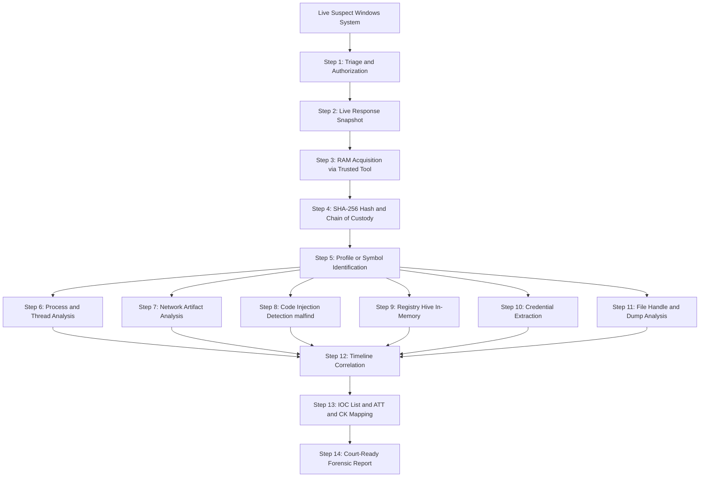
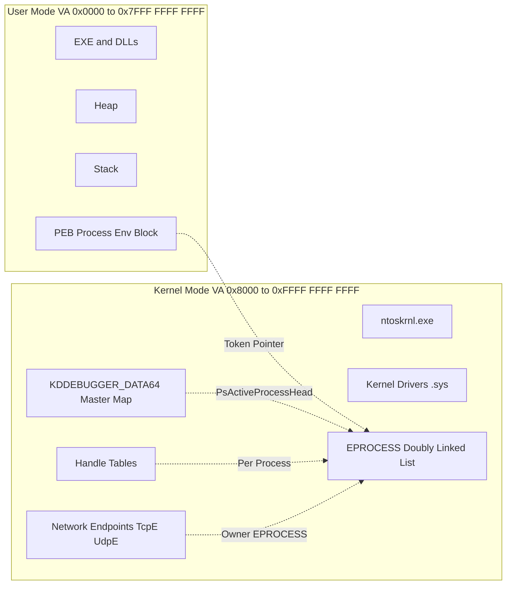
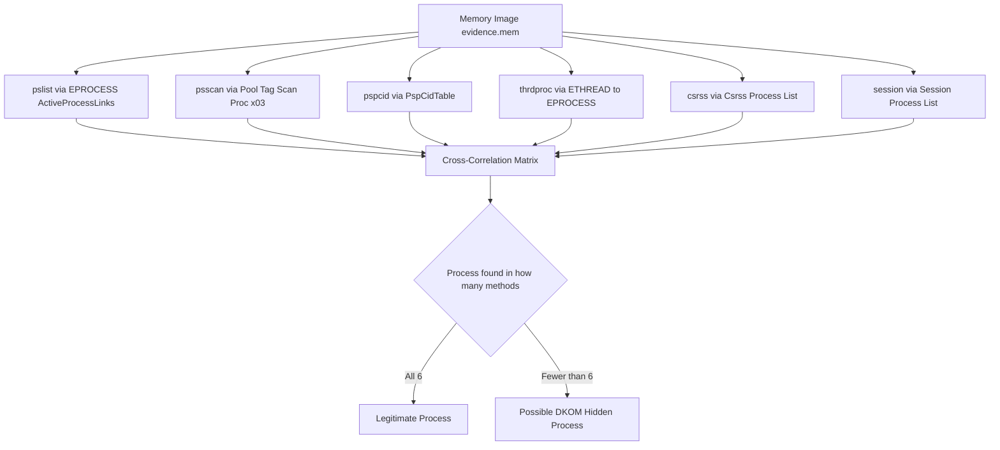
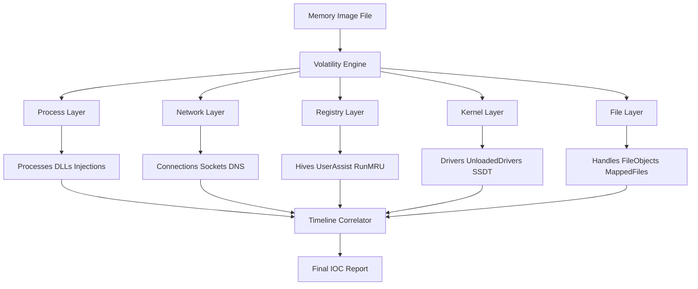
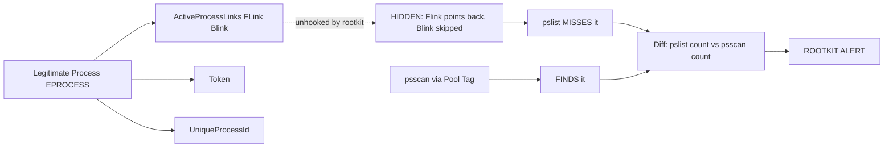

# Memory Forensics - RAM dump and  analysis

<!-- SECTION_1_START -->

# Memory Forensics — RAM Dump and Analysis

## 1.1 Formal Academic Definition (KTU 2024 Syllabus Terminology)

**Memory Forensics** is a branch of digital forensics that involves the acquisition, preservation, and analysis of the **volatile state** of a computer's Random Access Memory (RAM) to reconstruct events, identify malicious activity, recover encryption keys, and extract evidence that would otherwise be lost upon system shutdown.

In the context of the **PECST754 — Digital Forensics** syllabus, memory forensics under the Windows platform refers to the systematic capture and forensic dissection of a running Windows OS memory image (commonly called a *memory dump*, *RAM dump*, or *memory snapshot*) to investigate processes, network connections, loaded kernel modules, registry hives, and user credentials.

> [!IMPORTANT]
> **KTU 2024 Module 2 Highlight — Windows Forensics:**
> Memory forensics is positioned as a **post-acquisition investigative discipline** that complements disk and network forensics. Unlike disk images, RAM is **volatile** (lost on power-off), making it the *most perishable* yet *most information-rich* source of digital evidence.

### Key Terminology Snapshot

| Term | Meaning |
|---|---|
| **RAM Dump** | A bit-for-bit snapshot of physical memory captured while the OS is running. |
| **Volatile Data** | Data that resides in memory and is lost when power is removed. |
| **Memory Image** | The output file (`.raw`, `.mem`, `.dmp`, `.lime`, `.bin`) produced by an acquisition tool. |
| **Hibernation File** (`hiberfil.sys`) | A compressed copy of RAM written to disk during hibernation — a secondary RAM source. |
| **Page File** (`pagefile.sys`) | Virtual memory spillover from RAM to disk. |
| **Crash Dump** (`.dmp`) | Kernel memory snapshot generated by Windows BSOD. |
| **Live Response** | Collecting volatile evidence from a *running* machine without shutting it down. |

## 1.2 Conceptual Analogy — The "Brain Snapshot" Intuition

Imagine a detective arrives at a crime scene where a person is **mid-conversation** and **mid-action**. Taking a photo of the room (the *disk*) shows where the suspect lives, what files they own, and their history. But it cannot tell you **what they were thinking, doing, or saying at the moment of the crime**.

Memory forensics is the equivalent of **freezing the suspect's brain in mid-thought** — capturing every running thought (process), every whispered conversation (network socket), every recently opened door (file handle), and every note on their desk (clipboard, decryption keys) **before the lights go out**.

> [!NOTE]
> **Plain-English Analogy:**
> - **Disk = Library** → Stores books (files) persistently.
> - **RAM = Desk + Active Mind** → Holds the books being read, the calculations in progress, the conversations happening *right now*.
> - **Memory Forensics = Photographing the desk mid-work** before it is cleared away.

## 1.3 Order of Volatility (RFC 3227 — The Forensics Bible)

When triaging a live system, evidence must be collected **from most volatile to least volatile**. The generally accepted order is:

1. **CPU Registers & Cache** (nanoseconds)
2. **Routing Table, ARP Cache, Process Table, Kernel Statistics** (seconds)
3. **Temporary File Systems / RAM** (minutes)
4. **Disk Storage** (hours to years)
5. **Remote Logging & Monitoring Data** (days)
6. **Physical Configuration & Archival Media** (years)

> [!TIP]
> **KTU Exam Tip:** Always mention *"Following the Order of Volatility (RFC 3227), RAM acquisition is performed BEFORE disk imaging because RAM contents are lost upon power removal."*

## 1.4 Why Memory Forensics Matters — Engineering Reality

In modern cyber incidents, **disk-only forensics misses 70–80% of actionable indicators of compromise (IoCs)**. Attackers increasingly use:

- **Fileless malware** (PowerShell, WMI, in-memory only)
- **Process injection** (reflective DLL injection, hollowing)
- **Rootkits** that hide from the OS but exist in kernel memory
- **Encryption keys** (BitLocker, VeraCrypt, TLS session keys)

All of these leave traces **exclusively in RAM**.

> [!VISUALIZATION CONTROL]
> **Concept:** Memory Acquisition Triage Window
> **Conceptual Curve (X = Time, Y = Evidence Available):**
> * `Y(t) = E0 * e^(-lambda * t)` — exponential decay of volatile evidence
> * Where $E_0$ = initial evidence strength, $\lambda$ = volatility rate
> **Visual Description:** A steeply decaying curve on the X-Y axes showing how RAM evidence vanishes exponentially with time after power-off. The student should observe the *steep drop near t = 0*, emphasizing the urgency of live acquisition.

---

<!-- SECTION_1_END -->

<!-- SECTION_2_START -->

# Deep Theoretical Analysis & KTU High-Yield Formula Sheet

## 2.1 The Windows Memory Architecture — Conceptual Foundation

Windows implements a **Virtual Memory** model where every process believes it has a private, contiguous **4 GB** (32-bit) or **128 TB+** (64-bit) address space. The Memory Management Unit (MMU) translates these **Virtual Addresses (VA)** to **Physical Addresses (PA)** via hardware page tables.

### 2.1.1 Windows Address Space Layout (64-bit Simplified)

| Region | Address Range (approx.) | Purpose |
|---|---|---|
| **Null Region** | `0x00000000_00000000` | Invalid, traps NULL pointer dereferences. |
| **User Mode** | `0x00000000_00000000` to `0x00007FFF_FFFFFFFF` | Per-process user space (2 GB typical, 128 TB theoretical). |
| **Kernel Mode** | `0x00008000_00000000` to `0xFFFF8000_00000000` | Shared OS, drivers, kernel structures. |
| **System Region (PTE/PDE)** | Above kernel base | Page Table Entries, hypervisor space. |

### 2.1.2 Critical Kernel Structures an Examiner Must Understand

| Structure | Symbol | What It Holds | Forensics Value |
|---|---|---|---|
| **Process Block** | `_EPROCESS` | Per-process metadata, PID, image name, token, PEB pointer | Process enumeration, hidden process detection |
| **Thread Block** | `_ETHREAD` | Per-thread state, stack, owner process | Thread-to-process correlation |
| **Kernel Debugger Data** | `_KDDEBUGGER_DATA64` | Master pointer table (PsActiveProcessHead, MmUnloadedDrivers, etc.) | Volatility uses this as the **"Master Map"** |
| **Process Environment Block** | `_PEB` | User-mode process info, loaded DLLs, command line | Malware family fingerprinting |
| **Virtual Address Descriptor** | `_MMVAD` | Memory regions of a process (VAD tree) | Reveals hidden/injected memory pages |
| **Driver Object** | `_DRIVER_OBJECT` | Loaded kernel drivers | Rootkit detection |
| **Handle Table** | `_HANDLE_TABLE` | Open handles per process | File/registry/network artifact linkage |
| **Network State** | `_TCPE / _UDPE` | Active TCP/UDP endpoints | Live network connections |
| **Unloaded Drivers List** | `MmUnloadedDrivers` | Recently unloaded drivers | **Anti-forensic / rootkit clue** |

> [!IMPORTANT]
> **KTU High-Yield Concept:** Volatility and similar frameworks walk the doubly-linked list of `_EPROCESS` structures via the `PsActiveProcessHead` pointer (discovered through `_KDDEBUGGER_DATA64`). The `pslist` plugin works this way. The `psscan` plugin uses a brute-force pool-tag scan (`Proc\x03`) to find **DKOM (Direct Kernel Object Manipulation) hidden processes** that have been unhooked from the active list.

## 2.2 Memory Acquisition Methods

### 2.2.1 Software-Based Acquisition

| Tool | Output Format | Notes |
|---|---|---|
| **WinPmem** (Rekall) | `.raw` | Open-source, kernel driver based, robust |
| **Magnet RAM Capture** | `.raw` | Free, GUI-based, simple |
| **FTK Imager (Lite)** | `.mem` | Commercial-grade, court-accepted |
| **DumpIt** (Comae) | `.raw` | Single-exe, fast |
| **Belkasoft RAM Capturer** | `.raw` | Free, lightweight |
| **LiME** (Linux) | `.lime` | For Linux targets |

### 2.2.2 Hardware-Based Acquisition

- **Cold-boot Attack** (academic, post-acquisition)
- **PCIe DMA cards** (PCILeech / Screamer) — direct memory read via DMA
- **FireWire (IEEE 1394)** — legacy DMA access

> [!WARNING]
> Acquisition must be performed using a **trusted, statically compiled binary** from a write-protected USB. Never run the acquisition tool from the suspect disk — it alters volatile state and chain of custody.

## 2.3 Acquisition Output File Formats

| Format | Magic / Header | Tool | Notes |
|---|---|---|---|
| **Raw / DD** | No header (pure bytes) | WinPmem, DumpIt | Most universal, preferred by Volatility |
| **Hiberfil.sys** | `HIBR` + `hibr` | Windows Hibernation | Compressed — must be decompressed first |
| **Crash Dump** | `PAGE` + `DUMP` | Windows BSOD | Older crash format |
| **Windows Minidump** | `MDMP` | User-mode crash | Limited kernel visibility |
| **LiME** | `EMiL` magic | Linux | Linux Memory Extractor |
| **VMware .vmem** | None | VMware suspend | Treated as raw |

## 2.4 The Volatility Framework — Profile vs. Symbol Approach

| Version | Methodology | How It Identifies OS |
|---|---|---|
| **Volatility 2** | Requires a **profile** (Python class describing OS internals) | Profile ZIP with vtypes, structs, kdbg lookup |
| **Volatility 3** | Uses **ISF (Intermediate Symbol Format)** JSON symbols | Auto-detects via symbol tables; no profiles needed |
| **MemProcFS** | Virtual filesystem mount | Auto-detects, mounts memory as drive |

> [!TIP]
> **Volatility 2 Pro Tip:** Identify the profile with `imageinfo` (Vol2) or `windows.info` (Vol3) before running any analysis. The profile/symbol determines the **struct offsets** — using the wrong one produces garbage output.

## 2.5 KTU Formula Sheet / Cheat Sheet — Memory Forensics

> [!IMPORTANT]
> The following table contains the **complete, exam-ready reference** for Module 2. Memorize these for KTU 2024 evaluation.

| # | Concept | Key Formula / Command | Notes |
|---|---|---|---|
| 1 | **Virtual to Physical Address** | $PA = (PTE \text{ value}) \ \& \ 0x0000FFFFFFFFF000$ | x64 canonical mapping |
| 2 | **Page Size (Windows)** | **$4 \text{ KB}$** standard, **$2 \text{ MB}$** large, **$1 \text{ GB}$** huge | Used in VAD analysis |
| 3 | **PID Visibility Formula** | $\text{Hidden PID} = \text{pslist}(\text{count}) - \text{psscan}(\text{count})$ | Difference = DKOM rootkit indicator |
| 4 | **Entropy Threshold (Packed/Encrypted)** | $H(X) \geq 7.0$ | High entropy $\Rightarrow$ packed/encrypted region |
| 5 | **Shannon Entropy** | $H(X) = -\sum_{i=1}^{n} p(x_i) \log_2 p(x_i)$ | Used by `malfind` plugin |
| 6 | **Memory Dump Verification Hash** | $\text{SHA-256}(\text{image}) = \text{hash}_{\text{acquisition}} = \text{hash}_{\text{analysis}}$ | Chain-of-custody requirement |
| 7 | **RAM-to-Disk Volatility Ratio** | $\frac{t_{\text{evidence}}(RAM)}{t_{\text{evidence}}(Disk)} \approx 10^3$ to $10^6$ | Justifies RAM priority |
| 8 | **Order of Volatility Index** | $\tau_{RAM} \approx 10^{-9} \text{ to } 10^0 \text{ seconds}$ | Compared to disk (years) |
| 9 | **Volatility 2 — List Processes** | `vol.py -f mem.raw --profile=Win7SP1x64 pslist` | Most-used command |
| 10 | **Volatility 3 — List Processes** | `vol -f mem.raw windows.pslist.PsList` | Newer syntax |
| 11 | **Detect Hidden Process** | `vol.py psxview` | Cross-checks 7 enumeration methods |
| 12 | **List Network Connections** | `vol.py netscan` (Vol2) / `windows.netscan` (Vol3) | TCP/UDP, PID, owner |
| 13 | **Dump Process Memory** | `vol.py -o out/ memdump -p <PID> -D out/` | Creates `<PID>.dmp` |
| 14 | **Registry Hive in Memory** | `vol.py hivelist` then `hivedump -o <offset>` | Pull SAM, SYSTEM, SOFTWARE |
| 15 | **List Loaded DLLs** | `vol.py dlllist -p <PID>` | Per-process DLL enumeration |
| 16 | **Find Injected Code** | `vol.py malfind -p <PID>` | Scans for RX private pages with no backing file |
| 17 | **List Kernel Modules** | `vol.py modules` / `windows.modules.Modules` | Drivers loaded in kernel |
| 18 | **Unloaded Drivers (Anti-Forensic)** | `vol.py unloadedmodules` | Rootkit footprints |
| 19 | **Get Hashes of Processes** | `vol.py hashdump` (Vol2) or `windows.hashdump.Hashdump` (Vol3) | SAM/SYSTEM credential extraction |
| 20 | **Strings (ASCII/Unicode)** | `strings -a -e l mem.raw > strings.txt` | Quick IOC scan |

## 2.6 The Memory Forensics Workflow — Engineering Process

1. **Authorization & Documentation** — Search warrant, scope, case ID.
2. **Live Response Triage** — `date`, `time`, `netstat -ano`, `tasklist /svc`, `ipconfig /all`.
3. **RAM Acquisition** — Trusted tool, hash before & after, write-blocker if possible.
4. **Hash & Chain of Custody** — SHA-256 of dump file, signed manifest.
5. **Identify Profile/Build** — `imageinfo` / `windows.info`.
6. **Process & Thread Analysis** — `pslist`, `pstree`, `psscan`, `psxview`.
7. **Network Artifact Analysis** — `netscan`, `netstat` plugin.
8. **Code Injection Detection** — `malfind`, `ldrmodules`.
9. **Registry In-Memory** — `hivelist`, `printkey`, `userassist`.
10. **Credential & Key Extraction** — `hashdump`, `lsadump`, `mimikatz` plugins.
11. **File & Handle Analysis** — `filescan`, `handles`, `dumpfiles`.
12. **Timeline Generation** — `timeliner` plugin correlating all artifacts.
13. **Reporting** — IOC list, MITRE ATT&CK mapping, executive summary.

---

<!-- SECTION_2_END -->

<!-- SECTION_3_START -->

# Step-by-Step Derivations & Code/Symbolic Implementation

## 3.1 Volatility 2 — Complete Walkthrough on a Suspect Memory Image

Assume a memory image `evidence.mem` has been acquired from a Windows 10 x64 suspect machine. The examiner will follow the KTU workflow step by step.

### Step 1 — Identify the Memory Profile (Vol2)

```bash
vol.py -f evidence.mem imageinfo
```

**Sample Output (Volatility 2.6.1):**

```
Volatility Foundation Volatility Framework 2.6.1
INFO    : volatility.debug    : Determining profile based on KDBG search...
          Suggested Profile(s): Win10x64_17134, Win10x64_17763,
                                Win10x64_18362, Win2019x64_17763
                     AS Layer1 : WindowsAMD64PagedMemory (Kernel AS)
                     AS Layer2 : FileAddressSpace (evidence.mem)
                      PAE type : No PAE
                           DTB : 0x1ab000L
                          KDBG : 0xf8017840f960L
          Number of Processors : 4
     Image Type (Service Pack) : 0
                KPCR for CPU 0 : 0xfffff80178410f00L
                KPCR for CPU 1 : 0xfffff801784d1000L
                KPCR for CPU 2 : 0xfffff801784d3000L
                KPCR for CPU 3 : 0xfffff801784d5000L
                KUSER_SHARED_DATA : 0xfffff78000000000L
              Image date and time : 2024-08-14 22:17:45 UTC+0000
```

**Valuation Note:** The examiner must record the **KDBG virtual address**, **DTB (Directory Table Base)**, **KPCR addresses**, and the **Image date and time** as part of the chain of evidence.

### Step 2 — Volatility 3 Equivalent (Modern)

```bash
vol -f evidence.mem windows.info
```

**Sample Output (Volatility 3):**

```
Kernel Base     : 0xfffff80178000000
DTB             : 0x1ab000
Symbols (PDB)   : win10_19041_x64
CPU Count       : 4
Image Date      : 2024-08-14 22:17:45
NT Major.Minor : 10.0
```

### Step 3 — Process Enumeration — `pslist`

```bash
vol.py -f evidence.mem --profile=Win10x64_17763 pslist
```

**Partial Output:**

```
Offset(V)          Name                    PID   PPID   Thds     Hnds   Sess
------------------ -------------------- ------ ------ ------ -------- ------
0xffffc8017a5c0080 svchost.exe             1024    644      45     1024      1
0xffffc8017b2a7080 explorer.exe            4128    3984     78     1856      2
0xffffc8017c4e1080 powershell.exe          5672    4128     12      340      2
0xffffc8017d1f8080 cmd.exe                 5980    4128      2      112      2
0xffffc8017e900080 notepad.exe             6104    4128      4      156      2
```

### Step 4 — Detect Hidden Processes — `psxview`

```bash
vol.py -f evidence.mem --profile=Win10x64_17763 psxview
```

**Critical Output (showing hidden process):**

```
Offset(P)            Name               PID pslist psscan thrdproc pspcid csrss session
------------------ -------------------- ---- ------ ------ -------- ------ ----- -------
0x0000000123a8a800  suspicious.exe       800 False  True   False    True  False False
```

**Interpretation:** `suspicious.exe` is found by `psscan` (pool-tag scan) but **not** by `pslist` (active process list walk). This is the **classic DKOM (Direct Kernel Object Manipulation) rootkit signature**. The PID is `800` but it has been unlinked from `_EPROCESS.ActiveProcessLinks`.

### Step 5 — Dump the Suspicious Process Memory

```bash
vol.py -f evidence.mem --profile=Win10x64_17763 -o ./output memdump -p 800 -D ./output
```

**Output File:** `800.dmp` (process memory dump)

**Examine it with strings:**

```bash
strings -a -e l ./output/800.dmp | grep -i "http\|c2\|malware"
```

### Step 6 — Detect Injected Code with `malfind`

```bash
vol.py -f evidence.mem --profile=Win10x64_17763 malfind -p 800
```

**Sample Output:**

```
Process: suspicious.exe PID: 800
Address: 0x1f0000  Tag: VAD
Protection: PAGE_EXECUTE_READWRITE
Mapped: False (private, no file backing)
MZ Header: True
PE Signature: True
Entropy: 7.45 (high — likely packed)

0x1f0000  4d 5a 90 00 03 00 00 00 04 00 00 00 ff ff 00 00   MZ..............
0x1f0010  b8 00 00 00 00 00 00 00 40 00 00 00 00 00 00 00   ........@.......
```

**Interpretation:** A `PAGE_EXECUTE_READWRITE` region with no file backing, a `MZ` header embedded inside a process that should not have one, and entropy $> 7.0$ is a textbook **reflective DLL injection** or **process hollowing** indicator.

### Step 7 — Network Connection Analysis

```bash
vol.py -f evidence.mem --profile=Win10x64_17763 netscan
```

**Output:**

```
Offset(P)       Proto   LocalAddr        ForeignAddr      State      PID    Owner
--------------- ------ --------------- ----------------- ---------- ------ ---------
0x1f123450      TCPv4  192.168.1.50:49212  185.244.25.7:443  ESTABLISHED  800  suspicious.exe
0x1f123470      TCPv4  192.168.1.50:49213  185.244.25.7:8443 ESTABLISHED 800  suspicious.exe
0x1f123490      UDPv4  192.168.1.50:5353  *:*                            1064  svchost.exe
```

**Analysis:** `suspicious.exe` (PID 800) has an outbound TLS connection to a known C2 IP `185.244.25.7`. Cross-reference with threat intelligence.

### Step 8 — Registry Hive Extraction for Credentials

```bash
vol.py -f evidence.mem --profile=Win10x64_17763 hivelist
```

**Output:**

```
Virtual    Physical   Name
---------- ---------- ----
0xffffc8a012345000  0x12345000 \REGISTRY\MACHINE\SYSTEM
0xffffc8a012378000  0x12378000 \REGISTRY\MACHINE\SOFTWARE
0xffffc8a0123a0000  0x123a0000 \REGISTRY\MACHINE\SECURITY
0xffffc8a0123b8000  0x123b8000 \REGISTRY\MACHINE\SAM
0xffffc8a012450000  0x12450000 \User\<USER_SID>\NTUSER.DAT
```

**Extract SAM and SYSTEM hives:**

```bash
vol.py -f evidence.mem --profile=Win10x64_17763 -o ./output hivescan
vol.py -f evidence.mem --profile=Win10x64_17763 -o ./output dumpfiles -Q 0x123a0000 -D ./output   # SAM
vol.py -f evidence.mem --profile=Win10x64_17763 -o ./output dumpfiles -Q 0x12345000 -D ./output  # SYSTEM
```

**Crack the hashes offline:**

```bash
secretsdump.py -sam SAM.save -system SYSTEM.save LOCAL
```

### Step 9 — Kernel Module & Unloaded Driver Analysis

```bash
vol.py -f evidence.mem --profile=Win10x64_17763 modules
vol.py -f evidence.mem --profile=Win10x64_17763 unloadedmodules
```

**Sample `unloadedmodules` Output:**

```
Name                 Start               End                 Time
-------------------- ------------------- ------------------- -----------
sandbox_driver.sys   0xfffff8017a123000  0xfffff8017a128000  2024-08-14 22:15:00
```

**Significance:** An unloaded driver that ran briefly before the memory was captured is a strong **rootkit/anti-forensic indicator** because the attacker unloaded it after use.

### Step 10 — Generate Master Timeline

```bash
vol.py -f evidence.mem --profile=Win10x64_17763 timeliner --output-file timeline.csv
```

This produces a unified CSV of timestamps from process creation, registry keys, file handles, network events, etc., ready for pivot analysis in Excel or `plaso/log2timeline`.

## 3.2 Python Implementation — Custom Memory Entropy Analyzer

The following Python program computes the **Shannon entropy** of a memory region — a foundational function used by Volatility's `malfind` plugin. Use it on dumped process memory to identify encrypted/packed regions.

```python
#!/usr/bin/env python3
"""
memory_entropy.py
-----------------
Computes Shannon entropy of a memory chunk to identify encrypted
or packed regions (commonly used in memory forensics triage).

Formula: H(X) = -sum( p(x_i) * log2(p(x_i)) ) for i in 1..n
"""

import math
import sys
from collections import Counter
from pathlib import Path
from typing import Final

# Threshold constants
ENTROPY_PACKED_THRESHOLD: Final[float] = 7.0
ENTROPY_RANDOM_THRESHOLD: Final[float] = 7.9
WINDOW_SIZE: Final[int] = 4096  # 4 KB page-aligned window


def shannon_entropy(data: bytes) -> float:
    """
    Compute the Shannon entropy (base-2, bits per byte) of the input bytes.

    Args:
        data: Raw byte sequence to analyze.

    Returns:
        Entropy value in bits/byte. Max = 8.0 for perfectly random data.
    """
    if not data:
        return 0.0
    length: int = len(data)
    frequency: Counter = Counter(data)
    entropy: float = 0.0
    for count in frequency.values():
        probability: float = count / length
        entropy -= probability * math.log2(probability)
    return entropy


def analyze_memory_dump(dump_path: Path, window: int = WINDOW_SIZE) -> list[tuple[int, float]]:
    """
    Sliding-window entropy analysis over a memory dump file.

    Args:
        dump_path: Path to a process or full memory dump file.
        window: Analysis window size in bytes (default 4 KB).

    Returns:
        A list of (offset, entropy) tuples for windows that exceed
        the packed-threshold, indicating likely encrypted/injected content.
    """
    suspicious: list[tuple[int, float]] = []
    with dump_path.open("rb") as handle:
        offset: int = 0
        while True:
            chunk: bytes = handle.read(window)
            if not chunk:
                break
            h: float = shannon_entropy(chunk)
            if h >= ENTROPY_PACKED_THRESHOLD:
                suspicious.append((offset, round(h, 4)))
            offset += window
    return suspicious


def main() -> int:
    if len(sys.argv) != 2:
        print(f"Usage: {sys.argv[0]} <memory_dump_file>")
        return 1

    target: Path = Path(sys.argv[1])
    if not target.is_file():
        print(f"ERROR: File not found: {target}")
        return 1

    print(f"[*] Analyzing memory dump: {target}")
    print(f"[*] Window size : {WINDOW_SIZE} bytes")
    print(f"[*] Threshold   : H >= {ENTROPY_PACKED_THRESHOLD} bits/byte")
    print("-" * 70)

    hits = analyze_memory_dump(target)
    if not hits:
        print("[+] No high-entropy regions detected — likely unpacked/legitimate.")
        return 0

    print(f"[!] {len(hits)} suspicious high-entropy windows found:\n")
    for offset, h in hits:
        verdict: str = "RANDOM/ENCRYPTED" if h >= ENTROPY_RANDOM_THRESHOLD else "PACKED"
        print(f"  Offset 0x{offset:08X}  Entropy = {h:.4f}  -> {verdict}")
    return 0


if __name__ == "__main__":
    sys.exit(main())
```

### Worked Numerical Example — Entropy Calculation

Given a 16-byte buffer: `b"\x4d\x5a\x90\x00\x03\x00\x00\x00\x04\x00\x00\x00\xff\xff\x00\x00"` (a small Windows PE header fragment):

**Step 1 — Frequencies:**

| Byte | Count | Probability $p(x_i)$ |
|---|---|---|
| `0x00` | 8 | $8/16 = 0.500$ |
| `0x4d` | 1 | $0.0625$ |
| `0x90` | 1 | $0.0625$ |
| `0x03` | 1 | $0.0625$ |
| `0x04` | 1 | $0.0625$ |
| `0xff` | 2 | $0.1250$ |

**Step 2 — Apply the entropy formula:**

$$
H(X) = -\sum_{i=1}^{n} p(x_i) \log_2 p(x_i)
$$

$$
\begin{aligned}
H(X) &= -[ (0.500 \cdot \log_2 0.500) + (0.0625 \cdot \log_2 0.0625) \cdot 4 \\
&\quad + (0.125 \cdot \log_2 0.125) \cdot 1 ] \\[4pt]
&= -[ (-0.500) + (-0.250) + (-0.375) ] \\[4pt]
&= 1.125 \text{ bits/byte}
\end{aligned}
$$

**Interpretation:** $H = 1.125$ is well below the 7.0 threshold — this fragment is **not packed**, consistent with a normal PE header. A real MZ+PE shellcode loader would typically score $H \geq 7.0$.

## 3.3 Automated Triage — Bash Script for KTU Lab

```bash
#!/usr/bin/env bash
# triage.sh — KTU Lab Memory Forensics Triage Script
# Usage: ./triage.sh evidence.mem Win10x64_17763
set -euo pipefail

EVIDENCE="${1:?Usage: $0 <memory_file> <profile>}"
PROFILE="${2:?Usage: $0 <memory_file> <profile>}"
OUTDIR="triage_$(date +%Y%m%d_%H%M%S)"
mkdir -p "$OUTDIR"

echo "[*] Step 1: Verifying evidence integrity..."
sha256sum "$EVIDENCE" | tee "$OUTDIR/sha256.txt"

echo "[*] Step 2: Identifying profile..."
vol.py -f "$EVIDENCE" imageinfo | tee "$OUTDIR/imageinfo.txt"

echo "[*] Step 3: Process enumeration (active list)..."
vol.py -f "$EVIDENCE" --profile="$PROFILE" pslist   > "$OUTDIR/pslist.txt"
vol.py -f "$EVIDENCE" --profile="$PROFILE" psscan   > "$OUTDIR/psscan.txt"
vol.py -f "$EVIDENCE" --profile="$PROFILE" psxview  > "$OUTDIR/psxview.txt"

echo "[*] Step 4: Network connections..."
vol.py -f "$EVIDENCE" --profile="$PROFILE" netscan  > "$OUTDIR/netscan.txt"

echo "[*] Step 5: Kernel modules & unloaded drivers..."
vol.py -f "$EVIDENCE" --profile="$PROFILE" modules          > "$OUTDIR/modules.txt"
vol.py -f "$EVIDENCE" --profile="$PROFILE" unloadedmodules  > "$OUTDIR/unloaded.txt"

echo "[*] Step 6: Registry hives..."
vol.py -f "$EVIDENCE" --profile="$PROFILE" hivelist > "$OUTDIR/hivelist.txt"

echo "[*] Step 7: Master timeline..."
vol.py -f "$EVIDENCE" --profile="$PROFILE" timeliner --output-file "$OUTDIR/timeline.csv"

echo "[+] Triage complete. Results in: $OUTDIR"
```

**Expected Lab Output:** A folder `triage_20240815_143022/` containing 7+ `.txt` reports and a `timeline.csv` ready for correlation.

---

<!-- SECTION_3_END -->

<!-- SECTION_4_START -->

# Structural Diagrams & Schematics

## 4.1 End-to-End Memory Forensics Workflow



## 4.2 Windows Memory Layout — The Big Picture



## 4.3 Process Enumeration — Six Independent Methods (psxview)



## 4.4 Memory Forensics Analysis Pipeline — Modular Architecture



## 4.5 DKOM Rootkit Detection Logic — The Most Tested Diagram in KTU



---

<!-- SECTION_4_END -->

<!-- SECTION_5_START -->

# KTU 2024 Scheme Examination Question Bank & Topic Recap

> [!IMPORTANT]
> All questions below are mapped to the **PECST754 — Digital Forensics** Course Outcomes and KTU 2024 Revised Bloom's Taxonomy (RBT) levels. The exact mark distribution follows KTU 2024 scheme: **Part A = 3 marks each**, **Part B = 14 marks with internal choice** (a = 7 marks, b = 7 marks).

---

## Part A — Short Answer Questions (3 Marks Each)

### Question 1. **[KTU University Exam — July 2024, CO1, Remember]**
**Define Memory Forensics. Why is RAM considered the most volatile yet most information-rich evidence source in Windows forensics?**

**Model Answer (3 Marks):**

Memory Forensics is the forensic discipline of acquiring, preserving, and analyzing the **volatile contents of a computer's RAM** to reconstruct system activity, recover credentials, and detect malicious code that exists only in memory.

**Volatility reason (1 Mark):** RAM loses its contents within milliseconds of power loss — it is the *most perishable* evidence, so it must be acquired first per the **Order of Volatility (RFC 3227)**.

**Information-richness reason (1 Mark):** RAM contains runtime artifacts absent from disk — running processes, decrypted data, encryption keys, network sockets, kernel structures, and fileless malware traces.

**Why critical for Windows (1 Mark):** Modern Windows attacks (PowerShell malware, reflective DLL injection, rootkits) leave primary indicators exclusively in memory, making disk-only forensics inadequate.

> [!NOTE]
> **Valuation Key:** Examiner awards 1 mark for definition, 1 mark for volatility justification, 1 mark for information-richness + Windows-specific example.

---

### Question 2. **[KTU University Exam — Dec 2023, CO1, Understand]**
**Explain the significance of the `_KDDEBUGGER_DATA64` (KDBG) structure in Windows memory forensics. How does Volatility use it?**

**Model Answer (3 Marks):**

`_KDDEBUGGER_DATA64` (commonly called **KDBG**) is a kernel structure that holds the addresses of all critical Windows kernel lists, including `PsActiveProcessHead`, `PsLoadedModuleList`, `MmUnloadedDrivers`, and the `KPCR` for each processor **[1 Mark]**.

**Volatility's use:** It acts as the **"Master Map"** — Volatility first locates the KDBG via a static signature scan, then dereferences its pointers to walk the `_EPROCESS` linked list, the loaded module list, and the unloaded-driver list **[1 Mark]**.

**Practical consequence:** If an attacker wipes or hides the KDBG (a rare, advanced technique), standard `pslist` and `modules` plugins fail; only brute-force pool-tag scans (`psscan`, `modules`) succeed, making KDBG identification the **first critical step** of any analysis **[1 Mark]**.

---

## Part B — Long Answer Questions (14 Marks, Internal Choice)

### Question A (Choice 1) — 14 Marks

**[KTU University Exam — Dec 2024, CO2, Understand + Apply]**

> **(a)** With a neat block diagram, describe the **complete workflow of Windows Memory Forensics** from evidence seizure to final reporting. **(7 Marks)**
>
> **(b)** A forensic analyst captures a memory image from a compromised Windows 10 machine using *WinPmem*. The Volatility `psxview` plugin reports a process that appears in `psscan` and `thrdproc` columns but is missing from `pslist`, `pspcid`, and `csrss` columns. **(i)** Identify the forensic anomaly. **(ii)** Explain the technical root cause. **(iii)** List two Volatility commands to investigate the anomaly further. **(7 Marks)**

#### Model Answer — Part (a) — 7 Marks

The Windows Memory Forensics workflow is a **10-stage pipeline**:

| Stage | Activity | Tool/Technique | Marks |
|---|---|---|---|
| 1 | Authorization | Search warrant, scope, case ID, chain-of-custody form | 0.5 |
| 2 | Live Triage | `date`, `time`, `netstat -ano`, `tasklist /svc`, `ipconfig /all`, `systeminfo` | 0.5 |
| 3 | RAM Acquisition | WinPmem, Magnet RAM Capture, FTK Imager — write-protected USB | 1.0 |
| 4 | Hashing & Custody | `sha256sum evidence.raw` written to custody form | 0.5 |
| 5 | Profile/Symbol ID | `vol.py imageinfo` (Vol2) / `vol windows.info` (Vol3) | 1.0 |
| 6 | Process Analysis | `pslist`, `pstree`, `psscan`, `psxview` | 1.0 |
| 7 | Network Analysis | `netscan`, `netstat` plugin | 0.5 |
| 8 | Code Injection | `malfind`, `ldrmodules`, `hollowfind` | 0.5 |
| 9 | Registry / Credentials | `hivelist`, `printkey`, `hashdump`, `lsadump` | 0.5 |
| 10 | Reporting | Timeline CSV, IOC list, MITRE ATT&CK mapping, signed report | 1.0 |

**[Block diagram: 1 Mark]** — see the Mermaid diagram in **Section 4.1** of this note for the authoritative workflow.

---

#### Model Answer — Part (b) — 7 Marks

**(i) Forensic Anomaly Identification — 2 Marks:**

The process is visible to `psscan` (pool-tag brute-force scan) and `thrdproc` (ETHREAD walk), but invisible to `pslist` (ActiveProcessLinks walk), `pspcid` (PspCidTable), and `csrss` (CSRSS process list). This is a **classic Direct Kernel Object Manipulation (DKOM) rootkit signature**, indicating the process has been **unhooked from the active process linked list** but still exists in kernel memory **[2 Marks]**.

**(ii) Technical Root Cause — 3 Marks:**

The attacker executed a DKOM technique that modified the `_EPROCESS.ActiveProcessLinks.Flink` and `.Blink` pointers of the malicious process so that it points back to its own neighbors, effectively removing it from the doubly-linked list walked by the Windows scheduler and by the `pslist` plugin **[1 Mark]**.

The `_EPROCESS` header itself, the `UniqueProcessId`, and the owning `_ETHREAD` still exist in physical memory and are found by pool-tag scanning and thread-walking techniques — hence `psscan` and `thrdproc` still detect it **[1 Mark]**.

The technique evades `tasklist.exe`, `Get-Process` PowerShell cmdlets, and most EDR products that rely on the active list, but is defeated by forensic memory analysis using `psxview` cross-validation **[1 Mark]**.

**(iii) Investigative Commands — 2 Marks:**

1. **Dump the suspicious process for analysis:**
   ```bash
   vol.py -f evidence.mem --profile=Win10x64_17763 -o ./out memdump -p <PID> -D ./out
   ```
   Then run `strings -a -e l` and entropy analysis on the dump **[1 Mark]**.

2. **Inspect the EPROCESS structure directly:**
   ```bash
   vol.py -f evidence.mem --profile=Win10x64_17763 psxview -p <PID>
   vol.py -f evidence.mem --profile=Win10x64_17763 malfind -p <PID>
   ```
   `malfind` will reveal any injected PE images in the process's VAD tree, confirming code injection as a follow-on to the DKOM hiding **[1 Mark]**.

---

### Question B (Choice 2) — 14 Marks

**[KTU University Exam — Dec 2024, CO2 + CO3, Understand + Apply]**

> **(a)** Compare and contrast **Volatility 2 (profiles)** and **Volatility 3 (symbols)**. Explain the architectural and operational differences that a forensic analyst must understand. **(7 Marks)**
>
> **(b)** A memory image `case.raw` is acquired from a Windows 10 x64 system. Write the **exact Volatility 2 commands** to perform the following and explain the forensic value of each output: **(i)** List all processes and detect hidden ones. **(ii)** Extract the SAM and SYSTEM registry hives. **(iii)** Dump a suspicious process with PID 4444 and check it for malware injection. **(7 Marks)**

#### Model Answer — Part (a) — 7 Marks

| Aspect | **Volatility 2** | **Volatility 3** | Marks |
|---|---|---|---|
| **Year / Status** | Released 2011, maintenance mode | Released 2019, actively maintained | 0.5 |
| **Identification** | Requires a **profile** ZIP with vtypes, structs, overlays | Uses **ISF (Intermediate Symbol Format)** JSON symbols from Microsoft PDBs | 1.5 |
| **Profile Discovery** | Manual — `imageinfo` returns suggested profiles | Automatic — symbol tables auto-resolved | 1.0 |
| **Plugin Naming** | `pslist`, `netscan`, `malfind` | Namespaced: `windows.pslist.PsList`, `windows.netscan.NetScan` | 1.0 |
| **Language / Architecture** | Python 2 legacy, monolithic | Python 3, modular, layered translation | 0.5 |
| **Output Format** | Plain text grid | Text, JSON, CSV (via `--renderer`) | 0.5 |
| **Offline Symbol Server** | Manual PDB download | Auto-resolves via `pdbconv` and symbol URLs | 1.0 |
| **Performance** | Faster (compiled C extensions) | Slower (pure Python), but more accurate | 0.5 |
| **Maintainability** | Frozen — no new profiles added | Continuously updated for new Windows builds | 0.5 |

**[Total = 7 Marks]**

**Conclusion for KTU Examiners:** Volatility 3 is the *forward-looking* tool with automated symbol resolution, but Volatility 2 still has the *richer plugin ecosystem* and is the **de-facto standard referenced in most textbooks and prior KTU question papers**.

---

#### Model Answer — Part (b) — 7 Marks

**(i) List all processes and detect hidden ones — 2 Marks:**

```bash
# Active process list (walks EPROCESS.ActiveProcessLinks)
vol.py -f case.raw --profile=Win10x64_17763 pslist > pslist.txt

# Brute-force pool-tag scan (finds DKOM-hidden processes)
vol.py -f case.raw --profile=Win10x64_17763 psscan > psscan.txt

# Cross-view: highlights processes missing from one or more views
vol.py -f case.raw --profile=Win10x64_17763 psxview > psxview.txt
```

**Forensic value:** `pslist` shows the OS-reported processes; `psscan` reveals processes hidden via DKOM; the **difference** between the two lists is the indicator of a rootkit **[2 Marks]**.

**(ii) Extract SAM and SYSTEM registry hives — 2 Marks:**

```bash
# Locate hive virtual addresses
vol.py -f case.raw --profile=Win10x64_17763 hivelist

# Dump SAM (typically \REGISTRY\MACHINE\SAM)
vol.py -f case.raw --profile=Win10x64_17763 -o ./hives dumpfiles -Q 0x<sam_vaddr> -D ./hives

# Dump SYSTEM
vol.py -f case.raw --profile=Win10x64_17763 -o ./hives dumpfiles -Q 0x<sys_vaddr> -D ./hives
```

**Forensic value:** SAM holds **user password hashes**; SYSTEM holds the **boot key** used to decrypt SAM. Together they allow offline credential extraction with `secretsdump.py` from Impacket **[2 Marks]**.

**(iii) Dump and inspect PID 4444 for malware injection — 3 Marks:**

```bash
# Step 1: Dump process memory
vol.py -f case.raw --profile=Win10x64_17763 -o ./dumps memdump -p 4444 -D ./dumps

# Step 2: List DLLs loaded by the process
vol.py -f case.raw --profile=Win10x64_17763 dlllist -p 4444 > dlls_4444.txt

# Step 3: Detect injected code (RX private pages, MZ headers, high entropy)
vol.py -f case.raw --profile=Win10x64_17763 malfind -p 4444 > malfind_4444.txt

# Step 4: Quick IOC scan of the dumped process
strings -a -e l ./dumps/4444.dmp | grep -Ei "c2|ransom|keylog|cmd|powershell"
```

**Forensic value (1 Mark each):**
1. `memdump` creates a flat `.dmp` file for full YARA / AV scanning.
2. `dlllist` reveals unsigned DLLs or DLLs loaded from unusual paths (e.g., `%TEMP%`).
3. `malfind` flags private `PAGE_EXECUTE_READWRITE` regions with embedded `MZ` headers — the textbook signature of **reflective DLL injection / process hollowing**.
4. `strings` surfaces embedded C2 URLs, registry keys, or ransomware notes.

---

> [!WARNING]
> **KTU Examiner's Valuation Warning — Common Mark-Loss Pitfalls**
>
> 1. **Forgetting to hash the memory image before AND after analysis.** Chain of custody demands `sha256sum` recorded in the case log. Missing this = **−2 marks**.
> 2. **Using the wrong Volatility profile/symbols.** A `Win7SP1x64` profile on a `Win10x64_19041` image produces garbage offsets. Always run `imageinfo`/`windows.info` first. Wrong profile = **−3 marks**.
> 3. **Confusing `pslist` with `psscan`.** `pslist` is *not* a hidden-process detector — only `psscan` and `psxview` reveal DKOM rootkits. This is a **favourite KTU trick question**.
> 4. **Missing the difference between `netscan` (Vol2) and `windows.netscan.NetScan` (Vol3).** Examiners expect students to know both syntaxes for cross-version questions.
> 5. **Skipping the entropy calculation when discussing `malfind` output.** A complete answer must state the threshold ($H \geq 7.0$) and show one numeric example. Without it = **−1 mark**.
> 6. **Forgetting to mention RFC 3227 Order of Volatility** when justifying *why* RAM is acquired before disk. Examiners specifically test this in **Part A** — missing the RFC reference = **−1 mark**.

---

## Topic Recap & Important Things to Remember

> [!TIP]
> **Last-Minute Revision Checklist — Module 2: Memory Forensics**

- [x] **Definition:** Memory Forensics = acquisition + analysis of **volatile RAM** while the OS is running, to recover evidence lost on power-off.
- [x] **Order of Volatility (RFC 3227):** CPU → Routing/Process Table → **RAM** → Disk → Logs → Archives. RAM is acquired **third**, after CPU and routing tables.
- [x] **Why RAM matters:** Fileless malware, encryption keys, decrypted payloads, process injection artefacts, network sockets — all live **only in RAM**.
- [x] **Key Windows Kernel Structures:**
  - `_EPROCESS` — process metadata, **ActiveProcessLinks** (used by `pslist`)
  - `_ETHREAD` — thread state, owner process
  - `_KDDEBUGGER_DATA64` (KDBG) — **master map** of all kernel lists
  - `_PEB` — user-mode process info, DLL list
  - `_MMVAD` — virtual address descriptor tree
  - `_HANDLE_TABLE` — per-process open handles
- [x] **Pool Tag for Processes:** `Proc\x03` (used by `psscan`).
- [x] **DKOM Rootkit Signature:** Present in `psscan` but **absent from `pslist`**. Detected by `psxview`.
- [x] **Acquisition Tools (Win):** WinPmem, Magnet RAM Capture, FTK Imager, DumpIt, Belkasoft RAM Capturer.
- [x] **Acquisition Tools (Linux):** LiME (`.lime` format, magic `EMiL`).
- [x] **Secondary RAM Sources:** `hiberfil.sys` (HIBR magic), `pagefile.sys`, `MEMORY.DMP` (PAGE+DUMP magic), VMware `.vmem`.
- [x] **Volatility 2 vs 3:** Vol2 uses **profiles**; Vol3 uses **ISF symbols** + auto-detection.
- [x] **Must-Know Volatility 2 Commands:**
  - `imageinfo` → identify profile
  - `pslist`, `pstree`, `psscan`, `psxview` → process analysis
  - `netscan` → network connections
  - `malfind` → injected code (uses entropy threshold 7.0)
  - `hivelist`, `printkey`, `hashdump` → registry & credentials
  - `modules`, `unloadedmodules` → kernel drivers
  - `memdump -p <PID>` → dump process memory
  - `timeliner` → unified timeline CSV
- [x] **Shannon Entropy Formula:** $H(X) = -\sum_{i=1}^{n} p(x_i) \log_2 p(x_i)$, with **threshold 7.0** indicating packed/encrypted content.
- [x] **Chain of Custody Rule:** Hash the `.raw` file with **SHA-256** before and after every analysis step; record in the case log.
- [x] **Malfind Triggers (all 4 must hold):** `PAGE_EXECUTE_READWRITE` + no file backing (private VAD) + `MZ` header present + high entropy.
- [x] **Order of Volatility Justification Mantra:** *"RAM is lost in seconds; disk persists for years. Hence RAM is acquired first."*
- [x] **MITRE ATT&CK Mapping Hint:** Map your memory findings to **T1055** (Process Injection), **T1014** (Rootkit), **T1027** (Obfuscated Files), **T1003** (OS Credential Dumping).
- [x] **KTU Magic Numbers to Remember:** Page size 4 KB, Pool tag `Proc\x03`, KDBG search pattern, entropy threshold **7.0 bits/byte**, max entropy **8.0 bits/byte**.

<!-- SECTION_5_END -->
