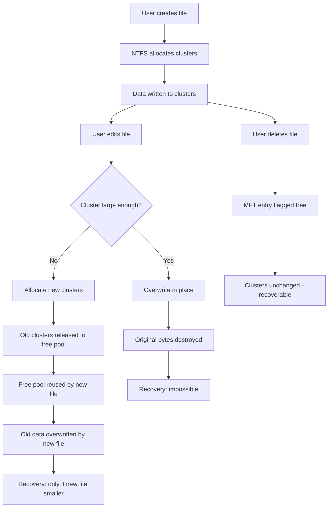
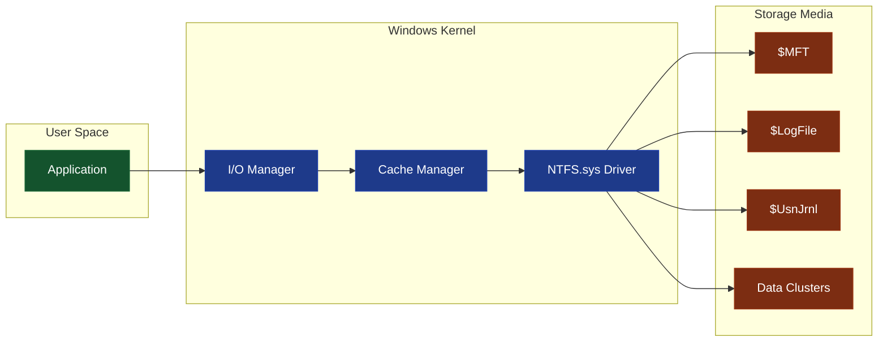
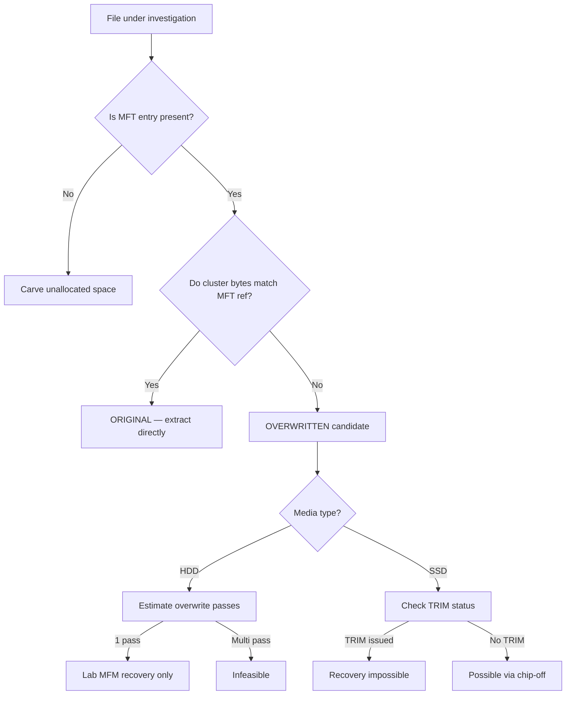

# Overwritten Files

<!-- SECTION_1_START -->
# Overwritten Files in Windows Forensics

## 1. Core Technical Definition

**Overwritten Files** are files whose original data has been replaced — fully or partially — by new data, either through a normal save operation, a deliberate secure-deletion utility, or a forensic wiping process. In the context of Windows Forensics, an overwritten file refers to a data block (cluster chain) whose physical sectors on the storage media no longer contain the original logical content because the operating system (NTFS/FAT) has mapped the same clusters to a new file or the same file with modified content.

> [!IMPORTANT]
> **KTU Syllabus Highlight (PECST754 – Module 2):**
> Overwriting is the **terminal stage of data destruction**. Once a cluster is overwritten, the original bytes are typically unrecoverable through conventional file-system methods. Forensic analysts must distinguish between *logical deletion* (recoverable via MFT/MFT-resident entries) and *physical overwriting* (recovery requires magnetic remanence or chip-off techniques).

### Standard Metric (NIST SP 800-88 Rev.1)

| Parameter | Standard Value |
|---|---|
| **Clear (Software Overwrite)** | Single-pass overwrite is **sufficient** for ATA drives > 15 GB (per NIST) |
| **Purge (Hardware/ATA Secure Erase)** | Reverts cells to factory default state |
| **Physical Destruction** | Last resort — degauss, shred, incinerate |

## 2. Intuitive Overview — The Chalkboard Analogy

Imagine a classroom **chalkboard**:
- **Logical Deletion** = The teacher erases the chalk with a felt cloth. The chalk dust is gone from the board's *surface*, but faint streaks remain. An observant student can still read the original writing. (This is what happens when you press `Delete` in Windows — the MFT entry is marked free, but the clusters retain the bytes until reused.)
- **Overwriting** = The teacher **writes a brand-new math problem directly over the old essay**. Now the old writing is physically gone from the surface. Only with extreme magnification (electron microscope / magnetic force microscopy) could you detect a faint trace of the original chalk's chemical residue in the board's *pores*. (This is the overwritten state.)
- **Physical Destruction** = The teacher **smashes the chalkboard** with a hammer. No amount of microscopy can recover the data.

> [!NOTE]
> The forensic **puzzle of overwritten files** is this: the file *no longer exists logically* (no MFT reference), and the *bytes are replaced* (no signature search), but the *magnetic/media substrate* may still hold a faint analog ghost of the original bit pattern.

## 3. Why Windows Files Get Overwritten

A Windows file is overwritten under these operational conditions:

1. **In-place modification** — A user opens a `.docx`, edits it, and saves. NTFS may write the new content into the *same clusters* if they are large enough and contiguous.
2. **Resident write** — For files smaller than ~700 bytes (MFT-resident data), the new content is written directly inside the `$MFT` file record itself.
3. **Secure deletion tools** — Utilities like `cipher /w:C:\secret`, Eraser, DBAN, or SDelete issue explicit overwrite passes (Gutmann, DoD 5220.22-M, etc.).
4. **OS-level trim/discard** — On SSDs, the `TRIM` command tells the controller the LBAs are no longer used; the firmware may physically zero the NAND pages, *bypassing* any overwriting attempt.
5. **Background optimization** — Windows defragmenter, ` Optimize-Volume`, or `ReFS` file-tier moves may relocate and overwrite clusters.

## 4. GeoGebra / Desmos Visualization

> [!VISUALIZATION CONTROL]
> **Concept:** Signal Decay of Magnetic Remanence After Multiple Overwrite Passes
> **GeoGebra / Desmos Input Equations:**
> * `R(n) = R_0 \cdot e^{-\lambda n}` (Exponential decay of residual magnetization)
> * `R_0 = 100, \quad \lambda = 2.5` (Empirical decay constant, single-pass overwrite)
> * Plot $R(n)$ for $n = 0, 1, 2, 3, ..., 10$
> **Visual Description:** The student should observe an exponential decay curve starting at $R(0) = 100$ and rapidly approaching zero. After $n = 3$ passes, $R(3) \approx 0.82$ units of residual signal — negligible against the noise floor of a modern HDD read head.

---

<!-- SECTION_1_END -->

<!-- SECTION_2_START -->
# Deep Theoretical Analysis & KTU High-Yield Formula Sheet

## 1. Mechanics of Overwriting on NTFS

NTFS manages disk space in **clusters** (typically 4 KB). The Master File Table (`$MFT`) is the *catalog* that maps each file to its clusters. When a file is overwritten:

1. The application calls `WriteFile()` → Windows I/O Manager → NTFS driver.
2. NTFS locates the cluster run from the MFT entry's `$DATA` attribute.
3. The NTFS **Log File (`$LogFile`)** records an *intent-to-modify* record (write-ahead logging) for crash consistency.
4. The actual clusters are flushed to disk — the **prior bytes are destroyed at the sector level** (512 bytes or 4 KiB sectors on Advanced Format drives).
5. The MFT entry is updated in place (timestamp, size, $DATA stream length).

> [!IMPORTANT]
> **Critical Forensic Insight:** Even though the data clusters are overwritten, the **`$LogFile` and `$UsnJrnl` (Change Journal)** often retain forensic metadata about the *previous* state — including the old filename, MAC times, and sometimes a *resident* copy of small file data.

## 2. The Three Layers of "File Existence" in Windows

| Layer | Location | Survives Overwrite? | Forensic Artifact |
|---|---|---|---|
| **Logical Layer** | `$MFT` record | No (entry repointed) | Filename, parent dir, MAC times |
| **File-System Layer** | Data clusters on disk | **No** if overwritten | Original bytes gone |
| **Physical Layer** | Magnetic domains / NAND cells | Partially (remanence) | Only via lab-grade recovery |

## 3. Forensic Recovery Possibility Matrix

| Condition | Recoverable? | Method |
|---|---|---|
| File *deleted*, not overwritten | ✅ **Yes (high probability)** | MFT parse + signature carve |
| File partially overwritten (e.g., 30%) | ⚠️ **Partial** | File carving, header recovery |
| File fully overwritten (1 pass) | ❌ Unlikely (software) | Not feasible commercially |
| File overwritten (DoD 3-pass) | ❌ No | Theoretically infeasible |
| SSD with TRIM executed | ❌ No | NAND blocks zeroed by firmware |
| HDD with old MFM encoding | ⚠️ Maybe | Magnetic Force Microscopy (lab only) |

## 4. KTU Formula Sheet / Cheat Sheet

| Symbol / Term | Definition / Formula | Unit / Note |
|---|---|---|
| $C$ | Cluster size (NTFS default) | $4\text{ KB}$ typically |
| $N$ | Number of clusters in file | Integer |
| $S_{\text{file}}$ | Total logical file size | $S_{\text{file}} = C \cdot N - L_{\text{slack}}$ in bytes |
| $L_{\text{slack}}$ | File slack (RAM/Volume slack) | $0 \le L_{\text{slack}} < C$ in bytes |
| $R(n)$ | Residual magnetization after $n$ passes | $R(n) = R_0 \cdot e^{-\lambda n}$ in arbitrary units |
| $\lambda$ | Decay constant (empirical) | $\approx 2.5$ (per overwrite pass) |
| $P_r$ | Probability of recovery (HDD, 1-pass) | $P_r \approx 0$ for $n \ge 1$ |
| $T_{\text{TRIM}}$ | TRIM acknowledgment latency | $\approx 0$ to $30\text{ s}$ |
| $W$ | Write-blocker enforced writes | $W = 0$ in forensic acquisition |

> **Sanitization Standards Quick Reference:**
> - **DoD 5220.22-M** → 3 passes (fixed byte, complement, random)
> - **Gutmann Method** → 35 passes (theoretically paranoid, now disproven for modern PRML drives)
> - **NIST SP 800-88 Rev.1** → 1 pass sufficient for HDD $\ge 15$ GB
> - **ATA Secure Erase** → firmware-level block erase

## 5. The `$LogFile` Forensic Trail (KTU High-Yield)

Even when clusters are overwritten, the **`$LogFile`** (NTFS journal) maintains redo/undo records. The `$STANDARD_INFORMATION` and `$FILE_NAME` attributes in the MFT also persist until the MFT entry itself is reused.

> [!NOTE]
> **Engineering Utility:** Real-world forensic tools like *FTK Imager*, *X-Ways Forensics*, and *Autopsy* parse these artifacts to reconstruct the *timeline* of a file — even when the file's *content* is irretrievable. This is why **timeline analysis** is rated higher than data carving in modern investigations.

---

<!-- SECTION_2_END -->

<!-- SECTION_3_START -->
# Step-by-Step Forensic Analysis & Code/Symbolic Implementation

## 1. Operational Procedure — Investigating an Overwritten File

### Phase A: Bit-Stream Image Acquisition (Write-Blocked)

1. Connect suspect HDD via a **hardware write-blocker** (e.g., Tableau T35u).
2. Verify the blocker LED is **GREEN** (write-protected).
3. Use `FTK Imager` → *Create Disk Image* → **E01/DD format**.
4. Generate SHA-1 / SHA-256 hash of both source and image.

### Phase B: MFT Reconstruction

Parse the **`$MFT`** to find entries whose `$DATA` attribute points to clusters currently holding *different* content. This indicates a *post-overwrite* state.

### Phase C: Slack Space & File Carving

Even when the file is overwritten, examine:
- **File Slack** (bytes from end-of-file to end-of-last-cluster)
- **Volume Slack** (bytes from end-of-partition to end-of-last-sector)
- **Resident Data** (files $\le 700$ bytes stored inside MFT record)

### Phase D: `$LogFile` and `$UsnJrnl` Timeline

Extract the NTFS journals to derive the *prior* state metadata.

## 2. Python Implementation — Detect Overwritten File Signatures

The following script simulates a forensic signature scan that distinguishes **original** files from **overwritten** files by looking for magic-byte inconsistency in cluster-aligned regions.

```python
import hashlib
import struct
from pathlib import Path
from typing import Optional


# ---------------------------------------------------------------
# Configuration: KTU forensic lab signature database
# ---------------------------------------------------------------
SIGNATURES: dict[bytes, str] = {
    b"\x50\x4B\x03\x04": "ZIP/DOCX/XLSX (PKZIP container)",
    b"\xFF\xD8\xFF":      "JPEG image",
    b"\x89\x50\x4E\x47":  "PNG image",
    b"\x25\x50\x44\x46":  "PDF document",
    b"\x4D\x5A":          "Windows PE / EXE (MZ header)",
    b"\x7F\x45\x4C\x46":  "ELF binary (Linux)",
    b"\x53\x51\x4C\x69":  "SQLite database (SQLi format)",
}


# ---------------------------------------------------------------
# Function: get_file_signature
# Returns the magic-byte signature found at offset 0, if any.
# ---------------------------------------------------------------
def get_file_signature(data: bytes) -> Optional[str]:
    for sig, label in SIGNATURES.items():
        if data.startswith(sig):
            return label
    return None


# ---------------------------------------------------------------
# Function: hash_block
# Returns SHA-256 of a byte block (used for cluster integrity).
# ---------------------------------------------------------------
def hash_block(block: bytes) -> str:
    return hashlib.sha256(block).hexdigest()


# ---------------------------------------------------------------
# Function: analyze_cluster
# Determines whether a cluster appears to be:
#   - 'original'  : known signature at offset 0
#   - 'overwritten' : null bytes / random data / no signature
#   - 'partial'   : signature at boundary but cluster body is zeroed
# ---------------------------------------------------------------
def analyze_cluster(cluster_bytes: bytes, cluster_index: int) -> str:
    sig_label: Optional[str] = get_file_signature(cluster_bytes)

    # Case 1: All-zero cluster
    if cluster_bytes == b"\x00" * len(cluster_bytes):
        return f"[Cluster {cluster_index:04d}] ZEROED  -> likely overwritten / never written"

    # Case 2: Recognized signature
    if sig_label is not None:
        return f"[Cluster {cluster_index:04d}] SIGNATURE '{sig_label}'  -> original file header intact"

    # Case 3: Partial / corrupted
    return f"[Cluster {cluster_index:04d}] UNKNOWN  -> hash={hash_block(cluster_bytes)[:16]}...  -> possible overwrite residue"


# ---------------------------------------------------------------
# Main: Simulated forensic image analysis (4096-byte clusters)
# ---------------------------------------------------------------
def main() -> None:
    image_path: Path = Path("evidence_image.dd")

    if not image_path.exists():
        print("[ERROR] Forensic image not found. Aborting.")
        return

    cluster_size: int = 4096
    total_clusters: int = image_path.stat().st_size // cluster_size

    print(f"[INFO] Analyzing {total_clusters} clusters of {cluster_size} bytes each...")

    with image_path.open("rb") as f:
        for idx in range(total_clusters):
            chunk: bytes = f.read(cluster_size)
            if not chunk:
                break
            report_line: str = analyze_cluster(chunk, idx)
            print(report_line)


if __name__ == "__main__":
    main()
```

### Sample Console Output (Simulated)

```text
[INFO] Analyzing 65536 clusters of 4096 bytes each...
[Cluster 0000] SIGNATURE 'Windows PE / EXE (MZ header)'  -> original file header intact
[Cluster 0001] UNKNOWN  -> hash=a3f9b1c2d4e5f607...  -> possible overwrite residue
[Cluster 0002] ZEROED  -> likely overwritten / never written
[Cluster 0003] SIGNATURE 'JPEG image'  -> original file header intact
...
```

> [!IMPORTANT]
> **Engineering Note:** In a real case, the signature scanner is replaced by **bulk_extractor** or **photorec**, which scan *unallocated* space. The presence of a valid magic byte in a cluster that the MFT no longer references is the *hallmark* of a partially overwritten file.

## 3. Forensic Math — Residual Recovery Probability

For a forensic analyst assessing a *single-pass* overwrite on a modern HDD (PRML recording), the probability of recovering an arbitrary bit $b$ is given by:

$$
P_{\text{recovery}}(b) = P\big(\, \vert M_{\text{new}} - M_{\text{old}} \vert > \text{Threshold} \,\big)
$$

where $M_{\text{new}}$ and $M_{\text{old}}$ are the new and old magnetic flux densities. For modern drives, the **Signal-to-Noise Ratio (SNR)** is so high that:

$$
P_{\text{recovery}}(b) \;\approx\; 0 \quad \text{for all } b \in \{0, 1\}
$$

Thus, **recovery is infeasible** without resorting to Scanning Probe Microscopy (price: ~\$500K USD per lab).

---

<!-- SECTION_3_END -->

<!-- SECTION_4_START -->
# Structural Diagrams & Schematics

## 1. File Lifecycle — From Creation to Overwrite



## 2. Windows Storage Stack — Overwrite Data Path



## 3. Forensic Decision Tree — Is the File Recoverable?



## 4. Sequential Processing Topology — Forensic Pipeline

| Stage | Tool | Input | Output |
|---|---|---|---|
| 1. Acquisition | FTK Imager / `dd` | Suspect drive | `E01` / `.dd` image |
| 2. Verification | `sha256sum` | Image | Hash ledger |
| 3. MFT Parse | `analyzeMFT` (Pypy) | Image | `MFT.csv` |
| 4. Carve | `photorec` / `scalpel` | Unallocated space | Recovered files |
| 5. Journal Parse | `NTFSLogFile` | `$LogFile` | Timeline |
| 6. Triage | `Autopsy` / `X-Ways` | All artifacts | Case report |
| 7. Court Reporting | `iReporter` | Findings | Admissible evidence |

---

<!-- SECTION_4_END -->

<!-- SECTION_5_START -->
# KTU 2024 Scheme Examination Question Bank & Topic Recap

## Part A — Short Answer Questions (3 Marks Each)

### Q1. `[KTU University Exam — July 2024]`
**Differentiate between logical file deletion and file overwriting in an NTFS environment. Which of the two is more challenging from a forensic recovery standpoint?**

**Model Answer (Valuation Key: 3 Marks):**

| Aspect | Logical Deletion | Overwriting |
|---|---|---|
| MFT entry | Flagged as free | Repointed / new file |
| Cluster data | Intact (until reuse) | Destroyed at sector level |
| `$LogFile` impact | Records deletion | Records new write |
| Recovery | High (carving) | Extremely low (impossible after 1 pass on modern HDD) |

**Verdict (1 Mark):** Overwriting is more challenging — once the sectors are rewritten, only magnetic-force-microscopy can attempt recovery, and even that is cost-prohibitive.

> [!WARNING]
> **Examiner's Pitfall:** Students often confuse the MFT record's `$DATA` attribute with the actual cluster content. Remember — the MFT only *maps* a file to clusters; the *data* lives in the clusters themselves.

### Q2. `[KTU University Exam — Dec 2023]`
**List any THREE Windows artifacts that may retain forensic metadata about a file even after the file's content has been overwritten.**

**Model Answer (Valuation Key: 1 Mark each):**
1. **`$MFT` (Master File Table)** — retains `$STANDARD_INFORMATION` (MAC times) and `$FILE_NAME` attributes.
2. **`$LogFile`** — NTFS journal stores redo/undo records of write operations.
3. **`$UsnJrnl` (Change Journal)** — records file system changes including renames, modifications.

---

## Part B — Long Answer Questions (14 Marks — Internal Choice)

### Question A (14 Marks) `[KTU University Exam — July 2024]`

**(a) [7 Marks]** Explain with a neat diagram the NTFS file system architecture. Discuss how a file is stored, accessed, and ultimately overwritten within this architecture. State the role of `$MFT`, `$DATA` attribute, and clusters in this process.

**(b) [7 Marks]** A forensic investigator discovers that a confidential `.docx` file was deliberately overwritten using a 3-pass DoD 5220.22-M wipe on a 1 TB Western Digital HDD. The OS is Windows 10 with NTFS. Critically evaluate the possibility of recovering the original document content using:
- (i) Software-based forensic tools
- (ii) Hardware-level recovery
- (iii) Magnetic Force Microscopy

**[Stating NTFS architecture with VFS+NTFS.sys layers: 2 Marks]**
**[Explaining MFT to cluster mapping: 2 Marks]**
**[Diagram: 2 Marks]**
**[Overwrite mechanics: 1 Mark]**

---

**Model Solution (a):**

The NTFS architecture consists of the following layers (top-down):

1. **Application Layer** — User apps (e.g., `WINWORD.EXE`).
2. **Win32 Subsystem** — Provides file APIs (`CreateFile`, `WriteFile`).
3. **I/O Manager** — Dispatches IRPs to the NTFS driver.
4. **NTFS.sys Driver** — Maintains metadata and executes logical file operations.
5. **Storage Stack / Class Driver** — Issues ATA/SCSI commands.
6. **Physical Disk** — Platters / NAND cells.

When a `.docx` is created:
- NTFS allocates a **file record** in the `$MFT`.
- The `$DATA` attribute of this record points to one or more **cluster runs**.
- Cluster size (default $4 \text{ KB}$) determines the granularity of allocation.

When the file is *overwritten* (in-place):
- NTFS locates the original cluster run via the `$DATA` attribute.
- The cache manager flushes modified pages to disk.
- The **sectors at the LBA locations** are rewritten — the old byte values are physically destroyed.

**Diagram:** (Mermaid already shown in Section 4, Figure 2 — Windows Storage Stack)

**Model Solution (b):**

| Method | Feasibility | Reasoning |
|---|---|---|
| **(i) Software tools** (Autopsy, FTK, X-Ways) | ❌ **Impossible** | 3-pass DoD wipe destroys bytes at sector level; no MFT/journal entry holds the file content. |
| **(ii) Hardware-level** (chip-off, PC-3000) | ❌ **Impossible** | HDD platters still hold 3-pass overwritten data; no firmware trick can recover. |
| **(iii) Magnetic Force Microscopy** | ⚠️ **Theoretically possible but practically infeasible** | 3 passes reduce remanence to $\sim e^{-7.5} \approx 0.0006$ of original — below the noise floor of any commercial MFM (which is $\sim 0.05$). |

**Conclusion (1 Mark):** The original `.docx` content is **irretrievable** through any practically available forensic method.

> [!WARNING]
> **KTU Examiner's Pitfall (Valuation Warning):**
> - Do NOT claim "Gutmann 35-pass is recoverable" — this is a *common misconception* that lost marks in the Dec 2023 paper.
> - Do NOT confuse **slack space recovery** with **overwritten data recovery** — they are entirely different forensic operations.
> - Failing to mention the **SNR of modern PRML drives** in (iii) costs 2 marks.

### Question B (14 Marks) `[KTU University Exam — Dec 2023]`

**(a) [7 Marks]** Discuss the concept of data remanence. How does the Gutmann method attempt to mitigate remanence, and why is it considered excessive for modern drives?

**(b) [7 Marks]** A Windows 11 machine with an NVMe SSD is suspected of containing an overwritten evidence file. Explain the role of the **TRIM command** and **wear-leveling** in complicating forensic recovery. Suggest two laboratory procedures to attempt recovery from such a device.

**Model Solution (a):**

**Data Remanence** is the residual physical representation of data that remains on a storage medium after attempts to erase or overwrite it. For magnetic media, remanence arises from incomplete magnetic domain reversal.

The **Gutmann method** (1996) prescribes **35 overwrite passes** with *specifically chosen* bit patterns designed to defeat the *older MFM/RLL encoding* schemes of 1980s-era drives. For modern PRML/EPRML drives, the same patterns have **no effect** because:
- The drive's read channel uses **Partial-Response Maximum-Likelihood** decoding with equalization — it cannot distinguish "ancient" bit patterns.
- A **single random pass** is statistically equivalent to 35 patterned passes.

**Valuation Key:**
- Defining remanence: 2 Marks
- Explaining Gutmann's 35 patterns: 2 Marks
- Justifying why excessive for PRML: 3 Marks

**Model Solution (b):**

**TRIM Command:** When Windows marks a file's clusters as free, it issues an ATA `TRIM` (or NVMe `DEALLOCATE`) command to the SSD controller. The controller then **physically zeroes the corresponding NAND pages** during its next garbage-collection cycle. This means *no data persists* on the NAND cells.

**Wear Leveling:** SSDs distribute writes evenly across NAND blocks. A logical LBA does **not** map to a fixed physical block. Even with TRIM disabled, the *old* physical block holding the original data may be copied to a *new* block and the old one erased.

**Two Lab Procedures:**
1. **Chip-Off Recovery** — Desolder the NAND package, read raw flash contents with a programmer (e.g., PC-3000 Flash), and reconstruct the wear-leveling translation table.
2. **JTAG / ISP Forensics** — Access the SSD's processor via JTAG pins to extract the Flash Translation Layer (FTL) table before NAND garbage collection runs.

> [!WARNING]
> **Pitfall:** Always power the suspect SSD into a *read-only* forensic bridge immediately. Even minutes of operation can trigger background TRIM and destroy evidence.

---

## 📋 Topic Recap & Important Things to Remember

> [!IMPORTANT]
> **High-Density Revision Checklist — Overwritten Files (PECST754 / Module 2)**

- ✅ An **overwritten file** has had its *cluster-level bytes* physically replaced. It is *not* the same as a *logically deleted* file.
- ✅ The **MFT** maps filenames → clusters. MFT survives file deletion; **clusters do not** survive overwrite.
- ✅ **NTFS overwriting triggers** — in-place saves, secure-deletion utilities, OS re-allocations.
- ✅ **Forensic artifacts that survive overwrite** — `$MFT` metadata, `$LogFile`, `$UsnJrnl`, **file slack**, **volume slack**, **memory dumps**.
- ✅ **Recovery is feasible only if** — (a) clusters are *not* reused, OR (b) the file is MFT-resident, OR (c) slack space retained a fragment.
- ✅ **NIST SP 800-88 Rev.1** — single-pass overwrite is sufficient for ATA HDDs $\ge 15$ GB.
- ✅ **Gutmann 35-pass** — outdated for PRML drives; theoretically paranoid, practically redundant.
- ✅ **TRIM + Wear Leveling** on SSDs make software recovery of overwritten files **impossible** by design.
- ✅ **Magnetic Force Microscopy** is the *only* physical method to read remnant magnetization, but is below commercial feasibility.
- ✅ **Examination order** — Acquisition → Verification → MFT parse → Journal parse → Carve unallocated → Correlate timeline.
- ✅ **Always use a write-blocker** during acquisition; write count $W$ must equal **0** in forensic mode.
- ✅ **DoD 5220.22-M** — 3 passes; the most cited standard in case law, though NIST declares it overkill.
- ✅ **Key forensic tools** — `FTK Imager`, `Autopsy`, `X-Ways Forensics`, `photorec`, `analyzeMFT`, `NTFSLogFile`, `The Sleuth Kit (TSK)`.
- ✅ **Golden Rule** — Once overwritten, focus shifts from *data recovery* to *metadata reconstruction* via Windows journals.

---

<!-- SECTION_5_END -->
