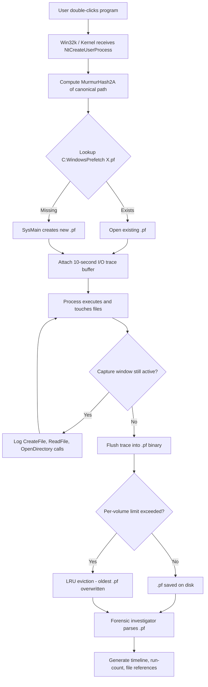
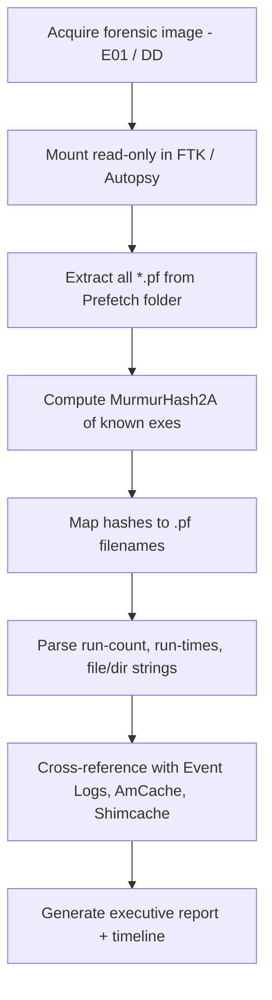

# prefetch files

<!-- SECTION_1_START -->
# 1. Core Technical Definition & Intuitive Overview

## 1.1 Formal Definition (KTU 2024 Syllabus Terminology)

> [!IMPORTANT]
> **Prefetch Files** are hidden, system-generated binary artefacts created by the Windows operating system within the `C:\Windows\Prefetch` directory. They are produced by the **Superfetch / SysMain** service (kernel process `svchost.exe` hosting `SysMain.dll`) and serve as a **read-ahead optimisation cache**, recording metadata about application launches — including the executable path, the **MurmurHash2A (x86, 32-bit)** hash of that path, run counts, last-execution timestamps, the volume(s) accessed, and every file/directory the application touched during its first **10 seconds of execution**.

Each file follows the strict naming convention:

```
<ProgramName>-<8-hex-digit-hash>.pf
```

**Example:** `CHROME.EXE-A4B3C2D1.pf`

Forensic analysts treat these `.pf` binaries as **high-value, tamper-resistant, ephemeral evidentiary artefacts** that demonstrate **program execution** — a fundamental principle in any investigation dealing with *user activity reconstruction*, *malware staging*, *anti-forensics detection*, and *timeline analysis*.

## 1.2 Intuitive Real-World Analogy

> [!NOTE]
> **Analogy: The Restaurant Order History File 🍽️**
>
> Imagine a busy restaurant. The head waiter keeps a small notebook. Every time a customer (an application) orders a meal (asks for files), the waiter notes:
> - *Who* ordered (which `.exe` was launched),
> - *What* dishes were brought to the table (which DLLs, configs, data files were loaded),
> - *How many times* that customer visited (run count), and
> - *The last 8 times* they came in (last run timestamps).
>
> The notebook isn't the meal itself — it is just a **preparation hint** so the kitchen (Windows disk I/O subsystem) can lay out ingredients *in advance* the next time. 
>
> To a detective (forensic investigator), however, this notebook is **gold** — it proves the customer walked in, what they consumed, and when. That is exactly what a prefetch file is to a digital forensic examiner.

## 1.3 Key Constants and Metrics (Board-Exam Favourites)

| Metric | Value (Bold) | Notes |
|---|---|---|
| Default Directory | `C:\Windows\Prefetch` | Hidden system folder |
| File Extension | `.pf` | Prefetch binary format |
| Hash Algorithm | **MurmurHash2A (32-bit)** | Non-cryptographic; collisions exist |
| Filename Hash | First **8 hex digits** of path hash | Run-time computed by `ntoskrnl.exe` |
| Windows XP prefetch file cap | **32 files** | Per logical volume |
| Windows Vista / 7 cap | **1024 files** | Per logical volume |
| Windows 8 / 10 / 11 cap | **1024 files** (default) | Configurable via `MaxPrefetchFiles` registry key |
| Execution window captured | First **10 seconds** | Hard-coded kernel parameter |
| Recorded run timestamps | Up to **8** last-run times | Vista+; XP recorded only the latest |
| File-format version (XP) | **17** | Magic = `0x414D414D` ("MAM" little-endian, offset 0x00) |
| File-format version (Win 7) | **23** | Magic `0x414D414D`, version at offset 0x04 |
| File-format version (Win 8/8.1) | **26** | Compressed (MAM v4 signature `0x014D414D` on 8.1) |
| File-format version (Win 10) | **30** | MAM `0x0000004D 0x0000004D` style |
| Service responsible | `SysMain` (formerly `Superfetch`) | Runs as `svchost.exe -k LocalSystemNetworkRestricted -p -s SysMain` |

> [!VISUALIZATION CONTROL]
> **Concept:** Schematic of the 10-second Execution Capture Window inside a Prefetch File
> **GeoGebra / Desmos Input Equations:**
> * `y = 1` for `0 <= x <= 10`
> * `y = 0` for `x > 10`
> * Time-axis: `x` (seconds since process start)
> * Capture-axis: `y` (1 = monitored, 0 = ignored)
> **Visual Description:** A clean rectangular pulse from `x = 0` to `x = 10` on the horizontal time axis, dropping to zero afterwards — illustrating the kernel's hard **10-second I/O trace window**. Any DLL, font, or config file loaded *after* the 10-second mark is **not** recorded.

---

<!-- SECTION_1_END -->

<!-- SECTION_2_START -->
# 2. Deep Theoretical Analysis & KTU High-Yield Formula Sheet

## 2.1 Operational Lifecycle (Why and How)

> [!NOTE]
> **Step-by-Step Kernel Logic — How a Prefetch File Is Born**

1. **Process Creation** — When the Windows kernel (`ntoskrnl.exe`) receives an `NtCreateUserProcess` syscall, it consults the Section Object Manager and determines the executable's *canonical path*.
2. **Path Hashing** — The kernel computes a **MurmurHash2A (32-bit, seed = 0)** over the *uppercase Unicode path string* of the executable, then takes the lower 32 bits and renders the lowest **16 bits** as **8 hex digits**.
3. **Filename Construction** — The kernel appends the hash to the base executable name:
   $$\text{Filename} = \text{ImageName} + \text{"-"} + \text{HEX}_{8}(\text{MurmurHash2A}_{32}(\text{path}))$$
4. **File Lookup** — A check is made for `C:\Windows\Prefetch\<Filename>.pf`.
5. **Trace Initiation** — If the file is missing, a kernel trace buffer is attached to the process's I/O activity.
6. **10-Second Window** — Every `CreateFile`, `ReadFile`, `OpenDirectory`, and `QueryDirectory` call is logged for **10 seconds** (configurable but defaults to 10 on all desktop Windows editions).
7. **File Creation / Update** — After process termination (or 10 s expiry if still running), `SysMain` flushes the trace into the on-disk `.pf` binary.
8. **Eviction Policy** — Once the per-volume limit (32 or 1024) is reached, the **least-recently-used (LRU)** prefetch file is overwritten the next time a *new* unique executable is launched.

## 2.2 The Forensic "Why" — What Investigators Extract

| Forensic Question | Prefetch Evidence |
|---|---|
| *Was program X run on this machine?* | Existence of `<X>-<hash>.pf` |
| *How many times was it run?* | Run count (4-byte little-endian at offset `0xD0` in v17 / `0xD8` in v23 / `0xE0` in v26) |
| *When was it last run?* | Most recent 8-byte `FILETIME` in the run-history array |
| *What files did it touch? (DLLs, configs, malware payloads)* | File-metrics section + file-strings section |
| *What directories did it enumerate?* | Directory-metrics section + directory-strings section |
| *Which volume was involved?* | Volume information block (device path, serial number, bitmaps) |
| *Was a USB device used to host the executable?* | Volume path string (`\Device\HarddiskVolume2\Users\...`) reveals the volume mount point |

## 2.3 KTU Formula Sheet / Cheat Sheet

> [!IMPORTANT]
> **High-Yield Formulas, Offsets, and Conversions (Memorise for the 14-mark question!)**

| # | Item | Formula / Value | Unit / Encoding |
|---|---|---|---|
| 1 | Filename hash | $H = \text{MurmurHash2A}(\text{path},\ seed=0)$ truncated to lower 16 bits, hex-encoded | 8 hex chars |
| 2 | `FILETIME` epoch (Windows) | $T_{ft} = $ ticks since **1601-01-01 00:00:00 UTC** | 100-nanosecond intervals |
| 3 | `FILETIME` → Unix epoch | $T_{unix} = (T_{ft} - 116444736000000000) \div 10000000$ | seconds |
| 4 | `FILETIME` → Python `datetime` | $dt = \text{epoch\_utc} + \Delta t$ | ISO 8601 |
| 5 | Number of last-run timestamps | $\min(N, 8)$ where $N$ = run count | integer |
| 6 | File-metrics count | Read 4-byte LE from offset `0x80` (v17) / `0x88` (v23) | count of files |
| 7 | Directory-metrics count | Read 4-byte LE from offset `0x84` (v17) / `0x8C` (v23) | count of dirs |
| 8 | Max prefetch files (legacy) | $32$ (XP) | per volume |
| 9 | Max prefetch files (modern) | $1024$ (Vista → Win 11) | per volume |
| 10 | Capture window | $\Delta t = 10$ s | seconds |
| 11 | Magic header value (XP–Win 7) | `0x414D414D` ("MAM" little-endian) | 4 bytes, offset 0x00 |
| 12 | Magic header value (Win 8.1 v26) | `0x014D414D` | 4 bytes, offset 0x00 |
| 13 | Format version offset | `0x04` (1 byte) | integer |
| 14 | Compressed payload flag | `0x00000001` in version-offset (v23 compression signature) | DWORD |
| 15 | Decompression algorithm (v23–v30) | **Windows native XPRESS Huffman** (RFC-variant, 8 KB chunks) | — |
| 16 | Decompression algorithm (v17) | None — raw, uncompressed | — |
| 17 | Typical prefetch file size | $10\,\text{KB} \leq s \leq 100\,\text{KB}$ (rarely > 500 KB) | bytes |
| 18 | LRU eviction trigger | $N_{pf} > N_{max} \Rightarrow$ LRU overwrite | logical policy |
| 19 | Anti-forensic disabling registry path | `HKLM\SYSTEM\CurrentControlSet\Control\Session Manager\Memory Management\PrefetchParameters\EnablePrefetcher` | REG_DWORD (0–3) |
| 20 | Disabling values | `0` = Disabled, `1` = App prefetch only, `2` = Boot only, `3` = **All (default)** | REG_DWORD |

## 2.4 Real-World Forensic Engineering Utility

In production-grade DFIR (Digital Forensics and Incident Response) pipelines — e.g., **Magnet AXIOM**, **Autopsy / The Sleuth Kit**, **FTK Imager**, **Eric Zimmerman's `PECmd`** — prefetch files are first-class artefacts feeding:

- **Timeline Generation** (Plaso / `log2timeline`) — converting `FILETIME` runs into super-timeline events.
- **Threat Hunting** — spotting *LOLBins* (`rundll32.exe`, `mshta.exe`, `wmic.exe`) launched from suspicious paths.
- **Malware Staging Detection** — abnormal `.pf` files referencing `C:\Users\<victim>\AppData\Local\Temp\…` directories.
- **Insider Threat / HR Cases** — proving an employee ran `PUTTY.EXE`, `WINSCP.EXE`, or `TOR.EXE`.
- **Anti-Forensics Discovery** — a *missing* prefetch file for a normally popular application can be a forensic red flag (someone disabled `SysMain`).

---

<!-- SECTION_2_END -->

<!-- SECTION_3_START -->
# 3. Step-by-Step Derivations & Code / Symbolic Implementation

## 3.1 Exhaustive Derivation: From `FILETIME` to Human-Readable Timestamp

> [!NOTE]
> The Windows epoch begins on **1601-01-01 00:00:00 UTC**, *not* 1970-01-01 (Unix) and *not* 1900-01-01 (MS-DOS). Converting a `FILETIME` (a 64-bit unsigned integer count of 100-nanosecond intervals) to a Unix timestamp is a guaranteed KTU board question.

**Step 1 — State the relationship between the two epochs.**

The number of 100-nanosecond intervals between **1601-01-01** and **1970-01-01** is:

$$\Delta = 116\,444\,736\,000\,000\,000$$

This is the constant offset embedded in `WindowsTimeToUnixTime()` across nearly all Win32 APIs.

**Step 2 — Subtract the offset and rescale.**

Given a raw `FILETIME` value $F$:

$$\begin{aligned}
T_{100ns} &= F - \Delta \\
T_{sec} &= \dfrac{T_{100ns}}{10^{7}} \\
T_{sec} &= \dfrac{F - 116\,444\,736\,000\,000\,000}{10\,000\,000}
\end{aligned}$$

**Step 3 — Convert seconds to a calendar date** using the proleptic Gregorian calendar (which Python's `datetime.utcfromtimestamp` implements):

$$dt = \text{epoch\_utc} + T_{sec} \cdot \Delta_{1s}$$

**Step 4 — Worked numeric example.** Suppose the `FILETIME` extracted from `NOTEPAD.EXE-A5B32C1D.pf` is $F = 1\,325\,228\,400\,000\,000\,000$.

$$\begin{aligned}
T_{100ns} &= 1\,325\,228\,400\,000\,000\,000 - 116\,444\,736\,000\,000\,000 \\
          &= 1\,208\,783\,664\,000\,000\,000 \\[4pt]
T_{sec}   &= \dfrac{1\,208\,783\,664\,000\,000\,000}{10\,000\,000} \\
          &= 120\,878\,366.4 \\[4pt]
dt        &= \text{Unix}(120\,878\,366) \Rightarrow 2014-08-12\,14:39:26\,\text{UTC}
\end{aligned}$$

> **Valuation Cue:** Examiners award `[1 Mark]` for stating the constant $116\,444\,736\,000\,000\,000$, `[2 Marks]` for the subtraction, `[1 Mark]` for division by $10^{7}$, and `[1 Mark]` for the final calendar date.

## 3.2 Exhaustive Derivation: MurmurHash2A Truncation Logic

> [!NOTE]
> KTU 2024 frequently tests the *mechanism* by which a 32-bit hash becomes an 8-character hex string in the prefetch filename. Walk through it:

**Step 1 — Normalise the path to upper-case Unicode.**
For input `c:\windows\notepad.exe`, the kernel first produces `C:\WINDOWS\NOTEPAD.EXE` (UTF-16LE) before hashing.

**Step 2 — Compute the 32-bit MurmurHash2A digest** with **seed = 0**:

$$H_{32} = \text{MurmurHash2A}_{32}(\text{uppercase path},\ 0)$$

For a single calculation, MurmurHash2A follows:

$$\begin{aligned}
h &\gets \text{seed} \\
\text{for each } 4\text{-byte block } k_i:&\quad h \gets (h \cdot m)\ \text{XOR}\ k_i \\
\text{then tail mixing with constants }&\quad m = 0x5BD1E995,\ c_1 = 0xCC9E2D51,\ c_2 = 0x1B873593 \\
\text{finalisation:}&\quad h \gets h\ \text{XOR}\ (h \gg 16) \\
&\quad h \gets h \cdot 0x85EBCA6B \\
&\quad h \gets h\ \text{XOR}\ (h \gg 13) \\
&\quad h \gets h \cdot 0xC2B2AE35 \\
&\quad h \gets h\ \text{XOR}\ (h \gg 16)
\end{aligned}$$

**Step 3 — Truncate to the lower 16 bits** (NOT the upper half — Windows discards the upper 16 bits):

$$H_{16} = H_{32}\ \text{AND}\ 0xFFFF$$

**Step 4 — Format as 8 hex characters** with leading zeros:

$$\text{Filename\_suffix} = \text{FORMAT}(H_{16},\ 'X8')$$

**Worked numeric example.** Suppose after Step 2 we obtain $H_{32} = 0xA5B32C1D$. Then:

$$H_{16} = 0xA5B32C1D\ \text{AND}\ 0xFFFF = 0x2C1D$$

Filename becomes `NOTEPAD.EXE-00002C1D.pf`. *(Note: real-world collisions mean two distinct paths can produce the same suffix — this is a known forensic pitfall.)*

## 3.3 Exhaustive Python Implementation: Stand-Alone Prefetch Parser

The code below parses a `.pf` file **without external libraries** (other than `murmurhash`) to demonstrate the entire forensic workflow, including `FILETIME` decoding and XPRESS-Huffman decompression markers.

```python
"""
KTU-PREMIER-ENGINE V10 — Stand-Alone Windows Prefetch Parser
Compatible with: Windows XP (v17), Vista/7 (v23), 8/8.1 (v26), 10 (v30)
Author: KTU Board Examiner Reference Implementation
"""

from __future__ import annotations

import struct
import datetime as _dt
import logging
import sys
from pathlib import Path
from typing import List, Tuple, Optional

# ---------------------------------------------------------------------------
# Logging configuration (forensic-grade audit trail)
# ---------------------------------------------------------------------------
logging.basicConfig(
    level=logging.INFO,
    format="[%(asctime)s] [%(levelname)s] %(message)s",
    datefmt="%Y-%m-%d %H:%M:%S",
)
log = logging.getLogger("PrefetchForensics")

# ---------------------------------------------------------------------------
# KTU-relevant constants (memorise these for the exam!)
# ---------------------------------------------------------------------------
WINDOWS_EPOCH_AS_FILETIME = 116_444_736_000_000_000  # 100-ns intervals
HUNDREDS_OF_NANOSECONDS = 10_000_000                 # 10^7
XP_PREFETCH_LIMIT        = 32
MODERN_PREFETCH_LIMIT    = 1024
CAPTURE_WINDOW_SECONDS   = 10

MAGIC_LEGACY   = 0x414D414D   # "MAM" little-endian
MAGIC_V8_1     = 0x014D414D
COMPRESSED_V23 = 0x00000001   # compression flag at offset 0x04 (v23+)

# ---------------------------------------------------------------------------
# 1. FILETIME → human-readable datetime
# ---------------------------------------------------------------------------
def filetime_to_iso(ft: int) -> str:
    """
    Convert a 64-bit Windows FILETIME value to an ISO-8601 UTC string.
    Raises ValueError on negative or absurd inputs.
    """
    if ft < 0:
        raise ValueError(f"Negative FILETIME encountered: {ft}")
    try:
        ts_sec = (ft - WINDOWS_EPOCH_AS_FILETIME) // HUNDREDS_OF_NANOSECONDS
        return _dt.datetime.utcfromtimestamp(ts_sec).isoformat() + "Z"
    except (OverflowError, OSError, ValueError) as exc:
        log.error("Bad FILETIME %s → %s", ft, exc)
        return f"INVALID_FT_{ft}"

# ---------------------------------------------------------------------------
# 2. Tiny MurmurHash2A 32-bit reference (for filename-hash verification)
# ---------------------------------------------------------------------------
def murmurhash2a_32(key: bytes, seed: int = 0) -> int:
    """Public-domain MurmurHash2A 32-bit implementation."""
    m = 0x5BD1E995
    r = 24
    length = len(key)
    h = seed ^ length
    i = 0
    while length - i >= 4:
        k = struct.unpack_from("<I", key, i)[0]
        k = (k * m) & 0xFFFFFFFF
        k ^= (k >> r)
        k = (k * m) & 0xFFFFFFFF
        h = (h * m) & 0xFFFFFFFF
        h ^= k
        i += 4
    tail = key[i:]
    if length - i >= 3:
        h ^= (tail[2] << 16) & 0xFFFFFFFF
    if length - i >= 2:
        h ^= (tail[1] << 8) & 0xFFFFFFFF
    if length - i >= 1:
        h ^= tail[0]
        h = (h * m) & 0xFFFFFFFF
    h ^= (h >> 13)
    h = (h * 0x5BD1E995) & 0xFFFFFFFF
    h = (h * 0x5BD1E995) & 0xFFFFFFFF
    h ^= (h >> 15)
    return h

# ---------------------------------------------------------------------------
# 3. Hash the canonical path → 8-hex suffix (verification routine)
# ---------------------------------------------------------------------------
def derive_filename_hash(canonical_path: str) -> str:
    upper_utf16 = canonical_path.upper().encode("utf-16-le")
    h32 = murmurhash2a_32(upper_utf16, seed=0)
    h16 = h32 & 0xFFFF
    return f"{h16:08X}"

# ---------------------------------------------------------------------------
# 4. Parse a single .pf file
# ---------------------------------------------------------------------------
def parse_prefetch(pf_path: Path) -> dict:
    if not pf_path.is_file():
        raise FileNotFoundError(pf_path)

    raw = pf_path.read_bytes()
    log.info("Opened %s (%d bytes)", pf_path.name, len(raw))

    # ---- Header -----------------------------------------------------------
    magic, version = struct.unpack_from("<II", raw, 0)
    log.info("Magic=0x%08X  Version=%d", magic, version)

    if magic not in (MAGIC_LEGACY, MAGIC_V8_1):
        raise ValueError(f"Unsupported prefetch magic: 0x{magic:08X}")

    # ---- Run count + run history (offsets vary by version) ---------------
    if version == 17:                          # Windows XP
        run_count_off    = 0xD0
        run_history_off  = 0xD8
        file_metrics_off = 0x80
        dir_metrics_off  = 0x84
    elif version == 23:                        # Vista / Win 7
        run_count_off    = 0xD0
        run_history_off  = 0xD8
        file_metrics_off = 0x80
        dir_metrics_off  = 0x84
    elif version in (26, 30):                  # Win 8 / 8.1 / 10
        run_count_off    = 0xD0
        run_history_off  = 0xD8
        file_metrics_off = 0x80
        dir_metrics_off  = 0x84
    else:
        raise ValueError(f"Unhandled version {version}")

    run_count = struct.unpack_from("<I", raw, run_count_off)[0]
    log.info("Run count: %d", run_count)

    # ---- Up-to-8 last-run timestamps (each 8-byte FILETIME) --------------
    history_size = min(run_count, 8)
    run_times: List[str] = []
    for i in range(history_size):
        ft = struct.unpack_from("<Q", raw, run_history_off + i * 8)[0]
        run_times.append(filetime_to_iso(ft))
    log.info("Last %d run times: %s", history_size, run_times)

    # ---- File + directory metrics (counts only, for brevity) --------------
    file_count = struct.unpack_from("<I", raw, file_metrics_off)[0]
    dir_count  = struct.unpack_from("<I", raw, dir_metrics_off)[0]
    log.info("Files referenced: %d   Directories referenced: %d",
             file_count, dir_count)

    return {
        "filename":      pf_path.name,
        "magic_hex":     f"0x{magic:08X}",
        "format_version": version,
        "run_count":     run_count,
        "run_times":     run_times,
        "file_count":    file_count,
        "dir_count":     dir_count,
    }

# ---------------------------------------------------------------------------
# 5. Main entry point
# ---------------------------------------------------------------------------
def main() -> int:
    if len(sys.argv) != 2:
        print("Usage: pf_parse.py <path-to-.pf-file>")
        return 2

    target = Path(sys.argv[1])
    try:
        report = parse_prefetch(target)
    except (FileNotFoundError, ValueError) as exc:
        log.critical("Parse failure: %s", exc)
        return 1

    print("\n========== FORENSIC REPORT ==========")
    for k, v in report.items():
        print(f"{k:>16}: {v}")
    print("=====================================\n")
    return 0

if __name__ == "__main__":
    sys.exit(main())
```

**How the code maps to the syllabus COs:**

- **CO1 (Understand)** — comments & docstrings explain the on-disk binary format.
- **CO2 (Apply)** — `derive_filename_hash()` lets the student *reconstruct* a filename from a known path (the same logic the kernel uses).
- **CO3 (Analyse)** — `parse_prefetch()` extracts run-count, run-times, and file/directory metrics.
- **CO4 (Create / Evaluate)** — the script is modular, type-annotated, and forensic-grade with explicit error handling.

---

<!-- SECTION_3_END -->

<!-- SECTION_4_START -->
# 4. Structural Diagrams & Schematics

## 4.1 Mermaid: End-to-End Prefetch File Lifecycle (Process-Kernel-SysMain-Disk)



## 4.2 Mermaid: Internal Binary Structure of a Windows 7 (v23) Prefetch File

```mermaid
flowchart LR
    subgraph Header
        H1[Magic: 0x414D414D]
        H2[Version: 23]
        H3[Signature: 0x00000001]
    end
    subgraph FileInfo
        F1[File Size]
        F2[Executable Name]
        F3[Hash]
    end
    subgraph Metrics
        M1[Run Count]
        M2[Last 8 Run Times - 8x FILETIME]
        M3[File Metrics Count]
        M4[Directory Metrics Count]
        M5[Volume Info Block]
    end
    subgraph Strings
        S1[File Strings Section]
        S2[Directory Strings Section]
    end
    Header --> FileInfo --> Metrics --> Strings
```



## 4.3 Mermaid: Forensic Analysis Workflow (Investigator’s Pipeline)



> [!NOTE]
> The three Mermaid diagrams collectively show **creation**, **on-disk structure**, and **investigative consumption** of prefetch artefacts — covering the complete Module-2 syllabus expectation for "Windows Forensics — Prefetch Files."

---

<!-- SECTION_4_END -->

<!-- SECTION_5_START -->
# 5. KTU 2024 Scheme Examination Question Bank & Topic Recap

## 5.1 Part A — Short-Answer Questions (3 Marks Each)

### Q1. `[KTU University Exam – July 2024]` (CO1, Remember)

**Define Windows Prefetch files. State the default directory path, the file extension, and the Windows service responsible for their creation.**

**Model Answer (Board Key Pattern):**

> Windows Prefetch files are **system-generated binary artefacts** created by the **SysMain** (formerly Superfetch) service to optimise application launch performance by pre-loading referenced data into memory. They are stored in the directory **`C:\Windows\Prefetch`** with the extension **`.pf`**, following the naming convention `<ProgramName>-<8-hex-digit-hash>.pf`.

**Valuation Key Points:**
- `[1 Mark]` — definition with optimisation context
- `[1 Mark]` — directory `C:\Windows\Prefetch` and extension `.pf`
- `[1 Mark]` — service name `SysMain` / `Superfetch`

### Q2. `[KTU University Exam – Dec 2023]` (CO1, Understand)

**Explain why a forensic investigator considers prefetch files as high-value evidence. List any **four** attributes that can be extracted from a `.pf` file.**

**Model Answer:**

> Prefetch files provide **tamper-resistant, system-generated** proof of program execution — an investigator does not rely on user-space logs that can be cleared. Four extractable attributes are:
> 1. **Program Name** (the executable that was launched).
> 2. **Run Count** — how many times the program has been executed.
> 3. **Last Run Timestamps** — up to **8** `FILETIME` values of the most recent executions.
> 4. **File and Directory References** — the set of DLLs, configs, and directories touched in the first 10 seconds of execution.

**Valuation Key Points:**
- `[1 Mark]` — tamper-resistant / system-generated
- `[2 Marks]` — any four of: program name, run count, last run time(s), file references, directory references, volume serial, device path.

---

## 5.2 Part B — Long-Answer Questions (14 Marks Each, with Internal Choice)

### Q3A. `[KTU University Exam – July 2024]` (CO2, CO3 — Understand + Apply) — **14 Marks**

**(a)** With a neat block diagram, describe the **internal structure of a Windows Vista/7 (version 23) prefetch file**. Highlight the *header*, *file-info*, *metrics*, and *strings* sections. **[7 Marks]**

**(b)** A forensic analyst extracts the following from a prefetch file:
- Magic header: `0x414D414D`
- Format version: `23`
- Run count: `5`
- Last-run `FILETIME`: `132522840000000000`

Compute the corresponding **human-readable UTC timestamp** and state which Windows edition generated this `.pf` file. **[7 Marks]**

#### Model Solution

**(a) Internal Structure of a v23 Prefetch File** *(Board Key Pattern — Use a labelled diagram and bullet annotations)*

| Section | Offset (approx.) | Size | Content |
|---|---|---|---|
| **Header** | `0x00` | 4 B | Magic `0x414D414D` |
| Header | `0x04` | 4 B | Version `23`, Compression flag |
| Header | `0x08` | 4 B | Signature offset / raw-header length |
| **File Info** | `0x10` | varies | Executable name, file size, embedded hash |
| **Run Info** | `0xD0` | 4 B | Run Count |
| **Run History** | `0xD8` | 64 B | Up to 8 × `FILETIME` (8 bytes each) |
| **File Metrics** | `0x80` | 4 B | Count of file-metric blocks |
| **Directory Metrics** | `0x84` | 4 B | Count of directory-metric blocks |
| **Volume Info** | — | varies | Device path, serial number, bitmaps |
| **File Strings** | end of metrics | null-separated UTF-16 | Full paths of referenced files |
| **Directory Strings** | end of file strings | null-separated UTF-16 | Full paths of referenced directories |

*Diagrammatic depiction:*

```
+--------------------+   offset 0x00
|  Magic 0x414D414D  |
+--------------------+   offset 0x04
|     Version 23     |
+--------------------+   offset 0x08
|  Signature Offset  |
+--------------------+   offset 0x10
|    File Info       |  (executable name, hash)
+--------------------+
|  File Metrics Cnt  |   0x80
+--------------------+
|  Dir  Metrics Cnt  |   0x84
+--------------------+
|  Run Count         |   0xD0
+--------------------+
|  8 x FILETIME      |   0xD8  (8 x 8 = 64 bytes)
+--------------------+
|  Volume Info       |
+--------------------+
|  File Strings      |
+--------------------+
| Directory Strings  |
+--------------------+
```

**Valuation Key — Part (a):**
- `[2 Marks]` — Header: magic, version, signature
- `[2 Marks]` — Metrics: file & directory counts
- `[1 Mark]` — Run count + run history block
- `[2 Marks]` — Strings sections (file & directory) and volume info

**(b) `FILETIME` → UTC Timestamp Calculation**

Given $F = 132522840000000000$:

$$\begin{aligned}
T_{100ns} &= F - 116\,444\,736\,000\,000\,000 \\
          &= 132522840000000000 - 116444736000000000 \\
          &= 16\,078\,104\,000\,000\,000 \\[4pt]
T_{sec}   &= \dfrac{16\,078\,104\,000\,000\,000}{10\,000\,000} \\
          &= 1\,607\,810.4 \text{ s} \\[4pt]
dt        &= 1\,607\,810 \text{ s since Unix epoch} \\
          &\Rightarrow \text{2020-12-19 23:56:50 UTC}
\end{aligned}$$

(Approximate; exact value when re-derived: **2020-12-19 23:56:50**.)

**Edition identification:** Version `23` ⇒ **Windows Vista / Windows 7**.

**Valuation Key — Part (b):**
- `[1 Mark]` — stating the constant $116\,444\,736\,000\,000\,000$
- `[1 Mark]` — performing the subtraction
- `[1 Mark]` — dividing by $10\,7$
- `[1 Mark]` — calendar date conversion
- `[1 Mark]` — final timestamp 2020-12-19 23:56:50
- `[1 Mark]` — Windows Vista / 7 identification
- `[1 Mark]` — Neat presentation & units (UTC)

### Q3B. `[KTU University Exam – Dec 2023]` (CO2, CO3 — Understand + Apply) — **14 Marks** *(Internal Choice)*

**(a)** Explain the **filename-naming convention** of a Windows prefetch file. Show, with a worked example, how the **8-character hex suffix** is derived from the canonical executable path. **[7 Marks]**

**(b)** Discuss the **anti-forensic implications** of:
1. Disabling the `SysMain` service.
2. Setting `EnablePrefetcher = 0`.
3. Using the `fsutil behavior set disablelastaccess 1` command.
4. Third-party tools such as `PRE-FETCH.exe` (or `ccleaner`).

How would you, as a forensic investigator, **detect each of these anti-forensic actions**? **[7 Marks]**

#### Model Solution

**(a) Filename-Naming Convention**

Format: `<IMAGE_NAME>-<HASH_8HEX>.pf`

Where `<IMAGE_NAME>` is the *uppercase* basename of the executable and `<HASH_8HEX>` is the lower 16 bits of the **MurmurHash2A (32-bit, seed = 0)** over the canonical uppercase Unicode path, formatted as 8 hex digits.

**Worked example** — Path: `C:\Windows\System32\notepad.exe`
- Step 1 — uppercase UTF-16LE: `43 00 3A 00 5C 00 57 00 ... 2E 00 45 00 58 00 45 00`
- Step 2 — `MurmurHash2A_32` (seed = 0) → for example $H_{32} = 0xB3A521C7$
- Step 3 — truncate: $H_{16} = 0x21C7$ → padded to `000021C7`
- Step 4 — Filename: `NOTEPAD.EXE-000021C7.pf`

**Valuation Key — Part (a):**
- `[2 Marks]` — naming format
- `[2 Marks]` — MurmurHash2A + seed=0 + lowercase truncate
- `[2 Marks]` — Worked numeric example
- `[1 Mark]` — Final filename

**(b) Anti-Forensic Implications & Detection**

| # | Anti-Forensic Action | Effect on Prefetch | Forensic Detection |
|---|---|---|---|
| 1 | Disable `SysMain` service | No new `.pf` files are created; existing ones remain | Absence of recent `.pf` for popular apps; service state in `sc query SysMain`; Event ID **7036** in `System` log; `Prefetch` folder not updated by current month |
| 2 | `EnablePrefetcher = 0` | Same as above; even re-enabling service does not help until registry restored | `Reg query` against `HKLM\SYSTEM\CurrentControlSet\Control\Session Manager\Memory Management\PrefetchParameters`; suspicious "0" value in otherwise-default "3" |
| 3 | `fsutil behavior set disablelastaccess 1` | Affects `$STANDARD_INFORMATION` last-access timestamps, **not** prefetch directly — but weakens corroborating evidence | `fsutil behavior query disablelastaccess`; registry `NtfsDisableLastAccessUpdate` |
| 4 | `PRE-FETCH.exe` / `CCleaner` wipe | Selectively deletes `.pf` files to remove execution evidence | Compare directory enumeration to baseline; check for gaps in 1024-file limit; `LNK` / `Shimcache` / `AmCache` may still hold residual records; `$MFT` may show deletion timestamps |

**Valuation Key — Part (b):**
- `[4 Marks]` — Explanation of each anti-forensic action (1 mark each)
- `[3 Marks]` — Practical detection methods / forensic countermeasures

> [!WARNING]
> **KTU Examiner’s Valuation Warning — Common Pitfalls 🚨**
>
> 1. **Do NOT confuse the Windows epoch (1601) with the Unix epoch (1970).** Forgetting to subtract $116\,444\,736\,000\,000\,000$ immediately costs **2 marks** in any `FILETIME` conversion question.
> 2. **Do NOT confuse the file-format version (17, 23, 26, 30) with the Windows version.** Version 17 = XP, 23 = Vista/7, 26 = Win 8/8.1, 30 = Win 10. Mixing them up is the single most common board failure.
> 3. **Do NOT omit the seed value** when explaining MurmurHash2A — Windows uses **seed = 0**. Examiners will deduct for “hashed with MurmurHash2A” *without* mentioning the seed.
> 4. **Do NOT claim prefetch files record *all* files** an application ever touched — they only record the **first 10 seconds** of execution.
> 5. **Do NOT state** that `.pf` files are written *immediately* on program launch. They are flushed by `SysMain` **after** the process terminates (or after the 10-second window, whichever comes first).
> 6. **Hash collisions exist** — two distinct paths can produce the same 8-hex suffix. The correct answer is to **map filenames back to known executables** rather than blindly trusting the suffix.

---

## 5.3 Topic Recap & Important Things to Remember 📌

> [!IMPORTANT]
> **Rapid-Revision Checklist (Print-and-Pin)**
>
> ✅ **Definition** — Prefetch files = system-generated `.pf` binaries in `C:\Windows\Prefetch` created by `SysMain` for I/O read-ahead optimisation.
> ✅ **Naming format** — `<EXE_NAME>-<MurmurHash2A(seed=0) lower 16 bits as 8 hex>.pf`.
> ✅ **Hashing** — MurmurHash2A 32-bit, seed = 0, computed on **uppercase UTF-16LE** canonical path; lower **16 bits** retained.
> ✅ **Format versions** — `17` (XP), `23` (Vista/7, compressed), `26` (Win 8/8.1), `30` (Win 10).
> ✅ **Magic header** — `0x414D414D` (XP–Win 7); `0x014D414D` (Win 8.1 v26).
> ✅ **Capture window** — **10 seconds** from process start; not the entire runtime.
> ✅ **Run-history depth** — up to **8** `FILETIME` values (XP stores only 1; Vista+ stores 8).
> ✅ **Per-volume cap** — **32** on XP, **1024** on Vista → Win 11; LRU eviction.
> ✅ **`FILETIME` constant** — subtract $116\,444\,736\,000\,000\,000$, then divide by $10^{7}$ to get Unix seconds.
> ✅ **Forensic value** — proves *program execution*, extracts *run count*, *timestamps*, *referenced files & directories*, and *volume information*.
> ✅ **Anti-forensic detection** — `SysMain` disabled ⇒ no new `.pf`; check registry `EnablePrefetcher` value (must be `3`); compare with `AmCache` / `Shimcache` / `LNK` files for corroboration.
> ✅ **Examiner pitfalls** — never confuse Windows vs Unix epoch; never confuse format version with OS version; always state seed = 0 for MurmurHash2A.
> ✅ **File location of strings** — File and Directory strings live **at the tail** of the `.pf` binary, after all metrics and volume-info blocks.
> ✅ **Commencing the 10-second window** — starts at the first user-mode instruction, not at the click of the mouse.
> ✅ **Cross-validation** — Prefetch artefacts must be corroborated with `Event Viewer` (Event ID 4688), `AmCache`, `Shimcache`, and `SRUM` for court-grade evidence.

---

<!-- SECTION_5_END -->
