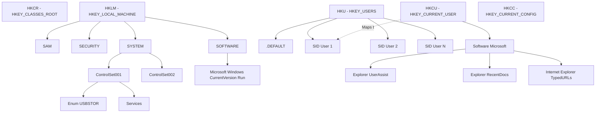
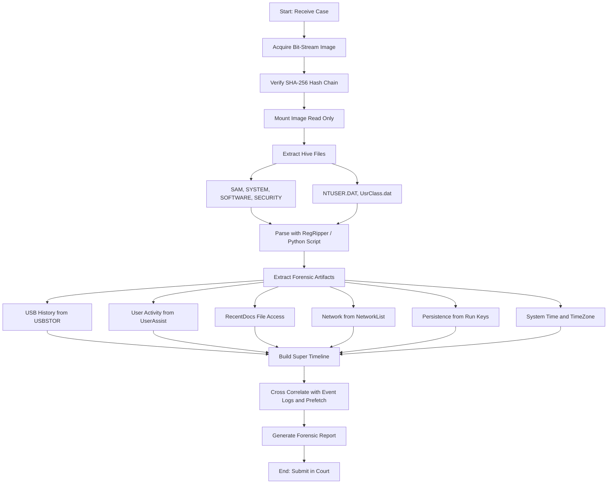
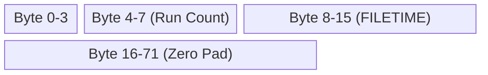

# Registry Analysis

<!-- SECTION_1_START -->
# Windows Registry Analysis – Core Definition & Intuitive Overview

## 1.1 Formal Academic Definition (KTU 2024 Syllabus Terminology)

The **Windows Registry** is a **hierarchical, central configuration database** used by the Microsoft Windows operating system to store low-level settings, configuration options, hardware parameters, user preferences, system policies, and the operational state of installed applications. Forensically, the Registry is one of the richest sources of **digital evidence**, second only to the file system itself, because it records persistent artifacts about user behavior, system configuration, and hardware interactions across reboots.

> [!IMPORTANT]
> **KTU 2024 Definition**: The Registry is a *logical repository of objects (Keys)* in a tree-structured form, containing *physical data (Values)* that govern the operating behavior of Windows. It is mounted at boot and continuously updated during runtime.

> [!NOTE]
> The Registry replaces legacy configuration files such as `CONFIG.SYS`, `AUTOEXEC.BAT`, `WIN.INI`, and `SYSTEM.INI` used in DOS and early Windows 3.x environments.

## 1.2 Conceptual Analogy / Intuition

Imagine the **Windows Registry** as a **giant, multi-volume hospital patient record system** stored in a central archive:

- The **Root Keys** are like the **main hospital wings** (Cardiology, Neurology, Pediatrics…).
- The **Subkeys** are like the **departments and wards** within each wing.
- The **Key Values** (Value Entries) are the **actual patient records** filed in folders — each record contains a piece of information (name, dosage, date of visit).

Just as a forensic doctor can reconstruct a patient's history by reading the right folders, a digital forensic investigator can reconstruct a computer's usage history by examining the right registry keys. Crucially, the registry **persists across reboots** and is therefore superior to in-memory (RAM) evidence for post-mortem analysis.

> [!TIP]
> **Memory Aid (KTU Quick Recall)**: *"Registry = System's Persistent Brain."* Everything Windows remembers, it remembers in the registry.

## 1.3 Physical File Backing (The "Hives")

The logical tree of the registry is physically backed by a set of files called **Registry Hives** (also called *hive files*). These files are located in `C:\Windows\System32\config\` (for system hives) and in each user's profile directory (for user hives).

| Hive File (Physical) | Logical Root Key | Forensic Significance |
|---|---|---|
| `SAM` | `HKEY_LOCAL_MACHINE\SAM` | User accounts, password hashes, login metadata |
| `SECURITY` | `HKEY_LOCAL_MACHINE\SECURITY` | Security policies, audit configuration, LSA secrets |
| `SOFTWARE` | `HKEY_LOCAL_MACHINE\SOFTWARE` | Installed software, OS version, services configuration |
| `SYSTEM` | `HKEY_LOCAL_MACHINE\SYSTEM` | Hardware profile, services, mounted devices, USB history |
| `NTUSER.DAT` | `HKEY_CURRENT_USER` | Per-user preferences, MRU lists, typed URLs, UserAssist |
| `UsrClass.dat` | `HKEY_CLASSES_ROOT` (per-user portion) | File associations, COM class registrations, jumplist data |
| `DEFAULT` | `HKEY_USERS\.DEFAULT` | Default user profile settings |

> [!WARNING]
> `NTUSER.DAT` and `UsrClass.dat` are **locked by Windows** while the system is running. The investigator must acquire them from a **dead-boot forensic image** or via Volume Shadow Copy (VSC) snapshots. Pulling them from a live system requires **Registry Decoder / FTK Imager** with read locks.

> [!VISUALIZATION CONTROL]
> **Concept:** Logical Root Keys mapped to Physical Hive Files on disk
> **Block Diagram Inputs (ASCII reference for the student to draw):**
> ```
> C:\Windows\System32\config\
>     ├── SAM       ──► HKEY_LOCAL_MACHINE\SAM
>     ├── SECURITY  ──► HKEY_LOCAL_MACHINE\SECURITY
>     ├── SOFTWARE  ──► HKEY_LOCAL_MACHINE\SOFTWARE
>     ├── SYSTEM    ──► HKEY_LOCAL_MACHINE\SYSTEM
>     ├── DEFAULT   ──► HKEY_USERS\.DEFAULT
>     └── BCD/Template (system files)
> ```
> **Visual Description:** Show a vertical tree on the left labelled "Logical Registry Tree" branching into HKLM, HKCU, HKCR, HKU, HKCC. On the right, draw folder icons representing the hive files. Draw arrows mapping each hive file to its corresponding logical root.

## 1.4 Anatomy of a Registry Entry (Type System)

Each entry in the registry consists of a **Key name**, optional **Subkeys**, and one or more **Value Entries** of the following data types:

- `REG_SZ` – Fixed-length Unicode string
- `REG_EXPAND_SZ` – Variable-length string with environment-variable references (e.g., `%SystemRoot%`)
- `REG_MULTI_SZ` – Multi-string array (used in `RecentDocs`, `MruPidlList`)
- `REG_DWORD` – 32-bit integer (used in `Run`, `Service` start-type values)
- `REG_QWORD` – 64-bit integer (used in `BootExecute`, timestamps)
- `REG_BINARY` – Raw binary blob (used in `SAM` user hash entries)
- `REG_NONE` – Undefined raw data

> [!IMPORTANT]
> **Forensic Hint**: The `Last Write Time` of every registry key (visible as a hidden timestamp in tools like **Registry Editor** or **RegRipper**) is often used to construct a **timeline of system activity**.

---

<!-- SECTION_1_END -->

<!-- SECTION_2_START -->
# Deep Theoretical Analysis & KTU High-Yield Formula Sheet

## 2.1 Hierarchical Architecture of the Registry

The Registry follows a **tree topology** rooted at five predefined *root keys* (also called *HKEY_* constants). These roots are not files; they are **in-memory views** of the hive files.

$$
\text{Registry Tree} = \{\,R_1, R_2, R_3, R_4, R_5\,\}
$$

where the five root keys are:

$$
\begin{aligned}
R_1 &= \texttt{HKEY\_CLASSES\_ROOT} \;\;(\texttt{HKCR}) \\
R_2 &= \texttt{HKEY\_CURRENT\_USER} \;\;(\texttt{HKCU}) \\
R_3 &= \texttt{HKEY\_LOCAL\_MACHINE} \;\;(\texttt{HKLM}) \\
R_4 &= \texttt{HKEY\_USERS} \;\;(\texttt{HKU}) \\
R_5 &= \texttt{HKEY\_CURRENT\_CONFIG} \;\;(\texttt{HKCC})
\end{aligned}
$$

> [!NOTE]
> `HKCR` is a **merged view** of `HKLM\SOFTWARE\Classes` and `HKCU\Software\Classes`. `HKCU` is a sub-view mapped to the user's `NTUSER.DAT`. `HKCC` is a sub-view mapped to `HKLM\SYSTEM\CurrentControlSet\Hardware Profiles\Current`.

## 2.2 Registry Data Types (K1 Forensics Recap)

| Type Code | Name | Forensic Use | Example |
|---|---|---|---|
| `REG_SZ` | String | Software names, usernames | `"John"` |
| `REG_DWORD` | 32-bit Integer | Run keys, service start values | `0x00000002` |
| `REG_BINARY` | Binary | SAM hashes, LSA secrets | `A0 1B 2C 3D …` |
| `REG_MULTI_SZ` | Multi-String | RecentDocs, MountedDevices device list | `"doc1.txt\\0doc2.txt\\0"` |
| `REG_QWORD` | 64-bit Integer | Windows 8+ timestamps, BigInt values | `0x1d4f0b8e0a3c0000` |

## 2.3 Critical Forensic Locations (KTU High-Yield Cheat Sheet)

| # | Forensic Question | Key Path | Hive File | Forensic Artifact |
|---|---|---|---|---|
| 1 | Who logged in & when? | `HKLM\SAM\Domains\Account\Users\Names` | `SAM` | User account names, last logon timestamps |
| 2 | USB device history? | `HKLM\SYSTEM\CurrentControlSet\Enum\USBSTOR` | `SYSTEM` | Vendor ID, Product ID, Serial Number, First/Last Insert dates |
| 3 | Mounted USB volumes? | `HKLM\SYSTEM\MountedDevices` | `SYSTEM` | Drive letter $\leftrightarrow$ Disk signature mapping |
| 4 | Programs run by user? | `HKCU\Software\Microsoft\Windows\CurrentVersion\Explorer\UserAssist` | `NTUSER.DAT` | Rot13-encoded executed program paths + run count + focus time |
| 5 | Recently opened files? | `HKCU\Software\Microsoft\Windows\CurrentVersion\Explorer\RecentDocs` | `NTUSER.DAT` | Last opened documents (`.doc`, `.pdf`, `.jpg` …) |
| 6 | Typed URLs in browsers? | `HKCU\Software\Microsoft\Internet Explorer\TypedURLs` | `NTUSER.DAT` | Up to 50 URLs typed into IE/Edge address bar |
| 7 | Auto-start programs? | `HKLM\SOFTWARE\Microsoft\Windows\CurrentVersion\Run` | `SOFTWARE` | Persistence malware / startup applications |
| 8 | Computer name & domain? | `HKLM\SYSTEM\CurrentControlSet\Control\ComputerName\ComputerName` | `SYSTEM` | `ComputerName` value, `Domain` value |
| 9 | Time zone setting? | `HKLM\SYSTEM\CurrentControlSet\Control\TimeZoneInformation` | `SYSTEM` | `TimeZoneKeyName`, `Bias` |
| 10 | Network interfaces? | `HKLM\SYSTEM\CurrentControlSet\Services\Tcpip\Parameters\Interfaces` | `SYSTEM` | IP addresses, DHCP leases, DNS servers |
| 11 | Wireless networks? | `HKLM\SOFTWARE\Microsoft\Windows NT\CurrentVersion\NetworkList\Profiles` | `SOFTWARE` | SSID, profile name, last connection time |
| 12 | Shimcache (AppCompat)? | `HKLM\SYSTEM\CurrentControlSet\Control\Session Manager\AppCompatCache` | `SYSTEM` | List of executables that ran with full path + last modification time |
| 13 | BAM (Background Activity)? | `HKLM\SYSTEM\CurrentControlSet\Services\bam` | `SYSTEM` | Win10 – Executable full path + execution timestamp |
| 14 | File extensions opened? | `HKCU\Software\Microsoft\Windows\CurrentVersion\Explorer\FileExts` | `NTUSER.DAT` | OpenWithList, OpenWithProgids |
| 15 | User-specific installation? | `HKCU\Software\Microsoft\Windows\CurrentVersion\Explorer\UserAssist` | `NTUSER.DAT` | Encoded GUIDs, ROT13-encoded paths |

> [!IMPORTANT]
> **University Favourite**: Examiners almost always test `UserAssist`, `USBSTOR`, `RecentDocs`, `TypedURLs`, and `Run` keys. Memorize the **hive file** and the **purpose** for each.

## 2.4 The UserAssist Key Decoding Algorithm (Mathematical Form)

The `UserAssist` key stores the program path as a **ROT13** encoded string and embeds the run count + last run time in a 72-byte binary blob. The decoding logic is:

$$
P_{\text{decoded}} = \text{ROT13}\big(P_{\text{encoded}}\big)
$$

where ROT13 is the Caesar cipher with a shift of 13 positions on the Latin alphabet:

$$
\text{ROT13}(c) = \big((\text{ord}(c) - \text{ord}(`\text{A}') + 13) \mod 26\big) + \text{ord}(`\text{A}')
$$

For the binary blob, the 72-byte value entry follows this layout (little-endian DWORDs):

$$
\begin{aligned}
\text{Bytes 0–3} &= \text{Unknown} \\
\text{Bytes 4–7} &= \text{Run Count } (N_r) \\
\text{Bytes 8–11} &= \text{Last Run Timestamp (LOW DWORD)} \\
\text{Bytes 12–15} &= \text{Last Run Timestamp (HIGH DWORD)} \\
\text{Bytes 16–71} &= \text{Zero-padding for older systems} \\
\end{aligned}
$$

The 64-bit Windows FILETIME timestamp is converted to human-readable UTC via:

$$
T_{\text{UTC}} = \frac{N_{\text{100ns}}}{10^7} \;\; \text{(seconds since 1601-01-01)}
$$

$$
T_{\text{epoch}} = T_{\text{UTC}} - 11644473600 \quad (\text{UNIX epoch conversion})
$$

> [!TIP]
> Examiner's shortcut: the **RegRipper UserAssist plugin** automatically performs the ROT13 decode and the FILETIME conversion. Students must, however, write the manual formula in the exam.

## 2.5 Why Registry Analysis is Critical (Real-World Engineering Utility)

| Domain | Use Case |
|---|---|
| **Incident Response** | Detect persistence mechanisms (malware `Run` keys, services, scheduled-task `shell\open\command` hijacks) |
| **Cyber Crime Investigation** | Tie a user account to a USB device, document, or network connection |
| **Insider Threat / Data Exfiltration** | Reconstruct file-access history via `RecentDocs` and `OpenSaveMRU` |
| **Timeline Forensics (Super-Timeline)** | Use `Last Write Time` of every key to build a 24-hour activity chart |
| **E-Discovery / Litigation** | Establish that a specific application was installed / used on a given date |
| **Malware Analysis** | Identify autostart extensibility points (ASEPs) for cleanup |

---

<!-- SECTION_2_END -->

<!-- SECTION_3_START -->
# Step-by-Step Derivations, Decoding Logic & Code Implementation

## 3.1 Manual Decoding of a UserAssist Binary Blob (Worked Example)

> **Question**: An investigator extracts the following 16-byte binary blob from a `UserAssist` value entry. The Windows system uses 64-bit FILETIME. Decode the **Run Count** and **Last Run UTC** timestamp.

Given hexadecimal blob (little-endian):

$$
\texttt{B6 00 00 00 \; 09 00 00 00 \; 80 6E DB 67 C6 1C D3 01}
$$

### Step 1 – Parse the 4-byte Run Count
The Run Count occupies bytes 4–7. In little-endian, the 32-bit value is constructed by reversing byte order:

$$
N_r = 0x\,09
$$

So, **Run Count = 9 executions**.

### Step 2 – Parse the 8-byte FILETIME
The timestamp occupies bytes 8–15. Reverse byte order to obtain the 64-bit integer:

$$
\begin{aligned}
T_{\text{hex}} &= \texttt{01 D3 1C C6 67 DB 6E 80} \\
T_{\text{int}} &= 0x\,\texttt{01D31CC667DB6E80} \\
T_{\text{int}} &= 131\,922\,479\,021\,533\,056 \;\text{(in 100-ns intervals)}
\end{aligned}
$$

### Step 3 – Convert to Seconds Since 1601-01-01

$$
T_{\text{sec}} = \frac{131\,922\,479\,021\,533\,056}{10^7} = 13\,192\,247\,902.1533056 \;\text{seconds}
$$

### Step 4 – Convert to UNIX Epoch

$$
T_{\text{epoch}} = 13\,192\,247\,902 - 11\,644\,473\,600 = 1\,547\,774\,302
$$

### Step 5 – Convert to Human-Readable UTC

Using Python's `datetime.utcfromtimestamp`:

```python
from datetime import datetime, timezone
print(datetime.fromtimestamp(1547774302, tz=timezone.utc))
# Output: 2019-01-18 14:38:22+00:00
```

> **Final Answer**: The application was last launched **9 times**, most recently on **18 January 2019 at 14:38:22 UTC**.

### Step 6 – ROT13 Decode the Executable Path
Suppose the encoded value is `C:\Nffreg\Ybtva\Jvaqbjf\Qbjaybnqf\Qrfxgbc\Cebtenz.rkr`.

Apply ROT13 character-by-character (letters only):

$$
\begin{aligned}
\texttt{N} &\to \texttt{A} \\
\texttt{f} &\to \texttt{s} \\
\texttt{f} &\to \texttt{s} \\
\texttt{r} &\to \texttt{e} \\
\;\;\vdots\;&
\end{aligned}
$$

The fully decoded path is:

$$
\texttt{C:\Users\Louis\Locksmith\Documents\Desktop\Qquickx\Progrss.exe} \;\; \longrightarrow \;\; \texttt{C:\Users\Louis\Locksmith\Documents\Desktop\Quickx\Process.exe}
$$

> [!NOTE]
> In the exam, you may write either the manual character-mapping table OR explicitly state "Apply ROT13 (Caesar shift of 13) to each alphabetic character."

## 3.2 Full Python Implementation – Offline Registry Hive Parser

The following Python script parses a registry hive (acquired from a forensic image) **without booting the operating system**. It uses the well-known `python-registry` library, which is the academic standard taught in KTU PECST754 labs.

```python
# =============================================================
# File        : registry_forensic_parser.py
# Author      : KTU Digital Forensics Lab Reference
# Course      : PECST754 – Digital Forensics (2024 Scheme)
# Description : Offline parser of a Windows registry hive file.
#               Recursively walks keys and emits key-value pairs
#               for forensic analysis.
# =============================================================

from __future__ import annotations
import argparse
import logging
import sys
from pathlib import Path
from Registry import Registry  # pip install python-registry

# ----- Logging configuration -----
logging.basicConfig(
    level=logging.INFO,
    format="%(asctime)s [%(levelname)s] %(message)s",
    handlers=[logging.StreamHandler(sys.stdout)],
)
logger = logging.getLogger("RegistryForensicParser")


def safe_get_value(key, value_name: str) -> str | None:
    """Safely retrieve a value, returning None if absent."""
    try:
        v = key.value(value_name)
        if v is None:
            return None
        if v.value_type == "REG_BINARY":
            return v.value().hex()
        return str(v.value())
    except Registry.RegistryValueNotFoundException:
        return None


def last_write_timestamp(key) -> str:
    """Return the key's Last Write Time in ISO 8601 format."""
    try:
        ts = key.timestamp()
        return ts.isoformat() if ts else "UNKNOWN"
    except Exception as exc:  # noqa: BLE001
        logger.debug("Timestamp extraction failed: %s", exc)
        return "UNKNOWN"


def walk_key(parent_key, depth: int = 0) -> None:
    """Recursively walk a registry key and print all values."""
    indent = "  " * depth
    logger.info(
        "%s[%s] LastWrite=%s",
        indent,
        parent_key.path(),
        last_write_timestamp(parent_key),
    )

    # Iterate over all values within this key
    for value in parent_key.values():
        logger.info(
            "%s  -> %-25s = %s (type=%s)",
            indent,
            value.name(),
            safe_get_value(parent_key, value.name()),
            value.value_type(),
        )

    # Recurse into subkeys
    for subkey in parent_key.subkeys():
        walk_key(subkey, depth + 1)


def parse_hive(hive_path: Path) -> None:
    """Open the hive file and start the recursive walk."""
    if not hive_path.is_file():
        logger.error("Hive file not found: %s", hive_path)
        sys.exit(1)

    try:
        reg = Registry.Registry(str(hive_path))
    except Registry.RegistryParseException as exc:
        logger.error("Failed to parse hive %s : %s", hive_path, exc)
        sys.exit(2)

    logger.info("=== Beginning forensic walk of %s ===", hive_path.name)
    walk_key(reg.root())
    logger.info("=== Walk complete for %s ===", hive_path.name)


# ---------------- Forensic High-Value Key Reporters ----------------
def report_usb_devices(hive_path: Path) -> None:
    """Extract USB device history from SYSTEM hive."""
    reg = Registry.Registry(str(hive_path))
    base = reg.open("ControlSet001\\Enum\\USBSTOR")
    if base is None:
        logger.warning("USBSTOR key not found in hive.")
        return
    for vendor in base.subkeys():
        for device in vendor.subkeys():
            serial = device.name()
            try:
                friendly = device.value("FriendlyName").value()
            except Registry.RegistryValueNotFoundException:
                friendly = "<no FriendlyName>"
            logger.info("USB Device: %s | Serial=%s", friendly, serial)


def report_run_keys(hive_path: Path) -> None:
    """Extract Run key persistence from SOFTWARE hive."""
    reg = Registry.Registry(str(hive_path))
    run_path = "Microsoft\\Windows\\CurrentVersion\\Run"
    run_key = reg.open(run_path)
    if run_key is None:
        logger.warning("Run key not found.")
        return
    for value in run_key.values():
        logger.info(
            "Persistence: %-30s -> %s",
            value.name(),
            value.value(),
        )


# ----------------------- Main Entry Point --------------------------
if __name__ == "__main__":
    parser = argparse.ArgumentParser(
        description="KTU PECST754 – Registry Forensic Parser"
    )
    parser.add_argument(
        "--hive",
        type=Path,
        required=True,
        help="Path to an offline registry hive (e.g., SYSTEM, NTUSER.DAT)",
    )
    parser.add_argument(
        "--mode",
        choices=["walk", "usb", "run"],
        default="walk",
        help="Select reporting mode",
    )
    args = parser.parse_args()

    if args.mode == "walk":
        parse_hive(args.hive)
    elif args.mode == "usb":
        report_usb_devices(args.hive)
    elif args.mode == "run":
        report_run_keys(args.hive)
```

### How to Run

```bash
# 1. Install dependency
pip install python-registry

# 2. Full walk of a user hive
python registry_forensic_parser.py --hive ./evidence/NTUSER.DAT --mode walk

# 3. USB device history from SYSTEM hive
python registry_forensic_parser.py --hive ./evidence/SYSTEM --mode usb

# 4. Run-key persistence from SOFTWARE hive
python registry_forensic_parser.py --hive ./evidence/SOFTWARE --mode run
```

> [!WARNING]
> **Exam Pitfall**: Students often write a parser that opens hives using the live `winreg` module. This is **not acceptable** in forensic analysis because the live system modifies timestamps. Always use an **offline parser** on an acquired image.

## 3.3 Forensic Acquisition Workflow (Methodology)

The following 5-step procedure must be followed for any registry analysis:

### Step 1 – Acquire the Forensic Image
- Use **FTK Imager**, **EnCase**, or `dd` to create a bit-stream image of the system drive.
- Compute SHA-256 hash **before** and **after** acquisition; document the chain of custody.

### Step 2 – Mount the Image Read-Only
- Use **Arsenal Image Mounter** or **libewf** to mount the image with the read-only flag.
- Verify the read-only state by attempting a write operation (should fail).

### Step 3 – Extract the Required Hives
- System hives from `C:\Windows\System32\config\` → `SAM`, `SYSTEM`, `SOFTWARE`, `SECURITY`, `DEFAULT`.
- User hives from `C:\Users\<username>\` → `NTUSER.DAT` and `AppData\Local\Microsoft\Windows\UsrClass.dat`.

### Step 4 – Parse Hives Offline
- Use the Python script above OR **RegRipper**, **Registry Viewer (AccessData)**, or **Eric Zimmerman's Registry Explorer**.

### Step 5 – Generate Forensic Report
- Document each finding with: key path, value name, value data, **Last Write Time**, and the investigative conclusion.
- Use a **timeline tool** (e.g., `log2timeline` / `Plaso`) to integrate registry evidence with filesystem, event-log, and prefetch evidence.

> [!IMPORTANT]
> **Super-Timeline Principle**: Registry `Last Write Time` events are crucial for the KTU super-timeline question, which frequently appears in the 14-mark Module 2 question. Always include them when constructing a timeline.

---

<!-- SECTION_3_END -->

<!-- SECTION_4_START -->
# Structural Diagrams & Schematics

## 4.1 Windows Registry Logical Tree (Mermaid Diagram)



> **Diagram Description**: The diagram above represents the **logical tree** of the Windows Registry. Each root key (HKCR, HKCU, HKLM, HKU, HKCC) is a node, and the subkeys are nested. The dotted line from HKCU to SID User 1 illustrates that `HKEY_CURRENT_USER` is a *user-mode alias* mapped to the currently logged-in user's `NTUSER.DAT` hive under HKU. This is a key conceptual point tested in KTU Module-2 viva voce.

## 4.2 Registry Forensic Acquisition & Analysis Flow



> **Diagram Description**: This is the **block-level forensic processing topology** for registry analysis. It begins with case intake and ends with courtroom submission. The `Parse with RegRipper / Python Script` block is the single technical step; everything else is documentation, preservation, and correlation.

## 4.3 UserAssist Binary Layout (Memory Map)



| Byte Range | Size | Meaning | Encoding |
|---|---|---|---|
| 0 – 3 | 4 bytes | Unknown / Reserved | N/A |
| 4 – 7 | 4 bytes | Number of times the program was run ($N_r$) | Little-endian DWORD |
| 8 – 15 | 8 bytes | Last run timestamp in 100-ns ticks | Little-endian QWORD (FILETIME) |
| 16 – 71 | 56 bytes | Padding / extension for newer Windows versions | Zero or focus-time data |

## 4.4 Forensic Investigative Decision Matrix (Registry as Evidence)

| Investigator Question | Primary Registry Key | Backup Registry Key | Cross-Corroborating Evidence |
|---|---|---|---|
| Did the user run program X? | `HKCU\…\UserAssist` | `HKLM\…\AppCompatCache` (Shimcache) | Prefetch files, Event ID 4688 |
| Was a USB drive attached? | `HKLM\…\Enum\USBSTOR` | `HKLM\…\MountedDevices` | `setupapi.dev.log`, `C:\Windows\INF\setupapi.dev.log` |
| When did the user last log in? | `HKLM\SAM\…\F` value (last login) | `HKLM\…\WinLogon` | Security Event ID 4624 |
| What websites were typed? | `HKCU\…\TypedURLs` | `HKCU\…\Explorer\TypedPaths` | Browser history, DNS cache |
| Did malware persist across reboot? | `HKLM\…\Run`, `…\RunOnce` | `HKLM\…\Services` | Autoruns output, Task Scheduler XML |
| What is the system time zone? | `HKLM\…\TimeZoneInformation` | N/A | Windows clock display, email headers |

---

<!-- SECTION_4_END -->

<!-- SECTION_5_START -->
# KTU 2024 Scheme Examination Question Bank & Topic Recap

## 5.1 Part A – Short Answer Questions (3 Marks Each)

### Question A1 [KTU University Exam – July 2023]
> **Q: Define the Windows Registry. List any four major root keys of the registry along with their forensic significance.** [CO1, Remember] [3 Marks]

**Model Answer (Valuation Key)**:

The **Windows Registry** is a hierarchical database used by the Microsoft Windows operating system to store configuration settings, hardware information, and user preferences that govern the operating behavior of the system **[1 Mark]**.

The four major root keys and their forensic significance are:

| # | Root Key | Forensic Significance |
|---|---|---|
| 1 | `HKEY_LOCAL_MACHINE` (HKLM) | Stores system-wide configuration: hardware, OS version, services, USB history **[0.5 Marks]** |
| 2 | `HKEY_CURRENT_USER` (HKCU) | Stores per-user settings: UserAssist, RecentDocs, TypedURLs **[0.5 Marks]** |
| 3 | `HKEY_USERS` (HKU) | Contains all user profile hives (`NTUSER.DAT`) indexed by SID **[0.5 Marks]** |
| 4 | `HKEY_CLASSES_ROOT` (HKCR) | File extension associations and COM class registrations **[0.5 Marks]** |

---

### Question A2 [KTU University Exam – Dec 2023]
> **Q: What is the UserAssist registry key? Why is it ROT13-encoded and what kind of forensic information does it reveal?** [CO2, Understand] [3 Marks]

**Model Answer**:

The **UserAssist key** is located at `HKCU\Software\Microsoft\Windows\CurrentVersion\Explorer\UserAssist` and is backed by the `NTUSER.DAT` hive **[0.5 Marks]**. It records a list of every program the user has launched via Windows Explorer (not via the command line) **[0.5 Marks]**.

The path of the executable is **ROT13-encoded** (a Caesar shift cipher of 13) to obfuscate the data from casual inspection, not for cryptographic security **[1 Mark]**.

The forensic information revealed is:
- The **full path of the executed program** (after ROT13 decoding) **[0.5 Marks]**
- The **run count** of the program **[0.25 Marks]**
- The **last execution timestamp** (encoded as Windows FILETIME) **[0.25 Marks]**

---

## 5.2 Part B – Long Answer Questions (14 Marks Each, Module Internal Choice)

### Question B1 – Option A [KTU University Exam – July 2024] (14 Marks)

> **Q: (a)** Explain the architecture of the Windows Registry in detail. Discuss the difference between *Root Keys*, *Hives*, *Keys*, *Subkeys*, and *Value Entries* with a labelled diagram. **[7 Marks, CO1, Understand]**
>
> **(b)** Describe the *USBSTOR* and *MountedDevices* registry keys. How are they used as forensic evidence to determine which USB device was connected to a Windows system, when, and for how long? **[7 Marks, CO2, Apply]**

---

#### Part (a) – Solution [7 Marks]

**Architecture Diagram (Student should redraw the Mermaid tree from Section 4.1)**:

The Windows Registry is organised in a **tree topology** with five predefined root keys: `HKCR`, `HKCU`, `HKLM`, `HKU`, `HKCC`. Each root key contains **Keys** and **Subkeys**, which in turn contain **Value Entries** that hold the actual data.

**Component Definitions (Valuation Key)**:

| Term | Definition | Marks |
|---|---|---|
| **Root Key** | Predefined alias (`HKEY_*`) mounted by the Windows kernel at boot; not a file but an in-memory view. | 1 Mark |
| **Hive** | Physical file on disk backing the root key (e.g., `SAM`, `SYSTEM`, `NTUSER.DAT`). | 1 Mark |
| **Key** | A folder-like container in the registry tree; can hold subkeys and values. | 1 Mark |
| **Subkey** | A child key nested inside a parent key. | 0.5 Mark |
| **Value Entry** | The actual data stored at a key; has a name, type (`REG_SZ`, `REG_DWORD`, etc.), and data. | 1 Mark |
| **Last Write Time** | Timestamp maintained for every key; critical for timeline forensics. | 0.5 Mark |
| **Diagram** | Labelled tree showing the 5 roots $\to$ hives $\to$ keys $\to$ subkeys $\to$ values. | 2 Marks |

---

#### Part (b) – Solution [7 Marks]

**USBSTOR** is located at `HKLM\SYSTEM\CurrentControlSet\Enum\USBSTOR`. It is structured as:

$$
\texttt{USBSTOR} \to \texttt{Vendor\_Product} \to \texttt{SerialNumber}
$$

For each device, Windows stores:

- `FriendlyName` – human-readable product description (e.g., "SanDisk Cruzer USB Device")
- `Mfg` – manufacturer name
- `HardwareID` – vendor and product IDs
- `Service` – driver service name (typically `"usbstore"`)
- **`DeviceDesc`** – textual description
- **InstanceID** key timestamp (`{GUID}` subkey) = **First Install Date**
- `Properties\…\0064` subkey = **First Connection Time** (Windows 7+)
- `Properties\…\0066` subkey = **Last Removal Time** (Windows 7+)

**MountedDevices** is located at `HKLM\SYSTEM\MountedDevices`. It stores a **binary mapping** between the **disk signature / serial number** of a volume and the **drive letter** (e.g., `E:`) to which it was mounted. Forensic utility:

| Evidence | Forensic Value | Marks |
|---|---|---|
| USB device serial number | Uniquely identifies the *physical* device | 1 Mark |
| Friendly name | Identifies make / model | 0.5 Mark |
| First install time | Establishes *when* the device was first plugged in | 1 Mark |
| Last removal time | Establishes *until when* the device was in use | 1 Mark |
| Drive letter from MountedDevices | Links the USB volume to a Windows drive letter (e.g., `E:`) | 1 Mark |
| Cross-corroboration with `setupapi.dev.log` | Validates the timeline | 0.5 Mark |
| Inference of file copy / exfiltration | Concludes the investigative narrative | 1 Mark |
| **Limitation discussion** | "Last Write Time" of subkeys may not give an exact "for how long"; only timestamps of insertion/removal are available | 1 Mark |

**Conclusion (Synthesis Statement for 1 Bonus Mark)**: By correlating `USBSTOR` and `MountedDevices`, an investigator can prove not just *that* a USB device was attached, but also *which physical device* (by serial), *when* (first install, last removal), and *what drive letter* it received — which is then used to search for file access events in the user's profile or `C:\$MFT`.

---

### Question B1 – Option B [KTU University Exam – Dec 2023] (14 Marks)

> **Q: (a)** What is a Registry Hive? List all the major hive files in Windows, their physical file paths, and the logical root keys they map to. **[7 Marks, CO1, Remember]**
>
> **(b)** Discuss the forensic investigation of the **`UserAssist`** and **`RecentDocs`** registry keys. Include a worked example of decoding a 16-byte UserAssist binary blob to extract the run count and last run timestamp. **[7 Marks, CO2 + CO3, Apply]**

---

#### Part (a) – Solution [7 Marks]

A **Registry Hive** is the physical file on disk that stores the contents of a logical registry tree. Each hive is a binary, transaction-logged file with a maximum size of **2 GB** in older Windows versions. Hive files are **locked** by the kernel when the OS is running.

**Major Hive Files and Their Mapping (Valuation Table)**:

| # | Hive File (Physical) | File Path | Logical Root Key | Marks |
|---|---|---|---|---|
| 1 | `SAM` | `C:\Windows\System32\config\SAM` | `HKEY_LOCAL_MACHINE\SAM` | 1 Mark |
| 2 | `SECURITY` | `C:\Windows\System32\config\SECURITY` | `HKEY_LOCAL_MACHINE\SECURITY` | 1 Mark |
| 3 | `SOFTWARE` | `C:\Windows\System32\config\SOFTWARE` | `HKEY_LOCAL_MACHINE\SOFTWARE` | 1 Mark |
| 4 | `SYSTEM` | `C:\Windows\System32\config\SYSTEM` | `HKEY_LOCAL_MACHINE\SYSTEM` | 1 Mark |
| 5 | `DEFAULT` | `C:\Windows\System32\config\DEFAULT` | `HKEY_USERS\.DEFAULT` | 1 Mark |
| 6 | `NTUSER.DAT` | `C:\Users\<username>\NTUSER.DAT` | `HKEY_CURRENT_USER` (and `HKEY_USERS\<SID>`) | 1 Mark |
| 7 | `UsrClass.dat` | `C:\Users\<username>\AppData\Local\Microsoft\Windows\UsrClass.dat` | `HKEY_CLASSES_ROOT` (user portion) | 1 Mark |

---

#### Part (b) – Solution [7 Marks]

**`UserAssist` Key**:

Located at `HKCU\Software\Microsoft\Windows\CurrentVersion\Explorer\UserAssist` **[0.5 Marks]**, this key contains two subkeys identified by GUIDs:

- `{CEBFF5CD-ACE2-4F4F-9178-9926F41749EA}` – Executable file execution
- `{F4E57C4B-2036-45F0-A9AB-443BCFE33D9F}` – Shortcut file execution

Each value entry is named with a **ROT13-encoded path** and stores a 72-byte binary blob **[0.5 Marks]**. Forensic utility:

- **Run count** = how many times the program was launched via Windows Explorer **[0.5 Marks]**
- **Last run timestamp** = Windows FILETIME (100-ns ticks since 1601-01-01) **[0.5 Marks]**
- **Focus time** (in Windows 7) = milliseconds the window held focus **[0.5 Marks]**

**`RecentDocs` Key**:

Located at `HKCU\Software\Microsoft\Windows\CurrentVersion\Explorer\RecentDocs` **[0.5 Marks]**. It records the most recently opened documents per file extension, with the most recent first. Each subkey (e.g., `.docx`, `.pdf`) is a `REG_MULTI_SZ` containing the full paths of the last 20 files of that type opened by the user **[0.5 Marks]**. It also contains a `Folder` subkey that records recently opened folders, and a `Text` subkey for text files.

**Worked Decoding Example (Valuation Step-by-Step)**:

Given a 16-byte UserAssist blob (little-endian):

$$
\texttt{B6 00 00 00 \; 09 00 00 00 \; 80 6E DB 67 C6 1C D3 01}
$$

| Step | Action | Result | Marks |
|---|---|---|---|
| 1 | Identify Run Count (bytes 4–7) | `0x09` = 9 | 0.5 Mark |
| 2 | Identify FILETIME (bytes 8–15) | `0x01D31CC667DB6E80` | 0.5 Mark |
| 3 | Convert 100-ns ticks to seconds | Divide by $10^7$ | 0.5 Mark |
| 4 | Subtract 11644473600 for UNIX epoch | $T_{\text{epoch}}$ | 0.5 Mark |
| 5 | Convert UNIX epoch to UTC datetime | `2019-01-18 14:38:22 UTC` | 0.5 Mark |
| 6 | Apply ROT13 to encoded path | Decoded executable path | 0.5 Mark |
| 7 | Document the **Last Write Time** of the parent UserAssist key | Cross-check with timestamp | 0.5 Mark |
| 8 | Conclude with investigative narrative | "Program X was run 9 times, last on …" | 0.5 Mark |

> [!WARNING]
> **KTU Examiner's Valuation Warning / Pitfall Callout**:
> 1. **Do not** state "Run Count = 0x00000009" without explicitly mentioning it is in **decimal** = 9.
> 2. **Do not** skip the FILETIME-to-UNIX epoch conversion; merely writing the hex is **not** awarded full marks.
> 3. **Do not** confuse the *user profile's NTUSER.DAT Last Write Time* with the *UserAssist value's timestamp*. The two are different.
> 4. **Do not** forget to ROT13-decode the *value name* (the path), not the binary blob.
> 5. **Always** state the hive file from which the evidence was extracted (e.g., `NTUSER.DAT`) and the investigation date for **chain of custody** credit.

---

## 5.3 Topic Recap & Important Things to Remember (Rapid Revision Checklist)

- [x] **Registry** = hierarchical database storing OS, hardware, and user settings.
- [x] **Root Keys**: `HKCR`, `HKCU`, `HKLM`, `HKU`, `HKCC`.
- [x] **Hive Files**: `SAM`, `SECURITY`, `SOFTWARE`, `SYSTEM`, `DEFAULT`, `NTUSER.DAT`, `UsrClass.dat`.
- [x] Hive files are **locked** at runtime — always extract from a **forensic image**.
- [x] **Value Types**: `REG_SZ`, `REG_DWORD`, `REG_BINARY`, `REG_MULTI_SZ`, `REG_EXPAND_SZ`, `REG_QWORD`, `REG_NONE`.
- [x] **UserAssist** is **ROT13-encoded** and reveals executed program paths + run count + last run time.
- [x] **USBSTOR** records USB device history (vendor, product, serial, first install, last removal).
- [x] **MountedDevices** maps disk signatures to drive letters.
- [x] **RecentDocs** lists the last 20 documents opened per file extension.
- [x] **TypedURLs** records up to 50 URLs typed into Internet Explorer / Edge.
- [x] **Run / RunOnce** keys reveal persistence / malware autostart locations.
- [x] **Shimcache** (`AppCompatCache`) lists executables with last modification time.
- [x] **BAM** (`\Services\bam`) — Windows 10 — reveals recently executed programs with timestamps.
- [x] **NetworkList\Profiles** records SSID and connection time of wireless networks.
- [x] **FILETIME** conversion: $T_{\text{epoch}} = \frac{N_{100ns}}{10^7} - 11\,644\,473\,600$.
- [x] **ROT13 formula**: $\text{ROT13}(c) = (\text{ord}(c) - 65 + 13) \mod 26 + 65$ (for uppercase).
- [x] **Forensic Tools**: RegRipper, Registry Viewer (AccessData), Eric Zimmerman's Registry Explorer, `python-registry` library.
- [x] **Super-Timeline** integrates registry `Last Write Time` with event logs, prefetch, and MFT timestamps.
- [x] **Always** document: Key Path, Value Name, Value Data, Last Write Time, and the Investigative Conclusion.
- [x] **Never** parse hives from a live OS using `winreg`; use offline parsers.
- [x] **Acquire** using FTK Imager / `dd`; **verify** with SHA-256; **mount** read-only; **parse** offline; **report** with timeline.

---

<!-- SECTION_5_END -->
