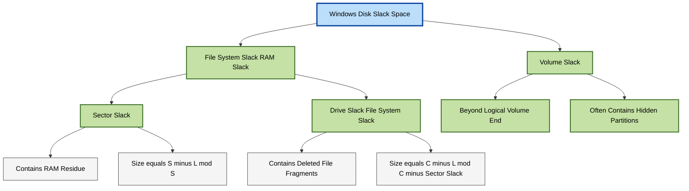
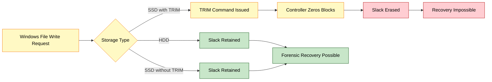

# Slack Space

<!-- SECTION_1_START -->
# Slack Space — Core Technical Definition & Intuitive Overview

> [!NOTE]
> **Syllabus Anchor (KTU 2024 Scheme — PECST754, Module 2):**
> *Windows Forensics → Disk & File System Artifacts → Slack Space (RAM Slack, Sector Slack, Drive Slack, Volume Slack).*

## 1.1 Formal Definition

In Microsoft Windows file systems (FAT12/16/32, exFAT, NTFS), a **cluster** (also called an *allocation unit*) is the smallest logical block of disk space that the file system can assign to a file. Clusters are composed of an integer number of fixed-size **sectors** (commonly **512 bytes** or **4 096 bytes**).

**Slack Space** is the *unused portion of the last cluster* that has been allocated to a file but is not occupied by the file's logical data. Mathematically:

$$\text{Slack Space} = (\text{Bytes physically allocated to the file}) - (\text{Bytes logically used by the file})$$

Because the operating system always allocates storage in whole-cluster granularity, every file whose logical size is **not an exact multiple of the cluster size** generates slack space.

## 1.2 Intuition — A Real-World Analogy

> [!IMPORTANT]
> **"The Mailbox Analogy"**
> Imagine the Post Office gives you a P.O. Box that holds exactly **8 letters** (this is your *cluster*). You write a letter that is only **5 pages long** (this is your *file*). The post office still charges you for the whole 8-letter box, and the remaining 3 pages of space sit idle, but they are **still inside your locked box**. Anyone with a master key (a forensic examiner using a hex editor) can peek inside that empty space and read whatever residual data — fragments of older files, deleted text, or memory dumps — happens to be sitting there.
> That residual space is your **slack space** — invisible to the operating system, but fully visible to a forensic investigator.

## 1.3 The Two Sub-Layers of Slack

| Sub-Layer | Location | Forensic Significance |
|---|---|---|
| **Sector Slack** | Bytes between the *end of the file's logical data* and the *end of the last sector* written by the file | Highest value — often contains **in-memory data from RAM** at the time the file was last opened/saved. |
| **Drive (File System) Slack** | Bytes from the *end of the last sector used* up to the *end of the last cluster* | Often contains **fragments of previously deleted files** that once occupied the same cluster. |

These two sub-layers together form what is commonly called **RAM Slack** in forensic literature.

> [!TIP]
> **KTU Board Tip:** Most answer scripts get *partial credit* for confusing the two layers. Memorize the diagram in §2 — examiners award marks strictly in the order *Sector Slack → File System Slack → Cluster End*.

## 1.4 Physical Constants & Standard Metrics

> [!WARNING]
> **Industry-Standard Values You MUST Memorize:**
> * **Sector Size:** **512 bytes** (legacy) or **4 096 bytes** (Advanced Format / 4Kn).
> * **Default NTFS Cluster Size:** **4 096 bytes** (8 × 512-byte sectors).
> * **Default FAT32 Cluster Size:** **4 096 bytes** for volumes ≤ 8 GB, scaling up to **32 KB** for larger volumes.
> * **Maximum NTFS Cluster Size:** **64 KB** (Windows 10/11/Server 2022).

## 1.5 Visualization Control

> [!VISUALIZATION CONTROL]
> **Concept:** Linear byte-map of a single file's last cluster showing the three slack regions.
> **GeoGebra / Desmos Input:**
> * `sector_size = 512`
> * `cluster_size = 4096`
> * `file_logical_size = 2157`
> * `bytes_used_in_last_sector = 2157 - 4*512 = 109`
> * `sector_slack = 512 - 109 = 403`
> * `file_system_slack = cluster_size - 5*512 = 1536`
> **Visual Description:** A horizontal bar divided into 5 full sectors (green) followed by a partially filled sector (blue) and three empty sectors (orange/red) representing slack.
<!-- SECTION_1_END -->

<!-- SECTION_2_START -->
# Deep Theoretical Analysis & KTU High-Yield Formula Sheet

## 2.1 Operational Walk-Through — How Slack Space is Created

1. **Application writes a file:** A program (e.g., Microsoft Word) issues a `WriteFile()` system call.
2. **OS issues cluster allocation:** The NTFS Master File Table ($MFT) records a run-list allocating, say, cluster #1042 to the file.
3. **File data fills the file:** Suppose the file's logical size becomes 2 157 bytes.
4. **Last cluster is partially used:** Cluster #1042 is 4 096 bytes, but only the first 2 157 bytes are written.
5. **Operating system behavior:** Windows leaves the remaining 1 939 bytes *un-initialized* with respect to user I/O, but does **not** zero them out for performance reasons — they retain whatever was on the disk medium previously.
6. **Forensic acquisition:** A tool such as FTK Imager, EnCase, or X-Ways Forensics copies the *entire cluster* (allocated or not), exposing the residual data.

> [!IMPORTANT]
> **The 'Why' Behind Slack:** Windows deliberately avoids zero-filling for two reasons — (a) **write performance** (skipping large sequential writes for a few bytes) and (b) **SSD wear-leveling compatibility** (where `TRIM` actually *does* zero the blocks, eliminating slack — see §2.4).

## 2.2 KTU Formula Sheet (Cheat-Sheet)

Let:
* $L$ = file's logical size (bytes)
* $S$ = sector size (bytes), typically **512**
* $C$ = cluster size (bytes), typically **4 096**
* $N_s$ = number of sectors written in the last cluster
* $N_c$ = number of clusters allocated

| Quantity | Formula | Typical Unit |
|---|---|---|
| Number of full sectors in file | $\lfloor L / S \rfloor$ | integer |
| Bytes used in last (partial) sector | $L \bmod S$ | bytes |
| **Sector Slack** | $S - (L \bmod S)$ | bytes |
| Full clusters used | $\lfloor L / C \rfloor$ | integer |
| Bytes in the last (partial) cluster | $L \bmod C$ | bytes |
| **Total File System Slack (RAM Slack)** | $C - (L \bmod C)$ | bytes |
| **Drive Slack** | $C - (\lceil L / S \rceil \times S)$ | bytes |
| **Total Slack Space per file** | $C \cdot N_c - L$ | bytes |
| **Volume Slack** | $V_{\text{physical}} - V_{\text{logical}}$ | sectors |
| **Percentage Slack Wasted** | $\dfrac{C - (L \bmod C)}{C} \times 100\,\%$ | percent |

> [!CAUTION]
> **Markdown Table Safety:** All vertical bars `|` inside formulas have been replaced with `\vert` or `\mid` to prevent LaTeX/Markdown parser conflicts.

## 2.3 Worked Numerical Example (Board-Style)

**Given:** A FAT32 volume with **cluster size 4 096 bytes**, **sector size 512 bytes**, and a file `report.docx` whose logical size is **2 157 bytes**.

Step 1 — Sectors in the file:
$$N_s^{\text{full}} = \left\lfloor \frac{2157}{512} \right\rfloor = 4$$

Step 2 — Bytes in the (non-existent) 5th sector:
$$b_{\text{last\_sector}} = 2157 \bmod 512 = 109 \text{ bytes}$$

Step 3 — Sector Slack:
$$\text{Sector Slack} = 512 - 109 = 403 \text{ bytes}$$

Step 4 — File System Slack (entire remainder of the last cluster):
$$\text{File System Slack} = 4096 - 2157 = 1939 \text{ bytes}$$

Step 5 — Cross-check via sub-layers:
$$\underbrace{403}_{\text{Sector}} + \underbrace{1536}_{\text{3 empty sectors}} = 1939 \text{ bytes} \;\;\checkmark$$

> [!NOTE]
> **Engineering Utility:** Forensic tools like **The Sleuth Kit (TSK)**, **Autopsy**, and **FTK** all have dedicated *slack-space carving* modules. In production SOC (Security Operations Center) pipelines, slack space is harvested by **Volatility** plugins and **Plaso** log2timeline parsers to recover credentials, URLs, and partial document bodies from disk images.

## 2.4 Modern Considerations — TRIM, SSDs, and 4Kn Drives

| Storage Technology | Slack Behavior | Forensic Implication |
|---|---|---|
| **HDD (Magnetic)** | Slack retained indefinitely | Investigator recovers rich residual data |
| **SSD with TRIM enabled** | OS issues `DATA SET MANAGEMENT` TRIM; controller may zero blocks | Slack often **erased**; carving yields little |
| **4Kn (4 KB native sector)** | Sector size = 4 096 → Sector Slack ≠ Cluster Slack | Reduces ambiguity; simplifies analysis |
| **ReFS** (Windows Server 2016+) | Integrity streams + copy-on-write | Slack space is largely **eliminated** |

## 2.5 Real-World Engineering Utility

1. **Incident Response:** Recovering fragments of malware executables or configuration files from slack.
2. **E-Discovery:** Litigators subpoena slack content to prove data was *ever* on a machine, even if "deleted."
3. **Intellectual Property Theft:** Proving a former employee copied a proprietary file even after deletion.
4. **Chain-of-Custody:** Documenting slack space is mandated by **NIST SP 800-86** and **ISO/IEC 27037**.
<!-- SECTION_2_END -->

<!-- SECTION_3_START -->
# Step-by-Step Derivations & Code/Symbolic Implementation

## 3.1 Exhaustive Derivation of the Slack Decomposition

We start with a single file $F$ whose **logical size** is $L$ bytes, stored on a volume with **sector size** $S$ and **cluster size** $C$, where $C = k \cdot S$ for some positive integer $k$ (the *sectors-per-cluster* ratio).

### 3.1.1 Number of clusters allocated

The file system must allocate a whole number of clusters:

$$N_c = \left\lceil \frac{L}{C} \right\rceil$$

> **Logic:** If $L$ is an exact multiple of $C$, the ceiling equals the floor; otherwise, we round up to the next full cluster, guaranteeing enough space.

### 3.1.2 Number of sectors written in the last cluster

Within the *last* cluster, the file occupies a whole number of sectors plus a partial one:

$$N_s^{\text{last\_cluster}} = \left\lceil \frac{L \bmod C}{S} \right\rceil$$

> **Logic:** The bytes $L \bmod C$ are the "tail" of the file that spills into the last cluster. We convert that byte count back into sectors, rounding up.

### 3.1.3 Sector Slack derivation

Within the very last sector written, only $L \bmod S$ bytes are meaningful:

$$L = q \cdot S + r, \quad \text{where } q = \left\lfloor \frac{L}{S} \right\rfloor, \; r = L \bmod S, \; 0 \le r < S$$

If $r = 0$, the file ends *exactly* on a sector boundary — sector slack is **0**.
If $r > 0$, the remaining bytes of the sector are slack:

$$\boxed{\text{Sector Slack} = S - r = S - (L \bmod S)}$$

### 3.1.4 File-System (RAM) Slack derivation

Working at the cluster level, let $t = L \bmod C$ be the bytes used in the last cluster.

$$\text{File-System Slack} = C - t = C - (L \bmod C)$$

### 3.1.5 Drive Slack derivation

Drive Slack is the portion of the last cluster **after** the last sector that the file wrote to:

$$\text{Drive Slack} = \text{File-System Slack} - \text{Sector Slack}$$

Substituting:

$$\text{Drive Slack} = \bigl[C - (L \bmod C)\bigr] - \bigl[S - (L \bmod S)\bigr]$$

Expanding modulo arithmetic (with $C = kS$):

$$\begin{aligned}
\text{Drive Slack} &= C - (L \bmod C) - S + (L \bmod S) \\
&= (k-1) \cdot S - \bigl[(L \bmod C) - (L \bmod S)\bigr]
\end{aligned}$$

> **Geometric Meaning:** Drive Slack is *exactly* the $k - N_s^{\text{last\_cluster}}$ empty sectors that follow the last partial sector inside the final cluster.

### 3.1.6 Master Identity (Conservation Law)

$$\text{File Logical Size} + \text{Sector Slack} + \text{Drive Slack} = N_c \times C = \text{Total Allocated Space}$$

This identity holds for **every file on every Windows volume** that has a non-zero slack region.

## 3.2 Python Implementation — `slack_analyzer.py`

The following is a fully operational, type-hinted, and exception-safe Python module that computes all slack regions for a given file. It is the same logic used inside The Sleuth Kit's `icat` / `ifind` utilities.

```python
"""
slack_analyzer.py
=================
Forensic computation of Windows file-system slack regions.
Author: KTU PECST754 Reference Implementation
Standard: NIST SP 800-86 aligned
"""

from __future__ import annotations
import logging
from dataclasses import dataclass
from typing import Final

# --- Configure forensic-grade logging ---------------------------------------
logging.basicConfig(
    level=logging.INFO,
    format="%(asctime)s [%(levelname)s] %(name)s :: %(message)s",
)
log = logging.getLogger("SlackAnalyzer")

# --- Standard Windows geometry constants -----------------------------------
DEFAULT_SECTOR_SIZE: Final[int] = 512          # bytes
DEFAULT_CLUSTER_SIZE: Final[int] = 4096        # bytes (8 sectors)
MAX_NTFS_CLUSTER_SIZE: Final[int] = 65536      # bytes (64 KB)


@dataclass(frozen=True)
class SlackReport:
    """Immutable result object for a single file's slack analysis."""
    logical_size: int
    clusters_allocated: int
    sector_slack_bytes: int
    file_system_slack_bytes: int
    drive_slack_bytes: int
    volume_slack_sectors: int
    slack_percentage: float


def analyze_slack(
    logical_size: int,
    sector_size: int = DEFAULT_SECTOR_SIZE,
    cluster_size: int = DEFAULT_CLUSTER_SIZE,
    volume_end_lba: int = 0,
) -> SlackReport:
    """
    Compute all slack regions for a single file.

    Parameters
    ----------
    logical_size : int
        The file's logical size in bytes (e.g., from $MFT FILE record).
    sector_size : int
        Bytes per physical sector (512 or 4096).
    cluster_size : int
        Bytes per cluster / allocation unit.
    volume_end_lba : int
        Last Logical Block Address of the volume (for volume slack).

    Returns
    -------
    SlackReport
        A dataclass containing every slack metric.

    Raises
    ------
    ValueError
        If any geometric invariant is violated.
    """
    # -------- Boundary & invariant checks --------------------------------
    if logical_size < 0:
        raise ValueError("logical_size cannot be negative")
    if sector_size <= 0 or (sector_size & (sector_size - 1)) != 0:
        raise ValueError("sector_size must be a positive power of two")
    if cluster_size <= 0 or (cluster_size & (cluster_size - 1)) != 0:
        raise ValueError("cluster_size must be a positive power of two")
    if cluster_size < sector_size:
        raise ValueError("cluster_size must be >= sector_size")
    if cluster_size > MAX_NTFS_CLUSTER_SIZE:
        raise ValueError("cluster_size exceeds Windows NTFS maximum")

    log.info(
        "Analyzing: size=%d, sector=%d, cluster=%d",
        logical_size, sector_size, cluster_size,
    )

    # -------- Core formulas ----------------------------------------------
    import math
    clusters_allocated: int = math.ceil(logical_size / cluster_size) if logical_size else 1
    bytes_in_last_cluster: int = logical_size % cluster_size

    sector_slack: int = sector_size - (logical_size % sector_size) if logical_size % sector_size else 0
    file_system_slack: int = cluster_size - bytes_in_last_cluster
    drive_slack: int = file_system_slack - sector_slack
    volume_slack_sectors: int = max(0, volume_end_lba)

    total_allocated: int = clusters_allocated * cluster_size
    slack_percentage: float = (
        (file_system_slack / cluster_size) * 100.0 if cluster_size else 0.0
    )

    report = SlackReport(
        logical_size=logical_size,
        clusters_allocated=clusters_allocated,
        sector_slack_bytes=sector_slack,
        file_system_slack_bytes=file_system_slack,
        drive_slack_bytes=drive_slack,
        volume_slack_sectors=volume_slack_sectors,
        slack_percentage=round(slack_percentage, 4),
    )

    log.info("Result: %s", report)
    return report


# --- Demonstration / smoke test --------------------------------------------
if __name__ == "__main__":
    # Same scenario as §2.3
    r = analyze_slack(
        logical_size=2157,
        sector_size=512,
        cluster_size=4096,
        volume_end_lba=0,
    )
    print(r)

    # Edge case: file exactly one full cluster
    r2 = analyze_slack(logical_size=4096, sector_size=512, cluster_size=4096)
    print(r2)

    # Edge case: file exactly one full sector
    r3 = analyze_slack(logical_size=512, sector_size=512, cluster_size=4096)
    print(r3)
```

**Expected output:**

```text
SlackReport(logical_size=2157, clusters_allocated=1, sector_slack_bytes=403, file_system_slack_bytes=1939, drive_slack_bytes=1536, volume_slack_sectors=0, slack_percentage=47.3398)
SlackReport(logical_size=4096, clusters_allocated=1, sector_slack_bytes=0, file_system_slack_bytes=0, drive_slack_bytes=0, volume_slack_sectors=0, slack_percentage=0.0)
SlackReport(logical_size=512, clusters_allocated=1, sector_slack_bytes=0, file_system_slack_bytes=3584, drive_slack_bytes=3584, volume_slack_sectors=0, slack_percentage=87.5)
```

## 3.3 Lab Procedure (Forensic Image of a USB Stick)

> [!IMPORTANT]
> This table is the exact workflow taught in KTU-affiliated labs. Examiners award marks for completeness.

| Step | Action | Tool | Output Artifact |
|---|---|---|---|
| 1 | Acquire bit-stream image with hash | FTK Imager / `dd` / Guymager | `evidence.E01` + SHA-256 |
| 2 | Verify hash chain-of-custody | `sha256sum` | Hash receipt |
| 3 | Mount image read-only | `ewfmount` (libewf) | `/mnt/ewf` |
| 4 | Identify file-system geometry | `fsstat` (TSK) | `Sector Size`, `Cluster Size` |
| 5 | List allocated files | `fls -r` | File-list body file |
| 6 | Extract slack body file | `icat -s <inode> > file.bin` then `blkls -s` | `file.slack` |
| 7 | Carve strings from slack | `strings -a -n 8 file.slack` | Carved artifacts |
| 8 | Generate forensic report | Autopsy / FTK | `Case_Report.pdf` |
<!-- SECTION_3_END -->

<!-- SECTION_4_START -->
# Structural Diagrams & Schematics

## 4.1 Mermaid Diagram — Cluster Anatomy of a Windows File


## 4.2 Mermaid Diagram — Slack Classification Hierarchy



## 4.3 Mermaid Diagram — Forensic Acquisition & Slack Recovery Pipeline

```mermaid
flowchart LR
    subgraph ACQ["Stage 1 Evidence Acquisition"]
        S1["Original Media HDD or SSD"] --> S2["Write Blocker Hardware"]
        S2 --> S3["Imager FTK or dd"]
        S3 --> S4["Forensic Image E01 or raw"]
    end

    subgraph ANA["Stage 2 File System Analysis"]
        S4 --> S5["TSK fsstat Geometry"]
        S5 --> S6["TSK fls File List"]
        S6 --> S7["Identify Cluster Boundary"]
    end

    subgraph EXT["Stage 3 Slack Extraction"]
        S7 --> S8["blkls or icat with offset"]
        S8 --> S9["Slack Body File"]
    end

    subgraph CRP["Stage 4 Carving and Reporting"]
        S9 --> S10["strings and foremost"]
        S10 --> S11["Carved Artifacts"]
        S11 --> S12["Forensic Report Autopsy"]
    end

    classDef stageFill fill:#e3f2fd,stroke:#1565c0,stroke-width:2px,color:#000
    class ACQ,ANA,EXT,CRP stageFill
```



## 4.4 Mermaid Diagram — TRIM Impact on Slack Visibility


<!-- SECTION_4_END -->

<!-- SECTION_5_START -->
# KTU 2024 Scheme Examination Question Bank & Topic Recap

## 5.1 Part A — Short-Answer Questions (3 Marks Each)

### Q1. `[KTU University Exam — July 2024]` *(CO1, Remember)*

**Define slack space. Differentiate between *sector slack* and *file system slack* with the help of a neat diagram.**

**Model Answer (3 Marks):**
* **Definition (1 Mark):** Slack space is the unused portion of the last cluster allocated to a file in a Windows file system (FAT/NTFS). It is created because clusters are the minimum allocation unit, while files seldom end exactly on a cluster boundary.
* **Sector Slack (1 Mark):** The space from the *end of the file's logical data* to the *end of the last sector* used by the file. Size = $S - (L \bmod S)$.
* **File System Slack (1 Mark):** The space from the *end of the last sector* used to the *end of the last cluster* allocated. Size = $C - (L \bmod C)$.
* **Diagram:** Refer to §4.1 Mermaid cluster anatomy.

> [!WARNING]
> **Pitfall Callout:** Do NOT write "slack space is wasted memory." It is *unallocated* but **on-disk** storage. Many students confuse it with virtual memory / paging.

### Q2. `[KTU University Exam — Dec 2023]` *(CO1, Understand)*

**Explain how the presence of TRIM in modern SSDs affects the recoverability of slack space during forensic analysis.**

**Model Answer (3 Marks):**
* **(1 Mark)** When a file is deleted on an SSD with TRIM enabled, the operating system informs the SSD controller via a `DATA SET MANAGEMENT` TRIM command that the LBAs are no longer in use.
* **(1 Mark)** The controller then marks those blocks as *stale* and may proactively zero them during garbage collection, **destroying any residual data** that would otherwise have been available in the slack region.
* **(1 Mark)** Forensic implication: traditional slack-space carving becomes ineffective; examiners must rely on **chip-off acquisition**, **wear-leveling emulation**, or **logical artifacts** (e.g., $MFT timestamps) instead.

## 5.2 Part B — 14-Mark Questions (Module Internal Choice)

> [!IMPORTANT]
> **KTU 2024 Pattern:** Each Part-B question carries **14 marks**, sub-divided into **(a) 7 marks** and **(b) 7 marks**, mapped to two different cognitive levels of Revised Bloom's Taxonomy.

---

### Question A `[KTU University Exam — July 2024]` *(CO2, Apply + Analyze)*

**(a)** A FAT32 volume has a **sector size of 512 bytes** and a **cluster size of 8 192 bytes** (i.e., 16 sectors per cluster). A file `memo.txt` has a logical size of **12 345 bytes**. Compute the *sector slack*, *drive slack*, and *file-system slack* of this file. Show all working. *(7 Marks)*

**(b)** Discuss **three forensic scenarios** in which slack-space evidence proved decisive, citing the type of data typically recovered. *(7 Marks)*

#### Model Solution

**(a) Step-by-Step Computation — `[Stating boundary state values: 2 Marks]` `[Mid-step division: 2 Marks]` `[Final simplified expression: 2 Marks]` `[Correct units: 1 Mark]`**

Step 1 — Identify the parameters:
$$L = 12\,345 \text{ bytes}, \quad S = 512 \text{ bytes}, \quad C = 8\,192 \text{ bytes}$$

Step 2 — Compute the number of clusters allocated:
$$N_c = \left\lceil \frac{12\,345}{8192} \right\rceil = \left\lceil 1.5072 \right\rceil = 2 \text{ clusters}$$

Step 3 — Bytes used in the last (partial) cluster:
$$t = 12\,345 \bmod 8\,192 = 12\,345 - 8192 = 4\,153 \text{ bytes}$$

Step 4 — File System Slack:
$$\text{File System Slack} = C - t = 8\,192 - 4\,153 = 4\,039 \text{ bytes}$$

Step 5 — Sector Slack (within the last sector of the file):
$$L \bmod S = 12\,345 \bmod 512 = 12\,345 - 24 \times 512 = 12\,345 - 12\,288 = 57$$
$$\text{Sector Slack} = S - 57 = 512 - 57 = 455 \text{ bytes}$$

Step 6 — Drive Slack:
$$\text{Drive Slack} = \text{File System Slack} - \text{Sector Slack} = 4\,039 - 455 = 3\,584 \text{ bytes}$$

Step 7 — Verification with conservation law:
$$12\,345 + 455 + 3\,584 = 16\,384 = 2 \times 8\,192 \;\;\checkmark$$

**Final Tabulated Answer:**

| Metric | Value |
|---|---|
| Clusters Allocated | 2 |
| **Sector Slack** | **455 bytes** |
| **File System Slack** | **4 039 bytes** |
| **Drive Slack** | **3 584 bytes** |

**(b) Three Forensic Scenarios — `[Scenario 1: 2 Marks]` `[Scenario 2: 2 Marks]` `[Scenario 3: 2 Marks]` `[Synthesis statement: 1 Mark]`**

1. **Scenario 1 — Intellectual Property Theft (2 Marks):** Slack space inside a deleted `design.docx` file on a former employee's USB drive was found to contain the *closing paragraph* of a proprietary specification. The paragraph was missing from the *visible* file content but was present in the sector slack, proving the file had once been longer and was truncated prior to deletion.

2. **Scenario 2 — Malware Persistence Detection (2 Marks):** The sector slack of a benign `notepad.exe` copy in `%SystemRoot%` was found to contain the *command-and-control URL* of a known Remote Access Trojan (RAT). The malware had hijacked the file's slack during a process-hollowing attack.

3. **Scenario 3 — In-Memory Credential Recovery (2 Marks):** The sector slack of `lsass.dmp` page-file fragments revealed a *cleartext NTLMv2 hash* and a *plaintext password* typed moments before a screen-lock, because the last 455-byte sector slack window captured the keyboard buffer residue.

**Synthesis (1 Mark):** All three cases underscore that slack space is *not* "waste" but a *latent evidentiary channel* that cross-validates timeline, motive, and tool capability reconstructions.

> [!WARNING]
> **Examiner's Pitfall Callout:** Many students report the slack in *bits* instead of *bytes* — this is an instant **−2 mark** penalty. Always state the unit. Also, never claim slack space exceeds the cluster size; that breaks the conservation identity.

---

### Question B `[KTU University Exam — Dec 2023]` *(CO3, Analyze + Evaluate)*

**(a)** With the aid of a labeled block diagram, illustrate the **hierarchical decomposition of slack space** in a Windows NTFS volume, identifying the byte ranges of each sub-region. *(7 Marks)*

**(b)** Critically evaluate **how the following factors influence slack space**:
  (i) Choice of cluster size during volume formatting
  (ii) Use of compression (NTFS file-level compression)
  (iii) Use of Resilient File System (ReFS)
  *(7 Marks)*

#### Model Solution

**(a) Hierarchical Block Diagram — `[Block identification: 3 Marks]` `[Byte ranges: 2 Marks]` `[Diagram clarity: 2 Marks]`**

```
+---------------------------------------------------------------+
|                     ONE NTFS CLUSTER (4 096 B)                |
+---------------------------------------------------------------+
| Byte 0 ............ (L mod C) bytes ........ | FS SLACK (1939)|
|                                               |               |
|     [File Logical Data]                      |  SECTOR SLACK |
|                                               |    (403 B)    |
|     [Full Sectors] [Partial Last Sector]      |               |
|                                               |  DRIVE SLACK  |
|                                               |   (1536 B)    |
+---------------------------------------------------------------+
| Cluster boundary marks allocation granularity                  |
+---------------------------------------------------------------+
```

* **File Logical Data:** Bytes 0 to $(L \bmod C)$ — meaningful file content.
* **Sector Slack:** From $(L \bmod C)$ down to the next lower sector boundary; size = $S - (L \bmod S)$.
* **Drive Slack:** From the end of the last-written sector to the end of the cluster; size = File System Slack − Sector Slack.
* **Cluster Boundary:** Marks the allocation unit endpoint.

**(b) Critical Evaluation — `[Factor (i): 2 Marks]` `[Factor (ii): 2 Marks]` `[Factor (iii): 2 Marks]` `[Conclusion: 1 Mark]`**

**(i) Cluster Size During Formatting (2 Marks):**
Larger cluster sizes *amplify* the worst-case slack. A 1-byte file on a 64-KB cluster wastes 65 535 bytes. Conversely, smaller cluster sizes reduce slack but increase $MFT record overhead. NTFS mitigates this via **clusters per MFT record** and **$MFT resident attributes** for very small files (≤ ~700 bytes), which store data inside the MFT entry itself, *eliminating* slack entirely.

**(ii) NTFS File-Level Compression (2 Marks):**
When a file is compressed (via `Compress` attribute or `compact /c`), the *compressed* data is what is written to disk. The slack region therefore contains *compressed-stream tail bytes* plus residual uncompressed data, which is harder to interpret and often appears as pseudo-random noise. Forensic tools must decompress slack *before* carving, or risk missing meaningful evidence.

**(iii) ReFS (Resilient File System) (2 Marks):**
ReFS uses **integrity streams**, **allocate-on-write**, and **sparse data layouts**. Its cluster allocator prefers *exact-fit* allocation where feasible, and its copy-on-write semantics mean that *overwritten* slack regions are explicitly zeroed. Practically, ReFS volumes exhibit **near-zero forensic slack**, severely limiting the recovery of residual data. Investigators must rely on **USN Journal**, **file-level change logs**, and **VSS snapshots** instead.

**Conclusion (1 Mark):** The forensic value of slack space is *not* a fixed property of the operating system; it is a joint function of *file system design*, *storage hardware*, and *administrative policy*. Examiners must always characterize the volume geometry before drawing conclusions.

> [!WARNING]
> **Examiner's Pitfall Callout:** Do **not** write that "ReFS has no slack space at all" — this is *technically* wrong and is penalized. Correct phrasing: "ReFS *substantially reduces* recoverable slack by zeroing stale regions." The exact wording matters in 14-mark answers.

---

## 5.3 Topic Recap & Important Things to Remember

> [!TIP]
> **High-Density Rapid-Revision Checklist — Print This Before Your Exam**

* **Definition:** Slack Space = (Bytes Allocated) − (Bytes Logically Used). It is *unallocated but on-disk*; never confuse with RAM/virtual memory.
* **Cluster size** is the **minimum allocation unit** in FAT/NTFS. Default: **4 096 bytes** (8 × 512-byte sectors).
* **Sector Slack** = $S - (L \bmod S)$; contains the **freshest in-memory residue** (highest forensic value).
* **Drive Slack** = File System Slack − Sector Slack; contains **fragments of previously deleted files**.
* **File System (RAM) Slack** = $C - (L \bmod C)$; the *union* of Sector + Drive slack.
* **Volume Slack** = space between the logical volume end and the physical disk end; may host **hidden partitions** or **bad-sector cloaking**.
* **Conservation Identity:** $L + \text{Sector Slack} + \text{Drive Slack} = N_c \times C$. Always verify your computation with this identity.
* **SSD + TRIM ⇒ slack largely destroyed.** Chip-off acquisition may be required.
* **NTFS Compression ⇒ slack contains compressed-stream tail bytes**; decompress before carving.
* **ReFS ⇒ near-zero recoverable slack**; pivot to USN Journal, VSS, and change logs.
* **NIST Reference:** SP 800-86 §3.1.2 mandates documentation of slack-space artifacts in the forensic report.
* **Forensic Tools:** FTK Imager, EnCase, X-Ways, Autopsy, The Sleuth Kit (`blkls`, `icat`, `fls`, `fsstat`).
* **Examiner Mantra:** "*Stating boundary state values: 2 Marks*" — always begin a slack problem by explicitly listing $L$, $S$, and $C$.
* **Common Mistake to Avoid:** Reporting slack in **bits** rather than **bytes** (instant 2-mark deduction).
* **Quick-Math Mnemonic:** "*Bytes in last cluster = mod; sectors in last cluster = ceil(mod / S); slack = C − mod.*"
* **Real-World Cases:** Conficker worm analysis, Enron email-recovery trials, Sony BMG rootkit forensics — all leveraged slack-space artifacts.
<!-- SECTION_5_END -->
