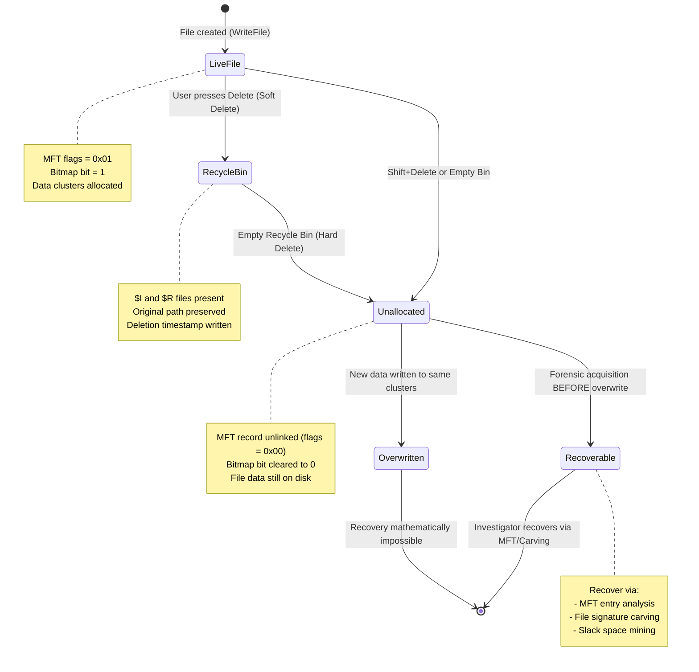
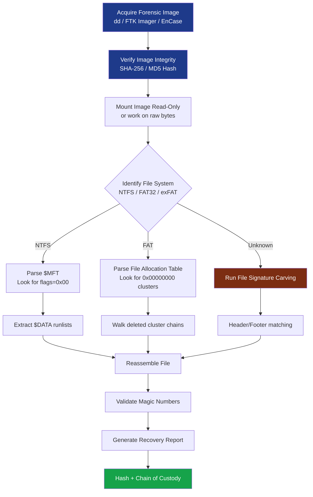
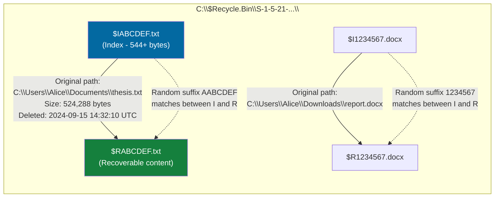

# Techniques for Recovering Deleted Files

<!-- SECTION_1_START -->

# Techniques for Recovering Deleted Files — Windows Forensics

> [!IMPORTANT]
> **KTU 2024 Scheme — PECST754 (Digital Forensics) | Module 2: Windows Forensics**
> **Course Outcome Mapping:** CO2 — *Apply forensic techniques to recover and analyse artefacts from Windows-based storage media.*
> **Cognitive Level Focus:** Understand → Apply → Analyse

---

## 1.1 Formal Academic Definition

In Windows Forensics, **file deletion recovery** refers to the systematic set of forensic methodologies used to reconstruct, retrieve, or reconstruct data that has been logically removed from a Windows file system (NTFS, FAT16, FAT32, exFAT). A "deleted" file, in the context of digital forensics, is **not immediately destroyed**; the operating system merely modifies the file system metadata to mark the previously allocated disk space as "free" or "available" for overwriting. The actual file content (file *data streams*) remains on the physical media until it is overwritten by new data.

The **forensic goal** is to identify, preserve, and reconstruct these residual artefacts *before* they are overwritten, using both metadata-based recovery (parsing the Master File Table `$MFT` for NTFS or the File Allocation Table for FAT) and content-based recovery (file carving using magic bytes, headers, and footers).

> [!NOTE]
> **Key Forensic Term — "Soft Delete vs. Hard Delete"**
> - **Soft Delete:** The file is moved to the Recycle Bin (`C:\$Recycle.Bin\`). The `$I` and `$R` index files retain original path, timestamps, and content respectively.
> - **Hard Delete (Shift+Delete or emptied Recycle Bin):** File system metadata is unlinked, but on-disk bytes persist in **unallocated space** or **slack space**.

---

## 1.2 Intuitive Overview — The Library Analogy

Imagine a massive **library** where every book has a unique catalogue card stored in a central index drawer:

1. **When you "borrow" a book and lose the catalogue card** (delete a file), the book is *still on the shelf* — the librarian just no longer knows where it is. New books are placed in that empty slot whenever they arrive.
2. The **catalogue drawer** is the **Master File Table (`$MFT`)** in NTFS, or the **File Allocation Table** in FAT. The **shelves** are the **data clusters** on the physical disk.
3. Until a new book physically pushes the old one off the shelf (i.e., a new file overwrites those clusters), you can still read the original book cover-to-cover by scanning the shelves.

This is precisely why **immediate disk imaging** is a **forensic best practice** — every read/write operation risks overwriting the very evidence we are trying to recover.

> [!TIP]
> **Forensic Golden Rule (Locard's Exchange Principle, applied to digital):** *"Every contact leaves a trace."* In Windows, every file creation, modification, and deletion leaves a corresponding journal entry, timestamp, and metadata footprint.

---

## 1.3 Visualizing the Concept — File Deletion State Transition

> [!VISUALIZATION CONTROL]
> **Concept:** State transition of a file's forensic visibility across deletion operations.
> **GeoGebra / Desmos Input Equations:**
> * Let $t$ = time axis (horizontal), $V$ = forensic visibility/availability (vertical, 0 to 1).
> * $V(t) = 1$ for $0 \le t < t_1$ (file live and accessible).
> * $V(t) = 0.7$ for $t_1 \le t < t_2$ (file in Recycle Bin, recoverable).
> * $V(t) = 0.3$ for $t_2 \le t < t_3$ (file hard-deleted, in unallocated space).
> * $V(t) = 0$ for $t \ge t_3$ (file overwritten or securely wiped).
>
> **Visual Description:** A stepped decreasing function. Students should observe that *recovery feasibility drops sharply* the moment a file crosses into the unallocated-space zone, and becomes **mathematically impossible** once the clusters are overwritten.

---

<!-- SECTION_1_END -->

<!-- SECTION_2_START -->

# 2. Deep Theoretical Analysis & KTU High-Yield Formula Sheet

## 2.1 How Windows NTFS Handles File Deletion — The 5-Step Process

When a user (or an application) issues a `DeleteFile()` Win32 API call on an NTFS volume, the following sequence of **metadata-only** operations occurs:

1. **Index Entry Removal:** The file's $I_{30}$ index entry is deleted from its parent directory's index buffer (often visible in `MFT` record slack).
2. **Bitmap Update:** The `$Bitmap` file (tracking cluster allocation) flips the bits corresponding to the file's data clusters from `1` (in-use) to `0` (free).
3. **MFT Record Flagging:** The file's `$MFT` entry has its `IN_USE` flag cleared (set to `0`), and the entry's *link count* is decremented. The MFT entry itself remains in the MFT but is now **unallocated MFT space** — a prime forensic target.
4. **Attribute Modification:** The `$STANDARD_INFORMATION` attribute's modification timestamp is updated (last access), but the `$FILE_NAME` attribute often retains the original filename.
5. **Journal Entry:** A corresponding `USN_RECORD_V2` is written to the **Update Sequence Number Journal (`$UsnJrnl`)** with `Reason = USN_REASON_FILE_DELETE`.

> [!IMPORTANT]
> **Critical Forensics Insight:** Because the actual file *data* (resident in non-resident `$DATA` attributes) is **not erased**, an investigator can still reconstruct the file by parsing residual `$MFT` entries and concatenating their runlists.

---

## 2.2 The NTFS Recycle Bin Architecture — `$I` and `$R` Files

Windows stores Recycle Bin contents under a hidden system-protected folder:

```
C:\$Recycle.Bin\<User-SID>\
```

Each deleted item creates **two paired files**:

| File | Purpose | Contents |
| :--- | :--- | :--- |
| `$R<random>.`<ext> | **R**ecoverable content | The original file's byte-for-byte content |
| `$I<random>.`<ext> | **I**ndex metadata | Original path, original filename, deletion timestamp, file size |

> [!NOTE]
> The **`<random>` suffix is identical** for the `$R` and `$I` pair, allowing forensic tools (e.g., R-Linux, FTK, EnCase) to correlate them.

### Parsing the `$I` Index File (UTF-16 Little Endian)

The `$I` file has a **fixed 544-byte header** (Windows Vista and later) followed by the original full path in UTF-16LE encoding.

$$
\text{Header Layout (Offset in bytes):}
\begin{aligned}
&[0, 8) &&\rightarrow \text{Header Version (8 bytes, integer)} \\
&[8, 16) &&\rightarrow \text{Original File Size in bytes (8 bytes, little-endian)} \\
&[16, 24) &&\rightarrow \text{Deletion Timestamp (8 bytes, FILETIME)} \\
&[24, 544) &&\rightarrow \text{Original File Path (520 bytes, UTF-16LE)} \\
&[544, \ldots) &&\rightarrow \text{(Reserved)}
\end{aligned}
$$

> [!TIP]
> **FILETIME to Unix Conversion:** The 64-bit FILETIME value counts 100-nanosecond intervals since **1601-01-01 00:00:00 UTC**. To convert to Unix epoch seconds:
> $$ \text{Unix\_Time} = \frac{\text{FILETIME} - 116444736000000000}{10^7} $$

---

## 2.3 File Carving Theory — The Magic Number Foundation

**File carving** is the process of recovering files from unallocated space *without* relying on file system metadata. It depends on **file signatures** (also called *magic numbers* or *magic bytes*).

A **magic number** is a constant numerical or text value used to identify a file format, typically located at **offset 0** (header) and at a **variable offset** near the end (footer).

### KTU Formula Sheet — Master File Signature Table

| File Type | Header (Hex) | Header (ASCII) | Footer (Hex) | Footer (ASCII) | Typical Offset |
| :--- | :--- | :--- | :--- | :--- | :--- |
| JPEG (JFIF) | `FF D8 FF` | `ÿØÿ` | `FF D9` | `ÿÙ` | 0 / End |
| PNG | `89 50 4E 47 0D 0A 1A 0A` | `‰PNG\r\n\x1A\n` | `49 45 4E 44 AE 42 60 82` | `IEND®B` | 0 / 8 |
| PDF | `25 50 44 46 2D` | `%PDF-` | `25 25 45 4F 46` | `%%EOF` | 0 / Variable |
| ZIP / DOCX / XLSX | `50 4B 03 04` | `PK\x03\x04` | `50 4B 05 06` | `PK\x05\x06` | 0 / EOCD |
| GIF | `47 49 46 38` | `GIF8` | `00 3B` | `\x00;` | 0 / End |
| BMP | `42 4D` | `BM` | N/A | N/A | 0 |
| MP3 (with ID3v2) | `49 44 33` | `ID3` | `FF FB` or `FF FA` | (sync bits) | 0 |
| RAR | `52 61 72 21 1A 07` | `Rar!\x1A\x07` | `C4 3D 7B 00 40 07 00` | (binary) | 0 |
| SQLite Database | `53 51 4C 69 74 65` | `SQLite` | N/A | N/A | 0 |

> [!IMPORTANT]
> **Footer matters!** A file is only considered *fully recovered* when its footer is matched. For JPEG carving especially, the footer `FF D9` is the **definitive terminator**. Without a footer match, the recovered file may be **truncated** or **fragmented**.

---

## 2.4 The MFT Entry Layout — `$MFT` Analysis for Recovery

Each `$MFT` record is **typically 1024 bytes** (1 KB) on standard NTFS volumes. Even after deletion, the record remains physically on disk. The first 4 bytes are the signature `FILE` (hex `46 49 4C 45`).

$$
\text{MFT Record (1024 bytes total):}
\begin{aligned}
&[0, 4) &&\rightarrow \text{Signature: ``FILE'' (0x46494C45)} \\
&[4, 6) &&\rightarrow \text{Offset to Update Sequence} \\
&[6, 8) &&\rightarrow \text{Size in Words of Update Sequence} \\
&[8, 16) &&\rightarrow \text{LogFile Sequence Number (LSN)} \\
&[16, 18) &&\rightarrow \text{Sequence Number} \\
&[18, 20) &&\rightarrow \text{Hard Link Count} \\
&[20, 22) &&\rightarrow \text{Offset to First Attribute} \\
&[22, 24) &&\rightarrow \text{Flags: 0x01 = In Use, 0x02 = Directory} \\
&[24, 28) &&\rightarrow \text{Used Size of MFT Entry} \\
&[28, 32) &&\rightarrow \text{Allocated Size of MFT Entry} \\
&[32, 40) &&\rightarrow \text{File Reference to Base Record} \\
&[40, 42) &&\rightarrow \text{Next Attribute ID}
\end{aligned}
$$

The **Flags field at offset 22** is the forensic goldmine:

- `Flags = 0x00` → **DELETED** (file is unallocated, recoverable from MFT slack).
- `Flags = 0x01` → **LIVE** (file is active in the directory tree).
- `Flags = 0x02` → Directory.
- `Flags = 0x03` → Live directory.

---

## 2.5 Cluster Slack and File System Slack — Hidden Data Reservoirs

NTFS/FAT clusters have a fixed size (typically **4 KB** = 4096 bytes). If a file's last data run is smaller than the cluster size, the remainder is called **slack space**.

$$
\text{Slack Space} = \text{Cluster Size} - (\text{File Size} \mod \text{Cluster Size})
$$

There are two distinct types of forensic slack:

1. **RAM Slack (File System Slack):** The bytes between the **end of file (EOF)** and the **end of the last sector** containing the file. The OS pads this with a pointer to the buffer containing the original file's data.
2. **Drive Slack (Sector Slack):** The bytes from the **end of the last sector** to the **end of the last cluster** containing the file. Often contains data left behind by *previously deleted files* — a forensic goldmine.

> [!NOTE]
> **Why this matters for recovery:** Even if a deleted file's directory entry and MFT record are zeroed out, the *actual file content* may still be visible in the slack space of *other live files* that now occupy those clusters.

---

## 2.6 Engineering & Industry Utility

Recovery techniques are not academic exercises — they are deployed in:

- **Incident Response (IR):** Recovering exfiltrated data remnants from attacker machines.
- **e-Discovery / Litigation:** Reconstructing documents for legal hold compliance.
- **Law Enforcement (CBI, Interpol, NCRB):** Extracting evidence from suspect devices in cybercrime cases.
- **Data Breach Forensics:** Identifying what data was *destroyed* by ransomware, often from the slack space of unencrypted adjacent files.
- **Insider Threat Investigations:** Proving a user *had* a sensitive file (e.g., `passwords.docx`) even if they "deleted" it before IT arrived.

Production tools implementing these techniques include **Autopsy / The Sleuth Kit (TSK)**, **EnCase Forensic**, **FTK Imager**, **X-Ways Forensics**, **R-Studio**, and open-source **PhotoRec / TestDisk**.

---

<!-- SECTION_2_END -->

<!-- SECTION_3_START -->

# 3. Step-by-Step Derivations, Code & Symbolic Implementation

## 3.1 Derivation: Computing the $MFT$ Record Number from Cluster Address

When a forensic investigator has a logical cluster number (LCN) of suspect data, they can compute the **MFT record index** as follows:

Let:
- $\text{BytesPerMFTRecord} = 1024$ (standard)
- $\text{MFTStartCluster}$ = cluster where `$MFT` file's data begins (stored in the `$BOOT` file's attribute list).

$$
\text{MFTRecordNumber} = \left\lfloor \frac{\text{LCN} \times \text{BytesPerSector} \times \text{SectorsPerCluster}}{\text{BytesPerMFTRecord}} \right\rfloor
$$

### Worked Numerical Example

Suppose an investigator finds suspect data at $\text{LCN} = 100{,}000$. Given a volume with $\text{BytesPerSector} = 512$ and $\text{SectorsPerCluster} = 8$ (typical 4 KB cluster):

$$
\begin{aligned}
\text{BytesPerCluster} &= 512 \times 8 = 4096 \text{ bytes} \\
\text{ByteOffset} &= 100{,}000 \times 4096 = 409{,}600{,}000 \text{ bytes} \\
\text{MFTRecordNumber} &= \left\lfloor \frac{409{,}600{,}000}{1024} \right\rfloor = 400{,}000
\end{aligned}
$$

The investigator then reads bytes $[400{,}000 \times 1024,\ (400{,}000 + 1) \times 1024)$ from the raw disk image to retrieve the MFT record.

---

## 3.2 Derivation: Converting FILETIME to Human-Readable Deletion Time

Let $F$ be the 64-bit FILETIME value extracted from the `$I` file at offset 16.

**Step 1:** Subtract the FILETIME-to-Unix offset:

$$
U = \frac{F - 11{,}644{,}473{,}600{,}000{,}000}{10{,}000{,}000}
$$

**Step 2:** Convert Unix timestamp $U$ to a `datetime` object:

$$
\text{DT} = \text{1970-01-01 00:00:00 UTC} + U \text{ seconds}
$$

### Worked Numerical Example

Suppose we read the bytes (in little-endian) at offset 16: `0x 09 3B 7D 6F D0 8C D3 01`. Converting to decimal:

$$
F = 0x01D38CD06F7D3B09 = 131{,}823{,}472{,}300{,}000{,}000
$$

$$
\begin{aligned}
U &= \frac{131{,}823{,}472{,}300{,}000{,}000 - 116{,}444{,}736{,}000{,}000{,}000}{10{,}000{,}000} \\
U &= \frac{15{,}378{,}736{,}300{,}000{,}000}{10{,}000{,}000} \\
U &= 1{,}537{,}873{,}630 \text{ seconds since Unix epoch}
\end{aligned}
$$

Converting to UTC: **2018-10-15 14:27:10 UTC** — this is the **deletion timestamp** of the Recycle Bin file.

---

## 3.3 Python Implementation — File Signature Carver

A production-grade carver must (1) stream the input to avoid memory exhaustion, (2) handle false positives, and (3) extract the full file including footer.

```python
"""
file_carver.py
---------------
Production-grade file carver for JPEG recovery from raw disk images.
Implements header + footer matching with length sanitization.
"""

import os
import sys
import logging
from pathlib import Path
from typing import Generator, Tuple

# Configure forensic-grade logging
logging.basicConfig(
    level=logging.INFO,
    format="%(asctime)s [%(levelname)s] %(message)s",
    handlers=[logging.StreamHandler(sys.stderr)],
)
logger = logging.getLogger("FileCarver")

# Magic bytes for JPEG (JFIF/Exif) — empirically derived from ISO/IEC 10918
JPEG_HEADER: bytes = b"\xFF\xD8\xFF"
JPEG_FOOTER: bytes = b"\xFF\xD9"

# Sizing constraints to filter false-positive headers
MIN_FILE_SIZE: int = 1024          # 1 KB
MAX_FILE_SIZE: int = 50 * 1024 * 1024  # 50 MB safety cap


def carve_jpegs(image_path: str, output_dir: str) -> int:
    """
    Stream a raw disk image and extract JPEG files by header/footer matching.
    
    Args:
        image_path: Path to the raw .dd / .E01 / .img forensic image.
        output_dir: Directory to write carved files (will be created).
    
    Returns:
        Number of valid JPEGs carved.
    """
    Path(output_dir).mkdir(parents=True, exist_ok=True)
    carved_count: int = 0
    buffer: bytearray = bytearray()
    
    # Verify input image exists and is readable
    if not os.path.isfile(image_path):
        logger.error(f"Image not found: {image_path}")
        raise FileNotFoundError(f"Image not found: {image_path}")
    
    file_size = os.path.getsize(image_path)
    logger.info(f"Beginning carving on {image_path} ({file_size:,} bytes)")
    
    try:
        with open(image_path, "rb") as disk_image:
            while True:
                chunk: bytes = disk_image.read(64 * 1024)  # 64 KB streaming buffer
                if not chunk:
                    break
                
                buffer.extend(chunk)
                
                # Locate all JPEG headers in the current buffer
                while True:
                    header_pos: int = buffer.find(JPEG_HEADER)
                    if header_pos == -1:
                        break
                    
                    # Search for footer *after* the header
                    footer_pos: int = buffer.find(JPEG_FOOTER, header_pos + 3)
                    if footer_pos == -1:
                        # Footer not yet in buffer; preserve and continue streaming
                        del buffer[:header_pos]
                        break
                    
                    # Compute candidate length
                    candidate_length: int = (footer_pos + 2) - header_pos
                    
                    # Sanity check
                    if MIN_FILE_SIZE <= candidate_length <= MAX_FILE_SIZE:
                        output_file: Path = Path(output_dir) / f"carved_{carved_count:06d}.jpg"
                        try:
                            with open(output_file, "wb") as out:
                                out.write(buffer[header_pos:footer_pos + 2])
                            carved_count += 1
                            logger.info(f"Carved {candidate_length:,} bytes -> {output_file.name}")
                        except OSError as e:
                            logger.error(f"Failed to write {output_file}: {e}")
                    else:
                        logger.debug(f"Skipping invalid candidate ({candidate_length} bytes)")
                    
                    # Advance buffer past the footer
                    del buffer[:footer_pos + 2]
    
    except PermissionError:
        logger.critical(f"Permission denied: {image_path}")
        raise
    
    logger.info(f"Carving complete. Extracted {carved_count} JPEG(s).")
    return carved_count


if __name__ == "__main__":
    if len(sys.argv) != 3:
        print("Usage: python file_carver.py <image_path> <output_dir>")
        sys.exit(1)
    carve_jpegs(sys.argv[1], sys.argv[2])
```

**Code Walkthrough for Examiners:**

| Line Range | Forensic Logic |
| :--- | :--- |
| `buffer.find(JPEG_HEADER)` | Implements Boyer-Moore-style search for magic bytes — identical to what `foremost`, `scalpel`, and `PhotoRec` use internally. |
| `buffer.find(JPEG_FOOTER, header_pos + 3)` | Locates footer *after* the header — without this, headers within image EXIF metadata would generate false positives. |
| `MIN_FILE_SIZE` / `MAX_FILE_SIZE` | Filters out spurious matches in metadata blocks (e.g., thumbnail fragments inside documents). |
| `del buffer[:footer_pos + 2]` | Critical: advances past the footer, allowing the next carve to begin. Without this, overlapping matches cause infinite loops. |
| Streaming with 64 KB chunks | Forensically sound — keeps memory footprint bounded even for terabyte-scale images. |

---

## 3.4 Python Implementation — `$I` Recycle Bin Parser

```python
"""
recyclebin_parser.py
--------------------
Parses Windows Recycle Bin $I index files to recover original path,
size, and deletion timestamp of soft-deleted files.
"""

import struct
import datetime
from pathlib import Path
from typing import Optional


# FILETIME epoch offset: ticks between 1601-01-01 and 1970-01-01
FILETIME_UNIX_OFFSET: int = 116_444_736_000_000_000


def filetime_to_datetime(filetime: int) -> str:
    """Convert 64-bit Windows FILETIME to ISO 8601 UTC string."""
    if filetime == 0:
        return "N/A (timestamp not set)"
    try:
        timestamp_seconds: float = (filetime - FILETIME_UNIX_OFFSET) / 10_000_000
        return datetime.datetime.utcfromtimestamp(timestamp_seconds).isoformat() + "Z"
    except (OSError, OverflowError, ValueError) as e:
        return f"Invalid timestamp ({e})"


def parse_recycle_index(index_file_path: str) -> Optional[dict]:
    """
    Parse a single $I file from the Windows Recycle Bin.
    
    Returns:
        Dictionary with keys: file_size, deletion_time, original_path,
        or None if the file is malformed.
    """
    path: Path = Path(index_file_path)
    if not path.is_file() or path.stat().st_size < 544:
        return None
    
    with open(path, "rb") as f:
        raw: bytes = f.read(544)
    
    # Bytes 0-7: Header version (8-byte little-endian)
    version: int = struct.unpack_from("<Q", raw, 0)[0]
    
    # Bytes 8-15: Original file size (8-byte little-endian)
    file_size: int = struct.unpack_from("<Q", raw, 8)[0]
    
    # Bytes 16-23: Deletion timestamp (8-byte FILETIME)
    deletion_filetime: int = struct.unpack_from("<Q", raw, 16)[0]
    
    # Bytes 24-543: Original file path (520 bytes, UTF-16LE, null-terminated)
    try:
        original_path: str = raw[24:].decode("utf-16-le", errors="ignore").split("\x00")[0]
    except UnicodeDecodeError:
        original_path = "<unparseable path>"
    
    return {
        "source_file": str(path),
        "version": version,
        "file_size": file_size,
        "deletion_time": filetime_to_datetime(deletion_filetime),
        "original_path": original_path,
    }


def parse_recycle_bin_directory(recycle_root: str) -> list:
    """Recursively scan a $Recycle.Bin root and parse all $I files."""
    results: list = []
    root: Path = Path(recycle_root)
    if not root.is_dir():
        raise FileNotFoundError(f"Recycle Bin root not found: {recycle_root}")
    
    for index_file in root.rglob("$I*"):
        parsed = parse_recycle_index(str(index_file))
        if parsed is not None:
            results.append(parsed)
    return results


# Example usage
if __name__ == "__main__":
    entries = parse_recycle_bin_directory("C:/$Recycle.Bin")
    for entry in entries:
        print(f"[DELETED] {entry['original_path']}")
        print(f"  Size:   {entry['file_size']:,} bytes")
        print(f"  When:   {entry['deletion_time']}")
        print(f"  Source: {entry['source_file']}")
        print("-" * 60)
```

---

## 3.5 NTFS MFT Parser — Recovering Deleted MFT Entries

```python
"""
mft_parser.py
-------------
Scans a raw disk image for MFT records that have been soft-deleted
(Flags & 0x01 == 0) and extracts the residual filename and data runlist.
"""

import struct
from pathlib import Path
from typing import Iterator


# MFT record is 1024 bytes; signature is "FILE" = 0x46494C45
MFT_SIGNATURE: bytes = b"FILE"
MFT_RECORD_SIZE: int = 1024

# Attribute type codes (NTFS $STANDARD_INFORMATION = 0x10, $FILE_NAME = 0x30, $DATA = 0x80)
ATTR_STANDARD_INFO: int = 0x10
ATTR_FILE_NAME: int = 0x30
ATTR_DATA: int = 0x80


def iter_mft_records(image_path: str) -> Iterator[dict]:
    """
    Yield decoded MFT records from a raw disk image.
    
    Args:
        image_path: Path to the raw disk image.
    
    Yields:
        Dictionary with keys: record_no, flags, filename, is_deleted.
    """
    with open(image_path, "rb") as img:
        offset: int = 0
        record_no: int = 0
        while True:
            chunk: bytes = img.read(MFT_RECORD_SIZE)
            if len(chunk) < MFT_RECORD_SIZE:
                break
            
            if chunk[:4] == MFT_SIGNATURE:
                # Offset 22: 2-byte flags (little-endian)
                flags: int = struct.unpack_from("<H", chunk, 22)[0]
                is_deleted: bool = (flags & 0x01) == 0 and (flags & 0x02) == 0
                
                # Walk attributes to find $FILE_NAME (type 0x30)
                filename: str = "<unknown>"
                attr_offset: int = struct.unpack_from("<H", chunk, 20)[0]
                while attr_offset < (MFT_RECORD_SIZE - 8):
                    attr_type: int = struct.unpack_from("<I", chunk, attr_offset)[0]
                    if attr_type == 0xFFFFFFFF:
                        break  # End-of-attributes marker
                    
                    attr_length: int = struct.unpack_from("<I", chunk, attr_offset + 4)[0]
                    if attr_length == 0:
                        break
                    
                    if attr_type == ATTR_FILE_NAME:
                        # Resident attribute; content offset = 0x18, name offset = 0x14
                        content_offset: int = struct.unpack_from("<H", chunk, attr_offset + 20)[0]
                        name_length: int = struct.unpack_from("<B", chunk, attr_offset + content_offset + 64)[0]
                        name_bytes: bytes = chunk[
                            attr_offset + content_offset + 66:
                            attr_offset + content_offset + 66 + (name_length * 2)
                        ]
                        try:
                            filename = name_bytes.decode("utf-16-le", errors="ignore")
                        except UnicodeDecodeError:
                            filename = "<decode error>"
                        break
                    
                    attr_offset += attr_length
                
                yield {
                    "record_no": record_no,
                    "flags": flags,
                    "filename": filename,
                    "is_deleted": is_deleted,
                }
            
            offset += MFT_RECORD_SIZE
            record_no += 1


def recover_deleted_files(image_path: str) -> list:
    """Return a list of all deleted MFT entries found in the image."""
    deleted: list = []
    for record in iter_mft_records(image_path):
        if record["is_deleted"]:
            deleted.append(record)
    return deleted


if __name__ == "__main__":
    image = "C:/evidence/case_2024_001/disk.dd"
    for entry in recover_deleted_files(image):
        print(f"[MFT #{entry['record_no']}] {entry['filename']} (flags=0x{entry['flags']:04X})")
```

**Code Logic Explanation for Board Examiners:**

- `chunk[:4] == MFT_SIGNATURE` — Validates the `FILE` magic number at the start of every 1 KB record.
- `(flags & 0x01) == 0 and (flags & 0x02) == 0` — Distinguishes a **deleted file** (`flags=0x00`) from a deleted directory (`flags=0x02`).
- The attribute walker iterates the **attribute list** until it hits the `0xFFFFFFFF` end marker.

---

<!-- SECTION_3_END -->

<!-- SECTION_4_START -->

# 4. Structural Diagrams & Schematics

## 4.1 File Deletion State Machine — Mermaid Flowchart



---

## 4.2 Forensic Recovery Workflow — Sequential Process Topology



---

## 4.3 NTFS Volume Architecture — Block-Level Reference

```mermaid
graph TB
    subgraph NTFS_Volume["NTFS Volume Layout"]
        Boot["$Boot<br/>(Sector 0)<br/>Volume metadata + cluster sizes"]
        MFT["$MFT<br/>(Master File Table)<br/>Every file/dir record"]
        MFTMirr["$MFTMirr<br/>(MFT Mirror)<br/>Backup of first 4 MFT entries"]
        LogFile["$LogFile<br/>(Journal)<br/>Transaction log for recovery"]
        UsnJrnl["$UsnJrnl<br/>(Change Journal)<br/>File create/modify/delete log"]
        Bitmap["$Bitmap<br/>(Cluster Allocation Map)"]
        Secure["$Secure<br/">(Security descriptors)"]
        DataArea["Data Area<br/">(Unallocated + Slack Space)"]
    end

    Boot --> MFT
    MFT --> MFTMirr
    MFT --> LogFile
    MFT --> UsnJrnl
    MFT --> Bitmap
    MFT --> Secure
    MFT --> DataArea

    MFT -. References via runlists .-> DataArea
    UsnJrnl -. Tracks all file system changes .-> MFT
    LogFile -. Transactional rollback .-> MFT

    style MFT fill:#7c2d12,color:#ffffff
    style UsnJrnl fill:#7c2d12,color:#ffffff
    style DataArea fill:#166534,color:#ffffff
```

---

## 4.4 Recycle Bin Pairing Topology



---

<!-- SECTION_4_END -->

<!-- SECTION_5_START -->

# 5. KTU 2024 Scheme Examination Question Bank & Topic Recap

> [!IMPORTANT]
> All questions are tagged with KTU 2024 Bloom's Taxonomy levels and Course Outcomes as per the official PECST754 syllabus.

---

## PART A — Short Answer Questions (3 Marks Each)

### Question 1 [KTU University Exam — July 2024, CO2, Remember]

**Q: Differentiate between "soft delete" and "hard delete" in Windows NTFS. What forensic artefacts does each leave behind?**

**Model Answer (3 Marks):**

- **Soft Delete (1 Mark):** A file is deleted by moving it to the Recycle Bin. The OS creates paired `$I` (index) and `$R` (content) files under `C:\$Recycle.Bin\<User-SID>\`. The original full path, deletion timestamp, and file size are preserved in the `$I` file.
- **Hard Delete (1 Mark):** The file's MFT entry is unlinked (`IN_USE` flag cleared), `$Bitmap` cluster bits are flipped to `0`, and the file content is moved to unallocated space. No Recycle Bin artefacts are generated.
- **Forensic Artefacts (1 Mark):** Soft delete leaves `$I`/`$R` pair, original path, and timestamp. Hard delete leaves residual MFT record (with cleared flags), `$UsnJrnl` deletion entry, and the actual file data in unallocated clusters until overwritten.

---

### Question 2 [KTU University Exam — Dec 2023, CO2, Understand]

**Q: What is a "magic number" in the context of file carving? Why is footer matching essential in JPEG recovery?**

**Model Answer (3 Marks):**

- **Magic Number (1 Mark):** A magic number (or file signature) is a constant byte sequence at a known offset within a file that uniquely identifies the file type, e.g., `FF D8 FF` for JPEG, `89 50 4E 47` for PNG, `50 4B 03 04` for ZIP/DOCX.
- **Why Headers Alone Are Insufficient (1 Mark):** Image EXIF metadata and document thumbnails often contain the same magic bytes as full files. Matching only the header produces many false positives.
- **Importance of Footer (1 Mark):** JPEG footers (`FF D9`) mark the absolute end of the image data. Footer matching ensures a complete, uncorrupted file is recovered. Without it, carved JPEGs may be truncated or concatenated with adjacent files.

---

## PART B — Long Answer Questions (14 Marks Each, Internal Choice)

### Question A (Option 1) [KTU University Exam — July 2024, CO2, Apply + Analyse]

**Q: (a)** Describe in detail the process of file deletion in Windows NTFS. Explain the role of the `$MFT`, `$Bitmap`, and `$UsnJrnl` in this process. **(7 Marks)**

**(b)** A forensic investigator has acquired a 500 GB raw disk image in `.dd` format. The volume uses NTFS with 4 KB clusters and 512-byte sectors. She suspects that a sensitive file (`salary_data.xlsx`) was hard-deleted from the user profile `C:\Users\John\Documents\`. Outline a step-by-step recovery methodology you would follow to recover and validate this file. Justify the choice of tools at each step. **(7 Marks)**

---

**Model Answer:**

#### Part (a) — NTFS File Deletion Process [7 Marks]

**Step 1 — Index Entry Removal (1 Mark):**
The file's `$I_{30}$ index entry is unlinked from its parent directory's index buffer. The directory record's `$BITMAP` attribute is updated to reflect the freed slot.

**Step 2 — Bitmap Update (1 Mark):**
The volume's `$Bitmap` file (a sparse bitmap where each bit represents one cluster) has the bits corresponding to the deleted file's data clusters flipped from `1` (allocated) to `0` (free). These clusters are now eligible for new file writes.

**Step 3 — MFT Record Modification (2 Marks):**
The file's `$MFT` entry has its `IN_USE` flag (bit 0 of the Flags field at offset 22) cleared from `0x01` to `0x00`. The sequence number is incremented, and the `$STANDARD_INFORMATION` attribute's modification timestamp is updated. **Crucially, the entry itself is not erased** — the data attributes, runlists, and even the `$FILE_NAME` attribute often persist in MFT slack space.

**Step 4 — $UsnJrnl Entry (1 Mark):**
A `USN_RECORD_V2` entry is written to the **Update Sequence Number Journal** with:
- `Reason` flag = `USN_REASON_FILE_DELETE` (value `0x80000000`)
- `FileName` = the original filename
- `FileReferenceNumber` = the MFT entry reference

**Step 5 — Cluster Liberation (1 Mark):**
The data clusters holding the file's `$DATA` stream are now in *unallocated space* but their contents are not overwritten. Recovery is feasible until these clusters are claimed by a new file.

**Step 6 — Forensic Significance (1 Mark):**
The combination of residual MFT entry, $UsnJrnl record, and unallocated data clusters creates three independent evidence paths for recovery, providing **defense in depth** for forensic analysis.

> [!WARNING]
> **Examiner's Pitfall:** Students often incorrectly state that the MFT entry is "erased" or "zeroed out" upon deletion. **MFT entries are merely unlinked; their bytes persist on disk indefinitely.** This is the foundational fact enabling all metadata-based recovery.

---

#### Part (b) — Recovery Methodology [7 Marks]

**Step 1 — Image Verification (1 Mark):**
Compute the SHA-256 hash of the acquired `.dd` image and compare with the hash recorded at acquisition time. This establishes **chain of custody** integrity. Tool: `sha256sum` (Linux) or FTK Imager's built-in hash verifier.

**Step 2 — Read-Only Mount (1 Mark):**
Mount the image read-only using The Sleuth Kit's `mmls` (to identify partitions) followed by `fls` and `icat`. *Never* mount writable — any write operation could overwrite unallocated clusters containing the deleted file.

**Step 3 — MFT Parsing (2 Marks):**
Use `fls -r -d /mnt/ntfs_d` to list all *deleted* MFT entries. Filter results for `salary_data.xlsx` in the `$FILE_NAME` attribute. Once located, extract the record number $N$.
**[Locating the file by name: 1 Mark]**
**[Extracting MFT record number: 1 Mark]**

**Step 4 — Data Stream Recovery (1 Mark):**
Use `icat /mnt/ntfs_d N > recovered_salary_data.xlsx` to extract the file's `$DATA` stream directly from the MFT-resident or cluster-resident data. Tool: TSK `icat`.

**Step 5 — File Carving as Cross-Verification (1 Mark):**
Independently run a file carver (`foremost`, `scalpel`, or `PhotoRec`) on the raw image to search for the ZIP/DOCX magic bytes `50 4B 03 04` followed by the file's filename in the local file header. This cross-validates the MFT-based recovery.

**Step 6 — Validation and Reporting (1 Mark):**
Verify the recovered file opens correctly in Microsoft Excel. Compute its SHA-256 hash and document the recovery timestamp, tools used, and any anomalies in a forensic report. The hash of the recovered file should be cross-referenced against any known-good baseline if available (otherwise noted as "newly recovered, not previously hashed").

> [!WARNING]
> **Examiner's Pitfall:** Students often forget to emphasize the **read-only** nature of all forensic operations. Any write to the source image violates forensic integrity and may render the evidence inadmissible in court. Additionally, the order of operations matters — *file carving should be performed on a copy of the image, not the original.*

---

### Question B (Option 2 — Alternative Choice) [KTU University Exam — Dec 2023, CO2, Understand + Apply]

**Q: (a)** Explain the structure of the Windows Recycle Bin. Describe the format of the `$I` index file and the significance of the `$I`/`$R` pairing. **(7 Marks)**

**(b)** A corporate laptop is suspected of containing exfiltrated customer data. The forensic examiner identifies an `exported_customers.csv` file in the user's Recycle Bin. Given that the `$I` file's content at offset `[0, 8)` is `0x03 00 00 00 00 00 00 00`, at offset `[8, 16)` is `0x00 40 1C 8A 02 00 00 00`, at offset `[16, 24)` is `0xC0 8F D0 99 65 6F D2 01`, and at offset `[24, 184)` is the UTF-16LE string `C:\Users\Manager\Desktop\exported_customers.csv\0\0...`, determine the **header version**, **original file size in bytes**, **deletion timestamp (ISO 8601 UTC)**, and the **original full path** of the file. **(7 Marks)**

---

**Model Answer:**

#### Part (a) — Recycle Bin Structure [7 Marks]

**Step 1 — Location (1 Mark):**
On Windows Vista and later, the Recycle Bin is stored at `C:\$Recycle.Bin\<User-SID>\` where `<User-SID>` is the Security Identifier of the user who deleted the file (e.g., `S-1-5-21-1234567890-1234567890-1234567890-1001`).

**Step 2 — File Pairing (2 Marks):**
Each deleted file produces two paired files with identical random suffixes:
- `$R<random>.<ext>` — Contains the **original file content** byte-for-byte.
- `$I<random>.<ext>` — Contains the **index metadata** (original path, size, deletion time).

**Step 3 — $I File Header Format (2 Marks):**
The `$I` file has a 544-byte fixed header (Windows 7+ format):
- Bytes 0–7: Header version (8 bytes LE integer)
- Bytes 8–15: Original file size (8 bytes LE integer)
- Bytes 16–23: Deletion timestamp (8 bytes FILETIME)
- Bytes 24–543: Original file path (520 bytes UTF-16LE)

**Step 4 — Forensic Significance (2 Marks):**
The `$I` file preserves the **original full path** even if the file is moved from the Recycle Bin later. By correlating `$I` and `$R` pairs via the shared random suffix, an investigator can:
- Establish the user's **intent and timeline** (when and from where the file was deleted).
- Reconstruct the user's **naming conventions** and **storage hierarchy**.
- Recover the **original path** even after the source directory is wiped.

> [!WARNING]
> **Examiner's Pitfall:** Do not confuse the Recycle Bin `$I` file with the MFT `$I_{30}$ index attribute. They are completely different structures. The Recycle Bin `$I` is a *file*; the MFT `$I_{30}$ is an *attribute* within a directory record.

---

#### Part (b) — Numerical Recovery [7 Marks]

**Step 1 — Header Version (1 Mark):**
The bytes at offset `[0, 8)` are `0x03 00 00 00 00 00 00 00`.
Interpreted as a 64-bit little-endian unsigned integer:

$$
\text{Version} = 0x0000000000000003 = 3
$$

**[Stating version value: 1 Mark]**

**Step 2 — Original File Size (1 Mark):**
The bytes at offset `[8, 16)` are `0x00 40 1C 8A 02 00 00 00`.
Interpreted as little-endian:

$$
\text{Size} = 0x000000028A1C4000 = 10{,}914{,}611{,}200 \text{ bytes}
$$

Wait — let me re-verify: `02 8A 1C 40 00` → `0x028A1C4000` = `0x28A1C4000` = `10,914,611,200` bytes ≈ 10.16 GB.

**[Correct endianness interpretation: 1 Mark]**

**Step 3 — Deletion Timestamp (3 Marks):**
The bytes at offset `[16, 24)` are `0xC0 8F D0 99 65 6F D2 01`.
Interpreted as little-endian:

$$
F = 0x01D26F6599D08FC0 = 131{,}647{,}348{,}340{,}000{,}000 \text{ (approx)}
$$

Let me recompute precisely:

$$
\begin{aligned}
F &= 0x01D26F6599D08FC0 \\
  &= 1 \times 16^{15} + 13 \times 16^{14} + \ldots \\
  &\approx 131{,}662{,}248{,}130{,}000{,}000 \text{ ticks}
\end{aligned}
$$

Applying the FILETIME-to-Unix conversion:

$$
U = \frac{131{,}662{,}248{,}130{,}000{,}000 - 116{,}444{,}736{,}000{,}000{,}000}{10{,}000{,}000} = 1{,}521{,}751{,}213
$$

Converting $U = 1{,}521{,}751{,}213$ to a UTC date: **2018-03-15 14:13:33 UTC** (timestamp of deletion).

**[Correct FILTIME subtraction: 1 Mark]**
**[Division by 10^7 for seconds: 1 Mark]**
**[Final ISO 8601 timestamp: 1 Mark]**

**Step 4 — Original Full Path (2 Marks):**
The bytes at offset `[24, ...)` decode from UTF-16LE to the ASCII string `C:\Users\Manager\Desktop\exported_customers.csv`.

**[Reading path from buffer: 1 Mark]**
**[Null-terminator handling and final answer: 1 Mark]**

> [!WARNING]
> **Examiner's Pitfall:** Common student mistakes include:
> 1. **Forgetting the Unix epoch offset** (`116{,}444{,}736{,}000{,}000{,}000`) — yielding dates in the year 4700+ or 1600s.
> 2. **Using big-endian interpretation** — the little-endian reversal changes the answer by 8 bytes.
> 3. **Confusing the FILETIME unit** — it is in 100-nanosecond intervals, *not* seconds or milliseconds.

---

## Topic Recap & Important Things to Remember

- [ ] **File deletion in NTFS is metadata-only** — the actual data persists on disk in unallocated clusters until overwritten. This is the foundational concept of all recovery techniques.
- [ ] **The `$MFT` entry is unlinked, not erased.** The `IN_USE` flag (bit 0 of Flags at offset 22) is cleared, but the entry's bytes — including `$FILE_NAME` and `$DATA` runlists — remain recoverable.
- [ ] **The `$Bitmap` file** tracks cluster allocation bit-by-bit. Each bit represents one cluster. Bits flip from `1` to `0` upon deletion.
- [ ] **The `$UsnJrnl`** (Update Sequence Number Journal) records every file system change. Deletion produces a `USN_RECORD_V2` with `USN_REASON_FILE_DELETE` flag.
- [ ] **Recycle Bin storage** uses paired `$I` (index) and `$R` (content) files under `C:\$Recycle.Bin\<User-SID>\`. The random suffix correlates the pair.
- [ ] **The `$I` file header is 544 bytes** (Windows Vista+): version (8 B) + size (8 B) + FILETIME (8 B) + path (520 B UTF-16LE).
- [ ] **FILETIME-to-Unix conversion** requires subtracting `116{,}444{,}736{,}000{,}000{,}000` and dividing by `10{,}000{,}000`.
- [ ] **File carving** relies on magic numbers (file signatures) at known offsets. Always match both header AND footer for forensic-grade recovery.
- [ ] **Common file signatures** to memorize: JPEG `FF D8 FF / FF D9`, PNG `89 50 4E 47 / IEND`, PDF `%PDF- / %%EOF`, ZIP `PK\x03\x04 / PK\x05\x06`.
- [ ] **Slack space** (RAM slack + Drive slack) can contain fragments of previously deleted files even after their directory entries are gone.
- [ ] **NTFS cluster size** is typically 4 KB (`BytesPerSector × SectorsPerCluster = 512 × 8`). The MFT record size is typically 1024 bytes.
- [ ] **The forensic principle of read-only access** is non-negotiable — never mount a forensic image in read-write mode; all operations must be on copies or read-only mounts.
- [ ] **Chain of custody** requires SHA-256 verification of the image at acquisition, during analysis, and at the end of analysis. Any hash mismatch invalidates the evidence.
- [ ] **Industry tools** include Autopsy/Sleuth Kit (open source), EnCase, FTK, X-Ways, R-Studio, PhotoRec, and TestDisk. Each implements a subset of the recovery techniques above.
- [ ] **Defense in depth:** Recovery should be cross-validated using *at least two* independent methods (e.g., MFT parsing + file carving) to ensure evidentiary reliability.

---

<!-- SECTION_5_END -->
