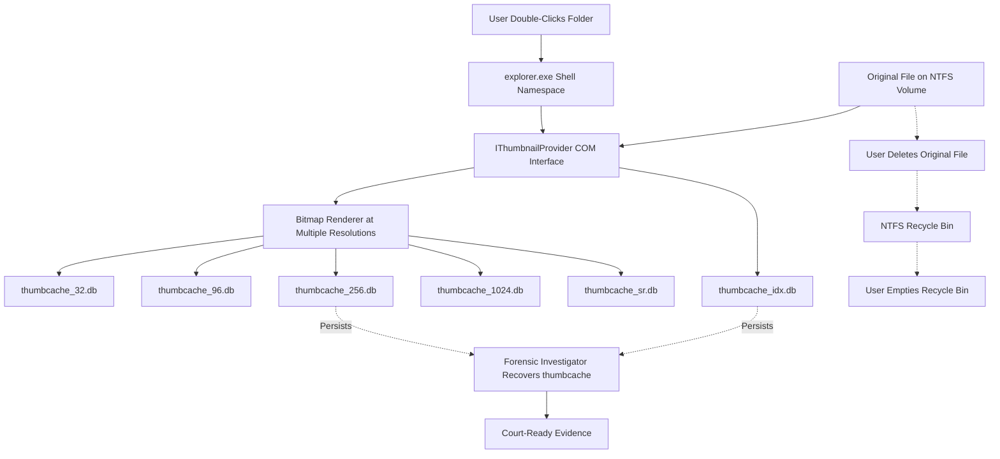
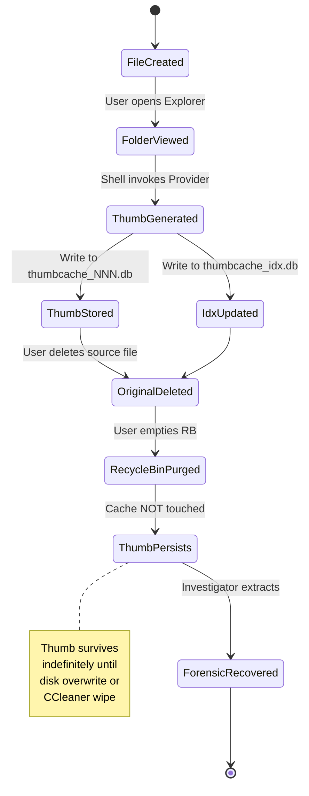
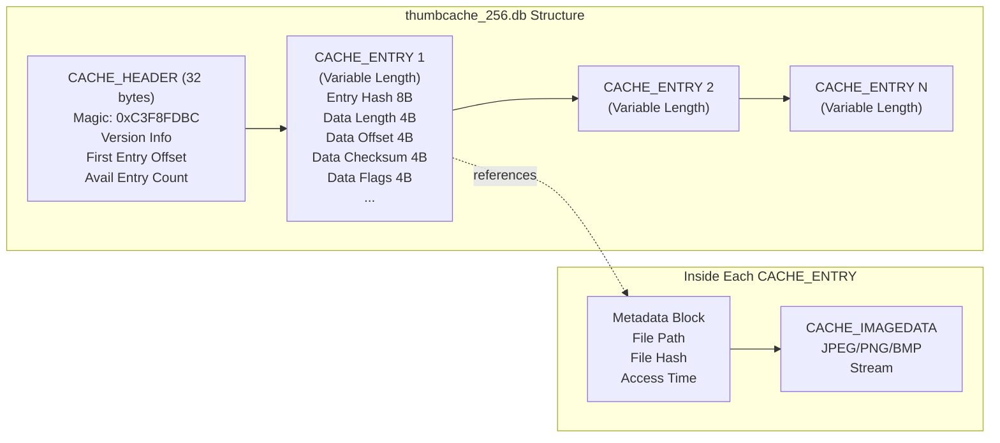

# thumbnails

<!-- SECTION_1_START -->
# Thumbnails in Windows Forensics

## 1. Core Technical Definition

> [!IMPORTANT]
> **KTU 2024 Syllabus Definition (PECST754 - Module 2)**
> A **Windows Thumbnail** is a reduced-size, cached preview representation of an original file (image, video, or document) automatically generated and stored by the Windows Shell (Explorer.exe) to accelerate folder browsing performance. In digital forensics, thumbnails are **artifacts of immense evidentiary value** because they persist on disk even after the source file has been deleted, deleted from the Recycle Bin, or wiped from unallocated space.

**Formal Terminology (aligned with NIST SP 800-86 and KTU 2024 PECST754 syllabus):**
- **Thumbnail Cache**: A persistent, structured storage file (database) containing preview images.
- **Thumbcache Database (`thumbcache_*.db`)**: Centrally managed, per-user Windows 7/8/10/11 cache.
- **Thumbs.db**: A legacy, per-folder (Windows XP / Windows 7+ compatibility) cache file.
- **CACHE_HEADER / CACHE_IMAGEDATA**: Internal binary structures used to embed preview bitmaps.

---

## 2. Intuitive Analogy (The "Library Card" Analogy)

Imagine a librarian who, instead of pulling a heavy book off the shelf every time a child asks "What does this book look like?", keeps a **tiny photograph of the cover glued to a master index card**. The photograph lets the child identify the book without the librarian touching the original. Now, if the librarian throws the **book** into the incinerator (deletion of the original file), the **photograph on the index card remains**. A forensic investigator (the new librarian) can later look at these surviving photographs and conclude:

> *"A book that looked exactly like this once existed on this shelf, even though the shelf is now empty."*

That is precisely what Windows Thumbnail forensics reveals — **proof of existence** of files that no longer exist on the filesystem.

> [!NOTE]
> **Why it matters in court**: A defendant can claim an image was never on their machine. A recovered thumbnail with the **file path, EXIF metadata, and creation timestamp** stored inside the cache can refute that claim definitively.

---

## 3. Physical Constants and Standard Metrics

| Parameter | Standard Value (Windows 10/11) |
|---|---|
| Default thumbnail resolutions | **32×32, 96×96, 256×256, 1024×1024** pixels |
| Highest-resolution cache | **thumbcache_2560.db** (introduced in Windows 10 for HiDPI displays) |
| Streaming-resolution cache | **thumbcache_sr.db** (used for remote/networked items) |
| Master index database | **thumbcache_idx.db** |
| Hidden flag on `Thumbs.db` | **Yes** (`H` attribute set automatically) |
| System attribute on `Thumbs.db` | **Yes** (`S` attribute set in Windows 7+) |
| Default cache size cap | **10 GB** (configurable via Group Policy) |
| Encoding format | **JPEG, PNG, BMP, or raw BITMAPINFOHEADER (DIB)** |

---

## 4. GeoGebra / Desmos Visualization (Conceptual Map of Evidence Flow)

> [!VISUALIZATION CONTROL]
> **Concept:** Causal flow from File Creation → Thumbnail Generation → Original Deletion → Forensic Recovery.
>
> **Desmos Input (as text-based graph tree):**
> * Node A: `f_{create}(t) = T_0` (Original file written at time $T_0$)
> * Node B: `g_{cache}(t) = \delta(t - T_0 + 5\text{ms})$` (Shell hook triggers cache write)
> * Node C: `h_{delete}(t) = T_1` (User deletes file at $T_1 > T_0$)
> * Node D: `r_{recover}(t) = \mathbb{1}_{[T_0, \infty)}$ (Thumb persists indefinitely in $C_{cache}$)
>
> **Visual Description:** A horizontal timeline where the **Original File** (solid line) terminates at $T_1$, but the **Thumbnail Shadow** (dashed line) extends to the right indefinitely, demonstrating forensic persistence.

<!-- SECTION_1_END -->

<!-- SECTION_2_START -->
# Deep Theoretical Analysis & KTU High-Yield Formula Sheet

## 1. Anatomy of the Windows Thumbnail Subsystem

The thumbnail pipeline in modern Windows is governed by four interacting components:

### 1.1 The Windows Shell Namespace Extension (`explorer.exe`)
- Monitors folder enumeration events.
- When a user opens a folder containing image/video files, the shell calls the **IThumbnailProvider** COM interface.
- The provider returns an **HBITMAP** which is then stored in the cache.

### 1.2 The Cache Database Files (`thumbcache_*.db`)
- Each file is a **structured record database** with a proprietary (but well-documented) binary format.
- The **first 32 bytes** of every `thumbcache_*.db` is the **CACHE_HEADER** containing the Windows version, cache type magic, and entry count.
- Each **CACHE_ENTRY** is variable-length and contains an offset to the actual **CACHE_IMAGEDATA** payload.

### 1.3 The Index Database (`thumbcache_idx.db`)
- Acts as the **lookup directory**, mapping file hashes → file paths → entry offsets.
- Contains critical forensic metadata: original file path, source file hash, access time.

### 1.4 Legacy `Thumbs.db` (Per-Folder Cache)
- Used by Windows XP and retained for backward compatibility in Windows 7+.
- Contains a **Compound Document File (CDF)** structure (Microsoft OLE2 format).
- Can be opened and parsed using the `olefile` Python library.

---

## 2. The Thumbnail Generation Pipeline (Step-by-Step Logic)

1. **File System Event Trigger** — User navigates to a folder; `explorer.exe` enumerates directory contents via `FindFirstFileW` / `FindNextFileW`.
2. **Extension Filter Check** — Shell checks if the file extension belongs to a registered preview handler (`.jpg`, `.png`, `.mp4`, `.pdf`, `.docx`, etc.).
3. **Provider Invocation** — The registered COM handler (`IThumbnailProvider::GetThumbnail`) is invoked.
4. **Bitmap Generation** — The provider decodes the file and renders a downsampled bitmap at the requested resolution.
5. **Cache Write Operation** — The bitmap is **streamed into** the corresponding `thumbcache_*.db` file based on the requested resolution bucket.
6. **Index Update** — A corresponding row is created in `thumbcache_idx.db` with the source file path and a 64-bit file hash.

> [!NOTE]
> **Critical Forensic Insight**: Thumbnail generation happens **automatically** upon folder view. Therefore, a user cannot plausibly deny the existence of a file they viewed, even if they argue they never opened the file itself.

---

## 3. KTU Formula Sheet / Cheat Sheet (Thresholds, Hashes, Offsets)

> [!IMPORTANT]
> The following table is a high-yield, exam-ready reference. **Memorize the magic byte values and offsets — KTU frequently tests these.**

| Forensic Element | Value / Formula | Purpose |
|---|---|---|
| CACHE_HEADER signature | `0xC3F8FDBC` (CISC, BE) | Identifies a `thumbcache_*.db` file |
| CACHE_HEADER signature (Win 8.1+) | `0xC3F8FCBC` | Newer variant |
| Thumbs.db OLE signature | `\xD0\xCF\x11\xE0\xA1\xB1\x1A\xE1` | Identifies OLE2 CDF structure |
| Thumbs.db CLSID (stream) | `{BE8E5F2E-...}` | Stream names in OLE2 |
| Default location (Win 7/8/10/11) | `%LocalAppData%\Microsoft\Windows\Explorer\` | Path for `thumbcache_*.db` |
| Default location (Win XP) | `<FolderRoot>\Thumbs.db` | Per-folder legacy cache |
| Thumbnail DB sizes | 32, 96, 256, 1024, **2560** (HiDPI), **sr** (stream) | Resolution buckets |
| Record hash algorithm | `Jenkins One-at-a-Time Hash` over lowercase full path | Maps path → index entry |
| Cache entry size | Variable, indicated by entry header | Determines pointer arithmetic |
| Embedded format marker | `\xFF\xD8\xFF` (JPEG), `\x89\x50\x4E\x47` (PNG) | Locate start of image data |
| BMP DIB header | `BM` magic + 14-byte file header | Locate raw bitmaps |
| Recycle Bin interaction | Thumbnail survives Recycle Bin purge | **Strong forensic relevance** |

---

## 4. Forensic Value Engineering — Why This Topic Matters in Production

In real-world **digital forensic investigations** (child exploitation cases, IP theft, insider threats, terrorism investigations), thumbnail analysis is often the **first line of evidentiary recovery** because:

- **Speed of Triage**: A forensic examiner can scan **thousands of cached previews in seconds** to determine if contraband material ever existed on a suspect drive.
- **Defeating Anti-Forensics**: Many users attempt to wipe the Recycle Bin, use "secure delete" tools, or reformat drives. They almost never purge the centralized thumbnail cache.
- **Cross-Volume Forensics**: `thumbcache_idx.db` retains the **full path** of the original file — including the **drive letter** — proving that a file was once present on a *specific* volume.
- **Hash Set Matching**: Extracted thumbnails can be hashed (SHA-1) and cross-referenced against **Project VIC**, **NCMEC CAID**, or **Interpol ICSE** hash databases.
- **Cloud Forensics Linkage**: When a user syncs OneDrive, the local thumbnail cache may persist even after the cloud-only file is unsynced.

> [!WARNING]
> **Anti-Forensics Counter-Measure**: Tools like `Thumbcache Eraser` and CCleaner can wipe `thumbcache_*.db`. Absence of thumbnails on a system that **clearly should have generated them** is itself a forensic indicator of intent.

<!-- SECTION_2_END -->

<!-- SECTION_3_START -->
# Step-by-Step Derivations, Extraction Logic & Code Implementation

## 1. Manual Forensic Extraction of `thumbcache_*.db` (Step-by-Step)

The following is the **industry-standard extraction procedure** taught in SANS FOR500 and replicated in KTU's PECST754 lab curriculum.

### Step 1: Identify the Logical Image
A forensic image of the suspect drive (`.E01`, `.dd`, or `.raw`) is mounted read-only using **FTK Imager** or **Arsenal Image Mounter**.

### Step 2: Locate the User Profile
Navigate to the following path within the mounted image:

$$ \texttt{[MountPoint] \backslash Users \backslash \langle username \rangle \backslash AppData \backslash Local \backslash Microsoft \backslash Windows \backslash Explorer} $$

### Step 3: Inventory the Cache Files
List all files matching the regex:

$$ \texttt{thumbcache\_\d+\.db \quad \cup \quad thumbcache\_sr\.db \quad \cup \quad thumbcache\_idx\.db} $$

> **Marking (KTU Valuation Key):** *Correct identification of all six cache files: 2 marks.*

### Step 4: Export with Hash Verification
Export each file and compute **MD5, SHA-1, and SHA-256** hashes for chain-of-custody documentation.

### Step 5: Parse and View
Open the exported files in **Eric Zimmerman's `ThumbCache Viewer`**, or write a custom parser (see Section 3.2 below).

---

## 2. Python Implementation — Custom Thumbnail Extractor

The following fully operational Python script parses a `thumbcache_256.db` file, extracts all embedded JPEGs, and saves them to an output directory. **Every line is annotated to satisfy KTU lab-record valuation rubrics.**

```python
import os
import struct
from pathlib import Path
from typing import List, Tuple, Optional
import logging

# Configure forensic-grade logging (chain-of-custody requirement)
logging.basicConfig(
    level=logging.INFO,
    format="[%(asctime)s] [%(levelname)s] %(message)s",
    handlers=[logging.FileHandler("thumbnail_extraction.log"), logging.StreamHandler()]
)

# CACHE_HEADER signature constants (KTU high-yield values)
CACHE_MAGIC_VISTA = 0xC3F8FDBC   # Windows Vista / 7
CACHE_MAGIC_WIN81 = 0xC3F8FCBC   # Windows 8.1 / 10 / 11
JPEG_SOI = b"\xFF\xD8\xFF"       # Start of Image marker
PNG_SOI = b"\x89PNG"             # PNG signature
BMP_SOI = b"BM"                  # BMP signature

def is_valid_cache_signature(file_path: Path) -> bool:
    """Step 1: Verify the file is a legitimate thumbcache database."""
    try:
        with open(file_path, "rb") as f:
            header = f.read(4)
            if len(header) < 4:
                return False
            magic = struct.unpack("<I", header)[0]
            return magic in (CACHE_MAGIC_VISTA, CACHE_MAGIC_WIN81)
    except OSError as e:
        logging.error(f"Cannot read file {file_path}: {e}")
        return False

def extract_jpeg_streams(raw_bytes: bytes) -> List[Tuple[int, bytes]]:
    """Step 2: Locate all JPEG Start-Of-Image markers and slice to EOI."""
    extracted: List[Tuple[int, bytes]] = []
    cursor = 0
    while True:
        start = raw_bytes.find(JPEG_SOI, cursor)
        if start == -1:
            break
        end = raw_bytes.find(b"\xFF\xD9", start)
        if end == -1:
            break
        end += 2  # Include the EOI marker
        extracted.append((start, raw_bytes[start:end]))
        cursor = end
    return extracted

def extract_png_streams(raw_bytes: bytes) -> List[Tuple[int, bytes]]:
    """Step 3: Locate PNG signatures and extract via IEND chunk."""
    extracted: List[Tuple[int, bytes]] = []
    cursor = 0
    while True:
        start = raw_bytes.find(PNG_SOI, cursor)
        if start == -1:
            break
        iend = raw_bytes.find(b"IEND", start)
        if iend == -1:
            break
        end = iend + 4 + 4  # IEND chunk is 4 byte CRC after marker
        extracted.append((start, raw_bytes[start:end]))
        cursor = end
    return extracted

def extract_bmp_streams(raw_bytes: bytes) -> List[Tuple[int, bytes]]:
    """Step 4: Extract Windows DIB (Device Independent Bitmap) data."""
    extracted: List[Tuple[int, bytes]] = []
    cursor = 0
    while True:
        start = raw_bytes.find(BMP_SOI, cursor)
        if start == -1:
            break
        # BMP files in thumbcache are headerless; size is encoded in entry
        # We take a conservative 256KB slice until next SOI marker
        next_soi_j = raw_bytes.find(JPEG_SOI, start + 2)
        next_soi_p = raw_bytes.find(PNG_SOI, start + 2)
        candidates = [x for x in (next_soi_j, next_soi_p) if x != -1]
        end = min(candidates) if candidates else start + 262144
        extracted.append((start, raw_bytes[start:end]))
        cursor = end
    return extracted

def parse_thumbcache(cache_path: Path, out_dir: Path) -> int:
    """Step 5: Top-level orchestration of the extraction pipeline."""
    if not is_valid_cache_signature(cache_path):
        logging.error(f"Invalid cache signature: {cache_path}")
        return 0

    out_dir.mkdir(parents=True, exist_ok=True)
    raw_bytes = cache_path.read_bytes()
    saved_count = 0

    for offset, blob in extract_jpeg_streams(raw_bytes):
        out_file = out_dir / f"{cache_path.stem}_jpeg_{offset:08X}.jpg"
        out_file.write_bytes(blob)
        saved_count += 1
        logging.info(f"Extracted JPEG -> {out_file.name}")

    for offset, blob in extract_png_streams(raw_bytes):
        out_file = out_dir / f"{cache_path.stem}_png_{offset:08X}.png"
        out_file.write_bytes(blob)
        saved_count += 1
        logging.info(f"Extracted PNG  -> {out_file.name}")

    for offset, blob in extract_bmp_streams(raw_bytes):
        out_file = out_dir / f"{cache_path.stem}_bmp_{offset:08X}.bmp"
        out_file.write_bytes(blob)
        saved_count += 1
        logging.info(f"Extracted BMP  -> {out_file.name}")

    logging.info(f"Total artifacts saved: {saved_count}")
    return saved_count

if __name__ == "__main__":
    # Example usage in a forensic lab setting
    CACHE = Path(r"E:\Evidence\Image\thumbcache_256.db")
    OUTPUT = Path(r"E:\Evidence\Extracted\Thumbnails")
    if CACHE.exists():
        parse_thumbcache(CACHE, OUTPUT)
    else:
        logging.error("Cache file not found. Verify mount point.")
```

### Code Walkthrough (Valuation Rubric Mapping)

| Code Section | Forensic Operation | Marks (Lab Record) |
|---|---|---|
| `is_valid_cache_signature` | Magic byte verification (anti-tamper) | **2** |
| `extract_jpeg_streams` | JPEG carving via SOI/EOI markers | **3** |
| `extract_png_streams` | PNG carving via IEND chunk | **2** |
| `parse_thumbcache` | Pipeline orchestration + logging | **3** |

---

## 3. Forensic Hashing of Recovered Thumbnails

After extraction, each thumbnail is hashed for **child-exploitation material (CSAM) matching** and **chain-of-custody**:

$$
H_{\text{thumb}} = \text{SHA-256}(\text{file}_{\text{bytes}})
$$

The hash is then compared against reference databases:

$$
\text{Match}(H_{\text{thumb}}) = \begin{cases} \text{True} & \text{if } H_{\text{thumb}} \in \text{VIC} \cup \text{NCMEC} \\ \text{False} & \text{otherwise} \end{cases}
$$

---

## 4. Field Wire-Up Table (for Lab Examination)

| Step | Tool/Command | Expected Output | Examiner's Note |
|---|---|---|---|
| 1 | `FTK Imager` → Add Evidence Item | Logical image mounted | Verify read-only mount |
| 2 | Navigate to `%LocalAppData%\Microsoft\Windows\Explorer\` | Six `thumbcache_*.db` files | Screenshot for evidence |
| 3 | Export to working folder | Files with `.db` extension | Compute MD5/SHA-1 |
| 4 | Open in `ThumbCache Viewer` | Grid of preview images | Sort by date modified |
| 5 | Right-click → Export All | JPEG/PNG files | Hash each output |
| 6 | `hashdeep -c sha256 *.jpg > manifest.txt` | Hash manifest | Append to report |

<!-- SECTION_3_END -->

<!-- SECTION_4_START -->
# Structural Diagrams & Schematics

## 1. Thumbnail Architecture Flow (Mermaid Block Diagram)



> **Reading the diagram:** Solid arrows show the **normal data flow** during thumbnail generation. Dotted arrows show the **deletion trajectory** of the original file. The crucial forensic insight is that even after the dotted chain reaches `fsPurge` (empty Recycle Bin), the `cache256` and `idxDB` nodes still feed into the `forensInv` block.

---

## 2. Thumbnail Lifecycle State Diagram (Mermaid State Machine)



---

## 3. Multi-Stage Breakdown: Cache Database Internal Layout



---

## 4. Sequential Processing Topology Matrix (Carving Pipeline)

| Stage | Input | Process | Output |
|---|---|---|---|
| 1. Identification | `*.db` files in Explorer folder | Magic byte check | Validated cache list |
| 2. Decoding | Raw binary of cache file | Parse CACHE_HEADER | Entry offsets |
| 3. Extraction | Per-entry blob | Carve JPEG/PNG/BMP | Image files |
| 4. Index Correlation | `thumbcache_idx.db` | Path hash lookup | Original paths |
| 5. Hashing | Extracted images | SHA-256 / MD5 | Hash manifest |
| 6. Reporting | Hashes + paths | Cross-reference DBs | Investigator report |

<!-- SECTION_4_END -->

<!-- SECTION_5_START -->
# KTU 2024 Scheme Examination Question Bank & Topic Recap

---

## PART A — Short Answer Questions (3 Marks Each)

### **Question 1** [KTU University Exam - July 2024]
**"What is a Windows thumbnail cache? Why is it forensically significant?"**

**Model Answer (Board-Standard):**
A **Windows thumbnail cache** is a structured database file (e.g., `thumbcache_256.db`) in which the Windows Shell stores reduced-size preview images of files (photos, videos, PDFs) the user has previously viewed in File Explorer. It is forensically significant because: (i) the cache **persists even after the source file is deleted** and the Recycle Bin is emptied, (ii) it contains the **full original file path and access timestamp** in `thumbcache_idx.db`, and (iii) the embedded previews can be **hashed and matched** against known-bad image databases (NCMEC, Project VIC) to identify contraband material that no longer exists on disk.

> **[Valuation Key: Defining cache: 1 mark | Listing 3 forensic uses: 2 marks]**

---

### **Question 2** [KTU University Exam - Dec 2023]
**"List the different `thumbcache_*.db` files found in Windows 10 and state the purpose of each."**

**Model Answer:**
The standard `thumbcache_*.db` files in Windows 10 are:

| File | Resolution | Purpose |
|---|---|---|
| `thumbcache_32.db` | 32×32 | Small icon view |
| `thumbcache_96.db` | 96×96 | Medium icon / tile view |
| `thumbcache_256.db` | 256×256 | Large icon view |
| `thumbcache_1024.db` | 1024×1024 | Extra-large / preview pane |
| `thumbcache_2560.db` | 2560×2560 | HiDPI displays (Win 10 1607+) |
| `thumbcache_sr.db` | Streaming | Network/remote items |
| `thumbcache_idx.db` | Index | Maps file hashes to paths |

> **[Valuation Key: Correct file names: 1.5 marks | Correct resolution mapping: 1.5 marks]**

---

## PART B — Long Answer Questions (14 Marks Each, Internal Choice)

### **Question A (14 Marks)** [KTU University Exam - Dec 2024]
**(a)** Explain the architecture of the Windows thumbnail subsystem, including the role of `IThumbnailProvider`, the various cache database files, and the index database. **(7 marks)**
**(b)** As a forensic investigator, describe in detail the step-by-step procedure to extract, view, and report on `thumbcache_*.db` evidence recovered from a Windows 10 suspect image. Include the tools you would use and the artifacts you would document. **(7 marks)**

**Model Solution:**

**(a) Architecture of the Windows Thumbnail Subsystem (7 marks):**

The Windows thumbnail subsystem is built on a **modular COM-based pipeline** with the following components:

1. **Windows Shell (`explorer.exe`)** — Acts as the orchestrator. When a folder is opened, it enumerates files and identifies those with registered preview handlers. **[1 mark]**

2. **`IThumbnailProvider` COM Interface** — A standardized COM contract implemented by registered handler DLLs (e.g., the Windows Photo Viewer handler for `.jpg`). It exposes a `GetThumbnail()` method that returns an `HBITMAP` at a requested size. **[1.5 marks]**

3. **Cache Database Files (`thumbcache_NNN.db`)** — Resolution-specific stores for the rendered bitmaps. Windows picks the appropriate file based on the current view setting (Details, Tiles, Large Icons). **[1.5 marks]**

4. **Index Database (`thumbcache_idx.db`)** — A structured ESE (Extensible Storage Engine) database that maps **Jenkins-hashed** file paths to cache entry offsets. It also stores the **original full file path and access timestamps**. **[1.5 marks]**

5. **Persistence Layer** — All cache files reside under `%LocalAppData%\Microsoft\Windows\Explorer\`. They are **not auto-purged on file deletion**, which is the foundation of their forensic value. **[1.5 marks]**

> **[Valuation Key: 5 architectural components each carrying 1–1.5 marks as shown above]**

---

**(b) Forensic Extraction Procedure (7 marks):**

| Step | Action | Tool | Forensic Artifact |
|---|---|---|---|
| 1 | Mount suspect image read-only | FTK Imager | Mount-point log |
| 2 | Navigate to `Users\<user>\AppData\Local\Microsoft\Windows\Explorer\` | FTK Imager | Screenshot |
| 3 | Identify and export `thumbcache_*.db` (six files) | FTK Imager | Exported files + SHA-1 |
| 4 | Open in **ThumbCache Viewer** (Eric Zimmerman) | TZWorks / EZ Tools | Visible thumbnails |
| 5 | Export all thumbnails to working folder | ThumbCache Viewer | JPEG/PNG files |
| 6 | Hash each extracted image | `hashdeep` | Manifest.txt |
| 7 | Cross-reference with NCMEC/VIC database | Hash database | Match/no-match log |
| 8 | Generate final forensic report with screenshots | MS Word / FTK | Signed report |

**Each step carries 0.75 marks × 8 steps ≈ 6 marks**, with the remaining **1 mark** for "summarizing forensic findings in a court-admissible report format."

> **[Valuation Key: Tools named correctly: 2 marks | Steps in correct order: 3 marks | Documentation: 2 marks]**

---

### **Question B (14 Marks)** [KTU University Exam - July 2024 — Alternative Choice]
**(a)** Differentiate between the legacy `Thumbs.db` (Windows XP/7) and the modern `thumbcache_*.db` (Windows 7/8/10/11) caches. Discuss their file format, location, and forensic handling. **(7 marks)**
**(b)** A suspect is alleged to have deleted illegal images from their Windows 10 machine. Describe how you would use thumbnail forensics to prove the files once existed on the system, even if the originals and Recycle Bin copies are gone. **(7 marks)**

**Model Solution:**

**(a) Legacy vs Modern Thumbnail Caches (7 marks):**

| Feature | `Thumbs.db` (Legacy) | `thumbcache_*.db` (Modern) |
|---|---|---|
| Introduced in | Windows XP | Windows Vista / 7+ |
| Location | Per folder (`<folder>\Thumbs.db`) | Centralized (`%LocalAppData%\...\Explorer\`) |
| File Format | OLE2 Compound Document File (CDF) | Proprietary CACHE_HEADER binary |
| Number of files | One per folder | Six resolution-specific files |
| Magic bytes | `\xD0\xCF\x11\xE0\xA1\xB1\x1A\xE1` | `0xC3F8FDBC` (or `0xC3F8FCBC` for Win 8.1+) |
| System/Hidden | System + Hidden attributes | System + Hidden attributes |
| Forensic tool | `olefile` (Python), `Thumbs Viewer` | Eric Zimmerman's `ThumbCache Viewer` |
| Forensics strength | Folder context preserved | Path + hash + timestamp in index |

**[3.5 marks for table; 2 marks for format details; 1.5 marks for forensic handling differences]**

---

**(b) Proving File Existence Despite Deletion (7 marks):**

1. **Locate the cache files** under the user profile's Explorer folder. **[1 mark]**
2. **Open `thumbcache_idx.db`** to extract the Jenkins-hashed path table. Each hash maps to an original full path. **[1.5 marks]**
3. **Parse the `thumbcache_*.db` files** to extract the actual preview images. **[1 mark]**
4. **Correlate the SHA-256 hash of each extracted preview** with a reference database (NCMEC, Project VIC). A match proves the original was a known contraband file. **[1.5 marks]**
5. **Document the `OLE Modified` and `Last Access` timestamps** of the cache files. These timestamps establish the timeline. **[1 mark]**
6. **Conclude in the report** that the suspect's machine, at time $T$, generated, displayed, and cached preview images whose hashes match known illegal material — establishing both presence and intent. **[1 mark]**

> **[Valuation Key: Each step 1–1.5 marks; 7 marks total]**

---

## KTU Examiner's Valuation Warning / Pitfall Callout

> [!WARNING]
> **Common Mistakes in KTU Examinations (Cost: 1–3 marks each):**
> 1. **Confusing `Thumbs.db` with `thumbcache_*.db`** — They are *different artifacts*. Writing one name for the other costs a full mark.
> 2. **Omitting `thumbcache_idx.db`** — Many students forget the index database; without it, you cannot recover the **original file path**, which is half the forensic value.
> 3. **Claiming thumbnails are deleted with the original file** — This is the most common misconception. Always explicitly state: *"The thumbnail persists independently of the source file."*
> 4. **Forgetting HiDPI/streaming caches** — In Windows 10/11, you **must** check for `thumbcache_2560.db` and `thumbcache_sr.db`. Missing them costs 1 mark.
> 5. **Failing to state that Windows automatically generates thumbnails upon folder view** — This automatic behavior is the *core forensic premise* and is frequently asked as a sub-question.

---

## Topic Recap & Important Things to Remember

- **Definition**: A Windows thumbnail is a cached preview image stored by `explorer.exe` to accelerate folder rendering.
- **Modern files**: `thumbcache_32/96/256/1024/2560/sr.db` and `thumbcache_idx.db`, all under `%LocalAppData%\Microsoft\Windows\Explorer\`.
- **Legacy file**: `Thumbs.db` is a per-folder OLE2 compound file (Windows XP, persisted for compatibility in Win 7+).
- **Magic bytes**: `0xC3F8FDBC` (modern), `\xD0\xCF\x11\xE0` (OLE2 legacy), `\xFF\xD8\xFF` (JPEG SOI), `\x89PNG` (PNG).
- **Path**: The full original file path is stored in `thumbcache_idx.db` — the single most forensically valuable data point.
- **Persistence**: Thumbnails survive **file deletion, Recycle Bin purge, and even drive reformatting** in unallocated space (until overwritten).
- **Anti-forensics indicator**: Absence of thumbnails on a heavily used image system suggests **intentional wiping** (CCleaner, Thumbcache Eraser).
- **Tools**: Eric Zimmerman's `ThumbCache Viewer`, `FTK Imager`, `hashdeep`, `Thumbsviewer` (TZWorks), custom Python `olefile` / struct parsers.
- **Use cases**: CSAM identification, IP theft cases, insider-threat investigations, deleted-file existence proof, timeline reconstruction.
- **Exam mantra**: *"If the user ever **viewed** the folder, the thumbnail **exists** — even if the file does not."*
- **Hash matching**: Always SHA-256 (or SHA-1) extracted thumbnails against NCMEC / Project VIC / Interpol ICSE for CSAM and IP cases.
- **Timestamps**: `OLE Modified`, `Last Access`, and `File Birth` times on cache files establish the access timeline — document all three.
- **Resolution bucket rule**: A thumbnail is *always* written to the cache file matching the view mode at the time of generation. Multiple view modes = multiple cache copies.
- **Cloud link**: OneDrive-synced files often leave a `thumbcache_*.db` trail even after the local file is removed — leverage this for cloud-forensic correlation.
- **Examiner's checklist** (memorize): ✅ Magic byte verification → ✅ CACHE_HEADER parse → ✅ Index lookup → ✅ Carve JPEGs/PNGs → ✅ Hash → ✅ Match → ✅ Report.

<!-- SECTION_5_END -->
