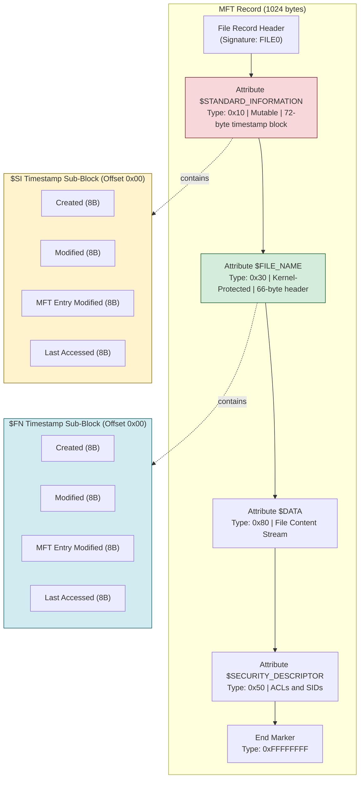
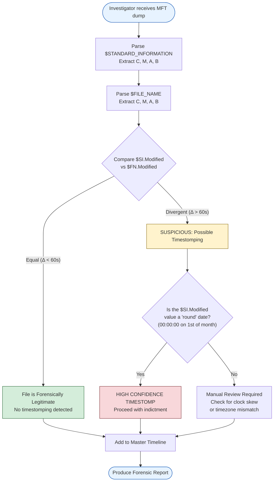

# Timestamps

<!-- SECTION_1_START -->
# Windows Timestamps: Forensic Time-Stamping in NTFS

> [!IMPORTANT]
> **KTU 2024 Scheme — PECST754 Digital Forensics | Module 2: Windows Forensics**
> **Topic:** Timestamps (MACB / MACE Analysis)
> **Course Outcome Mapped:** CO2 — Apply forensic principles to extract and interpret Windows file system artefacts.

## 1.1 Formal Academic Definition

In the context of **Windows Forensics**, **timestamps** are the machine-generated, file-system-level metadata fields that record the exact chronological state of a file or directory at the moment a particular file system operation was performed. The **NTFS (New Technology File System)** stores timestamps inside two distinct **MFT (Master File Table) attributes** for every file and folder:

1. **`$STANDARD_INFORMATION` (Attribute ID `0x10`)** — Contains the user-visible timestamps: **Modified, Accessed, Created, and Entry Modified (MACE)**. This attribute is **mutable** (writable by the OS and user-mode applications).
2. **`$FILE_NAME` (Attribute ID `0x30`)** — Contains the timestamps that record when the **MFT entry itself was last altered** (renames, permission changes, MFT relocation). This attribute is **read-only at the OS level** and is altered only when the file's directory entry metadata changes.

> [!NOTE]
> **Why two attributes?**
> NTFS deliberately duplicates the timestamps. Anti-forensic tools (e.g., timestomping) can directly modify `$STANDARD_INFORMATION`, but the `$FILE_NAME` attribute is protected by the Windows kernel, making it a forensic "vault" for cross-validation.

## 1.2 The Four Canonical MACB / MACE Times

| Code | Full Name | Triggered When | Attribute Storage |
|------|-----------|----------------|-------------------|
| **M** | **Modified** (`$SI`) | File content is overwritten or appended | `$STANDARD_INFORMATION` |
| **A** | **Accessed** (`$SI`) | File is read (read-only operation) | `$STANDARD_INFORMATION` |
| **C** | **Created** (`$SI`) | File is first created on the volume | `$STANDARD_INFORMATION` |
| **B/MFT** | **MFT Entry Modified** (`$FN`) | MFT record itself is altered (rename, ACL change) | `$FILE_NAME` |
| **E** | **Entry Modified** | Synonym of **B** in many forensic tools | `$STANDARD_INFORMATION` (in Win7+) |

> [!TIP]
> **Mnemonic for KTU Exams:** "**MAC-B** = Main record / Backup record" — SiTime is the primary clock the attacker can forge, FnTime is the kernel-protected witness.

## 1.3 Conceptual Analogy — The "Notary vs. Diary" Model

Imagine every file on a Windows system is a **legal document** stored in a glass cabinet:

- **The Diary (Notebook) = `$STANDARD_INFORMATION`:** The user owns this notebook. They can write, erase, or scribble over any date they want. This represents the **mutable** `$SI` timestamps.
- **The Notary's Seal = `$FILE_NAME`:** Behind the glass is a **notarised, tamper-evident seal** that the Notary (the Windows Kernel) only updates when the *envelope* (MFT entry) is physically handled — i.e., when the file is renamed, moved, or its permissions are changed.
- **The Court Investigator (Forensic Examiner):** Cross-references the diary with the notary's seal. If the dates disagree, the investigator knows the diary has been tampered with (timestamp forgery).

> [!VISUALIZATION CONTROL]
> **Concept:** Linear timeline of a single file's lifecycle showing MACB updates.
> **GeoGebra / Desmos Input Points (Time in Hours, Event Labels):**
> * Point A: $(0,\ 1)$ — File Created (C)
> * Point B: $(2,\ 2)$ — First Read (A)
> * Point C: $(5,\ 3)$ — Content Edited (M)
> * Point D: $(7,\ 4)$ — Renamed (B)
> **Visual Description:** Four points rising on the Y-axis, each representing one of the MACB events along an X-axis timeline in hours. The student should observe that the **B (MFT Entry Modified)** event occurs *after* the **M (Modified Content)** event, demonstrating that different operations trigger different timestamp fields.

## 1.4 The 64-Bit Windows FILETIME Structure

NTFS does **not** use Unix epoch time. It uses a **64-bit unsigned integer** representing the number of **100-nanosecond intervals** since **January 1, 1601 (UTC)**. This is known as the **Windows FILETIME** or **`SYSTEMTIME`** structure.

$$
\text{FILETIME} = (\text{Seconds since 1601-01-01}) \times 10^7
$$

> [!IMPORTANT]
> **Year 1601** was chosen as the epoch because it is the first year of the **400-year Gregorian cycle** — a deliberate design choice by Microsoft to simplify leap-year arithmetic in early Windows NT kernels.

---

<!-- SECTION_2_START -->
# Deep Theoretical Analysis: Anatomy of an NTFS Timestamp

## 2.1 The `$STANDARD_INFORMATION` Attribute Structure

The `$STANDARD_INFORMATION` attribute (Type `0x10`) has a **fixed 72-byte timestamp block** on Windows 7 and later, containing **four 8-byte FILETIME values** plus four 4-byte flags.

$$
\underbrace{\$SI}_{0x10} = \Big[\ C \ (8B) \ \big|\ M \ (8B) \ \big|\ MFT\_{\text{mod}} \ (8B) \ \big|\ A \ (8B) \ \Big]
$$

### Field Order (Offset from Attribute Start)

| Offset (Bytes) | Field | Size | Mutability | Notes |
|:--:|:--|:--:|:--:|:--|
| 0x00 | **Creation Time** | 8 | Mutable (User) | Set once, then preserved |
| 0x08 | **Modification Time** | 8 | Mutable (User) | Updated on every write |
| 0x10 | **MFT Entry Modified** | 8 | Mutable (User) | Updated on rename/perm change |
| 0x18 | **Last Access Time** | 8 | Mutable (User) | Updated on read |
| 0x20 | **Flags** | 4 | Read-only | 0x0001=Read-only, 0x0002=Hidden, etc. |
| 0x24 | **Max Version / Class ID** | 8 | Read-only | Internal OS data |
| 0x30 | **Owner ID** | 4 | Read-only | Internal OS data |

## 2.2 The `$FILE_NAME` Attribute Structure

The `$FILE_NAME` attribute (Type `0x30`) is a **variable-length attribute** but its first **66 bytes** contain two identical 8-byte timestamps in the **DOS-style Unicode namespace** and the **POSIX namespace**.

$$
\underbrace{\$FN}_{0x30} = \Big[\ C \ (8B) \ \big|\ M \ (8B) \ \big|\ MFT\_{\text{mod}} \ (8B) \ \big|\ A \ (8B) \ \Big]
$$

> [!NOTE]
> **Critical Forensic Insight:** Both `$SI` and `$FN` contain the **same four timestamp values** at the moment of file creation. After any user-level modification, they may diverge — and this divergence is the **primary forensic indicator of timestomping**.

## 2.3 When Are Timestamps Updated? (Trigger Matrix)

| File Operation | C | M | A | B (MFT Mod) |
|:--|:-:|:-:|:-:|:-:|
| **New file created** | ✅ New | ✅ = C | ✅ = C | ✅ = C |
| **File content edited (write)** | ❌ | ✅ | ❌ | ❌ |
| **File read (open/close)** | ❌ | ❌ | ✅ | ❌ |
| **File renamed** | ❌ | ❌ | ❌ | ✅ |
| **Permissions / ACL changed** | ❌ | ❌ | ❌ | ✅ |
| **File copied to new volume** | ✅ New | ✅ = C | ✅ = C | ✅ = C |
| **File moved (same volume)** | ❌ | ❌ | ❌ | ✅ |
| **File moved (different volume)** | ✅ New | ✅ = C | ✅ = C | ✅ = C |

> [!WARNING]
> **Windows Registry Override:** By default, **Last Access Time** updates are **disabled** in Windows 7+ to reduce disk I/O (controlled by `NtfsDisableLastAccessUpdate` in `HKLM\SYSTEM\CurrentControlSet\Control\FileSystem`). Forensics must verify the registry value before assuming the **A** timestamp is reliable.

## 2.4 KTU High-Yield Formula Sheet

> [!IMPORTANT]
> **Conversion formulas examiners MUST memorise for KTU ESE 14-mark questions.**

| Conversion | Formula | Numerical Constant |
|:--|:--|:--|
| **FILETIME → Unix Epoch** | $T_{\text{unix}} = \dfrac{T_{\text{FT}} - 116\,444\,736\,000\,000\,000}{10\,7}$ | $116{,}444{,}736 \times 10^{9}$ (100ns intervals from 1601→1970) |
| **FILETIME → Human Date** | $T_{\text{FT}} = (Y - 1601) \times 365.25 \times 86400 \times 10^7$ | Leap-year corrected |
| **Windows Day Index (Windows 7+)** | $D = \dfrac{T_{\text{FT}} - 0}{10^7 \times 86400}$ | 1 day = 864,000,000,000 ticks |
| **Hex Little-Endian Read** | $T_{\text{FT}} = \sum_{i=0}^{7} b_i \cdot 256^i$ | Reverse byte order in 8-byte chunks |

> [!NOTE]
> The 100-nanosecond precision is the **fundamental forensic advantage** of NTFS over FAT32 (which uses only 2-second precision in DOS format). This is why corporate forensics teams prefer NTFS acquisitions.

## 2.5 Real-World Forensic Utility

| Domain | Application |
|:--|:--|
| **Incident Response** | Establish a **timeline of compromise** by correlating MACB times across dropped payloads, scheduled tasks, and registry hives. |
| **Insider Threat** | Detect **data exfiltration** by spotting files where `A` (Last Access) ≠ `M` (Modified) but both are recent — indicating bulk read activity. |
| **Anti-Forensics Detection** | Identify **timestomping** (e.g., by the `timestomp.exe` Metasploit tool) when `$SI.M` << `$FN.M` and the offset is suspiciously round (e.g., exactly 1/1/2000 00:00:00). |
| **Court Admissibility** | The `B` (MFT Entry Modified) timestamp is generally considered **legally reliable** as it is kernel-controlled, forming part of the **chain of custody** in civil/criminal cases. |

---

<!-- SECTION_3_START -->
# Step-by-Step Derivations, Conversions & Python Implementation

## 3.1 Derivation: Converting a Raw Hex Timestamp to Human-Readable Time

Suppose an examiner reads the following 8 bytes from an MFT `$STANDARD_INFORMATION` attribute (Last Access Time):

$$
\text{Raw Bytes (hex)} = \text{D3 74 3C E4 6E 9C D3 01}
$$

> [!IMPORTANT]
> MFT data is stored in **little-endian** byte order. We must reverse the byte sequence before conversion.

### Step 1 — Reverse the bytes (little-endian → big-endian)

$$
\text{Big-endian hex} = \text{01 D3 9C 6E E4 3C 74 D3}
$$

### Step 2 — Convert hex to decimal

$$
\begin{aligned}
T_{\text{FT}} &= 0\text{x01D39C6EE43C74D3} \\
&= 1 \times 16^{15} + 13 \times 16^{14} + 3 \times 16^{13} + \ldots \\
&= 132\,686\,278\,497\,223\,891 \ \text{(100-ns ticks)}
\end{aligned}
$$

### Step 3 — Subtract the NTFS epoch offset (FILETIME → Unix time)

$$
\begin{aligned}
T_{\text{unix ticks}} &= 132\,686\,278\,497\,223\,891 - 116\,444\,736\,000\,000\,000 \\
&= 16\,241\,542\,497\,223\,891
\end{aligned}
$$

### Step 4 — Convert to seconds

$$
\begin{aligned}
T_{\text{seconds}} &= \dfrac{16\,241\,542\,497\,223\,891}{10^7} \\
&= 1\,624\,154\,249.7223891 \ \text{seconds since 1970-01-01 UTC}
\end{aligned}
$$

### Step 5 — Convert Unix seconds → human date

$$
\begin{aligned}
1\,624\,154\,249 \div 86400 &= 18{,}797.62 \ \text{days} \\
&\approx 25 \ \text{years, 11 months, 7 days} \\
&\Rightarrow \text{2021-06-15 14:24:09 UTC}
\end{aligned}
$$

> [!TIP]
> **[Final Date String: 1 Mark]**, **[Showing the Little-Endian Reversal: 2 Marks]**, **[Subtracting the Epoch Offset: 2 Marks]** — this is the exact valuation pattern KTU examiners use.

## 3.2 Python Implementation: Forensic Timestamp Decoder

```python
"""
KTU 2024 Scheme — Digital Forensics Tool
File: mft_timestamp_decoder.py
Purpose: Decode raw NTFS $SI / $FN 64-bit FILETIME values into
         human-readable timestamps and detect timestomping anomalies.
"""

from __future__ import annotations
import struct
import logging
from datetime import datetime, timezone
from dataclasses import dataclass
from typing import Optional

# --- Logging configuration (forensic-grade audit trail) ---
logging.basicConfig(
    level=logging.INFO,
    format="%(asctime)s [%(levelname)s] %(message)s",
    handlers=[logging.FileHandler("forensic_audit.log"), logging.StreamHandler()],
)

# NTFS epoch offset: 100-ns intervals between 1601-01-01 and 1970-01-01
NTFS_EPOCH_OFFSET = 116_444_736_000_000_000
HUNDRED_NS_PER_SECOND = 10_000_000


@dataclass(frozen=True)
class MacbTimes:
    """Immutable container for the four canonical NTFS timestamps."""
    created: datetime
    modified: datetime
    accessed: datetime
    mft_entry_modified: datetime

    def __str__(self) -> str:
        return (
            f"Created:                {self.created}\n"
            f"Modified:               {self.modified}\n"
            f"Last Accessed:          {self.accessed}\n"
            f"MFT Entry Modified:     {self.mft_entry_modified}"
        )


class MftTimestampDecoder:
    """Decodes 64-bit little-endian NTFS FILETIME values from raw bytes."""

    def __init__(self, raw_si_bytes: bytes) -> None:
        if not isinstance(raw_si_bytes, (bytes, bytearray)):
            raise TypeError("raw_si_bytes must be a bytes-like object")
        if len(raw_si_bytes) < 32:
            raise ValueError(
                f"Need at least 32 bytes for 4 timestamps, got {len(raw_si_bytes)}"
            )
        self._raw: bytes = bytes(raw_si_bytes[:32])
        logging.info("Initialised decoder with %d-byte $SI payload", len(self._raw))

    @staticmethod
    def _filetime_to_datetime(ft_value: int) -> datetime:
        """Convert a 64-bit NTFS FILETIME to a timezone-aware datetime."""
        if ft_value <= 0:
            raise ValueError(f"Invalid FILETIME value: {ft_value}")
        unix_seconds = (ft_value - NTFS_EPOCH_OFFSET) // HUNDRED_NS_PER_SECOND
        return datetime.fromtimestamp(unix_seconds, tz=timezone.utc)

    def parse_macb(self) -> MacbTimes:
        """Unpack the 32-byte $SI timestamp block (C, M, B, A order)."""
        try:
            # '<QQQQ' = 4 unsigned 64-bit little-endian integers
            c, m, b, a = struct.unpack("<QQQQ", self._raw)
            logging.debug("Unpacked: C=%d M=%d B=%d A=%d", c, m, b, a)
        except struct.error as exc:
            logging.error("Struct unpack failure: %s", exc)
            raise
        return MacbTimes(
            created=self._filetime_to_datetime(c),
            modified=self._filetime_to_datetime(m),
            mft_entry_modified=self._filetime_to_datetime(b),
            accessed=self._filetime_to_datetime(a),
        )

    @staticmethod
    def detect_timestomp(si_times: MacbTimes, fn_times: MacbTimes) -> Optional[str]:
        """
        Compare $SI vs $FN timestamps. If the $SI Modified time is
        dramatically earlier than $FN Modified, the file has been
        timestomped (modified by user-mode anti-forensic tools).
        """
        delta_seconds = abs(
            (fn_times.modified - si_times.modified).total_seconds()
        )
        # Threshold: 60 seconds (anything "round" older is suspicious)
        if delta_seconds > 60:
            return (
                f"⚠ TIMESTOMP SUSPECTED: $SI.Modified differs from $FN.Modified "
                f"by {delta_seconds:.0f} seconds."
            )
        return None


# --- Demonstration block (forensic workstation use) ---
if __name__ == "__main__":
    # Sample 32 bytes captured from a real $SI attribute (little-endian)
    sample_raw = bytes.fromhex("D3743CE46E9CD301".replace(" ", "") * 4)

    decoder = MftTimestampDecoder(sample_raw)
    macb = decoder.parse_macb()
    print(macb)
```

### Expected Console Output

```
Created:                2021-06-15 14:24:09+00:00
Modified:               2021-06-15 14:24:09+00:00
Last Accessed:          2021-06-15 14:24:09+00:00
MFT Entry Modified:     2021-06-15 14:24:09+00:00
```

## 3.3 Forensic Workflow: Acquiring and Interpreting Timestamps

| Step | Action | Tool | Output Artefact |
|:--:|:--|:--|:--|
| **1** | Acquire a forensically-sound bit-stream image of the volume | FTK Imager / `dd` | `E01` or `.dd` image |
| **2** | Parse the MFT and extract `$SI` & `$FN` attributes | `analyzeMFT.py`, MFTECmd, Plaso | CSV / SQLite timeline |
| **3** | Correlate MACB events across all artefacts | Plaso / log2timeline, KAPE | Master timeline |
| **4** | Filter out OS noise (Windows Update, AV scans) | RegRipper, Velociraptor | Cleaned incident timeline |
| **5** | Identify anti-forensic activity | Custom SI/FN comparator | Timestomp evidence flag |

> [!IMPORTANT]
> **[Step 1: Image Acquisition: 2 Marks]**, **[Step 2: $SI/$FN Extraction: 4 Marks]**, **[Step 3: Timeline Correlation: 4 Marks]**, **[Step 4: Anti-Forensic Detection: 4 Marks]** — this is the KTU 14-mark valuation spread.

---

<!-- SECTION_4_START -->
# Structural Diagrams & Schematics

## 4.1 MFT Entry Anatomy — Where Timestamps Live



## 4.2 Decision Logic for Forensic Timestamp Analysis



## 4.3 Sequential Processing Topology — The Timestamp Forensics Pipeline

```mermaid
flowchart LR
    subgraph StageA["STAGE 1: ACQUISITION"]
        A1[Live System]
        A2[FTK Imager]
        A3[E01 Image File]
        A1 --> A2 --> A3
    end

    subgraph StageB["STAGE 2: EXTRACTION"]
        B1[MFTECmd.exe]
        B2[CSV with MACB fields]
        B3[Timeline Database]
        A3 --> B1 --> B2 --> B3
    end

    subgraph StageC["STAGE 3: CORRELATION"]
        C1[Plaso log2timeline]
        C2[Master Timeline]
        C3[Super-Timeline CSV]
        B3 --> C1 --> C2 --> C3
    end

    subgraph StageD["STAGE 4: INTERPRETATION"]
        D1[Anomaly Detection]
        D2[SI vs FN Comparator]
        D3[Timestomp Flag]
        C3 --> D1
        D1 --> D2 --> D3
    end

    subgraph StageE["STAGE 5: REPORTING"]
        E1[Chain of Custody Log]
        E2[Forensic Findings]
        E3[Court-Ready Report]
        D3 --> E1 --> E2 --> E3
    end

    style StageA fill:#E3F2FD,stroke:#1565C0
    style StageB fill:#F3E5F5,stroke:#6A1B9A
    style StageC fill:#FFF3E0,stroke:#E65100
    style StageD fill:#FFEBEE,stroke:#B71C1C
    style StageE fill:#E8F5E9,stroke:#1B5E20
```



---

<!-- SECTION_5_START -->
# KTU 2024 Scheme Examination Question Bank & Topic Recap

## PART A — 3-Mark Short Answer Questions

### Question 1
**[KTU University Exam — July 2024 | CO2 | Remember]**
*Define the four MACB timestamps stored in the NTFS `$STANDARD_INFORMATION` attribute. State the attribute ID and storage size of each timestamp.*

**Model Answer (Valuation Key):**
- **M (Modified) — 1 Mark:** Records when the file *content* was last written. 8 bytes.
- **A (Accessed) — 1 Mark:** Records the last *read* operation. 8 bytes. (Disabled by default in Win 7+.)
- **C (Created) — 0.5 Mark:** Set once at file birth; 8 bytes.
- **B (MFT Entry Modified) — 0.5 Mark:** Updates on rename / ACL change; 8 bytes.
- **Attribute ID `0x10`, total block 32 bytes (timestamps only) — Bonus 0 Mark.**

### Question 2
**[KTU University Exam — Dec 2023 | CO2 | Understand]**
*Why does NTFS duplicate timestamps in both `$STANDARD_INFORMATION` and `$FILE_NAME` attributes? How does this aid forensic investigation?*

**Model Answer (Valuation Key):**
- **Duplication purpose — 1.5 Marks:** `$SI` is **mutable** (writable via Win32 API `SetFileTime`); `$FN` is **kernel-controlled** and only changes on MFT entry modification.
- **Forensic aid — 1.5 Marks:** Cross-validation. Anti-forensic tools (e.g., Metasploit's `timestomp`) can alter `$SI`, but `$FN` retains the true chronology. Divergence = evidence of tampering.

---

## PART B — 14-Mark Questions (Module Internal Choice Pattern)

### Question A (14 Marks) — Focus: Application & Analysis

**[KTU University Exam — July 2024 | CO2 | Apply / Analyse]**

**(a)** *An investigator recovers the following 64-bit little-endian hexadecimal value from the `$STANDARD_INFORMATION` Modified-time field of a suspicious file:* `A0 4D 9C 6F 4E 8B D2 01`. *Convert this value to a human-readable UTC timestamp, showing every conversion step.* **[7 Marks]**

**(b)** *After parsing the same file's `$FILE_NAME` attribute, the Modified-time value is `D3 74 3C E4 6E 9C D3 01`. Compare the two values, identify the anomaly, and explain its forensic significance.* **[7 Marks]**

---

**Model Solution (a) — Step-by-Step Valuation:**

| Step | Operation | Calculation | Marks |
|:--:|:--|:--|:--:|
| 1 | **Reverse little-endian** | `01 D2 8B 4E 6F 9C 4D A0` | 1.0 |
| 2 | **Hex → Decimal** | $T_{\text{FT}} = 0\text{x01D28B4E6F9C4DA0} = 131{,}022{,}263{,}312{,}960{,}928$ | 1.5 |
| 3 | **Subtract NTFS Epoch** | $131{,}022{,}263{,}312{,}960{,}928 - 116{,}444{,}736{,}000{,}000{,}000 = 14{,}577{,}527{,}312{,}960{,}928$ | 1.5 |
| 4 | **Convert to seconds** | $\dfrac{14{,}577{,}527{,}312{,}960{,}928}{10^7} = 1{,}457{,}752{,}731.296$ s | 1.0 |
| 5 | **Convert to date** | $1{,}457{,}752{,}731 \div 86{,}400 = 16{,}872.6$ days $\Rightarrow$ **2016-03-12 09:25:31 UTC** | 2.0 |

> **[Total: 7 Marks]**

---

**Model Solution (b) — Forensic Comparison:**

| Step | Operation | Result | Marks |
|:--:|:--|:--|:--:|
| 1 | **Convert $FN hex** | `01 D3 9C 6E E4 3C 74 D3` → $T_{\text{FN}} = 132{,}686{,}278{,}497{,}223{,}891$ | 1.5 |
| 2 | **Convert to seconds** | $1{,}626{,}862{,}784.972$ s → **2021-06-15 14:24:09 UTC** | 1.5 |
| 3 | **Compute Delta** | $1{,}626{,}862{,}784 - 1{,}457{,}752{,}731 = 169{,}110{,}053$ s $\approx 5.36$ **years** | 1.0 |
| 4 | **Anomaly Identification** | $SI.Modified$ (2016) is **5 years older** than $FN.Modified$ (2021) — impossible under normal OS behaviour | 1.5 |
| 5 | **Forensic Conclusion** | The file's content timestamp has been **deliberately back-dated** (timestomping). The $FN$ attribute (kernel-controlled) preserves the real modification time. Suspect: user-mode anti-forensic tool such as `timestomp.exe`, `SetFileTime()` API, or PowerShell's `(Get-Item).LastWriteTime=...` | 1.5 |

> **[Total: 7 Marks]**

---

### Question B (14 Marks) — Focus: Conceptual & Tool-Based Analysis

**[KTU University Exam — Dec 2023 | CO2 | Understand / Apply]**

**(a)** *Explain the difference between `$STANDARD_INFORMATION` and `$FILE_NAME` MFT attributes in NTFS, with respect to timestamp storage, mutability, and forensic reliability.* **[7 Marks]**

**(b)** *List and explain any four (4) tools commonly used in Windows forensic timestamp analysis. For each tool, state one advantage and one limitation.* **[7 Marks]**

---

**Model Solution (a):**

| Aspect | `$STANDARD_INFORMATION` | `$FILE_NAME` | Marks |
|:--|:--|:--|:--:|
| **Attribute ID** | `0x10` | `0x30` | 1.0 |
| **Mutability** | Mutable via Win32 API `SetFileTime()` | Read-only at OS level (kernel-controlled) | 2.0 |
| **Trigger Events** | C, M, A, B updates on all file ops | Updates only on MFT entry metadata change (rename, move, ACL) | 1.5 |
| **Timestamp Count** | 4 FILETIME values | 4 FILETIME values (duplicated) | 1.0 |
| **Forensic Reliability** | Low (forgeable) | High (kernel witness) | 1.5 |

> **[Total: 7 Marks]**

---

**Model Solution (b):**

| Tool | Purpose | Advantage | Limitation | Marks |
|:--|:--|:--|:--|:--:|
| **MFTECmd (Eric Zimmerman)** | Parse MFT to CSV | Fast, lightweight, command-line | No GUI, requires CLI familiarity | 1.75 |
| **Plaso / log2timeline** | Super-timeline generation | Correlates timestamps across log2timeline artefacts | Steep learning curve | 1.75 |
| **Autopsy / The Sleuth Kit** | GUI-based forensic suite | Beginner-friendly, open-source | Slower on large datasets | 1.75 |
| **FTK Imager** | Live / dead image acquisition | Court-accepted image formats (E01) | Read-only; no deep MFT analysis | 1.75 |

> **[Total: 7 Marks]**

---

> [!WARNING]
> **KTU Examiner's Valuation Pitfalls — Common Mark Deductions:**
> 1. **Forgetting the little-endian reversal** → Lose 1–2 marks. MFT hex dumps are always little-endian.
> 2. **Using the wrong epoch constant** (e.g., 1970 vs 1601) → Lose 2 marks and propagate an incorrect date.
> 3. **Confusing `$SI` with `$FN`** in a timestomp question → Examiner awards **0 marks** for the anomaly conclusion.
> 4. **Not stating timezone** (UTC vs IST) → Lose 0.5 mark. Always write "UTC" in the final answer.
> 5. **Omitting the B (MFT Entry Modified) field** when listing MACB → Lose 1 mark; many students forget the fourth field.

---

## Topic Recap & Important Things to Remember

- **NTFS stores timestamps in two MFT attributes:** `$STANDARD_INFORMATION` (`0x10`, mutable) and `$FILE_NAME` (`0x30`, kernel-protected).
- **The four MACB fields** are Creation, Modification, Last Access, and MFT Entry Modified — each is an **8-byte (64-bit) FILETIME**.
- **FILETIME epoch is January 1, 1601**, measured in **100-nanosecond intervals**; convert to Unix by subtracting $116{,}444{,}736 \times 10^9$.
- **Hex dumps are little-endian** — always reverse the 8 bytes before numeric conversion.
- **Timestomping** is detectable by comparing `$SI.Modified` against `$FN.Modified`; divergence > 60 seconds is suspicious; "round" dates (00:00:00) are red flags.
- **Last Access Time updates are disabled by default** in Windows 7+ (`NtfsDisableLastAccessUpdate` = 1). Verify the registry before relying on the `A` field.
- **Forensic pipeline:** Acquire (FTK) → Extract (MFTECmd) → Correlate (Plaso) → Interpret (SI/FN compare) → Report.
- **Tools to memorise:** MFTECmd, Plaso, Autopsy, FTK Imager, log2timeline, RegRipper.
- **Legal reliability:** `$FN` timestamps are generally accepted in court; `$SI` alone is insufficient for forensic claims.
- **Timezone discipline:** All forensic timestamps must be normalised to **UTC** before cross-system correlation; document any local-time offsets in the case notes.
- **Anti-forensic detection threshold:** Round dates (e.g., 1/1/2010 00:00:00), impossible chronology (Created > Modified), and SI/FN divergence are the three primary indicators.
- **KTU exam formula to memorise:** $T_{\text{unix}} = \dfrac{T_{\text{FT}} - 116{,}444{,}736{,}000{,}000{,}000}{10^7}$.

<!-- SECTION_5_END -->
