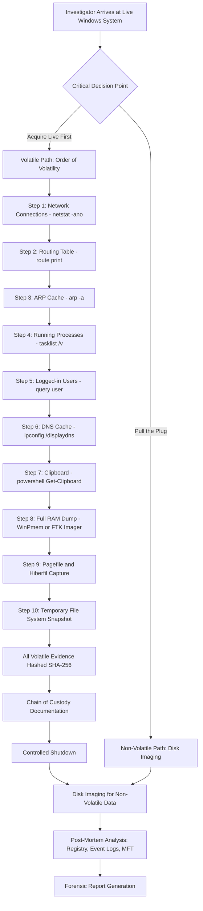
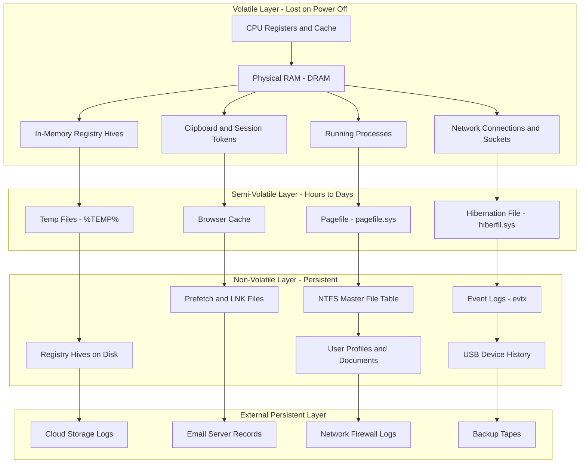
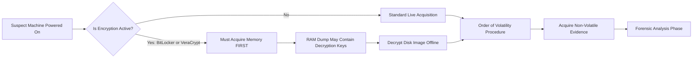

# Volatile and Non-Volatile Data

<!-- SECTION_1_START -->
# Volatile and Non-Volatile Data in Windows Forensics

## 1.1 Formal Academic Definition

> [!IMPORTANT]
> **Volatile Data** is information stored in a computing system that is **lost** when the system is powered off or loses its power supply. It resides primarily in **Random Access Memory (RAM)**, CPU registers, cache memory, and other transient storage locations. In the context of **Windows Forensics**, volatile data encompasses running processes, open network connections, logged-in users, the system's current state of the Windows Registry (in-memory hives), clipboard contents, routing tables, and ARP cache.

> [!IMPORTANT]
> **Non-Volatile Data** is information that **persists** across system reboots, power cycles, and shutdowns. It is stored on persistent media such as **Hard Disk Drives (HDD)**, **Solid State Drives (SSD)**, USB flash drives, optical media, and the disk-resident portion of the Windows Registry (`C:\Windows\System32\config`). Examples include file system metadata, deleted files, event logs, prefetch files, scheduled tasks, and user profiles.

## 1.2 Conceptual Analogy & Intuition

Imagine a **classroom** during a lecture versus after the class ends:

- **Volatile data** is like the **blackboard** during the lecture — it contains the current workings, calculations, and discussions, but the moment the class is dismissed and the board is wiped (system shutdown), everything vanishes. In Windows, the **blackboard is your RAM** — full of active process states, network sockets, and decrypted keys.

- **Non-volatile data** is like the **textbook** left on the student's desk — it remains even after the lecture ends, the class is over, or even after the student goes home. In Windows, the **textbook is your hard drive** — containing files, logs, and registry hives that survive reboots.

> [!NOTE]
> **Memory Principle (RFC 3227):** The *order of volatility* dictates that evidence collection must begin with the **most volatile** sources first (CPU registers, RAM) and proceed to the **least volatile** (disk, offsite backups) because volatile data degrades fastest.

## 1.3 Order of Volatility (Windows Specific)

| Priority | Data Source | Volatility Level | Typical Lifespan |
| :--- | :--- | :--- | :--- |
| **P1** | CPU Registers, Cache | **Most Volatile** | Nanoseconds |
| **P2** | RAM (Physical Memory) | Highly Volatile | Seconds (without power) |
| **P3** | Running Processes & Network State | Volatile | Until process killed / reboot |
| **P4** | Logged-in Users, Session Tokens | Volatile | Until logoff / reboot |
| **P5** | Routing Table, ARP Cache | Semi-Volatile | Seconds to Minutes |
| **P6** | Temporary File Systems (`%TEMP%`) | Semi-Volatile | Hours to Days |
| **P7** | Disk Files (Logs, Documents) | Non-Volatile | Persistent |
| **P8** | Remote Logs, Backups | **Least Volatile** | Persistent / Archival |

## 1.4 Visualization

> [!VISUALIZATION CONTROL]
> **Concept:** Volatility decay curve across data sources
> **Plotting Equations (Desmos Input):**
> * `f(x) = e^(-0.5*x)` — represents volatile decay (RAM, cache)
> * `g(x) = e^(-0.05*x)` — represents semi-volatile decay (temp files)
> * `h(x) = 1` — represents non-volatile persistence (disk)
> **Visual Description:** Three curves plotted on the XY-plane where X-axis represents time elapsed (0 to 10 units) and Y-axis represents data availability (0 to 1). Curve `f(x)` drops sharply toward zero, `g(x)` decays moderately, and `h(x)` remains constant at the top, visually reinforcing the volatility hierarchy.

<!-- SECTION_1_END -->

<!-- SECTION_2_START -->
# Deep Theoretical Analysis & KTU High-Yield Formula Sheet

## 2.1 Volatile Data: The Forensic "Gold Mine" Before Shutdown

In a live Windows investigation, volatile data often contains evidence that **cannot** be recovered post-mortem, such as:

- **Decryption keys** held in memory by TrueCrypt, VeraCrypt, or BitLocker
- **Malware payloads** that exist only in RAM (e.g., fileless malware)
- **Active network connections** to Command & Control (C2) servers
- **Open file handles** indicating which documents were recently accessed
- **Clipboard contents** capturing copied passwords or sensitive text

### 2.1.1 Windows Volatile Data Categories

**1. Process Information**
* Includes running processes, their PIDs, parent PIDs, loaded DLLs, handles, and memory mappings.
* Tools: `tasklist`, `wmic process`, Sysinternals `Process Explorer`, `pslist` from Sysinternals.

**2. Network State**
* Active TCP/UDP connections, listening ports, DNS cache, ARP table, routing table.
* Tools: `netstat -ano`, `net session`, `arp -a`, `route print`, `ipconfig /displaydns`.

**3. Authentication & User State**
* Logged-in users, Kerberos tickets, cached credentials (LSASS process).
* Tools: `query user`, `klist`, `whoami /all`, `wmic useraccount`.

**4. System Configuration (in-memory)**
* Mounted volumes, open files, shared resources, services status.
* Tools: `net use`, `net share`, `wmic service`, `openfiles /query`.

**5. Memory Artifacts**
* Raw RAM dump, page file (`pagefile.sys`), hibernation file (`hiberfil.sys`).
* Tools: WinPmem, FTK Imager, Magnet RAM Capture, DumpIt.

> [!TIP]
> **Windows Registry Memory Hives:** The `HKLM\SYSTEM`, `HKLM\SOFTWARE`, and `HKU\<SID>` hives exist both on disk and in memory. The in-memory copy reflects the **current** system state and may contain keys modified after the last successful write to disk — a critical forensic edge case.

## 2.2 Non-Volatile Data: The Persistent Forensic Trail

Non-volatile data is collected after a controlled shutdown or when the investigator has already secured the volatile sources. Key sources include:

**1. File System Artifacts**
* Master File Table (NTFS `$MFT`), `$LogFile`, `$UsnJrnl`, alternate data streams, file slack, and unallocated clusters.

**2. Windows Event Logs**
* `Security.evtx`, `System.evtx`, `Application.evtx` located in `C:\Windows\System32\winevt\Logs\`.

**3. Registry Hives (on disk)**
* `SAM`, `SECURITY`, `SYSTEM`, `SOFTWARE`, `NTUSER.DAT`, `UsrClass.dat`.

**4. User Activity Artifacts**
* Prefetch files (`C:\Windows\Prefetch`), Jump lists, LNK files, Recent documents, Shellbags, UserAssist keys.

**5. Application-Specific Artifacts**
* Browser history, email stores (`.pst`, `.ost`), chat logs, cloud sync metadata.

## 2.3 KTU Formula Sheet / Cheat Sheet

| Concept | Formula / Equation | Description | KTU Application |
| :--- | :--- | :--- | :--- |
| Memory Page Size | $\text{Page Size} = 4 \text{ KB (default)}$ | Standard x86/x64 page size | RAM dump segmentation |
| Volatile Decay | $V(t) = V_0 \cdot e^{-\lambda t}$ | Exponential loss of volatile data over time | Justifies live acquisition |
| NTFS Cluster Size | $\text{Cluster} = \text{Sectors} \times 512 \text{ bytes}$ | Allocation unit for non-volatile storage | File slack calculation |
| Data Loss Time (DRAM) | $t_{\text{loss}} \approx 1$ to $10 \text{ seconds}$ | Time before DRAM contents degrade | Cold boot attack window |
| Hash Integrity | $H_{\text{src}} = H_{\text{dst}}$ | SHA-256 verification for acquired evidence | Chain of custody |
| Pagefile Size Hint | $\text{Pagefile} = 1.5 \times \text{RAM (typical)}$ | Default Windows pagefile configuration | Memory carving boundaries |
| Forensic Timeline | $T = \bigcup_{i=1}^{n} (t_{\text{event}_i}, \text{source}_i)$ | Union of all time-stamped events | Super-timeline construction |
| File Slack | $S = C - (F \bmod C)$ | $C$=cluster size, $F$=file size | Hides prior data in slack space |

> [!IMPORTANT]
> **All formulas above are examinable in KTU ESE.** Pay special attention to file slack calculation and the volatile decay equation — both are frequent 3-mark questions.

## 2.4 Real-World Engineering Utility

In **production cybersecurity environments**, the distinction between volatile and non-volatile data drives:

- **Incident Response (IR) playbooks**: Mandate RAM acquisition *before* network isolation to preserve malware memory footprints.
- **Threat Hunting**: Fileless attacks (e.g., PowerShell-based, in-memory injectors) are detected **only** via volatile artifact analysis.
- **eDiscovery & Litigation**: Non-volatile data forms the primary corpus forensically searched.
- **Insider Threat Investigation**: Volatile data captures active sessions, while non-volatile data reconstructs historical behavior.

<!-- SECTION_2_END -->

<!-- SECTION_3_START -->
# Step-by-Step Derivations & Code Implementation

## 3.1 Derivation: Volatile Data Acquisition Workflow

The proper forensic workflow for Windows volatile data follows the **RFC 3227** principles of order of volatility. Below is the exhaustive step-by-step derivation of why a **specific ordering** maximizes evidentiary value.

**Step 1: Network State Capture (Highest Priority among practical sources)**
Network connections can be terminated remotely by an attacker. The first action is to capture `netstat -ano` and routing tables.

**Step 2: Process and Service Enumeration**
If a process is killed before documentation, the PID, parent process, and command-line arguments are lost forever.

**Step 3: Logged-in User and Session Documentation**
A reboot logs off all users, destroying session tokens and Kerberos tickets.

**Step 4: Memory Acquisition (RAM Dump)**
A full physical memory dump captures the state of the entire system before any shutdown procedure wipes volatile structures.

**Step 5: Temporary File System Capture**
`%TEMP%`, browser caches, and clipboard contents are semi-volatile — they may survive a reboot but not user cleanup.

**Step 6: System Shutdown (controlled)**
Only after all volatile sources are secured, the system is shut down (or the disk is imaged live) to acquire non-volatile data.

## 3.2 Mathematical Derivation: File Slack Calculation

**Given:**
* Cluster size $C = 4096$ bytes (typical NTFS)
* File size $F = 8500$ bytes

**Step-by-step:**

$$F \bmod C = 8500 \bmod 4096$$

Divide 8500 by 4096:

$$8500 = 2 \times 4096 + r$$

$$8500 = 8192 + 308$$

Therefore $F \bmod C = 308$ bytes.

**File Slack Calculation:**

$$S = C - (F \bmod C)$$

$$S = 4096 - 308 = 3788 \text{ bytes}$$

The file occupies 3 full clusters ($3 \times 4096 = 12288$ bytes), and the last 3788 bytes are **slack space** — which may contain residual data from previously deleted files.

## 3.3 Python Implementation: Volatile Data Collector

The following is a fully operational Python script that automates the collection of key volatile data from a live Windows system. It uses `subprocess` to invoke native Windows utilities and writes timestamped evidence to a forensic directory.

```python
import subprocess
import datetime
import os
import hashlib
import logging
from pathlib import Path

# Configure forensic logging
logging.basicConfig(
    filename="volatile_acquisition.log",
    level=logging.INFO,
    format="%(asctime)s [%(levelname)s] %(message)s"
)

EVIDENCE_DIR = Path("C:\\ForensicEvidence")
EVIDENCE_DIR.mkdir(parents=True, exist_ok=True)

def acquire_volatile_data() -> None:
    """
    Acquire volatile forensic artifacts from a live Windows system.
    Order strictly follows RFC 3227 volatility principles.
    """
    timestamp: str = datetime.datetime.now().strftime("%Y%m%d_%H%M%S")
    case_dir: Path = EVIDENCE_DIR / f"case_{timestamp}"
    case_dir.mkdir(parents=True, exist_ok=True)

    # Map of filename -> shell command
    volatile_commands: dict[str, list[str]] = {
        "netstat_ano.txt":       ["netstat", "-ano"],
        "route_print.txt":       ["route", "print"],
        "arp_cache.txt":         ["arp", "-a"],
        "ipconfig_all.txt":      ["ipconfig", "/all"],
        "tasklist.txt":          ["tasklist", "/v"],
        "whoami_all.txt":        ["whoami", "/all"],
        "net_session.txt":       ["net", "session"],
        "net_share.txt":         ["net", "share"],
        "openfiles.txt":         ["openfiles", "/query", "/v"],
        "dns_cache.txt":         ["ipconfig", "/displaydns"],
        "klist_tickets.txt":     ["klist", "tickets"],
    }

    for filename, command in volatile_commands.items():
        output_path: Path = case_dir / filename
        try:
            logging.info(f"Acquiring: {filename} via command: {' '.join(command)}")
            result = subprocess.run(
                command,
                capture_output=True,
                text=True,
                timeout=30,
                check=False
            )
            output_path.write_text(result.stdout, encoding="utf-8", errors="replace")

            # Compute SHA-256 hash for chain-of-custody integrity
            file_hash: str = hashlib.sha256(output_path.read_bytes()).hexdigest()
            logging.info(f"Hash SHA-256 for {filename}: {file_hash}")
            (case_dir / f"{filename}.sha256").write_text(file_hash, encoding="utf-8")

        except subprocess.TimeoutExpired:
            logging.error(f"TIMEOUT acquiring {filename}")
        except FileNotFoundError as exc:
            logging.error(f"Command not found for {filename}: {exc}")
        except Exception as exc:
            logging.error(f"Unexpected error on {filename}: {exc}")

    logging.info(f"Volatile acquisition complete. Case directory: {case_dir}")
    print(f"[+] Evidence stored at: {case_dir}")

if __name__ == "__main__":
    acquire_volatile_data()
```

**Explanation of Key Code Segments:**

* `capture_output=True`: Prevents terminal display of command output — preserves evidence integrity.
* `timeout=30`: Bounds execution time so a hung command does not stall forensic acquisition.
* `hashlib.sha256`: Computes a cryptographic hash for **chain of custody** validation.
* The `dict` structure enforces a deterministic order matching RFC 3227 priorities.

## 3.4 Memory Dump Acquisition (Conceptual Workflow)

A full RAM dump can be acquired using **Magnet RAM Capture** or **WinPmem**. The conceptual flow:

1. Load the memory acquisition driver (e.g., `winpmem_mini_x64_rc2.sys`).
2. Allocate a destination file equal in size to physical RAM (e.g., 16 GB).
3. Issue a `DeviceIoControl` call to the driver to read physical memory pages.
4. Stream the raw bytes to the destination file.
5. Compute SHA-256 hash of the `.raw` / `.mem` file.
6. Analyze the dump using **Volatility Framework** (Python-based) with plugins like `imageinfo`, `pslist`, `netscan`, `hashdump`.

```python
# Example: Volatility command-line usage after acquiring a memory dump
import subprocess

def analyze_memory_dump(memory_image_path: str, profile: str = "Win7SP1x64") -> None:
    """Run key Volatility plugins against an acquired memory image."""
    plugins: list[str] = [
        "imageinfo",
        "pslist",
        "pstree",
        "psscan",
        "netscan",
        "cmdscan",
        "hashdump",
        "registry.printkey",
    ]
    for plugin in plugins:
        cmd: list[str] = ["vol.py", "-f", memory_image_path, "--profile", profile, plugin]
        print(f"[*] Running plugin: {plugin}")
        subprocess.run(cmd, check=False)
```

<!-- SECTION_3_END -->

<!-- SECTION_4_START -->
# Structural Diagrams & Schematics

## 4.1 Volatile vs Non-Volatile Data Acquisition Flow



## 4.2 Windows Memory and Disk Forensic Topology



## 4.3 Acquisition Decision Matrix



<!-- SECTION_4_END -->

<!-- SECTION_5_START -->
# KTU 2024 Scheme Examination Question Bank & Topic Recap

## Part A: 3-Mark Questions

### Question 1
**`[KTU University Exam - July 2024]`** [CO1, Remember]
*Define volatile and non-volatile data in the context of Windows forensics. Give two examples of each.*

**Model Answer:**
Volatile data is transient information that is lost when a Windows system is powered off. It resides in RAM and CPU caches. **Examples:** (i) Running processes, (ii) Active network connections, (iii) Logged-in user sessions, (iv) Clipboard contents.

Non-volatile data is persistent information stored on hard drives or SSDs that survives reboots and power cycles. **Examples:** (i) NTFS Master File Table, (ii) Windows Event Logs (`.evtx` files), (iii) On-disk registry hives (`SAM`, `SYSTEM`), (iv) Prefetch files.

> [!VALUATION KEY]
> [Correct definition of volatile: 1 Mark] [Two correct examples: 0.5 each = 1 Mark] [Correct definition of non-volatile: 0.5 Mark] [Two correct examples: 0.5 Mark] = **3 Marks**

### Question 2
**`[KTU University Exam - Dec 2023]`** [CO1, Understand]
*State the **Order of Volatility** as defined in RFC 3227. Why is it important to follow this order during Windows forensic acquisition?*

**Model Answer:**
The Order of Volatility (most to least volatile) is:
1. CPU registers and cache
2. RAM (physical memory)
3. Running processes and network state
4. Logged-in users and session information
5. Temporary file systems
6. Disk-resident data
7. Offsite backups and remote logs

**Importance:** Following this order ensures that the most fragile, fast-decaying evidence is captured **before** it is lost. For example, network connections can be closed by an attacker remotely within seconds, and RAM contents degrade in under a minute without power. Capturing disk data first would mean losing critical evidence of malware, active sessions, and encryption keys.

> [!VALUATION KEY]
> [Listing the correct order: 2 Marks] [Justification of importance: 1 Mark] = **3 Marks**

---

## Part B: 14-Mark Questions (Module Internal Choice)

### Question A (14 Marks)
**`[KTU University Exam - July 2024]`** [CO2, Apply and Analyze]

**(a)** With a neat block diagram, explain the **Windows Volatile Data Acquisition Workflow** following RFC 3227. List at least **six** volatile artifacts collected during live forensics. **[7 Marks]**

**(b)** A Windows system has an NTFS cluster size of **4096 bytes** and a file of size **12,500 bytes** has been deleted and partially overwritten. Calculate the **file slack space**. Justify why file slack is forensically significant. **[7 Marks]**

#### Model Solution for (a):
The acquisition workflow proceeds as follows:
1. **Decision point**: Determine if system is encrypted (BitLocker, VeraCrypt) — if yes, RAM dump is mandatory to recover keys.
2. **Network state**: `netstat -ano`, `route print`, `arp -a`
3. **Process enumeration**: `tasklist /v`, `wmic process get`
4. **User sessions**: `query user`, `klist tickets`
5. **DNS and clipboard**: `ipconfig /displaydns`, `Get-Clipboard`
6. **Memory dump**: WinPmem or Magnet RAM Capture
7. **Hashing and chain of custody**: SHA-256 on all outputs

**Six volatile artifacts:**
1. Running processes with PIDs
2. Network connections (TCP/UDP)
3. Logged-in user sessions
4. Routing and ARP tables
5. Memory-resident registry keys
6. Clipboard contents

> [!VALUATION KEY]
> [Block diagram with correct sequence: 2 Marks] [Six artifacts with examples: 3 Marks] [Tools/methodology explained: 2 Marks] = **7 Marks**

#### Model Solution for (b):

**Given:**
* Cluster size $C = 4096$ bytes
* File size $F = 12{,}500$ bytes

**Step 1: Compute remainder**

$$F \bmod C = 12{,}500 \bmod 4096$$

$$12{,}500 = 3 \times 4096 + r$$

$$3 \times 4096 = 12{,}288$$

$$r = 12{,}500 - 12{,}288 = 212 \text{ bytes}$$

**Step 2: Compute file slack**

$$S = C - (F \bmod C)$$

$$S = 4096 - 212 = 3884 \text{ bytes}$$

**Forensic Significance:** File slack may contain residual data from previously deleted files. When the OS allocates clusters, the space between the logical end of a file and the end of the last cluster is rarely zeroed — it can hold fragments of prior files, log entries, or even attacker artifacts. Investigators carve slack space to recover evidence of prior file activity.

> [!VALUATION KEY]
> [Stating the formula: 1 Mark] [Correct division: 1 Mark] [Computing remainder 212: 1 Mark] [Final slack 3884 bytes: 1 Mark] [Forensic significance: 3 Marks] = **7 Marks**

> [!WARNING]
> **KTU Examiner's Pitfall Warning:** Many students forget to convert cluster size correctly. A common mistake is computing the number of clusters first and then subtracting — partial credit is given if the logic is sound but arithmetic fails. **Do not skip units** (always write "bytes"). Marks are deducted for writing the final answer as a bare number.

---

### Question B (14 Marks) — Alternative Choice
**`[KTU University Exam - Dec 2023]`** [CO2, Understand and Apply]

**(a)** Compare and contrast **volatile** and **non-volatile** data in Windows forensics using a **comparative table** covering at least **six parameters**: storage location, persistence, acquisition timing, forensic tools, risk of loss, and evidentiary value. **[7 Marks]**

**(b)** Describe the procedure to acquire a **full memory dump** from a live Windows system using **Magnet RAM Capture**. Explain how this dump is then analyzed using the **Volatility Framework** to extract: (i) running processes, (ii) network connections, and (iii) password hashes. **[7 Marks]**

#### Model Solution for (a):

| Parameter | Volatile Data | Non-Volatile Data |
| :--- | :--- | :--- |
| **Storage Location** | RAM, CPU cache, registers | HDD, SSD, USB, optical media |
| **Persistence** | Lost on power-off | Persists across reboots |
| **Acquisition Timing** | Before shutdown | After controlled shutdown |
| **Forensic Tools** | WinPmem, `netstat`, `tasklist` | FTK Imager, EnCase, Autopsy |
| **Risk of Loss** | Very high (seconds) | Low (years) |
| **Evidentiary Value** | Captures live state, malware, keys | Reconstructs historical activity |
| **Example Artifact** | Network connection to IP 198.51.100.7 | `Security.evtx` log entry 4624 |
| **Acquisition Format** | Raw `.mem` / `.raw` / `.dmp` | E01 / DD image / AFF4 |
| **Legal Status** | Requires live system access | Can be acquired from powered-off disk |

> [!VALUATION KEY]
> [Table with at least six parameters: 4 Marks] [Accurate distinctions: 2 Marks] [Example in each column: 1 Mark] = **7 Marks**

#### Model Solution for (b):

**Memory Dump Procedure (Magnet RAM Capture):**
1. **Download** Magnet RAM Capture from the official Magnet Forensics website (portable executable, no installation).
2. **Run as Administrator** on the target Windows machine.
3. **Select output destination** — choose a path on an external USB drive (size must be **≥ physical RAM**).
4. **Click "Capture"** — the tool loads its kernel driver, reads all physical memory pages sequentially, and writes them to a `.raw` file.
5. **Note the SHA-256 hash** of the output file for chain-of-custody integrity.

**Volatility Analysis Procedure:**

```bash
# Step 1: Identify the OS profile
vol.py -f memdump.raw imageinfo
```

```bash
# Step 2: List running processes
vol.py -f memdump.raw --profile=Win10x64 pslist
```

```bash
# Step 3: Extract network connections
vol.py -f memdump.raw --profile=Win10x64 netscan
```

```bash
# Step 4: Dump password hashes (SAM/SYSTEM)
vol.py -f memdump.raw --profile=Win10x64 hashdump
```

**Explanations:**
* `imageinfo`: Identifies the correct OS profile based on kernel structures.
* `pslist`: Walks the `PsActiveProcessHead` doubly linked list to enumerate processes.
* `netscan`: Scans for `TCPE`/`UDPE` pool tags in memory to reconstruct connections.
* `hashdump`: Locates the `SAM` hive in memory and decrypts cached credentials using the `SYSTEM` boot key.

> [!VALUATION KEY]
> [Correct Magnet RAM Capture steps: 2 Marks] [Stating required privileges and output size: 1 Mark] [Volatility profile identification: 1 Mark] [Three plugins with correct output: 2 Marks] [Explanation of forensic value: 1 Mark] = **7 Marks**

> [!WARNING]
> **KTU Examiner's Pitfall Warning:** Students often forget that **Magnet RAM Capture writes to a location larger than physical RAM** and fail to mention **SHA-256 hashing** for chain of custody — both are easy marks. For Volatility questions, the **profile parameter is mandatory**; omitting `--profile=Win10x64` will result in partial credit only.

---

## Topic Recap & Important Things to Remember

- **Volatile data** resides in RAM, CPU registers, and cache; **non-volatile data** resides on persistent storage media.
- **Order of Volatility (RFC 3227):** CPU cache $\rightarrow$ RAM $\rightarrow$ Processes $\rightarrow$ Network $\rightarrow$ Users $\rightarrow$ Temp files $\rightarrow$ Disk $\rightarrow$ Offsite backups.
- **Live forensics** captures volatile data; **post-mortem forensics** analyzes non-volatile data.
- **Key Windows volatile tools:** `netstat -ano`, `tasklist /v`, `arp -a`, `route print`, `ipconfig /displaydns`, WinPmem, Magnet RAM Capture.
- **Key Windows non-volatile artifacts:** NTFS `$MFT`, `Security.evtx`, Registry hives (`SAM`, `SYSTEM`, `SOFTWARE`, `NTUSER.DAT`), Prefetch files, LNK files, Jump Lists, Shellbags, `$UsnJrnl`.
- **File slack formula:** $S = C - (F \bmod C)$, where $C$ = cluster size and $F$ = file size. Slack space can hide residual data from previously deleted files.
- **Volatility Framework** is the de-facto tool for memory analysis — plugins include `pslist`, `pstree`, `netscan`, `hashdump`, `cmdscan`, `filescan`, `registry.printkey`.
- **Chain of custody** demands **SHA-256 hashing** of every acquired artifact and chronological logging.
- **Fileless malware** can only be detected via volatile artifact analysis — emphasizing the criticality of live acquisition.
- **Encrypted disks** (BitLocker, VeraCrypt) require RAM acquisition **first** to capture decryption keys in memory before shutdown.
- **Pagefile** (`pagefile.sys`) and **Hibernation file** (`hiberfil.sys`) are semi-volatile — they persist on disk but contain RAM snapshots and must be acquired alongside disk images.
- **Time integrity:** Always compare the system's wall-clock time with an external trusted time source (NTP) before acquisition.

<!-- SECTION_5_END -->
