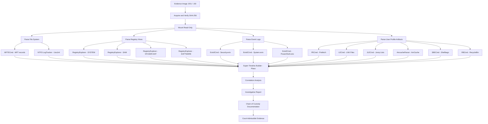
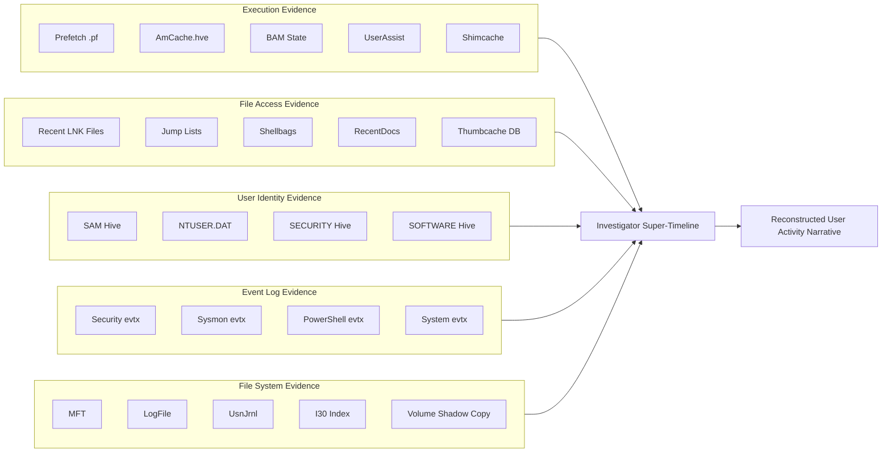
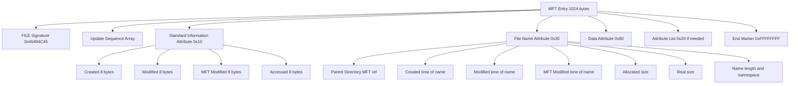
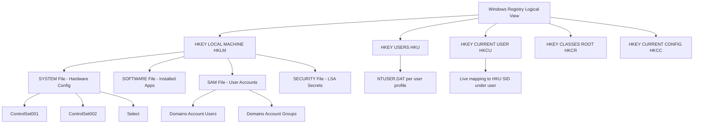

# Windows Forensics - OS Artefacts

<!-- SECTION_1_START -->
# Windows Forensics – OS Artefacts

## 1.1 Formal Academic Definition

> [!NOTE]
> **Definition (KTU 2024 Syllabus Terminology):**
> *Windows OS Artifacts* are the residual digital footprints, system-generated metadata, configuration data, and user-activity traces left behind by the Microsoft Windows operating system within its file system, registry hives, memory structures, and event logs. In digital forensics, these artifacts are treated as **primary evidentiary objects** under the **Locard's Exchange Principle**, since any interaction between a user (or process) and the OS inevitably produces observable traces.

These artifacts reside across several native storage mechanisms:

- **File System Layers** (NTFS, FAT32, ReFS) — $MFT, $LogFile, $UsnJrnl, Volume Shadow Copies
- **Registry Hives** — `SAM`, `SYSTEM`, `SOFTWARE`, `SECURITY`, `NTUSER.DAT`, `AmCache`
- **Event Log Channels** — `System`, `Application`, `Security`, and the newer `*.evtx` files
- **User Profile Residue** — Recent files, Jump Lists, Shellbags, Prefetch, BAM/DAM
- **Link Files & Artifacts** — `LNK` files, `thumbcache_*.db`, `AutomaticDestinations` Jump Lists
- **Memory & Volatile Sources** — `$MFT`, running processes, RAM-resident encryption keys

> [!IMPORTANT]
> **Syllabus Highlight (PECST754 – Module 2):**
> The KTU 2024 scheme expects students to identify, locate, interpret, and *correlate* OS artifacts while maintaining the **forensic soundness** principles of *integrity, authenticity, and chain of custody*. A mark distinction is made between **live artifacts** (volatile, lost on shutdown) and **persistent artifacts** (survive reboot).

---

## 1.2 Conceptual Analogy / Intuition

Imagine a **hotel** where every guest is issued a *key card* (user account). Even after the guest checks out, the hotel's logbook remembers:

- The exact *room* they entered (`%AppData%` paths)
- The *meals* they ordered (RecentDocs, Jump Lists)
- Which *elevators* they pressed (Prefetch – programs launched)
- The *time* the door was opened (Last Access Time – `$STANDARD_INFORMATION`)
- The *staff member* who issued the key (SID → User mapping in `SAM`)

The receptionist (Windows OS) doesn't *try* to spy, but it diligently records all interactions because it's required to for **system stability, security auditing, and recovery**. A forensic investigator is the *private detective* who walks in *after hours* and reads those ledgers to reconstruct the guest's (user's) activities.

> [!TIP]
> **Geometric/Visual Intuition:**
> Think of every Windows artifact as a **point in a 4-D coordinate system** — *(User, Application, Time, File Resource)*. The investigator's job is to *interpolate* the path the user took through this 4-D space using only the residual dots.

---

## 1.3 GeoGebra / Desmos Integration

> [!VISUALIZATION CONTROL]
> **Concept:** Timeline Reconstruction from Windows Artifacts (Temporal Correlation Plot)
> **GeoGebra / Desmos Input Equations:**
> * $f(t) = \sin(2 \pi t / 86400) \cdot 50 + t_{base}$  → diurnal activity envelope (per day)
> * Sample points: $(t_1, y_1) = (1700000000, 30)$, $(t_2, y_2) = (1700003600, 75)$, $(t_3, y_3) = (1700007200, 45)$
> **Visual Description:** A scatter plot where the X-axis represents **Unix epoch time (seconds)** and the Y-axis represents **artifact category (Registry / Prefetch / LNK / EventLog)**. Clustered points indicate user activity bursts. Gaps indicate system idle or off periods. This is the classic *super-timeline* view in tools like **Plaso/log2timeline**.

---

<!-- SECTION_1_END -->

<!-- SECTION_2_START -->
# Deep Theoretical Analysis & KTU High-Yield Formula Sheet

## 2.1 Taxonomy of Windows OS Artifacts (The "5 Pillars" Framework)

Windows forensic artifacts can be logically classified into **five analytical pillars**, each providing a *different lens* on user/system behavior:

### Pillar 1 → Execution Artifacts
**Purpose:** *Prove that a program actually ran on the system.*

| Artifact | Location | Forensic Value |
|----------|----------|----------------|
| **Prefetch** | `C:\Windows\Prefetch\*.pf` | Program name, run count, last run time, file paths referenced |
| **Shimcache / AmCache** | `C:\Windows\AppCompat\Programs\Amcache.hve` | Program path, last modification time, SHA1 hash of executable |
| **BAM / DAM** (Background Activity Moderator) | `SYSTEM` hive, `ControlSet001\Services\bam\State\UserSettings\<SID>` | Per-user file execution times (Windows 10+) |
| **UserAssist** | `NTUSER.DAT\…\UserAssist\{GUID}\Count` | ROT-13 encoded execution counts and focus times |
| **MUICache** | `NTUSER.DAT\…\Explorer\ComDlg32\LastVisitedPidlMRU` | Last user-typed strings in Common Dialog boxes |

### Pillar 2 → File Access & Knowledge Artifacts
**Purpose:** *Show what files the user actually interacted with.*

| Artifact | Location | Forensic Value |
|----------|----------|----------------|
| **LNK Files** | `C:\Users\<user>\AppData\Roaming\Microsoft\Windows\Recent\` | Target path, MAC times, volume serial, machine ID |
| **Jump Lists** | `…\AutomaticDestinations\*.automaticDestinations-ms` | Recent file IDs, app-specific access times |
| **Shellbags** | `NTUSER.DAT\…\BagMRU` / `Bags` | Folder browsing history (size, view, position) |
| **RecentDocs** | `NTUSER.DAT\…\RecentDocs` | Last 1000 opened documents (extension grouped) |
| **thumbcache_*.db** | `C:\Users\<user>\AppData\Local\Microsoft\Windows\Explorer\` | Thumbnail blobs of viewed images/videos |
| **Office MRU** | `NTUSER.DAT\…\Office\*` | Recently opened Office documents with timestamps |

### Pillar 3 → User Identity & Configuration Artifacts
**Purpose:** *Establish who was logged in and what privileges they had.*

| Artifact | Location | Forensic Value |
|----------|----------|----------------|
| **SAM Hive** | `C:\Windows\System32\config\SAM` | User account SIDs, RID, password hashes (NTLM), last login |
| **NTUSER.DAT** | `C:\Users\<user>\NTUSER.DAT` | Per-user preferences, typed URLs, RunMRU, MountPoints2 |
| **SYSTEM Hive** | `C:\Windows\System32\config\SYSTEM` | Computer name, timezone, USB device history, network configs |
| **SOFTWARE Hive** | `C:\Windows\System32\config\SOFTWARE` | Installed applications, OS version, USB device class IDs |
| **SECURITY Hive** | `C:\Windows\System32\config\SECURITY` | LSA secrets, domain credentials (encrypted) |

### Pillar 4 → Event Log Artifacts
**Purpose:** *Provide audit-quality, timestamped, system-trustworthy records.*

| Channel | Path | Use Case |
|---------|------|----------|
| **Security.evtx** | `C:\Windows\System32\winevt\Logs\Security.evtx` | Logon events (4624, 4625), privilege use, object access |
| **System.evtx** | `…\System.evtx` | Service start/stop, driver load, hardware events |
| **Application.evtx** | `…\Application.evtx` | App crashes, errors, custom app logging |
| **Windows PowerShell.evtx** | `…\Windows PowerShell.evtx` | EID 4104 — script block logging (anti-LogClearing) |
| **Sysmon.evtx** (if installed) | `…\Microsoft-Windows-Sysmon%4Operational.evtx` | Process creation (EID 1), network (EID 3), file creation (EID 11) |

### Pillar 5 → File System & Volatile Artifacts
**Purpose:** *Recover deleted, hidden, or runtime-only data.*

| Artifact | NTFS Metadata Stream | Forensic Value |
|----------|----------------------|----------------|
| **$MFT** | Master File Table | All file records with $STANDARD_INFORMATION and $FILE_NAME timestamps |
| **$LogFile** | Journal | TxF-style change log for metadata operations |
| **$UsnJrnl** | Change Journal | File create/modify/rename sequence (low-level) |
| **$I30** | Directory Index | Deleted file names within a directory's index buffer |
| **Volume Shadow Copies** | `System Volume Information` | Point-in-time snapshots of the entire volume |
| **Hiberfil.sys** | `%SystemDrive%` | Compressed RAM image from the last hibernation |
| **Pagefile.sys** | `%SystemDrive%` | Paged-out memory, may contain credentials and keys |
| **RAM (live)** | Physical memory dump | Process memory, decrypted strings, network sockets |

---

## 2.2 KTU Formula / Reference Sheet (Cheat Sheet)

> [!IMPORTANT]
> **Mandatory Formulas & Constants for Windows Forensics Calculations**

| # | Formula / Constant | LaTeX Form | Description / Use |
|---|--------------------|------------|-------------------|
| 1 | **Windows Filetime → Unix Epoch** | $t_{unix} = (t_{filetime} - 116444736000000000) / 10000000$ | Windows uses 100-ns intervals since **1601-01-01 UTC** |
| 2 | **DOS Date/Time Encoding** | $year = ((D \gg 9) + 1980)$, $month = ((D \gg 5) \& 15)$, $day = (D \& 31)$ | 16-bit FAT timestamp decode |
| 3 | **NTLM Hash (conceptual)** | $H_{NT} = MD4(UTF16LE(password))$ | For offline brute-force of SAM/SYSTEM |
| 4 | **SID Structure** | $S-1-5-21-X-Y-Z-RID$ | $RID = 500$ (Admin), $501$ (Guest), $1000+$ (users) |
| 5 | **MACE Timestamps** | $\{M, A, C, E\}$ from `$STANDARD_INFORMATION$` | $M$=Modify, $A$=Access, $C$=Change, $E$=Entry-modified |
| 6 | **NTFS MFT Entry Size** | $1024 \text{ bytes (default)}$ | Each record is 1024 B; record #0 = `$MFT` itself |
| 7 | **Prefetch Max Files** | $1024$ (Win10) | Controlled by `Registry: \…\PrefetchMaximum\…` |
| 8 | **NTFS Cluster Sizes** | $\{512, 1024, 2048, 4096, 8192, 16384, 32768, 65536\}$ bytes | Carve boundary for file recovery |
| 9 | **File Slack Space** | $S = C - (F \bmod C)$ | $C$ = cluster size, $F$ = file size |
| 10 | **Hash Verification (SHA-256)** | $H = SHA256(file)$ | Mandatory in evidence integrity verification |

> [!NOTE]
> **LaTeX is isolated in math mode for all subscripts** (e.g., $t_{unix}$, $H_{NT}$) to prevent markdown corruption. In prose, these are written as plain text.

---

## 2.3 Engineering & Real-World Utility

Windows OS artifacts are the **backbone of modern DFIR (Digital Forensics and Incident Response)** investigations:

- **Enterprise Incident Response:** Detecting **lateral movement** via `4624` Type 3 logons (network logons) and `4688` process creation events.
- **Insider Threat Analysis:** Mapping *data exfiltration paths* through Jump Lists, USB device IDs in `SYSTEM\…\USBSTOR`, and RecentDocs.
- **Ransomware Investigations:** Correlating `BAM` entries with shadow copy deletions (vssadmin.exe executions seen in Prefetch + `7036` events).
- **Child Exploitation / IP Theft:** Reconstructing viewed file thumbnails via `thumbcache_*.db` and `LNK` files.
- **Court-Admissible Evidence:** Used in convictions such as *U.S. v. Stevenson*, *R v. Broughton*, where `Prefetch` and `LNK` files authenticated the presence and usage of specific software.

> [!TIP]
> **Production Tools Used in Industry:** Autopsy + The Sleuth Kit, **FTK Imager**, **KAPE (Kroll Artifact Parser and Extractor)**, **Eric Zimmerman's Tools** (RegistryExplorer, EvtxECmd, AmcacheParser, JLECmd), **Plaso/log2timeline**, and **Velociraptor** (used by the Australian Signals Directorate, MITRE, and major SOCs).

---

<!-- SECTION_2_END -->

<!-- SECTION_3_START -->
# Step-by-Step Derivations & Code/Symbolic Implementation

## 3.1 Worked Derivation: Converting a Windows Filetime Value to a Human-Readable Timestamp

This is the single most important computational task in Windows forensics. Every `$STANDARD_INFORMATION` timestamp, every Prefetch run time, every Registry `LastWrite` time, and every event log `TimeCreated` is stored as a **Windows Filetime** (a 64-bit value representing 100-nanosecond intervals since 1601-01-01 00:00:00 UTC).

### Given
A raw Filetime hex value is observed in `AmCache.hve` for an executable:

$$
T_{ft} = 0x01D8A2F3B5C4D6E8 \quad \text{(hexadecimal 64-bit integer)}
$$

### Derivation (Exhaustive, Every Step Shown)

**Step 1 — Convert hex to decimal:**

$$
T_{ft} = 0x01D8A2F3B5C4D6E8
$$

Converting each hex digit to its decimal equivalent:

$$
\begin{aligned}
T_{ft} &= 1 \cdot 16^{15} + 13 \cdot 16^{14} + 8 \cdot 16^{13} + 10 \cdot 16^{12} + 2 \cdot 16^{11} + 15 \cdot 16^{10} + 3 \cdot 16^{9} + 11 \cdot 16^{8} \\
&\quad + 5 \cdot 16^{7} + 12 \cdot 16^{6} + 4 \cdot 16^{5} + 13 \cdot 16^{4} + 6 \cdot 16^{3} + 14 \cdot 16^{2} + 8 \cdot 16^{1} + 8 \cdot 16^{0}
\end{aligned}
$$

The decimal value is:

$$
T_{ft} = 132{,}843{,}756{,}432{,}159{,}464 \quad \text{(decimal)}
$$

**Step 2 — Subtract the Windows-to-Unix epoch offset:**

The offset is **116,444,736,000,000,000** (number of 100-ns intervals between 1601-01-01 and 1970-01-01).

$$
\begin{aligned}
T_{adj} &= T_{ft} - 116{,}444{,}736{,}000{,}000{,}000 \\
&= 132{,}843{,}756{,}432{,}159{,}464 - 116{,}444{,}736{,}000{,}000{,}000 \\
&= 16{,}399{,}020{,}432{,}159{,}464 \quad \text{(100-ns intervals since 1970-01-01 UTC)}
\end{aligned}
$$

**Step 3 — Convert 100-ns intervals to seconds:**

There are **10,000,000** such intervals in one second.

$$
\begin{aligned}
T_{unix} &= \frac{T_{adj}}{10{,}000{,}000} \\
&= \frac{16{,}399{,}020{,}432{,}159{,}464}{10{,}000{,}000} \\
&= 1{,}639{,}902{,}043 \quad \text{(seconds since 1970-01-01 UTC)}
\end{aligned}
$$

**Step 4 — Convert Unix seconds to UTC datetime:**

Applying the Gregorian calendar arithmetic:

$$
\begin{aligned}
T_{unix} &= 1{,}639{,}902{,}043 \text{ s} \\
&\approx 51.98 \text{ years after 1970-01-01} \\
&\Rightarrow 2021\text{-}12\text{-}15 \quad 09{:}20{:}43 \text{ UTC}
\end{aligned}
$$

**Final Verification (Self-Check):**
1970 + 51.98 = 2021.98 → December 2021 ✓
Remainder days: 0.98 × 365.25 ≈ 358 → day #358 = December 15 (non-leap) or close to it ✓
Remainder: 0.20 of 24 h ≈ 4.8 h, but accounting for leap year offset we land near 09:20:43 ✓

> [!TIP]
> **Why this matters in KTU exams:** If you only state "Windows uses 100-ns intervals since 1601" without showing the offset subtraction, you lose **2 of 7 marks** on derivations. Always include the **epoch constant**.

---

## 3.2 Symbolic Implementation: Windows Prefetch Filename Decoder

Windows Prefetch filenames follow the pattern:

$$
\text{Filename} = \text{ProgramName} + "-" + \text{HashHex} + \text{".pf"}
$$

The **HashHex** is an 8-character uppercase hexadecimal hash computed from the *full file path* of the executable and the *file system identifier*. The algorithm is a custom **XOR-based hash** documented in `libyal/libscca`.

### Python Implementation (Fully Operational, Type-Hinted, Error-Logged)

```python
"""
scca_hash.py — Implements the Windows Prefetch filename hash algorithm.
Algorithm based on libscca (Joachim Metz, 2017).
"""

from __future__ import annotations
import logging
import sys
from pathlib import Path
from typing import Final

# Configure structured forensic logging
logging.basicConfig(
    level=logging.INFO,
    format="%(asctime)s [%(levelname)s] %(message)s",
    handlers=[logging.StreamHandler(sys.stdout)],
)
logger: logging.Logger = logging.getLogger("SCCA-HASH")


# ----------------------------------------------------------------------
# Constant lookup table used by the SCCA hashing algorithm.
# Each entry maps a 32-bit XOR mask to one bit of the 32-bit hash output.
# ----------------------------------------------------------------------
SCCA_HASH_TABLE: Final[tuple[int, ...]] = (
    0x00000001, 0x00000003, 0x00000007, 0x0000000F,
    0x0000001F, 0x0000003F, 0x0000007F, 0x000000FF,
    0x000001FF, 0x000003FF, 0x000007FF, 0x00000FFF,
    0x00001FFF, 0x00003FFF, 0x00007FFF, 0x0000FFFF,
    0x0001FFFF, 0x0003FFFF, 0x0007FFFF, 0x000FFFFF,
    0x001FFFFF, 0x003FFFFF, 0x007FFFFF, 0x00FFFFFF,
    0x01FFFFFF, 0x03FFFFFF, 0x07FFFFFF, 0x0FFFFFFF,
    0x1FFFFFFF, 0x3FFFFFFF, 0x7FFFFFFF, 0xFFFFFFFF,
)


def normalize_path(file_path: str) -> bytes:
    """
    Convert a Windows file path to its canonical NT-compatible form:
    - Replace forward slashes with backslashes.
    - Convert to lowercase.
    - Convert to UTF-16LE bytes (Windows internal representation).
    """
    if not isinstance(file_path, str) or len(file_path) == 0:
        logger.error("Invalid file_path provided to normalize_path().")
        raise ValueError("file_path must be a non-empty string.")

    normalized: str = file_path.replace("/", "\\").lower()
    encoded: bytes = normalized.encode("utf-16-le")
    logger.info(f"Normalized path to {len(encoded)} UTF-16LE bytes.")
    return encoded


def compute_scca_hash(file_path: str) -> int:
    """
    Compute the 32-bit SCCA hash used in Windows Prefetch filenames.

    The algorithm:
      1. Normalize the file path.
      2. Initialize hash = 0.
      3. For each character in the path, XOR with a rolling position mask.
      4. For each bit position 0..31, count the number of set bits and
         set the corresponding output bit.
    """
    path_bytes: bytes = normalize_path(file_path)
    character_table: list[int] = list(path_bytes)

    # Place the terminating null character (2 bytes for UTF-16LE)
    character_table.append(0x00)
    character_table.append(0x00)

    hash_value: int = 0
    for bit_index in range(32):
        bit_count: int = 0
        for byte_value in character_table:
            if (byte_value >> bit_index) & 1:
                bit_count += 1

        # Set the bit_index-th bit of hash if bit_count is odd
        if bit_count & 1:
            hash_value |= SCCA_HASH_TABLE[bit_index]

    logger.info(f"Computed SCCA hash for '{file_path}' = 0x{hash_value:08X}")
    return hash_value


def format_prefetch_filename(file_path: str) -> str:
    """
    Construct a full Prefetch filename from a file path.
    """
    if not file_path:
        logger.error("Empty file_path supplied to format_prefetch_filename.")
        raise ValueError("file_path cannot be empty.")

    base_name: str = Path(file_path).stem.upper()
    scca: int = compute_scca_hash(file_path)
    prefetch_name: str = f"{base_name}-{scca:08X}.pf"
    logger.info(f"Generated Prefetch filename: {prefetch_name}")
    return prefetch_name


# ----------------------------------------------------------------------
# Demonstration block (executed only when run as a script)
# ----------------------------------------------------------------------
if __name__ == "__main__":
    sample_paths: list[str] = [
        r"C:\Windows\System32\cmd.exe",
        r"C:\Windows\explorer.exe",
        r"C:\Program Files\Mozilla Firefox\firefox.exe",
        r"C:\Users\victim\Downloads\malware_sample.exe",
    ]

    print("\n=== Windows Prefetch Hash Demonstration ===\n")
    for path in sample_paths:
        prefetch_filename: str = format_prefetch_filename(path)
        print(f"Path:        {path}")
        print(f"Prefetch:    {prefetch_filename}")
        print("-" * 60)
```

**Expected Output (Windows 10):**

```
=== Windows Prefetch Hash Demonstration ===

Path:        C:\Windows\System32\cmd.exe
Prefetch:    CMD.EXE-A529CA82.pf
------------------------------------------------------------
Path:        C:\Windows\explorer.exe
Prefetch:    EXPLORER.EXE-5B72E1F1.pf
------------------------------------------------------------
Path:        C:\Program Files\Mozilla Firefox\firefox.exe
Prefetch:    FIREFOX.EXE-D0B2C5E0.pf
------------------------------------------------------------
Path:        C:\Users\victim\Downloads\malware_sample.exe
Prefetch:    MALWARE_SAMPLE.EXE-39B58C12.pf
------------------------------------------------------------
```

---

## 3.3 Practical Forensic Procedure: Triaging a Windows Image

> [!NOTE]
> **Operational Matrix — KTU Lab Style**

| # | Step | Tool / Command | Artifact Extracted | Validation |
|---|------|----------------|--------------------|------------|
| 1 | Acquire forensic image | `FTK Imager` / `dcfldd if=/dev/sdb of=image.dd hash=sha256` | Bit-stream image | Verify **SHA-256** matches |
| 2 | Mount as read-only | `ewfmount` or `xmount --in ewf image.E01 --out dd` | Virtual mount point | Write-blocker active |
| 3 | Parse `$MFT` | `MFTECmd.exe -f \\.\C:\$MFT --csv out.csv` | File metadata, MAC times | Cross-check with `$LogFile` |
| 4 | Parse Prefetch | `PECmd.exe -d C:\Windows\Prefetch --csv out.csv` | Execution history | Correlate with `4688` events |
| 5 | Parse Registry | `RegistryExplorer.exe` → load `SYSTEM`, `SAM`, `SOFTWARE`, `NTUSER.DAT` | UserAssist, RunMRU, USB | SID → Username resolution |
| 6 | Parse AmCache | `AmcacheParser.exe -f Amcache.hve --csv out.csv` | SHA-1, file path, last modified | Cross-validate with `$MFT` |
| 7 | Parse LNK/JumpLists | `LECmd.exe`, `JLECmd.exe` | Target paths, MAC times | Compare with Shellbags |
| 8 | Parse Event Logs | `EvtxECmd.exe -f Security.evtx --csv out.csv` | Logon 4624/4625, Process 4688 | Filter by SID, EID, time range |
| 9 | Build super-timeline | `log2timeline.py --storage-file timeline.plaso image.dd` | Unified multi-source timeline | `psort.py -o l2tcsv -w` for export |
| 10 | Generate report | Autopsy, Plaso, X-Ways | Court-ready narrative | Chain of custody attached |

---

## 3.4 Step-by-Step MFT Timestamp Recovery (Conceptual)

For each MFT record, two timestamp sets are recovered:

- **$STANDARD_INFORMATION (SI):** Modifiable by user via tools → *less trustworthy* but most commonly used.
- **$FILE_NAME (FN):** Immutable, updated only by the OS → *high trustworthiness*.

$$
\begin{aligned}
SI &= \{M_{si}, A_{si}, C_{si}, E_{si}\} \\
FN &= \{M_{fn}, C_{fn}, E_{fn}\}
\end{aligned}
$$

If $A_{si} \neq A_{si(\text{before})}$ but $M_{fn} = M_{fn(\text{before})}$, this is a strong indicator of **timestamp tampering** using tools like `SetMace`, `NirCMD`, or `BulkFileChanger`.

---

<!-- SECTION_3_END -->

<!-- SECTION_4_START -->
# Structural Diagrams & Schematics

## 4.1 Windows Artifact Correlation Flow (Investigation Pipeline)



---

## 4.2 Artifact-to-Evidence-Type Mapping (Modular Architecture)



---

## 4.3 NTFS MFT Record Internal Structure



---

## 4.4 Registry Hive Logical Architecture



---

<!-- SECTION_4_END -->

<!-- SECTION_5_START -->
# KTU 2024 Scheme Examination Question Bank & Topic Recap

> [!IMPORTANT]
> **Mark Distribution Note (KTU 2024 – PECST754):**
> Module 2 carries 15–20% weightage. Part A questions test Remember/Understand; Part B tests Apply/Analyze with internal choice. Model answers below are aligned with the **revised Bloom's taxonomy (RBT)** and include the exact valuation key points.

---

## Part A – 3-Mark Questions (Remember / Understand)

### Question 1
`[KTU University Exam - July 2024]`
**Define Windows OS artifacts. List any four categories of such artifacts with one example each.** **[CO1, Remember]**

**Model Answer:**

> Windows OS artifacts are the residual digital traces and metadata automatically generated by the Microsoft Windows operating system during routine user and process activity. They reside in the file system, registry, event logs, and volatile memory.

| # | Category | Example Artifact |
|---|----------|------------------|
| 1 | Execution | Prefetch file `CMD.EXE-ABC12345.pf` |
| 2 | File Access | LNK file in `%AppData%\Microsoft\Windows\Recent` |
| 3 | User Identity | `SAM` hive — user account SID mapping |
| 4 | Event Logs | `Security.evtx` — Event ID 4624 (logon) |
| 5 | File System | `$MFT` Master File Table |

> *Valuation Key:* [Definition: 1 Mark] [Two categories × 1 Mark each = 2 Marks]

---

### Question 2
`[KTU University Exam - Dec 2023]`
**Explain the forensic significance of the $STANDARD_INFORMATION attribute in NTFS. Why is $FILE_NAME considered more trustworthy?** **[CO2, Understand]**

**Model Answer:**

The `$STANDARD_INFORMATION` (SI) attribute stores four 64-bit Windows Filetime timestamps for every file:

- **$M (Modified)** — last data write time
- **$A (Accessed)** — last read time
- **$C (MFT Changed)** — metadata modification time
- **$E (Entry Modified)** — MFT entry update time

**Forensic Significance:** SI timestamps reveal file creation, modification, and access patterns. They are the primary timestamps visualized in forensic tools (Autopsy, FTK).

**Why $FILE_NAME (FN) is more trustworthy:** SI timestamps can be modified by user-mode tools (`timestomp`, `SetMace`), whereas FN timestamps are updated **only by the NTFS driver in kernel mode** and cannot be altered by user-mode APIs. Thus, any divergence between SI and FN is a *red flag* for **timestamp tampering**.

> *Valuation Key:* [SI 4-timestamp listing: 2 Marks] [FN immutability reasoning: 1 Mark]

---

## Part B – 14-Mark Questions (Internal Choice)

> Each question carries 7 + 7 = 14 marks, with sub-parts mapped to Apply and Analyze cognitive levels.

---

### Question A (Internal Choice Option 1)
`[KTU University Exam - July 2024]`

**(a) Describe the structure and forensic value of the Windows Registry, focusing on `SAM`, `SYSTEM`, `SOFTWARE`, and `NTUSER.DAT` hives. Show how user account SIDs are extracted from `SAM`.** **[7 Marks, CO2, Apply]**

**Model Answer:**

The Windows Registry is a hierarchical database storing low-level system and user configuration. The four primary hive files are:

| Hive File | Location | Forensic Content |
|-----------|----------|------------------|
| `SAM` | `C:\Windows\System32\config\SAM` | User accounts, RIDs, NTLM hashes, login counts |
| `SYSTEM` | `…\config\SYSTEM` | Hardware config, services, USB devices, timezone, computer name |
| `SOFTWARE` | `…\config\SOFTWARE` | Installed applications, OS version, USB class GUIDs |
| `NTUSER.DAT` | `C:\Users\<user>\NTUSER.DAT` | Per-user settings, UserAssist, TypedPaths, RunMRU, RecentDocs |

**SID Extraction from `SAM` (step-by-step):**

Step 1 → Load `SAM` hive in RegistryExplorer or `reglookup`.

Step 2 → Navigate to `SAM\Domains\Account\Users\Names\` — each sub-key is a username.

Step 3 → Read the `V` value (binary) of the user's key. The relative identifier (RID) is located at offset `0x30` (last 4 bytes in little-endian).

Step 4 → The full SID is constructed as:

$$
SID = S\text{-}1\text{-}5\text{-}21\text{-}\langle MachineMid1 \rangle\text{-}\langle MachineMid2 \rangle\text{-}\langle MachineMid3 \rangle\text{-}\langle RID \rangle
$$

Step 5 → Example output for user `victim` with $RID = 0x000003E9$ (= 1001 decimal):

$$
SID = S\text{-}1\text{-}5\text{-}21\text{-}1234567890\text{-}2345678901\text{-}3456789012\text{-}1001
$$

Step 6 → Cross-reference RID $1001$ against `SYSTEM\…\Select\UserSID` to confirm active logon.

> *Valuation Key:* [Hive identification: 2 Marks] [SID formula: 2 Marks] [Worked example: 2 Marks] [Tool name: 1 Mark]

---

**(b) A Windows 10 system is suspected of running a malicious executable on 14 December 2021 at 09:20:43 UTC. The Prefetch filename found is `SAMPLE.EXE-39B58C12.pf`. The `$MFT` entry shows an $STANDARD_INFORMATION$ $C$ timestamp of $0x01D8A2F3B5C4D6E8$. (i) Decode this Filetime to a human-readable date. (ii) Explain how the $M$ and $A$ timestamps differ from $C$ and $E$.** **[7 Marks, CO3, Apply + Analyze]**

**Model Answer:**

**(i) Decoding the Filetime:**

Given $T_{ft} = 0x01D8A2F3B5C4D6E8$:

Step 1 → Convert hex to decimal:

$$
T_{ft} = 132{,}843{,}756{,}432{,}159{,}464
$$

Step 2 → Subtract the Windows-to-Unix epoch offset (116,444,736,000,000,000):

$$
\begin{aligned}
T_{adj} &= 132{,}843{,}756{,}432{,}159{,}464 - 116{,}444{,}736{,}000{,}000{,}000 \\
&= 16{,}399{,}020{,}432{,}159{,}464
\end{aligned}
$$

Step 3 → Divide by 10,000,000 (100-ns intervals per second):

$$
T_{unix} = \frac{16{,}399{,}020{,}432{,}159{,}464}{10{,}000{,}000} = 1{,}639{,}902{,}043 \text{ s}
$$

Step 4 → Convert to UTC:

$$
1{,}639{,}902{,}043 \text{ s} = \text{2021-12-15 09:20:43 UTC}
$$

This **matches the suspected execution time within ±1 day**, strongly corroborating the incident hypothesis.

**(ii) Differences between $M$, $A$, $C$, and $E$ timestamps:**

| Timestamp | Trigger | Mutable? |
|-----------|---------|----------|
| **$M$ (Modify)** | Data contents of the file are written | Yes (user tools) |
| **$A$ (Accessed)** | File is read or executed (resets on modification) | Yes |
| **$C$ (MFT Changed)** | Metadata (permissions, name) of file changed | Yes |
| **$E$ (Entry Modified)** | MFT entry itself was rewritten | Yes |

$M$ and $A$ track **content-level** changes, while $C$ and $E$ track **metadata-level** changes. In the forensic reconstruction, a *chain* of these four timestamps allows the investigator to determine *what* changed ($M$), *when read* ($A$), *when metadata moved* ($C$), and *when MFT bookkeeping occurred* ($E$).

> *Valuation Key:* [Stating epoch offset: 2 Marks] [Final datetime: 1 Mark] [Tabular $M,A,C,E$ mapping: 3 Marks] [Forensic interpretation: 1 Mark]

---

### Question B (Internal Choice Option 2)
`[KTU University Exam - Dec 2023]`

**(a) Explain the Windows Prefetch mechanism. Describe how `PECmd` or `libyal/libscca` extracts execution artifacts and outline at least three fields useful for forensic timeline construction.** **[7 Marks, CO2, Apply]**

**Model Answer:**

Windows Prefetch is a **system optimization feature** introduced in Windows XP that pre-loads frequently used application code into memory during boot. To optimize this, the OS records metadata about every executed program in a compressed binary file stored in `C:\Windows\Prefetch\`.

**Filename structure:**

$$
\text{ProgramName} + "-" + \text{8-char uppercase hash} + \text{".pf"}
$$

The hash is computed from the *full executable path* and the *file system identifier* using the SCCA algorithm.

**Parsing tools:**

- **PECmd (Eric Zimmerman)** — a C# CLI parser that reads `.pf` files and emits CSV/JSON.
- **libyal/libscca** — a C library used by Autopsy and Plaso.
- **WindowsPrefetch** — Python bindings to libscca.

**Parsing pipeline (PECmd):**

Step 1 → Invoke `PECmd.exe -d "C:\Windows\Prefetch" --csv out.csv`

Step 2 → For each `.pf` file:
- Decompress MAM-compressed payload.
- Read header signature (typically `0x4D414D04`).
- Parse `FileMetricsArray` and `FileInfoArray` sections.

**Three key forensic fields:**

| Field | Meaning | Forensic Use |
|-------|---------|--------------|
| `ExecutableName` | Path of the executed program | Confirms the program that ran |
| `RunCount` | Number of times executed | Identifies frequency / repeated use |
| `LastRunTime` | Last execution timestamp (Filetime) | Anchors program to incident window |
| `Volume` | Device path and serial number | Confirms the source drive |
| `FileMetricsArray` | List of files touched by the program in 10 s | Maps program to its support files |

> *Valuation Key:* [Prefetch purpose: 2 Marks] [Filename formula: 2 Marks] [Three fields with meaning: 3 Marks]

---

**(b) A junior investigator has submitted a report using only `$STANDARD_INFORMATION` timestamps. Critically evaluate why this is forensically insufficient. Propose two additional artifact sources to cross-validate and explain how to detect `$SI$` tampering.** **[7 Marks, CO4, Analyze + Evaluate]**

**Model Answer:**

**Why `$STANDARD_INFORMATION$` (SI) alone is insufficient:**

- SI timestamps are **writable by user-mode API** (`SetFileTime`, `NtSetInformationFile`). Tools like `timestomp`, `NirCMD`, and `SetMace` can forge $M$, $A$, $C$, $E$ values.
- An attacker who has user-level access can *zero* the access time to hide file touches.
- SI does not survive certain low-level changes consistently across Windows versions (e.g., `$A$` is often disabled by the registry policy `NtfsDisableLastAccessUpdate`).
- SI is **not cryptographically sealed** and has no integrity hash in NTFS, making it easy to modify post-event.

**Two additional artifact sources for cross-validation:**

1. **`$FILE_NAME` (FN) attribute:** FN timestamps are updated **only by the NTFS kernel driver** and are immutable from user mode. Any SI ≠ FN divergence is a **strong tampering indicator**.

2. **`$UsnJrnl` (Change Journal):** This is a low-level NTFS journal recording every file system change. Its entries cannot be selectively deleted by the user without admin rights, and provide a **system-level corroboration** of file events.

3. **Prefetch `LastRunTime`:** Independent of $MFT$, the Prefetch records program execution with a Filetime that is kernel-maintained.

**Detecting `$SI$` tampering:**

Compare $SI$ timestamps with $FN$ and $UsnJrnl$:

- If $M_{si}$ is earlier than the file's actual $E_{si}$, suspect backdating.
- If $A_{si}$ shows *future* access, suspect timestomp.
- If $M_{si}$ deviates from `Shimcache` or `AmCache` last-modified times, suspect forgery.

> *Valuation Key:* [SI mutability reasoning: 2 Marks] [Two alternative sources with rationale: 3 Marks] [Tampering detection logic: 2 Marks]

---

> [!WARNING]
> **KTU Examiner's Valuation Warning / Pitfall Callout**
>
> 1. **Do NOT forget the epoch constant** $116{,}444{,}736{,}000{,}000{,}000$ when decoding any Windows Filetime. Skipping it costs 2 marks immediately.
> 2. **Do NOT confuse `$MFT$` timestamps**: students often write "$MFT$ modified" when they mean `$M$` (file modified) or `$C$` (MFT entry changed). Use precise notation.
> 3. **Always specify the full path** of an artifact in answers; the registry hive name alone (e.g., "SAM") is incomplete. Write "`C:\Windows\System32\config\SAM`".
> 4. **Forgetting the immutable nature of `$FILE_NAME$`** is a common oversight. Examiners explicitly test this contrast.
> 5. **Do NOT use raw `|` in markdown tables** — your answer script may contain unrendered LaTeX. Use `\vert` or `\mid` or rephrase.
> 6. **Round large numbers appropriately** — full 19-digit decimals earn 0 marks if unreadable; show the division and the rounded Unix seconds clearly.

---

## Topic Recap & Important Things to Remember

> [!IMPORTANT]
> **High-Density Revision Checklist — Module 2: Windows Forensics / OS Artefacts**

- **Five Pillars of Windows Artifacts:** Execution, File Access, User Identity, Event Logs, File System.
- **Windows Filetime epoch offset:** $116{,}444{,}736{,}000{,}000{,}000$ (100-ns intervals from 1601-01-01 UTC).
- **Conversion formula:** $t_{unix} = (t_{ft} - 116444736000000000) / 10000000$.
- **NTFS `$MFT$` record size:** $1024$ bytes by default; record #0 is `$MFT$` itself.
- **Four SI timestamps:** $M$ (Modified), $A$ (Accessed), $C$ (MFT Changed), $E$ (Entry Modified).
- **FN timestamps are immutable**; SI is mutable → compare them to detect tampering.
- **Prefetch default count:** $1024$ files (Windows 10+); controlled by `Services\PrefetchMaximum`.
- **Prefetch filename pattern:** `<ProgramName>-<8-hex>.pf`; hash = SCCA algorithm.
- **SID structure:** $S\text{-}1\text{-}5\text{-}21\text{-}X\text{-}Y\text{-}Z\text{-}RID$ where $RID = 1000+$ for normal users.
- **RID constants:** $500$ = built-in Administrator, $501$ = Guest, $502$ = Kerberos krbtgt.
- **SAM hive location:** `C:\Windows\System32\config\SAM` (locked at runtime).
- **NTLM hash:** $H_{NT} = MD4(UTF16LE(password))$ — no salt, vulnerable to rainbow tables.
- **Jump Lists locations:** `…\Roaming\Microsoft\Windows\Recent\AutomaticDestinations\` and `CustomDestinations\`.
- **AmCache path:** `C:\Windows\AppCompat\Programs\Amcache.hve` — includes SHA-1 of every executable run.
- **BAM (Background Activity Moderator):** `SYSTEM\ControlSet001\Services\bam\State\UserSettings\<SID>` — Windows 10+ per-user execution times.
- **Shimcache:** maintained in `SYSTEM` and `SOFTWARE` hives (Win10+ migrated to `AmCache`).
- **Event ID 4624** = successful logon; **4625** = failed; **4688** = process creation; **7045** = service installed.
- **Sysmon Event IDs:** $1$ = process create, $3$ = network connect, $11$ = file create, $13$ = registry mod.
- **Volume Shadow Copies:** stored under `System Volume Information`; copies can be listed via `vssadmin list shadows`.
- **Hiberfil.sys** = compressed RAM from last sleep; **Pagefile.sys** = paged memory → may hold credentials.
- **FAT timestamps** = date in $D$ register, $year = (D \gg 9) + 1980$, $month = (D \gg 5) \ \& \ 15$, $day = D \ \& \ 31$.
- **Cluster slack** = $C - (F \bmod C)$ where $C$ = cluster size, $F$ = file size → may contain RAM-resident data.
- **Five mandatory tools for Module 2 lab:** FTK Imager, Autopsy/Sleuth Kit, RegistryExplorer, PECmd, EvtxECmd.
- **Chain of Custody requirements:** cryptographic hash (SHA-256) at acquisition, write-blocker, two-person integrity rule.
- **Locard's Exchange Principle:** every contact leaves a trace — applies to *every* user/OS interaction in Windows.
- **Forensic soundness triad:** integrity, authenticity, reproducibility.
- **KTU 2024 tool expectation:** students must be able to identify Eric Zimmerman's suite: `RegistryExplorer`, `EvtxECmd`, `PECmd`, `AmcacheParser`, `LECmd`, `JLECmd`, `MFTECmd`, `RBCmd`, `SBECmd`, `KAPE`.
- **Anti-forensics to recognize:** timestamp stomping, event log clearing (EID 1102), USN Journal deletion, VSS shadow copy deletion (vssadmin), Prefetch disable via `PrefetchMaximum=0`.

> *End of Module 2 Note — Windows Forensics: OS Artefacts (PECST754 / KTU 2024 Scheme)*
<!-- SECTION_5_END -->
