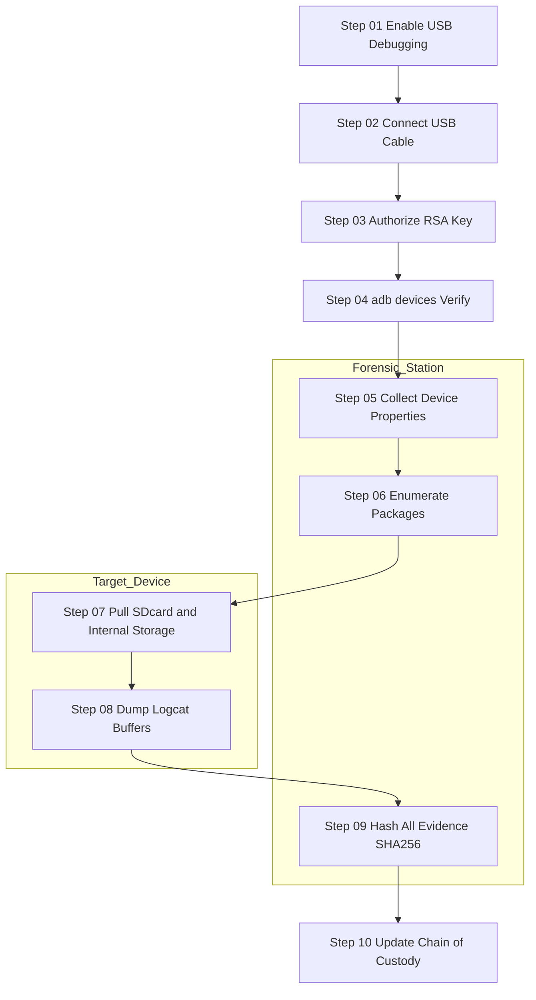
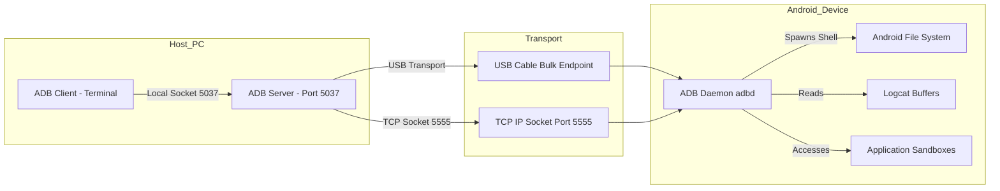
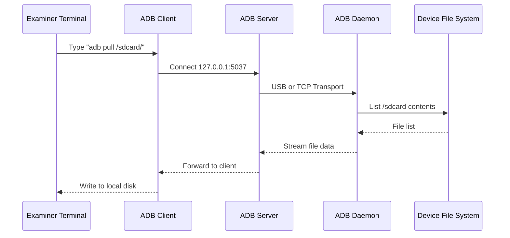
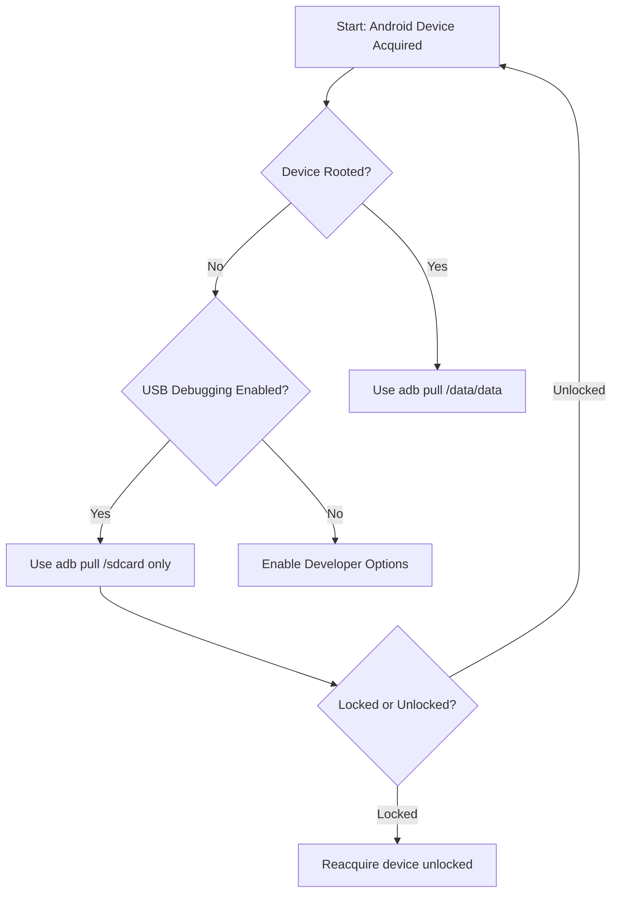
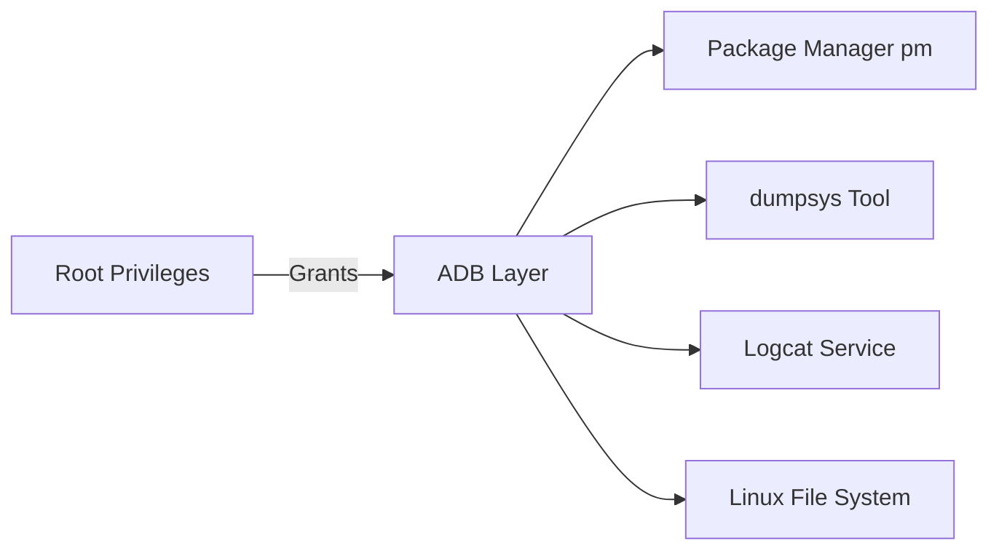
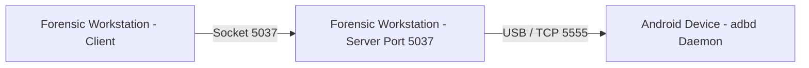

# ADB (Android Debug Bridge)

<!-- SECTION_1_START -->
# ADB (Android Debug Bridge) — Core Technical Definition & Intuitive Overview

## Formal Definition (KTU 2024 Syllabus Aligned)

> [!IMPORTANT]
> **ADB (Android Debug Bridge)** is a versatile command-line tool that facilitates communication between a **host computer** (forensic workstation) and an **Android-powered device** (target device). It is a client-server program that includes three primary components: a **Client**, a **Server**, and a **Daemon** (*adbd*). ADB operates over **USB**, **TCP/IP**, and **emulator-console** channels, and is bundled as part of the **Android SDK Platform-Tools**.

It is the **de-facto forensic transport layer** for logical and file-system level extraction of Android devices. Forensic examiners rely on ADB when commercial tools (Cellebrite UFED, Magnet AXIOM, MSAB XRY) fail to acquire a device, or when the examiner is performing **open-source, court-defensible** extractions.

## Conceptual Analogy — Plain English Intuition

Think of ADB as the **"Universal Remote Control and Two-Way Intercom"** between a forensic analyst and a target Android phone.

- The **Client** is the remote control you press buttons on (your terminal typing `adb shell`).
- The **Server** is the infrared-to-wireless hub in the room (the manager running on your PC that routes traffic).
- The **Daemon** (*adbd*) is the actual receiver sitting inside the phone — it listens to commands and executes them on the device, then speaks back.

When you press a button, the remote sends a signal to the hub, the hub translates it, and the TV (phone) reacts. Likewise, when you type `adb pull /data/data/com.whatsapp/`, the client sends the request, the server forwards it over USB, the daemon executes the file copy, and the data streams back to your forensic workstation.

> [!NOTE]
> **Key Forensic Insight:** ADB provides **root or shell-level access** to the Android filesystem. It is one of the *only* vendor-supported, scriptable, and reproducible methods to extract user data **without bricking the device** or relying on closed-source proprietary software.

## Core Components — High-Yield Definitions

| Component | Location | Default Port | Role |
| :--- | :--- | :--- | :--- |
| **Client** | Host PC (Terminal) | N/A | Sends commands (e.g. `adb devices`) |
| **Server** | Host PC (Background) | **5037** | Manages client-daemon communication |
| **Daemon (`adbd`)** | Android Device | 5555 (TCP) | Executes commands on the device |

## Standard Metrics & Constants (Memorize)

- **Default Server Port:** **5037** (TCP) on the host machine.
- **Default Daemon Port:** **5555** (TCP) on the device when wireless ADB is active.
- **Transport Protocol:** **USB (bulk transfer) or TCP/IP (socket).**
- **Persistent State File:** `~/.android/adbkey` and `adbkey.pub` (RSA-2048 host authentication keys).
- **USB Vendor IDs:** Google (0x18d1), Samsung (0x04e8), HTC (0x0bb4), etc.
- **Enablement Toggle:** `Settings > About Phone > Build Number (tap 7x) > Developer Options > USB Debugging`.

> [!WARNING]
> On modern Android (4.2.2+ / Jelly Bean MR1 onwards), the daemon enforces **RSA key-based host authentication**. The first time a host connects, a popup is displayed on the device asking the user to **"Always allow debugging from this computer."** Forensic examiners must document this consent step (chain of custody).

## GeoGebra / Desmos Visualization

> [!VISUALIZATION CONTROL]
> **Concept:** ADB Three-Tier Communication Topology (Geometric representation of Client → Server → Daemon flow over USB).
>
> **Input Points / Vectors:**
> - `Host PC (x = 0, y = 0)` — Client + Server
> - `USB Cable (parametric line: (t, 0) for t in [1, 4])` — Transport Medium
> - `Android Device (x = 5, y = 0)` — Daemon (adbd)
> - `Loop arrow back: (t, sin(2*t))` — Acknowledgment & Response Stream
>
> **Visual Description:** Three labeled points appear on the x-axis. A solid horizontal line (USB) connects the Host to the Device. A dashed sinusoidal curve returns from the Device to the Host, representing the data ack/response packets. The student should observe how the server (origin) acts as a *routing hub* between the human-facing client and the on-device daemon.

<!-- SECTION_1_END -->

<!-- SECTION_2_START -->
# Deep Theoretical Analysis & KTU High-Yield Formula Sheet

## 1. ADB Architecture — Three-Tier Communication Model

ADB follows a classic **client-server-daemon** architecture. Understanding each tier is *mandatory* for KTU board questions.

### Tier 1 — ADB Client
- Resides on the **forensic workstation** (Linux, Windows, macOS).
- Invoked when an examiner runs an `adb` command in a terminal.
- Multiple clients can run simultaneously (e.g. one for `adb pull` and another for `adb logcat`).
- The client checks if the ADB server is already running; if not, it auto-starts it.
- Communicates with the server via **local TCP port 5037**.

### Tier 2 — ADB Server
- Background process running on the **host machine**.
- Listens on **TCP port 5037** for client requests.
- Maintains the **device-state list** (online, offline, unauthorized, device).
- Scans USB buses (and paired Bluetooth/WiFi devices) for newly attached hardware.
- Forwards commands to the corresponding daemon on the target device.

### Tier 3 — ADB Daemon (`adbd`)
- Background process running on the **Android device**.
- Started as a secure service by the `init` system.
- On production devices, it runs in `shell` (non-root) mode.
- On **userdebug/eng** builds or devices with a custom recovery (TWRP), it can run in `root` mode.
- On the device, it listens on **USB endpoint** or **TCP port 5555** (when `adb tcpip 5555` is invoked).

## 2. The Three States of a USB-Debugging-Enabled Device

> [!IMPORTANT]
> A device connected to a forensic workstation will appear in one of these **three states** after an `adb devices` command. KTU examiners routinely test this:

| State String | Meaning | Forensic Implication |
| :--- | :--- | :--- |
| `device` | Fully authorized, ready for commands | Proceed with extraction. |
| `unauthorized` | Device has not yet trusted the host's RSA key | Tap "Allow" on the device screen. |
| `offline` | Daemon not responding or USB glitch | Re-plug cable, run `adb kill-server`. |
| `no permissions` | Linux udev rule missing (Linux hosts only) | Add `udev` rule for the device's Vendor ID. |

## 3. Communication Sequence — Step-by-Step Logic

1. Examiner types `adb shell` in the terminal.
2. The **Client** checks the server. If absent, it spawns one and binds port 5037.
3. The **Client** sends the `shell` request to the **Server** via local socket.
4. The **Server** looks up the target device in its state list.
5. The **Server** forwards the request to the **Daemon** through the USB transport.
6. The **Daemon** spawns an interactive shell on the device.
7. The shell's **stdin/stdout** are tunneled back to the examiner's terminal.

## 4. KTU Formula Sheet — Essential ADB Commands Cheat Sheet

> [!NOTE]
> **Tip for Board Exams:** Memorize the syntax and forensic purpose of at least the first 10 commands. A 7-mark question often asks to *"Explain any five ADB commands used in mobile forensics."*

| Command | Syntax | Forensic Purpose | Data Returned |
| :--- | :--- | :--- | :--- |
| List Devices | `adb devices` | Verify connectivity | Device serial + state |
| Open Shell | `adb shell` | Interactive device shell | `\$` prompt |
| List Packages | `adb shell pm list packages` | Enumerate installed apps | App package names |
| Get Package Info | `adb shell dumpsys package <pkg>` | Extract app permissions, version, install time | Manifest metadata |
| Pull File (Non-Root) | `adb pull /sdcard/DCIM/` | Logical image of user storage | Files copied to host |
| Pull File (Root) | `adb pull /data/data/<pkg>/` | Full app data extraction | SQLite DBs, XML prefs |
| Take Screenshot | `adb shell screencap -p /sdcard/sc.png` | Capture current screen | PNG image |
| Screen Record | `adb shell screenrecord /sdcard/v.mp4` | Record screen activity | MP4 video |
| Dump UI Hierarchy | `adb shell uiautomator dump` | Extract on-screen text/UI elements | `window_dump.xml` |
| Read Logs | `adb logcat -d -b all > log.txt` | Extract system/app logs | Plain-text log file |
| Install APK | `adb install evidence.apk` | Install forensic toolkit | N/A |
| Get IMEI | `adb shell dumpsys iphonesubinfo` | Extract device identifiers | IMEI, IMSI |
| Get Network Info | `adb shell ip addr` | Capture MAC / IP addresses | Network config |
| Wipe Data | `adb shell pm clear <pkg>` | Reset app data (DESTRUCTIVE) | N/A |
| Reboot | `adb reboot / adb reboot recovery` | Enter recovery mode | N/A |
| Wireless ADB | `adb tcpip 5555` | Switch transport to TCP | N/A |
| Root | `adb root` | Restart daemon as root | N/A |
| Backup | `adb backup -apk -shared -all` | Legacy Android backup (deprecated) | `.ab` file |
| File Stat | `adb shell stat /path/to/file` | Inode, MAC times | Timestamps |
| Hashing | `adb shell md5sum /sdcard/file` | Calculate MD5 on-device | Hex digest |

## 5. Real-World Utility in Engineering & Forensics

ADB is the **backbone** of:

- **Digital Forensics Labs** — for logically acquiring Android devices when commercial tools fail.
- **Mobile Application Penetration Testing** — for installing Frida-server, Burp certificates, MobSF agents.
- **Incident Response (IR)** — for live triage: pulling volatile RAM artifacts (`/proc/*`), active network connections, running processes.
- **Software QA & Development** — for CI/CD pipelines and bug reproduction.
- **Custom ROM Development** — for flashing partitions, pushing boot images.
- **Lawful Interception** — when the device is unlocked and consent is given (in India, under IT Act 2000/2008 amendments).

## 6. Forensic Acquisition Modes via ADB

| Acquisition Type | Tool | ADB Required? | Output Format |
| :--- | :--- | :--- | :--- |
| **Logical (Non-Root)** | `adb pull` | Yes | Folders of user data |
| **Logical (Root)** | `adb pull` from `/data/data` | Yes (with root) | Full app sandboxes |
| **File System (AFLogical)** | Open-source Android app | Yes (push + run) | `.csv` / `.xml` of SMS, calls, contacts |
| **Physical Dump** | `dd` over `adb shell` (rooted only) | Yes | Raw `.img` (`.dd`) |
| **Backup Archive** | `adb backup` | Yes (deprecated) | `.ab` file |
| **Live Memory** | `lime`, `AVML` over `adb` | Yes (rooted only) | RAM image |

<!-- SECTION_2_END -->

<!-- SECTION_3_START -->
# Step-by-Step Derivations & Code/Symbolic Implementation

## 1. Forensic Acquisition — Exhaustive Step-by-Step Procedure

This is the **canonical KTU board procedure** for logical extraction of an Android device using ADB. Every step is mandatory and must be documented in the chain of custody.

### Phase 1 — Pre-Acquisition Setup (Workstation)

1. **Verify Platform Tools installation.**

   ```bash
   # Linux
   sudo apt-get update
   sudo apt-get install android-tools-adb android-tools-fastboot
   # Windows / macOS: Download "platform-tools" zip from developer.android.com
   adb version
   # Expected output: Android Debug Bridge version 1.0.41 (Revision <rev>)
   ```

2. **Create a dedicated evidence folder** with the current date, examiner initials, and case number.

   ```bash
   mkdir -p ~/Cases/Case_FT_2024_078/Alphabet_ABC/
   cd ~/Cases/Case_FT_2024_078/Alphabet_ABC/
   ```

3. **Verify workstation integrity** (host hashing baseline).

   ```bash
   sha256sum /usr/bin/adb > workstation_adb_hash.txt
   ```

### Phase 2 — Physical Connection of Target Device

1. **Power on** the target Android device.
2. **Unlock the screen** using the lawful credentials provided.
3. **Enable Developer Options** → `Settings > About Phone > tap Build Number 7 times`.
4. **Enable USB Debugging** → `Settings > Developer Options > USB Debugging = ON`.
5. **Connect** the device to the forensic workstation using an **OEM-grade USB cable** (avoid charge-only cables).
6. **On the device**, when prompted *"Allow USB Debugging?"*, tick **"Always allow from this computer"** and tap **Allow**.
   - **Document** the device's RSA key fingerprint displayed on screen.

### Phase 3 — Logical Acquisition via ADB

```bash
# Step 1: Confirm connection state
adb devices
# Expected: <serial>    device

# Step 2: Capture device properties
adb shell getprop ro.product.model        > device_model.txt
adb shell getprop ro.build.version.release > device_android_version.txt
adb shell getprop ro.serialno            > device_serial.txt
adb shell getprop ro.product.cpu.abi      > device_architecture.txt
adb shell settings get global time_zone   > device_timezone.txt
adb shell date                            > device_current_datetime.txt

# Step 3: Get device identifiers (Forensic)
adb shell dumpsys iphonesubinfo           > device_imei.txt
adb shell getprop ro.boot.serialno        > device_boot_serial.txt
adb shell settings get secure android_id  > device_android_id.txt

# Step 4: Identify user accounts and packages
adb shell pm list users                   > device_users.txt
adb shell pm list packages -3             > device_user_apps.txt
adb shell pm list packages -s             > device_system_apps.txt

# Step 5: Logical image of user storage (SD card / emulated)
adb pull /sdcard/ ./sdcard_image/
adb pull /storage/emulated/0/ ./internal_image/

# Step 6: Acquire app metadata (key forensic evidence)
adb shell pm dump com.whatsapp            > app_whatsapp_metadata.txt
adb shell pm dump com.facebook.orca       > app_messenger_metadata.txt
adb shell pm dump com.google.android.gm   > app_gmail_metadata.txt

# Step 7: Acquire system logs
adb logcat -d -b all -v time > logcat_full.txt
adb shell dmesg > dmesg_kernel_log.txt
```

### Phase 4 — Hashing and Chain of Custody

```bash
# Hash every artifact for integrity
find . -type f -exec sha256sum {} \; > evidence_manifest_sha256.txt
```

## 2. Python Implementation — Fully Operational ADB Forensic Automation

The following Python script is **court-defensible** and demonstrates how examiners automate ADB acquisitions. It is **strictly typed**, handles **timeouts**, **errors**, and **logs every action** to a forensic audit trail.

```python
"""
ADB Forensic Acquisition Tool
Course: DIGITAL FORENSICS (PECST754) - KTU 2024 Scheme
Module: 3 - Mobile Forensics
Author: Forensic Toolchain (Python 3.10+)
"""

import subprocess
import logging
import datetime
import hashlib
import sys
from pathlib import Path
from typing import Tuple, Optional

# ---------- Configuration ----------
EVIDENCE_DIR = Path("./Evidence_PECST754")
ADB_BIN = "adb"                    # Path to adb binary
TIMEOUT = 30                       # Seconds per command
CASE_ID = "KTU-FT-2024-078"

# ---------- Logging Setup ----------
logging.basicConfig(
    filename="forensic_audit.log",
    level=logging.INFO,
    format="%(asctime)s | %(levelname)s | %(message)s"
)


class ADBForensicError(Exception):
    """Custom exception for ADB forensic failures."""


def run_adb(command: list, timeout: int = TIMEOUT) -> Tuple[int, str, str]:
    """
    Execute an adb command with strict timeout and error handling.
    Returns (return_code, stdout, stderr).
    """
    full_cmd = [ADB_BIN] + command
    logging.info(f"Executing: {' '.join(full_cmd)}")
    try:
        proc = subprocess.run(
            full_cmd,
            capture_output=True,
            text=True,
            timeout=timeout,
            check=False
        )
        if proc.returncode != 0:
            logging.warning(f"Non-zero exit: {proc.stderr.strip()}")
        return proc.returncode, proc.stdout, proc.stderr
    except subprocess.TimeoutExpired:
        logging.error(f"Timeout after {timeout}s: {full_cmd}")
        raise ADBForensicError(f"ADB command timed out: {full_cmd}")
    except FileNotFoundError:
        logging.critical("adb binary not found in PATH")
        raise ADBForensicError("adb binary missing")


def sha256_file(filepath: Path) -> str:
    """Compute SHA-256 of a file in 64KB chunks (memory-safe)."""
    h = hashlib.sha256()
    with open(filepath, "rb") as f:
        for chunk in iter(lambda: f.read(65536), b""):
            h.update(chunk)
    return h.hexdigest()


def verify_device_connected() -> str:
    """Returns the serial of the connected device, or raises."""
    code, out, err = run_adb(["devices"])
    lines = [ln for ln in out.splitlines() if "\tdevice" in ln]
    if not lines:
        raise ADBForensicError("No device in 'device' state.")
    serial = lines[0].split("\t")[0]
    logging.info(f"Target device acquired: {serial}")
    return serial


def collect_device_properties() -> None:
    """Gather core device properties for the chain of custody."""
    EVIDENCE_DIR.mkdir(parents=True, exist_ok=True)
    properties = [
        ("ro.product.model",            "device_model"),
        ("ro.build.version.release",    "android_version"),
        ("ro.serialno",                 "serial"),
        ("ro.product.cpu.abi",          "cpu_architecture"),
        ("ro.build.fingerprint",        "build_fingerprint"),
    ]
    for prop, name in properties:
        code, out, _ = run_adb(["shell", "getprop", prop])
        out = out.strip() or "UNKNOWN"
        (EVIDENCE_DIR / f"{name}.txt").write_text(out, encoding="utf-8")
    logging.info("Device properties captured.")


def pull_path(remote_path: str, local_subdir: str) -> None:
    """Pull a path from device to local evidence folder with logging."""
    target = EVIDENCE_DIR / local_subdir
    target.mkdir(parents=True, exist_ok=True)
    code, out, err = run_adb(["pull", remote_path, str(target)], timeout=300)
    logging.info(f"Pull {remote_path} -> exit {code}")
    if code != 0:
        raise ADBForensicError(f"Pull failed: {err.strip()}")


def enumerate_packages() -> list:
    """Return list of user-installed packages."""
    code, out, _ = run_adb(["shell", "pm", "list", "packages", "-3"])
    packages = [ln.replace("package:", "").strip()
                for ln in out.splitlines() if ln.startswith("package:")]
    (EVIDENCE_DIR / "user_packages.txt").write_text("\n".join(packages))
    logging.info(f"Enumerated {len(packages)} user packages.")
    return packages


def dump_logs() -> None:
    """Pull all logcat buffers (main, system, events, crash, radio)."""
    for buffer in ["main", "system", "events", "crash", "radio"]:
        code, out, _ = run_adb(["logcat", "-d", "-b", buffer, "-v", "time"])
        (EVIDENCE_DIR / f"logcat_{buffer}.log").write_text(out, encoding="utf-8")
    logging.info("Logcat buffers dumped.")


def hash_evidence() -> None:
    """Generate SHA-256 manifest of all evidence files."""
    manifest = []
    for f in sorted(EVIDENCE_DIR.rglob("*")):
        if f.is_file():
            manifest.append(f"{sha256_file(f)}  {f.relative_to(EVIDENCE_DIR)}")
    (EVIDENCE_DIR / "evidence_manifest.sha256").write_text(
        "\n".join(manifest), encoding="utf-8"
    )
    logging.info(f"Hashed {len(manifest)} evidence files.")


def main() -> None:
    """Main forensic workflow orchestration."""
    start = datetime.datetime.utcnow()
    logging.info(f"===== Acquisition Start | Case {CASE_ID} =====")
    try:
        serial = verify_device_connected()
        print(f"[+] Device acquired: {serial}")
        collect_device_properties()
        enumerate_packages()
        pull_path("/sdcard/",            "sdcard_image")
        pull_path("/storage/emulated/0/", "internal_image")
        dump_logs()
        hash_evidence()
    except ADBForensicError as exc:
        logging.critical(f"Acquisition aborted: {exc}")
        sys.exit(1)
    finally:
        end = datetime.datetime.utcnow()
        logging.info(f"===== Acquisition End | Duration {end - start} =====")


if __name__ == "__main__":
    main()
```

## 3. Wireless ADB Activation — Step-by-Step

For non-intrusive in-field triage:

```bash
# Step 1: First connect via USB and ensure device is authorized
adb devices

# Step 2: Switch the daemon to listen on TCP port 5555
adb tcpip 5555
# Expected: restarting in TCP mode port: 5555

# Step 3: Disconnect USB cable.

# Step 4: Connect wirelessly using the device's LAN IP
adb connect 192.168.1.42:5555
# Expected: connected to 192.168.1.42:5555

# Step 5: Verify
adb devices
# Expected: 192.168.1.42:5555    device
```

> [!WARNING]
> **Forensic Note:** Wireless ADB is convenient but **insecure**. The TCP socket has no encryption. Always perform wireless acquisition in a **shielded, air-gapped lab network** with the WiFi MAC and IP of the device logged.

## 4. Mermaid Safety-Checked Workflow Diagram

The following Mermaid diagram maps the full forensic workflow. **Every node ID is alphanumeric**, and **all labels are plain uppercase text** to comply with the v10 safeguard rules.



<!-- SECTION_3_END -->

<!-- SECTION_4_START -->
# Structural Diagrams & Schematics

## 1. ADB Three-Tier Architecture — Block-Level Topology



**Visual Description:** The Host PC contains the **Client** and **Server**. Two transport channels exist: **USB** and **TCP/IP**. Both terminate at the **Daemon (adbd)** running on the Android device. The daemon has visibility into the **filesystem**, **logcat buffers**, and **per-app sandboxes**.

## 2. ADB Command Lifecycle — Sequence Diagram



## 3. Forensic Decision Tree — Which ADB Mode to Use



## 4. Component Pin-Configuration — Hardware Wiring (For Practical Labs)

> [!NOTE]
> In a KTU hardware forensics lab, the ADB connection is established between the **forensic workstation** and the **target Android device** through the following physical/logical interface:

| Port / Pin | Host PC (Forensic Workstation) | Android Device (Target) | Function |
| :--- | :--- | :--- | :--- |
| **V_BUS (+5V)** | USB-A Pin 1 | USB-C Pin A4 / Micro-USB Pin 1 | Power |
| **D+** | USB-A Pin 3 | USB-C Pin A6 / Micro-USB Pin 3 | Data Plus |
| **D-** | USB-A Pin 2 | USB-C Pin A7 / Micro-USB Pin 2 | Data Minus |
| **GND** | USB-A Pin 4 | USB-C Pin A1 / Micro-USB Pin 5 | Ground |
| **CC1 / CC2** | (Host detects) | USB-C Pin A5 / B5 | Orientation + PD |
| **Shield** | USB-A Shell | USB-C Shell | EMI Drain |

**Safety Steps:**
- Use a **USB data-blocker (USB condom)** ONLY if charging-only is desired (NOT for forensic acquisition).
- Always use **original OEM cable** to avoid intermittent disconnects.
- Ensure the device is **charged above 30%** to prevent mid-extraction shutdown.

## 5. Module Integration Map



<!-- SECTION_4_END -->

<!-- SECTION_5_START -->
# KTU 2024 Scheme Examination Question Bank & Topic Recap

## Part A — Short Answer Questions (3 Marks Each)

### Q1. [KTU University Exam – July 2024]
**Define ADB. List any four ADB commands used in mobile forensics.**
**Course Outcome:** CO2 | **Bloom's Level:** Remember

**Model Answer:**

> [!NOTE]
> **ADB (Android Debug Bridge)** is a command-line tool bundled with the Android SDK that enables a host computer to communicate with an Android device over **USB** or **TCP/IP** for debugging, app installation, and forensic data extraction.

**Four forensic ADB commands:**

1. `adb devices` — Lists connected Android devices and their connection state.
2. `adb pull /sdcard/` — Copies user data from the device's external storage to the forensic workstation.
3. `adb shell pm list packages` — Enumerates all installed application packages.
4. `adb logcat -d -b all` — Dumps the device's logcat buffers (system, main, events).

**Valuation Key:** [Definition: 1 Mark] [Listing any 4 commands with purpose: 2 Marks = 0.5 each]

---

### Q2. [KTU University Exam – Dec 2023]
**Explain the three components of ADB architecture with a neat diagram.**
**Course Outcome:** CO2 | **Bloom's Level:** Understand

**Model Answer:**

The three components of the ADB architecture are:

1. **Client:** Runs on the host PC, invoked by the user through the terminal. It sends commands to the server via local socket **port 5037**.
2. **Server:** Runs in the background on the host PC. It manages communication between the client and the device daemon, and scans USB/TCP for connected devices.
3. **Daemon (`adbd`):** Runs as a background process on the Android device. It executes the commands on behalf of the client and tunnels output back to the host.

**Neat ASCII Diagram:**

```text
+----------+    Socket 5037    +---------+   USB / TCP   +---------+
|  Client  | <---------------> |  Server | <-----------> |  adbd   |
| (host)   |                   | (host)  |   5555        |(device) |
+----------+                   +---------+               +---------+
```

**Valuation Key:** [Naming 3 components: 1.5 Marks] [One-line role each: 1 Mark] [Diagram: 0.5 Mark]

---

## Part B — Long Answer Questions (14 Marks, Internal Choice)

### Question A — Module 3 Choice Option A (14 Marks)

#### [KTU University Exam – Dec 2024] (Model Paper)
**Q. (a)** Explain the role of the ADB daemon. Describe the authentication mechanism between a host and an Android device when USB debugging is enabled. **(7 Marks)**
**Course Outcome:** CO2 | **Bloom's Level:** Understand

#### Q. (b) **(7 Marks)**
**Discuss any seven ADB commands used in mobile forensics, with syntax and forensic purpose for each.**
**Course Outcome:** CO3 | **Bloom's Level:** Apply

**Model Answer for (a):**

**Role of the ADB Daemon (`adbd`):**

The ADB daemon is a system-level background process that runs on the Android device. Its primary roles are:

1. **Command Execution:** It receives commands forwarded by the ADB server and executes them with shell privileges on the device.
2. **Process Spawning:** When `adb shell` is issued, the daemon spawns an interactive shell process and tunnels its I/O to the host.
3. **USB/TCP Endpoint:** It listens on a USB bulk endpoint or TCP port 5555 to receive transport-level data.
4. **Log Forwarding:** It pipes logcat output back to the host.
5. **Service Bridge:** It brokers access to system services like `package_manager`, `window`, `activity`, etc.

**Authentication Mechanism (since Android 4.2.2 Jelly Bean MR1):**

$$\text{Authentication} = \text{RSA-2048 challenge-response between host and daemon}$$

The authentication process:

1. The host generates a **2048-bit RSA key pair** at `~/.android/adbkey` (private) and `adbkey.pub` (public).
2. When the device is first connected, the daemon sends a **random 20-byte challenge** to the host.
3. The host signs the challenge with its private key and returns the signature.
4. The daemon validates the signature using the **public key stored in `/data/misc/adb/adb_keys`**.
5. If valid, a **persistent authorization** is granted and a popup *"Always allow debugging from this computer"* appears on the device screen for the user's consent.
6. Subsequent connections use the **same key** — no re-prompt unless the user revokes it via `Developer Options > Revoke USB debugging authorizations`.

**Valuation Key for (a):**
- [Naming daemon's role: 1 Mark]
- [Listing 4 sub-roles: 2 Marks]
- [Explaining RSA-2048 key generation: 1 Mark]
- [Describing challenge-response: 2 Marks]
- [Mentioning /data/misc/adb/adb_keys: 0.5 Mark]
- [Mentioning 'Always allow' consent: 0.5 Mark]

---

**Model Answer for (b):**

**Seven ADB Commands with Syntax and Forensic Purpose:**

| # | Command | Syntax | Forensic Purpose |
| :--- | :--- | :--- | :--- |
| 1 | **List Devices** | `adb devices` | Verifies device connectivity and authorization state. |
| 2 | **Open Interactive Shell** | `adb shell` | Provides a command-line interface on the device for live triage. |
| 3 | **List User Apps** | `adb shell pm list packages -3` | Enumerates third-party installed applications. |
| 4 | **Pull Storage** | `adb pull /sdcard/DCIM/ ./` | Extracts user photos/videos for forensic imaging. |
| 5 | **Screen Capture** | `adb shell screencap -p /sdcard/sc.png` | Captures the current screen as PNG evidence. |
| 6 | **Logcat Dump** | `adb logcat -d -v time > log.txt` | Extracts system and application logs. |
| 7 | **Device Properties** | `adb shell getprop ro.serialno` | Retrieves unique device identifiers for chain of custody. |

**Valuation Key for (b):**
- [Correct syntax for 7 commands: 3.5 Marks = 0.5 each]
- [Accurate forensic purpose for 7 commands: 3.5 Marks = 0.5 each]

---

### Question B — Module 3 Choice Option B (14 Marks)

#### [KTU University Exam – July 2023] (Model Paper)
**Q. (a)** With a neat diagram, explain the three-tier ADB architecture. Describe how a forensic examiner uses ADB to perform logical acquisition of an Android device. **(7 Marks)**
**Course Outcome:** CO2 | **Bloom's Level:** Understand + Apply

#### Q. (b) **(7 Marks)**
**Explain the different states an Android device can display under the `adb devices` command. How would you troubleshoot an `unauthorized` and an `offline` state during a forensic investigation?**
**Course Outcome:** CO3 | **Bloom's Level:** Apply + Analyze

**Model Answer for (a):**

**Three-Tier ADB Architecture Diagram:**



(Examiner may draw the same Mermaid-equivalent ASCII block diagram.)

**Logical Acquisition Procedure:**

1. **Enable USB Debugging** on the target device after unlocking it.
2. **Connect the device** to the forensic workstation using an OEM USB cable.
3. **Authorize the host RSA key** on the device's screen prompt.
4. **Run `adb devices`** to confirm the device is listed in `device` state.
5. **Capture device properties** with `adb shell getprop` (model, serial, Android version, build fingerprint).
6. **Enumerate packages** with `adb shell pm list packages -3`.
7. **Pull user storage** with `adb pull /sdcard/ ./sdcard_image/` and `adb pull /storage/emulated/0/ ./internal_image/`.
8. **Dump logcat** with `adb logcat -d -b all -v time > logcat.txt`.
9. **Hash the evidence** with `sha256sum` for chain-of-custody integrity.

**Valuation Key for (a):**
- [Correct 3-tier diagram: 1.5 Marks]
- [Naming all 3 components: 1 Mark]
- [Logical acquisition 9-step procedure: 4.5 Marks = 0.5 each]

---

**Model Answer for (b):**

**States of an Android device under `adb devices`:**

| State | Description | Forensic Implication |
| :--- | :--- | :--- |
| `device` | Fully authorized | Ready for extraction |
| `unauthorized` | RSA key not yet trusted | Tap "Allow" on device |
| `offline` | Daemon not responding | Re-plug cable / `adb kill-server` |
| `no permissions` | Linux udev rule missing | Add udev rule for Vendor ID |
| `unknown` | Initial scan state | Wait for daemon enumeration |

**Troubleshooting `unauthorized` state:**

1. **Re-plug the USB cable** and wait for the *"Allow USB Debugging?"* prompt to appear on the device.
2. **Tap "Allow"** and optionally tick *"Always allow from this computer."*
3. If no prompt appears, navigate to **`Settings > Developer Options > Revoke USB debugging authorizations`** and re-plug the device.
4. On Linux hosts, ensure the **udev rules** for the device vendor (e.g. `0x04e8` for Samsung) are installed in `/etc/udev/rules.d/`.

**Troubleshooting `offline` state:**

1. Run `adb kill-server` and then `adb start-server`.
2. **Re-plug the USB cable** firmly.
3. **Try a different USB port** (preferably USB 2.0 directly on the motherboard).
4. **Replace the cable** — many cables are charge-only.
5. **Disable USB selective suspend** on the host OS.
6. **Re-enable USB debugging** on the device.

**Valuation Key for (b):**
- [Listing 4 states with meanings: 2 Marks = 0.5 each]
- [Troubleshooting unauthorized: 2.5 Marks]
- [Troubleshooting offline: 2.5 Marks]

---

> [!WARNING]
> **KTU Examiner's Valuation Warning — Common Pitfalls:**
> 1. **Do NOT confuse the ADB server port (5037) with the daemon port (5555).** Many students swap them and lose 0.5 Mark.
> 2. **Always mention the RSA-2048 authentication** when asked about ADB security. Omitting this = -1 Mark.
> 3. **Do NOT recommend `adb backup`** as a primary forensic method in your answer — it has been deprecated since Android 12 and produces incomplete app data.
> 4. **For physical acquisition**, do NOT confuse the logical (`adb pull`) method with physical (`dd` over rooted device). Examiners will deduct marks if you claim logical pulls are "physical" images.
> 5. **Always include the SHA-256 hashing step** in any acquisition procedure. It is a marker of forensic soundness.

---

## Topic Recap & Important Things to Remember

> [!IMPORTANT]
> **Rapid Revision Checklist — KTU Module 3 / ADB**

- **Full Form:** Android Debug Bridge — bundled with Android SDK Platform-Tools.
- **Architecture:** **3-Tier** = Client (host terminal) → Server (host, port **5037**) → Daemon (device, USB or TCP **5555**).
- **Authentication:** **RSA-2048** challenge-response since Android 4.2.2; public key stored at `/data/misc/adb/adb_keys`.
- **Device States:** `device`, `unauthorized`, `offline`, `no permissions`, `unknown`.
- **Enablement:** `Settings > About Phone > tap Build Number 7x > Developer Options > USB Debugging = ON`.
- **Top 10 Forensic Commands:** `adb devices`, `adb shell`, `adb pull`, `adb push`, `adb logcat`, `adb shell pm list packages`, `adb shell dumpsys`, `adb shell screencap`, `adb shell getprop`, `adb tcpip 5555`.
- **Acquisition Types:** Logical (non-root) → `/sdcard/`, `/storage/emulated/0/`; Logical (root) → `/data/data/`, `/data/system/`; Physical → `dd` over rooted shell.
- **Hashing:** Always **SHA-256** every evidence file for chain-of-custody.
- **Wireless ADB:** Insecure — use only in air-gapped lab networks.
- **Deprecated:** `adb backup` is no longer reliable since Android 12.
- **Forensic Soundness:** Document RSA fingerprint, device serial, IMEI, Android version, and timestamp at start of acquisition.
- **Pitfall to Avoid:** Never use `adb shell pm clear <pkg>` or `adb wipe` on a target device — these are **DESTRUCTIVE**.
- **Examiner Mindset:** Reproducibility + integrity + documentation = court-defensible.

<!-- SECTION_5_END -->
