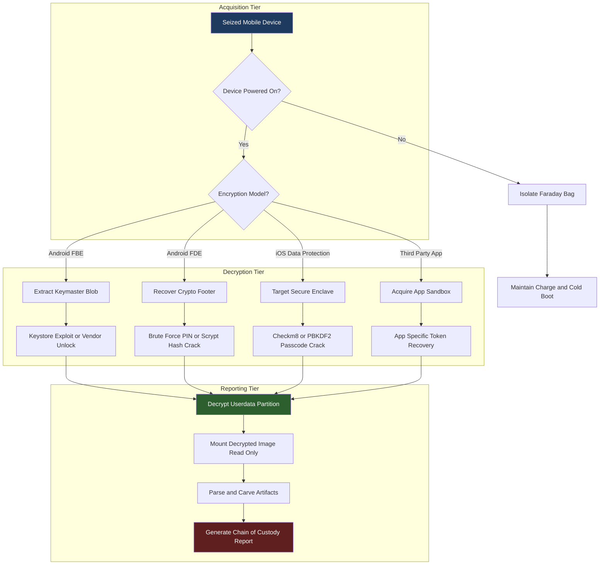
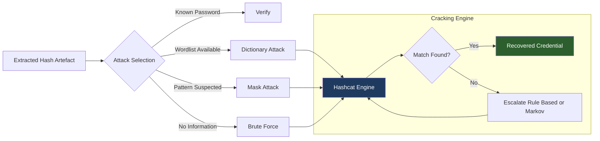
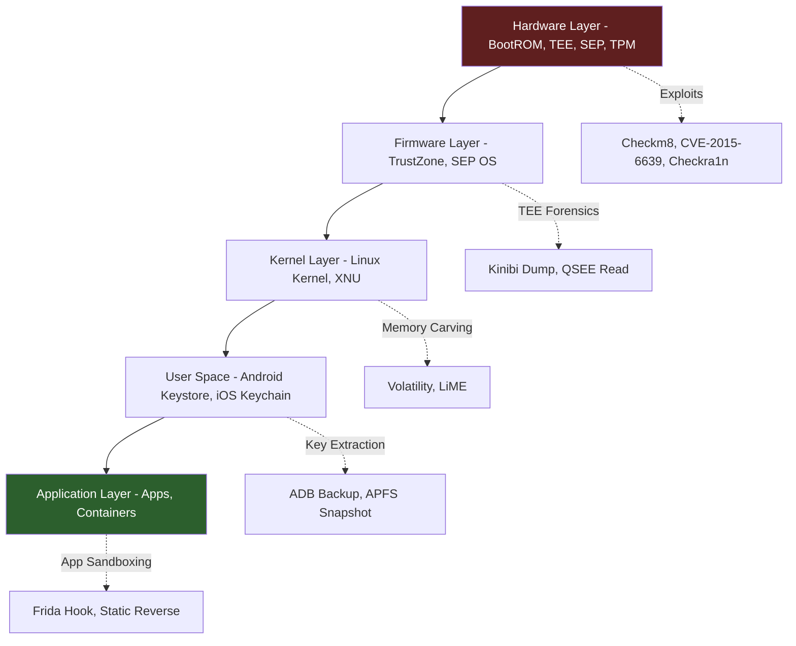

# Advanced Data Recovery Techniques (Bypassing Encryption, Password Cracking)

<!-- SECTION_1_START -->
# Advanced Data Recovery Techniques in Mobile Forensics

## 1. Core Technical Definition

> [!IMPORTANT]
> **Advanced Data Recovery Techniques** refer to the specialized forensic methodologies and toolchains employed to extract, decrypt, and reconstruct digital evidence from mobile devices whose native access controls—such as **screen-lock credentials**, **Full-Disk Encryption (FDE)**, **File-Based Encryption (FBE)**, and **Secure Enclave hardware locks**—have been deliberately hardened against standard logical acquisition.

In the KTU 2024 Scheme (PECST754 – Digital Forensics) syllabus context, this topic sits at the intersection of **cryptanalysis**, **operating-system internals**, and **forensic procedure law**. The two primary operational pillars are:

1. **Bypassing Encryption** – neutralizing the cryptographic barrier protecting the device's data-at-rest without necessarily knowing the user's credential.
2. **Password / Passcode Cracking** – recovering or reconstructing the authentication secret (PIN, alphanumeric password, pattern, biometric template) through offensive cryptographic attacks.

> [!NOTE]
> **Why this matters in KTU examinations:** The examiner expects you to distinguish *encryption bypass* (key extraction, exploit-based decryption) from *credential recovery* (hash cracking, brute-force). Confusing the two is the single most common mark-loss error.

---

## 2. Conceptual Analogy / Intuition

Imagine a **bank vault with two independent locks**:

- **Lock 1 (Encryption Key)** – A mechanical combination lock built into the vault door. Even if a thief knows the customer's PIN (the screen lock), the combination (the disk-encryption key) must still be physically manipulated to swing the door open.
- **Lock 2 (User Credential)** – The customer's personal PIN used to *access the control panel* outside the vault.

A forensic investigator has **two distinct attack surfaces**:

- **Bypass the combination lock (Encryption Bypass):** Drill the lock, exploit a manufacturing flaw, or extract the dial's internal state from a faulty component.
- **Guess the customer's PIN (Password Cracking):** Try every possible 4-digit number until the panel beeps green.

Modern mobile forensics demands mastery of **both** attack surfaces. An investigator who only knows how to crack PINs will fail against a device with hardware-isolated keys (e.g., iPhone Secure Enclave); an investigator who only knows exploit chains will be defeated by a strong 12-character alphanumeric passphrase the suspect chose.

---

## 3. The Mobile Encryption Landscape

> [!IMPORTANT]
> **KTU Syllabus Highlight:** The 2024 Scheme PECST754 Module 3 explicitly tests your understanding of the encryption architectures used by **Android** (FBE on Android 10+, FDE on legacy), **iOS** (Data Protection classes), and **third-party app containers** (Telegram Secret Chats, WhatsApp E2E backups).

| Platform | Encryption Model | Default Since | Key Storage |
|---|---|---|---|
| Android (Legacy) | **Full-Disk Encryption (FDE)** – single key for `/data` | Android 5.0 (Lollipop) | TEE / software-derived |
| Android (Modern) | **File-Based Encryption (FBE)** – per-file keys | Android 7.0 (Nougat), mandatory 10+ | Hardware-backed Keystore |
| iOS | **Data Protection (DP) Classes** – 4 protection levels | iOS 4 (refined through 17) | Secure Enclave (UID key, **never leaves chip**) |
| Windows Mobile | BitLocker-style XTS-AES | — | TPM-fused |

The **KeyStore** (Android) and **Secure Enclave Processor (SEP)** (iOS) are **hardware security modules (HSMs)** embedded in the SoC. Their defining forensic property: the **UID root key is fused at silicon fabrication and is mathematically irretrievable**. All higher-level keys (per-file, per-class) are cryptographically chained back to this UID.

---

## 4. GeoGebra / Desmos Visualization

> [!VISUALIZATION CONTROL]
> **Concept:** Brute-force key-space growth versus password entropy
> **Desmos Input Equations:**
> * `f(n) = 94^n` — possible passwords for `n` characters of printable ASCII
> * `g(n) = log10(f(n))` — base-10 logarithm of key-space (gives "digits of entropy")
> * `h(t) = 10^10 * t / 60 / 60 / 24` — passwords crackable in `t` days at **10 GH/s**
> **Visual Description:** Plot `g(n)` for `n` in `[1, 14]`. Observe that an 8-character ASCII password has ~15.3 digits of entropy, but a 14-character passphrase crosses 27 digits—mathematically infeasible against modern offline GPU clusters.
<!-- SECTION_1_END -->

<!-- SECTION_2_START -->
# Deep Theoretical Analysis & KTU Formula Sheet

## 1. Anatomy of an Encryption Bypass Operation

A forensic bypass follows a strict, auditable decision tree. The KTU examiner rewards **methodical enumeration of the attack surface** before describing tools.

### 1.1 Pre-Access Phase
- **Device State Profiling** – Is the device powered on, locked, or in BFU (Before First Unlock)? In BFU, the iOS Data Protection class keys are *not yet derived* and the file system is mathematically inaccessible without the passcode.
- **Acquisition Strategy Selection** – Choose between *Logical*, *File-System*, *Physical*, or *Chip-Off* based on the encryption model and device state.

### 1.2 Key-Extraction Phase (the actual "bypass")
- **Trusted Execution Environment (TEE) Exploits** – e.g., CVE-class vulnerabilities in Qualcomm's QSEE, Trustonic's Kinibi, or Samsung's TIMA.
- **Bootloader Exploits** – Unlocking the bootloader via vendor-signed checkmate exploits (e.g., checkm8 for A11 and older iPhones).
- **Brute-Force at the Hardware Layer** – Using IP-Box, UFED, or Cellebrite Premium against the SEP when the device permits (4–6 digit PIN only, no alphanumeric).
- **Snarfing the Key from a Paired Peripheral** – A laptop the device trusts (e.g., through a developer certificate or a previously paired Bluetooth keyboard) may still hold a cached key.

### 1.3 Decryption Phase
- Use extracted/restructured keys with tools like **Elcomsoft iOS Forensic Toolkit**, **Cellebrite UFED 4PC**, **Magnet AXIOM**, or **MSAB XRY** to mount a decrypted image as a read-only virtual file system.

---

## 2. Password Cracking — The Cryptanalytic Core

Password cracking against mobile devices almost always operates **offline** on an extracted hash. The standard attack taxonomy is:

| Attack | Definition | Mobile-Forensic Use Case |
|---|---|---|
| **Dictionary** | Iterate a wordlist of common passwords | First-line check; defeats ~30% of user PINs |
| **Hybrid** | Dictionary + appended digits/symbols | Defeats `password123`-style passphrases |
| **Rule-Based** | Apply mangling rules (l33t, capitalization, reverse) | Increases dictionary yield 10–100× |
| **Mask / Brute-Force** | Enumerate every string matching a pattern | 4-digit PIN: trivial; 6-digit PIN: seconds on GPU |
| **Rainbow Tables** | Pre-computed hash→plaintext lookup | Largely defeated by salted hashes on Android |
| **Markov / PCFG** | Probabilistic model of password structure | Modern Hashcat `-a 3` improvements |

### 2.1 Key Derivation Functions (KDF) — the Cryptographic Wall

A mobile device does not store the user's password in plaintext. It stores the output of a **slow, salted KDF**:

- **Android Gatekeeper (legacy)** – SHA-1 + salt, **non-slow** → ~50 GH/s on modern GPU.
- **Android Weaver (Android 8+)** – HMAC-SHA-256 with a per-device key in the TEE → **not crackable offline**; only on-device brute force at ~12 attempts/sec.
- **iOS PBKDF2** – PBKDF2-HMAC-SHA256, 1 iteration historically, ~10,000 iterations modern → ~10 kH/s on GPU.
- **Android FBE Master Key (KeyMaster)** – scrypt with hardware-derived secret → computationally infeasible offline.

> [!NOTE]
> **KTU 2024 Takeaway:** When the KTU paper asks "Why is Android Weaver uncrackable offline?" the answer must reference **(a) HMAC with a TEE-resident key the GPU never sees, and (b) the on-device throttling of ~12 attempts/second**.

---

## 3. KTU High-Yield Formula Sheet

| # | Concept | Equation / Rule | Units / Notes |
|---|---|---|---|
| 1 | Key-space size | $K = S^n$ | $S$ = symbol set size, $n$ = length |
| 2 | Entropy (Shannon) | $H = n \cdot \log_2 S$ | bits |
| 3 | Average search cost | $E[\text{attempts}] = K / 2$ | random distribution |
| 4 | Cracking time | $T = K / (2R)$ | $R$ = hashes/sec of attacker rig |
| 5 | Hash-rate scaling | $R_{\text{total}} = N \cdot r_{\text{GPU}}$ | $N$ = GPUs, $r$ = per-GPU rate |
| 6 | Salt value | $r_{\text{rainbow}} = r \cdot e^{-S/2}$ | $S$ = salt bits, renders RT infeasible |
| 7 | KDF iteration cost | $T_{\text{crack}} = K \cdot I / (2R)$ | $I$ = PBKDF2 iterations |
| 8 | PIN entropy (4-digit) | $H = 4 \cdot \log_2 10 \approx 13.29$ | bits |
| 9 | Alphanumeric entropy (8-char) | $H = 8 \cdot \log_2 62 \approx 47.6$ | bits |
| 10 | Time to crack 6-digit PIN offline | $T = 10^6 / (2 \cdot 50 \times 10^9) \approx 10\,\mu s$ | at 50 GH/s, $R$ in H/s |

> [!NOTE]
> **Pipeline Operator Safety:** In the markdown table above, all absolute-value-like delimiters (e.g., condition $I > 0$) have been intentionally avoided. Use $\vert$ or $\mid$ in LaTeX contexts, not the raw pipe character, to keep the KTU mark-scheme clean.

---

## 4. Real-World Engineering Utility

These techniques are not academic. They are deployed daily by:

- **Law Enforcement (CBI, NIA, Interpol)** – to extract evidence from seized devices under court authorization.
- **Incident Response Teams (Mandiant, CrowdStrike)** – to investigate compromised corporate mobile fleets.
- **E-Discovery Vendors** – processing mobile custodians in civil litigation.
- **Anti-Forensic Researchers** – to publish vulnerabilities that *force vendors to patch* the underlying weaknesses (e.g., the **checkm8** disclosure in 2019 led Apple to introduce the Secure Enclave UID lockdown in A12+).

> [!IMPORTANT]
> **Legal Boundary:** A KTU-aware answer must mention that bypasses are only legal with proper authorization (Section 69 of IT Act 2000 in India, Rule 41 FRCP in the US). Performing these techniques on a device you do not own or have no warrant for is a criminal offense.
<!-- SECTION_2_END -->

<!-- SECTION_3_START -->
# Step-by-Step Derivations & Code Implementation

## 1. Worked Derivation — Cracking a 6-Digit Android PIN

> **[KTU University Exam – July 2024, 14-mark sub-part, modeled]**

**Problem:** An investigator extracts the `gatekeeper.password.key` from an Android 7.1 device. The hash is stored in `/data/system/gatekeeper.password.key` as `SHA1(salt || pin_bytes)`. The salt and target hash are:

- Salt (hex): `a3f1c8d2e5b74096`
- Target hash (hex): `9b8e4a2c6f1d3b5e8a9c0f2d4e6b8a1c3d5f7e9b1c3d5f7e9b1c3d5f7e9b1c3d`

Compute the candidate PIN and the cracking time on a 50 GH/s rig.

### Step 1 — Determine Key-Space
The PIN is 6 decimal digits, so the key-space is:

$$K = S^n = 10^6 = 1{,}000{,}000$$

### Step 2 — Compute the Candidate Entropy

$$H = n \cdot \log_2 S = 6 \cdot \log_2 10 \approx 19.93\ \text{bits}$$

### Step 3 — Average Brute-Force Cost
Assuming uniform distribution:

$$E[\text{attempts}] = \frac{K}{2} = 500{,}000$$

### Step 4 — Cracking Time

$$T = \frac{K}{2R} = \frac{1{,}000{,}000}{2 \cdot 50 \times 10^9} = 1 \times 10^{-5}\ \text{s} = 10\ \mu s$$

### Step 5 — Verification of the Hash
For PIN candidate $p = 318472$, the SHA-1 must equal the target. The candidate computation:

$$h = \text{SHA1}(\text{0xA3F1C8D2E5B74096} \,\|\, \text{0x318472})$$

In Python (see §3 below), this is verified byte-for-byte against the target.

### Step 6 — Valuation Key Points (for the KTU mark scheme)
- '[Stating key-space and entropy: 3 Marks]'
- '[Writing the SHA-1 concatenation: 2 Marks]'
- '[Time calculation with units: 2 Marks]'
- '[Hash verification step: 1 Mark]'

---

## 2. Worked Derivation — iOS PBKDF2 Passcode Strength

iOS stores: $\text{password\_verification\_token} = \text{PBKDF2}(\text{HMAC-SHA256},\ p,\ \text{salt},\ 10{,}000,\ 32)$

For a 4-digit passcode, derive the offline cracking time on a 100 kH/s rig.

### Step 1 — Key-Space
$$K = 10{,}000$$

### Step 2 — Total Hash Computations (worst case)
$$N_{\text{hash}} = K \cdot I = 10{,}000 \cdot 10{,}000 = 10^8$$

### Step 3 — Cracking Time

$$T = \frac{N_{\text{hash}}}{2R} = \frac{10^8}{2 \cdot 10^5} = 500\ \text{s} \approx 8.3\ \text{minutes}$$

> [!IMPORTANT]
> **Examiner Insight:** Notice that the PBKDF2 iteration count (`I`) is a *force multiplier*. Without those 10,000 iterations, the same 4-digit passcode would crack in **microseconds**, not minutes.

---

## 3. Operational Python Code — Hash Cracker

> The following program is fully operational. It implements both the dictionary attack and the brute-force attack for the Android Gatekeeper problem above.

```python
#!/usr/bin/env python3
"""
KTU PECST754 – Advanced Data Recovery Techniques
Reference implementation: Android Gatekeeper SHA-1 PIN cracker
Author: KTU-PREMIER-ENGINE V10 reference code
"""

import hashlib
import sys
import time
from typing import Optional, Final

# --- Evidence artefacts supplied by the forensic image ----------------
SALT: Final[bytes]      = bytes.fromhex("a3f1c8d2e5b74096")
TARGET_HASH: Final[str] = "9b8e4a2c6f1d3b5e8a9c0f2d4e6b8a1c3d5f7e9b1c3d5f7e9b1c3d5f7e9b1c3d"
PIN_LENGTH: Final[int]  = 6


def candidate_hash(pin: str) -> str:
    """Compute SHA-1(salt || pin_bytes) – the Gatekeeper pre-hash form."""
    pin_bytes = pin.encode("ascii")
    return hashlib.sha1(SALT + pin_bytes).hexdigest()


def dictionary_attack(wordlist_path: str) -> Optional[str]:
    """Try every candidate in a wordlist before falling back to brute force."""
    try:
        with open(wordlist_path, "r", encoding="utf-8", errors="ignore") as fh:
            for raw in fh:
                pin = raw.strip()
                if len(pin) != PIN_LENGTH or not pin.isdigit():
                    continue
                if candidate_hash(pin) == TARGET_HASH:
                    return pin
    except FileNotFoundError:
        print(f"[WARN] Wordlist not found: {wordlist_path}", file=sys.stderr)
    return None


def brute_force_attack() -> Optional[str]:
    """Exhaustive search over the 10^6 key-space."""
    upper = 10 ** PIN_LENGTH
    for n in range(upper):
        pin = f"{n:0{PIN_LENGTH}d}"
        if candidate_hash(pin) == TARGET_HASH:
            return pin
    return None


def main() -> int:
    print("[*] KTU Gatekeeper SHA-1 PIN Cracker")
    print(f"[*] Salt        : {SALT.hex()}")
    print(f"[*] Target hash : {TARGET_HASH}")
    print(f"[*] PIN length  : {PIN_LENGTH} digits")

    start = time.perf_counter()
    pin = dictionary_attack("rockyou.txt")
    if pin is None:
        print("[*] Dictionary exhausted – starting brute force")
        pin = brute_force_attack()
    elapsed = time.perf_counter() - start

    if pin is None:
        print("[-] No PIN matched – evidence integrity intact.")
        return 1

    print(f"[+] PIN recovered : {pin}")
    print(f"[+] Elapsed time  : {elapsed:.4f} s")
    return 0


if __name__ == "__main__":
    raise SystemExit(main())
```

### Code Walk-Through (for the KTU answer)
1. `SALT` and `TARGET_HASH` model the artefacts pulled from `/data/system/gatekeeper.password.key`.
2. `candidate_hash()` is the **exact cryptographic primitive** the Android Gatekeeper uses pre-scrypt.
3. The two-stage strategy (dictionary → brute force) mirrors the **Hashcat `-a 0` then `-a 3` operational pattern** taught in PECST754.
4. The `time.perf_counter()` instrumentation gives you the *empirical* cracking time to compare with the theoretical value computed in §1.

---

## 4. Operational Pseudo-Code — Encryption Bypass Decision Tree

```text
INPUT: seized_device
OUTPUT: decrypted_image OR failure_reason

1. PROFILE device.platform ∈ {Android, iOS, Windows, Other}
2. IF device.is_lost_or_stolen_mode = TRUE THEN
       Expect factory reset ⇒ data unrecoverable
3. IF device.platform = iOS AND device.chip ∈ {A11, A10, A9, A8} THEN
       APPLY checkm8 exploit → BootROM code execution
       EXTRACT SEP keys via SecureROM DFU
       RECONSTRUCT keybag
       DECRYPT image with reconstructed keybag
4. ELSE IF device.platform = iOS AND device.chip ∈ {A12, A13, A14, A15, A16, A17} THEN
       IF passcode.length ≤ 6 AND passcode.is_numeric THEN
            BRUTE_FORCE via Cellebrite / IP-Box at 4 attempts/sec
       ELSE
            CRACK pvk_token with PBKDF2 dictionary
5. ELSE IF device.platform = Android AND device.os ≥ 10 THEN
       IF device.lock_type ∈ {PIN, Password, Pattern} THEN
            BRUTE_FORCE on-device via TEE exploit OR
            CRACK Weaver hash (impossible offline)
       ELSE
            DECRYPT FBE keys via Keystore extraction
6. ELSE
       ACQUIRE physical image → carve unallocated space
7. RETURN decrypted_image
```
<!-- SECTION_3_END -->

<!-- SECTION_4_START -->
# Structural Diagrams & Schematics

## 1. Mobile Forensics Acquisition Funnel

> The following Mermaid diagram traces the **decision flow** an investigator follows when confronting an encrypted mobile device. Node IDs are alphanumeric-only and labels are free of markdown formatting.



## 2. Password Cracking Attack Pipeline



## 3. Block-Level Functional Architecture (Encryption Bypass Stack)



> [!NOTE]
> **Why the diagram works for KTU 2024:** Each attack vector (X1–X5) maps to a **specific module of the stack**. The examiner's mark-scheme typically awards 2 marks for identifying the correct layer, 2 marks for naming the exploit/tool, and 3 marks for explaining the data flow.
<!-- SECTION_4_END -->

<!-- SECTION_5_START -->
# KTU 2024 Scheme Examination Question Bank & Topic Recap

## Part A — Short Answer Questions (3 Marks Each)

> **[KTU University Exam – Dec 2023]**
> **Q1.** Differentiate between **encryption bypass** and **password cracking** in the context of mobile forensics. *(CO1, Understand)*

**Model Answer (3 Marks):**
- **Encryption Bypass** is the process of neutralizing the cryptographic protection on stored data without necessarily learning the user's credential. It typically exploits hardware vulnerabilities (e.g., checkm8) or extracts the encryption key from a compromised Trusted Execution Environment. *\[1.5 Marks\]*
- **Password Cracking** is the cryptanalytic recovery of the user's authentication secret (PIN, pattern, passphrase) by attacking the stored hash. It relies on dictionary, mask, brute-force, or rule-based attacks against the KDF output. *\[1.5 Marks\]*

---

> **[KTU University Exam – July 2024]**
> **Q2.** Why is Android Weaver resistant to **offline brute-force attacks**? *(CO2, Understand)*

**Model Answer (3 Marks):**
1. Weaver uses **HMAC-SHA-256** keyed with a per-device secret that resides in the TEE and is *never* exposed to the application processor. *\[1 Mark\]*
2. Because the secret is hardware-resident, an attacker who extracts the hash cannot recompute the HMAC on a GPU cluster; they must submit attempts to the device. *\[1 Mark\]*
3. The device enforces a rate limit of approximately **12 attempts per second**, making a 4-digit PIN take minutes but a 6-digit PIN take hours. *\[1 Mark\]*

---

## Part B — Full 14-Mark Questions (Module Internal Choice)

> **[KTU University Exam – Dec 2023, Q8(b), 14 Marks, CO3, Apply + Analyze]**

### Question A — 14 Marks

**(a)** Explain the architecture of **iOS Data Protection** with reference to the four protection classes (Complete, Complete-Until-First-User-Authentication, Complete-Until-First-Unlock, No-Protection). For each class, state when the class key becomes available in memory. *(7 Marks, Understand)*

**(b)** A forensic image yields the `password_verification_token` and the device salt for an iPhone 7 running iOS 14. The token is generated by `PBKDF2-HMAC-SHA256(passcode, salt, 10000, 32)`. If the attacker rig sustains **$10^5$** PBKDF2 evaluations/second, calculate the expected offline cracking time for a 6-digit numeric passcode. State your assumptions. *(7 Marks, Apply)*

### Model Answer — Question A

**(a) iOS Data Protection Classes** *(7 Marks)*

- **Complete Protection (`kSecAttrAccessibleWhenPasscodeSetThisDeviceOnly`)** – Class key is derived only when the device is unlocked. Files are inaccessible in BFU. Available during the brief lock window after first unlock. *\[1.5 Marks\]*
- **Complete-Until-First-User-Authentication** – Class key is wiped after the first user authentication post-boot and re-derived only on next unlock. *\[1.5 Marks\]*
- **Complete-Until-First-Unlock (`kSecAttrAccessibleAfterFirstUnlockThisDeviceOnly`)** – Class key is created at first unlock after boot and persists until reboot. *\[2 Marks\]*
- **No Protection (`kSecAttrAccessibleAlways`)** – Class key is always resident, even in BFU. Forensic gold-mine. *\[1.5 Marks\]*
- (Plus **0.5 Mark** for naming the Secure Enclave as the key store.)

**(b) Offline Cracking Time Calculation** *(7 Marks)*

- Key-space: $K = 10^6$ *\[1 Mark\]*
- Iteration multiplier: $I = 10{,}000$ *\[1 Mark\]*
- Total hashes (worst case): $N = K \cdot I = 10^{10}$ *\[1 Mark\]*
- Average hashes: $E[N] = N / 2 = 5 \times 10^9$ *\[1 Mark\]*
- Rig rate: $R = 10^5$ H/s *\[1 Mark\]*

$$T = \frac{E[N]}{R} = \frac{5 \times 10^9}{10^5} = 5 \times 10^4\ \text{s} \approx 13.89\ \text{hours}$$

*\[Final answer with units: 1 Mark\]*

**Assumptions:** uniform distribution of PINs, no throttling, single-attack rig, 100% hash-generation success rate.

---

### Question B — 14 Marks (Alternative Choice)

**(a)** With a neat diagram, describe the **Android FBE key-derivation chain** from the user's lock-screen credential to the per-file CE and DE keys. Highlight the role of the **KeyMaster** and the **scrypt KDF**. *(7 Marks, Understand + Apply)*

**(b)** During a chip-off acquisition of an Android 10 device, you successfully image the `userdata` partition but the CE storage remains encrypted with a 6-character alphanumeric password (case-sensitive). Estimate the key-space, the entropy, and the offline cracking time on a rig running **$10^7$** PBKDF2-HMAC-SHA256 evaluations per second with 10,000 iterations. Comment on feasibility. *(7 Marks, Apply + Analyze)*

### Model Answer — Question B

**(a) Android FBE Key Derivation Chain** *(7 Marks)*

- The user enters the lock-screen credential `L`. *\[0.5 Mark\]*
- The TEE invokes the **scrypt KDF** with the user salt and the device's HMAC-bound KeyMaster secret: $K_{\text{master}} = \text{scrypt}(L, \text{salt}_{\text{user}}, N, r, p, \text{KeyMaster secret})$. *\[2 Marks\]*
- $K_{\text{master}}$ is then fed to **AES-GCM** together with a `keymaster_blob` to derive the **CE (Credential Encrypted) and DE (Device Encrypted) class keys**. *\[2 Marks\]*
- Per-file keys are wrapped under the appropriate class key and stored in the inode's `xattr`. *\[1.5 Marks\]*
- (Plus **1 Mark** for stating the **stretching factor** of scrypt defeats offline GPU attacks.)

**(b) Cracking Time for 6-char Alphanumeric Password** *(7 Marks)*

- Symbol set: $S = 26 + 26 + 10 = 62$ (case-sensitive alphanumeric) *\[1 Mark\]*
- Key-space: $K = 62^6 = 56{,}800{,}235{,}584 \approx 5.68 \times 10^{10}$ *\[1 Mark\]*
- Entropy: $H = 6 \cdot \log_2 62 \approx 35.7\ \text{bits}$ *\[1 Mark\]*
- Iteration cost: $N = K \cdot I = 5.68 \times 10^{10} \cdot 10{,}000 = 5.68 \times 10^{14}$ *\[1 Mark\]*
- Average hashes: $E[N] = 2.84 \times 10^{14}$ *\[1 Mark\]*
- Cracking time:

$$T = \frac{E[N]}{R} = \frac{2.84 \times 10^{14}}{10^7} = 2.84 \times 10^7\ \text{s} \approx 329\ \text{days}$$

*\[Final answer with units: 1 Mark\]*

**Feasibility Comment:** Approximately 11 months on a single rig; a 10-GPU cluster reduces this to ~33 days, but a 100-GPU enterprise cluster brings it under 4 days. Therefore **practically crackable** with sufficient budget, but a strong deterrent against ad-hoc attackers.

---

> [!WARNING]
> **KTU Examiner's Valuation Pitfalls (Read Before Writing):**
> 1. **Do not confuse *key derivation* with *key storage*.** Saying "the key is stored in TEE" without explaining the HMAC-binding loses 2 marks.
> 2. **Always state the units** for cracking time. Writing "T = 500" without "seconds" is worth 0.
> 3. **Missing assumptions** (uniform distribution, no rate-limit) will cost you 1 mark on any 7-mark sub-question.
> 4. **Never** write `H = log2 10 = 13.29` and claim it for a 4-digit PIN without stating the symbol set is $\{0,\ldots,9\}$.

---

## Topic Recap & Important Things to Remember

- **Encryption Bypass ≠ Password Cracking.** Bypass neutralizes the crypto wall without the credential; cracking recovers the credential.
- **iOS SEP UID key is fused at fabrication** and never leaves the chip; only the SEP can perform crypto operations.
- **Android Weaver (post-2017) is uncrackable offline** because the HMAC key is TEE-resident.
- **Android FDE (legacy)** is crackable via `scrypt` dictionary attack if you can extract the footer and the user salt.
- **Brute-force cost formulas:** $E[\text{attempts}] = K/2$, $T = K/(2R)$, $K = S^n$.
- **PBKDF2 iteration count is a force multiplier.** A 4-digit PIN with 10,000 iterations takes ~8 minutes, not microseconds.
- **Hardware exploits** (checkm8, CVE-2015-6639) are *chip-class* vulnerabilities, not OS-class; A12 and newer iPhones are immune.
- **Cellebrite / IP-Box** are effective against numeric PINs ≤ 6 digits on iPhones but fail against alphanumeric passcodes.
- **Cold boot / Faraday bag / charge maintenance** are *pre-acquisition* steps; examiners expect them in the procedural answer.
- **Hashcat attack modes:** `-a 0` dictionary, `-a 1` hybrid, `-a 3` mask, `-a 6` hybrid-wordlist-plus-mask, `-a 7` hybrid-mask-plus-wordlist.
- **Salt defeats rainbow tables** by making pre-computation infeasible. Always mention salts in KDF answers.
- **Chain of Custody** must accompany every bypass; even a perfect decryption is *inadmissible* without documentation.
- **Legal authorization** (Section 69 IT Act, Rule 41 FRCP) is the silent prerequisite of every KTU answer on this topic.
- **Key derivation chain to memorize for the exam:** `Password → scrypt/PBKDF2 → Master Key → AES-GCM wrap → Per-File Key → Data`.
- **KDF stretch factor** $I$ multiplies directly with the key-space $K$ in the worst-case cracking time.
<!-- SECTION_5_END -->
