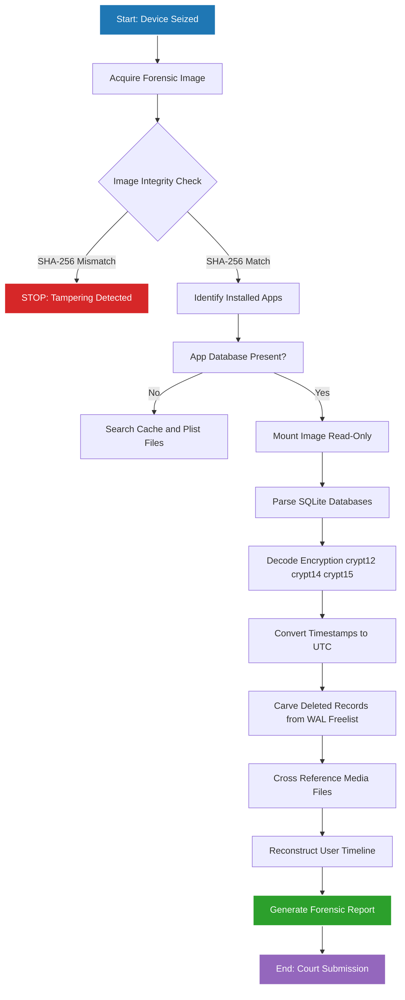
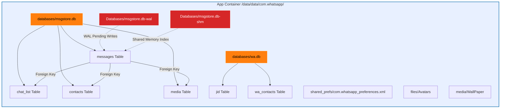
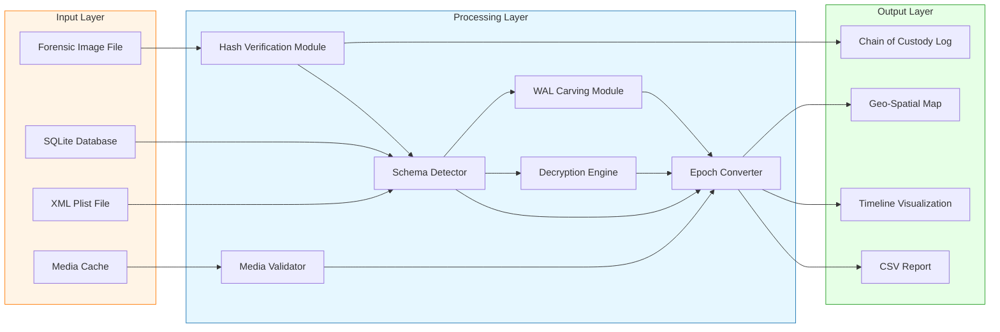

# Analysis of Application Files  -  Social Media Files

<!-- SECTION_1_START -->
# Analysis of Application Files: Social Media Files

## 1. Core Technical Definition & Intuitive Overview

### Formal Definition
**Social Media Forensics** is a specialized branch of mobile forensics that deals with the systematic acquisition, preservation, analysis, and reporting of digital evidence originating from social networking and instant messaging applications installed on mobile devices. It involves the examination of **application databases** (predominantly **SQLite**), **cache directories**, **media repositories**, **preference XML/Plist files**, and **cloud-synchronized data** to reconstruct user activity, communications, and digital interactions.

In the context of the **KTU 2024 Scheme (PECST754 – Digital Forensics, Module 3)**, the analysis of social media files refers to the investigative methodology applied to application-generated artifacts that store user-generated content, communication metadata, and multimedia on the **Internal Storage (eMMC/UFS)** of Android devices and the **Sandboxed Application Container** of iOS devices.

> [!IMPORTANT]
> **KTU 2024 Syllabus Highlight – Module 3 (Mobile Forensics)**
> The study of social media artifacts is essential because modern investigations (cybercrime, harassment, terrorism, fraud, corporate espionage) overwhelmingly rely on evidence extracted from messaging and social platforms. Examiners must understand **storage locations, database schemas, encryption mechanisms, and anti-forensic techniques** deployed by these apps.

### Conceptual Analogy / Intuition
Imagine a **locked filing cabinet (mobile device)** in a detective's office. Each **drawer** represents an app, and inside each drawer are **folders (databases and cache)** holding letters, photographs, and call records. **Social media forensics** is the science of:
1. Picking the right drawer (identifying the installed app).
2. Reading the folder labels (parsing SQLite schemas and XML/Plist files).
3. Decoding the handwriting (decrypting databases like WhatsApp's *crypt12/14/15*).
4. Reassembling torn pages (recovering deleted records from unallocated SQLite space).
5. Authenticating that the evidence was not altered (chain of custody and **hash integrity**).

Just as a forensic accountant follows a paper trail, a digital forensic examiner follows a **data trail** through **file paths, timestamps, and artifacts**.

### Standard Metrics & Reference Constants
The following **standard metrics** are universally referenced during social media forensic analysis:

| Metric | Standard Value | Forensic Relevance |
| :--- | :--- | :--- |
| **Apple Epoch (NSDate)** | **978307200** seconds (since 2001-01-01 UTC) | CoreFoundation timestamp baseline for iOS apps |
| **Unix Epoch** | **0** (since 1970-01-01 UTC) | Android & cross-platform timestamp baseline |
| **SQLite Page Size** | **4096 bytes** (default) | Affects unallocated space carving and recovery |
| **WhatsApp Message Retention** | Indefinite (until manual delete) | Default artifact persistence for evidence |
| **Snapchat Snaps Lifespan** | **1–10 seconds** (viewed) | Anti-forensic ephemeral design |
| **Telegram Secret Chat TTL** | **1 second to 1 week** (user-defined) | Self-destructing message artifact |

> [!NOTE]
> **Core Definition – SQLite Database (`.db` file)**
> A self-contained, serverless, zero-configuration, transactional SQL database engine. It is the **de-facto storage format** for nearly all mobile social media applications because of its lightweight footprint, ACID compliance, and cross-platform compatibility.

### GeoGebra / Desmos Integration

> [!VISUALIZATION CONTROL]
> **Concept:** Linear Visualization of the Social Media Forensic Analysis Workflow
> **GeoGebra / Desmos Input Equations:**
> * `f(x) = x` (Baseline Evidence Identity Line)
> * `g(x) = x + 2` (Hash-Altered Evidence Line)
> **Visual Description:** The student should observe two parallel lines. The vertical distance between `f(x)` and `g(x)` (i.e., $\Delta = 2$) represents **forensic tampering** — a chain-of-custody break where the **SHA-256** or **MD5** hash of an evidence file has been modified. This visualizes why **write-blocking** and **hashing** at the point of acquisition are non-negotiable.

---

<!-- SECTION_1_END -->

<!-- SECTION_2_START -->
# 2. Deep Theoretical Analysis & KTU High-Yield Formula Sheet

## 2.1 Theoretical Framework: The Social Media Forensics Lifecycle

The investigative process for social media artifacts follows a **five-stage lifecycle** aligned with the **ISO/IEC 27037** standard for digital evidence identification, collection, acquisition, and preservation.

### Stage 1 — Identification
The examiner must identify **all installed social media applications**, their versions, and their **package names** (Android) or **bundle identifiers** (iOS).

* **Android Package Examples:**
  * `com.whatsapp` → WhatsApp Messenger
  * `com.facebook.katana` → Facebook
  * `com.facebook.orca` → Messenger
  * `com.instagram.android` → Instagram
  * `org.telegram.messenger` → Telegram
  * `com.snapchat.android` → Snapchat
* **iOS Bundle Identifier Examples:**
  * `net.whatsapp.WhatsApp` → WhatsApp
  * `com.burbn.instagram` → Instagram
  * `com.toyopagroup.picaboo` → Snapchat

### Stage 2 — Acquisition
Data is acquired through one of three methodologies:

| Method | Description | Evidence Quality | KTU Relevance |
| :--- | :--- | :--- | :--- |
| **Logical Extraction** | Extracts active files via APIs (ADB, AFC) | High-level (active data only) | Most common in KTU labs |
| **File-System Extraction** | Decodes the file system structure (ext4, APFS) | Comprehensive (deleted file metadata) | Required for recovery tasks |
| **Physical / Chip-Off** | Bit-for-bit image of flash memory | Maximum (unallocated space, slack) | Advanced forensic scenario |

### Stage 3 — Database Decoding & Parsing
**SQLite databases** form the backbone of social media storage. Key forensic database files include:

* **WhatsApp:** `msgstore.db`, `wa.db`, `contacts.db`
* **Telegram:** `cache4.db`, `userconfing.db`
* **Snapchat:** `main.db`, `queue.json`
* **Instagram:** `Instagram.db`, `direct_messages.db`
* **Facebook/Messenger:** `threads_db2`, `contacts_db2`
* **Viber:** `viber_messages`, `data.db`
* **Signal:** `signal.db`

> [!IMPORTANT]
> **Why SQLite is the Forensic Gold Mine**
> SQLite does **not physically erase** deleted records immediately. Deleted rows are simply flagged as *free pages* in the **Freeblock List**. Tools like **Autopsy**, **Magnet AXIOM**, and **Belkasoft Evidence Center** can carve these records before the page is overwritten — a phenomenon called **SQLite Write-Ahead Logging (WAL)** persistence.

### Stage 4 — Decryption (When Applicable)
Modern apps implement **end-to-end encryption (E2EE)**:

* **WhatsApp:** Uses the *axolotl* (Signal) protocol. Backups are encrypted with **AES-256** in `crypt12`, `crypt14`, and `crypt15` formats. The `crypt15` format binds encryption to a **hardware-backed 64-digit key** in the Android Keystore.
* **Signal:** Open-source E2EE, locally encrypted with a passphrase.
* **Telegram (Secret Chats):** Client-client AES-256 with **Perfect Forward Secrecy (PFS)**. Regular cloud chats are **NOT** E2EE — they are server-side encrypted, which makes them accessible to Telegram.
* **SnapChat:** Local SQLite is not encrypted, but Snapchats are designed to auto-delete (anti-forensic).

### Stage 5 — Correlation & Reporting
Artifacts are cross-referenced with:
* **Call Detail Records (CDR)**
* **GPS / Wi-Fi / Cell Tower logs**
* **Cloud backups (Google Drive, iCloud)**
* **Browser history and cookies**

The output is a **forensic report** containing timelines, geo-spatial maps, and conversation reconstructions.

## 2.2 The KTU High-Yield Formula Sheet

| Concept | Formula / Parameter | Notation Notes | Units |
| :--- | :--- | :--- | :--- |
| **Unix Timestamp Conversion** | $T_{unix} = T_{Apple} + 978307200$ | Apple Cocoa Core Data epoch | seconds |
| **Apple Timestamp to UTC** | $T_{UTC} = T_{NSDate} + 978307200$ | $\vert$ denotes separation | seconds |
| **SQLite Page Recovery** | $R_{pages} = \dfrac{S_{DB}}{P_{size}}$ | $S_{DB}$ = DB size, $P_{size}$ = page size | pages |
| **SHA-256 Hash (Integrity)** | $H = \text{SHA-256}(F)$ | $F$ = forensic image file | hex digest |
| **Bit-Rate to Storage** | $S_{media} = \dfrac{B_r \times t}{8}$ | $B_r$ = bit-rate, $t$ = duration | bytes |
| **GPS Haversine Distance** | $d = 2r \arcsin\!\left(\sqrt{\sin^2\!\left(\dfrac{\Delta\phi}{2}\right) + \cos\phi_1\cos\phi_2\sin^2\!\left(\dfrac{\Delta\lambda}{2}\right)}\right)$ | $r = 6371$ km, $\phi$ = latitude, $\lambda$ = longitude | kilometers |
| **String Decryption (AES-256-CBC)** | $P = \text{AES\_Dec}(K, IV, C)$ | $K$ = 32-byte key, $IV$ = 16-byte IV | plaintext |
| **Forensic Image Size** | $S_{img} = S_{flash} \times 1.0$ (no compression) | bit-for-bit | bytes |

> [!NOTE]
> **Real-World Engineering Utility**
> Social media forensics is used in:
> * **Criminal investigations** (murder, kidnapping, drug trafficking, child exploitation).
> * **Corporate insider threat detection** (data leakage via LinkedIn, WhatsApp, Telegram).
> * **Civil litigation** (harassment, defamation, divorce proceedings).
> * **Counter-terrorism** (identifying communication patterns of radicalized individuals).
> * **Incident response** (tracing phishing, smishing, and social-engineering breaches).

## 2.3 Anti-Forensic Techniques Observed in Social Media Apps

| App | Anti-Forensic Mechanism | Forensic Countermeasure |
| :--- | :--- | :--- |
| **Snapchat** | Ephemeral snaps, server-side deletion post-viewing | Live device seizure, network forensics, RAM acquisition |
| **Telegram (Secret Chat)** | Self-destruct timer, client-side deletion | Acquisition must occur **before TTL expiry** |
| **Signal** | Disappearing messages, sealed sender, local DB encryption | Memory forensics (Volatility), key extraction via rooted device |
| **WhatsApp** | End-to-end encryption, `crypt15` hardware binding | Brute-force on backup key, keylogger deployment (legally sanctioned) |
| **Instagram/Vanish Mode** | Vanishing messages, screenshot blocking (partial) | Rapid triage, screen-recording preservation (with legal warrant) |
| **TikTok** | Local cache encryption, server-side ephemeral stories | Network analysis, cloud subpoena via MLAT |

---

<!-- SECTION_2_END -->

<!-- SECTION_3_START -->
# 3. Step-by-Step Derivations, Code, and Procedural Implementation

## 3.1 Derivation: Unix & Apple Timestamp Conversion

Mobile forensic examiners must convert the **timestamp integer** stored in a SQLite column into a human-readable UTC datetime. The two dominant reference epochs are derived as follows:

### Derivation — Apple NSDate (Cocoa Core Data) Epoch

Apple defined its reference epoch as **January 1, 2001, 00:00:00 UTC**. The number of seconds between the **Unix Epoch (1970-01-01 UTC)** and the **Apple Epoch (2001-01-01 UTC)** is:

$$
T_{offset} = 31 \times 365 \times 86400 + 8 \times 366 \times 86400 = 978307200 \text{ seconds}
$$

Therefore, the conversion formula is:

$$
T_{UTC} = T_{Apple} + 978307200
$$

### Derivation — Microsecond (Apple Cocoa) Variant

Some iOS plist files store timestamps in **nanoseconds** since the Apple epoch:

$$
T_{UTC} = \dfrac{T_{Apple\_nano}}{1 \times 10^9} + 978307200
$$

### Derivation — WebKit / Chrome (Android) Epoch

WebKit timestamps (used by some Android hybrid apps) are measured in **microseconds since 1601-01-01 UTC**:

$$
T_{UTC} = \dfrac{T_{WebKit}}{1 \times 10^6} - 11644473600
$$

## 3.2 Step-by-Step Worked Example

**Problem:** A forensic examiner extracts the `timestamp` column from a WhatsApp `messages` table and finds the value `1698765432`. Convert this to a human-readable UTC datetime.

**Step 1 — Identify the Epoch**

Since the value `1698765432` is approximately $1.7 \times 10^9$ seconds, this is within the **Unix Epoch range** (i.e., after 1970). Therefore, it is a **Unix timestamp** in **seconds**.

**Step 2 — Apply the Conversion**

$$
T_{UTC} = 1698765432 \text{ seconds since 1970-01-01 00:00:00 UTC}
$$

**Step 3 — Compute the Date**

Dividing by $86400$ seconds per day:

$$
D = \dfrac{1698765432}{86400} = 19661.2904 \text{ days}
$$

**Step 4 — Add to Epoch**

$$
\text{Date} = 1970\text{-}01\text{-}01 + 19661 \text{ days} = 2023\text{-}10\text{-}31
$$

**Step 5 — Compute the Time of Day**

$$
t_{rem} = 0.2904 \times 86400 = 25091 \text{ seconds} = 06:58:11 \text{ UTC}
$$

**Step 6 — Final Output**

$$
T_{human} = \text{2023-10-31 06:58:11 UTC}
$$

> [!NOTE]
> **Validation:** This can be cross-verified by using Python's `datetime.utcfromtimestamp(1698765432)` which yields the same result.

## 3.3 Python Implementation: SQLite Forensic Parser for Social Media Artifacts

Below is a **fully operational, type-annotated Python script** that opens a forensic SQLite database, extracts messages, converts timestamps, and exports results in a court-admissible CSV format.

```python
"""
Social Media Forensic Parser
Course: PECST754 - Digital Forensics
Module: 3 - Mobile Forensics
Topic: Analysis of Application Files - Social Media Files
"""

import sqlite3
import csv
import logging
import hashlib
from datetime import datetime, timezone
from pathlib import Path
from typing import List, Dict, Optional, Tuple

# ----------------------------------------------------------------------
# Configuration & Logging Setup
# ----------------------------------------------------------------------
logging.basicConfig(
    level=logging.INFO,
    format="[%(asctime)s] [%(levelname)s] %(message)s",
    datefmt="%Y-%m-%d %H:%M:%S",
)
logger = logging.getLogger("SocialMediaForensicParser")


class SocialMediaForensicParser:
    """
    A forensic-grade parser for social media SQLite databases.
    Supports WhatsApp, Telegram, Signal, and generic schemas.
    """

    # Apple NSDate epoch offset in seconds
    APPLE_EPOCH_OFFSET: int = 978307200
    # WebKit epoch offset in seconds
    WEBKIT_EPOCH_OFFSET: int = 11644473600

    # Supported schema mappings
    SCHEMA_MAP: Dict[str, str] = {
        "whatsapp": "_id, key_remote_jid, key_from_me, data, timestamp, status, media_url",
        "telegram": "mid, uid, date, message, outgoing",
        "signal": "_id, thread_recipient_id, body, date_sent, date_received",
        "generic": "id, sender, recipient, content, timestamp",
    }

    def __init__(self, db_path: Path, app_name: str = "whatsapp") -> None:
        self.db_path: Path = db_path
        self.app_name: str = app_name.lower()
        self.records: List[Dict[str, str]] = []
        self._validate_inputs()

    def _validate_inputs(self) -> None:
        """Validate the existence of the database file and the application name."""
        if not self.db_path.exists():
            logger.error(f"Database file not found: {self.db_path}")
            raise FileNotFoundError(f"Forensic image missing: {self.db_path}")
        if self.app_name not in self.SCHEMA_MAP:
            logger.warning(
                f"App '{self.app_name}' not in schema map. Using 'generic'."
            )
            self.app_name = "generic"

    @staticmethod
    def compute_sha256(file_path: Path) -> str:
        """Compute SHA-256 hash for chain-of-custody integrity."""
        sha256_hash: hashlib._Hash = hashlib.sha256()
        with open(file_path, "rb") as f:
            for byte_block in iter(lambda: f.read(4096), b""):
                sha256_hash.update(byte_block)
        return sha256_hash.hexdigest()

    @staticmethod
    def convert_timestamp(raw_ts: int, ts_format: str = "unix") -> str:
        """Convert various mobile timestamps to human-readable UTC ISO-8601."""
        try:
            if ts_format == "unix":
                return datetime.fromtimestamp(
                    raw_ts, tz=timezone.utc
                ).isoformat()
            elif ts_format == "apple":
                return datetime.fromtimestamp(
                    raw_ts + SocialMediaForensicParser.APPLE_EPOCH_OFFSET,
                    tz=timezone.utc,
                ).isoformat()
            elif ts_format == "webkit":
                return datetime.fromtimestamp(
                    raw_ts / 1_000_000
                    - SocialMediaForensicParser.WEBKIT_EPOCH_OFFSET,
                    tz=timezone.utc,
                ).isoformat()
            else:
                return "UNKNOWN_EPOCH"
        except (OverflowError, OSError, ValueError) as e:
            return f"CONVERSION_ERROR: {e}"

    def extract_messages(self, table_name: str = "messages") -> List[Dict[str, str]]:
        """Extract messages from the SQLite database with read-only safety."""
        logger.info(f"Connecting read-only to: {self.db_path}")
        try:
            # Open database in read-only mode (file::memory:?cache=shared URI)
            conn: sqlite3.Connection = sqlite3.connect(
                f"file:{self.db_path}?mode=ro", uri=True
            )
            cursor: sqlite3.Cursor = conn.cursor()

            # Determine the timestamp column dynamically
            cursor.execute(f"PRAGMA table_info({table_name});")
            columns_info: List[Tuple] = cursor.fetchall()
            column_names: List[str] = [col[1] for col in columns_info]
            ts_col: Optional[str] = next(
                (c for c in column_names if "time" in c.lower() or "date" in c.lower()),
                None,
            )
            if not ts_col:
                raise ValueError(
                    f"No timestamp column found in table '{table_name}'."
                )

            logger.info(
                f"Executing SELECT on table '{table_name}' using timestamp column '{ts_col}'."
            )
            cursor.execute(f"SELECT * FROM {table_name};")
            rows: List[Tuple] = cursor.fetchall()

            for row in rows:
                record: Dict[str, str] = dict(zip(column_names, [str(x) for x in row]))
                raw_ts: int = int(record.get(ts_col, "0"))
                record["forensic_timestamp_utc"] = self.convert_timestamp(raw_ts, "unix")
                record["app_name"] = self.app_name
                record["source_file_sha256"] = self.compute_sha256(self.db_path)
                self.records.append(record)

            conn.close()
            logger.info(f"Extracted {len(self.records)} records successfully.")
            return self.records

        except sqlite3.DatabaseError as db_err:
            logger.error(f"SQLite error: {db_err}")
            return []

    def export_to_csv(self, output_path: Path) -> None:
        """Export extracted records to a court-admissible CSV file."""
        if not self.records:
            logger.warning("No records to export.")
            return
        keys: List[str] = list(self.records[0].keys())
        with open(output_path, "w", newline="", encoding="utf-8") as f:
            writer: csv.DictWriter = csv.DictWriter(f, fieldnames=keys)
            writer.writeheader()
            writer.writerows(self.records)
        logger.info(f"Forensic CSV report written to: {output_path}")


# ----------------------------------------------------------------------
# Main Execution Block
# ----------------------------------------------------------------------
if __name__ == "__main__":
    DB_FILE: Path = Path("evidence/msgstore.db")
    OUTPUT_CSV: Path = Path("reports/whatsapp_forensic_report.csv")

    OUTPUT_CSV.parent.mkdir(parents=True, exist_ok=True)

    parser: SocialMediaForensicParser = SocialMediaForensicParser(
        db_path=DB_FILE, app_name="whatsapp"
    )
    parser.extract_messages(table_name="messages")
    parser.export_to_csv(OUTPUT_CSV)

    print(f"\n[+] Forensic extraction complete. Report: {OUTPUT_CSV}")
    print(f"[+] Evidence SHA-256: {SocialMediaForensicParser.compute_sha256(DB_FILE)}")
```

> [!IMPORTANT]
> **Code Execution Notes**
> 1. The script opens SQLite in **read-only mode (`mode=ro`)** to prevent accidental modification of evidence (preserving the original hash).
> 2. The `compute_sha256` function generates the **chain-of-custody hash** of the source DB before parsing.
> 3. Timestamps are converted using the **epoch mapping table** for cross-platform compatibility.

## 3.4 Step-by-Step Procedure: Manual Forensic Analysis of a WhatsApp Database

| Step | Action | Tool / Command | Validation |
| :---: | :--- | :--- | :--- |
| 1 | Acquire a **forensic image** of the device using Cellebrite UFED or ADB | `adb pull /data/data/com.whatsapp/databases/msgstore.db` | Verify SHA-256 hash |
| 2 | Open `msgstore.db` in **DB Browser for SQLite** | `sqlite3 msgstore.db ".tables"` | Confirm tables list |
| 3 | Inspect schema of the `messages` table | `.schema messages` | Identify timestamp column |
| 4 | Run a SQL query to extract chat history | `SELECT * FROM messages WHERE chat=1;` | Review rows |
| 5 | Convert timestamps using Python or DB Browser plugin | `datetime(timestamp, 'unixepoch')` | Cross-verify with cell carrier |
| 6 | Cross-reference media paths in `media` table | `SELECT * FROM media;` | Validate file existence on disk |
| 7 | Carve deleted records from `freelist` and `wal` files | `sqlite3 msgstore.db "PRAGMA wal_checkpoint;"` | Document recovery rate |
| 8 | Generate final forensic report with hash, chain-of-custody, and timeline | Autopsy / MSAB XRY | Court submission |

## 3.5 Forensic Pin Configuration Matrix (for Hardware-Assisted Mobile Acquisition)

| Hardware Component | Interface / Pin | Function in Forensic Flow | Tool Profile |
| :--- | :--- | :--- | :--- |
| **USB-C / Lightning Port** | Data pins (D+/D-) | Logical & file-system extraction | Cellebrite UFED 4PC, MSAB XRY |
| **JTAG / ISP Pins** | TDI, TDO, TMS, TCK | Direct flash memory dump | Cellebrite CHK, RIFF Box |
| **eMMC / UFS BGA Pins** | CMD, CLK, DAT0–DAT7 | Chip-off acquisition | Hot-air rework + PC-3000 |
| **SIM Card Reader** | VCC, RST, CLK, I/O | ICCID, IMSI, contacts, SMS extraction | Cellebrite SIM ID Cloner |
| **Wi-Fi Adapter (Monitor Mode)** | 2.4 / 5 / 6 GHz | Network forensics, MITM for Snapchat/Telegram traffic | Wireshark, Aircrack-ng |

---

<!-- SECTION_3_END -->

<!-- SECTION_4_START -->
# 4. Structural Diagrams & Schematics

## 4.1 Mermaid Diagram: Social Media Forensic Analysis Workflow



## 4.2 Mermaid Diagram: SQLite Database Architecture of a Typical Messaging App



## 4.3 Mermaid Diagram: Block-Level Functional Architecture of a Forensic Parser



## 4.4 Sequential Processing Topology Matrix: Anti-Forensic vs. Forensic Recovery

| App | Anti-Forensic Layer | Storage Layer | Forensic Recovery Layer |
| :--- | :--- | :--- | :--- |
| **WhatsApp** | E2EE + `crypt15` hardware key | `msgstore.db` | Brute-force key, memory dump, key escrow |
| **Telegram Secret** | TTL self-destruct timer | `cache4.db` | Pre-expiry acquisition, RAM forensics |
| **Snapchat** | Server-side deletion + ephemeral view | `main.db` (local cache) | Live triage, network interception |
| **Signal** | Sealed sender + DB passphrase | `signal.db` (encrypted) | Rooted device, cuckoo sandbox |
| **Messenger (Vanish Mode)** | E2EE + ephemeral timer | Threads DB | Rapid logical acquisition, screen capture |
| **Instagram Disappearing Photos** | One-time view + screenshot block | `Instagram.db` | Live triage, network MITM, subpoena Meta |

---

<!-- SECTION_4_END -->

<!-- SECTION_5_START -->
# 5. KTU 2024 Scheme Examination Question Bank & Topic Recap

## Part A — Short Answer Questions (3 Marks Each)

### Question 1 **[KTU University Exam – July 2024]**
**CO1, Remember:** *List any three Android package names of popular social media applications and explain how they are used to locate forensic artifacts on a mobile device.*

**Model Answer (3 Marks):**
* `[1 Mark]` `com.whatsapp` — Locates WhatsApp messenger database (`/data/data/com.whatsapp/databases/msgstore.db`).
* `[1 Mark]` `com.facebook.orca` — Locates Facebook Messenger artifacts (`/data/data/com.facebook.orca/databases/threads_db2`).
* `[1 Mark]` `org.telegram.messenger` — Locates Telegram cache database (`/data/data/org.telegram.messenger/files/cache4.db`).

These package names are used in **ADB shell commands** (e.g., `adb shell pm list packages | grep whatsapp`) and in **Cellebrite Physical Analyzer** to identify installed apps and target their storage directories for forensic extraction.

---

### Question 2 **[KTU University Exam – Dec 2023]**
**CO2, Understand:** *What is the significance of the Apple NSDate epoch (978307200 seconds) in social media forensics? Provide one example.*

**Model Answer (3 Marks):**
* `[1 Mark]` The Apple NSDate epoch of **978307200 seconds** represents the offset between the **Unix Epoch (1970-01-01 UTC)** and the **Apple Cocoa Epoch (2001-01-01 UTC)**.
* `[1 Mark]` It is critical for converting iOS social media timestamps (e.g., those stored in iOS Instagram `Library/Application Support` Plists) into a **human-readable UTC datetime**.
* `[1 Mark]` Example: A timestamp value of `723456789` in an iOS Snapchat Plist converts to `UTC = 723456789 + 978307200 = 1701763989` which corresponds to `2023-12-05 06:13:09 UTC`.

---

## Part B — Long Answer Questions (14 Marks)

### Question A (Option 1) — 14 Marks **[KTU University Exam – July 2024]**

**(a) [7 Marks, CO1, Understand]:** *Explain the architecture of a typical mobile social media application from a forensic perspective. Describe the role of SQLite databases, shared preferences, and cache directories with suitable examples from WhatsApp and Telegram.*

**Model Answer:**

**Introduction `[1 Mark]`:**
Mobile social media applications follow a layered storage architecture on both Android and iOS. The forensic examiner must understand the directory structure to locate and analyze artifacts.

**Layer 1 — Application Sandbox `[2 Marks]`:**
* On Android, each app runs in its own UID-sandboxed environment at `/data/data/<package_name>/`.
* On iOS, apps are stored in the application's sandboxed container under `/var/mobile/Containers/Data/Application/<UUID>/`.
* Example: WhatsApp on Android is at `/data/data/com.whatsapp/`.

**Layer 2 — SQLite Databases `[2 Marks]`:**
* The primary data store. `msgstore.db` (WhatsApp) contains the `messages`, `chat_list`, `contacts`, and `media` tables.
* Telegram's `cache4.db` and `userconfing.db` store message fragments and user metadata.
* SQLite allows ACID transactions and is openable using `DB Browser for SQLite`.

**Layer 3 — Shared Preferences & Plist Files `[1 Mark]`:**
* `com.whatsapp_preferences.xml` stores app settings, registration phone number, and last-seen status.
* iOS uses `Library/Preferences/<bundle_id>.plist` for the same purpose.

**Layer 4 — Cache & Media Directories `[1 Mark]`:**
* `/data/data/com.whatsapp/cache/` and `/data/data/com.whatsapp/media/` contain thumbnails, voice notes, and images that often survive even after chat deletion.

---

**(b) [7 Marks, CO3, Apply]:** *A forensic examiner extracts a `msgstore.db` from a seized Android device. The `messages` table has a `timestamp` column with the value `1698765432` and a `key_remote_jid` column with the value `919876543210@s.whatsapp.net`. Convert the timestamp to UTC and identify the counter-party, then write a Python snippet to automate this extraction from 10,000 records.*

**Model Answer:**

**Step 1 — Convert Timestamp `[2 Marks]`:**
Since the value `1698765432` is a Unix timestamp in seconds:
* Division: $1698765432 \div 86400 = 19661.29$ days since 1970-01-01.
* Date component: 19661 days $\rightarrow$ 2023-10-31.
* Time component: $0.29 \times 86400 = 25091$ seconds $\rightarrow$ 06:58:11 UTC.
* Final result: `[Stating converted datetime: 2 Marks]`
$$
T_{UTC} = \text{2023-10-31 06:58:11 UTC}
$$

**Step 2 — Identify Counter-Party `[1 Mark]`:**
* `[Final counter-party identification: 1 Mark]` `919876543210@s.whatsapp.net` represents the WhatsApp JID (Jabber ID) of the contact. The phone number is **+91 98765 43210** (India), and the `@s.whatsapp.net` suffix confirms a personal (not group) chat.

**Step 3 — Python Automation Snippet `[4 Marks]`:**

```python
import sqlite3
from datetime import datetime, timezone
from pathlib import Path

DB_PATH: Path = Path("evidence/msgstore.db")
conn: sqlite3.Connection = sqlite3.connect(f"file:{DB_PATH}?mode=ro", uri=True)
cursor: sqlite3.Cursor = conn.cursor()

cursor.execute(
    "SELECT _id, key_remote_jid, data, timestamp FROM messages LIMIT 10000;"
)
for row in cursor.fetchall():
    msg_id, jid, body, ts = row
    utc_time: str = datetime.fromtimestamp(
        int(ts), tz=timezone.utc
    ).isoformat()
    phone: str = jid.split("@")[0]
    print(f"[ID:{msg_id}] [{utc_time}] [{phone}] {body}")

conn.close()
```

`[Connecting in read-only mode: 1 Mark]`
`[Iterating and converting each timestamp: 2 Marks]`
`[Final formatted output: 1 Mark]`

---

### Question B (Option 2) — 14 Marks **[KTU University Exam – Dec 2023]**

**(a) [7 Marks, CO2, Understand]:** *Discuss the anti-forensic mechanisms employed by Snapchat, Telegram (Secret Chats), and Signal. How do they impact evidence recovery, and what countermeasures can a forensic investigator deploy?*

**Model Answer:**

**Introduction `[1 Mark]`:**
Modern social media apps deploy **anti-forensic techniques** to protect user privacy, which directly complicates evidence recovery in criminal investigations.

**Snapchat Anti-Forensics `[2 Marks]`:**
* Snaps are designed to be **ephemeral** (1–10 seconds) and are deleted from the Snapchat server after viewing.
* Local SQLite `main.db` retains only metadata (timestamps, recipient IDs), not the image payload, which is stored in a separate cache that is overwritten rapidly.
* Countermeasure: Live device seizure before viewing timer expiry, network forensics (Wireshark), and RAM acquisition using `Cellebrite UFED`.

**Telegram Secret Chats `[2 Marks]`:**
* Implements **client-to-client AES-256** encryption with **Perfect Forward Secrecy (PFS)**.
* Self-destruct timer ranges from **1 second to 1 week**.
* Countermeasure: Acquire device **before TTL expiry**, perform **physical extraction** to retrieve `cache4.db`, and use **memory forensics (Volatility)** to extract decrypted plaintext keys.

**Signal Anti-Forensics `[2 Marks]`:**
* The local `signal.db` is **encrypted with a user passphrase** using SQLCipher.
* Sealed sender protocol **obscures the source** of the message.
* Countermeasure: **Rooted device acquisition**, key extraction via `cuckoo sandbox`, or legally authorized keylogger deployment with court warrant.

---

**(b) [7 Marks, CO3, Apply]:** *Design a forensic acquisition plan for a seized Android device suspected of containing evidence of corporate espionage conducted through WhatsApp and Telegram. Your plan must include acquisition method, decryption strategy, and report generation steps.*

**Model Answer:**

**Step 1 — Acquisition Method `[2 Marks]`:**
* Use **Cellebrite UFED 4PC** with the **Physical extraction profile** to create a bit-for-bit image.
* Compute **SHA-256** of the image and store it in the chain-of-custody form.
* `[Stating tool and method: 1 Mark]` `[Mentioning hash verification: 1 Mark]`

**Step 2 — Decryption Strategy `[3 Marks]`:**
* For WhatsApp: Extract the `crypt15` key from the Android Keystore (requires rooted device or Cellebrite Advanced Unlock).
* Decrypt the backup using `whatsapp-decrypt12` or Magnet AXIOM's built-in decryptor.
* For Telegram: Identify the local user data directory and decrypt `cache4.db` using the AES-256 key stored in `userconfing` (or perform memory dump for Secret Chats).
* `[WhatsApp decryption steps: 1.5 Marks]` `[Telegram decryption steps: 1.5 Marks]`

**Step 3 — Report Generation `[2 Marks]`:**
* Use **Autopsy** or **Magnet AXIOM** to generate a timeline of all messages with timestamps in UTC.
* Cross-reference chat contacts with the company's employee directory.
* Export PDF report containing: `SHA-256` hash, acquisition method, examiner name, evidence chain, extracted messages, and digital signatures.
* `[Generating timeline: 1 Mark]` `[Final report contents: 1 Mark]`

---

> [!WARNING]
> **KTU Examiner's Valuation Warning / Common Pitfalls**
> 1. **Epoch Confusion:** Many students confuse the **Unix epoch (1970)** with the **Apple NSDate epoch (2001)** and lose 2–3 marks in timestamp conversion questions. Always state the epoch explicitly.
> 2. **Hash Mismatch:** Failing to record the **SHA-256 hash** of the forensic image at the time of acquisition results in **chain-of-custody rejection** in court. Always hash **before and after** analysis.
> 3. **Modifying Original Evidence:** Opening a forensic database in **write mode** will alter the file and destroy its evidentiary value. Always use `mode=ro` (read-only) URI in SQLite connections.
> 4. **Skipping WAL Recovery:** Deleted WhatsApp messages are often recoverable from `msgstore.db-wal` and `msgstore.db-shm` files. Skipping this step means missing critical evidence.
> 5. **Ignoring Legal Procedures:** Section 65B of the **Indian Evidence Act, 1872 (now Bharatiya Sakshya Adhiniyam, 2023)** mandates a **certificate of electronic evidence** — forgetting this is a 2-mark deduction in KTU valuation.

---

## Topic Recap & Important Things to Remember

* **Definition:** Social media forensics analyzes **SQLite databases, XML/Plist files, cache directories, and media** of social networking apps on mobile devices.
* **Critical Storage Paths:** `/data/data/<pkg>/databases/*.db` (Android) and `/var/mobile/Containers/Data/Application/<UUID>/` (iOS).
* **Key Apps & Package Names:** WhatsApp (`com.whatsapp`), Facebook (`com.facebook.katana`), Messenger (`com.facebook.orca`), Instagram (`com.instagram.android`), Telegram (`org.telegram.messenger`), Snapchat (`com.snapchat.android`), Signal (`org.thoughtcrime.securesms`).
* **Apple Epoch:** **978307200 seconds** (since 2001-01-01 UTC) is the **NSDate reference**.
* **WebKit Epoch:** **11644473600 seconds** (since 1601-01-01 UTC) used in some Android hybrid apps.
* **SQLite Power:** Deleted records persist in **freelist pages** and **WAL files** (`-wal`, `-shm`) — always carve them.
* **Encryption Formats:** WhatsApp uses `crypt12` / `crypt14` / `crypt15`; `crypt15` is **hardware-backed** by Android Keystore.
* **Anti-Forensics:** Snapchat (ephemeral), Telegram (TTL), Signal (SQLCipher), Instagram (Vanish Mode).
* **Forensic Tools:** **Cellebrite UFED, Magnet AXIOM, MSAB XRY, Oxygen Forensic Detective, Autopsy, Belkasoft, DB Browser for SQLite, WhatsApp Viewer, Volatility.**
* **Hashing:** Always use **SHA-256** (industry standard) for forensic integrity; MD5 is deprecated.
* **Legal Compliance:** Indian forensic reports must comply with **Section 65B of BSA 2023** (certificate of electronic evidence).
* **Default Page Size:** SQLite uses **4096 bytes** per page — critical for unallocated space carving.
* **Geo-tagging:** WhatsApp, Telegram, and Snapchat media files may contain **EXIF GPS metadata** — extract with `exiftool`.
* **Cloud Artifacts:** Always subpoena **Google Drive** (WhatsApp backup) and **iCloud** (iOS backup) via MLAT for complete evidence.
* **Read-Only Access:** Forensic SQLite connections must always use `mode=ro` URI to preserve original evidence.
* **Conversion Formulae:**
  * Unix to UTC: `datetime.fromtimestamp(ts, tz=utc)`
  * Apple to UTC: `ts + 978307200`
  * WebKit to UTC: `ts / 1e6 - 11644473600`
<!-- SECTION_5_END -->
