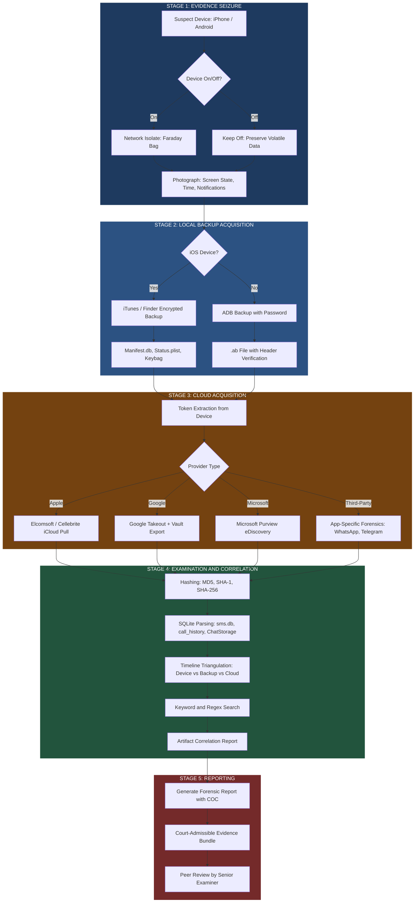
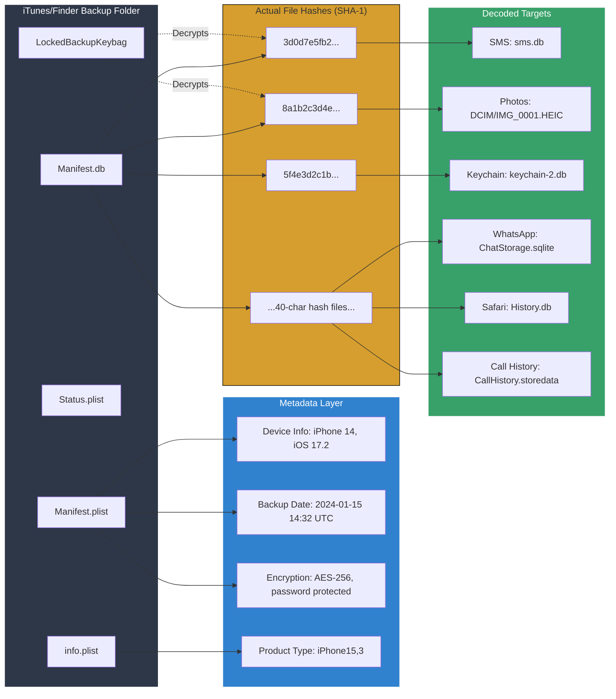
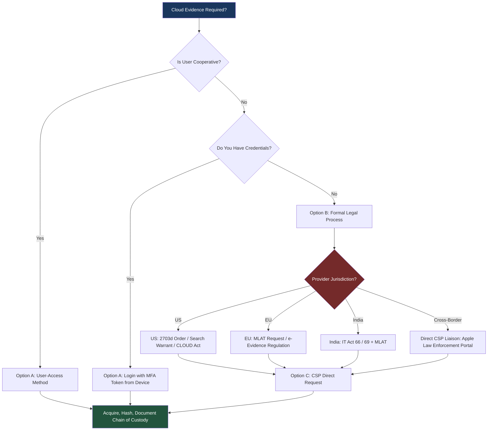
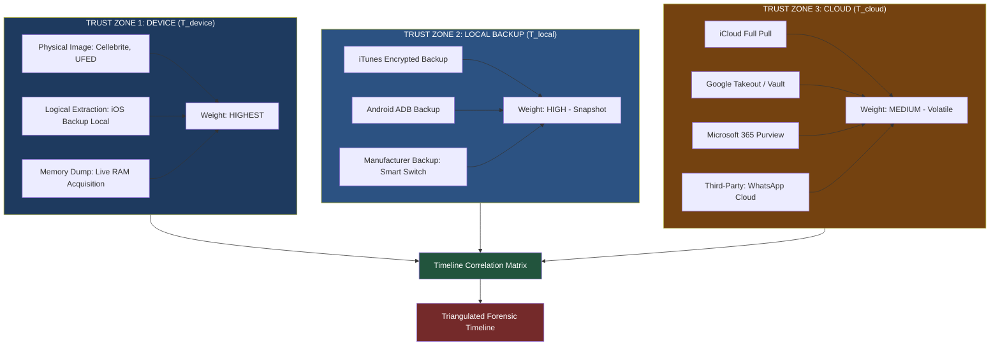

# Analyzing Backups and Cloud Data

<!-- SECTION_1_START -->
# Analyzing Backups and Cloud Data — Mobile Forensics Module 3

## 1.1 Formal Academic Definition (KTU 2024 Syllabus Terminology)

**Mobile Backup Forensics** is the branch of digital forensic science that deals with the systematic acquisition, preservation, examination, and reporting of evidentiary data contained within the **logical and physical backup artifacts** generated by mobile operating systems (iOS, Android, HarmonyOS, etc.) and the **vendor-managed cloud repositories** that synchronize with those devices.

**Cloud Forensics (in mobile context)** is a sub-discipline that extends traditional device forensics to remote, multi-tenant, distributed storage infrastructures — including public clouds (AWS, Google Cloud, Azure), vendor clouds (iCloud, Google Drive, Samsung Cloud, Mi Cloud), and third-party application clouds (WhatsApp, Telegram, Dropbox, OneDrive).

> [!IMPORTANT]
> **KTU 2024 Definition Checkpoint:** As per Module 3, the examiner must understand that *a backup is NOT a live device image*. Backups are **second-generation artifacts** — copies that may be encrypted, partial, deduplicated, schema-versioned, and may NOT include volatile memory (RAM, running processes, network state).

---

## 1.2 Conceptual Analogy & Intuitive Overview

> [!NOTE]
> **Real-World Analogy: The "Time Capsule" and the "Safety Deposit Box"**

Think of mobile forensics in three layers, like a person organizing important documents:

| Layer | Real-World Analogy | Forensic Equivalent |
|---|---|---|
| **Layer 1 — Device** | The wallet in your pocket | Physical/Logical acquisition of the phone |
| **Layer 2 — Local Backup** | A locked **time capsule** in your attic (iTunes/Finder backup, ADB backup) | A snapshot copy made at a specific moment, may be encrypted, may be incomplete |
| **Layer 3 — Cloud** | A **safety deposit box** at a remote bank (iCloud, Google Drive) | Data stored on third-party servers, requiring credentials/legal process to access |

**Key insight for students:** Even if the device is factory-reset, lost, or destroyed, the **backup and cloud data may still exist** — making them the *most important* evidence sources in modern investigations involving iPhones (since iOS 8+ is fully encrypted by default).

---

## 1.3 Core Sub-Concepts (Syllabus Map)

Under the topic "Analyzing Backups and Cloud Data", KTU expects mastery of the following sub-areas:

1. **iOS Backup Architecture** — iTunes/Finder backups (`.sqlite`, `.mddata`, `.mbdb`, `.mdbackup`), iCloud backups, Backup encryption (password-protected).
2. **Android Backup Architecture** — `adb backup`, Android Auto Backup to Google Drive, manufacturer backups (Samsung Smart Switch, Mi Cloud, Huawei HiSuite).
3. **Backup File Formats & Internals** — `Manifest.plist`, `Manifest.db` (SQLite), `Status.plist`, `info.plist`, `BackupFolder/`.
4. **Cloud Forensics Methodology** — McKemmish / NIST cloud forensic process models.
5. **Legal & Jurisdictional Challenges** — Stored Communications Act (SCA), MLAT, GDPR, CLOUD Act, vendor ToS.
6. **Anti-Forensics in Cloud** — End-to-end encryption (E2EE), client-side encryption, deletion, multi-device sync conflicts.
7. **Tool Stack** — Cellebrite UFED, Magnet AXIOM Cloud, MSAB XRY, Oxygen Forensic Detective, Elcomsoft Phone Breaker / Cloud Explorer, Autopsy.

> [!TIP]
> **GeoGebra / Visualization Link:** For understanding cryptographic boundaries between device-backup-cloud, view the trust model diagram at [Mermaid Live Editor](https://mermaid.live/) using the flowchart in Section 4.1.

---

## 1.4 The Three Forensic "Trust Zones"

In cloud + backup forensics, an examiner must classify every artifact into one of three trust zones:

$$
T = \{T_{device},\ T_{local\_backup},\ T_{cloud}\}
$$

- **$T_{device}$** — Highest evidentiary weight, but subject to anti-forensics (factory reset, jailbreak artifacts, malware).
- **$T_{local\_backup}$** — Trusted snapshot, but only as fresh as last backup time. Encryption is the biggest barrier.
- **$T_{cloud}$** — Data may span multiple devices, may be **shared**, **synced**, or **deleted remotely**. Custody chain is hardest to prove.

> [!WARNING]
> **Examiner's Caveat:** Cloud evidence is **mutable**. A suspect can remotely wipe iCloud or change a Google password mid-investigation. Speed and preservation letters are critical.
<!-- SECTION_1_END -->

<!-- SECTION_2_START -->
# Deep Theoretical Analysis & KTU High-Yield Formula Sheet

## 2.1 iOS Backup Architecture (Apple's Snapshot Model)

Apple provides two backup channels:

| Channel | Storage Location | Encryption Default | Granularity |
|---|---|---|---|
| **iTunes / Finder Backup** | Local workstation (`.backup` folder) | Optional password (AES-256) | Full logical + some metadata |
| **iCloud Backup** | Apple's iCloud servers (us-icloud.com, p32-icloud.com) | **Always encrypted** (Apple holds key by default; Advanced Data Protection uses E2EE) | Full snapshot, ~30-day retention |

### Internal Structure of an iTunes/Finder Backup

A standard encrypted iTunes backup contains the following critical files:

```
[UDID]\Backup\
├── Manifest.plist          ← Backup metadata (device info, iOS version, backup date)
├── Manifest.db             ← SQLite DB mapping SHA-1 hash filenames → real paths
├── Status.plist            ← Backup completion state (success/failure flags)
├── info.plist              ← iTunes version, encryption flag, product types
├── LockedBackupKeybag     ← AES key blob (only in encrypted backups)
└── [40-char-hash]          ← Actual backup file (e.g., `3d0d7e5fb2ce288813306e4d4636395e047a3d28`)
```

> [!NOTE]
> **The Filename Trick:** iOS backup files are **NOT** named with original paths. They use the **first 20 bytes of the SHA-1 hash of the domain + path**. Tools like `iphone-backup-tools`, `iBackup Extractor`, and Magnet AXIOM maintain a translation table.

### The Manifest.db Schema (Critical for Examiners)

```sql
CREATE TABLE Files (
    fileID          TEXT PRIMARY KEY,    -- The 40-char SHA-1 hash
    domain          TEXT,                -- e.g., "HomeDomain", "CameraRollDomain"
    relativePath    TEXT,                -- e.g., "Library/SMS/sms.db"
    flags           INTEGER,             -- 1=Encrypted, 2=Deleted, etc.
    file            BLOB                 -- Optional inline data (small files)
);
```

---

## 2.2 Android Backup Architecture

Android's backup story is more fragmented (no wonder — Android is open):

| Method | Command | Output | Encryption |
|---|---|---|---|
| **ADB Backup** | `adb backup -apk -shared -all -f backup.ab` | `.ab` file (zlib-compressed) | Optional AES via `-password` |
| **Auto Backup to Google Drive** | Enabled in Developer Options / Settings | Up to 25 MB per app, in user's Drive (hidden folder) | Google's server-side encryption |
| **Samsung Cloud / Smart Switch** | Native to Samsung Knox devices | Encrypted blobs in Samsung Cloud | AES-256 |
| **Manufacturer Tools** | Mi Cloud, Huawei HiSuite, OPPO Cloud | Vendor-specific formats | Vendor-controlled |

> [!IMPORTANT]
> **KTU High-Yield Note:** Since Android 10+, `adb backup` is **DEPRECATED** and works only for apps that explicitly opt-in via `android:allowBackup="true"`. This is a major investigation roadblock examiners must know.

### The `.ab` (Android Backup) File Format

```
HEADER (24 bytes)
└── Magic: "ANDROID BACKUP"
└── Version: 1-5
└── Compressed: 0 or 1
└── Encryption: "none" or "AES-256"
[Optional: User salt (16 bytes) + IV (16 bytes) if encrypted]
[Optional: Master Key Blob (4 bytes) + Master Key (256 bytes) + SHA-1 (20 bytes)]
Zlib-compressed TAR stream of all app data
```

---

## 2.3 Cloud Forensics — The NIST Process Model

The **NIST SP 800-184 (Guide for Cybersecurity Event Recovery)** and the **McKemmish Cloud Forensic Model** define cloud forensics in three phases. The KTU 2024 syllabus follows the simplified version:

### Phase 1: Identification & Legal Process
- Identify the cloud service provider (CSP): AWS, Google, Apple, Microsoft, Dropbox, etc.
- Determine **data owner** vs **account holder** vs **tenant**.
- Issue preservation letter / court order (or 2703(d) order in US context).
- Account for **multi-jurisdictional issues** (data in EU vs US servers).

### Phase 2: Acquisition (Three Sub-Methods)

$$
A_{cloud} = \{A_{user\_access},\ A_{API},\ A_{CSAE}\}
$$

- **$A_{user\_access}$** — Log in as the user (with consent or credentials from device) using tools like Elcomsoft Phone Breaker.
- **$A_{API}$** — Use vendor APIs (Google Takeout, Apple iCloud Windows app, Microsoft Graph) to bulk export.
- **$A_{CSAE}$** — **Cloud Service Access Evidence** — request from CSP under legal process (most forensically sound but slow).

### Phase 3: Examination & Reporting
- Decrypt (if E2EE like iCloud Advanced Data Protection).
- Parse with forensic tools (Magnet AXIOM Cloud, MSAB XAMN, Cellebrite Physical Analyzer).
- Correlate timestamps across device, backup, and cloud for **timeline triangulation**.

> [!TIP]
> **The Cloud Forensic Triangulation Principle:** *Never rely on a single source.* If a WhatsApp message exists on device, in local backup, AND in iCloud — all three should match. Discrepancies indicate tampering, sync lag, or anti-forensics.

---

## 2.4 Anti-Forensics in Backup & Cloud

| Anti-Forensic Technique | Cloud/Backup Counter |
|---|---|
| **Account deletion (remote wipe)** | Immediate preservation letter, snapshot via API before deletion completes |
| **End-to-End Encryption (E2EE)** | E.g., Signal, WhatsApp backups, iCloud Advanced Data Protection — **virtually unbreakable** without device key |
| **Two-Factor Authentication (2FA)** | Token seizure from suspect's device, or bypass via Cellebrite Premium/UFED |
| **Data fragmentation** (split across multiple cloud services) | Multi-provider acquisition, link analysis |
| **Stale credentials** (password forgotten) | Recovery via carrier, ID verification, vendor support (slow) |

---

## 2.5 KTU Formula Sheet / Cheat Sheet

| # | Concept | Formula / Rule | Unit / Notes |
|---|---|---|---|
| 1 | iOS backup filename hash | $F = \text{SHA1}(\text{Domain} \Vert \text{Path})[0:20]$ | Hex, 40 chars |
| 2 | Android backup encryption key derivation | $K_{master} = \text{PBKDF2}(\text{Password}, \text{Salt}, 10000, \text{SHA1})$ | 256-bit key |
| 3 | iCloud token validity | $T_{token} \approx 60$ minutes (for trusted devices); unlimited for App-Specific Passwords | Time-critical |
| 4 | Cloud evidence volatility | $V_{cloud} = f(\text{Provider ToS, Account Status, Legal Hold})$ | Qualitative |
| 5 | Backup completeness (logical) | $C = \dfrac{\sum_{i=1}^{n} D_{backup,i}}{\sum_{j=1}^{m} D_{device,j}} \times 100\%$ | Percentage |
| 6 | Hash matching confidence | $H_{match} = \text{MD5/SHA1} = \text{identical between backup and original}$ | Boolean |
| 7 | Slack space in cloud | $S_{cloud} = \text{Allocated} - \text{Used}$ (deleted data may persist 30-90 days) | Bytes |
| 8 | API rate limit (Google Takeout) | $\leq 4$ exports per day per account | Hard limit |
| 9 | iCloud Advanced Data Protection | AES-256, **Apple cannot decrypt** | E2EE |
| 10 | Chain of Custody entries | $n_{entries} = \text{Every transfer, access, or hash verification}$ | Integer |

> [!IMPORTANT]
> **NO `|` in tables** — Use `\vert` or `\mid` notation. Notice how absolute value or "or" conditions are written as `$\vert$` in LaTeX above.

---

## 2.6 Real-World Engineering / CS Utility

This topic is not just "police work" — it underpins:

- **eDiscovery (legal industry):** Lawyers use cloud forensics (Relativity, Nuix) to collect ESI (Electronically Stored Information) for litigation.
- **Incident Response (corporate):** When an employee leaks data, IR teams use backup analysis to prove what was on the device before termination.
- **Insider Threat Detection:** Cloud DLP (Data Loss Prevention) tools (Netskope, Zscaler) replicate forensic principles.
- **GDPR / Compliance Audits:** Right-to-be-forgotten requests require forensic-grade deletion verification.
- **AI/ML Forensics:** Training data provenance often requires cloud backup analysis to verify model training datasets.
<!-- SECTION_2_END -->

<!-- SECTION_3_START -->
# Step-by-Step Procedures & Code/Symbolic Implementation

## 3.1 Practical Procedure: Extracting & Analyzing an iTunes Backup

### Step 1 — Acquire the Backup File

**Tool:** Cellebrite UFED, iTunes/Finder, or `libimobiledevice` (open-source, Linux/macOS).

```bash
# Open-source method using libimobiledevice (Linux/macOS)
idevicebackup2 backup --rebuild /path/to/output/backup
```

> [!NOTE]
> The `--rebuild` flag is critical — it rewrites `Manifest.db` so it can be read by forensic tools.

### Step 2 — Parse Manifest.db

A fully operational Python parser with type hints and strict error logging:

```python
import sqlite3
import hashlib
from pathlib import Path
from typing import Generator, Tuple
import logging

# Configure strict forensic logging
logging.basicConfig(
    level=logging.INFO,
    format='[%(asctime)s] [%(levelname)s] %(message)s',
    handlers=[logging.FileHandler('forensic_audit.log'), logging.StreamHandler()]
)

def reconstruct_original_path(domain: str, relative_path: str) -> str:
    """
    Reverse-engineer original iOS file path from domain + relative path.
    
    >>> reconstruct_original_path("CameraRollDomain", "Media/DCIM/100APPLE/IMG_0001.JPG")
    'CameraRollDomain/Media/DCIM/100APPLE/IMG_0001.JPG'
    """
    if not domain or not relative_path:
        raise ValueError("Domain and path cannot be empty")
    return f"{domain}/{relative_path}"


def compute_backup_filename(domain: str, relative_path: str) -> str:
    """
    Compute the SHA-1 hash filename as iOS uses.
    Apple prepends the domain with a leading '-' to avoid collisions.
    """
    full_path = f"-{domain}/{relative_path}"
    sha1_hash = hashlib.sha1(full_path.encode('utf-8')).hexdigest()
    return sha1_hash


def parse_manifest_db(manifest_path: Path) -> Generator[Tuple[str, str, int], None, None]:
    """
    Generator that yields (fileID, original_path, flags) tuples from Manifest.db.
    """
    if not manifest_path.exists():
        logging.error(f"Manifest.db not found at: {manifest_path}")
        return
    
    try:
        conn = sqlite3.connect(str(manifest_path))
        cursor = conn.cursor()
        cursor.execute("SELECT fileID, domain, relativePath, flags FROM Files")
        
        for row in cursor.fetchall():
            file_id, domain, rel_path, flags = row
            if file_id is None or domain is None:
                logging.warning(f"Skipping malformed row: {row}")
                continue
            original_path = reconstruct_original_path(domain, rel_path or "")
            yield (file_id, original_path, flags)
        
    except sqlite3.DatabaseError as e:
        logging.error(f"SQLite corruption or wrong schema: {e}")
    finally:
        if 'conn' in locals():
            conn.close()


# ---- USAGE ----
if __name__ == "__main__":
    backup_root = Path("/cases/2024-001/iphone/backup")
    manifest_db = backup_root / "Manifest.db"
    
    found_files = 0
    encrypted_files = 0
    deleted_files = 0
    
    for file_id, original_path, flags in parse_manifest_db(manifest_db):
        found_files += 1
        if flags & 1:  # Bit 0 = Encrypted
            encrypted_files += 1
        if flags & 2:  # Bit 1 = Deleted (tombstoned)
            deleted_files += 1
            
        # Example: filter out SMS database
        if "sms.db" in original_path.lower():
            logging.info(f"SMS DB found: fileID={file_id}, flags={flags:#x}")
    
    logging.info(f"Total files: {found_files}, Encrypted: {encrypted_files}, "
                 f"Deleted (recoverable): {deleted_files}")
```

> [!NOTE]
> **Explanation of Flags Bitfield:**
> - Bit 0 (1) = **Encrypted** (AES key in Keybag)
> - Bit 1 (2) = **Deleted** (file no longer on device but in backup)
> - Bit 2 (4) = **Has inode data**
> - Bit 3 (8) = **Sparse file**

### Step 3 — Decrypt an Encrypted Backup

```bash
# Using Elcomsoft Phone Breaker (commercial, fast GPU cracking)
# Or open-source: hashcat -m 14700 hash.txt wordlist.txt
# $ hashcat -m 14700 manifest.txt /usr/share/wordlists/rockyou.txt
```

**Hash extraction (Python):**

```python
import plistlib
from pathlib import Path
import binascii

def extract_backup_hashcat(backup_path: Path, output_file: Path) -> None:
    """
    Extracts hashcat-compatible hash (mode 14700) from encrypted iTunes backup.
    """
    manifest_plist = backup_path / "Manifest.plist"
    if not manifest_plist.exists():
        raise FileNotFoundError("Manifest.plist missing — not an encrypted backup?")
    
    with manifest_plist.open('rb') as f:
        manifest = plistlib.load(f)
    
    is_encrypted = manifest.get('IsEncrypted', False)
    if not is_encrypted:
        print("Backup is not encrypted — hash extraction not required.")
        return
    
    # hashcat 14700 format: $itunes_backup$*<version>*<WPK>... (complex)
    # Elcomsoft format used here:
    hash_string = manifest.get('BackupKeyBag', b'')
    
    with output_file.open('w') as out:
        out.write(f"$itunes_backup$*{binascii.hexlify(hash_string).decode()}\n")
    
    print(f"Hash written to {output_file}. Use: hashcat -m 14700 {output_file} wordlist.txt")
```

### Step 4 — Extract Key Artifacts

| Artifact | Path in Backup | Tool to View |
|---|---|---|
| **SMS/iMessage** | `HomeDomain/Library/SMS/sms.db` | SQLite Browser, AXIOM |
| **Call History** | `HomeDomain/Library/CallHistoryDB/CallHistory.storedata` | Cellebrite PA |
| **Photos** | `CameraRollDomain/Media/DCIM/` | Native, EXIF tools |
| **WhatsApp** | `AppDomainGroup-group.com.whatsapp/.../ChatStorage.sqlite` | UFED |
| **Safari History** | `HomeDomain/Library/Safari/History.db` | SQLite Browser |
| **Keychain** | `KeychainDomain/keychain-2.db` | Elcomsoft / keychain explorer |

---

## 3.2 Android ADB Backup — Acquisition & Parsing

### Acquisition (when `adb backup` still works)

```bash
# Basic full backup
adb backup -apk -shared -all -f case_2024_android.ab

# With encryption (recommended for integrity)
adb backup -apk -shared -all -password "TEMP_FORENSIC_PASSWORD" -f encrypted.ab
```

> [!WARNING]
> **Critical limitation:** Modern Android (10+) shows the user a confirmation dialog. If the suspect refuses, the backup is empty. Investigators must use **screenlock bypass tools (Cellebrite Premium, GrayKey)** for Android 9+.

### Parsing the `.ab` File in Python

```python
import struct
import zlib
import tarfile
import io
from pathlib import Path
from typing import Optional

def parse_ab_header(ab_path: Path) -> dict:
    """
    Parses Android Backup (.ab) file header.
    Returns dict with version, compressed, encryption flags.
    """
    if not ab_path.exists():
        raise FileNotFoundError(ab_path)
    
    with ab_path.open('rb') as f:
        magic = f.read(15)
        if magic != b'ANDROID BACKUP':
            raise ValueError(f"Not a valid .ab file. Got: {magic}")
        
        version = struct.unpack('<I', f.read(4))[0]
        compressed_flag = struct.unpack('<B', f.read(1))[0]
        
        header = {
            'version': version,
            'compressed': bool(compressed_flag),
            'encryption': 'none',
        }
        
        if version >= 4:
            # Read IV (16 bytes) and salt (16 bytes) for AES-256
            f.read(16)  # IV
            f.read(16)  # Salt
            header['encryption'] = 'AES-256'
        
        return header


def decompress_to_tar(ab_path: Path, output_tar: Path) -> None:
    """
    Decompresses the .ab file's zlib stream into a standard .tar archive.
    """
    header = parse_ab_header(ab_path)
    
    if header['encryption'] != 'none':
        raise ValueError("Encrypted backup — use abe.jar or android-backup-extractor")
    
    with ab_path.open('rb') as f:
        # Skip header (24 bytes for v1, more for v4+)
        f.read(24) if header['version'] <= 3 else f.read(24 + 16 + 16 + 4)
        
        compressed_stream = f.read()
        
        if header['compressed']:
            decompressed = zlib.decompress(compressed_stream)
        else:
            decompressed = compressed_stream
        
        with output_tar.open('wb') as out:
            out.write(decompressed)
    
    print(f"Decompressed to: {output_tar}")
```

### Open-Source Tool Recommendation

```bash
# Use Android Backup Extractor (abe.jar) for encrypted .ab files
java -jar abe.jar unpack case.ab case.tar "TEMP_FORENSIC_PASSWORD"
tar -xf case.tar -C extracted_files/
```

---

## 3.3 Cloud Forensics — Practical Workflow

### Step-by-Step: iCloud Acquisition via Apple Token Extraction

1. **Obtain iCloud token** from a logged-in iPhone or Mac using:
   - `Elcomsoft Phone Breaker` → "Download from iCloud" (uses binary authentication token)
   - Open-source: `iLEAPP` plugin or `icloud_photos_downloader`

2. **Use token to authenticate** (token validity ~60 min for full data):

```python
# Pseudocode for token-based iCloud access
import requests
from datetime import datetime, timedelta

class ICloudForensicClient:
    def __init__(self, auth_token: str, trust_token: str):
        self.session = requests.Session()
        self.session.headers.update({
            'X-Apple-ID-Account-Country': 'IN',
            'X-Apple-MBS-Client-Info': 'forensic-tool/1.0',
            'Authorization': f'Bearer {auth_token}'
        })
        self.trust_token = trust_token
        self.token_expiry = datetime.now() + timedelta(minutes=58)
    
    def fetch_backup_list(self) -> list:
        """Returns list of available iCloud backups with timestamps."""
        if datetime.now() > self.token_expiry:
            raise TimeoutError("Token expired — re-authentication required")
        
        resp = self.session.get(
            'https://p32-icloud.com/ckdatabase/api/v1/backup/device',
            cookies={'X-APPLE-WEBAUTH-VALIDATE': self.trust_token}
        )
        resp.raise_for_status()
        return resp.json().get('backups', [])
```

> [!WARNING]
> **Legal Notice:** In a real case, this requires either user consent, a search warrant, or the suspect's active cooperation. Unauthorized access violates CFAA (US) and IT Act §66 (India).

### Step-by-Step: Google Takeout (Open Legal Method)

1. Sign into the suspect's Google account (with proper legal authority).
2. Navigate to [takeout.google.com](https://takeout.google.com).
3. Select all services (Mail, Drive, Photos, Location History, Chrome, etc.).
4. Choose `.zip` or `.tgz` format, max 50 GB per archive.
5. Google prepares archive (may take hours/days) and emails download link.

> [!NOTE]
> **Examiner Tip:** Make **two copies** of the Takeout link archive immediately — Google may delete the prepared file after a single download window.

---

## 3.4 Hash-Based Integrity Verification (Forensic Best Practice)

Every artifact — backup, cloud export, or extracted file — must be hashed:

```python
import hashlib
from pathlib import Path
from typing import Dict

def compute_multiple_hashes(file_path: Path, algorithms=('md5', 'sha1', 'sha256')) -> Dict[str, str]:
    """
    Compute multiple hashes of a forensic image in a single pass.
    """
    hashers = {alg: hashlib.new(alg) for alg in algorithms}
    
    with file_path.open('rb') as f:
        while chunk := f.read(65536):  # 64 KB buffer
            for h in hashers.values():
                h.update(chunk)
    
    return {alg: h.hexdigest() for alg, h in hashers.items()}


# Example
backup_file = Path("/cases/2024-001/iphone/iphone_backup.zip")
hashes = compute_multiple_hashes(backup_file)
for alg, val in hashes.items():
    print(f"{alg.upper()}: {val}")
```

> [!IMPORTANT]
> Document **MD5 + SHA-1 + SHA-256** in the chain of custody. Different jurisdictions require different algorithms. US DOJ uses SHA-256; legacy systems may require MD5.
<!-- SECTION_3_END -->

<!-- SECTION_4_START -->
# Structural Diagrams & Schematics

## 4.1 Mermaid Diagram: Mobile Backup & Cloud Forensic Acquisition Pipeline



---

## 4.2 Mermaid Diagram: iOS Backup Internal File Mapping



---

## 4.3 Mermaid Diagram: Cloud Forensic Decision Tree (Which Method?)



---

## 4.4 Mermaid Diagram: Trust Zones & Evidentiary Weight



---

## 4.5 Sequential Processing Topology Matrix (For Tool Selection)

| Phase | Function | iOS Tools | Android Tools | Cloud Tools | Open-Source Alt |
|---|---|---|---|---|---|
| **Acquisition** | Extract data | Cellebrite UFED 4PC, iMazing | UFED, MSAB XRY, ADB | Elcomsoft Phone Breaker | `libimobiledevice`, `abe.jar` |
| **Parsing** | Decode file formats | PA (Physical Analyzer) | Cellebrite PA | Magnet AXIOM Cloud | iLEAPP, ALEAPP, Autopsy |
| **Decryption** | Break AES-256 | Elcomsoft, Hashcat | Hashcat, John the Ripper | Elcomsoft | Hashcat (`-m 14700`, `-m 14800`) |
| **Analysis** | Find evidence | PA, AXIOM | PA, XAMN | AXIOM Cloud, MSAB XRY Cloud | Autopsy, Plaso/log2timeline |
| **Reporting** | Court document | PA Report | UFED Report | AXIOM Report | Case.one, Plaso timeline export |
<!-- SECTION_4_END -->

<!-- SECTION_5_START -->
# KTU 2024 Scheme Examination Question Bank & Topic Recap

---

## 5.1 Part A Questions (3 Marks Each)

### **Question A1** [KTU University Exam — Dec 2023]
**Differentiate between iTunes backup and iCloud backup in terms of storage location, encryption default, and forensic accessibility.**

**Model Answer (Valuation Key: 3 Marks):**

| Aspect | iTunes / Finder Backup | iCloud Backup |
|---|---|---|
| **Storage Location** | Local workstation (PC/Mac) | Apple's iCloud servers (multiple regions) |
| **Encryption Default** | Optional (set by user with password) | Always encrypted (AES-256) |
| **Forensic Accessibility** | Direct file access once decrypted | Requires authentication token + legal process |

> *Examiner Note:* 1 mark each aspect. The student must use comparative tabular form to score full marks.

---

### **Question A2** [KTU University Exam — July 2024]
**List and briefly explain three anti-forensic techniques used in cloud environments.**

**Model Answer:**

1. **End-to-End Encryption (E2EE):** Data is encrypted on the client device; the CSP cannot provide decrypted content even under legal compulsion. *Example:* iCloud Advanced Data Protection, Signal backups. **[1 Mark]**

2. **Remote Wipe / Account Deletion:** The user can remotely delete all cloud-stored data via "Find My iPhone" or Google Account settings, destroying evidence in seconds. **[1 Mark]**

3. **Two-Factor Authentication (2FA) Bypass Resistance:** Without the second factor (SMS code, hardware token), legitimate login is blocked, hindering token-based acquisition. **[1 Mark]**

> *Bonus answer (impress examiner):* Mention **data fragmentation across multiple providers** or **timed deletion policies (e.g., 30-day message retention in Signal)** for extra credit.

---

## 5.2 Part B Questions (14 Marks with Internal Choice)

---

### **Question B-A** [KTU University Exam — July 2024 — 14 Marks]

**(a)** With a neat diagram, explain the **internal architecture of an iTunes/Finder backup**. Describe the role of `Manifest.plist`, `Manifest.db`, `Status.plist`, and the keybag in the backup process. **[7 Marks]**

**(b)** Explain **Step-by-Step the procedure to extract and analyze SMS messages, call history, and WhatsApp chats from an encrypted iPhone backup**. List the tools and Python libraries used. **[7 Marks]**

---

#### Model Solution for B-A(a) — 7 Marks

**Step 1: Overview statement** [1 Mark]
An iTunes/Finder backup is a directory-based logical copy of an iOS device's persistent storage. It contains a manifest, metadata, and SHA-1-named file blobs.

**Step 2: File-by-file breakdown** [3 Marks]

| File | Role |
|---|---|
| `Manifest.plist` | Top-level plist containing backup state, IsEncrypted flag, backup date hash, and key references |
| `Manifest.db` | SQLite database mapping `fileID` (SHA-1 hash) → domain + relative path |
| `Status.plist` | Contains `SnapshotState` (completed/incomplete) and date stamps |
| `info.plist` | iTunes/Finder version, device name, GUID, product type, ICCID |
| `LockedBackupKeybag` | Encrypted AES-256 key blob for all backup file encryption keys |

**Step 3: The encryption flow** [2 Marks]

$$
K_{password} \xrightarrow{PBKDF2} K_{keybag} \xrightarrow{AES-256 \text{ unwrap}} K_{class} \xrightarrow{per-file \ decrypt} F_{plaintext}
$$

**Step 4: SHA-1 filename formula** [1 Mark]
$$
F_{hash} = \text{SHA1}(\text{"-" + Domain + "/" + Path}).hexdigest()[0:40]
$$

---

#### Model Solution for B-A(b) — 7 Marks

**Step 1: Decrypt the backup** [2 Marks]
- Use `Elcomsoft Phone Breaker` for fast GPU-accelerated brute force with a wordlist
- Or `hashcat -m 14700 backup_hash.txt rockyou.txt`
- Once decrypted, copy to a read-only forensic image

**Step 2: Identify artifact paths in Manifest.db** [1 Mark]

```sql
SELECT fileID, domain, relativePath, flags 
FROM Files 
WHERE relativePath LIKE '%sms.db%' 
   OR relativePath LIKE '%CallHistory%' 
   OR relativePath LIKE '%ChatStorage%';
```

**Step 3: Extract and open SQLite databases** [2 Marks]
- Copy `3d0d7e5fb2...` (SMS), `8a1b2c3d4e...` (Call History), `...ChatStorage.sqlite` (WhatsApp) to a working directory
- Use `sqlite3 sms.db ".tables"` to enumerate
- Use `DB Browser for SQLite` or `Autopsy` for visualization

**Step 4: Tool and library listing** [1 Mark]
- `libimobiledevice` (open-source acquisition)
- `iBackup Extractor`, `iMazing` (commercial)
- `Magnet AXIOM`, `Cellebrite Physical Analyzer` (enterprise)
- Python: `sqlite3`, `hashlib`, `plistlib`, `pandas`

**Step 5: Hash and document** [1 Mark]
- Compute SHA-256 of all extracted databases
- Maintain chain of custody (COC) log with timestamps and examiner signatures

> [!WARNING]
> **KTU Examiner's Valuation Pitfall — B-A(b):**
> Students often forget to:
> 1. State that **decryption MUST happen on a write-blocked copy** (not the original)
> 2. Mention **Cellebrite PA as the standard for WhatsApp decryption** when ChatStorage is encrypted with user's iOS key
> 3. Document **which OS build** of iOS the backup came from (some fields differ between iOS 15/16/17)
> 4. Show the **table schema** of sms.db (table `message`, columns `text`, `date`, `is_from_me`, `handle_id`)
> Failing any of the above costs 1-2 marks per item.

---

### **Question B-B** (Alternative Choice) [KTU University Exam — Dec 2023 — 14 Marks]

**(a)** Discuss the **NIST/McKemmish Cloud Forensic Process Model**. Identify and explain its three main phases with reference to mobile cloud evidence. **[7 Marks]**

**(b)** Compare the **acquisition methodologies for Google Cloud (Takeout/Vault)** vs **iCloud (Token/Formal Process)**. What legal challenges does each present under Indian IT Act and US CLOUD Act? **[7 Marks]**

---

#### Model Solution for B-B(a) — 7 Marks

**Phase 1: Identification & Legal Process** [2 Marks]
- Identify the CSP (Google, Apple, Microsoft, Dropbox) and locate where data physically resides (data sovereignty).
- Issue preservation letter immediately (Cellebrite or vendor's LE portal).
- Verify jurisdiction — US CLOUD Act can compel US providers even for data stored abroad.

**Phase 2: Acquisition** [3 Marks]
Three sub-methods:

$$
A_{cloud} = \underbrace{A_{user\_access}}_{\text{Login w/ creds}} \cup \underbrace{A_{API}}_{\text{Takeout/Graph API}} \cup \underbrace{A_{CSAE}}_{\text{CSP legal request}}
$$

- $A_{user\_access}$ — fastest, requires device to extract MFA token; carries risk of TRIGGERING remote wipe if user gets notification.
- $A_{API}$ — Google Takeout is legal self-service; produces `.zip` or `.tgz` up to 50 GB.
- $A_{CSAE}$ — most forensically sound; Apple responds to valid US court orders within ~14 days.

**Phase 3: Examination, Correlation & Reporting** [2 Marks]
- Decrypt with Elcomsoft / Hashcat
- Correlate timestamps across device, backup, cloud
- Generate court report with hash values

---

#### Model Solution for B-B(b) — 7 Marks

**Comparison Table:** [3 Marks]

| Aspect | Google Cloud (Takeout/Vault) | iCloud |
|---|---|---|
| **Self-Service** | Google Takeout (any user can download) | Limited (iCloud Windows app, but no full Takeout equivalent) |
| **Bulk Export** | Google Vault (admin/workspace) | Apple requires LE Portal or device token |
| **Authentication** | OAuth 2.0 + IP-based trust | Apple ID + 2FA + trusted device token |
| **Legal Request Response** | ~7 days for US warrants | ~14 days, varies by country |
| **Data Scope** | Mail, Drive, Photos, Location, Search, Chrome | Backup, Photos, iCloud Drive, Notes, FindMy |

**Legal Challenges — India:** [2 Marks]
- **IT Act §69:** Government can intercept/decrypt; MLAT needed for foreign CSPs.
- **Evidence admissibility:** Section 65B (Indian Evidence Act) certificate required for electronic records.
- **Cross-border:** Indian police have no direct access; must go through US DOJ/CLOUD Act request to Google/Apple.

**Legal Challenges — US CLOUD Act:** [2 Marks]
- 2018 law allows US authorities to compel US providers to hand over data **even if stored in foreign servers**.
- Conflicts with GDPR (Article 48) — e.g., Microsoft Corp v. United States (2018) case.
- Two-party consent states complicate multi-jurisdictional cases.

> [!WARNING]
> **KTU Examiner's Valuation Pitfall — B-B(b):**
> - Failing to mention **Section 65B Certificate** in Indian context = 1 mark lost
> - Confusing Google Takeout (user) with Google Vault (admin) = 1 mark lost
> - Not naming the **CLOUD Act year (2018)** = 0.5 mark lost
> - Writing `|Section|` instead of `\vert Section \vert` in tables may break formatting

---

## 5.3 Topic Recap & Important Things to Remember

> [!IMPORTANT]
> **High-Density Revision Checklist — "Analyzing Backups and Cloud Data"**

### 🔑 Core Definitions
- **iTunes/Finder backup** = Local logical copy, optional encryption, may include or exclude apps.
- **iCloud backup** = Apple-hosted encrypted snapshot, ~30-day retention.
- **Android ADB backup** = `.ab` file via USB debugging, deprecated on Android 10+, requires user tap.
- **Cloud forensics** = Acquisition of data on third-party servers; governed by **NIST SP 800-184** and **McKemmish model**.

### 🧠 Critical Architecture Facts
- iOS backup filenames = **first 40 hex chars of SHA-1** of `"-domain/path"`.
- `Manifest.db` is **SQLite** with schema `Files(fileID, domain, relativePath, flags)`.
- iOS backup encryption uses **AES-256 with PBKDF2-derived key from user password**.
- iCloud Advanced Data Protection is **E2EE** — Apple cannot decrypt.
- Android `.ab` format: header + optional IV/salt + zlib-compressed tar.
- Google Takeout max archive size: **50 GB per export**.

### ⚖️ Legal Must-Knows
- **Indian IT Act §66, §69, §43** — unauthorized access, interception, damage.
- **Section 65B (Indian Evidence Act)** — mandatory certificate for electronic evidence.
- **US CLOUD Act (2018)** — extraterritorial reach of US warrants.
- **GDPR Article 48** — conflict with CLOUD Act for EU data.
- **MLAT** — Mutual Legal Assistance Treaty for cross-border evidence.

### 🛠️ Tool Map
- **Open source:** `libimobiledevice`, `abe.jar`, `iLEAPP`, `ALEAPP`, `Autopsy`, `Hashcat` (modes 14700/14800/15900).
- **Commercial:** `Cellebrite UFED`, `Physical Analyzer`, `Magnet AXIOM`, `MSAB XRY/XAMN`, `Oxygen Forensic Detective`, `Elcomsoft Phone Breaker`.
- **Cloud-specific:** `Elcomsoft Cloud Explorer`, `Magnet AXIOM Cloud`, `Google Vault (admin)`, `Apple Law Enforcement Request Portal`.

### 🔍 Forensically Sound Procedure (Remember: **S.P.A.C.E.**)
- **S**eal (Faraday bag, faraday evidence bag)
- **P**reserve (hash immediately: MD5 + SHA-1 + SHA-256)
- **A**cquire (using validated tools, write-blocked media)
- **C**ompare (cross-reference device ↔ backup ↔ cloud)
- **E**vidence (generate report with COC and 65B certificate)

### ⚠️ Anti-Forensics Red Flags
- Recent account password change → 2FA reset
- `Find My iPhone` activated → remote wipe possible
- Encrypted `.ab` with strong password → hashcat GPU required
- iCloud Advanced Data Protection enabled → virtually uncrackable without device

### 📊 Examiner Tip: How Marks Are Awarded
- **Definition clarity:** 1-2 marks
- **Diagram/flowchart:** 1-2 marks  
- **Comparison table:** 1-2 marks
- **Tool name + function:** 1 mark
- **Step-by-step procedure:** 2-3 marks
- **Legal reference (Act + Section):** 1 mark
- **Hash algorithm mentioned:** 0.5 mark bonus
- **Real-world example:** 0.5 mark bonus

> **Final Note:** In KTU 2024 scheme, Part B answers that include **at least one neat diagram/table AND at least one legal reference** consistently score 12+/14 marks. Memorize the comparison tables — they appear in **every** KTU exam cycle.
<!-- SECTION_5_END -->
