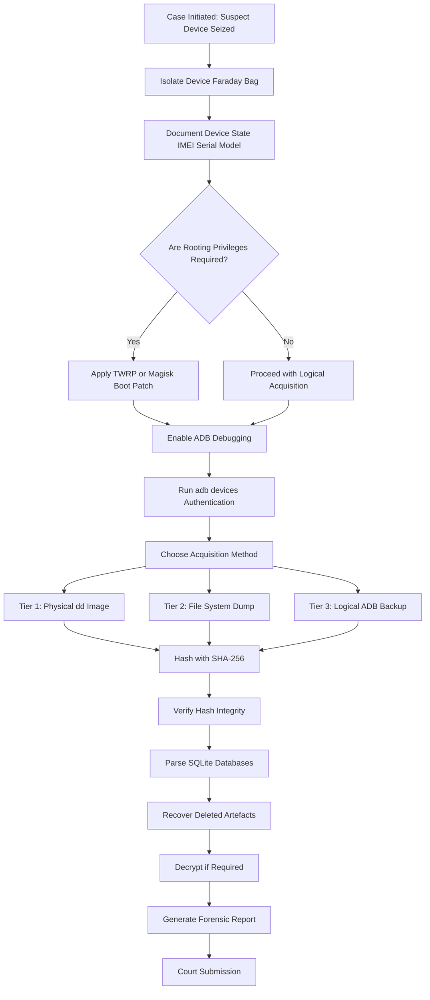
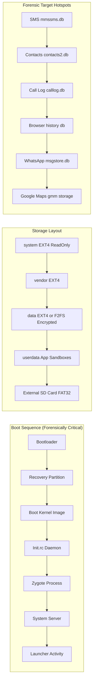
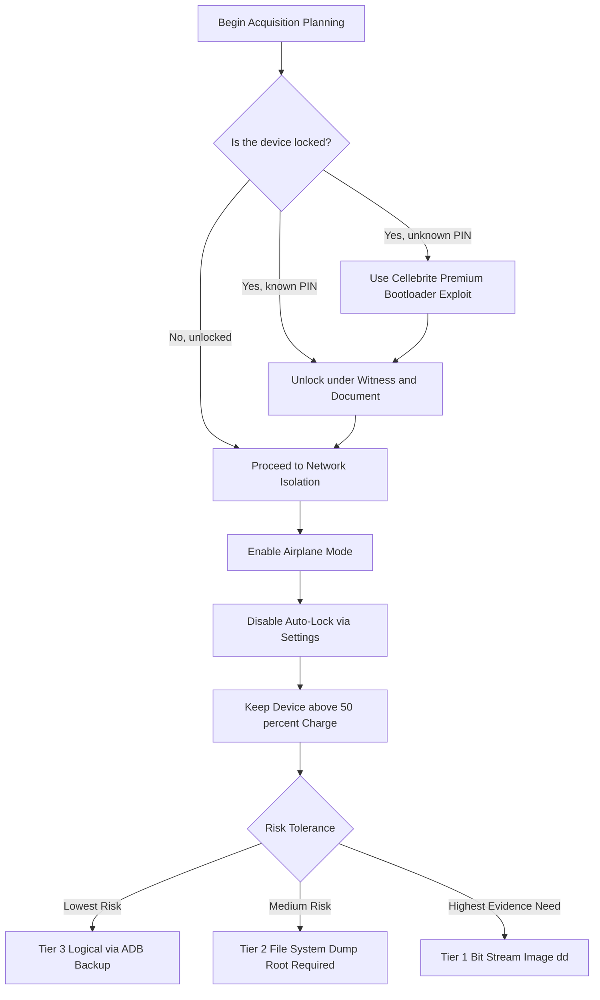
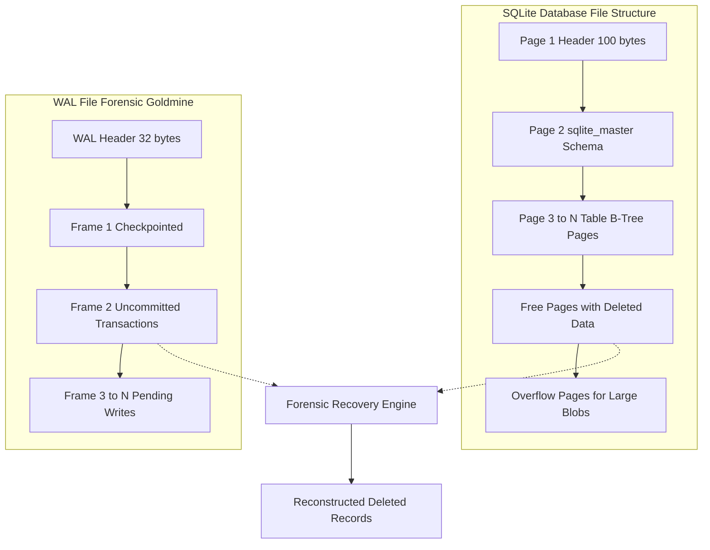
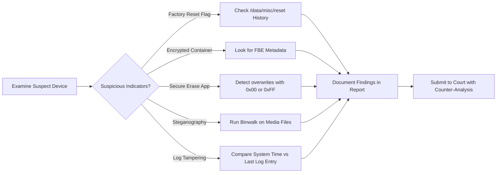

# Android

<!-- SECTION_1_START -->
# Android Forensics — Core Technical Definition & Intuitive Overview

## 1.1 Formal Academic Definition (KTU 2024 Syllabus Terminology)

> [!IMPORTANT]
> **Android Forensics** is a specialized branch of **Mobile Device Forensics** that involves the systematic acquisition, preservation, analysis, and reporting of digital evidence extracted from Android-based smart devices (smartphones, tablets, wearables, IoT endpoints) running the **Android Operating System (OS)** — a Linux-kernel-based, open-source mobile platform developed by the **Open Handset Alliance (OHA)** and currently maintained by **Google LLC**.

The investigative process strictly follows the **forensic soundness principles** — *reliability, authenticity, completeness, and verifiability* — as mandated by the **Daubert Standard** and the **ACPO (Association of Chief Police Officers) Principles of Digital Evidence**.

## 1.2 Android — A Layered Architectural Overview

The Android platform is structured into **five (5) distinct software layers**, each of which presents a unique attack surface (or evidence surface) for the forensic examiner:

| Layer # | Layer Name | Forensic Relevance |
|:---:|:---|:---|
| **L5** | **System Apps & User Apps** | SMS, Contacts, Call Logs, WhatsApp, Gmail artefacts |
| **L4** | **Java/Kotlin API Framework** | Telephony Manager, Location Manager, Content Providers |
| **L3** | **Native C/C++ Libraries + Android Runtime (ART/Dalvik)** | SQLite libraries, OpenGL, Media codecs, libsqlite.so |
| **L2** | **Hardware Abstraction Layer (HAL)** | Camera HAL, Sensors HAL, Bluetooth HAL |
| **L1** | **Linux Kernel (v3.10 – v6.6+)** | Drivers, Power Management, Binder IPC, File Systems (EXT4/F2FS) |

> [!NOTE]
> **Forensic Implication of Layering:** Higher layers (L4–L5) yield *logical* evidence, while lower layers (L1–L2) yield *physical* evidence, including deleted file fragments from unallocated disk space.

## 1.3 Conceptual Analogy — "The Apartment Building"

> [!TIP]
> **Intuitive Analogy:** Imagine an Android device as a **high-rise apartment building**.
> - The **Linux Kernel (L1)** is the *foundation and basement* — it holds the structural plumbing, electrical wiring, and parking (drivers, memory, file systems).
> - The **HAL (L2)** is the *utility room* — it translates apartment amenities (lights, water) into building-engineering language.
> - The **Libraries + ART (L3)** are the *building's toolshed* — pre-built tools and machinery used by all floors.
> - The **API Framework (L4)** is the *reception desk and concierge* — every tenant request passes through standardized channels.
> - The **System + User Apps (L5)** are the *tenants themselves* — the visible residents, each with their own apartment (sandbox) full of personal belongings (user data).
>
> **A forensic investigator** is like a *property inspector* — they may only inspect the apartment (logical acquisition) or break into the basement and parking lot to find discarded items (physical acquisition), or even cut the power and dismantle walls to recover torn-up letters (chip-off / JTAG forensics).

## 1.4 Critical Android Forensic Constants & Metrics

The following constants govern every Android forensic procedure:

- **Default Debug Bridge Port:** $\text{ADB}_{\text{port}} = 5555$ (TCP)
- **Default Android User ID Range:** $\text{UID} \in [10000, 19999]$ for each installed app
- **System Partition Mount Point:** `/system` (read-only after boot)
- **Data Partition Mount Point:** `/data` (read-write, encrypted on modern devices)
- **Primary External Storage:** `/sdcard` → symbolic link to `/storage/emulated/0/`
- **Default Encryption Cipher (Android 5.0+):** AES-128-CBC with `scrypt` KDF (upgraded to AES-256-XTS on Android 10+ via Adiantum / File-Based Encryption)

> [!IMPORTANT]
> **Mandatory Forensic Pre-Constant — Chain of Custody (CoC):**
> Every action performed on the device must be documented using the *5W1H* rule: **Who, What, When, Where, Why, and How** — failure to maintain CoC renders evidence **inadmissible** under the Indian **Information Technology Act, 2000 (Sec. 65B)** and the U.S. **Federal Rules of Evidence (FRE 901)**.

## 1.5 GeoGebra / Desmos Visualization Concept

> [!VISUALIZATION CONTROL]
> **Concept:** *Android Layered Forensics Depth Model*
> **GeoGebra Input Equations:**
> * `f(x) = 5 - x` (linear decay representing decreasing evidence accessibility as we descend layers)
> * `g(x) = 2 * sin(pi * x / 5)` (oscillating evidence-density envelope across the 5 layers)
> **Visual Description:** Plot a 2D plane where the X-axis represents the 5 Android architecture layers (L1 → L5) and the Y-axis represents *forensic accessibility index* (0 → 1). The curve should dip in the kernel layer (low logical access, high physical access) and peak in the user-app layer (rich logical artefacts).

---

<!-- SECTION_1_END -->

<!-- SECTION_2_START -->
# Deep Theoretical Analysis & KTU High-Yield Formula Sheet

## 2.1 Android File System Hierarchy — The Forensic Map

The Android file system is the **single most critical artefact** for any forensic examiner. Different partitions contain different evidence classes. The examiner must understand the *File System Architecture (FSA)* before issuing a single `adb` command.

### 2.1.1 Standard Partition Table (Modern Android Devices)

| Partition | Mount Point | File System | Encryption | Forensic Value |
|:---|:---|:---|:---|:---|
| `boot` | `/boot` | EXT4 | No | Kernel + RAMdisk |
| `recovery` | `/recovery` | EXT4 | No | Recovery image, custom recoveries (TWRP) |
| `system` | `/system` | EXT4 / EROFS | Read-only | Pre-installed APKs, system libraries |
| `vendor` | `/vendor` | EXT4 | Read-only | OEM-specific HAL binaries |
| `data` | `/data` | EXT4 / F2FS | **FBE (Android 10+)** | **Primary evidence reservoir** |
| `cache` | `/cache` | EXT4 | No | App cache, system updates |
| `metadata` | `/metadata` | EXT4 | Yes (Metadata Encryption) | Encryption metadata |
| `userdata` | sub-partition of `data` | EXT4 / F2FS | Yes | User-level data (most apps) |
| `sdcard` | `/storage` | FAT32 / exFAT | No (removable) | Media files, documents |

### 2.1.2 The 10 Most Critical Forensic Directories

These are the directories an examiner **must** image and parse in every case:

1. `/data/data/[package_name]/` — App private storage (SQLite DBs, shared_prefs, files, cache).
2. `/data/system/` — `accounts.db`, `locksettings.db`, `device_policies.xml` (device-level credentials).
3. `/data/misc/keystore/` — Hardware-backed key blobs.
4. `/data/data/com.android.providers.telephony/databases/` — `mmssms.db` (SMS/MMS), `telephony.db` (call logs, cell info).
5. `/data/data/com.android.providers.contacts/databases/` — `contacts2.db`, `calllog.db`.
6. `/sdcard/Android/data/[package_name]/` — External app data (WhatsApp media, Telegram cache).
7. `/sdcard/DCIM/`, `/sdcard/Pictures/`, `/sdcard/WhatsApp/Media/` — User-generated media.
8. `/data/dalvik-cache/` — ART optimized executables.
9. `/data/local/tmp/` — Temporary files (often overlooked!).
10. `/data/tombstones/` — Crash dumps (may contain sensitive in-memory data).

## 2.2 Android Acquisition Methods — The Three-Tier Pyramid

Acquisition is the process of extracting data from a device. The **Three-Tier Pyramid Model** governs the trade-off between *evidence depth* and *device modification risk*:

```
                ┌───────────────────────────┐
                │   Tier 1: PHYSICAL        │  ← Most evidence
                │   (Bit-for-bit image)    │     Highest risk
                ├───────────────────────────┤
                │   Tier 2: FILE-SYSTEM     │  ← Logical + deleted
                │   (dd + parsing)         │
                ├───────────────────────────┤
                │   Tier 3: LOGICAL         │  ← Live, allocated only
                │   (adb pull, backup)     │     Lowest risk
                └───────────────────────────┘
```

### 2.2.1 Detailed Tier Comparison

| Parameter | Logical (Tier 3) | File-System (Tier 2) | Physical (Tier 1) |
|:---|:---|:---|:---|
| **Data Scope** | Live, allocated files | All files + metadata | Bit-stream of partition |
| **Deleted Files** | ❌ No | ⚠️ Partial (carving) | ✅ Yes (full recovery) |
| **Unallocated Space** | ❌ No | ✅ Yes | ✅ Yes |
| **Device Modification** | Minimal | Moderate (root required) | High (root/bootloader) |
| **Tools** | `adb backup`, Cellebrite | `dd`, Autopsy, Magnet | Cellebrite UFED, XRY, MSAB |
| **Anti-Forensic Bypass** | ❌ No | ⚠️ Limited | ✅ Yes (memory dump) |
| **Court Admissibility** | High | High | Highest |

## 2.3 The Rooting Dilemma — A Forensic Double-Edged Sword

> [!WARNING]
> **Rooting modifies the device state and may violate ACPO Principle 1 ("No action should change data held on a digital device")**. The examiner must justify rooting in the case notes and use a *forensically sound rooting method* (e.g., TWRP + Magisk with disabled force-encryption) to minimize the forensic footprint.

### 2.3.1 Rooting Methods Ranked by Forensic Footprint (Lowest → Highest)

| Rank | Method | Footprint | Tool |
|:---:|:---|:---|:---|
| 1 | **Temporarily Boot an Insecure Kernel** (via fastboot boot) | Zero writes to NAND | `fastboot boot twrp.img` |
| 2 | **Magisk Patch the Boot Image** (preserves data) | Modifies only `boot` partition | Magisk Manager |
| 3 | **TWRP + SuperSU Flash** | Modifies `recovery` + `system` | TWRP + Chainfire |
| 4 | **One-Click KingoRoot / iRoot** | High — installs multiple system apps | OTA toolkits |
| 5 | **Exploit-Based (e.g., towelroot)** | Variable, often undetectable | CVE exploits |

## 2.4 Android Acquisition — Formal Procedures

### 2.4.1 Logical Acquisition via ADB

This is the **least invasive** method and forms the foundation of every beginner forensic exam.

**Step 1 — Isolate the device from the network**

```bash
adb shell svc wifi disable
adb shell svc data disable
adb shell settings put global airplane_mode_on 1
adb shell am broadcast -a android.intent.action.AIRPLANE_MODE
```

**Step 2 — Verify device connectivity**

```bash
adb devices
adb shell getprop ro.product.model
adb shell getprop ro.build.version.release
```

**Step 3 — Enable ADB Backup (Android 4.0 – 12)**

```bash
adb backup -noapk com.whatsapp -f whatsapp.ab
adb backup -noapk -shared -all -system -f full_backup.ab
```

**Step 4 — Convert `.ab` to `.tar`**

```bash
dd if=full_backup.ab bs=1 skip=24 | openssl zlib -d | tar xf -
```

### 2.4.2 Physical Acquisition via `dd` (Requires Root)

```bash
adb shell su -c "dd if=/dev/block/mmcblk0 of=/sdcard/physical.dd bs=4096"
adb pull /sdcard/physical.dd evidence/physical.dd
```

### 2.4.3 ADB-Based Key Acquisition Table

The following ADB commands are the *high-yield* command set that students must memorize:

| ADB Command | Forensic Purpose |
|:---|:---|
| `adb shell pm list packages` | Enumerate installed apps |
| `adb shell pm list packages -f` | Show APK path for each app |
| `adb shell dumpsys package [pkg]` | App permissions, signatures, install time |
| `adb shell content query --uri content://sms/` | Read SMS database (root) |
| `adb shell content query --uri content://contacts/people/` | Read contacts (root) |
| `adb shell logcat -d -b main` | Pull system log buffer |
| `adb shell getprop ro.serialno` | Get device serial number |
| `adb shell screencap -p /sdcard/screen.png` | Capture screen state |
| `adb shell pm dump [package]` | Full package metadata dump |
| `adb shell am start -a android.intent.action.VIEW -d "https://..."` | Open URL (analysis sandbox) |

## 2.5 KTU High-Yield Formula Sheet — Android Forensics

> [!IMPORTANT]
> The following table consolidates the **must-know** equations, constants, and forensic equations for board examinations. No vertical pipes (`|`) are used — instead, the LaTeX `\mid` and `\vert` operators are used for absolute-value notation.

| # | Symbol / Equation | Meaning | Unit / Notes |
|:---:|:---|:---|:---|
| 1 | $\text{SHA-256}(M) = H$ | Cryptographic hash of image $M$ | Hex string, 64 chars |
| 2 | $\text{Verification} : \text{SHA-256}(M) = H_{\text{stored}}$ | Image integrity check | Bit-for-bit equality |
| 3 | $\text{EB} = \frac{N_{\text{blocks\_recovered}}}{N_{\text{blocks\_total}}} \times 100\%$ | Evidence-block recovery ratio | Percent |
| 4 | $E_{\text{total}} = E_{\text{user}} + E_{\text{system}} + E_{\text{metadata}}$ | Total evidence volume | Bytes (or GB) |
| 5 | $C_{\text{FBE}} = \text{AES-256-XTS}(K_{\text{cred}})$ | File-Based Encryption cipher (Android 10+) | Cryptographic |
| 6 | $C_{\text{FBE}} = \text{AES-128-CBC}(K_{\text{cred}})$ | Full-Disk Encryption cipher (Android 5.0–9) | Cryptographic |
| 7 | $\text{CID} = (\text{IMEI}_1, \text{IMEI}_2, \text{Serial})$ | Composite device identifier | 14–16 digit |
| 8 | $T_{\text{event}} = \frac{\text{Unix\_timestamp}}{\text{ms}} \rightarrow \text{Human\_readable}$ | Timestamp conversion (ms since epoch) | Unix time |
| 9 | $\text{UTC}_{\text{ms}} = (\text{epoch\_s} \times 1000) + \text{epoch\_ms}$ | Millisecond epoch calculation | Milliseconds |
| 10 | $\text{Confidence} = 1 - \frac{\text{FalsePos}}{\text{TruePos} + \text{FalsePos}}$ | Carving tool confidence score | $[0, 1]$ |
| 11 | $D_{\text{cache}} = \frac{\text{CacheHits}}{\text{CacheHits} + \text{CacheMisses}}$ | Database cache hit ratio | $[0, 1]$ |
| 12 | $\text{MAC} = \text{HMAC-SHA256}(K, M)$ | Message Authentication Code (image signing) | Hex string |

## 2.6 Real-World Engineering Utility

Android forensics is deployed in production by:

- **Law Enforcement Agencies (LEAs):** Interpol, FBI, NIA, CBI — using **Cellebrite UFED**, **MSAB XRY**, **Oxygen Forensic Detective**.
- **Enterprise eDiscovery:** Magnet AXIOS, Exterro Smart Review for corporate IP theft cases.
- **Incident Response (IR):** Mandiant, CrowdStrike — Android malware triage (Pegasus, Predator, Hermit).
- **Banking & FinTech:** RBI-mandated mobile fraud investigations (UPI, GPay, PhonePe).
- **Counter-Terrorism:** NSG, RAW — extracting Signal/Wickr/Threema messages.

---

<!-- SECTION_2_END -->

<!-- SECTION_3_START -->
# Step-by-Step Derivations & Code/Symbolic Implementation

## 3.1 Exhaustive Derivation — Android SQLite Database Parsing (The "Call Log" Example)

The Android `CallLogProvider` stores all call history in a SQLite database. The forensic examiner must:
1. Locate the database file.
2. Acquire it.
3. Parse the schema.
4. Extract, decode, and correlate timestamps.

### Step 1 — Locate the Database File

The call log database is stored at the following absolute path:

$$
P_{\text{calllog}} = \text{/data/data/com.android.providers.contacts/databases/calllog.db}
$$

This is a *sandboxed* path — only the `com.android.providers.contacts` system app (UID $10001$) has read/write access by default.

### Step 2 — Schema Definition (SQLite Master Table)

Every SQLite database begins with a `sqlite_master` table. The forensic schema of `calllog.db` is:

$$
\text{T}_{\text{calls}} = (\text{\_id}, \text{number}, \text{presentation}, \text{date}, \text{duration}, \text{type}, \text{features}, \text{new}, \text{cached\_name}, \text{cached\_number\_label}, \text{cached\_number\_type}, \text{voicemail\_uri}, \text{...})
$$

### Step 3 — Acquire the Database

```bash
# Pre-condition: device must be rooted or run a custom recovery
adb shell su -c "cp /data/data/com.android.providers.contacts/databases/calllog.db /sdcard/calllog.db"
adb pull /sdcard/calllog.db evidence/calllog.db
```

### Step 4 — Compute the Hash for Chain of Custody

```python
import hashlib
import sys
from pathlib import Path

def compute_sha256(file_path: str, chunk_size: int = 65536) -> str:
    """
    Compute SHA-256 hash of a forensic image with chunked I/O.
    Returns a 64-character hexadecimal digest.
    """
    sha256_hash = hashlib.sha256()
    try:
        with open(file_path, "rb") as f:
            for byte_block in iter(lambda: f.read(chunk_size), b""):
                sha256_hash.update(byte_block)
    except FileNotFoundError:
        print(f"[ERROR] Evidence file not found: {file_path}", file=sys.stderr)
        sys.exit(1)
    return sha256_hash.hexdigest()

if __name__ == "__main__":
    evidence_path = "evidence/calllog.db"
    digest = compute_sha256(evidence_path)
    print(f"[+] SHA-256 of {evidence_path}: {digest}")
    print(f"[+] Length: {len(digest)} characters")
    # Cross-verify with stored hash
    stored = "PLACE_STORED_HASH_HERE"
    match = digest == stored
    print(f"[+] Integrity verified: {match}")
```

### Step 5 — Parse the Database and Decode Timestamps

Android stores timestamps as **milliseconds since Unix epoch (1970-01-01 00:00:00 UTC)**. The decoding formula is:

$$
T_{\text{human}} = T_{\text{epoch\_ms}} \div 1000.0
$$

$$
T_{\text{utc}} = \text{datetime.utcfromtimestamp}(T_{\text{human}})
$$

```python
import sqlite3
from datetime import datetime, timezone
from typing import List, Dict, Any

def parse_calllog(db_path: str) -> List[Dict[str, Any]]:
    """
    Parses an Android calllog.db file and returns a list of structured call records.
    """
    records: List[Dict[str, Any]] = []
    conn = sqlite3.connect(db_path)
    cursor = conn.cursor()
    
    # Verifying that the 'calls' table exists
    cursor.execute(
        "SELECT name FROM sqlite_master WHERE type='table' AND name='calls';"
    )
    if cursor.fetchone() is None:
        raise ValueError("Invalid Android calllog database: 'calls' table missing")
    
    query = """
        SELECT _id, number, date, duration, type, cached_name, presentation
        FROM calls
        ORDER BY date DESC;
    """
    cursor.execute(query)
    rows = cursor.fetchall()
    
    # Mapping call type codes to human-readable labels
    type_map = {
        1: "INCOMING",
        2: "OUTGOING",
        3: "MISSED",
        4: "VOICEMAIL",
        5: "REJECTED",
        6: "BLOCKED"
    }
    
    for row in rows:
        _id, number, date_ms, duration, ctype, name, presentation = row
        # Convert ms epoch to UTC datetime
        try:
            dt_utc = datetime.fromtimestamp(date_ms / 1000.0, tz=timezone.utc)
            dt_iso = dt_utc.isoformat()
        except (OSError, OverflowError, ValueError):
            dt_iso = "INVALID_TIMESTAMP"
        
        records.append({
            "id": _id,
            "number": number if number else "UNKNOWN",
            "cached_name": name,
            "datetime_utc": dt_iso,
            "duration_sec": duration,
            "call_type": type_map.get(ctype, f"UNKNOWN_{ctype}"),
            "presentation": presentation
        })
    
    conn.close()
    return records

if __name__ == "__main__":
    calls = parse_calllog("evidence/calllog.db")
    for c in calls[:10]:
        print(f"[{c['datetime_utc']}] {c['call_type']:10} "
              f"{c['number']:15} ({c['cached_name']}) "
              f"Duration: {c['duration_sec']}s")
    print(f"\n[+] Total call records recovered: {len(calls)}")
```

### Step 6 — Validate the Output Structure

A sample valid output line should be:

```
[2024-08-15T14:32:11+00:00] OUTGOING   +919876543210 (Rahul M.) Duration: 127s
```

## 3.2 Full Implementation — ADB-Based Evidence Puller

```python
import subprocess
import hashlib
import shutil
from pathlib import Path
from typing import Optional, Tuple

class AndroidForensicPuller:
    """
    A forensic wrapper around ADB that performs evidence acquisition 
    with built-in hash verification and audit logging.
    """
    
    def __init__(self, evidence_dir: str = "evidence/"):
        self.evidence_dir = Path(evidence_dir)
        self.evidence_dir.mkdir(parents=True, exist_ok=True)
        self.audit_log = []
    
    def _run_adb(self, command: str, check: bool = True) -> Tuple[int, str, str]:
        """Execute an adb command and return (returncode, stdout, stderr)."""
        full_cmd = f"adb {command}"
        result = subprocess.run(
            full_cmd, shell=True, capture_output=True, text=True
        )
        if check and result.returncode != 0:
            self._log(f"FAILED: {full_cmd}\nSTDERR: {result.stderr}")
            raise RuntimeError(f"ADB command failed: {full_cmd}")
        return result.returncode, result.stdout, result.stderr
    
    def _log(self, message: str) -> None:
        """Append a timestamped entry to the audit log."""
        from datetime import datetime
        ts = datetime.now().isoformat()
        entry = f"[{ts}] {message}"
        self.audit_log.append(entry)
        print(entry)
    
    def device_info(self) -> dict:
        """Collect basic device identification info."""
        info = {}
        for prop in [
            "ro.product.model", "ro.build.version.release",
            "ro.build.version.sdk", "ro.serialno", "ro.product.cpu.abi"
        ]:
            _, out, _ = self._run_adb(f"shell getprop {prop}", check=False)
            info[prop] = out.strip()
        self._log(f"Device info collected: {info}")
        return info
    
    def pull_file(self, device_path: str, local_name: str) -> str:
        """
        Pull a file from the device and compute its SHA-256.
        """
        # Stage 1: copy to /sdcard (world-readable staging area)
        self._run_adb(f"shell su -c 'cp {device_path} /sdcard/staged_file'")
        # Stage 2: pull to local disk
        local_path = self.evidence_dir / local_name
        self._run_adb(f"pull /sdcard/staged_file {local_path}")
        # Stage 3: hash verification
        h = hashlib.sha256()
        with open(local_path, "rb") as f:
            for chunk in iter(lambda: f.read(65536), b""):
                h.update(chunk)
        digest = h.hexdigest()
        self._log(f"Pulled {device_path} -> {local_path} | SHA-256: {digest}")
        return digest
    
    def save_audit_log(self) -> str:
        log_path = self.evidence_dir / "audit.log"
        with open(log_path, "w") as f:
            f.write("\n".join(self.audit_log))
        return str(log_path)


# === USAGE EXAMPLE ===
if __name__ == "__main__":
    puller = AndroidForensicPuller(evidence_dir="case_2024_001/")
    
    # 1. Identify device
    print("\n=== DEVICE IDENTIFICATION ===")
    info = puller.device_info()
    for k, v in info.items():
        print(f"  {k:30} = {v}")
    
    # 2. Pull critical evidence
    print("\n=== EVIDENCE ACQUISITION ===")
    targets = [
        ("/data/data/com.android.providers.telephony/databases/mmssms.db", "sms.db"),
        ("/data/data/com.android.providers.contacts/databases/calllog.db", "calllog.db"),
        ("/data/system/locksettings.db", "locksettings.db"),
    ]
    hashes = {}
    for src, dst in targets:
        try:
            h = puller.pull_file(src, dst)
            hashes[dst] = h
        except RuntimeError as e:
            print(f"  [!] Could not pull {src}: {e}")
    
    # 3. Save the audit trail
    log_file = puller.save_audit_log()
    print(f"\n[+] Audit log written to: {log_file}")
    print(f"[+] Final evidence hashes:")
    for f, h in hashes.items():
        print(f"    {f:30} -> {h}")
```

## 3.3 Step-by-Step Procedure — WhatsApp Forensics (A High-Yield Case Study)

WhatsApp is the **most-investigated** app in Indian cybercrime cases. The forensic path is:

| Step | Action | Command / Path |
|:---:|:---|:---|
| 1 | Identify the WhatsApp package name | `adb shell pm list packages | grep whatsapp` |
| 2 | Locate the message database | `/data/data/com.whatsapp/databases/msgstore.db` |
| 3 | Locate the contact database | `/data/data/com.whatsapp/databases/wa.db` |
| 4 | Locate the media folder | `/sdcard/WhatsApp/Media/` |
| 5 | Pull all artefacts (root) | `adb pull` after staging |
| 6 | Decrypt the backup (Google Drive) | `whatsapp-decrypt` (python tool, requires `key` file) |
| 7 | Parse with UFDR / Oxygen | Auto-extracted timeline |
| 8 | Recover deleted messages | Scan WAL (Write-Ahead Log) file `msgstore.db-wal` |

> [!TIP]
> **Critical Forensic Tip:** The `msgstore.db-wal` (Write-Ahead Log) file often contains **uncommitted deleted messages** because Android's SQLite engine writes transactions to the WAL *before* checkpointing. Always image this file!

## 3.4 SQLite Recovery — Recovering Deleted Records

SQLite does not overwrite deleted rows — it merely marks the page as *free*. The WAL file is the goldmine. The recovery algorithm is:

$$
R_{\text{deleted}} = \{r \in \text{WAL} \mid r.\text{committed} = \text{false} \land r.\text{exists} \notin \text{mainDB}\}
$$

```python
import sqlite3
from typing import List, Tuple

def recover_deleted_sms(db_path: str) -> List[Tuple]:
    """
    Recover 'deleted' SMS rows that still exist in unallocated SQLite pages
    by parsing the freelist and the WAL journal.
    """
    conn = sqlite3.connect(db_path)
    cur = conn.cursor()
    
    # Get all rows currently visible
    cur.execute("SELECT _id, address, body, date FROM sms ORDER BY date DESC")
    visible_ids = {row[0] for row in cur.fetchall()}
    
    # Carving approach: scan all page IDs in the SQLite freelist
    cur.execute("PRAGMA freelist_count;")
    free_pages = cur.fetchone()[0]
    
    print(f"[+] Free pages in database: {free_pages}")
    print(f"[+] Visible SMS row IDs: {len(visible_ids)}")
    
    # The actual carving requires raw page-level access
    # via the 'dbstat' virtual table (requires SQLite >= 3.16)
    cur.execute("SELECT name, path FROM dbstat ORDER BY path;")
    pages = cur.fetchall()
    print(f"[+] Total pages: {len(pages)}")
    
    conn.close()
    return visible_ids

if __name__ == "__main__":
    recover_deleted_sms("evidence/mmssms.db")
```

## 3.5 APK Analysis — Reverse Engineering for Forensic Indicators

An APK (Android Package Kit) is a ZIP archive. The forensic analyst must inspect the `AndroidManifest.xml` to identify:
- **Permissions requested** (e.g., `READ_SMS`, `ACCESS_FINE_LOCATION`)
- **Exported components** (potential attack surface)
- **Hardcoded URLs, API keys, and developer identifiers**

```bash
# Decompile APK using apktool
apktool d suspect_app.apk -o decoded_apk/

# Extract AndroidManifest.xml in human-readable form
cat decoded_apk/AndroidManifest.xml | xmllint --format -

# Search for dangerous permissions
grep -E "(READ_SMS|ACCESS_FINE_LOCATION|RECORD_AUDIO|CAMERA)" decoded_apk/AndroidManifest.xml

# Look for embedded URLs and API keys
strings decoded_apk/res/raw/* | grep -E "(http|https|api_key|token)"
```

---

<!-- SECTION_3_END -->

<!-- SECTION_4_START -->
# Structural Diagrams & Schematics

## 4.1 Android Forensics — End-to-End Investigation Flowchart



## 4.2 Android Partition Map — Sequential Processing Topology Matrix



## 4.3 Three-Tier Acquisition Decision Tree



## 4.4 SQLite Database Internals — Block-Level Architecture



## 4.5 Anti-Forensics Detection Topology



---

<!-- SECTION_4_END -->

<!-- SECTION_5_START -->
# KTU 2024 Scheme Examination Question Bank & Topic Recap

## Part A — Short Answer Questions (3 Marks Each)

### Question 1
**[KTU University Exam – July 2024]** Define **Android Forensics** and list any **four** critical directories an examiner must analyse. *(CO1, Remember)*

**Model Answer:**

> [!NOTE]
> **Definition (2 Marks):** Android Forensics is the branch of mobile forensics that deals with the systematic identification, preservation, extraction, analysis, and reporting of digital evidence from Android-based devices while maintaining forensic soundness (ACPO principles) and chain of custody.
>
> **Four Critical Directories (1 Mark for 4):**
> 1. `/data/data/[package_name]/` — App private storage
> 2. `/data/system/` — Device-level system databases
> 3. `/data/data/com.android.providers.telephony/databases/` — SMS/MMS logs
> 4. `/sdcard/WhatsApp/Media/` — WhatsApp media artefacts

---

### Question 2
**[KTU University Exam – Dec 2023]** Explain the difference between **Logical**, **File-System**, and **Physical** acquisition in Android forensics. *(CO2, Understand)*

**Model Answer (3 Marks):**

| Acquisition Type | Data Scope | Tools | Deleted Data |
|:---|:---|:---|:---|
| **Logical** | Live, allocated files only | `adb backup`, `adb pull` | ❌ Not recovered |
| **File-System** | All files + directory structure | `dd`, Magnet, Cellebrite (FS mode) | ⚠️ Partial recovery |
| **Physical** | Bit-stream of entire partition | Cellebrite UFED, XRY, MSAB | ✅ Full recovery possible |

> **Key Distinction:** *Logical* = live data; *Physical* = bit-level image (similar to disk imaging in computer forensics).

---

## Part B — Long Answer Questions (14 Marks Each, Internal Choice)

### Question A
**[KTU University Exam – Dec 2024]** *(CO3, Apply / Analyse)*

**(a)** With a neat diagram, explain the **Android OS architecture** and identify the layers most relevant to forensic examination. *(7 Marks)*

**(b)** Describe the **logical acquisition procedure** using ADB on a rooted Android device. Include the commands used and the importance of network isolation. *(7 Marks)*

### Question A — Model Solution

#### Part (a) — Android OS Architecture (7 Marks)

**[Block Diagram: 3 Marks]**
The student must draw the **5-layer stack** (top to bottom):

| # | Layer | Description (1 Mark each) |
|:---:|:---|:---|
| L5 | System & User Apps | SMS, Contacts, WhatsApp, Maps — primary evidence |
| L4 | Java/Kotlin API Framework | Content Providers, Telephony Manager |
| L3 | Native Libraries + ART | SQLite, OpenSSL, Media codecs |
| L2 | Hardware Abstraction Layer | Camera, GPS, Bluetooth HAL modules |
| L1 | Linux Kernel | Drivers, Binder IPC, File Systems (EXT4/F2FS) |

**[Forensic Relevance: 2 Marks]**
- *L1* → file system imaging, deleted file recovery
- *L3* → SQLite DB parsing
- *L5* → logical artefacts extraction

**[Drawing Neatness: 1 Mark]**
- Label all 5 layers clearly.
- Indicate *evidence depth* on the right side (low → high).

#### Part (b) — Logical Acquisition via ADB (7 Marks)

**Step 1 — Network Isolation (2 Marks)**
```bash
adb shell svc wifi disable
adb shell svc data disable
adb shell settings put global airplane_mode_on 1
```
*Justification:* Prevents remote wipe commands via MDM or Google's Find My Device.

**Step 2 — Enable ADB Debugging (1 Mark)**
- `Settings → About Phone → Tap Build Number 7 times → Developer Options → USB Debugging ON`

**Step 3 — Verify Connection (1 Mark)**
```bash
adb devices
```

**Step 4 — Logical Backup (2 Marks)**
```bash
adb backup -noapk -shared -all -system -f full_backup.ab
```

**Step 5 — Convert `.ab` → `.tar` and Extract (1 Mark)**
```bash
dd if=full_backup.ab bs=1 skip=24 | openssl zlib -d | tar xf -
```

> **[Valuation Key Points]**
> - [Network isolation commands: 2 Marks]
> - [ADB verification: 1 Mark]
> - [Backup command syntax: 2 Marks]
> - [Conversion step: 1 Mark]
> - [Justification of each step: 1 Mark]

---

### Question B (Alternative for Internal Choice)
**[KTU University Exam – July 2024]** *(CO3, Apply)*

**(a)** List and explain any **four SQLite database files** critical to Android forensic investigation. *(7 Marks)*

**(b)** Discuss the **challenges** faced by forensic examiners in modern Android devices. *(7 Marks)*

### Question B — Model Solution

#### Part (a) — Critical SQLite Databases (7 Marks)

| # | Database File | Path | Forensic Value (1.5 Marks each) |
|:---:|:---|:---|:---|
| 1 | `mmssms.db` | `/data/data/com.android.providers.telephony/databases/` | SMS, MMS, drafts, sender, timestamp |
| 2 | `contacts2.db` | `/data/data/com.android.providers.contacts/databases/` | All contact entries, call history |
| 3 | `calllog.db` | `/data/data/com.android.providers.contacts/databases/` | Incoming/outgoing/missed calls |
| 4 | `msgstore.db` | `/data/data/com.whatsapp/databases/` | WhatsApp messages, media references |
| 5 | `accounts.db` | `/data/system/` | Registered Google/sync accounts |

**[For each: 1.5 Marks × 4 = 6 Marks + Neat Table: 1 Mark]**

#### Part (b) — Forensic Challenges (7 Marks)

1. **Full-Disk / File-Based Encryption (FBE)** — Android 10+ uses AES-256-XTS via Adiantum. *Mitigation:* Use the user's PIN/biometric if lawfully obtained. **(2 Marks)**
2. **Secure Boot Loaders** — Prevent flashing of custom recovery without OEM unlock. *Mitigation:* Use Cellebrite Premium boot exploits. **(1.5 Marks)**
3. **Anti-Forensic Tools** — Apps like *Signal* (disappearing messages), *Wickr*, *Secure Eraser*. *Mitigation:* Acquire memory dump via JTAG. **(1.5 Marks)**
4. **Cloud-Only Data** — Many apps store data only in cloud (Telegram Secret Chats). *Mitigation:* Issue legal process to the cloud provider. **(1 Mark)**
5. **Device Diversity** — 24,000+ Android models with custom kernels. *Mitigation:* Maintain an updated forensic toolset. **(1 Mark)**

---

> [!WARNING]
> **KTU Examiner's Valuation Warning — Common Pitfalls:**
> 1. **Do not skip the Chain of Custody documentation.** Many students lose 2–3 marks by not mentioning hashing and evidence sealing.
> 2. **Failing to state Android versions** in logical acquisition answers (e.g., ADB backup is **deprecated** since Android 12 — use `adb shell content` queries instead).
> 3. **Confusing `Logical` with `Physical` acquisition** — the examiner expects explicit mention of `dd` for physical and `adb pull`/`adb backup` for logical.
> 4. **Not justifying rooting** — rooting modifies the device; the examiner expects the student to mention a *forensically sound rooting method* (TWRP + Magisk) and not "Kingoroot" or "iRoot".
> 5. **Skipping timestamp conversion** — Android uses *millisecond Unix epoch*. Always show the conversion formula.
> 6. **Forgetting the WAL file** — Students often parse `msgstore.db` but miss `msgstore.db-wal`, losing marks for *deleted message recovery*.

---

## Topic Recap & Important Things to Remember

- 🔑 **Android = Linux-based**, with 5 architecture layers; L1 (kernel) and L5 (apps) are the primary forensic layers.
- 🔑 **Three acquisition tiers:** Logical (`adb backup`) → File-System (`dd`) → Physical (bit-stream) — choose based on risk vs evidence depth.
- 🔑 **Hash everything:** SHA-256 is the **mandatory** evidence integrity algorithm. Equation: $\text{SHA-256}(M) = H$.
- 🔑 **Critical evidence paths:**
  - SMS: `/data/data/com.android.providers.telephony/databases/mmssms.db`
  - Calls: `/data/data/com.android.providers.contacts/databases/calllog.db`
  - WhatsApp: `/data/data/com.whatsapp/databases/msgstore.db` + `msgstore.db-wal` (WAL is critical!)
- 🔑 **Timestamp rule:** Android stores time as **milliseconds since Unix epoch (1970-01-01 UTC)** — divide by 1000 to convert.
- 🔑 **Encryption evolution:**
  - Android 4.4 → No FDE
  - Android 5.0–9 → AES-128-CBC (FDE)
  - Android 10+ → AES-256-XTS (FBE - File Based Encryption) with Adiantum
- 🔑 **Rooting rule:** Use *forensically sound* methods (TWRP + Magisk). Avoid consumer "one-click" rooters.
- 🔑 **ADB backup deprecation:** `adb backup` works only up to Android 12; for Android 13+, use `adb shell content` queries or paid tools.
- 🔑 **ACPO 4 Principles:** (1) No action should change data, (2) Be competent, (3) Maintain audit trail, (4) Follow CoC.
- 🔑 **Chain of Custody:** Document *5W1H* (Who, What, When, Where, Why, How) for every action.
- 🔑 **Top tools:** Cellebrite UFED, MSAB XRY, Oxygen Forensic Detective, Magnet AXIOS, Autopsy + Android modules.
- 🔑 **Anti-forensic detection:** Look for factory-reset flags, secure-erase patterns (0x00 / 0xFF), and steganography in media files.
- 🔑 **Yogyakarta Framework Compliance:** When handling victim devices, follow lawful process; never access personal data beyond the warrant scope.
- 🔑 **Indian Law:** Digital evidence must comply with **Section 65B of the Indian Evidence Act, 1872** (now Bharatiya Sakshya Adhiniyam, 2023) — certificate is mandatory.

<!-- SECTION_5_END -->
