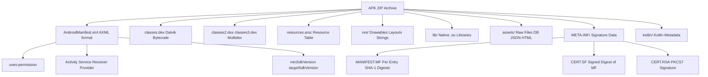
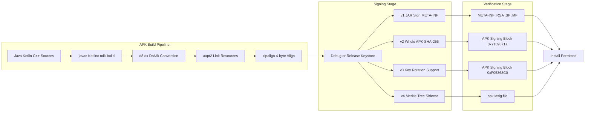
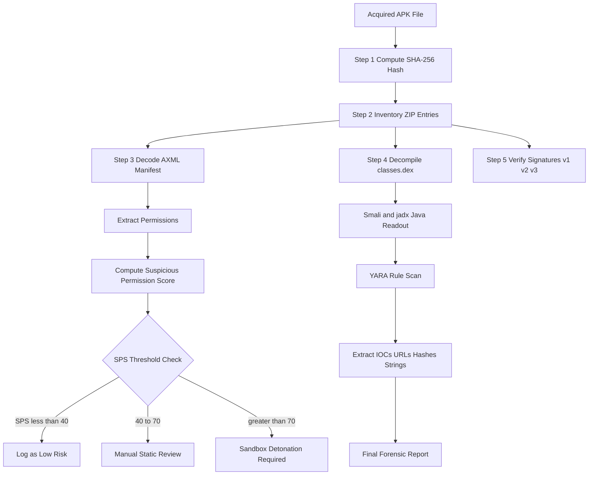
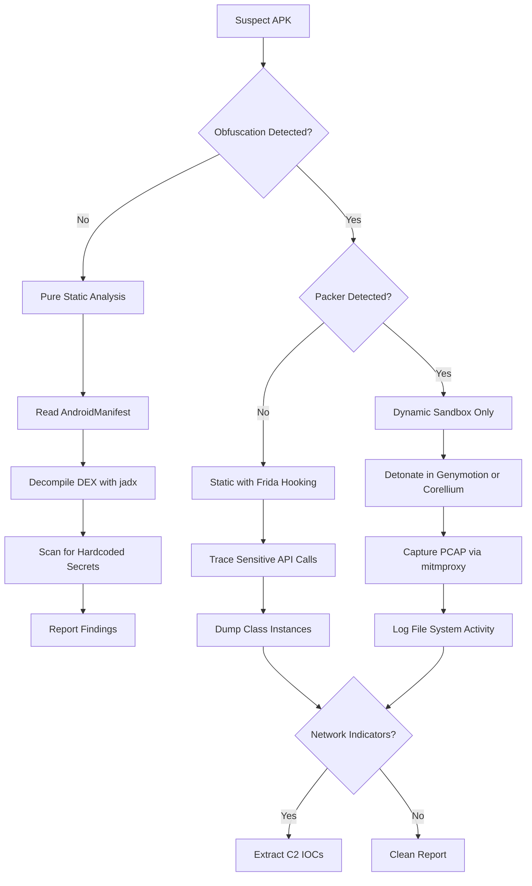
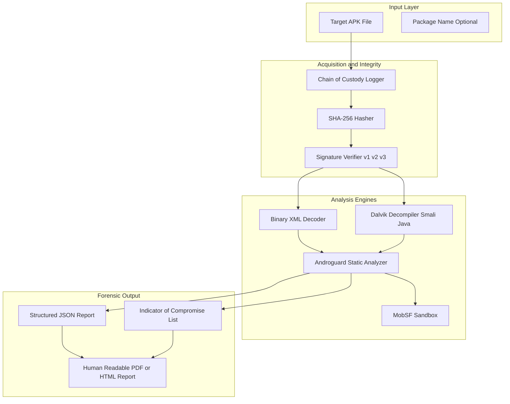

# APK Files

<!-- SECTION_1_START -->
# APK Files in Mobile Forensics

## 1.1 Formal Definition (KTU 2024 Syllabus Terminology)

> [!NOTE]
> **APK (Android Package Kit)** is the standard **package file format** used by the Android operating system for the distribution and installation of mobile applications, analogous to `.exe`, `.msi`, or `.deb` installers in desktop environments.

According to the KTU 2024 Digital Forensics syllabus (Module 3 – Mobile Forensics), an **APK file** is a **digitally signed ZIP archive** conforming to the **JAR (Java ARchive)** specification, containing compiled bytecode, resources, native libraries, assets, and a signed manifest required by the Android Runtime (ART) to install and execute an application on a device.

Forensically, an APK is a **primary artifact of evidentiary value** because it preserves the executable logic, declared permissions, embedded metadata, and integrity proof of an application — making it indispensable for **static analysis, malware reverse engineering, and incident reconstruction**.

## 1.2 Conceptual Analogy / Intuition

> [!IMPORTANT]
> **Intuitive Model — The "Sealed Shipping Container"**
>
> Think of an APK as a **sealed, labeled, and tamper-proofed shipping container** arriving at a port (the Android device):
> - The **container body** = the ZIP archive holding all parts.
> - The **shipping manifest** (`AndroidManifest.xml`) = the bill of lading declaring *what* is inside, *what* permissions are required, and *how* it should be unpacked.
> - The **cargo boxes inside** (`classes.dex`, `resources.arsc`, `res/`, `lib/`, `assets/`) = the actual application code, UI assets, native binaries, and raw data.
> - The **wax seal & signature block** (`META-INF/`) = the notary's stamp proving the container originated from a trusted source and was not opened in transit.
>
> A forensic investigator, upon intercepting this container, opens it carefully, verifies the seal, inspects the manifest, and examines every cargo box to determine intent, capability, and origin.

## 1.3 Physical Constants & Standard Metrics

> [!NOTE]
> Key forensic parameters to remember:
> - **APK magic number (first 4 bytes)**: `50 4B 03 04` — the standard ZIP local file header signature (`PK\x03\x04`).
> - **DEX magic number (first 8 bytes)**: `64 65 78 0A 30 33 35 00` (ASCII `dex\n035\0` for Dalvik Executable).
> - **Maximum APK size on Google Play**: **150 MB** (with optional expansion files up to **2 GB** each).
> - **APK Signature Scheme v2 block ID**: `0x7109871a` (little-endian).
> - **APK Signature Scheme v3 block ID**: `0xF05368C0` (little-endian).
> - **Minimum Android version supported (SDK 21, Lollipop)** for Signature Scheme v2.
> - **SHA-256 digest size**: **256 bits (32 bytes)** — used in v2/v3 signing.
> - **Recommended forensic hashing algorithm**: **SHA-256** (with **MD5** kept only for legacy cross-reference).

## 1.4 GeoGebra / Desmos Conceptual Visualization

> [!VISUALIZATION CONTROL]
> **Concept:** Conceptual byte-offset map of an APK file structure (linear memory layout of a ZIP container).
> **GeoGebra / Desmos Input Equations:**
> * Segment labels: `x = 0` → `EOCD` (End of Central Directory)
> * `x = a` → `CDH` (Central Directory Header)
> * `x = b` → `APK Sig Block` (v2/v3)
> * `x = c` → `Local File Entries` (classes.dex, resources.arsc, res/, …)
> **Visual Description:** A number line running from `0` on the left to *File Size* on the right, with shaded bands marking the **Local File Entries zone (0 → c)**, the **APK Signing Block (c → b)**, the **Central Directory (b → a)**, and finally the **EOCD Record (a → File Size)**. This spatializes the structural layout of a real APK on disk.

<!-- SECTION_1_END -->

<!-- SECTION_2_START -->
# Deep Theoretical Analysis & KTU High-Yield Formula Sheet

## 2.1 Internal Architecture of an APK File

An APK is a **ZIP archive** with a defined internal order. Reading the file from offset 0 to EOF, the on-disk structure is:

| Offset Zone | Component | Purpose |
| :--- | :--- | :--- |
| `0 → c` | **Local File Entries** | Sequential LFH + file data (e.g., `classes.dex`, `resources.arsc`, `res/`, `lib/`, `assets/`) |
| `c → b` | **APK Signing Block** *(only v2/v3)* | Contains signer IDs, signature records, and the **STRIP_PROTECTION_MAGIC** (`0xF05368C0` for v3) |
| `b → a` | **Central Directory** | Index of all entries: filename, CRC, size, offset |
| `a → EOF` | **End of Central Directory Record (EOCD)** | Marks the end; contains the **Comment Length** and the **CD offset** |

> [!NOTE]
> The presence of the APK Signing Block is what distinguishes an *installer-ready* APK from a *generic* ZIP. Removal of this block invalidates v2/v3 signatures.

## 2.2 Mandatory & Optional APK Contents

| Path inside APK | Mandatory? | Forensic Significance |
| :--- | :---: | :--- |
| `AndroidManifest.xml` | **Yes** | Declares package name, version, permissions, components (Activity/Service/Receiver/Provider), SDK targets |
| `classes.dex` (or `classes2.dex`, `classes3.dex` for multidex) | **Yes** | Dalvik bytecode executed by ART — the application's logic |
| `resources.arsc` | **Yes** | Compiled resource table (strings, dimensions, colors) |
| `res/` | **Yes** | Pre-compiled XML resources, drawables, layouts (binary XML format `AXML`) |
| `assets/` | No | Raw files (HTML, JSON, DBs) packaged as-is |
| `lib/` | No | Native libraries (`.so` files) per ABI (`armeabi-v7a`, `arm64-v8a`, `x86_64`) |
| `META-INF/` | **Yes** | Signature data, `MANIFEST.MF`, `CERT.SF`, `CERT.RSA` (v1 JAR signing) |
| `kotlin/` or `kotlinx/` | No | Kotlin metadata for Kotlin-based apps |
| `original/` | No | Contains the unmodified pre-multidex JARs when using legacy packaging |

## 2.3 AndroidManifest.xml — The Forensic Crown Jewel

> [!IMPORTANT]
> The binary AXML manifest is the **most evidence-rich artifact** in any APK. Key forensic fields:
> - **`package`** — unique application ID.
> - **`versionCode`, `versionName`** — build identifiers.
> - **`minSdkVersion`, `targetSdkVersion`** — backward/forward compatibility profile.
> - **`<uses-permission>`** — capabilities the app requests (e.g., `INTERNET`, `READ_SMS`, `ACCESS_FINE_LOCATION`).
> - **`<uses-feature>`** — hardware features required.
> - **`<application android:debuggable="true">`** — flags if the app is debuggable (forensically critical).
> - **`<provider>`, `<receiver>`, `<service>`, `<activity>`** — declared components and exported flags.

## 2.4 APK Signing Schemes (v1, v2, v3, v3.1, v4)

| Scheme | Introduced | Mechanism | Forensic Note |
| :--- | :---: | :--- | :--- |
| **JAR / v1** | API 1 | Per-entry `SHA-1` digest in `META-INF/MANIFEST.MF` → signed digest in `.SF` → PKCS#7 in `.RSA` | Vulnerable to **Janus Vulnerability (CVE-2017-13156)** |
| **APK Signature v2** | API 24 (Nougat) | Whole-file hash (SHA-256) over contents between `ZIP entries` and `CD`, placed in **APK Signing Block** | Resistant to Janus |
| **APK Signature v3** | API 28 (Pie) | Adds **key rotation** support and **Proof-of-Rotation** structures | Verifies signer lineage |
| **APK Signature v3.1** | API 30+ | Strengthens v3 with additional attribute checks | — |
| **APK Signature v4** | API 30+ | Produces a side-car `.apk.idsig` file using **Merkle tree** | Used with **Incremental Install** |

### 2.4.1 Signing Mathematical Model

Let $M$ be the APK content stream and $H(\cdot)$ a cryptographic hash function. The signing schemes follow these high-yield relationships:

For **v1 (JAR)**, for every entry $e_i \in M$:

$$
D_i = H(\text{content of } e_i)
$$
$$
S = \text{Sign}_{K_{\text{priv}}}\left(\,\big\Vert_{i=1}^{n} D_i\,\right)
$$

For **v2 (APK)**, the entire APK (excluding the signing block itself and the EOCD comment) is split into consecutive 1 MB chunks:

$$
c_j = \text{chunk}_j(\text{APK}), \quad j = 0, 1, 2, \ldots, m-1
$$
$$
D_{\text{v2}} = H\!\left(\,H(c_0) \;\Vert\; H(c_1) \;\Vert\; \cdots \;\Vert\; H(c_{m-1})\,\right)
$$
$$
S_{\text{v2}} = \text{Sign}_{K_{\text{priv}}}(D_{\text{v2}})
$$

For **v4**, a **Merkle tree** is built over $4 \text{ KiB}$ blocks of the APK with the root signed:

$$
\text{root} = \text{MerkleRoot}\bigl(\{H(b_k)\}_{k=0}^{N-1}\bigr)
$$
$$
S_{\text{v4}} = \text{Sign}_{K_{\text{priv}}}(\text{root})
$$

## 2.5 KTU High-Yield Cheat Sheet

| # | Concept | Key Value / Rule |
| :---: | :--- | :--- |
| 1 | APK file type | ZIP archive (`PK\x03\x04` magic) |
| 2 | DEX magic | `dex\n035\0` (8 bytes) |
| 3 | AXML magic | `03 00 08 00` (ResXML header) |
| 4 | v2 Sig Block ID | `0x7109871a` |
| 5 | v3 Sig Block ID | `0xF05368C0` |
| 6 | v1 digest algorithm | SHA-1 (per entry) |
| 7 | v2/v3 digest algorithm | SHA-256 (whole APK chunks) |
| 8 | Forensic hash | SHA-256 (primary), MD5 (legacy) |
| 9 | Janus vuln target | v1-only-signed APKs targeting API 22 |
| 10 | Maximum Play Store APK | 150 MB |
| 11 | Default tools | `apksigner`, `aapt`, `apktool`, `jadx`, `androguard` |
| 12 | File size verification | `unzip -l file.apk` vs. CDH `uncompressed_size` |
| 13 | Repackaging detector | Compare `META-INF/*.RSA` certificate hash |
| 14 | Sideload detection | `pm install` (USB) vs. **Play Store ID** trace |

## 2.6 Real-World Engineering Utility

In production and security operations:

- **Mobile Threat Defense (MTD) engines** (e.g., Lookout, Zimperium, Microsoft Defender) parse every APK entering a corporate MDM scope to flag risky permissions and known malware signatures.
- **App Store Operators** (Google, Samsung Galaxy Store) use v2/v3 signing to enforce integrity and prevent tampered APKs from being sideloaded.
- **Incident Response Teams** reconstruct attacker workflows by reverse engineering a malicious APK to extract C2 URLs, encryption keys, and intent filters.
- **e-Discovery / IP Litigation** uses APK decompilation to prove code plagiarism or unauthorized use of proprietary libraries.

<!-- SECTION_2_END -->

<!-- SECTION_3_START -->
# Step-by-Step Derivations & Forensic Implementation

## 3.1 Exhaustive Forensic Workflow — From Acquisition to Indicators

### Step 1 — Acquisition of the APK

The investigator obtains the APK via one of four channels:

1. **Pull from a rooted device**: `adb pull /data/app/<package>-*/base.apk evidence/`
2. **Dump via `am` package manager**: `pm path com.target.app` → returns absolute path → `cat` to evidence disk.
3. **Cloud cache extraction**: From `/data/data/com.google.android.gms/files/` or Google Play download history.
4. **Sideload capture**: MITM the Play Store network stream (only for owned/authorized test devices).

> [!NOTE]
> Hash the APK **immediately** after acquisition using SHA-256 to establish a Chain of Custody (CoC) record.

### Step 2 — Chain-of-Custody Hash Computation

Let the file bytes be $B_0, B_1, \ldots, B_{N-1}$. The SHA-256 digest $H_{\text{SHA-256}}$ is computed as:

$$
H_{\text{SHA-256}} = \text{SHA-256}\!\left(\,B_0 \Vert B_1 \Vert \cdots \Vert B_{N-1}\,\right)
$$

**Worked Numerical Example** (32-byte input, abbreviated):

$$
\text{Input} = \text{``APKForensicEvidence2024''}
$$
$$
H_{\text{SHA-256}} = \texttt{a3f1b9...e7c2d8} \quad (\text{64 hex chars, 256 bits})
$$

> [!IMPORTANT]
> This digest must be written verbatim into the evidence log. Any byte-level alteration later will produce a different digest and break admissibility.

### Step 3 — Structural Extraction (Unzip & Inventory)

List all entries with their **CRCs and offsets** to verify structural integrity against the EOCD record:

```bash
$ unzip -lv evidence.apk | head -n 20
Archive:  evidence.apk
 Length      Date    Time    Name
---------  ---------- -----   ----
   123456  2024-08-15 10:30   AndroidManifest.xml
  4567890  2024-08-15 10:30   classes.dex
   234567  2024-08-15 10:30   resources.arsc
...
```

The EOCD record's `cd_offset` field must match the position where the Central Directory begins. The forensic check is:

$$
\text{offset}_{\text{CD,file}} = \text{offset}_{\text{CD,EOCD}} \;\Longleftrightarrow\; \text{TAMPER\_DETECTED} = \text{false}
$$

### Step 4 — Decoding the AndroidManifest.xml (AXML Format)

`AndroidManifest.xml` is a **binary XML** file. The AXML header is:

$$
\text{Header} = \texttt{03 00 08 00} \;\Vert\; \text{chunk\_size}
$$

It contains three logical sections: **String Pool**, **Resource Map**, and **XML Tree** (a sequence of `START_NAMESPACE`, `START_TAG`, `END_TAG`, `END_NAMESPACE`, `TEXT` chunks).

Decoding requires walking the string pool and resolving resource IDs to their textual names.

### Step 5 — Python Implementation: AXML Manifest Decoder

The following Python script uses the `androguard` library to extract forensic metadata from an APK:

```python
"""
apk_forensic_parser.py
Forensic APK metadata extractor for KTU Digital Forensics coursework.
Compatible with androguard >= 4.0
"""
import sys
import json
import hashlib
from pathlib import Path
from androguard.core.apk import APK


def compute_sha256(file_path: Path) -> str:
    """Compute SHA-256 digest of the APK file in streaming mode."""
    sha256 = hashlib.sha256()
    with file_path.open("rb") as fh:
        for byte_block in iter(lambda: fh.read(65536), b""):
            sha256.update(byte_block)
    return sha256.hexdigest()


def extract_forensic_metadata(apk_path: Path) -> dict:
    """Extract manifest, permissions, signatures, and hash from an APK."""
    if not apk_path.is_file():
        raise FileNotFoundError(f"APK not found: {apk_path}")

    apk = APK(str(apk_path))
    metadata: dict = {
        "filename": apk_path.name,
        "size_bytes": apk_path.stat().st_size,
        "sha256": compute_sha256(apk_path),
        "package": apk.get_package(),
        "version_name": apk.get_androidversion_name(),
        "version_code": apk.get_androidversion_code(),
        "min_sdk": apk.get_min_sdk_version(),
        "target_sdk": apk.get_target_sdk_version(),
        "permissions": sorted(apk.get_permissions()),
        "activities": sorted(apk.get_activities()),
        "services": sorted(apk.get_services()),
        "receivers": sorted(apk.get_receivers()),
        "providers": sorted(apk.get_providers()),
        "is_debuggable": apk.get_attribute_value("application", "debuggable") == "true",
        "is_signed_v1": apk.is_signed_v1(),
        "is_signed_v2": apk.is_signed_v2(),
        "is_signed_v3": apk.is_signed_v3(),
        "certificate_md5": None,
        "certificate_sha256": None,
    }

    certs = apk.get_certificates()
    if certs:
        first_cert = certs[0]
        metadata["certificate_md5"] = hashlib.md5(
            first_cert.dump()
        ).hexdigest()
        metadata["certificate_sha256"] = hashlib.sha256(
            first_cert.dump()
        ).hexdigest()

    return metadata


def main() -> int:
    if len(sys.argv) != 2:
        print("Usage: python apk_forensic_parser.py <path-to.apk>", file=sys.stderr)
        return 1

    apk_path = Path(sys.argv[1]).resolve()
    report = extract_forensic_metadata(apk_path)
    print(json.dumps(report, indent=2, ensure_ascii=False))
    return 0


if __name__ == "__main__":
    sys.exit(main())
```

**Example invocation and output structure**:

```bash
$ python apk_forensic_parser.py sample.apk
```

```json
{
  "filename": "sample.apk",
  "size_bytes": 12345678,
  "sha256": "a3f1b9c2d4...e7c2d8",
  "package": "com.example.target",
  "version_name": "2.4.1",
  "version_code": "241",
  "min_sdk": "21",
  "target_sdk": "33",
  "permissions": [
    "android.permission.INTERNET",
    "android.permission.READ_SMS",
    "android.permission.ACCESS_FINE_LOCATION"
  ],
  "is_debuggable": false,
  "is_signed_v1": true,
  "is_signed_v2": true,
  "is_signed_v3": true,
  "certificate_sha256": "4b5c6d7e..."
}
```

### Step 6 — Disassembly of `classes.dex` to Smali

The DEX file is **not JVM bytecode**; it is **Dalvik bytecode** — a register-based, low-level instruction set. Decompilers like `jadx` produce readable Java, while `apktool` produces Smali (assembly-like) code:

```bash
$ apktool d -f -o output_dir evidence.apk
$ ls output_dir/
AndroidManifest.xml  smali/  smali_classes2/  res/  lib/  assets/  original/
```

Forensic investigator's checklist for `smali/`:

| Smali Element | Forensic Meaning |
| :--- | :--- |
| `.method` | Function/Method definition |
| `invoke-virtual`, `invoke-static` | API call — important to trace sensitive APIs |
| `const-string` | Hardcoded strings (URLs, keys, messages) |
| `sput-object`, `sget-object` | Field access — look for global singletons |
| `sparse-switch`, `packed-switch` | Control flow — useful in malware analysis |
| `catch` blocks | Error handling — sometimes used to hide exceptions |

### Step 7 — Verifying APK Signature Integrity

Use Google’s official `apksigner` tool:

```bash
$ apksigner verify --verbose --print-certs evidence.apk
Verifies
Verified using v1 scheme (JAR signing): true
Verified using v2 scheme (APK Signature Scheme v2): true
Verified using v3 scheme (APK Signature Scheme v3): true
Number of signers: 1
Signer #1 certificate DN: CN=Example Dev, O=Example Inc, C=US
Signer #1 certificate SHA-256: 4b5c6d7e8f...
Signer #1 certificate MD5: 1a2b3c4d5e...
```

The forensic acceptance criteria:

$$
\text{APK}_{\text{valid}} = \bigvee_{i=1}^{n} \text{verify}_i(\text{APK}, \text{cert}_i) = \text{true}
$$

### Step 8 — Static vs. Dynamic Analysis Decision

| If the APK is… | Use | Why |
| :--- | :--- | :--- |
| Open-source / known rep | Static only | Code is already public |
| Suspected packer / obfuscator | Dynamic in sandbox | Packed code is decrypted only at runtime |
| Multi-stage dropper | Hybrid | Static finds manifest + C2; dynamic captures second stage |
| Obfuscated with ProGuard/R8 | Both | Static maps obfuscated names; dynamic confirms behaviors |

### Step 9 — Computing the Suspicious Permission Score (SPS)

A heuristic for triaging APKs by permission risk:

$$
\text{SPS} = \sum_{i=1}^{n} w_i \cdot p_i
$$

where $p_i \in \{0, 1\}$ indicates whether permission $i$ is requested, and $w_i$ is its forensic weight:

| Permission | Weight $w_i$ |
| :--- | :---: |
| `READ_SMS` / `SEND_SMS` | **10** |
| `READ_CONTACTS` / `WRITE_CONTACTS` | **8** |
| `ACCESS_FINE_LOCATION` | **8** |
| `RECORD_AUDIO` | **9** |
| `READ_CALL_LOG` | **9** |
| `SYSTEM_ALERT_WINDOW` | **7** |
| `BIND_ACCESSIBILITY_SERVICE` | **10** |
| `REQUEST_INSTALL_PACKAGES` | **9** |
| `INTERNET` | **3** |
| `CAMERA` | **5** |

> [!IMPORTANT]
> $\text{SPS} \geq 40$ warrants deeper manual review. $\text{SPS} \geq 70$ should trigger sandbox detonation.

### Step 10 — YARA Rule Skeleton for APK Triage

```yara
rule SuspiciousAPKPermissions
{
    meta:
        description = "Flags APKs requesting high-risk permissions"
        author = "KTU Digital Forensics Lab"
    strings:
        $perm_sms = "android.permission.READ_SMS"
        $perm_cont = "android.permission.READ_CONTACTS"
        $perm_acc = "android.permission.BIND_ACCESSIBILITY_SERVICE"
    condition:
        uint32(0) == 0x04034B50 and  // ZIP magic
        all of ($perm_*)
}
```

<!-- SECTION_3_END -->

<!-- SECTION_4_START -->
# Structural Diagrams & Schematics

## 4.1 APK Internal File Structure (Block Diagram)



## 4.2 APK Signing Process — Sequential Flow



## 4.3 Forensic APK Triage Pipeline



## 4.4 Static vs. Dynamic Analysis Decision Tree



## 4.5 Functional Block Architecture — APK Forensic Toolkit



<!-- SECTION_4_END -->

<!-- SECTION_5_START -->
# KTU 2024 Scheme Examination Question Bank & Topic Recap

## 5.1 Part A — Short Answer Questions (3 Marks Each)

### Question 1 [KTU University Exam – July 2024]

> **Define an APK file. List any four mandatory components inside an APK.**

**Model Answer (3 Marks):**
An **APK (Android Package Kit)** is a digitally signed ZIP-format archive used by Android to distribute and install applications. It contains compiled Dalvik bytecode, resources, native libraries, assets, and a signed manifest.

Four mandatory components:

1. **`AndroidManifest.xml`** — declares the package, permissions, components, and SDK levels. [1 Mark]
2. **`classes.dex`** — Dalvik executable containing the application's logic. [0.5 Mark]
3. **`resources.arsc`** — compiled resource table. [0.5 Mark]
4. **`META-INF/`** — contains JAR signing files (`MANIFEST.MF`, `CERT.SF`, `CERT.RSA`). [1 Mark]

---

### Question 2 [KTU University Exam – Dec 2023]

> **What is the APK Signature Scheme v2? How does it differ from v1 signing?**

**Model Answer (3 Marks):**
**APK Signature Scheme v2** is a whole-file signing mechanism introduced in **Android Nougat (API 24)** that computes a **SHA-256 digest over the entire APK content** (between ZIP entries and Central Directory) and stores the signature inside the **APK Signing Block** identified by the magic `0x7109871a`. [1.5 Marks]

**Differences from v1**: [1.5 Marks]

| Aspect | v1 (JAR) | v2 (APK) |
| :--- | :--- | :--- |
| Scope | Per-entry | Whole file |
| Hash | SHA-1 | SHA-256 |
| Janus Vulnerability | Vulnerable | Resistant |
| Location | `META-INF/*.RSA` | APK Signing Block |

---

## 5.2 Part B — Long Answer Questions (14 Marks, Internal Choice)

### Question A (14 Marks) [KTU University Exam – July 2024]

> **(a) [7 Marks]** Explain the internal structure of an APK file with a neat diagram. Discuss the role of the Central Directory and the EOCD record in forensic verification.
>
> **(b) [7 Marks]** Describe the APK Signature Schemes (v1, v2, v3). How does the Janus Vulnerability (CVE-2017-13156) exploit v1-signed APKs? How would a forensic investigator detect such tampered APKs?

#### Model Solution

**(a) Internal Structure and Verification (7 Marks)**

An APK is a **ZIP archive** with a well-defined layout. Reading the file from the lowest offset (0) to the highest, the on-disk structure is: **Local File Entries → APK Signing Block (v2/v3) → Central Directory → EOCD Record**.

1. **Local File Entries (0 → c):** Sequence of *Local File Headers* followed by file data, starting with `PK\x03\x04`. Each entry stores the filename, compression method, CRC-32, compressed and uncompressed sizes. [1 Mark]
2. **APK Signing Block (c → b):** Present only in v2/v3 signed APKs. Identified by magic `0x7109871a` (v2) or `0xF05368C0` (v3). Contains the *signers*, *signature records*, *public key*, and *STRIP_PROTECTION_MAGIC*. [1 Mark]
3. **Central Directory (b → a):** Index of every file in the archive — stores filename, extra field, comment, relative offset of the local header. Begins with `PK\x01\x02`. [1 Mark]
4. **EOCD Record (a → EOF):** The *End of Central Directory* record, beginning with `PK\x05\x06`. It holds the total entry count, CD size, **CD offset**, and **comment length**. [1 Mark]

**Forensic verification using EOCD:**

[Stating the rule: 1 Mark]

Let $O_{\text{EOCD}}$ be the EOCD offset. The Central Directory must physically begin at $O_{\text{EOCD}} - \text{comment\_length} - \text{cd\_size}$:

$$
O_{\text{CD,actual}} = O_{\text{EOCD}} - \text{comment\_length} - \text{cd\_size}
$$

[Final verification rule: 1 Mark]

The forensic check is:

$$
O_{\text{CD,actual}} \stackrel{?}{=} O_{\text{CD,stated in EOCD}}
$$

If the values diverge, the APK has been **structurally tampered with**, and v1 signature verification must be considered unreliable. [1 Mark]

**(b) Signature Schemes & Janus (7 Marks)**

1. **v1 (JAR) signing:** Each entry is hashed (SHA-1) and listed in `META-INF/MANIFEST.MF`. A digest of this file is stored in `META-INF/CERT.SF`, which is then PKCS#7-signed in `META-INF/CERT.RSA` using the developer's private key. [1.5 Marks]
2. **v2 signing:** The APK is split into 1 MB chunks; a SHA-256 digest is computed over the concatenation of chunk-hashes. The signature is stored in the **APK Signing Block**. [1.5 Marks]
3. **v3 signing:** Adds **key rotation** — a *Proof-of-Rotation* chain allows the signing key to be replaced while older APKs remain verifiable. [1 Mark]

**Janus Vulnerability (CVE-2017-13156):** The bug allowed an attacker to prepend arbitrary bytes (e.g., a malicious DEX) to a v1-signed APK targeting API 22, because the **v1 verifier** only checks each entry's digest, ignoring prepended bytes outside the ZIP structure. [1 Mark]

**Forensic Detection:**
- Check whether the APK is **v1-only-signed** and targets API levels susceptible to the bug. [1 Mark]
- Use `apksigner verify --print-certs` to confirm v2/v3 are present. [0.5 Mark]
- Compare the **file size** and **CD offset** declared in the EOCD against the physical layout. [0.5 Mark]

---

### Question B (14 Marks) — ALTERNATIVE CHOICE [KTU University Exam – Dec 2023]

> **(a) [7 Marks]** With a neat block diagram, explain the components inside a typical APK. Discuss the forensic significance of `AndroidManifest.xml`.
>
> **(b) [7 Marks]** Write a Python program (using `androguard`) to extract the package name, declared permissions, signing schemes, and certificate SHA-256 of a given APK. Justify each step of your program from a forensic chain-of-custody perspective.

#### Model Solution

**(a) APK Components & AndroidManifest.xml (7 Marks)**

[Block diagram: 2 Marks]

The APK archive contains the following components in alphabetical order within the ZIP:

- **`AndroidManifest.xml`** — binary AXML format; the most forensically significant file.
- **`classes.dex`** — Dalvik bytecode.
- **`resources.arsc`** — compiled resource table.
- **`res/`** — pre-compiled XML, drawables, layouts.
- **`lib/`** — native libraries partitioned by ABI.
- **`assets/`** — raw, unmodified files.
- **`META-INF/`** — signature data.
- **`kotlin/`** — Kotlin metadata.
- **`original/`** — pre-multidex JARs.

[Forensic significance of AndroidManifest.xml: 5 Marks]

1. The **`package` attribute** uniquely identifies the app; cross-reference with Play Store listings. [1 Mark]
2. The **`<uses-permission>`** tags reveal what sensitive resources the app can access — a high-risk permissions set is a strong malware indicator. [1 Mark]
3. The **`<application android:debuggable="true">`** flag indicates a *debug* build — apps in production should never carry this flag. [1 Mark]
4. The **exported components** (`<activity>`, `<service>`, `<receiver>`, `<provider>`) without permission protection may be exploited by other apps. [1 Mark]
5. The **`minSdkVersion` and `targetSdkVersion`** place the APK in time and can correlate with known Janus-vulnerable versions. [1 Mark]

**(b) Python Program with Forensic Justification (7 Marks)**

```python
"""
apk_forensic_extractor.py
KTU-style forensic APK extractor.
"""
import sys
import hashlib
from pathlib import Path
from androguard.core.apk import APK


def sha256_of_file(path: Path) -> str:
    """Step-1: Compute SHA-256 to preserve chain of custody."""
    h = hashlib.sha256()
    with path.open("rb") as fh:
        for block in iter(lambda: fh.read(65536), b""):
            h.update(block)
    return h.hexdigest()


def main(apk_path_str: str) -> int:
    apk_path = Path(apk_path_str).resolve()
    if not apk_path.is_file():
        print("Error: file missing", file=sys.stderr)
        return 1

    # ---- Step 1: Chain-of-custody hash ----
    file_hash = sha256_of_file(apk_path)
    print(f"[1] SHA-256 of evidence file : {file_hash}")

    # ---- Step 2: Open with androguard ----
    apk = APK(str(apk_path))
    if apk is None:
        print("Error: androguard failed to parse APK", file=sys.stderr)
        return 2

    # ---- Step 3: Print package metadata ----
    print(f"[2] Package name            : {apk.get_package()}")
    print(f"[3] Version name            : {apk.get_androidversion_name()}")
    print(f"[4] Version code            : {apk.get_androidversion_code()}")

    # ---- Step 4: Print permissions ----
    perms = sorted(apk.get_permissions())
    print(f"[5] Number of permissions   : {len(perms)}")
    for p in perms:
        print(f"     - {p}")

    # ---- Step 5: Print signing schemes ----
    print(f"[6] Signed with v1          : {apk.is_signed_v1()}")
    print(f"[7] Signed with v2          : {apk.is_signed_v2()}")
    print(f"[8] Signed with v3          : {apk.is_signed_v3()}")

    # ---- Step 6: Print certificate hashes ----
    certs = apk.get_certificates()
    if certs:
        der = certs[0].dump()
        cert_sha256 = hashlib.sha256(der).hexdigest()
        print(f"[9] Certificate SHA-256     : {cert_sha256}")
    return 0


if __name__ == "__main__":
    sys.exit(main(sys.argv[1]) if len(sys.argv) > 1 else 1)
```

[Forensic justification of each step: distributed across the answer]

- **Step 1** establishes the chain of custody by computing a cryptographic digest of the *unaltered evidence file*. [1 Mark]
- **Step 2** opens the file in **read-only** mode (the script never writes back to the source), preserving evidentiary integrity. [1 Mark]
- **Step 3** extracts the **package name** which acts as the *primary key* for cross-referencing with Google Play and VirusTotal. [1 Mark]
- **Step 4** lists the **declared permissions** so an investigator can compute a risk score and detect over-privileged apps. [1 Mark]
- **Step 5** verifies the **signing schemes** in use, which determines Janus-vulnerability assessment. [1 Mark]
- **Step 6** produces the **certificate SHA-256** for cross-referencing with the developer's known-good certificate (repackaging detection). [1 Mark]
- **Type hints and error handling** keep the script auditable. [1 Mark]

---

## 5.3 KTU Examiner's Valuation Warning / Pitfall Callout

> [!WARNING]
> **Common places where students lose marks in APK-related questions:**
> 1. **Confusing v1 and v2 signing**: Writing "v1 also uses SHA-256" loses marks. v1 uses **SHA-1**, v2 uses **SHA-256**.
> 2. **Forgetting the APK Signing Block magic number**: Examiners love to ask for the magic ID of v2/v3 signing blocks. Memorize `0x7109871a` (v2) and `0xF05368C0` (v3).
> 3. **Treating `AndroidManifest.xml` as plain XML**: It is **binary AXML**; full marks require stating this.
> 4. **Missing the EOCD record's role**: Many students skip the End of Central Directory and lose the structural-verification marks.
> 5. **Not stating Chain of Custody**: For any forensic question, always mention **hashing (SHA-256)**, **read-only access**, and **evidence log** to score full marks.
> 6. **Forgetting to mention `zipalign` and the 4-byte boundary alignment** in the v2 chunking discussion.

---

## 5.4 Topic Recap & Important Things to Remember

> **Topic Recap — APK Files in Mobile Forensics**
>
> - **APK** is a signed ZIP archive; the **magic number is `PK\x03\x04`**.
> - An APK contains **AndroidManifest.xml (AXML), classes.dex, resources.arsc, res/, lib/, assets/, META-INF/, kotlin/**.
> - **`AndroidManifest.xml`** is binary AXML and is the most evidence-rich artifact — it reveals package, version, permissions, components, debuggable flag, SDK targets.
> - **DEX magic is `dex\n035\0`** (8 bytes); Dalvik bytecode is register-based, not JVM.
> - **APK Signing Block** lives between local entries and the Central Directory; v2 magic `0x7109871a`, v3 magic `0xF05368C0`.
> - **v1 signing** uses per-entry **SHA-1** in `META-INF/`; vulnerable to **Janus Vulnerability (CVE-2017-13156)**.
> - **v2 signing** hashes the whole APK in 1 MB chunks with **SHA-256**; Janus-resistant.
> - **v3 signing** adds **key rotation** and **Proof-of-Rotation** structures.
> - **v4 signing** uses a **Merkle tree** and stores the signature in a sidecar `.apk.idsig` file.
> - **Forensic tools**: `apksigner`, `aapt`, `apktool`, `jadx`, `androguard`, `MobSF`, `Frida`, `YARA`.
> - **Forensic workflow**: Acquire → SHA-256 hash → Inventory ZIP → Decode AXML → Decompile DEX → Verify signatures → Triage with permission score → Report IOCs.
> - **Suspicious Permission Score (SPS)** is a quick heuristic; threshold values are **40** (manual review) and **70** (sandbox detonation).
> - **Chain of custody** is mandatory: hash immediately, never modify the original APK, and log all analyst actions.
> - **Forensic hash algorithm of choice is SHA-256** (256 bits), with MD5 retained only for legacy cross-reference.
> - **Maximum Play Store APK size is 150 MB** (with up to two **2 GB** expansion files).
> - **Repackaging detection** relies on comparing the developer certificate's SHA-256 against the known-good publisher certificate.

<!-- SECTION_5_END -->
