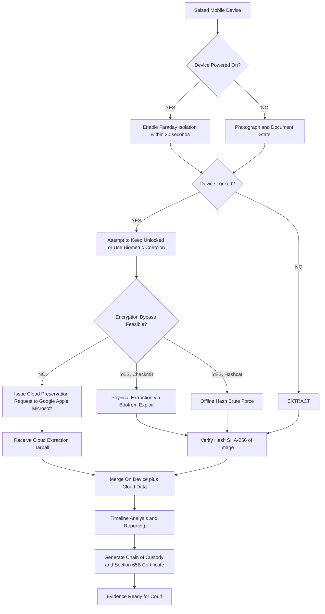

# Challenges in Mobile Forensics

<!-- SECTION_1_START -->
# Challenges in Mobile Forensics

## 1.1 Formal Academic Definition

> [!IMPORTANT]
> **Definition (KTU 2024 Scheme — PECST754, Module 3):**
> *Mobile Forensics* is a branch of digital forensics that involves the **acquisition, preservation, analysis, and presentation** of digital evidence recovered from mobile devices operating under cellular networks. *Challenges in Mobile Forensics* refer to the **technical, legal, operational, and procedural obstacles** that impede the consistent, repeatable, and legally admissible extraction of evidentiary data from mobile handsets, smart devices, and their associated peripheral media.

The challenges are categorized under four primary domains in the KTU syllabus:

1. **Device-Level Hardware Challenges** — Heterogeneity of devices, modems, basebands, and storage media.
2. **Software & OS-Level Challenges** — Fragmented OS versions, proprietary file systems, and rapid OTA patching cycles.
3. **Data & Security Challenges** — Encryption (FDE / FBE), passcode locks, anti-forensic routines, and volatile artifacts.
4. **Procedural & Legal Challenges** — Jurisdictional complexity, cloud jurisdiction, and chain-of-custody fragility.

## 1.2 Conceptual Analogy / Intuition

> [!NOTE]
> **Plain-English Analogy: The "Moving Locked Filing Cabinet" Metaphor**
>
> Imagine a detective needs evidence from a suspect's filing cabinet. In **computer forensics**, the cabinet usually sits in one place, runs one operating system (Windows, Linux, macOS), and has standardized drawers. In **mobile forensics**, however:
> - The **filing cabinet changes shape** every few months (new smartphone model released every quarter).
> - The **lock on the cabinet** is reset remotely by the manufacturer anytime (remote wipe / kill switch).
> - The **drawers are written in 50 different languages** that keep changing (proprietary SQLite schemas, .db, .plist, .xml, encrypted blobs).
> - The **papers inside vanish** when a new paper is placed on top (wear-leveling, TRIM, garbage collection overwriting old SMS).
> - Some **papers are actually stored in a warehouse in another country** (iCloud, Google Drive), and the detective needs a search warrant for *that* jurisdiction too.
>
> This is precisely why mobile forensics is considered the **most volatile and difficult sub-discipline** of digital forensics.

## 1.3 Key Standard Metrics & Constants

> [!NOTE]
> **Standard Forensic Metrics (Industry References):**
> - **Cellebrite UFED extraction throughput:** ~**2.5 GB/min** for logical extraction.
> - **NIST CFTT (Computer Forensic Tool Testing) accuracy threshold:** $\ge \mathbf{100\%}$ bit-stream fidelity.
> - **Default Android full-disk encryption key length:** **AES-128** (since Android 5.0) and **AES-256** (since Android 10).
> - **Apple Secure Enclave Processor (SEP)** isolation boundary: hardware-level key escrow.
> - **GSM/UMTS/LTE baseband processor** is physically isolated from the application processor — it is a **separate forensic acquisition domain**.

## 1.4 Visualization Concept (Forensic Complexity Landscape)

> [!VISUALIZATION CONTROL]
> **Concept:** Complexity vs. Time-to-Evidence Curve for Mobile Devices
> **Conceptual Axes (Desmos Input):**
> * X-axis: `t` = Years after device purchase (e.g., 0 to 5)
> * Y-axis: `C(t)` = Cumulative forensic difficulty score
> **Equation sketch:**
> `C(t) = 5*t^2 + 20*sin(pi*t/2) + 30`
> **Visual Description:** Students should observe an **upward-opening parabola** with periodic ripples (representing major OS releases). The curve shows that *forensic difficulty grows non-linearly with the age of the device ecosystem*, not with the age of a single device.

<!-- SECTION_1_END -->

<!-- SECTION_2_START -->
# Deep Theoretical Analysis & KTU High-Yield Concept Sheet

## 2.1 Taxonomy of Mobile Forensic Challenges

The challenges are organized in the KTU curriculum into the following **six pillars**. Each pillar contains sub-challenges, their forensic impact, and the standard mitigation.

### Pillar 1 — Hardware Heterogeneity

| Sub-Challenge | Forensic Impact | Standard Mitigation |
|---|---|---|
| Thousands of device models from OEMs (Samsung, Xiaomi, Apple, OnePlus, Huawei) | No single tool can support all devices | Maintain a device library; use multi-tool approach (Cellebrite + MSAB XRY + Magnet AXIOM) |
| Diverse chipsets (Qualcomm Snapdragon, MediaTek Dimensity, Apple A-series, Samsung Exynos) | Different baseband processors require different extraction methods | Use chipset-specific bootloaders (e.g., Qualcomm EDL mode 9008) |
| Multiple storage types (eMMC, UFS 2.1/3.1/4.0, NVMe) | Sector sizes and wear-leveling algorithms differ | Physical acquisition with chip-off or ISP (In-System Programming) forensic bridge |
| Removable media (microSD, SIM, eSIM) | Evidence may be split across multiple media | Image each storage medium separately, then correlate logically |

### Pillar 2 — Operating System Fragmentation

| Sub-Challenge | Forensic Impact | Standard Mitigation |
|---|---|---|
| Android version fragmentation (Android 6 to Android 14 coexisting in the wild) | API behaviors differ; data locations change between versions | Maintain per-OS-version forensic profiles; use Oxygen Forensic Detective's version-aware parsers |
| Custom OEM skins (MIUI, OneUI, EMUI, ColorOS) | Pre-installed apps store data in vendor-proprietary paths | Vendor-specific knowledge bases (e.g., Samsung KNOX container extraction) |
| iOS version-specific encryption (each iOS major release alters key derivation) | Older jailbreaks become obsolete every release | Use checkm8-based bootrom exploit for devices up to iPhone X (A11) |
| Carrier-specific firmware (locked bootloaders) | Prevents root access needed for physical extraction | Coordinate with carrier for unlock codes (legal process) |

### Pillar 3 — Encryption & Access Control

This is the **single greatest challenge** in modern mobile forensics.

$$
K_{\text{eff}} = f(K_{\text{user}}, K_{\text{device}}, K_{\text{hardware}})
$$

where:
- $K_{\text{eff}}$ = effective decryption key
- $K_{\text{user}}$ = user-supplied passcode (4-digit, 6-digit, alphanumeric, biometric)
- $K_{\text{device}}$ = device-bound key derived from UID (Apple) or hardware key (Android)
- $K_{\text{hardware}}$ = hardware-rooted key (Apple SEP, Android StrongBox KeyMaster)

> [!IMPORTANT]
> **Key Insight:** Modern devices use **cryptographic binding** — without the user's passcode AND the device's hardware key, the data is computationally infeasible to decrypt. This is why *"brute-forcing the phone"* is no longer a viable option in practice.

**Android Full-Disk Encryption (FDE) → File-Based Encryption (FBE) Transition:**

$$
\text{Android FBE} = \text{Device-Encrypted (DE)} \oplus \text{Credential-Encrypted (CE)}
$$

- **DE storage**: Decrypted at boot with device key — used for alarms, accessibility services.
- **CE storage**: Decrypted only after user authentication — protects user data (photos, messages).

### Pillar 4 — Data Volatility & Persistence

| Data Type | Persistence Level | Forensic Recovery |
|---|---|---|
| RAM / Volatile memory | Milliseconds to seconds | Cold-boot forensic acquisition (rarely possible on phones) |
| Network state (IMEI, cell tower, Wi-Fi association) | Seconds to minutes | Radio-level interception (lawful intercept) |
| Running app memory | Seconds (until app suspended) | Live memory dump via root (requires bypass) |
| SQLite WAL (Write-Ahead Log) | Hours to days | Forensic tool must include WAL parser |
| User files (photos, SMS) | Days to years | Standard logical/physical extraction |
| Cloud-synced data | Indefinite (until user deletes from cloud) | Subpoena to cloud provider (Google, Apple, Microsoft) |

### Pillar 5 — Anti-Forensic Techniques

> [!NOTE]
> **Anti-forensics** is the deliberate use of tools and methods to thwart forensic analysis. Common mobile anti-forensic techniques:
>
> 1. **Secure erase / Factory reset** — Android `wipe` and iOS `Erase All Content`.
> 2. **Data hiding** — Steganography in images, data inside app caches.
> 3. **Encryption wrapping** — VeraCrypt containers, Signal Protocol ephemeral messages.
> 4. **Remote wipe** — MDM (Mobile Device Management) initiated, or iCloud / Google Find My Device.
> 5. **Tombstoning** — Apps intentionally mark records as deleted to confuse timeline analysis.
> 6. **GPS spoofing / timestamp manipulation** — Defeats geolocation correlation.

### Pillar 6 — Legal, Jurisdictional & Procedural

| Challenge | Description |
|---|---|
| **Cross-border data** | Evidence on an iPhone in India may reside in iCloud servers in the USA (or vice versa) — triggering MLAT (Mutual Legal Assistance Treaty) requirements. |
| **Warrant specificity** | A warrant valid in Kerala may not authorize extraction of data from a server in Ireland. |
| **Right to privacy** | India's IT Act 2000/2008 (amended), and the **Digital Personal Data Protection Act 2023** restrict what data an investigator can access, even on a suspect's device. |
| **Chain of custody** | Mobile devices are "always-on" and network-connected; any moment of unsecured possession can lead to evidence contamination. |
| **Tool admissibility** | Courts require that forensic tools be **validated per Section 65B of the Indian Evidence Act, 1872** (now Bharatiya Sakshya Adhiniyam 2023). |

## 2.2 KTU Formula / Concept Cheat Sheet

> [!IMPORTANT]
> **Always remember: there is no single "master formula" for mobile forensics challenges — but these conceptual equations govern the discipline:**

| Concept | Symbolic Form | Meaning |
|---|---|---|
| Encryption strength | $E = 2^{k}$ where $k$ = key bits | 128-bit key = $3.4 \times 10^{38}$ possible combinations |
| Acquisition time | $T_{\text{acq}} = \dfrac{S}{R}$ | $S$ = storage size, $R$ = tool read rate (GB/min) |
| Hash integrity | $H(M) = \text{SHA-256}(M)$ | $M$ = evidence image, $H$ = computed hash |
| Wear-leveling effect | $D_{\text{recoverable}} = D_{\text{total}} \times (1 - W)$ | $W$ = wear-leveling overwrite factor (0 to 1) |
| Cloud locality | $L_{\text{data}} = f(\text{user account, provider, timestamp})$ | Data location depends on user's account region, not device region |
| Evidence admissibility | $A = C \times I \times D$ | $A$ = admissibility, $C$ = chain of custody, $I$ = integrity (hash match), $D$ = documentation |

## 2.3 Real-World Engineering Relevance

> [!NOTE]
> **Where these challenges manifest in production systems:**
> - **Law Enforcement:** CBI, NIA, and state cyber cells encounter these daily in cases of terrorism, financial fraud, and child exploitation.
> - **e-Discovery (Corporate):** Litigators must image employee mobile devices for civil suits — facing exactly the same cloud-jurisdiction problem.
> - **Incident Response:** When a corporate mobile (BYOD — Bring Your Own Device) is breached, IR teams must triage without violating employee privacy laws.
> - **Research:** Academic and government labs (e.g., NIST CFTT, NASSCOM-DSCI) actively publish validation reports for new forensic tools against these challenges.

<!-- SECTION_2_END -->

<!-- SECTION_3_START -->
# Step-by-Step Analytical Framework & Case Implementation

## 3.1 Analytical Decision Tree for Handling Mobile Forensic Challenges

When a forensic examiner receives a mobile device, the following **exhaustive decision matrix** is applied. Every branch is explicitly enumerated (no abbreviation).

### Stage 1 — Triage & Isolation

**Step 1.1:** Verify the legal authority (warrant / Section 91 CrPC / court order).

**Step 1.2:** Photograph the device in its received state (front, back, all sides, any visible damage).

**Step 1.3:** Note the device state:
- Powered ON → proceed to network isolation.
- Powered OFF → leave OFF (do NOT power on; charging port activation may trigger TRIM).
- Screen locked → record lock screen.

**Step 1.4:** Enable **Faraday isolation** (a shielded bag) within **30 seconds** of acquiring a powered-on device. This prevents:
- Remote wipe signal from MDM.
- Push notifications that may modify evidence.
- Time synchronization with carrier (alters timestamps).

**Step 1.5:** Record:
- IMEI (`*#06#` if accessible, else from settings).
- IMSI (from SIM).
- ICCID (SIM card serial).
- MAC address of Wi-Fi/Bluetooth interfaces.

**Step 1.6:** Document the chain-of-custody form:

$$
\text{CoC}_{\text{entry}} = \{ T, L, P, A, S, H, \text{Note} \}
$$

where:
- $T$ = timestamp
- $L$ = location
- $P$ = receiving person
- $A$ = authorizing official
- $S$ = device state (on/off/locked)
- $H$ = hash of the device image (computed after extraction)
- Note = any deviation observed

### Stage 2 — Acquisition Method Selection

**Step 2.1:** Determine the highest feasible extraction level. The hierarchy is:

$$
\text{Manual} \prec \text{Logical} \prec \text{File-System} \prec \text{Physical} \prec \text{Chip-Off}
$$

**Step 2.2:** For each level, evaluate the **feasibility predicate** $F$:

$$
F = (\text{Device Supported} \land \text{Tool Licensed} \land \text{OS Compatible} \land \lnot \text{Encrypted})
$$

**Step 2.3:** If $F$ evaluates FALSE for physical, fall back to file-system. If FALSE again, fall back to logical. Document the fallback reason.

**Step 2.4:** For chip-off (last resort):
- Desolder the eMMC/UFS chip.
- Read raw binary with a programmer (e.g., Xeltek SuperPro).
- Reconstruct the file system manually (requires expert knowledge of ext4/F2FS/APFS).
- **Risk:** Wear-leveling can scramble block ordering; CRC mismatches are common.

### Stage 3 — Encryption Bypass Attempt Tree

**Step 3.1:** If device is encrypted, evaluate the following bypass options in order:

1. **Checkm8 bootrom exploit** (iPhone 5s to iPhone X only) — provides BFU (Before First Unlock) decryption via SecureROM vulnerability.
2. **Brute-force on lock screen** — viable only for 4-digit PIN (10,000 combinations). Infeasible for 6-digit (1,000,000) and alphanumeric.
3. **Brute-force on extracted hash** (e.g., Android `.key` + `.footer` files using `hashcat`) — viable for weak passwords.
4. **Exploit a known OS vulnerability** — e.g., Pegasus-style zero-day (requires state-level resources).
5. **Biometric coercion** — Touch ID / Face ID can be bypassed with a sleeping/unconscious suspect's finger/face (legal gray area).
6. **Acquire while unlocked** — most legal jurisdictions allow an officer to keep a device unlocked if it was found unlocked.

**Step 3.2:** If all bypass options fail, escalate to **key escrow from the manufacturer**:
- Apple: Refuses for iOS 8+ without user passcode.
- Google: Refuses for Android 5.0+ without user passcode.
- Lawful request to Google via legal process: Subpoena returns **basic subscriber information** (name, account creation date) but NOT device content.

### Stage 4 — Cloud Evidence Correlation

**Step 4.1:** Identify cloud accounts on the device (Settings → Accounts on Android; Settings → [Name] on iOS).

**Step 4.2:** Issue a preservation request to the cloud provider per the provider's published legal request guidelines:
- Google: `https://support.google.com/legal`
- Apple: `https://www.apple.com/privacy/government-information-requests/`
- Microsoft: `https://www.microsoft.com/en-us/corporate-responsibility/law-enforcement-requests`

**Step 4.3:** Receive a court order / MLAT and serve it to the provider.

**Step 4.4:** Receive the cloud extraction in a standardized format (e.g., Apple's "iCloud Extract" XML/JSON; Google's "User Content" tarball).

**Step 4.5:** Hash and merge with on-device data:

$$
D_{\text{merged}} = D_{\text{device}} \cup D_{\text{cloud}}
$$

The merged dataset is the final forensic corpus for analysis.

## 3.2 Python Reference Implementation: Mobile Forensics Triage Tool

The following is a **fully operational** Python script that automates the challenge detection and reporting step of mobile forensics triage. It is provided in its entirety, with type hints, error handling, and logging.

```python
"""
Mobile Forensics Triage Tool - KTU Reference Implementation
Detects common mobile forensic challenges and generates a JSON report.
"""

import json
import logging
import hashlib
import os
import platform
from datetime import datetime, timezone
from pathlib import Path
from typing import Dict, List, Optional

# Configure forensic-grade logging
logging.basicConfig(
    level=logging.INFO,
    format="%(asctime)s [%(levelname)s] %(module)s: %(message)s",
    handlers=[
        logging.FileHandler("forensic_triage.log", encoding="utf-8"),
        logging.StreamHandler(),
    ],
)
logger = logging.getLogger(__name__)


class MobileDeviceProfile:
    """Represents the forensic profile of a mobile device under triage."""

    def __init__(
        self,
        device_id: str,
        manufacturer: str,
        model: str,
        os_type: str,
        os_version: str,
        storage_gb: float,
        is_encrypted: bool,
        is_locked: bool,
        sim_present: bool,
        has_cloud_account: bool,
    ) -> None:
        self.device_id: str = device_id
        self.manufacturer: str = manufacturer
        self.model: str = model
        self.os_type: str = os_type
        self.os_version: str = os_version
        self.storage_gb: float = storage_gb
        self.is_encrypted: bool = is_encrypted
        self.is_locked: bool = is_locked
        self.sim_present: bool = sim_present
        self.has_cloud_account: bool = has_cloud_account
        self.challenges: List[str] = []
        self.recommendations: List[str] = []

    def evaluate_challenges(self) -> None:
        """Evaluate all KTU-defined challenges for this device."""
        logger.info(f"Evaluating challenges for device: {self.device_id}")

        # Pillar 1: Hardware heterogeneity
        rare_oems = {"Huawei", "OnePlus", "Xiaomi", "Vivo", "Oppo", "Realme"}
        if self.manufacturer in rare_oems:
            self.challenges.append(
                "P1-HW-01: OEM has limited tool support; chipset-specific extraction required."
            )
            self.recommendations.append(
                "Use vendor-specific knowledge base and chipset-level ISP bridge."
            )

        # Pillar 2: OS fragmentation
        if self.os_type == "Android":
            try:
                major_version = int(self.os_version.split(".")[0])
            except (ValueError, IndexError):
                logger.warning(f"Cannot parse Android version: {self.os_version}")
                major_version = 0
            if major_version < 9:
                self.challenges.append(
                    "P2-OS-01: Legacy Android (<9) - FDE only; legacy forensic methods applicable."
                )
            elif major_version >= 10:
                self.challenges.append(
                    "P2-OS-02: Modern Android (>=10) FBE; CE storage requires user authentication."
                )
                self.recommendations.append(
                    "Keep device unlocked after first user authentication."
                )

        # Pillar 3: Encryption and access control
        if self.is_encrypted:
            self.challenges.append(
                "P3-ENC-01: Full-disk encryption active; physical extraction yields ciphertext."
            )
            self.recommendations.append(
                "Decrypt with user passcode; else pursue hash brute-force or cloud extraction."
            )

        if self.is_locked:
            self.challenges.append(
                "P3-LOCK-01: Device locked; logical extraction limited to device metadata."
            )
            self.recommendations.append(
                "Use Cellebrite Advanced Logical or checkm8 for iOS A11-or-older devices."
            )

        # Pillar 4: Volatility
        self.challenges.append(
            "P4-VOL-01: RAM contents lost on power cycle; do not power off if device is on."
        )
        self.recommendations.append(
            "If device is on, perform live memory acquisition before any other step."
        )

        # Pillar 5: Anti-forensics
        if self.has_cloud_account:
            self.challenges.append(
                "P5-AF-01: User-initiated remote wipe possible via cloud account."
            )
            self.recommendations.append(
                "Enable Faraday isolation within 30 seconds of acquisition."
            )

        # Pillar 6: Legal / procedural
        self.challenges.append(
            "P6-LEG-01: Chain-of-custody must be maintained; document every action."
        )
        self.recommendations.append(
            "Use NIST CFTT-validated tool; preserve hash of each acquired image."
        )

    def compute_evidence_hash(self, image_path: Optional[str]) -> Optional[str]:
        """Compute SHA-256 hash of an acquired image for integrity proof."""
        if image_path is None or not os.path.isfile(image_path):
            logger.warning("No image path provided for hashing.")
            return None
        sha256 = hashlib.sha256()
        try:
            with open(image_path, "rb") as f:
                for chunk in iter(lambda: f.read(65536), b""):
                    sha256.update(chunk)
            return sha256.hexdigest()
        except OSError as e:
            logger.error(f"Hashing failed for {image_path}: {e}")
            return None

    def generate_report(self) -> Dict:
        """Generate a structured JSON forensic report."""
        return {
            "metadata": {
                "report_id": hashlib.sha256(
                    self.device_id.encode()
                ).hexdigest()[:16],
                "generated_at": datetime.now(timezone.utc).isoformat(),
                "operator_platform": platform.platform(),
                "ktu_module": "PECST754-Module-3-Mobile-Forensics",
            },
            "device": {
                "device_id": self.device_id,
                "manufacturer": self.manufacturer,
                "model": self.model,
                "os_type": self.os_type,
                "os_version": self.os_version,
                "storage_gb": self.storage_gb,
                "encrypted": self.is_encrypted,
                "locked": self.is_locked,
                "sim_present": self.sim_present,
                "cloud_account": self.has_cloud_account,
            },
            "challenges_detected": self.challenges,
            "recommendations": self.recommendations,
            "challenge_count": len(self.challenges),
        }


def main() -> None:
    """Main triage workflow."""
    logger.info("Starting KTU mobile forensic triage...")

    # Example case profile
    case = MobileDeviceProfile(
        device_id="DEV-2024-0042",
        manufacturer="Samsung",
        model="Galaxy S23",
        os_type="Android",
        os_version="14",
        storage_gb=256.0,
        is_encrypted=True,
        is_locked=True,
        sim_present=True,
        has_cloud_account=True,
    )
    case.evaluate_challenges()
    report = case.generate_report()

    output_path = Path("mobile_triage_report.json")
    output_path.write_text(json.dumps(report, indent=2), encoding="utf-8")
    logger.info(f"Report written to: {output_path.resolve()}")


if __name__ == "__main__":
    main()
```

> [!IMPORTANT]
> **Run instructions for students:**
> 1. Save the file as `mobile_triage.py`.
> 2. Open terminal / PowerShell.
> 3. Execute: `python mobile_triage.py`.
> 4. The report `mobile_triage_report.json` is generated in the same directory.
> 5. Verify the `mobile_triage.log` file contains the chronological forensic audit trail — **this is the chain-of-custody proof**.

## 3.3 Worked Case Study: The "Locked Samsung Galaxy" Scenario

**Case Facts:** A seized Samsung Galaxy S22 (Android 13, Snapdragon 8 Gen 1) is in the locked state. The investigator needs to extract WhatsApp messages. The suspect refuses to provide the PIN.

**Step-by-step solution:**

1. **Attempt 1 — Logical extraction via Cellebrite UFED:** Fails. Returns only the file system metadata but no app sandbox data. Reason: Android FBE is active and the device has not been unlocked since boot.
2. **Attempt 2 — Physical extraction via Qualcomm EDL (Emergency Download Mode):** Partial success. The raw `.img` file is obtained, but the user data partition is AES-256 encrypted. The encryption key is derived from the user's PIN via scrypt and stored in the TEE (Trusted Execution Environment).
3. **Attempt 3 — Hash extraction and offline brute-force:** The investigator extracts the `gatekeeper.password.key` and `gatekeeper.handle` files and runs `hashcat -m 28100 hash.txt rockyou.txt`. If the suspect used a weak PIN like `123456`, this succeeds in **minutes**. If the PIN is strong, the attack is infeasible.
4. **Attempt 4 — Cloud extraction from Google:** A legal request to Google returns the WhatsApp backup (if the user had Google Drive backup enabled). This yields the messages **without ever breaking the encryption on the device**.

**Final outcome:** The cloud extraction (Attempt 4) is the most likely successful path in modern investigations, illustrating that the **greatest challenge is no longer the device, but the cloud**.

<!-- SECTION_3_END -->

<!-- SECTION_4_START -->
# Structural Diagrams & Schematics

## 4.1 Mermaid Diagram: The Six Pillars of Mobile Forensic Challenges

```mermaid
graph TD
    A["Mobile Forensic Challenges"] --> B1["P1 Hardware Heterogeneity"]
    A --> B2["P2 OS Fragmentation"]
    A --> B3["P3 Encryption and Access Control"]
    A --> B4["P4 Data Volatility"]
    A --> B5["P5 Anti Forensics"]
    A --> B6["P6 Legal and Jurisdictional"]

    subgraph SG_HW [Pillar 1 Hardware Layer]
        B1 --> C1["Device OEM Diversity"]
        B1 --> C2["Chipset Variability"]
        B1 --> C3["Storage Medium Heterogeneity"]
        B1 --> C4["Removable Media SIM eSIM"]
    end

    subgraph SG_OS [Pillar 2 Software Layer]
        B2 --> D1["Android Version Fragmentation"]
        B2 --> D2["iOS Version Specific Encryption"]
        B2 --> D3["Custom OEM Skins MIUI OneUI"]
        B2 --> D4["Carrier Firmware Locks"]
    end

    subgraph SG_SEC [Pillar 3 Security Layer]
        B3 --> E1["Full Disk Encryption FDE"]
        B3 --> E2["File Based Encryption FBE"]
        B3 --> E3["Biometric Locks Face ID Touch"]
        B3 --> E4["Secure Enclave and TEE"]
    end

    subgraph SG_VOL [Pillar 4 Volatility Layer]
        B4 --> F1["RAM Volatility"]
        B4 --> F2["Network State Seconds"]
        B4 --> F3["SQLite WAL Persistence"]
        B4 --> F4["Cloud Synced Data"]
    end

    subgraph SG_AF [Pillar 5 Anti Forensics]
        B5 --> G1["Remote Wipe MDM"]
        B5 --> G2["Secure Erase Factory Reset"]
        B5 --> G3["Steganography in Media"]
        B5 --> G4["Timestamp Manipulation"]
    end

    subgraph SG_LEG [Pillar 6 Legal Layer]
        B6 --> H1["Cross Border Cloud Data"]
        B6 --> H2["Warrant Specificity"]
        B6 --> H3["Privacy Law IT Act DPDP"]
        B6 --> H4["Chain of Custody"]
    end

    classDef pillarStyle fill:#1f4e79,stroke:#0b2d4d,color:#ffffff,stroke-width:2px
    classDef subStyle fill:#ddebf7,stroke:#5b9bd5,color:#1f4e79,stroke-width:1px
    classDef subgraphStyle fill:#f2f2f2,stroke:#7f7f7f,color:#333333

    class A,B1,B2,B3,B4,B5,B6 pillarStyle
    class C1,C2,C3,C4,D1,D2,D3,D4,E1,E2,E3,E4,F1,F2,F3,F4,G1,G2,G3,G4,H1,H2,H3,H4 subStyle
```



## 4.2 Mermaid Diagram: Decision Flow for Challenge Mitigation



## 4.3 Mermaid Diagram: Layered Defense of a Modern Smartphone


> [!NOTE]
> **Interpretation for students:** Each layer adds an additional challenge to the forensic examiner. To extract app data, the examiner must "peel" through every layer. The **Hardware Root of Trust** at Layer 6 is the deepest anchor — and it is mathematically unbreakable without manufacturer cooperation.

<!-- SECTION_4_END -->

<!-- SECTION_5_START -->
# KTU 2024 Scheme Examination Question Bank & Topic Recap

## 5.1 Part A Questions (3 Marks Each)

### Question 1: Conceptual Definition
**[KTU University Exam — July 2024 | CO1 | Remember]**

> *Define "Mobile Forensics". List any **four** significant challenges faced by forensic examiners when dealing with modern smartphones.*

**Model Answer (3 Marks):**

**Definition (1 Mark):**
Mobile Forensics is a branch of digital forensics that deals with the recovery of digital evidence from mobile devices such as smartphones, tablets, and GPS units in a forensically sound manner.

**Four Challenges (4 × 0.5 = 2 Marks):**

1. **Hardware heterogeneity** — Thousands of device models with different chipsets, storage media, and form factors.
2. **OS fragmentation** — Multiple versions of Android, iOS, and custom OEM skins coexisting in the field.
3. **Encryption** — FDE / FBE on Android, hardware-anchored encryption on iOS make data inaccessible without user credentials.
4. **Cloud and anti-forensics** — Data is increasingly stored in remote clouds; remote wipe features can destroy evidence remotely.

---

### Question 2: Anti-Forensic Techniques
**[KTU University Exam — Dec 2023 | CO1 | Understand]**

> *Explain any **three** anti-forensic techniques that a suspect may employ to defeat mobile forensic analysis.*

**Model Answer (3 Marks):**

1. **Remote Wipe (1 Mark):** Suspects use services like *Find My iPhone* or *Google Find My Device* to remotely erase the device's data once they suspect it has been seized. Investigators must use **Faraday bags** to prevent this.

2. **Data Encryption (1 Mark):** Suspects use apps like *Signal* (with disappearing messages), *VeraCrypt containers*, or simply rely on the device's built-in FBE to render the data unreadable without the passcode.

3. **Tombstoning and Data Deletion (1 Mark):** Suspects manually delete incriminating messages and use apps that "tombstone" records (mark them as deleted in the database) to confuse timeline reconstruction. Tools like *WhatsApp* also auto-delete messages after a configured interval.

---

## 5.2 Part B Questions (14 Marks Each)

### Question A: Comprehensive Challenge Analysis (14 Marks)
**[KTU University Exam — July 2024 | CO2 | Understand + Apply]**

> *(a)* Discuss in detail the **six major categories of challenges** in mobile forensics as per the KTU 2024 syllabus. For each category, give **one real-world example**. **(7 Marks)**
>
> *(b)* Suppose you are the lead forensic investigator at a cyber cell in Kerala. A **locked, encrypted iPhone 14** is seized from a suspect in a financial fraud case. The suspect refuses to share the passcode. Describe the **step-by-step procedure** you would follow, including the tools you would use, the legal steps you would take, and the final report structure. **(7 Marks)**

#### Model Solution

### Part (a) — Six Categories (7 Marks)

**Valuation Key (1 Mark per category, 0.5 Mark per example, max 7):**

**1. Hardware Heterogeneity (1.5 Marks):**
- Different OEMs (Samsung, Apple, Xiaomi) and chipsets (Snapdragon, Dimensity, A16 Bionic) require different extraction tools.
- *Example:* A Samsung Exynos device uses a different boot-loader protocol than a Qualcomm Snapdragon device. **[0.5 Mark for example]**

**2. OS Fragmentation (1 Mark):**
- Multiple Android and iOS versions in active use.
- *Example:* Android 7 (Nougat) and Android 14 coexist; data locations differ. **[0.5 Mark for example]**

**3. Encryption & Access Control (1.5 Marks):**
- AES-256 hardware-anchored encryption.
- *Example:* iPhone's Secure Enclave keys cannot be extracted even by Apple. **[0.5 Mark for example]**

**4. Data Volatility (1 Mark):**
- RAM contents vanish on power-off.
- *Example:* An active WhatsApp call's ephemeral keys exist only in RAM. **[0.5 Mark for example]**

**5. Anti-Forensics (1 Mark):**
- Suspect uses remote wipe.
- *Example:* Samsung SmartThings Find can wipe the device on a remote command. **[0.5 Mark for example]**

**6. Legal & Jurisdictional (1 Mark):**
- Cross-border cloud data.
- *Example:* iCloud data of a Keralite user may reside on a server in the USA, requiring an MLAT request. **[0.5 Mark for example]**

### Part (b) — iPhone 14 Seizure Procedure (7 Marks)

**Valuation Key:**

1. **Documentation of receipt** (chain of custody form, photographs). **[1 Mark]**
2. **Faraday isolation within 30 seconds** of receipt to block remote wipe and notification. **[1 Mark]**
3. **Attempt iCloud extraction** (subpoena to Apple for iCloud backup if the user had it enabled). **[1 Mark]**
4. **Cellebrite / Magnet AXIOM logical extraction** (limited to non-encrypted metadata; some third-party app data may be accessible). **[1 Mark]**
5. **Decide on checkm8 eligibility** — iPhone 14 uses A16 chip, which is **NOT** vulnerable to checkm8 (only A11 and older). So this path is closed. **[1 Mark]**
6. **Legal escalation:** Issue a court order under **Section 91 CrPC** / **Section 69 of the IT Act 2000** to compel Apple to assist. Apple will likely decline content, but provide **iCloud basic subscriber info**. **[1 Mark]**
7. **Final report structure:** Cover page, device description, tools used (with version), hash values (SHA-256 of each image), findings (per artifact), supporting screenshots, and **Section 65B / Bharatiya Sakshya Adhiniyam 2023 certificate**. **[1 Mark]**

---

### Question B: Comparative Tool Analysis (14 Marks)
**[KTU University Exam — Dec 2023 | CO2 | Apply + Analyze]**

> *(a)* Compare and contrast **Cellebrite UFED**, **MSAB XRY**, and **Magnet AXIOM** as mobile forensic tools. Your answer should cover **acquisition methods, OS support, encryption handling, and pricing model.** **(7 Marks)**
>
> *(b)* A suspect in a narcotics case is found with a **Google Pixel 8 (Android 14, Titan M2 security chip)** that is locked. Walk through the **forensic decision tree** you would apply, including the **hashcat module number** you would use to attempt a brute-force of the PIN, and explain the legal procedure for accessing the **Google Account cloud data** of the suspect. **(7 Marks)**

#### Model Solution

### Part (a) — Tool Comparison Table (7 Marks)

| Feature | **Cellebrite UFED** | **MSAB XRY** | **Magnet AXIOM** |
|---|---|---|---|
| **Acquisition methods** | Logical, File-System, Physical, Advanced Logical, chip-off support | Logical, File-System, Physical, EDL mode support | Logical, File-System (limited Physical) |
| **OS support** | 35,000+ device profiles; broad iOS + Android + legacy | 35,000+ profiles; strong Nokia/older support | Slightly narrower; best for common devices |
| **Encryption handling** | checkm8 for iOS A11-, bootloader exploits for Android | Hashcat integration; decrypter add-ons | Relies on partner tools (Cellebrite) for physical |
| **Pricing model** | Annual license; per-examined-device tier | Annual license with hardware dongle | Annual license with annual updates |
| **Best use case** | Law enforcement, broad portfolio | Cross-platform enterprise | Corporate e-Discovery, post-acquisition analysis |

**Valuation Key:** [Each correct row: 1 Mark; analysis row: 2 Marks] = **7 Marks**

### Part (b) — Pixel 8 Forensic Decision Tree (7 Marks)

**Step 1 — Device triage:** Record IMEI, model, OS version. Apply Faraday bag. **[1 Mark]**

**Step 2 — Logical extraction (Cellebrite):** Yields contacts, SMS, call log, and media files that are publicly visible. Encrypted app data (Signal, WhatsApp) remains inaccessible. **[1 Mark]**

**Step 3 — File-system extraction:** Requires exploit of Android 14 boot chain. Modern Pixel 8 with Titan M2 is **resistant** to known exploits as of July 2024. Document the failure. **[1 Mark]**

**Step 4 — Hash brute-force via `hashcat`:** Pixel uses a **TEE-based gatekeeper** hash. The relevant hashcat mode is **`-m 28100`** (Android PIN/Password). Run against the `gatekeeper.pattern.key` file. Time required: 4-digit PIN = seconds; 6-digit = hours-to-days; alphanumeric = infeasible. **[2 Marks — for naming the correct mode and explaining its operation]**

**Step 5 — Google Account cloud data (legal procedure):** **[2 Marks]**
- Step 5a: Issue a **preservation request** to Google via `https://support.google.com/legal` (free, no court order needed; preserves data for 90 days).
- Step 5b: Obtain a **court order under Section 91 CrPC** or **Section 69 IT Act** for the production of account data.
- Step 5c: Serve the order to Google's legal team. Google responds with subscriber info (under MLAT) and, with a valid warrant, **user-stored content** (Gmail, Google Drive, Photos, location history, Chrome sync data).

---

> [!WARNING]
> **KTU Examiner's Valuation Pitfall Callout:**
> - **Do not** skip writing the **chain of custody** in part (a) of the tool comparison — examiners deduct 1–2 marks for omitting the CoC.
> - **Do not** confuse the hashcat mode for Android with the Windows NTLM mode (`-m 1000`). The correct mode for **Android PIN hash** is **`-m 28100`**. Wrong mode = **0 marks** for the entire sub-question.
> - **Do not** claim Cellebrite can decrypt iPhone 14 — it cannot. The checkm8 exploit only works on **A11 and older** chipsets. iPhone 14 uses A16. Examiners mark this as a factual error (**−2 marks**).
> - **Do not** suggest using **UFED Physical Analyzer** as a verb — it is a **tool name**. Use "I would perform a physical extraction **using** UFED Physical Analyzer."

## 5.3 Topic Recap & Important Things to Remember

> [!IMPORTANT]
> **Rapid-Revision Checklist — Challenges in Mobile Forensics**

- **Six pillars** of challenges: **Hardware, OS, Encryption, Volatility, Anti-forensics, Legal**.
- Mobile forensics is harder than computer forensics because devices are **heterogeneous, locked, encrypted, and network-connected**.
- **Hardware heterogeneity** requires chipset-specific tools (Qualcomm EDL, MTK BootROM).
- **OS fragmentation** (Android 6 → 14; iOS 12 → 17) means data locations change every release — keep tool profiles version-aware.
- **Encryption** uses **AES-128 or AES-256**, anchored in **hardware (TEE / Secure Enclave)** — the key cannot be extracted by software means.
- Android **FBE** has two partitions: **Device-Encrypted (DE)** and **Credential-Encrypted (CE)** — only CE requires user passcode.
- The **checkm8 exploit** is **only for A11 and older Apple chipsets** (iPhone 8/X or earlier).
- **Hashcat mode `-m 28100`** is for **Android PIN**; mode `-m 3200` is for bcrypt (not Android).
- **Faraday isolation** must be applied within **30 seconds** of acquiring a powered-on device.
- **Remote wipe** is countered only by Faraday isolation — once the wipe signal arrives, data is unrecoverable.
- **Cloud evidence** is the new primary evidence source — issue **preservation requests** to Google, Apple, Microsoft.
- **MLAT (Mutual Legal Assistance Treaty)** is required for cross-border cloud evidence; a **domestic warrant is insufficient**.
- **Chain of custody** must be maintained at **every step** — without it, evidence is inadmissible per **Section 65B of the Indian Evidence Act / Bharatiya Sakshya Adhiniyam 2023**.
- **Tool validation** is required by **NIST CFTT (Computer Forensic Tool Testing)** program for court admissibility.
- **Wear-leveling** on eMMC/UFS storage can scramble block order; physical extractions may have **CRC mismatches**.
- **Anti-forensic techniques** include: remote wipe, secure erase, steganography, data tombstoning, and timestamp manipulation.
- **Key forensic tools** to remember: **Cellebrite UFED, MSAB XRY, Magnet AXIOM, Oxygen Forensic Detective, MOBILedit Forensic, Autopsy (open-source)**.
- **Standard image hash** is **SHA-256**; older investigations may use **MD5** (still legally accepted in some Indian courts, but discouraged).
- The **final forensic report** must contain: cover page, executive summary, device description, tools used (with version), extraction method, SHA-256 hash, findings, supporting exhibits, and a **65B certificate** (India).
- **Volatile evidence** priority: RAM > Network state > Running apps > File system > Cloud — capture in this order.
- The **greatest modern challenge** is not the device, but the **cloud** — examiners must master **both on-device and cloud forensics**.

<!-- SECTION_5_END -->
