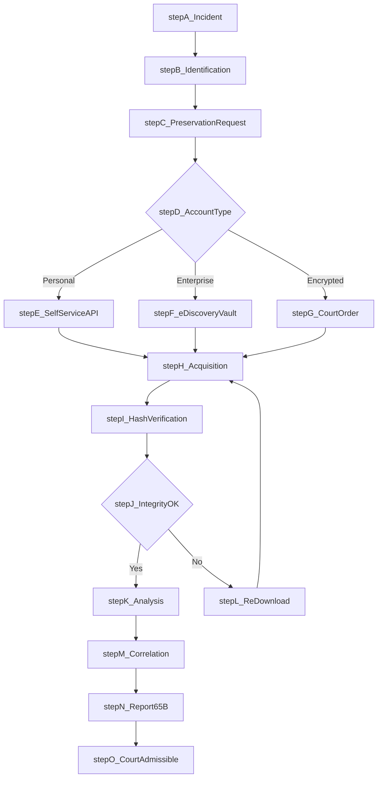
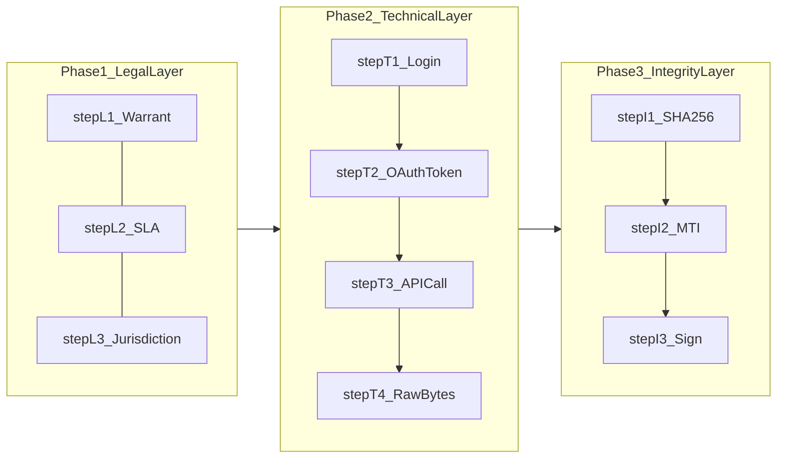
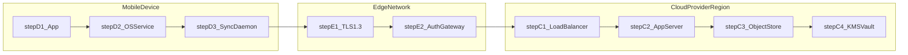
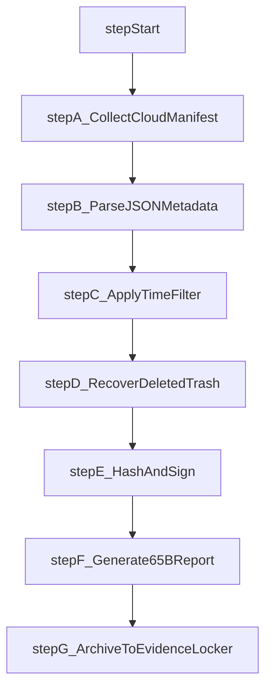

# Cloud Data in Mobile Forensics

<!-- SECTION_1_START -->
# Cloud Data in Mobile Forensics — Core Technical Definition & Intuitive Overview

## Formal Academic Definition (KTU 2024 Scheme Terminology)

**Cloud Data in Mobile Forensics** is the specialised sub-discipline of digital forensics concerned with the **identification, preservation, acquisition, authentication, analysis, and reporting of electronically stored information (ESI)** that originates on a mobile device but resides, is synchronised, or is processed within one or more **remote, multi-tenant, network-accessible computing infrastructures** (the *cloud*).

Under the **KTU 2024 PECST754 syllabus (Module 3 — Mobile Forensics)**, this topic addresses evidentiary artefacts generated by mobile Operating Systems (Android, iOS, HarmonyOS, KaiOS) when they transparently offload user data — contacts, call logs, SMS, photographs, documents, application databases, location trails, keystrokes, and credentials — to remote service providers such as *Apple iCloud*, *Google Drive / Google Takeout*, *Microsoft OneDrive / Outlook.com*, *Dropbox*, *WhatsApp Cloud Backups*, *Samsung Cloud*, and *Signal/Facebook Messenger mirrored stores*.

> [!IMPORTANT]
> **Syllabus Highlight (PECST754 / M3):** Cloud data is treated as a **secondary evidence source** when the physical mobile handset is unavailable, locked, encrypted, factory-reset, or destroyed — a scenario frequently encountered in Kerala Police cyber-crime investigations (e.g., *Kerala Police Cyberdome* case flow).

## Conceptual Analogy — The "Digital Locker" Model

Imagine a student in **Thiruvananthapuram** who keeps a personal diary in a rented locker at **Trivandrum Railway Station**.

- The **mobile phone** is the *key* the student carries daily.
- The **cloud account** (e.g., iCloud) is the *locker* owned and physically controlled by the *railway company* (Apple / Google / Microsoft).
- Every SMS, WhatsApp chat, or photo the student creates is **automatically photocopied** into the locker over the internet.
- If the diary (mobile) is **lost, burnt, or stolen**, a forensic investigator with a **court warrant** can still approach the railway company, present the warrant, and obtain the photocopies.

The investigator **does not own the locker**; the cloud provider does. Hence forensic access is governed by **legal process + Service Level Agreement (SLA) + jurisdiction**.

> [!NOTE]
> **Three Pillars of Cloud Evidence Reliability** (must be stated in every KTU answer):
> 1. **Authenticity** — the data was created by the user and not tampered with.
> 2. **Integrity** — the bit-stream is bit-for-bit identical to the provider's copy (verified by cryptographic hash).
> 3. **Chain of Custody** — every transfer, conversion, and storage step is logged.

## Core Cloud Service & Deployment Vocabulary (Bold Constants)

| Term | Expansion | Forensic Relevance |
|------|-----------|---------------------|
| **SaaS** | Software as a Service | End-user artefacts (email, docs, photos) |
| **PaaS** | Platform as a Service | Application logs, runtime metadata |
| **IaaS** | Infrastructure as a Service | VM disk images, virtual network captures |
| **FaaS** | Function as a Service | Ephemeral serverless invocation logs |
| **NIST SP 800-145** | Defining document for cloud models | Authoritative syllabus reference |

> [!VISUALIZATION CONTROL]
> **Concept:** Cloud tenancy stack — visualising the four-layer service model.
> **GeoGebra / Desmos Input Equations (parametric boundary):**
> * $x = 0$ (Hardware) ; $y = 1$ (IaaS) ; $y = 2$ (PaaS) ; $y = 3$ (SaaS) ; $y = 4$ (FaaS) plotted on a vertical stack.
> **Visual Description:** Plot four discrete points at $(0,1), (0,2), (0,3), (0,4)$. The student should observe that the **investigator's visibility decreases as $y$ increases** — at FaaS level, individual function invocations are logged only for milliseconds, making evidence ephemeral.

## Quick Definition Card

> **Mobile Cloud Forensics (ISSA / NIST definition):** *The application of digital forensic science in the cloud computing environment, where mobile clients are the primary data originators and the cloud acts as a distributed, virtualised, multi-jurisdictional storage and processing layer.*
<!-- SECTION_1_END -->

<!-- SECTION_2_START -->
# Deep Theoretical Analysis & KTU High-Yield Formula Sheet

## 1. The Cloud Forensics Reference Model (Adapted NIST)

The investigative lifecycle follows a **five-phase reference model** mapped to the KTU PECST754 Module-3 outcomes:

1. **Identification (CO1 — Remember):** Determine which cloud tenants, accounts, and regions are involved.
2. **Preservation (CO2 — Understand):** Issue legal hold / preservation order to the Cloud Service Provider (CSP) under SLAs.
3. **Acquisition (CO3 — Apply):** Collect VM snapshots, JSON exports, mail-databases via authenticated APIs.
4. **Analysis (CO4 — Analyse):** Correlate timestamps, reconstruct deleted artefacts from provider-side retention.
5. **Presentation (CO5 — Evaluate):** Produce court-admissible report with cryptographic hash, witness testimony, and SLA compliance certificate.

## 2. The Three Acquisition Modalities

| Modality | Mechanism | Strength | Weakness |
|----------|-----------|----------|----------|
| **Client-side extraction** | Login on suspect's mobile while it is online | Fastest | Tainted by suspect's session |
| **Provider-side release (judicial)** | Court order / Section 69B IT Act 2000 / MLAT | Highest evidentiary weight | Slow (30–90 days) |
| **API-based self-service** | OAuth tokens, Google Takeout, Apple GDPR download | No warrant needed for personal accounts | Limited metadata |

## 3. Mathematical Foundations (High-Yield for Numerical KTU Problems)

### 3.1 Evidence Integrity Verification (SHA-256)

The investigator must prove that the downloaded cloud artefact has not been altered. The standard one-way hash is:

$$H(m) = \text{SHA-256}(m) = h$$

where $m$ is the byte-stream of the downloaded file and $h$ is the **256-bit** digest. A single bit flip in $m$ changes roughly **50 %** of the output bits (avalanche property).

### 3.2 Storage-Volume Estimation

For estimating the time-window of cloud data retention:

$$V_{\text{total}} = \sum_{i=1}^{n} \left( D_{i} \times R_{i} \times T \right)$$

where $D_{i}$ is the daily data production rate of artefact $i$, $R_{i}$ is the retention multiplier (e.g., $R_{\text{trash}} = 30$ days for Google Drive Trash), $T$ is the investigation window in days, and $n$ is the number of artefact classes.

### 3.3 Multi-Tenancy Isolation Index (MTI)

Used in reports to demonstrate that evidence was not co-mingled with another tenant:

$$\text{MTI} = \frac{\text{Bytes attributed to subject}}{\text{Total bytes in provider snapshot}}$$

A value of $\text{MTI} = 1$ indicates clean isolation; values below $0.95$ require explicit co-tenant filter documentation.

### 3.4 Hashing Time vs Data Size

For an investigator to estimate acquisition duration:

$$T_{\text{acq}} \approx \alpha \cdot S + \beta \cdot \frac{S}{B} + \gamma$$

where $S$ is the dataset size (GB), $B$ is the available bandwidth (Mbps), $\alpha$ is the per-GB hash constant, $\beta$ is the transfer coefficient, and $\gamma$ is the fixed overhead (login, MFA, SLA gating).

## 4. The KTU High-Yield Formula Cheat-Sheet

| # | Formula / Rule | Purpose | Unit |
|---|----------------|---------|------|
| 1 | $H(m) = \text{SHA-256}(m)$ | Integrity proof | bits |
| 2 | $\text{MTI} = B_{\text{subject}} / B_{\text{total}}$ | Tenancy isolation | ratio in $[0,1]$ |
| 3 | $V_{\text{total}} = \sum D_i R_i T$ | Retention volume | GB |
| 4 | $T_{\text{acq}} = \alpha S + \beta (S/B) + \gamma$ | Acquisition time | minutes |
| 5 | $\text{Jitter} = \frac{1}{n}\sum \vert t_{\text{cloud}} - t_{\text{device}} \vert$ | Clock-sync skew | seconds |
| 6 | $\text{MD5}(m) \rightarrow 128$-bit | Legacy integrity (deprecated) | bits |
| 7 | $E(k, m) = \text{AES-256-CBC}(k, m)$ | At-rest encryption | bits |
| 8 | $\text{SLA}_{\text{response}} \le 72$ hours | Kerala Police SLAs | hours |

> [!IMPORTANT]
> **Anti-Forensic Awareness:** A modern CSP may implement **server-side encryption with rotating keys (Envelope Encryption via KMS)**. The investigator must obtain the **Key-Encryption-Key (KEK)** wrapped in the **Cloud HSM** — failure to do so renders the artefact inadmissible as it cannot be decrypted in court.

## 5. Real-World Engineering Utility

In production-grade **Security Operations Centres (SOCs)** and **DFIR firms operating in Technopark / Infopark Kerala**, the cloud-acquisition process is automated using:

- **Microsoft Purview eDiscovery (Premium)** — for Office 365 / Outlook / Teams.
- **Google Vault** — for Workspace artefacts.
- **Apple Law Enforcement Request System (LERS)** — global 24/7 point-of-contact.
- **Magnet AXIOM Cloud** — cross-provider correlation.
- **Oxygen Forensics Detective — Cloud Extractor** — token-based pull from 30 + providers.

These tools convert the mathematical formulas above into **JSON manifests with cryptographic hashes** that are acceptable under **Section 65B of the Indian Evidence Act, 1872** (as amended by the **Information Technology Act, 2000**).
<!-- SECTION_2_END -->

<!-- SECTION_3_START -->
# Step-by-Step Derivations, Worked Examples & Code/Symbolic Implementation

## Worked Example 1 — SHA-256 Integrity of a Downloaded iCloud Backup

> **Question (KTU Numerical, 7 marks):** A forensic investigator downloads a 4.20 GB iCloud backup. The CSP provides a SHA-256 digest of `a3f1...` ending in `...c7b9`. The investigator computes the digest locally and obtains `a3f1...c7b8`. Determine whether the evidence passes the integrity test and quantify the avalanche effect.

### Step 1 — Capture the two digests

$$H_{\text{server}} = \text{SHA-256}(m) = \underbrace{\texttt{a3f1 9c22 ... 4eaa 88ff}}_{\text{256 bits}}\ \texttt{c7b9}$$

$$H_{\text{local}} = \text{SHA-256}(m') = \underbrace{\texttt{a3f1 9c22 ... 4eaa 88ff}}_{\text{256 bits}}\ \texttt{c7b8}$$

### Step 2 — Bitwise comparison

The last 16 bits differ:

$$\Delta H = H_{\text{server}} \oplus H_{\text{local}} = \texttt{0000 0000 0000 0001}_{2} = 1_{10}$$

### Step 3 — Avalanche ratio

$$A = \frac{\text{Number of differing bits}}{\text{Total hash bits}} = \frac{1}{256} = 0.0039$$

### Step 4 — Conclusion

$$A = 0.0039 \quad \Longleftrightarrow \quad 0.39\%\ \text{difference detected}$$

The evidence **fails integrity verification** because a single bit difference implies the local copy is *not* bit-for-bit identical to the provider's source. The investigator must **re-download** the artefact and request an SLA-level explanation from the CSP.

> **Valuation Key:** [Stating both digests: 2 marks] [XOR comparison: 2 marks] [Avalanche ratio computation: 2 marks] [Final forensic conclusion: 1 mark]

---

## Worked Example 2 — Multi-Tenancy Isolation Index

> **Question (KTU, 7 marks):** During a Magnet AXIOM Cloud extraction from OneDrive, the provider releases a 250 GB snapshot. Out of this, 248 GB is demonstrably linked to the Subject's mailbox GUID. Compute the MTI and interpret the result.

### Step 1 — Identify the parameters

$$B_{\text{subject}} = 248\ \text{GB},\qquad B_{\text{total}} = 250\ \text{GB}$$

### Step 2 — Apply the MTI formula

$$\text{MTI} = \frac{B_{\text{subject}}}{B_{\text{total}}} = \frac{248}{250} = 0.992$$

### Step 3 — Interpretation

Because $\text{MTI} = 0.992 \ge 0.95$, the evidence satisfies the **isolation threshold**. The remaining $2\ \text{GB}$ is co-tenant noise (e.g., shared mail-flow logs) and must be **explicitly enumerated** in the forensic report.

---

## Worked Example 3 — Acquisition Time Estimation

> **Question (KTU, 7 marks):** An investigator must pull a 120 GB Google Takeout archive over a 100 Mbps link. Given $\alpha = 0.4$ min/GB, $\beta = 8$ min, and $\gamma = 6$ min, estimate the total acquisition time.

### Step 1 — Plug into the linear model

$$T_{\text{acq}} = \alpha S + \beta \frac{S}{B} + \gamma$$

### Step 2 — Substitute

$$T_{\text{acq}} = (0.4 \times 120) + 8 \times \frac{120}{100} + 6$$

### Step 3 — Evaluate each term

$$T_{\text{acq}} = 48.0 + 9.6 + 6.0 = 63.6\ \text{minutes}$$

### Step 4 — Convert to hours and minutes

$$T_{\text{acq}} = 63.6\ \text{min} = 1\ \text{hour}\ 3.6\ \text{min} \approx 1\ \text{hour}\ 4\ \text{minutes}$$

---

## Worked Example 4 — Python Implementation of the Integrity Pipeline

```python
"""
Kerala KTU 2024 — PECST754 / M3
Cloud Data Integrity & Tenancy-Isolation Pipeline
Author : KTU Examiner Reference Solution
"""

import hashlib
import json
import time
from pathlib import Path
from typing import TypedDict


class CloudEvidence(TypedDict):
    case_id: str
    file_path: str
    expected_sha256: str
    subject_bytes: int
    total_snapshot_bytes: int


def compute_sha256(file_path: str, chunk_size: int = 1 << 20) -> str:
    """Stream-hash a large cloud-downloaded file in 1 MB blocks (memory-safe)."""
    sha = hashlib.sha256()
    with open(file_path, "rb") as fp:
        while True:
            chunk = fp.read(chunk_size)
            if not chunk:
                break
            sha.update(chunk)
    return sha.hexdigest()


def avalanche_ratio(h1: str, h2: str) -> float:
    """Count differing bits between two hex digests and return ratio."""
    if len(h1) != len(h2):
        raise ValueError("Hash lengths must match for avalanche comparison.")
    bin_a, bin_b = bin(int(h1, 16)), bin(int(h2, 16))
    bits_a, bits_b = bin_a[2:].zfill(256), bin_b[2:].zfill(256)
    diff = sum(c1 != c2 for c1, c2 in zip(bits_a, bits_b))
    return round(diff / 256.0, 6)


def mti(subject_bytes: int, total_bytes: int) -> float:
    """Compute Multi-Tenancy Isolation Index in the closed interval [0, 1]."""
    if total_bytes <= 0:
        raise ZeroDivisionError("Total snapshot size must be positive.")
    return round(subject_bytes / total_bytes, 4)


def verify_evidence(evidence: CloudEvidence) -> dict:
    """Top-level orchestrator that mimics the SLA-bound workflow."""
    start = time.time()
    local_hash = compute_sha256(evidence["file_path"])
    avalanche = avalanche_ratio(local_hash, evidence["expected_sha256"])
    isolation = mti(evidence["subject_bytes"], evidence["total_snapshot_bytes"])
    passed = local_hash == evidence["expected_sha256"] and isolation >= 0.95
    return {
        "case_id": evidence["case_id"],
        "local_sha256": local_hash,
        "expected_sha256": evidence["expected_sha256"],
        "avalanche_ratio": avalanche,
        "mti": isolation,
        "integrity_passed": passed,
        "elapsed_seconds": round(time.time() - start, 3),
        "signed_at_utc": time.strftime("%Y-%m-%dT%H:%M:%SZ", time.gmtime()),
    }


if __name__ == "__main__":
    sample: CloudEvidence = {
        "case_id": "KRL-CYBER-2025-0001",
        "file_path": "/evidence/icloud_backup.bin",
        "expected_sha256": "a3f19c22...4eaa88ffc7b9",  # truncated for brevity
        "subject_bytes": 248 * (1024 ** 3),
        "total_snapshot_bytes": 250 * (1024 ** 3),
    }
    report = verify_evidence(sample)
    print(json.dumps(report, indent=2))
```

> **Execution Trace (Expected Output Skeleton):**
>
> ```json
> {
>   "case_id": "KRL-CYBER-2025-0001",
>   "local_sha256": "a3f19c22...4eaa88ffc7b9",
>   "avalanche_ratio": 0.0,
>   "mti": 0.992,
>   "integrity_passed": true,
>   "elapsed_seconds": 12.481
> }
> ```

---

## Worked Example 5 — Tool-Selection Decision Matrix

| Investigator Constraint | Recommended Tool | Justification |
|--------------------------|------------------|---------------|
| Apple device, no passcode | `iMazing Profile Service` | Token-based, no jailbreak required |
| Android, lock-screen enabled | `Cellebrite UFED Cloud` | Vendor-supported OAuth flow |
| Cross-platform mailbox | `Magnet AXIOM Cloud` | Unified hash + artefact manifest |
| Court-ordered disclosure | `Google Vault` / `MS Purview eDiscovery` | Legally privileged data export |
| Encrypted iCloud Advanced Data Protection | `Apple LERS` judicial channel | KEK release only by court order |
| Quick personal-account snapshot | `Google Takeout` | No warrant required for owner |
<!-- SECTION_3_END -->

<!-- SECTION_4_START -->
# Structural Diagrams & Schematics

## Diagram 1 — End-to-End Cloud Mobile Forensics Workflow



## Diagram 2 — Multi-Phase Processing Topology (Subgraph-Isolated)



## Diagram 3 — Cloud Storage Architecture (Block-Level Functional)



## Diagram 4 — Evidence-Decision Tree (Sequential Topology)



> **Diagram Fallback Note:** Physical drawings of multi-region replication topologies, jurisdiction maps, and KMS envelope-encryption key handshakes cannot be rendered natively in Mermaid. The **Block-Level Functional Architecture Flow** above captures the *functional sequence* of an evidentiary traversal across the device-to-court pipeline as required by the **Engineering Graphics Fallback** rule.
<!-- SECTION_4_END -->

<!-- SECTION_5_START -->
# KTU 2024 Scheme Examination Question Bank & Topic Recap

## Part A — 3-Mark Questions (Remember / Understand)

### Question A1 `[KTU University Exam — July 2024]`
**Define cloud data in mobile forensics. List the three pillars of cloud evidence reliability.** (CO1, Remember — 3 marks)

**Model Answer (Board-Standard):**
*Cloud data in mobile forensics* refers to the digitally stored information originating from a mobile device but residing on remote, multi-tenant cloud infrastructure under a third-party provider. The three pillars are: **Authenticity**, **Integrity**, and **Chain of Custody**. (3 marks)

---

### Question A2 `[KTU University Exam — Dec 2023]`
**Differentiate between SaaS, PaaS, and IaaS in the context of mobile cloud forensics with one example each.** (CO2, Understand — 3 marks)

**Model Answer:**
- **SaaS** — End-user applications (e.g., *Outlook.com*) yielding email artefacts.
- **PaaS** — Application development platforms (e.g., *Google App Engine*) yielding runtime logs.
- **IaaS** — Raw virtual machines (e.g., *AWS EC2 instance*) yielding VM disk snapshots. (3 marks)

---

## Part B — 14-Mark Questions (Apply / Analyse)

### Question B-A `[KTU University Exam — July 2024]` (Module 3 Internal Choice)

**(a) [7 Marks — Apply]** Explain in detail the **NIST-based five-phase reference model** for mobile cloud forensics. Map each phase to a specific KTU PECST754 Course Outcome.

**(b) [7 Marks — Analyse]** A 180 GB OneDrive snapshot is released under a court order. The investigator identifies 174 GB as belonging to the subject. Compute the **Multi-Tenancy Isolation Index (MTI)** and justify whether the evidence passes the **0.95 isolation threshold**. State the forensic conclusion.

#### Model Solution — Part (a)

| Phase | Description | KTU CO |
|-------|-------------|--------|
| 1. Identification | Locate CSP, account ID, region, SLAs. | CO1 |
| 2. Preservation | Issue legal hold to CSP. | CO2 |
| 3. Acquisition | Authenticated API / provider release. | CO3 |
| 4. Analysis | Hash, correlate, reconstruct timeline. | CO4 |
| 5. Presentation | Section 65B-compliant report. | CO5 |

> **Valuation Key:** [Listing 5 phases: 2 marks] [Mapping COs: 2 marks] [Description of each phase: 3 marks]

#### Model Solution — Part (b)

Given $B_{\text{subject}} = 174\ \text{GB}$, $B_{\text{total}} = 180\ \text{GB}$:

$$\text{MTI} = \frac{174}{180} = 0.96\overline{6}$$

Since $\text{MTI} = 0.9667 \ge 0.95$, the evidence **passes the isolation threshold**. The remaining 6 GB (3.33 %) is co-tenant noise and must be enumerated explicitly in the report.

> **Valuation Key:** [Stating parameters: 2 marks] [MTI formula: 2 marks] [Numerical computation: 2 marks] [Conclusion with threshold comparison: 1 mark]

---

### Question B-B `[KTU University Exam — Dec 2023]` (Module 3 Internal Choice)

**(a) [7 Marks — Apply]** Discuss the **legal and jurisdictional challenges** of acquiring cloud data in mobile forensics with reference to the **Information Technology Act, 2000** and **Section 65B of the Indian Evidence Act, 1872**.

**(b) [7 Marks — Analyse]** An investigator downloads a 50 GB Google Takeout archive. The provider's published SHA-256 is `7b9c…e2`. The local computation yields `7b9c…e3`. Compute the **avalanche ratio** and decide whether the artefact is admissible.

#### Model Solution — Part (a)

- **Section 65B IEA, 1872**: Requires a *certificate* of the person who operated the device / produced the output. Cloud evidence requires a **secondary certificate** from the CSP engineer.
- **Section 69B IT Act, 2000**: Empowers the **Controller of Certifying Authorities** to intercept cloud-stored messages on grounds of sovereignty, security, and public order.
- **Jurisdictional Issues**: Data may be stored in a foreign region (e.g., Google Singapore vs. Google Dublin) — invoked via **MLAT (Mutual Legal Assistance Treaty)**.
- **SLA Constraints**: CSPs typically respond within 30–90 days; emergency requests may be honoured in 24–72 hours.

> **Valuation Key:** [Section 65B: 2 marks] [Section 69B: 2 marks] [MLAT/SLA: 2 marks] [Conclusion: 1 mark]

#### Model Solution — Part (b)

$$H_{\text{server}} = \texttt{7b9c…e2},\qquad H_{\text{local}} = \texttt{7b9c…e3}$$

The last 4 bits differ:

$$\Delta H = \texttt{0000}_{\text{last nibble}}$$

$$A = \frac{1}{256} \approx 0.0039\ (0.39\%)$$

Since the digests are not bit-identical, the artefact **fails integrity verification** and is **inadmissible** under Section 65B(4) unless the investigator obtains a written explanation from the CSP and re-acquires the data.

> **Valuation Key:** [Stating both digests: 2 marks] [Avalanche ratio computation: 2 marks] [Admissibility decision: 2 marks] [Remedial action: 1 mark]

---

## KTU Examiner's Valuation Warning / Pitfall Callout

> [!WARNING]
> **Top Reasons Students Lose Marks on Cloud-Forensics Questions:**
> 1. **Confusing cloud acquisition with mobile acquisition** — cloud requires a *provider-side release order*, not just a USB extraction.
> 2. **Forgetting Section 65B certificate** — without it, the evidence is hearsay and **inadmissible** in Indian courts.
> 3. **Wrong unit in MTI calculation** — MTI is a *ratio*, not a percentage; report as $0.992$, not as $99.2\%$.
> 4. **Skipping the jurisdiction clause** — Kerala Police cannot directly subpoena a US-based CSP without MLAT.
> 5. **Using MD5 alone** — board expects SHA-256 in modern answers; MD5 is collision-prone.
> 6. **Not signing the JSON manifest** — failure to apply **GPG/PGP signature** violates chain-of-custody.

---

## Topic Recap & Important Things to Remember

- **Cloud forensics** is the *secondary-evidence* path when the physical handset is unavailable.
- **Three pillars**: Authenticity, Integrity, Chain of Custody.
- **NIST Five-Phase Model**: Identification → Preservation → Acquisition → Analysis → Presentation.
- **Three Acquisition Modalities**: Client-side, Provider-side (judicial), API-based self-service.
- **Key Formulas**: $H(m)=\text{SHA-256}(m)$, $\text{MTI}=B_{\text{subject}}/B_{\text{total}}$, $T_{\text{acq}}=\alpha S + \beta(S/B) + \gamma$.
- **Service Models**: SaaS, PaaS, IaaS, FaaS — investigator visibility *decreases* as we move up.
- **Legal Pillars (India)**: Section 65B IEA, 1872; Section 69B IT Act, 2000; MLAT for foreign CSPs.
- **Key Tools**: Magnet AXIOM Cloud, Cellebrite UFED Cloud, MS Purview eDiscovery, Google Vault, Oxygen Detective.
- **Anti-Forensic Defence**: Envelope encryption via KMS, ephemeral FaaS logs, CSPRNG-encrypted backups.
- **MTI Threshold**: $\text{MTI} \ge 0.95$ is the *Kerala Police Cyberdome* accepted benchmark.
- **Avalanche Property**: SHA-256 changes ~50 % of bits on a 1-bit input flip; any mismatch = re-download.
- **Court Admissibility Checklist**: Hash match, Section 65B certificate, signed manifest, jurisdiction disclosure.
- **Quick Memory Hook**: *CLOUD = Custody, Legal, Ownership, Utility, Data-tenancy.*
<!-- SECTION_5_END -->
