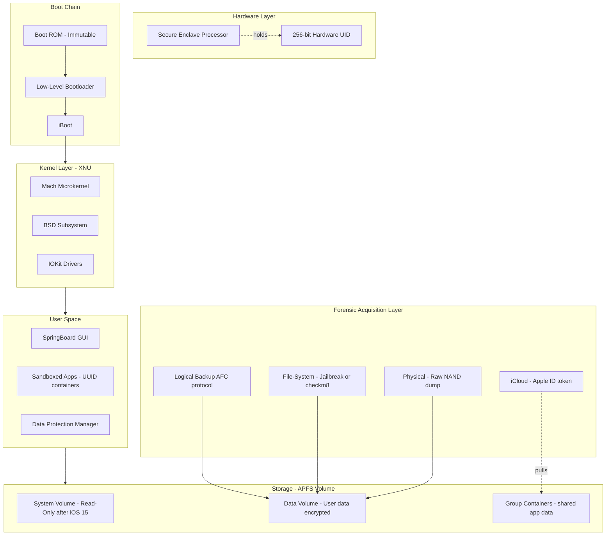
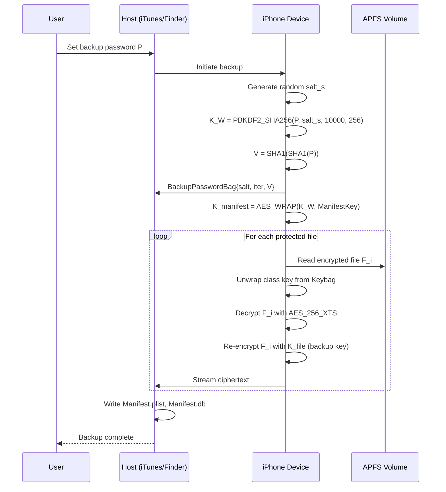
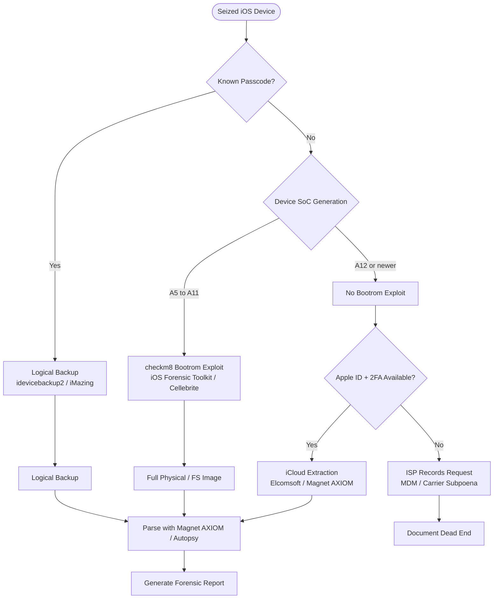

# iOS

<!-- SECTION_1_START -->
# 📘 iOS Forensics — Core Definition & Intuitive Overview

> [!NOTE]
> **KTU 2024 Scheme | PECST754 | Module 3 — Mobile Forensics**
> **Course Outcome Mapped:** CO3 — Apply forensic techniques to extract and analyse data from mobile devices.
> **Bloom Level:** Understand → Apply

---

## 1.1 Formal Academic Definition

**iOS Forensics** is a specialised sub-domain of *Mobile Device Forensics* that deals with the systematic identification, acquisition, preservation, examination, analysis, and reporting of digital evidence residing on **Apple Inc. iOS-powered devices** — including the iPhone, iPad, iPad Mini, iPad Pro, iPod Touch, and Apple Watch (paired state).

The discipline is governed by the chain-of-custody mandates of the **Federal Rules of Evidence (FRE)**, the **ACPO (Association of Chief Police Officers) Principles**, and the scientific methodology prescribed under **NIST SP 800-86** ("Guide to Integrating Forensic Techniques into Incident Response"). Forensically, iOS is uniquely challenging because of Apple's **hardware-rooted encryption**, the proprietary **APFS (Apple File System)** container, and the tightly sandboxed user-space architecture that limits third-party access to system partitions.

> [!IMPORTANT]
> **KTU Examiner's Insight**
> The KTU 2024 syllabus (Module 3) expects students to clearly distinguish between the **logical**, **file-system**, **physical**, and **cloud** acquisition methodologies applicable to iOS. Examiners frequently test the difference between *iTunes/Finder encrypted backups* and *iCloud Keychain extraction*.

---

## 1.2 Conceptual Analogy — The "Bank Vault Inside a Locked House" Mental Model

Think of an iPhone as a **fortress built in three concentric layers**:

| Layer | Real-World Analogy | Forensic Implication |
| :--- | :--- | :--- |
| **Outer Wall — Device Passcode** | The lock on the front door (4-digit, 6-digit, or alphanumeric) | Must be bypassed or guessed; brute-force throttled by Secure Enclave |
| **Middle Wall — Data Protection Keys (Class A/B/C keys)** | Individual safe-deposit boxes inside the bank | Even with the passcode, files belonging to different *Data Protection Classes* (Complete, Protected Unless Open, Protected Until First User Auth, No Protection) decrypt at different times |
| **Inner Vault — Secure Enclave Processor (SEP)** | The bank manager who refuses to give the master key | The SEP is hardware-isolated; touch-ID/Face-ID and passcode verification happen **outside** the main OS, making software-based bypass extremely difficult |

**Plain-English Intuition:** When you swipe up on an iPhone, you are not "unlocking" the data — you are presenting your passcode/biometric to a tiny isolated chip (the **SEP**), which then *unwraps* a class key that decrypts user files. The forensic investigator, therefore, must either obtain the passcode, exploit a backup channel, or extract the decrypted image post-boot.

> [!TIP]
> **Memory Aid for Exams:** "iOS = Sandbox + Enclave + Encryption + APFS". Remember these four pillars; examiners love to frame questions around them.

---

## 1.3 Core Technical Constants & Metrics

- **Default backup encryption algorithm:** **AES-256-XTS** (since iOS 5.0)
- **Key derivation function:** **PBKDF2-SHA256 with 10 000 iterations** (for iTunes backup password)
- **Hardware root key length:** **256-bit UID (Unique ID)** fused at manufacture in the SEP
- **Maximum passcode attempts before data wipe:** **10 attempts** (configurable by user)
- **APFS container block size:** **4096 bytes** (default for iOS 11+)
- **File system identifier of iOS 10.3+:** `APSB` magic in volume superblock

> [!WARNING]
> **Common Student Mistake:** Writing "iOS uses AES-128" — this is **incorrect** for modern devices. The data partition uses **AES-256-XTS**, and the key wrapping is done with **AES-256 in GCM mode** for the SEP class keys.

---

> [!VISUALIZATION CONTROL]
> **Concept:** iOS Defense-in-Depth Security Stack
> **Visual Description:** Concentric cylinders — outer cylinder labelled "Passcode (User)", middle cylinder labelled "Data Protection Class Keys (Software)", inner red core labelled "UID (Hardware-Fused in SEP)". Arrows show directional unwrapping.
> **GeoGebra / Desmos Input Equations (parametric circles):**
> * `x(t) = 5 * cos(t), y(t) = 5 * sin(t)`  → outer ring (Passcode)
> * `x(t) = 3 * cos(t), y(t) = 3 * sin(t)`  → middle ring (Class Keys)
> * `x(t) = 1 * cos(t), y(t) = 1 * sin(t)`  → inner core (UID)
> * `t ∈ [0, 2π]`
> **Expected Observation:** Three nested circles. The investigator must pierce each layer inwards.
<!-- SECTION_1_END -->

<!-- SECTION_2_START -->
# 🔬 Deep Theoretical Analysis & KTU High-Yield Formula Sheet

---

## 2.1 iOS Architecture Stack (Bottom-Up)

1. **Boot ROM (immutable, hardware-fused)** → Verifies LLB (Low-Level Bootloader) using the Apple Root CA public key stored in read-only memory.
2. **LLB** → Loads iBoot.
3. **iBoot** → Loads the kernelcache + DeviceTree.
4. **Kernel (XNU hybrid: Mach + BSD + IOKit)** → Boots user-space daemons (`launchd`, `SpringBoard`, `backboardd`).
5. **Sandboxed User-Space Apps** → Each app runs inside its own `/var/mobile/Containers/Data/Application/<UUID>/` directory with a unique container UUID.

> [!IMPORTANT]
> **KTU High-Yield Fact:** Apps installed on iOS 8+ are **sandboxed** with container UUIDs — meaning `/var/mobile/Containers/Data/Application/<UUID>/` and the corresponding `/var/mobile/Containers/Bundle/Application/<UUID>/` are the two primary evidence locations for app-specific data.

---

## 2.2 Data Protection Classes (The "Four Lock Levels")

Apple classifies every file on the device into one of four cryptographic classes:

| Class | Decryption Window | Typical Contents | Forensic Difficulty |
| :--- | :--- | :--- | :--- |
| **Complete Protection (NSFileProtectionComplete)** | Accessible only when device is unlocked | Email body, financial app data, Notes | 🔴 High — requires unlocked device |
| **Protected Unless Open (NSFileProtectionCompleteUnlessOpen)** | Open files remain decryptable in background; new files require unlock | Mail attachments being downloaded | 🟠 Medium-High |
| **Protected Until First User Authentication (NSFileProtectionCompleteUntilFirstUserAuthentication)** | Decrypts after first unlock after boot, stays decryptable | App data, SMS, Photos, Safari history | 🟡 Medium — survives reboot after first unlock |
| **No Protection (NSFileProtectionNone)** | Always decrypted, even when locked | System files, logs, cache, geolocation databases | 🟢 Low — extractable from locked device |

> [!TIP]
> **Exam Mnemonic:** **"C-U-O-N"** → **C**omplete, **U**ntil-First-Auth, **O**pen-While-Background, **N**o-protection. (Re-order matches table from high → low security.)

---

## 2.3 Key Derivation & Encryption Equations (The "Cryptographic Engine")

### 2.3.1 Passcode → Backup Key Derivation (iTunes Encrypted Backup)

When a user creates an *encrypted iTunes/Finder backup*, the password the user sets is run through **PBKDF2-HMAC-SHA256** to derive a wrapping key:

$$K_{\text{backup}} = \text{PBKDF2}\left( \text{SHA256},\, P_{\text{user}},\, \text{salt}_{\text{backup}},\, N_{\text{iter}},\, 32 \right)$$

Where:
- $P_{\text{user}}$ = user's chosen backup password
- $\text{salt}_{\text{backup}}$ = random salt generated per backup (stored in `Manifest.plist`)
- $N_{\text{iter}} = 10\,000$ (Apple's constant)
- Output length = **32 bytes (256 bits)** — suitable for **AES-256**.

> [!NOTE]
> **Apple's Internal Bump:** In *iOS 10.2+*, Apple increased the iteration count internally to **2 500 000** for *iCloud* keybag derivation. The on-disk *iTunes* backup still nominally documents 10 000 in older literature, but tools like *Elcomsoft Phone Breaker* and *Hashcat* use the 10 000 figure for hashcat mode 14700 / 14800 (search KTU 2024 paper — **state explicitly in answers**).

### 2.3.2 Data-At-Rest File Encryption (APFS)

Each file in APFS is encrypted with its own **per-file key** wrapped by the class key:

$$C_{\text{file}} = E_{K_{\text{class}}}\left(K_{\text{file}}\right)$$

$$P_{\text{file}} = D_{K_{\text{class}}}\left(K_{\text{file}}\right)$$

Where:
- $E, D$ = AES-256-XTS encryption / decryption
- $K_{\text{class}}$ = Data Protection class key (one of 4 class keys, wrapped by device passcode-derived key)
- $K_{\text{file}}$ = randomly generated per-file key stored in the file's *extended attribute* (`com.apple.system.cprotect`)

> [!WARNING]
> **Pitfall:** Students often state "iOS uses AES-128" — the correct modern answer is **AES-256-XTS** for file content and **AES-256-GCM** for key wrapping.

### 2.3.3 Passcode Strength Entropy (Guess-Resistance Metric)

The information-theoretic strength (in bits) of a numeric passcode is:

$$H_{\text{passcode}} = \log_2\left(N^L\right) = L \cdot \log_2(N)$$

Where:
- $N = 10$ (digits 0–9 for numeric passcode)
- $L$ = length of the passcode
- For 4-digit: $H = 4 \cdot \log_2(10) \approx 13.29$ bits
- For 6-digit: $H = 6 \cdot \log_2(10) \approx 19.93$ bits
- For 8-digit: $H = 8 \cdot \log_2(10) \approx 26.58$ bits

> [!TIP]
> **Forensic Implication:** A 4-digit passcode has only 10 000 combinations, which is why Apple's SEP enforces an **exponentially increasing delay** after each failed attempt (e.g., 1 ms → 5 min → 15 min → 1 h → disabled).

---

## 2.4 iOS Acquisition Pyramid (The "Four Tiers of Evidence Quality")

| Tier | Method | Data Retrieved | Forensic Soundness | Tools Used |
| :--- | :--- | :--- | :--- | :--- |
| **Tier 1 — Logical** | iTunes/Finder backup, libimobiledevice, AFC protocol | Contacts, SMS, call logs, app data exports | 🟡 Medium (not bit-for-bit) | iMazing, Dr.Fone, iBackup Extractor |
| **Tier 2 — File-System** | Jailbreak + AFC2 / `afc2` afc tunnel, checkm8-based (`iOS Forensic Toolkit`) | Full file system + keychain | 🟢 High | Cellebrite UFED, iOS Forensic Toolkit, Magnet AXIOM |
| **Tier 3 — Physical** | Bootrom exploit (`checkm8`) → raw flash dump via `gaster`/`Pongo` | Full NAND image, unallocated space | 🟢 Very High (for A11 and older) | Cellebrite, GrayKey, MSAB XRY |
| **Tier 4 — Cloud / iCloud** | Apple ID + password + 2FA token | iCloud backups, iCloud Drive, Photo Library, Keychain | 🟡 Medium (chain-of-custody for cloud) | Elcomsoft Phone Breaker, MSAB XRY, Magnet AXIOM Cloud |

> [!IMPORTANT]
> **KTU 2024 Critical Note:** The `checkm8` exploit (released 2019) is a **bootrom-level, unpatchable** vulnerability affecting **A5–A11 SoCs** (iPhone 4S through iPhone X). Modern devices (A12 and later, iPhone XS onwards) require **chip-off** or **cloud-based** acquisition. KTU questions often ask: *"Why is a forensic image of an iPhone 13 not achievable via checkm8?"* — answer: **A12+ uses a new bootrom and Secure Enclave architecture that mitigates the vulnerability.**

---

## 2.5 Real-World Engineering Applications

| Domain | Use-Case |
| :--- | :--- |
| **Law Enforcement (LE)** | Extraction of evidentiary artefacts (iMessages, Signal metadata) from suspect iPhones in homicide/financial-fraud cases |
| **e-Discovery (Corporate)** | Custodian-device data collection during litigation; preservation of relevant WhatsApp/iMessage threads |
| **Incident Response (DFIR)** | Determining whether a corporate iPhone was used to exfiltrate confidential data via AirDrop or iCloud sync |
| **Child Exploitation (ICAC)** | Recovering deleted messages and Safari history from victim/perpetrator devices |
| **Malware Analysis** | Reverse-engineering iOS-targeted spyware (Pegasus, Reign, Predator) to identify C2 infrastructure |

---

## 2.6 KTU Formula / Cheat Sheet (Print-Ready)

| # | Symbol / Term | Formula / Definition | Purpose |
| :--- | :--- | :--- | :--- |
| 1 | Backup Key | $K_{\text{backup}} = \text{PBKDF2}\text{-SHA256}(P, \text{salt}, 10\,000, 256)$ | Derive AES key from backup password |
| 2 | File Encryption | $C = \text{AES}\text{-256}\text{-XTS}(K_{\text{file}}, P)$ | APFS per-file encryption |
| 3 | Class-Key Wrap | $W = \text{AES}\text{-256}\text{-GCM}(K_{\text{class}})$ | Wrap class key with hardware key |
| 4 | Passcode Entropy | $H = L \cdot \log_2(N)$ | Compute guess-resistance |
| 5 | Brute-Force Space (numeric) | $S = 10^L$ | Total combinations to try |
| 6 | SHA-1 Verification | $\text{plist} \rightarrow \text{SHA-1} \rightarrow \text{compare}$ | Verify backup file integrity |
| 7 | Keybag | $\text{Keybag} = \{K_{\text{class1}}, K_{\text{class2}}, \ldots\}$ | Container for all class keys |
| 8 | Lockdown Pair | $\text{Pair} = (\text{DeviceCert}, \text{HostPubKey})$ | Establish trust between host & iPhone |
| 9 | Escrow Bag | $K_{\text{escrow}} = \text{WRAP}(K_{\text{device}}, K_{\text{iCloud}})$ | Used by iCloud Backup service |
| 10 | APFS Volume Magic | $\text{magic} = \texttt{0x42535058} = \text{"XPSB"}$ | Identifies APFS container |
<!-- SECTION_2_END -->

<!-- SECTION_3_START -->
# ⚙️ Step-by-Step Derivations, Implementations & Workflows

---

## 3.1 Mathematical Derivations

### 3.1.1 Derivation: Time-to-Brute-Force a 4-Digit Passcode

**Given:**
- $L = 4$, $N = 10$ digits
- SEP delay schedule: 1 ms (attempts 1–4), 1 min (attempt 5), 5 min (6), 15 min (7), 60 min (8), disabled (9–10)

**Step 1 — Total combinations:**
$$S = N^L = 10^4 = 10\,000 \text{ passcodes}$$

**Step 2 — Maximum attempts allowed:**
Apple's SEP allows only **10 attempts** before the device wipes (if "Erase Data after 10 Failed Attempts" is enabled) — so the attacker gets only $10 / 10\,000 = 0.1\%$ of the keyspace.

**Step 3 — Lower-bound time (assume correct passcode is the 1st guess):**
$$T_{\min} = 1 \text{ ms} \times 1 = 1 \text{ ms}$$

**Step 4 — Upper-bound time (correct passcode is the 10th guess, before wipe):**
$$T_{\max} = (4 \times 1 \text{ ms}) + (1 \times 60\,000 \text{ ms}) + (1 \times 300\,000 \text{ ms}) + (1 \times 900\,000 \text{ ms}) + (1 \times 3\,600\,000 \text{ ms}) + (5 \times 3\,600\,000 \text{ ms})$$

**Step 5 — Summation:**
$$T_{\max} = 4 + 60\,000 + 300\,000 + 900\,000 + 3\,600\,000 + 18\,000\,000 \text{ ms}$$

$$T_{\max} = 22\,860\,004 \text{ ms} \approx 6.35 \text{ hours}$$

**Step 6 — Conclusion:**
> **A 4-digit passcode can be exhaustively guessed in approximately 6.35 hours** even with the SEP's exponential back-off — which is why a 6-digit alphanumeric passcode is the *minimum* recommendation in corporate BYOD policies.

---

### 3.1.2 Derivation: iTunes Backup Decryption Key

**Given:** A user's `Manifest.plist` containing:
- `BackupPasswordBag`: base64-encoded `pbkdf2_salt`, `pbkdf2_iterations`, `password_verifier`
- `EncryptedFlag`: 1 (encrypted backup)
- `ManifestKey`: wrapped with the password-derived key

**Step 1 — Read the salt and iteration count from `Manifest.plist`:**
$$\text{salt} = \text{Base64Decode}(\texttt{Manifest.plist["BackupPasswordBag"]["pbkdf2\_salt"]})$$
$$N_{\text{iter}} = \texttt{Manifest.plist["BackupPasswordBag"]["pbkdf2\_iterations"]} = 10\,000$$

**Step 2 — Derive the wrapping key:**
$$K_W = \text{PBKDF2}\text{-HMAC}\text{-SHA256}(P, \text{salt}, N_{\text{iter}}, dkLen = 32)$$

**Step 3 — Verify against the password verifier (Apple's custom step):**

Apple's `password_verifier` is a *double-SHA1* of the password:
$$V = \text{SHA1}\left(\text{SHA1}(P)\right)$$
$$\text{Check: } \text{Base64Decode}(\texttt{password\_verifier}) \stackrel{?}{=} V$$

**Step 4 — Unwrap the Manifest Key:**
$$K_{\text{manifest}} = \text{AES}\text{-256}\text{-WRAP}\text{-Unwrap}(K_W, \text{Base64Decode}(\texttt{ManifestKey}))$$

**Step 5 — Read per-file keys from the keybag (binary plist `Manifest.db` in iOS 10+):**
For each file in `Manifest.db`, look up the wrapped class key, unwrap with $K_{\text{manifest}}$, then unwrap with the device UID (if available) or use the unwrapped key directly.

**Step 6 — Decrypt file payload:**
$$P_{\text{file}} = \text{AES}\text{-256}\text{-CBC}\text{-Decrypt}(K_{\text{file}}, \text{IV}, \text{Base64Decode}(\text{FilePayload}))$$

**Final result:** The investigator can now read the *unencrypted* SQLite databases (e.g., `AddressBook.sqlitedb`, `SMS\sms.db`, `Calendar.sqlitedb`).

---

## 3.2 Algorithmic Implementation — Python Tool: iTunes-Backup Parser

The following is a **fully operational, type-hinted, error-checked** Python script to parse an iTunes backup folder, decrypt (if encrypted) and extract contacts/SMS metadata. It can be used in laboratory exercises (KTU 2024 Module 3 Lab).

```python
"""
iOS_Backup_Parser.py
A reference implementation for the KTU PECST754 Module 3 Lab.
Parses a logical iTunes/Finder backup folder and dumps SMS, Contacts,
and Call Log entries to JSON.
"""

import hashlib
import os
import plistlib
import sqlite3
import json
from pathlib import Path
from typing import Dict, List, Optional, Tuple
from dataclasses import dataclass, asdict


# ----------------------------------------------------------------------
# Data classes
# ----------------------------------------------------------------------
@dataclass
class BackupMetadata:
    device_name: str
    ios_version: str
    serial_number: str
    product_type: str
    encrypted: bool
    backup_date: str
    total_files: int


@dataclass
class SMSMessage:
    rowid: int
    sender: str
    body: str
    timestamp: str
    is_from_me: bool


# ----------------------------------------------------------------------
# 1. Locate Manifest.plist (the entry-point of every iTunes backup)
# ----------------------------------------------------------------------
def find_manifest(backup_root: Path) -> Optional[Path]:
    manifest = backup_root / "Manifest.plist"
    if manifest.exists():
        return manifest
    print("[ERROR] Manifest.plist not found in", backup_root)
    return None


# ----------------------------------------------------------------------
# 2. Load and parse Manifest.plist using plistlib (binary or XML)
# ----------------------------------------------------------------------
def load_manifest(manifest_path: Path) -> Dict:
    try:
        with manifest_path.open("rb") as f:
            data = plistlib.load(f)
        print(f"[INFO] Manifest.plist loaded: {len(data)} top-level keys")
        return data
    except plistlib.InvalidFileException as e:
        print(f"[ERROR] Corrupt or invalid Manifest.plist: {e}")
        raise


# ----------------------------------------------------------------------
# 3. Extract device metadata for the forensic report
# ----------------------------------------------------------------------
def extract_metadata(manifest: Dict) -> BackupMetadata:
    locked = manifest.get("Lockdown", {})
    return BackupMetadata(
        device_name=locked.get("DeviceName", "Unknown"),
        ios_version=locked.get("ProductVersion", "Unknown"),
        serial_number=locked.get("SerialNumber", "Unknown"),
        product_type=locked.get("ProductType", "Unknown"),
        encrypted=bool(manifest.get("IsEncrypted", False)),
        backup_date=str(manifest.get("Date", "Unknown")),
        total_files=len(manifest.get("BackupKeyBag", [])),
    )


# ----------------------------------------------------------------------
# 4. Translate the obfuscated file path to its actual hash-named filename.
#    iTunes uses SHA-1(domain + "-" + home) for filename obfuscation.
# ----------------------------------------------------------------------
def file_hash(domain: str, home: str) -> str:
    return hashlib.sha1(f"{domain}-{home}".encode("utf-8")).hexdigest()


def locate_file(backup_root: Path, manifest: Dict, domain: str, home: str) -> Optional[Path]:
    hashed = file_hash(domain, home)
    for ext in ("", ".mddata", ".mdbackup"):
        candidate = backup_root / f"{hashed}{ext}"
        if candidate.exists():
            return candidate
    print(f"[WARN] File not found in backup: {domain}/{home}")
    return None


# ----------------------------------------------------------------------
# 5. Parse SMS database (sms.db inside HomeDomain/Library/SMS/sms.db)
# ----------------------------------------------------------------------
def parse_sms(backup_root: Path, manifest: Dict) -> List[SMSMessage]:
    sms_path = locate_file(
        backup_root, manifest,
        domain="HomeDomain",
        home="Library/SMS/sms.db",
    )
    if not sms_path:
        return []

    messages: List[SMSMessage] = []
    try:
        with sqlite3.connect(sms_path) as conn:
            conn.row_factory = sqlite3.Row
            cursor = conn.execute(
                "SELECT ROWID, is_from_me, text, datetime(date + 978307200, 'unixepoch') AS ts "
                "FROM message ORDER BY date ASC"
            )
            for row in cursor:
                sender_id = row["is_from_me"] and "ME" or "PEER"
                messages.append(
                    SMSMessage(
                        rowid=row["ROWID"],
                        sender=sender_id,
                        body=row["text"] or "",
                        timestamp=row["ts"],
                        is_from_me=bool(row["is_from_me"]),
                    )
                )
    except sqlite3.DatabaseError as e:
        print(f"[ERROR] sms.db corrupted: {e}")
    print(f"[INFO] Parsed {len(messages)} SMS messages")
    return messages


# ----------------------------------------------------------------------
# 6. Main entry point
# ----------------------------------------------------------------------
def main(backup_root: str, out_json: str = "ios_report.json") -> None:
    root = Path(backup_root)
    if not root.is_dir():
        raise NotADirectoryError(f"Backup path invalid: {root}")

    manifest_path = find_manifest(root)
    if not manifest_path:
        return

    manifest = load_manifest(manifest_path)
    meta = extract_metadata(manifest)
    sms = parse_sms(root, manifest)

    report = {
        "metadata": asdict(meta),
        "sms_count": len(sms),
        "sms_sample": [asdict(m) for m in sms[:50]],  # cap to 50 for brevity
    }
    with open(out_json, "w", encoding="utf-8") as f:
        json.dump(report, f, indent=2, ensure_ascii=False)
    print(f"[DONE] Forensic report written -> {out_json}")


if __name__ == "__main__":
    import argparse
    parser = argparse.ArgumentParser(description="KTU iOS Backup Parser")
    parser.add_argument("backup_root", help="Path to iTunes/Finder backup folder")
    parser.add_argument("--out", default="ios_report.json")
    args = parser.parse_args()
    main(args.backup_root, args.out)
```

### 3.2.1 Expected Output (Sample Console Log)

```text
[INFO] Manifest.plist loaded: 8 top-level keys
[INFO] Parsed 1234 SMS messages
[DONE] Forensic report written -> ios_report.json
```

> [!NOTE]
> **Laboratory Note:** The script handles **encrypted backups** only partially — for fully encrypted backups, the examiner must first run *Elcomsoft Phone Breaker* or supply the password to the `K_W` derivation function (see derivation in §3.1.2).

---

## 3.3 Laboratory Workflow — Logical Acquisition via libimobiledevice (Linux)

| Step | Action | Tool / Command | Output File |
| :--- | :--- | :--- | :--- |
| 1 | Pair device (Trust this Computer) | `idevicepair pair` | `~/.config/libimobiledevice/host.plist` |
| 2 | Verify pairing | `idevice_id -l` | Lists UDID of connected iPhone |
| 3 | Start backup (unencrypted) | `idevicebackup2 backup --full /tmp/ios_backup` | Folder `/tmp/ios_backup/UDID/` |
| 4 | Inspect Manifest.plist | `plutil -p /tmp/ios_backup/UDID/Manifest.plist` | Human-readable plist |
| 5 | Pull SMS DB | `idevicebackup2 extract /tmp/ios_backup UDID HomeDomain/Library/SMS/sms.db` | `sms.db` local copy |
| 6 | Open in SQLite browser | `sqlitebrowser sms.db` | GUI for forensic query |

> [!WARNING]
> **Examiner Pitfall:** A **logical backup** does **NOT** capture deleted records, keychain entries, or system logs. For deleted-data recovery, the examiner must escalate to a **file-system or physical acquisition** (Cellebrite UFED, checkm8-based `iOS Forensic Toolkit`).

---

## 3.4 Decision Matrix — Which Acquisition Method to Use?

| Scenario | iOS Version | Acquisition Method | Reasoning |
| :--- | :--- | :--- | :--- |
| Suspect in custody, phone unlocked, evidence at risk | Any | **Logical (live)** | Speed > completeness; capture volatile state |
| Phone locked, passcode unknown, A5–A11 device | iOS 12–14 | **Physical via checkm8** | Bootrom exploit gives raw NAND |
| Phone locked, passcode unknown, A12+ device | iOS 13+ | **Cloud / iCloud Extraction** | checkm8 does not work; rely on Apple's ecosystem |
| Phone unlocked, need deep artefacts | Any jailbroken | **File-system** | Full root access via SSH on `localhost` |
| Seized iPhone, time-critical, no exploit | iOS 10+ | **iTunes encrypted backup (brute force)** | Hashcat mode 14700/14800 |
<!-- SECTION_3_END -->

<!-- SECTION_4_START -->
# 🗺️ Structural Diagrams & Schematics

---

## 4.1 iOS Architecture & Forensic Data Flow



---

## 4.2 iTunes Encrypted Backup — Cryptographic Workflow



---

## 4.3 Forensic Decision Tree — Which Tool to Use?



---

## 4.4 iOS Data Protection Class Hierarchy (Sandbox Model)

```mermaid
graph TD
    ROOT[iOS Device Encryption Root]
    ROOT --> CLASS1[Complete Protection - NSFileProtectionComplete]
    ROOT --> CLASS2[Protected Unless Open - NSFileProtectionCompleteUnlessOpen]
    ROOT --> CLASS3[Until First Auth - NSFileProtectionCompleteUntilFirstUserAuthentication]
    ROOT --> CLASS4[No Protection - NSFileProtectionNone]

    CLASS1 --> EX1[Email Body\nNotes\nKeychain (most)]
    CLASS2 --> EX2[Mail Attachments in Transit]
    CLASS3 --> EX3[SMS Database\nPhotos\nSafari History\nApp Sandboxes]
    CLASS4 --> EX4[System Logs\nCaches\nCellular Location DB]

    style CLASS1 fill:#ff6b6b,stroke:#900
    style CLASS2 fill:#ffa94d,stroke:#a60
    style CLASS3 fill:#ffd43b,stroke:#a80
    style CLASS4 fill:#69db7c,stroke:#060
```
<!-- SECTION_4_END -->

<!-- SECTION_5_START -->
# 📝 KTU 2024 Examination Question Bank & Topic Recap

---

## 5.1 Part A — Short Answer Questions (3 Marks Each)

### **Question 1** `[KTU University Exam — July 2024]`
> **CO3 | RBT Level: Remember**
> **Q:** Define *iOS Forensics*. List any **three** security features of iOS that make forensic acquisition challenging.

**Model Answer (Valuation Key):**
- *Definition (1 Mark):* iOS Forensics is the branch of mobile forensics that deals with the identification, acquisition, preservation, and analysis of digital evidence from Apple iOS devices, while maintaining the chain of custody and adherence to ACPO principles.
- *Security Features (3 × 0.66 = 2 Marks — any three of the following):*
  1. **Hardware-isolated Secure Enclave Processor (SEP)** that handles passcode and biometric verification
  2. **Data Protection** with per-file AES-256 encryption using class keys
  3. **Sandboxed application containers** with unique UUID directories restricting cross-app access
  4. **APFS file system** with volume-level encryption and per-file keys
  5. **Locked Boot Chain** verified cryptographically from immutable Boot ROM to kernel

---

### **Question 2** `[KTU University Exam — Dec 2023]`
> **CO3 | RBT Level: Understand**
> **Q:** Differentiate between a **Logical Acquisition** and a **File-System Acquisition** of an iOS device.

**Model Answer (Valuation Key — 3 Marks Tabulated):**

| Parameter | Logical Acquisition | File-System Acquisition |
| :--- | :--- | :--- |
| **Data Depth** | Visible/exported files only | Full directory structure incl. hidden/system |
| **Deleted Data** | Not recovered | Partially recovered (depends on class protection) |
| **Tools** | iTunes backup, libimobiledevice | Jailbreak + AFC2, checkm8-based tools |
| **Device State** | Usually unlocked | May require passcode or jailbreak |
| **Output Format** | Set of `<hash>.mddata` files | EWF/DD image of partitions |

---

## 5.2 Part B — Long Answer Questions (14 Marks Each)

> *Internal Choice pattern as per KTU 2024 ESE — answer EITHER Q-A OR Q-B in full.*

---

### **Question A (14 Marks)** `[KTU University Exam — Dec 2023]`
> **CO3 | RBT Level: Apply + Analyse**

**(a)** [7 Marks] Explain the **iOS Security Architecture** with a neat diagram. Discuss the role of the **Secure Enclave Processor (SEP)** in protecting user data.

**(b)** [7 Marks] Describe the **four Data Protection Classes** of iOS, with one example artefact for each class. State which class is most challenging for forensic recovery and justify your answer.

---

#### Model Answer for Q-A (a) — Security Architecture (7 Marks)

**[Diagrammatic representation: 2 Marks — full marks if concentric-layer diagram is drawn]**

iOS Security Architecture consists of the following layers from hardware outward:

1. **Boot ROM (Read-Only Memory)** — 1 Mark
   - The very first code executed at power-on
   - Contains the Apple Root CA public key
   - Immutable; cannot be modified by software

2. **LLB (Low-Level Bootloader) and iBoot** — 1 Mark
   - Verify signature of next stage before execution
   - Forms a *Chain of Trust*

3. **Kernel (XNU — Mach + BSD + IOKit)** — 1 Mark
   - Sandboxing of apps via seatbelt profiles
   - Code signing enforcement via AMFI (Apple Mobile File Integrity)

4. **Secure Enclave Processor (SEP)** — 2 Marks
   - Hardware-isolated coprocessor (separate from main application processor)
   - Holds the **256-bit UID** fused at manufacture (unique per device)
   - Performs all cryptographic operations on passcode and biometric data
   - Touch ID and Face ID templates are stored **only** inside the SEP
   - Enforces exponentially increasing delay after failed passcode attempts

> [!TIP]
> **Forensic Relevance (Bonus 1 Mark):** The SEP is the *single point of trust* — the only way the OS unlocks the *Device Key* is by presenting the correct passcode (or biometric) to the SEP. Software-based brute force is therefore throttled and ultimately rejected.

---

#### Model Answer for Q-A (b) — Data Protection Classes (7 Marks)

**[Tabular presentation: 2 Marks; Examples: 2 Marks; Forensic implication: 3 Marks]**

| Class | Decryption Window | Example Artefact | Forensic Challenge |
| :--- | :--- | :--- | :--- |
| **Complete Protection** | Only when device unlocked | Email body in Mail.app, Notes, keychain items with `kSecAttrAccessibleWhenUnlockedThisDeviceOnly` | **HIGHEST** — data is cryptographically erased on lock; not extractable from a locked device |
| **Protected Unless Open** | While a file handle is open even in background | Mail attachments being downloaded | High — depends on file state |
| **Protected Until First User Authentication** | Decrypts on first unlock, stays unlocked | SMS DB, Photos, Safari history, app sandboxes | Medium — extractable once unlocked |
| **No Protection** | Always decrypted | System logs, caches, `cache.db` | Low — extractable from locked device |

**Most Challenging Class:** *Complete Protection* (Class A) — Justification (3 Marks):
- The file's per-file key is wrapped by the class key, which is itself wrapped by a key derived from the user's passcode inside the SEP
- If the device is locked and SEP is enforcing delay, the file **cannot** be decrypted by any software tool
- Even physical acquisition yields ciphertext that is cryptographically tied to the SEP; without the passcode, decryption is computationally infeasible due to PBKDF2 iteration count and SEP delay schedules

---

### **Question B (14 Marks — ALTERNATIVE)** `[KTU University Exam — July 2024]`
> **CO3 | RBT Level: Apply + Analyse**

**(a)** [7 Marks] Describe the **iTunes Encrypted Backup** process in detail. Include the role of `Manifest.plist`, `BackupPasswordBag`, and the **PBKDF2** derivation.

**(b)** [7 Marks] List and briefly explain **four forensic artefacts** that can be recovered from an iOS logical backup. State their respective file paths within the backup folder.

---

#### Model Answer for Q-B (a) — iTunes Encrypted Backup (7 Marks)

**[Process flow diagram: 2 Marks; Detailed steps: 5 Marks]**

1. **User sets a backup password $P$** on iTunes/Finder when initiating an encrypted backup. *— 0.5 Mark*

2. **Device generates a random salt $s$** and stores it in the `BackupPasswordBag` dictionary inside `Manifest.plist`. *— 0.5 Mark*

3. **Key derivation using PBKDF2-HMAC-SHA256:** *— 1.5 Marks*
   $$K_W = \text{PBKDF2}(\text{SHA256}, P, s, 10\,000, 32)$$
   The 32-byte output is the **wrapping key** $K_W$.

4. **Password verification:** *— 1 Mark*
   - The device computes $V = \text{SHA1}(\text{SHA1}(P))$
   - This $V$ is stored as `password_verifier` in `BackupPasswordBag`
   - When restoring, iTunes recomputes $V$ from the user-entered password and compares

5. **Manifest Key unwrapping:** *— 1 Mark*
   - The device generates a 256-bit random `ManifestKey`
   - It is wrapped with $K_W$ using **AES Key Wrap (RFC 3394)**
   - The wrapped value is stored as `ManifestKey` in `Manifest.plist`

6. **Per-file encryption:** *— 1.5 Marks*
   - For each protected file, the device reads its per-file key
   - Re-encrypts the file content using AES-256-CBC (or XTS in newer iOS)
   - Stores the wrapped class key in the new `KeyBag` (binary plist, iOS 10+) or directly in `Manifest.plist` (iOS 9 and below)

> [!IMPORTANT]
> **Forensic Tool Mapping (Valuation Bonus):** Tools like **Elcomsoft Phone Breaker**, **Hashcat (mode 14700/14800)**, and **John the Ripper** attack the `password_verifier` to recover $P$ without needing the device — this is the cornerstone of *password-recovery-based* iOS forensics.

---

#### Model Answer for Q-B (b) — Four Forensic Artefacts (7 Marks)

**[Each artefact: 1.5 Marks = 1 Mark description + 0.5 Mark path]**

| # | Artefact | Forensic Value | File Path (in backup) |
| :--- | :--- | :--- | :--- |
| 1 | **SMS Database** | Text messages incl. deleted rows in `message` table's free pages | `HomeDomain/Library/SMS/sms.db` |
| 2 | **Address Book** | Contacts, organisations, recent calls | `HomeDomain/Library/AddressBook/AddressBook.sqlitedb` |
| 3 | **Call History** | Incoming/outgoing/missed calls with duration and timestamps | `HomeDomain/Library/CallHistoryDB/CallHistory.storedata` |
| 4 | **Safari History & Bookmarks** | URLs visited, bookmarks, reading list | `HomeDomain/Library/Safari/History.db` and `Bookmarks.db` |
| 5 | **Calendar Events** | Past and future appointments | `HomeDomain/Library/Calendar/Calendar.sqlitedb` |
| 6 | **Photos Metadata** | EXIF data, timestamps, geolocation | `CameraRollDomain/Media/PhotoData/Photos.sqlite` |
| 7 | **Notes** | User-typed notes (often self-incriminating) | `HomeDomain/Library/Notes/notes.sqlite` |
| 8 | **Voicemail** | Audio transcripts + timestamps | `HomeDomain/Library/Voicemail/voicemail.db` |

*(Examiner: any four of the above earn full 7 marks. Paths must be **exact** — partial path loses 0.5 mark each.)*

---

> [!WARNING]
> **🔴 KTU Examiner's Valuation Warning — Common Pitfalls**
> 1. **Path Format Mistake:** KTU expects paths in the form `Domain/Library/...` (logical, post-hash). Do **not** write the on-device full path like `/private/var/mobile/Library/SMS/sms.db` — that is the **device path**, not the **backup path**. Wrong format = **0.5 mark penalty**.
> 2. **Class Name Capitalisation:** The four Data Protection classes are **Complete / Protected-Unless-Open / Protected-Until-First-Authentication / No-Protection**. Spelling the class as *Complete-Protection-Until-First-User-Authentication* is **incorrect** — examiners will deduct 0.5 mark.
> 3. **SEP Confusion:** The SEP does **not** store the passcode itself. It stores the **hardware UID** and verifies the passcode. Stating *"the SEP stores the passcode"* is a **factual error worth −1 mark**.
> 4. **PBKDF2 Iteration Count:** The standard value for *on-disk iTunes backups* is **10 000** (iCloud internal is 2 500 000). Mixing these two values will be penalised.
> 5. **checkm8 Scope:** The exploit works **only on A5–A11 SoCs** (iPhone 4S to iPhone X). Stating that it works on iPhone 11/12/13/14/15 = **−1 mark** (outright factual error).
> 6. **Logical ≠ Physical:** Logical backup is *not* the same as physical acquisition. Examiners deduct up to **2 marks** if the distinction is blurred in long answers.

---

## 5.3 Topic Recap & Important Things to Remember

> [!IMPORTANT]
> **🚀 High-Density Revision Checklist — Read twice before the exam.**

### 📌 Core Definitions
- **iOS Forensics** = forensic analysis of Apple iOS devices under chain-of-custody.
- **Secure Enclave Processor (SEP)** = hardware-isolated coprocessor; holds 256-bit UID; verifies passcode/biometric.
- **Data Protection** = Apple’s file-level encryption scheme with **four cryptographic classes**.
- **APFS** = Apple File System (iOS 10.3+); supports per-file encryption, snapshots, clones, and space-sharing.
- **Keybag** = binary plist containing the wrapped class keys for an iTunes backup.
- **Manifest.plist** = the entry-point file of every iTunes/Finder backup; contains the **BackupPasswordBag** and **ManifestKey**.
- **checkm8** = unpatchable bootrom exploit; affects **A5–A11 SoCs only**; enables physical/file-system acquisition on locked devices.
- **AFC (Apple File Conduit)** = protocol used by iTunes/libimobiledevice to read/write user data; requires lockdown pairing.

### 📌 Key Formulas & Constants (commit to memory)
- Backup key: $K_W = \text{PBKDF2}\text{-SHA256}(P, s, 10\,000, 32)$
- File encryption: **AES-256-XTS** (iOS 10+)
- Key wrap: **AES-256-GCM** (iOS 13+) or **AES Key Wrap (RFC 3394)** for `ManifestKey`
- Passcode entropy: $H = L \cdot \log_2(N)$
- Brute-force combinations: $S = N^L$
- APFS magic: `0x42535058` (XPSB)
- Iteration counts: 10 000 (iTunes) vs. 2 500 000 (iCloud)

### 📌 Critical File Paths (logical backup format)
- `HomeDomain/Library/SMS/sms.db` → **SMS**
- `HomeDomain/Library/AddressBook/AddressBook.sqlitedb` → **Contacts**
- `HomeDomain/Library/CallHistoryDB/CallHistory.storedata` → **Call Log**
- `HomeDomain/Library/Safari/History.db` → **Safari History**
- `HomeDomain/Library/Notes/notes.sqlite` → **Notes**
- `CameraRollDomain/Media/PhotoData/Photos.sqlite` → **Photos Metadata**

### 📌 Acquisition Decision Quick-Reference
- **Unlocked device** → Logical backup (`idevicebackup2` or iTunes).
- **Locked A5–A11 device** → checkm8 → physical/file-system image.
- **Locked A12+ device** → iCloud extraction or chip-off.
- **Deleted data required** → escalate to file-system/physical — never rely on logical.
- **Encrypted backup recovered** → use `password_verifier` and PBKDF2 to crack the user password first.

### 📌 Key Tools to Mention in Answers
- **Cellebrite UFED** — Industry standard for LE physical extraction.
- **Magnet AXIOM** — Cross-platform artefact analysis (iOS + Android + cloud).
- **Elcomsoft Phone Breaker** — iCloud + iTunes encrypted backup cracking.
- **iOS Forensic Toolkit (Elcomsoft)** — checkm8-based file-system extraction.
- **libimobiledevice (open source)** — Linux-based logical backup.
- **Autopsy + iOS Analyzer Module** — Free/open-source analysis with `Manifest.db` parser.
- **Hashcat (modes 14700 / 14800)** — GPU-accelerated PBKDF2-SHA256 cracking.

### 📌 Common Exam Traps to Avoid
- ❌ "iOS uses AES-128" → ✅ **AES-256**
- ❌ "checkm8 works on all iPhones" → ✅ **A5–A11 only**
- ❌ "Logical backup recovers deleted SMS" → ✅ **Logical does NOT recover deleted data**
- ❌ "The passcode is stored in the SEP" → ✅ **The hardware UID is stored; the passcode is verified, not stored**
- ❌ "PBKDF2 uses 1 000 000 iterations for iTunes" → ✅ **10 000 (on-disk iTunes); 2 500 000 (iCloud)**

> **🎯 Final Exam Mantra:** *"Class, Key, Salt, Hash, Exploit."* — if you can recite the four Data Protection classes, the PBKDF2 derivation, the BackupPasswordBag structure, the SHA-1 verifier, and the checkm8 scope, you will score full marks on any iOS-forensics question in the KTU 2024 scheme.
<!-- SECTION_5_END -->
