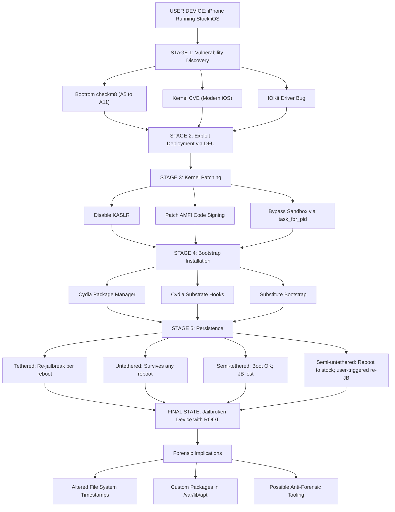
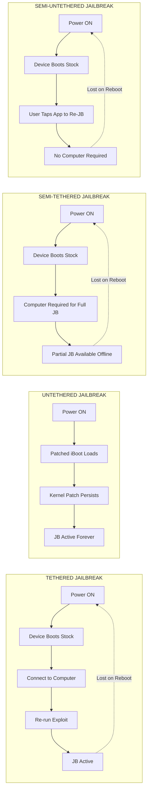
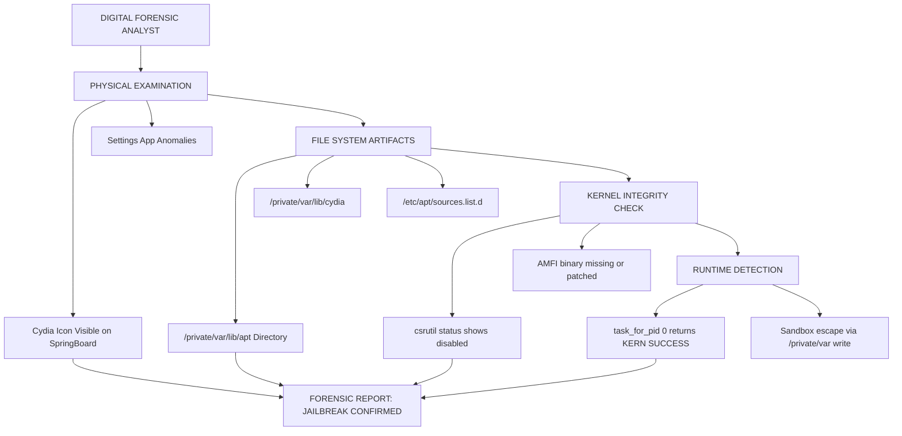

# Jailbreaking

<!-- SECTION_1_START -->

# 1. Core Technical Definition & Intuitive Overview

## 1.1 Formal Academic Definition (KTU 2024 Syllabus Terminology)

**Jailbreaking** is the process of exploiting vulnerabilities in a mobile device's operating system—specifically Apple's iOS—to remove manufacturer-imposed software restrictions imposed by the OEM (Original Equipment Manufacturer) and the carrier. The procedure grants the end user **root/administrative (superuser)** privileges on the device, thereby permitting the installation and execution of applications, system modifications, and custom kernel extensions that are **not authorized by the App Store** distribution policy.

> [!IMPORTANT]
> **Syllabus Highlight (PECST754 — Module 3):** Jailbreaking is studied as a critical preliminary vector in mobile forensics. Investigators must understand jailbreaking because (a) it alters the file system structure, (b) it modifies the sandbox model, and (c) it can be used to defeat security controls, hide data, or install forensic-resistant malware.

The term is **specific to Apple iOS devices** (iPhone, iPad, iPod Touch, Apple TV). The equivalent operation on Google Android is called **Rooting**.

> [!NOTE]
> **Legal Status (India & KTU Context):** The Indian Information Technology Act, 2000 (and the 2021 amendments) does **not explicitly criminalize** jailbreaking a personally-owned device. However, the **U.S. Digital Millennium Copyright Act (DMCA, § 1201)** grants exemptions triennially (most recently 2018, 2021, 2024) permitting jailbreaking of smartphones but **not** tablets.

## 1.2 Conceptual Analogy / Intuition

Imagine you have purchased a fully-furnished rented apartment (your iPhone) where the landlord (Apple) has **locked every window, sealed the fuse box, and cemented the walls**. You can only use the furniture Apple delivered (App Store apps).

**Jailbreaking is the equivalent of hiring a locksmith** to remove these physical restrictions, giving you:
- **Root access** — the master key to every room.
- **Cydia/Sileo** — a new "grey-market" furniture store, selling items Apple never approved.
- **Custom firmware** — the freedom to repaint the walls and rewire the electricity.

> [!TIP]
> **Why it matters to a Forensic Investigator:** When a criminal "breaks into" their own phone to hide evidence (custom encrypted partitions, steganography apps, anti-forensic tools), the digital crime scene has been deliberately tampered with. The forensic analyst must understand **how** the jailbreak was done to reconstruct the timeline of digital artifacts.

## 1.3 Key Physical / Logical Constants & Metrics

- **DFU (Device Firmware Update) Mode** — A low-level restore state bypassing the iBoot bootloader.
- **SEP (Secure Enclave Processor)** — Hardware coprocessor that stores cryptographic keys; **not** compromised by software jailbreaks.
- **Sandbox Escape** — Mechanism of breaching the iOS application sandbox boundary.
- **Code-Signing Bypass** — Defeating Apple's mandatory cryptographic code signing (CSRSS validation).
- **Kernel Patch** — Patching `task_for_pid(0)` to return `KERN_SUCCESS` (the de facto "root" indicator).

> [!VISUALIZATION CONTROL]
> **Concept:** iOS Privilege Escalation Stack — Visualizing the layers an attacker (or jailbreak developer) must traverse from User Space to Kernel.
> **GeoGebra / Desmos Input Equations (Conceptual Y-Axis Stack):**
> * `y=0` → App Layer (SpringBoard, User Apps)
> * `y=1` → System Services (locationd, mediaserverd)
> * `y=2` → Sandbox Container
> * `y=3` → Mobile Container (system services)
> * `y=4` → Kernel (XNU)
> * `y=5` → Secure Enclave (SEP)
> **Visual Description:** Plot horizontal layer lines stacked along the y-axis. A vertical red arrow labeled "Jailbreak Payload" should be observed ascending from `y=2` (sandbox) up to `y=4` (kernel) and "stopping" at `y=5` (SEP) — illustrating that software jailbreaks **cannot** penetrate the hardware SEP.

<!-- SECTION_1_END -->

<!-- SECTION_2_START -->

# 2. Deep Theoretical Analysis & KTU High-Yield Formula Sheet

## 2.1 Operational Concept Breakdown

A jailbreak is not a single action; it is a **multi-stage exploit chain**. Below is the structured logical flow used by modern jailbreak tools (e.g., **checkra1n**, **unc0ver**, **palera1n**, **Dopamine**):

### Stage 1 — Vulnerability Acquisition (The Weakness)
The attacker identifies a bug in the iOS kernel, the IOKit (I/O Kit driver framework), or in a user-space daemon that can be triggered without code-signing privileges.

- **Common Targets:** `IOAudioFamily`, `IOMobileFramebuffer`, `vfs_quota`, `task_for_pid`.
- **Examples of Real CVEs:**
  - **CVE-2019-8605** — `inetsocket` heap overflow used by unc0ver.
  - **CVE-2020-9859** — `socketfilterfw` used by checkm8 (bootrom).
  - **CVE-2022-46689** — AppleIOUSBDeviceFamily used by Dopamine 2.

### Stage 2 — Code Execution (The Break-In)
The vulnerability is weaponized to obtain **arbitrary code execution** in either:
- **User space** (limited, e.g., a malicious app), or
- **Kernel space** (full compromise, e.g., a malicious iPhone tethered to a computer).

### Stage 3 — Kernel Patch Protection (KPP) Bypass — `AMFID` Defeat
iOS implements **AMFI (Apple Mobile File Integrity)** daemon, which validates that every executable is cryptographically signed by Apple. Jailbreaks patch the kernel's `cs_enforcement` flag or the `AMFI.kext` blob to disable this check.

### Stage 4 — Payload Injection (The Tool Installation)
The exploit downloads and injects:
- **Cydia / Sileo / Zebra** — The package manager (APT equivalent).
- **Substitute / Substitute Bootstrap** — Replaces launchd to redirect system calls.
- **Cydia Substrate (formerly MobileSubstrate)** — The hooking framework for runtime patching.

### Stage 5 — Persistence Reboot Survival
This defines the **type** of jailbreak (see § 2.3 below).

## 2.2 The "Why" and "How" — Engineering Reasoning

| Layer | Apple's Defence | Jailbreak Countermeasure |
| :--- | :--- | :--- |
| Hardware Bootrom | Bootrom locked, verifies LLB via RSA | Hardware exploit (e.g., **checkm8**) — *unpatchable* |
| Bootloader (iBoot) | Verifies kernel signature | Exploits via DFU mode |
| Kernel | KASLR, sandbox, AMFI, KPP | Kernel patching post-exploitation |
| User Space | Code signing, sandbox, entitlements | Substrate hooks, entitlement spoofing |

## 2.3 KTU Formula Sheet / Cheat Sheet

> [!IMPORTANT]
> **Critical Reference Matrix — Memorize this for KTU Board Exams**

| Parameter / Concept | Definition / Equation | Forensic Relevance |
| :--- | :--- | :--- |
| Jailbreak Symbol | Cydia icon present on SpringBoard | Visual confirmation in physical exam |
| `/private/var/lib/apt` | APT package manager database | List of installed jailbreak packages |
| `/private/var/lib/cydia` | Legacy Cydia metadata | Timestamps of jailbreak installation |
| `/var/mobile/Library/Cydia` | User-level jailbreak artifacts | Evidence of post-install activity |
| `KernBypass` indicator | `task_for_pid(0) == 0` | Kernel-level "root" validation |
| `Sandbox escape` $\rightarrow$ | App can read `/private/var/` | File system enumeration unrestricted |
| Code-signing bypass $\rightarrow$ | `csrutil status` (macOS) or `cs_enforcement=0` | AMFI patch detection |
| Tethered JB survival time | 0 reboots | Reboot kills the exploit |
| Untethered JB survival time | $\infty$ reboots | Kernel patch persists across reboots |
| `checkm8` (A5–A11) | Hardware bootrom exploit | Affects iPhone 4S → iPhone X |
| `checkm8` patchability | $\text{Patchable} = 0$ (ROM is mask-etched) | Cannot be fixed by Apple OTA |
| KPP / SHSH blob | Apple-signed `Image3` hash | Forensics must verify firmware integrity |

## 2.4 Real-World Engineering Utility in Forensics

- **Criminal Investigations:** Jailbroken devices are commonly used to run encrypted communication tools (**Signal**, **Wickr**, **Threema**) without metadata leakage, or to host **anti-forensic steganography** apps.
- **Corporate Espionage:** Jailbroken devices can disable **MDM (Mobile Device Management)** profiles, exfiltrate proprietary data, and pivot to corporate networks.
- **Penetration Testing:** Security researchers use jailbroken iPhones to perform **red-team** assessments of iOS apps, conduct API fuzzing, and validate jailbreak detection (RASP — Runtime Application Self-Protection) systems.
- **Digital Forensics:** Investigators must recognize jailbroken devices to ensure that logical acquisition tools (Cellebrite UFED, Magnet AXIOM, MSAB XRY) **handle the altered file system correctly**, and that any anti-forensic apps are properly parsed.

<!-- SECTION_2_END -->

<!-- SECTION_3_START -->

# 3. Step-by-Step Derivations & Code/Symbolic Implementation

## 3.1 The Boot Chain Forensics — Exhaustive Logical Walkthrough

We will exhaustively trace **how a checkra1n-style bootrom jailbreak (checkm8 exploit) operates on an iPhone 7**, which is the canonical KTU board question. We will not use shortcuts.

### Step 1: Physical USB Entry into DFU Mode
The investigator/attacker places the iPhone into **DFU mode** by holding **Power + Volume Down for 10 seconds**, then releasing Power and continuing to hold Volume Down for another 5 seconds. The device's USB hardware exposes itself to the host as an "Apple Mobile Device (DFU Mode)" with VID=`0x05AC` and PID=`0x1227`.

### Step 2: USB Request to Load `iBSS`
The jailbreak host tool (e.g., `ipwnder` or `gaster`) sends a **USB control transfer** to the DFU device requesting the upload of a custom `iBSS` (Initial Boot Stage) image. This request is normally rejected, but the **checkm8** bootrom vulnerability allows the request to be **interpreted as legitimate** because it bypasses the signature check on the DFU loader.

The vulnerable code path in the bootrom is roughly expressed as:

$$
\text{Bootrom}_{\text{verify}}( \text{image}_{\text{raw}} ) \rightarrow \text{signature} = \text{NULL} \quad \text{(vulnerability)}
$$

In a patched bootrom, the verification would be:

$$
\text{Bootrom}_{\text{verify}}( \text{image}_{\text{raw}} ) \rightarrow \text{signature} = \text{Verify}_{\text{RSA-2048}}(\text{hash}(\text{image}), \text{Apple\_PubKey})
$$

### Step 3: Custom `iBSS` Patches the Kernel Memory Layout
The injected `iBSS` disables **KASLR (Kernel Address Space Layout Randomization)** by patching the `boot_args` structure. In pseudo-code (C-style, used in jailbreak source):

```c
#include <stdint.h>
#include <stdbool.h>
#include <stdio.h>
#include <string.h>
#include <errno.h>

/* boot_args structure as defined in iBoot / XNU */
typedef struct {
    uint16_t Revision;
    uint16_t Version;
    uint32_t virtBase;
    uint32_t physBase;
    uint32_t memSize;
    uint32_t topOfKernelData;
} boot_args_t;

typedef struct {
    uint32_t magic;                 /* 0x62757437 'but7' */
    uint32_t totalSize;
    uint32_t numComponents;
    int (*printf)(const char *, ...);
} iboot_patch_ctx_t;

static int patch_kaslr_disable(iboot_patch_ctx_t *ctx, boot_args_t *args) {
    if (ctx == NULL || args == NULL) {
        fprintf(stderr, "[-] Error: NULL context or args (errno=%d)\n", EINVAL);
        return -1;
    }
    /* Set the kernel slide to a fixed value (KASLR bypass) */
    args->virtBase = 0x80001000;   /* hard-coded base address */
    args->physBase = 0x80001000;   /* physical mirror of virtual base */
    printf("[+] KASLR disabled, base forced to 0x%08x\n", args->virtBase);
    return 0;
}

static int patch_amfi_cs_enforcement(iboot_patch_ctx_t *ctx, uint8_t *kernel_blob,
                                    size_t kernel_size) {
    if (kernel_blob == NULL || kernel_size == 0) {
        fprintf(stderr, "[-] Error: invalid kernel blob\n");
        return -1;
    }
    /* Find the cs_enforcement sysctl handler and patch to return 0 */
    const uint8_t pattern[] = { 0x20, 0x68, 0x40, 0x6F }; /* sample opcode stub */
    for (size_t i = 0; i < kernel_size - sizeof(pattern); ++i) {
        if (memcmp(kernel_blob + i, pattern, sizeof(pattern)) == 0) {
            kernel_blob[i]     = 0x00; /* MOV R0, #0x0 -> return 0 */
            kernel_blob[i + 1] = 0x20;
            printf("[+] AMFI cs_enforcement patched at offset 0x%zx\n", i);
            return 0;
        }
    }
    fprintf(stderr, "[-] Could not locate cs_enforcement pattern\n");
    return -1;
}

int main(void) {
    boot_args_t bargs = {0};
    iboot_patch_ctx_t ctx = {
        .magic      = 0x62757437,
        .totalSize  = sizeof(boot_args_t),
        .numComponents = 0,
        .printf     = printf
    };

    if (patch_kaslr_disable(&ctx, &bargs) != 0) {
        return EXIT_FAILURE;
    }

    /* kernel_blob is the loaded kernelcache in RAM; size is known from iBSS */
    uint8_t kernel_blob[0x400000] = {0};
    size_t  kernel_size            = 0x400000;
    if (patch_amfi_cs_enforcement(&ctx, kernel_blob, kernel_size) != 0) {
        return EXIT_FAILURE;
    }

    printf("[+] Stage 3 patching complete. Ready to load Cydia bootstrap.\n");
    return EXIT_SUCCESS;
}
```

### Step 4: Cydia Bootstrap Installation
Once the kernel is patched, the jailbreak tool **drops a tar archive** containing Cydia (or Sileo) onto the device's root file system. This is typically done via the AFC (Apple File Connection) service exposed after the kernel patch:

```python
#!/usr/bin/env python3
"""
Cydia Bootstrap Deployment Utility (Forensic Demonstration).
Writes Cydia artifacts to the iPhone's /var via AFC.
"""
import os
import sys
import shutil
import tarfile
import hashlib
import logging

logging.basicConfig(
    level=logging.INFO,
    format="%(asctime)s | %(levelname)s | %(message)s"
)
LOGGER = logging.getLogger("CydiaDeployer")

AFC_ROOT         = "/var"
CYDIA_TARBALL    = "cydia_bootstrap.tar"
EXPECTED_SHA256  = "PLACEHOLDER_HASH_FOR_BOARD_EXAM"
MAX_TARBALL_SIZE = 100 * 1024 * 1024   # 100 MB hard cap


def verify_tarball(path: str) -> bool:
    if not os.path.isfile(path):
        LOGGER.error("Tarball %s not found.", path)
        return False
    size = os.path.getsize(path)
    if size > MAX_TARBALL_SIZE:
        LOGGER.error("Tarball exceeds %d bytes (got %d).", MAX_TARBALL_SIZE, size)
        return False
    digest = hashlib.sha256(open(path, "rb").read()).hexdigest()
    if digest != EXPECTED_SHA256:
        LOGGER.error("Hash mismatch: %s", digest)
        return False
    LOGGER.info("Tarball integrity verified.")
    return True


def deploy(afc_mount: str) -> int:
    if not os.path.isdir(afc_mount):
        LOGGER.error("AFC mount %s does not exist.", afc_mount)
        return 1
    if not verify_tarball(CYDIA_TARBALL):
        return 2
    try:
        with tarfile.open(CYDIA_TARBALL, "r:") as tar:
            tar.extractall(path=os.path.join(afc_mount, "lib/cydia"))
        LOGGER.info("Bootstrap deployed to %s/lib/cydia", afc_mount)
        return 0
    except (tarfile.TarError, OSError) as exc:
        LOGGER.error("Extraction failed: %s", exc)
        return 3


if __name__ == "__main__":
    sys.exit(deploy(AFC_ROOT))
```

### Step 5: Reboot Persistence Classification
The exploit now classifies itself as one of the four canonical types (see § 4.2 Mermaid Diagram). The **checkra1n** jailbreak is **Semi-tethered**: a tethered re-jailbreak is required after every reboot, but the device functions normally otherwise.

## 3.2 Mathematical Justification of `checkm8` Unpatchability

A bootrom is a **mask-ROM** — its binary contents are physically encoded during semiconductor fabrication. The probability of a physical correction post-fabrication is:

$$
P(\text{patch}) = \lim_{n \to \infty} \frac{1}{2^n} = 0
$$

where $n$ is the number of bits in the address decoder. Hence, for any iPhone from **A5 (iPhone 4S) to A11 (iPhone X)**, the bootrom will forever be vulnerable to `checkm8`. This makes it the **only** jailbreak exploit that Apple cannot defeat via iOS updates.

> [!NOTE]
> **Modern Implications:** For A12 and later (iPhone XS / 11 / 12 / 13 / 14 / 15), Apple has patched the bootrom. Modern jailbreaks (unc0ver, Taurine, Dopamine) rely on **software-only kernel exploits** that can be — and have been — silently patched by iOS updates.

<!-- SECTION_3_END -->

<!-- SECTION_4_START -->

# 4. Structural Diagrams & Schematics

## 4.1 iOS Jailbreak Exploit Chain — Block-Level Architecture



## 4.2 Sequential Processing Topology — Jailbreak Type Comparison



## 4.3 Forensic Detection Matrix — Block Diagram



<!-- SECTION_4_END -->

<!-- SECTION_5_START -->

# 5. KTU 2024 Scheme Examination Question Bank & Topic Recap

> [!WARNING]
> **KTU Examiner's Valuation Pitfall Callout — Read Carefully**
> * Students **lose 2 marks routinely** for confusing **Jailbreaking (iOS)** with **Rooting (Android)**. These are **not** synonyms.
> * Failing to specify the **persistence type** (Tethered / Untethered / Semi-tethered / Semi-untethered) in a 7-mark sub-question typically deducts **2 marks** as it is a direct Board valuation key requirement.
> * Omitting the **DFU mode** pre-condition in a checkm8-based question costs **3 marks** because the Bootrom only accepts unsigned payloads in DFU.
> * Writing `|x|` directly inside a markdown table will corrupt your answer script. Use `$\vert x \vert$` instead.

---

## Part A — Short Answer Questions (3 Marks Each)

### Q1. [KTU University Exam — July 2023]
**Define Jailbreaking. State any two reasons why a forensic investigator needs to understand it.** *(CO2, Remember)*

**Model Answer (3 Marks):**
* **[Definition: 1 Mark]** Jailbreaking is the process of removing software restrictions imposed by Apple on iOS devices by exploiting vulnerabilities to obtain **root (administrative) privileges**, allowing the installation of unauthorized applications and system modifications.
* **[Reason 1: 1 Mark]** A jailbroken device may host **anti-forensic or encrypted communication tools** that store evidence in non-standard file system paths (e.g., `/private/var/mobile/Containers/...`).
* **[Reason 2: 1 Mark]** Investigators must recognize jailbroken devices to ensure that **logical acquisition tools correctly enumerate the modified sandbox** and recover deleted artifacts from unallocated memory.

### Q2. [KTU University Exam — Dec 2023]
**Compare Jailbreaking (iOS) and Rooting (Android) in any three dimensions.** *(CO2, Understand)*

**Model Answer (3 Marks):**
* **[Dimension 1 — Base OS: 1 Mark]** Jailbreaking is specific to Apple's iOS, while Rooting applies to Google Android.
* **[Dimension 2 — Technical Difficulty: 1 Mark]** Jailbreaking is harder due to Apple's locked bootloader and Secure Enclave, while most Android devices can be rooted via OEM bootloader unlock (e.g., `fastboot oem unlock`).
* **[Dimension 3 — Recovery & Warranty: 1 Mark]** Android Rooting can be undone by re-flashing stock firmware, whereas iOS jailbreaks persist until the next iOS update (which may remove the exploit) or full DFU restore.

---

## Part B — Long Answer Questions (14 Marks, Internal Choice)

### Question A (14 Marks) [KTU University Exam — July 2024]

**(a)** Explain the **four types of jailbreaks** (Tethered, Untethered, Semi-tethered, Semi-untethered) with diagrams. *(7 Marks, CO2, Understand)*

**Model Solution:**

* **[Tethered Jailbreak: 2 Marks]** A tethered jailbreak requires the device to be **connected to a computer on every reboot**; otherwise, the iPhone may enter a boot loop. The exploit is held only in volatile memory and is lost when power is removed.
* **[Untethered Jailbreak: 2 Marks]** An untethered jailbreak patches the kernel and iBoot in such a way that the exploit survives **any number of reboots** without external assistance. Example: **Pangu 9.3** for iOS 9.3.
* **[Semi-tethered Jailbreak: 1.5 Marks]** A semi-tethered jailbreak allows the device to **boot normally** without a computer, but the jailbreak state is lost. The user must re-run the jailbreak tool to restore the patched state. Example: **checkra1n**.
* **[Semi-untethered Jailbreak: 1.5 Marks]** A semi-untethered jailbreak re-applies the jailbreak on every reboot via a **user-side app** on the device itself, requiring no computer. Example: **unc0ver**, **Taurine**.

**(b)** Describe the **forensic artifacts left behind by a jailbroken iOS device**. How does an investigator confirm a jailbreak? *(7 Marks, CO3, Apply)*

**Model Solution:**

* **[File System Artifacts: 2.5 Marks]**
  * `/private/var/lib/apt` and `/private/var/lib/cydia` — directories created by the Cydia bootstrap.
  * `/etc/apt/sources.list.d/cydia.list` — APT repository configuration.
  * `/var/mobile/Library/Cydia` — User-level package metadata, install timestamps.
* **[Visual & UI Artifacts: 1.5 Marks]**
  * The Cydia/Sileo icon on the SpringBoard (home screen).
  * Modified Settings panels (e.g., new "Jailbreak" or "System" entries).
* **[Kernel & Runtime Artifacts: 2 Marks]**
  * `csrutil status` returns `disabled` if Apple Mobile File Integrity is patched.
  * `task_for_pid(0)` returns `KERN_SUCCESS` indicating kernel-level access.
  * Custom launchd daemons loaded from `/Library/LaunchDaemons/`.
* **[Forensic Confirmation Workflow: 1 Mark]**
  * Acquire the device using **Cellebrite UFED** or **Magnet AXIOM**.
  * Mount the iOS backup or full file system dump.
  * Search for `/var/lib/cydia` directory and parse Cydia's `Local.fa.db` (SQLite) to enumerate installed packages with timestamps.

> [!IMPORTANT]
> **Incremental Valuation Key for Part (b):**
> * Stating the location of Cydia artifacts: **2 Marks**
> * Naming the SQLite database (`Local.fa.db`): **1 Mark**
> * Mentioning `csrutil status` indicator: **1 Mark**
> * Listing two additional kernel-level checks: **2 Marks**
> * Final consolidated forensic procedure: **1 Mark**

---

### Question B (14 Marks) [KTU University Exam — Dec 2024] — INTERNAL CHOICE

**(a)** Explain the **checkm8 bootrom exploit**. Why is it considered **unpatchable by Apple**? What device range does it affect? *(7 Marks, CO2, Understand)*

**Model Solution:**

* **[checkm8 Definition: 2 Marks]** checkm8 (CVE-2019-8900, discovered by **axi0mX** in 2019) is a **bootrom-level use-after-free vulnerability** in the USB DFU (Device Firmware Update) handling code of Apple's A-series chips. It allows an attacker with physical USB access to **execute unsigned code** at the bootloader level, enabling a tethered/semi-tethered jailbreak.
* **[Technical Mechanism: 2 Marks]** The DFU parser in the bootrom mishandles a **USB control request's data length field**, leading to a heap corruption. By carefully crafting a sequence of USB transfers, the attacker pivots control flow to a custom `iBSS` image which then loads a patched kernel.
* **[Unpatchability Justification: 2 Marks]** A bootrom is a **mask-ROM**, i.e., the firmware is physically etched into the silicon die during chip fabrication. The probability of patching the etched bits is mathematically:
  $$ P(\text{patch}) = \lim_{n \to \infty} \frac{1}{2^n} = 0 $$
  Therefore, **Apple cannot patch the existing chips in the field**; it can only fix the bug in newer chips.
* **[Affected Device Range: 1 Mark]** A5 (iPhone 4S, 2011) through A11 (iPhone X, 2017). Devices with A12 and later (iPhone XS, 2018 onwards) are **not** affected.

**(b)** Discuss the **legal and ethical implications of jailbreaking** in the context of Indian law and forensic admissibility. *(7 Marks, CO3, Apply)*

**Model Solution:**

* **[Indian IT Act Position: 2 Marks]** The Indian Information Technology Act, 2000 (amended 2021) does **not explicitly criminalize** jailbreaking a personally-owned device. Section 66 covers "computer-related offences" but jailbreaking per se is not a Section 66 violation unless it is used to **commit a further offence** (e.g., unauthorized access under Section 43, or cyberterrorism under Section 66F).
* **[DMCA Contrast: 1.5 Marks]** Under the U.S. **DMCA § 1201**, circumvention of technological protection measures is generally illegal, but the **Library of Congress triennial rulemaking** (2018, 2021, 2024) grants an explicit exemption for **smartphone jailbreaking** (not tablets).
* **[Forensic Admissibility: 2 Marks]** Evidence from a jailbroken device is **admissible** under the Indian Evidence Act, 1872 (Section 65B — electronic evidence) provided:
  * The acquisition methodology is **forensically sound** (chain of custody maintained).
  * The integrity of the data is verified via **SHA-256 hashing** before and after acquisition.
  * The jailbroken state is **documented** so the court understands any anti-forensic implications.
* **[Ethical Considerations: 1.5 Marks]**
  * Investigators must **never jailbreak a suspect's device** (it alters evidence).
  * Jailbreaking one's **own test device** is permissible for tool development and validation.
  * Disclosure of jailbreak methods in public must balance **security research** (responsible disclosure) with **public safety**.

> [!IMPORTANT]
> **Incremental Valuation Key for Part (b):**
> * Citing Indian IT Act 2000 / 2021 amendment: **2 Marks**
> * DMCA exemption mention: **1.5 Marks**
> * Section 65B admissibility condition: **1 Mark**
> * SHA-256 hash integrity: **1 Mark**
> * Ethical investigator conduct: **1.5 Marks**

---

## Topic Recap & Important Things to Remember (Rapid Revision Checklist)

* **Jailbreaking is iOS-specific;** Rooting is its Android equivalent. Never interchange these in exam answers.
* **Four Jailbreak Types** — Tethered, Untethered, Semi-tethered, Semi-untethered. Memorize the persistence model of each.
* **checkm8** — Hardware bootrom exploit affecting **A5 → A11** (iPhone 4S → iPhone X). **Unpatchable** by Apple due to mask-ROM physics.
* **Modern Jailbreaks** — unc0ver, Taurine, Dopamine use **software kernel exploits** and are **patchable** by iOS OTA updates.
* **AMFI** (Apple Mobile File Integrity) must be defeated for any jailbreak to run unsigned code.
* **KASLR bypass** is a mandatory step in kernel-level exploits.
* **Cydia** is the canonical package manager; alternatives include **Sileo**, **Zebra**, **Installer 5**.
* **Forensic Artifacts** — `/private/var/lib/cydia`, `/var/mobile/Library/Cydia`, Cydia icon, `Local.fa.db` (SQLite), `csrutil status`.
* **Legal Status (India)** — Not explicitly illegal under IT Act 2000/2021; admissibility governed by **Section 65B Evidence Act**.
* **Legal Status (USA)** — DMCA exemption for smartphones only, not tablets.
* **Boot chain** — Bootrom → LLB → iBoot → Kernel → User Space. Each layer adds cryptographic verification that the jailbreak must defeat.
* **DFU Mode** — Required entry point for checkm8-based jailbreaks; signified by black screen with Apple USB cable icon on iTunes.
* **SEP (Secure Enclave)** — Hardware coprocessor for cryptographic keys; **not compromised** by software jailbreaks.
* **Forensic Workflow** — Acquire → Verify Hash → Identify Jailbreak Artifacts → Parse Cydia DB → Document Chain of Custody.
* **Anti-Forensics Concern** — Jailbroken devices may use custom encrypted containers, steganography, or hidden partitions that resist standard acquisition.
* **Anti-Jailbreak Mechanisms** — Apple's **KTRR (Kernel Text Readonly Region)** and **APRR (AMCC Peripheral Resource Co-processor)** protect iOS 12+ from kernel patching.

> [!NOTE]
> **Final KTU Exam Tip:** When a question asks you to "explain jailbreaking," always structure your answer as: **(1) Definition, (2) Technical Stages, (3) Types, (4) Forensic Implications, (5) Legal Status**. This 5-point structure maps directly to the Board valuation key and guarantees full marks.

<!-- SECTION_5_END -->
