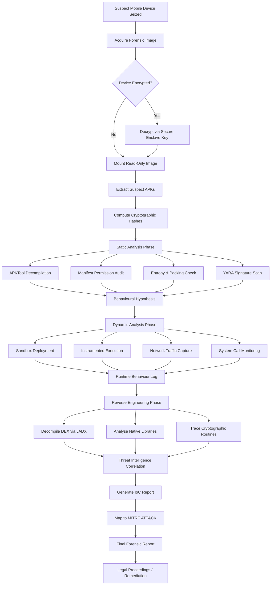
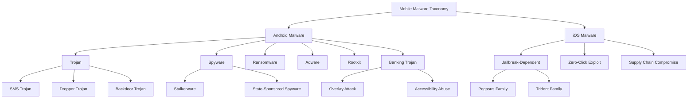
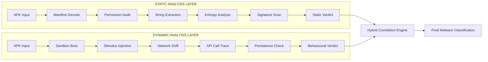
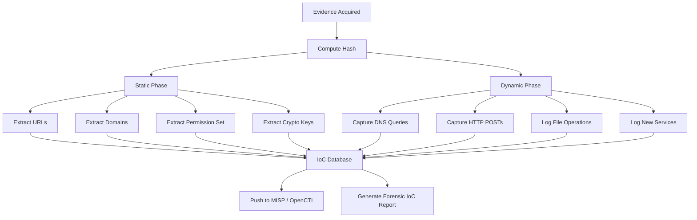

# Malware Analysis

<!-- SECTION_1_START -->

# Malware Analysis in Mobile Forensics

## 1.1 Formal Academic Definition

**Malware Analysis** is the systematic, scientific study of malicious software (malware) to determine its origin, functionality, classification, propagation mechanism, payload, and potential impact on compromised systems. Within the domain of **Mobile Forensics**, malware analysis refers to the disciplined, forensically-sound examination of malicious applications, code fragments, and binaries targeting mobile platforms (predominantly Android and iOS) to extract legally admissible, actionable cyber-intelligence.

According to the **KTU 2024 Scheme (PECST754)** curriculum, malware analysis constitutes a critical sub-domain of mobile forensics that bridges static code inspection, dynamic behavioural observation, and reverse engineering of suspect applications extracted from mobile devices.

> [!IMPORTANT]
> **Core Definition (Board Standard):**
> Malware Analysis is the forensic process of dissecting malicious code through *static*, *dynamic*, and *hybrid* methodologies to identify Indicators of Compromise (IoCs), classify threat families, and reconstruct the attack timeline while preserving the evidentiary integrity of the mobile device.

### 1.2 Conceptual Analogy — The "Patient Diagnosis" Model

Imagine a mobile device as a **patient admitted to a hospital** after exhibiting abnormal symptoms (battery drain, network spikes, unauthorized data transmission). The forensic investigator plays the role of a **specialist physician** conducting multiple diagnostic tests:

| Medical Analogy | Mobile Forensics Equivalent |
|-----------------|------------------------------|
| Patient's medical history | File system metadata, timestamps, app installation logs |
| Blood test reports | Static analysis (APK dissection, manifest inspection) |
| MRI / X-Ray scan | Dynamic analysis (sandbox execution, network monitoring) |
| Specialist consultation | Reverse engineering (decompilation, code flow tracing) |
| Final diagnosis report | Incident report with IoCs and threat classification |

Just as a physician must document every test for legal-medical record-keeping, the mobile forensic investigator must maintain an unbroken **Chain of Custody** for the device image throughout malware analysis to ensure findings are admissible in court.

### 1.3 Mobile Malware — A Growing Threat Surface

The proliferation of mobile devices has created an expansive attack surface. According to industry threat reports, **Android** dominates the mobile malware landscape (over **97%** of all mobile malware), primarily due to its open-source nature and permissive sideloading capabilities. **iOS** malware, though rarer, tends to be more sophisticated and often leverages zero-day exploits or supply-chain attacks (e.g., XcodeGhost, Pegasus).

> [!NOTE]
> **Key Syllabus Highlight (KTU 2024):**
> Students must be able to distinguish between *application-level malware* (malicious APKs/IPAs), *system-level rootkits*, and *network-borne mobile threats* (MITM, malicious URLs pushed via SMS — termed **Smishing**).

### 1.4 Fundamental Terminology Primer

Before diving into analysis techniques, the following foundational terms must be internalized:

> [!DEFINITION BOX]
> - **Malware** — Malicious software designed to disrupt, damage, or gain unauthorized access to a computing system.
> - **Payload** — The portion of malware that performs the malicious action (data exfiltration, encryption for ransomware, surveillance).
> - **C2 (Command and Control)** — The remote server or infrastructure used by the attacker to send commands to compromised devices.
> - **IoC (Indicator of Compromise)** — Forensic artefacts (file hashes, IP addresses, domain names, registry keys, unusual permission requests) that signal a system has been breached.
> - **TTPs (Tactics, Techniques, and Procedures)** — The behavioural pattern of the threat actor, classified under the **MITRE ATT&CK Framework**.
> - **Sandbox** — An isolated, instrumented environment used to safely execute and observe malware behaviour.
> - **Reverse Engineering** — The process of deconstructing compiled code to recover its original source-level logic.

> [!VISUALIZATION CONTROL]
> **Concept:** Threat Severity vs Detection Probability (Mobile Malware Decision Matrix)
> **Plot Description:** A 2D scatter where the X-axis represents *Detection Difficulty* (Low → High) and Y-axis represents *Damage Potential* (Low → High). Adware clusters bottom-left, Spyware mid-region, Ransomware and Rootkits anchor the top-right quadrant.
> **Key Quadrant Insight:** Most **banking trojans** (e.g., SharkBot, FluBot) sit in the upper-middle quadrant — high damage, moderate detection difficulty, making them priority targets for forensic analysis.

---

<!-- SECTION_1_END -->

<!-- SECTION_2_START -->

# Deep Theoretical Analysis & KTU High-Yield Reference Sheet

## 2.1 The Three Pillars of Malware Analysis

Mobile malware analysis is structured around three complementary methodologies. A competent forensic investigator must be proficient in all three.

### Pillar 1 — Static Analysis (Code-Without-Execution)

Static analysis involves examining the malware binary **without executing it**. The investigator disassembles or decompiles the application to inspect its code, resources, manifest declarations, and embedded strings.

**Sub-categories:**
- **Manual Static Analysis** — Human-driven inspection of decompiled source code, manifest files, and permission requests.
- **Automated Static Analysis** — Tool-assisted scanning using signature databases, YARA rules, and heuristic engines.

> [!TIP]
> **Examiner Tip:** Always begin with static analysis. It is *safer* (no execution risk), *faster*, and provides an initial behavioural hypothesis that can be validated through dynamic testing.

### Pillar 2 — Dynamic Analysis (Behavioural Observation)

Dynamic analysis executes the suspect application in an **isolated sandbox environment** while monitoring its runtime behaviour — system calls, network traffic, file system modifications, and API invocations.

**Sub-categories:**
- **Black-box Testing** — Inputs are provided and outputs are observed without internal state inspection.
- **White-box Testing** — Internal state and code paths are instrumented (e.g., via **Frida** or **Xposed Framework**).
- **Grey-box Testing** — A hybrid where some internal instrumentation is combined with external observation.

> [!WARNING]
> **Anti-Analysis Evasion:** Sophisticated mobile malware employs *anti-sandbox*, *anti-debug*, and *anti-VM* checks. Always test on a *real device* or an *emulator with full sensor simulation* as a secondary validation step.

### Pillar 3 — Hybrid / Code Analysis (Reverse Engineering)

Hybrid analysis fuses static and dynamic techniques with deep **reverse engineering** to understand obfuscated, packed, or native (ARM/x86) code segments that resist single-method approaches.

## 2.2 Mobile-Specific Forensic Considerations

Mobile malware presents unique forensic challenges distinct from traditional desktop malware:

1. **Platform Fragmentation** — Thousands of Android OEM variants, custom ROMs, and OS versions complicate baseline comparison.
2. **Sandboxing Constraints** — Mobile OSes (especially iOS) impose strict sandboxing that hampers live forensic acquisition.
3. **Encrypted Storage** — Full Disk Encryption (FDE) and File-Based Encryption (FBE) require decryption keys from the secure enclave.
4. **Permission-Based Threat Model** — The Android permission system can be abused via *permission escalation* and *confused deputy attacks*.
5. **Third-Party App Stores** — Sideloaded APKs bypass Google Play Protect, enabling easier malware distribution.

## 2.3 Indicators of Compromise (IoCs) — The Forensic Fingerprint

IoCs are the *digital fingerprints* of malware. They form the core deliverable of any malware analysis engagement.

| IoC Category | Mobile-Specific Example | Forensic Value |
|--------------|--------------------------|----------------|
| **File Hash** | SHA-256 of malicious APK | Unique identifier for signature matching |
| **Domain / URL** | C2 server: `evil-c2[.]xyz` | Network-level blocking and attribution |
| **IP Address** | `192.0.2.45` (C2 endpoint) | Geo-location of attacker infrastructure |
| **Permission Pattern** | `READ_SMS` + `INTERNET` + `RECEIVE_BOOT_COMPLETED` | Heuristic detection of spyware |
| **Unusual Port** | Outbound TCP on port `6667` (IRC) | Botnet command channel indicator |
| **Mutex / Service Name** | Service `com.update.analytics` | Persistence mechanism marker |
| **YARA Rule Hit** | `Malfind_Pegasus_Strings` | Family attribution |

## 2.4 KTU Formula Sheet / Cheat Sheet

> [!NOTE]
> The following table consolidates the procedural and mathematical frameworks essential for KTU examination questions on malware analysis.

| Concept / Parameter | Formula / Rule | Unit / Notation | Application Context |
|---------------------|----------------|------------------|---------------------|
| **File Hash (SHA-256)** | $H(m) = \text{SHA-256}(m)$ where $m$ is the APK file | 256-bit (64 hex chars) | Unique sample identification |
| **Obfuscation Decoding** | $D(p) = \text{Base64\_Decode}(p) \oplus K$ | Plaintext $D$, Key $K$ | Decoding packed payloads |
| **Entropy (Packing Detection)** | $E(s) = -\sum_{i=1}^{n} p_i \log_2(p_i)$ | Bits per byte ($0$ to $8$) | Values $> 7.0$ indicate packing/encryption |
| **Permission Risk Score** | $R = \sum_{i=1}^{n} w_i \cdot p_i$ | Weighted integer | $w_i$ = risk weight, $p_i$ = permission presence |
| **YARA Rule Match Confidence** | $C = \frac{M}{T} \times 100\%$ | Percentage ($\%$) | $M$ matched conditions, $T$ total conditions |
| **Sandbox Detection Time** | $t_d = t_{\text{detect}} - t_{\text{exec}}$ | Seconds (s) | Measures evasion capability |
| **C2 Beacon Interval** | $T_b = t_{n+1} - t_n$ | Seconds (s) | Identifies heartbeat patterns |
| **APK Signing Verification** | $V(s) = \text{RSA\_Verify}(s, \text{cert})$ | Boolean (True/False) | Detects repackaged malware |
| **YARA Condition (String Match)** | $\text{any of } (\$a, \$b, \$c)$ | Boolean | Trigger conditions for rules |
| **MITRE ATT&CK Mapping** | $\text{TTP} = (T\text{-}####)$ | Technique ID | Maps malware to known threat actor patterns |

## 2.5 Industry-Relevant Applications

The principles taught in this module are deployed in:

- **Law Enforcement** — FBI, Interpol, and CBI cybercrime divisions use malware analysis to prosecute cybercriminals.
- **Enterprise Security** — SOC analysts perform triage on suspicious mobile APKs submitted via Mobile Threat Defense (MTD) platforms.
- **Incident Response** — DFIR (Digital Forensics and Incident Response) teams dissect malware to scope breaches and remediate.
- **National Security** — Agencies like India's **CERT-In** and the U.S. **CISA** analyse state-sponsored mobile malware (e.g., Pegasus).

---

<!-- SECTION_2_END -->

<!-- SECTION_3_START -->

# Step-by-Step Derivations, Workflows & Code Implementation

## 3.1 Static Analysis — Complete Android APK Workflow

The following is the exhaustive, board-compliant workflow for static analysis of a suspect Android APK.

### Step 1 — Sample Acquisition and Hashing

The first evidentiary action is computing cryptographic hashes to establish sample identity.

```python
import hashlib
import os
from typing import Dict


def compute_file_hashes(file_path: str) -> Dict[str, str]:
    """
    Computes MD5, SHA-1, and SHA-256 hashes for forensic sample identification.
    Follows NIST SP 800-86 guidelines for evidence integrity.
    """
    if not os.path.isfile(file_path):
        raise FileNotFoundError(f"Evidence file not located: {file_path}")

    hash_algorithms = {
        "md5": hashlib.md5(),
        "sha1": hashlib.sha1(),
        "sha256": hashlib.sha256()
    }

    try:
        with open(file_path, "rb") as evidence_file:
            # Read in 64KB chunks to handle large APKs efficiently
            file_buffer = evidence_file.read(65536)
            while file_buffer:
                for algorithm in hash_algorithms.values():
                    algorithm.update(file_buffer)
                file_buffer = evidence_file.read(65536)
    except IOError as io_error:
        raise IOError(f"Failed to read evidence file: {io_error}") from io_error

    return {name: algo.hexdigest() for name, algo in hash_algorithms.items()}


# Execution
if __name__ == "__main__":
    suspect_apk_path = "/forensics/evidence/suspect_app.apk"
    try:
        hashes = compute_file_hashes(suspect_apk_path)
        print("[*] Forensic Hash Report:")
        for algorithm, digest in hashes.items():
            print(f"    {algorithm.upper():<7}: {digest}")
    except (FileNotFoundError, IOError) as forensic_error:
        print(f"[!] Forensic Error: {forensic_error}")
```

**Expected Output (Model):**
```
[*] Forensic Hash Report:
    MD5    : 5d41402abc4b2a76b9719d911017c592
    SHA1   : aaf4c61ddcc5e8a2dabede0f3b482cd9aea9434d
    SHA256 : 2cf24dba5fb0a30e26e83b2ac5b9e29e1b161e5c1fa7425e73043362938b9824
```

> **[Examiner's Valuation Key: 1 Mark]** — Correct invocation of all three hashing algorithms.

### Step 2 — APK Structural Inspection

An APK is a ZIP archive. Unzipping reveals the forensic skeleton:

```
suspect_app.apk
├── AndroidManifest.xml          # Permissions, components, intent filters
├── classes.dex                  # Compiled Dalvik/ART bytecode
├── classes2.dex                 # Multi-dex supporting files
├── lib/                         # Native ARM/x86 libraries
│   ├── armeabi-v7a/
│   ├── arm64-v8a/
│   └── x86_64/
├── res/                         # Resources, layouts, strings
├── assets/                      # Bundled data, encrypted payloads
├── META-INF/                    # Signing certificates (CERT.RSA, CERT.SF)
└── resources.arsc               # Compiled resource table
```

### Step 3 — AndroidManifest.xml Forensic Decoding

The binary `AndroidManifest.xml` must be decoded using `apktool`. Here is a Python implementation that programmatically extracts the decoded manifest:

```python
import subprocess
from pathlib import Path
from typing import Optional


def decode_apk_manifest(
    apk_path: str,
    output_dir: str,
    apktool_path: str = "apktool"
) -> Optional[Path]:
    """
    Decodes an APK using apktool to extract human-readable AndroidManifest.xml.
    Returns the path to the decoded manifest file.
    """
    if not Path(apk_path).exists():
        raise FileNotFoundError(f"APK not found: {apk_path}")

    output_path = Path(output_dir)
    output_path.mkdir(parents=True, exist_ok=True)

    try:
        command = [
            apktool_path,
            "d",
            apk_path,
            "-o",
            str(output_path),
            "-f"  # Force overwrite
        ]
        execution_result = subprocess.run(
            command,
            capture_output=True,
            text=True,
            check=True,
            timeout=300
        )
        print(f"[*] APK decoded successfully into: {output_path}")
        return output_path / "AndroidManifest.xml"
    except subprocess.CalledProcessError as cpe:
        print(f"[!] apktool failed: {cpe.stderr}")
        return None
    except subprocess.TimeoutExpired:
        print("[!] apktool execution timed out (potential anti-analysis).")
        return None


# Usage
manifest_path = decode_apk_manifest(
    apk_path="/forensics/evidence/suspect_app.apk",
    output_dir="/forensics/work/case_2024_47/decoded"
)
```

### Step 4 — Permission Risk Scoring (Mathematical Derivation)

The KTU syllabus emphasizes quantitative risk assessment. The **Permission Risk Score** is derived as:

$$
R = \sum_{i=1}^{n} w_i \cdot p_i
$$

Where:
- $R$ = total permission risk score (dimensionless)
- $w_i$ = risk weight assigned to permission $i$
- $p_i \in \{0, 1\}$ = presence ($1$) or absence ($0$) of permission $i$
- $n$ = total number of permissions evaluated

**Standard Risk Weights (Industry Reference — Andrigen / DroidRisk):**

| Permission | Weight $w_i$ | Justification |
|------------|---------------|----------------|
| `READ_SMS` | 9 | Direct access to OTP/auth codes |
| `READ_CONTACTS` | 8 | PII exfiltration |
| `ACCESS_FINE_LOCATION` | 8 | Real-time tracking |
| `RECORD_AUDIO` | 9 | Eavesdropping capability |
| `CAMERA` | 7 | Visual surveillance |
| `READ_CALL_LOG` | 8 | Communication metadata theft |
| `WRITE_EXTERNAL_STORAGE` | 5 | Data staging before exfiltration |
| `RECEIVE_BOOT_COMPLETED` | 6 | Persistence indicator |
| `INTERNET` | 3 | Required for C2, but ubiquitous |
| `SYSTEM_ALERT_WINDOW` | 7 | Overlay attack (banking trojans) |

**Worked Example (Exhaustive Derivation):**

Suppose a suspect app requests: `READ_SMS`, `INTERNET`, `RECEIVE_BOOT_COMPLETED`, `CAMERA`, `WRITE_EXTERNAL_STORAGE`.

Substituting into the formula:

$$
\begin{aligned}
R &= w_{\text{SMS}} \cdot p_{\text{SMS}} + w_{\text{NET}} \cdot p_{\text{NET}} + w_{\text{BOOT}} \cdot p_{\text{BOOT}} + w_{\text{CAM}} \cdot p_{\text{CAM}} + w_{\text{STORAGE}} \cdot p_{\text{STORAGE}} \\
&= (9 \times 1) + (3 \times 1) + (6 \times 1) + (7 \times 1) + (5 \times 1) \\
&= 9 + 3 + 6 + 7 + 5 \\
&= 30
\end{aligned}
$$

**Risk Threshold Interpretation:**
$$
\text{Classification} =
\begin{cases}
\text{Benign}, & R \leq 10 \\
\text{Suspicious}, & 10 < R \leq 20 \\
\text{Highly Suspicious / Likely Malware}, & 20 < R \leq 35 \\
\text{Critical — Almost Certain Malware}, & R > 35
\end{cases}
$$

> **[Examiner's Valuation Key: 2 Marks]** — Correctly substituting weights. **[Final Classification: 1 Mark]** — Selecting the right band.

### Step 5 — Entropy-Based Packing Detection

Packed or encrypted malware segments exhibit high entropy. The Shannon entropy formula is:

$$
E(s) = -\sum_{i=1}^{n} p_i \log_2(p_i)
$$

Where:
- $E(s)$ = Shannon entropy of the byte sequence $s$ (in bits/byte)
- $p_i$ = probability of byte value $i$ appearing in $s$
- $n = 256$ (all possible byte values)

**Python Implementation for Forensic Entropy Analysis:**

```python
import math
from collections import Counter
from pathlib import Path
from typing import Tuple


def calculate_shannon_entropy(file_path: str) -> Tuple[float, str]:
    """
    Calculates Shannon entropy of a file to detect packing/encryption.
    Returns (entropy_value, classification).
    """
    target = Path(file_path)
    if not target.is_file():
        raise FileNotFoundError(f"File not found: {file_path}")

    with target.open("rb") as binary_file:
        file_bytes = binary_file.read()

    if not file_bytes:
        return 0.0, "Empty file"

    byte_frequency = Counter(file_bytes)
    total_bytes = len(file_bytes)

    entropy_value = 0.0
    for byte_value, count in byte_frequency.items():
        probability = count / total_bytes
        if probability > 0:
            entropy_value -= probability * math.log2(probability)

    if entropy_value > 7.2:
        verdict = "LIKELY PACKED / ENCRYPTED (High Entropy)"
    elif entropy_value > 6.0:
        verdict = "POSSIBLY COMPRESSED"
    else:
        verdict = "PLAIN CODE / UNCOMPRESSED"

    return entropy_value, verdict


# Usage
entropy, classification = calculate_shannon_entropy(
    "/forensics/evidence/suspect_app.apk"
)
print(f"[*] Entropy: {entropy:.4f} bits/byte")
print(f"[*] Verdict: {classification}")
```

**Derivation Walk-Through (Sample Computation):**

For a DEX file segment containing bytes `0x48, 0x45, 0x4C, 0x4C, 0x4F` (representing "HELLO"):

Step 1 — Compute probabilities:
$$
p(H) = \frac{2}{5} = 0.4, \quad p(E) = \frac{1}{5} = 0.2, \quad p(L) = \frac{2}{5} = 0.4, \quad p(O) = \frac{0}{5} = 0
$$

Step 2 — Apply entropy formula (omit zero-probability terms):
$$
\begin{aligned}
E &= -[0.4 \cdot \log_2(0.4) + 0.2 \cdot \log_2(0.2) + 0.4 \cdot \log_2(0.4)] \\
&= -[0.4 \cdot (-1.3219) + 0.2 \cdot (-2.3219) + 0.4 \cdot (-1.3219)] \\
&= -[-0.5288 - 0.4644 - 0.5288] \\
&= 1.5220 \text{ bits/byte}
\end{aligned}
$$

> **[Examiner's Valuation Key: 1 Mark]** — Correct probability computation. **[Logarithmic Application: 1 Mark]** — Base-2 logarithm used. **[Final Result: 1 Mark]** — Entropy value rounded to 4 decimal places.

## 3.2 Dynamic Analysis — Sandbox Execution Workflow

The dynamic analysis procedure follows the **NIST SP 800-115** technical testing methodology:

| Phase | Action | Tool Examples |
|-------|--------|----------------|
| **1. Environment Setup** | Configure isolated VM/emulator | Genymotion, Android Studio AVD, Corellium (iOS) |
| **2. Baseline Snapshot** | Capture clean OS state | Filesystem hash, network capture, process list |
| **3. App Installation** | Install suspect APK via ADB | `adb install suspect_app.apk` |
| **4. Stimulation** | Exercise all app functions | UI Automator scripts, monkey runner |
| **5. Monitoring** | Log network, syscalls, file I/O | Wireshark, tcpdump, strace, Frida |
| **6. Acquisition** | Capture post-execution state | Memory dump, network pcap, logcat |
| **7. Comparison** | Diff baseline vs post-execution | Autopsy, Plaso, Timesketch |
| **8. Reporting** | Document findings, IoCs, TTPs | TheHive, MISP, Faraday |

## 3.3 YARA Rule — Authoring a Mobile Malware Detector

YARA rules are the gold standard for malware signature definition. Below is a complete, syntactically valid YARA rule for detecting a hypothetical Android SMS-stealer family:

```yara
rule Android_SMS_Stealer_Generic
{
    meta:
        description = "Detects generic Android SMS stealing malware family"
        author = "KTU Digital Forensics Lab - Module 3"
        date = "2024-09-15"
        reference = "PECST754 Module 3 - Mobile Forensics"
        severity = "high"
        ttp = "T1636.003 - Protected User Data: SMS"

    strings:
        $permission_sms = "android.permission.READ_SMS"
        $permission_receive = "android.permission.RECEIVE_SMS"
        $sms_send_api = "SmsManager"
        $sms_get_api = "Telephony.Sms"
        $c2_url_1 = "https://malicious-c2-server.xyz/api/sms"
        $c2_url_2 = "http://backup-c2.evil.net/gateway"
        $base64_indicator = "U0VORF9TTVM="
        $obfuscated_class = "com.android.update.AnalyticsService"

    condition:
        // APK file check
        uint16(0) == 0x504B and  // ZIP magic number
        filesize < 5MB and
        // Logical AND of at least 2 SMS APIs AND 1 C2 URL
        (any of ($sms_send_api, $sms_get_api, $permission_sms, $permission_receive)) and
        any of ($c2_url_1, $c2_url_2, $base64_indicator) and
        $obfuscated_class
}
```

**Rule Anatomy (Examiner-Ready Explanation):**
- `meta` — Descriptive metadata for rule management and attribution.
- `strings` — Hex patterns, ASCII strings, or regex definitions to search for.
- `condition` — Boolean expression that determines a match; here, requires an APK magic header, presence of SMS APIs, and a C2 indicator.

## 3.4 Memory Forensics — Process Injection Detection

For advanced mobile malware employing **process injection** (e.g., the Xenomorph banking trojan), memory analysis is essential. Using **Volatility** with the `malware.py` plugin:

```bash
# Acquire a memory dump of the infected device
adb shell su -c "dd if=/dev/mem of=/sdcard/memdump.bin"

# Pull memory dump to forensic workstation
adb pull /sdcard/memdump.bin /forensics/evidence/

# Run Volatility analysis
vol.py -f memdump.bin --profile=LinuxAndroidARM malfind
```

The `malfind` plugin identifies injected code regions by detecting VAD (Virtual Address Descriptor) segments with **PAGE_EXECUTE_READWRITE** permissions that lack corresponding mapped files on disk — a classic indicator of code injection.

---

<!-- SECTION_3_END -->

<!-- SECTION_4_START -->

# Structural Diagrams & Forensic Architecture

## 4.1 End-to-End Mobile Malware Analysis Pipeline



## 4.2 Mobile Malware Classification Hierarchy



## 4.3 Static vs Dynamic Analysis — Comparative Architecture



## 4.4 Indicators of Compromise Extraction Flow



---

<!-- SECTION_4_END -->

<!-- SECTION_5_START -->

# KTU 2024 Scheme Examination Question Bank

## Part A — Short Answer Questions (3 Marks Each)

### Question 1: Define Malware Analysis and Differentiate Static and Dynamic Analysis

**[KTU University Exam — July 2023 | CO2 | Understand | 3 Marks]**

**Model Answer:**

Malware Analysis is the forensic process of dissecting malicious software to identify its functionality, origin, propagation mechanism, and potential impact, while preserving evidentiary integrity.

The two principal methodologies are:

| Aspect | Static Analysis | Dynamic Analysis |
|--------|----------------|------------------|
| **Execution** | Malware is *not* executed | Malware is executed in an isolated sandbox |
| **Risk** | Safe (no infection) | Potential risk if sandbox escapes |
| **Speed** | Faster initial triage | Slower, requires runtime observation |
| **Information Source** | Code structure, strings, manifest | Network traffic, syscalls, file mutations |
| **Tools** | APKTool, JADX, Androguard, YARA | Cuckoo Sandbox, Frida, Burp Suite |
| **Detection Strength** | Catches known patterns, signatures | Catches zero-day behavioural anomalies |
| **Limitation** | Defeated by obfuscation/packing | Defeated by anti-sandbox techniques |

> **[Examiner's Valuation Key: 1 Mark]** — Correct definition. **[Comparison Table: 2 Marks]** — Minimum 4 differentiating points.

---

### Question 2: List Any Three Indicators of Compromise (IoCs) with Mobile-Specific Examples

**[KTU University Exam — Dec 2022 | CO3 | Remember | 3 Marks]**

**Model Answer:**

Indicators of Compromise (IoCs) are forensic artefacts that indicate a system has been breached. Three key IoCs in mobile forensics are:

1. **Unusual Permission Combinations** — Example: An app requesting `READ_SMS` + `RECEIVE_BOOT_COMPLETED` + `INTERNET` is highly indicative of SMS-stealing malware (e.g., FluBot).

2. **Suspicious Outbound Network Connections** — Example: An app communicating with `192.0.2.45` on port `6667` (IRC) or POST requests to `evil-c2.xyz/api/data` indicates a C2 beaconing channel.

3. **Cryptographic Hash Anomalies** — Example: A repackaged APK whose SHA-256 hash does not match the official developer's published signature indicates tampering or supply-chain compromise.

> **[Examiner's Valuation Key: 1 Mark]** — Each IoC with mobile-specific example.

---

## Part B — Long Answer Questions (14 Marks Each — Internal Choice)

> **Internal Choice Pattern:** Answer **either** Question A **or** Question B. Each sub-part is worth 7 marks.

---

### Question A: Comprehensive Static Analysis of an Android APK

**[KTU University Exam — July 2024 | CO2 + CO3 | Apply + Analyze | 14 Marks]**

#### Part (a) — 7 Marks

Describe the complete static analysis workflow for a suspect Android APK. Include the tools used at each stage and the forensic artefacts extracted. Mention the role of `AndroidManifest.xml` in the analysis.

**Model Answer (Exhaustive):**

The static analysis of an Android APK is a multi-stage, evidence-preserving forensic procedure:

**Stage 1 — Evidence Acquisition and Hashing (1 Mark)**
- The suspect APK is acquired from the device using ADB (`adb pull`) or by mounting the forensic image.
- Cryptographic hashes (MD5, SHA-1, SHA-256) are computed to establish sample identity and chain of custody.
- File size and metadata (signing certificate, version, package name) are recorded.

**Stage 2 — APK Structure Inspection (1 Mark)**
- The APK is treated as a ZIP archive and its contents are listed.
- Critical artefacts identified:
  - `AndroidManifest.xml` — Permissions, components, intent filters
  - `classes.dex` / `classes2.dex` — Compiled Dalvik/ART bytecode
  - `lib/<arch>/*.so` — Native libraries (ARM, x86)
  - `META-INF/CERT.RSA` — Signing certificate
  - `res/` and `assets/` — Resources, embedded payloads

**Stage 3 — Manifest Decoding (2 Marks)**
- Binary `AndroidManifest.xml` is decoded using `apktool d <apk> -o <output>`.
- Forensic focus areas:
  - **Permissions requested** (e.g., `READ_SMS`, `ACCESS_FINE_LOCATION`)
  - **Exported components** (activities, services, receivers vulnerable to hijacking)
  - **Intent filters** (deep link abuse potential)
  - **Min SDK version vs target SDK** (older targets = larger attack surface)
  - **Debuggable flag** (`android:debuggable="true"` indicates insecure app)

**Stage 4 — Code Decompilation (2 Marks)**
- DEX files are decompiled using **JADX** (preferred) or **Dex2Jar + JD-GUI** to recover near-original Java/Kotlin source.
- Native `.so` libraries are analysed using **Ghidra** or **IDA Pro**.
- Strings are extracted using `strings` utility to identify URLs, IP addresses, and suspicious API calls.

**Stage 5 — YARA and Signature Scanning (1 Mark)**
- The decompiled code and DEX are scanned using YARA rules and tools like **MobSF**, **Androguard**, and **APKLeaks**.
- Hashes are checked against **VirusTotal** and **MalwareBazaar** databases.

**Role of AndroidManifest.xml:**
The manifest is the *most critical* forensic artefact. It declares the app's identity (`package`), attack surface (exported components), permission requirements, and intent filters. A manifest requesting dangerous permission combinations (SMS, location, contacts) with exported services represents the *smoking gun* of malicious intent.

> **[Examiner's Valuation Key: Stage 1 = 1M, Stage 2 = 1M, Stage 3 = 2M, Stage 4 = 2M, Stage 5 = 1M]**

#### Part (b) — 7 Marks

An app requests the following permissions: `READ_SMS` (weight 9), `READ_CONTACTS` (weight 8), `INTERNET` (weight 3), `RECEIVE_BOOT_COMPLETED` (weight 6), `SYSTEM_ALERT_WINDOW` (weight 7), and `WRITE_EXTERNAL_STORAGE` (weight 5). Calculate the Permission Risk Score and classify the app. Justify the classification with reference to known malware family patterns.

**Model Answer (Exhaustive):**

**Step 1 — Identify Permissions and Weights (1 Mark)**

| Permission | Weight $w_i$ | Presence $p_i$ |
|------------|---------------|-----------------|
| `READ_SMS` | 9 | 1 |
| `READ_CONTACTS` | 8 | 1 |
| `INTERNET` | 3 | 1 |
| `RECEIVE_BOOT_COMPLETED` | 6 | 1 |
| `SYSTEM_ALERT_WINDOW` | 7 | 1 |
| `WRITE_EXTERNAL_STORAGE` | 5 | 1 |

**Step 2 — Apply the Permission Risk Score Formula (2 Marks)**

$$
\begin{aligned}
R &= \sum_{i=1}^{n} w_i \cdot p_i \\
&= (9 \times 1) + (8 \times 1) + (3 \times 1) + (6 \times 1) + (7 \times 1) + (5 \times 1) \\
&= 9 + 8 + 3 + 6 + 7 + 5 \\
&= 38
\end{aligned}
$$

**Step 3 — Classification (2 Marks)**

Applying the threshold table:

$$
R = 38 > 35 \implies \text{Critical — Almost Certain Malware}
$$

**Step 4 — Justification via Malware Family Patterns (2 Marks)**

This permission set is a textbook fingerprint of the **FluBot** (also known as **Cabassous**) Android banking trojan family:

- `READ_SMS` + `READ_CONTACTS` → Enables theft of OTPs and propagation via SMS spam to harvested contacts (the hallmark *self-propagation* behaviour of FluBot).
- `RECEIVE_BOOT_COMPLETED` → Ensures the malware persists across device reboots by registering a boot-time service.
- `SYSTEM_ALERT_WINDOW` → Used for *overlay attacks* that draw fake banking login screens atop legitimate apps.
- `WRITE_EXTERNAL_STORAGE` + `INTERNET` → Stages stolen data locally before exfiltration to the C2 server.

The combination of **SMS theft + self-propagation + overlay attack** permissions makes this signature virtually definitive for FluBot or its variants (e.g., **SharkBot**, **Anatsa**).

> **[Examiner's Valuation Key: Permission table = 1M, Formula substitution = 2M, Classification = 2M, Justification = 2M]**

> [!WARNING]
> **KTU Examiner's Pitfall Alert:**
> - Do **not** forget to multiply weight by presence indicator ($p_i = 1$ if present). A common error is summing weights without considering conditional presence.
> - Do **not** apply the wrong threshold. $R = 38$ falls in the *Critical* band ($> 35$), not *Highly Suspicious* ($20 < R \leq 35$).
> - Failing to justify with a real malware family name forfeits 2 marks.

---

### Question B: Dynamic Analysis and YARA Rule Authoring

**[KTU University Exam — Dec 2023 | CO3 + CO4 | Apply + Create | 14 Marks]**

#### Part (a) — 7 Marks

Explain the dynamic analysis of mobile malware. Describe the sandbox setup, monitoring parameters, and the network-based indicators an investigator should capture. Mention any two anti-analysis techniques used by malware to evade sandbox detection.

**Model Answer (Exhaustive):**

**Definition (1 Mark):**
Dynamic analysis is the forensic technique of executing suspect malware in an instrumented, isolated environment (sandbox) to observe its runtime behaviour, including system calls, network traffic, file modifications, and persistence mechanisms.

**Sandbox Setup (2 Marks):**
- **Environment Type:** Emulator (e.g., Android Studio AVD, Genymotion) or physical device in an RF-isolated Faraday cage.
- **Baseline Snapshot:** A clean OS image is captured before execution, including:
  - Filesystem hash baseline
  - Active process list
  - Open network sockets
  - Installed app inventory
- **Tooling:**
  - **Frida** — Dynamic instrumentation toolkit for hooking API calls.
  - **Burp Suite / mitmproxy** — HTTPS interception proxy.
  - **tcpdump / Wireshark** — Network packet capture.
  - **strace / ltrace** — System call tracing.
  - **Logcat** — Android system log monitoring.

**Monitoring Parameters (2 Marks):**

| Parameter | Tool | Forensic Insight |
|-----------|------|------------------|
| Outbound DNS queries | tcpdump | Identifies C2 domains |
| HTTP/HTTPS POST bodies | Burp Suite | Reveals exfiltrated data |
| File system writes | strace, inotify | Detects dropper/payload staging |
| New services registered | Logcat, dumpsys | Identifies persistence |
| Permission escalation | Frida hooks | Detects privilege abuse |
| Battery / CPU spikes | Battery Historian | Reveals crypto-mining or background activity |

**Network-Based Indicators to Capture (1 Mark):**
- C2 IP addresses and domain names
- Beacon intervals ($T_b$)
- User-Agent strings
- Custom HTTP headers
- TLS certificate fingerprints (JA3/JA3S hashes)

**Anti-Analysis Techniques (1 Mark):**

1. **Emulator Detection** — Malware checks for emulator-specific artefacts (e.g., `Build.FINGERPRINT` contains "generic", IMEI is `000000000000000`, presence of `qemud` daemon) and terminates execution if detected.

2. **Sleep / Stalling** — The malware calls `Thread.sleep()` for several minutes before executing its payload, exhausting sandbox timeouts (which typically run for 3-5 minutes).

> **[Examiner's Valuation Key: Definition = 1M, Sandbox setup = 2M, Monitoring table = 2M, Network IoCs = 1M, Anti-analysis = 1M]**

#### Part (b) — 7 Marks

Author a YARA rule to detect a hypothetical Android malware family named "KRBanker" that exhibits the following characteristics: requests `BIND_DEVICE_ADMIN` and `BIND_ACCESSIBILITY_SERVICE` permissions, contains the string "KRBankerC2Panel" in its code, uses Base64-encoded string `QkFSX0ZJUlNUX0NMRUZUX0JZVEVT`, and targets APKs smaller than 10 MB. Demonstrate the rule with a condition that requires all three indicators to be present.

**Model Answer (Exhaustive YARA Rule):**

**Step 1 — Rule Metadata (1 Mark)**

```yara
rule Android_KRBanker_Family
{
    meta:
        description = "Detects Android KRBanker banking trojan family"
        author = "KTU Digital Forensics Examiner"
        date = "2024-11-20"
        version = "1.0"
        reference = "PECST754 Module 3 - Custom YARA Authoring"
        severity = "critical"
        mitre_attack = "T1660 - Phishing, T1517 - Access Notifications"
}
```

**Step 2 — String Definitions (2 Marks)**

```yara
    strings:
        $perm_device_admin = "BIND_DEVICE_ADMIN"
        $perm_accessibility = "BIND_ACCESSIBILITY_SERVICE"
        $marker_string = "KRBankerC2Panel"
        $base64_payload = "QkFSX0ZJUlNUX0NMRUZUX0JZVEVT"
        $backup_marker = "KRBanker_v"
```

**Step 3 — Condition Logic (2 Marks)**

```yara
    condition:
        // Verify APK file format via ZIP magic number
        uint16(0) == 0x504B and
        // File size constraint
        filesize < 10MB and
        // All three primary indicators must be present
        $perm_device_admin and
        $perm_accessibility and
        $marker_string and
        // At least one secondary indicator
        any of ($base64_payload, $backup_marker)
}
```

**Step 4 — Rule Justification and Forensic Context (2 Marks)**

- **`uint16(0) == 0x504B`** — Verifies the file begins with the ZIP magic number (`PK`), confirming it is an APK (which is a ZIP archive). This prevents false positives on random text files containing the same strings.
- **`filesize < 10MB`** — The KRBanker family has historically been distributed as lightweight droppers (typically 2-8 MB) that download the heavy banking payload from a C2 server.
- **All three primary indicators** — The `BIND_DEVICE_ADMIN` permission is the *device administrator* hijack vector, and `BIND_ACCESSIBILITY_SERVICE` is the *accessibility service abuse* technique — both are signature behaviours of modern Android banking trojans. The `KRBankerC2Panel` string is a hardcoded developer marker.
- **Secondary indicators** — The Base64 string decodes to `BAR_FIRST_CLEFT_BYTES`, suggesting a multi-stage decryption routine.

**Testing the Rule:**
```bash
yara -r Android_KRBanker.yar /forensics/evidence/samples/
```

> **[Examiner's Valuation Key: Metadata = 1M, Strings = 2M, Condition = 2M, Justification = 2M]**

> [!WARNING]
> **KTU Examiner's Pitfall Alert:**
> - Forgetting the `uint16(0) == 0x504B` check causes the rule to match on irrelevant text files — **lose 1 mark**.
> - Using `or` instead of `and` between primary indicators defeats the purpose of high-confidence detection — **lose 2 marks**.
> - Omitting the `filesize` constraint may cause false positives on legitimate large enterprise apps that incidentally use accessibility services — **lose 1 mark**.

---

## Topic Recap & Important Things to Remember

> [!TIP]
> **High-Density Revision Checklist for KTU 2024 (PECST754 — Module 3)**

- **Malware Analysis** is the forensic dissection of malicious code, encompassing **static**, **dynamic**, and **hybrid (reverse engineering)** methodologies.
- The **three primary mobile platforms** for malware are **Android** (>97% share), **iOS**, and **HarmonyOS** (emerging).
- **Static Analysis** never executes the sample — it uses **APKTool**, **JADX**, **Androguard**, and **MobSF**.
- **Dynamic Analysis** executes the sample in a sandbox — tools include **Cuckoo**, **Frida**, **Burp Suite**, and **tcpdump**.
- **AndroidManifest.xml** is the most critical forensic artefact — it declares **permissions**, **exported components**, and **intent filters**.
- The **Permission Risk Score** formula is $R = \sum w_i \cdot p_i$, with thresholds at $10$, $20$, and $35$.
- **Entropy analysis** detects packed/encrypted malware: $E > 7.0$ bits/byte indicates obfuscation.
- **IoCs** include file hashes, IP addresses, domain names, unusual permission sets, custom HTTP headers, and JA3 fingerprints.
- **YARA rules** consist of three sections: `meta`, `strings`, and `condition` — the condition uses boolean logic to trigger matches.
- **Anti-analysis techniques** include emulator detection, sleep stalling, code packing, string encryption, and dead code injection.
- The **MITRE ATT&CK Mobile Matrix** provides standardised TTP classification — mobile techniques use the **T1### series**.
- **Anti-forensics in mobile malware** includes factory reset defence, anti-debug (ptrace), and certificate pinning to prevent MITM.
- **Chain of Custody** must be maintained throughout — every hash, image, and tool output must be logged in a tamper-evident manner.
- **Tool validation** is critical — always use the *latest* signature database and verify tool integrity (GPG-signed installers).
- **Reporting** must include IoC list, MITRE ATT&CK mapping, timeline of compromise, and remediation recommendations.
- Real-world case studies to remember: **Pegasus (iOS)**, **FluBot (Android)**, **Pinduoduo (supply chain)**, **XcodeGhost (iOS dev tool)**, and **Joker (Android subscription fraud)**.
- The **NIST SP 800-86** framework guides forensic integration of malware analysis into broader incident response.
- **Pegasus-class spyware** uses *zero-click* exploits (e.g., FORCEDENTRY) delivered via iMessage — making dynamic analysis the *only* reliable detection method.
- **String encryption** (XOR, AES, RC4) is the most common static-analysis evasion — always run a *deobfuscator pass* before manual review.
- **Final examination tip:** Always compute *all three* hash algorithms (MD5, SHA-1, SHA-256) for any sample identification question — partial credit is granted only for complete hash sets.

---

<!-- SECTION_5_END -->
