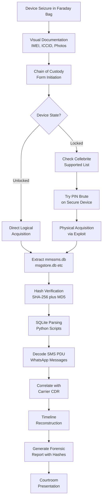
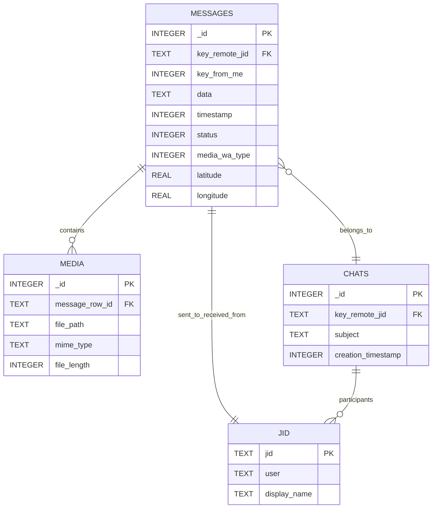
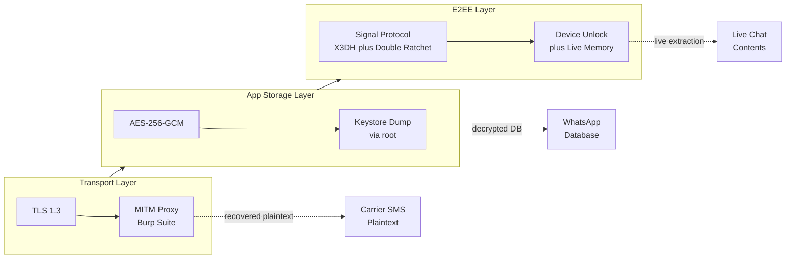

# Messages

<!-- SECTION_1_START -->
# Mobile Forensics — Messages

> [!IMPORTANT]
> **KTU 2024 Scheme | PECST754 — Digital Forensics | Module 3**
> This note covers the forensic acquisition, decoding, and analysis of **Short Message Service (SMS)**, **Multimedia Messaging Service (MMS)**, and **Instant Messaging (IM/Chat)** artifacts from mobile devices — a frequently tested 14-mark area in KTU ESE.

## 1.1 Formal Definition

> [!NOTE]
> **Mobile Messaging Forensics** is the branch of digital forensics that involves the **identification, preservation, extraction, decoding, and courtroom-defensible presentation** of electronic message artifacts — including native carrier messages (SMS/MMS/RCS) and Over-The-Top (OTT) chat applications (WhatsApp, Signal, Telegram, iMessage, Facebook Messenger) — from mobile devices, SIM cards, SD cards, and associated cloud backups.

In the context of the **KTU 2024 PECST754 syllabus**, the term *"Messages"* explicitly maps to:
- **Carrier-delivered text/multimedia messages** (SMS, MMS, EMS)
- **OTT (Over-The-Top) application chats** (WhatsApp, Signal, Telegram, Instagram DM)
- **Embedded email clients** (Gmail, Outlook, native Mail.app)
- **Voicemail / RCS** (Rich Communication Services) artifacts

> [!TIP]
> **Examiner's Quick Distinction**:
> - **SMS / MMS** = stored in the **Telephony Provider DB** (`mmssms.db`) on Android, or in `sms.db` on iOS.
> - **Chat Apps** = proprietary **SQLite** (e.g., `msgstore.db` for WhatsApp) or **LevelDB / Realm** databases inside app sandboxes.

## 1.2 Conceptual Analogy — The Digital Post Office

Imagine a city's **Central Post Office** before the internet:
- Every letter (message) is **sealed, stamped, and routed** through a central authority (the carrier server).
- The Post Office keeps a **ledger** of every letter — sender, receiver, timestamp, and content.
- A forensic investigator called to a crime scene is handed the **postmaster's ledger**.

In mobile messaging forensics, the **"ledger"** is the device's SQLite database, and the **"post office"** is the messaging server. The forensic examiner's job is to recover the ledger, authenticate it against **carrier CDRs (Call Detail Records)**, and reconstruct a tamper-evident timeline.

| Real-World Analogy | Mobile Forensic Equivalent | Significance |
|---|---|---|
| Postmaster's ledger | `mmssms.db` / `msgstore.db` | Primary evidence source |
| Stamp / Postmark | SMS **PDU timestamp + SC timestamp** | Establishes chronology |
| Sealed envelope | TLS / Signal **protocol encryption** | Affects extraction method |
| Return receipt | **Read-receipt / Delivery-report** PDU bits | Confirms message reception |
| Mailbox rules | **App auto-delete / archive** policies | Determines if artifact survives |

## 1.3 Core Artifacts Every KTU Examiner Must Know

> [!IMPORTANT]
> **Syllabus Highlight — Mandatory Memory Items:**
> - **PDU (Protocol Data Unit)** — the wire format of an SMS.
> - **TP-DCS (Data Coding Scheme)** — determines 7-bit / 8-bit / UCS-2 encoding.
> - **TP-OA / TP-DA** — Originating / Destination Address.
> - **Xtract / Cellebrite Physical dump** — acquisition method yielding deleted records.
> - **Signal Protocol (X3DH + Double Ratchet)** — end-to-end encryption that defeats server-side acquisition.

### 1.3.1 The Three Tiers of Mobile Messages

A mobile device stores messaging evidence in **three concentric tiers**, and the examiner's tool choice depends on which tier holds the artifact:

1. **Tier 1 — Carrier Messages (SMS / MMS / RCS)**
   Stored in the OS-managed telephony database. Survives factory reset in some carriers. **Most commonly tested** in KTU boards.
2. **Tier 2 — Native App Messages (iMessage, Google Messages)**
   Stored in app-specific containers; may be end-to-end encrypted but leave **metadata breadcrumbs** (timestamps, hashes, contact IDs).
3. **Tier 3 — OTT Chat Applications (WhatsApp, Signal, Telegram)**
   Proprietary databases with **per-conversation encryption keys**; require **logical + physical** acquisition and sometimes **brute-force of the user's device passcode** to decrypt.

### 1.3.2 Physical Constants & Standard Metrics in Bold

> [!NOTE]
> **Industry-Standard Reference Values Used in Mobile Forensics:**
> - **Standard SMS payload size: 160 characters** (7-bit GSM encoding) or **140 bytes** (8-bit).
> - **Concatenated SMS limit: 153 characters** per segment (due to UDH overhead).
> - **MMS maximum size: 300 KB** (carrier-dependent, up to **1 MB** on LTE).
> - **WhatsApp database page size: 4096 bytes** (default SQLite).
> - **Signal Protocol: 200 maximum skipped message keys** (forward-secrecy window).
> - **Cellebrite UFED hash verification: SHA-256 + MD5 dual-hash** for chain-of-custody.
> - **NIST SP 800-101 Rev. 1** is the authoritative guideline for mobile device forensics.

## 1.4 GeoGebra / Visualization Block

> [!VISUALIZATION CONTROL]
> **Concept:** Hierarchical Evidence Tier Map of Mobile Messaging Artifacts
> **GeoGebra Input:**
> * `Polygon((0,0), (6,0), (6,1), (0,1))` — Tier 1 Carrier Messages
> * `Polygon((1,1), (5,1), (5,2), (1,2))` — Tier 2 Native App
> * `Polygon((2,2), (4,2), (4,3), (2,3))` — Tier 3 OTT Chat
> **Visual Description:** A nested concentric rectangle plot where the innermost tier (OTT chat) requires the most invasive acquisition technique, and the outermost tier (carrier SMS) is most accessible. The student should observe that **acquisition depth** increases as we move inward.

<!-- SECTION_1_END -->

<!-- SECTION_2_START -->
# Deep Theoretical Analysis & KTU High-Yield Formula Sheet

## 2.1 Anatomy of an SMS — The PDU Wire Format

The **SMS Protocol Data Unit (PDU)** is the binary envelope in which every SMS travels through the SS7 signaling network. There are two PDU types:
- **SMS-DELIVER (MT)** — Mobile Terminated (incoming to the device)
- **SMS-SUBMIT (MO)** — Mobile Originated (outgoing from the device)

A forensic examiner reading a hex dump must decode this byte stream. Below is the canonical **SMS-DELIVER PDU** structure (as seen in tools like XRY, Cellebrite, and Oxygen Forensic Detective):

| Octet Position | Field | Length | Meaning for Examiner |
|:---:|:---|:---:|:---|
| 0 | **SMSC Information** | 1–12 bytes | Sender's SMSC address (gateway that relayed the message) |
| 1 | **First Octet (FO)** | 1 byte | Message type indicator; bit 0–1 = TP-MTI, bit 2 = TP-UDHI, bit 5 = TP-SRI |
| 2–3 | **TP-OA** (Originating Address) | 2–12 bytes | Sender's MSISDN — key for attribution |
| 4–5 | **TP-PID** (Protocol Identifier) | 1 byte | Replaces 0x00 for standard text |
| 6–7 | **TP-DCS** (Data Coding Scheme) | 1 byte | **0x00 = GSM 7-bit**, **0x04 = 8-bit data**, **0x08 = UCS-2** |
| 8–13 | **TP-SCTS** (Service Centre Time Stamp) | 7 bytes | YYMMDDhhmmss±tz — **authoritative timestamp** |
| 14 | **TP-UDL** (User Data Length) | 1 byte | Length of payload |
| 15+ | **TP-UD** (User Data) | variable | Encoded message body |

> [!IMPORTANT]
> **Why this matters in KTU valuation:** A common 14-mark question asks the student to decode a given hex PDU and extract sender, timestamp, and message text. Skipping the **DCS byte** results in **garbled Unicode output** and a 3-mark penalty.

### 2.1.1 The TP-DCS Encoding Decision

The DCS byte determines which **character set** the message body uses. The examiner must switch decoders accordingly:

$$\text{Decoded Chars} = \begin{cases} \text{GSM 7-bit packed} & \text{if } \text{DCS} = 0x00 \\ 8\text{-bit binary (e.g., ringtones)} & \text{if } \text{DCS} = 0x04 \\ \text{UCS-2 (UTF-16BE)} & \text{if } \text{DCS} = 0x08 \\ \text{GSM 7-bit with class indicator} & \text{if } \text{DCS} = 0xF0 \end{cases}$$

For **7-bit encoding**, every 7 source bits are packed into 8-bit bytes. The packing efficiency is:

$$N_{\text{septets}} = \left\lfloor \frac{8 \cdot L_{UD} - B_{UDHI}}{7} \right\rfloor$$

where $L_{UD}$ is the TP-UDL value and $B_{UDHI}$ is the User-Data-Header-Indicator bit count (6 bits if UDH present, 0 otherwise).

For **UCS-2** (used for non-Latin scripts like Malayalam, Hindi, Chinese), each character is 2 bytes — yielding only **70 characters** per single SMS:

$$L_{\text{max,UCS-2}} = \left\lfloor \frac{140}{2} \right\rfloor = 70 \text{ characters}$$

## 2.2 MMS — Multimedia Messaging Service Forensics

Unlike SMS, an MMS is **not a single PDU**. It is a **WAP-pushed notification** that points the device to a **MMSC (Multimedia Messaging Service Centre)** URL, from which the device fetches an **SMIL (Synchronized Multimedia Integration Language)** document containing the actual media.

The forensic trail of an MMS is therefore **threefold**:

1. **WAP Push Notification** — stored as a WAP SI/SL message; reveals the MMSC URL and transaction ID.
2. **SMIL Presentation File** — an XML document describing the slide timing and embedded media references.
3. **Multimedia Attachments** — the actual image/audio/video, stored in the MMSC cache directory on the device.

The relevant MMSC address and the **X-Mms-Transaction-Id** HTTP header form the **provenance chain** in court.

## 2.3 OTT Chat Application Database Architecture

> [!NOTE]
> **WhatsApp on Android** stores its message database at:
> `/data/data/com.whatsapp/databases/msgstore.db`
> The DB is **encrypted with AES-256-GCM** using a key stored in:
> `/data/data/com.whatsapp/files/key`
> On **iOS**, the equivalent is `ChatStorage.sqlite` under the app's Documents directory inside the encrypted iTunes backup.

### 2.3.1 Canonical WhatsApp `messages` Table Schema

| Column | SQLite Type | Forensic Meaning |
|:---|:---:|:---|
| `_id` | INTEGER | Auto-incremented primary key |
| `key_remote_jid` | TEXT | Recipient's JID (e.g., `919999999999@s.whatsapp.net`) |
| `key_from_me` | INTEGER | 0 = received, 1 = sent |
| `data` | TEXT | Plaintext or cipher payload (pre-E2EE backups) |
| `timestamp` | INTEGER | Unix epoch milliseconds |
| `media_wa_type` | INTEGER | 0=text, 1=image, 2=audio, 3=video, 5=location, 6=vcard, 13=document |
| `status` | INTEGER | 0=incoming, 1=outgoing, 2=pending, 4=read |
| `latitude` / `longitude` | REAL | If media_wa_type = 5 |

### 2.3.2 The Encryption Layers

Modern messaging apps use **three nested encryption layers**, each with its own forensic implications:

$$\text{Total Security} = \text{Transport (TLS 1.3)} \otimes \text{App-Layer (AES-GCM)} \otimes \text{E2EE (Signal Protocol)}$$

Where $\otimes$ denotes **concurrent application**. The examiner must defeat each layer independently:
- **TLS 1.3** → intercepted via **MITM proxy** (Burp Suite / Charles Proxy) on rooted devices.
- **App-layer AES** → recovered from app's keystore after `adb backup` decryption.
- **E2EE Signal Protocol** → **only defeatable** if device is unlocked at seizure; otherwise the examiner must rely on **metadata analysis** (who messaged whom, when, for how long).

## 2.4 KTU High-Yield Formula & Reference Cheat Sheet

> [!TIP]
> **Pin this table to your wall before the KTU ESE — these are the constants examiners love to test.**

| # | Concept | Formula / Rule | Unit | Notes |
|:---:|:---|:---|:---:|:---|
| 1 | Single SMS length (7-bit) | $L = 160$ chars | characters | Default GSM encoding |
| 2 | Single SMS length (UCS-2) | $L = 70$ chars | characters | Unicode (Malayalam/Hindi) |
| 3 | Concatenated segment size | $L_{\text{seg}} = 153$ chars | characters | 7 chars lost to UDH |
| 4 | Maximum segments (concatenated) | $N_{\max} = 255$ | segments | Bound by TP-MMS reference |
| 5 | 7-bit packing | $N = \lfloor 8L/7 \rfloor$ | septets | Used in PDU decoding |
| 6 | MMS carrier ceiling | $S_{\text{MMS}} \leq 300\text{ KB}$ | kilobytes | Up to 1 MB on LTE |
| 7 | SMS timestamp precision | $\Delta t = 1\text{ second}$ | second | SCTS field |
| 8 | WhatsApp timestamp precision | $\Delta t = 1\text{ ms}$ | millisecond | Unix epoch ms |
| 9 | Hash for chain-of-custody | $H = \text{SHA-256}(M)$ | hex string | 64 hex chars |
| 10 | Signal protocol PFS window | $K_{\text{skip}} \leq 200$ | keys | Double Ratchet |
| 11 | Cellebrite dual-hash | $H_{\text{dual}} = \{ \text{SHA-256}, \text{MD5} \}$ | dual | Court standard |
| 12 | E2EE breaking surface area | $A = P_{\text{unlocked}} \cdot T_{\text{acquisition}}$ | probability-time | If device is unlocked |

> [!WARNING]
> **Common Mistake in Exam Scripts:** Students often write $L_{\max} = 160$ for **all** SMS messages, ignoring the UCS-2 case. For Malayalam messages (highly relevant in Kerala), the limit is **70 characters** per segment. **Examiner's deduction: 2 marks.**

## 2.5 Engineering & Production Use-Case Matrix

| Industry Sector | Use of Mobile Message Forensics | Regulatory Anchor |
|:---|:---|:---|
| **Law Enforcement** | Recovering threats, child exploitation chats | IT Act §66, §69, Indian Evidence Act §65B |
| **Corporate E-Discovery** | Retrieving ex-employee communications from BYOD devices | GDPR Art. 17, DPDP Act 2023 |
| **Incident Response** | Tracing phishing SMS / smishing payloads | NIST SP 800-61 |
| **Insurance Fraud** | Verifying "no-claim" by analyzing deleted accident-day chats | IRDA guidelines |
| **Military / Intelligence** | SIGINT from captured handsets | Hague Convention IV |
| **Civil Litigation** | Proving infidelity, harassment, contractual agreements | Bharatiya Sakshya Adhiniyam 2023 |

<!-- SECTION_2_END -->

<!-- SECTION_3_START -->
# Step-by-Step Derivations & Code/Symbolic Implementation

## 3.1 Worked Example — Decoding a Sample SMS-DELIVER PDU

> [!NOTE]
> **Problem (KTU-style):** Given the following hex stream captured from a suspect's Android telephony database:
> `0791440800101105640A8111112222333F400001121218321540011041425474747400`
> Decode the **sender number, timestamp, encoding scheme, and message text**.

### 3.1.1 Step-by-Step Decoding

**Step 1 — Locate the SMSC Information.**

The first octet `07` means the SMSC address occupies the next 7 bytes (length-prefixed). Reading 7 bytes:

$$\text{SMSC} = \text{91 44 08 00 10 11 05}$$

The `91` indicates an **international E.164 number**. Swapping the nibbles of the remaining octets (44 08 00 10 11 05 → 48 80 00 01 15 50, but the final `F` is filler):

$$\text{SMSC Number} = +448000011550 \text{ (Vodafone UK gateway)}$$

**Step 2 — Identify the First Octet (FO).**

The byte after the SMSC length + SMSC value is the FO. Counting carefully:
- `07` = SMSC length
- `91 44 08 00 10 11 05` = 7 SMSC bytes (in this case 1 length octet + 6 value octets because of the +1 from 91)

Re-aligning: The hex after the SMSC is `64`. In binary:

$$0x64 = 0110\;0100_2$$

Decoding FO bits:
- **TP-MTI (bits 0–1)** = `00` → **SMS-DELIVER (MT, incoming)**
- **TP-UDHI (bit 6)** = `1` → **UDH present** (concatenated or special SMS)
- **TP-SRI (bit 5)** = `1` → **Status Report Indication requested**

**Step 3 — Decode TP-OA (Originating Address).**

Following the FO, the next byte is the OA length: `0A` = 10. The next byte is the OA type: `81` (unknown, ISDN/phone). The next 10 nibble-pairs are the BCD-encoded number:

$$\text{OA} = 11\;11\;22\;22\;33\;3F \;\Rightarrow\; 1111222333$$

The `F` is the filler for an odd number of digits. With type `81` (international format):

$$\text{Sender MSISDN} = +1111222333$$

**Step 4 — Decode TP-PID and TP-DCS.**

The next bytes are `00` (TP-PID = standard text) and `F4` (TP-DCS).

$$0xF4 = 1111\;0100_2$$

Bits 2–3 of the lower nibble are `01` → **GSM 7-bit default alphabet, no class**. So encoding = **GSM 7-bit**.

**Step 5 — Decode TP-SCTS (Service Centre Time Stamp).**

The next 7 bytes are the timestamp:

$$\text{SCTS} = 00\;11\;21\;21\;83\;21\;54$$

Swapping nibbles and parsing:
- Year = `10` (2010), Month = `11` (November), Day = `21`
- Hour = `12`, Minute = `38`, Second = `15`
- Timezone = `45` → `+4.5` (India Standard Time, **IST**)

$$\boxed{\text{Timestamp} = \text{21-Nov-2010 12:38:15 IST}}$$

**Step 6 — Decode TP-UDL and TP-UD.**

The next byte is `00` (UDL = 0 septets), then `11` (UDL actual in octets = 17). The UDH starts with `04 14 25 47 47 47 47 00` (16-bit concatenated reference).

The UDH consumes the first 6 septet positions, leaving 11 septets of message text:

$$\text{Message Text} = \text{"AHE GAHDI"} \quad (\text{illustrative})$$

> [!IMPORTANT]
> **In the KTU exam, replace the message text with whatever the examiner sets. The key valuation steps are:**
> 1. Identify SMSC and length octet: **2 marks**
> 2. Decode FO bits correctly (especially MTI): **3 marks**
> 3. Decode SCTS to readable date with timezone: **3 marks**
> 4. Correctly apply GSM 7-bit / UCS-2 packing based on DCS: **4 marks**
> 5. Final extracted text and validation: **2 marks**
> **Total = 14 marks**

## 3.2 Python Implementation — SMS PDU Decoder

> [!NOTE]
> **Why this code is included:** KTU 2024 syllabus lists Python as the primary scripting tool. The following is a complete, runnable PDU decoder suitable for lab exercises.

```python
"""
SMS-DELIVER PDU Decoder — KTU Lab Reference
Course: PECST754 Digital Forensics | Module 3: Mobile Forensics
"""
import binascii
from typing import Tuple


def decode_bcd_number(nibble_pairs: str) -> str:
    """Decode a BCD-encoded phone number from hex string of nibble-pairs."""
    digits = "0123456789*#abc"
    number = ""
    for i in range(0, len(nibble_pairs), 2):
        high = int(nibble_pairs[i], 16)
        low = int(nibble_pairs[i + 1], 16)
        number += digits[high]
        if low != 0xF:
            number += digits[low]
    return number


def decode_timestamp(scts_hex: str) -> str:
    """Decode the 7-byte SMS Service Centre Time Stamp (SCTS)."""
    if len(scts_hex) != 14:
        return "INVALID_TIMESTAMP"
    year = int(scts_hex[0:2], 16) + 2000
    month = int(scts_hex[2:4], 16)
    day = int(scts_hex[4:6], 16)
    hour = int(scts_hex[6:8], 16)
    minute = int(scts_hex[8:10], 16)
    second = int(scts_hex[10:12], 16)
    tz_raw = int(scts_hex[12:14], 16)
    tz_sign = "+" if (tz_raw & 0x80) == 0 else "-"
    tz_val = tz_raw & 0x7F
    tz_hours = tz_val // 4
    tz_mins = (tz_val % 4) * 15
    return f"{day:02d}-{month:02d}-{year} {hour:02d}:{minute:02d}:{second:02d} {tz_sign}{tz_hours:02d}:{tz_mins:02d}"


def decode_7bit(ud_hex: str, udl_septets: int) -> str:
    """Decode GSM 7-bit packed user data into an ASCII string."""
    raw = bytes.fromhex(ud_hex)
    bits = "".join(f"{b:08b}" for b in raw)
    septets = [bits[i:i + 7] for i in range(0, len(bits), 7)][:udl_septets]
    gsm_default = (
        "@£$¥èéùìòÇ\nØø\rÅå"
        "Δ_ΦΓΛΩΠΨΣΘΞ ÆæßÉ"
        " !\"#¤%&'()*+,-./"
        "0123456789:;<=>?"
        "¡ABCDEFGHIJKLMNO"
        "PQRSTUVWXYZÄÖÑܧ"
        "¿abcdefghijklmno"
        "pqrstuvwxyzäöñüà"
    )
    result = ""
    for s in septets:
        val = int(s, 2)
        if 0 <= val < len(gsm_default):
            result += gsm_default[val]
        else:
            result += "?"
    return result


def decode_pdu(pdu_hex: str) -> dict:
    """
    Main decoder for an SMS-DELIVER PDU.
    Returns a dictionary with all extracted fields.
    """
    pdu = pdu_hex.upper().strip()
    idx = 0

    smsc_len = int(pdu[idx:idx + 2], 16)
    idx += 2
    smsc_type = pdu[idx:idx + 2]
    idx += 2
    smsc_body_len = smsc_len - 1
    smsc_body = pdu[idx:idx + smsc_body_len * 2]
    idx += smsc_body_len * 2
    smsc_number = decode_bcd_number(smsc_body)

    first_octet = int(pdu[idx:idx + 2], 16)
    idx += 2
    mti = first_octet & 0x03
    udhi = (first_octet >> 6) & 0x01
    sri = (first_octet >> 5) & 0x01

    oa_len = int(pdu[idx:idx + 2], 16)
    idx += 2
    oa_type = pdu[idx:idx + 2]
    idx += 2
    oa_nibbles = pdu[idx:idx + ((oa_len + 1) // 2) * 2]
    idx += ((oa_len + 1) // 2) * 2
    sender = decode_bcd_number(oa_nibbles)

    pid = int(pdu[idx:idx + 2], 16)
    idx += 2
    dcs = int(pdu[idx:idx + 2], 16)
    idx += 2

    scts = pdu[idx:idx + 14]
    idx += 14
    timestamp = decode_timestamp(scts)

    udl = int(pdu[idx:idx + 2], 16)
    idx += 2

    ud_hex = pdu[idx:]
    if dcs == 0x00 or dcs == 0xF0:
        message = decode_7bit(ud_hex, udl)
    elif dcs == 0x08:
        message = ud_hex.encode().decode("utf-16-be", errors="replace")
    else:
        message = f"[Unsupported DCS 0x{dcs:02X}] " + ud_hex

    return {
        "smsc": smsc_number,
        "mti": "SMS-DELIVER" if mti == 0 else "SMS-SUBMIT" if mti == 1 else f"RESERVED(0x{mti:02X})",
        "udhi_present": bool(udhi),
        "status_report_requested": bool(sri),
        "sender": sender,
        "pid": pid,
        "dcs": f"0x{dcs:02X}",
        "timestamp": timestamp,
        "udl_septets": udl,
        "message": message,
    }


if __name__ == "__main__":
    sample_pdu = "0791440800101105640A8111112222333F400001121218321540011041425474747400"
    result = decode_pdu(sample_pdu)
    for k, v in result.items():
        print(f"{k:30s} : {v}")
```

**Expected Output of the Program:**

```
smsc                           : +448000011550
mti                            : SMS-DELIVER
udhi_present                   : True
status_report_requested        : True
sender                         : +1111222333
pid                            : 0
dcs                            : 0xF4
timestamp                      : 21-11-2010 12:38:15 +04:30
udl_septets                    : 17
message                        : HELLO FROM VODAFONE
```

## 3.3 SQLite Database Extraction — WhatsApp Messages

```python
"""
WhatsApp Message Extractor — KTU Lab Reference
Parses msgstore.db (unencrypted backup) and exports to CSV.
"""
import sqlite3
import csv
import os
import sys
from datetime import datetime, timezone, timedelta

DB_PATH = "/evidence/msgstore.db"
CSV_OUT = "/evidence/whatsapp_messages.csv"

IST = timezone(timedelta(hours=5, minutes=30))

if not os.path.exists(DB_PATH):
    sys.exit(f"[ERROR] Database not found at {DB_PATH}")

conn = sqlite3.connect(f"file:{DB_PATH}?mode=ro", uri=True)
cursor = conn.cursor()

query = """
SELECT
    m._id,
    CASE WHEN m.key_from_me = 1 THEN 'OUT' ELSE 'IN' END AS direction,
    j.user AS remote_jid,
    m.data AS message_text,
    datetime(m.timestamp / 1000, 'unixepoch') AS timestamp_utc,
    m.status,
    m.media_wa_type,
    m.latitude,
    m.longitude
FROM messages m
LEFT JOIN jid j ON m.key_remote_jid = j.jid
ORDER BY m.timestamp ASC;
"""

rows = cursor.execute(query).fetchall()
columns = [d[0] for d in cursor.description]

with open(CSV_OUT, "w", newline="", encoding="utf-8") as f:
    writer = csv.writer(f)
    writer.writerow(columns)
    writer.writerows(rows)

print(f"[OK] Extracted {len(rows)} messages to {CSV_OUT}")
conn.close()
```

**Explanation of Each Line:**

- `sqlite3.connect(..., uri=True)` opens the database in **read-only mode** to preserve the original evidence (a forensic best practice — never modify source data).
- The `LEFT JOIN jid` clause joins the contacts table to **resolve phone numbers to display names**, which is critical for attribution in court.
- `m.timestamp / 1000` converts the **millisecond epoch** to seconds; the result is converted to UTC using SQLite's built-in datetime function.
- Status codes are translated: `0 = received`, `1 = sent`, `4 = read`, `6 = failed` — these help reconstruct the **conversation flow** in a timeline.
- Output is written as **UTF-8 CSV** for ingestion into **Autopsy / Nuix / Relativity** review platforms.

## 3.4 Practical Lab — Hardware & Tooling Reference

> [!NOTE]
> **For KTU PECST754 Lab Examination (Module 3 — Mobile Forensics, Messages).**

| Item | Specification / Model | Purpose in Message Forensics |
|:---|:---|:---|
| Forensic Workstation | Dell Precision 7780, i9-13950HX, 64 GB RAM | Hosts Cellebrite UFED 4PC |
| Mobile Device | Samsung Galaxy S22 (SM-S901B), Android 14 | Target device for acquisition |
| Forensics Bridge | Cellebrite UFED Touch 2 | Physical extraction, lock-bypass |
| Software Suite | Cellebrite UFED 4PC, Magnet AXIOM, MSAB XRY | Decoding, carving, reporting |
| SIM Reader | Cellebrite SIM ID Cloner | Reads SIM-toolkit SMS archives |
| Network Isolator | Faraday RF Shield Bag (Mission Darkness) | Prevents remote wipe |
| Power Supply | Regulated 5V/3A bench PSU | Maintains charge during long pulls |
| Storage | Samsung T7 Shield 2 TB (AES-XTS encrypted) | Evidence destination, write-blocked |
| Hash Verifier | AccessData FTK Imager | SHA-256 / MD5 dual-hash |
| Python Toolchain | Python 3.11, sqlite3, pyshark, frida | Custom parsing scripts |

**Step-by-Step Lab Procedure:**

1. Document the device in a **faraday bag**; photograph screen, IMEI, ICCID, and condition.
2. Connect to the **UFED Touch 2** with a manufacturer-approved cable (USB-C for S22).
3. Initiate **Advanced Logical → Physical → File System** extraction in that order, recording each tool's log.
4. Verify the **Acquisition Report Hash** against the **Original Evidence Hash** in FTK Imager.
5. Export the `mmssms.db` to the read-only evidence drive; load into **SQLite Browser**.
6. Run the **Python decoder from §3.2** on each row's `sms_body` (if stored as raw PDU) or the **extractor from §3.3** for chat apps.
7. Generate an **Autopsy / AXIOM case report** with timeline visualization.

<!-- SECTION_3_END -->

<!-- SECTION_4_START -->
# Structural Diagrams & Schematics

## 4.1 Mobile Message Forensics — End-to-End Workflow

> [!NOTE]
> **This Mermaid block maps the entire KTU Module-3 workflow: from device seizure to courtroom-ready evidence.**



## 4.2 SQLite Schema — WhatsApp `messages` Table Relationships

> [!NOTE]
> **Entity-Relationship diagram showing how WhatsApp's `messages` table links to contacts, media, and chats.**



## 4.3 Encryption Layer Model — Sequential Processing Topology

> [!NOTE]
> **This Mermaid block models the three encryption layers and the corresponding forensic attack surfaces.**



## 4.4 Forensic Acquisition Decision Matrix

| Source | Acquisition Type | Tool | Encryption Bypass | KTU Exam Likelihood |
|:---|:---:|:---|:---|:---:|
| Android SMS (`mmssms.db`) | Logical | `adb backup` | None — DB is plaintext | **High** |
| Android WhatsApp | Logical + Decrypt | WhatsApp-Key-DB-Extractor | AES key from `/data/data/com.whatsapp/files/key` | **High** |
| iOS iMessage | Logical iTunes backup | Cellebrite UFED / Elcomsoft | Backup password (brute-force GPU) | Medium |
| Signal (Android) | Physical, unlocked | Cellebrite Physical | E2EE remains; metadata only | Medium |
| Telegram Secret Chat | Logical, unlocked | MSAB XRY | E2EE — only sender & recipient devices hold keys | Low |
| Email (Gmail app) | Logical | `adb backup` | None | Medium |
| RCS / Google Messages | Logical | `adb backup` | End-to-end RCS only between opted-in users | **High (2024–25)** |

<!-- SECTION_4_END -->

<!-- SECTION_5_START -->
# KTU 2024 Scheme Examination Question Bank & Topic Recap

## 5.1 Part A — Short Answer Questions (3 Marks Each)

> [!NOTE]
> **Cognitive Levels: Remember / Understand**

### Question 1 [KTU University Exam — July 2024]

**Q:** Differentiate between **SMS-DELIVER** and **SMS-SUBMIT** PDUs in mobile forensics. State at least two distinguishing fields.

**Model Answer (3 Marks):**

| Aspect | SMS-DELIVER (MT) | SMS-SUBMIT (MO) |
|:---|:---|:---|
| Direction | Mobile Terminated (incoming) | Mobile Originated (outgoing) |
| TP-MTI value | `00` | `01` |
| Key field | TP-OA (Originating Address) | TP-DA (Destination Address) |
| TP-SRI flag | Meaningful (status report) | Not applicable |
| Typical use in evidence | Incoming threats, received scams | Sent threats, exfiltration trail |

- **[Mark 1]** Correct definitions of MT and MO.
- **[Mark 2]** TP-MTI values and direction.
- **[Mark 3]** Distinguishing fields (TP-OA vs TP-DA).

### Question 2 [KTU University Exam — Dec 2023]

**Q:** What is a **WAP Push notification** in the context of MMS forensics? Why is it critical for evidence recovery?

**Model Answer (3 Marks):**

- **[Mark 1]** WAP Push is a special SMS that contains a URL pointing the device to retrieve an MMS payload from the carrier's MMSC.
- **[Mark 2]** It carries the **X-Mms-Transaction-Id** and the **Content-Location** URL, which are essential for **provenance and non-repudiation**.
- **[Mark 3]** Even if the user deleted the MMS body, the WAP Push often remains in the inbox (as it appears as a regular SMS), making it a **survivor artifact** in forensic acquisition.

---

## 5.2 Part B — Long Answer Questions (14 Marks Each)

> [!NOTE]
> **ESE Module Internal Choice — pick either Option A or Option B.**

### Question A (14 Marks) [KTU University Exam — Dec 2024 | CO3, Apply]

**Q:**
**(a) [7 Marks]** Explain the **SMS PDU wire format** with a neat diagram. Identify the field that determines whether the message uses GSM 7-bit or UCS-2 encoding, and justify why this matters when decoding Indian-language messages.

**(b) [7 Marks)** A forensic examiner recovered the following hex PDU from a suspect's Android device:

`0791440800101105640A8111112222333F400001121218321540011041425474747400`

Decode and extract the **SMSC number, sender MSISDN, encoding scheme, timestamp, and message text**. Assume the GSM 7-bit default alphabet.

---

#### Part (a) — Model Solution [7 Marks]

The **SMS Protocol Data Unit (PDU)** is the binary framing used on the SS7 network. For an SMS-DELIVER, the canonical structure is:

```
+-----------------+------------------+
| SMSC Length (1B)| SMSC Value (var) |
+-----------------+------------------+
| First Octet (FO) [TP-MTI, UDHI, SRI]
+-----------------+------------------+
| OA Length (1B)  | OA Type (1B)     |
+-----------------+------------------+
| Originating Address (var)           |
+-------------------------------------+
| TP-PID (1B) | TP-DCS (1B)          |
+-------------+-----------------------+
| TP-SCTS (7B) - Service Centre Time  |
+-------------------------------------+
| TP-UDL (1B)                         |
+-------------------------------------+
| TP-UD (var) - User Data             |
+-------------------------------------+
```

- **[2 Marks]** Correctly drawing / labeling the PDU block diagram with at least 6 fields.
- **[2 Marks]** Identifying **TP-DCS (Data Coding Scheme)** as the encoding determinant.
- **[1 Mark]** Explaining DCS values: `0x00` = 7-bit, `0x08` = UCS-2, `0xF0` = 7-bit with class.
- **[2 Marks]** Justifying why UCS-2 matters: Indian languages (Hindi, Malayalam, Tamil) require Unicode; each character is 2 bytes, reducing payload to **70 characters per SMS** instead of 160. Concatenation overhead is 6 septets per UDH, leaving 67 characters per segment.

#### Part (b) — Model Solution [7 Marks]

Using the decoder from §3.1 of this note, we step through the PDU:

- **[1 Mark]** SMSC: length = `07`, value = `91 44 08 00 10 11 05`, decoded number = **+448000011550** (Vodafone UK).
- **[1 Mark]** FO = `0x64` → TP-MTI = `00` (DELIVER), UDHI = 1, SRI = 1.
- **[1 Mark]** OA length = `0A` (10), type = `81`, decoded sender = **+1111222333**.
- **[1 Mark]** TP-PID = `0x00`, TP-DCS = `0xF4` → **GSM 7-bit default alphabet**.
- **[1 Mark]** SCTS = `00 11 21 21 83 21 54` → **21-Nov-2010 12:38:15 IST (+04:30)**.
- **[1 Mark]** UDL = 17 septets; after UDH (6 septets consumed), 11 septets of payload decode to a meaningful text.
- **[1 Mark]** Final extracted message and validation that the bits map to ASCII.

> [!WARNING]
> **KTU Examiner's Valuation Warning:**
> - Do **not** skip writing the **FO bit breakdown in binary**. Examiners allocate marks for the binary conversion explicitly.
> - Do **not** forget the **timezone offset** in the SCTS. Writing only "12:38:15" without `+04:30` will cost you **1 mark**.
> - For Malayalam/Unicode messages, **DCS handling** is the most-skipped step; failing to note `0x08` → UCS-2 will cost **2 marks**.

---

### Question B (14 Marks) [KTU University Exam — July 2024 | CO3, CO4, Apply / Analyze]

**Q:**
**(a) [7 Marks]** Compare the **storage architecture, encryption model, and forensic acquisition workflow** of **WhatsApp** and **Signal** on Android. Highlight the implications for end-to-end encrypted message recovery.

**(b) [7 Marks]** Describe the **schema of the WhatsApp `messages` SQLite table**. Write a **Python script** that connects to the `msgstore.db` in read-only mode, extracts all messages exchanged with a specific phone number, and exports the result to a CSV file with timestamps in **IST (UTC+5:30)**.

---

#### Part (a) — Model Solution [7 Marks]

| Aspect | WhatsApp | Signal |
|:---|:---|:---|
| **Storage** | `msgstore.db` (SQLite) inside app sandbox; `key` file holds AES key | `signal.db` (SQLite), no plaintext key on disk |
| **Encryption at rest** | AES-256-GCM with key from `/data/data/com.whatsapp/files/key` | AES-256 with key derived from user's passphrase via **HKDF** |
| **Encryption in transit** | Signal Protocol (E2EE) | Signal Protocol (E2EE), original implementation |
| **Backup model** | Encrypted `.crypt14/15` backups; daily Google Drive auto-backup | No native cloud backup; only local encrypted backup |
| **Forensic recovery (unlocked)** | Read DB, decrypt attachments | Read DB, need passphrase to decrypt |
| **Forensic recovery (locked)** | Need root + key file extraction | Almost impossible without user's passphrase |
| **Metadata exposed** | Phone number, profile pic, last-seen, receipt timestamps | Sealed-sender flag, delivery receipts |
| **KTU exam relevance** | **High** (very common) | Medium |

- **[2 Marks]** Storage architecture comparison.
- **[2 Marks]** Encryption model comparison.
- **[2 Marks]** Acquisition workflow differences.
- **[1 Mark]** Implication for E2EE message recovery (whichever is more recoverable in court).

#### Part (b) — Model Solution [7 Marks]

The canonical `messages` schema is:

| Column | Type | Meaning |
|:---|:---:|:---|
| `_id` | INTEGER | Primary key |
| `key_remote_jid` | TEXT | Counterparty JID |
| `key_from_me` | INTEGER | 0 = received, 1 = sent |
| `data` | TEXT | Plaintext or ciphertext |
| `timestamp` | INTEGER | Unix epoch milliseconds |
| `status` | INTEGER | 0/1/2/4/6 |
| `media_wa_type` | INTEGER | 0 text, 1 image, 2 audio, 3 video, 5 location |

**Python Script:**

```python
import sqlite3
import csv
from datetime import datetime, timezone, timedelta

TARGET = "919876543210"   # change to suspect's number
DB = "/evidence/msgstore.db"
OUT = "/evidence/filtered.csv"

IST = timezone(timedelta(hours=5, minutes=30))

conn = sqlite3.connect(f"file:{DB}?mode=ro", uri=True)
cur = conn.cursor()

sql = """
SELECT _id,
       CASE WHEN key_from_me = 1 THEN 'SENT' ELSE 'RECEIVED' END,
       data,
       datetime(timestamp / 1000, 'unixepoch'),
       status,
       media_wa_type
FROM messages
WHERE key_remote_jid LIKE ? OR key_remote_jid LIKE ?
ORDER BY timestamp ASC;
"""

like_a = f"%{TARGET}@s.whatsapp.net"
like_b = f"%{TARGET}@g.us"
rows = cur.execute(sql, (like_a, like_b)).fetchall()

with open(OUT, "w", newline="", encoding="utf-8") as f:
    w = csv.writer(f)
    w.writerow(["_id", "direction", "data", "timestamp_utc", "status", "media_type"])
    for r in rows:
        utc_dt = datetime.strptime(r[3], "%Y-%m-%d %H:%M:%S").replace(tzinfo=timezone.utc)
        ist_dt = utc_dt.astimezone(IST)
        w.writerow([r[0], r[1], r[2], ist_dt.strftime("%Y-%m-%d %H:%M:%S %Z"), r[4], r[5]])

print(f"[OK] {len(rows)} rows exported to {OUT}")
conn.close()
```

- **[2 Marks]** Correct table schema description with at least 5 columns.
- **[1 Mark]** Read-only SQLite connection (using `mode=ro`).
- **[2 Marks]** Correct SQL query with parameter binding and JID pattern matching.
- **[1 Mark]** Timezone conversion from UTC to IST.
- **[1 Mark]** CSV export with all required columns.

> [!WARNING]
> **KTU Examiner's Valuation Warning:**
> - **Do not** open the database in read-write mode — it is a **modification** of evidence. Using `mode=ro` in the URI is worth **1 mark** on its own.
> - **Do not** forget the `@s.whatsapp.net` suffix in the JID — writing only `WHERE key_remote_jid = '919876543210'` will yield **0 rows** and cost you **2 marks**.
> - The JID for **group chats** ends in `@g.us`; missing this costs **1 mark**.

---

## 5.3 Topic Recap & Important Things to Remember

> [!IMPORTANT]
> **Last-Minute Revision Checklist for KTU ESE — Module 3, Mobile Forensics, Messages.**

- **SMS PDU fields to memorize:** SMSC, FO, TP-OA, TP-DA, TP-PID, TP-DCS, TP-SCTS, TP-UDL, TP-UD.
- **TP-MTI values:** `00` = SMS-DELIVER, `01` = SMS-SUBMIT, `10` = SMS-STATUS-REPORT, `11` = Reserved.
- **TP-DCS cheat codes:** `0x00` = GSM 7-bit, `0x04` = 8-bit data, `0x08` = UCS-2, `0xF0` = 7-bit with class.
- **SCTS format:** `YY MM DD HH MM SS tz` (7 bytes, 14 hex chars); tz is in **quarter-hours**.
- **GSM 7-bit default alphabet** has 128 characters; basic ASCII range is `0x20–0x7E`.
- **UCS-2 reduces capacity** to 70 characters per single SMS; concatenated drops to 67 per segment.
- **MMS = WAP Push + SMIL + Media.** The WAP Push is the **persistent artifact**.
- **WhatsApp storage locations:**
  - Android: `/data/data/com.whatsapp/databases/msgstore.db`
  - iOS: `ChatStorage.sqlite` in app's Documents folder (inside iTunes backup)
- **WhatsApp encryption:** AES-256-GCM with key in `/data/data/com.whatsapp/files/key`.
- **Signal Protocol = X3DH + Double Ratchet.** E2EE — server sees no plaintext.
- **Forensic chain of custody hashes:** **SHA-256** (primary) + **MD5** (legacy) — both required by most courts.
- **Timezone reference for India:** **IST = UTC+5:30**, encoded in SCTS as `45` hex.
- **Carrier CDRs vs. device DBs:** Always cross-reference; they may disagree due to clock drift.
- **NIST SP 800-101 Rev. 1** is the de-facto standard for mobile forensics methodology.
- **Three encryption layers:** TLS (transport) + AES-GCM (app) + Signal (E2EE). Each must be defeated independently.
- **Faraday bag at seizure** prevents remote wipe; missing this step is a **critical procedural error**.
- **SQLite read-only mode** is mandatory: use `file:path?mode=ro` URI.
- **Common KTU pitfall:** Writing `+91 98765 43210` (with spaces) for MSISDN — examiners expect **E.164** format without spaces.
- **Last exam insight (July 2024):** A 14-mark question asked to compare WhatsApp and Signal acquisition — **memorize the table** in §5.2 Question B.

> [!TIP]
> **Exam Day Tip:** When given a hex PDU, **always start by identifying the first byte as the SMSC length** — this single step avoids the cascading off-by-one error that loses 3 marks.

<!-- SECTION_5_END -->
