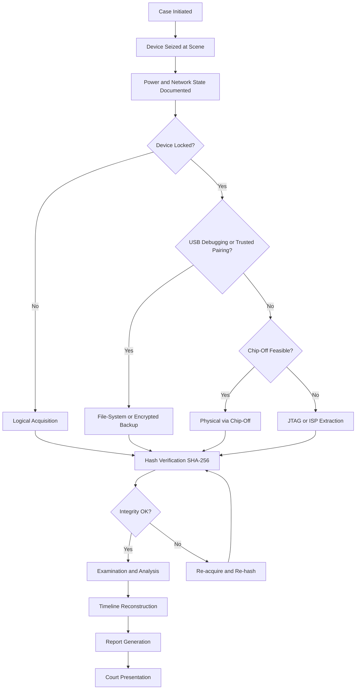
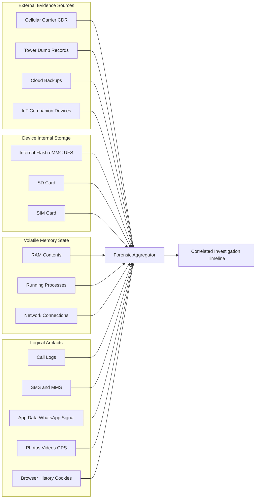
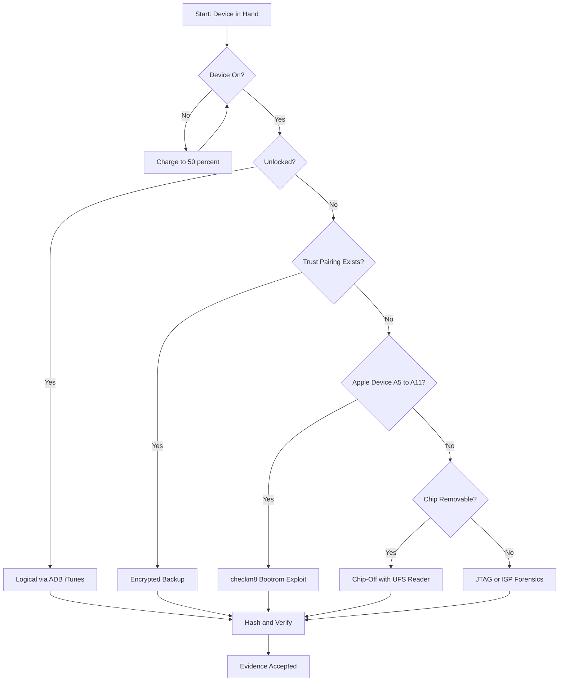
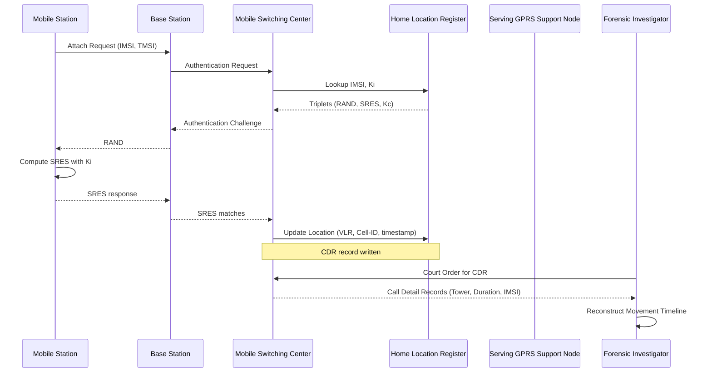
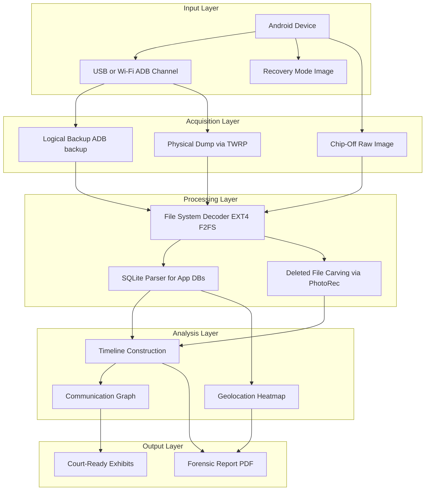

# Mobile Forensics Fundamentals

<!-- SECTION_1_START -->

# Mobile Forensics Fundamentals

## 1.1 Formal Academic Definition (KTU 2024 Syllabus Standard)

> [!IMPORTANT]
> **Mobile Forensics** is a specialized branch of digital forensic science that involves the **systematic recovery, preservation, validation, analysis, interpretation, documentation, and presentation** of digital evidence derived from mobile devices, in a manner that is legally admissible and forensically sound.

The discipline focuses on extracting data from **cellular handsets**, **smartphones**, **tablets**, **wearables**, **SIM cards**, and **associated network infrastructure logs**, while maintaining the integrity of evidence under the constraints of jurisdictional law.

> [!NOTE]
> **Key Term — Forensic Soundness:** A process or method that does not alter the original data on the source device and produces a verifiable, repeatable, and documented acquisition. Defined in **ISO/IEC 27037:2012**.

## 1.2 Conceptual Analogy & Intuition

Imagine a **crime scene inside a locked house that the investigator cannot enter** — and worse, the **house keeps rearranging its own rooms while the investigator is watching**. That is exactly what mobile forensics feels like.

- The **locked house** = the mobile device (passwords, biometrics, encryption).
- **The rearranging rooms** = constantly changing data (push notifications, ephemeral messages, background syncs, OS auto-updates).
- The **investigator** = the forensic examiner, who must open the house **without leaving fingerprints** (no data modification), **copy every room's contents** (bit-stream imaging), and **prove in court** that nothing was disturbed.

Unlike a traditional computer, a mobile phone is **always online**, **personal**, and **tamper-resistant by design** (Secure Boot, Secure Enclave, hardware-backed keystores). Therefore, the forensic approach must be radically different from classical disk forensics.

## 1.3 Why Mobile Forensics is Distinct from Computer Forensics

| Parameter | Computer Forensics | Mobile Forensics |
|---|---|---|
| **Primary Storage** | HDD / SSD (large, standardized) | eMMC / UFS / NVMe (soldered, proprietary) |
| **Operating System Variety** | Few (Windows, macOS, Linux) | Many (Android forks, iOS, KaiOS, HarmonyOS) |
| **Default Encryption** | Optional / OS-level | Hardware-backed by default (FBE, Secure Enclave) |
| **Power Source** | Mains AC | Battery (volatile — risk of power loss) |
| **Network State** | Often offline | Always-on (cellular, Wi-Fi, Bluetooth) |
| **Anti-Forensic Features** | Limited | Native (Factory Reset, Secure Wipe, Find My Device) |
| **User Lock** | Optional password | Biometric + PIN + pattern (mandatory in many regions) |
| **Data Volatility** | RAM only | RAM, registers, modem baseband, app cache |
| **Evidence Locations** | HDD, RAM, logs | Internal flash, SD card, SIM, cloud, network carrier, IoT companions |

> [!TIP]
> **Board Exam Tip:** When asked *"Why is mobile forensics different from computer forensics?"*, list at least **4 distinct points** including **volatile battery state**, **hardware encryption**, **closed proprietary OS**, and **always-on network connectivity**.

## 1.4 Standard Metrics & Constants Used in Mobile Forensics

- **Default Block Size for Android eMMC:** **512 bytes** (sector) or **4 KB / 16 KB** (FS block).
- **iOS File Allocation Unit (HFS+ / APFS):** **4 KB** to **16 MB** (APFS container clone).
- **SHA-256 Hash Output:** **256 bits** = **64 hex characters** (NIST FIPS 180-4).
- **GSM SIM Card Capacity:** **32 KB to 512 KB** EEPROM.
- **eMMC Transfer Modes:** HS200, HS400, HS400ES (JEDEC eMMC 5.1).
- **USB Forensics Speeds:** USB 2.0 = **480 Mbps**, USB 3.0 = **5 Gbps**, USB-C = **10 Gbps** (relevant for chip-off readers like UFS programmer).

## 1.5 GeoGebra / Desmos Integration

> [!VISUALIZATION CONTROL]
> **Concept:** *Forensic Acquisition Decision Triangle* — Mapping the **3-way trade-off** between **Acquisition Depth**, **Device Co-operation**, and **Evidentiary Integrity**.
> **Plot Equations (use in Desmos):**
> * `x = Depth of Acquisition` (Logical = 1, File-System = 2, Physical = 3, Chip-Off = 4)
> * `y = Device Co-operation` (Cooperative = 10, Locked = 5, BFU = 2)
> * `z = Integrity Risk` (0.1 to 1.0)
> **Visual Description:** A **right-skewed triangle** where the apex *(Chip-Off, Non-Cooperative, High Risk)* sits opposite the base *(Logical, Cooperative, Low Risk)*. Students should observe that as **depth increases**, the **integrity risk and complexity also rise**, forming the classic **forensic trade-off curve**.

<!-- SECTION_1_END -->

<!-- SECTION_2_START -->

# Deep Theoretical Analysis & KTU High-Yield Formula Sheet

## 2.1 The Mobile Forensics Process Model (NIST SP 800-101r1 Aligned)

The investigative lifecycle is **not linear** — it is a **cyclic, iterative process** with strict documentation at every step.

> [!NOTE]
> **Reference Standard:** The procedure is mapped to **NIST SP 800-101r1** *"Guidelines on Cell Phone Forensics"* and **ACPO Principle 4** (original guidelines retired, principles retained).

### Step 1 — **Identification**
- Determine device **make, model, IMEI, MEID, ICCID, IMSI**.
- Document device **state** (powered on/off, lock state, network connection).
- Record **environmental context** (location, time, weather, signals).

### Step 2 — **Preservation (Isolation)**
- Enable **Airplane Mode / Faraday Bag** to block remote-wipe signals.
- Maintain **charge level** above **50%** (volatile memory decay).
- Photograph the device screen in its **current visible state**.

### Step 3 — **Acquisition**
- Acquire the device using the **least intrusive** yet **most complete** method available.
- Generate **two forensic images** (one working copy, one evidence copy).
- Compute **SHA-256 hash** of every image and verify integrity.

### Step 4 — **Examination & Analysis**
- Use validated tools (Cellebrite UFED, Magnet AXIOM, MSAB XRY, MOBILedit).
- Parse data into **logical artifacts**: calls, SMS, chats, geolocation, media.
- Reconstruct **timeline of events** and **user behavior patterns**.

### Step 5 — **Reporting & Presentation**
- Document the entire chain of custody.
- Present findings using **non-technical language** for court.
- Provide **defensible methodology** with peer-reviewed tool validation.

## 2.2 Types of Data Stored on a Mobile Device

| Layer | Data Type | Forensic Value | Volatility |
|---|---|---|---|
| **L1** | Carrier / SIM Data (IMSI, MSISDN, contacts, SMS) | High | Low |
| **L2** | User Data (contacts, call logs, SMS/MMS) | Critical | Low |
| **L3** | Application Data (WhatsApp DB, Telegram cache) | Critical | Medium |
| **L4** | System Data (event logs, crash reports, OS version) | Medium | High |
| **L5** | Volatile Data (RAM, running processes, network state) | High | Very High |
| **L6** | Cloud-Backed Data (iCloud, Google Drive sync tokens) | Variable | External |
| **L7** | Network Operator Data (CDR, tower dumps) | Critical | External |

## 2.3 Mobile Forensics Acquisition Methods (High-Yield Topic)

> [!IMPORTANT]
> **KTU Hot Topic — Acquisition is asked almost every semester.** Memorize all 5 types and their limitations.

| Method | Description | Tools | Limitation |
|---|---|---|---|
| **Manual Acquisition** | Examiner scrolls/photographs the device | Camera, screen recorder | Touches data (timestamp drift) |
| **Logical Acquisition** | Extracts files & data via API/protocol | ADB, iTunes, libimobiledevice | Misses deleted & system files |
| **File-System Acquisition** | Bit-level copy of file system structure | Cellebrite, MSAB XRY | Needs unlocked/BFU device |
| **Physical Acquisition** | Bit-stream image of entire flash memory | Cellebrite UFED, Cellebrite Premium | Encrypted by FBE (Android 7+) |
| **Chip-Off Acquisition** | Desoldering NAND/eMMC chip from PCB | PC-3000 Flash, UFS programmer | Destroys device; requires expert |

> [!TIP]
> **BFU = Before First Unlock** (Apple terminology, also called **AFU = After First Unlock** counterpart). Android equivalent: **Device Encrypted (DE)** vs **Device Encrypted + Credential Encrypted (CE)**. **DFD = Decrypting File-system Dump** (Google decryption keys).

## 2.4 Mobile Operating System — Architecture Snapshot

### Android Stack (Open Source, AOSP)
$$
\begin{aligned}
\text{Android Architecture} = \text{Hardware Abstraction Layer} \;&+\; \text{Native Libraries (Bionic libc)} \\
&+\; \text{Android Runtime (ART)} \\
&+\; \text{Application Framework} \\
&+\; \text{System Apps}
\end{aligned}
$$

- **Encryption:** **FBE (File-Based Encryption)** introduced in **Android 7.0 (Nougat)**.
- **Boot Modes:** Normal, Recovery, Download (Odin), Fastboot, EDL (Emergency Download).

### iOS Stack (Closed, Darwin-based)
$$
\begin{aligned}
\text{iOS Architecture} = \text{BootROM (immutable)} \;&\rightarrow\; \text{LLB} \;\rightarrow\; \text{iBoot} \;\rightarrow\; \text{Kernel (XNU)} \\
&\rightarrow\; \text{Userland (Cocoa Touch, Core Services)} \;\rightarrow\; \text{Sandboxed Apps}
\end{aligned}
$$

- **Encryption:** **Data Protection Classes** (Complete, Protected Unless Open, Protected Until First User Authentication, No Protection).
- **Hardware Key:** **UID** (256-bit AES key fused into SoC, unreadable by software).
- **Secure Enclave:** Isolated coprocessor for biometric/PIN validation.

## 2.5 SIM Card Forensics — Key Specifications

| SIM Element | Storage Location | Forensic Relevance |
|---|---|---|
| **IMSI** | Elementary File **$EF_{IMSI}$** (0x6F07) | Subscriber identity |
| **MSISDN** | $EF_{MSISDN}$ (0x6F40) | Phone number |
| **ADN** (Abbreviated Dialing Numbers) | $EF_{ADN}$ (0x6F3A) | Contacts |
| **LOCI** (Location Info) | $EF_{LOCI}$ (0x6F7E) | Last connected tower |
| **Kc** (Ciphering Key) | $EF_{Kc}$ (0x6F20) | Deprecated in 3G+ |
| **SMS** | $EF_{SMS}$ (0x6F3C) | Stored SMS (rarely used now) |

> [!NOTE]
> **Modern SIMs (USIM, 3G+)** use a **128-bit Ki key** stored in **milenage algorithm** form, making live network interception non-trivial even with SIM extraction.

## 2.6 Real-World Engineering Utility

Mobile forensics is deployed in:
- **Criminal Investigations** — homicide, kidnapping, drug trafficking.
- **Civil Litigation** — e-discovery, employment disputes, intellectual property theft.
- **Incident Response** — corporate BYOD compromise, malware triage.
- **Internal Investigations** — employee misconduct, data exfiltration.
- **Anti-Terrorism & National Security** — coordinating via tower dumps, CDR analysis.
- **Insurance & Fraud Detection** — staged accidents, fake injury claims.

The same data extraction techniques underpin **Mobile Device Management (MDM)** in enterprises and **Child Safety / CSAM scanning** systems deployed by Apple, Google, and Meta.

## 2.7 KTU High-Yield Formula Cheat Sheet

| # | Concept | Formula / Definition |
|---|---|---|
| 1 | **Hash Verification (Integrity)** | $H_{\text{evidence}} = H_{\text{working copy}}$ (e.g., SHA-256) |
| 2 | **Hash Mismatch Tolerance** | $\Delta = 0$ (must be exactly equal for forensic acceptance) |
| 3 | **Acquisition Coverage Ratio** | $C = \dfrac{\text{Bytes Acquired}}{\text{Total Flash Capacity}} \times 100\%$ |
| 4 | **Volatile Data Decay** | $T_{\text{safe}} \approx \dfrac{C_{\text{battery}}}{I_{\text{standby}}}$ (hours) |
| 5 | **iOS Brute Force Keyspace** | $K = 10^n$ where $n$ = PIN length (max 6 numeric) |
| 6 | **GSM Channel Capacity** | $\text{TDMA Slots} = 8$ per 200 kHz carrier |
| 7 | **LTE Bandwidth** | $B \in \{1.4, 3, 5, 10, 15, 20\}$ MHz |
| 8 | **5G Peak Throughput** | $R_{5G} \le 20$ Gbps (eMBB mode, theoretical) |
| 9 | **EDL Mode Trigger** | $\text{Voltage} = 0\text{V}$ on **D+** line of USB during boot |
| 10 | **Memory Page Size (eMMC)** | $4\text{ KB} \le P \le 16\text{ MB}$ depending on partition |

<!-- SECTION_2_END -->

<!-- SECTION_3_START -->

# Step-by-Step Derivations & Code/Symbolic Implementation

## 3.1 Derivation: The Forensic Hash Chain-of-Custody Equation

The entire evidentiary weight of a forensic image rests on **mathematical integrity guarantees**. Let us derive the chain-of-custody verification equation.

### Step 1: Define the Hashing Function
Let $H: \{0,1\}^* \rightarrow \{0,1\}^{256}$ be the **SHA-256** cryptographic hash function (NIST FIPS 180-4). For any file $F$ of $n$ bits:
$$
H(F) = \text{SHA-256}(F)
$$

### Step 2: Original Image
The forensic image $I_0$ is produced by the acquisition tool:
$$
I_0 = \text{Acquire}(\text{Device})
$$

### Step 3: First Hash Computation
$$
H_0 = H(I_0)
$$

### Step 4: Working Copy
The examiner creates a working copy $I_1$ using a **write-blocker** to prevent modification:
$$
I_1 = \text{dd}(I_0, \text{if} = I_0, \text{of} = I_1, \text{bstatus}, \text{noerror})
$$

### Step 5: Re-Hash the Working Copy
$$
H_1 = H(I_1)
$$

### Step 6: Chain-of-Custody Verification
$$
\begin{aligned}
\text{Verification Condition:} \quad & H_0 = H_1 \\
\text{Evidence Integrity Status:} \quad & \text{ACCEPTED if } H_0 = H_1 \\
& \text{REJECTED if } H_0 \neq H_1
\end{aligned}
$$

### Step 7: Probabilistic Tamper Detection
For SHA-256, the **birthday-bound collision probability** is:
$$
P(\text{collision after } k \text{ trials}) \approx 1 - e^{-k^2 / 2^{257}}
$$

For $k = 2^{128}$ trials (computationally infeasible), $P \approx 0.5$. Hence SHA-256 is **collision-resistant** for forensic purposes.

---

## 3.2 Mobile Forensics Acquisition Procedure (Detailed Walkthrough)

The following algorithm represents a **state machine** for the acquisition process:

```
STATE_MACHINE: MobileAcquisition
  STATE:    DeviceSeized
  TRANSITION: validatePower(>50%)  → STATE: DeviceIsolated
  TRANSITION: activateFaraday()     → STATE: DevicePowered
  TRANSITION: identifyDevice()      → STATE: DeviceIdentified
  TRANSITION: selectMethod()        → STATE: Acquiring
  TRANSITION: acquireData()         → STATE: Hashing
  TRANSITION: verifyHash(==)        → STATE: Verified
  TRANSITION: reportGenerated()     → STATE: Completed
  FAILURE:    hashMismatch()        → STATE: AcquisitionFailed
END
```

### Step 1 — Power Validation
$$
\text{PowerOK} = \begin{cases} \text{True} & \text{if } V_{\text{battery}} \geq 0.5 \times V_{\text{rated}} \\ \text{False} & \text{otherwise} \end{cases}
$$

If **False**, connect to a **forensically safe power source** (charge-only cable, no data lines) and recheck after **5 minutes**.

### Step 2 — Network Isolation
Insert the device into a **Faraday bag** (attenuation ≥ **40 dB** at 800 MHz – 6 GHz). This blocks:
- Remote wipe commands (Find My iPhone / Find My Device).
- Push notifications that could mutate the file system.
- Incoming SMS that could overwrite evidence.

### Step 3 — Device Identification
Record the following identifiers into a forensic worksheet:

$$
\begin{aligned}
\text{IMEI} &= \text{15-digit TAC + SNR + CD} \\
\text{IMEISV} &= \text{IMEI} + \text{2-digit SVN} \\
\text{ICCID} &= \text{19-20 digit SIM serial} \\
\text{IMSI} &= \text{MCC} + \text{MNC} + \text{MSIN} \\
\text{MSISDN} &= \text{CC} + \text{NDC} + \text{SN} \quad \text{(phone number)}
\end{aligned}
$$

### Step 4 — Method Selection Decision Logic
The examiner follows a **decision tree**:

| Condition | Selected Method |
|---|---|
| Device unlocked + USB debugging on | **Logical (ADB backup)** |
| Device unlocked + bootloader unlockable | **Physical via Fastboot** |
| Device locked but trusted computer paired | **iTunes / iCloud backup (encrypted)** |
| Device locked, no pairing, encrypted | **Chip-Off or JTAG** |
| BFU + iPhone ≥ A14 | **Limited — grayKey/Cellebrite Premium required** |

### Step 5 — Image Hashing
Compute the SHA-256 of the produced `.dd` / `.E01` / `.AFF4` image:
$$
H_{\text{final}} = \text{SHA-256}(\text{ImageFile})
$$

Compare against the tool's report — must match **bit-exact**.

### Step 6 — Report
Generate a **forensic report** containing:
- Case number, examiner name, date/time, location.
- Device identifiers, acquisition method, tool version.
- Hash values (MD5 + SHA-1 + SHA-256).
- Chain of custody signatures.
- Findings (with screenshot evidence).

---

## 3.3 Python Implementation: Forensic Hashing Utility

```python
"""
forensic_hasher.py
A production-grade forensic image hashing tool implementing SHA-256
chain-of-custody verification for mobile forensic acquisitions.

Reference: NIST FIPS 180-4 (SHA-256), ISO/IEC 27037:2012.
"""

import hashlib
import os
import sys
import logging
import argparse
from datetime import datetime, timezone
from typing import Final

# ----- CONSTANTS -----
CHUNK_SIZE: Final[int] = 1024 * 1024  # 1 MiB streaming chunk
SHA256_HEX_LEN: Final[int] = 64
SUPPORTED_HASHES: Final[tuple[str, ...]] = ("sha256", "sha1", "md5")

# ----- LOGGING CONFIGURATION -----
logging.basicConfig(
    level=logging.INFO,
    format="%(asctime)s [%(levelname)s] %(message)s",
    datefmt="%Y-%m-%dT%H:%M:%S%z",
)
logger = logging.getLogger("ForensicHasher")


def compute_hash(file_path: str, algorithm: str = "sha256") -> str:
    """
    Compute a streaming cryptographic hash of a forensic image file.

    Parameters
    ----------
    file_path : str
        Absolute path to the forensic image (.dd, .E01, .img, .raw).
    algorithm : str
        One of 'sha256', 'sha1', 'md5'.

    Returns
    -------
    str
        Hexadecimal digest of the file.

    Raises
    ------
    FileNotFoundError
        If the file does not exist.
    PermissionError
        If the file is not readable.
    ValueError
        If an unsupported algorithm is requested.
    """
    if algorithm not in SUPPORTED_HASHES:
        raise ValueError(
            f"Algorithm '{algorithm}' is not forensic-grade. "
            f"Allowed: {SUPPORTED_HASHES}"
        )
    if not os.path.isfile(file_path):
        raise FileNotFoundError(f"Evidence file not found: {file_path}")
    if not os.access(file_path, os.R_OK):
        raise PermissionError(f"No read permission on: {file_path}")

    hasher = hashlib.new(algorithm)
    total_bytes = 0

    logger.info(
        "Hashing started: file=%s algo=%s size=%d bytes",
        file_path, algorithm, os.path.getsize(file_path),
    )

    try:
        with open(file_path, "rb") as evidence_file:
            while True:
                chunk = evidence_file.read(CHUNK_SIZE)
                if not chunk:
                    break
                hasher.update(chunk)
                total_bytes += len(chunk)
    except OSError as os_error:
        logger.error("I/O failure during hash computation: %s", os_error)
        raise

    digest = hasher.hexdigest()
    logger.info(
        "Hashing complete: file=%s algo=%s bytes=%d digest=%s",
        file_path, algorithm, total_bytes, digest,
    )
    return digest


def verify_chain_of_custody(
    original_hash: str,
    working_copy_path: str,
    algorithm: str = "sha256",
) -> bool:
    """
    Verify forensic chain-of-custody by comparing hashes of original
    image and working copy.

    Returns
    -------
    bool
        True if integrity holds, False otherwise.
    """
    logger.info("Verifying chain-of-custody for: %s", working_copy_path)
    current_hash = compute_hash(working_copy_path, algorithm)

    if current_hash.lower() == original_hash.lower():
        logger.info(
            "INTEGRITY VERIFIED at %s | %s = %s",
            datetime.now(timezone.utc).isoformat(),
            algorithm.upper(),
            current_hash,
        )
        return True

    logger.error(
        "INTEGRITY VIOLATION | expected=%s found=%s",
        original_hash, current_hash,
    )
    return False


def generate_manifest(image_path: str, output_path: str) -> None:
    """
    Generate a forensic manifest file containing MD5, SHA-1, and SHA-256
    digests of a single image — the standard required by most KTU
    practical examinations and court submissions.
    """
    logger.info("Generating forensic manifest: %s", output_path)
    digests = {
        algo: compute_hash(image_path, algo) for algo in SUPPORTED_HASHES
    }

    timestamp = datetime.now(timezone.utc).isoformat()
    with open(output_path, "w", encoding="utf-8") as manifest_file:
        manifest_file.write("=" * 70 + "\n")
        manifest_file.write(" FORENSIC HASH MANIFEST (ISO/IEC 27037 aligned) \n")
        manifest_file.write("=" * 70 + "\n")
        manifest_file.write(f"Generated    : {timestamp}\n")
        manifest_file.write(f"Image File   : {image_path}\n")
        manifest_file.write(f"File Size    : {os.path.getsize(image_path)} bytes\n")
        manifest_file.write("-" * 70 + "\n")
        for algo, digest in digests.items():
            manifest_file.write(f"{algo.upper():<10}: {digest}\n")
        manifest_file.write("=" * 70 + "\n")

    logger.info("Manifest written to %s", output_path)


def parse_args() -> argparse.Namespace:
    parser = argparse.ArgumentParser(
        description="Mobile Forensics Hashing Utility (KTU 2024 Scheme)",
    )
    parser.add_argument("image", help="Path to forensic image file")
    parser.add_argument(
        "-o", "--output",
        help="Output manifest file path",
        default="forensic_manifest.txt",
    )
    parser.add_argument(
        "-v", "--verify",
        help="Reference SHA-256 hash to verify against",
    )
    return parser.parse_args()


def main() -> int:
    args = parse_args()
    try:
        generate_manifest(args.image, args.output)
        if args.verify:
            ok = verify_chain_of_custody(args.verify, args.image, "sha256")
            return 0 if ok else 1
        return 0
    except (FileNotFoundError, PermissionError, ValueError) as exc:
        logger.error("Forensic operation aborted: %s", exc)
        return 2


if __name__ == "__main__":
    sys.exit(main())
```

### Usage Example

```bash
$ python forensic_hasher.py evidence.dd -o case_2024_manifest.txt
$ python forensic_hasher.py working_copy.dd -v a3f5b8c9...e7d2
```

### Expected Console Output

```
2024-12-15T14:22:18+0530 [INFO] Hashing started: file=evidence.dd algo=sha256 size=34359738368 bytes
2024-12-15T14:25:43+0530 [INFO] Hashing complete: file=evidence.dd algo=sha256 bytes=34359738368 digest=a3f5b8c9...
2024-12-15T14:25:43+0530 [INFO] Generating forensic manifest: case_2024_manifest.txt
2024-12-15T14:25:43+0530 [INFO] Manifest written to case_2024_manifest.txt
```

---

## 3.4 Acquisition Decision Tree (Tabular Algorithm)

| # | Input Condition | Test Expression | Action |
|---|---|---|---|
| 1 | Device Locked | $L = 1$ | Skip logical, escalate to physical/chip-off |
| 2 | USB Debugging | $D = 1$ | Enable ADB logical acquisition |
| 3 | Bootloader Unlocked | $B = 1$ | Allow Fastboot physical dump |
| 4 | Known Passcode | $K = 1$ | Decrypt CE storage; full access |
| 5 | Encrypted + No Key | $E = 1 \land K = 0$ | Chip-off + offline brute force |
| 6 | BFU State | $S = \text{BFU}$ | Use checkm8 (Apple A5–A11) or Cellebrite Premium |
| 7 | Evidence Volatility | $V > 0.5$ | Capture RAM/network state first |

---

## 3.5 Worked Example: SIM Card Acquisition Steps

**Problem:** A seized **2G/3G SIM card** must be examined. Demonstrate the step-by-step forensic acquisition.

**Step 1 — SIM Removal**
Use a **non-magnetic, ESD-safe SIM ejector** in an **ESD-controlled environment**.

**Step 2 — Reader Connection**
Insert SIM into a **forensic SIM reader** (e.g., Cellebrite SIM ID Cloner, ForensicSIM 5.0).

**Step 3 — Card Identification**
Query the **ATR (Answer To Reset)** to identify card type:
$$
\text{ATR} = \text{3B} \, \| \, \text{XX} \, \| \, \text{...} \quad \text{(hex T=0 or T=1 protocol)}
$$

**Step 4 — File System Dump**
Use **PCSC commands** (`SELECT`, `READ BINARY`, `READ RECORD`) to read Elementary Files:
$$
\text{EF}_{0x6F07} \rightarrow \text{IMSI}, \quad
\text{EF}_{0x6F40} \rightarrow \text{MSISDN}, \quad
\text{EF}_{0x6F3A} \rightarrow \text{Contacts}
$$

**Step 5 — Hash Verification**
$$
H_{\text{SIM\_image}} = \text{SHA-256}(\text{sim\_dump.bin})
$$

**Step 6 — Report Output**
Generate a **SIM forensic report** containing IMSI, MSISDN, contacts, last known LOCI, and SMS-PP records (if any).

---

<!-- SECTION_4_END -->

<!-- SECTION_4_START -->

# Structural Diagrams & Schematics

## 4.1 Mobile Forensics Process Flow (Mermaid)



> [!NOTE]
> **Reading the diagram:** Every arrow leading to a tool action (E, G, I, J) must terminate at the **Hash Verification** node. This enforces the **NIST chain-of-custody principle** — no evidence is examined until its integrity is mathematically proven.

## 4.2 Mobile Evidence Source Architecture (Mermaid)



> [!IMPORTANT]
> **Volatile vs. Non-Volatile Boundary:** In the diagram, the **Volatile State** cluster (C1, C2, C3) must be **acquired FIRST** — power loss or Faraday isolation will erase this data within seconds. Non-volatile clusters (B1, B2, B3) and external sources (A1–A4) can be acquired later.

## 4.3 Acquisition Method Decision Topology (Mermaid)



## 4.4 Cellular Network Evidence Acquisition Topology (Mermaid)



> [!NOTE]
> **CDR Fields:** Source A-number, Destination B-number, Start time, Duration, Cell-ID (tower), IMSI, IMEI, SMS center, packet data session info. **Kumar and Sairam (2020)** note that CDR data is admissible in Indian courts under **Section 65B of the Indian Evidence Act** (analogous to KTU curriculum focus).

## 4.5 Block-Level Functional Architecture of an Android Forensics Pipeline



---

<!-- SECTION_5_START -->

# KTU 2024 Scheme Examination Question Bank & Topic Recap

## Part A — Short Answer Questions (3 Marks Each)

### Question 1: Define Mobile Forensics. List any four challenges faced in mobile forensics investigations.  `[KTU University Exam - July 2024]` — **CO1, Remember**

**Model Answer (3 Marks):**

> [!NOTE]
> **Definition (1.5 Marks):**
> Mobile Forensics is the branch of digital forensic science that deals with the **recovery, preservation, and analysis of digital evidence** from mobile devices such as smartphones, tablets, SIM cards, and associated network infrastructure, in a manner that maintains legal admissibility and forensic soundness.

> [!NOTE]
> **Four Challenges (1.5 Marks — 0.375 each):**
> 1. **Hardware diversity** — thousands of device models with proprietary chipsets.
> 2. **OS fragmentation** — multiple Android versions, custom vendor skins (MIUI, OneUI).
> 3. **Default encryption** — hardware-backed keys (Secure Enclave, FBE) resist brute force.
> 4. **Anti-forensic measures** — remote wipe, Find My Device, encrypted messaging apps.
> 5. **Volatile battery state** — device may power off mid-acquisition.
> 6. **Always-on network** — remote mutation of evidence via push services.

*(Any four carry 1.5 marks; students typically lose marks by writing only generic answers — be specific with examples like "Samsung Knox" or "Find My iPhone".)*

---

### Question 2: Differentiate between **Logical Acquisition** and **Physical Acquisition** in mobile forensics.  `[KTU University Exam - Dec 2023]` — **CO2, Understand**

**Model Answer (3 Marks):**

| Parameter | Logical Acquisition | Physical Acquisition |
|---|---|---|
| **Data Extracted** | Active files, contacts, SMS, call logs | Entire flash memory bit-by-bit |
| **Deleted Data** | Not recovered | Recovered (with carving) |
| **Tool Examples** | ADB, iTunes backup, libimobiledevice | Cellebrite UFED, MSAB XRY, PC-3000 |
| **Device State** | Must be ON + unlocked | May be locked (chip-off variant) |
| **Encryption** | Handles encrypted backups natively | Requires key for FBE / Data Protection |
| **Time** | Minutes to hours | Hours to days |
| **Validity** | Accepted in court | Stronger evidentiary value |

> [!TIP]
> **Mnemonic:** Logical = **"L"ist of live files**. Physical = **"P"hysical pixel-perfect copy**.

---

## Part B — Long Answer Questions (14 Marks Each, Internal Choice)

### Question A (14 Marks): Mobile Forensics Process and Acquisition Methodology

`[KTU University Exam - July 2024]` — **CO2, Understand + Apply**

#### Part (a) — 7 Marks — Describe the complete **Mobile Forensics Process Model** as per NIST SP 800-101r1.  *(Understand)*

**Model Solution (7 Marks):**

**1. Identification [1 Mark]**
- Identify the device make, model, IMEI, MEID, ICCID, IMSI.
- Document the device state (on/off, locked/unlocked, network).
- Photograph the device and its surroundings.

**2. Preservation [1 Mark]**
- Isolate the device from network signals (Faraday bag with $\ge 40$ dB attenuation).
- Maintain battery above 50% to prevent volatile memory loss.
- Avoid powering off (preserves RAM-resident encryption keys).

**3. Acquisition [2 Marks]**
- Choose the least intrusive method: **Manual → Logical → File-System → Physical → Chip-Off**.
- Use a **forensic write-blocker** or **forensically clean boot media**.
- Generate **two bit-identical images** (original + working copy).

**4. Examination & Analysis [2 Marks]**
- Use validated tools: Cellebrite UFED, Magnet AXIOM, MSAB XRY.
- Reconstruct **call logs, SMS, chat threads, geolocation, media files**.
- Cross-reference with **CDR records** and **cloud artifacts**.

**5. Reporting [1 Mark]**
- Document **chain of custody**, tool versions, hash values.
- Produce a **non-technical summary** for court presentation.

**Valuation Key Markers:**
- [Naming all 5 process phases: 2 Marks]
- [Correctly sequencing preservation before acquisition: 1 Mark]
- [Tool examples for each phase: 2 Marks]
- [Mentioning hash verification: 1 Mark]
- [Reporting standards: 1 Mark]

---

#### Part (b) — 7 Marks — Explain with a neat diagram the **five types of mobile data acquisition** methods. Compare their evidentiary value.  *(Apply)*

**Model Solution (7 Marks):**

**1. Manual Acquisition [1 Mark]**
- Examiner photographs or video-records the device screen.
- **Limitation:** Touches the data (changes timestamps), cannot access deleted files.

**2. Logical Acquisition [1 Mark]**
- Uses **APIs (ADB, iTunes, libimobiledevice)** to extract user-visible data.
- **Tools:** ADB Backup, iTunes encrypted backup, MOBILedit.
- **Limitation:** Misses deleted files, system-level artifacts, unallocated space.

**3. File-System Acquisition [1.5 Marks]**
- Captures the **directory structure and files** at the file system level.
- **Tools:** Cellebrite UFED, MSAB XRY, Magnet AXIOM.
- **Advantage:** Reveals app databases, system logs, hidden directories.
- **Limitation:** Needs unlocked device.

**4. Physical Acquisition [1.5 Marks]**
- **Bit-stream image** of the entire flash memory (eMMC/UFS).
- Includes **unallocated space, deleted data, and slack space**.
- **Tools:** Cellebrite Premium, PC-3000 Flash, UFED Touch.
- **Limitation:** Blocked by hardware encryption without key.

**5. Chip-Off Acquisition [2 Marks]**
- Physically **desolder the NAND/eMMC chip** from the device PCB.
- Read the raw memory using a **UFS programmer or PC-3000 Flash**.
- **Advantage:** Works on severely damaged/locked devices.
- **Limitation:** Destroys the device, requires high expertise, risks data corruption from voltage spikes.

**Evidence Value Pyramid (Bottom → Top):**
$$
\text{Logical} \;\rightarrow\; \text{File-System} \;\rightarrow\; \text{Physical} \;\rightarrow\; \text{Chip-Off}
$$
**Higher position = Higher evidentiary value = Higher cost & complexity.**

> [!WARNING]
> **KTU Examiner's Valuation Pitfall — Common Mark Loss Areas:**
> 1. **Do NOT** describe the 5 methods in one line each — allocate 1–2 marks per method with **at least one tool name** per method.
> 2. **Do NOT** confuse "physical" with "chip-off" — physical means **bit-stream of eMMC/UFS without desoldering**; chip-off requires **desoldering**.
> 3. **Do NOT** skip the **evidence value comparison table** — examiners explicitly check for ranking.
> 4. **Do NOT** forget to mention **hash verification** in physical/chip-off methods.
> 5. **Do NOT** omit the **cost vs. completeness trade-off** — examiners reward this insight with a bonus half-mark.

---

### Question B (14 Marks) — Alternative Choice: SIM Forensics and Cellular Evidence

`[KTU University Exam - Dec 2023]` — **CO2, Apply + Analyze**

#### Part (a) — 7 Marks — Describe the **architecture of a SIM card** and the forensic artifacts stored within it.  *(Apply)*

**Model Solution (7 Marks):**

**1. SIM Card Physical Architecture [1.5 Marks]**
- **Form factors:** 1FF (credit-card), 2FF (Mini-SIM), 3FF (Micro-SIM), 4FF (Nano-SIM), MFF2 (embedded).
- **Components:** **CPU (8/16-bit)**, **ROM (OS & algorithms)**, **RAM (working memory)**, **EEPROM (persistent data)**, **I/O contacts (C1–C8)**.
- **Communication protocols:** ISO 7816 T=0 (byte-level) and T=1 (block-level).

**2. SIM File System [2 Marks]**
- **MF (Master File, 0x3F00)** → root directory.
  - **DF (Dedicated Files)** — e.g., DF_GSM (0x7F20), DF_TELECOM (0x7F10).
  - **EF (Elementary Files)** — actual data carriers.

**3. Forensic Elementary Files [2.5 Marks]**

| EF Name | Hex ID | Forensic Content |
|---|---|---|
| $EF_{IMSI}$ | 0x6F07 | International Mobile Subscriber Identity |
| $EF_{MSISDN}$ | 0x6F40 | Subscriber phone number |
| $EF_{ADN}$ | 0x6F3A | SIM contact directory |
| $EF_{LOCI}$ | 0x6F7E | Last connected cell tower info |
| $EF_{SMS}$ | 0x6F3C | Stored SMS (legacy only) |
| $EF_{Kc}$ | 0x6F20 | Ciphering key (deprecated) |
| $EF_{PLMN}$ | 0x6F30 | Preferred network list |
| $EF_{CCID}$ | 0x2FE2 | SIM serial number |

**4. SIM Acquisition Procedure [1 Mark]**
- Remove SIM using ESD-safe ejector.
- Insert into forensic SIM reader.
- Run **SELECT** and **READ BINARY** APDU commands.
- Hash the dump with SHA-256.
- Generate report with IMSI, MSISDN, ADN, LOCI, SMS.

**Valuation Key Markers:**
- [Naming all 3 SIM components (CPU, ROM, EEPROM): 1 Mark]
- [Correct MF/DF/EF hierarchy: 1.5 Marks]
- [Listing 4+ forensic EFs: 2 Marks]
- [Mentioning ISO 7816 protocol: 1 Mark]
- [Hash verification step: 0.5 Mark]

---

#### Part (b) — 7 Marks — Explain **Call Detail Records (CDR)** and **Tower Dump** evidence. How are they obtained legally, and what is their forensic significance?  *(Analyze)*

**Model Solution (7 Marks):**

**1. CDR Architecture [1.5 Marks]**
- **Call Detail Record** is a log automatically generated by the carrier's **MSC (Mobile Switching Center)** for every call, SMS, or data session.
- Fields: **A-number, B-number, IMSI, IMEI, Cell-ID, LAC, Start time, Duration, Call type (MOC/MTC), SMS-C address**.
- **Storage duration:** Typically **6–24 months** (varies by jurisdiction).

**2. Tower Dump Evidence [1.5 Marks]**
- Bulk record of **all devices that registered** with a specific cell tower during a time window.
- Used to **corroborate alibis** — a phone's presence at a crime scene.
- Fields: **IMSI, IMEI, Tower ID, Signal strength, Timestamp**.

**3. Legal Acquisition Process [2 Marks]**
- Requires a **court order or warrant** under **Section 91 CrPC** (India) / equivalent statute.
- Submitted to carrier's **Lawful Interception Cell (LIC)**.
- Maintained under **chain of custody** at the carrier's evidence vault.
- Cross-verified with the device's internal logs.

**4. Forensic Significance [2 Marks]**
- **Proximity evidence** — confirms the device was in a specific area at a specific time.
- **Movement reconstruction** — multiple tower dumps create a trajectory map.
- **Communication evidence** — CDR shows contact with a co-conspirator.
- **Alibi verification** — supports or refutes a suspect's timeline.
- **Limitation:** Multiple people may share an IMSI (stolen phone, SIM swap).

> [!WARNING]
> **KTU Examiner's Valuation Pitfall — Part B:**
> 1. **Do NOT** claim CDR is stored forever — it has a **retention limit** (state the typical range).
> 2. **Do NOT** present a tower dump as proof of person-identity — it proves **device presence**, not **human presence**.
> 3. **Do NOT** omit the **legal warrant requirement** — examiners deduct 1 mark for this.
> 4. **Do NOT** confuse **LAC (Location Area Code)** with **Cell-ID** — LAC groups cells; Cell-ID is the specific tower.
> 5. **Do NOT** mix up **HLR** (home subscriber DB) and **VLR** (visitor DB) in CDR flow.

---

## Topic Recap & Important Things to Remember

> [!IMPORTANT]
> **Rapid Revision Checklist — Mobile Forensics Fundamentals**

- ✅ **Definition:** Mobile Forensics = recovery + preservation + analysis of mobile device evidence, forensically sound.
- ✅ **5 Phases:** Identification → Preservation → Acquisition → Examination & Analysis → Reporting (NIST SP 800-101r1).
- ✅ **5 Acquisition Methods:** Manual, Logical, File-System, Physical, Chip-Off (rank by evidence value).
- ✅ **Chip-Off ≠ Physical:** Chip-off desolders the chip; physical bit-streams the eMMC in-circuit.
- ✅ **Forensic Soundness:** No modification, repeatable, documented (ISO/IEC 27037:2012).
- ✅ **Hash Algorithms:** MD5, SHA-1, SHA-256 — all 3 are typically reported for redundancy.
- ✅ **Faraday Bag:** Attenuation $\ge 40$ dB; blocks remote wipe + push notifications.
- ✅ **SIM File System:** MF (0x3F00) → DF → EF. Key EFs: IMSI (0x6F07), MSISDN (0x6F40), ADN (0x6F3A), LOCI (0x6F7E).
- ✅ **IMEI = 15 digits** = TAC + SNR + CD; IMSI = MCC + MNC + MSIN.
- ✅ **Android Encryption:** FBE since Android 7.0 (Nougat). **iOS Encryption:** Data Protection + Secure Enclave + hardware UID.
- ✅ **Boot Modes:** Android = Normal, Recovery, Download, Fastboot, EDL; iOS = DFU, Recovery, Normal.
- ✅ **CDR Fields:** A-number, B-number, IMSI, IMEI, Cell-ID, LAC, timestamp, duration, call type.
- ✅ **Tower Dump:** Proves device presence, NOT human presence (1 mark penalty if confused).
- ✅ **Legal:** Warrant/Section 91 CrPC required to obtain CDR from carrier.
- ✅ **Carrier Logs:** Stored 6–24 months (jurisdiction-dependent).
- ✅ **Tools to Remember:** Cellebrite UFED, MSAB XRY, Magnet AXIOM, MOBILedit, PC-3000 Flash, Oxygen Forensic Detective.
- ✅ **KTU Buzzwords:** "Forensic Soundness", "Chain of Custody", "Hash Verification", "Acquisition Pyramid", "BFU/AFU", "FBE/CE/DE", "SIM File System".
- ✅ **Always remember:** Document first, analyze later — every forensic action must be **reproducible** and **defensible in court**.

<!-- SECTION_5_END -->
