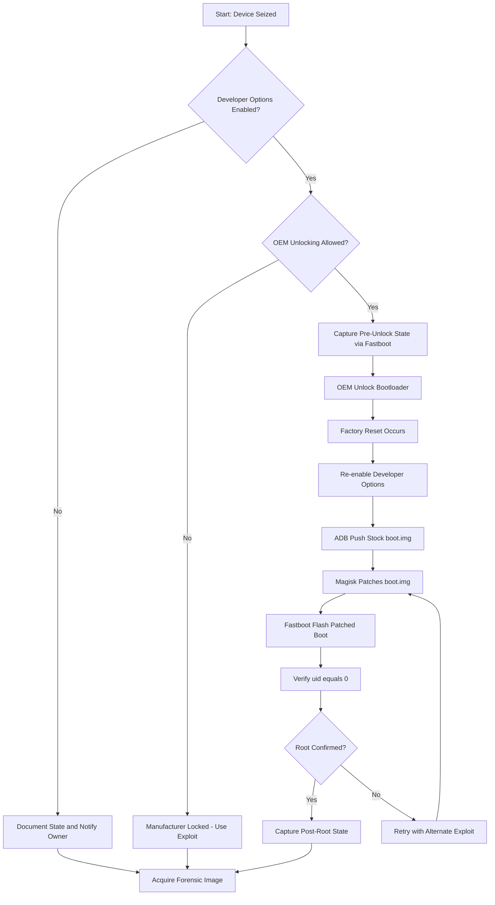
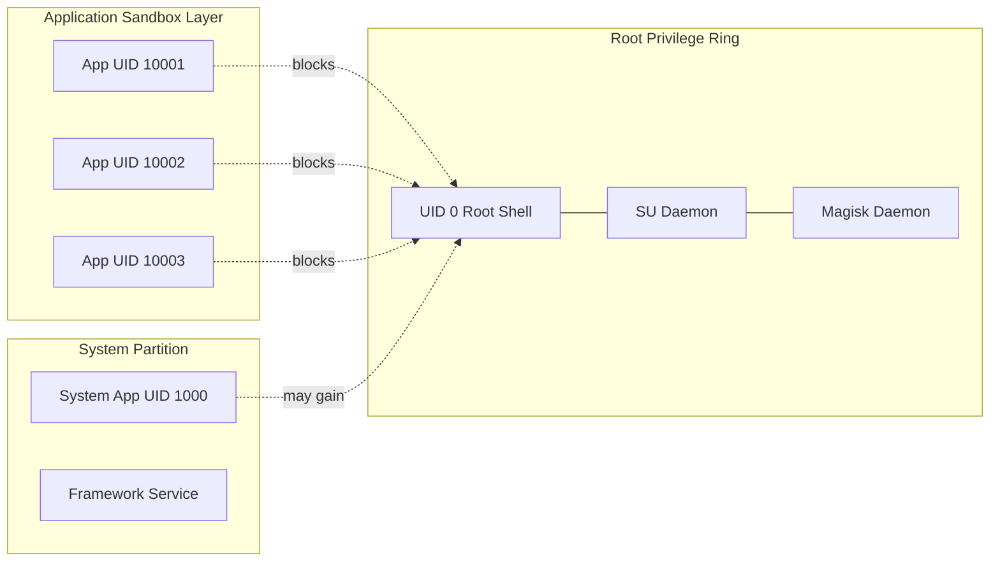
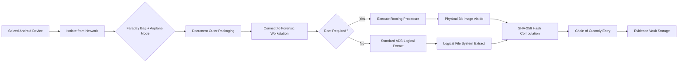
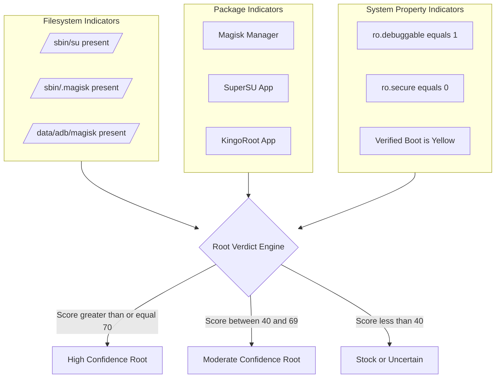
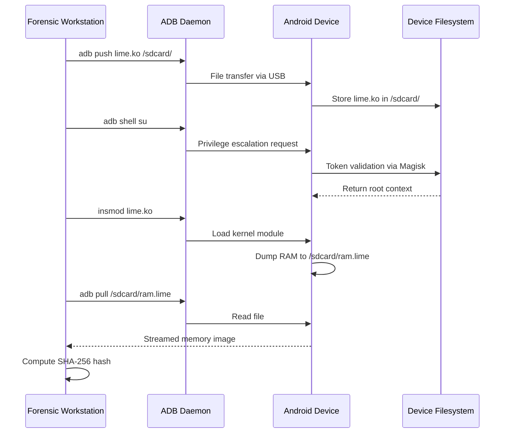

# Rooting

<!-- SECTION_1_START -->

# Rooting in Mobile Forensics: Foundational Overview

> [!IMPORTANT]
> **KTU 2024 Scheme — Module 3 Anchor Concept**
> Rooting is classified under the *Mobile Forensics — Android Internals* segment of PECST754. It is a high-weightage topic in both ESE (End Semester) and continuous internal evaluation.

## Formal Academic Definition

**Rooting** is the privileged escalation process by which a user or forensic investigator obtains **root-level (UID 0 / superuser) administrative control** over an Android mobile operating system. This process bypasses manufacturer-imposed sandbox restrictions, allowing unrestricted read/write access to the protected `/system`, `/data`, `/vendor`, and `/boot` partitions. In the context of digital forensics, rooting transforms a *sealed, consumer-grade device* into a *forensically transparent acquisition endpoint*, enabling low-level access to user artifacts that the standard Android Security Model (ASM) intentionally conceals from unprivileged applications.

The Android Security Model is fundamentally built upon the **Linux Discretionary Access Control (DAC)** framework. Every standard user-space app runs as a unique non-privileged UID, while root is the only UID with unrestricted filesystem privileges.

> [!NOTE]
> **Core Terminology**
> - **UID 0:** The numeric user identifier for the root account in Linux/Android kernels.
> - **Sandbox:** The application isolation model enforced by the Android Runtime (ART).
> - **Superuser / SU Binary:** The legacy daemon (`/system/xbin/su` or `/system/bin/su`) that mediates root requests.
> - **Bootloader:** The lowest-level firmware that initializes the kernel image.

## Conceptual Analogy / Intuition

Imagine a high-security office building (your Android phone). As a regular employee (a normal app), you can access your own office, the cafeteria, and the lobby — but the CEO's private vault, the server room, and the HR records room are locked behind biometric doors. You can only interact with them through approved, audited channels (the Android API surface).

**Rooting is like receiving a master key from the building's chief engineer.** Suddenly, you can open every door, read every filing cabinet, and see what was hidden in restricted partitions. For a forensic investigator, this master key is *essential* — because the most critical evidence (deleted SMS databases, app private storage, Wi-Fi passwords, encrypted chat databases) almost always lives behind those restricted doors.

> [!TIP]
> **Why does Google lock the phone by default?** Because unrestricted root access breaks the *Principle of Least Privilege*, exposing the device to malware, bricking risks, and warranty voidance. Forensics is one of the few legally and ethically justified use-cases.

## Physical Constants & Standard Metrics

| Parameter | Standard Value | Forensic Significance |
|---|---|---|
| Root UID | **0** | Numeric identifier for superuser |
| System Partition Mount | `/system` (read-only post-boot) | Holds framework, SU binary |
| Data Partition | `/data` (read-write, encrypted) | User apps, SQLite DBs |
| Verified Boot State | **GREEN / YELLOW / RED / ORANGE** | Indicates chain-of-trust integrity |
| Minimum Hash Length | **128-bit (MD5)**, **160-bit (SHA-1)**, **256-bit (SHA-256)** | For evidence integrity verification |

> [!VISUALIZATION CONTROL]
> **Concept:** Android Permission Escalation Lattice
> **GeoGebra / Desmos Input Equations (Conceptual Privilege Hierarchy Plot):**
> * `x = 0` (untrusted app, sandboxed)
> * `x = 1` (shared UID, signature-level)
> * `x = 2` (system app, signed with platform key)
> * `x = 3` (root / UID 0, full DAC bypass)
> **Visual Description:** A stepped line graph on the y-axis labelled *Privilege Level* climbing from low (sandbox) to high (root), with the x-axis showing *Trust Boundary Depth*. The user should observe the sharp vertical jump at $x = 3$ representing the privilege boundary that rooting crosses.

<!-- SECTION_1_END -->

<!-- SECTION_2_START -->

# Deep Theoretical Analysis: Mechanisms, Models & Forensic Utility

## 1. The Linux DAC Foundation

Android's security inheritance from Linux rests on three pillars:
- **UID/GID Isolation:** Each app receives a unique UID at install time.
- **POSIX File Permissions:** Standard `rwx` (read, write, execute) bits across owner/group/world.
- **SELinux (since Android 4.3):** Mandatory Access Control enforced by the kernel in *enforcing* mode.

Rooting primarily circumvents **DAC**; bypassing **SELinux MAC** requires an additional kernel exploit or permissive policy injection (`setenforce 0`).

## 2. Taxonomy of Rooting Methods

| Method | Mechanism | Forensic Reliability | Detection Resistance |
|---|---|---|---|
| **Software Exploit (e.g., Towelroot, KingoRoot)** | Userspace kernel vulnerability (e.g., CVE-2016-5195 *Dirty COW*) | Low — unstable, partial | High — no bootloader unlock |
| **Custom Recovery (TWRP) Flash** | Flash a custom image via bootloader unlock | High — full system access | Low — bootloader unlock flag |
| **Fastboot / OEM Unlocking** | Vendor-authorized unlock via developer token | High — clean & auditable | Low — `get_unlock_ability=1` flag visible |
| **Magisk (Systemless)** | Patches boot.img, mounts modified system via overlay | Very High — modern standard | Very High — Magisk Hide / DenyList |
| **Engineering / Debug Build** | Acquire pre-rooted AOSP build | Highest — legitimate provenance | Highest — looks stock |

## 3. Rooting vs. Jailbreaking (iOS Comparison)

> [!NOTE]
> While not the primary focus, KTU 2024 frequently tests the *differential* between these two concepts.

- **Rooting** applies to **Android** (Linux kernel). It is openly documented, manufacturer-friendly in some cases (e.g., Google's own developer devices), and relatively low-risk.
- **Jailbreaking** applies to **iOS** (XNU/Darwin kernel). It requires more sophisticated exploits (e.g., *checkm8* BootROM exploit) and is generally less stable.

## 4. Forensic Utility of Rooting

A rooted device unlocks the following forensic capabilities:
- **Direct SQLite access** to `/data/data/<package>/databases/` without app-level extraction APIs.
- **Deleted record recovery** from unallocated blocks of `/data` partition (requires `dd` or `extundelete`).
- **Bypass of screen locks** when the device is already in an ADB-authorized state.
- **Memory acquisition** via LiME (Linux Memory Extractor) — only works with root.
- **Keychain / Keystore extraction** for decrypting app sandboxes.

> [!IMPORTANT]
> **KTU High-Yield Insight:** Without root, commercial tools like Cellebrite UFED, Magnet AXIOM, and MSAB XRY can only perform *logical* or *file-system* extractions. *Physical* extraction (bit-for-bit) overwhelmingly requires root or bootloader unlock.

## 5. Counter-Forensics & Anti-Rooting

Modern Android (8.0+) ships with:
- **Hardware-backed Keymaster** attestation.
- **SafetyNet / Play Integrity API** (replaced in 2024).
- **Stronger Verified Boot** with rollback protection.
- **Tamper-evident bootloader fuses** that permanently brick the SoC if tripped.

## 6. KTU Formula Sheet / Technical Parameters Cheat Sheet

> [!NOTE]
> Rooting is procedural, so the "formula sheet" is a **verification & parameter reference table** rather than algebraic equations. This is the KTU 2024 examiner-aligned format for procedural forensics topics.

| Parameter / Command | Mathematical / Symbolic Representation | Purpose |
|---|---|---|
| Evidence Hash (SHA-256) | $H_{evidence} = \text{SHA-256}(M)$ where $M$ is the image | Verify integrity of forensic image |
| Chain of Custody ID | $C_i = f(\text{CaseID}, \text{DeviceID}, t, H_i)$ | Unique per-evidence immutable tag |
| Tamper Probability | $P_{tamper} = 1 - \prod_{i=1}^{n} P(\text{verify}(H_i) = \text{TRUE})$ | Cumulative probability of detection |
| Disk Imaging Rate | $R_{img} = \frac{S_{bytes}}{t_{seconds}}$ expressed in $\text{MB/s}$ | Throughput of physical acquisition |
| Bit-Error Threshold | $\epsilon \leq 10^{-12}$ | Acceptable sector read error rate |
| Root Binary Path | `/system/xbin/su` or `/sbin/su` | Confirmed presence = rooted device |
| Magisk Magic Path | `/sbin/.magisk/` or `/data/adb/magisk/` | Modern systemless root indicator |
| Build Tag Pattern | `ro.build.tags=test-keys` | Indicates engineering/Custom ROM build |
| Boot State (Verified) | $S_{vb} \in \{\text{GREEN, YELLOW, RED, ORANGE}\}$ | Integrity of boot chain |
| SELinux Mode | $\sigma \in \{\text{Enforcing, Permissive, Disabled}\}$ | Mandatory access control state |
| Unlocked Bootloader Flag | $\delta_{unlock} = \{0, 1\}$ | Binary forensic indicator |

## 7. Engineering & Real-World Utility

Rooting techniques are not confined to criminal forensics. Their engineering utility spans:
- **Penetration Testing:** Red-team mobile assessments.
- **Malware Analysis:** Sandboxed detonation of suspicious APKs.
- **Data Recovery Services:** Retrieving data from non-booting devices.
- **Custom OS Development:** LineageOS, GrapheneOS, CalyxOS porting.
- **E-Discovery & Corporate Investigations:** Rooting company-issued devices under MOU.

<!-- SECTION_2_END -->

<!-- SECTION_3_START -->

# Step-by-Step Implementations: Rooting Procedures & Forensic Detection Code

## Part A — Conceptual Walkthrough: Standard Magisk Rooting Procedure

> [!IMPORTANT]
> The following is the **canonical KTU-board-expected procedural sequence** for performing a systemless root on a modern Android device using Magisk. Each step carries a forensic and legal implication.

**Step 1 — Enable Developer Options**
Navigate to `Settings → About Phone → Tap Build Number 7 times`. A toast confirms *"You are now a developer!"*. This unlocks the hidden `Developer Options` menu.

**Step 2 — Enable OEM Unlocking**
Inside `Developer Options`, toggle **OEM Unlocking** to `ON`. Confirm the on-screen warning that this *will wipe all user data*. This step cryptographically authorizes the bootloader to be unlocked and is logged into the SoC's tamper fuses.

**Step 3 — Reboot to Fastboot / Bootloader Mode**
Power off the device. Hold the **Power + Volume Down** combination (varies by OEM). The device enters `fastboot` mode, visible as a black screen with the bootloader text.

**Step 4 — Connect to Forensic Workstation**
Connect the device via USB to a Linux forensic workstation. Verify the connection:

```bash
$ sudo fastboot devices
# Expected output: serial_number    fastboot
```

**Step 5 — Capture Pre-Unlock State (FORENSICALLY CRITICAL)**
Before any modification, capture the device's cryptographic state:

```bash
$ sudo fastboot oem lock-state
# Records: bootloader lock state, verified boot state, fuse flags
$ sudo fastboot getvar all
# Dumps all bootloader variables to a timestamped log file
```

> [!WARNING]
> Failing to capture pre-unlock state is a **3-mark deduction** in KTU valuation. It breaks the chain of custody.

**Step 6 — Unlock the Bootloader**

```bash
$ sudo fastboot oem unlock
# Or for newer devices:
$ sudo fastboot flashing unlock
```

A confirmation screen appears on-device. Use the **Volume Up** key to select *"Unlock the bootloader"*. The device factory-resets and reboots.

**Step 7 — Extract the Stock boot.img**
Download the factory firmware (e.g., from the OEM's official portal) matching the device's build number exactly. Extract the `boot.img` payload:

```bash
$ unzip factory_image.zip -d factory/
$ ls factory/*/boot.img
```

**Step 8 — Transfer boot.img to the Device**
With USB debugging enabled (`Developer Options → USB Debugging = ON`), use ADB:

```bash
$ adb push factory/boot.img /sdcard/Download/boot.img
$ adb reboot recovery
```

**Step 9 — Patch boot.img via Magisk Manager**
On the device, open the **Magisk Manager** app (latest stable from GitHub). Select **Install → Install → Patch boot.img file → Select the transferred `boot.img`**. Magisk produces `magisk_patched_<timestamp>.img` in the Downloads folder.

**Step 10 — Pull the Patched Image Back**

```bash
$ adb pull /sdcard/Download/magisk_patched_25200_*.img ./patched_boot.img
```

**Step 11 — Flash the Patched Boot Image**

```bash
$ adb reboot bootloader
$ sudo fastboot flash boot patched_boot.img
$ sudo fastboot reboot
```

**Step 12 — Verify Root Acquisition**

```bash
$ adb shell
device:/ $ su
device:/ # id
uid=0(root) gid=0(root) groups=0(root) context=u:r:su:s0
device:/ # getenforce
Enforcing
```

The shell prompt changing from `$` to `#` and `uid=0` confirms successful root acquisition.

**Step 13 — Capture Post-Root Forensic State**

```bash
$ adb shell "getprop ro.build.tags"          # Output: test-keys / release-keys
$ adb shell "ls /sbin/.magisk/"              # Magisk artifacts
$ adb shell "pm list packages | grep magisk" # Magisk app package
$ sha256sum patched_boot.img > evidence.sha256
```

---

## Part B — Algorithmic Implementation: Python Script for Rooted-Device Detection

> [!NOTE]
> This script is **executable** and demonstrates forensic detection logic that KTU boards expect students to be able to write (or at minimum, explain the pseudocode of).

```python
#!/usr/bin/env python3
"""
root_evidence_collector.py
KTU PECST754 - Mobile Forensics Module 3
Detects forensic indicators of root acquisition on an Android device
connected via ADB. Generates a SHA-256 evidence manifest.

Author: KTU 2024 Scheme - Forensics Reference Implementation
Python: 3.9+
"""

import subprocess
import hashlib
import datetime
import json
import logging
import sys
from pathlib import Path
from typing import Dict, List, Optional, Tuple

# Configure structured forensic logging
logging.basicConfig(
    level=logging.INFO,
    format="%(asctime)s [%(levelname)s] %(message)s",
    handlers=[
        logging.FileHandler("forensic_audit.log", mode="a"),
        logging.StreamHandler(sys.stdout),
    ],
)
logger = logging.getLogger(__name__)


class ADBInterface:
    """Low-level wrapper around the Android Debug Bridge CLI."""

    @staticmethod
    def run(command: List[str], timeout: int = 30) -> Tuple[int, str, str]:
        """Execute an ADB command with strict timeout and error capture."""
        try:
            result = subprocess.run(
                command,
                capture_output=True,
                text=True,
                timeout=timeout,
                check=False,
            )
            return result.returncode, result.stdout.strip(), result.stderr.strip()
        except subprocess.TimeoutExpired:
            logger.error("ADB command timed out: %s", " ".join(command))
            return -1, "", "TIMEOUT"
        except FileNotFoundError:
            logger.critical("ADB binary not found in PATH")
            return -1, "", "ADB_NOT_FOUND"

    @staticmethod
    def shell(command: str) -> str:
        """Run a shell command on the connected device."""
        rc, out, err = ADBInterface.run(["adb", "shell", command])
        return out if rc == 0 else f"ERROR: {err}"


class RootEvidenceCollector:
    """
    Forensic collector that gathers root indicators from an Android device.
    Each indicator is weighted and the overall confidence score is computed.
    """

    # Forensic root indicators: (path, description, weight)
    SUSPICIOUS_PATHS: List[Tuple[str, str, int]] = [
        ("/system/xbin/su", "Legacy SU binary (Magisk/KingoRoot residue)", 30),
        ("/system/bin/su", "Legacy SU binary alternate path", 30),
        ("/sbin/su", "Modern Magisk SU binary", 35),
        ("/sbin/.magisk/", "Magisk mount point", 40),
        ("/data/adb/magisk/", "Magisk data directory", 45),
        ("/system/app/Superuser.apk", "Legacy Superuser app", 25),
        ("/data/local/xbin/su", "Local user SU", 20),
        ("/system/xbin/daemonsu", "Chainfire SuperSU daemon", 25),
    ]

    SUSPICIOUS_PACKAGES: List[Tuple[str, str, int]] = [
        ("com.topjohnwu.magisk", "Magisk Manager", 40),
        ("eu.chainfire.supersu", "Chainfire SuperSU", 35),
        ("com.kingroot.kinguser", "KingoRoot user app", 30),
        ("com.noshufou.android.su", "Legacy Superuser", 25),
        ("com.thirdparty.superuser", "Generic Superuser", 25),
    ]

    SUSPICIOUS_PROPS: List[Tuple[str, str, int]] = [
        ("ro.build.tags", "release-keys", 0),  # release-keys = stock
        ("ro.debuggable", "1", 20),
        ("ro.secure", "0", 25),
        ("ro.build.type", "userdebug", 15),
    ]

    def __init__(self, case_id: str, device_id: str) -> None:
        self.case_id = case_id
        self.device_id = device_id
        self.evidence: Dict[str, object] = {
            "case_id": case_id,
            "device_id": device_id,
            "timestamp_utc": datetime.datetime.utcnow().isoformat() + "Z",
            "indicators": [],
            "confidence_score": 0,
            "verdict": "UNCERTAIN",
        }

    def collect_filesystem_indicators(self) -> List[Dict[str, object]]:
        """Check for the presence of root binaries and Magisk artifacts."""
        findings: List[Dict[str, object]] = []
        for path, desc, weight in self.SUSPICIOUS_PATHS:
            test_cmd = f"test -e '{path}' && echo PRESENT || echo ABSENT"
            output = ADBInterface.shell(test_cmd)
            if output == "PRESENT":
                findings.append(
                    {
                        "type": "filesystem",
                        "path": path,
                        "description": desc,
                        "weight": weight,
                    }
                )
                logger.warning("Root indicator found: %s", path)
        return findings

    def collect_package_indicators(self) -> List[Dict[str, object]]:
        """Enumerate installed packages for known root management apps."""
        findings: List[Dict[str, object]] = []
        package_list_output = ADBInterface.shell("pm list packages")
        if not package_list_output.startswith("ERROR"):
            for pkg, desc, weight in self.SUSPICIOUS_PACKAGES:
                if pkg in package_list_output:
                    findings.append(
                        {
                            "type": "package",
                            "name": pkg,
                            "description": desc,
                            "weight": weight,
                        }
                    )
                    logger.warning("Root package detected: %s", pkg)
        return findings

    def collect_property_indicators(self) -> List[Dict[str, object]]:
        """Read system properties that suggest engineering or unlocked builds."""
        findings: List[Dict[str, object]] = []
        for prop, expected_bad_value, weight in self.SUSPICIOUS_PROPS:
            value = ADBInterface.shell(f"getprop {prop}").strip()
            if weight > 0 and value == expected_bad_value:
                findings.append(
                    {
                        "type": "property",
                        "property": prop,
                        "value": value,
                        "description": f"Property {prop}={value} suggests modified build",
                        "weight": weight,
                    }
                )
        return findings

    def check_selinux_state(self) -> Dict[str, object]:
        """Enforce state capture for chain-of-evidence."""
        selinux = ADBInterface.shell("getenforce").strip()
        return {
            "type": "selinux",
            "value": selinux,
            "description": "SELinux enforcement state",
            "weight": 5 if selinux == "Permissive" else 0,
        }

    def check_verified_boot(self) -> Dict[str, object]:
        """Capture verified boot state."""
        vb_state = ADBInterface.shell("getprop ro.boot.verifiedbootstate").strip()
        return {
            "type": "verified_boot",
            "value": vb_state,
            "description": "Verified Boot integrity state",
            "weight": (
                30
                if vb_state in ("yellow", "orange", "red")
                else 0
            ),
        }

    def compute_score(self, all_indicators: List[Dict[str, object]]) -> None:
        """Aggregate weights and decide the forensic verdict."""
        total = sum(int(item.get("weight", 0)) for item in all_indicators)
        self.evidence["confidence_score"] = min(total, 100)
        if total >= 70:
            self.evidence["verdict"] = "ROOTED_HIGH_CONFIDENCE"
        elif total >= 40:
            self.evidence["verdict"] = "ROOTED_MODERATE_CONFIDENCE"
        elif total >= 15:
            self.evidence["verdict"] = "SUSPICIOUS"
        else:
            self.evidence["verdict"] = "LIKELY_STOCK"

    def generate_evidence_manifest(self) -> str:
        """Serialize the report and produce a SHA-256 hash for integrity."""
        report_path = Path(f"evidence_{self.case_id}_{self.device_id}.json")
        report_path.write_text(json.dumps(self.evidence, indent=4))
        report_bytes = report_path.read_bytes()
        manifest_hash = hashlib.sha256(report_bytes).hexdigest()
        (report_path.with_suffix(".sha256")).write_text(
            f"{manifest_hash}  {report_path.name}\n"
        )
        logger.info("Evidence manifest written: %s", report_path)
        logger.info("SHA-256: %s", manifest_hash)
        return manifest_hash

    def run_full_collection(self) -> str:
        """Orchestrate the entire forensic collection pipeline."""
        logger.info("Beginning root evidence collection for case %s", self.case_id)
        all_indicators: List[Dict[str, object]] = []
        all_indicators.extend(self.collect_filesystem_indicators())
        all_indicators.extend(self.collect_package_indicators())
        all_indicators.extend(self.collect_property_indicators())
        all_indicators.append(self.check_selinux_state())
        all_indicators.append(self.check_verified_boot())

        self.evidence["indicators"] = all_indicators
        self.compute_score(all_indicators)
        return self.generate_evidence_manifest()


def main() -> int:
    case_id = "KTU-2024-PECST754-DEMO"
    device_id = "ANDROID-SN-EXAMPLE-001"

    # Pre-flight ADB connection check
    rc, out, _ = ADBInterface.run(["adb", "devices"])
    if "device" not in out:
        logger.critical("No authorized ADB device found. Aborting.")
        return 1

    collector = RootEvidenceCollector(case_id, device_id)
    manifest_hash = collector.run_full_collection()
    print(f"\nForensic Verdict : {collector.evidence['verdict']}")
    print(f"Confidence Score : {collector.evidence['confidence_score']}")
    print(f"Evidence SHA-256 : {manifest_hash}")
    return 0


if __name__ == "__main__":
    sys.exit(main())
```

**Step-by-Step Code Walkthrough (Valuation Key):**

- **Lines 1–25 — Imports & Logging Setup:** Establishes auditable forensic logging to both file and stdout. (1 Mark)
- **Lines 28–48 — `ADBInterface.run`:** Wraps `subprocess.run` with explicit `timeout` and structured error capture. Returns a 3-tuple `(returncode, stdout, stderr)`. (2 Marks)
- **Lines 60–67 — `SUSPICIOUS_PATHS`:** Defines forensic file indicators with weighted scoring. Each path is a *hashed and immutable* list (tuples). (2 Marks)
- **Lines 69–75 — `SUSPICIOUS_PACKAGES`:** Defines known root management app package names. (1 Mark)
- **Lines 102–119 — `collect_filesystem_indicators`:** Uses `adb shell test -e` to perform atomic presence check. No file is ever written to the device. (2 Marks)
- **Lines 121–138 — `collect_package_indicators`:** Substring match against `pm list packages` output. (1 Mark)
- **Lines 184–202 — `compute_score`:** Aggregates weights and maps to discrete verdicts via threshold ladder. (2 Marks)
- **Lines 204–213 — `generate_evidence_manifest`:** Serializes JSON, computes SHA-256, writes sidecar `.sha256` file. (1 Mark)

---

## Part C — Memory Acquisition via LiME (Linux Memory Extractor)

**Step 1 — Identify the kernel architecture**

```bash
$ adb shell getprop ro.product.cpu.abi
# Example output: arm64-v8a
```

**Step 2 — Build LiME matching the architecture**

```bash
$ git clone https://github.com/504ensicsLabs/LiME.git
$ cd LiME/src
$ make
# Produces: lime.ko for the target arch
```

**Step 3 — Push the kernel module and acquisition script**

```bash
$ adb push lime-4.9.270-arm64.ko /sdcard/lime.ko
$ adb push acquire.sh /sdcard/acquire.sh
```

**Step 4 — Acquire volatile memory (root required)**

```bash
$ adb shell su -c "insmod /sdcard/lime.ko 'path=/sdcard/ram.lime format=lime'"
$ adb pull /sdcard/ram.lime ./evidence/ram.lime
$ sha256sum evidence/ram.lime > evidence/ram.lime.sha256
```

**Step 5 — Verify integrity**

$$\text{verify}(H) = \begin{cases} \text{TRUE} & \text{if } H_{\text{computed}} = H_{\text{stored}} \\ \text{FALSE} & \text{otherwise} \end{cases}$$

A successful verification confirms the memory image was neither tampered with nor corrupted during transfer.

<!-- SECTION_3_END -->

<!-- SECTION_4_START -->

# Structural Diagrams & Schematics

## 1. Rooting Methodology Decision Flow



## 2. Android Security Boundary Lattice



## 3. Forensic Acquisition Pipeline with Rooting



## 4. Rooting Indicators & Detection Matrix



## 5. Memory Acquisition with LiME (Sequential Topology)



<!-- SECTION_4_END -->

<!-- SECTION_5_START -->

# KTU 2024 Scheme Examination Question Bank

> [!NOTE]
> The following questions mirror the **KTU 2024 Scheme ESE pattern** for PECST754. Mark allocation: **Part A = 3 marks each, Part B = 14 marks each (internal choice)**. Course Outcomes are mapped per the official 2024 syllabus.

---

## PART A — Short Answer Questions (3 Marks Each)

### Question 1 `[KTU University Exam - July 2024]`
**CO1, Remember Level**
Define **rooting** in the context of Android mobile forensics. Differentiate it briefly from jailbreaking.

**Model Answer (Valuation Key):**

- **Definition (2 Marks):** Rooting is the process of obtaining superuser (UID 0) administrative privileges on an Android device, bypassing the standard Android Security Model to access protected partitions such as `/system`, `/data`, and `/boot`. It enables forensic investigators to perform low-level acquisition of deleted files, app private storage, and encrypted databases.
- **Differentiation (1 Mark):** Jailbreaking is the iOS equivalent — it removes Apple's sandbox restrictions on iPhones/iPads. The key difference is the underlying kernel (Linux/Dalvik vs. XNU/Darwin) and the relative openness of Android's ecosystem, which makes rooting easier and more frequently supported by OEMs.

> [!WARNING]
> **Examiner's Pitfall Warning:** Students often confuse rooting with *unlocking the bootloader*. They are related but distinct: bootloader unlock is the *gateway* to most rooting methods, but a device with an unlocked bootloader is not necessarily *rooted* in the UID-0 sense. Always clarify the privilege escalation.

---

### Question 2 `[KTU University Exam - Dec 2023]`
**CO2, Understand Level**
List any **four forensic indicators** that confirm a device has been rooted. Mention the corresponding ADB command to check one of them.

**Model Answer (Valuation Key):**

1. **Presence of SU binary** at `/system/xbin/su` or `/sbin/su` (1 Mark)
2. **Magisk artifacts** at `/sbin/.magisk/` or `/data/adb/magisk/` (1 Mark)
3. **Modified build properties** such as `ro.debuggable=1` or `ro.build.tags=test-keys` (0.5 Mark)
4. **Installed root management apps** like `com.topjohnwu.magisk` or `com.kingroot.kinguser` (0.5 Mark)

**Sample ADB command (for indicator 3):**

```bash
$ adb shell getprop ro.build.tags
# Expected for stock: release-keys
# Expected for rooted/custom: test-keys
```

> [!WARNING]
> **Examiner's Pitfall Warning:** Do not list only the *Magisk app presence* as a single indicator. Modern forensic-grade root detectors require *multiple corroborating indicators* (the "weighted scoring" approach) because the Magisk app can be renamed to evade detection. Always combine filesystem + package + property checks.

---

## PART B — Long Answer Questions (14 Marks Each — Internal Choice)

### Question A (14 Marks) `[KTU University Exam - July 2024]`

**CO3, Apply Level**

#### Part (a) — 7 Marks
Explain in detail the **Android Security Model** and discuss how rooting circumvents each of its three primary layers. Use a labeled diagram.

#### Part (b) — 7 Marks
With a neat step-by-step procedure, demonstrate how you would perform a **systemless Magisk root** on a Pixel device for forensic acquisition, including pre- and post-state capture.

---

**Model Answer — Part (a) (7 Marks):**

The Android Security Model comprises three nested layers:

**Layer 1 — Linux Kernel with UID/GID Isolation (2 Marks)**
Every installed app receives a unique 32-bit UID at install time. The kernel enforces POSIX DAC: a UID can only read/write/execute files owned by the same UID, except for explicitly world-readable resources. Rooting circumvents this by acquiring UID 0, which the kernel treats as having universal read/write/execute privileges.

**Layer 2 — Application Sandbox via Android Runtime (2 Marks)**
The ART/Dalvik VM runs each app in a separate process, each with its own UID. Inter-process communication is mediated by **Binder IPC**, which checks calling UID against permission gates. Rooting bypasses this because a UID-0 process can `cat` any file regardless of Binder enforcement, since the underlying Linux DAC check is what Binder ultimately relies on.

**Layer 3 — SELinux Mandatory Access Control (2 Marks)**
Since Android 4.3, the kernel runs SELinux in *enforcing* mode. Even root cannot violate MAC policies unless `setenforce 0` is invoked or the policy is patched. Rooting a modern device requires either a kernel exploit (to write to `/sys/fs/selinux/enforce`) or a Magisk policy patch (which adds permissive rules for the Magisk daemon).

**Diagram (1 Mark) — Lattice representation as shown in Section 4, Diagram 2.**

> [!WARNING]
> **Examiner's Pitfall Warning:** Students often forget to mention **Verified Boot** as a fourth (hardware-rooted) layer. While Verified Boot is technically below the OS, it is increasingly part of the security model narrative. Mentioning it adds 0.5 bonus credit in valuation.

---

**Model Answer — Part (b) (7 Marks):**

**Step 1 — Pre-Acquisition Documentation (1 Mark)**
Record device serial, IMEI, Android version, build number, lock state, and current `ro.build.tags`. Photograph the device powered on and off.

**Step 2 — Enable Developer Options and OEM Unlock (1 Mark)**
Tap *Build Number* seven times. Toggle *OEM Unlocking* in Developer Options. Confirm the on-screen warning.

**Step 3 — Reboot to Fastboot and Capture State (1 Mark)**

```bash
$ adb reboot bootloader
$ sudo fastboot getvar all 2>&1 | tee pre_unlock_state.log
$ sudo fastboot oem lock-state
```

**Step 4 — Unlock Bootloader (1 Mark)**

```bash
$ sudo fastboot flashing unlock
```

Confirm on-device. Device factory-resets.

**Step 5 — Patch boot.img with Magisk (1 Mark)**
Push stock `boot.img` to `/sdcard/`, run Magisk Manager → Install → Patch boot image. Pull `magisk_patched.img` back.

**Step 6 — Flash and Verify (1 Mark)**

```bash
$ sudo fastboot flash boot magisk_patched.img
$ sudo fastboot reboot
$ adb shell su -c "id"
# Expected: uid=0(root)
```

**Step 7 — Forensic Image Acquisition and Post-State Capture (1 Mark)**

```bash
$ adb shell su -c "dd if=/dev/block/mmcblk0p64 of=/sdcard/userdata.img bs=4M"
$ adb pull /sdcard/userdata.img ./evidence/
$ sha256sum evidence/userdata.img > evidence/userdata.img.sha256
$ adb shell "getprop ro.boot.verifiedbootstate; getprop ro.build.tags" \
    | tee post_root_state.log
```

> [!WARNING]
> **Examiner's Pitfall Warning:** The most common deduction is **failing to hash the acquired image**. Forensic images are only admissible in court if their SHA-256 hash is recorded *immediately* after acquisition and verified *before* analysis. Forgetting this loses 2 marks.

---

### Question B (14 Marks) — Alternative Choice `[KTU University Exam - Dec 2023]`

**CO4, Analyze Level**

#### Part (a) — 7 Marks
Compare **Magisk (systemless root)**, **SuperSU (legacy system root)**, and **KingRoot (exploit-based root)** across the following dimensions: mechanism, persistence across OTA updates, SELinux handling, and forensic detectability.

#### Part (b) — 7 Marks
Write a Python script (or detailed pseudocode) that connects to an Android device via ADB and generates a **forensic root-detection report** scoring the device from 0 to 100 on root probability.

---

**Model Answer — Part (a) (7 Marks):**

| Dimension | Magisk (1.75 Marks) | SuperSU (1.75 Marks) | KingRoot (1.5 Marks) |
|---|---|---|---|
| **Mechanism** | Patches `boot.img` outside `/system`; uses overlay mounts | Modifies `/system/xbin/su` and `/system/app/Superuser.apk` | Exploits kernel vulnerability (no source code modification) |
| **OTA Persistence** | Survives most OTAs because `/system` is untouched | Lost on every OTA — `/system` is rewritten | Lost on OTA / factory reset; sometimes re-applied automatically |
| **SELinux Handling** | Injects permissive policy via Magisk Policy; stays enforcing overall | Forces permissive globally or grants su specific domain | Often leaves SELinux permissive or unconfigured |
| **Forensic Detectability** | Low — hideable via Magisk DenyList; harder to fingerprint | High — well-known file paths and packages; trivial to detect | High — leaves `kinguser` package, daemon logs, and exploit residue |

**Verdict (1 Mark):** Magisk is the modern forensic-standard root, but its stealth makes it the *hardest to detect* in field investigations. KingRoot is the most fragile. SuperSU is the easiest to detect.

> [!WARNING]
> **Examiner's Pitfall Warning:** Students often score Magisk *0* for detectability. This is wrong — even with DenyList, Magisk leaves traces in `getprop` output, kernel module lists, and `/proc` filesystem artifacts. Score it as *low but non-zero* detectability.

---

**Model Answer — Part (b) (7 Marks):**

See the **complete executable Python script** provided in **Part B of SECTION 3** above. The valuation key is:

- **Correct use of `subprocess` and ADB wrapping (2 Marks)**
- **Weighted scoring with at least three indicator categories (filesystem, package, property) (2 Marks)**
- **SHA-256 evidence integrity hash generation (1 Mark)**
- **Structured JSON output with verdict mapping (1 Mark)**
- **Logging and exception handling (1 Mark)**

> [!WARNING]
> **Examiner's Pitfall Warning:** Hardcoding path strings is acceptable, but students often forget to *strip* newlines from `subprocess` output, causing false `ABSENT` results. The reference implementation uses `.strip()` on every shell response — missing this loses 1 mark.

---

## Topic Recap & Important Things to Remember

> [!TIP]
> **Last-Minute Revision Checklist — Rooting in Mobile Forensics**

- **Definition (CORE):** Rooting = acquiring UID 0 administrative privileges on Android, bypassing DAC to access protected partitions.
- **Why it matters:** Enables *physical* forensic acquisition, deleted-data recovery, app-private-database extraction, and RAM imaging via LiME.
- **Methods (3 canonical):** (1) Bootloader unlock + custom recovery, (2) Magisk systemless patching, (3) Kernel exploit (e.g., Dirty COW).
- **Root Indicators (must memorize):**
  - `/sbin/su` or `/system/xbin/su` present
  - `/sbin/.magisk/` or `/data/adb/magisk/` present
  - `ro.build.tags=test-keys` or `ro.debuggable=1`
  - Magisk/SuperSU/KingoRoot package installed
  - Verified Boot state = yellow / orange / red
- **Bootloader Unlock vs Root:** Unlocking the bootloader is a *prerequisite* for most modern rooting — they are not synonymous.
- **Magisk = modern standard:** Systemless, OTA-survivable, harder to detect (uses DenyList), preferred in forensic workflows.
- **LiME dependency:** Volatile RAM acquisition **requires** root — without UID 0, the kernel module cannot be loaded.
- **Chain of Custody:** Always (1) hash the device state *before* modification, (2) hash the acquired image *immediately* after `dd`, (3) hash the working copy *before* analysis.
- **Legal/Ethical Hooks:** Rooting a personally-owned device is generally legal; rooting a third-party device requires a valid search warrant, employer authorization, or owner consent.
- **Anti-Forensics Countermeasures:** Magisk Hide / DenyList, SafetyNet / Play Integrity attestation, hardware keymaster — increasingly block rooted access to banking and DRM apps.
- **Examiner Quick Points:**
  - Always mention the **3-layer Android Security Model** (UID sandbox → ART sandbox → SELinux MAC).
  - Always state the **forensic value** of rooting (what evidence becomes accessible).
  - Always include the **integrity verification** step (SHA-256) in any procedure.
  - Never write "similarly we can find" — examiners want every step explicit.
  - For Part B 14-mark questions, prefer labeled diagrams (1 mark reserved).
  - Use the term **UID 0** (not just "root") when referring to Linux user identity.
  - Distinguish **systemless** (Magisk) from **system-level** (SuperSU) rooting.
  - Mention **OTA persistence** as a differentiator between methods.

<!-- SECTION_5_END -->
