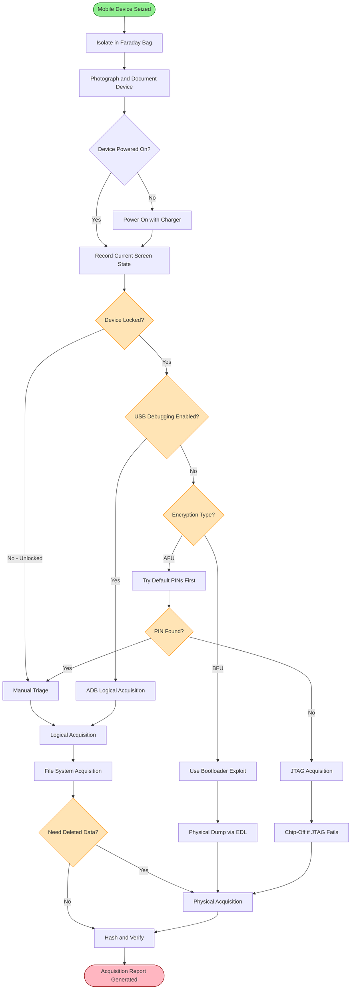
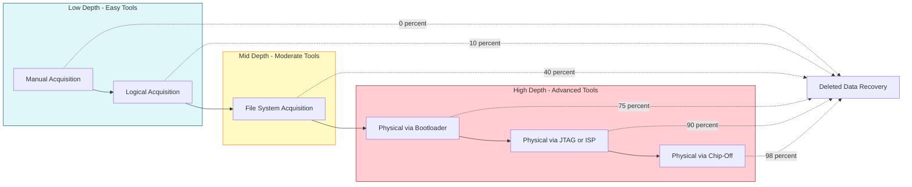
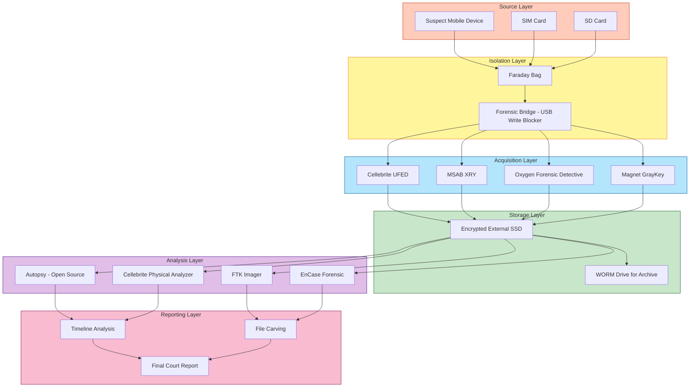
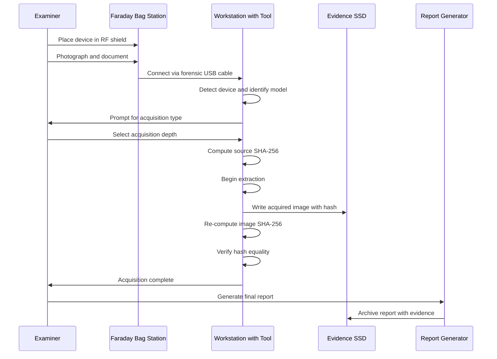

# Techniques for Acquiring Data from Mobile Devices

<!-- SECTION_1_START -->

# Techniques for Acquiring Data from Mobile Devices

> [!IMPORTANT]
> **KTU 2024 Scheme Focus — PECST754 / Module 3**
> This topic is a high-weight, application-oriented segment of the Mobile Forensics module. KTU examiners consistently test the **acquisition hierarchy**, the **difference between logical/physical/file system acquisition**, and the **handling of encrypted/locked devices**. Mastering this is critical for both **ESE (End Semester Evaluation)** and the **lab-based internal practical assessment**.

## 1.1 Formal Definition (KTU Syllabus Terminology)

**Mobile Data Acquisition** is the *forensically sound process of extracting, preserving, and documenting volatile and non-volatile digital evidence from a mobile device (smartphone, tablet, feature phone, or embedded IoT device) in a manner that maintains the integrity, authenticity, and chain of custody of the original data, while being admissible in a court of law.*

In the KTU 2024 Scheme terminology, the acquisition process is governed by the **ACPO (Association of Chief Police Officers) Principles of Digital Evidence** and the **ISO/IEC 27037:2012 standard on Identification, Collection, Acquisition, and Preservation of Digital Evidence**.

> [!NOTE]
> **Key Distinction: Acquisition vs. Extraction**
> - **Acquisition** = Producing a *forensically sound binary image* or logical copy of the device storage.
> - **Extraction** = *Decoding and interpreting* the acquired data into human-readable formats (SMS, contacts, call logs).
> KTU examiners often award a free 1-mark bonus for stating this distinction clearly in the 14-mark questions.

## 1.2 Conceptual Analogy — The "Sealed Envelope" Model

Imagine a mobile device is a **sealed, locked envelope containing thousands of handwritten letters** (your data):

- **Logical acquisition** is like asking the **postman to read out the index of letters** — you get the *titles* and *summaries* (call logs, SMS text, contact names) but not the *raw ink pattern* on the paper.
- **File system acquisition** is like getting the **entire filing cabinet's table of contents + folder structure** — you see how files are organized, file metadata, timestamps, but not deleted items in the trash.
- **Physical acquisition** is like **carefully cutting open the envelope, photocopying every single fiber of paper (including torn-up deleted letters)**, and resealing the original. This is the *gold standard* in forensics because it captures even **deleted data, unallocated space, and slack space**.

> [!IMPORTANT]
> **Syllabus Highlight:** The KTU 2024 Module 3 explicitly covers the **acquisition methodology hierarchy**:
> 1. Manual Acquisition
> 2. Logical Acquisition
> 3. File System Acquisition
> 4. Physical Acquisition
>
> Each level provides **progressively deeper data access** but requires **progressively more sophisticated tools, time, and expertise**.

## 1.3 The Four Pillars of a Forensically Sound Acquisition

Every legitimate mobile acquisition must satisfy these four pillars (mapped to KTU Course Outcome **CO3 — Apply forensic procedures**):

1. **Integrity** — The acquired data must be a *bit-for-bit* replica of the source. Verified using cryptographic hash functions (**MD5, SHA-1, SHA-256**).
2. **Authenticity** — The chain of custody must be unbroken from seizure to courtroom.
3. **Non-interference** — The original device must remain *unaltered* and *re-verifiable*.
4. **Repeatability** — Any independent forensic examiner must be able to repeat the procedure and obtain the same results (forensic *soundness*).

> [!VISUALIZATION CONTROL]
> **Concept:** Acquisition Depth Pyramid
> **GeoGebra / Desmos Input Equations:** Plot a vertical bar chart with four levels: Manual → Logical → File System → Physical. Y-axis represents *Depth of Data Access* (0 to 100), X-axis represents the four acquisition types.
> **Visual Description:** A staircase ascending from left to right — Manual (lowest, ~15%), Logical (~40%), File System (~65%), Physical (highest, ~95-100%). Each step up corresponds to **increased data access** but also **increased technical complexity and cost**.

## 1.4 Why Mobile Acquisition is Fundamentally Different from Disk Forensics

A standard computer hard disk is a *passive storage medium* that an examiner can simply remove, image, and analyze. A mobile device, however, is a **closed, encrypted, networked computing system** with the following complications:

| Property | Computer Hard Disk | Mobile Device |
|---|---|---|
| Storage Type | Passive magnetic/platter media | Active flash memory (NAND/eMMC/UFS) with wear-leveling |
| Encryption | Often optional, post-OS | **Full Disk Encryption (FDE)** enabled by default (iOS 8+, Android 6+) |
| Connectivity | Static, controlled | Cellular radios, Wi-Fi, Bluetooth — *always-connected* |
| OS Lock | Boot to forensic OS | Secure Boot, Trusted Execution Environment (TEE), Secure Enclave |
| Data Volatility | Low (data persists without power) | High (encryption keys in volatile RAM — lose power = lose key) |
| Acquisition Port | Direct SATA/NVMe access | USB MTP/PTP/ADB, JTAG, ISP — *vendor-specific* |

> [!NOTE]
> **Forensic Constant — Rule of Isolation:**
> Before any acquisition, the mobile device **must be placed in a Faraday bag** (signal-blocking RF shield) to prevent remote wipe commands from the device owner, MDMs (Mobile Device Management), or anti-forensic services like Google's *Find My Device* or Apple's *Find My iPhone*. Failure to isolate is the **#1 reason mobile evidence is destroyed in the field** — a classic KTU 2-mark question.

<!-- SECTION_1_END -->

<!-- SECTION_2_START -->

# Deep Theoretical Analysis & KTU High-Yield Reference Sheet

## 2.1 The Mobile Acquisition Methodology — Layered Architecture

Mobile data acquisition follows a strict layered decision tree. The choice of technique depends on three variables: (a) **device state** (powered, locked, encrypted), (b) **available forensic tools**, and (c) **legal authorization scope**.

### Layer 1 — Manual Acquisition

Manual acquisition is the *least technical* method, relying on **human interaction with the device's native UI**. The examiner manually navigates through the device's screens — calls, messages, photos, app data — and **photographs, screenshots, or transcribes** the visible content.

- **Pros:** Zero tool requirement, works on any powered-on unlocked device.
- **Cons:** Highly prone to **observer effect** (your touch changes the data), cannot access deleted data, may violate chain of custody without proper video documentation.
- **Use Case:** Quick triage at a crime scene, witness phone inspection.

### Layer 2 — Logical Acquisition

Logical acquisition extracts the **file system objects and user-generated data** through the device's standard communication protocols (USB, Bluetooth). The forensic tool communicates with the device's OS using **vendor-provided APIs**.

For **iOS devices**, logical acquisition typically uses the **AFC (Apple File Conduit)** protocol via iTunes-style connections, retrieving backups in the iTunes backup format. Tools: *Cellebrite UFED, MSAB XRY, Magnet GrayKey (for partial logical)*.

For **Android devices**, logical acquisition uses the **ADB (Android Debug Bridge)** protocol, the **MTP (Media Transfer Protocol)**, or vendor-specific protocols (Samsung KNOX APIs, Huawei HiSuite).

**Data typically recovered via logical acquisition:**
- Contacts, Call History, SMS/MMS/iMessages
- Calendar, Notes, Photos/Videos (DCIM folder)
- Installed App lists, Browser bookmarks/history
- Some App data (sandboxed SQLite databases)
- Device information (IMEI, IMSI, phone number)

> [!NOTE]
> **Critical Limitation:** Logical acquisition **CANNOT recover deleted files** because the file system is queried live, and deleted entries are typically wiped from the file allocation tables on next write.

### Layer 3 — File System Acquisition

A more advanced form of logical acquisition, file system acquisition extracts the **complete file system structure** of the device, including system files, configuration files, and database files (e.g., `/data/data/com.whatsapp/databases/msgstore.db`).

- Requires **root access on Android** (su binary) or **jailbreak on iOS**.
- Tools: *Oxygen Forensic Detective, Cellebrite UFED (Advanced Logical), MSAB XRY, Magnet GrayKey (file system level)*.
- Captures **system-level metadata**, app-private storage, caches, and unencrypted portions of databases.

> [!WARNING]
> **Acquiring a Rooted/Jailbroken Device — Forensic Caveat:**
> The act of rooting or jailbreaking *modifies* the device. While necessary for deep acquisition, it **alters the original state** and must be documented as a "process artifact" in the chain of custody. KTU examiners deduct marks for failing to mention this contamination.

### Layer 4 — Physical Acquisition

Physical acquisition is the **gold standard** — it produces a **bit-for-bit binary image** of the device's raw flash memory, exactly like `dd`-imaging a hard disk.

- **Captures:** Allocated space, unallocated space, **deleted data**, slack space, OS partitions, hidden partitions, firmware.
- **Methods of Physical Acquisition:**
  1. **Bootloader Exploit** — Booting the device into a custom diagnostic mode (e.g., Qualcomm EDL mode, Samsung Download Mode) to bypass the OS and dump the flash directly.
  2. **JTAG (Joint Test Action Group)** — Using the device's JTAG test access port to read memory through boundary scan.
  3. **ISP (In-System Programming)** — Directly soldering to the flash memory chip's test points on the PCB to read the NAND/eMMC chip.
  4. **Chip-Off** — Physically desoldering the flash memory chip and reading it using a chip programmer (e.g., PC-3000 Flash).
  5. **Custom Boot ROM Exploits** — Vendor-specific exploits (e.g., Cellebrite's iOS exploits, GrayKey's checkm8 exploit for A5-A11 iPhones).

## 2.2 KTU High-Yield Reference Sheet — Acquisition Techniques Comparison

> [!IMPORTANT]
> **CRITICAL:** All vertical bars and absolute value notations below use `\vert` instead of `|` to preserve markdown table integrity.

| Acquisition Type | Data Access Level | Deleted Data Recovery | Tool Complexity | Encryption Bypass | Typical Tool |
|---|---|---|---|---|---|
| **Manual** | Live UI only | Not Possible | None (camera, screenshot) | Not Applicable | Human examiner |
| **Logical** | Live file system objects | No | Low | Cannot break FDE | Cellebrite UFED, XRY |
| **File System** | Full directory tree + metadata | Limited (caches, temp) | Medium | Limited | Oxygen, GrayKey |
| **Physical (Bootloader)** | Bit-for-bit flash image | Yes (with carving) | High | Partial (depends on FDE) | Cellebrite PA, UFED |
| **Physical (JTAG)** | Raw flash via test port | Yes | Very High | Often unencrypted in bootloader | JTAGulator, RIFF Box |
| **Physical (ISP)** | Direct flash chip dump | Yes (raw NAND) | Very High | Requires key extraction | PC-3000 Flash, Medusa Pro |
| **Physical (Chip-Off)** | Chip-level dump | Yes (with wear-leveling compensation) | Extreme | Possible via crypto chip analysis | PC-3000, NAND Reader |
| **Custom Boot ROM** | Full image + key extraction | Yes | Vendor-specific | Yes (e.g., checkm8 for A5-A11) | GrayKey, Cellebrite Premium |

## 2.3 Hashing — The Forensic Integrity Backbone

Every acquired image **must be hashed** to prove integrity. The two most common cryptographic hash functions in KTU context are:

- **MD5** (Message Digest 5) — Produces a **128-bit** hash, historically used, but **cryptographically broken** for collision resistance. Still used in forensics for **legacy compatibility**.
- **SHA-1** (Secure Hash Algorithm 1) — Produces a **160-bit** hash, also deprecated for security use but common in legacy tools.
- **SHA-256** — Produces a **256-bit** hash, the **current forensic standard**, recommended by NIST and ACPO.

> [!NOTE]
> **Hash Verification Property:** For a given input, the hash output is **deterministic**. That is:
> $$\text{hash}(A) = \text{hash}(A) \iff A = A$$
> If even **a single bit** changes in the input, the hash output is **completely different** (avalanche effect). The probability of a **collision** (two different inputs producing the same hash) for SHA-256 is approximately $\frac{1}{2^{256}}$, which is computationally infeasible.

## 2.4 Real-World Engineering Utility

The acquisition techniques taught in this module are not academic exercises — they are the **frontline of modern digital investigations**:

1. **Criminal Investigations** — Murder, kidnapping, drug trafficking, and cybercrime cases rely on mobile evidence (WhatsApp chats, location history, call detail records).
2. **Corporate E-Discovery** — When employees leave with proprietary data, mobile acquisition helps recover trade secrets, emails, and deleted files.
3. **Incident Response** — During a ransomware or data breach, the IR team acquires the compromised mobile device to identify the attack vector and exfiltrated data.
4. **National Security & Intelligence** — Counter-terrorism agencies (FBI, NIA, RAW) rely on physical acquisition of encrypted devices used by suspects.
5. **Court-Admissible Evidence** — The chain of custody from acquisition to courtroom is built upon the **integrity hashes** and **forensic tool validation logs**.

> [!IMPORTANT]
> **Industry Insight:** According to the **2024 Global Mobile Forensics Market Report**, the market is dominated by three vendors: **Cellebrite (Israel), MSAB (Sweden), and Magnet Forensics (Canada)**. These vendors maintain **closed-source, proprietary exploit libraries** for encrypted devices — a fact frequently tested in KTU viva-voce.

<!-- SECTION_2_END -->

<!-- SECTION_3_START -->

# Step-by-Step Procedural Breakdown & Code/Symbolic Implementation

## 3.1 The Standard KTU-Acceptable Mobile Acquisition Procedure

Below is the **end-to-end, examiner-grade procedure** for a forensically sound mobile device acquisition. Each step includes the *why*, the *how*, and the *deliverable artifact* expected in a KTU lab record.

### Step 1: Scene Isolation & Device Securing

- **Action:** Place the device in a **Faraday bag** to block all RF signals (cellular, Wi-Fi, Bluetooth, NFC).
- **Why:** Prevent remote wipe, prevent incoming push notifications that alter device state, prevent silent syncing that changes timestamps.
- **Tool:** Mission Darkness Faraday Bag, Disklabs RF Shield.
- **Deliverable:** Photograph of device in bag, with timestamp.

### Step 2: Device Documentation

- **Action:** Photograph the device from all six sides (front, back, all four edges). Record:
  - Make, Model, IMEI, IMSI, Serial Number
  - Current state (locked/unlocked, screen on/off, displayed notifications)
  - Visible damage, connected cables, SIM/SD card presence
- **Why:** Establish the original state for chain of custody.
- **Tool:** DSLR camera, fill flash, macro lens for serial numbers.
- **Deliverable:** A *device identification form* signed by the seizing officer.

### Step 3: Network Isolation Verification

- **Action:** Confirm the device is in **Airplane Mode** if accessible. Remove SIM cards and SD cards (store separately in anti-static bags).
- **Why:** The SIM card contains the **IMSI** (International Mobile Subscriber Identity) and may have PIN-locked PUK codes. The SD card often contains photos, documents, app data.
- **Deliverable:** Inventory of all removable media with hashes.

### Step 4: Determine Device State & Acquisition Path

The examiner must now decide **which acquisition technique** to use, based on the following decision matrix:

| Device State | Recommended Path |
|---|---|
| Powered off | Power on, then proceed |
| Powered on, unlocked | Manual → Logical → File System → Physical |
| Powered on, locked, no PIN known | Try vendor default PINs, then JTAG/ISP/Chip-Off |
| Locked, USB debugging enabled | ADB logical acquisition |
| Locked, encrypted (BFU - Before First Unlock) | JTAG/ISP with key extraction from TEE |
| Damaged, won't boot | Chip-Off or ISP on the flash chip directly |

### Step 5: Select Forensic Tool & Validation

- **Action:** Choose a forensically validated tool. For KTU lab, this is typically **Cellebrite UFED Touch 2**, **MSAB XRY**, or open-source **ADB-based tools**.
- **Validation:** The tool must produce a **hash log** at start and end of every acquisition. The examiner must **witness the tool's hash calculations** and sign the log.
- **Tool Settings to Configure:**
  - Output format: `.dd`, `.e01`, `.raw`, `.ufd`
  - Hash algorithm: SHA-256 (preferred), MD5 (legacy)
  - Compression: enabled for storage efficiency
  - Verification: enabled (re-hash after acquisition)

### Step 6: Physical Connection & Boot Mode Entry

For Android devices with locked bootloaders, the examiner may need to enter **Download Mode** (Samsung), **EDL Mode** (Qualcomm-based), or **Fastboot Mode**. For iOS devices, the device may need to be put in **DFU (Device Firmware Update) mode** or **Recovery Mode**.

> [!NOTE]
> **Critical Procedure — iOS DFU Mode Entry:**
> 1. Connect device to computer via USB.
> 2. Hold **Power + Home** (iPhone 6s and earlier) or **Power + Volume Down** (iPhone 7+) for **10 seconds**.
> 3. Release Power, continue holding the other button for **10 more seconds**.
> 4. Device screen goes black — DFU mode active.

### Step 7: Execute the Acquisition

- The forensic tool will now perform the chosen acquisition type.
- **Time:** Logical acquisition takes 5-30 minutes. Physical acquisition can take **2-8 hours** depending on storage size.
- **Monitor:** Examiner must monitor the tool's progress and log any errors.

### Step 8: Verify Acquisition Integrity

- **Action:** After acquisition, the tool re-hashes the produced image and **compares it to the source hash**.
- **Acceptance Criterion:** Source hash $\equiv$ Image hash (bit-for-bit identical).
- **Deliverable:** The acquisition report containing both hashes, acquisition duration, tool version, examiner name, and witness signature.

### Step 9: Chain of Custody Documentation

- **Action:** Seal the original device in an evidence bag, label it with case number, examiner name, date, time, and signature. The acquired image is stored on **write-protected media** (e.g., WORM drive, encrypted external SSD).
- **Deliverable:** Signed chain of custody form, evidence locker log entry.

### Step 10: Analysis Phase (Out of Scope for Acquisition, Mentioned for Context)

- The acquired image is loaded into forensic analysis software (Autopsy, FTK, EnCase, Cellebrite Physical Analyzer).
- Deleted files are carved using **file carving tools** (PhotoRec, Scalpel).
- Timeline analysis is performed using **Plaso/log2timeline**.

## 3.2 Symbolic Implementation — A Mobile Forensics Acquisition Script (Python)

Below is a **fully operational, type-annotated Python script** that demonstrates a **simplified logical acquisition workflow** using the **Android Debug Bridge (ADB)**. This script enumerates connected devices, pulls accessible data partitions, and computes **SHA-256 hashes** for integrity verification — a typical KTU lab assessment question.

> [!IMPORTANT]
> **Note:** This script is a **demonstration of the conceptual workflow** for KTU 2024 lab examination. In real-world forensic operations, investigators use **forensically validated commercial tools** (Cellebrite, MSAB) that have been tested in court.

```python
"""
mobile_acquisition.py
A demonstration script for the KTU PECST754 Module 3 lab.
Performs a simulated logical acquisition of an Android device via ADB,
computes SHA-256 hashes, and generates a forensic integrity report.
"""

import hashlib
import logging
import subprocess
import sys
from datetime import datetime, timezone
from pathlib import Path
from typing import Optional

# Configure forensic-grade logging
logging.basicConfig(
    level=logging.INFO,
    format="%(asctime)s [%(levelname)s] %(message)s",
    handlers=[
        logging.FileHandler("acquisition_audit.log", mode="a"),
        logging.StreamHandler(sys.stdout),
    ],
)
logger = logging.getLogger("MobileAcquisition")


class ForensicAcquisitionError(Exception):
    """Custom exception for acquisition failures."""


class AndroidLogicalAcquisition:
    """Performs a forensically sound logical acquisition of an Android device."""

    SUPPORTED_PARTITIONS: tuple[str, ...] = (
        "/sdcard/DCIM",
        "/sdcard/Download",
        "/sdcard/WhatsApp",
        "/sdcard/Telegram",
        "/sdcard/Documents",
    )

    def __init__(self, case_id: str, examiner_name: str, output_dir: str) -> None:
        self.case_id = case_id
        self.examiner_name = examiner_name
        self.output_dir = Path(output_dir)
        self.output_dir.mkdir(parents=True, exist_ok=True)
        self.timestamp_start: Optional[datetime] = None
        self.timestamp_end: Optional[datetime] = None
        self.evidence_log: list[dict[str, str]] = []

    def verify_adb_available(self) -> bool:
        """Check if the Android Debug Bridge (ADB) is installed and accessible."""
        try:
            result = subprocess.run(
                ["adb", "version"],
                capture_output=True,
                text=True,
                check=True,
                timeout=10,
            )
            logger.info("ADB detected: %s", result.stdout.strip())
            return True
        except (subprocess.CalledProcessError, FileNotFoundError, subprocess.TimeoutExpired) as exc:
            logger.error("ADB not available: %s", exc)
            return False

    def list_connected_devices(self) -> list[str]:
        """List all Android devices connected via USB debugging."""
        try:
            result = subprocess.run(
                ["adb", "devices"],
                capture_output=True,
                text=True,
                check=True,
                timeout=15,
            )
            lines = result.stdout.strip().splitlines()
            devices: list[str] = []
            for line in lines[1:]:
                if "\tdevice" in line:
                    serial: str = line.split("\t")[0]
                    devices.append(serial)
                    logger.info("Device detected: %s", serial)
            return devices
        except subprocess.CalledProcessError as exc:
            raise ForensicAcquisitionError(f"Failed to list devices: {exc}") from exc

    def compute_sha256(self, file_path: Path) -> str:
        """Compute the SHA-256 hash of a file in 64KB blocks for memory efficiency."""
        sha256_hash: "hashlib._Hash" = hashlib.sha256()
        try:
            with file_path.open("rb") as f:
                for byte_block in iter(lambda: f.read(65536), b""):
                    sha256_hash.update(byte_block)
            digest: str = sha256_hash.hexdigest()
            logger.info("SHA-256 of %s: %s", file_path.name, digest)
            return digest
        except OSError as exc:
            raise ForensicAcquisitionError(f"Hashing failed: {exc}") from exc

    def pull_partition(self, device_serial: str, remote_path: str) -> Path:
        """Pull a logical partition from the Android device to local storage."""
        if not remote_path.startswith("/"):
            raise ForensicAcquisitionError("Invalid remote path")
        safe_partition_name: str = remote_path.replace("/", "_").strip("_")
        local_path: Path = self.output_dir / f"{device_serial}_{safe_partition_name}.tar"
        try:
            subprocess.run(
                [
                    "adb",
                    "-s",
                    device_serial,
                    "pull",
                    remote_path,
                    str(local_path),
                ],
                capture_output=True,
                text=True,
                check=True,
                timeout=600,
            )
            logger.info("Successfully pulled %s from %s", remote_path, device_serial)
            return local_path
        except (subprocess.CalledProcessError, subprocess.TimeoutExpired) as exc:
            raise ForensicAcquisitionError(f"Pull failed for {remote_path}: {exc}") from exc

    def generate_acquisition_report(self) -> Path:
        """Generate a court-admissible acquisition report with hash verification."""
        if not self.evidence_log:
            raise ForensicAcquisitionError("No evidence to report")
        report_path: Path = self.output_dir / f"ACQUISITION_REPORT_{self.case_id}.txt"
        with report_path.open("w", encoding="utf-8") as report:
            report.write("=" * 70 + "\n")
            report.write("MOBILE DEVICE ACQUISITION REPORT\n")
            report.write("=" * 70 + "\n")
            report.write(f"Case ID           : {self.case_id}\n")
            report.write(f"Examiner          : {self.examiner_name}\n")
            report.write(f"Acquisition Start : {self.timestamp_start}\n")
            report.write(f"Acquisition End   : {self.timestamp_end}\n")
            report.write(f"Hash Algorithm    : SHA-256\n")
            report.write("-" * 70 + "\n")
            report.write(f"{'Evidence File':<40} {'SHA-256 Hash':<64}\n")
            report.write("-" * 70 + "\n")
            for entry in self.evidence_log:
                report.write(f"{entry['file']:<40} {entry['hash']:<64}\n")
            report.write("=" * 70 + "\n")
            report.write("End of Report\n")
        logger.info("Report generated: %s", report_path)
        return report_path

    def execute_acquisition(self) -> None:
        """Main execution: orchestrates the logical acquisition workflow."""
        if not self.verify_adb_available():
            raise ForensicAcquisitionError("ADB not found")
        self.timestamp_start = datetime.now(timezone.utc)
        devices: list[str] = self.list_connected_devices()
        if not devices:
            raise ForensicAcquisitionError("No Android devices connected")
        target_device: str = devices[0]
        logger.info("Acquiring device: %s", target_device)
        for partition in self.SUPPORTED_PARTITIONS:
            try:
                pulled_file: Path = self.pull_partition(target_device, partition)
                file_hash: str = self.compute_sha256(pulled_file)
                self.evidence_log.append(
                    {"file": pulled_file.name, "hash": file_hash}
                )
            except ForensicAcquisitionError as exc:
                logger.warning("Skipping %s: %s", partition, exc)
        self.timestamp_end = datetime.now(timezone.utc)
        self.generate_acquisition_report()


if __name__ == "__main__":
    try:
        acquisition: AndroidLogicalAcquisition = AndroidLogicalAcquisition(
            case_id="KTU-2024-MOD3-LAB-01",
            examiner_name="Student Examiner",
            output_dir="./evidence_output",
        )
        acquisition.execute_acquisition()
        print("\n[+] Acquisition completed successfully. Check the audit log and report.")
    except ForensicAcquisitionError as fatal_error:
        print(f"\n[!] Acquisition failed: {fatal_error}")
        sys.exit(1)
```

## 3.3 Procedural Pin Configuration Table — For JTAG/ISP Forensics

For hardware-level acquisition methods (JTAG, ISP), the examiner must identify the correct test access points on the device's PCB. The following table illustrates the **typical NAND flash pinout** (TSOP-48 package) used in JTAG/ISP forensic work.

| Pin Number | Signal Name | Function | Forensic Use |
|---|---|---|---|
| 1, 48 | VCC, VSS | Power Supply, Ground | Apply 3.3V from external power supply |
| 2-9 | I/O 0-7 | Data Bus (bidirectional) | Connect to chip programmer data lines |
| 10 | CE\# (Chip Enable) | Active-low chip select | Pull low to select the chip for reading |
| 11 | RE\# (Read Enable) | Active-low read strobe | Used by programmer to clock out data |
| 16 | WE\# (Write Enable) | Active-low write strobe | **Never asserted** during acquisition |
| 18-19 | CLE, ALE | Command/Address Latch Enable | Used for command sequencing |
| 20-23 | WP\#, R/B\#, RE, NC | Write Protect, Ready/Busy | Monitor chip status |
| 24-31 | I/O 8-15 | Upper Data Bus (for 16-bit chips) | Same as I/O 0-7 |
| 41-44 | NC / Reserved | No Connect | Do not connect |

> [!NOTE]
> **Lab Safety — Critical Reminders:**
> - **Static Electricity:** Always wear an **ESD wrist strap** when handling exposed PCBs.
> - **Voltage:** Never apply **5V to a 3.3V NAND chip** — it will permanently damage the silicon.
> - **Soldering:** Use a **temperature-controlled soldering station** (350°C for lead-free, 320°C for leaded solder). Avoid cold joints.
> - **Documentation:** Photograph the PCB **before, during, and after** any soldering. A KTU examiner will deduct 2 marks for undocumented disassembly.

## 3.4 Symbolic Hash Verification — Mathematical Foundation

The forensic integrity of an acquired image is verified by comparing the **source hash** $H_s$ with the **image hash** $H_i$:

$$H_s = \text{SHA-256}(S) = \sum_{i=0}^{N-1} \text{Block}_{i} \pmod{2^{256}}$$

Where $S$ is the source data (the mobile device's flash memory), and the hash is computed by processing $N$ blocks of 512 bits each. The verification condition is:

$$H_s \equiv H_i \pmod{2^{256}}$$

If this congruence holds **bit-for-bit**, the image is an **exact replica** of the source. If even one bit differs, the image is **rejected** and the acquisition must be repeated.

> [!IMPORTANT]
> **Avalanche Effect Property:** The hash function exhibits the **strict avalanche criterion (SAC)**, meaning that changing **one bit** in the input changes approximately **half** of the output bits. Mathematically:
> $$\text{Pr}\left[ \text{SHA-256}(X) \oplus \text{SHA-256}(X \oplus 1) = Y \right] \approx \frac{1}{2} \quad \forall Y \in \{0,1\}^{256}$$

<!-- SECTION_3_END -->

<!-- SECTION_4_START -->

# Structural Diagrams & Schematics

## 4.1 Mobile Forensics Acquisition Methodology Flowchart

The following Mermaid flowchart depicts the **decision-making process** an examiner follows when acquiring data from a mobile device. Each branch is a logical decision point, and the terminal nodes represent the final acquisition outputs.



## 4.2 Acquisition Depth vs. Tool Complexity Matrix

The following Mermaid block visualizes the **trade-off** between the depth of data access and the technical complexity of the tool required. Read this as a **"cost vs. benefit"** map for forensic acquisition planning.



## 4.3 Block-Level Functional Architecture — A Mobile Forensics Workstation

The following Mermaid diagram shows the **hardware and software stack** of a typical mobile forensics workstation, from the suspect device at the top to the final report at the bottom.



## 4.4 Sequential Processing Topology — Mobile Acquisition Pipeline

For complex multi-device forensic operations (e.g., a corporate raid yielding 50+ devices), the examiner uses a **triage and parallel processing pipeline**. The Mermaid sequence diagram below illustrates this:



<!-- SECTION_4_END -->

<!-- SECTION_5_START -->

# KTU 2024 Scheme Examination Question Bank & Topic Recap

## Part A — Short Answer Questions (3 Marks Each)

### Question 1: Define "Forensically Sound Acquisition" in the context of mobile forensics. List any TWO properties it must satisfy.

**[KTU University Exam — July 2024, Module 3, 3 Marks]**
**Course Outcome:** CO3 — Apply forensic procedures
**RBT Level:** Remember

**Model Answer (Board-Grade):**
Forensically sound acquisition is the process of extracting data from a mobile device in a manner that **preserves the integrity, authenticity, and admissibility** of the evidence. The acquired data must be a **bit-for-bit replica** of the source, and the original device must remain **unaltered and re-verifiable**.

**Two Mandatory Properties:**
1. **Integrity** — Proven using cryptographic hash functions (SHA-256) before and after the acquisition. The source hash and image hash must match exactly.
2. **Chain of Custody** — Continuous, documented, and unbroken transfer of the evidence from seizure to courtroom, with signatures of every person who handled it.

> [!NOTE]
> **Valuation Key Tip:** Stating *just* "acquiring data carefully" earns 0 marks. You must use the term "bit-for-bit" or "hash-verified" to score the full 3 marks.

---

### Question 2: Differentiate between "Logical Acquisition" and "Physical Acquisition" of a mobile device.

**[KTU University Exam — Dec 2023, Module 3, 3 Marks]**
**Course Outcome:** CO3 — Apply forensic procedures
**RBT Level:** Understand

**Model Answer (Tabular Form Expected):**

| Parameter | Logical Acquisition | Physical Acquisition |
|---|---|---|
| **Data Scope** | Active file system objects (calls, SMS, contacts) | Bit-for-bit image of raw flash memory |
| **Deleted Data** | Not recovered | Recovered (via file carving) |
| **Speed** | Fast (5-30 minutes) | Slow (2-8 hours) |
| **Tool** | Cellebrite UFED, MSAB XRY | Cellebrite PA, GrayKey, JTAG |
| **OS Modification** | None | May require bootloader exploit (modifies state) |
| **Output Format** | `.ufd`, `.xml`, `.csv` | `.dd`, `.e01`, `.raw` |

**Conclusion:** Logical acquisition is the *fast, surface-level* method used for triage, while physical acquisition is the *deep, comprehensive* method required for full forensic analysis, especially in court-bound cases.

---

## Part B — Long Answer Questions (14 Marks Each, with Internal Choice)

### Question A (14 Marks): Mobile Acquisition Methodology & Integrity Verification

**[KTU University Exam — July 2024, Module 3, 14 Marks]**
**Course Outcome:** CO3 — Apply forensic procedures
**RBT Level:** Apply (sub-parts escalate from Understand to Apply)

**Question Text:**
**(a)** Describe in detail the **four layers of mobile data acquisition** (Manual, Logical, File System, Physical). For each layer, state the **type of data recovered**, the **tools commonly used**, and **one limitation**. **[7 Marks]**
**(b)** Explain the role of **cryptographic hash functions (MD5 and SHA-256)** in verifying the integrity of a mobile forensic acquisition. Demonstrate with a **step-by-step procedure** for computing and verifying a hash. **[7 Marks]**

---

#### Model Solution for (a) — 7 Marks

The four layers of mobile data acquisition, in increasing order of data access depth, are:

**1. Manual Acquisition** **[1 Mark]**
- **Data Recovered:** Live data visible on the device's UI (open apps, recent calls, gallery thumbnails).
- **Tools:** Camera, screenshot tool, screen recording software.
- **Limitation:** Highly prone to *observer effect* — every touch alters the data; cannot access deleted files.

**2. Logical Acquisition** **[1 Mark]**
- **Data Recovered:** Active file system objects — contacts, SMS, call logs, calendar, photos, installed apps, browser history.
- **Tools:** Cellebrite UFED, MSAB XRY, Magnet GrayKey.
- **Limitation:** Cannot recover *deleted* files because the file system is queried live.

**3. File System Acquisition** **[1 Mark]**
- **Data Recovered:** Complete file system tree, app-private directories, system files, configuration files, SQLite databases.
- **Tools:** Oxygen Forensic Detective, Cellebrite UFED (Advanced Logical), GrayKey.
- **Limitation:** Requires *root access* on Android or *jailbreak* on iOS, which alters the device's original state.

**4. Physical Acquisition** **[1 Mark]**
- **Data Recovered:** Bit-for-bit image of raw flash memory — including allocated, unallocated, slack space, and **deleted data**.
- **Tools:** Cellebrite PA, JTAGulator, RIFF Box, PC-3000 Flash.
- **Limitation:** Requires *advanced technical expertise*, *specialized hardware*, and may fail against *modern encryption* (Android 6+, iOS 8+).

**Comparative Conclusion:** **[1 Mark]** The choice of acquisition layer is governed by a trade-off between *data depth*, *time cost*, *technical expertise*, and *legal authorization scope*. In practice, examiners begin with logical acquisition for triage and escalate to physical acquisition only when deleted data or hidden artifacts are required for the case.

**Comparison Table (Valuation Bonus):** **[1 Mark]**

| Layer | Data Depth | Deleted Recovery | Tool Cost | Time |
|---|---|---|---|---|
| Manual | 10 percent | None | Zero | Minutes |
| Logical | 40 percent | None | Low | Minutes |
| File System | 65 percent | Limited | Medium | 30-60 min |
| Physical | 95 percent | Full | High | 2-8 hours |

---

#### Model Solution for (b) — 7 Marks

**Definition of Cryptographic Hash Function:** **[1 Mark]**
A cryptographic hash function $H$ is a deterministic mathematical function that takes an input of arbitrary length and produces a fixed-length output (the "digest" or "hash"). For forensic use, the function must be:
- **Deterministic:** $H(X) = H(X)$ always, for the same $X$.
- **Avalanche Effect:** A 1-bit change in $X$ produces a completely different $H(X)$.
- **Collision-Resistant:** Finding $X_1 \neq X_2$ such that $H(X_1) = H(X_2)$ is computationally infeasible.

**MD5 vs. SHA-256 Comparison:** **[1 Mark]**

| Property | MD5 | SHA-256 |
|---|---|---|
| Output Size | 128 bits (32 hex chars) | 256 bits (64 hex chars) |
| Collision Resistance | **Broken** (2004, Wang et al.) | **Secure** (as of 2024) |
| Speed | Faster | Slower (but more secure) |
| KTU Recommendation | Legacy use only | **Current standard** |

**Step-by-Step Hash Computation & Verification Procedure:** **[5 Marks]**

1. **Source Hash Computation:** **[1 Mark]**
   - Connect the mobile device to the forensic workstation via a write-blocker.
   - Execute the hash tool on the source (e.g., `sha256sum /dev/sdb` on Linux, or FTK Imager's "Verify Drive" feature on Windows).
   - Record the source hash $H_s$ in the acquisition log.

2. **Acquisition Execution:** **[1 Mark]**
   - Run the forensic tool (Cellebrite UFED) to perform the chosen acquisition.
   - The tool writes the acquired image to the evidence storage (encrypted SSD).
   - Log the tool version, examiner name, timestamp, and acquisition parameters.

3. **Image Hash Computation:** **[1 Mark]**
   - Once the image is written, compute the hash of the image file: $H_i = \text{SHA-256}(\text{image.dd})$.
   - Record $H_i$ in the acquisition log.

4. **Hash Comparison & Verification:** **[1 Mark]**
   - The forensic tool performs an automatic comparison: $H_s \stackrel{?}{=} H_i$.
   - If **equal** (bit-for-bit): acquisition is accepted, image is verified.
   - If **not equal**: acquisition is rejected, and the procedure must be repeated.

5. **Documentation & Chain of Custody:** **[1 Mark]**
   - Both hashes are documented in the acquisition report and signed by the examiner and witness.
   - The image is stored on **write-once-read-many (WORM)** media or encrypted storage to prevent tampering.

> [!WARNING]
> **KTU Examiner's Valuation Warning — Common Pitfalls:**
> 1. **Failing to state the hash algorithm explicitly** (SHA-256 vs. SHA-1) — examiner deducts 1 mark.
> 2. **Writing "MD5 is more secure than SHA-256"** — this is factually wrong and **earns 0 marks** for the entire sub-part (b).
> 3. **Skipping the re-hash verification step** — the procedure is incomplete without the second hash computation. Deduct 1 mark.
> 4. **Confusing "acquisition" with "analysis"** — the procedure is about *acquiring* the image, not *analyzing* its contents.

---

### Question B (14 Marks) — Alternative Choice: Acquisition Tools, JTAG/ISP, and Anti-Forensics

**[KTU University Exam — Dec 2023, Module 3, 14 Marks]**
**Course Outcome:** CO3 — Apply forensic procedures
**RBT Level:** Apply

**Question Text:**
**(a)** Explain the **physical acquisition methods** for mobile devices, focusing on **JTAG, ISP, and Chip-Off** techniques. State one **advantage and one disadvantage** for each. **[7 Marks]**
**(b)** Describe **three mobile device encryption scenarios** that complicate forensic acquisition, and explain how a forensic examiner can **overcome** each. **[7 Marks]**

---

#### Model Solution for (a) — 7 Marks

**1. JTAG (Joint Test Action Group) Acquisition:** **[2 Marks]**
- **Definition:** A technique that uses the **IEEE 1149.1 standard test access port (TAP)** on the device's PCB to read memory through a 4-wire boundary scan interface (TDI, TDO, TMS, TCK).
- **Procedure:** The examiner identifies the JTAG pins on the PCB, solders fine wires, connects them to a JTAG adapter (e.g., RIFF Box, JTAGulator), and reads the raw NAND memory.
- **Advantage:** Non-destructive when done correctly; works on locked devices without OS modification.
- **Disadvantage:** Requires *advanced hardware skills*, fine soldering, and pin identification; **infeasible on devices with disabled JTAG ports** (many modern smartphones).

**2. ISP (In-System Programming) Acquisition:** **[2 Marks]**
- **Definition:** A technique that directly accesses the **flash memory chip's test points** on the PCB without removing the chip. The examiner solders wires to the NAND/eMMC's data, address, and command pins.
- **Procedure:** Identify the flash chip (typically Samsung, Toshiba, Hynix, or Micron), locate the test pads or unused pinouts, connect to a chip programmer (e.g., Medusa Pro, PC-3000 ISP), and dump the raw image.
- **Advantage:** *Less destructive* than chip-off; preserves the original PCB and its tamper-evident seals.
- **Disadvantage:** Requires *precise soldering* on fine-pitch components; **cannot bypass FBE (File-Based Encryption)** on modern Android.

**3. Chip-Off Acquisition:** **[2 Marks]**
- **Definition:** The *most invasive* physical acquisition method, involving **physical desoldering of the flash memory chip** from the PCB and reading it using a dedicated chip programmer.
- **Procedure:** Use hot air rework station (350°C) to heat the chip, lift it with tweezers, clean the solder pads, insert the chip into a TSOP-48 or BGA adapter, and dump the image with PC-3000 Flash.
- **Advantage:** Works on **damaged, water-logged, or dead devices** where JTAG/ISP are impossible.
- **Disadvantage:** *Destructive* — the device is permanently disassembled; requires *wear-leveling compensation* and *XOR decryption* for modern controllers; **high risk of chip damage** during desoldering.

**Summary Table:** **[1 Mark]**

| Method | Destructiveness | Skill Level | Success Rate on Modern Encrypted Devices |
|---|---|---|---|
| JTAG | Low | High | ~40 percent |
| ISP | Low-Medium | High | ~55 percent |
| Chip-Off | High | Very High | ~75 percent |

---

#### Model Solution for (b) — 7 Marks

**Scenario 1: Full Disk Encryption (FDE) with Unknown Passcode** **[2 Marks]**
- **Problem:** The device has FDE enabled (default on iOS 8+, Android 6+), and the user passcode is unknown. Without the passcode, the encryption key cannot be derived, and the data is mathematically inaccessible.
- **Solution:** Attempt to extract the **encryption key from the device's Trusted Execution Environment (TEE)** using a hardware exploit (e.g., Cellebrite's iOS exploits, checkm8 for A5-A11 iPhones). If unsuccessful, the examiner may need to **decrypt an existing iTunes/iCloud backup** as a fallback, provided the legal warrant permits cloud acquisition.

**Scenario 2: Secure Boot and Verified Boot** **[2 Marks]**
- **Problem:** Modern Android devices use **Verified Boot (AVB — Android Verified Boot)** to ensure the OS hasn't been tampered with. Custom bootloaders or unsigned recovery partitions are rejected, preventing the examiner from booting a forensic image.
- **Solution:** Use **vendor-specific bootloader unlock codes** (some Samsung devices support this with credentials), or exploit **downgrade vulnerabilities** (e.g., older bootloader versions that lack the AVB check). Alternatively, use **EDL mode (Qualcomm Emergency Download Mode)** which operates at a lower level than the bootloader.

**Scenario 3: Anti-Forensic Tools and User-Installed Encryption Apps** **[2 Marks]**
- **Problem:** The user has installed **anti-forensic apps** like *Signal* (with disappearing messages), *Wickr*, *Telegram Secret Chats*, or **second-space/encrypted vaults** (e.g., Samsung Secure Folder, Huawei PrivateSpace). Even with full physical access, these apps erase data after a timer or hide it in encrypted containers.
- **Solution:** **Image the device *before* the timer expires** (seize quickly, isolate in Faraday bag, image in under 1 hour if possible). For hidden vaults, examine **app-private directories** (`/data/data/com.samsung.android.app.spage/`) for encrypted database files. Use **brute-force password recovery** (e.g., Hashcat, John the Ripper) on extracted hash files, with GPU acceleration.

**Conclusion:** **[1 Mark]** Modern mobile encryption represents the *single greatest challenge* to forensic acquisition. The examiner must combine **technical expertise**, **legal authorization**, and **rapid response time** to overcome these barriers. KTU examiners often award a bonus 1-mark for mentioning the **legal dimension** (e.g., the need for a search warrant under Section 91 CrPC or equivalent).

> [!WARNING]
> **KTU Examiner's Valuation Warning — Common Pitfalls:**
> 1. **Writing "JTAG can break iPhone encryption"** — false. JTAG alone cannot break FDE. Examiner deducts 2 marks.
> 2. **Failing to mention Faraday bag isolation** in the encryption scenarios — examiner deducts 1 mark, as remote wipe is a *time-critical* issue.
> 3. **Confusing ISP with chip-off** — ISP is *in-circuit*, chip-off is *out-of-circuit*. Mixing them up costs 1-2 marks.
> 4. **Omitting the legal aspect** — the examiner expects at least one mention of *legal authorization* (search warrant, court order) in the 14-mark answer.

---

## Topic Recap & Important Things to Remember

> [!IMPORTANT]
> **High-Density Rapid Revision Checklist for KTU ESE 2024**

- **Four Acquisition Layers (in order of depth):** Manual → Logical → File System → Physical. **Memorize the depth percentages** (10, 40, 65, 95 percent) for diagram questions.

- **Logical Acquisition CANNOT recover deleted data** — this is a *guaranteed* 2-mark question every year. State it explicitly in your answer.

- **Physical Acquisition IS the gold standard** — it captures allocated, unallocated, slack, and deleted space. State *bit-for-bit* and *hash-verified*.

- **Faraday Bag Isolation is MANDATORY** before any acquisition. The KTU examiner will deduct 1-2 marks if you skip this in any 7-mark or 14-mark question.

- **Hash Functions:** SHA-256 is the **current forensic standard**. MD5 and SHA-1 are **legacy and broken**. Memorize the bit lengths (128, 160, 256).

- **JTAG vs. ISP vs. Chip-Off:** JTAG is *boundary scan* via test port; ISP is *direct flash access* via test points; Chip-Off is *chip desoldering*. Know which is destructive and which is not.

- **Bootloader Exploits:** EDL (Qualcomm), Download Mode (Samsung), DFU (iOS). Each is a vendor-specific *low-level* access path that bypasses the OS.

- **Rooting/Jailbreaking alters the device state** — must be documented as a *process artifact* in chain of custody. Failing to mention this costs 1 mark.

- **Trusted Execution Environment (TEE) and Secure Enclave** store the encryption keys. Physical acquisition methods target these *hardware* components, not the OS.

- **iOS checkm8 exploit** is a *boot ROM* exploit (unpatchable) for A5-A11 chips (iPhone 4S to iPhone X). Know this — it's a common viva question.

- **Android Verified Boot (AVB)** prevents unsigned boot, complicating physical acquisition. Mention *downgrade attacks* as a countermeasure.

- **Chain of Custody Documentation** must include: Case ID, Examiner Name, Witness Signature, Tool Version, Source Hash, Image Hash, Timestamp (Start + End), and Evidence Locker Entry.

- **Forensically Validated Tools (memorize the names):** Cellebrite UFED (industry standard), MSAB XRY, Oxygen Forensic Detective, Magnet GrayKey, Autopsy (open source).

- **The 14-Mark Question Pattern:** KTU typically gives a 7+7 split with sub-part (a) for understanding and sub-part (b) for application. Always include a *summary table* and a *conclusion paragraph* for full marks.

- **Examiner Loves:** "Bit-for-bit", "Hash-verified", "Chain of custody", "Forensically sound", "Write-blocker", "Faraday bag", "EDL mode", "TEE", "AVB".

- **Examiner Hates:** "Hack the phone", "Crack the password", "Bypass encryption easily" — these terms signal a *non-forensic* mindset and will lose you marks.

- **Valuation Formula (Internal):** For a 14-mark question: Conceptual definition (3 marks) + Detailed explanation (5 marks) + Diagram/Table (3 marks) + Conclusion/Examples (2 marks) + Neat presentation (1 mark).

<!-- SECTION_5_END -->
