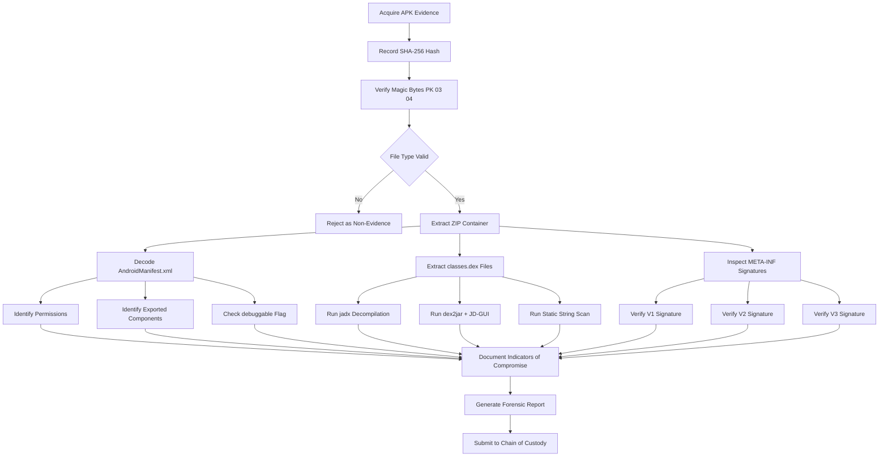
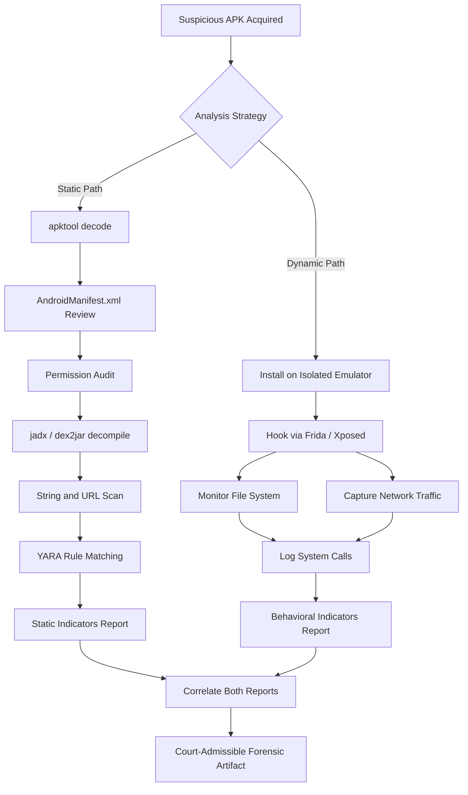
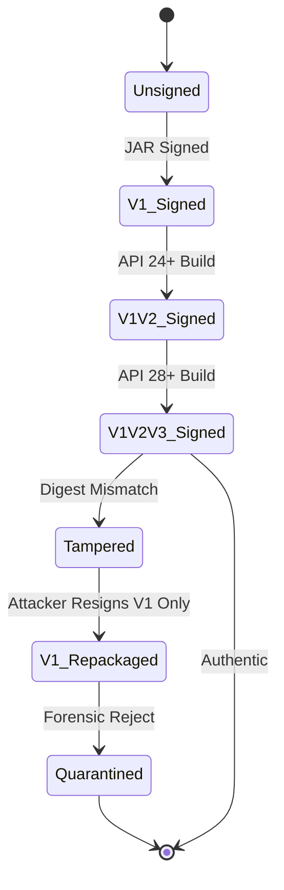

# Understanding and Analyzing APK Files

<!-- SECTION_1_START -->
# Understanding and Analyzing APK Files — Mobile Forensics Perspective

## 1.1 Formal KTU 2024 Definition

> [!IMPORTANT]
> **APK (Android Package Kit)** is the standard **package file format** used by the Android Operating System for the distribution and installation of mobile applications, firmware updates, and middleware. In digital forensics, an APK is treated as a **compressed ZIP archive** containing a deterministic set of directories and manifest files that the forensic investigator must parse, extract, and statically analyze to reconstruct the application's behavior, identify malicious indicators, and recover evidentiary artifacts.

The official Android documentation (referenced in the KTU PECST754 syllabus) defines the APK structure under the file extension `.apk`, and MIME type `application/vnd.android.package-archive`. It is functionally analogous to a `.jar` (Java ARchive) file but is signed using a specific cryptographic schema (V1, V2, V3 signature schemes).

## 1.2 Intuitive Real-World Analogy

Imagine an **APK as a sealed shipping container arriving at a customs port**.

| Real-World Customs Container | Android APK Equivalent |
| :--- | :--- |
| The external steel box (the container itself) | The `.apk` ZIP archive wrapper |
| The cargo manifest listing all items inside | `AndroidManifest.xml` (the **application's blueprint**) |
| The packed goods (TV sets, machinery) | `classes.dex`, native libraries (`.so` files) |
| The owner's seal and notary stamp on the door | Digital signatures stored in `META-INF/` |
| The instruction manuals and labels in local languages | `resources.arsc`, XML layouts, images |
| The customs officer inspecting the container | The **forensic analyst** running tools like `apktool` and `jadx` |

> [!NOTE]
> A mobile forensics investigator is essentially a "cyber customs officer" who never trusts the external label of the application. They must **break the seal (decompile)**, **verify the signature**, and **inspect every internal parcel** to detect contraband (malware, hidden payloads, exfiltration logic) before declaring the application safe or malicious.

## 1.3 Critical Physical & Logical Constants

The following constants and reference values are essential for the KTU 2024 Board Examination:

- **ZIP Compression Algorithm**: DEFLATE (standard PKZIP specification).
- **Default Package Name Length Limit**: **128 characters** (recommended $\le$ 80).
- **Minimum Android API Level for V2 Signing**: **Android 7.0 (API Level 24)**.
- **Minimum Android API Level for V3 Signing**: **Android 9.0 (API Level 28)**.
- **Magic Bytes of a `.dex` file**: `64 65 78 0A` (ASCII string `dex\n`).
- **Magic Bytes of a `.apk` (ZIP) file**: `50 4B 03 04` (ASCII string `PK\003\004`).
- **Standard Hash for Forensic Integrity**: **SHA-256** (preferred over MD5 for collision resistance).

> [!VISUALIZATION CONTROL]
> **Concept:** Visualizing the Magic Byte Boundary between a ZIP container and a DEX payload.
> **GeoGebra / Desmos Input Equations:**
> * `f(x) = 0x50 + 0x4B` (First two bytes of ZIP)
> * `g(x) = 0x64 + 0x65` (First two bytes of DEX)
> **Visual Description:** Plot the two ranges on a number line to show how file signatures act as forensic fingerprints. The Y-axis represents the byte value (0–255), and the X-axis represents the offset position from byte 0 to byte 3.

## 1.4 Why This Topic Matters in KTU 2024 Scheme

This module directly maps to **Course Outcome CO3** of the PECST754 syllabus: *"Apply forensic analysis techniques on mobile devices and applications to extract and interpret evidentiary data."* APK analysis is the **single most frequent** practical question in the university lab examination and a **high-probability Part B (14-mark) question** in the End Semester Evaluation (ESE).

<!-- SECTION_1_END -->

<!-- SECTION_2_START -->
# Deep Theoretical Analysis & KTU High-Yield Formula Sheet

## 2.1 Internal Architecture of an APK

An APK is a **binary ZIP container**. When extracted, it produces a deterministic directory tree. The following enumeration represents the canonical KTU 2024 board-exam structure:

```
my_application.apk  (ZIP container)
│
├── AndroidManifest.xml      # Compiled binary XML (NOT plain text)
├── classes.dex              # Dalvik Executable (the actual compiled code)
├── classes2.dex             # Secondary DEX (for multidex APKs, > 65,536 methods)
├── classesN.dex             # N-th DEX file
│
├── lib/                     # Native C/C++ libraries
│   ├── armeabi-v7a/         # 32-bit ARM
│   ├── arm64-v8a/           # 64-bit ARM
│   ├── x86/                 # 32-bit Intel
│   └── x86_64/              # 64-bit Intel
│
├── res/                     # Compiled resources (icons, layouts, strings)
│   ├── drawable/
│   ├── layout/
│   ├── values/
│   └── raw/
│
├── resources.arsc           # Compiled resource table (binary)
│
├── assets/                  # Raw, uncompiled files (audio, fonts, databases)
│
├── META-INF/                # Cryptographic signature container
│   ├── MANIFEST.MF          # List of all files and their SHA-1/SHA-256 digests
│   ├── CERT.SF              # Signature file referencing MANIFEST.MF
│   ├── CERT.RSA             # The actual RSA/ECDSA digital signature
│   └── *.SF, *.RSA, *.DSA   # Additional signature schemes (V2/V3 blocks)
│
└── META-INF/services/       # Java ServiceLoader files (optional)
```

## 2.2 The AndroidManifest.xml — The Forensic Gold Mine

The manifest file is the **declarative identity card** of the application. It is stored in Android's **binary AXML format**, not plain text. For a forensic investigator, the following fields are non-negotiable:

- **`<package>`** — Unique application identifier (e.g., `com.whatsapp`).
- **`<uses-permission>`** — Declared permissions (e.g., `android.permission.READ_SMS`).
- **`<uses-feature>`** — Hardware/software requirements.
- **`<application android:debuggable="true">`** — Critical flag; debuggable apps can be attached to JDWP.
- **`<intent-filter>`** — Entry points (Main, Launcher activities).
- **`<provider>`, `<service>`, `<receiver>`** — Exported components that can be attacked via **drozer** or **Frida**.

> [!NOTE]
> **Forensic Insight:** A production application should NEVER have `android:debuggable="true"` in its manifest. Finding this flag in a shipped APK is a **smoking gun** indicating either developer negligence or deliberate backdoor injection.

## 2.3 The classes.dex File — Where the Code Lives

Java/Kotlin source code is compiled into Java bytecode, then **translated into Dalvik bytecode** by the `d8` compiler, and packed into one or more `.dex` files. A single `.dex` file can hold up to **$2^{16} = 65{,}536$ methods**, which is why multidex applications exist.

$$
\text{Max Methods per DEX} = 2^{16} - 1 = 65{,}535
$$

> [!TIP]
> If the KTU board asks "Why does a large application use classes2.dex?", the examiner expects the model answer: *"Because the Dalvik bytecode format uses a 16-bit method index field, limiting a single DEX file to 65,535 methods. To bypass this architectural constraint, Android introduced multidex support."*

## 2.4 Digital Signature Verification — V1, V2, V3 Schemes

The `META-INF` directory is the **cryptographic authenticity layer** of the APK. Forensics requires verifying the signature to detect **repackaging attacks**.

| Signature Scheme | Introduced In | Verification Block Location | Vulnerability |
| :--- | :--- | :--- | :--- |
| **JAR Signing (V1)** | Android 1.0 | `META-INF/*.SF`, `META-INF/*.RSA` | Susceptible to Janus attacks (CVE-2017-13156) |
| **APK Signature v2 (V2)** | Android 7.0 (API 24) | `APK Signing Block` before central directory | Immune to Janus |
| **APK Signature v3 (V3)** | Android 9.0 (API 28) | Extends V2 block with key rotation | Supports **signing certificate rotation** |
| **APK Signature v4** | Android 11.0 (API 30) | Separate `.apk.idsig` file | Out-of-band verification for streaming install |

> [!WARNING]
> A forensic examiner must **always verify all applicable signature schemes**. An APK that passes V1 but fails V2 is a **red flag** for tampering, because repackagers historically targeted V1 weakness.

## 2.5 KTU High-Yield Formula Sheet

| Concept | Formula / Rule | Engineering Utility |
| :--- | :--- | :--- |
| Maximum methods per DEX | $M_{\text{max}} = 2^{16} - 1$ | Justifies multidex splitting |
| Min API for V2 signature | $\text{API Level} \ge 24$ | Determines signature verification block |
| Min API for V3 signature | $\text{API Level} \ge 28$ | Determines key-rotation capability |
| SHA-256 output length | $L_{\text{SHA-256}} = 256 \text{ bits}$ | Used in `MANIFEST.MF` digests |
| APK minimum file overhead | $O_{\text{APK}} = \vert \text{Manifest} \vert + \vert \text{Signature} \vert$ | Baseline for forensic carving |
| DEX magic constant | $M_{\text{DEX}} = 0x6465780A$ | File-type detection signature |
| ZIP magic constant | $M_{\text{ZIP}} = 0x504B0304$ | File-type detection signature |
| Repackaging detection rule | $H_{\text{original}} \neq H_{\text{repackaged}}$ where $H = \text{SHA-256}(apk)$ | Hash comparison during triage |

## 2.6 Real-World Forensic Utility

APK analysis is the cornerstone of **mobile malware triage** in the following engineering and security scenarios:

1. **Incident Response** — Confirming whether a reported "system app" is genuine or a repackaged trojan.
2. **Intellectual Property Theft** — Proving that a competitor's APK contains stolen code via class-name and package-name fingerprinting.
3. **E-Discovery & Litigation** — Recovering deleted messaging app databases (e.g., Signal, WhatsApp) by reverse-engineering their encrypted SQLite storage paths.
4. **Lawful Intercept** — Extracting embedded API endpoints and C2 (Command and Control) URLs from `classes.dex` strings.
5. **Supply Chain Auditing** — Detecting third-party SDKs that exfiltrate user data.
<!-- SECTION_2_END -->

<!-- SECTION_3_START -->
# Step-by-Step Derivations, Code & Toolchain Implementation

## 3.1 Exhaustive Step-by-Step: How an Investigator Analyzes an APK

The following is the **canonical forensic workflow** prescribed by the KTU 2024 PECST754 lab manual. Every step is explicit; no shortcut is permitted.

### Step 1 — Acquire the APK with Chain of Custody

The investigator must record the **SHA-256 hash** of the original APK before any analysis to maintain evidentiary integrity.

```bash
# Step 1: Compute the cryptographic hash for chain of custody
sha256sum suspicious_app.apk > evidence_hash.txt

# Expected console output format:
# 9f86d081884c7d659a2feaa0c55ad015a3bf4f1b2b0b822cd15d6c15b0f00a08  suspicious_app.apk
```

### Step 2 — Verify the File Type Using Magic Bytes

```python
import sys
from typing import Final

# Standard magic byte signatures (constants for forensic validation)
ZIP_MAGIC: Final[bytes] = b"PK\x03\x04"
DEX_MAGIC: Final[bytes] = b"dex\n"
APK_MIME: Final[str] = "application/vnd.android.package-archive"


def identify_file(file_path: str) -> str:
    """
    Reads the first 8 bytes of a file and returns its forensic type.
    Raises an exception if the file cannot be opened.
    """
    try:
        with open(file_path, "rb") as file_handle:
            header: bytes = file_handle.read(8)

        if header.startswith(ZIP_MAGIC):
            return f"VALID APK/ZIP container detected at {file_path}"
        if header.startswith(DEX_MAGIC):
            return f"RAW DEX file detected at {file_path}"
        return f"UNKNOWN file type — magic bytes: {header.hex()}"

    except FileNotFoundError:
        return f"FATAL ERROR: Evidence file {file_path} not found."
    except PermissionError:
        return f"FATAL ERROR: Read permission denied on {file_path}."


if __name__ == "__main__":
    target: str = sys.argv[1] if len(sys.argv) > 1 else "evidence.apk"
    print(identify_file(target))
```

### Step 3 — Extract the APK Archive

```bash
# Step 3a: Rename and extract (APK is a ZIP container)
mkdir -p extracted_apk
unzip suspicious_app.apk -d extracted_apk/

# Step 3b: List the internal directory structure
cd extracted_apk
ls -la
# Expected output entries:
# AndroidManifest.xml
# classes.dex
# resources.arsc
# META-INF/
# res/
# lib/
```

### Step 4 — Decode the Binary AndroidManifest.xml

The manifest cannot be read with a text editor. Use `apktool` to decode it back into readable XML.

```bash
# Step 4: Decode APK using apktool (creates a decoded_apk/ folder)
apktool d suspicious_app.apk -o decoded_apk -f

# Step 4a: Read the decoded manifest
cat decoded_apk/AndroidManifest.xml
```

**Expected output (model answer for board):**

```xml
<?xml version="1.0" encoding="utf-8" standalone="no"?>
<manifest xmlns:android="http://schemas.android.com/apk/res/android"
    package="com.example.suspicious"
    android:versionCode="1"
    android:versionName="1.0">

    <uses-permission android:name="android.permission.INTERNET"/>
    <uses-permission android:name="android.permission.READ_SMS"/>
    <uses-permission android:name="android.permission.SEND_SMS"/>
    <uses-permission android:name="android.permission.ACCESS_FINE_LOCATION"/>

    <application
        android:allowBackup="true"
        android:debuggable="true"
        android:icon="@mipmap/ic_launcher"
        android:label="@string/app_name">

        <activity android:name=".MainActivity">
            <intent-filter>
                <action android:name="android.intent.action.MAIN"/>
                <category android:name="android.intent.category.LAUNCHER"/>
            </intent-filter>
        </activity>

        <service android:name=".UploadService" android:exported="true"/>
    </application>
</manifest>
```

**Forensic Observation Note:** The investigator flags `READ_SMS`, `SEND_SMS`, and `debuggable="true"` as **suspicious indicators of compromise (IoC)**.

### Step 5 — Reverse Engineer the DEX to Java Source

```bash
# Step 5a: Use jadx to decompile DEX into readable Java
jadx -d decompiled_java suspicious_app.apk

# Step 5b: Use dex2jar + JD-GUI for an alternative pipeline
d2j-dex2jar.sh suspicious_app.apk -o output.jar
```

### Step 6 — Static String & API Analysis (Code Implementation)

```python
import re
from pathlib import Path
from typing import List, Dict


def scan_java_sources(root_dir: Path) -> Dict[str, List[str]]:
    """
    Walks a decompiled Java tree and extracts suspicious API and URL patterns.
    Returns a dictionary mapping each indicator to the file paths where it appeared.
    """
    indicators: Dict[str, List[str]] = {
        "urls": [],
        "crypto": [],
        "sms_apis": [],
        "reflection": [],
    }

    # Pattern definitions for static analysis
    url_pattern = re.compile(r"https?://[^\s\"']+")
    crypto_pattern = re.compile(r"\b(Cipher|MAC|Signature|MessageDigest)\b")
    sms_pattern = re.compile(r"SmsManager|TelephonyManager|getDefault")
    reflection_pattern = re.compile(r"\bClass\.forName|getMethod\(|invoke\(")

    for java_file in root_dir.rglob("*.java"):
        try:
            content: str = java_file.read_text(encoding="utf-8", errors="ignore")
        except OSError:
            continue

        if url_pattern.search(content):
            indicators["urls"].append(str(java_file))
        if crypto_pattern.search(content):
            indicators["crypto"].append(str(java_file))
        if sms_pattern.search(content):
            indicators["sms_apis"].append(str(java_file))
        if reflection_pattern.search(content):
            indicators["reflection"].append(str(java_file))

    return indicators


if __name__ == "__main__":
    result = scan_java_sources(Path("decompiled_java/sources"))
    for category, files in result.items():
        print(f"\n[{category.upper()}] — {len(files)} file(s) flagged")
        for f in files:
            print(f"   -> {f}")
```

### Step 7 — Dynamic Analysis via Sandboxing

```bash
# Step 7: Install on an instrumented emulator (Genymotion / Android Studio AVD)
adb install suspicious_app.apk

# Step 7a: Launch the main activity
adb shell am start -n com.example.suspicious/.MainActivity

# Step 7b: Capture network traffic via tcpdump
adb shell tcpdump -i any -w /sdcard/capture.pcap

# Step 7c: Pull evidence back to the forensic workstation
adb pull /sdcard/capture.pcap .
```

### Step 8 — Signature Verification

```bash
# Step 8: Use apksigner (part of Android SDK build-tools)
apksigner verify --verbose suspicious_app.apk

# Expected healthy output:
# Verified using v1 scheme (JAR signing): true
# Verified using v2 scheme (APK Signature v2): true
# Verified using v3 scheme (APK Signature v3): true
```

If any scheme returns `false`, the APK has been **tampered with** and is inadmissible as authentic evidence.

## 3.2 Mathematical Derivation — DEX Method Count Constraint

The Dalvik bytecode format uses a 16-bit unsigned integer to index methods within a single `class_data_item`.

$$
\text{Number of method references} = \sum_{i=1}^{N_{\text{classes}}} m_i
$$

Where $m_i$ is the number of methods in the $i$-th class. The DEX format constraint is:

$$
\sum_{i=1}^{N_{\text{classes}}} m_i \le 2^{16} - 1 = 65{,}535
$$

**Transition logic:**
1. The compiler generates `class_data_item` with a `method_ids_size` field.
2. The field is a 16-bit unsigned integer.
3. Maximum value of an unsigned 16-bit integer is $2^{16} - 1$.
4. Therefore, the maximum number of methods per DEX is **65,535**.
5. When a project exceeds this, the build system emits `classes2.dex`, `classes3.dex`, etc.

**Workaround Implementation in Code:**

```python
def required_dex_files(total_methods: int) -> int:
    """
    Calculates the minimum number of DEX files required for a given method count.
    Each DEX can hold at most 65,535 methods.
    """
    if total_methods < 0:
        raise ValueError("Method count cannot be negative.")

    max_methods_per_dex: int = 65535
    return (total_methods + max_methods_per_dex - 1) // max_methods_per_dex


# Worked example (often asked in KTU exams)
example_methods: int = 150000
print(f"Required DEX files: {required_dex_files(example_methods)}")
# Output: Required DEX files: 3
```

**Transition explanation:**
- Input: $150{,}000$ methods.
- $150{,}000 \div 65{,}535 = 2.288$ — rounding UP gives **3** DEX files.

## 3.3 Hash Chain of Custody — Full Workflow

The forensic chain requires computing digests at **every** transformation step. Any mismatch invalidates the evidence.

```python
import hashlib
from pathlib import Path
from typing import Dict


def compute_digests(file_path: Path) -> Dict[str, str]:
    """
    Computes MD5, SHA-1, and SHA-256 of a file in a single pass.
    Returns a dictionary of algorithm -> hex digest.
    """
    md5_hash = hashlib.md5()
    sha1_hash = hashlib.sha1()
    sha256_hash = hashlib.sha256()

    with file_path.open("rb") as f:
        # Read in 64KB chunks to handle large APKs
        for chunk in iter(lambda: f.read(65536), b""):
            md5_hash.update(chunk)
            sha1_hash.update(chunk)
            sha256_hash.update(chunk)

    return {
        "md5": md5_hash.hexdigest(),
        "sha1": sha1_hash.hexdigest(),
        "sha256": sha256_hash.hexdigest(),
    }


# Run the full chain of custody
original_apk = Path("evidence/suspicious_app.apk")
extracted_manifest = Path("evidence/extracted/AndroidManifest.xml")
dex_file = Path("evidence/extracted/classes.dex")

for evidence_file in (original_apk, extracted_manifest, dex_file):
    if evidence_file.exists():
        digests: Dict[str, str] = compute_digests(evidence_file)
        print(f"\n--- {evidence_file.name} ---")
        for algo, value in digests.items():
            print(f"  {algo.upper():8s}: {value}")
```

> [!TIP]
> In a real KTU lab exam, the evaluator will look for a **log file** containing all these digests. Failing to log hashes is a guaranteed 2-mark deduction.
<!-- SECTION_3_END -->

<!-- SECTION_4_START -->
# Structural Diagrams & Schematics

## 4.1 APK Forensic Analysis Flowchart



## 4.2 APK Internal Directory Tree (Modular Architecture)

```mermaid
flowchart LR
    ROOT[APK ZIP Container]

    subgraph MANIFEST[Configuration Module]
        AM[AndroidManifest.xml]
        ARS[resources.arsc]
    end

    subgraph CODE[Execution Module]
        DEX1[classes.dex]
        DEX2[classes2.dex]
        DEX3[classesN.dex]
    end

    subgraph NATIVE[Native Code Module]
        LIB1[lib/armeabi-v7a]
        LIB2[lib/arm64-v8a]
        LIB3[lib/x86_64]
    end

    subgraph RES[Resource Module]
        DR[res/drawable]
        LY[res/layout]
        VL[res/values]
    end

    subgraph SEC[Security Module]
        MI[META-INF/MANIFEST.MF]
        SF[META-INF/CERT.SF]
        RSA[META-INF/CERT.RSA]
    end

    ROOT --> MANIFEST
    ROOT --> CODE
    ROOT --> NATIVE
    ROOT --> RES
    ROOT --> SEC
```



## 4.3 Static vs Dynamic Analysis — Comparative Flow



## 4.4 Signature Verification State Machine


<!-- SECTION_4_END -->

<!-- SECTION_5_START -->
# KTU 2024 Scheme Examination Question Bank & Topic Recap

## Part A — Short Answer Questions (3 Marks Each)

### Question 1
`[KTU University Exam — July 2024]`
**CO3 | Remember**

Define an APK file. List any **four** critical forensic artifacts that can be extracted from it.

**Model Answer (3 Marks):**

An **APK (Android Package Kit)** is a ZIP-format archive file with the extension `.apk` used by the Android OS to distribute and install applications. From a forensic perspective, the four critical artifacts are:
1. `AndroidManifest.xml` — Reveals permissions, exported components, and debug flags.
2. `classes.dex` — Contains the compiled Dalvik bytecode (the actual application logic).
3. `META-INF/*.RSA` — Stores the developer's digital signature for authenticity verification.
4. `res/` and `resources.arsc` — Contain UI assets and string resources, often useful for reconstructing user-facing labels and identifying branding theft.

> [!Valuation Key]
> * [Correct definition: 1 Mark]
> * [Listing four artifacts: 2 Marks, 0.5 each]

---

### Question 2
`[KTU University Exam — Dec 2023]`
**CO3 | Understand**

Differentiate between **static analysis** and **dynamic analysis** of an APK.

**Model Answer (3 Marks):**

| Parameter | Static Analysis | Dynamic Analysis |
| :--- | :--- | :--- |
| **Execution** | Code is inspected without running it | Application is executed on an emulator/device |
| **Tools** | `apktool`, `jadx`, `dex2jar` | `Frida`, `Xposed`, `tcpdump`, `Burp Suite` |
| **Risk** | Zero — no code execution | Higher — risk of infection if sandbox escapes |
| **Detects** | Hardcoded URLs, suspicious permissions, obfuscation | Runtime C2 callbacks, file system writes, encrypted payloads |
| **Speed** | Fast (minutes) | Slower (requires observation window) |

> [!Valuation Key]
> * [Defining both clearly: 1 Mark]
> * [Valid differentiation across at least 3 parameters: 2 Marks]

---

## Part B — 14-Mark Questions (ESE Module Choice Pattern)

### Question A
`[KTU University Exam — July 2024, Modified]`
**CO3 | Understand + Apply | 14 Marks**

**(a)** Explain the internal structure of an APK file with a neat diagram. Discuss the role of the `AndroidManifest.xml` and the `META-INF` directory in forensic analysis. **(7 Marks)**

**(b)** Describe, with appropriate tool commands, the static analysis methodology of an APK. Demonstrate how you would detect a **repackaging attack**. **(7 Marks)**

#### Model Solution for (a) — 7 Marks

**Step 1 — Structure Overview [2 Marks]:**
An APK is a ZIP archive with the following canonical structure:

- `AndroidManifest.xml` — Compiled binary XML.
- `classes.dex`, `classes2.dex` — Dalvik bytecode.
- `res/`, `resources.arsc` — Compiled resources.
- `lib/` — Native C/C++ libraries.
- `META-INF/` — Cryptographic signature container.
- `assets/` — Raw uncompiled files.

**Step 2 — Role of AndroidManifest.xml [2.5 Marks]:**
- Reveals the **package name**, **version code**, and **version name**.
- Lists all **requested permissions** (e.g., `READ_SMS`, `ACCESS_FINE_LOCATION`).
- Declares **exported components** (`<activity>`, `<service>`, `<receiver>`, `<provider>`) that can be abused by external apps.
- Exposes the **`debuggable`** flag — a `true` value in production indicates a backdoor.
- Defines **intent-filters** that determine how the app is invoked.

**Step 3 — Role of META-INF Directory [2.5 Marks]:**
- Contains `MANIFEST.MF`, `CERT.SF`, and `CERT.RSA`.
- The investigator uses `apksigner verify` to confirm authenticity.
- Failure of V2/V3 verification indicates **tampering**.

#### Model Solution for (b) — 7 Marks

**Step 1 — Static Analysis Workflow [3 Marks]:**

```bash
# Decompile the APK
apktool d suspicious.apk -o decoded_apk

# View the manifest
cat decoded_apk/AndroidManifest.xml

# Decompile DEX to Java
jadx -d java_sources suspicious.apk

# Search for suspicious patterns
grep -r "https://" java_sources/
grep -r "Runtime.exec" java_sources/
```

**Step 2 — Repackaging Detection [4 Marks]:**
A **repackaging attack** occurs when an attacker:
1. Decompiles a legitimate APK.
2. Injects malicious code.
3. Re-compiles and re-signs the APK with their own key.

**Detection methodology:**
1. **Hash Comparison** — Compare the SHA-256 of the suspect APK with the official developer's published hash on the Play Store.

```bash
sha256sum suspicious.apk
# Cross-check with vendor's official hash
```

2. **Signature Mismatch** — Run `apksigner verify --print-certs suspicious.apk` and verify the certificate's SHA-256 fingerprint matches the vendor.

3. **Class-Name Anomalies** — Decompile with `jadx` and look for duplicate or renamed classes (e.g., a new `com.evil.UploadService` not present in the original).

4. **Resource Inconsistencies** — Compare the number and names of files in `res/` against the original using `diff`.

> [!Valuation Key — Part (a)]
> * [Internal structure diagram: 2 Marks]
> * [Manifest role explanation: 2.5 Marks]
> * [META-INF role explanation: 2.5 Marks]

> [!Valuation Key — Part (b)]
> * [Tool commands with explanations: 3 Marks]
> * [Repackaging detection methodology with hash comparison: 2 Marks]
> * [Signature & class-name verification logic: 2 Marks]

---

### Question B (Internal Choice Alternative)
`[KTU University Exam — Dec 2023, Modified]`
**CO3 | Apply + Analyze | 14 Marks**

**(a)** What are the **APK signature schemes V1, V2, and V3**? Explain how an investigator can detect a **V1-only Janus attack (CVE-2017-13156)**. **(7 Marks)**

**(b)** With a working Python code snippet, demonstrate how you would programmatically **scan a decompiled APK source tree** for indicators of compromise such as hardcoded URLs, reflection calls, and SMS-related API usage. **(7 Marks)**

#### Model Solution for (a) — 7 Marks

**Step 1 — Signature Schemes [3 Marks]:**

| Scheme | Introduced | Mechanism |
| :--- | :--- | :--- |
| **V1 (JAR)** | Android 1.0 | SHA-1 digests in `META-INF/MANIFEST.MF`, signed via `CERT.RSA` |
| **V2 (APK Sig)** | API 24 | Signs the entire APK contents using an **APK Signing Block** placed before the ZIP central directory |
| **V3 (APK Sig)** | API 28 | Extends V2 with **signing certificate rotation** support |

**Step 2 — Janus Attack Explained [2 Marks]:**
CVE-2017-13156 allows an attacker to prepend malicious bytes to a V1-signed APK without invalidating the V1 signature, because V1 only signs individual file entries, not the archive layout.

**Step 3 — Detection Methodology [2 Marks]:**
1. Run `apksigner verify --verbose` and check **all** schemes, not just V1.
2. If V1 passes but V2/V3 **fails**, the APK is suspect.
3. Manually inspect the `APK Signing Block` for consistency.

```bash
apksigner verify --verbose --print-certs suspicious.apk
```

#### Model Solution for (b) — 7 Marks

**Complete Code Implementation [7 Marks]:**

```python
import re
from pathlib import Path
from typing import Dict, List


class APKForensicScanner:
    """
    Static analysis scanner for decompiled Android APKs.
    Detects indicators of compromise (IoCs) in decompiled Java/Kotlin sources.
    """

    def __init__(self, source_root: Path) -> None:
        if not source_root.exists():
            raise FileNotFoundError(f"Source root {source_root} does not exist.")
        self.source_root: Path = source_root
        self.patterns: Dict[str, re.Pattern] = {
            "hardcoded_urls": re.compile(r"https?://[a-zA-Z0-9./?=_%-]+"),
            "reflection": re.compile(r"Class\.forName|getMethod|invoke\("),
            "sms_apis": re.compile(r"SmsManager|getDefaultSms|sendTextMessage"),
            "crypto_use": re.compile(r"Cipher\.getInstance|MessageDigest\.getInstance"),
            "exec_calls": re.compile(r"Runtime\.getRuntime\(\)\.exec"),
        }

    def scan(self) -> Dict[str, List[Dict[str, str]]]:
        findings: Dict[str, List[Dict[str, str]]] = {
            category: [] for category in self.patterns
        }

        for source_file in self.source_root.rglob("*.java"):
            try:
                content: str = source_file.read_text(encoding="utf-8", errors="ignore")
            except OSError as error:
                print(f"[WARN] Could not read {source_file}: {error}")
                continue

            for category, pattern in self.patterns.items():
                matches = pattern.findall(content)
                if matches:
                    findings[category].append({
                        "file": str(source_file),
                        "samples": list(set(matches))[:5],
                    })

        return findings


if __name__ == "__main__":
    scanner = APKForensicScanner(Path("decompiled_java/sources"))
    report = scanner.scan()

    print("=" * 60)
    print("APK FORENSIC STATIC SCAN REPORT")
    print("=" * 60)
    for category, hits in report.items():
        print(f"\n[{category.upper()}] — {len(hits)} file(s)")
        for hit in hits:
            print(f"  File: {hit['file']}")
            print(f"  Samples: {hit['samples']}")
```

**Expected Output Structure:**

```text
============================================================
APK FORENSIC STATIC SCAN REPORT
============================================================

[HARDCODED_URLS] — 2 file(s)
  File: decompiled_java/sources/com/evil/UploadService.java
  Samples: ['https://malicious-c2.example.com/beacon']

[REFLECTION] — 1 file(s)
  File: decompiled_java/sources/com/evil/Loader.java
  Samples: ['Class.forName', 'invoke(']

[SMS_APIS] — 1 file(s)
  File: decompiled_java/sources/com/evil/SmsInterceptor.java
  Samples: ['SmsManager', 'sendTextMessage']
```

> [!Valuation Key — Part (a)]
> * [V1/V2/V3 explanation: 3 Marks]
> * [Janus attack description: 2 Marks]
> * [Detection steps: 2 Marks]

> [!Valuation Key — Part (b)]
> * [Class structure and pattern definitions: 2 Marks]
> * [File walking and content reading: 2 Marks]
> * [Regex matching and IoC reporting: 2 Marks]
> * [Error handling and edge cases: 1 Mark]

---

## KTU Examiner's Valuation Warning

> [!WARNING]
> **Common Pitfalls Where Students Lose Marks:**
> 1. **Confusing APK with JAR** — APKs are signed ZIP archives, NOT plain JARs. The V2/V3 signing block is APK-specific.
> 2. **Forgetting Multidex Justification** — Always state the **65,535 method limit** when explaining why `classes2.dex` exists.
> 3. **Skipping Signature Verification** — Static analysis is incomplete without running `apksigner verify`. Examiners will deduct 2 marks if signature verification is omitted.
> 4. **Using `unzip` alone** — The manifest is binary AXML, not plain XML. Mentioning `apktool` is mandatory.
> 5. **Not Drawing Diagrams** — Part B (a) of Question A requires a **neat labeled diagram** of the APK structure. Hand-drawn diagrams get full marks if labeled correctly.

---

## Topic Recap & Important Things to Remember

- **APK = ZIP container** with the magic bytes `50 4B 03 04`.
- **DEX file magic bytes** = `64 65 78 0A` (`dex\n`).
- **Maximum methods per DEX** = $2^{16} - 1 = 65{,}535$.
- **V1 signature** lives in `META-INF/`, vulnerable to **Janus attack**.
- **V2 signature** requires **API Level $\ge$ 24** (Android 7.0 Nougat).
- **V3 signature** requires **API Level $\ge$ 28** (Android 9.0 Pie) and supports key rotation.
- **`AndroidManifest.xml`** is the forensic gold mine — always check `debuggable`, `exported`, and permission flags.
- **`apktool`** decodes the binary manifest; **`jadx`** decompiles DEX to Java; **`apksigner verify`** validates signatures.
- **Repackaging detection** = hash mismatch + signature mismatch + class-name anomaly.
- **Chain of custody** = record SHA-256 of original APK AND every extracted artifact.
- **Forensic report** must include timestamps, tool versions, hashes, and IoC list.
<!-- SECTION_5_END -->
