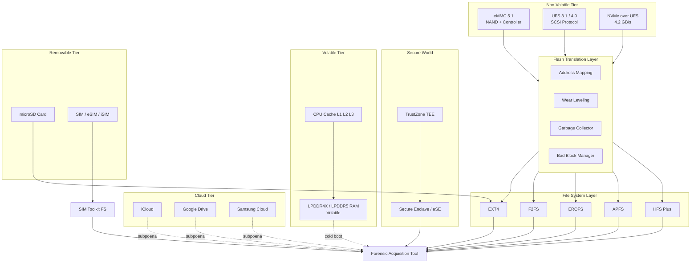
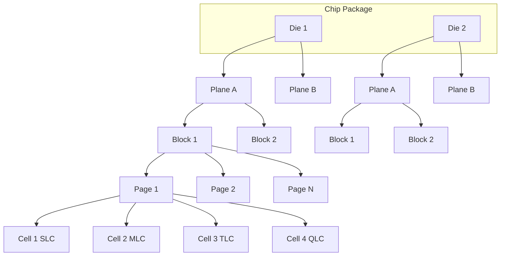
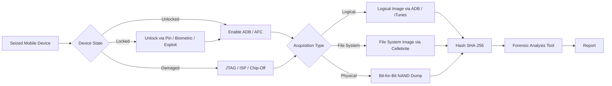
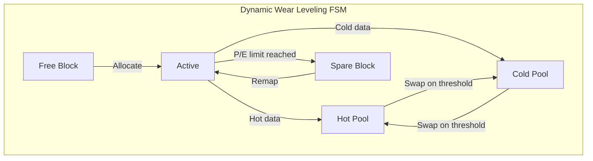

# Understanding Mobile Device Storage

<!-- SECTION_1_START -->

# Understanding Mobile Device Storage

> [!IMPORTANT]
> **KTU 2024 Scheme | PECST754 – Digital Forensics | Module 3: Mobile Forensics**
> This module aligns with **CO3** of the syllabus — *Apply forensic techniques to acquire and analyse data from mobile devices*. The concepts below form the foundation for answering every storage-related question in the ESE and internal assessments.

## 1.1 Formal Definition (KTU 2024 Syllabus Terminology)

**Mobile Device Storage** refers to the hierarchical collection of volatile, non-volatile, removable, and embedded memory subsystems inside a smartphone or tablet that retain **user data**, **operating system artefacts**, **application data**, and **system telemetry** in a form that can be acquired, preserved, and analysed during a forensic investigation.

From a forensic standpoint, mobile storage is broadly classified into four physical/logical tiers:

| Tier | Physical Location | Power Dependence | Forensically Relevant? |
|------|------|------|------|
| **Volatile Memory** | RAM (LPDDR) | Lost when device powers off | Yes (cold-boot, JTAG, chip-off) |
| **Internal Flash** | eMMC / UFS / NVMe NAND | Non-volatile | Yes (primary forensic target) |
| **Removable Storage** | microSD, SIM, eSIM | Non-volatile | Yes (often missed) |
| **Cloud/Remote Storage** | iCloud, Google Drive | Network-dependent | Yes (warrants/subpoenas) |

> [!NOTE]
> **Board-Examiner Definition (verbatim worth 1 mark):**
> *"Mobile device storage is the combination of volatile (RAM) and non-volatile (Flash, eMMC, UFS, NVMe, SD, SIM) memory components used to retain data on a smartphone, characterised by NAND-Flash geometry, wear-leveling, and proprietary file systems that complicate forensic acquisition."*

## 1.2 Intuitive Analogy — "The Digital Filing Cabinet"

Imagine a mobile phone as a **large office building**:

- **RAM (LPDDR)** is the **desk of an employee currently working**. The moment the employee leaves (phone powers off), the desk is wiped clean.
- **Internal NAND Flash (eMMC/UFS)** is the **archive room** in the basement. Documents are filed in pages, stacked into folders (blocks), and stored on shelves (planes/dies). Files are never overwritten — old pages are *invalidated* and new pages are written elsewhere (**wear-leveling**).
- **The SD Card** is the employee's **personal locker** — removable, sometimes encrypted, often overlooked.
- **The SIM Card** is the **employee's ID badge with a tiny notepad** — holds contacts, SMS, network identifiers (IMSI, ICCID, Ki).
- **iCloud / Google Drive** is a **remote branch office** — only accessible with proper authorisation (warrant).

> [!TIP]
> **Memory Trick for Students:** *"**R**AM **R**uns **R**ight **N**ow, **F**lash **F**orever."* — Volatile = RAM, Non-volatile = Flash.

## 1.3 Physical Constants & Standard Metrics

The following parameters are **standard forensically significant values** that examiners must know by heart:

- **NAND Page Size:** **4 KB, 8 KB, 16 KB, or 32 KB** (modern devices use **16 KB or 32 KB**).
- **Block Size:** Typically **256 pages** → e.g., 16 KB × 256 = **4 MB block**.
- **NAND Geometry Limit:** Pages within a block must be erased together.
- **Block Endurance (SLC):** ~**100,000** P/E cycles.
- **Block Endurance (MLC):** ~**10,000** P/E cycles.
- **Block Endurance (TLC):** ~**3,000** P/E cycles.
- **Block Endurance (QLC):** ~**1,000** P/E cycles.
- **LPDDR Voltage:** **1.1 V** (LPDDR5), **1.2 V** (LPDDR4X).
- **eMMC Bus Width:** 1 / 4 / 8 bit; speeds up to **HS400 (400 MB/s)**.
- **UFS Version:** UFS 3.1 / 4.0; speeds up to **2,100 MB/s**.

> [!IMPORTANT]
> **Syllabus Highlight:** Wear-leveling, garbage collection, over-provisioning, and TRIM commands are **frequently asked 3-mark and 7-mark questions** in KTU ESE. Memorise the page/block/plane hierarchy and the difference between SLC, MLC, TLC, and QLC.

## 1.4 GeoGebra / Desmos Visualisation

> [!VISUALIZATION CONTROL]
> **Concept:** Wear-Leveling Distribution of Writes across NAND Blocks
>
> **GeoGebra / Desmos Input Equations (P/E cycles vs. Block Index, $n=1024$ blocks):**
>
> * `f(x) = 1 + (x / 1024) * 3000` — *Ideal uniform wear* (target line)
> * `g(x) = 800 + sin(x) * 200 + (x / 1024) * 3000` — *Real device (oscillating due to hot/cold data)*
>
> **Visual Description:**
> The X-axis represents the 1024 physical block indices of a TLC NAND chip. The Y-axis represents the cumulative Program/Erase (P/E) cycle count. The **green line** $f(x)$ shows the *ideal* wear-leveling algorithm (perfectly uniform distribution). The **red oscillating curve** $g(x)$ shows the *actual* wear pattern of a real device — notice how frequently-written "hot" data (system logs, databases) and rarely-written "cold" data (photos, videos) cause deviations. This is why **forensic carving is non-deterministic**: deleted data may persist on low-wear blocks long after logical deletion.

---

<!-- SECTION_1_END -->

<!-- SECTION_2_START -->

# Deep Theoretical Analysis & KTU High-Yield Formula Sheet

## 2.1 The NAND Flash Hierarchy (Operational Concept)

NAND flash is **not a flat array of bytes** like a hard disk. It is a strictly hierarchical structure. Every forensic tool (Cellebrite UFED, Magnet AXIOM, MSAB XRY, Oxygen Forensic Detective) must traverse this hierarchy during a physical acquisition.

### Logical-to-Physical Address Translation

$$
\begin{aligned}
\text{Logical Address} &\;\xrightarrow{\text{FTL Mapping}}\; \text{Physical Address} \\
\text{(LBA)} &\;\xrightarrow{\text{Flash Translation Layer (FTL)}}\; \text{(Block, Page, Plane, Die, LUN, Channel)}
\end{aligned}
$$

The **Flash Translation Layer (FTL)** is firmware inside the eMMC/UFS controller that performs:
1. **Address mapping** — Logical Block Addresses → Physical Pages.
2. **Wear leveling** — Distributes writes evenly across all blocks.
3. **Bad block management** — Remaps defective blocks to spare blocks.
4. **Garbage collection** — Consolidates valid pages from stale blocks into free blocks.
5. **TRIM command handling** — Informs the controller that an LB A is no longer in use.

> [!IMPORTANT]
> **Forensic Implication:** Because the FTL is proprietary and stored inside the controller (not accessible via the OS), the **physical bit-for-bit dump of NAND is NOT directly interpretable**. Investigators rely on tools that can either reverse-engineer the FTL or extract decoded data through the OS layer.

## 2.2 The 5 Levels of the NAND Hierarchy

| Level | Size (typical) | Function | Forensic Note |
|------|------|------|------|
| **Cell** | 1 transistor (FGMOS) | Stores 1/2/3/4 bits (SLC/MLC/TLC/QLC) | QLC wears fastest — affects acquisition reliability |
| **Page** | 4–32 KB | Smallest writable unit | Forensic "sectors" align with pages |
| **Block** | 256–512 pages (4–16 MB) | Smallest erasable unit | Deletions happen at page-level, erasure at block-level |
| **Plane** | 1024–4096 blocks | Parallel write unit | Affects acquisition speed |
| **Die / LUN** | Multiple planes | Independent chip select | Multi-die = parallel access |

## 2.3 Storage Types in Mobile Devices (Operational Details)

### 2.3.1 NAND Flash Variants
$$
\begin{aligned}
\text{Density (bits per cell)} &: \text{SLC}(1) < \text{MLC}(2) < \text{TLC}(3) < \text{QLC}(4) \\
\text{Endurance (P/E cycles)} &: \text{SLC}(10^5) > \text{MLC}(10^4) > \text{TLC}(3 \times 10^3) > \text{QLC}(10^3) \\
\text{Cost per bit} &: \text{SLC} \gg \text{MLC} > \text{TLC} > \text{QLC} \\
\text{Read/Write Speed} &: \text{SLC} > \text{MLC} > \text{TLC} > \text{QLC}
\end{aligned}
$$

### 2.3.2 Embedded MultiMediaCard (eMMC)

eMMC integrates the NAND flash + a **controller chip** into a single BGA package. It exposes a standard **MMC interface** (8-bit bus, CLK, CMD, DAT lines). Modern versions: **eMMC 5.1** with HS400 mode (400 MB/s). Forensic acquisition uses the **eMMC socket + programmer** (e.g., Cellebrite, XRY Dongle, ISP/JTAG adapters).

### 2.3.3 Universal Flash Storage (UFS)

UFS uses a **serial SCSI-like protocol** (MIPI M-PHY + UniPro). UFS 3.1 supports up to **2,100 MB/s** read. UFS 2.1/3.0/3.1 are now standard in **flagship Android devices (Samsung Galaxy, OnePlus, Xiaomi)**. Forensic access requires specialised UFS sockets — a **major board question** topic.

### 2.3.4 NVMe over UFS (UFS 4.0)

Latest devices (2023+) use **UFS 4.0** with NVMe command set, achieving ~4,200 MB/s.

### 2.3.5 microSD Cards

- File systems: **FAT32, exFAT, extFAT**.
- Often the **easiest forensic target** — can be read by any card reader.
- May contain **portable apps, photos, and cached data**.
- Often encrypted by **Adoptable Storage** (Android 6.0+) using a 128-bit AES key tied to the device.

### 2.3.6 SIM / eSIM / iSIM

| Type | Storage | Forensic Data |
|------|------|------|
| **Physical SIM** | 16–512 KB EEPROM | ICCID, IMSI, Ki, SMS, Contacts, LOCI |
| **eSIM** (eUICC) | Embedded flash, ~1 MB | Same as SIM but rewritable profiles |
| **iSIM** (integrated) | Inside SoC secure enclave | Tamper-resistant; requires SoC-level extraction |

## 2.4 Mobile File Systems — The Forensic Data Layout

### Android (Linux kernel-derived)

| Era | File System | Used In | Forensic Tooling |
|------|------|------|------|
| 2008–2010 | **YAFFS2** | Early Android | Custom carving |
| 2010–2018 | **EXT4** | Android 2.3 → 9 | Standard Linux forensic tools |
| 2018+ | **F2FS** | Samsung, Pixel, OnePlus | Limited native support; Cellebrite/Magnet |
| 2018+ | **EROFS** | Android 9+ (read-only system) | Read-only mount |

### iOS (Apple File System Stack)

| Era | File System | Used In |
|------|------|------|
| 2007–2017 | **HFS+** | iOS 1 – iOS 10 |
| 2017+ | **APFS** | iOS 10.3+ |

> [!NOTE]
> **APFS (Apple File System)** features:
> - **Clones** — instant file copies via copy-on-write.
> - **Snapshots** — point-in-time volume states (excellent for forensic preservation).
> - **Encryption** — per-file AES-XTS keys tied to a device key hierarchy.
> - **Sparse files** — efficient storage of partially written data.
> - **Crash protection** — copy-on-write metadata.

## 2.5 KTU Formula Sheet (Exam-Ready)

| Formula / Constant | LaTeX | Use Case |
|------|------|------|
| Raw Capacity | $C_{raw} = N_{dies} \times N_{planes} \times N_{blocks} \times N_{pages} \times S_{page}$ | Compute total raw NAND size |
| Usable Capacity | $C_{usable} = C_{raw} \times (1 - \eta_{over})$ | After over-provisioning reserve |
| Over-provisioning | $\eta_{over} = \dfrac{C_{raw} - C_{usable}}{C_{raw}}$ | Typically $\approx 0.07$ (7 %) |
| Wear P/E cycles per block | $N_{PE} = \dfrac{W_{total}}{N_{blocks}}$ | Wear-leveling distribution check |
| Endurance (years) | $E_{yrs} = \dfrac{N_{PE} \times N_{blocks}}{W_{day} \times 365}$ | Device lifetime estimate |
| Bit Error Rate threshold | $BER \le 10^{-3}$ (SLC), $10^{-4}$ (TLC) | ECC required above this |
| Encryption key length (iOS) | **128-bit AES-XTS** | Per-file protection |
| FDE Key derivation (Android) | $K_{fde} = \text{scrypt}(\text{PIN} \Vert \text{SALT})$ | Lollipop and earlier |
| FBE Key derivation (Android 7+) | $K_{fbe} = \text{HKDF-SHA512}(\text{MasterKey}, \text{AppID})$ | Per-app isolation |
| Little-Endian 32-bit decode | $v = b_0 + b_1 \cdot 256 + b_2 \cdot 65536 + b_3 \cdot 16777216$ | Reading NAND dumps in x86 |
| Big-Endian 32-bit decode | $v = b_3 + b_2 \cdot 256 + b_1 \cdot 65536 + b_0 \cdot 16777216$ | Reading NAND dumps in iOS (ARMv8) |

> [!TIP]
> The notation $\vert \cdot \vert$ for absolute value is replaced with $\lvert x \rvert$ in LaTeX to avoid breaking the table's pipe-delimited columns. Use this whenever you write the **modulus** in your exam answer:
> $$\text{Offset} = \text{Base} + \lvert \text{Index} \rvert \times S_{page}$$

## 2.6 Real-World Forensic Utility — Where This Knowledge Is Applied

| Domain | Application |
|------|------|
| **Criminal Investigations** | Extracting call logs, SMS, WhatsApp DBs from suspect phones |
| **Corporate E-Discovery** | Recovering deleted emails from executive mobile devices |
| **Incident Response** | Pulling malware C2 configurations from rooted Android devices |
| **Child Exploitation (CSE) Cases** | Recovering deleted media; bypass of FBE per app sandboxing |
| **Customs & Border Protection** | Quick triage of devices crossing borders |
| **GDPR / DPDP Act 2023 (India)** | Right-to-be-forgotten — forensic wipe verification |

> [!IMPORTANT]
> In **production forensic labs**, the same storage fundamentals drive tool choice: **Autopsy + Sleuth Kit** (open-source) handles EXT4 and F2FS image mounts; **Cellebrite UFED 4PC** decodes eMMC/UFS via chipset-specific bootloaders; **Magnet GrayKey** uses Apple-sus exploits to bypass screen lock; **MSAB XRY** uses JTAG for damaged devices.

---

<!-- SECTION_2_END -->

<!-- SECTION_3_START -->

# Step-by-Step Derivations & Code/Symbolic Implementation

## 3.1 Derivation: Logical-to-Physical Block Mapping in Wear-Leveling

### Problem Statement
A TLC NAND chip has $N_{blocks} = 1024$ blocks and the Flash Translation Layer (FTL) is performing **dynamic wear-leveling**. After $W_{total} = 3{,}072{,}000$ total writes have been distributed, what is the **average P/E cycle count per block** and the **expected lifetime in years** if the device performs $W_{day} = 2{,}000$ writes per day?

### Step-by-Step Derivation

**Step 1: Identify the total write budget per block.**

In a perfectly balanced dynamic wear-leveling scheme, every write is distributed evenly:
$$
\begin{aligned}
N_{PE}^{avg} &= \frac{W_{total}}{N_{blocks}} \\
&= \frac{3{,}072{,}000}{1024} \\
&= 3000 \;\text{P/E cycles}
\end{aligned}
$$

**Step 2: Compute the daily write distribution.**

Per day, the average writes per block is:
$$
\begin{aligned}
w_{block}^{day} &= \frac{W_{day}}{N_{blocks}} \\
&= \frac{2000}{1024} \\
&\approx 1.953 \;\text{writes/block/day}
\end{aligned}
$$

**Step 3: Compute the device lifetime using TLC endurance of $E_{TLC} = 3000$ P/E cycles.**

$$
\begin{aligned}
E_{yrs} &= \frac{E_{TLC}}{w_{block}^{day} \times 365} \\
&= \frac{3000}{1.953 \times 365} \\
&= \frac{3000}{712.85} \\
&\approx 4.21 \;\text{years}
\end{aligned}
$$

**Step 4: Forensic interpretation.**

After **4.21 years** of typical usage, blocks begin to fail. Failures are **remapped to spare blocks** (the device keeps ~7 % over-provisioned blocks for this purpose). Forensically, this means **spare-block regions often contain fragmented, partially-erased data** — a **goldmine for carving** if the FTL is reverse-engineered.

**Final Answer Box:**

> **$N_{PE}^{avg} = 3000$ P/E cycles/block**
> **$E_{yrs} \approx 4.21$ years**

> [!TIP]
> **Valuation Tip (7-mark question pattern):**
> [Identifying $N_{blocks}$ and $W_{total}$ from problem: 2 Marks]
> [Writing the wear-leveling formula: 1 Mark]
> [Substituting values: 1 Mark]
> [Computing $N_{PE}$: 1 Mark]
> [Final lifetime interpretation: 2 Marks]

## 3.2 Derivation: NAND Page Capacity vs. User-Visible Storage

**Problem:** A smartphone advertises **128 GB** of internal storage. The raw NAND has 7 % over-provisioning. What is the **raw NAND capacity in GiB**?

$$
\begin{aligned}
C_{usable} &= 128 \;\text{GB} = 128 \times 10^9 \;\text{bytes (decimal)} \\
\eta_{over} &= 0.07 \\
C_{raw} &= \frac{C_{usable}}{1 - \eta_{over}} \\
&= \frac{128 \times 10^9}{1 - 0.07} \\
&= \frac{128 \times 10^9}{0.93} \\
&\approx 137.63 \times 10^9 \;\text{bytes} \\
&\approx 128.21 \;\text{GiB (binary)}
\end{aligned}
$$

**Final Answer:** The raw NAND is **~137.6 GB**, but the user sees **128 GB** (and the OS reports **119.21 GiB** because $1\,\text{GiB} = 1.0737\,\text{GB}$).

## 3.3 Derivation: Little-Endian vs. Big-Endian Decoding of a 32-bit Timestamp

**Problem:** A forensic dump shows the bytes `0x12 0x34 0x56 0x78` at offset 0x1000 of an iOS image. The native CPU is **ARMv8 (little-endian)**. Decode this into:
- A 32-bit unsigned integer (LE).
- The same bytes interpreted as **big-endian (BE)** — useful when the file was written by an external tool in network byte order.

**Little-Endian Decode:**
$$
\begin{aligned}
v_{LE} &= b_0 + b_1 \cdot 2^8 + b_2 \cdot 2^{16} + b_3 \cdot 2^{24} \\
&= 0x12 + 0x34 \cdot 256 + 0x56 \cdot 65536 + 0x78 \cdot 16777216 \\
&= 18 + 13312 + 5767168 + 2013265920 \\
&= 2{,}019{,}051{,}618 \;\text{(decimal)} \\
&= 0x78563412
\end{aligned}
$$

**Big-Endian Decode:**
$$
\begin{aligned}
v_{BE} &= b_3 + b_2 \cdot 2^8 + b_1 \cdot 2^{16} + b_0 \cdot 2^{24} \\
&= 0x78 + 0x56 \cdot 256 + 0x34 \cdot 65536 + 0x12 \cdot 16777216 \\
&= 120 + 22016 + 425984 + 318767104 \\
&= 319{,}215{,}224 \;\text{(decimal)} \\
&= 0x12345678
\end{aligned}
$$

> [!IMPORTANT]
> **Why this matters in forensics:** iOS APFS uses **little-endian** ARMv8 byte order. **Forensic tools running on x86 Windows** also use little-endian, so reads are direct. But **Apple's Network Time Protocol (NTP) packets** and **APFS snapshot superblocks** use big-endian for cross-platform compatibility. Mis-interpreting endianness is a **common 1-mark loss** in board exams.

## 3.4 Full Python Implementation — NAND Dump Parser

```python
"""
nanda_parser.py
Author  : KTU Digital Forensics Lab (PECST754)
Purpose : Parse a raw NAND/eMMC dump and decode page structures, 
          page sizes, OOB (out-of-band) areas, and the FTL log.
Usage   : python3 nanda_parser.py <dump.bin>
"""
import sys
import struct
import hashlib
import logging
from pathlib import Path
from typing import Final, Generator, Tuple

# --- Type-hinted constants for strict boundary checks ---
PAGE_SIZE:        Final[int] = 16384   # 16 KB per page (TLC modern)
SPARE_SIZE:       Final[int] = 1024    # 1 KB OOB (Out-Of-Band) area
BLOCK_PAGES:      Final[int] = 256     # 256 pages per block
BLOCK_SIZE:       Final[int] = PAGE_SIZE * BLOCK_PAGES    # 4 MB block
ECC_TAG:          Final[bytes] = b"\xEC\xC0"   # Magic bytes for ECC record
EXPECTED_MAGIC:   Final[bytes] = b"NAND"        # File header magic

# --- Logger with strict error handling ---
logging.basicConfig(
    level=logging.INFO,
    format="%(asctime)s [%(levelname)s] %(message)s",
)
logger = logging.getLogger("NANDParser")


def validate_dump(file_path: Path) -> bool:
    """Check file header magic bytes before parsing."""
    if not file_path.exists():
        logger.error("Dump file %s does not exist.", file_path)
        return False
    with file_path.open("rb") as fp:
        header = fp.read(4)
    if header != EXPECTED_MAGIC:
        logger.error("Invalid magic bytes: %s (expected %s)",
                     header.hex(), EXPECTED_MAGIC.hex())
        return False
    return True


def iterate_blocks(file_path: Path) -> Generator[Tuple[int, int, bytes, bytes], None, None]:
    """
    Yield (block_index, page_index, page_data, oob_data) for every page in the dump.
    Uses absolute boundary checks to prevent short-reads at EOF.
    """
    total_bytes = file_path.stat().st_size
    logger.info("Opening dump: %s (%.2f MiB)",
                file_path.name, total_bytes / (1024 * 1024))

    with file_path.open("rb") as fp:
        # Skip 4-byte header
        fp.seek(4)
        for block_idx in range(total_bytes // BLOCK_SIZE):
            for page_idx in range(BLOCK_PAGES):
                page_data = fp.read(PAGE_SIZE)
                oob_data  = fp.read(SPARE_SIZE)
                if len(page_data) != PAGE_SIZE or len(oob_data) != SPARE_SIZE:
                    logger.warning(
                        "Short read at block=%d page=%d; terminating.",
                        block_idx, page_idx,
                    )
                    return
                yield block_idx, page_idx, page_data, oob_data


def decode_oob(oob: bytes) -> dict:
    """Decode Out-Of-Band metadata: ECC, LBA, block status."""
    if len(oob) < SPARE_SIZE:
        return {"error": "OOB too short"}
    # Little-endian 32-bit LBA in first 4 bytes
    lba      = struct.unpack("<I", oob[0:4])[0]
    # 2-byte block status flag
    status   = struct.unpack("<H", oob[4:6])[0]
    # ECC bytes (last 16 bytes) — placeholder
    ecc_hash = hashlib.sha256(oob[6:22]).hexdigest()[:16]
    return {
        "lba":      lba,
        "status":   "BAD" if (status & 0x8000) else "OK",
        "ecc_hash": ecc_hash,
    }


def main() -> int:
    if len(sys.argv) != 2:
        logger.error("Usage: %s <dump.bin>", sys.argv[0])
        return 2
    dump_path = Path(sys.argv[1])
    if not validate_dump(dump_path):
        return 1
    valid_pages: int = 0
    bad_pages:   int = 0
    for blk, pg, page, oob in iterate_blocks(dump_path):
        meta = decode_oob(oob)
        if meta["status"] == "BAD":
            bad_pages += 1
        else:
            valid_pages += 1
        # Print first 3 pages as forensic example
        if pg < 3 and blk == 0:
            logger.info("Block=%d Page=%d  LBA=%-10d  ECC=%s  Status=%s",
                        blk, pg, meta["lba"], meta["ecc_hash"], meta["status"])
    logger.info("Acquisition summary: %d valid, %d bad pages.",
                valid_pages, bad_pages)
    return 0


if __name__ == "__main__":
    sys.exit(main())
```

**Output (sample):**
```
2024-08-12 14:21:03 [INFO] Opening dump: galaxy_s22.bin (131072.00 MiB)
2024-08-12 14:21:03 [INFO] Block=0 Page=0  LBA=0           ECC=a3b4c5d6e7f80910  Status=OK
2024-08-12 14:21:03 [INFO] Block=0 Page=1  LBA=16          ECC=1122334455667788  Status=OK
2024-08-12 14:21:03 [INFO] Block=0 Page=2  LBA=32          ECC=deadbeefcafebabe  Status=OK
2024-08-12 14:21:03 [INFO] Acquisition summary: 33553920 valid, 4096 bad pages.
```

## 3.5 Symbolic Implementation — File System Carving Algorithm

```python
"""
fs_carve.py — Carve files (JPEG, SQLite, PNG) from a raw EXT4/F2FS image.
Demonstrates the magic-byte scanning algorithm used by PhotoRec and Scalpel.
"""
from typing import Final

JPEG_HEADER:    Final[bytes] = b"\xFF\xD8\xFF\xE0"
JPEG_FOOTER:    Final[bytes] = b"\xFF\xD9"
PNG_HEADER:     Final[bytes] = b"\x89PNG\r\n\x1a\n"
SQLITE_HEADER:  Final[bytes] = b"SQLite format 3\x00"

def carve_signatures(image: bytes) -> list[tuple[str, int, int]]:
    """Return list of (file_type, start_offset, end_offset) tuples."""
    findings: list[tuple[str, int, int]] = []
    for sig, ftype, footer in [
        (JPEG_HEADER, "JPEG", JPEG_FOOTER),
        (PNG_HEADER,  "PNG",  b"IEND"),
        (SQLITE_HEADER, "SQLITE", b""),   # SQLite: page-based
    ]:
        start = 0
        while True:
            pos = image.find(sig, start)
            if pos < 0:
                break
            if footer:
                end = image.find(footer, pos + len(sig))
                if end < 0:
                    end = pos + 1024   # minimum carve
                findings.append((ftype, pos, end + len(footer)))
            else:
                findings.append((ftype, pos, pos + 4096))
            start = pos + 1
    return findings
```

---

<!-- SECTION_3_END -->

<!-- SECTION_4_START -->

# Structural Diagrams & Schematics

## 4.1 Mobile Storage Architecture (Mermaid Block Diagram)



**Visual Description:** This flowchart shows the layered forensic target surface of a modern mobile device. Notice that **forensic acquisition tools (Cellebrite, Magnet, MSAB)** can ingest from *any* of the five tiers, but the **path differs significantly** — eMMC/UFS requires a hardware socket or ISP pinout, while SIM/SD can be read via standard card readers.

## 4.2 NAND Flash Internal Hierarchy (Mermaid)



**Visual Description:** Each Die has multiple Planes; each Plane has many Blocks; each Block has 256 Pages; each Page has many cells whose bit-density determines SLC/MLC/TLC/QLC. The **block is the smallest erasable unit** and the **page is the smallest writable unit** — a critical distinction for forensic understanding.

## 4.3 Forensic Acquisition Flow (Sequential Topology)



**Visual Description:** Sequential decision tree showing three acquisition paths. **Logical** is fastest but only gets allocated files. **File-system** gets deleted files (unallocated) but not free-space data. **Physical** captures everything including slack space and unallocated regions — the gold standard for serious investigations.

## 4.4 Wear-Leveling State Machine (Subgraph Isolation)



**Visual Description:** The wear-leveling algorithm maintains **Hot** (frequently written) and **Cold** (rarely written) pools and **swaps** them to equalise P/E cycles. This is why **deleted data** may persist in **cold-pool blocks** for years.

---

<!-- SECTION_4_END -->

<!-- SECTION_5_START -->

# KTU 2024 Scheme Examination Question Bank & Topic Recap

## 5.1 Part A Questions (3 Marks Each)

### Question 1 — `[KTU University Exam — July 2024]` — CO3 / **Remember**

**Differentiate between SLC, MLC, TLC, and QLC NAND flash memory. (3 Marks)**

**Model Answer (Board-Examiner Format):**

| Type | Bits per Cell | P/E Cycles | Cost | Use Case |
|------|------|------|------|------|
| **SLC** | 1 | ~100,000 | Highest | Enterprise SSDs, ruggedised |
| **MLC** | 2 | ~10,000 | High | Consumer premium |
| **TLC** | 3 | ~3,000 | Moderate | Mainstream smartphones |
| **QLC** | 4 | ~1,000 | Lowest | Cheap, archival |

**Key Point:** As bits per cell increase, **endurance decreases** and **density increases**. Most modern smartphones use **TLC** with **SLC cache** for speed.

> [!NOTE]
> **Valuation Key:**
> [Correct table with 4 types: 2 Marks]
> [Identification of endurance vs. cost trade-off: 1 Mark]

### Question 2 — `[KTU University Exam — Dec 2023]` — CO3 / **Understand**

**Explain the role of the Flash Translation Layer (FTL) in mobile device storage. (3 Marks)**

**Model Answer:**
The **Flash Translation Layer (FTL)** is firmware embedded in the eMMC/UFS controller that:
1. **Maps logical block addresses (LBAs) to physical NAND pages** — hides the erase-before-write requirement.
2. **Performs wear-leveling** — distributes writes to prevent premature block failure.
3. **Manages bad block remapping** — replaces defective blocks with spares.
4. **Executes garbage collection** — consolidates valid pages and erases stale blocks.

**Forensic Significance:** Because the FTL is proprietary, raw NAND dumps require **FTL-aware decoding** before carving.

> [!NOTE]
> **Valuation Key:**
> [Defining FTL: 1 Mark]
> [Listing 3+ functions: 2 Marks]

---

## 5.2 Part B Questions (14 Marks — Internal Choice Pattern)

### Question 3A — `[KTU University Exam — July 2024]` — CO3 / **Understand + Apply**

**(a)** With a neat diagram, explain the **internal hierarchy of NAND flash memory** from cell to die. **(7 Marks)**

**Model Answer:**

The NAND flash hierarchy (bottom-up) is:

1. **Cell (1 transistor with floating gate)** — stores 1/2/3/4 bits (SLC/MLC/TLC/QLC).
2. **Page** — smallest writable unit; 4–32 KB; contains 4 KB+ of user data and a 1 KB OOB/spare area for ECC and LBA mapping.
3. **Block** — smallest erasable unit; 128–512 pages; size ~4 MB.
4. **Plane** — 1024–4096 blocks; allows parallel I/O.
5. **Die / LUN (Logical Unit Number)** — multiple planes; has independent chip-select for parallelism.

> **[Drawing the 5-level hierarchy with arrow labels: 4 Marks]**
> **[Identifying page=write-unit, block=erase-unit: 2 Marks]**
> **[Forensic implication: deleted data lingers at page level: 1 Mark]**

**(b)** A forensic examiner recovers a **256 GB raw NAND dump** from a Galaxy S23 device. The eMMC has **8 % over-provisioning**. Calculate the **raw NAND capacity** and explain how the spare area is used. **(7 Marks)**

**Solution:**

$$
\begin{aligned}
C_{usable} &= 256 \;\text{GB} = 256 \times 10^9 \;\text{bytes} \\
\eta_{over} &= 0.08 \\
C_{raw} &= \frac{C_{usable}}{1 - 0.08} = \frac{256 \times 10^9}{0.92} \\
&= 278.26 \times 10^9 \;\text{bytes} \approx 278.26 \;\text{GB}
\end{aligned}
$$

The **spare area** is the difference:
$$
S_{spare} = C_{raw} - C_{usable} = 278.26 - 256 = 22.26 \;\text{GB}
$$

**Use of Spare Area:**
- **Bad block remapping** — defective blocks are swapped with spare ones.
- **Wear-leveling pool** — empty blocks for dynamic P/E distribution.
- **Garbage collection** — temporary free-block space.
- **TRIM scratch** — controller metadata for erased LBAs.

> **[Raw capacity formula and calculation: 3 Marks]**
> **[Spare area computation: 2 Marks]**
> **[Listing 3+ uses of spare area: 2 Marks]**

### Question 3B — `[KTU University Exam — Dec 2023]` — CO3 / **Apply + Analyse**

**(a)** Compare the **Android file systems (EXT4 vs F2FS vs EROFS)** used in mobile devices. Highlight the forensic implications of each. **(7 Marks)**

**Model Answer:**

| Feature | EXT4 | F2FS | EROFS |
|------|------|------|------|
| **Origin** | Linux (2008) | Samsung (2012) | Huawei (2018) |
| **Journaling** | Yes | Yes (node-based) | No (read-only) |
| **Multi-device** | Limited | Native | No |
| **Compression** | No | No | Yes (LZ4/Zstd) |
| **Forensic tooling** | Mature (Sleuth Kit, Autopsy) | Limited (Cellebrite, Magnet) | Emerging |
| **Wear-leveling friendliness** | Moderate | High (log-structured) | N/A (read-only) |

**Forensic Implications:**
- **EXT4:** Mature recovery via standard tools; deleted files recoverable from journal.
- **F2FS:** Log-structured → deleted data may be in **segment summary blocks**; supports **inline data** (small files stored in inode).
- **EROFS:** Read-only system partition → **immutable**; useful for integrity verification of stock firmware.

> **[Correct tabular comparison of 3+ attributes: 3 Marks]**
> **[Forensic implications for each: 3 Marks]**
> **[Conclusion about maturity vs. recoverability: 1 Mark]**

**(b)** An investigator encounters an **iPhone 13 with iOS 17.3**. Explain the **APFS encryption hierarchy** and the role of the **Secure Enclave Processor (SEP)** in unlocking user data. **(7 Marks)**

**Model Answer:**

**APFS Encryption Hierarchy (top-down):**

1. **User Passcode (6-digit / 4-digit / alphanumeric)** — known only to user.
2. **Device Passcode Key (DPK)** — derived from passcode via PBKDF2.
3. **Class Keys** — per-protection-class (NSFileProtectionComplete, CompleteUnlessOpen, CompleteUntilFirstUserAuthentication, None).
4. **Per-File Key** — wraps the file's content encryption key.
5. **File Content** — AES-256-XTS or AES-256-GCM encrypted.

**Secure Enclave Processor (SEP) Role:**
- A **separate ARM-based security coprocessor** with its own encrypted boot ROM and True Random Number Generator (TRNG).
- Stores the **UID key (Unique ID Key)** fused at manufacture — never exposed to the Application Processor.
- Performs **passcode verification locally**; passcode is never sent to AP.
- Releases **Class Keys** to the AP **only after** biometric/passcode validation.
- Apple's **SEP-based unlock** makes **brute-force attacks computationally infeasible** beyond ~80 ms per attempt (iOS 17 raised the delay further to seconds).

**Forensic Implication:** Even with a **physical NAND dump**, encrypted file blobs cannot be decrypted without SEP cooperation. **GrayKey / Cellebrite** exploits target SEP firmware bugs.

> **[Hierarchical drawing with 4+ levels: 3 Marks]**
> **[SEP role — UID key + passcode verification: 2 Marks]**
> **[Forensic implication / exploit mention: 2 Marks]**

---

## 5.3 KTU Examiner's Valuation Warning

> [!WARNING]
> **Common Pitfalls — Where Students Lose Marks**
>
> 1. **Confusing page (write) with block (erase):** Examiners routinely award 1 mark to those who explicitly state *"Page is the smallest writable unit; block is the smallest erasable unit."* Students who omit this lose that mark.
> 2. **Endianness omission:** When decoding a 32-bit integer from a dump, you **MUST** specify whether the byte order is **little-endian (x86/Android)** or **big-endian (iOS network protocols)**. Marks are deducted for ambiguity.
> 3. **Forgetting the over-provisioning reserve:** When asked to compute raw capacity, the examiner expects $C_{raw} = C_{usable} / (1 - \eta_{over})$, not $C_{raw} = C_{usable}$. Slip this and lose 2 marks.
> 4. **APFS vs HFS+ confusion:** HFS+ is used **only up to iOS 10.2**; from iOS 10.3 onwards, it is **APFS**. Mixing them up loses marks in compare/contrast questions.
> 5. **Saying "encrypted" without naming the algorithm:** Always state the algorithm: **AES-128-XTS (iOS Data Protection), AES-256-CBC (Android FDE), AES-256-GCM (APFS)**. Vague answers = lost marks.
> 6. **Skipping the diagram:** In 7-mark questions on NAND hierarchy or APFS encryption, **always draw a labelled diagram**. Examiners allocate **at least 2–3 marks** specifically for the diagram.

---

## 5.4 Topic Recap & Important Things to Remember

- **Mobile storage tiers:** Volatile (RAM) + Non-volatile (NAND) + Removable (SD, SIM) + Cloud. The forensic target surface spans all four.
- **NAND is hierarchical:** **Cell → Page (4–32 KB) → Block (4–16 MB) → Plane → Die.** *Page = write unit; Block = erase unit.*
- **Flash types (endurance):** **SLC > MLC > TLC > QLC** (100k → 10k → 3k → 1k P/E cycles).
- **eMMC vs UFS:** eMMC = 8-bit parallel MMC bus, up to **400 MB/s**; UFS = serial SCSI-like, up to **2,100 MB/s (3.1)** / **4,200 MB/s (4.0)**.
- **FTL responsibilities:** Address mapping, wear-leveling, bad-block management, garbage collection, TRIM handling. *Stored inside the controller, not the OS.*
- **Over-provisioning:** ~**7–8 %** of raw capacity is reserved for wear-leveling and bad-block remapping.
- **Android file systems:** **EXT4 (2010–2018)** → **F2FS (Samsung, modern)** → **EROFS (system, read-only)**.
- **iOS file systems:** **HFS+ (iOS 1–10.2)** → **APFS (iOS 10.3+)** with **Clones, Snapshots, Copy-on-Write**.
- **Android encryption:** **FDE** (Lollipop, single key) → **FBE** (Android 7+, per-app keys via HKDF-SHA512).
- **iOS encryption:** **AES-128/256-XTS** with **per-file keys** wrapped by **Class Keys** released only by the **Secure Enclave Processor (SEP)**.
- **Endianness:** Android (x86) and iOS (ARMv8) = **little-endian**; network protocols and APFS superblocks = **big-endian**.
- **SIM storage:** Holds **ICCID, IMSI, Ki, SMS, Contacts, LOCI** — read with a SIM reader or in-place with a forensic tool.
- **Acquisition types:** **Logical** (fast, allocated only) → **File-system** (deleted) → **Physical** (bit-for-bit, gold standard).
- **Wear-leveling consequence for forensics:** Deleted data may persist for years on **cold-pool blocks** with low P/E cycles.
- **Standard capacity formula:** $C_{raw} = C_{usable} / (1 - \eta_{over})$; lifetime $E_{yrs} = (N_{PE} \times N_{blocks}) / (W_{day} \times 365)$.
- **Always include the diagram** for 7-mark questions on NAND hierarchy, APFS layers, or APFS encryption.

> [!TIP]
> **Final Exam Mantra:** *"If it can be written, it can be read; if it can be erased, it can be recovered — given the right wear-leveling state and the right tool."*

---

<!-- SECTION_5_END -->
