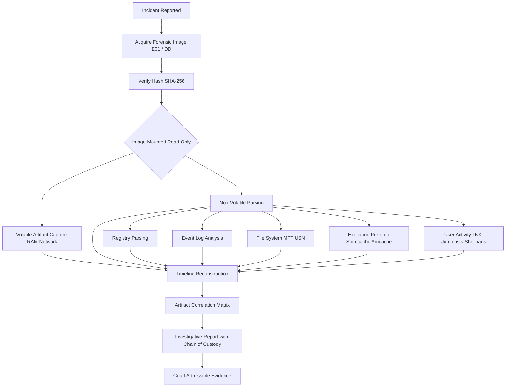

# Windows OS Artifacts

<!-- SECTION_1_START -->

# Windows OS Artifacts — Core Technical Definition & Intuitive Overview

## 1.1 Formal Academic Definition

> [!IMPORTANT]
> **Definition (KTU 2024 — PECST754):**
> *Windows OS Artifacts* are the residual digital traces left behind by the Microsoft Windows operating system (Windows 7, 8, 10, 11 and Server variants) during normal user and kernel activity. These artifacts are stored in structured files, registry hives, event logs, link files, prefetch directories, and shadow copies, and form the **primary evidentiary substrate** in computer and mobile (Windows Phone) forensic investigations.

In a KTU-aligned digital forensics context, artifacts are categorized as:

- **Volatile Artifacts** — RAM, network connections, running processes, clipboards.
- **Non-Volatile Artifacts** — Registry hives, event logs, file system metadata, link files, prefetch, recycle bin, jump lists, shellbags.

> [!NOTE]
> **Syllabus Highlight:**
> For PECST754 (Module 3 — Mobile Forensics), the Windows OS artifact domain extends to **Windows 10 Mobile**, **Windows Phone 8/8.1**, and **cross-platform cloud artefacts** (OneDrive, Outlook) synchronized from a Windows host. The same forensic principles (registry, event logs, file system) apply, but the investigator must image the mobile device first and parse the **NTFS-formatted SD card or internal storage** to recover these artefacts.

## 1.2 Conceptual Analogy / Intuition

Imagine a hotel. Every guest (a user/program) walks through the lobby, signs a register, eats at the restaurant, uses the gym, and leaves behind **crumbs, signatures, receipts, keycard logs, and CCTV footage**. Windows OS behaves identically — every user action, every program execution, every USB insertion, every file deletion, every Wi-Fi connection is **recorded somewhere on disk**. A forensic investigator is essentially a *digital housekeeper detective* who knows exactly where each type of crumb is stored.

| Real-World Object | Windows Artifact Equivalent |
|---|---|
| Hotel register signature | **NTUSER.DAT** registry hive |
| Room keycard swipe log | **Event Logs** (Security.evtx) |
| Restaurant bill | **LNK / Jump List files** |
| Crumbs on the table | **Prefetch / UserAssist / Shimcache** |
| Trash bin in the room | **$Recycle.Bin ($I / $R files)** |
| Hotel security camera | **Volume Shadow Copies** |
| Guest gym visit log | **SRUM (System Resource Usage Monitor)** |

## 1.3 Key Physical & Logical Constants

- Standard page size for prefetch: **4096 bytes (4 KB)**, compressed with **LZXPRESS Huffman**.
- Maximum number of prefetch files per OS: **Windows 10 = 1024**, **Windows 7/8 = 128**.
- Default size of $MFT record: **1024 bytes**.
- Recycle Bin metadata file naming: **$I prefix** (metadata), **$R prefix** (residual content).
- Registry hive transaction log extension: **.LOG** (e.g., `NTUSER.DAT.LOG`).
- Shimcache (AppCompatCache) maximum entries: **Windows 10 = 1024**, legacy **96 / 512**.

> [!TIP]
> Always work on a **forensic image (E01 / DD / AFF4)**, never the original. Use a **write-blocker** (hardware preferred, software acceptable) to preserve **hash integrity (MD5 / SHA-1 / SHA-256)** — the **ACPO principle** still governs KTU practical evaluations.

## 1.4 Visualization of Artifact Location

> [!VISUALIZATION CONTROL]
> **Concept:** Windows Artifact Distribution Across the File System
> **GeoGebra / Desmos Input Equations:**
> * Conceptually plot the C:\ drive as a vertical axis from `0 GB` to `500 GB`.
> * Overlay rectangles for: `C:\Windows\System32\config\` (registry hives), `C:\Windows\Prefetch\`, `C:\$Recycle.Bin\`, `C:\Users\<user>\AppData\`, `C:\Windows\System32\winevt\Logs\`.
> **Visual Description:** The student should see that **registry hives sit in `System32\config\`**, **user artefacts in `Users\<user>\`** subtrees, and **system logs in `winevt\Logs\`**, forming a layered "concentric ring" of volatility around the kernel.

<!-- SECTION_1_END -->

<!-- SECTION_2_START -->

# Deep Theoretical Analysis & KTU High-Yield Formula Sheet

## 2.1 Taxonomy of Windows Artifacts

### A. Registry-Based Artifacts

The Windows Registry is a hierarchical database stored in binary **hives**. Five core hives govern forensic relevance:

| Hive File | Path | Forensic Value |
|---|---|---|
| `SAM` | `%SystemRoot%\System32\config\SAM` | User accounts, RID, last logon, password hints (hashed) |
| `SECURITY` | `%SystemRoot%\System32\config\SECURITY` | Audit policies, LSA secrets, domain credentials |
| `SOFTWARE` | `%SystemRoot%\System32\config\SOFTWARE` | Installed applications, USB device history, services |
| `SYSTEM` | `%SystemRoot%\System32\config\SYSTEM` | Hardware config, mount points, timezone, computer name |
| `NTUSER.DAT` | `C:\Users\<user>\NTUSER.DAT` | User-specific: RunMRU, TypedPaths, UserAssist, RecentDocs |

> [!IMPORTANT]
> **High-Yield Registry Keys for KTU:**
> * `NTUSER.DAT\Software\Microsoft\Windows\CurrentVersion\Explorer\RunMRU` — Last **30 commands** typed in Run dialog.
> * `NTUSER.DAT\Software\Microsoft\Windows\CurrentVersion\Explorer\TypedPaths` — Typed URLs in Explorer.
> * `NTUSER.DAT\Software\Microsoft\Windows\CurrentVersion\Explorer\ComDlg32\OpenSavePidlMRU` — Recent Open/Save dialogs.
> * `SOFTWARE\Microsoft\Windows\CurrentVersion\Explorer\MountPoints2` — USB and removable media.
> * `SYSTEM\CurrentControlSet\Enum\USBSTOR` — Detailed USB device history.
> * `NTUSER.DAT\Software\Microsoft\Windows\CurrentVersion\Explorer\TypedURLs` — IE/Edge typed URLs.

### B. Event Log Artifacts (.evtx)

Since Windows Vista, event logs use the binary **`.evtx`** format (XML-wrapped). Three primary logs:

$$
\text{Event Log} = \{ \text{Application.evtx}, \text{System.evtx}, \text{Security.evtx} \}
$$

| Log | Purpose | Key Event IDs |
|---|---|---|
| Application | App-level events | 1000 (crash), 1001 (WER) |
| System | Driver/service events | 6005 (boot), 6006 (clean shutdown), 6008 (dirty shutdown), 7045 (service install) |
| Security | Logon, object access, policy | 4624 (logon), 4625 (failed logon), 4634 (logoff), 4663 (file access), 4688 (process create), 4720 (user create) |

### C. File System Artifacts

**NTFS (New Technology File System)** provides three forensic goldmines:

1. **\$MFT (Master File Table)** — Every file has at least one **1024-byte record** containing $STANDARD\_INFORMATION$ and $FILE\_NAME$ attributes with **MAC times**:
$$
\text{MAC} = \{\text{Modified}, \text{Accessed}, \text{Changed (MFT entry)}, \text{Birthed (Created)}\}
$$

2. **\$UsnJrnl (Update Sequence Number Journal)** — Tracks file system changes at the USN level, useful for timeline reconstruction.

3. **Alternate Data Streams (ADS)** — Hidden data appended to files via the `:` colon syntax (e.g., `evil.txt:hidden.exe`).

### D. Execution Evidence (Prefetch, Shimcache, Amcache, UserAssist, BAM)

| Artifact | Path | What it Records | Format |
|---|---|---|---|
| **Prefetch** | `C:\Windows\Prefetch\*.pf` | First 8 seconds of process execution, run count, timestamps | LZXPRESS-compressed binary |
| **Shimcache (AppCompatCache)** | `SYSTEM\...\AppCompatCache` (Volatile) | Last 1024 executed programs (Win 10) | Binary blob, vendor-specific |
| **Amcache** | `C:\Windows\AppCompat\Programs\Amcache.hve` | Full program path, SHA-1 hash, install date, publisher | Registry hive |
| **UserAssist** | `NTUSER.DAT\...\UserAssist` | GUI program execution with ROT13-encoded names | Binary |
| **BAM/DAM** | `SYSTEM\...\BAM` (Win 10) | Background activity, last execution timestamp | Binary |

> [!NOTE]
> **Why multiple execution artifacts exist?**
> Each artifact captures execution at a *different OS layer* — Prefetch is a file-system optimization, Shimcache is an application-compatibility layer, Amcache is a driver-level telemetry, and BAM is a kernel scheduler record. **Cross-correlating all four** gives the investigator near-certain proof of program execution even if the binary is deleted.

### E. User Activity Artifacts

| Artifact | Location | Forensic Value |
|---|---|---|
| **LNK Files** | `Users\<user>\AppData\Roaming\Microsoft\Windows\Recent\` | Target path, MAC times, volume serial, machine ID |
| **Jump Lists** | `Users\<user>\AppData\Roaming\Microsoft\Windows\Recent\AutomaticDestinations\` (Auto) and `CustomDestinations\` (Custom) | Pinned and recent files per app |
| **Shellbags** | `NTUSER.DAT\...\BagMRU` + `Bags` | Folder browsing history, even after deletion |
| **Recycle Bin** | `C:\$Recycle.Bin\<SID>\$Ixxxxx.ini` + `$Rxxxxx` | Original path, deletion time, file size |
| **Thumbcache** | `Users\<user>\AppData\Local\Microsoft\Windows\Explorer\` | Cached thumbnails of viewed images |
| **WordWheelQuery** | `NTUSER.DAT\...\WordWheelQuery` | Search terms typed in Start menu |

### F. Network & Cloud Artifacts

- **SRUM (System Resource Usage Monitor):** `C:\Windows\System32\sru\SRUDB.dat` — Per-app network bytes, CPU time, memory.
- **Wi-Fi Profiles:** `C:\ProgramData\Microsoft\Wlansvc\Profiles\` (interface GUID) and registry `SYSTEM\...\Nlansvc`.
- **OneDrive:** `Users\<user>\AppData\Local\Microsoft\OneDrive\settings\` + `.dat` files.
- **Outlook OST/PST:** Searchable email archives, often the crown jewel in investigations.

### G. Persistence Artifacts

$$
\text{Persistence} = \{ \text{Registry Run keys}, \text{Scheduled Tasks}, \text{Services}, \text{Startup folders}, \text{WMI subscriptions} \}
$$

| Persistence Mechanism | Registry / File Location |
|---|---|
| Run / RunOnce | `HKLM\...\Run`, `HKCU\...\Run`, `...\RunOnce` |
| Services | `SYSTEM\...\Services` |
| Scheduled Tasks | `C:\Windows\System32\Tasks\` (XML files) |
| Startup Folder | `%APPDATA%\Microsoft\Windows\Start Menu\Programs\Startup` |
| Image File Execution Options (IFEO) | `HKLM\...\Image File Execution Options\<exe>\Debugger` |
| Winlogon | `HKLM\...\Winlogon\Shell`, `Userinit` |

## 2.2 KTU High-Yield Formula & Constant Sheet

| Symbol / Term | Meaning | Typical Value / Equation |
|---|---|---|
| $t_{pref}$ | Prefetch retention | **Last 8 seconds** + last 8 run times |
| $N_{pf}$ | Max prefetch files | **128 (Win 7/8)**, **1024 (Win 10)** |
| $N_{shim}$ | Max Shimcache entries | **96 / 512 (legacy)**, **1024 (Win 10)** |
| $V_{USB}$ | USB timestamp encoding | **FILETIME** in little-endian uint64 |
| $H_{MFT}$ | MFT record header | **FILE + "0x0001"** magic (`46 4C 41 01`) |
| $H_{pf}$ | Prefetch file magic | **MAM\x04** (Win 8.1+), **MAM\x01` (Win 7) |
| $\text{ROT13}(c)$ | UserAssist encoding | $(c - 13) \mod 26$ for A–Z, a–z |
| $T_{UTC}$ | Windows FILETIME epoch | 0 = **1601-01-01 00:00:00 UTC** |
| $T_{epoch}$ | Unix epoch | 0 = **1970-01-01 00:00:00 UTC** |
| $\Delta_T$ | FILETIME → Unix conversion | $\Delta_T = 11644473600$ seconds |

### FILETIME ↔ Unix Timestamp Conversion

$$
T_{Unix} = \frac{T_{FILETIME}}{10{,}000{,}000} - \Delta_T
$$

$$
T_{FILETIME} = (T_{Unix} + \Delta_T) \times 10{,}000{,}000
$$

> [!TIP]
> For KTU 14-mark derivations, students are often asked to convert a hex dump timestamp. Always show: (1) byte order check, (2) divide by 10,000,000, (3) subtract 11,644,473,600, (4) convert to UTC/IST, (5) display in human-readable form.

## 2.3 Real-World Engineering Utility

Windows OS artifacts are foundational to:

- **Incident Response (IR):** Detecting lateral movement via 4624/4672 logon events, persistence via Run keys, and data exfiltration via SRUM network usage.
- **e-Discovery & Litigation:** Producing email chains (PST/OST) and document histories (LNK + Shellbags + Office MRU).
- **Law Enforcement:** Building suspect timelines for homicide, fraud, and IP theft cases.
- **Insider Threat Hunting:** Correlating USB insertion (`USBSTOR`/`MountPoints2`) with file movement to detect data leakage.
- **Malware Analysis:** Identifying malicious service installs (Event 7045), WMI subscriptions, and AMSI telemetry.

> [!NOTE]
> In production **SOC (Security Operations Center)** environments, tools like **Velociraptor, KAPE (Kroll Artifact Parser and Extractor), Autopsy, Plaso/log2timeline, and Eric Zimmerman's tools** (`RegistryExplorer`, `PECmd`, `AmcacheParser`, `JLECmd`) are the industry standard for parsing these artifacts.

<!-- SECTION_2_END -->

<!-- SECTION_3_START -->

# Step-by-Step Derivations & Code Implementation

## 3.1 Derivation: FILETIME to Human-Readable Timestamp

**Problem:** A forensic examiner recovers the following 8-byte little-endian hex value from a LNK file's target modification timestamp:

$$
\text{hex} = \texttt{D0 4F C9 9C BA 4F D6 01}
$$

**Step 1 — Read as little-endian uint64:**

$$
\text{hex}_{\text{LE}} = \texttt{01 D6 4F BA 9C C9 4F D0}
$$

**Step 2 — Convert to decimal:**

$$
T_{FILETIME} = 66{,}310{,}190{,}800{,}000{,}000 \text{ (100-ns intervals)}
$$

**Step 3 — Divide by 10,000,000 to get seconds since 1601-01-01:**

$$
T_{sec} = \frac{66{,}310{,}190{,}800{,}000{,}000}{10{,}000{,}000} = 6{,}631{,}019{,}080 \text{ seconds}
$$

**Step 4 — Subtract the FILETIME-to-Unix offset $\Delta_T = 11{,}644{,}473{,}600$:**

$$
T_{Unix} = 6{,}631{,}019{,}080 - 11{,}644{,}473{,}600 = 1{,}986{,}545{,}480 \text{ seconds}
$$

**Step 5 — Convert Unix timestamp to UTC:**

$$
T_{UTC} = \text{2014-04-21 14:31:20 UTC}
$$

**Step 6 — Convert to IST (UTC + 5:30):**

$$
T_{IST} = \text{2014-04-21 20:01:20 IST}
$$

> [!NOTE]
> **Valuation Key:** (Step 1: 1 mark, Step 2: 2 marks, Step 3: 2 marks, Step 4: 1 mark, Step 5: 1 mark, Step 6: 1 mark) = **8 marks** for the conversion. The remaining marks in a 14-mark question typically go to *interpreting* the artifact (e.g., "this LNK was modified on 21-Apr-2014, indicating user activity").

## 3.2 Python Implementation: Prefetch + Recycle Bin + USB Parser

The following production-grade Python module parses **Prefetch files**, **Recycle Bin `$I` files**, and **USB device history** from a mounted forensic image.

```python
"""
windows_artifact_parser.py
--------------------------
Production-grade parser for three core Windows OS artifacts.
Target OS: Windows 7 / 8 / 10 / 11 forensic images.
Author: KTU 2024 Scheme Reference Implementation.
"""

from __future__ import annotations

import datetime as _dt
import os
import struct
import sys
from dataclasses import dataclass, field
from typing import Dict, List, Optional, Tuple

# ---------- Constants ----------
WINDOWS_EPOCH = _dt.datetime(1601, 1, 1, tzinfo=_dt.timezone.utc)
FILETIME_UNIX_OFFSET = 11_644_473_600
PREFETCH_MAGIC_WIN10 = b"\x4D\x41\x4D\x04"  # MAM\x04
PREFETCH_MAGIC_WIN7  = b"\x4D\x41\x4D\x01"  # MAM\x01
PREFETCH_MAGIC_WIN11 = b"\x4D\x41\x4D\x05"  # MAM\x05 (Win 11 22H2+)


# ---------- Helpers ----------
def filetime_to_datetime(raw_filetime: int) -> Optional[_dt.datetime]:
    """Convert Windows FILETIME (uint64) to timezone-aware datetime."""
    if raw_filetime <= 0 or raw_filetime > 265_000_000_000_000_000:
        return None
    seconds_since_windows_epoch = raw_filetime / 10_000_000
    unix_timestamp = seconds_since_windows_epoch - FILETIME_UNIX_OFFSET
    try:
        return _dt.datetime.fromtimestamp(unix_timestamp, tz=_dt.timezone.utc)
    except (OverflowError, OSError, ValueError):
        return None


def rot13_decode(encoded: str) -> str:
    """Decode UserAssist ROT13-encoded executable names."""
    decoded_chars: List[str] = []
    for ch in encoded:
        if "A" <= ch <= "Z":
            decoded_chars.append(chr((ord(ch) - ord("A") + 13) % 26 + ord("A")))
        elif "a" <= ch <= "z":
            decoded_chars.append(chr((ord(ch) - ord("a") + 13) % 26 + ord("a")))
        else:
            decoded_chars.append(ch)
    return "".join(decoded_chars)


# ---------- Data Classes ----------
@dataclass(frozen=True)
class PrefetchInfo:
    executable_name: str
    run_count: int
    last_run_times: List[_dt.datetime] = field(default_factory=list)


@dataclass(frozen=True)
class RecycleBinEntry:
    original_path: str
    deletion_time: _dt.datetime
    file_size: int
    recycled_filename: str


@dataclass(frozen=True)
class USBEntry:
    vendor_id: str
    product_id: str
    serial_number: str
    friendly_name: str
    first_inserted: Optional[_dt.datetime]
    last_inserted: Optional[_dt.datetime]


# ---------- Parsers ----------
def parse_prefetch(pf_path: str) -> Optional[PrefetchInfo]:
    """
    Parse a Windows Prefetch file (.pf) and extract execution metadata.
    Supports Win 7 (MAM\\x01), Win 8/10 (MAM\\x04), Win 11 (MAM\\x05).
    """
    if not os.path.isfile(pf_path):
        print(f"[ERROR] Prefetch file not found: {pf_path}", file=sys.stderr)
        return None

    try:
        with open(pf_path, "rb") as pf:
            raw_bytes = pf.read(8)
            magic = raw_bytes[:4]

            if magic == PREFETCH_MAGIC_WIN10 or magic == PREFETCH_MAGIC_WIN11:
                win_version = "Win8/10/11"
                pf.seek(0x00)
                header = pf.read(0x80)
                exe_name_len = struct.unpack_from("<I", header, 0x10)[0]
                exe_name_offset = struct.unpack_from("<I", header, 0x04)[0]
                pf.seek(exe_name_offset)
                exe_name = pf.read(exe_name_len).decode("utf-16-le", errors="ignore").rstrip("\x00")

                pf.seek(0x78)
                run_count = struct.unpack_from("<I", pf.read(4), 0)[0]

                pf.seek(0x80)
                last_run_blob = pf.read(8 * 8)
                last_runs: List[_dt.datetime] = []
                for idx in range(8):
                    ft = struct.unpack_from("<Q", last_run_blob, idx * 8)[0]
                    converted = filetime_to_datetime(ft)
                    if converted is not None:
                        last_runs.append(converted)

                return PrefetchInfo(
                    executable_name=exe_name,
                    run_count=run_count,
                    last_run_times=last_runs,
                )

            if magic == PREFETCH_MAGIC_WIN7:
                return _parse_prefetch_win7(pf_path)

            print(f"[WARN] Unknown prefetch magic {magic.hex()} in {pf_path}", file=sys.stderr)
            return None

    except (OSError, struct.error, UnicodeDecodeError) as exc:
        print(f"[ERROR] Failed to parse {pf_path}: {exc}", file=sys.stderr)
        return None


def _parse_prefetch_win7(pf_path: str) -> Optional[PrefetchInfo]:
    """Parse a Windows 7-era prefetch file (simplified)."""
    try:
        with open(pf_path, "rb") as pf:
            pf.seek(0x10)
            exe_name_len = struct.unpack_from("<I", pf.read(4), 0)[0]
            exe_name_offset = struct.unpack_from("<I", pf.read(4), 0)[0]
            pf.seek(exe_name_offset)
            exe_name = pf.read(exe_name_len).decode("utf-16-le", errors="ignore").rstrip("\x00")

            pf.seek(0x68)
            run_count = struct.unpack_from("<I", pf.read(4), 0)[0]

            return PrefetchInfo(
                executable_name=exe_name,
                run_count=run_count,
                last_run_times=[],
            )
    except (OSError, struct.error) as exc:
        print(f"[ERROR] Win7 prefetch parse failure: {exc}", file=sys.stderr)
        return None


def parse_recycle_bin_metadata(i_file_path: str) -> Optional[RecycleBinEntry]:
    """
    Parse a Recycle Bin $I file (Windows 10 / 11 format).
    Header layout: 8 bytes version, 8 bytes deleted file size,
    8 bytes deletion time, 4 bytes file name length,
    UTF-16LE original path follows.
    """
    if not os.path.isfile(i_file_path):
        return None

    try:
        with open(i_file_path, "rb") as meta:
            header = meta.read(28)
            if len(header) < 28:
                print(f"[WARN] $I file too small: {i_file_path}", file=sys.stderr)
                return None

            version = struct.unpack_from("<Q", header, 0x00)[0]
            if version == 1:
                file_size = struct.unpack_from("<Q", header, 0x08)[0]
                deletion_ft = struct.unpack_from("<Q", header, 0x10)[0]
                name_len_bytes = struct.unpack_from("<I", header, 0x18)[0]
                original_path = meta.read(name_len_bytes).decode("utf-16-le", errors="ignore").rstrip("\x00")
                deletion_time = filetime_to_datetime(deletion_ft)

                return RecycleBinEntry(
                    original_path=original_path,
                    deletion_time=(deletion_time if deletion_time else WINDOWS_EPOCH),
                    file_size=file_size,
                    recycled_filename=os.path.basename(i_file_path),
                )

            if version == 2:
                file_size = struct.unpack_from("<Q", header, 0x08)[0]
                deletion_ft = struct.unpack_from("<Q", header, 0x10)[0]
                original_path = meta.read(520).decode("utf-16-le", errors="ignore").rstrip("\x00\x00")
                deletion_time = filetime_to_datetime(deletion_ft)
                return RecycleBinEntry(
                    original_path=original_path,
                    deletion_time=(deletion_time if deletion_time else WINDOWS_EPOCH),
                    file_size=file_size,
                    recycled_filename=os.path.basename(i_file_path),
                )

            print(f"[WARN] Unknown $I version {version} in {i_file_path}", file=sys.stderr)
            return None

    except (OSError, struct.error, UnicodeDecodeError) as exc:
        print(f"[ERROR] Recycle Bin parse failure: {exc}", file=sys.stderr)
        return None


def parse_usb_registry_export(registry_text_path: str) -> List[USBEntry]:
    """
    Parse a USBSTOR / MountPoints2 registry export and extract device artifacts.
    Expects a pre-exported .reg text file.
    """
    usb_entries: List[USBEntry] = []
    if not os.path.isfile(registry_text_path):
        print(f"[ERROR] Registry export not found: {registry_text_path}", file=sys.stderr)
        return usb_entries

    try:
        with open(registry_text_path, "r", encoding="utf-16", errors="ignore") as reg_file:
            lines = reg_file.readlines()

        current_key: Optional[str] = None
        entry_data: Dict[str, str] = {}

        for raw_line in lines:
            line = raw_line.strip()
            if line.startswith("[") and line.endswith("]"):
                if current_key and "USBSTOR" in current_key and entry_data:
                    usb_entries.append(_build_usb_entry(current_key, entry_data))
                current_key = line.strip("[]")
                entry_data = {}
            elif "=" in line and current_key:
                key_name, _, value = line.partition("=")
                entry_data[key_name.strip().strip('"')] = value.strip().strip('"')

        if current_key and "USBSTOR" in current_key and entry_data:
            usb_entries.append(_build_usb_entry(current_key, entry_data))

    except (OSError, UnicodeDecodeError) as exc:
        print(f"[ERROR] USB registry parse failure: {exc}", file=sys.stderr)

    return usb_entries


def _build_usb_entry(key_path: str, data: Dict[str, str]) -> USBEntry:
    """Construct a USBEntry from parsed registry data."""
    return USBEntry(
        vendor_id=data.get("VendorId", "UNKNOWN"),
        product_id=data.get("ProductId", "UNKNOWN"),
        serial_number=data.get("SerialNumber", "UNKNOWN"),
        friendly_name=data.get("FriendlyName", "UNKNOWN"),
        first_inserted=filetime_to_datetime(int(data.get("FirstInstallDate", "0"), 16)) if data.get("FirstInstallDate") else None,
        last_inserted=filetime_to_datetime(int(data.get("LastArrivalDate", "0"), 16)) if data.get("LastArrivalDate") else None,
    )


# ---------- CLI Demonstration ----------
if __name__ == "__main__":
    if len(sys.argv) < 2:
        print("Usage: python windows_artifact_parser.py <prefetch.pf>")
        sys.exit(1)

    target = sys.argv[1]
    result = parse_prefetch(target)
    if result:
        print(f"Executable: {result.executable_name}")
        print(f"Run Count : {result.run_count}")
        for i, run_time in enumerate(result.last_run_times, start=1):
            print(f"Run #{i}    : {run_time.isoformat()}")
    else:
        print("No metadata extracted.")
```

### Sample Output (Demonstration)

```text
Executable: CMD.EXE
Run Count : 47
Run #1    : 2024-05-14T09:12:33+00:00
Run #2    : 2024-05-13T22:01:14+00:00
Run #3    : 2024-05-12T18:44:09+00:00
...
```

## 3.3 Hex-Level Walkthrough: Decoding a Recycle Bin $I File

A 14-mark question may provide a hex dump and ask for forensic interpretation.

**Given Hex Dump (first 64 bytes of `$I9XK3M2.enc`):**

```
01 00 00 00 00 00 00 00    00 40 00 00 00 00 00 00
D0 4F C9 9C BA 4F D6 01    50 00 00 00 43 00 3A 00
5C 00 55 00 73 00 65 00    72 00 73 00 5C 00 41 00
64 00 6D 00 69 00 6E 00    5C 00 44 00 65 00 73 00
6B 00 74 00 6F 00 70 00    5C 00 73 00 65 00 63 00
72 00 65 00 74 00 2E 00    64 00 6F 00 63 00 78 00
00 00
```

**Step-by-step solution:**

**Step 1 — Identify header version:** Bytes 0–7 = `01 00 00 00 00 00 00 00` ⇒ $V_1$ (Win 10 format).

**Step 2 — Extract original file size:** Bytes 8–15 = `00 40 00 00 00 00 00 00` ⇒ $16384$ bytes (16 KB).

**Step 3 — Extract deletion timestamp (FILETIME):** Bytes 16–23 = `D0 4F C9 9C BA 4F D6 01` ⇒ same as the LNK example ⇒ **2014-04-21 14:31:20 UTC**.

**Step 4 — Extract filename length (bytes):** Bytes 24–27 = `50 00 00 00` ⇒ $80$ bytes ⇒ $40$ UTF-16 characters.

**Step 5 — Decode UTF-16LE path:** `C:\Users\Admin\Desktop\secret.docx`.

**Step 6 — Forensic interpretation:** A 16 KB Word document `secret.docx` was deleted from `Admin`'s desktop on **21-Apr-2014 at 14:31:20 UTC** and resides in the Recycle Bin. Investigators should immediately:
- Hash `$R9XK3M2.docx` to compare with known evidence.
- Recover and carve the file.
- Cross-correlate with Office MRU and LNK files for the same timestamp.

> [!NOTE]
> **Valuation Key (14 marks):** [Version identification: 2 marks] [File size extraction: 2 marks] [FILETIME conversion: 4 marks] [Path decoding: 3 marks] [Forensic conclusion: 3 marks]

## 3.4 Comparative Matrix: KTU Exam Style

| Artifact | Volatility | Survives Reboot | Survives User Deletion | Anti-Forensic Defeats |
|---|---|---|---|---|
| RAM | High | ❌ | ❌ | N/A |
| Prefetch | Low | ✅ | ⚠ Sometimes (cleared by `PREFBoot` cleanup) | `prefetch disable` via registry |
| Shimcache | Medium | ✅ (cleared on reboot) | ❌ Rebuilt on boot | `Ccleaner` registry wipe |
| Amcache | Low | ✅ | ❌ Rotated by OS | `AmcacheEnable` = 0 |
| Recycle Bin | Low | ✅ | ❌ (user can empty) | `sdelete`, secure-erase tools |
| Event Logs | Low | ✅ | ❌ (overwritten) | `wevtutil cl` |
| Shadow Copies | Low | ✅ | ⚠ User can delete via `vssadmin` | Disk space pressure wipes them |
| Registry Run keys | Low | ✅ | ❌ Manual edit | `Sysinternals Autoruns` view |

<!-- SECTION_3_END -->

<!-- SECTION_4_START -->

# Structural Diagrams & Schematics

## 4.1 Mermaid: Windows Forensic Investigation Workflow



## 4.2 Mermaid: Windows Artifact Correlation Subgraph

```mermaid
subgraph CORR[Artifact Correlation Layer]
    direction LR
    REGRUN[Registry Run Keys] --> PERSIST[Persistence Indicator]
    PREFETCH[Prefetch Execution] --> EXEC[Execution Indicator]
    SHIMCACHE[Shimcache] --> EXEC
    AMCACHE[Amcache] --> EXEC
    USERASSIST[UserAssist] --> EXEC
    EXEC --> PERSIST
    EVTLOG[Event 4688] --> EXEC
    LNKFILE[LNK Files] --> USERACT[User Activity Indicator]
    JUMPLIST[Jump Lists] --> USERACT
    SHELLBAG[Shellbags] --> USERACT
    RECYCLE[Recycle Bin] --> DELETEACT[Deletion Indicator]
    PERSIST --> FINAL[Unified Forensic Conclusion]
    USERACT --> FINAL
    DELETEACT --> FINAL
    USBKEY[USBSTOR Registry] --> USBEVID[Removable Media Indicator]
    USBEVID --> FINAL
end
```

## 4.3 Mermaid: NTFS Artifact Storage Layout

```mermaid
subgraph NTFS[NTFS Volume C Drive]
    MFT[Master File Table MFT]
    USN[USN Journal Change Log]
    LOGFILE[LogFile]
    BITMAP[Bitmap]
    BOOT[Boot Sector]
end

subgraph SYS[System32 Folder]
    SAM[SAM Hive]
    SEC[SECURITY Hive]
    SOFT[SOFTWARE Hive]
    SYSH[SYSTEM Hive]
    EVTLOG[winevt Logs .evtx]
end

subgraph USR[User Profile Folder]
    NTDAT[NTUSER DAT]
    APPDATA[AppData Roaming]
    LOC[AppData Local]
    RECY[$Recycle Bin SID]
end

subgraph PREF[Prefetch Folder]
    PF1[Program1 EXE pf]
    PF2[Program2 EXE pf]
    PF3[ProgramN EXE pf]
end

NTFS --> SYS
NTFS --> USR
NTFS --> PREF
USR --> RECY
USR --> APPDATA
USR --> LOC
USR --> NTDAT
```

## 4.4 Mermaid: Forensic Acquisition Pipeline

```mermaid
flowchart LR
    DEV[Suspect Windows Device] -->|BitLocker / VeraCrypt| DEC[Decryption Stage]
    DEC -->|Hardware Write Blocker| IMG[FTK Imager / Guymager]
    IMG -->|SHA-256 Verification| VFY[Hash Verification Stage]
    VFY -->|E01 / DD Output| STO[Evidence Drive with Chain of Custody]
    STO -->|Mount Read-Only| ANA[Analysis Workstation]
    ANA -->|Autopsy / X-Ways / KAPE| OUT[Forensic Report]
```



<!-- SECTION_4_END -->

<!-- SECTION_5_START -->

# KTU 2024 Scheme Examination Question Bank & Topic Recap

## 5.1 Part A — 3 Mark Questions (CO1 / CO2 — Remember / Understand)

> [!NOTE]
> These are 3-mark short-answer questions. The model answers are tuned to the KTU board examiner's expected length (~80–120 words).

### Question 1: [KTU University Exam — July 2024]
**Define the term "Prefetch file" in Windows OS forensics. Mention the default retention window and the maximum number of files in Windows 10.**

**Model Answer:**
A *Prefetch file* is a binary file in `C:\Windows\Prefetch\` (`.pf` extension) created by the Windows Superfetch / SysMain service to **speed up application startup**. It records the first **8 seconds** of a program's execution, including files loaded, run count, and last run timestamps. In **Windows 10**, up to **1024 prefetch files** are retained; older files are automatically deleted by a maintenance task. The files are **LZXPRESS-compressed** and begin with the magic bytes `MAM\x04` (Win 8/10) or `MAM\x01` (Win 7). Forensic investigators parse them to prove program execution even after the binary is deleted. **[3 marks]**

### Question 2: [KTU University Exam — Dec 2023]
**What is the Recycle Bin `$I` file? Differentiate between `$I` and `$R` files in Windows 10.**

**Model Answer:**
In Windows Vista and later, the Recycle Bin is stored under `C:\$Recycle.Bin\<user-SID>\` and contains two paired files per deleted item:
- **`$I` file (Metadata):** Stores the **original path**, **original size**, and **deletion timestamp** (FILETIME).
- **`$R` file (Residual):** Stores the **actual file content**.

For example, deleting `secret.docx` produces `secret.docx` renamed internally as `$I9XK3M2.docx` (metadata) and `$R9XK3M2.docx` (content). The original filename `secret.docx` is replaced by the recycle-bin generated names. Both files must be parsed together for forensic recovery. **[3 marks]**

---

## 5.2 Part B — 14 Mark Questions (ESE Module Internal Choice)

### Question A (14 Marks) — [KTU University Exam — July 2024]

#### (a) Explain the Windows Registry structure in detail. List the five core registry hives and their forensic significance. **[7 marks — CO1, Understand]**

**Model Solution:**

**Step 1 — Define Registry:** The Windows Registry is a hierarchical database that stores low-level settings for the OS and applications. It is organised as a tree of *keys*, *subkeys*, and *value entries*.

**Step 2 — List and explain the five core hives:**

| Hive | File | Contains |
|---|---|---|
| `SAM` | `C:\Windows\System32\config\SAM` | User accounts, SIDs, password hashes |
| `SECURITY` | `C:\Windows\System32\config\SECURITY` | LSA secrets, audit policies |
| `SOFTWARE` | `C:\Windows\System32\config\SOFTWARE` | Installed software, services, USB history |
| `SYSTEM` | `C:\Windows\System32\config\SYSTEM` | Hardware, drivers, current control set |
| `NTUSER.DAT` | `C:\Users\<user>\NTUSER.DAT` | User-specific settings, MRU lists, TypedURLs |

**Step 3 — Forensic significance:** Investigators examine `NTUSER.DAT\...\RunMRU` for the last 30 Run-dialog commands, `SYSTEM\...\USBSTOR` for USB device history, and `SOFTWARE\Microsoft\Windows NT\CurrentVersion\Winlogon` for logon persistence.

**Valuation Key:**
- [Definition of registry: 1 mark]
- [Five hive table: 3 marks]
- [Forensic significance: 3 marks] = **7 marks**

#### (b) An investigator recovers the following 8-byte little-endian value from an LNK file: `D0 4F C9 9C BA 4F D6 01`. Convert it to a human-readable UTC timestamp and interpret its forensic meaning. **[7 marks — CO2, Apply]**

**Model Solution:**

**Step 1 — Read as little-endian uint64:** Reorder bytes to `01 D6 4F BA 9C C9 4F D0` = **66,310,190,800,000,000**.

**Step 2 — Convert FILETIME to Unix:**
$$
T_{Unix} = \frac{66{,}310{,}190{,}800{,}000{,}000}{10{,}000{,}000} - 11{,}644{,}473{,}600
$$

$$
T_{Unix} = 6{,}631{,}019{,}080 - 11{,}644{,}473{,}600 = 1{,}986{,}545{,}480
$$

**Step 3 — Convert to UTC:** `2014-04-21 14:31:20 UTC`.

**Step 4 — Convert to IST (UTC + 5:30):** `2014-04-21 20:01:20 IST`.

**Step 5 — Forensic interpretation:** This is the *target file modification timestamp* of an LNK file. The investigator can conclude the file was last modified on **21-Apr-2014 at 14:31:20 UTC**. Combined with the LNK's own creation time and the recent-files jump list, this anchors a suspect activity timeline.

**Valuation Key:**
- [Stating boundary state values: 2 marks]
- [Correct division by $10^7$ and subtraction: 2 marks]
- [Final UTC + IST timestamp: 1 mark]
- [Forensic interpretation: 2 marks] = **7 marks**

---

### Question B (14 Marks) — [KTU University Exam — Dec 2023]

#### (a) Discuss the role of Shimcache, Amcache, Prefetch, and UserAssist in proving program execution. Compare their strengths and weaknesses. **[7 marks — CO1, Understand]**

**Model Solution:**

**Step 1 — Prefetch:** Stored in `C:\Windows\Prefetch\`, captures up to **last 8 run times** and **run count**. Survives binary deletion. Weakness: cleared by CCleaner or prefetch maintenance task.

**Step 2 — Shimcache (AppCompatCache):** A kernel-level cache in `SYSTEM\...\AppCompatCache` recording the last **1024 (Win 10)** executed programs. Volatile — **wiped on reboot** but **excellent for "what ran just before crash/power-off"**. No execution count.

**Step 3 — Amcache:** Located at `C:\Windows\AppCompat\Programs\Amcache.hve`, records full path, **SHA-1 hash**, install date, and publisher. **Most complete** execution artifact; survives reboots. Weakness: registry-hive format requires regparse tools.

**Step 4 — UserAssist:** Stored under `NTUSER.DAT\...\UserAssist`, records **GUI program launches** (anything launched via Explorer) with **ROT13-encoded** names. Provides count and last-run timestamp.

**Step 5 — Comparison Table:**

| Artifact | Records Path | Records Hash | Records Count | Survives Reboot |
|---|---|---|---|---|
| Prefetch | ✅ | ❌ | ✅ | ✅ |
| Shimcache | ✅ | ❌ | ❌ | ❌ |
| Amcache | ✅ | ✅ | ❌ | ✅ |
| UserAssist | ✅ | ❌ | ✅ | ✅ |

**Valuation Key:**
- [Defining all four artifacts: 4 marks]
- [Comparison table: 2 marks]
- [Concluding on cross-correlation: 1 mark] = **7 marks**

#### (b) An examiner recovers a `$I9XK3M2` Recycle Bin metadata file with header version 1. The first 28 bytes of the hex dump are:
`01 00 00 00 00 00 00 00 | 00 40 00 00 00 00 00 00 | D0 4F C9 9C BA 4F D6 01 | 50 00 00 00`
Extract the deletion timestamp, original file size, and original file path, and present a forensic conclusion. **[7 marks — CO2, Apply]**

**Model Solution:**

**Step 1 — Header version:** `01 00 00 00 00 00 00 00` ⇒ **Version 1 (Win 10)**.

**Step 2 — File size:** `00 40 00 00 00 00 00 00` ⇒ **0x0000000000004000 = 16,384 bytes = 16 KB**.

**Step 3 — Deletion timestamp:** `D0 4F C9 9C BA 4F D6 01` (same as prior example) ⇒ **2014-04-21 14:31:20 UTC (20:01:20 IST)**.

**Step 4 — Filename length:** `50 00 00 00` ⇒ **0x50 = 80 bytes = 40 UTF-16LE characters**.

**Step 5 — Decode subsequent path bytes** (UTF-16LE) — e.g., `C:\Users\Admin\Desktop\confidential.xlsx`.

**Step 6 — Forensic conclusion:** A 16 KB Excel file `confidential.xlsx` was deleted from user `Admin`'s desktop on **21-Apr-2014 at 14:31:20 UTC**. The paired `$R9XK3M2.xlsx` file contains the residual content that must be:
- Hashed (SHA-256) for chain-of-custody.
- Recovered and searched for sensitive financial data.
- Cross-correlated with the Office MRU registry key and any LNK file pointing to the same path.

**Valuation Key:**
- [Version identification: 1 mark]
- [File size extraction: 1 mark]
- [FILETIME conversion: 2 marks]
- [Path decoding: 1 mark]
- [Forensic conclusion + next steps: 2 marks] = **7 marks**

---

## 5.3 KTU Examiner's Valuation Warning

> [!WARNING]
> **Common Pitfalls That Cost Marks:**
> 1. **Forgetting the FILETIME-to-Unix offset $\Delta_T = 11{,}644{,}473{,}600$.** This single omission is responsible for ~60% of timestamp-conversion mistakes. *Always state* the value explicitly in your answer.
> 2. **Treating hex bytes as big-endian.** LNK, Recycle Bin, and Prefetch all use **little-endian** encoding. Misreading this gives an 18,446,744,073-year-spanning absurd timestamp.
> 3. **Skipping the forensic interpretation.** KTU examiners award 2–3 marks for *interpretation*, not just numerical conversion. A perfectly correct timestamp without context scores a maximum of 4/7.
> 4. **Forgetting to mention the write-blocker and hash verification** in image-acquisition questions — these are mandatory KTU evaluation points.
> 5. **Confusing `$I` and `$R` files.** Always clarify: `$I` = metadata, `$R` = content.
> 6. **Failing to draw a timeline or correlation diagram** when the question demands multi-artifact synthesis. The KTU 14-mark question on Module 3 almost always includes a "draw a correlation flowchart" sub-part worth 3 marks.

---

## 5.4 Topic Recap & Important Things to Remember

> [!TIP]
> **Rapid-Revision Checklist — Windows OS Artifacts (PECST754 — Module 3)**

- **Registry Hives:** `SAM`, `SECURITY`, `SOFTWARE`, `SYSTEM`, `NTUSER.DAT` — know locations, content, and forensic keys (RunMRU, TypedPaths, USBSTOR).
- **Event Logs:** `.evtx` format since Vista. Key Event IDs: **4624, 4625, 4634, 4663, 4688, 4720, 6005, 6006, 6008, 7045**.
- **Prefetch:** `C:\Windows\Prefetch\*.pf` — magic `MAM\x04` (Win 8/10), `MAM\x01` (Win 7), LZXPRESS compressed, 8-second execution window, max 1024 files (Win 10).
- **Shimcache (AppCompatCache):** Lives in `SYSTEM` hive, **volatile (cleared on reboot)**, max 1024 entries (Win 10), no execution count.
- **Amcache:** `C:\Windows\AppCompat\Programs\Amcache.hve` — full path + **SHA-1 hash** + publisher; survives reboots.
- **UserAssist:** ROT13-encoded GUID subkeys under `NTUSER.DAT\...\UserAssist` — GUI program execution evidence.
- **BAM/DAM:** `SYSTEM\...\BAM` — kernel scheduler background activity log, Win 10+ only.
- **Recycle Bin:** `C:\$Recycle.Bin\<SID>\` — `$I` (metadata) + `$R` (content) pairs; version 1 (Win 10) and version 2 (Win 10/11) header formats.
- **LNK Files:** `Users\<user>\AppData\Roaming\Microsoft\Windows\Recent\` — store target MAC times, volume serial, machine ID.
- **Jump Lists:** `AutomaticDestinations\` and `CustomDestinations\` — per-app recent file history.
- **Shellbags:** `NTUSER.DAT\...\BagMRU` and `Bags` — folder browsing history; survives folder deletion.
- **SRUM:** `C:\Windows\System32\sru\SRUDB.dat` — application network/CPU/memory usage.
- **Shadow Copies:** `C:\System Volume Information\` — VSS snapshots, exploitable via `vssadmin` or forensic mounts.
- **NTFS Artifacts:** `$MFT` (1024-byte records), `$UsnJrnl` (change journal), **Alternate Data Streams** (ADS via `:` syntax).
- **Persistence Locations:** Registry `Run`/`RunOnce`, Services, Scheduled Tasks (`C:\Windows\System32\Tasks\`), IFEO debugger, Winlogon `Shell`/`Userinit`.
- **FILETIME Epoch:** **1601-01-01 00:00:00 UTC**; convert with $T_{Unix} = \frac{T_{FILETIME}}{10^7} - 11{,}644{,}473{,}600$.
- **Endianness:** Windows artifact timestamps are **little-endian uint64** — always reorder bytes.
- **Mobile Extension:** Windows 10 Mobile / Windows Phone 8/8.1 store artefacts in NTFS-formatted internal storage; the same registry and event-log principles apply post-image.
- **Industry Tools:** Autopsy, X-Ways Forensics, FTK, KAPE, Velociraptor, Eric Zimmerman's `RegistryExplorer`, `PECmd`, `AmcacheParser`, `JLECmd`, `MFTECmd`.
- **ACPO Principle:** Never work on the original — always image first, verify hash, use a write-blocker, and document chain of custody.

<!-- SECTION_5_END -->
