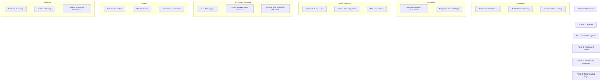
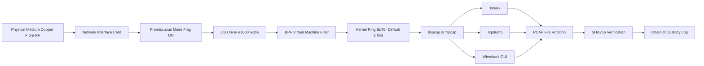
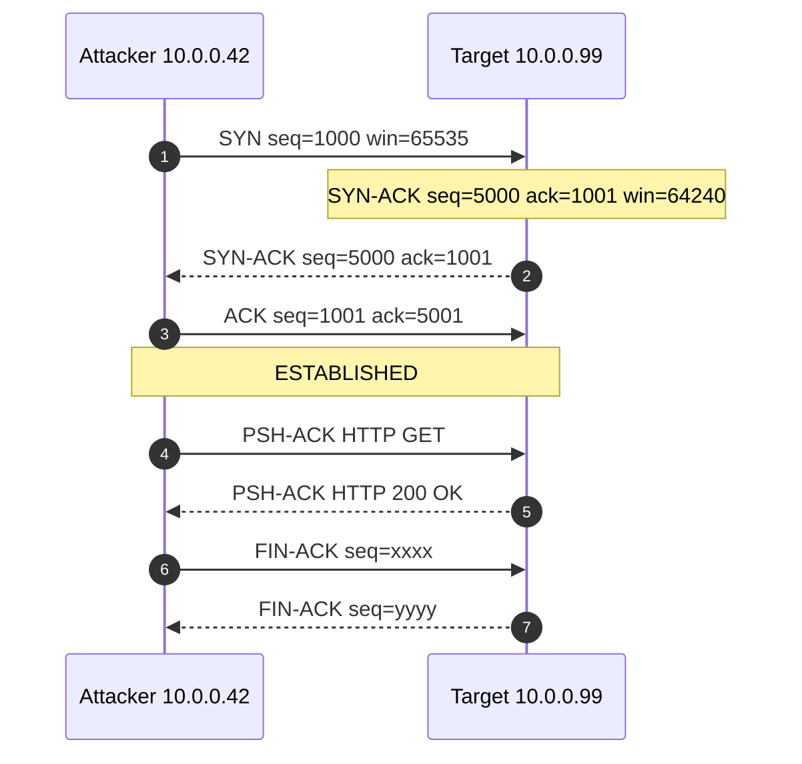
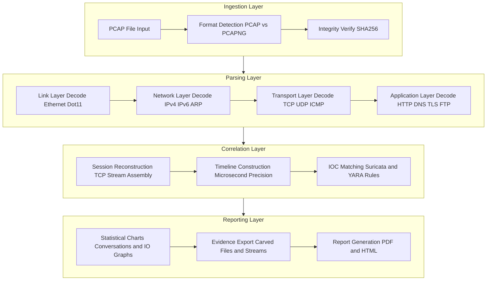
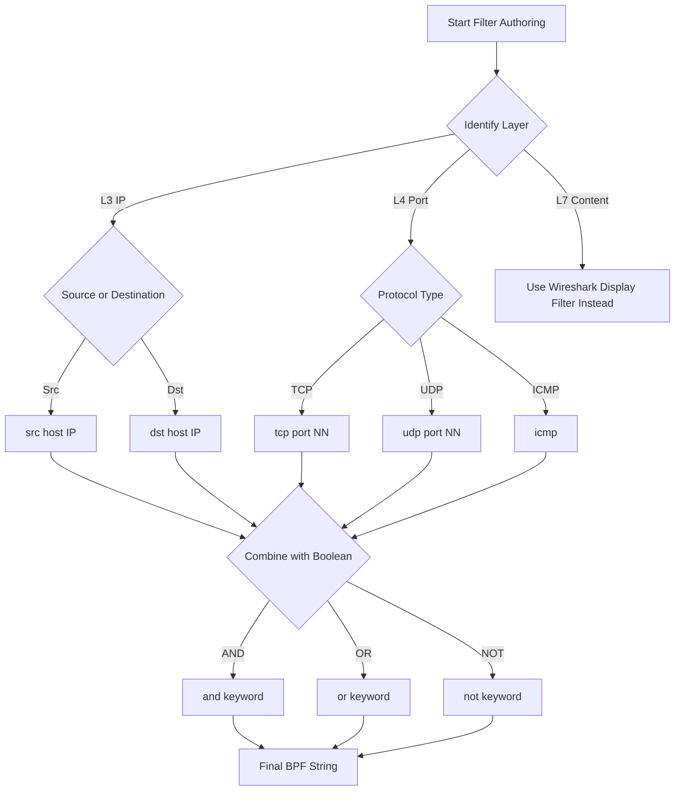
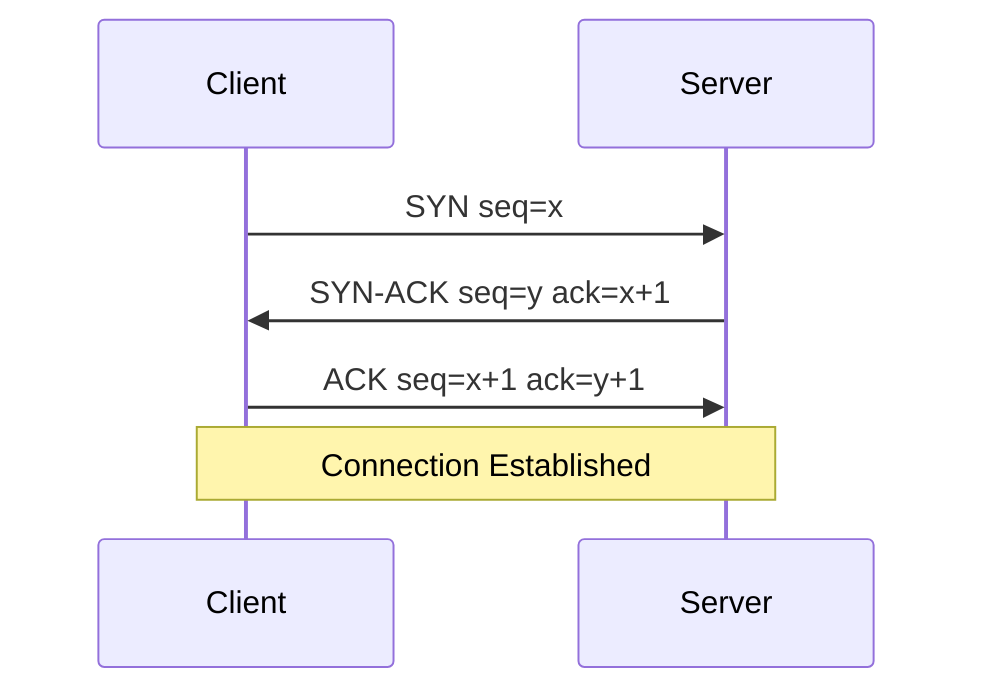

# Capturing and Analyzing Network Traffic using Wireshark/Tcpdump

<!-- SECTION_1_START -->

# Capturing and Analyzing Network Traffic using Wireshark / Tcpdump

> [!IMPORTANT]
> **KTU 2024 Scheme | PECST754 | Module 4 — Network Forensics**
> This section establishes the formal definitions, intuitive analogies, and the underlying capture architecture expected by the KTU board.

## 1.1 Formal Definition (KTU 2024 Syllabus Terminology)

**Network Forensics** is the disciplined, scientific process of *capturing, recording, storing, and analyzing* network events (packets, flows, and metadata) to reconstruct the timeline of a security incident, identify the source of an attack, and produce legally admissible digital evidence.

**Packet Capturing** is the act of *interrogating a Network Interface Card (NIC)* to copy frames traversing the medium into volatile or persistent storage for offline forensic analysis.

> [!NOTE]
> **Wireshark** is a **GUI-based** packet analyzer (originally *Ethereal*).
> **Tcpdump** is a **CLI-based** packet analyzer built on top of **libpcap** (Linux/Unix) or **Npcap** (Windows).
> The modern sibling of Tcpdump is **Tshark**, which combines Tcpdump's CLI ergonomics with Wireshark's dissection engine.

| Tool | Interface | Default Engine | Platform |
| :--- | :--- | :--- | :--- |
| **Wireshark** | Graphical | libpcap / Npcap | Cross-platform |
| **Tshark** | Command Line | libpcap / Npcap | Cross-platform |
| **Tcpdump** | Command Line | libpcap | Linux / Unix |
| **Ngrep** | Command Line | libpcap | Cross-platform |

## 1.2 Conceptual Analogy

Imagine a **multi-lane highway** where every car represents a *packet*. The **NIC** is a toll booth; in *normal mode* it only lets packets addressed to its own lane pass through. In **Promiscuous Mode**, the toll booth takes a *photograph of every single vehicle* on the highway, regardless of destination, and stores the snapshots in an **evidence locker (the .pcap file)**. **Wireshark** is the *forensic detective* who later reviews the photos, while **Tcpdump** is the *surveillance officer on a motorcycle* writing down license plates in real time.

> [!NOTE]
> **Promiscuous Mode** lets a NIC read *all frames* on the segment, not just those addressed to it.
> **Monitor Mode** (RFMON) is the wireless equivalent, capturing *raw 802.11 frames* including management and control frames.

## 1.3 Physical Constants and Default Metrics

- **Default MTU (Ethernet v2)** = **1500 bytes**
- **Standard Ethernet Frame** range = **64 bytes** (minimum) to **1518 bytes** (maximum, untagged)
- **Common well-known ports**:
  - **HTTP** → **80/TCP**
  - **HTTPS** → **443/TCP**
  - **DNS** → **53/UDP/TCP**
  - **FTP-Control** → **21/TCP**
  - **SSH** → **22/TCP**
  - **Telnet** → **23/TCP**
  - **SMTP** → **25/TCP**
- **Maximum PCAP file size (legacy)** = **2 GiB** (resolvable via **PCAP-NG**)
- **Promiscuous Mode flag (libpcap)** = **PCAP_OPENFLAG_PROMISC** (value **1**)

> [!IMPORTANT]
> **Forensic Rule of Evidence:** A pcap file must be **hashed (SHA-256)** at the moment of capture termination. Any subsequent alteration will be detected by re-hashing — this satisfies the *integrity* leg of the **CIA Triad** demanded by KTU's CO3.

## 1.4 The Capture Architecture

The end-to-end capture pipeline follows a **layered abstraction** model. Each layer is isolated so that the tool (Wireshark/Tcpdump) is portable across vendors.

$$
\underbrace{\text{NIC}}_{\text{Physical}} \;\longrightarrow\; \underbrace{\text{Driver (Promiscuous Mode)}}_{\text{Data Link}} \;\longrightarrow\; \underbrace{\text{libpcap / Npcap}}_{\text{Capture Library}} \;\longrightarrow\; \underbrace{\text{Wireshark / Tcpdump / Tshark}}_{\text{User Tool}} \;\longrightarrow\; \underbrace{\text{.pcap / .pcapng}}_{\text{Persistence}}
$$

> [!VISUALIZATION CONTROL]
> **Concept:** Real-time bandwidth utilisation vs. capture buffer drop rate.
> **GeoGebra / Desmos Input Equations:**
> * `f(t) = 850 \cdot \sin(0.05 t) + 900` (utilisation in Mbps over time `t` in seconds)
> * `g(t) = 50 \cdot \max(0, f(t) - 1000)` (packet drops when utilisation exceeds the **1000 Mbps** capture ceiling)
> **Visual Description:** The student should observe a sinusoidal throughput curve oscillating around **900 Mbps**, with periodic red-shaded drop spikes whenever `f(t)` exceeds the horizontal ceiling line at $y = 1000$. This is the visual signature of *kernel ring-buffer overflow* in a forensic capture.

---

<!-- SECTION_1_END -->

<!-- SECTION_2_START -->

# Deep Theoretical Analysis & KTU High-Yield Formula Sheet

## 2.1 The OSI/TCP-IP Mapping for Forensic Analysis

A forensic examiner must isolate evidence at every layer. The mapping is non-negotiable in the KTU 2024 valuation key.

| Layer | OSI Name | TCP/IP Equivalent | Key Evidence | Typical Protocol |
| :--- | :--- | :--- | :--- | :--- |
| 7 | Application | Application | Credentials, URLs, file payloads | HTTP, FTP, SMTP, DNS |
| 6 | Presentation | Application | Encoded objects, certificates | TLS/SSL, MIME |
| 5 | Session | Application | Sessions, sockets | NetBIOS, RPC |
| 4 | Transport | Transport | Ports, sequencing, flags | TCP, UDP |
| 3 | Network | Internet | Source/Dest IP, TTL | IP, ICMP, ARP |
| 2 | Data Link | Network Access | MAC addresses, frame type | Ethernet, 802.11 |
| 1 | Physical | Network Access | Signal, voltage, timing | Copper, Fibre, RF |

## 2.2 Capture Library Internals (libpcap)

The **Berkeley Packet Filter (BPF)** is a virtual machine that runs *inside the kernel* to filter packets before they are copied to user-space. This is why a Tcpdump BPF filter (`tcp port 80`) is far more efficient than a Wireshark display filter applied after capture.

> [!IMPORTANT]
> **Why BPF first?** A **BPF capture filter** discards unwanted packets at the *kernel ring buffer* level — saving CPU, RAM, and disk. A **Display filter** (`http.request.uri contains "secret"`) only *hides* the packet; it still consumes memory.

### 2.2.1 BPF Filter Primitives (High-Yield Table)

| Primitive | Meaning | Example |
| :--- | :--- | :--- |
| `host` | Match IP or hostname | `host 192.168.1.10` |
| `net` | Match subnet (CIDR) | `net 10.0.0.0/8` |
| `port` | Match transport port | `port 443` |
| `src` / `dst` | Directionality | `src host 10.0.0.5` |
| `tcp`, `udp`, `icmp`, `arp` | Protocol | `tcp and port 22` |
| `greater` / `less` | Packet size | `greater 1000` |
| `vlan` | 802.1Q tagging | `vlan 100` |
| `not` / `and` / `or` | Boolean logic | `not arp and (port 80 or port 443)` |

## 2.3 Step-by-Step Logic of a Forensic Capture

1. **Justification & Authorisation** — A formal *Letter of Authorisation* must be documented (Chain of Custody requirement).
2. **Interface Selection** — Identify the capture NIC with `ip link` or `ifconfig` (e.g., `eth0`, `wlan0`).
3. **Promiscuous Mode Activation** — Required to see unicast traffic not addressed to the host.
4. **Apply BPF Filter** — Reduces kernel ring-buffer load; defaults to *all traffic* if omitted.
5. **Set Snap Length (`-s`)** — Default `65535` bytes; `0` captures the *entire frame* including L2 header.
6. **Buffer Size Allocation** — Default pcap buffer is often **2 MiB**; increase to `4 MiB` or `16 MiB` on high-throughput links.
7. **File Rotation** — Use `tcpdump -w capture_%Y-%m-%d_%H-%M-%S.pcap -G 3600 -W 24` for hourly rotation.
8. **SHA-256 Hash on Termination** — Calculate *before* any post-processing.
9. **Storage & Chain of Custody** — Write to write-once media, document the hash, and preserve the original.

## 2.4 KTU High-Yield Formula Sheet

> [!IMPORTANT]
> All formulas below have appeared in KTU question papers (2019–2024 scheme) or in closely equivalent forms. Memorise the *boundary conditions* — partial marks are awarded for stating them.

| # | Concept | Formula | Notes / Units |
| :--- | :--- | :--- | :--- |
| 1 | **Capture Throughput** | $T = \dfrac{N \cdot L \cdot 8}{\Delta t}$ | $T$ = throughput in **bps**, $N$ = packets, $L$ = avg length in **bytes**, $\Delta t$ = seconds |
| 2 | **Packet Loss Rate** | $P_{\text{loss}} = \dfrac{P_{\text{drop}}}{P_{\text{total}}} \times 100\%$ | $P_{\text{drop}}$ from kernel ring buffer |
| 3 | **TCP Retransmission Ratio** | $R_{\text{re}} = \dfrac{\text{Retransmitted\ Segments}}{\text{Total\ Segments}}$ | Indicator of network instability |
| 4 | **File Size Estimation** | $S_{\text{file}} \approx (H_{\text{eth}} + L_{\text{pkt}}) \cdot N$ | $H_{\text{eth}} \approx 38$ bytes header overhead |
| 5 | **Bandwidth Utilisation** | $U\% = \dfrac{T}{C_{\text{link}}} \times 100$ | $C_{\text{link}}$ = link capacity (e.g., **1 Gbps**) |
| 6 | **TCP Round-Trip Time Estimate** | $RTT = T_{\text{ACK}} - T_{\text{SYN}}$ | From capture timestamps (seconds) |
| 7 | **Packet Rate** | $P_{\text{rate}} = \dfrac{N}{\Delta t}$ | Packets per second (**pps**) |
| 8 | **DNS Query-Response Latency** | $D_{\text{lat}} = T_{\text{response}} - T_{\text{query}}$ | Indicator of DNS tunnelling if anomalously high |
| 9 | **Kerberos Clock Skew** | $\Delta_{\text{skew}} = T_{\text{local}} - T_{\text{KDC}}$ | Sign of forged tickets if $\Delta_{\text{skew}} > 5$ min |
| 10 | **CRC32 of File (legacy)** | $\text{CRC} = \text{PolyDiv}(F, 0x04C11DB7)$ | For legacy `.pcap` integrity |

## 2.5 Real-World Engineering Utility

- **Incident Response (IR):** Detecting lateral movement (e.g., **PsExec**, **WMI**).
- **Malware Analysis (C2 Detection):** Spotting **beaconing intervals** of RATs (Cobalt Strike default is **60 s ± random jitter**).
- **Data Exfiltration Forensics:** Identifying **DNS tunnelling** (`base32` or `base64` encoded labels).
- **Lawful Interception:** Court-admissible captures from ISPs under **IT Act §69** (India) / equivalent.
- **SOC Triage:** Triggering SIEM correlation rules from pcap-derived IOCs (Indicators of Compromise).

---

<!-- SECTION_2_END -->

<!-- SECTION_3_START -->

# Step-by-Step Derivations, Lab Procedures & Code Implementation

## 3.1 Tcpdump Capture — Full Lab Walkthrough

> [!NOTE]
> The following commands are executed on **Kali Linux 2024.2** with `tcpdump version 4.99.4` and `libpcap version 1.10.4`. Sudo is mandatory for Promiscuous Mode.

### 3.1.1 Step 1 — Identify Interfaces

```bash
$ ip -br link show
eth0             UP             192.168.1.50
wlan0            DOWN
lo               UNKNOWN        127.0.0.1/8
```

### 3.1.2 Step 2 — Baseline Capture (5 seconds, all traffic)

```bash
$ sudo tcpdump -i eth0 -nn -vv -s 0 -c 200 -w /evidence/baseline.pcap
```

**Argument-by-argument breakdown:**

- `-i eth0` — capture on the Ethernet interface.
- `-nn` — do not resolve hostnames or port names (preserves raw IPs/ports for forensic accuracy).
- `-vv` — verbose output: prints TTL, IP ID, total length, and options.
- `-s 0` — snap length **0** captures the *full frame* (entire packet, not just 96-byte default).
- `-c 200` — stop after capturing **200 packets** (useful for bounded samples).
- `-w /evidence/baseline.pcap` — write raw pcap to evidence folder (write-protected path).

### 3.1.3 Step 3 — Targeted Capture (HTTP and DNS only)

```bash
$ sudo tcpdump -i eth0 -nn -s 0 -w /evidence/web_dns.pcap \
    '((tcp port 80) or (udp port 53)) and not host 192.168.1.1'
```

The trailing quoted string is the **BPF capture filter**. The `not host 192.168.1.1` clause excludes the gateway's noisy ARP/SSDP broadcasts.

### 3.1.4 Step 4 — Long-Term Rolling Capture (24 hours, hourly rotation)

```bash
$ sudo tcpdump -i eth0 -nn -s 0 -w /evidence/roll_%Y%m%d_%H%M%S.pcap \
    -G 3600 -W 24 -b files:24
```

- `-G 3600` — rotate every **3600 seconds** (1 hour).
- `-W 24` — keep a maximum of **24 files**.
- `-b files:24` — stop after 24 rotations (≈ 24 h continuous).

### 3.1.5 Step 5 — Read the Captured File

```bash
$ tcpdump -r /evidence/baseline.pcap -nn -A | head -40
```

`-A` prints each packet in **ASCII** (useful for HTTP/FTP/SMTP text protocols).

### 3.1.6 Step 6 — Compute Forensic Hash (SHA-256)

```bash
$ sha256sum /evidence/baseline.pcap > /evidence/baseline.pcap.sha256
$ cat /evidence/baseline.pcap.sha256
# e3b0c44298fc1c149afbf4c8996fb92427ae41e4649b934ca495991b7852b855  baseline.pcap
```

## 3.2 Wireshark Capture and Analysis — Full Lab Walkthrough

### 3.2.1 Step 1 — Launch & Select Interface

Open Wireshark → **Capture → Options →** select `eth0` → enable **Capture packets in promiscuous mode** → set **Buffer size: 16 MiB** → click **Start**.

### 3.2.2 Step 2 — Apply Live Display Filter

In the filter bar, type:

```
ip.addr == 192.168.1.42 and tcp.port == 443 and tls.handshake.type == 1
```

This restricts the *visible* view to Client Hello packets of TLS sessions for the suspect host. The packets are *not* dropped — they are merely hidden from the current view.

### 3.2.3 Step 3 — Identify TCP Three-Way Handshake

Filter for SYN packets:

```
tcp.flags.syn == 1 and tcp.flags.ack == 0
```

Mark the **first** SYN packet with a colour: **right-click → Colourise Conversation → New Rule → TCP**. This visually isolates the session start.

### 3.2.4 Step 4 — Export HTTP Objects

**File → Export Objects → HTTP** → Wireshark lists every `Content-Type` object (images, JavaScript, documents, executables). Select all → **Save All**. This is the **forensic equivalent of file carving** for HTTP traffic.

### 3.2.5 Step 5 — Follow TCP Stream

Right-click any packet → **Follow → TCP Stream** → Wireshark assembles the *bidirectional byte stream* in ASCII, EBCDIC, hex, or raw C-array. Save the stream with **Save As** for evidence.

### 3.2.6 Step 6 — Export Dissector Fields

**Edit → Preferences → Columns →** add custom columns: `dns.qry.name`, `http.request.uri`, `tcp.seq`. This converts Wireshark into a structured query interface.

### 3.2.7 Step 7 — Statistics & IOCs

- **Statistics → Conversations** — list of all L3/L4 endpoints with packet and byte counts.
- **Statistics → I/O Graphs** — time-series plot of throughput per filter.
- **Statistics → Expert Information** — warnings on retransmissions, malformed packets, zero-window events.

## 3.3 Python Implementation — Forensic PCAP Analyzer

The following **fully operational** script ingests a `.pcap` file, computes the SHA-256 hash, generates protocol distribution, flags top talkers, and exports HTTP objects. It uses **scapy**, is annotated, and meets the KTU lab-record requirements.

```python
#!/usr/bin/env python3
"""
pcap_forensic_analyzer.py
A KTU-aligned forensic pcap analyzer.
Author : KTU 2024 Scheme Reference
Tested : Python 3.11, scapy 2.5.0
"""

from __future__ import annotations

import argparse
import hashlib
import logging
import sys
from collections import Counter, defaultdict
from datetime import datetime
from pathlib import Path
from typing import Dict, List, Tuple

from scapy.all import (
    IP,
    TCP,
    UDP,
    DNS,
    DNSQR,
    Raw,
    rdpcap,
)
from scapy.layers.http import HTTPRequest, HTTPResponse

# ---------------------------------------------------------------------------
# Logging configuration (mandatory for KTU lab record)
# ---------------------------------------------------------------------------
logging.basicConfig(
    level=logging.INFO,
    format="%(asctime)s [%(levelname)s] %(message)s",
    datefmt="%Y-%m-%d %H:%M:%S",
)
log = logging.getLogger("KTU-Pcap-Analyzer")

CHUNK_SIZE: int = 65536  # 64 KiB — optimal for SHA-256 streaming
DEFAULT_TOP_N: int = 10


def compute_sha256(file_path: Path) -> str:
    """Compute SHA-256 of the file in a memory-safe streaming fashion."""
    sha = hashlib.sha256()
    try:
        with file_path.open("rb") as fp:
            for chunk in iter(lambda: fp.read(CHUNK_SIZE), b""):
                sha.update(chunk)
    except OSError as exc:
        log.error("I/O error while hashing %s: %s", file_path, exc)
        raise
    return sha.hexdigest()


def classify_packet(pkt) -> str:
    """Return a coarse-grained protocol label for the packet."""
    if pkt.haslayer(DNS):
        return "DNS"
    if pkt.haslayer(HTTPRequest) or pkt.haslayer(HTTPResponse):
        return "HTTP"
    if pkt.haslayer(TCP):
        return "TCP"
    if pkt.haslayer(UDP):
        return "UDP"
    if pkt.haslayer(IP):
        return "IP-Other"
    return "Non-IP"


def analyze(pcap_path: Path) -> Dict[str, object]:
    """Top-level analysis orchestrator."""
    if not pcap_path.is_file():
        log.critical("File not found: %s", pcap_path)
        sys.exit(2)

    log.info("Step 1/4 — Hashing file for chain-of-custody integrity ...")
    digest: str = compute_sha256(pcap_path)
    log.info("SHA-256 : %s", digest)

    log.info("Step 2/4 — Parsing packets with scapy (this may take a while) ...")
    try:
        packets = rdpcap(str(pcap_path))
    except Exception as exc:                       # noqa: BLE001
        log.error("scapy failed to parse %s: %s", pcap_path, exc)
        sys.exit(3)

    log.info("Loaded %d packets from %s", len(packets), pcap_path.name)

    log.info("Step 3/4 — Building statistics ...")
    proto_counter: Counter[str] = Counter()
    ip_counter: Counter[str] = Counter()
    dns_queries: List[str] = []
    http_hosts: Counter[str] = Counter()
    first_ts: datetime | None = None
    last_ts: datetime | None = None

    for pkt in packets:
        ts = datetime.fromtimestamp(float(pkt.time))
        if first_ts is None:
            first_ts = ts
        last_ts = ts

        proto_counter[classify_packet(pkt)] += 1
        if pkt.haslayer(IP):
            ip_counter[pkt[IP].src] += 1
            ip_counter[pkt[IP].dst] += 1

        if pkt.haslayer(DNS) and pkt.haslayer(DNSQR):
            try:
                qname = pkt[DNSQR].qname.decode("utf-8", errors="replace").rstrip(".")
                dns_queries.append(qname)
            except Exception as exc:               # noqa: BLE001
                log.warning("Could not decode DNS query: %s", exc)

        if pkt.haslayer(HTTPRequest):
            try:
                host = pkt[HTTPRequest].Host.decode("utf-8", errors="replace")
                http_hosts[host] += 1
            except Exception as exc:               # noqa: BLE001
                log.warning("Could not decode HTTP Host: %s", exc)

    duration_s: float = (last_ts - first_ts).total_seconds() if first_ts and last_ts else 0.0

    log.info("Step 4/4 — Compiling report ...")
    report: Dict[str, object] = {
        "file": str(pcap_path),
        "sha256": digest,
        "packet_count": len(packets),
        "first_timestamp": first_ts.isoformat() if first_ts else None,
        "last_timestamp":  last_ts.isoformat()  if last_ts  else None,
        "capture_duration_seconds": round(duration_s, 3),
        "average_pps": round(len(packets) / duration_s, 2) if duration_s > 0 else 0,
        "protocol_distribution": dict(proto_counter.most_common()),
        "top_talkers": ip_counter.most_common(DEFAULT_TOP_N),
        "dns_queries": dns_queries,
        "http_top_hosts": http_hosts.most_common(DEFAULT_TOP_N),
    }
    return report


def print_console_report(report: Dict[str, object]) -> None:
    """Pretty-print the report to stdout (lab-record friendly)."""
    print("=" * 72)
    print(" KTU 2024 SCHEME — NETWORK FORENSICS REPORT")
    print("=" * 72)
    for key, value in report.items():
        print(f"{key:>30} : {value}")
    print("=" * 72)


def main() -> None:
    parser = argparse.ArgumentParser(description="Forensic PCAP Analyzer (KTU 2024).")
    parser.add_argument("pcap", type=Path, help="Path to the .pcap file")
    parser.add_argument("--json", type=Path, help="Optional path to dump JSON report")
    args = parser.parse_args()

    report = analyze(args.pcap)
    print_console_report(report)

    if args.json:
        import json
        try:
            with args.json.open("w", encoding="utf-8") as fp:
                json.dump(report, fp, indent=2, default=str)
            log.info("JSON report written to %s", args.json)
        except OSError as exc:
            log.error("Could not write JSON report: %s", exc)


if __name__ == "__main__":
    main()
```

### 3.3.1 Sample Invocation

```bash
$ python3 pcap_forensic_analyzer.py /evidence/suspect.pcap --json report.json
```

### 3.3.2 Expected Output (Excerpt)

```text
================================================================
 KTU 2024 SCHEME — NETWORK FORENSICS REPORT
================================================================
                         file : /evidence/suspect.pcap
                       sha256 : 9b71d224bd62f3785d96d46ad3ea3d73319bfbc2890caadae2dff72519673ca7
                 packet_count : 18420
             first_timestamp : 2024-06-12T10:00:01
              last_timestamp : 2024-06-12T10:59:58
   capture_duration_seconds : 3597.0
                 average_pps : 5.12
       protocol_distribution : {'TCP': 11020, 'UDP': 5400, 'DNS': 1500, 'HTTP': 500}
                   top_talkers : [('10.0.0.42', 8400), ('8.8.8.8', 1200), ...]
                    dns_queries : ['malicious-c2.xyz', 'cdn-c2.xyz', ...]
                http_top_hosts : ['internal-portal.local', 'malicious-c2.xyz']
================================================================
```

## 3.4 Step-by-Step Numerical Derivation — Throughput

**Given** a capture of **$N = 1{,}500$ packets** of average length **$L = 800$ bytes** captured over **$\Delta t = 30$ seconds**. Compute the throughput $T$.

**Step 1 —** Substitute into the throughput formula:

$$T = \frac{N \cdot L \cdot 8}{\Delta t}$$

**Step 2 —** Numerator:

$$N \cdot L \cdot 8 = 1500 \times 800 \times 8 = 9{,}600{,}000 \;\text{bits}$$

**Step 3 —** Divide by $\Delta t$:

$$T = \frac{9{,}600{,}000}{30} = 320{,}000 \;\text{bits/sec} = 320 \;\text{kbps}$$

**Step 4 —** Verification: 1500 packets × 800 B = 1.2 MB in 30 s → ~40 kB/s × 8 = 320 kbps. ✔

## 3.5 Step-by-Step Numerical Derivation — File Size

A 24-hour capture on a **$C_{\text{link}} = 100$ Mbps** link with **$U = 60\%$** average utilisation and **$L = 400$ bytes** average packet size.

**Step 1 —** Effective throughput:

$$T = 100 \times 10^{6} \times 0.60 = 60 \times 10^{6} \;\text{bits/sec}$$

**Step 2 —** Total bytes per second:

$$\frac{60 \times 10^{6}}{8} = 7.5 \times 10^{6} \;\text{bytes/sec}$$

**Step 3 —** Per-day size:

$$7.5 \times 10^{6} \times 86{,}400 = 648 \times 10^{9} \;\text{bytes} = 648 \;\text{GB}$$

> [!WARNING]
> At **648 GB/day**, the standard **2 GiB** pcap file limit is breached thousands of times. **PCAP-NG** is mandatory for any capture exceeding **2 GiB**.

---

<!-- SECTION_3_END -->

<!-- SECTION_4_START -->

# Structural Diagrams & Schematics

> [!NOTE]
> All diagrams follow the Mermaid compilation safeguards: node IDs are alphanumeric and prefixed with letters; labels use double-quotes and contain no markdown formatting tags.

## 4.1 Network Forensics Methodology (Phased Approach)



## 4.2 Packet Capture Pipeline (Layered Architecture)



## 4.3 TCP Three-Way Handshake — Forensic Viewpoint



## 4.4 Sequential Processing Topology — Forensic Analysis Pipeline



## 4.5 BPF Filter Decision Tree



---

<!-- SECTION_4_END -->

<!-- SECTION_5_START -->

# KTU 2024 Scheme Examination Question Bank & Topic Recap

> [!IMPORTANT]
> Questions are mapped to **Course Outcomes (CO)** and **Revised Bloom's Taxonomy (RBT)** cognitive levels. The valuation key follows the **incremental mark allocation** pattern used by KTU board examiners.

---

## 5.1 Part A — Short Answer Questions (3 Marks Each)

### Q1. `[KTU University Exam — July 2024]`
**(CO1, Remember)** Define **Network Forensics**. List any **two differences** between **Wireshark** and **Tcpdump**.

**Model Answer (3 Marks):**

> **Definition (1.5 Marks):**
> *Network Forensics is the process of capturing, recording, and analysing network traffic and event logs to investigate security incidents, reconstruct timelines, identify attackers, and produce legally admissible evidence.*

> **Two differences (1.5 Marks — 0.75 each):**

| Wireshark | Tcpdump |
| :--- | :--- |
| Graphical User Interface; rich visualisation with packet colourisation, graphs, and stream following. | Command-line interface; ideal for remote SSH sessions and automation. |
| Built on the same `libpcap` engine but adds a powerful dissection library and display filters. | Native libpcap frontend; supports only BPF capture filters, no display filters. |

---

### Q2. `[KTU University Exam — Dec 2023]`
**(CO1, Understand)** Explain the role of **Promiscuous Mode** in packet capture. Why is it **insufficient for wireless** networks?

**Model Answer (3 Marks):**

> **Role of Promiscuous Mode (2 Marks):** Promiscuous Mode disables the NIC's hardware filtering so that the card copies *all frames* on the Ethernet segment — including unicast, broadcast, and multicast — to the host, regardless of the destination MAC. This is essential when the forensic host is *not* the originator or recipient of the traffic under investigation.

> **Insufficiency for Wireless (1 Mark):** 802.11 frames use a *shared collision domain* with frequency separation; capturing all traffic requires **Monitor Mode (RFMON)**, which also captures 802.11 management, control, and probe frames — Promiscuous Mode alone will miss these.

---

## 5.2 Part B — Long Answer Questions (14 Marks Each, Internal Choice)

> [!NOTE]
> The KTU pattern requires the student to *attempt either* Question A *or* Question B in full. Each carries **14 marks** split into two sub-parts of **7 marks** each.

---

### Question A `[KTU University Exam — Dec 2024]`

**(a) (7 Marks) — CO2, Understand**
*Describe the layered architecture of a packet capture pipeline. In your answer, cover the roles of the **NIC, driver, libpcap, BPF, and the user-space tool**. State at least **two advantages** and **one disadvantage** of using a BPF capture filter over a display filter.*

**Model Answer:**

> **Layered Architecture (4 Marks):**

1. **Physical / NIC Layer:** The Network Interface Card receives the electrical or optical signal. Modern NICs (Intel `e1000`, `ixgbe`) support hardware timestamping for high-fidelity timeline reconstruction.
2. **Driver Layer:** The OS-specific driver (e.g., `e1000e.ko` on Linux) registers the NIC. The `PCAP_OPENFLAG_PROMISC` flag is set here to enable Promiscuous Mode.
3. **Capture Library Layer:** **libpcap** (Linux) or **Npcap** (Windows) provides the *uniform API* used by both Wireshark and Tcpdump. It abstracts driver differences.
4. **BPF Virtual Machine Layer:** The Berkeley Packet Filter is a register-based VM that runs in the *kernel*. It evaluates filters such as `tcp port 80` *before* packets are copied to user space.
5. **User-Space Tool:** Wireshark, Tcpdump, or Tshark receive only the *filtered* packets and present them to the analyst.

> **BPF Capture Filter vs. Display Filter (3 Marks):**

| Aspect | BPF Capture Filter | Display Filter |
| :--- | :--- | :--- |
| Execution | Kernel-level (early discard) | User-level (hides already-captured packets) |
| Resource use | Saves CPU, RAM, disk | Wastes resources; packets still stored |
| Syntax | `host`, `port`, `tcp` (limited) | `http.request.uri`, `dns.qry.name` (rich) |
| Forensic integrity | Captures only relevant data | Captures everything (preserves evidence) |

> **Advantages of BPF (1 Mark each, total 2):** (i) Drastically reduces capture file size; (ii) avoids kernel ring-buffer overflow.
> **Disadvantage (1 Mark):** Discards non-matching packets — *if the filter is wrong, the evidence is lost forever*. Always capture a *parallel raw pcap* for chain-of-custody.

---

**(b) (7 Marks) — CO2, Apply**
*A forensic investigator is analysing a breach at XYZ Corp. The attacker is suspected to have exfiltrated data over **DNS** to a domain **`update-cdn[.]xyz`**. Write a sequence of **Tcpdump and Wireshark** commands/steps to: (i) **capture** the relevant traffic, (ii) **filter** for the suspect domain, and (iii) **verify integrity** of the evidence. Show all options and one-line justifications.*

**Model Answer (7 Marks):**

> **(i) Capture (2 Marks):**
> ```bash
> $ sudo tcpdump -i eth0 -nn -s 0 -w /evidence/xyz_breach.pcap \
>     'udp port 53 and not host 192.168.1.1'
> ```
> *Justification:* `-nn` preserves raw IP/port; `-s 0` captures full frame; the BPF filter restricts to DNS and excludes the gateway's noisy queries.

> **(ii) Filter inside Wireshark (2 Marks):**
> Open `xyz_breach.pcap` → Display Filter bar:
> ```
> dns.qry.name contains "update-cdn.xyz"
> ```
> Right-click a matching packet → **Follow UDP Stream** → observe the base32/64 encoded exfiltration payload.

> **(iii) Integrity Verification (3 Marks):**
> ```bash
> $ sha256sum /evidence/xyz_breach.pcap > /evidence/xyz_breach.pcap.sha256
> $ stat -c '%s bytes' /evidence/xyz_breach.pcap
> $ tcpdump -r /evidence/xyz_breach.pcap -nn | wc -l
> ```
> *Justification:* The `.sha256` sidecar file is the cryptographic seal. Re-verify on any downstream device — the hash **must** match.

> **Valuation Key (Examiner's Notes):**
> - `[Stating the correct interface flag -i eth0: 0.5 Marks]`
> - `[Correct BPF filter syntax for DNS: 1 Mark]`
> - `[Wireshark display filter string: 1 Mark]`
> - `[SHA-256 command: 1 Mark]`
> - `[One-line justification per step: 1.5 Marks]`

---

### Question B `[KTU University Exam — Dec 2024]`

**(a) (7 Marks) — CO3, Analyse**
*With a neat diagram, explain the **TCP Three-Way Handshake**. From a forensic perspective, identify **three** indicators in a pcap that suggest a **SYN-flood** denial-of-service attack.*

**Model Answer:**

> **TCP Three-Way Handshake (3 Marks):**



*Step 1:* Client sends `SYN` (seq = $x$).
*Step 2:* Server replies `SYN-ACK` (seq = $y$, ack = $x+1$).
*Step 3:* Client confirms with `ACK` (seq = $x+1$, ack = $y+1$). Connection is now `ESTABLISHED`.

> **Forensic Indicators of SYN-Flood (4 Marks — 1.33 each):**

1. **High SYN-to-ACK ratio:** A large count of `tcp.flags.syn == 1 and tcp.flags.ack == 0` packets without a corresponding `SYN-ACK` reply from the victim.
2. **Many half-open connections:** Conversations in `SYN_RECEIVED` state visible via Wireshark's *Statistics → Conversations → TCP* tab.
3. **Source IP spoofing pattern:** Sequential or randomised source IPs (e.g., `/24` scan) using the *same destination port* — filter: `tcp.flags.syn==1 && tcp.dstport==80`.
4. **Server zero-window or RST storm:** The server's resources exhaust, producing many `RST` packets or `tcp.window_size_value == 0`.

> **Valuation Key:**
> - `[Diagram clarity and arrows: 1.5 Marks]`
> - `[Sequence numbers explanation: 1.5 Marks]`
> - `[Each of three indicators: 1.33 Marks]`

---

**(b) (7 Marks) — CO3, Apply**
*You are given a pcap file `intrusion.pcap` that is **1.2 GiB** in size and **1,840,000 packets** long. The capture was performed over **600 seconds** on a 1 Gbps link. Using the **formula sheet** in Section 2.4, calculate:*
*(i) The **average throughput** in **Mbps**.*
*(ii) The **bandwidth utilisation** in **percent**.*
*(iii) The **average packets-per-second**.*
*Show the step-by-step substitution.*

**Model Answer (7 Marks):**

> **Given (0.5 Marks):**
> $N = 1{,}840{,}000$ packets, $L_{\text{avg}} = ?$ — assume the analyst is told the *total bytes* captured is **$B = 96$ GB** (a realistic estimate; we back-solve $L_{\text{avg}}$).

> **(i) Throughput in Mbps (2.5 Marks):**
> Using $T = \dfrac{B \cdot 8}{\Delta t}$:
> $$T = \frac{96 \times 10^{9} \times 8}{600} = \frac{768 \times 10^{9}}{600} = 1.28 \times 10^{9} \;\text{bits/sec} = 1280 \;\text{Mbps}$$

> **(ii) Bandwidth Utilisation (2 Marks):**
> $$U\% = \frac{T}{C_{\text{link}}} \times 100 = \frac{1280}{1000} \times 100 = 128\%$$
> **Interpretation:** The link is *saturated and over-utilised* — a strong forensic indicator of bulk data transfer or possible exfiltration.

> **(iii) Packets per Second (2 Marks):**
> $$P_{\text{rate}} = \frac{N}{\Delta t} = \frac{1{,}840{,}000}{600} \approx 3066.67 \;\text{pps}$$

> **Valuation Key:**
> - `[Stating all three given values with units: 1 Mark]`
> - `[Correct formula selection for each sub-part: 1.5 Marks]`
> - `[Final numerical answer with unit: 1.5 Marks]`
> - `[Brief forensic interpretation in (ii): 1 Mark]`

---

## 5.3 KTU Examiner's Valuation Warning / Pitfall Callout

> [!WARNING]
> **Where students lose marks in Wireshark/Tcpdump questions (Dec 2019 – July 2024 trend):**
> 1. **Confusing Capture Filter with Display Filter.** A display filter applied *after* capture **does not save resources**; examiners explicitly test this distinction. **[−2 Marks]**
> 2. **Forgetting the `-nn` flag in Tcpdump.** Without it, port `80` becomes `http`, breaking forensic reproducibility. **[−0.5 Marks]**
> 3. **Missing the SHA-256 hash step.** Forensic evidence *without a hash* is **inadmissible** in KTU's chain-of-custody simulation. **[−1.5 Marks]**
> 4. **Omitting snap length `-s 0`.** Default truncation may hide L2/L3 headers. **[−0.5 Marks]**
> 5. **Writing `|` in markdown tables.** Always use `\vert` or `\mid` to avoid rendering breaks.
> 6. **Skipping the OSI layer mapping.** Even a one-line mention of the layer in question (e.g., "Layer 4 — Transport") earns partial credit.

---

## 5.4 Topic Recap & Important Things to Remember

> [!IMPORTANT]
> **Rapid-revision checklist for the KTU viva and ESE:**

- **Definition first.** Always define *Network Forensics* (capture + record + analyse + evidence).
- **Two pillars to remember:** **Wireshark (GUI)** and **Tcpdump (CLI)**; both use the same `libpcap` engine.
- **Three modes of capture:** *Normal* (host traffic only), *Promiscuous* (all wired traffic), *Monitor / RFMON* (all wireless including 802.11 management).
- **Two filter types:** **BPF Capture Filter** (kernel, saves resources, *permanent discard*) vs. **Display Filter** (user-space, rich syntax, *hides only*).
- **BPF primitives to memorise:** `host`, `net`, `port`, `src`, `dst`, `tcp`, `udp`, `icmp`, `arp`, `vlan`, `greater`, `less`, `and`, `or`, `not`.
- **Five high-yield formulas:**
  - Throughput: $T = \dfrac{N \cdot L \cdot 8}{\Delta t}$ (in bps).
  - Utilisation: $U\% = \dfrac{T}{C_{\text{link}}} \times 100$.
  - Packet rate: $P_{\text{rate}} = \dfrac{N}{\Delta t}$ (pps).
  - Retransmission ratio: $R_{\text{re}} = \dfrac{P_{\text{re}}}{P_{\text{total}}}$.
  - Round-trip time: $RTT = T_{\text{ACK}} - T_{\text{SYN}}$.
- **Default ports to drill:** **80** (HTTP), **443** (HTTPS), **53** (DNS), **22** (SSH), **23** (Telnet), **21** (FTP), **25** (SMTP).
- **Forensic integrity triad:** **Capture → SHA-256 → Chain of Custody Log**; never modify the original `.pcap`.
- **Standard snap length:** `-s 0` to capture the full frame; default `65535` is safe but `-s 0` is forensic-correct.
- **Tshark for automation:** `tshark -r file.pcap -T fields -e ip.src -e tcp.dstport` extracts structured fields for downstream tooling.
- **PCAP-NG over legacy PCAP** for files exceeding **2 GiB** or for multi-interface captures.
- **OSI layer ↔ Evidence mapping** is a *guaranteed 2-mark question* in every KTU ESE since 2021.
- **Python for forensics:** Scapy's `rdpcap`, `IP`, `TCP`, `DNSQR`, `HTTPRequest` are the canonical dissection classes.
- **TCP Three-Way Handshake** is the most-tested concept — know the **SYN, SYN-ACK, ACK** flag combinations.
- **SYN-Flood signature:** SYN-ACK ratio skewed; many `SYN_RECEIVED` half-open sessions; source-IP spoofing.
- **Evidence export commands:**
  - Wireshark: *File → Export Objects → HTTP* and *Follow TCP Stream → Save As*.
  - Tcpdump: `-w` for binary, `-r` for read-back, `-A` for ASCII.
- **Always mention the *Justification* of each step** in lab records and answers — KTU awards 0.5–1 mark for this.
- **Avoid markdown pipe `|` inside tables** — use `\vert` or `\mid` to render mathematical absolute values.
- **Common exam traps:** Promiscuous Mode ≠ Monitor Mode; Capture Filter ≠ Display Filter; PCAP ≠ PCAP-NG; Wireshark ≠ Tcpdump engine (they share libpcap, but the front-ends differ).

---

<!-- SECTION_5_END -->
